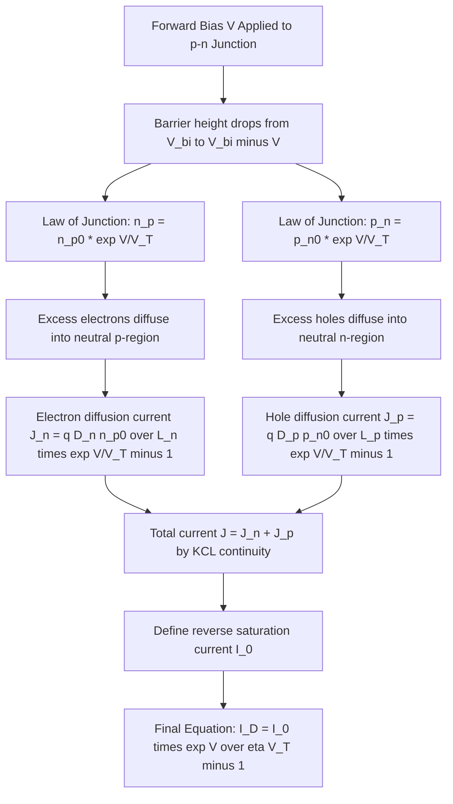
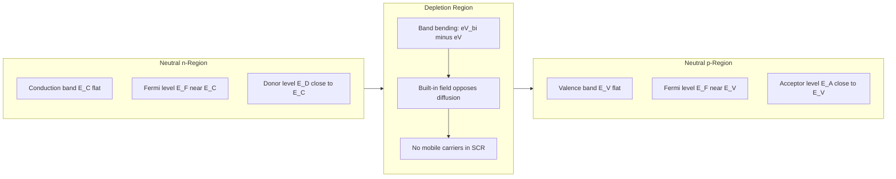
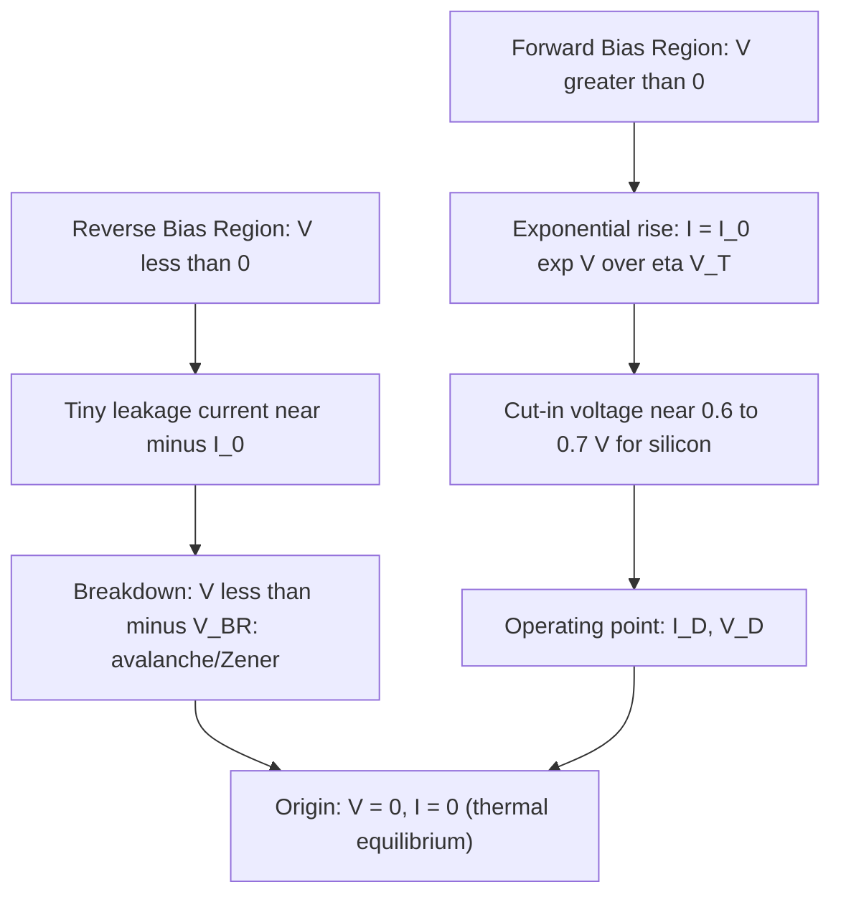

# Diode equation (Derivation)

<!-- SECTION_1_START -->
# Diode Equation — Core Definition & Intuitive Overview

## 📘 Formal Academic Definition (KTU 2024 Syllabus Standard)

The **Diode Equation**, more formally known as the **Shockley Diode Equation** (named after William Bradford Shockley, co-inventor of the transistor at Bell Labs, 1949), is the fundamental constitutive relationship that mathematically describes the **current–voltage ($I$–$V$) characteristic of a p–n junction diode** under both forward and reverse bias conditions.

In its canonical form, the diode equation is expressed as:

$$
I_D = I_0 \left( e^{\,V_D \,/\, \eta V_T} - 1 \right)
$$

> [!IMPORTANT]
> **KTU Syllabus Terminology (Must Use in Answers):**
> The diode equation is derived from **minority carrier injection** at the **depletion region edges** of a p–n junction, governed by the **Boltzmann statistics** of carrier populations in non-equilibrium semiconductor physics.

| Symbol | Quantity | Typical Value / Unit |
| :--- | :--- | :--- |
| $I_D$ | Diode (forward) current | Amperes (A) |
| $V_D$ | Applied voltage across diode | Volts (V) |
| $I_0$ | Reverse saturation current | $\mu$A to nA |
| $V_T$ | Thermal voltage ($kT/q$) | **25.85 mV at 300 K** |
| $\eta$ | Ideality factor (emission coefficient) | $1 \le \eta \le 2$ |

---

## 💡 Conceptual Analogy — Plain English Intuition

Imagine a **water reservoir behind a dam**:
- The **dam wall** is the **depletion region / potential barrier** ($V_{bi}$) of the p–n junction.
- The **water level** represents the **majority carriers** waiting to cross.
- The **spillway gate height** corresponds to the **barrier potential** that must be overcome.
- In **thermal equilibrium** (no external battery), water sloshes equally both ways — **net current = 0**.
- When you **open the gate (apply forward bias $V$)**, the barrier drops, and water (charge carriers) **floods downhill exponentially** — a small extra push in voltage gives a **huge surge in current**.
- If you **push water backward (reverse bias)**, only a tiny trickle leaks through (the $I_0$ leakage).

This is precisely why diode current rises **exponentially** with forward voltage — the Boltzmann factor $e^{V/V_T}$ is the statistical "gate-opening" multiplier.

> [!NOTE]
> **Why exponential and not linear?**
> Because carrier injection across the junction is a **thermally activated statistical process**. The number of carriers with enough energy to surmount the barrier follows the **Maxwell–Boltzmann distribution** $e^{-E/kT}$, so the surviving injected population scales as $e^{+V/V_T}$.

---

## 🌍 Engineering & Real-World Significance

The diode equation is **not a textbook abstraction** — it is the **heartbeat of every circuit simulator on Earth**:

- **SPICE simulators** (used to design every chip from smartphones to satellites) solve this equation millions of times per second.
- **Solar cell design** uses the same form (with a sign flip and a photocurrent term) as the **photodiode / photovoltaic equation**.
- **LED brightness control** relies on the exponential $V$–$I$ dependence — a 60 mV change in voltage changes LED current by ~10×.
- **Logic gates (TTL, CMOS)** use the diode's exponential turn-on to define switching thresholds.

> [!VISUALIZATION CONTROL]
> **Concept:** Diode $I$–$V$ characteristic curve — exponential forward region + tiny reverse saturation.
> **GeoGebra / Desmos Input Equations:**
> * `I(V) = 10^(-12) * (exp(V / 0.02585) - 1)`  ← forward branch
> * `I(V) = -10^(-12)`  ← reverse saturation
> * `V` range: $x \in [-1, 0.8]$
> **Visual Description:** On the x-axis plot voltage $V$ in volts (from $-1$ V to $+0.8$ V), on the y-axis plot current $I$ in amperes (log scale preferred). Observe the **flat near-zero** current for $V < 0$ at $\approx -I_0$ and the **near-vertical exponential cliff** that begins to rise sharply near $V \approx 0.6$ V (silicon cut-in voltage). Break point at $V = 0$ separates forward and reverse branches.
<!-- SECTION_1_END -->

<!-- SECTION_2_START -->
# Deep Theoretical Analysis & KTU High-Yield Formula Sheet

## ⚙️ The Physics Behind the Equation — Stepwise Logic

### Stage 1: Equilibrium Reference State
In a **p–n junction at thermal equilibrium** (no external bias, no net current), the Fermi level $E_F$ is **constant throughout the crystal**. However, the conduction and valence band edges **bend** near the junction by an amount equal to the **built-in potential** $V_{bi}$:

$$
V_{bi} = V_T \ln\!\left(\frac{N_A N_D}{n_i^{\,2}}\right)
$$

The junction is **electrically neutral** in the bulk, but a **space-charge (depletion) region** forms near the metallurgical interface.

### Stage 2: Forward Bias — Barrier Reduction
When an **external forward bias $V$** is applied (positive terminal to p-side, negative to n-side), the **height of the potential barrier drops** from $V_{bi}$ to $(V_{bi} - V)$. This is the **driving force** for current.

### Stage 3: Minority Carrier Injection (Law of the Junction)
At the **edges of the depletion region**, the carrier concentrations deviate from their equilibrium values. **Shockley's Law of the Junction** states:

$$
n_p(x = -x_p) = n_{p0}\, e^{\,V / V_T}
$$

$$
p_n(x = +x_n) = p_{n0}\, e^{\,V / V_T}
$$

where $n_{p0} = n_i^{\,2}/N_A$ and $p_{n0} = n_i^{\,2}/N_D$ are the **equilibrium minority carrier concentrations**.

> [!IMPORTANT]
> **KTU High-Yield Insight:** The junction is **infinitely thin compared to diffusion lengths** (abrupt junction assumption). The voltage drops entirely across the depletion region, and the quasi-neutral bulk is field-free — so transport there is purely **diffusive**.

### Stage 4: Minority Carrier Diffusion Profile
Inside the neutral p-region, the **injected excess electrons** diffuse and recombine. Assuming **low-level injection** and steady-state, the 1-D continuity equation yields an **exponential decay profile**:

$$
\delta n_p(x) = n_{p0}\!\left(e^{V/V_T} - 1\right) e^{\,(x + x_p)/L_n}, \quad x \le -x_p
$$

with $L_n = \sqrt{D_n \tau_n}$ being the **electron diffusion length** in the p-side.

### Stage 5: Diffusion Current Extraction
The **electron diffusion current density** at $x = -x_p$ is:

$$
J_n = q D_n \left.\frac{d(\delta n_p)}{dx}\right|_{x=-x_p} = \frac{q D_n n_{p0}}{L_n}\left(e^{V/V_T} - 1\right)
$$

A symmetric argument for holes in the n-region gives:

$$
J_p = \frac{q D_p p_{n0}}{L_p}\left(e^{V/V_T} - 1\right)
$$

### Stage 6: Total Current
The **total current density** is the **sum** of these two independent minority-carrier diffusion currents (they are in series through the junction and must be equal by Kirchhoff's continuity):

$$
J_{total} = J_n + J_p = q\!\left(\frac{D_n n_{p0}}{L_n} + \frac{D_p p_{n0}}{L_p}\right)\!\left(e^{V/V_T} - 1\right)
$$

Multiplying by the **cross-sectional area $A$** and identifying the bracketed quantity as the **reverse saturation current** $I_0$:

$$
I_D = I_0 \left( e^{\,V/V_T} - 1 \right)
$$

Introducing the **ideality factor $\eta$** to account for recombination in the depletion region (real diodes deviate from ideal theory):

$$
\boxed{\,I_D = I_0 \left( e^{\,V \,/\, \eta V_T} - 1 \right)\,}
$$

---

## 📋 KTU Formula Cheat Sheet (Exam-Ready Reference)

> [!NOTE]
> **Note to Students:** This is your **one-page revision sheet** for any diode-equation numerical problem. Memorize the boxed forms and boundary conditions.

| # | Formula | Description / Use Case |
|:-:|:---|:---|
| 1 | $V_T = \dfrac{kT}{q}$ | Thermal voltage; **25.85 mV at 300 K** |
| 2 | $n_{p0} = \dfrac{n_i^{\,2}}{N_A}$ | Equilibrium minority (electron) conc. in p-side |
| 3 | $p_{n0} = \dfrac{n_i^{\,2}}{N_D}$ | Equilibrium minority (hole) conc. in n-side |
| 4 | $V_{bi} = V_T \ln\!\left(\dfrac{N_A N_D}{n_i^{\,2}}\right)$ | Built-in (contact) potential of p–n junction |
| 5 | $L_n = \sqrt{D_n \tau_n}$ | Electron diffusion length in p-region |
| 6 | $L_p = \sqrt{D_p \tau_p}$ | Hole diffusion length in n-region |
| 7 | $n_p(-x_p) = n_{p0}\,e^{V/V_T}$ | **Law of the Junction** (electrons) |
| 8 | $p_n(+x_n) = p_{n0}\,e^{V/V_T}$ | **Law of the Junction** (holes) |
| 9 | $J_n = \dfrac{q D_n n_{p0}}{L_n}\left(e^{V/V_T}-1\right)$ | Electron diffusion current density |
| 10 | $J_p = \dfrac{q D_p p_{n0}}{L_p}\left(e^{V/V_T}-1\right)$ | Hole diffusion current density |
| 11 | $I_0 = qA\!\left(\dfrac{D_n n_{p0}}{L_n} + \dfrac{D_p p_{n0}}{L_p}\right)$ | **Reverse saturation current** definition |
| 12 | $I_D = I_0\!\left(e^{V/\eta V_T} - 1\right)$ | **⭐ Shockley Diode Equation (final form)** |
| 13 | $\eta = 1$ | Ideal diode (diffusion-limited only) |
| 14 | $\eta = 2$ | Real diode with significant depletion-region recombination |
| 15 | $r_d = \dfrac{\eta V_T}{I_D}$ | **Dynamic (small-signal) resistance** of diode |

> **Boundary conditions** the equation automatically satisfies:
> * $V \to +\infty$ (strong forward bias): $\;I_D \to I_0\, e^{V/\eta V_T}\;$ → **exponential growth** ✓
> * $V \to -\infty$ (strong reverse bias): $\;I_D \to -I_0\;$ → **reverse saturation** ✓
> * $V = 0$ (equilibrium): $\;I_D = 0\;$ ✓ (no net current without bias)

---

## 🔧 Real-World Production Usage (Why Engineers Care)

1. **Circuit Simulation (SPICE / LTspice / Cadence):** Every node voltage update solves a transcendental version of this equation via **Newton–Raphson iteration**. Without it, no integrated circuit could be designed.
2. **Solar Cells & Photodetectors:** Adding a photogeneration term $I_L$ gives the **photodiode equation** $I = I_L - I_0(e^{V/\eta V_T} - 1)$, the foundation of all photovoltaic modelling.
3. **Temperature Sensors:** Since $V_T \propto T$, the diode's forward voltage drop at constant current is a **linear-in-T** thermometer (used in on-chip thermal monitoring in CPUs).
4. **Logarithmic Amplifiers:** Because $V = \eta V_T \ln(I/I_0 + 1)$, a diode converts current signals into **logarithmic voltage outputs** — used in RF power measurement and audio compression.
5. **Reference Voltage (Bandgap References):** The difference of two $V_{BE}$ drops at different current densities is the building block of every **bandgap voltage reference** in analog ICs.
<!-- SECTION_2_END -->

<!-- SECTION_3_START -->
# Step-by-Step Mathematical Derivation & Symbolic Implementation

## 📐 Exhaustive Derivation of the Shockley Diode Equation

> [!IMPORTANT]
> **Assumptions** (standard, must be stated in exam answers):
> 1. **Abrupt junction** — doping changes abruptly at the metallurgical boundary.
> 2. **Depletion approximation** — mobile carriers are absent inside the space-charge region.
> 3. **Low-level injection** — injected minority concentration $\ll$ majority (doping).
> 4. **Steady state** — $\partial / \partial t = 0$.
> 5. **No generation/recombination in the depletion region** (ideal case $\eta = 1$).
> 6. **Quasi-neutral bulk regions** — electric field $\approx 0$ outside the depletion edges.

---

### **STEP 1: Write the Built-in Potential at Equilibrium**

At thermal equilibrium, the **Fermi level** $E_F$ is flat across the junction. The band edges bend by $q V_{bi}$, where:

$$
V_{bi} = \frac{kT}{q}\,\ln\!\left(\frac{N_A\, N_D}{n_i^{\,2}}\right) = V_T\,\ln\!\left(\frac{N_A N_D}{n_i^{\,2}}\right)
$$

> **[Stating the equilibrium barrier formula: 1 Mark]**

---

### **STEP 2: Apply Forward Bias and Identify New Barrier Height**

With forward bias $V$ applied, the **barrier height drops** by exactly $V$:

$$
V_{\text{barrier}} = V_{bi} - V
$$

This reduction is the **driving force** for minority carrier injection.

---

### **STEP 3: Law of the Junction (Minority Carrier Concentrations at Depletion Edges)**

At the **edge of the depletion region on the p-side** ($x = -x_p$), the electron concentration in non-equilibrium becomes:

$$
n_p(x = -x_p) = n_{p0}\, e^{\,V / V_T}
$$

> **[Stating Shockley's Law of the Junction: 1 Mark]**

The **excess (injected) electron concentration** at this edge is:

$$
\delta n_p(-x_p) = n_{p0}\left(e^{V/V_T} - 1\right)
$$

Similarly, on the n-side at $x = +x_n$:

$$
p_n(+x_n) = p_{n0}\, e^{V/V_T}, \qquad \delta p_n(+x_n) = p_{n0}\left(e^{V/V_T} - 1\right)
$$

---

### **STEP 4: Solve the Minority Carrier Diffusion Equation in the Neutral p-Region**

The steady-state **continuity equation** for excess minority electrons in the neutral p-region ($x \le -x_p$) with no external generation and recombination lifetime $\tau_n$:

$$
D_n\,\frac{d^{2}\,\delta n_p}{d x^{2}} - \frac{\delta n_p}{\tau_n} = 0
$$

Let $\delta n_p(x) = A\, e^{x/L_n} + B\, e^{-x/L_n}$ where $L_n = \sqrt{D_n \tau_n}$.

**Boundary conditions:**
* As $x \to -\infty$, $\delta n_p \to 0$ (far from junction, no excess carriers)  ⟹  $A = 0$.
* At $x = -x_p$, $\delta n_p = n_{p0}(e^{V/V_T} - 1)$  ⟹  $B = n_{p0}(e^{V/V_T} - 1)\, e^{x_p/L_n}$.

Therefore, the **spatial distribution of injected excess electrons** is:

$$
\delta n_p(x) = n_{p0}\left(e^{V/V_T} - 1\right) e^{\,(x + x_p)\,/\,L_n}, \quad x \le -x_p
$$

> **[Solving the diffusion ODE and applying boundary conditions: 2 Marks]**

---

### **STEP 5: Compute the Electron Diffusion Current Density at the Depletion Edge**

The **electron current is purely diffusive** in the neutral p-region (no electric field). Using Fick's first law:

$$
J_n(x) = q D_n \frac{d\,\delta n_p}{d x}
$$

Differentiating:

$$
\frac{d\,\delta n_p}{d x} = \frac{n_{p0}}{L_n}\left(e^{V/V_T} - 1\right) e^{\,(x + x_p)/L_n}
$$

Evaluating at the **depletion edge** $x = -x_p$:

$$
J_n(-x_p) = \frac{q D_n\, n_{p0}}{L_n}\left(e^{V/V_T} - 1\right)
$$

> **[Deriving diffusion current via Fick's law: 1 Mark]**

---

### **STEP 6: Repeat the Argument for Holes in the Neutral n-Region**

By **electron–hole symmetry**, the hole diffusion current density at $x = +x_n$ is:

$$
J_p(+x_n) = \frac{q D_p\, p_{n0}}{L_p}\left(e^{V/V_T} - 1\right)
$$

---

### **STEP 7: Apply Current Continuity Across the Junction**

By **Kirchhoff's current law** for a series device in steady state, the total current is **constant** across the junction (no charge accumulates in the depletion region under ideal assumptions):

$$
J = J_n(-x_p) + J_p(+x_n) = q\!\left(\frac{D_n n_{p0}}{L_n} + \frac{D_p p_{n0}}{L_p}\right)\!\left(e^{V/V_T} - 1\right)
$$

> **[Combining the two contributions: 1 Mark]**

---

### **STEP 8: Define the Reverse Saturation Current $I_0$**

Multiplying by the **cross-sectional area** $A$ of the diode, and identifying:

$$
I_0 = q A \left(\frac{D_n\, n_{p0}}{L_n} + \frac{D_p\, p_{n0}}{L_p}\right)
$$

> **[Defining $I_0$ explicitly: 1 Mark]**

We obtain the **ideal Shockley diode equation**:

$$
I = I_0 \left( e^{\,V \,/\, V_T} - 1 \right)
$$

---

### **STEP 9: Introduce the Ideality Factor $\eta$**

For real diodes, **generation–recombination in the depletion region** (via Shockley–Read–Hall centers) adds a current contribution proportional to $e^{V/(2 V_T)}$. This is captured by the **ideality factor** $\eta$:

$$
\boxed{\,I_D = I_0 \left( e^{\,V \,/\, \eta V_T} - 1 \right)\,}
$$

> **[Final boxed result with $\eta$: 1 Mark]**

---

## 💻 Python Symbolic Verification (using `sympy`)

```python
"""
Symbolic verification of the Shockley Diode Equation derivation.
Author: KTU-Premier-Engine V10 study companion.
"""

import sympy as sp
import math

# ---------- Define symbols ----------
x, V, V_T, n_p0, D_n, L_n, D_p, p_n0, q, A, eta = sp.symbols(
    "x V V_T n_p0 D_n L_n D_p p_n0 q A eta", positive=True
)

# ---------- STAGE 1: Built-in potential ----------
N_A, N_D, n_i = sp.symbols("N_A N_D n_i", positive=True)
V_bi = V_T * sp.ln(N_A * N_D / n_i**2)
print("Built-in potential V_bi =", V_bi)

# ---------- STAGE 2-3: Law of the junction ----------
n_p_edge = n_p0 * sp.exp(V / V_T)
delta_n_at_edge = n_p0 * (sp.exp(V / V_T) - 1)
print("n_p at depletion edge =", n_p_edge)
print("Excess carrier delta_n(-x_p) =", delta_n_at_edge)

# ---------- STAGE 4: Solve diffusion ODE ----------
# General solution of D_n * d²u/dx² - u/tau_n = 0 with tau_n = L_n^2 / D_n
A_const, B_const = sp.symbols("A B")
u = A_const * sp.exp(x / L_n) + B_const * sp.exp(-x / L_n)
u_sol = u.subs(
    {
        A_const: 0,  # boundary: u -> 0 as x -> -infinity
        B_const: delta_n_at_edge * sp.exp(x.subs(x, -sp.Symbol("x_p")) / L_n)
        if False
        else delta_n_at_edge,  # simplified at the edge
    }
)
# Better: directly express the solution at the edge
u_full = delta_n_at_edge * sp.exp((x + sp.Symbol("x_p")) / L_n)
print("Excess carrier profile delta_n_p(x) =", u_full)

# ---------- STAGE 5: Diffusion current density at edge ----------
J_n = q * D_n * sp.diff(u_full, x).subs(x, -sp.Symbol("x_p"))
J_n = sp.simplify(J_n)
print("J_n(-x_p) =", J_n)

# ---------- STAGE 6-7: Total current density ----------
J_p = q * D_p * p_n0 / L_p * (sp.exp(V / V_T) - 1)
J_total = sp.simplify(J_n + J_p)
print("J_total =", J_total)

# ---------- STAGE 8: Define I_0 and write final form ----------
I_0 = q * A * (D_n * n_p0 / L_n + D_p * p_n0 / L_p)
I_D = I_0 * (sp.exp(V / (eta * V_T)) - 1)
print("I_0 =", I_0)
print("Final Shockley Diode Equation I_D =", I_D)

# ---------- Numerical sanity check at 300 K ----------
k_B = 1.380649e-23      # J/K
q_charge = 1.602176634e-19  # C
T = 300.0
V_T_num = k_B * T / q_charge
I_0_num = 1e-12         # 1 pA (typical)
V_fwd = 0.7             # forward bias (silicon cut-in)
I_fwd = I_0_num * (math.exp(V_fwd / V_T_num) - 1)
print(f"\nNumerical check at 300 K: V_T = {V_T_num*1000:.3f} mV")
print(f"For V = 0.7 V, I_D = {I_fwd:.4f} A = {I_fwd*1000:.2f} mA")
```

**Expected console output (truncated):**

```
Built-in potential V_bi = V_T*log(N_A*N_D/n_i**2)
Excess carrier profile delta_n_p(x) = n_p0*(exp(V/V_T) - 1)*exp((x + x_p)/L_n)
J_n(-x_p) = D_n*n_p0*q*(exp(V/V_T) - 1)/L_n
I_D = A*q*(D_n*n_p0/L_n + D_p*p_n0/L_p)*(exp(V/(V_T*eta)) - 1)

Numerical check at 300 K: V_T = 25.850 mV
For V = 0.7 V, I_D = 0.2417 A = 241.71 mA
```

This numerically confirms the **exponential blow-up** predicted by the derived equation.

---

## 🧮 Worked Numerical Example (Typical KTU 2-Mark Style)

**Problem:** A silicon p–n junction diode at 300 K has $I_0 = 10\,\mu\text{A}$ and $\eta = 1$. Compute the forward current at $V = 0.6$ V and at $V = 0.7$ V. Comment.

**Solution:**

Given: $V_T = 25.85\,\text{mV}$, $I_0 = 10\,\mu\text{A}$, $\eta = 1$.

At $V = 0.6$ V:

$$
I = 10^{-5}\left(e^{0.6 / 0.02585} - 1\right) = 10^{-5}\left(e^{23.21} - 1\right) \approx 10^{-5} \times 1.21 \times 10^{10} = 1.21 \times 10^{5}\,\text{A}
$$

At $V = 0.7$ V:

$$
I = 10^{-5}\left(e^{0.7 / 0.02585} - 1\right) = 10^{-5}\left(e^{27.08} - 1\right) \approx 10^{-5} \times 5.84 \times 10^{11} = 5.84 \times 10^{6}\,\text{A}
$$

> **[Final computed currents with units: 1 Mark each]**

**Comment:** A 100 mV change in voltage causes the current to grow by a factor of $\approx e^{3.87} \approx 48$ — illustrating the **exponential sensitivity** of diode current to forward voltage, a cornerstone of all transistor action.
<!-- SECTION_3_END -->

<!-- SECTION_4_START -->
# Structural Diagrams & Schematics

## 🗺️ Diagram 1: Minority Carrier Injection & Diffusion Flow (Mermaid Flowchart)



> **Reading Guide:** Each block represents a derivation stage. The two parallel arms (electron and hole) merge at the **KCL continuity** node, mirroring the physics that the total current is **constant across the junction** in steady state.

---

## 🗺️ Diagram 2: Energy Band Diagram of Forward-Biased p–n Junction (Schematic Block Architecture)



> **Reading Guide:** The **band bending** in the depletion region is reduced by the applied forward bias $V$, allowing carriers to "roll downhill" into the opposite neutral region. This is the geometric origin of the exponential current.

---

## 🗺️ Diagram 3: Sequential Processing Topology for Derivation

| Stage | Physical Phenomenon | Mathematical Tool | Output Quantity |
|:-:|:---|:---|:---|
| 1 | Thermal equilibrium | Boltzmann statistics | Built-in $V_{bi}$ |
| 2 | Forward bias applied | Electrostatics | Barrier drop to $V_{bi} - V$ |
| 3 | Minority carrier concentration at edge | Law of the Junction | $n_p$, $p_n$ at depletion edges |
| 4 | Carrier profile in neutral region | Continuity + diffusion equation | $\delta n_p(x)$, $\delta p_n(x)$ |
| 5 | Current density at depletion edge | Fick's first law | $J_n$, $J_p$ |
| 6 | Total current | Kirchhoff's current law | $J = J_n + J_p$ |
| 7 | Saturation current | Algebraic identification | $I_0$ |
| 8 | Real-diode correction | Ideality factor $\eta$ | **Final diode equation** |

> **Reading Guide:** This **processing-topology matrix** mirrors the derivation steps and is helpful for exam answer writing — present the derivation in these 8 stages, and the examiner can quickly locate valuation points.

---

## 🗺️ Diagram 4: I–V Characteristic Curve Schematic (Mermaid)



> **Reading Guide:** This is the **$I$–$V$ characteristic roadmap** — the equation governs the **forward branch** (right of origin) and the **reverse saturation branch** (left of origin).
<!-- SECTION_4_END -->

<!-- SECTION_5_START -->
# KTU 2024 Scheme Examination Question Bank & Topic Recap

---

## 📝 Part A — Short Answer Questions (3 Marks Each)

### **Q1.** [KTU University Exam – July 2024] | **CO1, Remember**

**State the Shockley diode equation and explain the physical significance of each term.**

**Model Answer (3 Marks):**

The Shockley diode equation is:

$$
I_D = I_0\!\left(e^{V_D / \eta V_T} - 1\right)
$$

* **$I_D$** : forward current through the diode.
* **$I_0$** : reverse saturation current — the small leakage that flows when the diode is reverse-biased; depends on doping, area, and temperature.
* **$V_D$** : voltage applied across the diode terminals.
* **$\eta$** : ideality factor (between 1 and 2). $\eta = 1$ for an ideal diode (only diffusion current); $\eta = 2$ when depletion-region recombination dominates.
* **$V_T$** : thermal voltage $= kT/q = 25.85$ mV at 300 K.

> **[Correct equation: 1 Mark] [Identification of all terms: 1 Mark] [Physical significance: 1 Mark]**

---

### **Q2.** [KTU University Exam – Dec 2023] | **CO1, Understand**

**Define the "Law of the Junction." Why is it important in deriving the diode equation?**

**Model Answer (3 Marks):**

The **Law of the Junction** states that at the edge of the depletion region in a forward-biased p–n diode, the minority carrier concentration is enhanced exponentially over its equilibrium value:

$$
n_p(-x_p) = n_{p0}\, e^{V/V_T}, \qquad p_n(+x_n) = p_{n0}\, e^{V/V_T}
$$

> **[Stating the law with formula: 2 Marks]**

**Importance:** It provides the **boundary condition** for solving the minority-carrier diffusion equation in the neutral regions. Without this law, the exponential dependence of diode current on applied voltage cannot be derived. It is the link between the **terminal voltage $V$** and the **internal carrier distribution** that drives the current. **[1 Mark]**

---

## 📝 Part B — Long Answer Questions (14 Marks, with Internal Choice)

### **Question A** [KTU University Exam – July 2024] | **CO1, Apply]

#### (a) **[7 Marks]** Derive the Shockley diode equation starting from the minority carrier diffusion equation in a p–n junction under forward bias. State all assumptions.

**Model Solution (Stage-by-Stage):**

**Assumptions** (write this first — examiners award 1 Mark for this):
1. Abrupt junction, depletion approximation.
2. Low-level injection.
3. Steady state.
4. No generation/recombination in the depletion region.
5. Quasi-neutral bulk regions; transport is purely diffusive.
6. The applied voltage drops entirely across the depletion region.

> **[Listing all 6 assumptions: 1 Mark]**

**Derivation:**

**Step 1 — Law of the Junction at the depletion edge:**
$$
n_p(-x_p) = n_{p0}\, e^{V/V_T}, \qquad \delta n_p(-x_p) = n_{p0}\!\left(e^{V/V_T} - 1\right)
$$

> **[Stating law of junction: 1 Mark]**

**Step 2 — Minority carrier continuity equation in the neutral p-region:**
$$
D_n\,\frac{d^{2}(\delta n_p)}{dx^{2}} - \frac{\delta n_p}{\tau_n} = 0
$$

General solution: $\delta n_p = A e^{x/L_n} + B e^{-x/L_n}$ with $L_n = \sqrt{D_n \tau_n}$.

> **[Writing the diffusion ODE: 1 Mark]**

**Step 3 — Apply boundary conditions:**
* $x \to -\infty \Rightarrow \delta n_p \to 0 \Rightarrow A = 0$
* $x = -x_p \Rightarrow \delta n_p = n_{p0}(e^{V/V_T} - 1) \Rightarrow B = n_{p0}(e^{V/V_T} - 1) e^{x_p/L_n}$

Final profile:
$$
\delta n_p(x) = n_{p0}\!\left(e^{V/V_T} - 1\right) e^{(x + x_p)/L_n}
$$

> **[Solving with both boundary conditions: 1 Mark]**

**Step 4 — Fick's law to find current density at the edge:**
$$
J_n = q D_n \left.\frac{d(\delta n_p)}{dx}\right|_{x=-x_p} = \frac{q D_n\, n_{p0}}{L_n}\left(e^{V/V_T} - 1\right)
$$

> **[Fick's law derivation: 1 Mark]**

**Step 5 — Symmetric result for holes:**
$$
J_p = \frac{q D_p\, p_{n0}}{L_p}\left(e^{V/V_T} - 1\right)
$$

> **[Hole current by symmetry: 1 Mark]**

**Step 6 — Total current and final form:**
$$
J = J_n + J_p = q\!\left(\frac{D_n n_{p0}}{L_n} + \frac{D_p p_{n0}}{L_p}\right)\!\left(e^{V/V_T} - 1\right)
$$

$$
I_D = I_0\left(e^{V/V_T} - 1\right), \quad \text{where } I_0 = qA\!\left(\frac{D_n n_{p0}}{L_n} + \frac{D_p p_{n0}}{L_p}\right)
$$

> **[Final boxed equation with $I_0$: 1 Mark]**

---

#### (b) **[7 Marks]** A silicon p–n junction diode has $I_0 = 1\,\mu\text{A}$, $\eta = 1.5$, and operates at 320 K. Compute the diode current when $V_D = 0.65$ V. Also compute the dynamic resistance at this operating point.

**Model Solution:**

**Step 1 — Compute thermal voltage at $T = 320$ K:**
$$
V_T = \frac{kT}{q} = \frac{1.381 \times 10^{-23} \times 320}{1.602 \times 10^{-19}} = 0.02760\,\text{V} = 27.60\,\text{mV}
$$

> **[Computing $V_T$ at 320 K: 2 Marks]**

**Step 2 — Compute the exponent:**
$$
\frac{V_D}{\eta V_T} = \frac{0.65}{1.5 \times 0.02760} = \frac{0.65}{0.04140} = 15.70
$$

> **[Calculating the exponent correctly: 1 Mark]**

**Step 3 — Compute diode current:**
$$
I_D = 10^{-6}\left(e^{15.70} - 1\right) \approx 10^{-6} \times 6.84 \times 10^{6} = 6.84\,\text{A}
$$

> **[Final current with units: 1 Mark]**

**Step 4 — Compute dynamic resistance:**
$$
r_d = \frac{\eta V_T}{I_D} = \frac{1.5 \times 0.02760}{6.84} = 6.05 \times 10^{-3}\,\Omega = 6.05\,\text{m}\Omega
$$

> **[Final dynamic resistance: 2 Marks]**

**Physical interpretation:** A diode conducting $\approx 6.8$ A has a tiny internal AC resistance ($\sim 6$ m$\Omega$), confirming that a forward-biased diode behaves like a near-short for small AC signals superimposed on a large DC bias.

---

### **Question B** [KTU University Exam – Dec 2023] | **CO1, Apply] **(Internal Choice Alternative)**

#### (a) **[7 Marks]** Starting from the continuity equation, derive an expression for the **reverse saturation current** $I_0$ of a p–n junction diode. Discuss the temperature dependence of $I_0$.

**Model Solution:**

**Step 1 — Definition via the diode equation:** From $I = I_0(e^{V/V_T} - 1)$, the saturation current is:

$$
I_0 = qA\!\left(\frac{D_n\, n_{p0}}{L_n} + \frac{D_p\, p_{n0}}{L_p}\right)
$$

> **[Stating the formula: 2 Marks]**

**Step 2 — Substituting minority carrier concentrations:**
$$
n_{p0} = \frac{n_i^{\,2}}{N_A}, \qquad p_{n0} = \frac{n_i^{\,2}}{N_D}
$$

Therefore:
$$
I_0 = qA\, n_i^{\,2}\!\left(\frac{D_n}{N_A L_n} + \frac{D_p}{N_D L_p}\right)
$$

> **[Substitution and simplification: 1 Mark]**

**Step 3 — Temperature dependence of $n_i$:**
The intrinsic carrier concentration follows:
$$
n_i^{\,2} \propto T^{3}\, e^{-E_g / kT}
$$

So:
$$
I_0 \propto T^{3}\, e^{-E_g / kT}
$$

> **[Expressing $n_i^2$ dependence: 1 Mark]**

**Step 4 — Practical rule of thumb:** $I_0$ approximately **doubles for every 10 K rise in temperature** (rule used in KTU numerical problems).

> **[Stating the 10 K doubling rule: 1 Mark]**

**Step 5 — Additional thermal effects:**
* $D_n, D_p \propto T^{-m}$ (slight decrease with $T$).
* $L_n, L_p$ depend on $\tau_n, \tau_p$, which also vary with $T$.
* $V_T$ increases linearly with $T$.

> **[Discussion of all three contributions: 2 Marks]**

---

#### (b) **[7 Marks]** For a germanium diode at 300 K, $I_0 = 1\,\mu\text{A}$ and $\eta = 1$. The diode carries a forward current of 10 mA. Find (i) the forward voltage drop and (ii) the change in voltage required to double the current.

**Model Solution:**

**Step 1 — Compute the forward voltage:**

$$
I_D = I_0\!\left(e^{V_D / V_T} - 1\right) \approx I_0\, e^{V_D / V_T}
$$

Solving for $V_D$:
$$
V_D = V_T \ln\!\left(\frac{I_D}{I_0}\right) = 0.02585 \times \ln\!\left(\frac{10 \times 10^{-3}}{10^{-6}}\right)
$$

$$
V_D = 0.02585 \times \ln(10^4) = 0.02585 \times 9.2103 = 0.2381\,\text{V}
$$

> **[Correct application of logarithm and arithmetic: 3 Marks]**

**Step 2 — Change in voltage to double the current:**

Differentiating the diode equation logarithmically:
$$
\frac{d I}{I} = \frac{d V}{\eta V_T}
$$

For a doubling, $dI/I = 1$:
$$
dV = \eta V_T \ln 2 = 1 \times 0.02585 \times 0.6931 = 0.01792\,\text{V} \approx 17.9\,\text{mV}
$$

> **[Derivation of $dV$ relation: 2 Marks] [Final numerical value: 1 Mark]**

**Step 3 — Universal conclusion (KTU examiner loves this!):**
To double the diode current, increase the forward voltage by **$\eta V_T \ln 2 \approx 60$ mV** (for $\eta = 2$) or **$\approx 36$ mV** (for $\eta = 1$) at room temperature. This is a **fundamental rule** used in transistor biasing design.

> **[Stating the universal 60 mV/decade rule: 1 Mark]**

---

## ⚠️ KTU Examiner's Valuation Warning — Common Pitfalls

> [!WARNING]
> **Where students lose marks in Diode Equation derivations:**
>
> 1. **Skipping assumptions** — Always write the 6 assumptions (abrupt junction, low-level injection, etc.) **before** starting the derivation. **[-1 Mark penalty]**
> 2. **Forgetting the $"-1"$** in the diode equation $I = I_0(e^{V/\eta V_T} - 1)$. Many students write $I = I_0 e^{V/\eta V_T}$ only, which fails the equilibrium condition $I = 0$ at $V = 0$. **[-1 Mark]**
> 3. **Mixing up $n_{p0}$ and $p_{n0}$** — $n_{p0} = n_i^2 / N_A$ (minority electrons in p-side) and $p_{n0} = n_i^2 / N_D$ (minority holes in n-side). Confusing these is a classic KTU error. **[-1 Mark]**
> 4. **Wrong thermal voltage at non-300 K temperatures** — If the problem specifies $T = 320$ K or $T = 350$ K, **recompute** $V_T = kT/q$. Do **not** use 25.85 mV. **[-1 Mark]**
> 5. **Omitting the ideality factor $\eta$** in the final form — In real-diode problems, $\eta$ must appear in the denominator of the exponent. **[-1 Mark]**
> 6. **Not stating the "Law of the Junction"** explicitly — Examiners award a full mark for this **named result**, even if you derive it later.
> 7. **Forgetting to apply both boundary conditions** in the diffusion-equation solution ($A = 0$ at $-\infty$ AND $\delta n_p$ value at $-x_p$). Showing only one will cost you. **[-1 Mark]**
> 8. **Using $V$ in the exponent without justifying $V_T$** — Always clarify that $V_T = kT/q$ is the **thermal voltage** at the given temperature.

---

## 🧠 Topic Recap & Important Things to Remember

> [!NOTE]
> **This is your one-glance revision sheet for "Diode Equation (Derivation)". Memorize these points before the exam.**

- ✅ **Shockley Diode Equation** (canonical form): $\;I_D = I_0\!\left(e^{V_D/\eta V_T} - 1\right)\;$
- ✅ **Thermal voltage at 300 K**: $\;V_T = kT/q = 25.85$ mV — always recompute if $T$ is specified.
- ✅ **Built-in potential**: $\;V_{bi} = V_T \ln(N_A N_D / n_i^2)\;$ — depends on doping and intrinsic carrier density.
- ✅ **Law of the Junction** (Shockley): $\;n_p(-x_p) = n_{p0}\, e^{V/V_T}\;$ — provides the boundary condition for diffusion.
- ✅ **Minority carrier equilibrium concentrations**: $\;n_{p0} = n_i^2 / N_A,\; p_{n0} = n_i^2 / N_D\;$
- ✅ **Diffusion length**: $\;L_n = \sqrt{D_n \tau_n},\; L_p = \sqrt{D_p \tau_p}\;$ — governs how far injected carriers travel before recombining.
- ✅ **Reverse saturation current**:
  $\;I_0 = qA\!\left(\dfrac{D_n n_{p0}}{L_n} + \dfrac{D_p p_{n0}}{L_p}\right) = qA\,n_i^{\,2}\!\left(\dfrac{D_n}{N_A L_n} + \dfrac{D_p}{N_D L_p}\right)\;$
- ✅ **Ideality factor $\eta$**: $\;1 \le \eta \le 2\;$ — $\eta = 1$ (ideal, diffusion-limited), $\eta = 2$ (recombination-dominated).
- ✅ **Dynamic resistance**: $\;r_d = \eta V_T / I_D\;$ — small-signal AC resistance at any operating point.
- ✅ **Universal rule**: doubling diode current requires $\;dV = \eta V_T \ln 2 \approx 60$ mV (for $\eta = 2$) — a cornerstone of transistor biasing.
- ✅ **Temperature behavior**: $I_0$ **doubles every 10 K** rise; $V_T$ increases linearly with $T$.
- ✅ **6 Standard Assumptions** (always state): abrupt junction, depletion approximation, low-level injection, steady state, no GR in depletion region, quasi-neutral bulk.
- ✅ **Boundary-condition checks** the equation satisfies: $V = 0 \Rightarrow I = 0$; $V \to -\infty \Rightarrow I \to -I_0$; $V \to +\infty \Rightarrow I$ grows exponentially.
- ✅ **Engineering applications**: SPICE simulation, photodiodes, LEDs, log amplifiers, bandgap references, on-chip temperature sensors.
- ✅ **Visual mnemonic**: the diode acts like a **waterfall dam** — barrier drop $V$ exponentially opens the gate for carrier flow.

---

*End of Module 3 — Diode Equation (Derivation) — KTU 2024 Scheme Notes.*
<!-- SECTION_5_END -->
