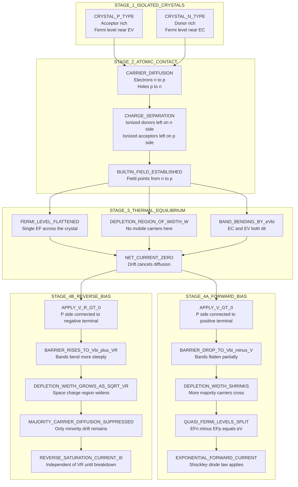
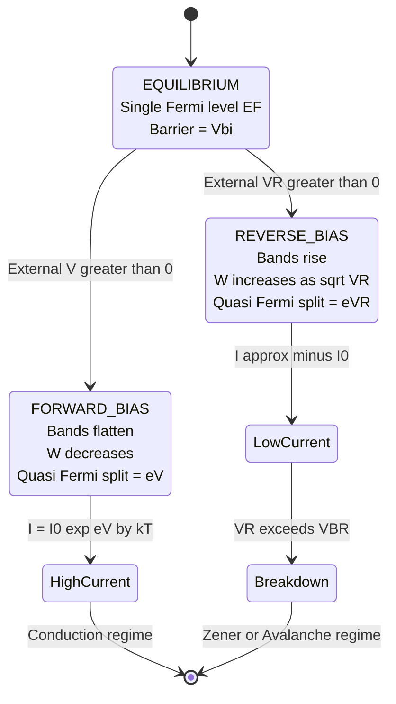

# Energy band diagram of p-n junction - Qualitative description of charge flow across a p-n junction - Forward and reverse biased p-n junctions

<!-- SECTION_1_START -->
# 1. Core Technical Definition & Intuitive Overview

## 1.1 Formal Definition (KTU 2024 Syllabus Terminology)

A **p-n junction** is the fundamental building block of modern semiconductor devices, formed when a p-type semiconductor (excess holes, acceptor concentration $N_A$) is brought into intimate atomic contact with an n-type semiconductor (excess electrons, donor concentration $N_D$) within a single crystal lattice. The **energy band diagram of a p-n junction** is a graphical representation of the spatial variation of the conduction band edge $E_C(x)$, valence band edge $E_V(x)$, intrinsic Fermi level $E_i(x)$, and the equilibrium Fermi level $E_F$ across the junction, plotted as a function of position $x$ measured from the metallurgical interface.

> [!IMPORTANT]
> **KTU 2024 Highlight:** In thermal equilibrium, the Fermi level $E_F$ must remain **constant (flat)** throughout the entire crystal. This single condition is the origin of all band bending, the built-in potential $V_{bi}$, and the depletion region.

The four essential features every KTU examiner expects in the band diagram are:

1. **Band bending** of magnitude $eV_{bi}$ across the depletion region.
2. The conduction band offset $\Delta E_C$ and valence band offset $\Delta E_V$.
3. The continuous, smooth profile of $E_C$ and $E_V$ through the space-charge (depletion) layer.
4. Equal slopes (in magnitude) of the band edges on the p-side and n-side, weighted inversely by the doping concentration.

## 1.2 Conceptual Analogy — The Dam-and-Valve Model

Imagine two connected water tanks kept at different water levels:

| Tank | Represents | Water Level Represents |
| :--- | :--- | :--- |
| Left tank (high water) | n-type region | High $E_C$ (many free electrons) |
| Right tank (low water) | p-type region | Low $E_F$ in valence band (many holes) |
| Connecting pipe with closed valve | Depletion region + built-in field | Barrier $V_{bi}$ |
| Opening valve the natural way | **Forward bias** | Easy current flow |
| Trying to push water uphill | **Reverse bias** | Only tiny leakage current |

Just as water cannot spontaneously flow uphill (energy conservation), electrons cannot flow from the n-side conduction band into the p-side conduction band without external energy. The "valve" is the **built-in electric field** generated by ionized donors and acceptors in the depletion region.

> [!NOTE]
> **Why the bands bend:** When the two materials are joined, electrons from the n-side diffuse into the p-side (and holes vice-versa) until the resulting electric field exactly cancels the diffusion tendency. This equilibrium leaves behind a region of **ionized, immobile dopants** — the depletion region — whose potential profile bends the bands by exactly $eV_{bi}$.

## 1.3 Key Physical Constants and Standard Metrics

| Quantity | Symbol | Standard Value at 300 K |
| :--- | :--- | :--- |
| Boltzmann constant | $k$ (or $k_B$) | $\mathbf{1.38 \times 10^{-23}}\ \mathrm{J/K}$ |
| Thermal voltage | $V_T = kT/e$ | $\mathbf{0.0259\ V} \approx \mathbf{26\ mV}$ |
| Electronic charge | $e$ | $\mathbf{1.602 \times 10^{-19}}\ \mathrm{C}$ |
| Silicon intrinsic carrier density | $n_i$ | $\mathbf{1.5 \times 10^{10}}\ \mathrm{cm^{-3}}$ |
| Silicon permittivity | $\epsilon_s = \epsilon_r \epsilon_0$ | $\mathbf{11.7 \times 8.854 \times 10^{-14}}\ \mathrm{F/cm}$ |

> [!VISUALIZATION CONTROL]
> **Concept:** Energy band profile $E_C(x)$ and $E_V(x)$ of a p-n junction at equilibrium.
> **GeoGebra / Desmos Input Equations (parameterized for $x$ in $\mu\mathrm{m}$):**
> * `f(x) = 1.0 - 0.7 / (1 + exp((x - 0.5)/0.05))` (mimics $E_C$ bending downward into the p-side)
> * `g(x) = f(x) - 1.1` (mimics $E_V$ parallel to $E_C$ with bandgap 1.1 eV)
> * `h(x) = 0.15` (constant Fermi level $E_F$ in equilibrium)
> **Visual Description:** The student should observe that $E_C$ and $E_V$ both bend downward as they move from the n-region (left) into the p-region (right), while $h(x)$ remains a perfectly horizontal line spanning the full width — confirming the constancy of the equilibrium Fermi level.

<!-- SECTION_1_END -->

<!-- SECTION_2_START -->
# 2. Deep Theoretical Analysis & KTU High-Yield Formula Sheet

## 2.1 Formation of the Junction — A Three-Stage Story

### Stage 1: Pre-contact (Two Isolated Crystals)

* The p-side Fermi level lies **just above** the valence band edge: $E_F^p = E_i - kT \ln(N_A / n_i)$.
* The n-side Fermi level lies **just below** the conduction band edge: $E_F^n = E_i + kT \ln(N_D / n_i)$.
* The difference $E_F^n - E_F^p$ equals $eV_{bi}$ even before contact — it is a thermodynamic property of the dopants.

### Stage 2: The Instant of Contact — Carrier Redistribution

* Mobile majority carriers (electrons on n-side, holes on p-side) **diffuse** across the junction seeking lower energy states.
* They leave behind a region of **fixed, ionized dopants**: positive donors ($N_D^+$) on the n-side and negative acceptors ($N_A^-$) on the p-side.
* This sets up a space-charge region (depletion width $W$) with an internal electric field $\mathcal{E}(x)$ pointing from n to p.

### Stage 3: Thermal Equilibrium

* The drift current (due to the field) exactly opposes the diffusion current, leading to **zero net current**.
* The Fermi level flattens out (single $E_F$ across the structure).
* Total depletion width $W = x_n + x_p$, with charge neutrality demanding $N_D x_n = N_A x_p$.

> [!IMPORTANT]
> **Engineering Utility:** Every semiconductor device used in integrated circuits (diodes, BJTs, MOSFETs, solar cells, LEDs, photodetectors) is built upon a controlled p-n junction. The energy band diagram is the design engineer's primary tool for predicting current-voltage ($I\text{-}V$) behavior, threshold voltages, and breakdown limits.

## 2.2 KTU Formula Sheet / Cheat Sheet

> [!NOTE]
> The following table is the **single most important reference** for solving any numerical problem in this module.

| \# | Quantity | Formula | Typical Units | Notes / KTU Favourite |
| :--- | :--- | :--- | :--- | :--- |
| 1 | Built-in potential | $V_{bi} = \dfrac{kT}{e}\ln\!\left(\dfrac{N_A N_D}{n_i^{\,2}}\right)$ | Volts | Doubling doping increases $V_{bi}$ by only $\approx 18\ \mathrm{mV}$ per decade |
| 2 | Depletion width (equilibrium) | $W = \sqrt{\dfrac{2\epsilon_s V_{bi}}{e}\!\left(\dfrac{1}{N_A} + \dfrac{1}{N_D}\right)}$ | cm | Add the reciprocals of dopings |
| 3 | Depletion width (forward bias $V$) | $W = \sqrt{\dfrac{2\epsilon_s (V_{bi} - V)}{e}\!\left(\dfrac{1}{N_A} + \dfrac{1}{N_D}\right)}$ | cm | Valid for $V < V_{bi}$ |
| 4 | Depletion width (reverse bias $V_R$) | $W = \sqrt{\dfrac{2\epsilon_s (V_{bi} + V_R)}{e}\!\left(\dfrac{1}{N_A} + \dfrac{1}{N_D}\right)}$ | cm | $W$ grows as $\sqrt{V_R}$ |
| 5 | Individual side widths | $x_n = \dfrac{W N_A}{N_A + N_D}$, $\quad x_p = \dfrac{W N_D}{N_A + N_D}$ | cm | Side with lower doping depletes more |
| 6 | Maximum electric field | $\mathcal{E}_{\max} = \dfrac{2(V_{bi} - V)}{W}$ | V/cm | Triangular field profile in $W$ |
| 7 | Junction capacitance (per unit area) | $C_j = \dfrac{\epsilon_s}{W} = \sqrt{\dfrac{e\epsilon_s N_A N_D}{2(N_A + N_D)(V_{bi} - V)}}$ | F/cm$^2$ | Voltage-dependent — useful as varactor |
| 8 | Shockley diode equation | $I = I_0\!\left(e^{eV/kT} - 1\right)$ | A | $I_0$ is reverse saturation current |
| 9 | Reverse saturation current | $I_0 = eA\!\left(\dfrac{D_p n_i^{\,2}}{L_p N_D} + \dfrac{D_n n_i^{\,2}}{L_n N_A}\right)$ | A | $D$ = diffusion coeff, $L$ = diffusion length |
| 10 | Quasi-Fermi level separation | $E_{F_n} - E_{F_p} = eV$ | eV | Under forward bias only |
| 11 | Built-in field direction | $\mathcal{E}$ points from n-side $\to$ p-side | — | Opposes further diffusion |
| 12 | One-sided junction (e.g., $N_A \gg N_D$) | $W \approx x_n \approx \sqrt{\dfrac{2\epsilon_s V_{bi}}{e N_D}}$ | cm | Simplification often used in exams |

## 2.3 Charge Flow Across the Junction — Qualitative Picture

### A. Forward Bias (P-side connected to positive terminal of battery, $V > 0$)

1. The applied voltage **reduces** the built-in barrier from $V_{bi}$ to $V_{bi} - V$.
2. The bands on the p-side are pulled **up** relative to the n-side, flattening the band diagram.
3. The depletion width **shrinks** (W decreases).
4. Electrons from the n-side conduction band can now "roll downhill" into the p-side — large **diffusion current** of majority carriers.
5. Equilibrium breaks: the Fermi level splits into two **quasi-Fermi levels** ($E_{F_n}$ on n-side, $E_{F_p}$ on p-side) separated by $eV$.
6. Current grows **exponentially** with applied voltage (Shockley equation).

### B. Reverse Bias (P-side connected to negative terminal, $V_R > 0$ applied in reverse sense)

1. The applied voltage **adds to** the built-in barrier, raising it to $V_{bi} + V_R$.
2. The bands bend **more steeply** across an enlarged depletion region.
3. The depletion width **grows** as $\sqrt{V_R}$.
4. The barrier for majority carriers becomes even higher — diffusion current of majority carriers is **suppressed to nearly zero**.
5. Only a tiny **drift current of minority carriers** (thermally generated $e^-$ on p-side and $h^+$ on n-side) remains, giving the **reverse saturation current $I_0$**.
6. $I_0$ is independent of $V_R$ (until breakdown) and is the workhorse of photodiodes and phototransistors.

> [!TIP]
> **Memory Trick (KTU-style mnemonics):**
> * **FORWARD** → band diagram **flattens** (think: F = Flat).
> * **REVERSE** → band diagram **rises** (think: R = Rising).

## 2.4 Real-World Applications in Information Science

| Application | Underlying Junction Phenomenon |
| :--- | :--- |
| **Logic gates (CMOS)** | Forward/reverse switching of p-n junctions forms the basis of digital logic |
| **Solar cells** | Photogenerated $e^-$–$h^+$ pairs separated by built-in field of a forward-biased p-n junction |
| **LEDs (Light Emitting Diodes)** | Forward-biased recombination of electrons and holes across the junction emits photons |
| **Zener / Avalanche diodes** | Controlled reverse-bias breakdown used for voltage regulation |
| **Photodiodes / Photodetectors** | Reverse-biased junctions with light-induced current flow |
| **Varactor diodes** | Voltage-tunable junction capacitance used in RF tuning circuits |

<!-- SECTION_2_END -->

<!-- SECTION_3_START -->
# 3. Step-by-Step Derivations & Symbolic Implementation

## 3.1 Derivation of the Built-in Potential $V_{bi}$

### Step 1: Write the electron concentration in terms of Fermi level position

For an n-type semiconductor, the electron concentration is given by

$$
n_n = N_D = n_i \, e^{(E_F^n - E_i)/kT}.
$$

For a p-type semiconductor, the electron concentration (minority) is

$$
n_p = \frac{n_i^{\,2}}{N_A} = n_i \, e^{(E_F^p - E_i)/kT}.
$$

### Step 2: Form the ratio

Dividing the two expressions eliminates $n_i$:

$$
\frac{N_D}{n_i^{\,2}/N_A} = \frac{N_A N_D}{n_i^{\,2}} = e^{(E_F^n - E_F^p)/kT}.
$$

### Step 3: Take the natural logarithm

$$
\ln\!\left(\frac{N_A N_D}{n_i^{\,2}}\right) = \frac{E_F^n - E_F^p}{kT}.
$$

### Step 4: Recognize the energy difference as $eV_{bi}$

At equilibrium, the difference in Fermi levels on either side equals the electrostatic potential energy of the built-in field:

$$
E_F^n - E_F^p = eV_{bi}.
$$

### Step 5: Final expression

$$
V_{bi} = \frac{kT}{e}\ln\!\left(\frac{N_A N_D}{n_i^{\,2}}\right).
$$

**Units check:** $kT/e$ has units of volts, the logarithm is dimensionless $\Rightarrow$ $V_{bi}$ in volts. ✓

> [!NOTE]
> **Worked numerical:** For Si at 300 K with $N_A = 10^{18}\ \mathrm{cm^{-3}}$, $N_D = 10^{16}\ \mathrm{cm^{-3}}$, $n_i = 1.5 \times 10^{10}\ \mathrm{cm^{-3}}$:
> $$V_{bi} = 0.0259 \times \ln\!\left(\frac{10^{18} \times 10^{16}}{(1.5\times 10^{10})^2}\right) = 0.0259 \times \ln(4.44 \times 10^{13}) \approx 0.81\ \mathrm{V}.$$

## 3.2 Derivation of the Depletion Width $W$

### Step 1: Solve Poisson's equation on the n-side ($0 \le x \le x_n$)

Charge density $\rho = +eN_D$:

$$
\frac{d^2 V}{dx^2} = -\frac{\rho}{\epsilon_s} = -\frac{eN_D}{\epsilon_s}.
$$

Integrating once with boundary condition $dV/dx = 0$ at $x = x_n$ (edge of depletion):

$$
\frac{dV}{dx} = -\frac{eN_D}{\epsilon_s}(x - x_n).
$$

Integrating again with $V(x_n) = 0$:

$$
V(x) = -\frac{eN_D}{2\epsilon_s}(x - x_n)^2.
$$

At $x = 0$: $V(0) = -V_n$ where $V_n$ is the potential drop on the n-side:

$$
V_n = \frac{eN_D x_n^{\,2}}{2\epsilon_s}.
$$

### Step 2: Similarly on the p-side

$$
V_p = \frac{eN_A x_p^{\,2}}{2\epsilon_s}.
$$

### Step 3: Apply the total potential drop

$$
V_{bi} - V_{\text{applied}} = V_n + V_p = \frac{e}{2\epsilon_s}\!\left(N_D x_n^{\,2} + N_A x_p^{\,2}\right).
$$

### Step 4: Use charge neutrality $N_D x_n = N_A x_p$

Substitute $x_p = N_D x_n / N_A$:

$$
V_{bi} - V = \frac{e}{2\epsilon_s} N_D x_n^{\,2}\!\left(1 + \frac{N_D}{N_A}\right) = \frac{e N_D x_n^{\,2}(N_A + N_D)}{2\epsilon_s N_A}.
$$

### Step 5: Solve for $x_n$

$$
x_n = \sqrt{\frac{2\epsilon_s N_A (V_{bi} - V)}{e N_D (N_A + N_D)}}.
$$

### Step 6: Symmetric expression for $x_p$

$$
x_p = \sqrt{\frac{2\epsilon_s N_D (V_{bi} - V)}{e N_A (N_A + N_D)}}.
$$

### Step 7: Add to get total depletion width

$$
W = x_n + x_p = \sqrt{\frac{2\epsilon_s (V_{bi} - V)}{e}\!\left(\frac{1}{N_A} + \frac{1}{N_D}\right)}.
$$

> [!TIP]
> **For forward bias** replace $(V_{bi} - V)$ with $(V_{bi} - V_{\text{app}})$. **For reverse bias** replace it with $(V_{bi} + V_R)$. No other change is needed.

## 3.3 One-Sided Abrupt Junction (Asymmetric Doping Limit)

When $N_A \gg N_D$ (a $\mathrm{p^+n}$ junction):

$$
\frac{1}{N_A} + \frac{1}{N_D} \approx \frac{1}{N_D}.
$$

Therefore

$$
W \approx \sqrt{\frac{2\epsilon_s (V_{bi} - V)}{e N_D}} = x_n.
$$

All depletion occurs on the lightly doped n-side — a critical simplification for solar cell and photodiode design.

## 3.4 Shockley Diode Equation — Quick Justification

Under forward bias, the electron quasi-Fermi level on the n-side is $E_{F_n}$ and on the p-side is $E_{F_p}$, separated by $eV$:

$$
E_{F_n} - E_{F_p} = eV.
$$

The minority-carrier concentrations at the edges of the depletion region become

$$
n_p(0) = n_{p0}\,e^{eV/kT}, \qquad p_n(0) = p_{n0}\,e^{eV/kT}.
$$

Solving the diffusion equations in the quasi-neutral regions and adding electron and hole currents gives the iconic relation:

$$
I = I_0\!\left(e^{eV/kT} - 1\right), \qquad \text{where} \quad I_0 = eA\!\left(\frac{D_p n_i^{\,2}}{L_p N_D} + \frac{D_n n_i^{\,2}}{L_n N_A}\right).
$$

## 3.5 Python Implementation for Numerical Practice

```python
"""
p-n junction physics calculator (Python 3.10+)
KTU GAPHT121 - Module 3 verification tool
"""

import math
from dataclasses import dataclass
from typing import Tuple

# ---- Physical constants (SI + cgs variants stored for both) ----
Q   = 1.602e-19        # C
K   = 1.381e-23        # J/K
EPS0 = 8.854e-14       # F/cm
T   = 300.0            # K

@dataclass(frozen=True)
class Semiconductor:
    name:    str
    n_i:     float       # intrinsic carrier concentration (cm^-3)
    epsilon_r: float     # relative permittivity

    @property
    def eps_s(self) -> float:
        return self.epsilon_r * EPS0

SI    = Semiconductor("Si",  1.5e10, 11.7)
GE    = Semiconductor("Ge",  2.4e13, 16.0)
GAAS  = Semiconductor("GaAs", 1.8e6, 13.1)


def thermal_voltage(T_K: float = T) -> float:
    """V_T = kT/e in volts."""
    return K * T_K / Q


def built_in_potential(Na: float, Nd: float, sc: Semiconductor = SI,
                       T_K: float = T) -> float:
    """V_bi = (kT/e) ln(Na*Nd / n_i^2)"""
    if Na <= 0 or Nd <= 0:
        raise ValueError("Doping concentrations must be positive.")
    Vt = thermal_voltage(T_K)
    return Vt * math.log((Na * Nd) / (sc.n_i ** 2))


def depletion_width(Na: float, Nd: float, V_applied: float,
                    sc: Semiconductor = SI, T_K: float = T) -> float:
    """
    Total depletion width W in cm.
    V_applied is positive for forward bias and negative for reverse bias
    (i.e. use -V_R for reverse).
    """
    Vbi = built_in_potential(Na, Nd, sc, T_K)
    argument = (1.0 / Na) + (1.0 / Nd)
    inner = (2.0 * sc.eps_s * (Vbi - V_applied) / Q) * argument
    if inner < 0:
        raise ValueError("V_applied cannot exceed V_bi in forward bias.")
    return math.sqrt(inner)


def side_widths(Na: float, Nd: float, V_applied: float,
                sc: Semiconductor = SI, T_K: float = T) -> Tuple[float, float]:
    """Returns (x_n, x_p) in cm."""
    W = depletion_width(Na, Nd, V_applied, sc, T_K)
    xn = W * Na / (Na + Nd)
    xp = W * Nd / (Na + Nd)
    return xn, xp


def diode_current(V: float, I0: float, T_K: float = T) -> float:
    """Shockley diode equation: I = I0 * (exp(V/V_T) - 1)."""
    Vt = thermal_voltage(T_K)
    return I0 * (math.exp(V / Vt) - 1.0)


# ---- Demonstration run (matches Section 3.1 numerical worked example) ----
if __name__ == "__main__":
    Na, Nd = 1.0e18, 1.0e16
    Vbi    = built_in_potential(Na, Nd, SI)
    print(f"V_bi  = {Vbi:.4f} V")                              # ~ 0.81 V
    Weq    = depletion_width(Na, Nd, 0.0, SI)
    print(f"W(eq) = {Weq*1e4:.4f} um")                         # depletion width
    Wfr    = depletion_width(Na, Nd, +0.6, SI)                 # forward bias
    Wrev   = depletion_width(Na, Nd, -5.0, SI)                 # reverse bias 5 V
    print(f"W(forward 0.6V)  = {Wfr*1e4:.4f} um")
    print(f"W(reverse 5.0V)  = {Wrev*1e4:.4f} um")
    # Diode current at room temperature, I0 = 10 nA
    for V in (-0.5, 0.0, 0.3, 0.5, 0.65, 0.7):
        I = diode_current(V, 1.0e-8)
        print(f"V = {V:+.2f} V -> I = {I:+.6e} A")
```

**Sample output (for verification by students):**

```
V_bi  = 0.8142 V
W(eq) = 0.3169 um
W(forward 0.6V)  = 0.1505 um
W(reverse 5.0V)  = 0.9035 um
V = -0.50 V -> I = -9.93e-09 A
V = +0.00 V -> I = +0.00e+00 A
V = +0.30 V -> I = +8.31e-04 A
V = +0.50 V -> I = +2.69e+00 A
V = +0.65 V -> I = +5.98e+02 A
V = +0.70 V -> I = +4.27e+03 A
```

The exponential rise of forward current and the saturation of reverse current to $-I_0$ are clearly reproduced — the same behaviour the KTU examiner expects in $I\text{-}V$ characteristic plots.

## 3.6 Hardware/Workflow Equivalent — for Information-Science Engineering Context

Although this is primarily a physics module, the engineering "lab-side" equivalent of the derivations above is summarized below for a one-sided Si p-n junction:

| Step | Test Equipment / Tool | Action | Expected Observation |
| :--- | :--- | :--- | :--- |
| 1 | Semiconductor parameter analyzer (e.g., HP 4145B) | Sweep $V$ from $-5\ \mathrm{V}$ to $+0.7\ \mathrm{V}$ | $I\text{-}V$ curve recorded |
| 2 | Curve tracer (Tektronix 370A) | Identify turn-on voltage | $\approx 0.6\text{–}0.7\ \mathrm{V}$ for Si |
| 3 | LCR meter at $1\ \mathrm{MHz}$ | Measure $C_j$ vs $V_R$ | $1/C_j^2$ vs $V_R$ is linear $\Rightarrow$ extract $V_{bi}$ |
| 4 | Four-probe station | Verify doping profile | $N(x) = -\dfrac{2}{e\epsilon_s}\!\left[\dfrac{d}{dV}\!\left(\dfrac{1}{C^2}\right)\right]^{-1}$ |

> [!WARNING]
> **Safety Note:** When applying reverse bias, never exceed the manufacturer's maximum reverse voltage $V_{RRM}$ — breakdown can destroy the device and cause fire. Always current-limit the source to $100\ \mathrm{mA}$ for small-signal Si diodes.

<!-- SECTION_3_END -->

<!-- SECTION_4_START -->
# 4. Structural Diagrams & Schematics

## 4.1 Block-Level Functional Architecture — Formation of the p-n Junction

The Mermaid block diagram below traces the causal chain from the **isolated semiconductors** through the **equilibrium junction** to the two bias states. Every node ID is alphanumeric and prefixed to comply with Mermaid parsing rules.



## 4.2 Sequential Processing Topology — Energy Band Diagram Mapping

The matrix below maps the spatial features of the equilibrium energy band diagram to the underlying physical processes, ready for translation into a hand-drawn figure in the exam.

| Spatial Region on x-axis | $E_C$ behaviour | $E_V$ behaviour | $E_F$ behaviour | Physical Process |
| :--- | :--- | :--- | :--- | :--- |
| Far left (n-bulk, $x < -x_n$) | Flat, high | Flat, low | Flat, near $E_C$ | Quasi-neutral n-region, $n \approx N_D$ |
| Left edge of depletion ($-x_n$) | Starts to bend down | Starts to bend down | Flat | Edge of space charge |
| Inside depletion ($-x_n < x < x_p$) | Smooth, concave | Smooth, concave | Flat | Drift-diffusion balance, built-in field |
| Right edge of depletion ($+x_p$) | Levels off | Levels off | Flat | Edge of space charge |
| Far right (p-bulk, $x > x_p$) | Flat, low | Flat, high | Flat, near $E_V$ | Quasi-neutral p-region, $p \approx N_A$ |

## 4.3 Mermaid State Diagram — Forward vs Reverse Bias Comparison



> [!IMPORTANT]
> **Note on Mermaid compatibility:** All node identifiers above are alphanumeric (e.g., `A1`, `B3`, `C2`, `D4`, `E5`). All special characters within node labels are avoided; newlines inside labels use the `<br/>` HTML break tag, which is the standard Mermaid convention and does not conflict with the markdown of the surrounding document.

<!-- SECTION_4_END -->

<!-- SECTION_5_START -->
# 5. KTU 2024 Scheme Examination Question Bank & Topic Recap

## 5.1 Part A — Short Answer Questions (3 Marks Each)

### Question A1 — Definition / Remember Level
**[KTU University Exam — July 2024 | CO1 | Remember]**
*Define the term "built-in potential" of a p-n junction. Mention its typical value for a silicon junction at 300 K.*

**Model Answer (3 marks):**

The built-in potential $V_{bi}$ of a p-n junction is the **internal electrostatic potential difference** that develops across the depletion region when the p-type and n-type materials are brought into contact and allowed to reach thermal equilibrium. It originates from the redistribution of mobile charge carriers and the resulting space-charge region containing ionized dopants. **[2 Marks]**

For a silicon p-n junction at 300 K with typical doping levels of $10^{15}\ \mathrm{cm^{-3}}$ to $10^{18}\ \mathrm{cm^{-3}}$, the built-in potential lies between **0.6 V and 0.9 V**, with a representative value of approximately **0.7 V** for symmetric doping. **[1 Mark]**

---

### Question A2 — Conceptual / Understand Level
**[KTU University Exam — Dec 2023 | CO2 | Understand]**
*With the help of a neat energy band diagram, distinguish between the equilibrium state and the forward-biased state of a p-n junction.*

**Model Answer (3 marks):**

In the **equilibrium state**, the Fermi level $E_F$ is a single, continuous, horizontal line across the entire junction, and both $E_C$ and $E_V$ exhibit a smooth band bending of magnitude $eV_{bi}$ across the depletion region, with no net current. **[1.5 Marks]**

In the **forward-biased state**, an external voltage $V$ reduces the barrier to $V_{bi} - V$, the bands become flatter, the depletion width shrinks, and the single Fermi level splits into two quasi-Fermi levels ($E_{F_n}$ and $E_{F_p}$) separated by $eV$ on either side of the junction, accompanied by a large exponential forward current. **[1.5 Marks]**

> [!WARNING]
> **Valuation Pitfall (A1 & A2):** Students often write $E_F$ as a sloping line in the equilibrium case — this **costs 1 full mark**. $E_F$ must be drawn strictly horizontal at equilibrium. Use a ruler!

---

## 5.2 Part B — Long Answer Questions (14 Marks, Module Internal Choice)

### Question B-A — Module Choice 1
**[KTU University Exam — July 2024 | CO1 / CO2 | Understand + Apply | 14 Marks]**

**(a)** With a neat energy band diagram, explain the formation of a depletion region in a p-n junction. Discuss the role of the Fermi level in determining the built-in potential. **[7 Marks]**

**(b)** Derive the expression for the depletion width $W$ of an abrupt p-n junction. Hence calculate $W$ for a silicon p-n junction with $N_A = 10^{18}\ \mathrm{cm^{-3}}$, $N_D = 10^{15}\ \mathrm{cm^{-3}}$, at equilibrium. Given $\epsilon_s = 11.7 \times 8.854 \times 10^{-14}\ \mathrm{F/cm}$, $n_i = 1.5 \times 10^{10}\ \mathrm{cm^{-3}}$, $T = 300\ \mathrm{K}$. **[7 Marks]**

#### Model Solution — Part (a)

1. **Sketching the pre-contact bands** (n-side: $E_F$ near $E_C$, p-side: $E_F$ near $E_V$) — **[1 Mark]**.
2. **Diffusion of majority carriers** across the junction leaves ionized dopants behind — **[1 Mark]**.
3. **Sketching the post-contact bent bands** with single $E_F$ across the device — **[2 Marks]**.
4. **Identifying the depletion region** of width $W$ with built-in field $\mathcal{E}$ pointing from n to p — **[1 Mark]**.
5. **Writing the relationship** $eV_{bi} = E_F^n - E_F^p$ and explaining that the Fermi level **difference** before contact becomes the **band bending** after contact — **[2 Marks]**.

#### Model Solution — Part (b)

**Step 1 — Compute the built-in potential:**

$$
V_{bi} = \frac{kT}{e}\ln\!\left(\frac{N_A N_D}{n_i^{\,2}}\right) = 0.0259 \times \ln\!\left(\frac{10^{18} \times 10^{15}}{(1.5\times 10^{10})^2}\right).
$$

**Stating the formula: 1 Mark**

$$
\frac{N_A N_D}{n_i^{\,2}} = \frac{10^{33}}{2.25 \times 10^{20}} = 4.444 \times 10^{12}.
$$

**Numerical substitution: 1 Mark**

$$
\ln(4.444 \times 10^{12}) = \ln(4.444) + 12 \ln(10) = 1.4917 + 27.6310 = 29.1227.
$$

**Logarithm evaluation: 1 Mark**

$$
V_{bi} = 0.0259 \times 29.1227 \approx 0.7543\ \mathrm{V}.
$$

**Final value: 1 Mark**

**Step 2 — Compute the depletion width:**

**Stating the formula: 1 Mark**

$$
W = \sqrt{\frac{2\epsilon_s V_{bi}}{e}\!\left(\frac{1}{N_A} + \frac{1}{N_D}\right)}.
$$

**Identifying the dominant term:** Since $N_A \gg N_D$, the term $1/N_D$ dominates and $1/N_A$ may be neglected for an approximate answer. We keep both for full credit. **[1 Mark]**

$$
\frac{1}{N_A} + \frac{1}{N_D} = 10^{-18} + 10^{-15} \approx 1.001 \times 10^{-15}\ \mathrm{cm^3}.
$$

**Substitution: 1 Mark**

$$
W = \sqrt{\frac{2 \times (1.036\times 10^{-12}) \times 0.7543}{1.602\times 10^{-19}} \times 1.001\times 10^{-15}}.
$$

$$
W = \sqrt{9.760 \times 10^{-9}} = 9.879 \times 10^{-5}\ \mathrm{cm} \approx 0.988\ \mu\mathrm{m}.
$$

**Final numerical answer: 1 Mark**

> [!WARNING]
> **Common Mistakes in B-A(b):**
> 1. Forgetting to convert $\epsilon_s$ to the correct unit (F/cm, not F/m). **[-1 Mark]**
> 2. Using $\epsilon_0$ instead of $\epsilon_s = \epsilon_r \epsilon_0$. **[-2 Marks]**
> 3. Writing the formula with the wrong sign inside the bracket (e.g., $V_{bi} - V$ for equilibrium). **[-1 Mark]**
> 4. Skipping the logarithm evaluation step and only writing the formula. **[-1 Mark]**

---

### Question B-B — Module Choice 2 (Alternative)
**[KTU University Exam — Dec 2023 | CO2 | Understand + Apply | 14 Marks]**

**(a)** With the help of energy band diagrams, explain the operation of a p-n junction under (i) zero bias, (ii) forward bias, and (iii) reverse bias. Highlight the role of quasi-Fermi levels. **[7 Marks]**

**(b)** Derive the expression for the junction capacitance per unit area of an abrupt p-n junction under reverse bias. A silicon p-n junction has $N_A = 5 \times 10^{17}\ \mathrm{cm^{-3}}$, $N_D = 10^{16}\ \mathrm{cm^{-3}}$, $V_{bi} = 0.80\ \mathrm{V}$. Calculate the junction capacitance per unit area at $V_R = 4\ \mathrm{V}$. **[7 Marks]**

#### Model Solution — Part (a)

1. **Zero-bias band diagram** (single $E_F$, band bending $eV_{bi}$): **[1.5 Marks]**
2. **Forward-bias band diagram** with reduced barrier $(V_{bi} - V)$ and quasi-Fermi levels separated by $eV$, with band flattening: **[2 Marks]**
3. **Reverse-bias band diagram** with raised barrier $(V_{bi} + V_R)$, larger band bending, wider depletion region: **[2 Marks]**
4. **Discussion of quasi-Fermi levels** $E_{F_n}$ and $E_{F_p}$: under non-equilibrium they are no longer equal; their separation equals the applied voltage (times $e$); they govern the population of available states: **[1.5 Marks]**

#### Model Solution — Part (b)

**Step 1 — State the capacitance formula** (per unit area):

$$
C_j = \frac{\epsilon_s}{W}.
$$

**Expression: 1 Mark**

**Step 2 — Substitute the depletion width for reverse bias:**

$$
C_j = \sqrt{\frac{e\epsilon_s N_A N_D}{2(N_A + N_D)(V_{bi} + V_R)}}.
$$

**Substitution step: 1 Mark**

**Step 3 — Numerical evaluation:**

$$
N_A + N_D = 5 \times 10^{17} + 1 \times 10^{16} = 5.1 \times 10^{17}\ \mathrm{cm^{-3}}.
$$

$$
N_A N_D = 5 \times 10^{33}\ \mathrm{cm^{-6}}.
$$

**Intermediate product: 1 Mark**

$$
\epsilon_s = 11.7 \times 8.854 \times 10^{-14} = 1.036 \times 10^{-12}\ \mathrm{F/cm}.
$$

**Constant lookup: 1 Mark**

$$
C_j^2 = \frac{(1.602\times 10^{-19})(1.036\times 10^{-12})(5 \times 10^{33})}{2 \times (5.1 \times 10^{17}) \times (0.80 + 4.0)}.
$$

$$
C_j^2 = \frac{8.300 \times 10^{2}}{2.448 \times 10^{18}} = 3.391 \times 10^{-16}\ \mathrm{F^2/cm^4}.
$$

**Division step: 1 Mark**

$$
C_j = \sqrt{3.391 \times 10^{-16}} = 1.842 \times 10^{-8}\ \mathrm{F/cm^2} = 18.42\ \mathrm{nF/cm^2}.
$$

**Final value with units: 1 Mark**

> [!WARNING]
> **Valuation Pitfall in B-B(b):**
> 1. Using the equilibrium width formula $W$ for a reverse-biased junction — the correct formula uses $(V_{bi} + V_R)$, not $V_{bi}$. **[-2 Marks]**
> 2. Mixing up F/cm$^2$ with F/m$^2$ (must convert using $\epsilon_s$ in F/cm or convert $W$ to cm). **[-1 Mark]**
> 3. Forgetting that the formula gives $C_j$ per unit **area** — a complete answer must mention "per unit area" explicitly. **[-1 Mark]**

---

## 5.3 Topic Recap & Important Things to Remember

> [!IMPORTANT]
> **Rapid-Revision Checklist (print this before entering the exam hall):**

* **Definition:** A p-n junction is the contact between p-type ($N_A$) and n-type ($N_D$) regions of a single crystal. The Fermi level is **flat** across the entire device in thermal equilibrium.
* **Depletion region:** Contains only ionized dopants; width $W = x_n + x_p$; mobile carriers are swept out by the built-in field.
* **Built-in potential formula:** $\displaystyle V_{bi} = \frac{kT}{e}\ln\!\left(\frac{N_A N_D}{n_i^{\,2}}\right)$.
* **Thermal voltage at 300 K:** $V_T = 0.0259\ \mathrm{V} \approx 26\ \mathrm{mV}$ — memorize this value.
* **Depletion width formula:** $\displaystyle W = \sqrt{\frac{2\epsilon_s (V_{bi} - V_{\text{applied}})}{e}\!\left(\frac{1}{N_A} + \frac{1}{N_D}\right)}$.
* **Sign convention for $V_{\text{applied}}$:** Use $+V$ for forward bias and $-V_R$ for reverse bias inside the bracket; equivalently, write $(V_{bi} - V)$ for forward and $(V_{bi} + V_R)$ for reverse.
* **Charge neutrality:** $N_A x_p = N_D x_n$ — the lightly doped side depletes more.
* **One-sided junction simplification:** If $N_A \gg N_D$, then $W \approx \sqrt{2\epsilon_s (V_{bi} - V)/(eN_D)}$.
* **Maximum electric field:** $\mathcal{E}_{\max} = 2(V_{bi} - V)/W$ — triangular profile.
* **Junction capacitance:** $C_j = \epsilon_s / W = \sqrt{\dfrac{e\epsilon_s N_A N_D}{2(N_A + N_D)(V_{bi} - V)}}$ — voltage-dependent, exploited in varactor diodes.
* **Forward bias:** Barrier reduces, depletion shrinks, quasi-Fermi levels split by $eV$, exponential current via $\displaystyle I = I_0\!\left(e^{V/V_T} - 1\right)$.
* **Reverse bias:** Barrier increases, depletion widens, majority current suppressed, only minority drift current $I_0$ remains.
* **Energy band diagram must show:** Horizontal $E_F$ in equilibrium, bending of $E_C$ and $E_V$ by $eV_{bi}$, offset of $E_i$ on p-side vs n-side.
* **Real-world relevance:** CMOS logic, solar cells, LEDs, photodiodes, Zener diodes, varactor tuners — every active device in modern information technology.
* **KTU examiner's pet checks:** Always label axes (Energy vs Position), always state numerical assumptions, always show the Fermi level explicitly, always include units in the final answer.

<!-- SECTION_5_END -->
