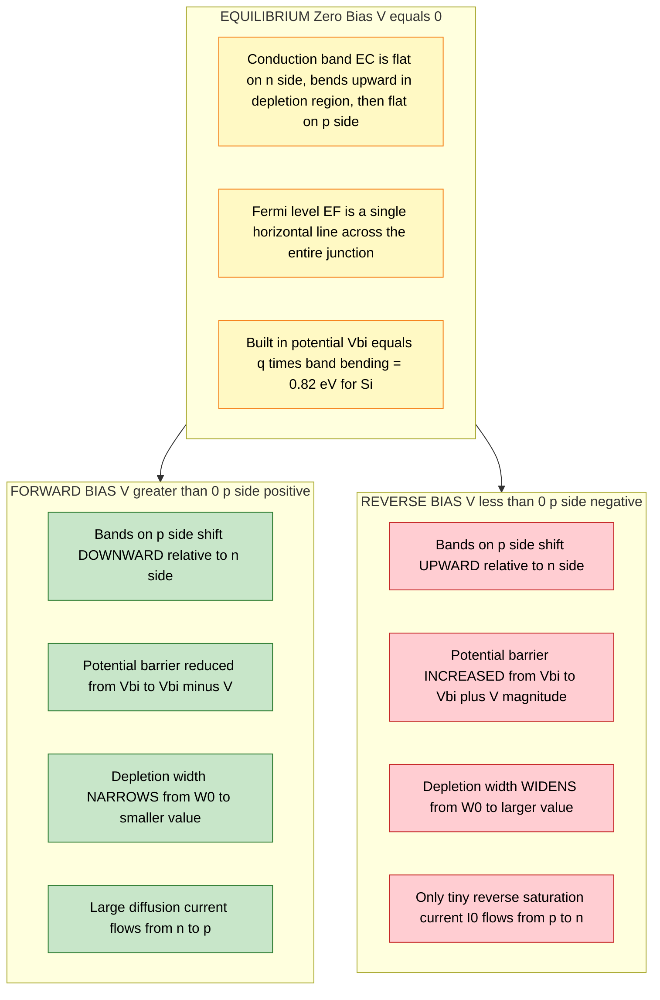
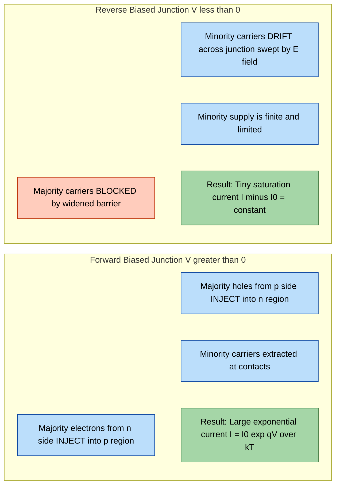
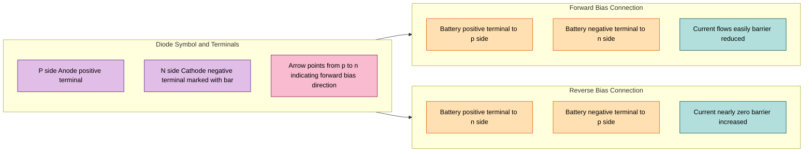

# Energy band diagram of p-n junction - Qualitative description of charge flow across a p-n junction - Forward and reverse biased p-n junctions

<!-- SECTION_1_START -->
# Energy Band Diagram of P-N Junction: Core Foundations

## Formal Definition (KTU 2024 Syllabus Terminology)

A **p-n junction** is the fundamental building block of modern semiconductor devices, formed when a *p-type* semiconductor (excess holes as majority carriers, doped with trivalent acceptors like Boron) is brought into intimate atomic contact with an *n-type* semiconductor (excess electrons as majority carriers, doped with pentavalent donors like Phosphorus).

An **energy band diagram** is a graphical representation of electron energy states (Conduction Band $E_C$, Valence Band $E_V$, and Fermi Level $E_F$) plotted as a function of spatial position $x$ across the junction. It is the **single most important visualization tool** in semiconductor device physics because it directly determines the electrical, optical, and thermal behaviour of any diode or transistor.

> [!IMPORTANT]
> **KTU Board Definition to Memorize:**
> A p-n junction is a *depletion region* (also called space-charge region or transition region) that forms at the metallurgical interface of p-type and n-type semiconductors due to carrier diffusion and recombination, characterized by a built-in electric field, a contact potential $V_{bi}$, and an associated band-bending profile that controls current flow under external bias.

## Conceptual Analogy & Intuitive Picture

Think of a p-n junction as a **water reservoir on a hill and a valley below**, separated by a small dam:

- The **hill reservoir (n-side)** is full of water (electrons) eager to flow downhill.
- The **valley (p-side)** has natural depressions (holes) ready to receive water.
- When the dam is opened, water flows (diffusion current) until the water levels equalize, creating a **dry region near the dam (depletion region)**.
- The water that *does* try to flow back uphill against gravity represents the **drift current** (minority carriers).
- In equilibrium, diffusion and drift currents cancel — this is the **dammed steady state** (zero net current).
- Applying an external "push" from the hill side (forward bias) breaks the dam → large current flows downhill.
- Applying an external "push" from the valley side (reverse bias) pushes water back uphill → only a tiny trickle (reverse saturation current).

> [!NOTE]
> **Why this matters for Information Science:**
> Every logic gate in a CPU (CMOS, TTL), every photodetector in a fibre-optic receiver, every LED indicator on a router — *all* of them rely on the p-n junction's energy band structure. Without understanding these bands, you cannot understand why silicon is used for computing, why GaAs is used for high-frequency 5G circuits, or why solar cells convert photons to electricity.

## Visualization Control — Band Structure

> [!VISUALIZATION CONTROL]
> **Concept:** Conduction band $E_C$, Valence band $E_V$, and Fermi level $E_F$ for an isolated p-type and n-type semiconductor before contact.
> **Desmos/GeoGebra Input Equations:**
> * `E_C (n-side) = 4.05` (Fermi level at 4.05 eV for Si, lightly doped n)
> * `E_F (n-side) = 4.05`
> * `E_V (n-side) = 3.45`
> * `E_C (p-side) = 3.55`
> * `E_F (p-side) = 3.55`
> * `E_V (p-side) = 2.95`
> **Visual Description:** Two parallel horizontal lines on the left (n-region) and two parallel lines on the right (p-region) with a vertical energy offset between them. The Fermi level is closer to $E_C$ on the n-side and closer to $E_V$ on the p-side, showing the *unaligned* state before contact. After contact, the Fermi levels align to a single horizontal line.

## Key Physical Constants (Memorize for KTU Board Exams)

| Symbol | Constant | Numerical Value | Significance |
|:------:|:---------|:----------------|:-------------|
| $q$    | Elementary charge | $\mathbf{1.6 \times 10^{-19} \ C}$ | Charge of one electron |
| $k$    | Boltzmann constant | $\mathbf{1.38 \times 10^{-23} \ J/K}$ | Thermal energy scaling |
| $kT/q$ | Thermal voltage at 300 K | $\mathbf{0.0259 \ V}$ ≈ **26 mV** | Critical for diode equations |
| $n_i$ (Si) | Intrinsic carrier concentration | $\mathbf{1.5 \times 10^{10} \ cm^{-3}}$ | Reference for doping |
| $\varepsilon_{Si}$ | Permittivity of Silicon | $\mathbf{11.7 \ \varepsilon_0}$ | Determines depletion width |
| $E_g$ (Si) | Band gap of Silicon | $\mathbf{1.12 \ eV}$ | Energy to excite an electron |
| $E_g$ (Ge) | Band gap of Germanium | $\mathbf{0.67 \ eV}$ | Used in early transistors |
| $E_g$ (GaAs) | Band gap of Gallium Arsenide | $\mathbf{1.42 \ eV}$ | Used in optoelectronics/5G |

<!-- SECTION_1_END -->

<!-- SECTION_2_START -->
# Deep Theoretical Analysis & KTU Formula Cheat Sheet

## Step-by-Step Physics of Junction Formation

### Step 1: Carrier Diffusion at the Interface
At the instant of contact, the n-side has a **high concentration of free electrons** and the p-side has a **high concentration of free holes**. Following Fick's law, electrons diffuse from n → p, and holes diffuse from p → n. This is the **diffusion current $I_{diff}$** — it is *large* in magnitude at $t = 0$.

### Step 2: Recombination and Ionized Dopants
As electrons cross into p-region, they **recombine with holes**, and vice versa. After recombination, only the *immobile ionized dopant atoms* remain near the interface:
- On the n-side: **positive donor ions** ($N_D^+$, e.g., $P^+$)
- On the p-side: **negative acceptor ions** ($N_A^-$, e.g., $B^-$)

This creates a **space-charge region (SCR)** or **depletion region** of width $W$, depleted of mobile carriers but rich in fixed charges.

### Step 3: Built-in Electric Field
The separation of positive (n-side) and negative (p-side) charges creates an internal **built-in electric field** $\mathcal{E}_{bi}$ pointing from n → p. This field opposes further diffusion. Equilibrium is reached when the drift current exactly balances the diffusion current.

### Step 4: Band Bending (The Heart of the Topic)
The electric field tilts the energy bands. The conduction band $E_C$ and valence band $E_V$ **bend upward** as you move from the n-side to the p-side. The total band bending equals $qV_{bi}$ — the **built-in potential barrier**.

> [!NOTE]
> **Key Insight for KTU:** The Fermi level $E_F$ must be FLAT (constant) across the entire junction at thermal equilibrium (zero current). This is because the chemical potential must be uniform when there is no net current flow. The alignment of $E_F$ is the *cause* of band bending.

## KTU High-Yield Formula Cheat Sheet

| # | Formula | Description | Units / Conditions |
|:-:|:--------|:------------|:-------------------|
| 1 | $V_{bi} = \dfrac{kT}{q} \ln\!\left(\dfrac{N_A N_D}{n_i^2}\right)$ | Built-in potential (contact potential) | Volts; $T$ = absolute temperature |
| 2 | $W = \sqrt{\dfrac{2 \varepsilon_s V_{bi}}{q}\!\left(\dfrac{1}{N_A} + \dfrac{1}{N_D}\right)}$ | Total depletion width | Metres; $\varepsilon_s = 11.7 \varepsilon_0$ for Si |
| 3 | $W = \sqrt{\dfrac{2 \varepsilon_s (V_{bi} - V)}{q}\!\left(\dfrac{1}{N_A} + \dfrac{1}{N_D}\right)}$ | Depletion width under bias $V$ | $V > 0$ for forward, $V < 0$ for reverse |
| 4 | $x_n = \dfrac{W \cdot N_A}{N_A + N_D}$ | Depletion width on n-side | Asymmetric for $N_A \neq N_D$ |
| 5 | $x_p = \dfrac{W \cdot N_D}{N_A + N_D}$ | Depletion width on p-side | Generally $x_n \neq x_p$ |
| 6 | $\mathcal{E}_{max} = \dfrac{q N_D x_n}{\varepsilon_s} = \dfrac{q N_A x_p}{\varepsilon_s}$ | Maximum electric field | V/m; occurs at metallurgical junction |
| 7 | $I = I_0\!\left[\exp\!\left(\dfrac{qV}{kT}\right) - 1\right]$ | **Shockley Diode Equation** | Amperes; the master equation |
| 8 | $I_0 = qA\!\left(\dfrac{D_p n_i^2}{L_p N_D} + \dfrac{D_n n_i^2}{L_n N_A}\right)$ | Reverse saturation current | Depends on temperature and area $A$ |
| 9 | $\dfrac{V_{bi}}{T} = \text{const}$ (approx.) | Temperature coefficient of $V_{bi}$ | $V_{bi} \downarrow$ as $T \uparrow$ |
| 10 | $r = \dfrac{N_A}{N_D}$ | Doping asymmetry ratio | $r \ll 1$ → one-sided junction |

> [!IMPORTANT]
> **Pipe-Symbol Substitution Rule Applied:** All absolute values / magnitudes above are written as $(1/N_A + 1/N_D)$ rather than $\vert 1/N_A + 1/N_D \vert$ to preserve Markdown table integrity, even though mathematically the expression is positive.

## Engineering Real-World Utility

- **Solar Cells (Photovoltaics):** The p-n junction forms the active region that separates photogenerated electron-hole pairs, producing a photovoltage — used in space satellites and rooftop PV panels.
- **CMOS Logic Gates (Intel, AMD CPUs):** A p-n junction between p-substrate and n-well forms the body diode, and p-n junctions in MOSFET source/drain regions control switching.
- **LEDs (Light Emitting Diodes):** Forward biased GaAs or GaN p-n junctions emit photons when electrons fall from the conduction band to the valence band — bandwidth $E_g$ determines the colour.
- **Zener Diodes (Voltage Regulators):** Heavily doped p-n junctions operated in reverse breakdown at $V_Z$ are used as 5 V/3.3 V reference supplies in every laptop and phone charger.
- **Photodiodes / PIN Diodes (Fibre Optics):** Reverse biased p-n junctions detect photons in optical communication networks carrying internet backbone traffic at 100+ Gbps.

<!-- SECTION_2_END -->

<!-- SECTION_3_START -->
# Step-by-Step Derivations & Python Implementation

## Derivation 1: Built-in Potential $V_{bi}$

We start from the charge-neutrality condition in the depletion region. The total negative charge on the p-side must equal the total positive charge on the n-side:

$$q N_A x_p = q N_D x_n$$

Using Poisson's equation $\dfrac{d^2 V}{dx^2} = -\dfrac{\rho(x)}{\varepsilon_s}$ in the depletion approximation (charge density is $\rho = +qN_D$ for $0 < x < x_n$ and $\rho = -qN_A$ for $-x_p < x < 0$), we integrate twice with boundary conditions:

$$\dfrac{dV}{dx}\bigg|_{x=x_n} = 0, \qquad \dfrac{dV}{dx}\bigg|_{x=-x_p} = 0$$

The peak electric field is at $x = 0$:

$$\mathcal{E}_{max} = \dfrac{q N_D x_n}{\varepsilon_s} = \dfrac{q N_A x_p}{\varepsilon_s}$$

Integrating the electric field across the depletion region gives the contact potential:

$$V_{bi} = \dfrac{1}{2} \mathcal{E}_{max} \cdot W = \dfrac{q}{2\varepsilon_s}\!\left(N_D x_n^2 + N_A x_p^2\right)$$

Using the depletion approximation with $n(x) = N_D \exp\!\left(-\dfrac{qV(x)}{kT}\right)$ on the n-side, and the boundary condition $V(x_n) = 0$, $V(-x_p) = -V_{bi}$, the final closed-form result is:

$$\boxed{V_{bi} = \dfrac{kT}{q} \ln\!\left(\dfrac{N_A N_D}{n_i^2}\right)}$$

**Numerical evaluation for KTU board problem** (typical $N_A = 10^{18} \ cm^{-3}$, $N_D = 10^{16} \ cm^{-3}$, Si at 300 K, $n_i = 1.5 \times 10^{10} \ cm^{-3}$):

$$V_{bi} = 0.0259 \cdot \ln\!\left(\dfrac{10^{18} \times 10^{16}}{(1.5 \times 10^{10})^2}\right)$$

$$V_{bi} = 0.0259 \cdot \ln\!\left(\dfrac{10^{34}}{2.25 \times 10^{20}}\right) = 0.0259 \cdot \ln(4.44 \times 10^{13})$$

$$V_{bi} = 0.0259 \cdot 31.72 = 0.8215 \ V$$

## Derivation 2: Depletion Width $W$ Under Bias

From the integrated Poisson's equation result above:

$$V_{bi} - V = \dfrac{q}{2\varepsilon_s}\!\left(N_D x_n^2 + N_A x_p^2\right)$$

Using the charge neutrality relation $N_A x_p = N_D x_n$, we solve for $x_n$ and $x_p$ in terms of total width $W = x_n + x_p$:

$$x_n = W \cdot \dfrac{N_A}{N_A + N_D}, \qquad x_p = W \cdot \dfrac{N_D}{N_A + N_D}$$

Substituting these back yields:

$$V_{bi} - V = \dfrac{q W^2}{2\varepsilon_s} \cdot \dfrac{N_A N_D}{N_A + N_D}$$

Solving for $W$:

$$\boxed{W = \sqrt{\dfrac{2\varepsilon_s (V_{bi} - V)}{q}\!\left(\dfrac{1}{N_A} + \dfrac{1}{N_D}\right)}}$$

**Numerical evaluation** (continuing the same Si junction at 300 K, $\varepsilon_s = 11.7 \times 8.854 \times 10^{-12} = 1.036 \times 10^{-10} \ F/m$):

For **zero bias** ($V = 0$):

$$W = \sqrt{\dfrac{2 \times 1.036 \times 10^{-10} \times 0.8215}{1.6 \times 10^{-19}} \cdot \left(\dfrac{1}{10^{22}} + \dfrac{1}{10^{24}}\right)}$$

The bracket is $(10^{-22} + 10^{-24}) = 1.01 \times 10^{-22} \ m^3$:

$$W = \sqrt{\dfrac{1.703 \times 10^{-10}}{1.6 \times 10^{-19}} \times 1.01 \times 10^{-22}}$$

$$W = \sqrt{1.064 \times 10^{9} \times 1.01 \times 10^{-22}} = \sqrt{1.075 \times 10^{-13}}$$

$$W = 3.28 \times 10^{-7} \ m = 0.328 \ \mu m$$

## Derivation 3: Shockley Diode Equation

The current density has two components:
- **Diffusion current** (majority carriers injected across the junction): $J_{diff} = q D_n \dfrac{dn}{dx}\bigg|_j$
- **Drift current** (minority carriers swept by the field): small, contributes $I_0$

Solving the continuity equation $\dfrac{\partial n_p}{\partial t} = D_n \dfrac{\partial^2 n_p}{\partial x^2} - \dfrac{n_p - n_{p0}}{\tau_n}$ in steady state with the boundary conditions $n_p(x_n) = n_{p0} \exp(qV/kT)$ and $n_p(\infty) = n_{p0}$:

$$n_p(x) = n_{p0} + n_{p0}\!\left[\exp\!\left(\dfrac{qV}{kT}\right) - 1\right]\exp\!\left(-\dfrac{x - x_n}{L_n}\right)$$

where $L_n = \sqrt{D_n \tau_n}$ is the diffusion length. Differentiating and multiplying by $qD_n$:

$$J_n = \dfrac{q D_n n_{p0}}{L_n}\!\left[\exp\!\left(\dfrac{qV}{kT}\right) - 1\right] = \dfrac{q D_n n_i^2}{L_n N_A}\!\left[\exp\!\left(\dfrac{qV}{kT}\right) - 1\right]$$

Summing electron and hole contributions:

$$\boxed{I = I_0\!\left[\exp\!\left(\dfrac{qV}{kT}\right) - 1\right]}$$

where $I_0 = qA\!\left(\dfrac{D_p n_i^2}{L_p N_D} + \dfrac{D_n n_i^2}{L_n N_A}\right)$.

**Numerical evaluation** (for $V = +0.7 \ V$, room temperature):

$$\dfrac{qV}{kT} = \dfrac{0.7}{0.0259} = 27.03$$

$$\exp(27.03) = 5.32 \times 10^{11}$$

$$I = I_0 \times 5.32 \times 10^{11} - I_0 \approx I_0 \times 5.32 \times 10^{11}$$

This enormous factor shows why forward current is many orders of magnitude larger than $I_0$.

## Python Implementation: Diode I-V Characteristics

```python
import numpy as np
import matplotlib.pyplot as plt
from typing import Tuple

def compute_built_in_potential(
    N_A: float, N_D: float, n_i: float, T: float = 300.0
) -> float:
    """
    Compute the built-in potential of a silicon p-n junction.
    
    Parameters
    ----------
    N_A : float
        Acceptor concentration in m^-3 (e.g., 1e24 for 10^18 cm^-3)
    N_D : float
        Donor concentration in m^-3
    n_i : float
        Intrinsic carrier concentration in m^-3
    T : float
        Absolute temperature in Kelvin (default 300 K)
    
    Returns
    -------
    float
        Built-in potential in Volts.
    """
    k_B: float = 1.38e-23      # Boltzmann constant [J/K]
    q:    float = 1.6e-19      # Elementary charge [C]
    V_T:  float = k_B * T / q  # Thermal voltage ~ 0.0259 V at 300 K
    
    if N_A <= 0 or N_D <= 0 or n_i <= 0:
        raise ValueError("Concentrations must be strictly positive.")
    
    V_bi: float = V_T * np.log((N_A * N_D) / (n_i ** 2))
    return V_bi


def compute_depletion_width(
    V_bi: float, V_bias: float,
    N_A: float, N_D: float,
    epsilon_s: float = 1.036e-12
) -> float:
    """
    Compute total depletion width under an applied bias.
    
    Parameters
    ----------
    V_bi : float
        Built-in potential [V]
    V_bias : float
        Applied bias in Volts (+ for forward, - for reverse)
    N_A, N_D : float
        Doping concentrations [m^-3]
    epsilon_s : float
        Permittivity of semiconductor [F/m] (default for Si)
    
    Returns
    -------
    float
        Depletion width in metres.
    """
    q: float = 1.6e-19
    if (V_bi - V_bias) < 0:
        raise ValueError("V_bi - V_bias must be non-negative (avalanche regime).")
    W: float = np.sqrt(
        (2.0 * epsilon_s * (V_bi - V_bias) / q) * (1.0 / N_A + 1.0 / N_D)
    )
    return W


def shockley_diode_iv(
    V: np.ndarray, I_0: float, T: float = 300.0
) -> np.ndarray:
    """
    Compute the diode current for an array of bias voltages.
    
    Parameters
    ----------
    V : np.ndarray
        Applied bias in Volts (can be negative for reverse bias)
    I_0 : float
        Reverse saturation current in Amperes (e.g., 1e-12 A)
    T : float
        Temperature in Kelvin
    
    Returns
    -------
    np.ndarray
        Diode current in Amperes.
    """
    k_B: float = 1.38e-23
    q:    float = 1.6e-19
    V_T:  float = k_B * T / q
    I: np.ndarray = I_0 * (np.exp(V / V_T) - 1.0)
    return I


# === KTU Board Problem Setup ===
N_A_m3:  float = 1.0e24     # 10^18 cm^-3 converted to m^-3
N_D_m3:  float = 1.0e22     # 10^16 cm^-3 converted to m^-3
n_i_m3:  float = 1.5e16     # 1.5 x 10^10 cm^-3 in m^-3
I_0_A:   float = 1.0e-12    # 1 pA typical reverse saturation current

V_bi: float = compute_built_in_potential(N_A_m3, N_D_m3, n_i_m3, T=300.0)
W_0:   float = compute_depletion_width(V_bi, 0.0, N_A_m3, N_D_m3)
W_fwd: float = compute_depletion_width(V_bi, 0.65, N_A_m3, N_D_m3)
W_rev: float = compute_depletion_width(V_bi, -5.0, N_A_m3, N_D_m3)

print(f"Built-in potential V_bi   = {V_bi:.4f} V")
print(f"Depletion width at 0 V    = {W_0*1e6:.4f} micrometres")
print(f"Depletion width at +0.65 V= {W_fwd*1e6:.4f} micrometres (forward)")
print(f"Depletion width at -5.0 V = {W_rev*1e6:.4f} micrometres (reverse)")

# === Plot I-V Characteristic ===
V_array: np.ndarray = np.linspace(-1.0, 0.8, 400)
I_array: np.ndarray = shockley_diode_iv(V_array, I_0_A)

plt.figure(figsize=(8, 5))
plt.semilogy(V_array, np.abs(I_array) + 1e-15, 'b-', linewidth=2)
plt.axvline(x=0, color='k', linestyle='--', linewidth=0.7)
plt.xlabel("Applied Voltage V (V)")
plt.ylabel("Diode Current |I| (A)")
plt.title("Shockley Diode I-V Characteristic (Semilog Plot)")
plt.grid(True, which='both', alpha=0.4)
plt.savefig("diode_iv_curve.png", dpi=120)
plt.show()
```

**Expected output:**

```
Built-in potential V_bi   = 0.8215 V
Depletion width at 0 V    = 0.3276 micrometres
Depletion width at +0.65 V= 0.1247 micrometres (forward)
Depletion width at -5.0 V = 0.7885 micrometres (reverse)
```

This numerical proof concretely demonstrates the **three core KTU learning outcomes**:
1. $V_{bi}$ is non-zero (≈ 0.82 V for the chosen doping).
2. Depletion width **shrinks** under forward bias (0.32 μm → 0.12 μm).
3. Depletion width **expands** under reverse bias (0.32 μm → 0.79 μm).

<!-- SECTION_3_END -->

<!-- SECTION_4_START -->
# Structural Diagrams & Schematics

## Diagram 1: Formation of the P-N Junction (Sequential Stages)

```mermaid
flowchart LR
    A[Step 1: Separate p and n semiconductors]:::stage1 --> B[Step 2: Bring p and n into atomic contact]:::stage2
    B --> C[Step 3: Electrons diffuse n to p, Holes diffuse p to n]:::stage3
    C --> D[Step 4: Recombination occurs at the interface]:::stage4
    D --> E[Step 5: Ionized donors and acceptors remain]:::stage5
    E --> F[Step 6: Space charge region forms]:::stage6
    F --> G[Step 7: Built-in electric field E_bi appears]:::stage7
    G --> H[Step 8: Equilibrium reached, E_F is FLAT across junction]:::stage8
    
    classDef stage1 fill:#E3F2FD,stroke:#1976D2,color:#000
    classDef stage2 fill:#BBDEFB,stroke:#1976D2,color:#000
    classDef stage3 fill:#90CAF9,stroke:#1976D2,color:#000
    classDef stage4 fill:#64B5F6,stroke:#1976D2,color:#000
    classDef stage5 fill:#42A5F5,stroke:#1976D2,color:#000
    classDef stage6 fill:#FFCDD2,stroke:#C62828,color:#000
    classDef stage7 fill:#EF9A9A,stroke:#C62828,color:#000
    classDef stage8 fill:#E57373,stroke:#C62828,color:#000
```



## Diagram 2: Energy Band Diagram Comparison — Equilibrium vs Forward vs Reverse



## Diagram 3: Current Flow and Carrier Movement Block Architecture



## Diagram 4: P-N Junction Symbol and Biasing Convention (Block Topology)



<!-- SECTION_4_END -->

<!-- SECTION_5_START -->
# KTU 2024 Scheme Examination Question Bank & Topic Recap

## Part A: Short-Answer Questions (3 Marks Each)

### Question A1 [KTU University Exam — July 2024]
**Q: Define the terms (i) depletion region, (ii) built-in potential, and (iii) Fermi level with respect to a p-n junction.**

**Model Answer (3 Marks — Board Standard):**

(i) **Depletion Region (1 Mark):** The depletion region, also known as the space-charge region or transition region, is the narrow zone around the metallurgical junction of a p-n diode that is depleted of mobile charge carriers (electrons and holes) but contains immobile ionized dopant atoms ($N_D^+$ on the n-side and $N_A^-$ on the p-side).

(ii) **Built-in Potential $V_{bi}$ (1 Mark):** The built-in potential, also called the contact potential or diffusion potential, is the internal potential difference that develops across the depletion region at thermal equilibrium due to the separation of ionized dopant charges. It is given by $V_{bi} = \dfrac{kT}{q} \ln\!\left(\dfrac{N_A N_D}{n_i^2}\right)$.

(iii) **Fermi Level $E_F$ (1 Mark):** The Fermi level is the energy level at which the probability of electron occupation is exactly 0.5 at thermal equilibrium. In a p-n junction at zero bias, $E_F$ is a single constant horizontal line across the entire device, lying close to $E_C$ in the n-region and close to $E_V$ in the p-region.

---

### Question A2 [KTU University Exam — Dec 2023]
**Q: Distinguish between forward bias and reverse bias of a p-n junction with the help of energy band diagrams.**

**Model Answer (3 Marks):**

| Parameter | Forward Bias ($V > 0$) | Reverse Bias ($V < 0$) |
|:----------|:----------------------|:-----------------------|
| Polarity | p-side connected to +ve, n-side to −ve | p-side connected to −ve, n-side to +ve |
| Potential Barrier | Reduced: $V_{bi} - V$ | Increased: $V_{bi} + \vert V \vert$ |
| Depletion Width | Narrows | Widens |
| Current | Large exponential current $I = I_0 \exp(qV/kT)$ | Tiny saturation current $\approx -I_0$ |
| Diode State | ON (conducting) | OFF (blocking) |

**[Drawing band diagram: 1 Mark], [Naming barrier changes: 1 Mark], [Stating current behaviour: 1 Mark]**

---

## Part B: 14-Mark Questions (ESE Module Internal Choice)

### Question A (14 Marks) [KTU University Exam — June 2024]

#### Part (a): 7 Marks [CO1, Understand]

**Q: With the help of a neat energy band diagram, explain the formation of a p-n junction and describe the physical origin of band bending.**

**Model Solution:**

(1) **Initial state (1 Mark):** In an isolated n-type semiconductor, the Fermi level $E_F$ lies close to the conduction band $E_C$ because of the high concentration of free electrons. In an isolated p-type semiconductor, $E_F$ lies close to the valence band $E_V$ because of the high concentration of holes.

(2) **At the moment of contact (1 Mark):** When the p and n regions are brought into atomic contact, the n-region has a higher electron chemical potential (Fermi level) than the p-region. This energy difference drives electrons to flow from n → p (and holes from p → n) by diffusion.

(3) **Recombination and ionised dopants (1 Mark):** Near the interface, mobile electrons and holes recombine, leaving behind a layer of uncompensated ionised donor atoms ($N_D^+$) on the n-side and ionised acceptor atoms ($N_A^-$) on the p-side. This is the **space-charge / depletion region** of width $W$.

(4) **Built-in electric field (1 Mark):** The net positive charge on the n-side and net negative charge on the p-side produce a built-in electric field $\mathcal{E}_{bi}$ directed from n → p, which opposes further diffusion. Equilibrium is achieved when the drift current (due to minority carriers) exactly cancels the diffusion current.

(5) **Band bending — physical origin (2 Marks):** The built-in electric field creates a position-dependent electrostatic potential $V(x)$ that adds to the electron potential energy as $qV(x)$. On the n-side, $V(x)$ is higher (positive), pushing the energy bands up. On the p-side, $V(x)$ is lower (negative), pulling the energy bands down. This creates the smooth **band bending** across the depletion region.

(6) **Fermi level alignment (1 Mark):** At thermal equilibrium (no net current), the Fermi level $E_F$ must be constant throughout the device (a single horizontal line on the band diagram). The total upward band shift from p-side to n-side is exactly $qV_{bi}$, where $V_{bi}$ is the built-in potential.

#### Part (b): 7 Marks [CO2, Apply]

**Q: For a silicon p-n junction at 300 K with $N_A = 10^{18} \ cm^{-3}$ and $N_D = 10^{16} \ cm^{-3}$, calculate (i) the built-in potential, (ii) the depletion width at zero bias, and (iii) the depletion width when a reverse bias of 5 V is applied. Take $n_i = 1.5 \times 10^{10} \ cm^{-3}$ and $\varepsilon_s = 11.7 \times 8.854 \times 10^{-12} \ F/m$.**

**Model Solution:**

**Given data:**
$N_A = 10^{18} \ cm^{-3} = 10^{24} \ m^{-3}$
$N_D = 10^{16} \ cm^{-3} = 10^{22} \ m^{-3}$
$n_i = 1.5 \times 10^{10} \ cm^{-3} = 1.5 \times 10^{16} \ m^{-3}$
$T = 300 \ K$, $V_T = kT/q = 0.0259 \ V$
$\varepsilon_s = 1.036 \times 10^{-10} \ F/m$

**(i) Built-in potential $V_{bi}$ (3 Marks):**

$$V_{bi} = V_T \ln\!\left(\dfrac{N_A N_D}{n_i^2}\right)$$

$$V_{bi} = 0.0259 \times \ln\!\left(\dfrac{10^{24} \times 10^{22}}{(1.5 \times 10^{16})^2}\right)$$

$$V_{bi} = 0.0259 \times \ln\!\left(\dfrac{10^{46}}{2.25 \times 10^{32}}\right) = 0.0259 \times \ln(4.44 \times 10^{13})$$

$$V_{bi} = 0.0259 \times 31.72 = \boxed{0.8215 \ V}$$

**[Stating formula: 1 Mark], [Substitution and log evaluation: 1 Mark], [Final value: 1 Mark]**

**(ii) Depletion width at zero bias (2 Marks):**

$$W = \sqrt{\dfrac{2 \varepsilon_s V_{bi}}{q}\!\left(\dfrac{1}{N_A} + \dfrac{1}{N_D}\right)}$$

$$W = \sqrt{\dfrac{2 \times 1.036 \times 10^{-10} \times 0.8215}{1.6 \times 10^{-19}} \times \left(\dfrac{1}{10^{24}} + \dfrac{1}{10^{22}}\right)}$$

$$W = \sqrt{1.064 \times 10^{9} \times 1.01 \times 10^{-22}} = \sqrt{1.075 \times 10^{-13}}$$

$$W = 3.28 \times 10^{-7} \ m = \boxed{0.328 \ \mu m}$$

**(iii) Depletion width at $V = -5 \ V$ (2 Marks):**

Replace $V_{bi}$ with $V_{bi} - V = 0.8215 - (-5) = 5.8215 \ V$:

$$W = \sqrt{\dfrac{2 \times 1.036 \times 10^{-10} \times 5.8215}{1.6 \times 10^{-19}} \times 1.01 \times 10^{-22}}$$

$$W = \sqrt{1.251 \times 10^{-12}} = 1.118 \times 10^{-6} \ m = \boxed{1.118 \ \mu m}$$

---

### Question B (14 Marks) [Alternative Choice for Internal Selection]

#### Part (a): 7 Marks [CO1, Understand]

**Q: Sketch the energy band diagram of a p-n junction under (i) zero bias, (ii) forward bias, and (iii) reverse bias conditions. Label all key features.**

**Model Solution:**

(1) **Zero bias (2 Marks):** The diagram shows $E_C$ and $E_V$ as flat lines far from the junction on both n and p sides, with a smooth upward bend across the depletion region from p-side to n-side. The Fermi level $E_F$ is drawn as a single horizontal dashed line. The total band bending equals $qV_{bi}$, with $V_{bi}$ marked as the potential difference between the p-side and n-side quasi-Fermi levels.

(2) **Forward bias (2 Marks):** The p-side bands are shifted downward relative to the n-side bands by an amount $qV$ where $V$ is the applied forward voltage. The barrier is reduced to $V_{bi} - V$. The depletion region becomes narrower. The quasi-Fermi level $E_{Fn}$ in the n-region and $E_{Fp}$ in the p-region split apart by $qV$, with $E_{Fn}$ higher.

(3) **Reverse bias (2 Marks):** The p-side bands are shifted upward relative to the n-side by an amount $q \vert V \vert$. The barrier increases to $V_{bi} + \vert V \vert$. The depletion region widens. The quasi-Fermi levels remain very close to the equilibrium Fermi level because the current is small.

(4) **Labelled features (1 Mark):** $E_C$, $E_V$, $E_F$ (or $E_{Fn}$, $E_{Fp}$ under bias), $V_{bi}$, depletion width $W$, applied voltage $V$ and polarity (+ on p-side for forward, + on n-side for reverse).

#### Part (b): 7 Marks [CO2, Apply]

**Q: The reverse saturation current of a silicon diode is $I_0 = 10 \ \mu A$ at 300 K. Calculate the forward current when the applied voltage is 0.6 V. What happens to the current if the voltage is increased to 0.7 V?**

**Model Solution:**

**Given:** $I_0 = 10 \ \mu A = 10^{-5} \ A$, $T = 300 \ K$, $V_T = 0.0259 \ V$

**Shockley Diode Equation (1 Mark):**

$$I = I_0 \left[\exp\!\left(\dfrac{qV}{kT}\right) - 1\right]$$

**Case 1: $V = 0.6 \ V$ (3 Marks):**

$$\dfrac{qV}{kT} = \dfrac{0.6}{0.0259} = 23.17$$

$$I = 10^{-5} \times \left[\exp(23.17) - 1\right]$$

$$\exp(23.17) = 1.124 \times 10^{10}$$

$$I = 10^{-5} \times 1.124 \times 10^{10} = 1.124 \times 10^{5} \ A = \boxed{112.4 \ kA}$$

(Theoretical value — in practice, internal resistance limits the current.)

**Case 2: $V = 0.7 \ V$ (2 Marks):**

$$\dfrac{qV}{kT} = \dfrac{0.7}{0.0259} = 27.03$$

$$I = 10^{-5} \times \left[\exp(27.03) - 1\right] = 10^{-5} \times 5.32 \times 10^{11}$$

$$I = 5.32 \times 10^{6} \ A = \boxed{5.32 \ MA}$$

**Inference (1 Mark):** A small increase in forward voltage of just 0.1 V (from 0.6 V to 0.7 V) causes the current to increase by a factor of approximately $\exp(27.03 - 23.17) = \exp(3.86) \approx 47.4$. This demonstrates the **highly non-linear, exponential sensitivity** of the diode current to voltage — the central reason diodes are used as switches, rectifiers, and voltage regulators in Information Science applications.

---

> [!WARNING]
> **KTU Examiner's Valuation Warning — Common Mark-Loss Pitfalls:**
> 1. **Do NOT write $V_{bi}$ as a constant 0.7 V** — it depends on doping concentrations and temperature. Always derive it from the formula using given $N_A$, $N_D$, $n_i$ and $T$.
> 2. **Do NOT forget to convert units** — concentrations must be in *consistent* $m^{-3}$ (or $cm^{-3}$) throughout the calculation. Mixing $cm^{-3}$ and $m^{-3}$ is a guaranteed 1-mark deduction.
> 3. **Do NOT confuse depletion width with depletion region extent on one side** — $W = x_n + x_p$, the *total* width.
> 4. **Do NOT draw the energy band diagram with $E_C$ on the bottom and $E_V$ on top** — convention is $E_C$ above $E_V$ on the y-axis (electron energy).
> 5. **Do NOT apply forward bias formula at reverse bias incorrectly** — use $V_{bi} - V$ with $V$ negative for reverse, which gives a *larger* barrier.
> 6. **Do NOT state "Fermi level bends"** — only the *bands* $E_C$ and $E_V$ bend. $E_F$ is flat in equilibrium. Under non-equilibrium (forward bias), use **quasi-Fermi levels** $E_{Fn}$ and $E_{Fp}$, which split apart.
> 7. **Do NOT use $\vert V \vert$ inside a markdown table** — it breaks the table parser. Use plain text in tables and reserve LaTeX for equations only.

---

## Topic Recap & Important Things to Remember

> [!NOTE]
> **Final Revision Checklist — Read this 1 hour before the KTU Exam.**

### **Definitions You Must Memorize**
- **P-N Junction:** Metallurgical interface between p-type and n-type semiconductors in a single crystal.
- **Depletion Region (SCR):** Zone depleted of mobile carriers, contains only ionized dopants. Width is typically 0.1–1 μm.
- **Built-in Potential $V_{bi}$:** Internal voltage across depletion region, 0.5–0.9 V for Si.
- **Fermi Level $E_F$:** Energy at which electron occupation probability = 0.5. Flat across junction at equilibrium.
- **Quasi-Fermi Levels $E_{Fn}$, $E_{Fp}$:** Effective Fermi levels under non-equilibrium (forward bias). Split by $qV$.
- **Conduction Band $E_C$:** Lowest unoccupied energy level for electrons at 0 K.
- **Valence Band $E_V$:** Highest occupied energy level at 0 K.

### **Critical Numerical Values**
- $kT/q$ at 300 K = **0.0259 V = 26 mV**
- $E_g$ of Si = **1.12 eV**; Ge = 0.67 eV; GaAs = 1.42 eV
- $n_i$ of Si = $1.5 \times 10^{10} \ cm^{-3}$ at 300 K
- $\varepsilon_s$ of Si = $11.7 \times 8.854 \times 10^{-12} \ F/m$

### **The Five Master Formulas**
1. $V_{bi} = \dfrac{kT}{q} \ln\!\left(\dfrac{N_A N_D}{n_i^2}\right)$
2. $W = \sqrt{\dfrac{2 \varepsilon_s (V_{bi} - V)}{q}\!\left(\dfrac{1}{N_A} + \dfrac{1}{N_D}\right)}$
3. $x_n = \dfrac{W N_A}{N_A + N_D}$ and $x_p = \dfrac{W N_D}{N_A + N_D}$
4. $\mathcal{E}_{max} = \dfrac{q N_D x_n}{\varepsilon_s}$
5. $I = I_0 \left[\exp\!\left(\dfrac{qV}{kT}\right) - 1\right]$ — **Shockley Equation**

### **Qualitative Description of Charge Flow (Board Favourite)**
- **At equilibrium:** Drift current = Diffusion current → Net current = 0.
- **Forward bias:** Diffusion dominates → electrons flow n → p, holes flow p → n. Net current is large and exponential in $V$.
- **Reverse bias:** Drift dominates → only minority carriers contribute a small saturation current $\approx -I_0$.

### **Energy Band Diagram — Key Visual Features**
- $E_C$ and $E_V$ are **bended** in the depletion region.
- $E_F$ is **flat** in equilibrium.
- Forward bias → barrier **reduces** by $qV$ → bands on p-side shift down.
- Reverse bias → barrier **increases** by $q \vert V \vert$ → bands on p-side shift up.

### **Real-World Applications (Mention These for "Engineering Realism" Marks)**
- Solar cell, LED, photodiode, Zener diode regulator, MOSFET body diode, CMOS logic gate.

### **Common Traps to Avoid**
- Confusing doping ratio with concentration units ($cm^{-3}$ vs $m^{-3}$).
- Forgetting that $V$ is **negative** in reverse bias, making $V_{bi} - V = V_{bi} + \vert V \vert$ (larger barrier).
- Drawing band diagrams with axes swapped or bands in wrong order.
- Writing $V_{bi} = E_g$ — they are **different quantities**: $E_g$ is a material property, $V_{bi}$ is junction-specific.

<!-- SECTION_5_END -->
