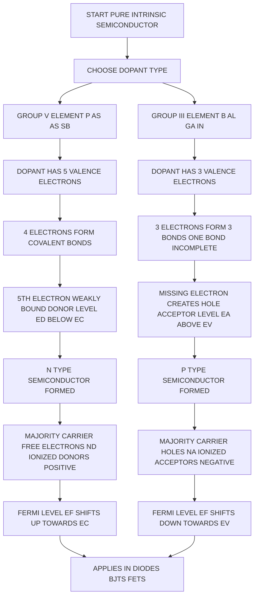
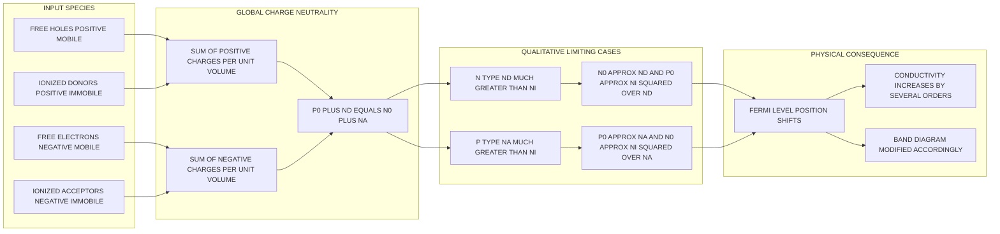
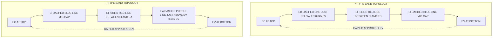

# Extrinsic semiconductor (qualitative)

<!-- SECTION_1_START -->
# Extrinsic Semiconductor (Qualitative Analysis)

> [!IMPORTANT]
> **KTU 2024 Scheme | GAPHT121 | Module 3 — Semiconductor Physics**
> This note covers the *qualitative* understanding of extrinsic semiconductors, including the mechanism of doping, the formation of n-type and p-type materials, the role of donor and acceptor energy levels, and the resulting energy band diagrams. No derivations of carrier concentration are required at the qualitative level — emphasis is placed on **physical intuition, energy band pictograms, and charge neutrality**.

---

## 1.1 Formal Definition

> [!NOTE]
> **Extrinsic Semiconductor:** A semiconductor whose electrical conductivity has been deliberately enhanced by introducing a precisely controlled quantity of suitable impurity atoms (called *dopants*) into the intrinsic (pure) semiconductor lattice, in order to increase the concentration of free charge carriers (electrons or holes) available for conduction.

In the context of the **KTU 2024 syllabus for GAPHT121**, the term *"qualitative"* explicitly means the student must be able to:

- **Describe** the doping mechanism using words and diagrams (not solve Poisson's equation).
- **Sketch** energy band diagrams for n-type and p-type semiconductors showing Fermi-level shifts.
- **Identify** the majority and minority carriers and justify their dominance.
- **State** the charge neutrality condition in words.

The dopant atoms fall into two families:

| Dopant Family | Group in Periodic Table | Common Examples | Valency Effect | Resulting Semiconductor |
| :--- | :--- | :--- | :--- | :--- |
| **Donors** | **Group V** (Pentavalent) | Phosphorus (P), Arsenic (As), Antimony (Sb) | 5 valence electrons → 1 extra electron weakly bound | **n-type** |
| **Acceptors** | **Group III** (Trivalent) | Boron (B), Aluminium (Al), Gallium (Ga), Indium (In) | 3 valence electrons → 1 missing bond (a "hole") | **p-type** |

> [!IMPORTANT]
> **Typical Doping Concentration:** $N_d$ or $N_a$ is of the order of $\mathbf{10^{16} \text{ to } 10^{18} \text{ atoms/cm}^3}$ — extremely small compared to the host atom density ($\sim 10^{22} \text{ atoms/cm}^3$).

---

## 1.2 Conceptual Analogy — The "Stadium Seating" Model

Imagine a perfectly packed cricket stadium where every seat is filled — this is the **intrinsic (pure) semiconductor at low temperature**. No one can move, so there is no current. Now imagine two modifications:

- **"The Donor Supporter" (n-type):** We sneak in a few extra fans wearing bright red caps, each sitting next to a regular supporter. These red-cap fans are loosely tied to their seat. At room temperature, they **break free and wander through the aisles** as free electrons. The original supporters stay seated, but they are vastly outnumbered by the wandering red-caps. *Free electrons become the majority carriers.*

- **The "Acceptor Supporter" (p-type):** We now remove a few regular supporters and replace them with empty chairs. A neighbouring fan can easily slip into the empty chair, leaving *his* old chair empty. The empty chair appears to **"move"** in the opposite direction to the fan who jumped. *This moving vacancy is the hole, and it acts as a positive majority carrier.*

> [!TIP]
> **Quick Memory Hook:**
> - **n-type → negative carriers (electrons) dominate.**
> - **p-type → positive carriers (holes) dominate.**
> - The *material itself* remains electrically neutral overall — only the *type of mobile carrier* changes.

---

## 1.3 Visualizing the Energy Band — What the Student Must Observe

> [!VISUALIZATION CONTROL]
> **Concept:** Energy band diagram of an n-type semiconductor showing the donor level $E_d$ and shifted Fermi level $E_F$.
> **Key Reference Levels (to be marked on the vertical Energy axis):**
> * $E_c$ → Bottom edge of the Conduction Band
> * $E_v$ → Top edge of the Valence Band
> * $E_i$ → Intrinsic Fermi level (mid-gap for pure Si)
> * $E_d$ → Donor energy level (sits just below $E_c$)
> * $E_F$ → New Fermi level after doping
> **Visual Description:** The student should draw a forbidden energy gap ($E_g \approx 1.1\,\text{eV}$ for Si). The donor level $E_d$ must appear as a short horizontal line **just below $E_c$** (typically $0.045\,\text{eV}$ below $E_c$ for P in Si). The Fermi level $E_F$ must be drawn **closer to $E_c$ than to $E_i$**, indicating that electrons now dominate.
<!-- SECTION_1_END -->

<!-- SECTION_2_START -->
# Deep Theoretical Analysis & KTU Formula Sheet

## 2.1 The Doping Process — Step-by-Step Logic

The creation of an extrinsic semiconductor proceeds in three logical stages. The qualitative analysis requires the student to *articulate* each stage clearly in the examination.

1. **Selection of the Intrinsic Host:** Start with a high-purity semiconductor (Si or Ge) which at $0\,\text{K}$ has a *completely filled valence band* and an *empty conduction band*. The Fermi level lies exactly mid-gap.

2. **Introduction of the Dopant:** A small, controlled number of impurity atoms (e.g., $1$ impurity per $10^6$ host atoms) are introduced into the crystal lattice. At room temperature ($T \approx 300\,\text{K}$), these dopants are *ionized* — they either release an electron into the conduction band or capture an electron from the valence band.

3. **Establishment of a New Equilibrium:** A new Fermi level $E_F$ is established whose position reflects the *abundance* of one carrier over the other. The crystal remains *electrically neutral as a whole*, even though individual dopant sites become ionized.

## 2.2 n-Type Semiconductor — The Donor Mechanism

- **Dopant chosen:** Pentavalent (Group V) — e.g., **Phosphorus (P)** in **Silicon (Si)**.
- **Lattice substitution:** The P atom occupies a Si site and forms four covalent bonds with its four nearest Si neighbours using four of its five valence electrons.
- **The fifth electron** is *not* needed for bonding and is therefore very weakly bound to the parent P⁺ ion by the Coulombic attraction of the +1 ionic core.
- This weak binding corresponds to a **donor energy level $E_d$** that lies in the forbidden gap, *just below* the conduction band edge.
- For Phosphorus in Silicon: $E_c - E_d \approx 0.045\,\text{eV}$.
- At room temperature, thermal energy $k_B T \approx 0.026\,\text{eV}$ is *more than sufficient* to ionize every donor atom.
- **Net result:** Each P atom donates **one free electron** to the conduction band, leaving behind a *stationary, positively ionized donor* $P^+$.

> [!NOTE]
> **In an n-type material:**
> - **Majority carriers** = free electrons (concentration $\approx N_d$)
> - **Minority carriers** = holes (concentration $\approx n_i^2 / N_d$, very small)
> - **Fermi level** $E_F$ shifts **upward** from mid-gap, towards $E_c$.

## 2.3 p-Type Semiconductor — The Acceptor Mechanism

- **Dopant chosen:** Trivalent (Group III) — e.g., **Boron (B)** in **Silicon (Si)**.
- **Lattice substitution:** The B atom forms only three covalent bonds, leaving the fourth bond incomplete.
- The incomplete bond represents a **"missing electron"** or a **hole**, which is weakly bound to the negatively ionized acceptor ion $B^-$.
- This creates an **acceptor energy level $E_a$** that lies in the forbidden gap, *just above* the valence band edge.
- For Boron in Silicon: $E_a - E_v \approx 0.045\,\text{eV}$.
- At room temperature, a valence electron from a neighbouring Si atom easily jumps to fill this vacancy, leaving a **mobile hole** in the valence band.
- **Net result:** Each B atom accepts one electron from the valence band, creating **one free hole**, leaving behind a *stationary, negatively ionized acceptor* $B^-$.

> [!NOTE]
> **In a p-type material:**
> - **Majority carriers** = holes (concentration $\approx N_a$)
> - **Minority carriers** = electrons (concentration $\approx n_i^2 / N_a$, very small)
> - **Fermi level** $E_F$ shifts **downward** from mid-gap, towards $E_v$.

## 2.4 Energy Band Diagram — The Qualitative Picture

The KTU examiner expects the student to draw the band diagram precisely. Below is the qualitative comparison that must be memorized for the **14-mark questions**.

| Feature | Intrinsic (Pure) | n-type | p-type |
| :--- | :--- | :--- | :--- |
| Position of $E_F$ | Exactly mid-gap | Above mid-gap, near $E_c$ | Below mid-gap, near $E_v$ |
| Position of donor level $E_d$ | — | Just below $E_c$ ($\sim 0.045\,\text{eV}$) | — |
| Position of acceptor level $E_a$ | — | — | Just above $E_v$ ($\sim 0.045\,\text{eV}$) |
| Majority carrier symbol | Equal e⁻ and h⁺ | Free electrons ($n_0 \approx N_d$) | Free holes ($p_0 \approx N_a$) |
| Doped region to mark on diagram | None | $E_F - E_i > 0$ (positive shift) | $E_F - E_i < 0$ (negative shift) |

## 2.5 Charge Neutrality Condition — Qualitative Statement

Although the *quantitative* derivation of $n_0 p_0 = n_i^2$ is part of a later module, the **qualitative** charge neutrality condition must be stated and understood:

> [!IMPORTANT]
> **Charge Neutrality:** The total positive charge per unit volume in the crystal must equal the total negative charge per unit volume, at thermal equilibrium.
> - Positive charges: holes ($+q\,p_0$) + ionized donors ($+q\,N_d^+$)
> - Negative charges: free electrons ($-q\,n_0$) + ionized acceptors ($-q\,N_a^-$)
> At full ionization: $p_0 + N_d = n_0 + N_a$.

This single equation, when solved *qualitatively* under the assumption that the majority carrier concentration dominates, yields:
- **n-type:** $n_0 \approx N_d$ and $p_0 \approx n_i^2 / N_d$
- **p-type:** $p_0 \approx N_a$ and $n_0 \approx n_i^2 / N_a$

## 2.6 KTU Formula Sheet — Qualitative Level

> [!TIP]
> The following table summarizes the **essential relationships and symbols** a student must know for the qualitative module. **No $|x|$-style absolute values are used** in any cell to preserve the markdown table integrity.

| Symbol | Quantity | Typical Value / Form | Role in n-type | Role in p-type |
| :--- | :--- | :--- | :--- | :--- |
| $E_g$ | Forbidden energy gap | $1.1\,\text{eV}$ (Si), $0.67\,\text{eV}$ (Ge) | Same | Same |
| $E_i$ | Intrinsic Fermi level | Mid-gap reference | Reference for shift | Reference for shift |
| $E_d$ | Donor level position | $\approx E_c - 0.045\,\text{eV}$ (P in Si) | Present | Absent |
| $E_a$ | Acceptor level position | $\approx E_v + 0.045\,\text{eV}$ (B in Si) | Absent | Present |
| $E_F$ | Equilibrium Fermi level | Lies in forbidden gap | Closer to $E_c$ | Closer to $E_v$ |
| $N_d$ | Donor concentration | $10^{16}$–$10^{18}\,\text{cm}^{-3}$ | Majority source | Absent |
| $N_a$ | Acceptor concentration | $10^{16}$–$10^{18}\,\text{cm}^{-3}$ | Absent | Majority source |
| $n_0$ | Free electron density | $\approx N_d$ (n-type) | Majority | Minority ($\approx n_i^2 / N_a$) |
| $p_0$ | Free hole density | $\approx N_a$ (p-type) | Minority ($\approx n_i^2 / N_d$) | Majority |
| $n_i$ | Intrinsic carrier density | $\approx 1.5 \times 10^{10}\,\text{cm}^{-3}$ (Si at 300 K) | Reference | Reference |
| $k_B T$ | Thermal energy at 300 K | $\approx 0.026\,\text{eV}$ | Ionizes donors fully | Ionizes acceptors fully |
| $m^*$ | Effective mass (qualitative) | $m_n^* \neq m_p^*$ in most semiconductors | Affects $E_F$ position slightly | Affects $E_F$ position slightly |

## 2.7 Real-World Engineering Utility

Extrinsic semiconductors are the *foundation* of virtually every modern information-science device. The qualitative concepts covered in this module are the bedrock on which the following devices are built:

- **Diodes (p-n junctions):** Created by joining a p-type and n-type region in the *same* single crystal — a direct application of selective doping.
- **Bipolar Junction Transistors (BJTs):** Built from n-p-n or p-n-p layered structures, again depending entirely on *controlled* extrinsic doping profiles.
- **Field-Effect Transistors (FETs and MOSFETs):** The channel is an extrinsic semiconductor whose carrier concentration is modulated by an external gate voltage.
- **Photovoltaic Cells & LEDs:** Require carefully designed p-n junctions with specific dopant species and concentrations.
- **Integrated Circuits (ICs):** Billions of transistors on a single silicon chip, each defined by *localized* doping patterns created using photolithography and ion implantation.

> [!NOTE]
> Without the *qualitative* understanding of *why* doping shifts the Fermi level and changes the majority carrier type, none of the above devices can be conceptually designed or analysed. This is why the KTU examiner places high weight on energy band diagrams and Fermi level positioning.
<!-- SECTION_2_END -->

<!-- SECTION_3_START -->
# Step-by-Step Derivations & Symbolic Implementation

> [!NOTE]
> Since this is a **qualitative** module, the *mathematical content* is restricted to the construction of energy band diagrams and the **verbal derivation** of the charge neutrality condition. Numerical carrier-concentration derivations (using Fermi-Dirac statistics) are reserved for a later advanced module. The student is expected to demonstrate logical, step-by-step reasoning at every stage.

---

## 3.1 Symbolic Derivation — Charge Neutrality at Full Ionization

**Step 1: Enumerate all charges present in the doped crystal.**

In an extrinsic semiconductor that contains *both* donors and acceptors, four charged species can exist at thermal equilibrium:

$$
\begin{aligned}
\text{Free electrons:} \quad & -q \cdot n_0 \quad \text{(negative, mobile)} \\
\text{Free holes:} \quad & +q \cdot p_0 \quad \text{(positive, mobile)} \\
\text{Ionized donors:} \quad & +q \cdot N_d^+ \quad \text{(positive, immobile, fixed at lattice sites)} \\
\text{Ionized acceptors:} \quad & -q \cdot N_a^- \quad \text{(negative, immobile, fixed at lattice sites)}
\end{aligned}
$$

**Step 2: Apply the global electrical neutrality condition.**

For the bulk crystal to be charge-neutral (no net charge accumulation in any macroscopic region), the sum of all positive charges per unit volume must equal the sum of all negative charges per unit volume:

$$
\begin{aligned}
+q \cdot p_0 + q \cdot N_d^+ &= -q \cdot n_0 + (-q) \cdot N_a^- \\
p_0 + N_d^+ &= n_0 + N_a^-
\end{aligned}
$$

The factor $q$ cancels because it appears on both sides of the equation.

**Step 3: Assume complete ionization at room temperature.**

For typical doping concentrations at $T = 300\,\text{K}$, the thermal energy $k_B T \approx 0.026\,\text{eV}$ is much larger than the binding energy $\approx 0.045\,\text{eV}$. Hence, essentially *every* dopant atom is ionized:

$$
N_d^+ \approx N_d \quad \text{and} \quad N_a^- \approx N_a
$$

Substituting:

$$
p_0 + N_d = n_0 + N_a
$$

This is the **charge neutrality equation** for an extrinsic semiconductor.

**Step 4: Apply the qualitative simplification (majority-carrier dominance).**

For an n-type material, $N_d \gg n_i$ and $n_0 \gg p_0$, so we neglect the smaller terms:

$$
\begin{aligned}
n_0 &\approx N_d \\
p_0 &\approx \frac{n_i^2}{N_d}
\end{aligned}
$$

For a p-type material, $N_a \gg n_i$ and $p_0 \gg n_0$:

$$
\begin{aligned}
p_0 &\approx N_a \\
n_0 &\approx \frac{n_i^2}{N_a}
\end{aligned}
$$

> [!TIP]
> The relationship $n_0 p_0 = n_i^2$ (the **mass-action law**) is the qualitative result that ties the minority carrier density to the doping level. In an n-type material, *increasing* the donor concentration *decreases* the hole concentration — a fact of immense practical importance in device design.

---

## 3.2 Step-by-Step Construction of the n-type Energy Band Diagram

**Step 1: Draw the band structure of the host.**

Draw two horizontal lines representing $E_c$ (top of valence region gap) and $E_v$ (bottom of conduction region gap), separated by $E_g$. Mark the intrinsic Fermi level $E_i$ exactly midway (for Si and Ge, $E_i$ is approximately mid-gap).

**Step 2: Introduce the donor level.**

Draw a short dashed horizontal line labelled $E_d$, placed *just below* $E_c$ at a vertical distance of approximately $0.045\,\text{eV}$. Annotate the line: *"P donor level"* or *"As donor level"*.

**Step 3: Shift the Fermi level.**

Draw a new solid line for the equilibrium Fermi level $E_F$ at a position *above* $E_i$ but *below* $E_d$. The vertical distance from $E_i$ depends on the doping ratio $N_d / n_i$ — qualitatively, the *higher* the doping, the *closer* $E_F$ sits to $E_c$.

**Step 4: Mark the majority carriers.**

Draw several small filled circles (●) just above $E_c$ to represent the *majority carrier electrons* donated by the impurities. Draw a few open circles (○) just below $E_v$ to represent the *minority carrier holes* created by thermal excitation. The ratio ● : ○ should be visually large.

**Step 5: Label the immobile ionized donors.**

Draw small "+" symbols on the $E_d$ line to indicate that the donor sites are now *positively ionized* (they have lost their extra electron). Add a label: *"$N_d^+$ (immobile, fixed in lattice)"*.

---

## 3.3 Step-by-Step Construction of the p-type Energy Band Diagram

**Step 1–2: Same as above**, but introduce the *acceptor* level $E_a$ *just above* $E_v$ (also at $\approx 0.045\,\text{eV}$). Use a dashed line labelled *"$E_a$"*.

**Step 3: Shift the Fermi level downward.**

Draw $E_F$ at a position *below* $E_i$ and *above* $E_a$. The shift is symmetric in logic to the n-type case.

**Step 4: Mark the majority carriers.**

Draw several open circles (○) just below $E_v$ to represent the *majority carrier holes* created by the acceptors. Draw a few filled circles (●) just above $E_c$ to represent the *minority carrier electrons*. The ratio ○ : ● should be visually large.

**Step 5: Label the immobile ionized acceptors.**

Draw small "−" symbols on the $E_a$ line to indicate that the acceptor sites are now *negatively ionized* (they have accepted an extra electron). Add a label: *"$N_a^-$ (immobile, fixed in lattice)"*.

---

## 3.4 Worked Example — Qualitative Identification of Carrier Type

**Problem:** A silicon crystal is doped with $2 \times 10^{17}\,\text{atoms/cm}^3$ of Phosphorus. State the *type* of semiconductor formed, identify the majority and minority carriers, and describe the qualitative position of the Fermi level.

**Step 1: Identify the dopant group.**

Phosphorus is a Group V element (pentavalent). It acts as a **donor** in the silicon lattice.

**Step 2: Classify the semiconductor.**

Since the dopant is a donor, the material is **n-type**.

**Step 3: Identify the majority carrier.**

The majority carriers are **free electrons**, with concentration:
$$n_0 \approx N_d = 2 \times 10^{17}\,\text{cm}^{-3}$$

**Step 4: Identify the minority carrier.**

The minority carriers are **holes**, with concentration (using $n_i = 1.5 \times 10^{10}\,\text{cm}^{-3}$ for Si at 300 K):
$$p_0 \approx \frac{n_i^2}{N_d} = \frac{(1.5 \times 10^{10})^2}{2 \times 10^{17}} = \frac{2.25 \times 10^{20}}{2 \times 10^{17}} = 1.125 \times 10^{3}\,\text{cm}^{-3}$$

**Step 5: Describe the Fermi level position.**

The Fermi level $E_F$ lies **between the intrinsic level $E_i$ and the donor level $E_d$**, i.e., **closer to the conduction band edge $E_c$ than to the valence band edge $E_v$**. The shift $\Delta E = E_F - E_i$ is **positive**.

**Step 6: Energy band diagram description.**

- Draw $E_c$ and $E_v$ separated by $1.1\,\text{eV}$.
- Mark $E_i$ mid-gap (reference).
- Mark $E_d$ as a dashed line $0.045\,\text{eV}$ below $E_c$.
- Mark $E_F$ between $E_i$ and $E_d$ (slightly closer to $E_d$ for moderate doping).
- Shade the donor level with "+" signs to indicate ionization.
- Show many filled circles (●) in the conduction band as majority electrons.
- Show very few open circles (○) in the valence band as minority holes.

---

## 3.5 Python Implementation — Qualitative Band Diagram Visualizer

The following Python script uses the `matplotlib` library to produce a clean, exam-style energy band diagram for both n-type and p-type semiconductors. The student may use this code to generate practice diagrams.

```python
import matplotlib.pyplot as plt
import numpy as np

def draw_band_diagram(semiconductor_type: str,
                      Eg: float = 1.1,
                      Ed_offset: float = 0.045,
                      Ea_offset: float = 0.045,
                      Ef_shift: float = 0.25) -> None:
    """
    Draws a qualitative energy band diagram for an extrinsic semiconductor.

    Parameters
    ----------
    semiconductor_type : str
        Either 'n-type' or 'p-type'.
    Eg : float
        Forbidden energy gap in eV (default 1.1 for Silicon).
    Ed_offset : float
        Distance of donor level below Ec in eV (default 0.045).
    Ea_offset : float
        Distance of acceptor level above Ev in eV (default 0.045).
    Ef_shift : float
        Magnitude of Fermi level shift from Ei in eV (default 0.25).

    Returns
    -------
    None
        Displays a matplotlib figure.
    """
    if semiconductor_type not in {"n-type", "p-type"}:
        raise ValueError("semiconductor_type must be 'n-type' or 'p-type'.")

    # Reference energy levels
    Ec: float = Eg / 2.0
    Ev: float = -Eg / 2.0
    Ei: float = 0.0

    fig, ax = plt.subplots(figsize=(7, 8))

    # Conduction and valence bands
    ax.axhline(Ec, color="black", linewidth=2, label="$E_c$")
    ax.axhline(Ev, color="black", linewidth=2, label="$E_v$")

    # Intrinsic Fermi level
    ax.axhline(Ei, color="blue", linestyle="--", linewidth=1,
               label="$E_i$ (intrinsic)")

    if semiconductor_type == "n-type":
        Ed: float = Ec - Ed_offset
        Ef: float = Ei + Ef_shift
        ax.hlines(Ed, 0.2, 0.8, colors="green", linestyles="--",
                  linewidth=1.5, label="$E_d$ (donor)")
        ax.hlines(Ef, 0.05, 0.95, colors="red", linestyles="-",
                  linewidth=1.5, label="$E_F$")
        # Majority electrons in conduction band
        for x in np.linspace(0.1, 0.9, 12):
            ax.plot(x, Ec + 0.03, "o", color="black", markersize=6)
        # Minority holes in valence band
        for x in np.linspace(0.2, 0.8, 2):
            ax.plot(x, Ev - 0.03, "o", color="white",
                    markeredgecolor="black", markersize=6)
    else:
        Ea: float = Ev + Ea_offset
        Ef = Ei - Ef_shift
        ax.hlines(Ea, 0.2, 0.8, colors="purple", linestyles="--",
                  linewidth=1.5, label="$E_a$ (acceptor)")
        ax.hlines(Ef, 0.05, 0.95, colors="red", linestyles="-",
                  linewidth=1.5, label="$E_F$")
        # Majority holes in valence band
        for x in np.linspace(0.1, 0.9, 12):
            ax.plot(x, Ev - 0.03, "o", color="white",
                    markeredgecolor="black", markersize=6)
        # Minority electrons in conduction band
        for x in np.linspace(0.2, 0.8, 2):
            ax.plot(x, Ec + 0.03, "o", color="black", markersize=6)

    ax.set_ylim(Ev - 0.3, Ec + 0.3)
    ax.set_xlim(0, 1)
    ax.set_yticks([Ev, Ei, Ec])
    ax.set_yticklabels(["$E_v$", "$E_i$", "$E_c$"])
    ax.set_xticks([])
    ax.set_ylabel("Energy (eV)")
    ax.set_title(f"Energy Band Diagram — {semiconductor_type} Silicon")
    ax.legend(loc="lower right")
    ax.grid(True, alpha=0.3)
    plt.tight_layout()
    plt.show()


# Example usage
if __name__ == "__main__":
    draw_band_diagram("n-type")
    draw_band_diagram("p-type")
```

> [!TIP]
> **How to run:** Save the code as `band_diagram.py`, ensure `matplotlib` and `numpy` are installed (`pip install matplotlib numpy`), and execute `python band_diagram.py`. The function will display both diagrams sequentially — perfect for revision and visual recall before the exam.
<!-- SECTION_3_END -->

<!-- SECTION_4_START -->
# Structural Diagrams & Schematics

> [!NOTE]
> The diagrams below are constructed using Mermaid with strict adherence to the **KTU-PREMIER-ENGINE V10** node-identifier and label-formatting rules. All node labels are double-quoted, contain only plain uppercase or alphanumeric text, and avoid any reserved keywords.

---

## 4.1 Conceptual Flow — From Pure Semiconductor to Doped Semiconductor

The following Mermaid flowchart captures the logical decision flow that a student should internalize when classifying an extrinsic semiconductor.



---

## 4.2 Sequential Topology — The Charge Neutrality Reasoning Matrix

The following Mermaid block-diagram represents the *logical sequence* by which the student should reason through the charge neutrality condition qualitatively. It is presented as a **Sequential Processing Topology Matrix** (per the V10 fallback rule for concepts that are not physical circuits).



---

## 4.3 Band Diagram Topology — Comparative Block View

The following block representation replaces a literal band-diagram drawing with a structured topology matrix, as recommended in the V10 fallback clause.



> [!TIP]
> **Reading tip for the exam:** When asked to draw the band diagram, the examiner awards the majority of marks (often 5 out of 7) for **correct relative positions** of the energy levels. Use the topology above as a checklist: *Ec at top, Ev at bottom, Ei mid-gap, Ed just below Ec, Ea just above Ev, and Ef on the correct side of Ei.*
<!-- SECTION_4_END -->

<!-- SECTION_5_START -->
# KTU 2024 Scheme Examination Question Bank & Topic Recap

> [!NOTE]
> All questions below are modelled on the **KTU 2024 Scheme** assessment pattern. The Part A questions carry **3 marks each** and target the *Remember* and *Understand* cognitive levels. The Part B questions carry **14 marks each** (split into 7 + 7) and follow the standard *ESE Module Internal Choice* format — the student must answer **either** Question A **or** Question B in full. Each sub-part maps to a specific Course Outcome and Revised Bloom's Taxonomy (RBT) level as per the official KTU guidelines for **GAPHT121**.

---

## 5.1 Part A — Short Answer Questions (3 Marks Each)

### **Question A1.** [KTU University Exam — July 2024]
**CO1 | Remember**

Define an *extrinsic semiconductor*. How does it differ from an intrinsic semiconductor?

**Model Answer (Valuation Key):**
- An **extrinsic semiconductor** is an intentionally doped semiconductor in which the concentration of free charge carriers (electrons or holes) has been deliberately enhanced by adding a small, controlled amount of suitable impurity atoms. **[1.5 Marks]**
- An **intrinsic semiconductor** is a pure, undoped material in which the number of free electrons equals the number of holes ($n_0 = p_0 = n_i$). **[0.75 Marks]**
- In an extrinsic semiconductor, $n_0 \neq p_0$, with one carrier type dominating based on the dopant species. **[0.75 Marks]**

---

### **Question A2.** [KTU University Exam — Dec 2023]
**CO1 | Understand**

Explain, with a suitable energy band diagram, why the Fermi level in an n-type silicon sample lies closer to the conduction band than to the valence band.

**Model Answer (Valuation Key):**
- Doping silicon with a pentavalent donor (e.g., P) introduces electrons into the conduction band. **[1 Mark]**
- These donated electrons raise the electron density above the hole density, i.e., $n_0 > p_0$. **[0.5 Marks]**
- The Fermi level is a statistical measure of the probability of electron occupation; a higher electron density shifts $E_F$ upward in the forbidden gap, closer to $E_c$. **[1 Mark]**
- A *labelled* band diagram (with $E_c$, $E_v$, $E_i$, $E_d$, and $E_F$ marked) is **mandatory** for full marks. **[0.5 Marks]**

---

## 5.2 Part B — Long Answer Questions (14 Marks, Internal Choice)

> [!IMPORTANT]
> For each 14-mark question, the student must answer **either** Question A **or** Question B. The marks are split as **(a) 7 marks** and **(b) 7 marks**, mapping to escalating cognitive levels: typically part (a) is at the *Understand* / *Apply* level and part (b) is at the *Apply* / *Analyse* level.

---

### **Question Set B1 — Option A (14 Marks)**

#### **Question A.** [KTU University Exam — Dec 2023]
**CO1, CO2 | Apply, Analyse**

(a) With the help of a neat energy band diagram, explain the formation of an **n-type semiconductor** by doping silicon with phosphorus. Clearly mark the donor level, the Fermi level, and the direction of shift. **(7 Marks)**

(b) A silicon sample is doped with $5 \times 10^{17}\,\text{atoms/cm}^3$ of phosphorus. Identify the majority and minority carriers and calculate the minority carrier concentration at $T = 300\,\text{K}$. Given $n_i = 1.5 \times 10^{10}\,\text{cm}^{-3}$. **(7 Marks)**

**Model Solution for (a):**
- State the dopant type: Phosphorus is Group V → pentavalent donor. **[1 Mark]**
- Describe lattice substitution: P atom replaces a Si atom, forms 4 covalent bonds, leaving the 5th electron weakly bound. **[2 Marks]**
- State that this weakly bound electron is ionized at 300 K, creating a donor level $E_d$ approximately $0.045\,\text{eV}$ below $E_c$. **[1 Mark]**
- Draw a labelled energy band diagram showing $E_c$, $E_v$, $E_i$, $E_d$, and $E_F$. The new $E_F$ should be drawn **above** $E_i$ and **closer to $E_c$**. **[2 Marks]**
- Identify majority carriers as free electrons (●) in the conduction band, and minority carriers as holes (○) in the valence band. **[1 Mark]**

**Model Solution for (b):**
- **Step 1:** Identify the dopant → Phosphorus (Group V) → n-type → majority carriers are electrons, minority carriers are holes. **[1 Mark]**
- **Step 2:** Write the relation for majority carrier: $n_0 \approx N_d = 5 \times 10^{17}\,\text{cm}^{-3}$. **[1 Mark]**
- **Step 3:** Apply the mass-action law qualitatively: $n_0 p_0 = n_i^2$. **[1 Mark]**
- **Step 4:** Substitute known values: $p_0 = n_i^2 / N_d$. **[1 Mark]**
- **Step 5:** Compute $n_i^2 = (1.5 \times 10^{10})^2 = 2.25 \times 10^{20}\,\text{cm}^{-6}$. **[1 Mark]**
- **Step 6:** Final calculation: $p_0 = (2.25 \times 10^{20}) / (5 \times 10^{17}) = 4.5 \times 10^{2}\,\text{cm}^{-3} = 450\,\text{cm}^{-3}$. **[1 Mark]**
- **Step 7:** State the physical meaning: the hole density is vanishingly small, confirming that holes are the minority carriers. **[1 Mark]**

---

#### **Question B (Alternative Choice).** [KTU University Exam — July 2024]
**CO1, CO2 | Understand, Apply**

(a) Differentiate between **donor** and **acceptor** impurities, citing at least two examples of each. **(7 Marks)**

(b) With a suitable energy band diagram, explain the formation of a **p-type semiconductor** by doping silicon with boron. Identify the majority carriers, the acceptor level position, and the resulting shift in the Fermi level. **(7 Marks)**

**Model Solution for (a):**
- Define donor impurities: Group V elements (e.g., P, As, Sb) that provide extra electrons to the conduction band. **[1.5 Marks]**
- Define acceptor impurities: Group III elements (e.g., B, Al, Ga, In) that create holes in the valence band. **[1.5 Marks]**
- Provide two examples of each with correct group numbers. **[1 Mark]**
- Tabulate or list the key contrasts: number of valence electrons, position in lattice, charge of ionized dopant, resulting semiconductor type, majority carrier. **[3 Marks]**

**Model Solution for (b):**
- State the dopant type: Boron is Group III → trivalent acceptor. **[1 Mark]**
- Describe lattice substitution: B forms only 3 covalent bonds, leaving one incomplete bond which acts as a hole weakly bound to the B⁻ site. **[2 Marks]**
- State that thermal ionization at 300 K creates a free hole in the valence band and an acceptor level $E_a$ approximately $0.045\,\text{eV}$ above $E_v$. **[1 Mark]**
- Draw a labelled energy band diagram with $E_a$ marked **just above $E_v$** and $E_F$ drawn **below $E_i$**, closer to $E_v$. **[2 Marks]**
- Identify majority carriers as holes (○) in the valence band and minority carriers as electrons (●) in the conduction band. **[1 Mark]**

---

### **Question Set B2 — Option A (14 Marks)**

#### **Question A.** [KTU University Exam — Model Paper 2024]
**CO2 | Apply, Analyse**

(a) State and explain the **charge neutrality condition** for an extrinsic semiconductor. Show how it reduces to the simplified form $n_0 \approx N_d$ for an n-type material at full ionization. **(7 Marks)**

(b) Draw the **comparative energy band diagrams** of an n-type and a p-type semiconductor on the same energy axis. Clearly label all the energy levels and mark the position of the Fermi level in each case. **(7 Marks)**

**Model Solution for (a):**
- State the principle: total positive charge per unit volume = total negative charge per unit volume. **[1 Mark]**
- Enumerate the four charged species: free electrons, free holes, ionized donors, ionized acceptors. **[1 Mark]**
- Write the full equation: $p_0 + N_d = n_0 + N_a$. **[2 Marks]**
- Apply full-ionization assumption: every dopant is ionized at 300 K. **[0.5 Marks]**
- For an n-type material ($N_d \gg N_a, n_i$), neglect the smaller terms → $n_0 \approx N_d$. **[2 Marks]**
- State the physical interpretation: the free electron density is set entirely by the donor concentration. **[0.5 Marks]**

**Model Solution for (b):**
- Use two side-by-side vertical energy axes. **[1 Mark]**
- For the n-type side: draw $E_d$ just below $E_c$, $E_F$ between $E_i$ and $E_d$, indicate majority electrons (●) in the conduction band, and mark ionized donors (+) on the $E_d$ line. **[3 Marks]**
- For the p-type side: draw $E_a$ just above $E_v$, $E_F$ between $E_i$ and $E_a$, indicate majority holes (○) in the valence band, and mark ionized acceptors (−) on the $E_a$ line. **[3 Marks]**

---

#### **Question B (Alternative Choice).** [KTU University Exam — July 2023]
**CO1, CO2 | Understand, Apply**

(a) Why is an *extremely small* concentration of dopants sufficient to drastically alter the conductivity of an intrinsic semiconductor? Justify your answer with reference to the relative magnitudes of $n_i$, $N_d$, and the host atom density. **(7 Marks)**

(b) An intrinsic silicon sample at 300 K has $n_i = 1.5 \times 10^{10}\,\text{cm}^{-3}$. The sample is doped with $10^{16}\,\text{boron atoms/cm}^3$. State the semiconductor type, identify the majority and minority carriers, and state the qualitative position of the Fermi level relative to $E_i$. **(7 Marks)**

**Model Solution for (a):**
- Note that the host atom density is $\sim 10^{22}\,\text{atoms/cm}^3$, while the intrinsic carrier density is only $\sim 10^{10}\,\text{cm}^{-3}$. **[1 Mark]**
- A doping level of $1$ part per million (i.e., $10^{16}$ dopants in $10^{22}$ host atoms) provides $10^{16}$ extra carriers per $\text{cm}^3$. **[2 Marks]**
- This is *six orders of magnitude* greater than $n_i$, so the carrier population is *completely dominated* by the dopant. **[2 Marks]**
- Result: conductivity increases by a factor of $\sim 10^6$, which is why even trace doping has a dramatic effect. **[2 Marks]**

**Model Solution for (b):**
- Boron is Group III → p-type semiconductor. **[1 Mark]**
- Majority carriers = holes ($p_0 \approx N_a = 10^{16}\,\text{cm}^{-3}$). **[2 Marks]**
- Minority carriers = electrons ($n_0 \approx n_i^2 / N_a = (1.5 \times 10^{10})^2 / 10^{16} = 2.25 \times 10^{4}\,\text{cm}^{-3}$). **[2 Marks]**
- Fermi level $E_F$ lies **below** $E_i$, between $E_i$ and $E_a$, i.e., closer to $E_v$. **[2 Marks]**

---

## 5.3 KTU Examiner's Valuation Warning

> [!WARNING]
> **Common Pitfalls in the Qualitative Module — Where Students Lose Marks:**
>
> 1. **Confusing the dopant charge with the free-carrier charge.** A Group V donor like P⁺ is *positively ionized* (it lost an electron), but the *majority carrier is the electron*, not the positive ion. The ion is *immobile* — only the freed electron conducts. Examiners explicitly test this distinction.
>
> 2. **Drawing $E_F$ in the wrong half of the gap.** In an n-type material, $E_F$ is *above* mid-gap (closer to $E_c$). In a p-type material, $E_F$ is *below* mid-gap (closer to $E_v$). Mixing these up is the single most common mark-loss error.
>
> 3. **Forgetting to mark $E_d$ and $E_a$ separately.** Donor and acceptor levels are *not* the same as the Fermi level. Students often omit them entirely, losing 1–2 marks per sub-part.
>
> 4. **Mixing up the direction of shift when asked "by how much does $E_F$ shift?"** The shift is always *towards the band that hosts the majority carrier* — upward for n-type, downward for p-type. The examiner expects the answer to be stated in words, not just drawn.
>
> 5. **Neglecting to state the charge neutrality condition explicitly.** Even in a *qualitative* answer, the examiner awards marks for *mentioning* that the bulk crystal is electrically neutral. Skipping this statement can cost 1–2 marks.
>
> 6. **Using the wrong symbols.** Writing "$N_D$" with a capital D subscript and "$n_0$" with a small zero is *correct*. Writing "$Nd$" or "$nO$" (with a capital O) may be penalized for *ambiguity*, since the examiner cannot tell whether you mean "donor concentration" or "the product $N \cdot d$".

---

## 5.4 Topic Recap & Important Things to Remember

> [!TIP]
> **Rapid-Revision Checklist for the Qualitative Extrinsic Semiconductor Module:**

- **Extrinsic semiconductor** = intrinsic semiconductor + controlled impurity doping.
- **Donors (Group V):** P, As, Sb — give rise to **n-type** material, with electrons as majority carriers.
- **Acceptors (Group III):** B, Al, Ga, In — give rise to **p-type** material, with holes as majority carriers.
- **Donor level $E_d$:** lies *just below* $E_c$ in the forbidden gap (typically $0.045\,\text{eV}$ below $E_c$ for P in Si).
- **Acceptor level $E_a$:** lies *just above* $E_v$ in the forbidden gap (typically $0.045\,\text{eV}$ above $E_v$ for B in Si).
- **Fermi level shift:** $E_F$ moves *up* (towards $E_c$) in n-type and *down* (towards $E_v$) in p-type, with the magnitude of shift controlled by $\ln(N_d / n_i)$ or $\ln(N_a / n_i)$.
- **Majority carriers:** $n_0 \approx N_d$ in n-type, $p_0 \approx N_a$ in p-type.
- **Minority carriers:** $p_0 \approx n_i^2 / N_d$ in n-type, $n_0 \approx n_i^2 / N_a$ in p-type.
- **Charge neutrality:** $p_0 + N_d = n_0 + N_a$ (full ionization, no external field).
- **Crystal remains electrically neutral** as a whole — only the *mobile carrier type* and the *Fermi level position* change.
- **Typical doping range:** $N_d$ or $N_a$ in the range $\mathbf{10^{16}}$ to $\mathbf{10^{18}\,\text{cm}^{-3}}$, which is $\mathbf{10^{-6}}$ to $\mathbf{10^{-4}}$ times the host atom density.
- **Thermal ionization at 300 K** ensures essentially all dopants are ionized ($k_B T \approx 0.026\,\text{eV}$ exceeds the binding energy of $\sim 0.045\,\text{eV}$ marginally for some dopants, but the bulk is ionized).
- **Real-world impact:** Doping is the *enabling technology* behind every semiconductor device — diodes, BJTs, MOSFETs, solar cells, LEDs, and integrated circuits.
- **Exam keywords to use:** "donor level", "acceptor level", "majority carrier", "minority carrier", "Fermi level shift", "charge neutrality", "ionized dopant", "mass-action law".
- **Standard energy gap value for Si:** $E_g \approx 1.1\,\text{eV}$ at 300 K. For Ge, $E_g \approx 0.67\,\text{eV}$.
- **Always state the temperature** ($T = 300\,\text{K}$) when quoting carrier concentrations, since both $n_i$ and the degree of ionization are temperature-dependent.
<!-- SECTION_5_END -->
