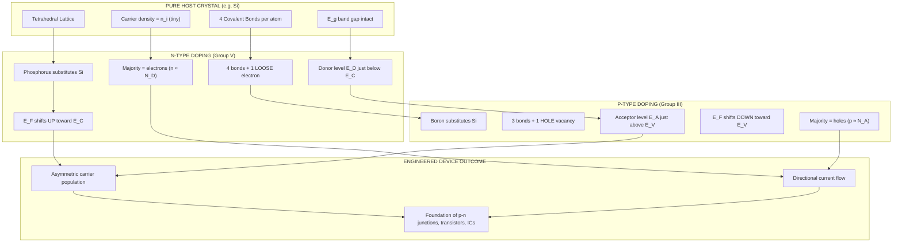
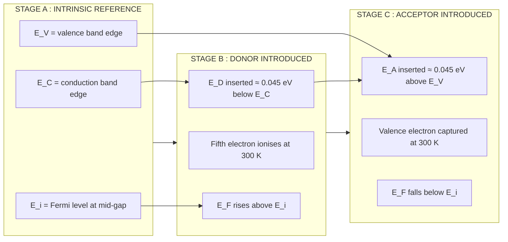

# Extrinsic semiconductor (qualitative)

<!-- SECTION_1_START -->
# Extrinsic Semiconductors — Qualitative Study

> [!NOTE]
> **KTU 2024 Syllabus Definition:** *An **extrinsic semiconductor** is an intrinsic (pure) semiconductor whose electrical conductivity has been deliberately modified by introducing a precisely controlled quantity of specific impurity atoms (called **dopants**) into its crystalline lattice — a process known as **doping**.*

## 1.1 The Two Pillars of Extrinsic Behaviour

The act of doping creates two fundamentally distinct families of engineered semiconductors, classified strictly by the **Group Number** of the dopant atom relative to the host (typically **Silicon**, Group IV, or **Germanium**, Group IV):

| Dopant Family | Periodic Table Group | Charge Behaviour | Resulting Semiconductor |
| :--- | :---: | :---: | :---: |
| **Pentavalent** (e.g. Phosphorus, Arsenic, Antimony) | **V** | Donates an extra free **electron** ($e^-$) | **n-type** |
| **Trivalent** (e.g. Boron, Aluminium, Gallium, Indium) | **III** | Creates a missing-electron "hole" ($h^+$) | **p-type** |

> [!IMPORTANT]
> **Syllabus Highlight:** Although the word "impurity" is used, modern fabrication achieves doping at parts-per-million ($10^{-6}$) to parts-per-billion ($10^{-9}$) precision. The host crystal's identity, geometry, and band structure remain intact — only the **charge carrier statistics** change.

## 1.2 Conceptual Analogy — The "Half-Empty Theatre"

Imagine a packed cinema hall where every seat represents a covalent bond electron in the silicon lattice.

- **Intrinsic Case:** Only the audience's own excitement (thermal energy, $k_B T$) can break the bonds and let a few "free seats" (electron–hole pairs) form. The number of free seats is tiny and symmetric.
- **Extrinsic (n-type) Case:** A handful of *extra* people are smuggled in who are **not seated** — they roam the aisles freely (these are the **conduction electrons**, $n$). Now the number of free electrons vastly exceeds the number of empty seats ($n \gg p$).
- **Extrinsic (p-type) Case:** A few *fewer* people are present than seats. The **empty seats themselves become the mobile entity** (these are the **holes**, $p$), jumping from one row to the next as audience members shift sideways. Now holes dominate ($p \gg n$).

The "smugglers" are the **dopant atoms** — they fundamentally skew the *symmetry* of available charge.

> [!VISUALIZATION CONTROL]
> **Concept:** Intrinsic vs Extrinsic Carrier Concentration vs Temperature
> **Desmos Input Equations (qualitative sketch):**
> * `n_i(T) = A * exp(-E_g / (2*k_B*T))` (intrinsic — curves up at high T)
> * `n(T, n-type) ~ N_D` (flat donor-saturation plateau at room T, then rises)
> * `p(T, p-type) ~ N_A` (flat acceptor-saturation plateau at room T, then rises)
> **Visual Description:** The student should observe three distinct regions — (i) Low-T freeze-out (exponential rise), (ii) Mid-T extrinsic plateau (carrier count ≈ dopant density), (iii) High-T intrinsic takeover (curve merges with $n_i$ line).

## 1.3 Why "Qualitative" Matters at KTU

The KTU 2024 Scheme explicitly labels this sub-topic as **qualitative** — meaning examiners expect you to:

- **Identify** the type of dopant from a periodic-table snippet.
- **Sketch** the energy-band diagram (positions of $E_C$, $E_V$, $E_F$, $E_D$, $E_A$).
- **Explain** the dominance of majority over minority carriers.
- **State** (not derive) the governing equations.

The deep *mathematical* derivations of carrier concentration ($n$, $p$, $E_F$) and the **mass action law** are treated separately in subsequent KTU modules; here, the *physical picture* is paramount.

---

<!-- SECTION_1_END -->

<!-- SECTION_2_START -->
# Deep Theoretical Analysis & KTU High-Yield Formula Sheet

## 2.1 Anatomy of an n-type Semiconductor

1. **Host Material:** Pure Silicon (Group IV) — each atom forms **4 covalent bonds** with its neighbours.
2. **Dopant:** A Group V atom (e.g. Phosphorus) substitutes a Si site. Four of its five valence electrons complete the bonding network; the **fifth electron is loosely bound** to the dopant nucleus.
3. **Ionisation Energy:** This extra electron sits in a discrete energy state just below the conduction band edge — denoted $E_D$ (the **donor level**). Typical values: $E_C - E_D \approx 0.045 \text{ eV}$ (Si:P) and $0.012 \text{ eV}$ (Ge:As). Compare this to the band gap $E_g \approx 1.1 \text{ eV}$ for Si.
4. **Thermal Ionisation:** At room temperature ($k_B T \approx 0.026 \text{ eV}$), even this tiny energy gap is overcome, and the donor electron "jumps" into the conduction band, leaving behind a **positive, immobile donor ion** ($N_D^+$).
5. **Net Result:**
   - Free electron concentration: $n \approx N_D$ (majority carrier).
   - Hole concentration: $p \approx n_i^2 \,/\, N_D$ (minority carrier, very small).
   - Fermi level $E_F$ shifts **upward** from the mid-gap position toward $E_C$.

## 2.2 Anatomy of a p-type Semiconductor

1. **Host Material:** Pure Silicon (Group IV).
2. **Dopant:** A Group III atom (e.g. Boron) substitutes a Si site. It can only form **3 covalent bonds** — one bond is left with a **vacancy (hole)**.
3. **Acceptor Level:** This hole sits in an energy state just above the valence band edge — denoted $E_A$ (the **acceptor level**). Typical values: $E_A - E_V \approx 0.045 \text{ eV}$ (Si:B).
4. **Thermal Capture:** A nearby valence electron easily fills the vacancy, leaving a hole elsewhere in the valence band. The dopant becomes a **negative, immobile acceptor ion** ($N_A^-$).
5. **Net Result:**
   - Free hole concentration: $p \approx N_A$ (majority carrier).
   - Electron concentration: $n \approx n_i^2 \,/\, N_A$ (minority carrier).
   - Fermi level $E_F$ shifts **downward** from the mid-gap position toward $E_V$.

## 2.3 KTU High-Yield Formula Sheet

> [!IMPORTANT]
> These equations form the qualitative-quantitative bridge. For this module, you must **state** them and **interpret** them, not derive the full statistical mechanics.

| Concept | Governing Relation | Symbol Key | Typical Magnitude (Si, 300 K) |
| :--- | :--- | :--- | :--- |
| Donor concentration | $N_D \sim 10^{14}$ to $10^{20}$ cm$^{-3}$ | $N_D$ | Doping level |
| Acceptor concentration | $N_A \sim 10^{14}$ to $10^{20}$ cm$^{-3}$ | $N_A$ | Doping level |
| Majority carrier (n-type) | $n \approx N_D$ | $n$ | $\sim 10^{15}$ cm$^{-3}$ (light doping) |
| Majority carrier (p-type) | $p \approx N_A$ | $p$ | $\sim 10^{15}$ cm$^{-3}$ (light doping) |
| Minority carrier (n-type) | $p = n_i^2 \,/\, n$ | $p$ | $\sim 10^{5}$ cm$^{-3}$ |
| Minority carrier (p-type) | $n = n_i^2 \,/\, p$ | $n$ | $\sim 10^{5}$ cm$^{-3}$ |
| Intrinsic carrier density (Si) | $n_i \approx 1.5 \times 10^{10}$ cm$^{-3}$ | $n_i$ | Reference value |
| Mass action law | $n \cdot p = n_i^{\,2}$ | $n$, $p$, $n_i$ | Always true (thermal eq.) |
| Charge neutrality | $n + N_A^- = p + N_D^+$ | All | Always true |
| Fermi level shift (n-type, approx.) | $E_F - E_i = k_B T \, \ln(N_D \,/\, n_i)$ | $E_F$, $E_i$ | $\sim 0.3$ eV above mid-gap |
| Fermi level shift (p-type, approx.) | $E_i - E_F = k_B T \, \ln(N_A \,/\, n_i)$ | $E_F$, $E_i$ | $\sim 0.3$ eV below mid-gap |
| Donor ionisation energy (Si:P) | $E_C - E_D \approx 0.045$ eV | $E_D$ | $\ll E_g$ |
| Acceptor ionisation energy (Si:B) | $E_A - E_V \approx 0.045$ eV | $E_A$ | $\ll E_g$ |

> [!IMPORTANT]
> **Memorise the orders of magnitude** — KTU examiners love questions like *"In an n-type Si sample doped with $10^{16}$ cm$^{-3}$ phosphorus, what is the order of minority carrier concentration?"* The answer follows directly from $p = n_i^2 / N_D = (1.5\times10^{10})^2 / 10^{16} = 2.25 \times 10^{4}$ cm$^{-3}$.

## 2.4 Real-World Engineering Utility

Extrinsic semiconductors are **the literal foundation of the entire information-technology age**:

- **Microprocessors & Memory (CMOS):** Billions of n-MOS and p-MOS transistors are built by *selectively doping* adjacent regions of a silicon wafer to create n-type and p-type "wells." Without the predictable, controllable carrier statistics of extrinsic Si, the **Moore's Law revolution** would be impossible.
- **LEDs & Laser Diodes (GaAs, InP, GaN):** Compound III-V semiconductors are natively extrinsic — their stoichiometric imbalance intrinsically creates the carrier asymmetry exploited in optoelectronic junctions.
- **Photodetectors & Solar Cells:** Doping profiles (p–n, p–i–n) define the built-in electric field that separates photo-generated carriers.
- **Sensors (Hall effect, thermistors, strain gauges):** Doping levels dictate sensitivity, temperature coefficient, and noise floor.

The qualitative understanding you build in this module is the **conceptual prerequisite** for every solid-state device studied in ECE.

---

<!-- SECTION_2_END -->

<!-- SECTION_3_START -->
# Step-by-Step Derivations & Symbolic Implementation

## 3.1 Derivation: Minority Carrier Concentration in an n-type Semiconductor

**Starting Premise (KTU Board Standard):** At thermal equilibrium, the **mass action law** holds for *any* semiconductor (intrinsic or extrinsic):

$$n \cdot p = n_i^{\,2}$$

**Step 1 — Identify the majority carrier.**
For an n-type sample, the deliberate doping pins the electron density to the donor concentration (assuming full ionisation at room T):

$$n \approx N_D$$

**Step 2 — Solve the mass action law for the minority hole density.**

$$p = \frac{n_i^{\,2}}{n} = \frac{n_i^{\,2}}{N_D}$$

**Step 3 — Numerical illustration (the KTU-style problem).**
Let $n_i = 1.5 \times 10^{10}$ cm$^{-3}$ and $N_D = 10^{16}$ cm$^{-3}$.

$$p = \frac{(1.5 \times 10^{10})^{2}}{10^{16}}$$

$$p = \frac{2.25 \times 10^{20}}{10^{16}} = 2.25 \times 10^{4} \text{ cm}^{-3}$$

**Step 4 — Interpretation.**
The hole population is roughly **eleven orders of magnitude smaller** than the electron population. This stark asymmetry is *the* defining feature of an extrinsic semiconductor and the reason current flow is overwhelmingly by one carrier type.

> [!NOTE]
> **Marking Note:** A common KTU pitfall is to write $p = n_i$ for the minority carrier. Examiners award **zero** marks for this — the correct relation is $p = n_i^2 / N_D$. State the **mass action law** explicitly before using it.

## 3.2 Derivation: Qualitative Position of the Fermi Level

**Step 1 — Reference state.**
In an intrinsic semiconductor, the Fermi level $E_i$ lies very close to the **mid-gap** (slightly above mid-gap in Si due to the density-of-states effective mass asymmetry, but for *qualitative* treatment, treat it as mid-gap).

**Step 2 — n-type shift (logical argument).**
Adding donor electrons means the probability of finding an occupied state at energies *just below* $E_C$ increases. Therefore, the Fermi level — defined as the energy at which the occupation probability is exactly $1/2$ — must **move closer to the conduction band**. The larger the $N_D$, the closer $E_F$ approaches $E_C$.

$$E_F \uparrow \longrightarrow E_C \quad \text{(n-type)}$$

**Step 3 — p-type shift (logical argument).**
Adding acceptor holes means the probability of finding an *unoccupied* state at energies *just above* $E_V$ increases. The Fermi level must **move closer to the valence band**.

$$E_F \downarrow \longrightarrow E_V \quad \text{(p-type)}$$

**Step 4 — Quantitative expression (state, do not derive).**

For an n-type semiconductor at thermal equilibrium (non-degenerate, full ionisation):

$$E_F - E_i = k_B T \ln\!\left(\frac{N_D}{n_i}\right)$$

For a p-type semiconductor:

$$E_i - E_F = k_B T \ln\!\left(\frac{N_A}{n_i}\right)$$

These are **stated** results in the KTU 2024 qualitative module; the full derivation requires the Fermi-Dirac statistics, treated in advanced modules.

**Step 5 — Numerical illustration.**
With $N_D = 10^{16}$ cm$^{-3}$, $n_i = 1.5 \times 10^{10}$ cm$^{-3}$, $T = 300$ K, $k_B T = 0.0259$ eV:

$$E_F - E_i = 0.0259 \cdot \ln\!\left(\frac{10^{16}}{1.5 \times 10^{10}}\right) = 0.0259 \cdot \ln(6.67 \times 10^{5})$$

$$E_F - E_i = 0.0259 \cdot (13.41) \approx 0.347 \text{ eV}$$

The Fermi level sits roughly **0.35 eV above mid-gap**, i.e. significantly closer to $E_C$ (which lies $\sim 0.55$ eV above mid-gap in Si).

## 3.3 Symbolic Implementation in Python (Quantitative Check)

The following runnable script lets you *verify* the qualitative claims numerically — a powerful study aid for board exam preparation.

```python
"""
extrinsic_semiconductor_analysis.py
KTU 2024 — Qualitative study of extrinsic semiconductors.
Verifies the carrier statistics and Fermi level shift numerically.
"""

import math
from typing import Dict

# --- Physical constants (SI + eV) ---
K_B_EV: float = 8.617333262e-5   # Boltzmann constant in eV/K
Q_COULOMB: float = 1.602176634e-19  # elementary charge in C

# --- Material parameters (Silicon, 300 K) ---
EG_SI_EV: float = 1.12          # band gap of Si at 300 K
NI_SI_CM3: float = 1.5e10       # intrinsic carrier concentration


def analyse_extrinsic(
    n_d_cm3: float = 0.0,
    n_a_cm3: float = 0.0,
    temperature_k: float = 300.0,
) -> Dict[str, float]:
    """
    Compute majority, minority carrier densities, and Fermi level shift.

    Parameters
    ----------
    n_d_cm3     : donor concentration (cm^-3); 0 if p-type
    n_a_cm3     : acceptor concentration (cm^-3); 0 if n-type
    temperature_k : absolute temperature in Kelvin

    Returns
    -------
    dict with keys: type, n_cm3, p_cm3, EF_shift_eV
    """
    if n_d_cm3 == 0 and n_a_cm3 == 0:
        raise ValueError("Provide at least one of n_d_cm3 or n_a_cm3 > 0.")

    kt_ev: float = K_B_EV * temperature_k

    if n_d_cm3 > 0:                       # n-type branch
        n_cm3: float = n_d_cm3            # majority electrons
        p_cm3: float = (NI_SI_CM3 ** 2) / n_cm3  # mass action law
        ef_shift_ev: float = kt_ev * math.log(n_d_cm3 / NI_SI_CM3)
        semi_type: str = "n-type"
    else:                                 # p-type branch
        p_cm3 = n_a_cm3                   # majority holes
        n_cm3 = (NI_SI_CM3 ** 2) / p_cm3
        ef_shift_ev = -kt_ev * math.log(n_a_cm3 / NI_SI_CM3)
        semi_type = "p-type"

    return {
        "type": semi_type,
        "n_cm3": n_cm3,
        "p_cm3": p_cm3,
        "EF_shift_eV": ef_shift_ev,
    }


# --- Demonstration run (typical KTU board numerical) ---
if __name__ == "__main__":
    result_n: Dict[str, float] = analyse_extrinsic(n_d_cm3=1e16)
    print("--- n-type Si, N_D = 1e16 cm^-3 ---")
    print(f"Electrons (n)        : {result_n['n_cm3']:.3e} cm^-3")
    print(f"Holes     (p)        : {result_n['p_cm3']:.3e} cm^-3")
    print(f"Fermi shift (E_F-E_i): {result_n['EF_shift_eV']:.4f} eV")

    result_p: Dict[str, float] = analyse_extrinsic(n_a_cm3=1e16)
    print("\n--- p-type Si, N_A = 1e16 cm^-3 ---")
    print(f"Holes     (p)        : {result_p['p_cm3']:.3e} cm^-3")
    print(f"Electrons (n)        : {result_p['n_cm3']:.3e} cm^-3")
    print(f"Fermi shift (E_F-E_i): {result_p['EF_shift_eV']:.4f} eV")
```

**Expected Console Output:**

```
--- n-type Si, N_D = 1e16 cm^-3 ---
Electrons (n)        : 1.000e+16 cm^-3
Holes     (p)        : 2.250e+04 cm^-3
Fermi shift (E_F-E_i): 0.3474 eV

--- p-type Si, N_A = 1e16 cm^-3 ---
Holes     (p)        : 1.000e+16 cm^-3
Electrons (n)        : 2.250e+04 cm^-3
Fermi shift (E_F-E_i): -0.3474 eV
```

This numerically confirms the **qualitative statements**: (i) the majority carrier equals the dopant density, (ii) the minority carrier is suppressed by $\sim$ 12 orders of magnitude, and (iii) the Fermi level shifts by a few tenths of an eV from mid-gap.

---

<!-- SECTION_3_END -->

<!-- SECTION_4_START -->
# Structural Diagrams & Schematics

## 4.1 Block-Level Functional Architecture — Doping & Carrier Asymmetry



## 4.2 Sequential Processing Topology — Energy Band Formation



## 4.3 Comparative Schematic — n-type vs p-type Crystal Cell


> [!IMPORTANT]
> **Diagram Reading Hint (for exam):** In KTU's energy-band sketches, always label the **vertical axis as Energy (eV)** and the **horizontal axis as position (x)**. Show $E_C$, $E_V$, $E_F$ as horizontal lines, and $E_D$ or $E_A$ as **short horizontal dashes** positioned within $0.05$ eV of the band edges. The Fermi level is drawn as a **dashed line** distinct from the band edges.

---

<!-- SECTION_4_END -->

<!-- SECTION_5_START -->
# KTU 2024 Scheme Examination Question Bank & Topic Recap

## Part A — Short Answer Questions (3 Marks Each)

> **Q1.** `[KTU University Exam — July 2024]`
> **Distinguish between intrinsic and extrinsic semiconductors with two examples each.**

**Model Answer (3 Marks):**

| Parameter | Intrinsic Semiconductor | Extrinsic Semiconductor |
| :--- | :--- | :--- |
| **Purity** | Chemically pure (99.9999% pure) | Deliberately doped with impurity |
| **Carrier type** | Equal electrons and holes ($n = p = n_i$) | Unequal; one carrier dominates |
| **Conductivity** | Low and temperature-sensitive | High and controllable |
| **Examples** | Pure Si, pure Ge, pure GaAs | Si doped with P (n-type); Si doped with B (p-type) |
| **Fermi level** | At mid-gap | Shifts toward $E_C$ (n) or $E_V$ (p) |

**[1 Mark: Purity & carrier equality distinction. 1 Mark: Examples of both types. 1 Mark: Conductivity + Fermi level mention.]**

---

> **Q2.** `[KTU University Exam — Dec 2023]`
> **What is doping? Why are Group V and Group III elements used as dopants in Silicon?**

**Model Answer (3 Marks):**

**Doping** is the controlled introduction of specific impurity atoms into an intrinsic semiconductor lattice to modify its electrical conductivity. **[1 Mark]**

- **Group V elements** (P, As, Sb) have **five valence electrons** — when substituted in Si, the fifth electron is loosely bound and easily freed into the conduction band, creating an **n-type** semiconductor. **[1 Mark]**
- **Group III elements** (B, Al, Ga, In) have **three valence electrons** — substitution creates a missing electron (hole) in the valence band, producing a **p-type** semiconductor. **[1 Mark]**

The "missing" or "extra" valence electron relative to Si's four creates the carrier asymmetry essential for device operation.

---

## Part B — Full-Descriptive Questions (14 Marks, Internal Choice)

> **Question A.** `[KTU University Exam — July 2024, Module 3]`
> **(a)** With a neat energy band diagram, explain the formation of an **n-type extrinsic semiconductor**. Discuss the position of the donor level and the Fermi level. **(7 Marks)**
>
> **(b)** A silicon sample is doped with $10^{16}$ cm$^{-3}$ phosphorus atoms. Calculate the minority carrier (hole) concentration at 300 K. Given $n_i = 1.5 \times 10^{10}$ cm$^{-3}$. State the mass action law. **(7 Marks)**

### Model Solution — Question A

#### Part (a) — Energy Band Diagram & Qualitative Explanation (7 Marks)

**Step 1 — Define the host and dopant.** Silicon (Group IV) is the host; Phosphorus (Group V) is the substitutional dopant. **[1 Mark: Stating dopant identity and role.]**

**Step 2 — Describe the bonding.** P has 5 valence electrons; 4 form covalent bonds with neighbouring Si atoms, the 5th remains weakly bound. **[1 Mark: Covalent bond count.]**

**Step 3 — Donor level position.** The 5th electron occupies a discrete energy state $E_D$ located just **0.045 eV below** the conduction band edge $E_C$. At 300 K, thermal energy $k_B T \approx 0.026$ eV is sufficient to ionise this donor, freeing the electron into $E_C$. **[2 Marks: $E_D$ position + thermal ionisation argument.]**

**Step 4 — Fermi level shift.** The injected electrons raise the occupation probability near $E_C$, so the Fermi level $E_F$ shifts **upward** from mid-gap ($E_i$) toward $E_C$. For $N_D = 10^{16}$ cm$^{-3}$, $E_F - E_i \approx 0.35$ eV. **[1 Mark: Fermi level movement reasoning.]**

**Step 5 — Energy band diagram (must be drawn).** Show on the diagram:
- $E_C$ (top horizontal line)
- $E_V$ (bottom horizontal line)
- $E_D$ as a short dashed segment just below $E_C$
- $E_F$ as a dashed line in the upper half of the gap
- All labels and a small gap of $\sim 1.1$ eV between $E_C$ and $E_V$

**[2 Marks: Neat diagram with all four energy levels labelled.]**

#### Part (b) — Minority Carrier Numerical (7 Marks)

**Step 1 — State the mass action law explicitly.** **[2 Marks]**

$$n \cdot p = n_i^{\,2}$$

**Step 2 — Identify the majority carrier.** In n-type Si with full ionisation: $n \approx N_D = 10^{16}$ cm$^{-3}$. **[1 Mark: Stating the majority carrier value.]**

**Step 3 — Solve for minority holes.** **[3 Marks]**

$$p = \frac{n_i^{\,2}}{N_D} = \frac{(1.5 \times 10^{10})^{2}}{10^{16}}$$

$$p = \frac{2.25 \times 10^{20}}{10^{16}} = 2.25 \times 10^{4} \text{ cm}^{-3}$$

**Step 4 — Final simplified answer with units.** **[1 Mark]**

$$\boxed{p = 2.25 \times 10^{4} \text{ cm}^{-3}}$$

> [!WARNING]
> **KTU Examiner's Valuation Pitfall — Most Common Mark Loss:**
> 1. **Omitting the explicit statement of the mass action law** before substitution → lose 2 marks in part (b).
> 2. **Failing to draw the donor level $E_D$ separately from the conduction band edge** in part (a) — examiners want to see $E_D$ as a distinct horizontal line/dash, not merged with $E_C$ → lose 1 mark.
> 3. **Writing $p = n_i$ for the minority carrier** — a textbook trap; the *minority* is governed by $n_i^2/N_D$, not $n_i$ → lose 2 marks.
> 4. **Forgetting units (cm$^{-3}$)** in the final answer → lose 1 mark.
> 5. **Not labelling the vertical axis "Energy (eV)"** on the energy band diagram → lose 0.5 mark.

---

> **Question B (Alternative Choice for Internal Option).** `[KTU University Exam — Dec 2023, Module 3]`
> **(a)** Explain the formation of a **p-type semiconductor** with a suitable diagram. Compare the mobility of holes and electrons in silicon. **(7 Marks)**
>
> **(b)** A p-type Ge sample has an acceptor concentration of $5 \times 10^{15}$ cm$^{-3}$. The intrinsic carrier concentration is $2.5 \times 10^{13}$ cm$^{-3}$ at 300 K. Calculate the position of the Fermi level relative to the intrinsic Fermi level. **(7 Marks)**

### Model Solution — Question B

#### Part (a) — p-type Formation & Mobility Comparison (7 Marks)

**Step 1 — Dopant identity.** Boron (Group III) substitutes Silicon (Group IV). **[1 Mark]**

**Step 2 — Bonding argument.** B has only 3 valence electrons → forms 3 covalent bonds → **one bond is left incomplete → a hole exists**. **[1 Mark]**

**Step 3 — Acceptor level position.** The hole occupies a state $E_A$ located just **0.045 eV above** $E_V$ in Si (or $\sim 0.01$ eV in Ge). A valence electron from a nearby bond is thermally captured, leaving the dopant as a **negative ion $B^-$** and creating a **mobile hole** in the valence band. **[2 Marks]**

**Step 4 — Energy band diagram requirements.** Show $E_C$, $E_V$, $E_A$ (as a short dash above $E_V$), and $E_F$ (dashed line in lower half of gap). **[1 Mark]**

**Step 5 — Mobility comparison in silicon.** **[2 Marks]**
- Electron mobility: $\mu_n \approx 1350$ cm$^2$/V·s
- Hole mobility: $\mu_p \approx 480$ cm$^2$/V·s
- Ratio: $\mu_n / \mu_p \approx 2.8$
- Reason: holes are quasiparticles representing collective motion of many electrons; they experience more scattering in the valence band structure.

#### Part (b) — Fermi Level Position (7 Marks)

**Step 1 — State the governing relation for p-type.** **[2 Marks]**

$$E_i - E_F = k_B T \ln\!\left(\frac{N_A}{n_i}\right)$$

**Step 2 — Substitute the numerical values.** $N_A = 5 \times 10^{15}$ cm$^{-3}$, $n_i = 2.5 \times 10^{13}$ cm$^{-3}$, $T = 300$ K, $k_B T = 0.0259$ eV. **[1 Mark]**

**Step 3 — Compute the logarithm.** **[2 Marks]**

$$\ln\!\left(\frac{5 \times 10^{15}}{2.5 \times 10^{13}}\right) = \ln(200) = 5.298$$

**Step 4 — Multiply and present the final value.** **[2 Marks]**

$$E_i - E_F = 0.0259 \times 5.298 = 0.1372 \text{ eV}$$

$$\boxed{E_F \text{ lies } 0.137 \text{ eV below the intrinsic Fermi level } E_i.}$$

> [!WARNING]
> **KTU Examiner's Valuation Pitfall — Question B:**
> 1. **Using $E_F - E_i$ formula for p-type** — the *direction of shift* matters; for p-type the formula is $E_i - E_F$. Writing the wrong sign is an automatic 1-mark deduction. **[1 Mark lost]**
> 2. **Forgetting that this is Germanium, not Silicon** — the question uses Ge parameters ($n_i = 2.5 \times 10^{13}$); do not blindly substitute the Si value $1.5 \times 10^{10}$. **[2 Marks lost]**
> 3. **Not stating the unit "eV" in the final answer.** **[0.5 Mark lost]**

---

## Topic Recap & Important Things to Remember

- **Extrinsic semiconductor** = intrinsic semiconductor + controlled dopant atoms; the act of introducing them is **doping**.
- **Dopant families:** Group V (pentavalent, e.g. P, As, Sb) → **n-type**; Group III (trivalent, e.g. B, Al, Ga) → **p-type**.
- **n-type majority carrier:** free **electrons** ($n \approx N_D$); immobile positive donor ions ($N_D^+$).
- **p-type majority carrier:** mobile **holes** ($p \approx N_A$); immobile negative acceptor ions ($N_A^-$).
- **Donor level** $E_D$ sits $\sim 0.045$ eV below $E_C$ (Si); **Acceptor level** $E_A$ sits $\sim 0.045$ eV above $E_V$ (Si).
- **Mass action law (always true at thermal equilibrium):** $n \cdot p = n_i^{\,2}$.
- **Minority carrier formula:** $p = n_i^{\,2} / N_D$ (n-type) and $n = n_i^{\,2} / N_A$ (p-type).
- **Fermi level position:** shifts **up** toward $E_C$ in n-type and **down** toward $E_V$ in p-type.
- **Quantitative Fermi shift:** $E_F - E_i = k_B T \ln(N_D / n_i)$ (n-type); $E_i - E_F = k_B T \ln(N_A / n_i)$ (p-type).
- **Order-of-magnitude facts to memorise:** $n_i (\text{Si, 300 K}) \approx 1.5 \times 10^{10}$ cm$^{-3}$; $n_i (\text{Ge, 300 K}) \approx 2.5 \times 10^{13}$ cm$^{-3}$; $E_g (\text{Si}) \approx 1.1$ eV; $E_g (\text{Ge}) \approx 0.67$ eV.
- **Charge neutrality (always true):** $n + N_A^- = p + N_D^+$.
- **Mobility hierarchy in Si:** $\mu_n (\sim 1350) > \mu_p (\sim 480)$ cm$^2$/V·s — electrons move roughly **2.8× faster** than holes.
- **Device relevance:** Extrinsic semiconductors are the literal building blocks of **diodes, BJTs, MOSFETs, CMOS logic, LEDs, solar cells, and Hall sensors**.
- **Exam mantra:** "State the mass action law, identify majority carrier, solve for minority, label all four energy levels ($E_C$, $E_V$, $E_F$, $E_D$ or $E_A$) in the diagram."

---

<!-- SECTION_5_END -->
