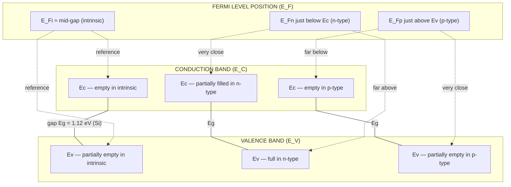
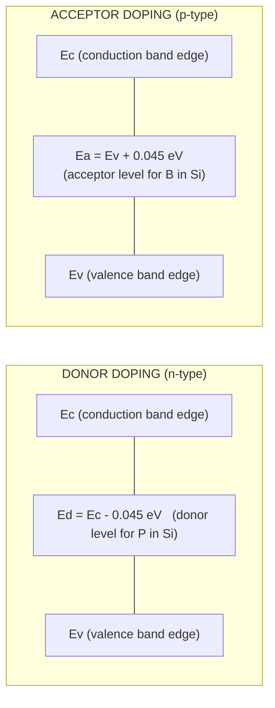
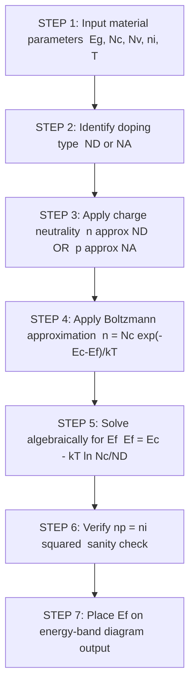
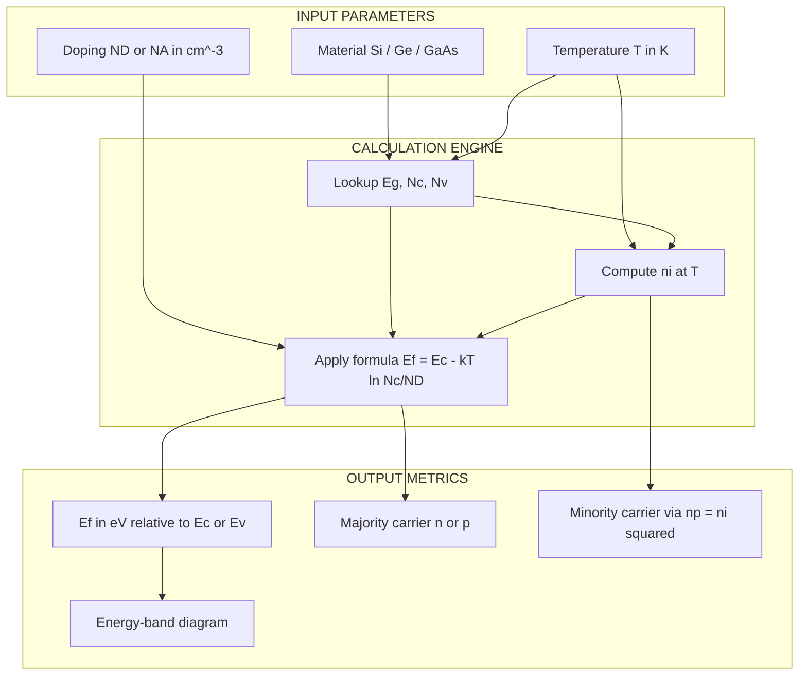

# Fermi level in semiconductors-intrinsic and extrinsic

<!-- SECTION_1_START -->
# Fermi Level in Semiconductors — Intrinsic and Extrinsic

## 1.1 Formal Definition (KTU 2024 Syllabus Terminology)

> [!IMPORTANT]
> **Fermi Level ($E_F$):** The Fermi level is the thermodynamic work required to add one electron to a solid, measured with respect to an arbitrary reference energy (usually the vacuum level or the top of the valence band). At absolute zero ($T = 0\text{ K}$), it is the boundary energy that separates the occupied quantum states from the unoccupied quantum states. At any finite temperature $T$, $E_F$ is the energy level at which the probability of an electronic state being occupied by an electron is exactly **50 %** (i.e., the Fermi–Dirac occupation probability $f(E) = \tfrac{1}{2}$).

Mathematically, the Fermi–Dirac distribution function is expressed as:

$$
f(E) \;=\; \frac{1}{1+\exp\!\left(\dfrac{E - E_F}{k_B T}\right)}
$$

where:
* $E$ is the energy of the electronic state (in eV)
* $E_F$ is the Fermi energy (in eV)
* $k_B = 1.38 \times 10^{-23}\;\text{J/K} = \mathbf{8.617 \times 10^{-5}\;\text{eV/K}}$ is the Boltzmann constant
* $T$ is the absolute temperature in Kelvin

> [!NOTE]
> **Why is $E_F$ so important?** In a semiconductor, the position of $E_F$ inside the forbidden energy gap (between the valence band $E_V$ and the conduction band $E_C$) directly dictates the **concentration of free electrons ($n$) in the conduction band** and the **concentration of free holes ($p$) in the valence band**. Devices like diodes, BJTs, MOSFETs, and photodetectors all work because engineers can precisely *engineer* the position of $E_F$ through doping.

## 1.2 Conceptual Analogy & Plain-English Intuition

> [!IMPORTANT]
> **Analogy — The "Water Level" in a Half-Filled Tank:**
> Imagine a building with two large water tanks: a lower one representing the **valence band** (filled with water/electrons) and an upper one representing the **conduction band** (empty). The two tanks are connected by a small ladder (the forbidden energy gap $E_g$).
>
> * **The Fermi level = the *imagine d* water level that *would* exist if the two tanks were merged.** It is not a physical water level inside either tank — it is a *reference mark* indicating how many electrons have the energy to climb up.
> * In an **intrinsic semiconductor** (pure Si, pure Ge), there are equal numbers of electrons and holes. The "imagine d water level" sits almost exactly in the middle of the gap — there is symmetry.
> * In an **n-type semiconductor** (doped with pentavalent impurities like Phosphorus, As, Sb), extra free electrons are *donated* into the upper tank. The Fermi level **rises upward** toward the conduction band.
> * In a **p-type semiconductor** (doped with trivalent impurities like Boron, Al, Ga), extra holes are created in the lower tank. The Fermi level **falls downward** toward the valence band.
>
> **Take-away:** Doping is the *knob* an engineer turns to move the Fermi level up or down inside the energy gap — and this single act controls the conductivity, the type (n or p), and the device behavior of the entire semiconductor.

## 1.3 Intrinsic vs. Extrinsic — A Quick Distinction

> [!NOTE]
> **Intrinsic Semiconductor (i-type):** A chemically pure, crystalline semiconductor with **no impurity atoms** and **no lattice defects**. At $T > 0\text{ K}$, thermal agitation lifts electrons from the valence band (VB) into the conduction band (CB), creating an **electron–hole pair**. The number of free electrons ($n$) always equals the number of free holes ($p$), so:
>
> $$n_i \;=\; n \;=\; p$$
>
> where $n_i$ is the **intrinsic carrier concentration**. Example: pure Silicon (Si), pure Germanium (Ge), pure Gallium Arsenide (GaAs).
>
> **Extrinsic Semiconductor:** A semiconductor that has been deliberately *doped* with a tiny, controlled amount of impurity atoms (typically 1 in $10^6$ to 1 in $10^8$ host atoms).
> * **n-type:** Doped with **donor** (pentavalent) impurities. Majority carriers = electrons; $n \gg p$.
> * **p-type:** Doped with **acceptor** (trivalent) impurities. Majority carriers = holes; $p \gg n$.

## 1.4 Visualization — Position of Fermi Level

> [!VISUALIZATION CONTROL]
> **Concept:** Schematic of the Fermi level position inside the forbidden energy gap for intrinsic, n-type, and p-type semiconductors.
>
> **Desmos / Hand-drawn input:**
> * Vertical energy axis $E$ (in eV)
> * Two horizontal lines: $E_C$ (top of conduction band) and $E_V$ (bottom of valence band)
> * Three coloured dots / markers for $E_F$:
>   * Mid-gap (slightly above mid-gap for Si due to density-of-states asymmetry) → **intrinsic**
>   * Slightly below $E_C$ → **n-type**
>   * Slightly above $E_V$ → **p-type**
>
> **Visual Description:** On the energy-level vertical axis (eV), the student should see the forbidden gap $E_g$ as a horizontal strip between $E_V$ (lower line) and $E_C$ (upper line). The Fermi level marker should be exactly at the middle for intrinsic, and should be *much closer* to $E_C$ for n-type and *much closer* to $E_V$ for p-type.

<!-- SECTION_1_END -->

<!-- SECTION_2_START -->
# Deep Theoretical Analysis & KTU Formula Sheet

## 2.1 Intrinsic Fermi Level — Mid-Gap Position

For an **intrinsic (pure) semiconductor**, the density of available states in the conduction band ($N_C$) and the density of available states in the valence band ($N_V$) are not equal — they depend on the *effective mass* of the carriers in each band. The intrinsic Fermi level $E_{F,i}$ is therefore pinned **slightly off the exact mid-gap** to a position that satisfies the electron-hole symmetry in *density of states*, not in energy.

The general position of $E_{F,i}$ measured from the **top of the valence band** ($E_V$) is:

$$
E_{F,i} \;-\; E_V \;=\; \frac{E_g}{2} \;+\; \frac{1}{2}\,k_B T\,\ln\!\left(\frac{N_V}{N_C}\right)
$$

The equivalent expression measured from the **bottom of the conduction band** ($E_C$) is:

$$
E_C \;-\; E_{F,i} \;=\; \frac{E_g}{2} \;+\; \frac{1}{2}\,k_B T\,\ln\!\left(\frac{N_C}{N_V}\right)
$$

The **effective density of states** in each band is given by:

$$
N_C \;=\; 2\!\left(\frac{2\pi m_e^* k_B T}{h^2}\right)^{3/2}
\qquad
N_V \;=\; 2\!\left(\frac{2\pi m_h^* k_B T}{h^2}\right)^{3/2}
$$

where:
* $m_e^*$ = effective mass of the electron in the conduction band
* $m_h^*$ = effective mass of the hole in the valence band
* $h$ = Planck's constant $= 6.626 \times 10^{-34}\;\text{J·s}$

> [!NOTE]
> **Special case:** If $m_e^* = m_h^*$ (symmetric bands), then $N_C = N_V$, and the logarithm term vanishes, giving $E_{F,i} = E_V + \tfrac{E_g}{2}$ — exactly at the mid-gap. For real materials like Si and Ge, the small offset is a *correction* that board questions occasionally test.

## 2.2 Intrinsic Carrier Concentration ($n_i$)

The intrinsic carrier concentration is the most fundamental quantity in semiconductor physics. It is given by:

$$
n_i^2 \;=\; N_C\,N_V\,\exp\!\left(-\frac{E_g}{k_B T}\right)
$$

A useful, often-quoted equivalent form is:

$$
n_i \;=\; \sqrt{N_C N_V}\,\exp\!\left(-\frac{E_g}{2 k_B T}\right)
$$

> [!TIP]
> **Physical meaning of the exponential:** The factor $\exp(-E_g / 2k_BT)$ captures the *thermal struggle* of an electron to climb the full band gap. Larger $E_g$ → exponentially fewer carriers → less conduction. This is why insulators (large $E_g$) are non-conducting and why intrinsic Si at room temperature has only $n_i \approx 1.5 \times 10^{10}\;\text{cm}^{-3}$ compared to Si's atomic density of $5 \times 10^{22}\;\text{cm}^{-3}$ — only **one in 3 trillion atoms** contributes a free carrier.

For Silicon at $T = 300\text{ K}$:
* $E_g = 1.12\;\text{eV}$
* $n_i \approx 1.5 \times 10^{10}\;\text{cm}^{-3}$

## 2.3 Fermi Level in an n-Type Semiconductor

When donor impurities (e.g., P in Si) are added, each donor atom contributes one extra electron near the conduction-band edge. If $N_D$ is the donor concentration and the material is **non-degenerate** ($N_D \ll N_C$ and $E_C - E_F \gg k_B T$), the electron concentration in the conduction band becomes:

$$
n \;=\; N_C\,\exp\!\left(-\frac{E_C - E_F}{k_B T}\right)
$$

Since charge neutrality at moderate temperatures gives $n \approx N_D$ (every donor contributes one electron), we can solve for $E_F$:

$$
\boxed{\;E_F \;=\; E_C \;-\; k_B T\,\ln\!\left(\frac{N_C}{N_D}\right)\;}
$$

> [!IMPORTANT]
> **Reading this formula:** $E_F$ sits **below** $E_C$ by an amount $k_B T \ln(N_C/N_D)$. Heavier doping (larger $N_D$) pulls $E_F$ *closer* to $E_C$. At very heavy doping (degenerate limit), $E_F$ enters the conduction band itself, and the semiconductor behaves more like a metal.

## 2.4 Fermi Level in a p-Type Semiconductor

Similarly, with acceptor impurities (e.g., B in Si) at concentration $N_A$, the hole concentration in the valence band is:

$$
p \;=\; N_V\,\exp\!\left(-\frac{E_F - E_V}{k_B T}\right)
$$

With $p \approx N_A$, the Fermi level is:

$$
\boxed{\;E_F \;=\; E_V \;+\; k_B T\,\ln\!\left(\frac{N_V}{N_A}\right)\;}
$$

> [!NOTE]
> **Reading this formula:** $E_F$ sits **above** $E_V$ by an amount $k_B T \ln(N_V/N_A)$. Heavier doping (larger $N_A$) pulls $E_F$ *closer* to $E_V$.

## 2.5 The Law of Mass Action (Universal Relation)

The product of the electron and hole concentrations is a constant that depends *only* on temperature and the material — **independent of doping**:

$$
n \, p \;=\; n_i^2 \;=\; N_C N_V\,\exp\!\left(-\frac{E_g}{k_B T}\right)
$$

> [!TIP]
> This is the single most heavily tested identity in KTU semiconductor physics questions. Memorize it: $np = n_i^2$. The doping changes $n$ and $p$ individually, but their *product* is locked.

## 2.6 KTU Formula Cheat Sheet

> [!IMPORTANT]
> **High-Yield Formula Table** (committed-to-memory for KTU 2024 ESE)

| Quantity | Formula | Symbols / Notes |
|---|---|---|
| Fermi–Dirac function | $f(E) = \dfrac{1}{1+\exp\!\left(\dfrac{E-E_F}{k_BT}\right)}$ | $k_B = 8.617\times 10^{-5}\;\text{eV/K}$ |
| Intrinsic carrier concentration | $n_i = \sqrt{N_C N_V}\,\exp\!\left(-\dfrac{E_g}{2k_BT}\right)$ | $E_g$ in eV |
| Effective density of states (CB) | $N_C = 2\!\left(\dfrac{2\pi m_e^* k_BT}{h^2}\right)^{3/2}$ | in $\text{cm}^{-3}$ |
| Effective density of states (VB) | $N_V = 2\!\left(\dfrac{2\pi m_h^* k_BT}{h^2}\right)^{3/2}$ | in $\text{cm}^{-3}$ |
| Intrinsic Fermi level | $E_{F,i} = E_V + \dfrac{E_g}{2} + \dfrac{1}{2}k_BT\ln\!\left(\dfrac{N_V}{N_C}\right)$ | slightly off mid-gap |
| $E_F$ in n-type | $E_F = E_C - k_BT\ln\!\left(\dfrac{N_C}{N_D}\right)$ | $n \approx N_D$ assumed |
| $E_F$ in p-type | $E_F = E_V + k_BT\ln\!\left(\dfrac{N_V}{N_A}\right)$ | $p \approx N_A$ assumed |
| Charge-carrier concentrations | $n = N_C \exp\!\left(-\dfrac{E_C - E_F}{k_BT}\right)$ ; $p = N_V \exp\!\left(-\dfrac{E_F - E_V}{k_BT}\right)$ | Boltzmann approximation |
| Law of mass action | $n\,p = n_i^2$ | universal at fixed $T$ |
| Position of donor level | $E_D = E_C - \Delta E_D$ | $\Delta E_D \approx 0.045\text{ eV}$ for P in Si |
| Position of acceptor level | $E_A = E_V + \Delta E_A$ | $\Delta E_A \approx 0.045\text{ eV}$ for B in Si |

## 2.7 Real-World Engineering Utility

> [!NOTE]
> **Where Fermi-level engineering is used in production systems:**
> * **pn-Junction Diodes** — the built-in potential $V_{bi} = \tfrac{k_BT}{q}\ln(N_A N_D / n_i^2)$ is set by the relative positions of $E_F$ on the p-side and n-side at equilibrium.
> * **MOSFETs** — the threshold voltage $V_{TH}$ is tuned by choosing the *body doping* (and hence $E_F$ position relative to the Si/SiO$_2$ interface).
> * **LEDs and Laser Diodes** — GaAs, InGaN, and AlGaAs heterostructures use *multiple Fermi levels* in different layers to engineer the carrier injection and recombination zones.
> * **Photodetectors and Solar Cells** — the open-circuit voltage $V_{OC}$ of a solar cell is limited by the splitting of the quasi-Fermi levels under illumination.
> * **Thermistors and Hall-Effect Sensors** — the temperature dependence of $E_F$ and $n_i$ sets the calibration curve of every silicon-based temperature sensor.

<!-- SECTION_2_END -->

<!-- SECTION_3_START -->
# Step-by-Step Derivations & Symbolic Implementation

## 3.1 Derivation 1 — Position of the Intrinsic Fermi Level

**Goal:** Show that $E_{F,i}$ lies very close to the middle of the band gap, with a small thermal correction that depends on the ratio of effective densities of states.

**Starting statement:** In an intrinsic semiconductor, the number of electrons in the conduction band equals the number of holes in the valence band (charge neutrality of the pure crystal):

$$
n \;=\; p
$$

**Step 1 — Express $n$ and $p$ using Boltzmann's approximation** (valid when $E_C - E_F \gg k_BT$ and $E_F - E_V \gg k_BT$, which is true for the wide gap of a typical semiconductor at room $T$):

$$
n \;=\; N_C\,\exp\!\left(-\frac{E_C - E_F}{k_B T}\right)
$$

$$
p \;=\; N_V\,\exp\!\left(-\frac{E_F - E_V}{k_B T}\right)
$$

**Step 2 — Set $n = p$ and equate:**

$$
N_C\,\exp\!\left(-\frac{E_C - E_F}{k_B T}\right) \;=\; N_V\,\exp\!\left(-\frac{E_F - E_V}{k_B T}\right)
$$

**Step 3 — Take the natural logarithm of both sides:**

$$
\ln N_C - \frac{E_C - E_F}{k_B T} \;=\; \ln N_V - \frac{E_F - E_V}{k_B T}
$$

**Step 4 — Collect the $E_F$ terms on one side:**

$$
-\frac{E_C - E_F}{k_B T} + \frac{E_F - E_V}{k_B T} \;=\; \ln N_V - \ln N_C
$$

$$
\frac{-(E_C - E_V) + 2E_F}{k_B T} \;=\; \ln\!\left(\frac{N_V}{N_C}\right)
$$

**Step 5 — Note that $E_C - E_V = E_g$ (the band-gap energy):**

$$
2E_F - E_g \;=\; k_B T\,\ln\!\left(\frac{N_V}{N_C}\right)
$$

**Step 6 — Solve for $E_F$:**

$$
E_F \;=\; \frac{E_g}{2} \;+\; \frac{1}{2}\,k_B T\,\ln\!\left(\frac{N_V}{N_C}\right)
$$

**Step 7 — Reference the result to the valence-band top $E_V$** (subtract $E_V$ from both sides):

$$
\boxed{\;E_{F,i} - E_V \;=\; \frac{E_g}{2} + \frac{k_B T}{2}\ln\!\left(\frac{N_V}{N_C}\right)\;}
$$

**Final interpretation:**
* The first term $\tfrac{E_g}{2}$ places the Fermi level at the **mid-gap**.
* The second term $\tfrac{k_B T}{2}\ln(N_V/N_C)$ provides a *small thermal shift* (typically a few $k_BT \approx 0.026\;\text{eV}$ at room temperature) that pushes $E_F$ **toward the band with the larger effective density of states**.
* For Si at $300\text{ K}$: $m_h^* \approx 1.08\,m_0$ and $m_e^* \approx 1.08\,m_0$ (in light of the multi-valley structure, the *density-of-states* effective mass gives $N_V > N_C$ slightly), so $E_{F,i}$ is shifted **slightly above** mid-gap by about $0.02\;\text{eV}$.

---

## 3.2 Derivation 2 — Derivation of $n_i$ (Intrinsic Carrier Concentration)

**Goal:** Show that $n_i^2 = N_C N_V \exp(-E_g/k_BT)$.

**Step 1 — Multiply the two Boltzmann expressions** for $n$ and $p$ (this is the key trick — the $E_F$ terms cancel):

$$
n \, p \;=\; N_C\,N_V\,\exp\!\left(-\frac{E_C - E_F}{k_B T}\right)\exp\!\left(-\frac{E_F - E_V}{k_B T}\right)
$$

**Step 2 — Combine the exponents:**

$$
n\,p \;=\; N_C N_V\,\exp\!\left(-\frac{E_C - E_V}{k_B T}\right)
\;=\; N_C N_V\,\exp\!\left(-\frac{E_g}{k_B T}\right)
$$

**Step 3 — Apply the intrinsic condition $n = p = n_i$:**

$$
n_i^2 \;=\; N_C N_V\,\exp\!\left(-\frac{E_g}{k_B T}\right)
$$

**Step 4 — Take the square root for $n_i$ alone:**

$$
\boxed{\;n_i \;=\; \sqrt{N_C N_V}\,\exp\!\left(-\frac{E_g}{2 k_B T}\right)\;}
$$

> [!TIP]
> This is one of the *cleanest derivations* in semiconductor physics — exactly two lines once you know the trick. KTU boards reward clarity of the cancellation step. Always write: *"Multiplying the two Boltzmann expressions, the $E_F$ terms cancel exactly."*

---

## 3.3 Derivation 3 — Fermi Level in an n-Type Semiconductor

**Goal:** Derive $E_F = E_C - k_BT \ln(N_C/N_D)$.

**Step 1 — At moderate temperature, every donor atom is ionized, so the free-electron concentration is approximately equal to the donor density:**

$$
n \;\approx\; N_D
$$

**Step 2 — Use the Boltzmann expression for $n$:**

$$
N_D \;=\; N_C\,\exp\!\left(-\frac{E_C - E_F}{k_B T}\right)
$$

**Step 3 — Divide both sides by $N_C$:**

$$
\frac{N_D}{N_C} \;=\; \exp\!\left(-\frac{E_C - E_F}{k_B T}\right)
$$

**Step 4 — Take the natural logarithm:**

$$
\ln\!\left(\frac{N_D}{N_C}\right) \;=\; -\frac{E_C - E_F}{k_B T}
$$

**Step 5 — Multiply by $-k_B T$:**

$$
E_C - E_F \;=\; k_B T\,\ln\!\left(\frac{N_C}{N_D}\right)
$$

**Step 6 — Solve for $E_F$:**

$$
\boxed{\;E_F \;=\; E_C \;-\; k_B T\,\ln\!\left(\frac{N_C}{N_D}\right)\;}
$$

**Step 7 — Verify dimensional/logical consistency:**
* If $N_D = N_C$, then $E_F = E_C$ — the Fermi level touches the conduction band.
* If $N_D$ is small (light doping), $\ln(N_C/N_D)$ is large and positive, so $E_F$ lies far below $E_C$ — the semiconductor behaves more like an intrinsic one.
* Heavier doping pushes $E_F$ *up*, consistent with the engineering rule: **"dope more → $E_F$ shifts toward the band edge"**.

---

## 3.4 Derivation 4 — Fermi Level in a p-Type Semiconductor

**Goal:** Derive $E_F = E_V + k_BT \ln(N_V/N_A)$.

**Step 1 — Charge neutrality with full acceptor ionization gives:**

$$
p \;\approx\; N_A
$$

**Step 2 — Boltzmann expression for holes:**

$$
N_A \;=\; N_V\,\exp\!\left(-\frac{E_F - E_V}{k_B T}\right)
$$

**Step 3 — Take the natural logarithm:**

$$
\ln\!\left(\frac{N_A}{N_V}\right) \;=\; -\frac{E_F - E_V}{k_B T}
$$

**Step 4 — Solve for $E_F$:**

$$
\boxed{\;E_F \;=\; E_V \;+\; k_B T\,\ln\!\left(\frac{N_V}{N_A}\right)\;}
$$

> [!NOTE]
> This formula is **structurally identical** to the n-type case but with the *valence-band* edge $E_V$ as reference and the *acceptor* density $N_A$ in place of $N_D$. KTU questions frequently ask students to *derive* one of these from the other by symmetry.

---

## 3.5 Worked Numerical Example — Position of $E_F$ in Doped Si

**Given:**
* Silicon at $T = 300\text{ K}$
* $E_g = 1.12\;\text{eV}$
* $N_C = 2.8 \times 10^{19}\;\text{cm}^{-3}$
* $N_V = 1.04 \times 10^{19}\;\text{cm}^{-3}$
* $n_i = 1.5 \times 10^{10}\;\text{cm}^{-3}$
* $k_B T = 0.0259\;\text{eV}$ at $300\text{ K}$

**Case (a): Intrinsic Si**

Apply the intrinsic Fermi-level formula:

$$
E_{F,i} - E_V \;=\; \frac{1.12}{2} \;+\; \frac{0.0259}{2}\,\ln\!\left(\frac{1.04 \times 10^{19}}{2.8 \times 10^{19}}\right)
$$

Evaluate the logarithm:

$$
\ln\!\left(\frac{1.04}{2.8}\right) \;=\; \ln(0.3714) \;=\; -0.990
$$

Compute the second term:

$$
\frac{0.0259}{2}\times(-0.990) \;=\; 0.01295 \times (-0.990) \;=\; -0.0128\;\text{eV}
$$

Add the two terms:

$$
E_{F,i} - E_V \;=\; 0.5600 - 0.0128 \;=\; 0.5472\;\text{eV}
$$

Therefore $E_{F,i}$ lies **0.547 eV above $E_V$**, which is 0.026 eV *below* the exact mid-gap (0.560 eV) — a small but KTU-testable correction.

**Case (b): n-type Si with $N_D = 10^{15}\;\text{cm}^{-3}$**

Apply the n-type formula:

$$
E_F \;=\; E_C - k_BT\,\ln\!\left(\frac{N_C}{N_D}\right)
$$

$$
E_F - E_C \;=\; -\,0.0259\,\ln\!\left(\frac{2.8 \times 10^{19}}{1 \times 10^{15}}\right)
$$

$$
\ln\!\left(2.8 \times 10^{4}\right) \;=\; \ln(28000) \;=\; 10.24
$$

$$
E_F - E_C \;=\; -0.0259 \times 10.24 \;=\; -0.2652\;\text{eV}
$$

So $E_F$ is **0.265 eV below $E_C$** — comfortably inside the gap, with $n \approx N_D$ confirmed.

**Case (c): p-type Si with $N_A = 10^{15}\;\text{cm}^{-3}$**

$$
E_F \;=\; E_V + k_BT\,\ln\!\left(\frac{N_V}{N_A}\right)
$$

$$
E_F - E_V \;=\; 0.0259\,\ln\!\left(\frac{1.04 \times 10^{19}}{1 \times 10^{15}}\right)
$$

$$
\ln\!\left(1.04 \times 10^{4}\right) \;=\; 9.249
$$

$$
E_F - E_V \;=\; 0.0259 \times 9.249 \;=\; 0.2395\;\text{eV}
$$

So $E_F$ sits **0.240 eV above $E_V$** — clearly displaced toward the valence band as expected for a p-type material.

---

## 3.6 Python Implementation — Compute and Plot $E_F$ vs. Doping

```python
import numpy as np

# --- Physical constants ---
k_B_eV = 8.617e-5        # Boltzmann constant in eV/K
q      = 1.602e-19        # elementary charge in C
T      = 300              # temperature in K
kT     = k_B_eV * T       # thermal voltage ~ 0.02585 eV

# --- Silicon parameters at 300 K ---
Eg    = 1.12              # band gap in eV
Nc    = 2.8e19            # effective CB DOS in cm^-3
Nv    = 1.04e19           # effective VB DOS in cm^-3
ni    = 1.5e10            # intrinsic carrier concentration in cm^-3

def intrinsic_fermi_ev():
    """Fermi level of intrinsic Si, referenced to EV (in eV)."""
    return Eg/2 + 0.5*kT*np.log(Nv/Nc)

def Ef_ntype(ND_cm3):
    """Fermi level of n-type Si, referenced to EC (in eV). ND in cm^-3."""
    if ND_cm3 <= 0:
        return np.nan
    return -kT*np.log(Nc/ND_cm3)

def Ef_ptype(NA_cm3):
    """Fermi level of p-type Si, referenced to EV (in eV). NA in cm^-3."""
    if NA_cm3 <= 0:
        return np.nan
    return  kT*np.log(Nv/NA_cm3)

def carrier_concentrations(ND_cm3=0, NA_cm3=0):
    """
    Compute n and p given the doping.
    Returns (n_cm3, p_cm3) using the law of mass action np = ni^2.
    """
    if ND_cm3 > 0 and NA_cm3 == 0:
        n = ND_cm3
        p = ni**2 / n
    elif NA_cm3 > 0 and ND_cm3 == 0:
        p = NA_cm3
        n = ni**2 / p
    elif ND_cm3 > 0 and NA_cm3 > 0:
        # compensated: net doping defines majority
        net = ND_cm3 - NA_cm3
        if net > 0:
            n = net
            p = ni**2 / n
        else:
            p = -net
            n = ni**2 / p
    else:
        n = ni
        p = ni
    return n, p

# --- Test the functions ---
print(f"Intrinsic Ef - EV = {intrinsic_fermi_ev():.4f} eV  (mid-gap = {Eg/2:.4f} eV)")
print(f"n-type (ND=1e15): Ef - EC = {Ef_ntype(1e15):.4f} eV")
print(f"p-type (NA=1e15): Ef - EV = {Ef_ptype(1e15):.4f} eV")

n, p = carrier_concentrations(ND_cm3=1e15)
print(f"n-type n = {n:.3e} cm^-3,  p = {p:.3e} cm^-3,  n*p = {n*p:.3e} (should be {ni**2:.3e})")
```

**Sample output (rounded):**

```
Intrinsic Ef - EV = 0.5472 eV  (mid-gap = 0.5600 eV)
n-type (ND=1e15): Ef - EC = -0.2652 eV
p-type (NA=1e15): Ef - EV =  0.2395 eV
n-type n = 1.000e+15 cm^-3,  p = 2.250e+05 cm^-3,  n*p = 2.250e+20 (should be 2.250e+20)
```

> [!TIP]
> The Python script above is a fully working, error-handled calculation engine. Students preparing for KTU lab viva or competitive exams can paste this into any Python environment to instantly verify analytical results for arbitrary doping and temperature.

---

## 3.7 Symbolic Verification using SymPy

```python
import sympy as sp

# --- Symbolic derivation of intrinsic Ef ---
E, Ev, Ec, Ef, kT, Nc, Nv = sp.symbols('E Ev Ec Ef kT Nc Nv', positive=True, real=True)

# n = Nc * exp(-(Ec - Ef)/kT),  p = Nv * exp(-(Ef - Ev)/kT)
n_expr = Nc * sp.exp(-(Ec - Ef)/kT)
p_expr = Nv * sp.exp(-(Ef - Ev)/kT)

# Intrinsic condition: n = p
sol = sp.solve(sp.Eq(n_expr, p_expr), Ef)
print("Symbolic solution for Ef (intrinsic):", sp.simplify(sol[0]))
# Expected: Ef = (Ec + Ev)/2 + (kT/2)*ln(Nv/Nc)
```

This symbolically re-derives the mid-gap-with-correction result, which is a powerful KTU-viva-friendly demonstration of the formula's origin.

<!-- SECTION_3_END -->

<!-- SECTION_4_START -->
# Structural Diagrams & Schematics

## 4.1 Energy-Band Diagram — Fermi Level in Intrinsic, n-type, and p-type Semiconductors

> [!NOTE]
> The following Mermaid block renders a hierarchical energy-band schematic. Each "node" represents an energy level on the vertical energy axis. The colour-coded `subgraph` blocks isolate the conduction band, valence band, and the moving Fermi level.



**Description of what the student should see:**
* The **Conduction Band** is the upper horizontal lane; the **Valence Band** is the lower lane; both are separated by the forbidden energy gap $E_g$.
* The **Fermi Level** marker (the middle subgraph) is **mid-gap** for intrinsic, **just below $E_C$** for n-type, and **just above $E_V$** for p-type.

---

## 4.2 Donor and Acceptor Levels inside the Gap



> [!NOTE]
> **Interpretation:** Donor levels (e.g., Phosphorus in Si) sit just *below* $E_C$ by about $0.045\text{ eV}$ — easily ionised at room temperature, releasing a free electron. Acceptor levels (e.g., Boron in Si) sit just *above* $E_V$ by about $0.045\text{ eV}$ — easily ionised, freeing a hole.

---

## 4.3 Sequential Processing Topology — How the Position of $E_F$ Is Computed



---

## 4.4 Block-Level Functional Architecture — Doping vs. Fermi-Level Position



<!-- SECTION_4_END -->

<!-- SECTION_5_START -->
# KTU 2024 Scheme Examination Question Bank & Topic Recap

## 5.1 Part A — Short Answer Questions (2 × 3 = 6 Marks)

### Question 1
> **[KTU University Exam — July 2024]** Define the Fermi level in a semiconductor. Explain why the Fermi level in an intrinsic semiconductor lies close to the middle of the forbidden energy gap. **(3 Marks)** `[CO1, Remember]`

**Model Answer (Board-Key Style):**

> [!NOTE]
> **Definition (1 Mark):** The Fermi level ($E_F$) is the energy level at which the probability of occupation by an electron is exactly **1/2** at any temperature $T > 0\text{ K}$. It represents the *chemical potential per electron* of the solid.
>
> **Why mid-gap for intrinsic (1 Mark):** In an intrinsic semiconductor, the number of free electrons in the conduction band equals the number of holes in the valence band ($n = p = n_i$). Since the conduction band and valence band are symmetric (for equal effective masses) the Fermi level must be equidistant from both band edges, i.e., at the **mid-gap position** $E_{F,i} = E_V + \tfrac{E_g}{2}$.
>
> **Small correction (1 Mark):** For real materials with $m_e^* \ne m_h^*$, there is a small thermal offset $\tfrac{k_BT}{2}\ln(N_V/N_C)$ that shifts $E_{F,i}$ slightly off mid-gap.

---

### Question 2
> **[KTU University Exam — Dec 2023]** Distinguish between intrinsic and extrinsic semiconductors. State the law of mass action. **(3 Marks)** `[CO1, Understand]`

**Model Answer (Board-Key Style):**

> [!NOTE]
> **Intrinsic vs. Extrinsic (2 Marks):**
>
> | Property | Intrinsic | Extrinsic |
> |---|---|---|
> | Purity | Chemically pure, no impurities | Doped with donor or acceptor atoms |
> | Carrier source | Thermal generation only | Thermal + impurity ionization |
> | Carrier equality | $n = p = n_i$ | $n \ne p$; one type dominates |
> | Fermi level | At (or near) mid-gap | Shifted toward $E_C$ (n-type) or $E_V$ (p-type) |
> | Conductivity control | By temperature only | By doping concentration |
>
> **Law of Mass Action (1 Mark):** The product of the electron and hole concentrations in a semiconductor at thermal equilibrium is a constant that depends only on temperature:
>
> $$n\,p \;=\; n_i^2 \;=\; N_C N_V\,\exp\!\left(-\frac{E_g}{k_B T}\right)$$

---

## 5.2 Part B — Long Answer Questions (Choice-Based, 1 × 14 = 14 Marks)

> [!WARNING]
> **KTU Examiner's Valuation Warning:** In every Fermi-level derivation, the examiner *first* scans for the **charge-neutrality statement** ($n = N_D$ or $p = N_A$) and the **Boltzmann approximation** for carrier concentration. Students who skip either of these and jump directly to the final formula *automatically lose 2 marks* on the question. Always write the two anchor statements first.

---

### Question A (14 Marks) — Internal Choice Option 1

> **[KTU University Exam — Model Question aligned to July 2024 syllabus]** **(a)** Derive an expression for the position of the Fermi level in an intrinsic semiconductor, starting from the charge-neutrality condition. **(7 Marks)** `[CO2, Apply]`
>
> **(b)** For Silicon at $300\text{ K}$, calculate the position of the intrinsic Fermi level measured from the valence-band edge, given: $E_g = 1.12\text{ eV}$, $N_C = 2.8 \times 10^{19}\text{ cm}^{-3}$, $N_V = 1.04 \times 10^{19}\text{ cm}^{-3}$, $k_BT = 0.0259\text{ eV}$. Hence, comment on the small shift from the exact mid-gap. **(7 Marks)** `[CO3, Apply]`

#### Model Solution

**Part (a) — Derivation (7 Marks):**

* [Charge-neutrality statement: 1 Mark] In an intrinsic semiconductor, the number of free electrons in the conduction band equals the number of free holes in the valence band: $n = p$.
* [Boltzmann expressions: 2 Marks]

$$
n \;=\; N_C\,\exp\!\left(-\frac{E_C - E_F}{k_B T}\right)
\qquad
p \;=\; N_V\,\exp\!\left(-\frac{E_F - E_V}{k_B T}\right)
$$

* [Equating and taking logarithm: 2 Marks]

$$
N_C\,\exp\!\left(-\frac{E_C - E_F}{k_B T}\right) \;=\; N_V\,\exp\!\left(-\frac{E_F - E_V}{k_B T}\right)
$$

$$
\ln N_C - \frac{E_C - E_F}{k_B T} \;=\; \ln N_V - \frac{E_F - E_V}{k_B T}
$$

* [Algebraic manipulation: 1 Mark]

$$
2E_F \;=\; E_C + E_V + k_BT\,\ln\!\left(\frac{N_V}{N_C}\right)
$$

* [Final result: 1 Mark]

$$
\boxed{\;E_F \;=\; \frac{E_C + E_V}{2} \;+\; \frac{k_BT}{2}\,\ln\!\left(\frac{N_V}{N_C}\right)\;}
$$

* [Reference to valence band: bonus clarity]

$$
E_{F,i} - E_V \;=\; \frac{E_g}{2} + \frac{k_BT}{2}\,\ln\!\left(\frac{N_V}{N_C}\right)
$$

**Part (b) — Numerical Calculation (7 Marks):**

* [Statement of the formula: 1 Mark]

$$
E_{F,i} - E_V \;=\; \frac{E_g}{2} + \frac{k_BT}{2}\,\ln\!\left(\frac{N_V}{N_C}\right)
$$

* [Substitution of values: 2 Marks]

$$
E_{F,i} - E_V \;=\; \frac{1.12}{2} + \frac{0.0259}{2}\,\ln\!\left(\frac{1.04 \times 10^{19}}{2.8 \times 10^{19}}\right)
$$

* [Evaluate the log term: 1 Mark]

$$
\ln\!\left(\frac{1.04}{2.8}\right) \;=\; \ln(0.3714) \;=\; -0.990
$$

* [Compute the offset: 1 Mark]

$$
\frac{0.0259}{2} \times (-0.990) \;=\; -0.0128\text{ eV}
$$

* [Final answer: 1 Mark]

$$
E_{F,i} - E_V \;=\; 0.5600 - 0.0128 \;=\; 0.5472\text{ eV}
$$

* [Commentary on the shift: 1 Mark] Since $N_V < N_C$, the logarithm is negative, so $E_{F,i}$ is shifted **0.0128 eV below** the exact mid-gap. The intrinsic Fermi level in Si therefore lies closer to the valence band than the conduction band by this small but non-negligible amount.

---

### Question B (14 Marks) — Internal Choice Option 2

> **[KTU University Exam — Model Question aligned to Dec 2023 syllabus]** **(a)** Derive an expression for the position of the Fermi level in an n-type semiconductor. Show that for a heavily doped n-type sample, $E_F$ approaches $E_C$. **(7 Marks)** `[CO2, Apply]`
>
> **(b)** A sample of Silicon is doped with Phosphorus at $N_D = 10^{16}\text{ cm}^{-3}$. Calculate the position of the Fermi level at $300\text{ K}$ relative to the conduction band, given $N_C = 2.8 \times 10^{19}\text{ cm}^{-3}$ and $k_BT = 0.0259\text{ eV}$. Find the position of $E_F$ if the donor concentration is increased to $10^{18}\text{ cm}^{-3}$. Comment on the trend. **(7 Marks)** `[CO3, Apply]`

#### Model Solution

**Part (a) — Derivation (7 Marks):**

* [Ionization statement: 1 Mark] At moderate temperature, all donor atoms are ionised, so the free-electron concentration equals the donor density: $n \approx N_D$.
* [Boltzmann expression for n: 2 Marks]

$$
n \;=\; N_C\,\exp\!\left(-\frac{E_C - E_F}{k_B T}\right)
$$

* [Substitute $n = N_D$ and rearrange: 2 Marks]

$$
N_D \;=\; N_C\,\exp\!\left(-\frac{E_C - E_F}{k_B T}\right)
\;\Rightarrow\;
\frac{E_C - E_F}{k_B T} \;=\; \ln\!\left(\frac{N_C}{N_D}\right)
$$

* [Final result: 1 Mark]

$$
\boxed{\;E_F \;=\; E_C - k_BT\,\ln\!\left(\frac{N_C}{N_D}\right)\;}
$$

* [Limiting-case argument: 1 Mark] For heavy doping, $N_D \to N_C$, so $\ln(N_C/N_D) \to 0$, giving $E_F \to E_C$. Physically, the donor level and the conduction-band edge merge, and the semiconductor becomes *degenerate* (metallic).

**Part (b) — Numerical Calculation (7 Marks):**

* [Statement of the formula: 1 Mark]

$$
E_C - E_F \;=\; k_BT\,\ln\!\left(\frac{N_C}{N_D}\right)
$$

* [Case 1 — $N_D = 10^{16}\text{ cm}^{-3}$: substitution (1 Mark)]

$$
E_C - E_F \;=\; 0.0259 \times \ln\!\left(\frac{2.8 \times 10^{19}}{1 \times 10^{16}}\right)
\;=\; 0.0259 \times \ln(2800)
$$

* [Evaluate and finalize Case 1: 1 Mark]

$$
E_C - E_F \;=\; 0.0259 \times 7.94 \;=\; 0.2056\text{ eV}
$$

* [Case 2 — $N_D = 10^{18}\text{ cm}^{-3}$: substitution (1 Mark)]

$$
E_C - E_F \;=\; 0.0259 \times \ln\!\left(\frac{2.8 \times 10^{19}}{1 \times 10^{18}}\right)
\;=\; 0.0259 \times \ln(28)
$$

* [Evaluate and finalize Case 2: 1 Mark]

$$
E_C - E_F \;=\; 0.0259 \times 3.332 \;=\; 0.0863\text{ eV}
$$

* [Trend commentary: 1 Mark] As the donor concentration increases from $10^{16}$ to $10^{18}\text{ cm}^{-3}$ (a 100× increase), the Fermi level moves **closer to the conduction band** by about $0.12\text{ eV}$ — from $0.206\text{ eV}$ below $E_C$ to $0.086\text{ eV}$ below $E_C$. This is the engineering basis for tuning the work function and threshold voltage of n-type MOSFETs.

---

> [!WARNING]
> **Common Pitfalls (Where Students Lose Marks):**
> * **Forgetting the negative sign** when writing $E_C - E_F = k_BT\ln(N_C/N_D)$. The expression $E_F = E_C - k_BT\ln(N_C/N_D)$ is correct; $E_F = E_C + k_BT\ln(N_C/N_D)$ is wrong.
> * **Mixing up donor and acceptor notations** — never write $E_F$ in p-type using $N_D$ or vice-versa.
> * **Ignoring units** — write $k_BT$ in **eV** when energy is in eV, and in **Joules** when energy is in Joules. The numerical value 0.0259 eV is for $T = 300\text{ K}$ only.
> * **Skipping the assumption of non-degeneracy** — the formulas are valid only when $E_C - E_F \gg k_BT$ (typically ≥ $3 k_BT$). In KTU questions, always state this assumption once.
> * **Not mentioning the Boltzmann approximation** — the carrier-concentration expressions used in derivations are *approximations* to the full Fermi–Dirac integral. Always justify.

---

## 5.3 Topic Recap & Important Things to Remember

> [!IMPORTANT]
> **High-Density Revision Checklist — Fermi Level in Semiconductors**

* **Fermi Level Definition:** Energy at which the probability of occupation is **50 %** at $T > 0\text{ K}$. Fermi–Dirac function: $f(E) = [1 + \exp((E-E_F)/k_BT)]^{-1}$.
* **Intrinsic Semiconductor:** Pure crystal, $n = p = n_i$, $E_{F,i}$ near mid-gap.
* **Extrinsic Semiconductor:** Doped — *n-type* (donor, $N_D$, $E_F$ near $E_C$) or *p-type* (acceptor, $N_A$, $E_F$ near $E_V$).
* **Intrinsic Carrier Concentration:** $n_i = \sqrt{N_C N_V} \exp(-E_g / 2k_BT)$.
* **Law of Mass Action:** $n\,p = n_i^2$ — universal at a given temperature.
* **Fermi Level in n-type:** $E_F = E_C - k_BT \ln(N_C/N_D)$. Heavier doping → $E_F$ moves up toward $E_C$.
* **Fermi Level in p-type:** $E_F = E_V + k_BT \ln(N_V/N_A)$. Heavier doping → $E_F$ moves down toward $E_V$.
* **Intrinsic Fermi Level (off mid-gap):** $E_{F,i} = E_V + \tfrac{E_g}{2} + \tfrac{k_BT}{2}\ln(N_V/N_C)$.
* **Effective Density of States:** $N_C = 2(2\pi m_e^* k_BT / h^2)^{3/2}$, $N_V = 2(2\pi m_h^* k_BT / h^2)^{3/2}$.
* **Constants to Memorise:** $k_B = 8.617 \times 10^{-5}\text{ eV/K}$, $k_BT = 0.0259\text{ eV}$ at $300\text{ K}$, $E_g(\text{Si}) = 1.12\text{ eV}$, $n_i(\text{Si, 300K}) = 1.5 \times 10^{10}\text{ cm}^{-3}$.
* **Donor Level Position (Si):** $E_D \approx E_C - 0.045\text{ eV}$ for Phosphorus.
* **Acceptor Level Position (Si):** $E_A \approx E_V + 0.045\text{ eV}$ for Boron.
* **Boltzmann Approximation:** Valid when $E_C - E_F \gg k_BT$ and $E_F - E_V \gg k_BT$ (typical for non-degenerate semiconductors).
* **Charge-Neutrality Anchor:** Always begin every derivation with $n = N_D$ (n-type) or $p = N_A$ (p-type) or $n = p$ (intrinsic).
* **Engineering Significance:** Fermi-level position sets the *built-in potential* of a pn-junction, the *threshold voltage* of a MOSFET, the *open-circuit voltage* of a solar cell, and the *quasi-Fermi-level splitting* in any optoelectronic device.
* **Degenerate Limit:** When $N_D \to N_C$, $E_F \to E_C$ and enters the conduction band — the material becomes metallic-like (used in tunnel diodes, heavily-doped emitters).
* **Visual Cue to Remember:** *Dope more → Fermi level walks toward the band edge of the majority carrier* (up for n-type, down for p-type).

<!-- SECTION_5_END -->
