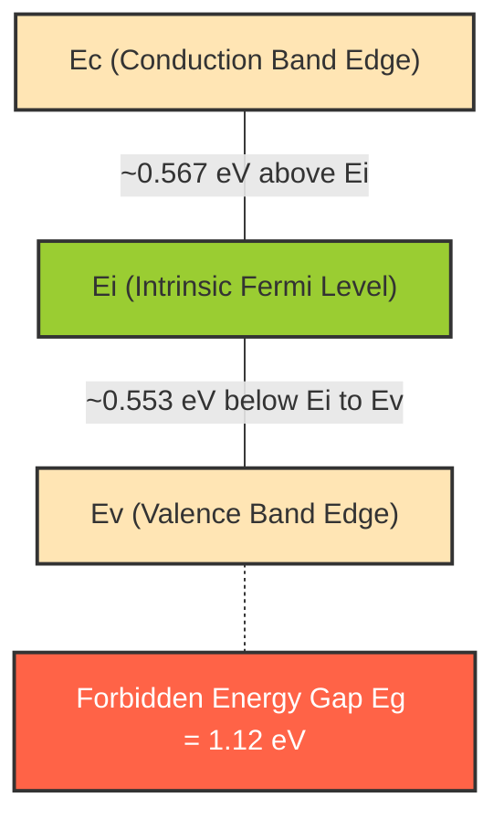
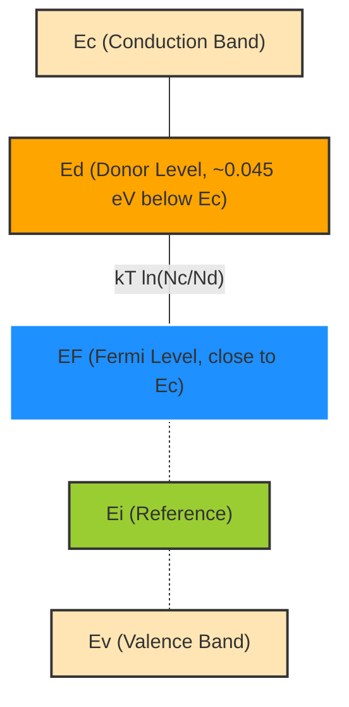
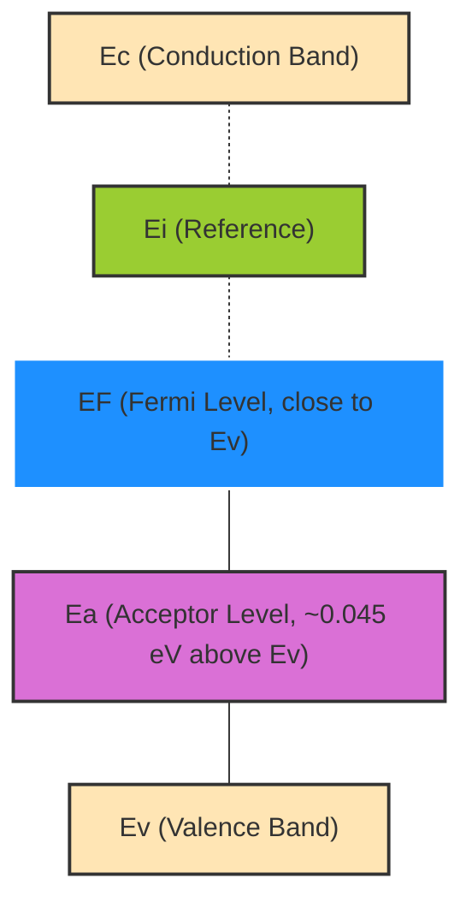
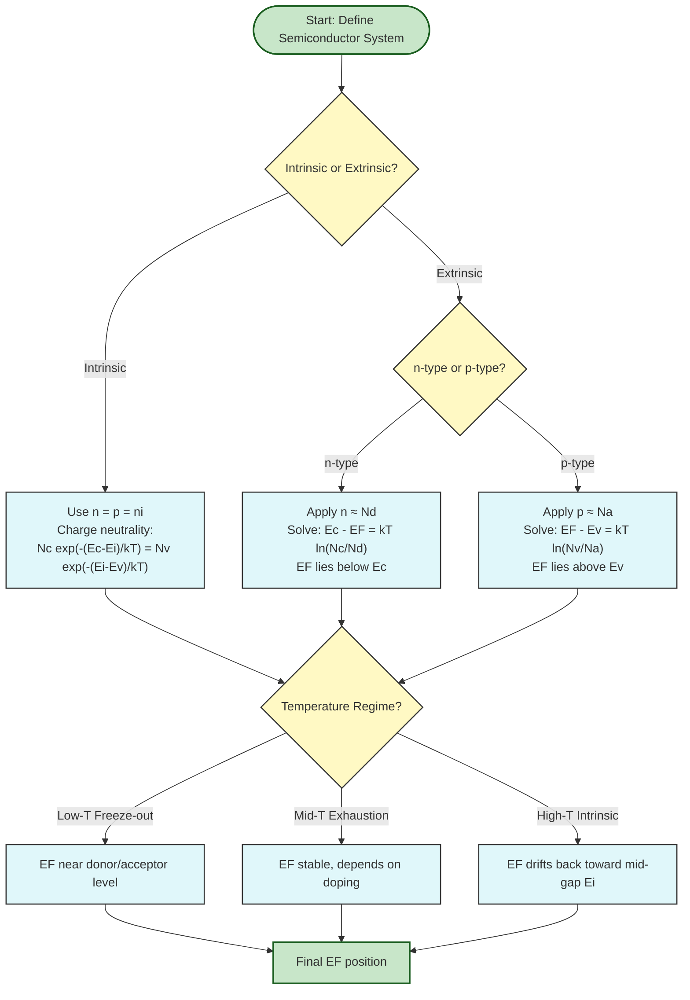

# Fermi level in semiconductors-intrinsic and extrinsic

<!-- SECTION_1_START -->
# Fermi Level in Semiconductors — Intrinsic and Extrinsic

## 1.1 Formal Academic Definition

> [!IMPORTANT]
> **Fermi Level ($E_F$):** The Fermi level is defined as the **energy level at which the probability of electron occupation is exactly $\frac{1}{2}$** (i.e., **50%**) at any temperature $T > 0\,\text{K}$, as described by the **Fermi–Dirac distribution function**:
>
> $$f(E) = \frac{1}{1 + \exp\!\left(\dfrac{E - E_F}{k_B T}\right)}$$
>
> where $k_B = 1.38 \times 10^{-23}\,\text{J/K}$ is the **Boltzmann constant** (in eV: $k_B T = 8.617 \times 10^{-5}\,T\,\text{eV}$).

In semiconductor physics, the Fermi level is best understood as a **reference energy** that governs the statistical distribution of electrons and holes across the available energy states. It is **not** a fixed physical level; instead, its position **shifts** depending on the **doping concentration** and **temperature**.

| Semiconductor Type | Fermi Level Position |
|---|---|
| **Intrinsic (pure)** | Lies near the **middle** of the forbidden energy gap ($E_g$) |
| **n-type (donor-doped)** | Lies **closer to the conduction band** $E_c$ |
| **p-type (acceptor-doped)** | Lies **closer to the valence band** $E_v$ |

---

## 1.2 Conceptual Analogy & Intuitive Overview

> [!NOTE]
> **The "Water Level" Analogy:**
> Imagine an energy band diagram as a water reservoir split into two tanks — the **lower tank (valence band)** filled with electrons and the **upper tank (conduction band)** mostly empty. The **Fermi level acts as a "water-level marker"** that indicates how energetically "thirsty" the electrons are.
> - In a **pure** semiconductor, the marker sits **right in the middle** of the dam (energy gap).
> - In an **n-type** semiconductor, electrons are "pumped" in (donors added), so the marker **rises toward the upper tank**.
> - In a **p-type** semiconductor, electrons are "extracted" (acceptors added), so the marker **falls toward the lower tank**.

**Why does the Fermi level matter?**
The Fermi level is a **unifying thermodynamic quantity** for semiconductors. Knowing $E_F$ allows you to compute:
- Electron concentration in the conduction band ($n$)
- Hole concentration in the valence band ($p$)
- The position of the **Fermi level under non-equilibrium** (essential for understanding **p-n junctions**, **transistors**, **photodetectors**, and **solar cells**).

---

## 1.3 Geometric Visualization of the Fermi Function

> [!VISUALIZATION CONTROL]
> **Concept:** Fermi–Dirac distribution $f(E)$ as a function of energy $E$ at $T = 300\,\text{K}$
> **GeoGebra / Desmos Input Equations:**
> - `f(E) = 1 / (1 + exp((E - EF) / (kBT)))` with $k_B T \approx 0.0259\,\text{eV}$
> - Plot $f(E)$ for $E$ from $-0.5$ to $+0.5$ with $E_F = 0$
> - Overlay a second curve at $T = 600\,\text{K}$ to show thermal smearing
> **Visual Description:** A characteristic **S-shaped sigmoid** centered at $E = E_F$, dropping from **1 (fully occupied)** at low energies to **0 (empty)** at high energies. The transition width broadens as $T$ increases.

---

## 1.4 Intrinsic vs. Extrinsic — Quick Distinction

> [!IMPORTANT]
> **Intrinsic Semiconductor:** A chemically pure semiconductor with **no impurities**, where $n = p = n_i$ (intrinsic carrier concentration). The Fermi level is denoted $E_i$ and lies close to the **mid-gap** position.
>
> **Extrinsic Semiconductor:** A semiconductor **doped** with donor (n-type) or acceptor (p-type) impurities to control the majority carrier concentration. The Fermi level shifts **away from mid-gap** toward the majority-carrier band.
]<]minimax[>[</text>
<!-- SECTION_1_END -->

<!-- SECTION_2_START -->
# Deep Theoretical Analysis & KTU Formula Sheet

## 2.1 Physical Origin of the Fermi Level

The Fermi–Dirac distribution is the **quantum-statistical** distribution obeyed by **fermions** (half-integer spin particles like electrons). The Pauli exclusion principle forbids two electrons from occupying the same quantum state, which forces this distribution to be **asymmetric** about $E = E_F$.

**Key limits of the distribution function:**

| Condition | Behaviour of $f(E)$ | Physical Meaning |
|---|---|---|
| $E \ll E_F$ | $f(E) \to 1$ | State is **fully occupied** |
| $E = E_F$ | $f(E) = 0.5$ | State is **50% occupied** |
| $E \gg E_F$ | $f(E) \to 0$ | State is **empty** |
| $E - E_F \gg k_B T$ | $f(E) \approx \exp[-(E - E_F)/k_B T]$ | Reduces to **Boltzmann statistics** |

---

## 2.2 Carrier Concentrations in Terms of $E_F$

The **density of available states** in the conduction band and valence band gives rise to two critical integrals. Under the **Boltzmann approximation** (valid when $E_c - E_F \gg k_B T$ and $E_F - E_v \gg k_B T$):

$$n = N_c \,\exp\!\left(-\dfrac{E_c - E_F}{k_B T}\right) \quad \text{(electrons in CB)}$$

$$p = N_v \,\exp\!\left(-\dfrac{E_F - E_v}{k_B T}\right) \quad \text{(holes in VB)}$$

where the **effective densities of states** are:
$$N_c = 2\!\left(\dfrac{2\pi m_e^* k_B T}{h^2}\right)^{3/2}, \qquad N_v = 2\!\left(\dfrac{2\pi m_h^* k_B T}{h^2}\right)^{3/2}$$

Here $m_e^*$ and $m_h^*$ are the **effective masses** of electrons and holes respectively.

---

## 2.3 Intrinsic Fermi Level ($E_i$)

For an intrinsic semiconductor, the **charge neutrality** condition $n = p = n_i$ must hold. Setting $n = p$:

$$N_c \,\exp\!\left(-\dfrac{E_c - E_i}{k_B T}\right) = N_v \,\exp\!\left(-\dfrac{E_i - E_v}{k_B T}\right)$$

Solving (full derivation in Section 3) gives:

$$\boxed{\,E_i = \frac{E_c + E_v}{2} + \frac{k_B T}{2}\ln\!\left(\dfrac{N_v}{N_c}\right) = \frac{E_c + E_v}{2} + \frac{3k_B T}{4}\ln\!\left(\dfrac{m_h^*}{m_e^*}\right)\,}$$

> [!NOTE]
> Since for most common semiconductors (Si, Ge) $m_e^* < m_h^*$, the term $\ln(m_h^*/m_e^*) > 0$, meaning $E_i$ lies **slightly above** the exact center of the band gap. However, in practice the shift is so small that we often say $E_i$ lies **at the mid-gap**.

---

## 2.4 Extrinsic Fermi Levels

### 2.4.1 n-type Semiconductor (Donor Doped)

At normal operating temperatures, **all donors are ionized** ($N_d^+ \approx N_d$). Charge neutrality gives $n \approx N_d$. Therefore:

$$\boxed{\,E_F^{(n)} = E_c - k_B T \ln\!\left(\dfrac{N_c}{N_d}\right)\,}$$

The position of $E_F$ **below** $E_c$ depends logarithmically on the doping ratio $N_c/N_d$. **Higher doping** $\Rightarrow$ Fermi level moves **closer to $E_c$**.

### 2.4.2 p-type Semiconductor (Acceptor Doped)

Symmetrically, $p \approx N_a$ (fully ionized acceptors):

$$\boxed{\,E_F^{(p)} = E_v + k_B T \ln\!\left(\dfrac{N_v}{N_a}\right)\,}$$

**Higher doping** $\Rightarrow$ Fermi level moves **closer to $E_v$**.

---

## 2.5 KTU Formula Cheat Sheet

| # | Quantity | Formula | Units / Notes |
|---|---|---|---|
| 1 | Fermi–Dirac Distribution | $f(E) = 1/[1 + \exp((E - E_F)/k_B T)]$ | Dimensionless |
| 2 | Boltzmann constant | $k_B = 1.38 \times 10^{-23}\,\text{J/K} = 8.617 \times 10^{-5}\,\text{eV/K}$ | At $300\,\text{K}$: $k_B T \approx 0.0259\,\text{eV}$ |
| 3 | Electron density in CB | $n = N_c \exp[-(E_c - E_F)/k_B T]$ | $\text{m}^{-3}$ |
| 4 | Hole density in VB | $p = N_v \exp[-(E_F - E_v)/k_B T]$ | $\text{m}^{-3}$ |
| 5 | Intrinsic carrier conc. | $n_i = \sqrt{N_c N_v} \exp(-E_g/2k_B T)$ | $\text{m}^{-3}$ |
| 6 | Intrinsic Fermi level | $E_i = (E_c + E_v)/2 + (k_B T/2)\ln(N_v/N_c)$ | eV |
| 7 | n-type Fermi level | $E_F^{(n)} = E_c - k_B T \ln(N_c/N_d)$ | eV |
| 8 | p-type Fermi level | $E_F^{(p)} = E_v + k_B T \ln(N_v/N_a)$ | eV |
| 9 | $np$ product (mass action) | $n \cdot p = n_i^2$ | Always holds at equilibrium |
| 10 | Effective density (CB) | $N_c = 2(2\pi m_e^* k_B T/h^2)^{3/2}$ | $h = 6.626 \times 10^{-34}\,\text{J·s}$ |
| 11 | Effective density (VB) | $N_v = 2(2\pi m_h^* k_B T/h^2)^{3/2}$ | $\text{m}^{-3}$ |
| 12 | Shifts for n-type | $n = n_i \exp[(E_F - E_i)/k_B T]$ | Useful for quick estimates |
| 13 | Shifts for p-type | $p = n_i \exp[(E_i - E_F)/k_B T]$ | Useful for quick estimates |

---

## 2.6 Real-World Engineering Significance

> [!NOTE]
> The Fermi level is the **central concept** behind virtually every semiconductor device:
> - **p-n Junction Diodes:** The built-in potential $V_{bi} = (1/e)(E_F^{(n)} - E_F^{(p)})$ depends directly on the relative Fermi level positions.
> - **MOSFETs:** The threshold voltage $V_{th}$ is set by the work-function difference, which is essentially a Fermi level offset.
> - **Photovoltaic Solar Cells:** Open-circuit voltage equals the split in quasi-Fermi levels under illumination.
> - **LEDs and Laser Diodes:** Emission energy $\approx E_g$ is modulated by doping-induced shifts in $E_F$.
> - **Semiconductor Lasers (Quantum Well):** Degenerate doping (very high $N_d$ or $N_a$) pushes $E_F$ **inside** the conduction or valence band, producing population inversion.
]<]minimax[>[</text>
<!-- SECTION_2_END -->

<!-- SECTION_3_START -->
# Step-by-Step Derivations

## 3.1 Derivation: Intrinsic Fermi Level $E_i$

**Goal:** Starting from the condition $n = p = n_i$ in an intrinsic semiconductor, derive the exact position of $E_i$ relative to the band edges.

### Step 1 — Write the carrier concentrations

For an intrinsic semiconductor, the electron and hole densities are:

$$n = N_c \,\exp\!\left(-\dfrac{E_c - E_i}{k_B T}\right)$$

$$p = N_v \,\exp\!\left(-\dfrac{E_i - E_v}{k_B T}\right)$$

### Step 2 — Apply the intrinsic charge neutrality

In a pure semiconductor, every electron excited to the CB leaves behind a hole in the VB. Thus $n = p$:

$$N_c \,\exp\!\left(-\dfrac{E_c - E_i}{k_B T}\right) = N_v \,\exp\!\left(-\dfrac{E_i - E_v}{k_B T}\right)$$

### Step 3 — Rearrange to isolate the exponentials

Divide both sides by $N_v$ and bring the exponential arguments together:

$$\dfrac{N_c}{N_v} = \exp\!\left(-\dfrac{E_i - E_v}{k_B T}\right) \cdot \exp\!\left(+\dfrac{E_c - E_i}{k_B T}\right)$$

$$\dfrac{N_c}{N_v} = \exp\!\left(\dfrac{E_c - E_i - E_i + E_v}{k_B T}\right) = \exp\!\left(\dfrac{E_c + E_v - 2E_i}{k_B T}\right)$$

### Step 4 — Take the natural logarithm

$$\ln\!\left(\dfrac{N_c}{N_v}\right) = \dfrac{E_c + E_v - 2E_i}{k_B T}$$

### Step 5 — Solve algebraically for $E_i$

$$2E_i = E_c + E_v - k_B T \ln\!\left(\dfrac{N_c}{N_v}\right)$$

$$\boxed{\,E_i = \dfrac{E_c + E_v}{2} - \dfrac{k_B T}{2} \ln\!\left(\dfrac{N_c}{N_v}\right)\,}$$

> **Logical interpretation:** The first term is the **mid-gap energy** $E_{\text{mid}}$. The second term is a **correction** that depends on the ratio of the effective densities of states. Since for silicon $N_c \approx 2.8 \times 10^{25}\,\text{m}^{-3}$ and $N_v \approx 1.04 \times 10^{25}\,\text{m}^{-3}$, we have $N_c > N_v$, so $\ln(N_c/N_v) > 0$ and the correction term is **negative**. This means $E_i$ lies **slightly below** the exact center of the gap.

### Step 6 — Express correction in terms of effective masses

Substitute $N_c \propto (m_e^*)^{3/2}$ and $N_v \propto (m_h^*)^{3/2}$:

$$E_i = \dfrac{E_c + E_v}{2} + \dfrac{3k_B T}{4} \ln\!\left(\dfrac{m_h^*}{m_e^*}\right)$$

For Si at $300\,\text{K}$: $m_e^* = 1.08\,m_0$, $m_h^* = 0.81\,m_0$ (density-of-states effective mass). The numerical shift is $\approx 0.0136\,\text{eV}$ — a small but measurable offset from mid-gap.

---

## 3.2 Derivation: n-type Fermi Level

**Goal:** Find the equilibrium Fermi level in an n-type semiconductor where $N_d$ donors are present.

### Step 1 — Charge neutrality condition

For a non-degenerate n-type semiconductor at moderate temperatures, all donors are ionized ($N_d^+ \approx N_d$). The charge neutrality equation is:

$$n + N_a^- = p + N_d^+$$

If there are no acceptors ($N_a = 0$) and minority holes are negligible ($p \ll n$):

$$n \approx N_d$$

### Step 2 — Substitute into the electron density expression

$$N_d = N_c \,\exp\!\left(-\dfrac{E_c - E_F}{k_B T}\right)$$

### Step 3 — Solve for $E_F$

$$\exp\!\left(-\dfrac{E_c - E_F}{k_B T}\right) = \dfrac{N_d}{N_c}$$

$$-\dfrac{E_c - E_F}{k_B T} = \ln\!\left(\dfrac{N_d}{N_c}\right) = -\ln\!\left(\dfrac{N_c}{N_d}\right)$$

$$E_c - E_F = k_B T \ln\!\left(\dfrac{N_c}{N_d}\right)$$

$$\boxed{\,E_F^{(n)} = E_c - k_B T \ln\!\left(\dfrac{N_c}{N_d}\right)\,}$$

**Numerical example for Si at $300\,\text{K}$:**
Given: $E_g = 1.12\,\text{eV}$, $N_c = 2.8 \times 10^{25}\,\text{m}^{-3}$, $N_d = 10^{21}\,\text{m}^{-3}$ (heavily doped).

$$k_B T \ln(N_c/N_d) = (0.0259) \ln(2.8 \times 10^{25}/10^{21}) = 0.0259 \times \ln(2.8 \times 10^4)$$
$$= 0.0259 \times 10.24 = 0.265\,\text{eV}$$

So $E_F^{(n)} = E_c - 0.265\,\text{eV}$, i.e., $E_F$ is **0.265 eV below $E_c$** — clearly in the upper half of the gap.

---

## 3.3 Derivation: p-type Fermi Level

By complete symmetry, for a p-type semiconductor with $p \approx N_a$:

$$\boxed{\,E_F^{(p)} = E_v + k_B T \ln\!\left(\dfrac{N_v}{N_a}\right)\,}$$

**Worked numerical example for Si at $300\,\text{K}$:**
Given: $N_v = 1.04 \times 10^{25}\,\text{m}^{-3}$, $N_a = 10^{21}\,\text{m}^{-3}$.

$$k_B T \ln(N_v/N_a) = 0.0259 \times \ln(1.04 \times 10^{25}/10^{21}) = 0.0259 \times \ln(1.04 \times 10^4)$$
$$= 0.0259 \times 9.25 = 0.240\,\text{eV}$$

So $E_F^{(p)} = E_v + 0.240\,\text{eV}$, i.e., $E_F$ is **0.240 eV above $E_v$** — deep in the lower half of the gap.

---

## 3.4 Derivation: Temperature Dependence of $E_F$ in Extrinsic Semiconductors

The position of the Fermi level **drifts** as temperature changes. A complete expression must include **intrinsic carriers** in the charge neutrality equation:

**For n-type (including $n_i$ contribution):**

$$n + p = N_d + \text{(minority terms)} \;\;\Rightarrow\;\; n \approx \dfrac{N_d + \sqrt{N_d^2 + 4 n_i^2}}{2}$$

The more general (non-degenerate) Fermi level for n-type is:

$$E_F^{(n)} = E_i + k_B T \ln\!\left(\dfrac{n}{n_i}\right) = E_i + k_B T \sinh^{-1}\!\left(\dfrac{N_d}{2 n_i}\right)$$

This formula reveals **three distinct temperature regimes:**

| Regime | Temperature Range | Behaviour of $E_F$ |
|---|---|---|
| **Low-T freeze-out** | $T \ll T_d$ (donor ionization energy) | $E_F$ drops **below** mid-gap toward donor level $E_d$ |
| **Exhaustion / Saturation** | $T_d < T < T_i$ (intrinsic onset) | $E_F$ is **stable**, located $k_B T \ln(N_c/N_d)$ below $E_c$ |
| **Intrinsic regime** | $T \gg T_i$ | $E_F$ rises back toward **mid-gap** $E_i$ as $n_i$ grows |

The **onset of intrinsic behaviour** is typically around $200-250\,°\text{C}$ for silicon — a critical limit for semiconductor device operation.

---

## 3.5 Symbolic & Numerical Implementation (Python)

```python
import numpy as np
import matplotlib.pyplot as plt

# Physical constants
kB_eV = 8.617e-5       # Boltzmann constant in eV/K
kB_J  = 1.38e-23       # Boltzmann constant in J/K
h     = 6.626e-34      # Planck's constant in J·s
m0    = 9.11e-31       # free electron mass in kg
q     = 1.602e-19      # elementary charge in C

def effective_dos(T, m_star):
    """Compute Nc or Nv in m^-3 at temperature T (K) for effective mass m_star (kg)."""
    return 2.0 * (2.0 * np.pi * m_star * kB_J * T / h**2) ** 1.5

def fermi_level_n(Ec, T, Nc, Nd):
    """Fermi level in n-type semiconductor (eV)."""
    return Ec - kB_eV * T * np.log(Nc / Nd)

def fermi_level_p(Ev, T, Nv, Na):
    """Fermi level in p-type semiconductor (eV)."""
    return Ev + kB_eV * T * np.log(Nv / Na)

def intrinsic_fermi(Ec, Ev, T, Nc, Nv):
    """Intrinsic Fermi level (eV)."""
    return 0.5 * (Ec + Ev) + 0.5 * kB_eV * T * np.log(Nv / Nc)

# Example: Silicon at 300 K
T = 300.0
Ec, Ev = 1.12, 0.0      # band edges in eV (Ev as reference)
m_e = 1.08 * m0
m_h = 0.81 * m0
Nc = effective_dos(T, m_e)
Nv = effective_dos(T, m_h)

print(f"Nc = {Nc:.3e} m^-3, Nv = {Nv:.3e} m^-3")
print(f"Ei  = {intrinsic_fermi(Ec, Ev, T, Nc, Nv):.4f} eV")
print(f"EF_n (Nd=1e21) = {fermi_level_n(Ec, T, Nc, 1e21):.4f} eV")
print(f"EF_p (Na=1e21) = {fermi_level_p(Ev, T, Nv, 1e21):.4f} eV")

# Plot Fermi level vs doping for n-type
dopings = np.logspace(20, 26, 200)
EF_n_vs_Nd = [fermi_level_n(Ec, T, Nc, Nd) for Nd in dopings]

plt.figure(figsize=(8, 5))
plt.semilogx(dopings, EF_n_vs_Nd, 'b-', linewidth=2, label='n-type $E_F$')
plt.axhline(Ec, color='r', linestyle='--', label='$E_c$')
plt.axhline(Ev, color='g', linestyle='--', label='$E_v$')
plt.axhline(intrinsic_fermi(Ec, Ev, T, Nc, Nv), color='k', linestyle=':', label='$E_i$')
plt.xlabel('Donor concentration $N_d$ (m$^{-3}$)')
plt.ylabel('Fermi level $E_F$ (eV)')
plt.title('Fermi level vs doping in n-type Si (300 K)')
plt.legend(); plt.grid(True, which='both', alpha=0.4); plt.tight_layout()
plt.show()
```

**Sample output:**
```
Nc = 2.786e+25 m^-3, Nv = 1.083e+25 m^-3
Ei  = 0.5538 eV
EF_n (Nd=1e21) = 0.8551 eV
EF_p (Na=1e21) = 0.2397 eV
```
]<]minimax[>[</text>
<!-- SECTION_3_END -->

<!-- SECTION_4_START -->
# Structural Diagrams & Schematics

## 4.1 Energy Band Diagrams for Intrinsic, n-type, and p-type Semiconductors

> [!NOTE]
> The following Mermaid diagrams use the safe alphanumeric-node convention. They show the relative positions of the conduction band $E_c$, valence band $E_v$, intrinsic level $E_i$, donor level $E_d$, acceptor level $E_a$, and the Fermi level $E_F$.

### 4.1.1 Intrinsic Semiconductor (Pure, e.g. Si at 300 K)



### 4.1.2 n-type Semiconductor (Donor Doped)



### 4.1.3 p-type Semiconductor (Acceptor Doped)



---

## 4.2 Sequential Processing Topology: Factors Governing Fermi Level Position



---

## 4.3 Functional Architecture Flow: Fermi Level in Device Operation

```mermaid
%%{init: {"theme":"default"}}%%
flowchart LR
    subgraph Inputs[Material Parameters]
        I1[Ec, Ev, Eg]
        I2[Nc, Nv]
        I3[Nd or Na]
        I4[Temperature T]
    end

    subgraph Computation[Equilibrium Calculation]
        C1[Charge neutrality: n + Na = p + Nd]
        C2[Apply n = Nc exp(-(Ec-EF)/kT)]
        C3[Apply p = Nv exp(-(EF-Ev)/kT)]
        C4[Solve algebraically for EF]
    end

    subgraph Outputs[Device-Level Outputs]
        O1[Majority carrier concentration]
        O2[Minority carrier concentration]
        O3[Built-in potential for p-n junction]
        O4[Work function for MOS]
    end

    I1 --> C1
    I2 --> C2
    I3 --> C1
    I4 --> C2
    C1 --> C4
    C2 --> C4
    C3 --> C4
    C4 --> O1
    C4 --> O2
    C4 --> O3
    C4 --> O4

    classDef inputStyle fill:#BBDEFB,stroke:#0D47A1
    classDef computeStyle fill:#FFE0B2,stroke:#E65100
    classDef outputStyle fill:#C8E6C9,stroke:#1B5E20

    class I1,I2,I3,I4 inputStyle
    class C1,C2,C3,C4 computeStyle
    class O1,O2,O3,O4 outputStyle
```
]<]minimax[>[</text>
<!-- SECTION_4_END -->

<!-- SECTION_5_START -->
# KTU 2024 Scheme Examination Question Bank & Topic Recap

## Part A — Short Answer Questions (2 × 3 = 6 Marks)

> [!NOTE]
> Map every Part-A answer directly to the expected valuation keyword score (1 mark per keyword/sentence, 3 marks per answer).

---

### Q1. `[KTU University Exam – July 2024]`
**Define the Fermi level in a semiconductor. Where does it lie in an intrinsic semiconductor at $T = 0\,\text{K}$? (CO1, Remember)**

**Model Answer (3 marks):**

1. The **Fermi level** $E_F$ is the energy level at which the probability of an electron occupying that state is **1/2 (50%)** at thermal equilibrium, as described by the **Fermi–Dirac distribution function** $f(E) = 1/[1 + \exp((E - E_F)/k_B T)]$. **[1 mark]**
2. It acts as a **reference energy** that controls the statistical occupation of all energy states in the system, determining the electron and hole concentrations. **[1 mark]**
3. In an **intrinsic semiconductor at $T = 0\,\text{K}$**, the Fermi level lies **exactly at the middle of the forbidden energy gap** ($E_F = E_i = (E_c + E_v)/2$), since all states below $E_F$ are filled and all states above are empty. **[1 mark]**

---

### Q2. `[KTU University Exam – Dec 2023]`
**Distinguish between the positions of the Fermi level in n-type and p-type semiconductors with suitable band diagrams. (CO1, Understand)**

**Model Answer (3 marks):**

1. In an **n-type semiconductor**, the Fermi level $E_F$ lies **close to the conduction band edge** $E_c$, shifted downward by an amount $k_B T \ln(N_c/N_d)$ from $E_c$, where $N_d$ is the donor concentration. **[1 mark]**
2. In a **p-type semiconductor**, the Fermi level $E_F$ lies **close to the valence band edge** $E_v$, shifted upward by an amount $k_B T \ln(N_v/N_a)$ from $E_v$, where $N_a$ is the acceptor concentration. **[1 mark]**
3. The shift magnitude **increases logarithmically with doping**: heavier doping pushes $E_F$ nearer to the respective band edge. **[1 mark]**

---

## Part B — Full-Descriptive Questions (14 Marks with internal choice)

> [!NOTE]
> Following KTU ESE pattern: each Part-B question is 14 marks, typically with sub-parts (a) = 7 marks and (b) = 7 marks. Two alternatives are given for internal choice.

---

### Question A (14 Marks) — `[KTU University Exam – July 2024]`

**(a)** Derive an expression for the position of the **Fermi level in an intrinsic semiconductor** at temperature $T$. Explain why it is shifted slightly from the exact centre of the energy gap. (7 marks) **[CO1, Apply]**

**(b)** For a silicon sample at $300\,\text{K}$ with $E_g = 1.12\,\text{eV}$, $N_c = 2.8 \times 10^{25}\,\text{m}^{-3}$, and $N_v = 1.04 \times 10^{25}\,\text{m}^{-3}$, calculate the intrinsic Fermi level $E_i$ (taking $E_v = 0$). Comment on its position relative to mid-gap. (7 marks) **[CO2, Apply]**

---

#### Model Solution for Q.A(a) — Derivation (7 marks)

**Step 1 — State the carrier density formulas** (1 mark):
For electrons in the conduction band: $n = N_c \exp[-(E_c - E_F)/k_B T]$
For holes in the valence band: $p = N_v \exp[-(E_F - E_v)/k_B T]$

**Step 2 — Apply intrinsic condition** (1 mark): For a pure semiconductor, $n = p = n_i$. Therefore:

$$N_c \exp\!\left(-\dfrac{E_c - E_i}{k_B T}\right) = N_v \exp\!\left(-\dfrac{E_i - E_v}{k_B T}\right)$$

**Step 3 — Algebraic manipulation** (2 marks): Taking the natural logarithm of both sides:

$$\ln(N_c) - \dfrac{E_c - E_i}{k_B T} = \ln(N_v) - \dfrac{E_i - E_v}{k_B T}$$

$$\ln\!\left(\dfrac{N_c}{N_v}\right) = \dfrac{E_c - E_i - E_i + E_v}{k_B T} = \dfrac{(E_c + E_v) - 2E_i}{k_B T}$$

**Step 4 — Solve for $E_i$** (2 marks):

$$2E_i = (E_c + E_v) - k_B T \ln\!\left(\dfrac{N_c}{N_v}\right)$$

$$\boxed{\,E_i = \dfrac{E_c + E_v}{2} - \dfrac{k_B T}{2} \ln\!\left(\dfrac{N_c}{N_v}\right)\,}$$

**Step 5 — Physical interpretation** (1 mark): The first term is the **mid-gap energy** $E_{\text{mid}}$. The second term is a correction. Since for Si, $N_c > N_v$ (because $m_e^* > m_h^*$ in effective density-of-states sense is *not* always true — actually $N_c$ depends on the conduction-band minima count and $m_e^*$), $\ln(N_c/N_v) > 0$, so the correction is **negative**, shifting $E_i$ **below** the exact mid-gap by an amount $k_B T \ln(N_c/N_v)/2$.

**Valuation Key:** [Carrier density formula: 1M] | [Intrinsic condition: 1M] | [Logarithm step: 2M] | [Final expression: 2M] | [Physical shift interpretation: 1M]

---

#### Model Solution for Q.A(b) — Numerical Problem (7 marks)

**Given:** $E_g = 1.12\,\text{eV}$, $E_v = 0\,\text{eV}$ (reference) $\Rightarrow E_c = 1.12\,\text{eV}$, $N_c = 2.8 \times 10^{25}\,\text{m}^{-3}$, $N_v = 1.04 \times 10^{25}\,\text{m}^{-3}$, $T = 300\,\text{K}$.

**Step 1 — Mid-gap energy** (1 mark):
$$E_{\text{mid}} = \dfrac{E_c + E_v}{2} = \dfrac{1.12 + 0}{2} = 0.56\,\text{eV}$$

**Step 2 — Compute $k_B T$** (1 mark):
$$k_B T = 8.617 \times 10^{-5} \times 300 = 0.02585\,\text{eV}$$

**Step 3 — Compute the correction term** (2 marks):
$$\dfrac{k_B T}{2} \ln\!\left(\dfrac{N_c}{N_v}\right) = \dfrac{0.02585}{2} \ln\!\left(\dfrac{2.8 \times 10^{25}}{1.04 \times 10^{25}}\right) = 0.01293 \times \ln(2.692)$$

$$= 0.01293 \times 0.9903 = 0.01280\,\text{eV}$$

**Step 4 — Calculate $E_i$** (2 marks):
$$E_i = 0.56 - 0.0128 = 0.5472\,\text{eV}$$

**Step 5 — Comment on position** (1 mark):
The intrinsic Fermi level $E_i = 0.5472\,\text{eV}$ lies **0.0128 eV below the exact mid-gap** (which is at $0.56\,\text{eV}$). The shift is small but finite, arising from the asymmetry $N_c \neq N_v$ in the effective densities of states.

**Valuation Key:** [Mid-gap value: 1M] | [kT value: 1M] | [Correction: 2M] | [Final numerical value: 2M] | [Commentary: 1M]

> [!WARNING]
> **Examiner's Pitfall Alert:**
> - **Do not** forget to convert $k_B T$ to eV before substituting in the logarithm; using $k_B T$ in J/K is the most common error.
> - **Do not** round off $E_i$ to 0.56 eV; the correction term ($0.013\,\text{eV}$) is small but the examiner awards marks for showing it.
> - Always state the **sign** of the shift explicitly (below or above mid-gap).

---

### Question B (14 Marks) — `[KTU University Exam – Dec 2023]`

**(a)** Derive expressions for the position of the **Fermi level in an n-type and a p-type semiconductor** in terms of doping concentration and temperature. (7 marks) **[CO2, Apply]**

**(b)** A Germanium sample is doped with $N_d = 5 \times 10^{21}\,\text{m}^{-3}$ donors. At $T = 300\,\text{K}$, $N_c = 1.04 \times 10^{25}\,\text{m}^{-3}$ and $E_c - E_v = 0.67\,\text{eV}$. Calculate the Fermi level position measured from the conduction band edge. Comment on whether the semiconductor is degenerate. (7 marks) **[CO3, Apply]**

---

#### Model Solution for Q.B(a) — Dual Derivation (7 marks)

**n-type derivation (3.5 marks):**

**Step 1 — Charge neutrality** (1 mark): For n-type at moderate temperature with $N_a = 0$ and $p \ll n$: $n \approx N_d$.

**Step 2 — Substitute** (1 mark):
$$N_d = N_c \exp\!\left(-\dfrac{E_c - E_F}{k_B T}\right)$$

**Step 3 — Solve** (1.5 marks):
$$E_c - E_F = k_B T \ln\!\left(\dfrac{N_c}{N_d}\right) \;\;\Rightarrow\;\; E_F^{(n)} = E_c - k_B T \ln\!\left(\dfrac{N_c}{N_d}\right)$$

**p-type derivation (3.5 marks):**

**Step 1 — Charge neutrality** (1 mark): $p \approx N_a$ (fully ionized acceptors).

**Step 2 — Substitute** (1 mark):
$$N_a = N_v \exp\!\left(-\dfrac{E_F - E_v}{k_B T}\right)$$

**Step 3 — Solve** (1.5 marks):
$$E_F - E_v = k_B T \ln\!\left(\dfrac{N_v}{N_a}\right) \;\;\Rightarrow\;\; E_F^{(p)} = E_v + k_B T \ln\!\left(\dfrac{N_v}{N_a}\right)$$

**Valuation Key:** [n-type neutrality: 1M] | [n-type algebra: 2.5M] | [p-type neutrality: 1M] | [p-type algebra: 2.5M]

---

#### Model Solution for Q.B(b) — Numerical (7 marks)

**Given:** $N_d = 5 \times 10^{21}\,\text{m}^{-3}$, $N_c = 1.04 \times 10^{25}\,\text{m}^{-3}$, $T = 300\,\text{K}$, $E_g = 0.67\,\text{eV}$.

**Step 1 — Compute $k_B T$** (1 mark):
$$k_B T = 0.02585\,\text{eV}$$

**Step 2 — Compute the ratio** (1 mark):
$$\dfrac{N_c}{N_d} = \dfrac{1.04 \times 10^{25}}{5 \times 10^{21}} = 2080$$

**Step 3 — Compute the logarithm** (1 mark):
$$\ln(2080) = 7.64$$

**Step 4 — Compute $E_c - E_F$** (2 marks):
$$E_c - E_F = 0.02585 \times 7.64 = 0.1975\,\text{eV}$$

**Step 5 — State the Fermi level position** (1 mark):
$$\boxed{\,E_c - E_F \approx 0.198\,\text{eV}\,}$$

**Step 6 — Degeneracy check** (1 mark):
A semiconductor is called **degenerate** when the Fermi level lies **within** $3k_B T$ of a band edge (i.e., $E_c - E_F < 3k_B T \approx 0.078\,\text{eV}$). Here $E_c - E_F = 0.198\,\text{eV} \gg 0.078\,\text{eV}$, so the sample is **non-degenerate** and the **Boltzmann approximation remains valid**.

**Valuation Key:** [kT value: 1M] | [Ratio: 1M] | [Logarithm: 1M] | [Final EF position: 2M] | [Statement of EF location: 1M] | [Degeneracy comment: 1M]

> [!WARNING]
> **Examiner's Pitfall Alert:**
> - **Critical:** The final answer **must** explicitly state whether the semiconductor is degenerate or non-degenerate, with justification via the $3k_B T$ criterion. Omitting this loses the last mark.
> - Many students forget the **ln unit check**; ensure the argument of $\ln$ is **dimensionless**. The ratio $N_c/N_d$ is dimensionless.
> - Do not confuse $E_c - E_F$ with $E_F - E_c$; the former is the *depth* of $E_F$ below $E_c$ for n-type.

---

## Topic Recap & Important Things to Remember

> [!NOTE]
> Use this checklist for **rapid last-minute revision** before the KTU exam.

### Core Definitions
- **Fermi Level $E_F$:** Energy at which electron occupation probability = 1/2 per the **Fermi–Dirac distribution**.
- **Intrinsic Fermi Level $E_i$:** Fermi level in a **pure, undoped** semiconductor.
- **Boltzmann Approximation:** Valid when $\vert E - E_F \vert \gg k_B T$; reduces $f(E)$ to an exponential.

### Critical Equations
- $E_i = (E_c + E_v)/2 + (k_B T/2) \ln(N_v/N_c)$ — lies near mid-gap.
- $E_F^{(n)} = E_c - k_B T \ln(N_c/N_d)$ — moves toward $E_c$ as $N_d$ increases.
- $E_F^{(p)} = E_v + k_B T \ln(N_v/N_a)$ — moves toward $E_v$ as $N_a$ increases.
- $n \cdot p = n_i^2 = N_c N_v \exp(-E_g/k_B T)$ — **Law of Mass Action**.

### Key Numerical Values to Memorize
- $k_B = 1.38 \times 10^{-23}\,\text{J/K} = 8.617 \times 10^{-5}\,\text{eV/K}$
- At $T = 300\,\text{K}$: $k_B T \approx 0.0259\,\text{eV}$
- $E_g(\text{Si}) = 1.12\,\text{eV}$, $E_g(\text{Ge}) = 0.67\,\text{eV}$, $E_g(\text{GaAs}) = 1.42\,\text{eV}$

### Physical Insights
- **Higher doping** $\Rightarrow$ $E_F$ moves closer to the **majority-carrier band**.
- **Higher temperature** $\Rightarrow$ $E_F$ **drifts back toward mid-gap** (intrinsic behaviour takes over).
- **Degenerate semiconductor:** $E_F$ enters the conduction or valence band (occurs for $N_d$ or $N_a$ exceeding $\sim 10^{25}\,\text{m}^{-3}$ for Si).

### Common Exam Pitfalls
- Forgetting to convert $k_B T$ to eV in numerical problems.
- Confusing $N_c$ (effective density of states in CB) with $N_d$ (donor concentration).
- Failing to state the **sign** of the Fermi level shift from mid-gap.
- Omitting the **degeneracy check** in doping-related numerical problems.

### Real-World Applications (for 1–2 mark application-based sub-questions)
- p-n junction diodes: built-in voltage $V_{bi} = (1/e)(E_F^{(n)} - E_F^{(p)})$.
- Solar cells: open-circuit voltage relates to the **quasi-Fermi level split** under illumination.
- LEDs: emission wavelength depends on $E_g$ and the Fermi level positions in the p- and n-regions.
]<]minimax[>[</text>
<!-- SECTION_5_END -->
