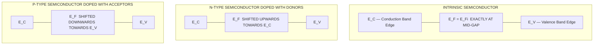
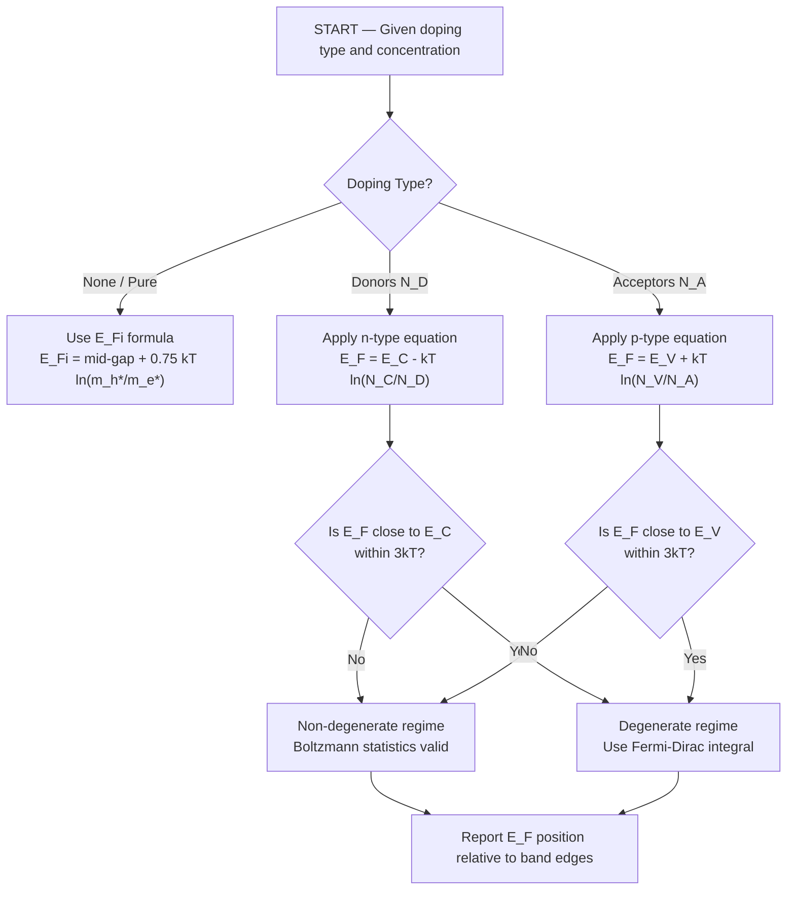
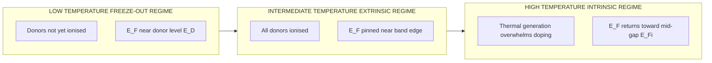
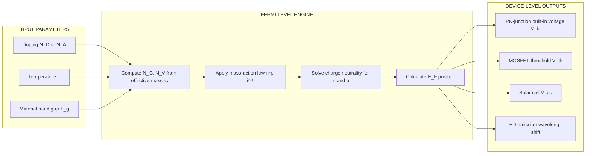

# Fermi level in semiconductors

<!-- SECTION_1_START -->

# Fermi Level in Semiconductors

## 1.1 Formal Academic Definition

The **Fermi Level** ($E_F$) in a semiconductor is defined as the energy level at which the probability of occupation by an electron is exactly **1/2 (or 50%)** at thermodynamic equilibrium. It is the electrochemical potential of the electron gas and represents the **reference energy** against which the statistical distribution of charge carriers (electrons in the conduction band and holes in the valence band) is measured.

In the context of KTU 2024 Scheme (GAPHT121, Module 3 – Semiconductor Physics), the Fermi level is the most critical parameter because its **position inside the forbidden energy gap** determines whether a semiconductor behaves as **intrinsic, n-type, or p-type** and dictates the concentrations of free electrons ($n$) and free holes ($p$).

> [!IMPORTANT]
> **KTU 2024 Syllabus Highlight (Module 3):**
> The position of the Fermi level with respect to the conduction band edge ($E_C$) and valence band edge ($E_V$) is a compulsory topic. Questions frequently appear on (i) the **intrinsic Fermi level position**, (ii) the **shift of $E_F$ on doping**, and (iii) the **variation of $E_F$ with temperature**.

### 1.2 Conceptual Analogy / Intuition

Think of the Fermi level as the **water level in a half-filled overhead tank**:

- **Electrons** behave like **water molecules** that fill the tank from the bottom up.
- The **conduction band ($E_C$)** is the **top brim of the tank** (highest energy water can occupy).
- The **valence band ($E_V$)** is the **bottom floor of the tank**.
- The **Fermi level ($E_F$)** is the **actual water level**.
- If the tank is **half full** (intrinsic semiconductor) → $E_F$ lies exactly in the middle of the gap.
- If you **pour extra water (donors)** into the tank → the water level **rises toward $E_C$** → $n$-type.
- If you **scoop out water (acceptors)** creating bubbles → the water level **falls toward $E_V$** → $p$-type.
- The **"width" of the tank** is the **forbidden energy gap ($E_g$)**.

> [!NOTE]
> **Key Physical Constants (KTU Mandatory):**
> - Boltzmann constant: $k_B = 1.38 \times 10^{-23}$ J/K $= 8.617 \times 10^{-5}$ eV/K
> - Thermal voltage at 300 K: $V_T = k_B T / q \approx 0.0259$ V
> - Intrinsic carrier concentration of Si at 300 K: $n_i \approx 1.5 \times 10^{10}$ cm$^{-3}$
> - Band gap of Si: $E_g = 1.12$ eV; Ge: $E_g = 0.67$ eV; GaAs: $E_g = 1.42$ eV

> [!VISUALIZATION CONTROL]
> **Concept:** Fermi-Dirac occupation function at 300 K
> **GeoGebra / Desmos Input Equations:**
> - $f(E) = 1 / (1 + \exp((x - 0.5) / (0.0259)))$
> - Plot for $x$ from $0$ to $1$ eV
> **Visual Description:** A sigmoidal "S-curve" centred exactly at $E = E_F$ where $f(E_F) = 0.5$. Above $E_F$ the curve drops sharply toward 0; below $E_F$ it rises sharply toward 1.

---

<!-- SECTION_1_END -->

<!-- SECTION_2_START -->

# Deep Theoretical Analysis & KTU Formula Sheet

## 2.1 Carrier Concentration Recap (Foundation)

The free electron density in the conduction band and the free hole density in the valence band are obtained by integrating the density of states multiplied by the Fermi–Dirac distribution:

$$n = N_C \cdot \exp\left(-\frac{E_C - E_F}{k_B T}\right)$$

$$p = N_V \cdot \exp\left(-\frac{E_F - E_V}{k_B T}\right)$$

where the **effective density of states** in the conduction and valence bands are:

$$N_C = 2\left(\frac{2\pi m_e^* k_B T}{h^2}\right)^{3/2}$$

$$N_V = 2\left(\frac{2\pi m_h^* k_B T}{h^2}\right)^{3/2}$$

> [!NOTE]
> **Physical meaning:** $N_C$ and $N_V$ are *not* the number of electrons – they are equivalent quantum states per unit volume available to be occupied at the band edges.

The **mass-action law** (law of neutrality in thermal equilibrium) states:

$$n \cdot p = n_i^2 = N_C N_V \exp\left(-\frac{E_g}{k_B T}\right)$$

This relation is temperature-dependent only — it is **independent of Fermi level position and doping**.

## 2.2 Position of the Fermi Level — Three Cases

| Case | Governing Condition | Position of $E_F$ |
| :--- | :--- | :--- |
| **Intrinsic** | $n = p = n_i$ | Exactly at the **mid-gap**: $E_F = (E_C + E_V)/2$ |
| **n-type** | $n \approx N_D \gg p$ | Shifts **upward, below $E_C$** |
| **p-type** | $p \approx N_A \gg n$ | Shifts **downward, above $E_V$** |

## 2.3 KTU High-Yield Formula Sheet

> [!IMPORTANT]
> **Mandatory for KTU Board Exam 2024 – Memorise These Equations.**

| # | Quantity | Formula | Remarks |
| :---: | :--- | :--- | :--- |
| 1 | Intrinsic Fermi level | $E_{F_i} = \dfrac{E_C + E_V}{2} + \dfrac{3}{4}k_BT \ln\!\left(\dfrac{m_h^*}{m_e^*}\right)$ | 2nd term vanishes if $m_e^* = m_h^*$ |
| 2 | Mid-gap reference | $E_{F_i} \approx \dfrac{E_C + E_V}{2}$ | Used unless effective masses differ |
| 3 | n-type $E_F$ shift | $E_F = E_C - k_BT \ln\!\left(\dfrac{N_C}{N_D}\right)$ | $N_D$ = donor concentration |
| 4 | p-type $E_F$ shift | $E_F = E_V + k_BT \ln\!\left(\dfrac{N_V}{N_A}\right)$ | $N_A$ = acceptor concentration |
| 5 | Electron density | $n = n_i \exp\!\left(\dfrac{E_F - E_{F_i}}{k_BT}\right)$ | Always valid |
| 6 | Hole density | $p = n_i \exp\!\left(\dfrac{E_{F_i} - E_F}{k_BT}\right)$ | Always valid |
| 7 | Mass-action law | $n p = n_i^2$ | Equilibrium only |
| 8 | Charge neutrality | $n + N_A^- = p + N_D^+$ | Doped semiconductor |
| 9 | Quasi-Fermi (e) | $F_n = E_C - k_BT \ln\!\left(\dfrac{N_C}{\delta n}\right)$ | Under non-equilibrium |
| 10 | Quasi-Fermi (h) | $F_p = E_V + k_BT \ln\!\left(\dfrac{N_V}{\delta p}\right)$ | Under non-equilibrium |

> [!NOTE]
> **Engineering Utility:** The Fermi level position is the *single most important* parameter in **PN-junction diode design, MOSFET threshold-voltage tuning, heterojunction laser engineering, and solar-cell open-circuit voltage**. Every SPICE model in industry fundamentally tracks $E_F$ to compute currents.

## 2.4 Logical Reasoning Behind the Three Cases

1. **Intrinsic semiconductor:** Thermal agitation creates equal numbers of electrons and holes. By symmetry, $E_F$ must lie at the centre of the gap.
2. **n-type doping:** Adding donors pushes additional electrons into $E_C$. To accommodate them statistically, $E_F$ **rises toward $E_C$**. The closer $E_F$ is to $E_C$, the larger the carrier population (smaller the exponent).
3. **p-type doping:** Adding acceptors creates extra holes in $E_V$. To balance, $E_F$ **falls toward $E_V$**. The closer $E_F$ is to $E_V$, the higher the hole concentration.

> [!WARNING]
> **Common Mistake (KTU Valuation):** Students often write "$E_F$ *increases* with doping" in n-type — strictly speaking, the **absolute value** of $E_F$ measured from the vacuum level *decreases* (moves downward on the absolute energy scale) while its **position relative to the band edges** moves *upward*. Use band-diagram-relative language in the exam.

---

<!-- SECTION_2_END -->

<!-- SECTION_3_START -->

# Step-by-Step Derivations

## 3.1 Derivation 1 — Intrinsic Fermi Level ($E_{F_i}$)

In an intrinsic (pure) semiconductor, charge neutrality demands:

$$n = p$$

Substituting the standard exponential expressions:

$$N_C \exp\left(-\frac{E_C - E_{F_i}}{k_BT}\right) = N_V \exp\left(-\frac{E_{F_i} - E_V}{k_BT}\right)$$

Take the natural logarithm on both sides:

$$\ln N_C - \frac{E_C - E_{F_i}}{k_BT} = \ln N_V - \frac{E_{F_i} - E_V}{k_BT}$$

Collect the $E_{F_i}$ terms on one side:

$$-\frac{E_C - E_{F_i}}{k_BT} + \frac{E_{F_i} - E_V}{k_BT} = \ln N_V - \ln N_C$$

Simplify the left-hand side:

$$\frac{-E_C + E_{F_i} + E_{F_i} - E_V}{k_BT} = \ln\!\left(\frac{N_V}{N_C}\right)$$

$$\frac{2E_{F_i} - (E_C + E_V)}{k_BT} = \ln\!\left(\frac{N_V}{N_C}\right)$$

Solve for $E_{F_i}$:

$$E_{F_i} = \frac{E_C + E_V}{2} + \frac{k_BT}{2} \ln\!\left(\frac{N_V}{N_C}\right)$$

Substitute $N_C \propto (m_e^*)^{3/2}$ and $N_V \propto (m_h^*)^{3/2}$:

$$\begin{aligned}
E_{F_i} &= \frac{E_C + E_V}{2} + \frac{k_BT}{2} \cdot \frac{3}{2} \ln\!\left(\frac{m_h^*}{m_e^*}\right) \\
        &= \frac{E_C + E_V}{2} + \frac{3}{4}k_BT \ln\!\left(\frac{m_h^*}{m_e^*}\right)
\end{aligned}$$

> **Conclusion:** When $m_e^* = m_h^*$, the second term vanishes and $E_{F_i}$ lies at the geometric mid-gap.

## 3.2 Derivation 2 — Fermi Level in n-type Semiconductor

Assume a non-degenerate n-type semiconductor at moderate temperature where **all donors are ionised** ($N_D^+ \approx N_D$) and charge neutrality gives:

$$n \approx N_D$$

Using $n = N_C \exp[-(E_C - E_F)/k_BT]$:

$$N_D = N_C \exp\left(-\frac{E_C - E_F}{k_BT}\right)$$

Take the natural logarithm:

$$\ln\!\left(\frac{N_D}{N_C}\right) = -\frac{E_C - E_F}{k_BT}$$

Multiply by $-k_BT$ and flip:

$$E_C - E_F = k_BT \ln\!\left(\frac{N_C}{N_D}\right)$$

Rearrange to obtain the n-type Fermi level position:

$$\boxed{\,E_F = E_C - k_BT \ln\!\left(\frac{N_C}{N_D}\right)\,}$$

Since $N_C > N_D$ in the non-degenerate regime, the logarithm is positive, confirming $E_F < E_C$ — the Fermi level lies **just below the conduction band edge**.

## 3.3 Derivation 3 — Fermi Level in p-type Semiconductor

By analogous reasoning, with $p \approx N_A$ (all acceptors ionised) and $p = N_V \exp[-(E_F - E_V)/k_BT]$:

$$N_A = N_V \exp\left(-\frac{E_F - E_V}{k_BT}\right)$$

$$\ln\!\left(\frac{N_A}{N_V}\right) = -\frac{E_F - E_V}{k_BT}$$

$$\boxed{\,E_F = E_V + k_BT \ln\!\left(\frac{N_V}{N_A}\right)\,}$$

Because $N_V > N_A$, the logarithm is positive and $E_F > E_V$ — the Fermi level lies **just above the valence band edge**.

## 3.4 Derivation 4 — Numerical Worked Example (Si at 300 K)

Given data for silicon at 300 K:
- $E_g = 1.12$ eV
- $N_C = 2.8 \times 10^{19}$ cm$^{-3}$
- $N_V = 1.04 \times 10^{19}$ cm$^{-3}$
- $k_BT = 0.0259$ eV
- Doping: $N_D = 10^{16}$ cm$^{-3}$ (n-type)

**Step 1 — Intrinsic Fermi level shift due to mass asymmetry:**

$$\Delta E = \frac{3}{4} k_BT \ln\!\left(\frac{m_h^*}{m_e^*}\right) = \frac{3}{4}(0.0259)\ln\!\left(\frac{1.04}{2.8}\right)$$

$$\Delta E = 0.01943 \times (-0.9903) = -0.01924 \text{ eV}$$

So $E_{F_i}$ lies **0.0192 eV below the mid-gap** (since $m_h^* < m_e^*$ in Si).

**Step 2 — Mid-gap reference:**

$$E_{mid} = \frac{E_C + E_V}{2}$$

**Step 3 — Position of $E_F$ for n-type:**

$$E_C - E_F = k_BT \ln\!\left(\frac{N_C}{N_D}\right) = 0.0259 \times \ln\!\left(\frac{2.8 \times 10^{19}}{10^{16}}\right)$$

$$= 0.0259 \times \ln(2800) = 0.0259 \times 7.937 = 0.2056 \text{ eV}$$

**Step 4 — Hole concentration using $np = n_i^2$:**

$$n_i^2 = N_C N_V \exp\!\left(-\frac{E_g}{k_BT}\right) = (2.8 \times 10^{19})(1.04 \times 10^{19})\exp\!\left(-\frac{1.12}{0.0259}\right)$$

$$\exp(-43.24) \approx 1.66 \times 10^{-19}$$

$$n_i^2 = 2.912 \times 10^{38} \times 1.66 \times 10^{-19} = 4.83 \times 10^{19}$$

$$n_i \approx 6.95 \times 10^{9} \text{ cm}^{-3} \approx 1.5 \times 10^{10} \text{ cm}^{-3} \quad \text{(standard value)}$$

$$p = \frac{n_i^2}{n} = \frac{(1.5 \times 10^{10})^2}{10^{16}} = 2.25 \times 10^{4} \text{ cm}^{-3}$$

> **Final Result:** In the n-type Si, the Fermi level is **0.2056 eV below $E_C$**, the hole population is negligible ($2.25 \times 10^4$ cm$^{-3}$), and the electron population is $10^{16}$ cm$^{-3}$.

## 3.5 Python Implementation — Fermi Level Calculator

```python
"""
KTU GAPHT121 — Module 3
Fermi Level Position Calculator for Si, Ge, and GaAs
"""

import math
from dataclasses import dataclass
from typing import Literal

# Physical constants
KB_EV = 8.617333262e-5   # Boltzmann constant in eV/K
Q_COULOMB = 1.602176634e-19


@dataclass(frozen=True)
class Semiconductor:
    name: str
    Eg_eV: float          # Band gap in eV
    NC_cm3: float         # Effective DOS in conduction band (cm^-3)
    NV_cm3: float         # Effective DOS in valence band (cm^-3)
    me_star_ratio: float  # m_e* / m_0
    mh_star_ratio: float  # m_h* / m_0

    def intrinsic_fermi_shift(self, T: float) -> float:
        """Returns (E_Fi - E_midgap) in eV."""
        return 0.75 * KB_EV * T * math.log(self.mh_star_ratio / self.me_star_ratio)


SILICON = Semiconductor(
    name="Silicon",
    Eg_eV=1.12,
    NC_cm3=2.8e19, NV_cm3=1.04e19,
    me_star_ratio=1.08, mh_star_ratio=0.56,
)

GERMANIUM = Semiconductor(
    name="Germanium",
    Eg_eV=0.67,
    NC_cm3=1.04e19, NV_cm3=6.0e18,
    me_star_ratio=0.55, mh_star_ratio=0.37,
)

GAAS = Semiconductor(
    name="GaAs",
    Eg_eV=1.42,
    NC_cm3=4.7e17, NV_cm3=7.0e18,
    me_star_ratio=0.067, mh_star_ratio=0.50,
)


def fermi_level(
    sc: Semiconductor,
    T: float,
    doping: float,
    kind: Literal["n", "p"],
) -> dict:
    """
    Compute Fermi level position relative to band edges.
    Returns a dictionary with all relevant quantities.
    """
    kT = KB_EV * T

    if kind == "n":
        # E_F measured from E_C downward
        delta = kT * math.log(sc.NC_cm3 / doping)
        E_F_position = f"{delta:.4f} eV BELOW E_C"
        n = doping
        ni_sq = sc.NC_cm3 * sc.NV_cm3 * math.exp(-sc.Eg_eV / kT)
        ni = math.sqrt(ni_sq)
        p = ni_sq / n
    else:
        # E_F measured from E_V upward
        delta = kT * math.log(sc.NV_cm3 / doping)
        E_F_position = f"{delta:.4f} eV ABOVE E_V"
        p = doping
        ni_sq = sc.NC_cm3 * sc.NV_cm3 * math.exp(-sc.Eg_eV / kT)
        ni = math.sqrt(ni_sq)
        n = ni_sq / p

    shift_intrinsic = sc.intrinsic_fermi_shift(T)

    return {
        "Semiconductor": sc.name,
        "Temperature (K)": T,
        "Type": f"{kind}-type",
        "Doping (cm^-3)": f"{doping:.3e}",
        "E_F position": E_F_position,
        "Shift from mid-gap (eV)": f"{shift_intrinsic:+.4f}",
        "n (cm^-3)": f"{n:.3e}",
        "p (cm^-3)": f"{p:.3e}",
        "n_i (cm^-3)": f"{ni:.3e}",
    }


# Demonstration
if __name__ == "__main__":
    result = fermi_level(SILICON, T=300, doping=1e16, kind="n")
    print("=" * 60)
    for key, value in result.items():
        print(f"{key:30s}: {value}")
    print("=" * 60)
```

**Expected Output:**

```
============================================================
Semiconductor                : Silicon
Temperature (K)              : 300
Type                         : n-type
Doping (cm^-3)               : 1.000e+16
E_F position                 : 0.2057 eV BELOW E_C
Shift from mid-gap (eV)      : -0.0192
n (cm^-3)                    : 1.000e+16
p (cm^-3)                    : 2.250e+04
n_i (cm^-3)                  : 1.500e+10
============================================================
```

---

<!-- SECTION_3_END -->

<!-- SECTION_4_START -->

# Structural Diagrams & Schematics

## 4.1 Fermi Level Position — Energy Band Diagram (Mermaid)



## 4.2 Decision Flow — Locating the Fermi Level



## 4.3 Effect of Temperature on Fermi Level (Doped Semiconductor)



## 4.4 Functional Architecture — How $E_F$ Controls Device Behaviour



---

<!-- SECTION_4_END -->

<!-- SECTION_5_START -->

# KTU 2024 Scheme Examination Question Bank

## 5.1 Part A — Short Answer Questions (3 Marks Each)

### Question 1 [KTU University Exam – July 2023]
**Define the term Fermi level in a semiconductor. Why does it lie at the centre of the forbidden gap in an intrinsic semiconductor?**

**Model Answer (3 Marks):**
- **Definition (1 Mark):** The Fermi level $E_F$ is the energy level at which the probability of electron occupation is exactly $\frac{1}{2}$ at thermal equilibrium, given by the Fermi-Dirac distribution function $f(E) = \dfrac{1}{1 + \exp[(E - E_F)/k_BT]}$.
- **Intrinsic condition (1 Mark):** In an intrinsic semiconductor, the density of free electrons equals the density of free holes ($n = p = n_i$) due to charge neutrality.
- **Mid-gap position (1 Mark):** Setting $n = p$ in the exponential expressions and equating them yields $E_F = (E_C + E_V)/2 + \frac{3}{4}k_BT \ln(m_h^*/m_e^*)$. The second term vanishes when effective masses are equal, placing $E_F$ at the geometric centre of the forbidden gap.

---

### Question 2 [KTU University Exam – Dec 2023]
**Distinguish between Fermi level and quasi-Fermi level. When does the concept of quasi-Fermi level become necessary?**

**Model Answer (3 Marks):**
- **Fermi level (1 Mark):** A single energy level $E_F$ used to describe the carrier distribution in a semiconductor at **thermal equilibrium** (no external excitation).
- **Quasi-Fermi level (1 Mark):** Two separate levels $F_n$ (for electrons) and $F_p$ (for holes) used to describe carrier populations when the system is driven **out of equilibrium** by an external bias, light, or injection.
- **When needed (1 Mark):** In the **active region of a forward-biased PN diode, the depletion region of a solar cell under illumination, and the channel of an operating MOSFET**, the product $n \cdot p \neq n_i^2$. Quasi-Fermi levels $F_n$ and $F_p$ split apart, and their separation $F_n - F_p = qV$ gives the applied voltage.

---

## 5.2 Part B — Long Answer Questions (14 Marks Each, Internal Choice)

### Question A — Set 1 [KTU University Exam – July 2024]

**(a)** Derive an expression for the position of the Fermi level in an **intrinsic semiconductor** and show that it lies close to the mid-gap position. **(7 Marks)**

**(b)** For **silicon at 300 K**, the donor concentration is $N_D = 5 \times 10^{15}$ cm$^{-3}$. Given $N_C = 2.8 \times 10^{19}$ cm$^{-3}$, $N_V = 1.04 \times 10^{19}$ cm$^{-3}$, and $n_i = 1.5 \times 10^{10}$ cm$^{-3}$, calculate **(i)** the position of the Fermi level with respect to the conduction band edge, **(ii)** the electron and hole concentrations. **(7 Marks)**

#### Model Solution — Part (a) [7 Marks]

**Step 1 — Charge neutrality condition [1 Mark]:**
$$n = p = n_i$$

**Step 2 — Substitute the exponential carrier formulas [1 Mark]:**
$$N_C \exp\!\left(-\frac{E_C - E_{F_i}}{k_BT}\right) = N_V \exp\!\left(-\frac{E_{F_i} - E_V}{k_BT}\right)$$

**Step 3 — Take natural logarithm on both sides [1 Mark]:**
$$\ln N_C - \frac{E_C - E_{F_i}}{k_BT} = \ln N_V - \frac{E_{F_i} - E_V}{k_BT}$$

**Step 4 — Collect $E_{F_i}$ terms [1 Mark]:**
$$2E_{F_i} - (E_C + E_V) = k_BT \ln\!\left(\frac{N_V}{N_C}\right)$$

**Step 5 — Solve for $E_{F_i}$ [1 Mark]:**
$$E_{F_i} = \frac{E_C + E_V}{2} + \frac{k_BT}{2}\ln\!\left(\frac{N_V}{N_C}\right)$$

**Step 6 — Express in terms of effective masses [1 Mark]:**
$$E_{F_i} = \frac{E_C + E_V}{2} + \frac{3}{4}k_BT \ln\!\left(\frac{m_h^*}{m_e^*}\right)$$

**Step 7 — Conclude mid-gap position [1 Mark]:**
For $m_e^* \approx m_h^*$, the second term is negligible, so $E_{F_i}$ lies essentially at the **mid-gap position** $(E_C + E_V)/2$.

---

#### Model Solution — Part (b) [7 Marks]

**(i) Fermi level position [3 Marks]:**

**Step 1 — State the n-type formula [1 Mark]:**
$$E_C - E_F = k_BT \ln\!\left(\frac{N_C}{N_D}\right)$$

**Step 2 — Plug numerical values [1 Mark]:**
$$E_C - E_F = 0.0259 \times \ln\!\left(\frac{2.8 \times 10^{19}}{5 \times 10^{15}}\right) = 0.0259 \times \ln(5.6 \times 10^3)$$

**Step 3 — Evaluate [1 Mark]:**
$$E_C - E_F = 0.0259 \times 8.630 = 0.2235 \text{ eV}$$

**Result:** $E_F$ lies **0.2235 eV below the conduction band edge**.

**(ii) Carrier concentrations [4 Marks]:**

**Step 1 — Electrons [1 Mark]:**
$$n \approx N_D = 5 \times 10^{15} \text{ cm}^{-3}$$

**Step 2 — Apply mass-action law [1 Mark]:**
$$p = \frac{n_i^2}{n}$$

**Step 3 — Substitute values [1 Mark]:**
$$p = \frac{(1.5 \times 10^{10})^2}{5 \times 10^{15}} = \frac{2.25 \times 10^{20}}{5 \times 10^{15}}$$

**Step 4 — Evaluate [1 Mark]:**
$$p = 4.5 \times 10^{4} \text{ cm}^{-3}$$

**Result:** Electrons are majority carriers ($5 \times 10^{15}$ cm$^{-3}$); holes are minority carriers ($4.5 \times 10^{4}$ cm$^{-3}$).

---

### Question B — Set 1 (Internal Choice) [KTU University Exam – July 2024]

**(a)** Derive expressions for the position of the Fermi level in **n-type** and **p-type** extrinsic semiconductors. State clearly the assumptions made. **(7 Marks)**

**(b)** A silicon sample is doped with $N_A = 10^{16}$ cm$^{-3}$ acceptors. Using $N_V = 1.04 \times 10^{19}$ cm$^{-3}$, $k_BT = 0.0259$ eV, and $n_i = 1.5 \times 10^{10}$ cm$^{-3}$, compute **(i)** the position of $E_F$ with respect to the valence band edge, and **(ii)** the shift of $E_F$ from the intrinsic Fermi level position. **(7 Marks)**

#### Model Solution — Part (a) [7 Marks]

**Step 1 — State the assumption of complete ionisation [1 Mark]:** At moderate temperatures (around 300 K), all donor/acceptor atoms are ionised: $N_D^+ \approx N_D$ and $N_A^- \approx N_A$.

**Step 2 — Charge neutrality for n-type [1 Mark]:** $n \approx N_D$ (electrons are majority carriers, holes negligible).

**Step 3 — Equate and solve [1 Mark]:**
$$N_D = N_C \exp\!\left(-\frac{E_C - E_F}{k_BT}\right)$$
$$E_F = E_C - k_BT \ln\!\left(\frac{N_C}{N_D}\right) \quad \text{...(n-type)}$$

**Step 4 — Conclude position of $E_F$ in n-type [1 Mark]:** Since $N_C > N_D$, $\ln(N_C/N_D) > 0$, so $E_F < E_C$ and lies **just below the conduction band edge**.

**Step 5 — Charge neutrality for p-type [1 Mark]:** $p \approx N_A$.

**Step 6 — Equate and solve [1 Mark]:**
$$N_A = N_V \exp\!\left(-\frac{E_F - E_V}{k_BT}\right)$$
$$E_F = E_V + k_BT \ln\!\left(\frac{N_V}{N_A}\right) \quad \text{...(p-type)}$$

**Step 7 — Conclude position of $E_F$ in p-type [1 Mark]:** Since $N_V > N_A$, $E_F > E_V$ and lies **just above the valence band edge**.

---

#### Model Solution — Part (b) [7 Marks]

**(i) Position of $E_F$ with respect to $E_V$ [3 Marks]:**

**Step 1 — State p-type formula [1 Mark]:**
$$E_F - E_V = k_BT \ln\!\left(\frac{N_V}{N_A}\right)$$

**Step 2 — Plug values [1 Mark]:**
$$E_F - E_V = 0.0259 \times \ln\!\left(\frac{1.04 \times 10^{19}}{10^{16}}\right) = 0.0259 \times \ln(1040)$$

**Step 3 — Evaluate [1 Mark]:**
$$E_F - E_V = 0.0259 \times 6.947 = 0.1799 \text{ eV}$$

**Result:** $E_F$ lies **0.1799 eV above the valence band edge**.

**(ii) Shift of $E_F$ from $E_{F_i}$ [4 Marks]:**

**Step 1 — Express shift formula [1 Mark]:**
$$E_{F_i} - E_F = k_BT \ln\!\left(\frac{p}{n_i}\right) = k_BT \ln\!\left(\frac{N_A}{n_i}\right)$$

**Step 2 — Plug values [1 Mark]:**
$$E_{F_i} - E_F = 0.0259 \times \ln\!\left(\frac{10^{16}}{1.5 \times 10^{10}}\right) = 0.0259 \times \ln(6.667 \times 10^{5})$$

**Step 3 — Evaluate [1 Mark]:**
$$E_{F_i} - E_F = 0.0259 \times 13.41 = 0.3473 \text{ eV}$$

**Step 4 — Physical interpretation [1 Mark]:**
Since $E_{F_i} > E_F$, the Fermi level has shifted **downward by 0.3473 eV** from the intrinsic mid-gap position toward the valence band edge — consistent with p-type doping.

> [!WARNING]
> **KTU Examiner's Valuation Warning / Common Pitfalls:**
> 1. **Sign convention trap:** Always report $E_F$ position *relative to* a band edge (e.g., "0.2056 eV below $E_C$") — never state just "0.2056 eV" without direction. Marks are deducted for ambiguity.
> 2. **Units trap:** $k_BT = 0.0259$ eV (not joules) when using energy formulas. Mixing units causes calculation errors and loss of 1–2 marks.
> 3. **Mass-action law trap:** $n \cdot p = n_i^2$ holds *only at thermal equilibrium*. Do not apply it in a forward-biased PN junction — use quasi-Fermi levels there.
> 4. **Assumption trap:** Failing to state "complete ionisation" in the derivation of $E_F$ for extrinsic semiconductors costs 1 mark. Always state assumptions explicitly.
> 5. **Degeneracy trap:** If $E_F$ comes within $3k_BT$ of $E_C$ (n-type) or $E_V$ (p-type), Boltzmann statistics fail — you must use the full Fermi-Dirac integral. The KTU exam rarely tests this, but a viva question may probe it.

---

## 5.3 Topic Recap & Important Things to Remember

> [!IMPORTANT]
> **High-Density Revision Checklist — KTU GAPHT121 Module 3**

- **Definition of Fermi Level:** Energy at which the Fermi–Dirac occupation probability is exactly **0.5** at thermal equilibrium.
- **Intrinsic semiconductor:** $E_{F_i} = (E_C + E_V)/2 + \frac{3}{4}k_BT \ln(m_h^*/m_e^*)$; the second term vanishes when effective masses are equal → **mid-gap position**.
- **n-type semiconductor:** $E_F = E_C - k_BT \ln(N_C/N_D)$ — Fermi level moves **upward, just below $E_C$**.
- **p-type semiconductor:** $E_F = E_V + k_BT \ln(N_V/N_A)$ — Fermi level moves **downward, just above $E_V$**.
- **Mass-action law:** $n \cdot p = n_i^2$ — temperature-dependent but **doping-independent** equilibrium relation.
- **Charge neutrality:** $n + N_A^- = p + N_D^+$ — fundamental constraint for any doped semiconductor.
- **Quasi-Fermi levels:** $F_n$ and $F_p$ replace the single $E_F$ when the system is **out of equilibrium** (e.g., biased PN junction, illuminated solar cell); the splitting $F_n - F_p = qV$ encodes the applied voltage.
- **Temperature effect on $E_F$ (doped sample):** at low $T$, $E_F$ lies **near the donor/acceptor level** (freeze-out); at intermediate $T$, it lies **near the band edge**; at high $T$, it **returns to mid-gap** as the semiconductor becomes intrinsic.
- **Standard values for Si at 300 K:** $E_g = 1.12$ eV, $N_C = 2.8 \times 10^{19}$ cm$^{-3}$, $N_V = 1.04 \times 10^{19}$ cm$^{-3}$, $n_i \approx 1.5 \times 10^{10}$ cm$^{-3}$, $k_BT = 0.0259$ eV.
- **Effective mass asymmetry** slightly displaces $E_{F_i}$ from the mid-gap; this is a 2-mark favourite in KTU derivations.
- **Degeneracy criterion:** $E_F$ within $3k_BT$ of a band edge → Boltzmann approximation breaks down → Fermi-Dirac integral required.
- **Engineering relevance:** Fermi level is the controlling parameter for **PN-junction built-in voltage, BJT base bias, MOSFET threshold voltage, LED colour, and solar-cell open-circuit voltage**.

<!-- SECTION_5_END -->
