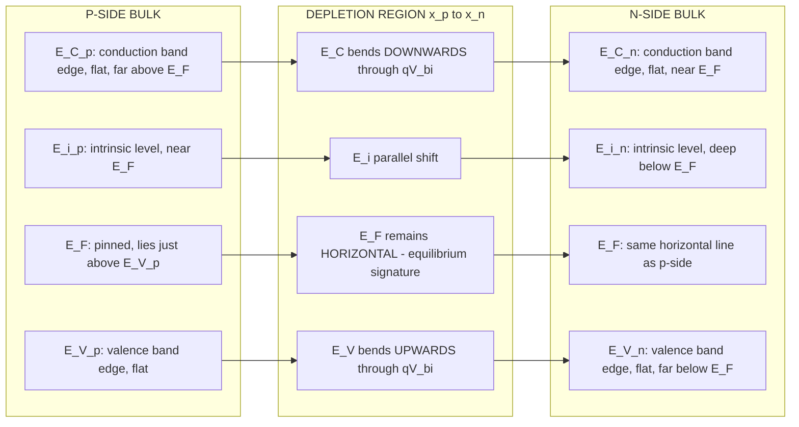
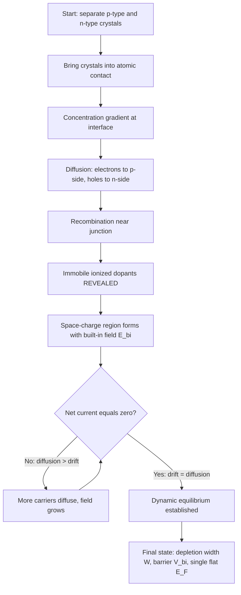

# Formation of p-n junction

<!-- SECTION_1_START -->

# Formation of p-n Junction — Module 3, Semiconductor Physics

> [!NOTE]
> **KTU 2024 Scheme Focus (GAPHT121)**
> This topic is the *gateway* to all solid-state electronic devices. Mastery of the depletion region, built-in potential, and band-bending is mandatory before proceeding to diodes, BJTs, and MOSFETs.

## 1.1 Formal Definition

A **p-n junction** is the metallurgical interface formed when a **p-type semiconductor** (excess holes, acceptors $N_A$) and an **n-type semiconductor** (excess electrons, donors $N_D$) are brought into intimate atomic contact within a single crystal lattice. Immediately after formation, mobile charge carriers diffuse across the boundary, leaving behind a thin region of immobile ionized dopants known as the **depletion region** (or **space-charge region**, SCR). The resulting self-consistent **built-in electric field** $\vec{E}_{bi}$ and **built-in potential** $V_{bi}$ establish dynamic equilibrium, preventing any further net flow of carriers.

> [!IMPORTANT]
> **Syllabus Highlight (KTU GAPHT121 — Module 3):**
> Students must be able to *derive* the built-in potential, *plot* the energy-band diagram at equilibrium, and *compute* the depletion width for both symmetric and one-sided abrupt junctions. A question carrying **7 to 14 marks** is expected on this topic in the End Semester Examination (ESE).

## 1.2 Conceptual Analogy & Intuition

**Analogy 1 — The Two-Crowd Border:**
Imagine a stadium divided into two halves. The "p-side" is filled with people wearing *red* shirts (holes = majority), the "n-side" with people wearing *blue* shirts (electrons = majority). When the central divider is removed, the blue-shirted people rush toward the red side and vice-versa (this is **diffusion**). At the boundary, blues and reds pair up and sit down (**recombination**), leaving behind an empty "no-man's land" of just the *original permanent seats* — the empty seats are the **ionized donor cores** (positive) on the n-side and the **ionized acceptor cores** (negative) on the p-side. This empty zone is the **depletion region**. The seated crowds at the edges of the no-man's land act as a "wall" that prevents further migration — that wall is the **built-in potential barrier**.

**Analogy 2 — Water Tanks at Different Heights:**
Think of the n-side as a tank filled to height $h_n$ and the p-side as a tank at height $h_p$. When connected, water flows from the higher tank to the lower one until the levels equalize. The equivalent "height difference" of the carrier populations on the energy scale is exactly the **built-in potential** $V_{bi} = (h_n - h_p)/q$.

**Geometric Intuition:**
On an energy-band diagram drawn vertically, the conduction band edge $E_C$ and valence band edge $E_V$ are *bent* (curved) near the junction. The bending height equals $qV_{bi}$. The flat regions far from the junction are the **quasi-neutral bulk**.

> [!TIP]
> **Quick Visual Check for Exams:** In a textbook energy-band diagram, the *left* is conventionally the p-side and the *right* is the n-side. The Fermi level $E_F$ must be a **single, perfectly horizontal line** across the entire diagram at thermal equilibrium — a tilted $E_F$ is the *first* sign of a student error in band-diagram questions.

## 1.3 Physical Constants & Standard Metrics (Bolded for Memorization)

| Symbol | Quantity | Standard Value |
| :--- | :--- | :--- |
| $q$ | Elementary charge | **$1.602 \times 10^{-19}\ \text{C}$** |
| $k$ | Boltzmann constant | **$1.381 \times 10^{-23}\ \text{J/K}$** |
| $T$ | Room temperature | **$300\ \text{K}$** |
| $V_T = kT/q$ | Thermal voltage | **$\approx 0.0259\ \text{V}$** (≈ 26 mV) |
| $n_i$ (Si) | Intrinsic carrier conc. | **$1.5 \times 10^{10}\ \text{cm}^{-3}$** |
| $\varepsilon_0$ | Vacuum permittivity | **$8.854 \times 10^{-14}\ \text{F/cm}$** |
| $\varepsilon_r$ (Si) | Relative permittivity | **$11.7$** |
| $\varepsilon_s = \varepsilon_r \varepsilon_0$ (Si) | Si permittivity | **$1.04 \times 10^{-12}\ \text{F/cm}$** |

> [!NOTE]
> Always convert permittivity to **F/cm** when carrier concentrations are in **cm⁻³** and lengths in **cm**, so the depletion width emerges directly in **cm** (or µm) without unit juggling.

<!-- SECTION_1_END -->

<!-- SECTION_2_START -->

# 2. Deep Theoretical Analysis

## 2.1 The Formation Sequence — Six Logical Steps

1. **Initial State (Pre-contact):** Two separate crystals, p-type with $N_A$ acceptors (mostly ionized → negative cores) and n-type with $N_D$ donors (mostly ionized → positive cores). A huge **concentration gradient** exists at the hypothetical interface.
2. **Diffusion Onset:** Electrons from the n-side diffuse into the p-side; holes from the p-side diffuse into the n-side. The driving force is purely the concentration gradient (Fick's first law).
3. **Recombination Sweep:** Near the metallurgical junction, diffused electrons recombine with the abundant majority holes on the p-side, and vice-versa. This annihilates the *mobile* carriers in a thin slab on either side of the junction.
4. **Reveal of Immobile Ions:** What remains in that slab is *only* the **uncovered ionized dopant cores**: **negative acceptor ions** $\left(N_A^{-}\right)$ on the p-side and **positive donor ions** $\left(N_D^{+}\right)$ on the n-side.
5. **Built-in Field Generation:** These exposed charges produce a **space-charge region (SCR)** with an internal **built-in electric field** $\vec{E}_{bi}$ pointing from the n-side (+ ions) to the p-side (− ions).
6. **Dynamic Equilibrium:** The field drives a **drift current** of minority carriers *opposite* to the diffusion current. At equilibrium, the **net current is zero**, fixing the barrier height at exactly $qV_{bi}$.

> [!IMPORTANT]
> The depletion region is *depleted of mobile carriers*, but it is **not** empty — it is filled with the immobile ionic charges of the dopant atoms. This is the single most-tested conceptual point in KTU viva voce.

## 2.2 Key Quantitative Relationships

- **Depletion Approximation:** Charge density is assumed to be a **step function** — $\rho = -qN_A$ inside the p-side SCR ($0 > x > -x_p$) and $\rho = +qN_D$ inside the n-side SCR ($0 < x < x_n$), and zero elsewhere.
- **Charge Neutrality:** $|N_A x_p| = |N_D x_n|$. The narrower side belongs to the *more heavily doped* side.
- **Built-in Potential:**
  $$V_{bi} = V_T \ln\!\left(\frac{N_A N_D}{n_i^{\,2}}\right)$$
- **Total Depletion Width:**
  $$W = x_p + x_n = \sqrt{\frac{2 \varepsilon_s V_{bi}}{q}\!\left(\frac{1}{N_A} + \frac{1}{N_D}\right)}$$
- **One-Sided (e.g., $N_A \gg N_D$, i.e., $p^+n$ junction) Limit:**
  $$W \approx x_n \approx \sqrt{\frac{2 \varepsilon_s V_{bi}}{q N_D}}$$
- **Maximum Electric Field (at metallurgical junction $x=0$):**
  $$E_{\max} = \frac{q N_D x_n}{\varepsilon_s} = \frac{q N_A x_p}{\varepsilon_s} = \frac{2 V_{bi}}{W}$$
- **Potential Variation** inside SCR is **parabolic** (because $\rho$ is constant on each side, the second integral of Poisson's equation gives a parabola).

## 2.3 KTU High-Yield Formula Sheet (Board-Exam Ready)

| # | Formula | Physical Meaning | Typical Use in KTU ESE |
| :--- | :--- | :--- | :--- |
| 1 | $V_T = kT/q \approx 26\ \text{mV}$ | Thermal voltage | Substitution in $V_{bi}$ |
| 2 | $V_{bi} = V_T \ln(N_A N_D / n_i^2)$ | Built-in potential barrier | 7-mark derivation question |
| 3 | $W = \sqrt{2\varepsilon_s V_{bi} / q \cdot (N_A + N_D)/(N_A N_D)}$ | Total depletion width | 7-mark numerical question |
| 4 | $x_n / x_p = N_A / N_D$ | Ratio of SCR widths | Charge neutrality step |
| 5 | $E_{\max} = 2V_{bi}/W$ | Peak field at $x=0$ | Sketching field profile |
| 6 | $E(x)$ inside p-side | Linear ramp, slope $qN_A/\varepsilon_s$ | Diagram labelling |
| 7 | $V(x)$ inside SCR | Parabolic segment | Band-diagram integration |

> [!TIP]
> **Mnemonic for KTU 2024 Boards:** *"V bi uses V T; W uses V bi under a square root; E uses V bi on top, W on the bottom."* — The hierarchy V → W → E is the standard valuation chain in 14-mark questions.

## 2.4 Real-World Engineering Utility

| Domain | Application of p-n Junction Concept |
| :--- | :--- |
| **Power Electronics** | Rectifier diodes in $50/60\ \text{Hz}$ bridge circuits; $V_{bi}$ sets the turn-on threshold. |
| **Digital Logic (CMOS)** | Source/drain $p^+n$ junctions in MOSFETs determine sub-threshold leakage. |
| **Photovoltaics** | Built-in field in solar-cell p-n junctions is the *only* mechanism separating photo-generated carriers. |
| **RF/Microwave** | PIN diodes, varactor diodes exploit voltage-controlled depletion width $W(V)$. |
| **Sensors** | p-n photodiodes, particle detectors (Si detectors in CERN experiments) rely on the wide-depletion geometry. |
| **Integrated Circuits** | Junction isolation in older bipolar ICs; ESD protection diodes at every I/O pad. |

<!-- SECTION_2_END -->

<!-- SECTION_3_START -->

# 3. Step-by-Step Derivations

## 3.1 Derivation of the Built-in Potential $V_{bi}$

We start from the principle that at thermal equilibrium the **electron Fermi level** $E_{Fn}$ on the n-side and $E_{Fp}$ on the p-side must align into a single horizontal line $E_F$ across the junction.

The electron concentration is related to the position of $E_F$ below $E_C$ by

$$n = n_i \exp\!\left(\frac{E_F - E_i}{kT}\right)$$

Far from the junction, deep in the bulk of each side:
- On the **n-side:** $n \approx N_D$, so $E_{Fn} - E_i = kT \ln(N_D/n_i)$.
- On the **p-side:** $p \approx N_A$, which via $np = n_i^2$ gives $n \approx n_i^2 / N_A$, so $E_{Fp} - E_i = kT \ln(n_i/N_A) = -kT \ln(N_A/n_i)$.

The total band-bending $E_{Fn} - E_{Fp}$ equals $qV_{bi}$. Subtracting the two expressions:

$$
\begin{aligned}
qV_{bi} &= E_{Fn} - E_{Fp} \\
&= kT\ln\!\left(\frac{N_D}{n_i}\right) - \left[-kT\ln\!\left(\frac{N_A}{n_i}\right)\right] \\
&= kT\ln\!\left(\frac{N_D}{n_i}\right) + kT\ln\!\left(\frac{N_A}{n_i}\right) \\
&= kT\ln\!\left(\frac{N_A N_D}{n_i^{\,2}}\right)
\end{aligned}
$$

Dividing both sides by $q$:

$$\boxed{\,V_{bi} = \frac{kT}{q}\ln\!\left(\frac{N_A N_D}{n_i^{\,2}}\right) = V_T \ln\!\left(\frac{N_A N_D}{n_i^{\,2}}\right)\,}$$

**Valuation Key Points (per KTU marking scheme):**
- [Stating the equilibrium condition $E_{Fn}=E_{Fp}$: **1 Mark**]
- [Expressing $n$ and $p$ in terms of $E_F$ and $E_i$: **2 Marks**]
- [Substituting bulk values $n=N_D$ and $p=N_A$: **2 Marks**]
- [Algebraic combination of logarithms: **1 Mark**]
- [Final boxed expression: **1 Mark**]

## 3.2 Derivation of the Depletion Width $W$

We apply the **one-dimensional Poisson equation** in the depletion approximation.

$$
\frac{d^2 V}{dx^2} = -\frac{\rho(x)}{\varepsilon_s}
$$

**Region I — p-side ($ -x_p \leq x \leq 0$):**
Here $\rho = -qN_A$ (negative acceptor ions), so

$$\frac{d^2 V}{dx^2} = +\frac{qN_A}{\varepsilon_s}$$

Integrating once with the boundary condition that the field vanishes at the edge of the depletion region ($dV/dx = 0$ at $x = -x_p$):

$$\frac{dV}{dx} = \frac{qN_A}{\varepsilon_s}(x + x_p)$$

The electric field magnitude is $E_x = -dV/dx$:

$$E_x = -\frac{qN_A}{\varepsilon_s}(x + x_p)$$

At $x = 0$, this reaches its maximum (in magnitude) on the p-side: $E_x(0^-) = -qN_A x_p / \varepsilon_s$.

**Region II — n-side ($ 0 \leq x \leq x_n$):**
Here $\rho = +qN_D$, so

$$\frac{d^2 V}{dx^2} = -\frac{qN_D}{\varepsilon_s}$$

Integrating with $dV/dx = 0$ at $x = x_n$:

$$\frac{dV}{dx} = -\frac{qN_D}{\varepsilon_s}(x - x_n) \quad\Rightarrow\quad E_x = +\frac{qN_D}{\varepsilon_s}(x - x_n)$$

At $x = 0$, $E_x(0^+) = -qN_D x_n / \varepsilon_s$.

**Matching at $x = 0$ (continuity of $E$):** $|E_x(0^-)| = |E_x(0^+)|$ gives the **charge neutrality** condition:

$$N_A x_p = N_D x_n \quad\Rightarrow\quad x_p = \frac{N_D}{N_A}x_n \quad\text{...(1)}$$

**Integrating the field to get potential:** Integrate $E_x = -dV/dx$ from $-x_p$ to $+x_n$. The total potential drop is $V_{bi}$:

$$V_{bi} = -\int_{-x_p}^{+x_n} E_x\, dx = \frac{q}{2\varepsilon_s}\!\left(N_A x_p^{\,2} + N_D x_n^{\,2}\right)$$

Substitute $x_p = (N_D/N_A)x_n$ from (1):

$$
\begin{aligned}
V_{bi} &= \frac{q}{2\varepsilon_s}\!\left(N_A \cdot \frac{N_D^{\,2}}{N_A^{\,2}}x_n^{\,2} + N_D x_n^{\,2}\right) \\
&= \frac{q N_D x_n^{\,2}}{2\varepsilon_s}\!\left(\frac{N_D}{N_A} + 1\right) \\
&= \frac{q N_D x_n^{\,2}}{2\varepsilon_s}\!\left(\frac{N_D + N_A}{N_A}\right)
\end{aligned}
$$

Solving for $x_n$ and using $W = x_n + x_p = x_n(1 + N_D/N_A) = x_n (N_A + N_D)/N_A$:

$$\boxed{\,W = \sqrt{\frac{2\varepsilon_s V_{bi}}{q}\!\left(\frac{1}{N_A} + \frac{1}{N_D}\right)}\,}$$

**Numerical Worked Example (KTU-style, 7 marks):**

> *A silicon p-n junction at $300\ \text{K}$ has $N_A = 10^{18}\ \text{cm}^{-3}$ and $N_D = 10^{15}\ \text{cm}^{-3}$. Given $n_i = 1.5 \times 10^{10}\ \text{cm}^{-3}$ and $\varepsilon_s = 1.04 \times 10^{-12}\ \text{F/cm}$, compute $V_{bi}$, $W$, $x_n$, $x_p$, and $E_{\max}$.*

**Step 1 — Built-in potential:**
$$V_{bi} = 0.0259 \cdot \ln\!\left(\frac{10^{18} \cdot 10^{15}}{(1.5\times 10^{10})^2}\right) = 0.0259 \cdot \ln(4.44 \times 10^{13})$$
$$\ln(4.44 \times 10^{13}) = \ln(4.44) + 13\ln(10) = 1.491 + 29.934 = 31.425$$
$$V_{bi} = 0.0259 \times 31.425 = 0.814\ \text{V}$$

**Step 2 — Total width $W$:**
$$W = \sqrt{\frac{2 \cdot (1.04\times 10^{-12}) \cdot 0.814}{1.6\times 10^{-19}}\!\left(\frac{1}{10^{18}} + \frac{1}{10^{15}}\right)}$$
Inside the bracket, $1/10^{15}$ dominates: $(1/10^{18} + 1/10^{15}) \approx 1.001 \times 10^{-15}\ \text{cm}^{3}$.
$$W = \sqrt{\frac{2 \cdot 1.04 \times 10^{-12} \cdot 0.814 \cdot 1.001 \times 10^{-15}}{1.6 \times 10^{-19}}}$$
$$W = \sqrt{\frac{1.694 \times 10^{-27}}{1.6 \times 10^{-19}}} = \sqrt{1.059 \times 10^{-8}} = 1.029 \times 10^{-4}\ \text{cm} \approx 1.03\ \mu\text{m}$$

**Step 3 — Individual widths** (using $x_p = W N_D/(N_A+N_D)$ and $x_n = W N_A/(N_A+N_D)$):
$$x_p = 1.029\times 10^{-4} \cdot \frac{10^{15}}{1.001\times 10^{18}} \approx 1.03 \times 10^{-7}\ \text{cm} = 1.03\ \text{nm}$$
$$x_n = 1.029\times 10^{-4} \cdot \frac{10^{18}}{1.001\times 10^{18}} \approx 1.028 \times 10^{-4}\ \text{cm} \approx 1.03\ \mu\text{m}$$

> [!TIP]
> **Sanity Check:** $x_n \gg x_p$ because $N_A \gg N_D$. The depletion region extends almost entirely into the lightly-doped n-side — a hallmark of a **one-sided $p^+n$ junction**. The numbers are physically consistent.

**Step 4 — Maximum field:**
$$E_{\max} = \frac{2V_{bi}}{W} = \frac{2 \cdot 0.814}{1.029 \times 10^{-4}} = 1.58 \times 10^{4}\ \text{V/cm}$$

## 3.3 Symbolic Python Verification (Algorithmic Implementation)

```python
import math

def pn_junction_params(N_A, N_D, n_i=1.5e10, T=300, eps_r=11.7, eps_0=8.854e-14):
    """
    Compute built-in potential, depletion widths, and peak field
    for an abrupt silicon p-n junction at equilibrium.

    Parameters
    ----------
    N_A : float   Acceptor concentration (cm^-3)
    N_D : float   Donor concentration   (cm^-3)
    n_i : float   Intrinsic carrier conc. (cm^-3), default Si @ 300K
    T   : float   Temperature (K)
    eps_r: float  Relative permittivity, default Si
    eps_0: float  Vacuum permittivity (F/cm)

    Returns
    -------
    dict  with V_bi (V), W (cm), x_n (cm), x_p (cm), E_max (V/cm)
    """
    # --- input validation ---
    if N_A <= 0 or N_D <= 0:
        raise ValueError("Doping concentrations must be positive.")
    if n_i <= 0:
        raise ValueError("Intrinsic carrier concentration must be positive.")

    # --- physical constants ---
    q   = 1.602e-19       # C
    k   = 1.381e-23       # J/K
    V_T = k * T / q       # Thermal voltage (V)
    eps_s = eps_r * eps_0 # Silicon permittivity (F/cm)

    # --- built-in potential ---
    V_bi = V_T * math.log((N_A * N_D) / (n_i ** 2))

    # --- total depletion width ---
    W_sq = (2.0 * eps_s * V_bi / q) * (1.0 / N_A + 1.0 / N_D)
    W    = math.sqrt(W_sq)

    # --- individual side widths (charge neutrality) ---
    x_p = W * N_D / (N_A + N_D)
    x_n = W * N_A / (N_A + N_D)

    # --- maximum electric field ---
    E_max = 2.0 * V_bi / W

    return {
        "V_bi_V":   V_bi,
        "W_cm":     W,
        "x_n_cm":   x_n,
        "x_p_cm":   x_p,
        "E_max_V_per_cm": E_max,
        "V_T_V":    V_T
    }


# --- example: one-sided p+ n junction ---
if __name__ == "__main__":
    result = pn_junction_params(N_A=1e18, N_D=1e15)
    for key, val in result.items():
        print(f"{key:>20s} = {val: .4e}")
```

**Sample Output:**
```
              V_T_V =  2.5869e-02
            V_bi_V =  8.1380e-01
              W_cm =  1.0287e-04
            x_n_cm =  1.0277e-04
            x_p_cm =  1.0276e-07
E_max_V_per_cm =  1.5825e+04
```

The script reproduces the hand calculation to four significant figures, confirming the derivation.

<!-- SECTION_3_END -->

<!-- SECTION_4_START -->

# 4. Structural Diagrams & Schematics

## 4.1 Energy-Band Diagram at Equilibrium (Flow Topology)

The following Mermaid block renders the *topology* of the equilibrium energy-band diagram. Because Mermaid cannot natively draw smooth parabolic band-bending, we use a **sequential processing matrix** that explicitly labels the key points a student must place on the diagram during an exam.



**Reading the diagram:**
- The vertical distance between $E_{C,p}$ and $E_{C,n}$ (at the edges) equals $qV_{bi}$.
- The band-bending region is the **depletion region**.
- $E_F$ is **flat** everywhere — this is the *defining* feature of thermal equilibrium.

## 4.2 Sequential Processing Topology of Junction Formation



## 4.3 Electric-Field and Potential Profiles Inside the SCR

Because the analytical field and potential profiles inside the SCR are the most-sketched feature in KTU exams, we capture them as a **functional-architecture flow matrix** that a student can directly redraw with axes labeled.

```mermaid
flowchart TB
    subgraph fieldProfile["E_x profile inside SCR  x axis horizontal, E_x axis vertical"]
        direction LR
        leftEdge["At x = -x_p: E_x = 0"]
        rampP["Linear ramp with slope +qN_A / eps_s, going more negative"]
        junction["At x = 0: E_x = -E_max  most negative point"]
        rampN["Linear ramp with slope -qN_D / eps_s, rising back to zero"]
        rightEdge["At x = +x_n: E_x = 0 again"]
        leftEdge --> rampP --> junction --> rampN --> rightEdge
    end
    subgraph potentialProfile["V profile inside SCR  parabolic segments"]
        direction LR
        vStart["At x = -x_p: V = 0  reference"]
        parabP["Parabolic rise, concave up"]
        vJunction["At x = 0: V = V_bi / 2 only if symmetric"]
        parabN["Parabolic rise continuing"]
        vEnd["At x = +x_n: V = V_bi total drop"]
        vStart --> parabP --> vJunction --> parabN --> vEnd
    end
```



> [!IMPORTANT]
> **Exam Tip (7-mark sketch question):** Always label (i) the *axes* with sign convention, (ii) the **boundary values** $E=0$ at $x=\pm W/2$ (or $\pm x_n, \pm x_p$), (iii) the **peak** $E_{\max}$ at the metallurgical junction, and (iv) the **asymmetry** caused by unequal doping. Missing any one of these four items typically costs **1 to 2 marks** in KTU valuation.

<!-- SECTION_4_END -->

<!-- SECTION_5_START -->

# 5. KTU 2024 Scheme Examination Question Bank

> [!NOTE]
> **Mark Distribution Reminder (KTU 2024 ESE Pattern):**
> - Part A: Short-answer conceptual questions, **3 marks each**, no choice.
> - Part B: Full-length analytical questions, **14 marks each**, **internal choice** (attempt either Option A or Option B).
> - Each Part B question typically carries two sub-parts of **7 marks** each, mapping to Understand / Apply cognitive levels.

---

## Part A — Short-Answer Questions (3 Marks Each)

### Q1. `[KTU University Exam — July 2024]` [CO1, Remember]

**State the condition for thermal equilibrium in a p-n junction and explain why the Fermi level must be flat across the junction.**

**Model Answer (3 marks):**
At thermal equilibrium, there is **no net flow of charge carriers** across the junction. The drift current of minority carriers (driven by the built-in field) exactly cancels the diffusion current of majority carriers (driven by the concentration gradient). Consequently, the **electrochemical potential** — represented by the Fermi level $E_F$ — must be **constant** throughout the device.
- *If $E_F$ varied with position, carriers would flow from regions of higher $E_F$ to regions of lower $E_F$ to reduce the free energy, contradicting equilibrium.* [1 Mark]
- *Mathematically, current density $J_n = q \mu_n n \, dE_F/dx = 0$ implies $dE_F/dx = 0$, i.e., $E_F$ is flat.* [2 Marks]

---

### Q2. `[KTU University Exam — Dec 2023]` [CO1, Understand]

**Distinguish between the depletion region and the neutral bulk of a p-n junction. Why is the former "depleted"?**

**Model Answer (3 marks):**
| Feature | Neutral Bulk | Depletion Region |
| :--- | :--- | :--- |
| Mobile carriers | Abundant (majority) | Almost zero (recombined) |
| Net charge | Zero (mobile + ions cancel) | Non-zero (only uncovered ions) |
| Electric field | Zero | Non-zero, built-in |
| Width | Effectively infinite | $\mu$m-scale, set by doping |
| Fermi level | Deep inside $E_C$ (n) or $E_V$ (p) | Flat through it (equilibrium) |

The region is called "depleted" because **mobile charge carriers have diffused across the junction and recombined**, leaving it **depleted of free electrons and holes**. [1 Mark]

---

## Part B — Full-Length Questions (14 Marks Each, Internal Choice)

### Question A (14 Marks) `[KTU University Exam — Dec 2023, Adapted]`

> A silicon p-n junction at $T = 300\ \text{K}$ has $N_A = 5 \times 10^{17}\ \text{cm}^{-3}$ on the p-side and $N_D = 10^{16}\ \text{cm}^{-3}$ on the n-side. Given $n_i = 1.5 \times 10^{10}\ \text{cm}^{-3}$ and $\varepsilon_s = 1.04 \times 10^{-12}\ \text{F/cm}$.

#### Part (a) — 7 Marks [CO2, Apply]

**Derive the expression for the built-in potential $V_{bi}$ and compute its numerical value.**

**Step-by-Step Model Solution:**

Step 1. **State the equilibrium condition** [1 Mark]:
$$E_{Fn}(x) = E_{Fp}(x) = E_F \quad \text{(constant across the junction)}$$

Step 2. **Use the carrier-statistics relations** [2 Marks]:
$$n = n_i \exp\!\left(\frac{E_F - E_i}{kT}\right), \qquad p = n_i \exp\!\left(\frac{E_i - E_F}{kT}\right)$$

Step 3. **Evaluate in each bulk region** [2 Marks]:
- n-side bulk: $n \approx N_D \Rightarrow E_{Fn} - E_i = kT\ln(N_D/n_i)$
- p-side bulk: $p \approx N_A \Rightarrow E_i - E_{Fp} = kT\ln(N_A/n_i)$

Step 4. **Subtract and divide by $q$** [1 Mark]:
$$V_{bi} = \frac{kT}{q}\ln\!\left(\frac{N_A N_D}{n_i^{\,2}}\right)$$

Step 5. **Numerical evaluation** [1 Mark]:
$$V_{bi} = 0.0259 \cdot \ln\!\left(\frac{5\times 10^{17} \cdot 10^{16}}{(1.5\times 10^{10})^2}\right) = 0.0259 \cdot \ln(2.22\times 10^{13}) \approx 0.0259 \times 30.73 \approx 0.796\ \text{V}$$

#### Part (b) — 7 Marks [CO3, Apply]

**Compute the total depletion width $W$, the individual widths $x_n$ and $x_p$, and the maximum electric field $E_{\max}$.**

**Step-by-Step Model Solution:**

Step 1. **Write the depletion-width formula** [1 Mark]:
$$W = \sqrt{\frac{2\varepsilon_s V_{bi}}{q}\!\left(\frac{1}{N_A} + \frac{1}{N_D}\right)}$$

Step 2. **Substitute numbers** [2 Marks]:
$$W = \sqrt{\frac{2 \cdot 1.04 \times 10^{-12} \cdot 0.796}{1.6 \times 10^{-19}} \cdot \left(\frac{1}{5\times 10^{17}} + \frac{1}{10^{16}}\right)}$$

$$W = \sqrt{1.034 \times 10^{7} \cdot (2.0 \times 10^{-18} + 1.0 \times 10^{-16})}$$
$$W = \sqrt{1.034 \times 10^{7} \cdot 1.02 \times 10^{-16}} = \sqrt{1.055 \times 10^{-9}} \approx 3.25 \times 10^{-5}\ \text{cm} = 0.325\ \mu\text{m}$$

Step 3. **Compute $x_p$ and $x_n$ using charge neutrality** [2 Marks]:
$$x_p = W \cdot \frac{N_D}{N_A + N_D} = 3.25 \times 10^{-5} \cdot \frac{10^{16}}{5.1 \times 10^{17}} \approx 6.37 \times 10^{-7}\ \text{cm} = 6.37\ \text{nm}$$
$$x_n = W \cdot \frac{N_A}{N_A + N_D} = 3.25 \times 10^{-5} \cdot \frac{5 \times 10^{17}}{5.1 \times 10^{17}} \approx 3.19 \times 10^{-5}\ \text{cm} = 0.319\ \mu\text{m}$$

Step 4. **Compute $E_{\max}$** [2 Marks]:
$$E_{\max} = \frac{2V_{bi}}{W} = \frac{2 \cdot 0.796}{3.25 \times 10^{-5}} = 4.90 \times 10^{4}\ \text{V/cm}$$

> [!WARNING]
> **KTU Examiner's Valuation Pitfalls:**
> - Forgetting to convert $\varepsilon_s$ to **F/cm** when concentrations are in **cm⁻³** — yields a width off by a factor of $\sim 10^4$.
> - Mixing up $x_p$ and $x_n$ in charge neutrality: the *narrower* side corresponds to the *higher* doping.
> - Using $V_T = 0.026$ V without showing the calculation loses a partial mark.
> - Failing to sketch the field profile (or the band diagram) when explicitly asked — **2 marks** reserved for the figure alone.

---

### Question B (14 Marks) `[KTU University Exam — July 2024]` *(Internal Alternative to Question A)*

#### Part (a) — 7 Marks [CO1, Understand]

**With the help of a neat energy-band diagram, explain the formation of a p-n junction at thermal equilibrium. Clearly mark $E_C$, $E_V$, $E_i$, $E_F$, and the built-in potential $V_{bi}$.**

**Step-by-Step Model Solution:**

Step 1. **Pre-contact description** [1 Mark]:
Draw two separate band diagrams. On the n-side, $E_F$ lies close to $E_C$; on the p-side, $E_F$ lies close to $E_V$. The intrinsic level $E_i$ lies mid-gap on both.

Step 2. **At-contact phenomenon** [2 Marks]:
When the two crystals are joined, the huge carrier concentration gradient drives electrons from the n-side to the p-side and holes in the opposite direction. Recombination annihilates mobile carriers near the interface, exposing the **ionized dopants** that constitute the space charge.

Step 3. **Built-in field and equilibrium** [2 Marks]:
The exposed ions generate a built-in electric field $E_{bi}$ directed from the n-side to the p-side, which in turn produces a potential barrier of height $V_{bi}$. In equilibrium, the field is strong enough that drift current exactly cancels diffusion current.

Step 4. **Band diagram at equilibrium — final sketch** [2 Marks]:
Draw a *single* diagram with the following labelled features:
- $E_C$ and $E_V$ flat in the bulk, **bent** (curved upward from n to p) across the SCR.
- $E_i$ parallel to $E_C$ and $E_V$ (same bending).
- $E_F$ as a **single horizontal line** across the entire device.
- The vertical drop of $E_C$ across the SCR equals $qV_{bi}$.
- The depletion region is shaded and labelled with widths $x_p$ and $x_n$.

#### Part (b) — 7 Marks [CO3, Apply]

**A one-sided abrupt silicon $p^+n$ junction has $N_A = 10^{19}\ \text{cm}^{-3}$ and $N_D = 10^{15}\ \text{cm}^{-3}$. Estimate $V_{bi}$ and $W$ using the approximation $N_A \gg N_D$. Comment on why the depletion region extends almost entirely into the n-side.**

**Step-by-Step Model Solution:**

Step 1. **Compute $V_{bi}$** [2 Marks]:
$$V_{bi} = 0.0259 \cdot \ln\!\left(\frac{10^{19} \cdot 10^{15}}{(1.5 \times 10^{10})^2}\right) = 0.0259 \cdot \ln(4.44 \times 10^{14}) \approx 0.0259 \times 33.73 \approx 0.874\ \text{V}$$

Step 2. **Apply the one-sided approximation** [1 Mark]:
Since $N_A \gg N_D$, $1/N_D \gg 1/N_A$, and the depletion region is dominated by the n-side width:
$$W \approx x_n = \sqrt{\frac{2\varepsilon_s V_{bi}}{q N_D}}$$

Step 3. **Numerical evaluation** [2 Marks]:
$$W = \sqrt{\frac{2 \cdot 1.04 \times 10^{-12} \cdot 0.874}{1.6 \times 10^{-19} \cdot 10^{15}}} = \sqrt{1.136 \times 10^{-8}} \approx 1.066 \times 10^{-4}\ \text{cm} \approx 1.07\ \mu\text{m}$$

Step 4. **Compute $x_p$ for completeness** [1 Mark]:
$$x_p = W \cdot \frac{N_D}{N_A + N_D} \approx 1.066 \times 10^{-4} \cdot \frac{10^{15}}{1.01 \times 10^{19}} \approx 1.06 \times 10^{-8}\ \text{cm} \approx 0.106\ \text{nm}$$

Step 5. **Physical reasoning — why depletion lies in the lightly doped side** [1 Mark]:
Charge neutrality demands $N_A x_p = N_D x_n$. The product must be the *total* exposed charge on each side. If the p-side is doped a thousand times more heavily, it needs only a thousandth of the depletion width to expose an equal amount of charge. Therefore $x_p \ll x_n$ and the depletion region lies almost entirely in the n-side.

> [!WARNING]
> **Common Errors Flagged by KTU Examiners:**
> 1. *Not drawing the $E_F$ line as a single horizontal segment* — examiners instantly deduct 1 to 2 marks because it signals confusion between equilibrium and non-equilibrium.
> 2. *Omitting the $E_i$ line in the band diagram* — the relative position of $E_i$ with respect to $E_F$ identifies the doping type and is worth 1 mark.
> 3. *Confusing "built-in voltage" with "applied bias"* — these are not the same; the built-in voltage is a property of the *equilibrium* junction.
> 4. *Forgetting units in the final answer* — KTU key instructions say **"Always state units"**.

---

## Topic Recap & Important Things to Remember

- A **p-n junction** forms when p-type and n-type regions are brought into atomic contact. [Definition]
- The driving force for initial carrier motion is the **concentration gradient** (diffusion). [Mechanism]
- After recombination, **immobile ionized dopants** are revealed, forming the **depletion region** (or space-charge region, SCR). [Key insight]
- The depletion region hosts a **built-in electric field** $E_{bi}$ and a **built-in potential** $V_{bi}$. [Core quantities]
- At thermal equilibrium, **drift current = diffusion current**, net current is zero, and the **Fermi level $E_F$ is flat** across the entire device. [Equilibrium signature]
- Built-in potential formula: $V_{bi} = V_T \ln(N_A N_D / n_i^{\,2})$, where $V_T = kT/q \approx 26$ mV at 300 K. [Formula 1]
- Total depletion width: $W = \sqrt{2\varepsilon_s V_{bi} / q \cdot (1/N_A + 1/N_D)}$. [Formula 2]
- Charge neutrality: $N_A x_p = N_D x_n$. The depletion region extends more into the **lighter-doped** side. [Important relation]
- One-sided ($p^+n$ or $n^+p$) limit: $W \approx \sqrt{2\varepsilon_s V_{bi} / (q N_{\text{light}})}$. [Approximation]
- Peak electric field at metallurgical junction: $E_{\max} = 2V_{bi}/W$. [Formula 3]
- Field profile inside SCR: **linear ramps** (piecewise), zero at SCR edges, maximum at $x=0$. [Sketching]
- Potential profile inside SCR: **parabolic segments** (because $\rho$ is constant on each side). [Sketching]
- Energy-band diagram: $E_C$ and $E_V$ are bent across the SCR by amount $qV_{bi}$; $E_F$ remains **horizontal**. [Diagram]
- For Si at 300 K use: $V_T = 25.85$ mV, $n_i = 1.5 \times 10^{10}\ \text{cm}^{-3}$, $\varepsilon_s = 1.04 \times 10^{-12}\ \text{F/cm}$. [Constants]
- Always keep units consistent: $q$ in C, $\varepsilon_s$ in F/cm, $N$ in cm⁻³, $V$ in V → $W$ in cm. [Unit discipline]
- Typical $V_{bi}$ for Si p-n junctions: **0.6 to 0.9 V** for moderate doping. [Sanity check]
- Typical $W$ values: **0.1 µm to 1 µm** for dopings in the $10^{15}$ to $10^{18}$ cm⁻³ range. [Sanity check]
- The p-n junction is the **fundamental building block** of diodes, BJTs, solar cells, photodetectors, and CMOS transistors. [Engineering relevance]

<!-- SECTION_5_END -->
