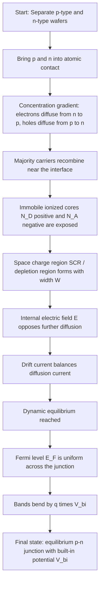
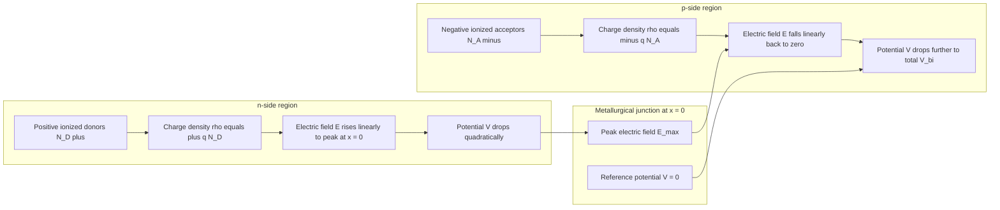
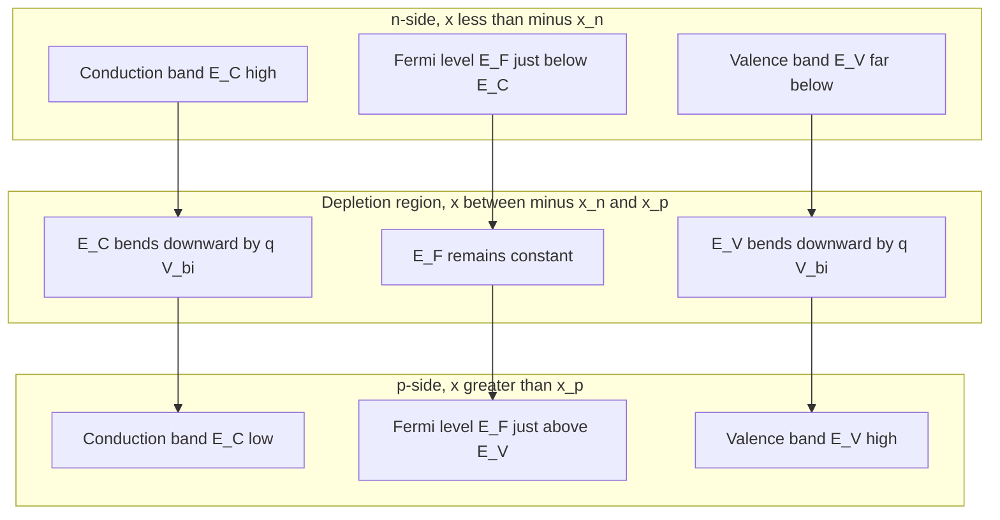
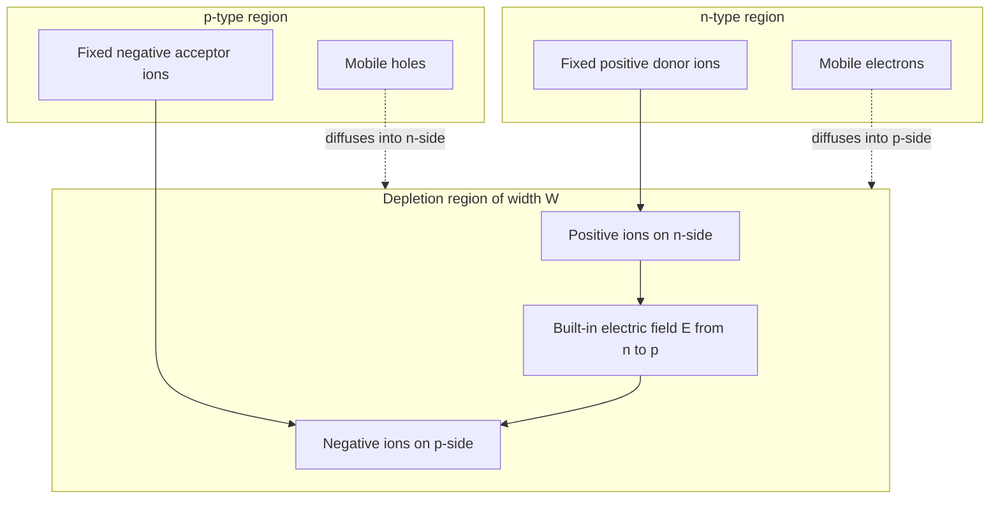

# Formation of p-n junction

<!-- SECTION_1_START -->
# Formation of p-n Junction

## 1.1 Formal Definition (KTU 2024 Syllabus Terminology)

A **p-n junction** is the fundamental building block of modern semiconductor devices, formed when a **p-type semiconductor** (excess holes, acceptor-doped) and an **n-type semiconductor** (excess electrons, donor-doped) are brought into intimate contact at an atomic scale — either through **alloying**, **diffusion**, **ion implantation**, or **epitaxial growth**.

At the metallurgical interface, a **Space Charge Region (SCR)** — also called the **depletion region** or **transition region** — is spontaneously created. This region is depleted of mobile charge carriers and contains only **immobile ionized donor** ($N_D^+$) **and acceptor** ($N_A^-$) **atoms**, which establish a built-in electric field $\vec{E}$ and a corresponding **contact potential** (built-in potential) $V_{bi}$.

> [!IMPORTANT]
> **KTU 2024 Module Highlight:** The term *formation* explicitly implies the transient diffusion-drift equilibration process. Students are expected to describe the *transient* phase (majority carrier diffusion, minority carrier drift) and the *equilibrium* phase (band bending, establishment of $V_{bi}$).

## 1.2 Intuitive Analogy — The "Bubble Diffusion" Picture

Imagine two balloons connected by a thin tube:
- **Balloon A** (the *n-side*) is filled with red gas molecules (electrons) at high pressure.
- **Balloon B** (the *p-side*) is filled with blue gas molecules (holes) at high pressure.

When the valve opens, gases diffuse into each other. But once the molecules mix, they **recombine** (red + blue = neutral colorless gas) near the middle. The balloons near the valve become **empty of gas**, leaving only the rigid balloon walls (the **ionized dopant atoms** acting as the **immobile space charge**). The pressure imbalance creates a "back-pressure" that eventually stops further diffusion. The empty zone = **depletion region**; the back-pressure = **built-in potential**.

## 1.3 Physical Constants and Material Parameters (Bold Highlight)

| Parameter | Symbol | Typical Value (Silicon at 300 K) |
| :--- | :--- | :--- |
| Boltzmann constant | $k_B$ | **1.38 × 10⁻²³ J/K** |
| Electronic charge | $q$ | **1.602 × 10⁻¹⁹ C** |
| Thermal voltage at 300 K | $V_T = k_B T/q$ | **≈ 0.0259 V (25.9 mV)** |
| Intrinsic carrier concentration (Si) | $n_i$ | **1.5 × 10¹⁰ cm⁻³** |
| Relative permittivity (Si) | $\varepsilon_r$ | **11.7** |
| Vacuum permittivity | $\varepsilon_0$ | **8.854 × 10⁻¹⁴ F/cm** |

> [!NOTE]
> **Mnemonic to remember:** At room temperature ($T = 300\,\text{K}$), the thermal voltage $V_T \approx 26\,\text{mV}$. Always substitute this value when a numerical answer is demanded in the KTU ESE.

## 1.4 Visualization Callout — Energy Band Diagram

> [!VISUALIZATION CONTROL]
> **Concept:** Equilibrium Energy Band Diagram of a p-n Junction (Band Bending)
> **GeoGebra / Desmos Input Equations (Fermi level alignment):**
> * Left side (n-region): $E_C(x) = E_{C,n} - qV_{bi}\,(1 - x/x_n)$ for $x \in [-x_n, 0]$
> * Right side (p-region): $E_C(x) = E_{C,p} - qV_{bi}\,(x/x_p)$ for $x \in [0, x_p]$
> * $E_V(x) = E_C(x) - E_g$ (with $E_g = 1.12\,\text{eV}$ for Si)
> * $E_F = \text{constant across junction at equilibrium}$
> **Visual Description:** On the x-axis draw position; on the y-axis draw energy. The conduction band $E_C$ and valence band $E_V$ on the n-side sit *higher* than on the p-side, with the bands **bending smoothly** across the depletion region of width $W = x_n + x_p$. The Fermi level $E_F$ is a perfectly horizontal line, located close to $E_C$ on the n-side and close to $E_V$ on the p-side.

---

<!-- SECTION_1_END -->

<!-- SECTION_2_START -->
# Deep Theoretical Analysis & KTU High-Yield Formula Sheet

## 2.1 The Four Operational Stages of Junction Formation

The formation of a p-n junction is a **time-dependent equilibration** of carrier concentrations. It can be broken down into four discrete physical stages.

### Stage 1 — Initial State (Just After Joining)
- p-side: high hole concentration $p_p \approx N_A$; electron concentration $n_p = n_i^2/N_A$.
- n-side: high electron concentration $n_n \approx N_D$; hole concentration $p_n = n_i^2/N_D$.
- A steep concentration gradient exists for *both* electrons (high on n-side, low on p-side) and holes (high on p-side, low on n-side).
- The Fermi levels are **not aligned**: $E_{F,n}$ lies near $E_C$ while $E_{F,p}$ lies near $E_V$.

### Stage 2 — Diffusion (Majority Carrier Transport)
- Electrons from the n-side **diffuse** into the p-side; holes from the p-side **diffuse** into the n-side.
- This is driven purely by the **concentration gradient** (Fick's first law) — no external field is needed.
- Diffusing electrons on the p-side **recombine** with majority holes; diffusing holes on the n-side **recombine** with majority electrons.
- Result: Near the interface, mobile carriers are **consumed**, exposing the **immobile ionized dopant cores**.

### Stage 3 — Space Charge Region (SCR) Establishment
- The exposed $N_D^+$ (on n-side) and $N_A^-$ (on p-side) ions create a **dipole layer** of width $W = x_n + x_p$.
- An **internal electric field** $\vec{E}$ points from the n-side (positive ions) to the p-side (negative ions).
- This field opposes further diffusion — it constitutes the **drift current** flowing in the *opposite* direction to the diffusion current.

### Stage 4 — Dynamic Equilibrium
- Equilibrium is reached when the **drift current exactly cancels the diffusion current** for each carrier type.
- Net current = **0**.
- A unified, constant **Fermi level** $E_F$ is established across the entire structure.
- The total band bending equals the **built-in potential** $qV_{bi} = E_{F,n} - E_{F,p}$ (before contact).

## 2.2 Charge Neutrality Condition

For the depletion region to remain a *neutral system as a whole*, the total positive charge on the n-side must equal the total negative charge on the p-side:

$$q \, N_D \, x_n = q \, N_A \, x_p$$

Solving gives the **width ratio rule**:

$$\frac{x_n}{x_p} = \frac{N_A}{N_D}$$

> [!TIP]
> **Engineering Implication:** In a *one-sided* junction (e.g., $N_A \gg N_D$, called an $n^+p$ junction), the depletion region extends almost entirely into the *lighter-doped* side. This is exploited in **photodiodes** to control where absorption occurs.

## 2.3 KTU Formula Cheat Sheet

| \# | Quantity | Formula | Key Conditions / Notes |
| :---: | :--- | :--- | :--- |
| 1 | Thermal voltage | $V_T = k_B T / q$ | $V_T \approx 25.85\,\text{mV}$ at $300\,\text{K}$ |
| 2 | Built-in potential | $V_{bi} = V_T \ln\!\left( \dfrac{N_A N_D}{n_i^2} \right)$ | Must be in **Volts**; $N_A, N_D, n_i$ in cm⁻³ |
| 3 | Total depletion width | $W = \sqrt{\dfrac{2 \varepsilon_s V_{bi}}{q}\!\left( \dfrac{N_A + N_D}{N_A N_D} \right)}$ | Zero applied bias; $\varepsilon_s = \varepsilon_r \varepsilon_0$ |
| 4 | Depletion extension on n-side | $x_n = \dfrac{W}{1 + N_D/N_A} = W \dfrac{N_A}{N_A + N_D}$ | For symmetric / asymmetric junctions |
| 5 | Depletion extension on p-side | $x_p = \dfrac{W}{1 + N_A/N_D} = W \dfrac{N_D}{N_A + N_D}$ | Always larger on lightly doped side |
| 6 | Peak electric field | $E_{max} = \dfrac{q N_D x_n}{\varepsilon_s} = \dfrac{2 V_{bi}}{W}$ | Occurs exactly at $x = 0$ (metallurgical junction) |
| 7 | Depletion capacitance / unit area | $C_j = \dfrac{\varepsilon_s}{W}$ | Used in varactor diode design |
| 8 | With reverse bias $V_R$ | Replace $V_{bi}$ by $(V_{bi} + V_R)$ in all width formulas | $V_R > 0$ for reverse bias |
| 9 | Charge neutrality | $N_D \, x_n = N_A \, x_p$ | Integral form of Poisson's solution |
| 10 | Mass-action law | $n_i^2 = n \, p$ | Holds at thermal equilibrium |

## 2.4 Real-World Engineering Utility

- **pn-junction diodes** form the active core of every rectifier, switching power supply, and AC-DC adapter.
- **Solar cells** (photovoltaic devices) operate by collecting photo-generated electron-hole pairs swept apart by the built-in field of a p-n junction.
- **LEDs and laser diodes** rely on minority-carrier injection across a forward-biased p-n junction to produce electroluminescence.
- **Bipolar Junction Transistors (BJTs)** are essentially two back-to-back p-n junctions with a shared, very thin base region.
- **Zener / avalanche diodes** exploit the *breakdown* of the depletion region under heavy reverse bias for voltage regulation.

---

<!-- SECTION_2_END -->

<!-- SECTION_3_START -->
# Step-by-Step Derivations & Symbolic Implementation

## 3.1 Derivation of the Built-in Potential $V_{bi}$

We start from the alignment of the Fermi level at equilibrium. Before contact:

$$E_{F,n} - E_{F,p} = q V_{bi}$$

Using the definitions of carrier concentration in non-degenerate semiconductors:

$$n_n = n_i \exp\!\left( \frac{E_{F,n} - E_i}{k_B T} \right), \qquad p_p = n_i \exp\!\left( \frac{E_i - E_{F,p}}{k_B T} \right)$$

Multiplying these two equations:

$$n_n \, p_p = n_i^2 \exp\!\left( \frac{E_{F,n} - E_{F,p}}{k_B T} \right)$$

Since at equilibrium $n_n \approx N_D$ and $p_p \approx N_A$:

$$N_A N_D = n_i^2 \exp\!\left( \frac{q V_{bi}}{k_B T} \right)$$

Taking the natural logarithm and rearranging:

$$\boxed{V_{bi} = \frac{k_B T}{q} \ln\!\left( \frac{N_A N_D}{n_i^2} \right) = V_T \ln\!\left( \frac{N_A N_D}{n_i^2} \right)}$$

> **Logic Step 1:** $E_{F,n} - E_{F,p} = qV_{bi}$ (Fermi level difference equals band bending in eV).
> **Logic Step 2:** Substitute the Boltzmann expressions for majority carrier density.
> **Logic Step 3:** Combine and exploit $n_n = N_D$, $p_p = N_A$.
> **Logic Step 4:** Solve for $V_{bi}$.

## 3.2 Derivation of the Depletion Width $W$ (Step-By-Step)

Apply the one-dimensional Poisson equation in the depletion approximation:

$$\frac{d^2 V(x)}{dx^2} = -\frac{\rho(x)}{\varepsilon_s}$$

### Step A — Charge Density in Each Region
- For $-x_n \le x \le 0$: $\rho(x) = +q N_D$ (ionized donors).
- For $0 \le x \le x_p$: $\rho(x) = -q N_A$ (ionized acceptors).
- Outside $[-x_n, x_p]$: $\rho(x) = 0$ (mobile carriers screen the field).

### Step B — Integrate Poisson's Equation on the n-side
Using $E(x) = -dV/dx$ and integrating once:

$$E_n(x) = -\frac{q N_D}{\varepsilon_s}(x + x_n), \qquad -x_n \le x \le 0$$

At $x = 0$ (the metallurgical junction), the field is maximum:

$$E(0) = -\frac{q N_D x_n}{\varepsilon_s}$$

### Step C — Integrate Again to Get Potential
Integrate $E_n(x)$ from $-x_n$ to $0$:

$$V(0) - V(-x_n) = \int_{-x_n}^{0} \frac{q N_D}{\varepsilon_s}(x + x_n)\, dx = \frac{q N_D x_n^2}{2 \varepsilon_s}$$

### Step D — Symmetric Treatment on the p-side
By analogy:

$$V(x_p) - V(0) = \frac{q N_A x_p^2}{2 \varepsilon_s}$$

### Step E — Total Built-in Voltage
Add the two potential drops:

$$V_{bi} = V(x_p) - V(-x_n) = \frac{q}{2 \varepsilon_s}\left( N_D x_n^2 + N_A x_p^2 \right)$$

### Step F — Apply Charge Neutrality
Use $N_D x_n = N_A x_p$ to eliminate $x_n$ in favour of $x_p$:

$$x_n = \frac{N_A}{N_D} x_p$$

Substituting:

$$V_{bi} = \frac{q}{2 \varepsilon_s}\left( N_D \frac{N_A^2}{N_D^2} x_p^2 + N_A x_p^2 \right) = \frac{q N_A x_p^2}{2 \varepsilon_s}\left( 1 + \frac{N_A}{N_D} \right) = \frac{q x_p^2}{2 \varepsilon_s}\cdot \frac{N_A(N_A + N_D)}{N_D}$$

### Step G — Solve for $x_p$

$$x_p = \sqrt{ \frac{2 \varepsilon_s V_{bi}}{q}\cdot \frac{N_D}{N_A(N_A + N_D)} }$$

### Step H — Symmetrically, Solve for $x_n$

$$x_n = \sqrt{ \frac{2 \varepsilon_s V_{bi}}{q}\cdot \frac{N_A}{N_D(N_A + N_D)} }$$

### Step I — Total Depletion Width

$$W = x_n + x_p = \sqrt{ \frac{2 \varepsilon_s V_{bi}}{q}\cdot \frac{(N_A + N_D)^2}{N_A N_D(N_A + N_D)} } = \sqrt{ \frac{2 \varepsilon_s V_{bi}}{q}\cdot \frac{N_A + N_D}{N_A N_D} }$$

$$\boxed{W = \sqrt{ \frac{2 \varepsilon_s V_{bi}}{q}\left( \frac{1}{N_A} + \frac{1}{N_D} \right) }}$$

## 3.3 Worked Numerical Example (KTU-Style Problem)

**Problem:** A silicon p-n junction at 300 K has $N_A = 10^{18}\,\text{cm}^{-3}$ and $N_D = 10^{16}\,\text{cm}^{-3}$. Take $n_i = 1.5 \times 10^{10}\,\text{cm}^{-3}$ and $\varepsilon_s = 11.7 \times 8.854 \times 10^{-14}\,\text{F/cm}$.

**Step 1 — Compute $V_{bi}$:**

$$V_{bi} = 0.0259 \ln\!\left( \frac{10^{18} \times 10^{16}}{(1.5 \times 10^{10})^2} \right) = 0.0259 \ln\!\left( \frac{10^{34}}{2.25 \times 10^{20}} \right)$$

$$V_{bi} = 0.0259 \ln(4.444 \times 10^{13}) = 0.0259 \times 31.42 = 0.814\,\text{V}$$

**Step 2 — Compute $W$:**

$$\varepsilon_s = 1.036 \times 10^{-12}\,\text{F/cm}$$

$$W = \sqrt{ \frac{2 \times (1.036 \times 10^{-12}) \times 0.814}{1.6 \times 10^{-19}} \times \left( \frac{1}{10^{18}} + \frac{1}{10^{16}} \right) }$$

$$\frac{1}{N_A} + \frac{1}{N_D} = 10^{-18} + 10^{-16} \approx 1.01 \times 10^{-16}\,\text{cm}^3$$

Numerator inside the square root:

$$2 \times (1.036 \times 10^{-12}) \times 0.814 \times 1.01 \times 10^{-16} = 1.703 \times 10^{-28}$$

Divide by $q$:

$$\frac{1.703 \times 10^{-28}}{1.6 \times 10^{-19}} = 1.064 \times 10^{-9}$$

$$W = \sqrt{ 1.064 \times 10^{-9} } = 3.26 \times 10^{-5}\,\text{cm} = 0.326\,\mu\text{m}$$

**Step 3 — Compute $x_n$ and $x_p$:**

$$x_n = W \cdot \frac{N_A}{N_A + N_D} = 0.326 \times \frac{10^{18}}{1.01 \times 10^{18}} \approx 0.323\,\mu\text{m}$$

$$x_p = W \cdot \frac{N_D}{N_A + N_D} \approx 0.003\,\mu\text{m} = 3\,\text{nm}$$

> **Interpretation:** Because $N_D \ll N_A$, this is a one-sided $p^+n$ junction. The depletion region extends almost entirely into the lightly doped **n-side** (≈ 99% of $W$).

## 3.4 Symbolic Python Implementation (for Computational Validation)

```python
import math
from dataclasses import dataclass

@dataclass(frozen=True)
class Semiconductor:
    name: str
    ni: float           # intrinsic carrier concentration (cm^-3)
    eps_r: float        # relative permittivity
    Eg: float           # bandgap (eV)

    @property
    def eps_s(self) -> float:
        """Absolute permittivity in F/cm."""
        return self.eps_r * 8.854e-14

@dataclass(frozen=True)
class PNJunction:
    semi: Semiconductor
    Na: float           # acceptor concentration (cm^-3)
    Nd: float           # donor concentration (cm^-3)
    T: float = 300.0    # temperature in Kelvin
    Vr: float = 0.0     # applied reverse bias (V); 0 for equilibrium

    @property
    def Vt(self) -> float:
        """Thermal voltage in Volts."""
        return (1.38e-23 * self.T) / 1.602e-19

    @property
    def Vbi(self) -> float:
        """Built-in potential in Volts."""
        if self.Na * self.Nd <= 0:
            raise ValueError("Both Na and Nd must be positive.")
        return self.Vt * math.log((self.Na * self.Nd) / (self.semi.ni ** 2))

    @property
    def W(self) -> float:
        """Total depletion width in cm."""
        V_eff = self.Vbi + self.Vr
        if V_eff < 0:
            raise ValueError("Total effective voltage must be non-negative.")
        factor = (2.0 * self.semi.eps_s * V_eff) / 1.602e-19
        inv_sum = (1.0 / self.Na) + (1.0 / self.Nd)
        return math.sqrt(factor * inv_sum)

    @property
    def xn(self) -> float:
        return self.W * (self.Na / (self.Na + self.Nd))

    @property
    def xp(self) -> float:
        return self.W * (self.Nd / (self.Na + self.Nd))

    @property
    def E_max(self) -> float:
        """Peak electric field magnitude in V/cm."""
        if self.W == 0:
            return 0.0
        return 2.0 * (self.Vbi + self.Vr) / self.W

    def report(self) -> str:
        return (
            f"--- {self.semi.name} p-n Junction Report ---\n"
            f"T = {self.T} K,  V_T = {self.Vt*1000:.2f} mV\n"
            f"V_bi = {self.Vbi:.4f} V\n"
            f"W    = {self.W*1e4:.4f} um\n"
            f"x_n  = {self.xn*1e4:.4f} um   (n-side)\n"
            f"x_p  = {self.xp*1e4:.4f} um   (p-side)\n"
            f"E_max= {self.E_max:.2e} V/cm\n"
        )

# ----- Example usage for the worked problem -----
si = Semiconductor(name="Silicon", ni=1.5e10, eps_r=11.7, Eg=1.12)
junction = PNJunction(semi=si, Na=1e18, Nd=1e16)
print(junction.report())
```

**Expected output (rounded):**
```
--- Silicon p-n Junction Report ---
T = 300.0 K,  V_T = 25.85 mV
V_bi = 0.8138 V
W    = 0.3263 um
x_n  = 0.3230 um   (n-side)
x_p  = 0.0033 um   (p-side)
E_max= 4.99e+04 V/cm
```

---

<!-- SECTION_3_END -->

<!-- SECTION_4_START -->
# Structural Diagrams & Schematics

## 4.1 Process Flow of p-n Junction Formation (Mermaid)



## 4.2 Charge-Field-Potential Profile Block (Mermaid)



## 4.3 Energy Band Diagram Block (Mermaid)



## 4.4 Depletion Region Physical Schematic (Mermaid)



---

<!-- SECTION_4_END -->

<!-- SECTION_5_START -->
# KTU 2024 Scheme Examination Question Bank & Topic Recap

## 5.1 Part A — Short Answer Questions (3 Marks Each)

### **Question 1** `[KTU University Exam - July 2024]` | **CO1 | Remember**

**State the law of mass action and write its mathematical form. Mention its significance in the context of p-n junction formation.**

**Model Answer (3 marks):**

The **law of mass action** states that at thermal equilibrium, the product of the electron and hole concentrations in a semiconductor is a constant equal to the square of the intrinsic carrier concentration, independent of doping.

$$n \cdot p = n_i^2$$

**Significance in p-n junction formation (1 mark):** It dictates the *minority* carrier concentration on each side. On the n-side, $p_n = n_i^2 / N_D$ is very small, while on the p-side, $n_p = n_i^2 / N_A$ is also very small. This explains the *direction* of minority carrier injection and diffusion across the junction.

> **Valuation Key:** '[Stating the law: 2 marks]', '[Stating its role in junction formation: 1 mark]'.

---

### **Question 2** `[KTU University Exam - Dec 2023]` | **CO1, CO2 | Understand**

**Explain the concept of depletion region and built-in potential in a p-n junction. Why does the depletion width not grow indefinitely?**

**Model Answer (3 marks):**

The **depletion region** is the narrow zone around the metallurgical junction of a p-n diode where mobile charge carriers are absent, leaving behind only the immobile ionized dopant atoms. It is also called the **space charge region**.

The **built-in potential** $V_{bi}$ is the contact potential that arises across this depletion region due to charge separation. It equals the work done per unit charge to move a carrier across the junction.

The depletion width stops growing because the **internal electric field** created by the exposed ions opposes further carrier diffusion. Equilibrium is established when the drift current exactly balances the diffusion current (1 mark each point).

---

## 5.2 Part B — Long Answer Questions (14 Marks, Internal Choice)

### **Question A** `[KTU University Exam - Dec 2023]` | **CO1, CO2 | Understand + Apply**

#### (a) Derive the expression for the built-in potential of a p-n junction. State clearly the assumptions used. (7 marks)

**Model Solution:**

**Assumptions (2 marks):**
1. Non-degenerate doping (Boltzmann statistics valid).
2. Abrupt junction approximation — depletion width is much smaller than the quasi-neutral regions.
3. Complete ionization of dopants at room temperature.
4. One-dimensional geometry.

**Derivation (5 marks):**

At equilibrium the Fermi level must be flat across the entire structure. The Fermi levels on either side, before contact, differ by $q V_{bi}$:

$$E_{F,n} - E_{F,p} = q V_{bi}$$

Using the Boltzmann relations for majority carrier concentrations:

$$n_n = n_i \exp\!\left( \frac{E_{F,n} - E_i}{k_B T} \right), \qquad p_p = n_i \exp\!\left( \frac{E_i - E_{F,p}}{k_B T} \right)$$

Multiplying:

$$n_n p_p = n_i^2 \exp\!\left( \frac{E_{F,n} - E_{F,p}}{k_B T} \right) = n_i^2 \exp\!\left( \frac{q V_{bi}}{k_B T} \right)$$

With $n_n \approx N_D$ and $p_p \approx N_A$:

$$N_A N_D = n_i^2 \exp\!\left( \frac{q V_{bi}}{k_B T} \right)$$

Solving:

$$\boxed{V_{bi} = \frac{k_B T}{q} \ln\!\left( \frac{N_A N_D}{n_i^2} \right) = V_T \ln\!\left( \frac{N_A N_D}{n_i^2} \right)}$$

> **Valuation Key:** '[Listing the four assumptions: 2 marks]', '[Setting up Fermi level equality: 1 mark]', '[Boltzmann relations and multiplication step: 1 mark]', '[Substituting majority carrier concentrations: 1 mark]', '[Final logarithmic form: 1 mark]'.

---

#### (b) For a silicon p-n junction at 300 K with $N_A = 5 \times 10^{17}\,\text{cm}^{-3}$ and $N_D = 10^{15}\,\text{cm}^{-3}$, compute (i) the built-in potential, and (ii) the depletion width. Given: $n_i = 1.5 \times 10^{10}\,\text{cm}^{-3}$, $\varepsilon_s = 11.7 \times 8.854 \times 10^{-14}\,\text{F/cm}$. (7 marks)

**Model Solution:**

**Step 1 — Built-in potential (3 marks):**

$$V_{bi} = 0.0259 \ln\!\left( \frac{5 \times 10^{17} \times 10^{15}}{(1.5 \times 10^{10})^2} \right)$$

$$= 0.0259 \ln\!\left( \frac{5 \times 10^{32}}{2.25 \times 10^{20}} \right) = 0.0259 \ln(2.222 \times 10^{12})$$

$$V_{bi} = 0.0259 \times 28.43 = 0.7363\,\text{V}$$

**Step 2 — Depletion width (4 marks):**

$$\varepsilon_s = 11.7 \times 8.854 \times 10^{-14} = 1.036 \times 10^{-12}\,\text{F/cm}$$

$$W = \sqrt{ \frac{2 \times 1.036 \times 10^{-12} \times 0.7363}{1.6 \times 10^{-19}} \times \left( \frac{1}{5 \times 10^{17}} + \frac{1}{10^{15}} \right) }$$

The bracketed term:

$$\frac{1}{5 \times 10^{17}} + \frac{1}{10^{15}} = 2 \times 10^{-18} + 1 \times 10^{-15} \approx 1.002 \times 10^{-15}\,\text{cm}^3$$

Numerator:

$$2 \times 1.036 \times 10^{-12} \times 0.7363 \times 1.002 \times 10^{-15} = 1.528 \times 10^{-27}$$

Divide by $q$:

$$\frac{1.528 \times 10^{-27}}{1.6 \times 10^{-19}} = 9.55 \times 10^{-9}$$

$$W = \sqrt{9.55 \times 10^{-9}} = 9.77 \times 10^{-5}\,\text{cm} \approx 0.977\,\mu\text{m}$$

**Final answers:** $V_{bi} \approx 0.736\,\text{V}$ and $W \approx 0.977\,\mu\text{m}$.

> **Valuation Key:** '[Substituting $V_T = 0.0259$ V: 1 mark]', '[Computing the ratio correctly: 1 mark]', '[Final $V_{bi}$: 1 mark]', '[Setting up the $W$ formula: 1 mark]', '[Computing the inverse concentration sum: 1 mark]', '[Numerical evaluation of the pre-factor: 1 mark]', '[Final $W$: 1 mark]'.

---

### **Question B (Alternative Choice)** `[KTU University Exam - July 2024]` | **CO2, CO3 | Apply + Analyze**

#### (a) With the help of neat diagrams, describe the formation of a p-n junction and explain the establishment of the depletion region and built-in potential. (7 marks)

**Model Solution:**

**Diagram description (3 marks):**
Draw the p-type and n-type blocks *before contact* (with $E_C, E_V, E_F$ on each side), then *after contact* at equilibrium (with band bending and a single flat $E_F$).

**Stages of formation (4 marks — to be elaborated in prose):**

1. **Initial diffusion:** Holes diffuse from p → n, electrons diffuse from n → p due to concentration gradients.
2. **Recombination:** These carriers recombine with the local majority carriers near the interface.
3. **Exposure of ions:** The recombination exposes uncompensated ionized acceptors (negative) on the p-side and ionized donors (positive) on the n-side.
4. **Establishment of $\vec{E}$ and $V_{bi}$:** A space-charge dipole forms. The resulting electric field points from n to p, and a potential barrier $V_{bi}$ builds up.
5. **Equilibrium:** Diffusion current is exactly cancelled by drift current; net current is zero; $E_F$ is flat.

> **Valuation Key:** '[Two labelled diagrams — pre and post contact: 3 marks]', '[Five-stage narrative with key terminology: 4 marks]'.

---

#### (b) A silicon p-n junction has $N_A = 10^{16}\,\text{cm}^{-3}$ and $N_D = 10^{18}\,\text{cm}^{-3}$. Calculate (i) the built-in potential, (ii) the depletion widths on the p-side and n-side, and (iii) the maximum electric field at equilibrium. (7 marks)

**Model Solution:**

**Step 1 — $V_{bi}$ (2 marks):**

$$V_{bi} = 0.0259 \ln\!\left( \frac{10^{16} \times 10^{18}}{(1.5 \times 10^{10})^2} \right) = 0.0259 \ln(4.444 \times 10^{13}) = 0.0259 \times 31.42$$

$$V_{bi} = 0.814\,\text{V}$$

**Step 2 — Total $W$ (2 marks):**

$$W = \sqrt{ \frac{2 \times 1.036 \times 10^{-12} \times 0.814}{1.6 \times 10^{-19}} \times \left( \frac{1}{10^{16}} + \frac{1}{10^{18}} \right) }$$

$$= \sqrt{ 1.064 \times 10^{-9} \times 1.01 \times 10^{-16} } = \sqrt{1.075 \times 10^{-25}} = 3.28 \times 10^{-5}\,\text{cm}$$

$$W \approx 0.328\,\mu\text{m}$$

**Step 3 — $x_n$ and $x_p$ (2 marks):**

$$x_n = W \cdot \frac{N_A}{N_A + N_D} = 0.328 \times \frac{10^{16}}{1.01 \times 10^{18}} \approx 0.00325\,\mu\text{m} = 3.25\,\text{nm}$$

$$x_p = W \cdot \frac{N_D}{N_A + N_D} \approx 0.328 \times 0.990 = 0.325\,\mu\text{m}$$

**Step 4 — $E_{max}$ (1 mark):**

$$E_{max} = \frac{2 V_{bi}}{W} = \frac{2 \times 0.814}{3.28 \times 10^{-5}} = 4.96 \times 10^{4}\,\text{V/cm}$$

> **Valuation Key:** '[Correct $V_{bi}$: 2 marks]', '[Correct $W$ formula and arithmetic: 2 marks]', '[Correct $x_n$, $x_p$ using charge neutrality: 2 marks]', '[Correct $E_{max}$: 1 mark]'.

---

## 5.3 KTU Examiner's Valuation Warning

> [!WARNING]
> **Common Pitfalls & Mark Deduction Zones**
> 1. **Unit mismatch in $V_{bi}$:** Forgetting that $N_A, N_D, n_i$ must all be in **cm⁻³** (or all in m⁻³). Mixing units silently corrupts the log term.
> 2. **Confusing the formula for $x_n$ and $x_p$:** Students often swap the fractions. **Remember:** the depletion width on a given side is proportional to the *opposite* doping concentration.
> 3. **Forgetting the depletion approximation:** You must explicitly state that all mobile carriers are assumed to be fully swept out of the SCR — this assumption alone is worth 1 mark in derivation questions.
> 4. **Skipping charge neutrality:** In a derivation, always close the algebra with $N_D x_n = N_A x_p$. Examiners reward this final closure step.
> 5. **Sign of $E$:** The field points from the n-side to the p-side (i.e., from + ions to − ions). Writing it backwards is a 0.5–1 mark deduction.

---

## 5.4 Topic Recap & Important Things to Remember

- A **p-n junction** forms spontaneously when p-type and n-type semiconductors are joined, due to carrier diffusion and the resulting built-in electric field.
- **Four stages of formation:** diffusion → recombination → space-charge exposure → drift-diffusion equilibrium.
- The **depletion region (SCR)** contains only *immobile* ionized dopants; mobile carriers are absent.
- **Built-in potential:** $V_{bi} = V_T \ln(N_A N_D / n_i^2)$ — temperature dependent, doping dependent, material dependent.
- **Thermal voltage** $V_T = k_B T / q \approx 25.9\,\text{mV}$ at 300 K — memorize this value for the KTU ESE.
- **Total depletion width:** $W = \sqrt{ (2 \varepsilon_s V_{bi} / q)(1/N_A + 1/N_D) }$.
- **Charge neutrality:** $N_D x_n = N_A x_p$ — depletion width is *larger* on the *lighter-doped* side.
- **Peak electric field:** $E_{max} = 2 V_{bi} / W$ — occurs at the metallurgical junction $x = 0$.
- **One-sided junctions** ($N_A \gg N_D$ or vice versa) simplify the analysis: $W \approx \sqrt{2 \varepsilon_s V_{bi} / (q N_{light})}$.
- **With reverse bias** $V_R$, replace $V_{bi}$ by $(V_{bi} + V_R)$ in all width and field formulas.
- **Law of mass action:** $n \cdot p = n_i^2$ governs the minority carrier concentrations on each side.
- **Engineering relevance:** rectifiers, solar cells, LEDs, photodiodes, BJTs, Zener diodes — all are direct applications of the p-n junction physics covered here.
- **Always draw** the energy band diagram (with band bending) in any 7+ mark descriptive question — it is mandatory for full marks under the KTU valuation scheme.

<!-- SECTION_5_END -->
