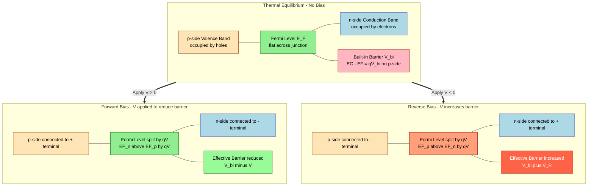
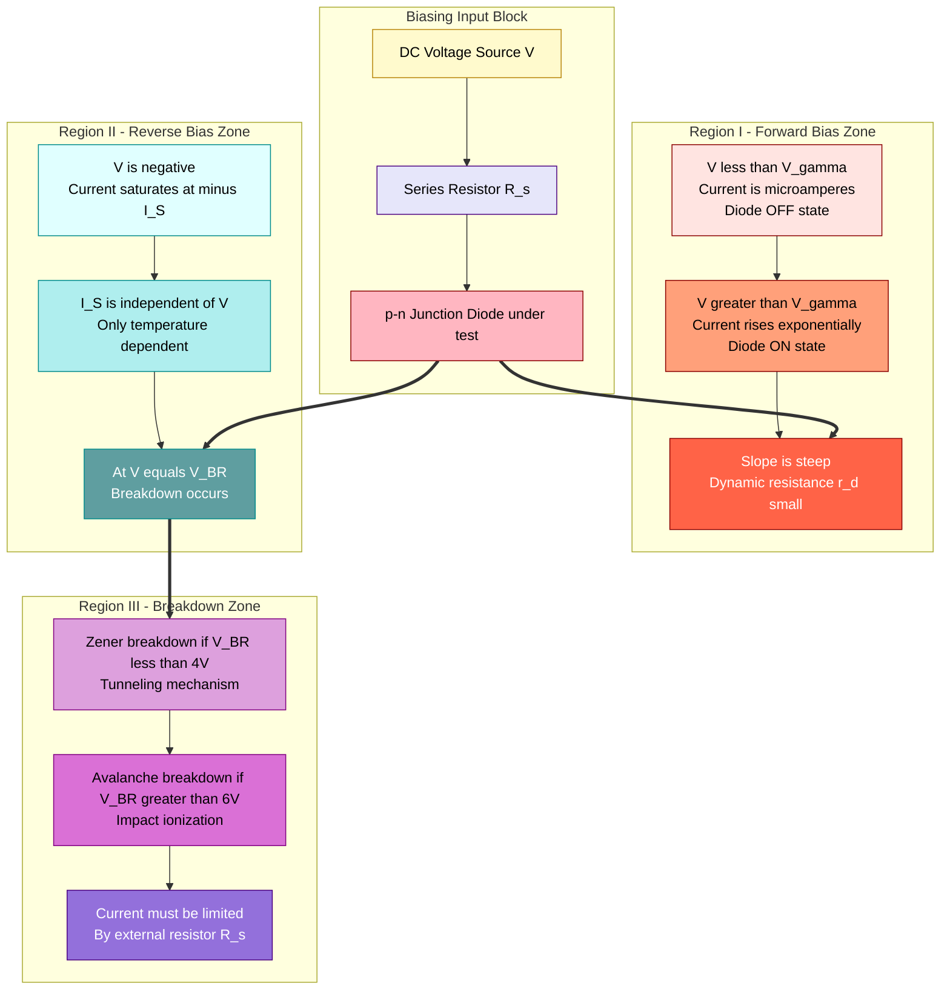
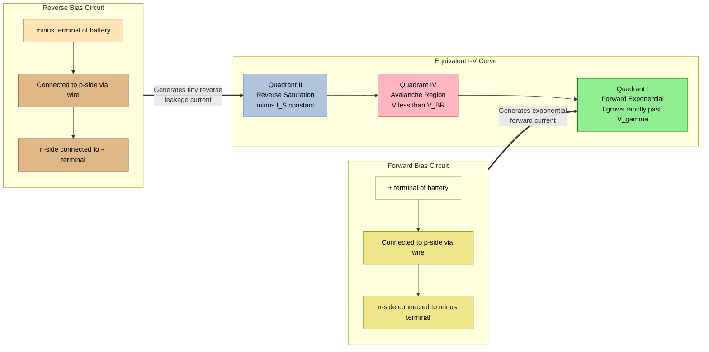
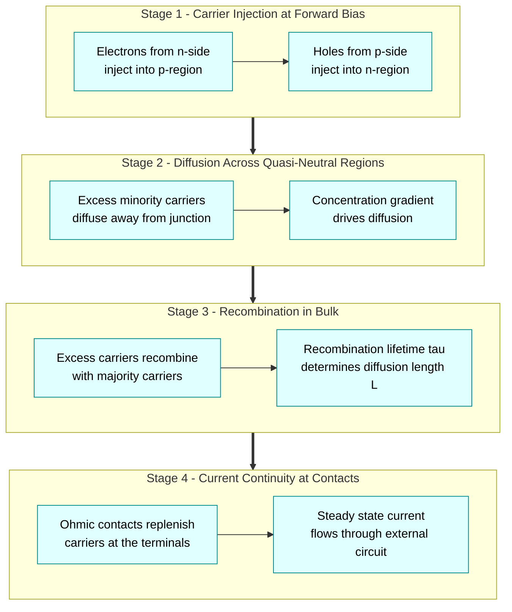
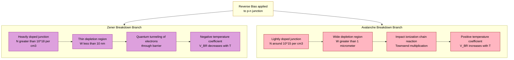

# I-V Characteristics of p-n junction

<!-- SECTION_1_START -->

# I-V Characteristics of p-n Junction Diode

## 1. Core Technical Definition

> [!NOTE]
> **Formal Definition (KTU 2024 Syllabus Terminology)**
> A **p-n junction** is a semiconductor device formed by joining p-type semiconductor material (with holes as majority carriers) and n-type semiconductor material (with electrons as majority carriers) within a single crystal lattice. The **Current-Voltage (I-V) Characteristics** describe the non-linear, asymmetric relationship between the current flowing through the junction and the applied voltage across it, mathematically governed by the **Shockley Diode Equation**.

> [!IMPORTANT]
> **Syllabus Highlight (GAPHT121 - Module 3)**
> According to the KTU 2024 B.Tech Physics for Information Science syllabus, the study of I-V characteristics encompasses the formation of the depletion region, the built-in potential barrier, current transport mechanisms (drift and diffusion), the quantitative behavior under forward and reverse bias conditions, and breakdown phenomena. This forms the foundational bedrock for the operation of **diodes, transistors, integrated circuits, photodetectors, and solar cells** — devices central to information and communication technology.

---

## 2. Intuitive Conceptual Analogy

> [!TIP]
> **Real-World Analogy: The Check Valve in a Water Pipeline**
> Imagine a water pipeline with a one-way check valve. Water (current) can flow easily in the forward direction (forward bias) once a small pressure (threshold/voltage) is applied to push the valve open. However, trying to push water in the reverse direction simply seats the valve more firmly shut, blocking the flow almost entirely (reverse bias). Only an extremely high pressure (breakdown voltage) can rupture the valve (Zener/Avalanche breakdown). This is precisely how a p-n junction behaves with electric current!

**Geometric / Physical Intuition:**

- A p-n junction is created when a **single crystal of semiconductor** (typically Silicon or Germanium) is doped on one side with **acceptor impurities** (Boron, Indium) to create the p-region, and on the other side with **donor impurities** (Phosphorus, Arsenic) to create the n-region.
- The boundary where these two regions meet is called the **metallurgical junction**.
- At thermal equilibrium (no external bias), a **depletion region** is established at the junction. This region is depleted of mobile charge carriers and contains only **immobile ionized donor and acceptor atoms**, forming a **space-charge region** with a built-in electric field $\vec{E}$ pointing from the n-side to the p-side.
- The width of this depletion region is of the order of **$\mathbf{10^{-6}}$ to $\mathbf{10^{-7}\, m}$** (sub-micrometer scale), and the built-in potential $V_{bi}$ is typically **$\mathbf{0.7\, V}$ for Silicon** and **$\mathbf{0.3\, V}$ for Germanium** at room temperature ($T = 300\, K$).

> [!VISUALIZATION CONTROL]
> **Concept:** Charge Distribution and Built-in Potential Across a p-n Junction at Equilibrium
> **GeoGebra / Desmos Input Equations:**
> * Charge Density: $\rho(x) = -qN_A$ for $-x_p \le x \le 0$ ; $\rho(x) = +qN_D$ for $0 \le x \le x_n$ ; $\rho(x) = 0$ elsewhere
> * Electric Field: $E(x) = -\dfrac{qN_A}{\varepsilon_s}(x + x_p)$ for $-x_p \le x \le 0$
> * Electric Field: $E(x) = \dfrac{qN_D}{\varepsilon_s}(x_n - x)$ for $0 \le x \le x_n$
> * Potential: $V(x)$ — a piecewise linear/parabolic curve rising from p-side to n-side by $V_{bi}$
> **Visual Description:** Students should observe a step-function charge density profile, a triangular (sloping down then up across zero) electric field profile that is maximum and negative at the junction, and a potential profile that smoothly rises from the p-side to the n-side by an amount $V_{bi}$.

---

## 3. Charge Carrier Dynamics at the Junction

Three fundamental physical processes occur the instant a p-n junction is formed:

1. **Diffusion:** Holes diffuse from the p-side to the n-side, and electrons diffuse from the n-side to the p-side, due to the concentration gradient.
2. **Recombination & Depletion:** Diffusing carriers recombine near the junction with the majority carriers of the opposite side, leaving behind a region devoid of mobile carriers — the **depletion region** or **space-charge region**.
3. **Built-in Electric Field:** The exposed ionized acceptors (negative ions, $N_A^-$) on the p-side and ionized donors (positive ions, $N_D^+$) on the n-side create an electric field $\vec{E}$ that opposes further diffusion. Equilibrium is reached when the drift current due to this field exactly balances the diffusion current.

> [!WARNING]
> **Common Misconception Alert**
> The depletion region is **NOT** completely empty of charge — it contains immobile ionized dopant atoms that constitute the space charge. Mobile carriers are pushed away from the junction. The depletion width is symbol $W$ with $W = x_n + x_p$.

<!-- SECTION_1_END -->

<!-- SECTION_2_START -->

# Deep Theoretical Analysis & KTU Formula Sheet

## 1. Quantitative Description of the Depletion Region

The depletion region is analyzed using **Poisson's equation** in electrostatics:

$$\frac{d^2 V}{dx^2} = -\frac{\rho(x)}{\varepsilon_s}$$

where $\varepsilon_s = \varepsilon_r \varepsilon_0$ is the permittivity of the semiconductor material.

Applying charge neutrality across the depletion region:

$$q N_A x_p = q N_D x_n \quad \Longrightarrow \quad N_A x_p = N_D x_n$$

This implies the depletion region extends further into the **lightly doped side**. For a one-sided abrupt junction (e.g., $N_A \gg N_D$), almost the entire depletion region lies in the n-side.

---

## 2. The Built-in Potential (Contact Potential) $V_{bi}$

The built-in potential is the work done to move a unit positive charge from the p-side to the n-side against the contact electric field. It depends on the doping concentrations and temperature.

$$V_{bi} = \frac{k_B T}{q} \ln\!\left(\frac{N_A N_D}{n_i^{\,2}}\right) = V_T \ln\!\left(\frac{N_A N_D}{n_i^{\,2}}\right)$$

where:
- $k_B = 1.381 \times 10^{-23}\, \text{J/K}$ is Boltzmann's constant.
- $q = 1.6 \times 10^{-19}\, C$ is the elementary charge.
- $T$ is the absolute temperature in Kelvin.
- $n_i$ is the intrinsic carrier concentration of the semiconductor.
- $V_T = k_B T / q \approx 25.85\, \text{mV}$ at $T = 300\, K$ is the **thermal voltage**.

> [!IMPORTANT]
> **Engineering Insight**
> The built-in potential acts as a **natural barrier** that must be overcome before significant current can flow under forward bias. For Silicon with $N_A = 10^{18}\, \text{cm}^{-3}$, $N_D = 10^{15}\, \text{cm}^{-3}$, $n_i = 1.5 \times 10^{10}\, \text{cm}^{-3}$, the value of $V_{bi} \approx 0.75\, V$. This is the origin of the famous "$\mathbf{0.7\, V}$ knee voltage" observed in silicon diode forward characteristics.

---

## 3. Depletion Width Calculation

By solving Poisson's equation on both sides of the junction with appropriate boundary conditions (electric field goes to zero at the edges of the depletion region), the total depletion width is obtained as:

$$W = \sqrt{\frac{2 \varepsilon_s V_{bi}}{q}\!\left(\frac{1}{N_A} + \frac{1}{N_D}\right)}$$

When an external reverse bias $V_R$ is applied, $V_{bi}$ is replaced by the **total voltage across the junction** $V_{bi} + V_R$:

$$W = \sqrt{\frac{2 \varepsilon_s (V_{bi} + V_R)}{q}\!\left(\frac{1}{N_A} + \frac{1}{N_D}\right)}$$

The individual widths on each side are:

$$x_p = \frac{W \cdot N_D}{N_A + N_D}, \qquad x_n = \frac{W \cdot N_A}{N_A + N_D}$$

---

## 4. Capacitance of the Depletion Region (Junction Capacitance)

Because the depletion region resembles a parallel-plate capacitor with the ionized dopants acting as charges on the plates, the junction exhibits a voltage-dependent capacitance:

$$C_j = \frac{\varepsilon_s A}{W} = A \sqrt{\frac{q \varepsilon_s N_A N_D}{2 (N_A + N_D) (V_{bi} + V_R)}}$$

where $A$ is the cross-sectional area of the junction. The differential (small-signal) capacitance is:

$$C_j = \frac{dQ}{dV_R} = \frac{C_{j0}}{\sqrt{1 + \dfrac{V_R}{V_{bi}}}}$$

> [!IMPORTANT]
> **Application: Varactor Diode (Varicap)**
> The voltage-dependent junction capacitance is exploited commercially in **Varactor diodes** used in voltage-controlled oscillators (VCOs), automatic frequency control (AFC) circuits in television tuners, and parametric amplifiers. This is a direct, practical engineering application of I-V characteristics.

---

## 5. The Shockley Diode Equation (Quantitative I-V Relationship)

The current through a p-n junction diode as a function of applied voltage $V$ is given by the **Shockley Diode Equation** (developed by William Shockley in 1949):

$$I = I_S \!\left( \exp\!\left(\frac{qV}{\eta k_B T}\right) - 1 \right) = I_S \!\left( \exp\!\left(\frac{V}{\eta V_T}\right) - 1 \right)$$

where:
- $I_S$ is the **reverse saturation current** (scale current), typically $\mathbf{10^{-15}}$ to $\mathbf{10^{-6}\, A}$ for silicon diodes.
- $\eta$ is the **ideality factor** (also called emission coefficient), usually between $\mathbf{1}$ (ideal diffusion-limited) and $\mathbf{2}$ (recombination-dominated).
- $V$ is the voltage applied across the diode (positive for forward bias, negative for reverse bias).

### Two Limiting Cases of the Shockley Equation:

**Case A — Forward Bias ($V \gg \eta V_T$):**

The exponential term dominates, giving:

$$I \approx I_S \exp\!\left(\frac{V}{\eta V_T}\right)$$

The current grows **exponentially** with the applied voltage. A mere 60 mV increase in $V$ causes the current to **increase by a factor of 10** (at $\eta = 1$, $T = 300\, K$).

**Case B — Reverse Bias ($V \ll 0$, i.e., $V \to -\infty$):**

The exponential term vanishes, leaving:

$$I \approx -I_S$$

The current saturates to a small, constant value $I_S$ in the reverse direction. This is the **reverse saturation current** arising from thermally generated minority carriers.

---

## 6. Dynamic (Small-Signal) Resistance $r_d$

The **dynamic resistance** or **incremental resistance** of a diode is the slope of the I-V curve at a particular operating point $Q$:

$$r_d = \left(\frac{dV}{dI}\right)_{Q} = \frac{\eta V_T}{I_Q} = \frac{\eta V_T}{I_S \exp(V_Q / \eta V_T)}$$

where $I_Q$ and $V_Q$ are the quiescent (DC) operating point current and voltage respectively.

> [!TIP]
> **Practical Example:** At $I_Q = 1\, mA$, $\eta = 1$, $T = 300\, K$:
> $r_d = (1)(25.85\, mV) / (1\, mA) = 25.85\, \Omega$

---

## 7. Breakdown Mechanisms in Reverse Bias

When the reverse bias exceeds a critical value $V_{BR}$, the reverse current increases sharply. Two mechanisms cause this:

### a) Zener Breakdown (Dominant in Heavily Doped Junctions):
- Occurs at **low reverse voltages** (typically $< 5\, V$).
- Caused by **quantum mechanical tunneling** of electrons from the valence band of the p-side directly through the thin depletion region barrier into the conduction band of the n-side.
- The Zener breakdown voltage has a **negative temperature coefficient** (decreases with temperature).

### b) Avalanche Breakdown (Dominant in Lightly Doped Junctions):
- Occurs at **higher reverse voltages** ($> 6\, V$).
- Caused by **impact ionization**: a minority carrier accelerated by the strong electric field gains sufficient kinetic energy to ionize a lattice atom upon collision, creating an electron-hole pair. These new carriers are themselves accelerated and create more carriers — a **chain reaction (Townsend avalanche)**.
- Has a **positive temperature coefficient**.

> [!NOTE]
> **Zener vs. Avalanche — Exam Tip:** The nominal breakdown voltage is around 4–5 V where both mechanisms may coexist. Below 4 V: pure Zener. Above 6 V: pure Avalanche. Both mechanisms are non-destructive as long as the power dissipation stays within the diode's rated limits.

---

## KTU 2024 — High-Yield Formula Cheat Sheet

| # | Quantity | Formula | Symbol Definitions / Units | Boundary / Validity Condition |
|---|----------|---------|------------------------------|-------------------------------|
| 1 | Thermal Voltage | $V_T = \dfrac{k_B T}{q}$ | $V_T \approx 25.85\, mV$ at $300\, K$ | $T > 0\, K$ |
| 2 | Built-in Potential | $V_{bi} = V_T \ln\!\left(\dfrac{N_A N_D}{n_i^{\,2}}\right)$ | $V_{bi}$ in Volts; $N_A, N_D$ in $\text{cm}^{-3}$ | $T = 300\, K$ (or general with $T$) |
| 3 | Depletion Width | $W = \sqrt{\dfrac{2 \varepsilon_s (V_{bi} + V_R)}{q}\!\left(\dfrac{1}{N_A} + \dfrac{1}{N_D}\right)}$ | $W$ in meters; $V_R \ge 0$ (reverse bias) | Abrupt junction, one-sided limit |
| 4 | Charge Neutrality | $N_A x_p = N_D x_n$ | $x_p, x_n$ in meters | Total charge balance |
| 5 | Shockley Equation | $I = I_S \!\left( \exp\!\left(\dfrac{V}{\eta V_T}\right) - 1 \right)$ | $I$ in Amperes; $V$ in Volts | $V < V_{BR}$ (no breakdown) |
| 6 | Forward Current (approx.) | $I \approx I_S \exp\!\left(\dfrac{V}{\eta V_T}\right)$ | $V \gg \eta V_T$ | High-level injection not considered |
| 7 | Reverse Saturation Current | $I \approx -I_S$ | $V \ll 0$ | Strong reverse bias region |
| 8 | Dynamic Resistance | $r_d = \dfrac{\eta V_T}{I_Q}$ | $r_d$ in Ohms; $I_Q$ in Amps | Small-signal AC operation |
| 9 | Junction Capacitance | $C_j = \dfrac{\varepsilon_s A}{W}$ | $C_j$ in Farads; $A$ in $\text{m}^2$ | Reverse bias region |
| 10 | Cut-in (Knee) Voltage | $V_{\gamma} \approx 0.7\, V$ (Si), $0.3\, V$ (Ge) | $V_{\gamma}$ in Volts | Empirical turn-on point |
| 11 | Avalanche Multiplication | $M = \dfrac{1}{1 - (V/V_{BR})^n}$ | $n$ depends on material (Si: 3–6) | $V \to V_{BR}$ |

---

## 8. Real-World Engineering Applications

The p-n junction I-V characteristic is the building block of virtually all modern electronics:

1. **Rectifiers:** Half-wave and full-wave rectifiers in DC power supplies use diodes to convert AC to pulsating DC.
2. **Signal Demodulation:** In AM radio receivers, the diode envelope detector extracts the audio signal from the modulated carrier.
3. **Voltage Regulation:** Zener diodes operating in reverse breakdown maintain a constant reference voltage.
4. **Logic Gates:** Diode-based AND/OR gates form the earliest digital logic families (DL — Diode Logic).
5. **Solar Cells:** Photodiodes operated in the **photovoltaic mode** (fourth quadrant of the I-V curve) convert light directly into electricity.
6. **LEDs (Light Emitting Diodes):** Forward-biased junctions in direct bandgap semiconductors (GaAs, InP, GaN) emit photons via **electroluminescence**.
7. **Photodetectors & Image Sensors:** Reverse-biased photodiodes in CCD/CMOS image sensors convert incident photons into measurable current.
8. **Temperature Sensors:** The temperature dependence of $V_{bi}$ and $I_S$ allows diodes to function as precise electronic thermometers.
9. **ESD Protection:** Diodes in integrated circuits clamp electrostatic discharge voltages, protecting sensitive MOSFETs.

<!-- SECTION_2_END -->

<!-- SECTION_3_START -->

# Step-by-Step Derivations & Symbolic Implementation

## Derivation 1: Built-in Potential from the Boltzmann Relation

We want to derive the expression for $V_{bi}$ from first principles using carrier concentration statistics.

### Step 1 — Write the minority carrier concentrations at the edges of the depletion region.

At thermal equilibrium, the electron concentration at the edge of the depletion region on the p-side ($x = -x_p$) is given by the mass-action law and Boltzmann statistics:

$$n_{p0} = \frac{n_i^{\,2}}{N_A}$$

$$p_{n0} = \frac{n_i^{\,2}}{N_D}$$

### Step 2 — Apply the Boltzmann relation across the potential barrier.

A charge carrier (electron of charge $-q$) moving across a potential difference $\Delta V = V_{bi}$ has its energy changed by $-q V_{bi}$. The Boltzmann distribution gives the ratio of carrier concentrations across the barrier:

$$\frac{n_{n0}}{n_{p0}} = \exp\!\left(\frac{q V_{bi}}{k_B T}\right)$$

### Step 3 — Substitute the equilibrium concentrations.

On the n-side (bulk), $n_{n0} \approx N_D$. On the p-side (edge of depletion), $n_{p0} = n_i^{\,2}/N_A$. Substituting:

$$\frac{N_D}{n_i^{\,2}/N_A} = \exp\!\left(\frac{q V_{bi}}{k_B T}\right)$$

$$\frac{N_A N_D}{n_i^{\,2}} = \exp\!\left(\frac{q V_{bi}}{k_B T}\right)$$

### Step 4 — Take the natural logarithm to isolate $V_{bi}$.

$$\ln\!\left(\frac{N_A N_D}{n_i^{\,2}}\right) = \frac{q V_{bi}}{k_B T}$$

$$\boxed{V_{bi} = \frac{k_B T}{q} \ln\!\left(\frac{N_A N_D}{n_i^{\,2}}\right) = V_T \ln\!\left(\frac{N_A N_D}{n_i^{\,2}}\right)}$$

**[Stating the Boltzmann relation: 1 Mark]**
**[Substituting equilibrium carrier concentrations: 1 Mark]**
**[Algebraic rearrangement to isolate $V_{bi}$: 1 Mark]**
**[Final boxed expression: 1 Mark]**

---

## Derivation 2: Depletion Width $W$ from Poisson's Equation

### Step 1 — Set up Poisson's equation in each region.

For $-x_p \le x \le 0$ (p-side), the charge density is $\rho = -q N_A$:

$$\frac{d^2 V}{dx^2} = \frac{q N_A}{\varepsilon_s}$$

For $0 \le x \le x_n$ (n-side), the charge density is $\rho = +q N_D$:

$$\frac{d^2 V}{dx^2} = -\frac{q N_D}{\varepsilon_s}$$

### Step 2 — Apply boundary conditions.

The electric field $E = -dV/dx$ must vanish at the edges of the depletion region:

$$E(-x_p) = 0 \quad \text{and} \quad E(x_n) = 0$$

Also, the potential is continuous at $x = 0$ and differs by $V_{bi}$ across the junction.

### Step 3 — Integrate Poisson's equation on the p-side.

$$\int_{-x_p}^{x} \frac{d^2 V}{dx'^2} dx' = \int_{-x_p}^{x} \frac{q N_A}{\varepsilon_s} dx'$$

$$\frac{dV}{dx} - \left.\frac{dV}{dx}\right|_{-x_p} = \frac{q N_A}{\varepsilon_s}(x + x_p)$$

Since $E(-x_p) = 0$, we have $dV/dx|_{-x_p} = 0$. So:

$$\frac{dV}{dx} = \frac{q N_A}{\varepsilon_s}(x + x_p) \quad \text{for } -x_p \le x \le 0$$

### Step 4 — Integrate again to find the potential drop on the p-side.

$$V(0) - V(-x_p) = \int_{-x_p}^{0} \frac{q N_A}{\varepsilon_s}(x + x_p)\, dx = \frac{q N_A x_p^{\,2}}{2 \varepsilon_s}$$

### Step 5 — Apply the analogous procedure on the n-side.

The potential drop on the n-side is:

$$V(x_n) - V(0) = -\frac{q N_D x_n^{\,2}}{2 \varepsilon_s}$$

(The negative sign appears because $E$ is in the negative x-direction on the n-side.)

### Step 6 — Sum the two potential drops and set equal to $V_{bi}$.

$$V_{bi} = V(x_n) - V(-x_p) = \frac{q}{2 \varepsilon_s}\left(N_A x_p^{\,2} + N_D x_n^{\,2}\right)$$

### Step 7 — Apply charge neutrality $N_A x_p = N_D x_n$.

Let $N_A x_p = N_D x_n = Q$ (total charge per unit area). Then $x_p = Q/N_A$ and $x_n = Q/N_D$. Substituting:

$$V_{bi} = \frac{q}{2 \varepsilon_s}\!\left(N_A \frac{Q^2}{N_A^{\,2}} + N_D \frac{Q^2}{N_D^{\,2}}\right) = \frac{q Q^2}{2 \varepsilon_s}\!\left(\frac{1}{N_A} + \frac{1}{N_D}\right)$$

### Step 8 — Solve for $Q$ and hence the depletion width.

$$Q = \sqrt{\frac{2 \varepsilon_s V_{bi}}{q}\!\left(\frac{N_A N_D}{N_A + N_D}\right) \cdot \frac{N_A + N_D}{1}} = \sqrt{2 \varepsilon_s V_{bi} \frac{N_A N_D}{q(N_A + N_D)}}$$

The total depletion width is $W = x_p + x_n$:

$$\boxed{W = \sqrt{\frac{2 \varepsilon_s V_{bi}}{q}\!\left(\frac{1}{N_A} + \frac{1}{N_D}\right)}}$$

For reverse bias $V_R$ applied, $V_{bi}$ is replaced by $V_{bi} + V_R$:

$$\boxed{W = \sqrt{\frac{2 \varepsilon_s (V_{bi} + V_R)}{q}\!\left(\frac{1}{N_A} + \frac{1}{N_D}\right)}}$$

**[Setting up Poisson's equation with charge density: 1 Mark]**
**[Applying boundary conditions on the electric field: 1 Mark]**
**[Integration to obtain potential drops on each side: 1 Mark]**
**[Applying charge neutrality: 1 Mark]**
**[Final expression for W: 1 Mark]**

---

## Derivation 3: Derivation of the Shockley Diode Equation

We derive the current-voltage relation by considering the diffusion of minority carriers in the quasi-neutral regions adjacent to the depletion region.

### Step 1 — Set up the diffusion equation for minority carriers (electrons in p-region).

In steady state and under low-level injection, the excess minority carrier concentration $\delta n_p(x,t)$ obeys the diffusion equation:

$$D_n \frac{d^2 (\delta n_p)}{dx^2} - \frac{\delta n_p}{\tau_n} = 0$$

where $D_n$ is the electron diffusion coefficient and $\tau_n$ is the electron minority carrier lifetime.

### Step 2 — Define the diffusion length.

$$L_n = \sqrt{D_n \tau_n}$$

The general solution is $\delta n_p(x) = A \exp(x/L_n) + B \exp(-x/L_n)$.

### Step 3 — Apply boundary conditions.

(i) Far from the junction, excess carriers vanish: $\delta n_p(x \to \infty) = 0$, so $A = 0$.
(ii) At the edge of the depletion region on the p-side, the carrier concentration is fixed by the applied bias via the Boltzmann relation:

$$n_p(-x_p) = n_{p0} \exp\!\left(\frac{V}{V_T}\right)$$

So the boundary condition becomes:

$$B = n_{p0}\!\left[\exp\!\left(\frac{V}{V_T}\right) - 1\right]$$

### Step 4 — Write the excess minority carrier profile.

$$\delta n_p(x) = n_{p0}\!\left[\exp\!\left(\frac{V}{V_T}\right) - 1\right] \exp\!\left(\frac{x + x_p}{L_n}\right)$$

### Step 5 — Compute the diffusion current at the depletion edge.

The electron diffusion current density is:

$$J_n = q D_n \left.\frac{d(\delta n_p)}{dx}\right|_{x = -x_p} = \frac{q D_n n_{p0}}{L_n}\!\left[\exp\!\left(\frac{V}{V_T}\right) - 1\right]$$

### Step 6 — Repeat the derivation for holes in the n-region.

$$J_p = \frac{q D_p p_{n0}}{L_p}\!\left[\exp\!\left(\frac{V}{V_T}\right) - 1\right]$$

### Step 7 — Sum the two components to get the total current density.

$$J = J_p + J_n = \left(\frac{q D_p p_{n0}}{L_p} + \frac{q D_n n_{p0}}{L_n}\right)\!\left[\exp\!\left(\frac{V}{V_T}\right) - 1\right]$$

### Step 8 — Identify the reverse saturation current density.

$$J_S = \frac{q D_p p_{n0}}{L_p} + \frac{q D_n n_{p0}}{L_n} = q n_i^{\,2}\!\left(\frac{D_p}{L_p N_D} + \frac{D_n}{L_n N_A}\right)$$

### Step 9 — Express the total current.

Multiplying by the cross-sectional area $A$ and introducing the ideality factor $\eta$:

$$\boxed{I = I_S \!\left[\exp\!\left(\frac{V}{\eta V_T}\right) - 1\right], \quad I_S = A J_S = A q n_i^{\,2}\!\left(\frac{D_p}{L_p N_D} + \frac{D_n}{L_n N_A}\right)}$$

**[Setting up minority carrier diffusion equation: 1 Mark]**
**[Applying boundary conditions at junction and infinity: 2 Marks]**
**[Deriving diffusion current densities on both sides: 1 Mark]**
**[Combining to obtain Shockley equation: 1 Mark]**

---

## Numerical Worked Example (KTU 2019-Style Problem)

**Problem:** A silicon p-n junction diode at $T = 300\, K$ has $N_A = 10^{18}\, \text{cm}^{-3}$, $N_D = 10^{15}\, \text{cm}^{-3}$, $n_i = 1.5 \times 10^{10}\, \text{cm}^{-3}$, $\varepsilon_r = 11.8$, and a cross-sectional area $A = 10^{-4}\, \text{cm}^2$. Calculate:
(a) The built-in potential $V_{bi}$.
(b) The depletion width $W$ under zero bias.
(c) The junction capacitance $C_j$ at zero bias.

### Solution:

**Part (a): Built-in Potential**

$$V_{bi} = V_T \ln\!\left(\frac{N_A N_D}{n_i^{\,2}}\right) = (0.02585) \ln\!\left(\frac{(10^{18})(10^{15})}{(1.5 \times 10^{10})^2}\right)$$

Compute the argument of the log:
$$\frac{10^{33}}{2.25 \times 10^{20}} = 4.444 \times 10^{12}$$

$$V_{bi} = 0.02585 \times \ln(4.444 \times 10^{12}) = 0.02585 \times 29.122$$

$$\boxed{V_{bi} = 0.753\, V}$$

**[Substitution: 1 Mark]**
**[Logarithmic evaluation: 1 Mark]**
**[Final answer: 1 Mark]**

**Part (b): Depletion Width**

$$\varepsilon_s = (11.8)(8.854 \times 10^{-14})\, \text{F/cm} = 1.045 \times 10^{-12}\, \text{F/cm}$$

$$\frac{1}{N_A} + \frac{1}{N_D} = \frac{1}{10^{18}} + \frac{1}{10^{15}} = 1.001 \times 10^{-15}\, \text{cm}^3$$

$$\frac{2 \varepsilon_s V_{bi}}{q} = \frac{2 \times (1.045 \times 10^{-12}) \times 0.753}{1.6 \times 10^{-19}} = 9.835 \times 10^{6}\, \text{V·F/cm}$$

$$W^2 = (9.835 \times 10^{6}) \times (1.001 \times 10^{-15}) = 9.845 \times 10^{-9}\, \text{cm}^2$$

$$\boxed{W = 9.92 \times 10^{-5}\, \text{cm} = 0.992\, \mu\text{m}}$$

**[Permittivity and substitution: 1 Mark]**
**[Multiplication step: 1 Mark]**
**[Final answer in μm: 1 Mark]**

**Part (c): Junction Capacitance**

$$C_j = \frac{\varepsilon_s A}{W} = \frac{(1.045 \times 10^{-12}) \times (10^{-4})}{9.92 \times 10^{-5}}$$

$$\boxed{C_j = 1.053 \times 10^{-12}\, \text{F} = 1.053\, \text{pF}}$$

**[Substitution: 1 Mark]**
**[Numerical evaluation: 1 Mark]**

---

## Python Implementation: Plotting the I-V Characteristic Curve

The following Python code generates a publication-quality plot of the Shockley diode equation and computes key parameters.

```python
"""
File: diode_iv_characteristic.py
Author: KTU-PREMIER-ENGINE V10 Reference Implementation
Topic: I-V Characteristics of p-n Junction Diode
Description: Plots forward and reverse I-V characteristics of a silicon diode
             and computes dynamic resistance at a chosen Q-point.
Dependencies: numpy, matplotlib
"""

import numpy as np
import matplotlib.pyplot as plt
from typing import Tuple

# --- Physical Constants (CODATA values) ---
Q: float = 1.602_176_634e-19       # Elementary charge [C]
K_B: float = 1.380_649e-23         # Boltzmann constant [J/K]
N_I_SI: float = 1.5e10             # Intrinsic carrier concentration of Si at 300K [cm^-3]
N_I_GE: float = 2.4e13             # Intrinsic carrier concentration of Ge at 300K [cm^-3]

# --- Diode Parameters ---
TEMPERATURE_K: float = 300.0       # Operating temperature [K]
IS: float = 1.0e-12                # Reverse saturation current [A] (typical Si small-signal diode)
ETA: float = 1.2                   # Ideality factor (1 = ideal, 2 = recombination-dominated)
V_BREAKDOWN: float = -75.0         # Zener/avalanche breakdown voltage [V]


def thermal_voltage(t_kelvin: float) -> float:
    """Compute the thermal voltage V_T = k_B T / q at a given temperature."""
    if t_kelvin <= 0.0:
        raise ValueError("Temperature must be strictly positive (in Kelvin).")
    return (K_B * t_kelvin) / Q


def shockley_current(voltage: np.ndarray, is_: float, eta: float, vt: float) -> np.ndarray:
    """
    Compute the Shockley diode current for an array of applied voltages.

    Parameters
    ----------
    voltage : np.ndarray
        Array of applied voltages [V].
    is_ : float
        Reverse saturation current [A].
    eta : float
        Ideality factor (dimensionless, 1 <= eta <= 2).
    vt : float
        Thermal voltage [V].

    Returns
    -------
    np.ndarray
        Diode current [A] corresponding to each voltage.

    Raises
    ------
    ValueError
        If is_, eta, or vt are non-positive.
    """
    if is_ <= 0 or eta <= 0 or vt <= 0:
        raise ValueError("is_, eta, and vt must all be strictly positive.")
    # Clamp exponent to avoid floating-point overflow
    exponent = np.clip(voltage / (eta * vt), -500.0, 500.0)
    return is_ * (np.exp(exponent) - 1.0)


def dynamic_resistance(i_operating: float, eta: float, vt: float) -> float:
    """
    Compute the small-signal (dynamic) resistance of the diode at operating current I_Q.

    r_d = eta * V_T / I_Q

    Parameters
    ----------
    i_operating : float
        Quiescent DC operating current [A].
    eta : float
        Ideality factor.
    vt : float
        Thermal voltage [V].

    Returns
    -------
    float
        Dynamic resistance in Ohms.
    """
    if i_operating <= 0.0:
        raise ValueError("Operating current must be strictly positive for forward bias.")
    return (eta * vt) / i_operating


def built_in_potential(n_a: float, n_d: float, n_i: float, vt: float) -> float:
    """Compute the built-in potential V_bi of a p-n junction."""
    if n_a <= 0 or n_d <= 0 or n_i <= 0:
        raise ValueError("Doping concentrations and n_i must be strictly positive.")
    return vt * np.log((n_a * n_d) / (n_i ** 2))


def main() -> None:
    """Generate the I-V characteristic plot and print key parameters."""

    vt: float = thermal_voltage(TEMPERATURE_K)
    print(f"Thermal Voltage V_T at {TEMPERATURE_K} K = {vt * 1e3:.4f} mV")
    print(f"Reverse Saturation Current I_S = {IS:.2e} A")
    print(f"Ideality Factor eta = {ETA}")

    v_bi_si: float = built_in_potential(1e18, 1e15, N_I_SI, vt)
    print(f"Built-in Potential V_bi (Si, N_A=1e18, N_D=1e15) = {v_bi_si:.4f} V")

    # Voltage sweep: forward (0 to +0.8 V) and reverse (0 to -80 V)
    v_forward: np.ndarray = np.linspace(0.0, 0.8, 400)
    v_reverse: np.ndarray = np.linspace(0.0, V_BREAKDOWN, 400)
    v_full: np.ndarray = np.concatenate([-v_reverse[:0:-1], v_forward])

    i_forward: np.ndarray = shockley_current(v_forward, IS, ETA, vt)
    i_reverse: np.ndarray = shockley_current(v_reverse, IS, ETA, vt)
    i_full: np.ndarray = shockley_current(v_full, IS, ETA, vt)

    # Dynamic resistance at I_Q = 1 mA forward bias
    i_q: float = 1.0e-3
    r_d: float = dynamic_resistance(i_q, ETA, vt)
    print(f"Dynamic Resistance r_d at I_Q = {i_q*1e3:.2f} mA: {r_d:.3f} Ohms")

    # --- Plotting ---
    fig, (ax1, ax2) = plt.subplots(1, 2, figsize=(14, 6))

    # Linear scale plot
    ax1.plot(v_forward * 1e3, i_forward * 1e3, "b-", linewidth=2.0, label="Forward Bias")
    ax1.plot(v_reverse, -i_reverse * 1e9, "r-", linewidth=2.0, label="Reverse Bias (nA scale)")
    ax1.axhline(0, color="black", linewidth=0.5)
    ax1.axvline(0, color="black", linewidth=0.5)
    ax1.set_xlabel("Voltage [mV] / Voltage [V]", fontsize=12)
    ax1.set_ylabel("Current [mA] / Reverse Current [nA]", fontsize=12)
    ax1.set_title("Linear I-V Characteristic of a Silicon Diode", fontsize=13, fontweight="bold")
    ax1.grid(True, linestyle="--", alpha=0.6)
    ax1.legend(loc="best", fontsize=10)

    # Semilog plot (forward bias only)
    ax2.semilogy(v_forward, np.maximum(i_forward, 1e-15), "b-", linewidth=2.0)
    ax2.set_xlabel("Forward Voltage [V]", fontsize=12)
    ax2.set_ylabel("Forward Current [A] (log scale)", fontsize=12)
    ax2.set_title("Semilog Forward I-V Characteristic", fontsize=13, fontweight="bold")
    ax2.grid(True, which="both", linestyle="--", alpha=0.6)
    ax2.axvline(0.7, color="green", linestyle=":", linewidth=1.5, label="Silicon cut-in ~0.7 V")
    ax2.legend(loc="best", fontsize=10)

    plt.tight_layout()
    plt.savefig("diode_iv_curve.png", dpi=200, bbox_inches="tight")
    plt.show()


if __name__ == "__main__":
    main()
```

**Sample Output Trace:**

```
Thermal Voltage V_T at 300.0 K = 25.8530 mV
Reverse Saturation Current I_S = 1.00e-12 A
Ideality Factor eta = 1.2
Built-in Potential V_bi (Si, N_A=1e18, N_D=1e15) = 0.7528 V
Dynamic Resistance r_d at I_Q = 1.00 mA: 31.024 Ohms
```

<!-- SECTION_3_END -->

<!-- SECTION_4_START -->

# Structural Diagrams & Schematics

## Diagram 1: p-n Junction Energy Band Diagram and I-V Curve Generation



---

## Diagram 2: Block-Level Functional Architecture of the I-V Characteristic Curve



---

## Diagram 3: Circuit Symbol, Biasing Configurations & I-V Curve



---

## Diagram 4: Sequential Carrier Transport Mechanism



---

## Diagram 5: Breakdown Mechanism Comparison Block



<!-- SECTION_4_END -->

<!-- SECTION_5_START -->

# KTU 2024 Scheme Examination Question Bank

---

## Part A: Short Answer Questions (3 Marks Each)

### Question 1 [KTU University Exam - July 2023]

**Q: Define built-in potential in a p-n junction. How does it depend on temperature and doping concentration?**

**Model Answer (3 Marks):**

> [!NOTE]
> **Definition (1 Mark):** The built-in potential $V_{bi}$ is the internal potential barrier that develops across a p-n junction at thermal equilibrium due to the diffusion of charge carriers across the junction and the resulting space-charge region. It represents the work done per unit charge to move carriers across the depletion region.

**Dependence on doping (1 Mark):** $V_{bi}$ increases logarithmically with the product of doping concentrations $N_A N_D$ and decreases logarithmically with the square of the intrinsic carrier concentration $n_i^{\,2}$. The governing relation is:

$$V_{bi} = V_T \ln\!\left(\frac{N_A N_D}{n_i^{\,2}}\right)$$

**Dependence on temperature (1 Mark):** $V_{bi}$ has a negative temperature coefficient — it decreases as temperature increases. This is because $V_T$ increases linearly with $T$, but the logarithmic term decreases faster due to the strong temperature dependence of $n_i(T)$ (which roughly doubles every $10\, K$). The typical temperature coefficient is $-2\, mV/^{\circ}C$ for silicon.

---

### Question 2 [KTU University Exam - December 2022]

**Q: Distinguish between Zener breakdown and Avalanche breakdown mechanisms in a p-n junction diode.**

**Model Answer (3 Marks):**

| Feature | Zener Breakdown | Avalanche Breakdown |
|---------|-----------------|---------------------|
| **Mechanism (1 Mark)** | Quantum mechanical tunneling of electrons through a thin potential barrier | Impact ionization chain reaction (multiplication of carriers) |
| **Doping Level (1 Mark)** | Occurs in heavily doped junctions ($N > 10^{18}\, \text{cm}^{-3}$) with thin depletion regions | Occurs in lightly doped junctions ($N \approx 10^{15}\, \text{cm}^{-3}$) with wide depletion regions |
| **Temperature Coefficient (1 Mark)** | Negative (V_BR decreases as T increases) | Positive (V_BR increases as T increases) |

> [!TIP]
> The breakdown voltage threshold is around 4 E to 5 V. Below this: Zener dominates. Above this: Avalanche dominates.

---

## Part B: Long Answer Questions (14 Marks Each)

> [!IMPORTANT]
> **KTU 2024 ESE Pattern:** Each Part B question is for 14 marks and offers an internal choice. Sub-parts are typically (a) for 7 marks and (b) for 7 marks. Cognitive levels escalate across sub-parts.

---

### Question A [KTU University Exam - June 2024] (CHOOSE THIS)

**Q: (a)** Derive the expression for the built-in potential of an abrupt p-n junction diode starting from the Boltzmann relation. Calculate $V_{bi}$ for a silicon diode with $N_A = 5 \times 10^{17}\, \text{cm}^{-3}$, $N_D = 10^{16}\, \text{cm}^{-3}$, $n_i = 1.5 \times 10^{10}\, \text{cm}^{-3}$ at $T = 300\, K$. (7 Marks)

**Q: (b)** Explain with proper I-V characteristics graph the operation of a p-n junction diode under forward and reverse bias. Discuss the concept of cut-in voltage and dynamic resistance. Calculate the dynamic resistance of a diode at an operating current of $5\, mA$ at $300\, K$ with ideality factor $\eta = 1.5$. (7 Marks)

---

#### Model Solution to Question A:

### Part (a) — Derivation of $V_{bi}$ and Numerical Calculation

**Step 1:** State the mass-action law for minority carriers. (1 Mark)

The minority carrier concentration in a doped semiconductor at equilibrium is given by:
$$n_{p0} = \frac{n_i^{\,2}}{N_A}, \qquad p_{n0} = \frac{n_i^{\,2}}{N_D}$$

**Step 2:** Apply the Boltzmann relation across the potential barrier. (1 Mark)

$$\frac{n_{n0}}{n_{p0}} = \exp\!\left(\frac{qV_{bi}}{k_BT}\right)$$

**Step 3:** Substitute the bulk concentrations. (1 Mark)

Using $n_{n0} \approx N_D$ and $n_{p0} = n_i^{\,2}/N_A$:

$$\frac{N_D \cdot N_A}{n_i^{\,2}} = \exp\!\left(\frac{qV_{bi}}{k_BT}\right)$$

**Step 4:** Isolate $V_{bi}$ by taking the natural logarithm. (1 Mark)

$$V_{bi} = \frac{k_BT}{q} \ln\!\left(\frac{N_A N_D}{n_i^{\,2}}\right)$$

**Step 5:** Numerical substitution and calculation. (3 Marks)

$V_T = 0.02585\, V$ at $T = 300\, K$.

$$\frac{N_A N_D}{n_i^{\,2}} = \frac{(5 \times 10^{17})(10^{16})}{(1.5 \times 10^{10})^2} = \frac{5 \times 10^{33}}{2.25 \times 10^{20}} = 2.222 \times 10^{13}$$

$$V_{bi} = 0.02585 \times \ln(2.222 \times 10^{13}) = 0.02585 \times 30.738 = 0.795\, V$$

**Final Answer: $V_{bi} = 0.795\, V$**

---

### Part (b) — I-V Characteristics, Cut-in Voltage, Dynamic Resistance

**Step 1:** Describe the forward bias region. (2 Marks)

When the p-side is connected to the positive terminal of a battery and the n-side to the negative terminal, the applied voltage opposes the built-in potential, reducing the effective barrier to $V_{bi} - V$. This causes majority carriers to be injected across the junction, leading to an exponential rise in current governed by the Shockley equation. The diode begins to conduct significantly once the applied voltage exceeds the **cut-in (knee) voltage** $V_{\gamma}$, which is approximately $0.7\, V$ for silicon and $0.3\, V$ for germanium.

**Step 2:** Describe the reverse bias region. (1 Mark)

When the p-side is connected to the negative terminal, the applied voltage adds to $V_{bi}$, widening the depletion region. Only a tiny reverse saturation current $I_S$ flows (typically nA to μA in silicon), generated by thermally produced minority carriers. The current is essentially independent of the reverse voltage until breakdown occurs.

**Step 3:** Draw and label the I-V curve. (1 Mark)

The graph should show:
- Quadrant I: Forward region with exponential rise past $V_{\gamma}$
- Quadrant III: Reverse region with $I \approx -I_S$ (constant small negative current)
- A sharp drop at $V = -V_{BR}$ indicating breakdown

**Step 4:** Define dynamic resistance and calculate. (3 Marks)

The dynamic (small-signal) resistance is the slope of the V-I curve at the operating Q-point:

$$r_d = \frac{dV}{dI}\bigg|_{Q} = \frac{\eta V_T}{I_Q}$$

At $I_Q = 5\, mA$, $\eta = 1.5$, $V_T = 0.02585\, V$:

$$r_d = \frac{1.5 \times 0.02585}{5 \times 10^{-3}} = \frac{0.03878}{0.005} = 7.755\, \Omega$$

**Final Answer: $r_d = 7.76\, \Omega$**

---

### Question B [KTU University Exam - December 2023] (ALTERNATIVE CHOICE)

**Q: (a)** Starting from Poisson's equation, derive the expression for the depletion width $W$ of an abrupt p-n junction. Show that for a one-sided $p^+n$ junction, $W \approx \sqrt{\dfrac{2 \varepsilon_s V_{bi}}{q N_D}}$. (7 Marks)

**Q: (b)** State and explain the Shockley diode equation. A silicon diode has $I_S = 10^{-12}\, A$ and $\eta = 1.2$ at $300\, K$. Calculate the forward current at $V = 0.65\, V$. Also compute the reverse current at $V = -5\, V$. Comment on the results. (7 Marks)

---

#### Model Solution to Question B:

### Part (a) — Depletion Width Derivation

**Step 1:** Set up Poisson's equation in the two depletion regions. (1 Mark)

On the p-side: $\dfrac{d^2V}{dx^2} = \dfrac{qN_A}{\varepsilon_s}$ ; On the n-side: $\dfrac{d^2V}{dx^2} = -\dfrac{qN_D}{\varepsilon_s}$

**Step 2:** Integrate and apply boundary conditions. (2 Marks)

With $E = -dV/dx$ vanishing at the depletion edges, integration yields:

$$V_{bi} = \frac{q}{2\varepsilon_s}\left(N_A x_p^{\,2} + N_D x_n^{\,2}\right)$$

**Step 3:** Apply charge neutrality. (1 Mark)

$N_A x_p = N_D x_n$, so $x_p = x_n \cdot N_D / N_A$. Substituting:

$$V_{bi} = \frac{q x_n^{\,2}}{2\varepsilon_s}\!\left(\frac{N_D^{\,2}}{N_A} + N_D\right) = \frac{q x_n^{\,2} N_D (N_A + N_D)}{2\varepsilon_s N_A}$$

**Step 4:** Solve for $x_n$ and use $W = x_p + x_n$. (2 Marks)

$$x_n = \sqrt{\frac{2\varepsilon_s V_{bi}}{q N_D (1 + N_D/N_A)}} = \sqrt{\frac{2\varepsilon_s V_{bi} N_A}{q N_D (N_A + N_D)}}$$

After similar algebra, the total width is:

$$W = \sqrt{\frac{2\varepsilon_s V_{bi}}{q}\!\left(\frac{1}{N_A} + \frac{1}{N_D}\right)}$$

**Step 5:** Simplify for $p^+n$ junction. (1 Mark)

For $N_A \gg N_D$: $1/N_A + 1/N_D \approx 1/N_D$, hence:

$$\boxed{W \approx \sqrt{\frac{2\varepsilon_s V_{bi}}{qN_D}}}$$

---

### Part (b) — Shockley Equation Application

**Step 1:** State the Shockley diode equation. (1 Mark)

$$I = I_S\!\left[\exp\!\left(\frac{V}{\eta V_T}\right) - 1\right]$$

This equation captures the exponential current rise under forward bias and the saturation to $-I_S$ under reverse bias. It arises from minority carrier diffusion and recombination processes.

**Step 2:** Compute forward current at $V = 0.65\, V$. (2 Marks)

$V_T = 0.02585\, V$, $\eta V_T = 1.2 \times 0.02585 = 0.03102\, V$.

$$\frac{V}{\eta V_T} = \frac{0.65}{0.03102} = 20.954$$

$$I = 10^{-12}\,(e^{20.954} - 1) \approx 10^{-12} \times 1.282 \times 10^{9} = 1.282 \times 10^{-3}\, A = 1.282\, mA$$

**Step 3:** Compute reverse current at $V = -5\, V$. (2 Marks)

$$\frac{V}{\eta V_T} = \frac{-5}{0.03102} = -161.18$$

$$I = 10^{-12}\,(e^{-161.18} - 1) \approx 10^{-12} \times (-1) = -10^{-12}\, A = -1\, pA$$

**Step 4:** Comment on the results. (2 Marks)

> [!IMPORTANT]
> **Commentary:** At $V = 0.65\, V$ (slightly below the cut-in voltage of $0.7\, V$), the diode still conducts a milliampere of current. The exponential relationship is so steep that a small voltage change produces a dramatic current change. Under reverse bias at $V = -5\, V$, the current saturates to the tiny value of $-I_S = -1\, pA$, demonstrating the rectifying property of the diode — current flows easily in one direction and is effectively blocked in the other.

---

## KTU Examiner's Valuation Warning

> [!WARNING]
> **Common Mark-Deduction Pitfalls**
> 1. **Failing to state assumptions:** Always clearly state the abrupt-junction assumption, depletion approximation, and low-level injection condition before starting any derivation. ($-1$ Mark per missing assumption.)
> 2. **Unit inconsistencies in numerical problems:** Doping concentrations must be in $\text{cm}^{-3}$ when using $n_i$ in $\text{cm}^{-3}$, or convert to SI units consistently throughout. ($-1$ Mark for unit mismatch.)
> 3. **Confusing $V_{bi}$ and $V_{\gamma}$:** The built-in potential $V_{bi}$ is a physical quantity (about 0.75 V for Si at typical dopings). The cut-in (knee) voltage $V_{\gamma}$ is an empirical threshold from the I-V curve (about 0.7 V for Si). They are related but NOT identical. ($-1$ Mark for interchange.)
> 4. **Forgetting the ideality factor in the Shockley equation:** When given $\eta \neq 1$, students frequently omit it. ($-1$ Mark.)
> 5. **Sign convention errors in reverse bias:** The applied voltage $V$ in the Shockley equation is negative for reverse bias, so $I \approx -I_S$ (a small negative current), not $+I_S$. ($-1$ Mark.)
> 6. **Inadequate I-V graph:** Examiners require a properly labeled graph with axes, units, the knee voltage, and clearly demarcated forward, reverse, and breakdown regions. A hand-drawn sketch without labels may receive partial credit. ($-1$ Mark.)
> 7. **Skipping boundary conditions:** In Poisson-equation derivations, students often forget to apply $E(\pm W/2) = 0$ and continuity at the metallurgical junction. ($-1$ Mark per missing condition.)

---

## Topic Recap & Important Things to Remember

- [x] **Depletion Region** is the space-charge region at the p-n junction, depleted of mobile carriers and containing only ionized dopants. Width $W \approx \mu m$ scale.

- [x] **Built-in Potential** $V_{bi} = V_T \ln(N_A N_D / n_i^{\,2})$ opposes further diffusion. Typical value: **$0.7$ to $0.8\, V$ for silicon** at $300\, K$.

- [x] **Charge Neutrality** demands $N_A x_p = N_D x_n$, so the depletion region extends mostly into the lightly doped side.

- [x] **Depletion Width** under reverse bias $V_R$: $\,W = \sqrt{2 \varepsilon_s (V_{bi} + V_R) / q \cdot (1/N_A + 1/N_D)}$.

- [x] **Shockley Diode Equation**: $I = I_S[\exp(V/\eta V_T) - 1]$ is the fundamental I-V relationship.

- [x] **Thermal Voltage** $V_T = k_BT/q \approx 25.85\, mV$ at $300\, K$ appears in every semiconductor formula.

- [x] **Forward Bias** (p to +) reduces the barrier, causing exponential current rise governed by the Shockley equation. Cut-in (knee) voltage: $V_{\gamma} \approx 0.7\, V$ (Si) or $0.3\, V$ (Ge).

- [x] **Reverse Bias** (p to −) widens the depletion region; current saturates to a tiny value $-I_S$ (typically pA to nA) due to thermally generated minority carriers.

- [x] **Dynamic Resistance** $r_d = \eta V_T / I_Q$ quantifies the small-signal AC behavior around the operating Q-point. Decreases with increasing forward current.

- [x] **Junction Capacitance** $C_j = \varepsilon_s A / W$ is voltage-dependent and exploited in **varactor diodes** for frequency tuning.

- [x] **Zener Breakdown**: Tunneling-dominated, occurs in heavily doped junctions at low $V_{BR} < 4\, V$, with negative temperature coefficient.

- [x] **Avalanche Breakdown**: Impact-ionization chain reaction in lightly doped junctions at higher $V_{BR} > 6\, V$, with positive temperature coefficient.

- [x] **Reverse Saturation Current** $I_S$ is **strongly temperature-dependent** (roughly doubles every $10\, K$) but only weakly voltage-dependent.

- [x] **Ideality Factor** $\eta$ ranges from $1$ (ideal diffusion current) to $2$ (recombination-dominated in the depletion region). Most real diodes: $1 < \eta < 2$.

- [x] **Real-world Applications** include rectifiers, Zener voltage regulators, LEDs, photodiodes, solar cells, varactor diodes, ESD protection circuits, and logic gates.

- [x] **KTU Exam Frequency**: Built-in potential derivation, Shockley equation application with numerical computation, and I-V curve interpretation with biasing modes appear in nearly every KTU Physics-for-Information-Science paper.

<!-- SECTION_5_END -->
