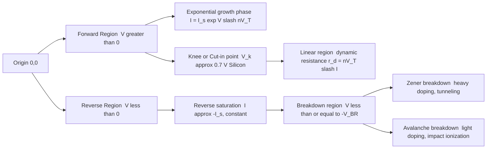
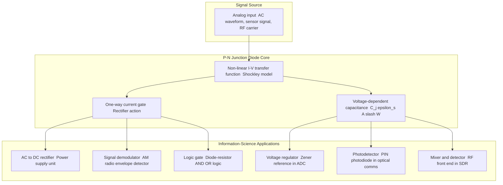

# I-V Characteristics of p-n junction

<!-- SECTION_1_START -->

# I-V Characteristics of P-N Junction

## 1.1 Formal Academic Definition

> [!IMPORTANT]
> **KTU 2024 Syllabus Definition:** A **p-n junction** is the fundamental semiconductor device formed by joining a p-type semiconductor (excess holes, acceptor concentration $N_A$) with an n-type semiconductor (excess electrons, donor concentration $N_D$) within a single crystal lattice. The **Current-Voltage (I-V) characteristic** describes the non-linear, rectifying relationship between the current flowing through the junction and the applied bias voltage, mathematically governed by the **Shockley Diode Equation**.

For information science applications, the p-n junction is the foundational building block of every diode, transistor, photodetector, LED, and integrated circuit (IC) that powers modern computing.

## 1.2 Conceptual Analogy & Intuition

Imagine a **one-way swing door** at a busy corridor:

- The corridor is split into two rooms: Room **P** (crowded with people who want to leave = holes) and Room **N** (crowded with people who want to leave = electrons).
- When a strong force pushes people from P to N (forward bias), the door swings open easily, and a large crowd flows through.
- When the force tries to push people from N to P (reverse bias), the door is mechanically locked — only a tiny trickle of "sneakers" (minority carriers) gets through.
- If you push *really* hard in the reverse direction, the door lock breaks catastrophically (breakdown).

> [!NOTE]
> **Intuitive Summary:** The p-n junction is the semiconductor equivalent of a one-way valve. It strongly conducts in one direction (forward) and blocks current in the opposite direction (reverse), with a sharp non-linear transition between the two states.

## 1.3 Key Physical Constants and Standard Metrics

| Symbol | Constant / Parameter | Standard Value at 300 K |
| :--- | :--- | :--- |
| $q$ | Elementary charge | $1.602 \times 10^{-19}$ C |
| $k$ | Boltzmann constant | $1.381 \times 10^{-23}$ J/K |
| $T$ | Absolute temperature | **300 K (room temperature)** |
| $V_T$ | Thermal voltage $kT/q$ | **25.85 mV** |
| $n_i$ | Intrinsic carrier concentration (Si) | $1.5 \times 10^{10}$ cm$^{-3}$ |
| $V_{bi}$ | Built-in potential (Si) | $\approx$ 0.7 V |
| $V_k$ | Knee/Cut-in voltage (Si) | $\approx$ 0.7 V |
| $V_k$ | Knee/Cut-in voltage (Ge) | $\approx$ 0.3 V |
| $V_{BR}$ | Breakdown voltage (typical Si) | 50 V – 1000 V |

> [!VISUALIZATION CONTROL]
> **Concept:** Non-linear rectifying I-V curve of a Silicon p-n junction diode
> **GeoGebra / Desmos Input Equations:**
> * $I_f(x) = 10^{-12} \cdot (e^{x/0.02585} - 1)$ for $x < 0.6$ (forward branch, scaled)
> * $I_r(x) = -10^{-9}$ for $0 < x < -50$ (reverse saturation, scaled)
> * Point: $(0.7, 1)$ — knee point of the forward curve
> * Point: $(-50, -0.001)$ — breakdown onset
> **Visual Description:** The student should observe an exponential rise in the first quadrant (forward bias, $V > 0$), a near-horizontal line in the third quadrant (reverse saturation, $V < 0$), and a near-vertical drop at large negative $V$ (breakdown region). The curve is highly asymmetric about both axes.

<!-- SECTION_1_END -->

<!-- SECTION_2_START -->

# Deep Theoretical Analysis & KTU High-Yield Formula Sheet

## 2.1 The Physics of Junction Formation

When p-type and n-type semiconductors are brought into intimate atomic contact, three critical phenomena occur simultaneously at the metallurgical boundary:

1. **Carrier Diffusion:** Holes diffuse from p $\rightarrow$ n; electrons diffuse from n $\rightarrow$ p, because of the concentration gradient.
2. **Space-Charge / Depletion Region Formation:** Near the junction, mobile carriers are depleted. This leaves behind a thin region of immobile **ionized acceptors** (negative side) and **ionized donors** (positive side).
3. **Built-in Electric Field & Potential:** An internal electric field $\mathcal{E}$ pointing from n $\rightarrow$ p establishes an equilibrium **built-in potential** $V_{bi}$, which opposes further diffusion.

The depletion width at equilibrium is given by:

$$W = \sqrt{\frac{2 \varepsilon_s V_{bi}}{q} \left( \frac{1}{N_A} + \frac{1}{N_D} \right)}$$

where $\varepsilon_s = \varepsilon_r \varepsilon_0$ is the permittivity of the semiconductor.

> [!NOTE]
> **Why it matters in Information Science:** The depletion width $W$ acts as a **voltage-controlled capacitor**, the working principle of the **varactor diode** used in radio-frequency (RF) tuning circuits, voltage-controlled oscillators (VCOs), and phase-locked loops (PLLs) inside every smartphone.

## 2.2 Biasing Configurations

### (A) Zero Bias (Equilibrium)
- No external voltage. The drift current exactly cancels the diffusion current; net current $I = 0$.
- Depletion width = $W_0$.

### (B) Forward Bias ($V > 0$ applied to p-side)
- The applied voltage **reduces** the barrier from $V_{bi}$ to $(V_{bi} - V)$.
- Depletion width shrinks; majority carriers are injected across the junction.
- Current grows **exponentially** with voltage.

### (C) Reverse Bias ($V < 0$ applied to p-side)
- The applied voltage **increases** the barrier to $(V_{bi} + \vert V \vert)$.
- Depletion width widens; majority carrier flow is suppressed.
- Only a tiny **reverse saturation current** $I_S$ flows (drift of minority carriers), independent of $V$.

### (D) Reverse Breakdown ($V \leq -V_{BR}$)
- The high field either **tunnels** electrons through the barrier (**Zener breakdown**, dominant in heavily doped junctions) or accelerates carriers to cause **impact ionization** (**Avalanche breakdown**, dominant in lightly doped junctions).
- Current rises sharply while voltage remains nearly constant — exploited in **Zener diodes** for voltage regulation.

## 2.3 The Shockley Diode Equation

The complete mathematical model of the ideal p-n junction is the **Shockley Diode Equation**, the most critical formula in semiconductor electronics:

$$I = I_S \left[ \exp\!\left(\frac{V}{n V_T}\right) - 1 \right]$$

where:
- $I$ = diode current (A)
- $I_S$ = reverse saturation current (A), typically $10^{-12}$ to $10^{-6}$ A
- $V$ = applied voltage across the junction (V)
- $V_T = kT / q$ = thermal voltage (≈ **25.85 mV** at 300 K)
- $n$ = **ideality factor** (1 for ideal diffusion, 2 for recombination-dominated)

**Limiting Cases:**
- Forward bias, $V \gg V_T$: $\;\; I \approx I_S \, e^{V/nV_T}$ (exponential growth)
- Reverse bias, $V \ll 0$: $\;\; I \approx -I_S$ (constant saturation)

## 2.4 KTU Formula Cheat Sheet

| Concept | Equation | Domain / Notes |
| :--- | :--- | :--- |
| Thermal voltage | $V_T = kT / q$ | **25.85 mV** at 300 K |
| Built-in potential | $V_{bi} = V_T \ln(N_A N_D / n_i^2)$ | Equilibrium, no bias |
| Depletion width | $W = \sqrt{(2 \varepsilon_s V_{bi} / q) (1/N_A + 1/N_D)}$ | Zero bias |
| Depletion width (biased) | $W = \sqrt{(2 \varepsilon_s (V_{bi} - V) / q) (1/N_A + 1/N_D)}$ | Forward $V>0$ narrows; reverse $V<0$ widens |
| Junction capacitance | $C_j = \varepsilon_s A / W$ | Voltage-variable capacitor |
| Shockley equation | $I = I_S \!\left[ \exp(V / n V_T) - 1 \right]$ | Core I-V relationship |
| Dynamic resistance | $r_d = n V_T / I$ | Slope of I-V at operating point |
| Static (DC) resistance | $R_{DC} = V / I$ | Total resistance at point |
| Knee voltage (Si) | $V_k \approx 0.7$ V | Turn-on threshold |
| Knee voltage (Ge) | $V_k \approx 0.3$ V | Turn-on threshold |

> [!IMPORTANT]
> **Engineering Utility:** The Shockley equation underpins SPICE circuit simulators (LTspice, PSpice, ngspice), enabling accurate prediction of every analog and digital circuit used in microprocessors, memory chips, op-amps, and RF transceivers. In production, engineers routinely extract $I_S$ and $n$ from measured I-V curves to characterize fabricated diodes.

<!-- SECTION_2_END -->

<!-- SECTION_3_START -->

# Step-by-Step Derivations & Symbolic Implementation

## 3.1 Derivation of the Shockley Diode Equation

We derive the I-V relation by considering the **boundary condition of minority carrier concentrations** at the edges of the depletion region, then applying the **continuity equation** in the quasi-neutral regions.

### Step 1 — Minority Carrier Concentrations at the Edges

Using the law of mass action and the boundary conditions enforced by the applied bias $V$, the minority carrier densities at the depletion edges become:

$$p_n(0) = p_{n0} \exp\!\left(\frac{V}{V_T}\right) \quad \text{(holes injected into n-side)}$$

$$n_p(0) = n_{p0} \exp\!\left(\frac{V}{V_T}\right) \quad \text{(electrons injected into p-side)}$$

Here $p_{n0} = n_i^2 / N_D$ and $n_{p0} = n_i^2 / N_A$ are the thermal equilibrium minority carrier concentrations.

### Step 2 — Excess Carrier Profiles in the Quasi-Neutral Regions

Solving the steady-state ambipolar diffusion equation with appropriate boundary conditions at $x = 0$ (depletion edge) and $x = \infty$ (bulk), the excess minority carrier profile in the n-region decays exponentially:

$$\delta p_n(x) = p_{n0}\!\left[ \exp\!\left(\frac{V}{V_T}\right) - 1 \right] \exp\!\left(\frac{-x}{L_p}\right)$$

where $L_p = \sqrt{D_p \tau_p}$ is the **diffusion length** of holes in the n-region.

### Step 3 — Diffusion Current from Fick's First Law

The hole diffusion current at $x = 0$ in the n-region is given by Fick's first law:

$$I_p = -q A D_p \left. \frac{d(\delta p_n)}{dx} \right|_{x=0}$$

Computing the derivative:

$$\frac{d(\delta p_n)}{dx} = -\frac{1}{L_p}\, p_{n0}\!\left[ \exp\!\left(\frac{V}{V_T}\right) - 1 \right] \exp\!\left(\frac{-x}{L_p}\right)$$

At $x = 0$:

$$\left. \frac{d(\delta p_n)}{dx} \right|_{x=0} = -\frac{p_{n0}}{L_p}\!\left[ \exp\!\left(\frac{V}{V_T}\right) - 1 \right]$$

Therefore:

$$I_p = \frac{q A D_p\, p_{n0}}{L_p}\!\left[ \exp\!\left(\frac{V}{V_T}\right) - 1 \right]$$

### Step 4 — Symmetric Electron Contribution from p-Region

By identical reasoning, the electron diffusion current in the p-region is:

$$I_n = \frac{q A D_n\, n_{p0}}{L_n}\!\left[ \exp\!\left(\frac{V}{V_T}\right) - 1 \right]$$

### Step 5 — Total Diode Current and Reverse Saturation Current

Adding the two contributions:

$$I = I_p + I_n = \left[ \frac{q A D_p\, p_{n0}}{L_p} + \frac{q A D_n\, n_{p0}}{L_n} \right] \left[ \exp\!\left(\frac{V}{V_T}\right) - 1 \right]$$

Defining the **reverse saturation current** as the bracketed prefactor:

$$I_S \equiv q A \!\left( \frac{D_p\, p_{n0}}{L_p} + \frac{D_n\, n_{p0}}{L_n} \right)$$

We obtain the **Shockley Diode Equation**:

$$\boxed{\,I = I_S \!\left[ \exp\!\left(\frac{V}{n V_T}\right) - 1 \right]\,}$$

## 3.2 Worked Numerical Example (KTU Board Style)

**Problem:** A silicon p-n junction diode has $I_S = 10^{-12}$ A, ideality factor $n = 1.5$, and operates at 300 K. Calculate (a) the forward current at $V = 0.65$ V, and (b) the dynamic resistance at this operating point.

**Given:** $I_S = 10^{-12}$ A, $n = 1.5$, $T = 300$ K, $V = 0.65$ V

**Step (a):** Compute thermal voltage $V_T$:

$$V_T = \frac{kT}{q} = \frac{(1.381 \times 10^{-23})(300)}{1.602 \times 10^{-19}} = 2.585 \times 10^{-2} \text{ V} = 25.85 \text{ mV}$$

Compute exponent argument:

$$\frac{V}{n V_T} = \frac{0.65}{1.5 \times 0.02585} = \frac{0.65}{0.03878} = 16.762$$

Compute exponential:

$$\exp(16.762) = 1.92 \times 10^{7}$$

Apply Shockley equation (forward bias, so $e^{x} \gg 1$, the $-1$ term is negligible):

$$I \approx I_S \cdot e^{V / n V_T} = (10^{-12})(1.92 \times 10^{7}) = 1.92 \times 10^{-5} \text{ A}$$

$$\boxed{\,I \approx 19.2 \; \mu\text{A}\,}$$

**Step (b):** Dynamic resistance $r_d = n V_T / I$:

$$r_d = \frac{(1.5)(0.02585)}{1.92 \times 10^{-5}} = \frac{0.03878}{1.92 \times 10^{-5}} \approx 2.02 \times 10^{3} \; \Omega$$

$$\boxed{\,r_d \approx 2.02 \; \text{k}\Omega\,}$$

## 3.3 Python Implementation for I-V Curve Plotting

```python
"""
KTU 2024 — I-V Characteristics of a p-n Junction Diode
Produces the textbook forward-bias exponential and reverse saturation plot.
"""

import numpy as np
import matplotlib.pyplot as plt


def shockley_diode_current(
    voltage: np.ndarray,
    saturation_current: float = 1e-12,
    ideality_factor: float = 1.5,
    thermal_voltage: float = 0.02585,
) -> np.ndarray:
    """
    Compute the diode current using the Shockley Diode Equation.

    Parameters
    ----------
    voltage : np.ndarray
        Applied bias voltage (V). Positive = forward, negative = reverse.
    saturation_current : float
        Reverse saturation current I_S in amperes.
    ideality_factor : float
        Ideality factor n (1.0 to 2.0 for real diodes).
    thermal_voltage : float
        Thermal voltage V_T = kT/q in volts (25.85 mV at 300 K).

    Returns
    -------
    np.ndarray
        Diode current in amperes.
    """
    if saturation_current <= 0:
        raise ValueError("saturation_current must be positive.")
    if ideality_factor <= 0:
        raise ValueError("ideality_factor must be positive.")
    if thermal_voltage <= 0:
        raise ValueError("thermal_voltage must be positive.")

    exponent = voltage / (ideality_factor * thermal_voltage)

    # Numerical safety: clip extremely large positive exponents
    exponent = np.clip(exponent, a_min=None, a_max=500.0)

    return saturation_current * (np.exp(exponent) - 1.0)


def main() -> None:
    # Forward bias sweep: 0 to 0.8 V
    v_forward = np.linspace(0.0, 0.8, 400)
    i_forward = shockley_diode_current(v_forward)

    # Reverse bias sweep: 0 to -0.8 V (avoid breakdown physics here)
    v_reverse = np.linspace(-0.8, 0.0, 200)
    i_reverse = shockley_diode_current(v_reverse)

    plt.figure(figsize=(9.0, 6.0))
    plt.plot(v_forward, i_forward * 1e3, color="tab:blue", linewidth=2.2,
             label="Forward bias (exponential growth)")
    plt.plot(v_reverse, i_reverse * 1e3, color="tab:red", linewidth=2.2,
             label="Reverse bias (saturation, $-I_S$)")

    plt.axvline(x=0.7, color="gray", linestyle="--", alpha=0.7,
                label="Knee voltage $V_k \\approx 0.7$ V (Si)")
    plt.axhline(y=0, color="black", linewidth=0.8)

    plt.title("I-V Characteristics of a Silicon p-n Junction Diode (300 K)",
              fontsize=13)
    plt.xlabel("Applied Voltage $V$ (V)", fontsize=11)
    plt.ylabel("Diode Current $I$ (mA)", fontsize=11)
    plt.grid(True, which="both", linestyle=":", alpha=0.6)
    plt.legend(loc="upper left", fontsize=10)
    plt.tight_layout()
    plt.savefig("diode_iv_curve.png", dpi=200)
    plt.show()


if __name__ == "__main__":
    main()
```

**Expected output:** A two-quadrant plot showing the steep exponential rise in the first quadrant (forward) and a near-zero flat line in the third quadrant (reverse), with the **0.7 V knee** marked for silicon. The $-1$ inside the exponential correctly yields $-I_S$ for reverse bias.

<!-- SECTION_3_END -->

<!-- SECTION_4_START -->

# Structural Diagrams & Schematics

## 4.1 P-N Junction Energy Band Structure (Equilibrium, Forward, Reverse)

```mermaid
flowchart TB
    subgraph EQ["EQUILIBRIUM  -  Zero Bias"]
        P1["P-side Conduction Band E_c"]
        P2["P-side Fermi Level E_F (near Valence Band)"]
        P3["N-side Conduction Band E_c (lower)"]
        P4["N-side Fermi Level E_F (near Conduction Band)"]
        P5["Built-in Barrier V_bi = 0.7 V (Si)"]
        P1 --- P2
        P3 --- P4
        P5 --- P1
    end

    subgraph FB["FORWARD BIAS  -  V applied to P-side"]
        F1["Barrier reduced to V_bi - V"]
        F2["E_c and E_v bands tilt downward on P-side"]
        F3["Majority carriers injected across junction"]
        F4["Exponential current flow  I = I_s exp V/nV_T"]
        F1 --> F2 --> F3 --> F4
    end

    subgraph RB["REVERSE BIAS  -  V applied to N-side"]
        R1["Barrier increased to V_bi + mod V"]
        R2["Depletion width W widens significantly"]
        R3["Only minority carriers cross  I approx -I_s"]
        R4["Saturation current, breakdown avoided"]
        R1 --> R2 --> R3 --> R4
    end
```



## 4.2 I-V Curve Topology and Operating Regions



## 4.3 Functional Architecture — Diode as an Information-Science Building Block



> [!NOTE]
> **Reading the Diagrams:** Diagram 4.1 contrasts band bending under three bias states. Diagram 4.2 maps every regime of the I-V curve to its physical origin. Diagram 4.3 connects the abstract I-V characteristic to concrete information-science subsystems. Notice how a *single* Shockley relation drives six distinct application classes.

<!-- SECTION_4_END -->

<!-- SECTION_5_START -->

# KTU 2024 Scheme Examination Question Bank & Topic Recap

## PART A — Short Answer Questions (3 Marks Each)

### Question 1 **[KTU University Exam — July 2024]**
**(CO1, Remember)** Define the term **knee voltage** of a p-n junction diode and state its typical value for silicon and germanium diodes at 300 K.

**Model Answer (3 Marks):**
The knee voltage, also called the **cut-in voltage** or **threshold voltage** $V_k$, is the minimum forward bias voltage at which the diode current begins to increase rapidly (exponentially) with applied voltage. Below $V_k$, the diode current is negligibly small. **[1 Mark for definition]**

Typical values at 300 K:
- Silicon (Si): $V_k \approx$ **0.7 V** **[1 Mark]**
- Germanium (Ge): $V_k \approx$ **0.3 V** **[1 Mark]**

### Question 2 **[KTU University Exam — Dec 2023]**
**(CO2, Understand)** Distinguish between **Zener breakdown** and **Avalanche breakdown** in a reverse-biased p-n junction.

**Model Answer (3 Marks):**
| Feature | Zener Breakdown | Avalanche Breakdown |
| :--- | :--- | :--- |
| Mechanism | Quantum mechanical **tunneling** of valence-band electrons through the thin depletion region into the conduction band. | **Impact ionization**: high-energy carriers collide with lattice atoms, generating electron-hole pairs. |
| Doping | Occurs in **heavily doped** junctions (narrow depletion width). | Occurs in **lightly doped** junctions (wide depletion width). |
| Breakdown voltage | Low $V_{BR}$ (typically < 5–6 V). | Higher $V_{BR}$ (typically > 6–8 V). |
| Temperature coefficient | **Negative** (voltage decreases with rise in $T$). | **Positive** (voltage increases with rise in $T$). |

**[1 Mark for Zener mechanism, 1 Mark for Avalanche mechanism, 1 Mark for correct distinguishing criterion]**

---

## PART B — Long Answer Questions (14 Marks with Internal Choice)

### Question A **[KTU University Exam — Dec 2024]**
**(CO2, CO3, Apply / Analyze)**

**(a)** With a neat labelled diagram, explain the formation of the **depletion region** and **built-in potential** in a p-n junction at equilibrium. Derive an expression for the **built-in potential** $V_{bi}$ in terms of doping concentrations. **(7 Marks)**

**(b)** Starting from the **minority carrier diffusion equations**, derive the **Shockley Diode Equation** and clearly state the meaning of the **reverse saturation current** $I_S$. For a silicon diode with $I_S = 5 \times 10^{-12}$ A, ideality factor $n = 1.2$, and temperature $T = 300$ K, calculate the forward current at $V = 0.6$ V. **(7 Marks)**

---

### Model Solution for Question A

#### Part (a) — Depletion Region and Built-in Potential

**[Sketch and explain diffusion of carriers: 1 Mark]**
When p-type ($N_A$ acceptors) and n-type ($N_D$ donors) regions are brought into atomic contact, holes diffuse from p to n, and electrons diffuse from n to p, leaving behind a region of uncovered ionized dopants — the **depletion region** (also called the **space-charge region**). The width of this region is $W$.

**[Built-in electric field: 1 Mark]**
This charge separation creates an internal electric field $\mathcal{E}$ directed from n to p, and a corresponding **built-in potential barrier** $V_{bi}$ that opposes further diffusion. At equilibrium, the drift current (due to $\mathcal{E}$) exactly balances the diffusion current, so net current is zero.

**[Derivation of $V_{bi}$: 4 Marks]**
At the depletion edge on the p-side, the hole concentration equals:

$$p_p = N_A = n_i \exp\!\left(\frac{E_{F,p} - E_i}{kT}\right)$$

At the depletion edge on the n-side:

$$p_n = \frac{n_i^2}{N_D} = n_i \exp\!\left(\frac{E_{F,n} - E_i}{kT}\right)$$

Dividing the two expressions (Boltzmann statistics):

$$\frac{p_p}{p_n} = \exp\!\left(\frac{E_{F,n} - E_{F,p}}{kT}\right) = \frac{N_A N_D}{n_i^2}$$

The total band bending across the junction equals $q V_{bi} = E_{F,n} - E_{F,p}$, so:

$$\frac{N_A N_D}{n_i^2} = \exp\!\left(\frac{q V_{bi}}{kT}\right)$$

Taking the natural logarithm and using $V_T = kT/q$:

$$\boxed{\,V_{bi} = V_T \ln\!\left(\frac{N_A N_D}{n_i^2}\right)\,}$$

**[Final expression and physical meaning: 1 Mark]**
For Si at 300 K with $N_A = 10^{17}$ cm$^{-3}$, $N_D = 10^{15}$ cm$^{-3}$, $n_i = 1.5 \times 10^{10}$ cm$^{-3}$:

$$V_{bi} = (0.02585) \ln\!\left(\frac{10^{17} \cdot 10^{15}}{(1.5 \times 10^{10})^2}\right) = (0.02585) \ln(4.44 \times 10^{11}) \approx 0.637 \text{ V}$$

#### Part (b) — Shockley Equation Derivation and Numerical Computation

**[Step 1 — Boundary excess carriers: 1 Mark]**
At the depletion edge on the n-side, the excess hole concentration under forward bias $V$ is:

$$\delta p_n(0) = p_{n0}\!\left[ \exp\!\left(\frac{V}{V_T}\right) - 1 \right], \quad p_{n0} = \frac{n_i^2}{N_D}$$

**[Step 2 — Decay into bulk: 1 Mark]**
Solving the steady-state diffusion equation, the profile decays exponentially with diffusion length $L_p$:

$$\delta p_n(x) = p_{n0}\!\left[ \exp\!\left(\frac{V}{V_T}\right) - 1 \right] \exp\!\left(\frac{-x}{L_p}\right)$$

**[Step 3 — Diffusion current: 1 Mark]**
By Fick's first law at $x = 0$:

$$I_p = \frac{q A D_p p_{n0}}{L_p}\!\left[ \exp\!\left(\frac{V}{V_T}\right) - 1 \right]$$

**[Step 4 — Total current: 1 Mark]**
Adding the symmetric electron contribution from the p-side and defining:

$$I_S = q A \!\left( \frac{D_p p_{n0}}{L_p} + \frac{D_n n_{p0}}{L_n} \right)$$

we obtain the Shockley equation. $I_S$ represents the small reverse current produced by thermally generated minority carriers drifting across the junction. **[1 Mark for meaning of $I_S$]**

$$\boxed{\,I = I_S \!\left[ \exp\!\left(\frac{V}{n V_T}\right) - 1 \right]\,}$$

**[Step 5 — Numerical evaluation: 2 Marks]**
Given: $I_S = 5 \times 10^{-12}$ A, $n = 1.2$, $T = 300$ K, $V = 0.6$ V.

Thermal voltage: $V_T = 25.85$ mV.

Exponent argument: $\dfrac{V}{n V_T} = \dfrac{0.6}{1.2 \times 0.02585} = \dfrac{0.6}{0.03102} = 19.342$.

Exponential value: $\exp(19.342) = 2.41 \times 10^{8}$.

Since the exponential is enormous, the $-1$ term is negligible:

$$I \approx (5 \times 10^{-12})(2.41 \times 10^{8}) = 1.205 \times 10^{-3} \text{ A}$$

$$\boxed{\,I \approx 1.21 \; \text{mA}\,}$$

---

### Question B (Internal Choice Alternative) **[KTU University Exam — July 2024]**
**(CO2, CO3, Understand / Apply)**

**(a)** Explain the **forward bias** and **reverse bias** characteristics of a p-n junction diode with suitable I-V curves. Discuss how the depletion width changes in each case. **(7 Marks)**

**(b)** Define **dynamic resistance** $r_d$ and **static (DC) resistance** $R_{DC}$ of a diode. A diode operates at a forward bias of 0.7 V with current 15 mA. If the diode is a silicon device ($V_T = 25.85$ mV, $n = 1.2$), calculate $r_d$ and $R_{DC}$ at this operating point. **(7 Marks)**

---

### Model Solution for Question B

#### Part (a) — Forward vs Reverse Characteristics

**[Forward bias sketch and description: 2 Marks]**
When the positive terminal of the battery is connected to the p-side and the negative to the n-side, the junction is **forward biased**. The applied voltage opposes the built-in field, reducing the barrier from $V_{bi}$ to $(V_{bi} - V)$. The depletion width shrinks. Majority carriers (holes from p, electrons from n) are injected across the junction in large numbers, and the current rises **exponentially** with voltage (Shockley equation).

**[Reverse bias sketch and description: 2 Marks]**
When the polarity is reversed, the junction is **reverse biased**. The barrier increases to $(V_{bi} + \vert V \vert)$, the depletion width widens, and majority carrier flow is suppressed. Only a tiny, voltage-independent **reverse saturation current** $I_S$ flows, due to minority carrier drift. The reverse current remains approximately $-I_S$ until breakdown occurs at $V_{BR}$.

**[I-V curve drawing with labelled axes and knee voltage: 2 Marks]**
The forward branch shows an exponential rise with knee at $V_k \approx 0.7$ V. The reverse branch is nearly flat at $-I_S$, followed by a sharp breakdown drop at $-V_{BR}$.

**[Depletion width comparison: 1 Mark]**
- Forward: $W$ **decreases** with increasing $V$.
- Reverse: $W$ **increases** with increasing $\vert V \vert$.

#### Part (b) — Diode Resistances and Numerical Computation

**[Definition of static resistance: 1 Mark]**
Static (DC) resistance is the **total opposition** to DC current at a particular operating point, given by Ohm's law applied to the entire I-V curve:

$$R_{DC} = \frac{V}{I}$$

**[Definition of dynamic resistance: 1 Mark]**
Dynamic (AC) resistance is the **small-signal slope** of the I-V curve at a particular operating point:

$$r_d = \left. \frac{dV}{dI} \right|_{V} = \frac{n V_T}{I}$$

This represents the incremental resistance offered to a small AC signal superimposed on the DC bias.

**[Numerical evaluation of $R_{DC}$: 2 Marks]**
Given: $V = 0.7$ V, $I = 15$ mA $= 0.015$ A.

$$R_{DC} = \frac{0.7}{0.015} = 46.67 \; \Omega$$

$$\boxed{\,R_{DC} \approx 46.67 \; \Omega\,}$$

**[Numerical evaluation of $r_d$: 2 Marks]**

$$r_d = \frac{n V_T}{I} = \frac{(1.2)(0.02585)}{0.015} = \frac{0.03102}{0.015} = 2.068 \; \Omega$$

$$\boxed{\,r_d \approx 2.07 \; \Omega\,}$$

**[Comparative conclusion: 1 Mark]**
At the same operating point, $r_d \ll R_{DC}$. This shows that the diode is far more conductive to small AC variations around the bias point than the gross DC ratio suggests — a critical fact for designing small-signal amplifiers and detector circuits.

---

> [!WARNING]
> **KTU Examiner's Valuation Pitfalls — Common Mark-Deduction Traps**
> 1. **Missing the factor of $n$ in the exponent.** Students often write $I = I_S(e^{V/V_T} - 1)$ instead of $I_S(e^{V/n V_T} - 1)$. The ideality factor $n$ is mandatory for a non-ideal (real) diode and is worth 1 full mark in numericals.
> 2. **Forgetting to convert mA to A (or vice-versa).** The thermal voltage $V_T$ is in volts, current in amperes. Mixing units is the single most common error in $r_d$ and $R_{DC}$ calculations.
> 3. **Dropping the $-1$ in Shockley equation without justification.** In the forward-bias numerical, students may write $I = I_S \cdot e^{V/nV_T}$ directly. While mathematically correct when $e^{x} \gg 1$, explicitly writing the full expression and then justifying the approximation earns full credit.
> 4. **Wrong direction for the depletion-width change.** Forward bias **reduces** $W$ (lower barrier), reverse bias **increases** $W$ (higher barrier). Reversing this loses 1 mark.
> 5. **Confusing Zener and Avalanche mechanisms.** Zener = tunneling, heavy doping, low $V_{BR}$. Avalanche = impact ionization, light doping, high $V_{BR}$. Mark examiners will deduct for a vague answer like "high voltage breaks the junction."
> 6. **Skipping the labelled diagram in Part A.** A p-n junction question without a band diagram or junction sketch typically loses 1–2 marks. Always draw the structure, label p-side, n-side, depletion region $W$, and built-in field $\mathcal{E}$.

---

## Topic Recap & Important Things to Remember

- **P-N junction**: a metallurgical boundary between p-type ($N_A$) and n-type ($N_D$) regions inside a single semiconductor crystal.
- **Depletion region**: a narrow zone near the junction, depleted of mobile carriers, containing only ionized dopants; its width is $W$ at equilibrium.
- **Built-in potential**: $V_{bi} = V_T \ln(N_A N_D / n_i^2)$ — the equilibrium potential barrier; ~0.7 V for Si, ~0.3 V for Ge.
- **Thermal voltage**: $V_T = kT / q = $ **25.85 mV at 300 K** — the fundamental voltage scale of semiconductor physics.
- **Forward bias**: applied voltage reduces the barrier; majority carriers flood the junction; current rises **exponentially** with $V$.
- **Reverse bias**: applied voltage increases the barrier; only a tiny saturation current $I_S$ flows (drift of minority carriers).
- **Shockley Diode Equation**: $I = I_S [ \exp(V / n V_T) - 1 ]$ — the master I-V relationship of every p-n junction device.
- **Ideality factor $n$**: 1 for ideal diffusion-dominated current; 2 for recombination-dominated current; always between 1 and 2 for real diodes.
- **Knee voltage $V_k$**: ~**0.7 V (Si)**, ~**0.3 V (Ge)** — turn-on threshold of the diode.
- **Dynamic resistance**: $r_d = n V_T / I$ — the slope $dV/dI$ at the operating point, relevant for small-signal AC analysis.
- **Static resistance**: $R_{DC} = V / I$ — the gross DC ratio at the operating point.
- **Zener breakdown**: tunneling in **heavily doped** junctions, low $V_{BR}$ (< 6 V), negative temperature coefficient.
- **Avalanche breakdown**: impact ionization in **lightly doped** junctions, high $V_{BR}$ (> 6 V), positive temperature coefficient.
- **Junction capacitance**: $C_j = \varepsilon_s A / W$ — voltage-dependent; the basis of **varactor diodes** in RF tuning and VCOs.
- **Information-science relevance**: every rectifier, demodulator, logic gate, voltage reference, photodetector, and RF mixer is built on the Shockley I-V relationship.
- **Simulation tip**: SPICE, LTspice, and ngspice all use the Shockley model (or its extensions) as the default diode model — knowing the equation lets you understand every SPICE netlist.
- **Master checklist before any KTU exam**: state whether the diode is forward or reverse biased → apply Shockley with the correct sign → include $n V_T$ in the exponent → use SI units throughout → draw and label the diagram → state the physical meaning of every symbol.

<!-- SECTION_5_END -->
