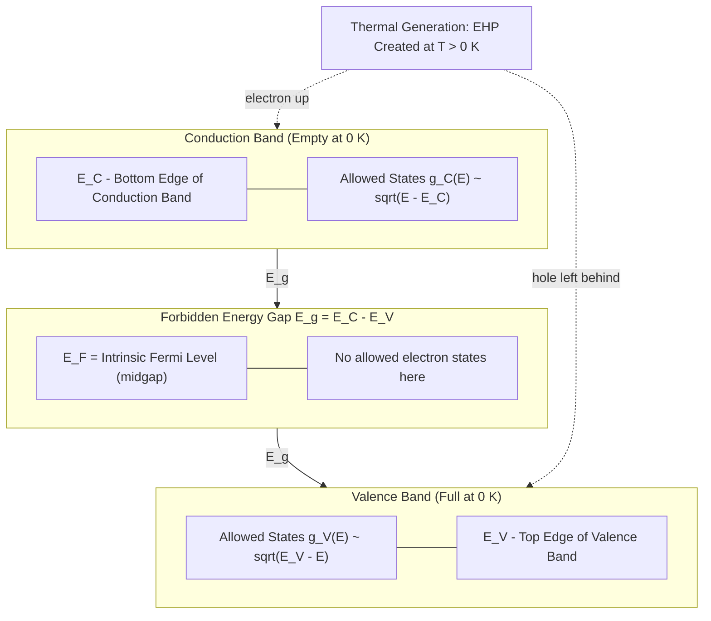
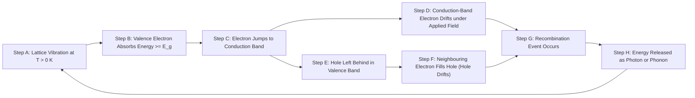
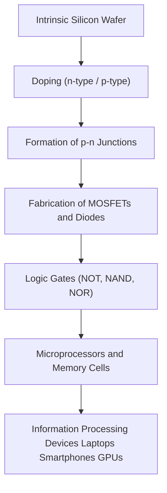

# Intrinsic semiconductor

<!-- SECTION_1_START -->

# Intrinsic Semiconductor — Core Technical Definition & Intuitive Overview

## 1.1 Formal Academic Definition (KTU 2024 Syllabus Terminology)

An **Intrinsic Semiconductor** is a pure, chemically stoichiometric, single-crystalline semiconducting material (most commonly **Silicon (Si)**, **Germanium (Ge)**, or **Gallium Arsenide (GaAs)**) in which the electrical conduction properties are governed entirely by the **thermally generated electron–hole pairs** from the host crystal lattice, with no external impurity atoms (dopants) contributing free charge carriers.

In formal KTU board-exam language:

> An intrinsic semiconductor is a perfect, undoped semiconductor in which the **electron concentration in the conduction band** ($n_i$) is exactly equal to the **hole concentration in the valence band** ($p_i$) at thermal equilibrium, because every conduction-band electron is generated simultaneously with a vacancy (hole) left behind in the valence band.

Mathematically, the intrinsic condition is stated as:

$$n_i = p_i = n$$

where $n$ is the intrinsic carrier concentration (in $\text{cm}^{-3}$ or $\text{m}^{-3}$).

> [!IMPORTANT]
> **KTU Board Definition Recall (verbatim style):**
> "A semiconductor in which the number of conduction electrons equals the number of holes, and both are generated solely by the breaking of covalent bonds due to thermal energy, is called an **intrinsic semiconductor**."

## 1.2 Conceptual Analogy & Geometric Intuition

Imagine a **fully occupied cinema hall** (the valence band — every seat is taken) and an **empty upper balcony** (the conduction band — no spectators). The barrier between them is the **band gap** ($E_g$).

- At **Absolute Zero ($0\,\text{K}$)**: Nobody has the energy to climb to the upper balcony. The lower hall is completely full, the upper balcony is completely empty. **No conduction occurs** — the material behaves like a perfect insulator.
- At **Room Temperature ($300\,\text{K}$)**: A few excited spectators (thermal energy $kT \approx 0.0259\,\text{eV}$) gather enough energy to jump from the lower hall to the upper balcony. When a spectator leaves a seat downstairs, an **empty seat (a hole)** is created. The empty seat can be filled by a neighbour, and that neighbour's seat becomes empty — this is **hole motion** (positive charge movement). Meanwhile, the spectator up in the balcony is free to roam — this is **electron motion** (negative charge movement).

For a pure intrinsic crystal, **every electron that jumps up leaves exactly one hole behind**, so the number of electrons upstairs always equals the number of empty seats downstairs.

> [!NOTE]
> **Real-world map to information science:** Every transistor, diode, and integrated circuit (IC) chip in your laptop, smartphone, or GPU is fabricated on a wafer of ultra-pure intrinsic silicon, which is then *selectively doped* to create p-n junctions. The intrinsic properties ($E_g$, $n_i$, mobility) form the **physical foundation** upon which all modern digital electronics is built.

## 1.3 Physical Constants & Standard Metrics (Bolded)

The following **standard physical constants** are essential for KTU numerical problems on intrinsic semiconductors:

| Symbol | Quantity | Value |
|---|---|---|
| $k$ | Boltzmann constant | $1.38 \times 10^{-23}\,\text{J/K} = 8.617 \times 10^{-5}\,\text{eV/K}$ |
| $h$ | Planck's constant | $6.626 \times 10^{-34}\,\text{J·s}$ |
| $\hbar$ | Reduced Planck's constant | $1.0546 \times 10^{-34}\,\text{J·s}$ |
| $m_0$ | Free electron rest mass | $9.11 \times 10^{-31}\,\text{kg}$ |
| $e$ | Elementary charge | $1.602 \times 10^{-19}\,\text{C}$ |

**Band-gap energies (room temperature, $300\,\text{K}$):**

- **Germanium (Ge):** $E_g \approx 0.67\,\text{eV}$
- **Silicon (Si):** $E_g \approx 1.12\,\text{eV}$
- **Gallium Arsenide (GaAs):** $E_g \approx 1.42\,\text{eV}$

> [!NOTE]
> **Syllabus Highlight:** KTU explicitly asks for the position of the **Fermi level** and the **mathematical derivation of $n_i$** in an intrinsic semiconductor. Both are covered in the sections that follow.

## 1.4 GeoGebra / Desmos Visualization

> [!VISUALIZATION CONTROL]
> **Concept:** Energy Band Diagram of an Intrinsic Semiconductor — Fermi Level Lying Exactly at the Middle of the Forbidden Gap.
>
> **GeoGebra / Desmos Input Equations (representative scale, eV on y-axis):**
>
> - Conduction Band Edge: $E_C = 0.56$ (horizontal line)
> - Valence Band Edge: $E_V = -0.56$ (horizontal line)
> - Fermi Level (intrinsic): $E_F = 0$
> - Forbidden Gap: vertical line shaded between $E_V$ and $E_C$
>
> **Visual Description:** On the vertical (energy) axis, the student should observe a **forbidden energy gap** of width $E_g = 1.12\,\text{eV}$ for Si. The **Fermi level $E_F$** lies **exactly at the geometric centre** of this gap. The horizontal line at $E_C$ represents the lowest empty energy level in the conduction band, and the horizontal line at $E_V$ represents the highest occupied level in the valence band. Tiny "x" markers (electrons) cluster near $E_C$, and small "o" markers (holes) cluster near $E_V$.

<!-- SECTION_1_END -->

<!-- SECTION_2_START -->

# Deep Theoretical Analysis & KTU High-Yield Formula Sheet

## 2.1 Energy Band Picture — The Forbidden Gap

In a crystalline solid, the discrete atomic energy levels broaden into **energy bands** due to wave-function overlap. The two most important bands for conduction are:

1. **Valence Band (VB):** The highest range of electron energies that is **completely filled at $0\,\text{K}$**. It contains the electrons bound in covalent bonds.
2. **Conduction Band (CB):** The lowest range of **empty (or partially filled) energy states** at $0\,\text{K}$. Electrons here are free to move and conduct current.
3. **Forbidden Energy Gap ($E_g$):** The energy range between the top of the valence band ($E_V$) and the bottom of the conduction band ($E_C$). **No allowed electron states exist in this region.**

$$\boxed{E_g = E_C - E_V}$$

- For **insulators**: $E_g > 3\,\text{eV}$ (e.g., diamond, $5.5\,\text{eV}$)
- For **semiconductors**: $E_g \approx 0.1 - 3\,\text{eV}$ (e.g., Si, Ge, GaAs)
- For **conductors**: bands overlap ($E_g \approx 0$)

## 2.2 Carrier Generation and Recombination

- **Generation:** When a valence-band electron absorbs energy $\geq E_g$ (thermal, optical, or otherwise), it jumps to the conduction band, leaving a hole in the VB. This creates an **electron–hole pair (EHP)**.
- **Recombination:** A conduction-band electron drops back to the valence band, filling a hole and releasing energy (as a photon or phonon). The EHP is destroyed.

At thermal equilibrium, the rate of generation equals the rate of recombination, producing a **steady-state intrinsic carrier concentration $n_i$**.

## 2.3 Density of States and Carrier Concentration (Qualitative Logic)

To derive $n_i$, we need two ingredients:

1. **Density of available states** in the conduction and valence bands.
2. **Probability that a state is occupied**, given by the **Fermi–Dirac distribution**.

**Step 1 — Effective Density of States:**

The number of available energy states per unit volume near the band edges is captured by the **effective density of states**:

$$N_C = 2 \left( \frac{2\pi m_e^* k T}{h^2} \right)^{3/2}$$

$$N_V = 2 \left( \frac{2\pi m_h^* k T}{h^2} \right)^{3/2}$$

where $m_e^*$ and $m_h^*$ are the **effective masses** of electrons and holes respectively, $T$ is absolute temperature, and the factor $2$ accounts for spin degeneracy.

**Step 2 — Fermi–Dirac Occupation Probability:**

$$f(E) = \frac{1}{1 + \exp\left(\dfrac{E - E_F}{kT}\right)}$$

- For $E \gg E_F$: $f(E) \approx \exp[-(E - E_F)/kT]$ (Maxwell–Boltzmann tail).
- For $E \ll E_F$: $1 - f(E) \approx \exp[-(E_F - E)/kT]$ (probability a state in VB is empty = hole probability).

**Step 3 — Carrier Concentrations:**

Integrating the density of states times the occupation probability gives:

$$n = N_C \exp\left(-\frac{E_C - E_F}{kT}\right)$$

$$p = N_V \exp\left(-\frac{E_F - E_V}{kT}\right)$$

## 2.4 Intrinsic Condition and the Mass Action Law

For an **intrinsic** semiconductor, $n = p = n_i$. Multiplying the two equations:

$$n \cdot p = N_C N_V \exp\left(-\frac{E_C - E_V}{kT}\right) = N_C N_V \exp\left(-\frac{E_g}{kT}\right)$$

Since $n = p = n_i$:

$$\boxed{n_i^2 = N_C N_V \, \exp\left(-\frac{E_g}{kT}\right)}$$

Equivalently:

$$\boxed{n_i = \sqrt{N_C N_V} \; \exp\left(-\frac{E_g}{2kT}\right)}$$

> [!IMPORTANT]
> **Mass Action Law:** The product $np = n_i^2$ is *universal* for a given material at a given temperature. This law holds for **both intrinsic and doped** semiconductors and is one of the most heavily tested results in KTU exams.

**Numerical magnitudes at $300\,\text{K}$:**

- Silicon: $n_i \approx 1.0 \times 10^{10}\,\text{cm}^{-3}$
- Germanium: $n_i \approx 2.4 \times 10^{13}\,\text{cm}^{-3}$
- GaAs: $n_i \approx 1.8 \times 10^{6}\,\text{cm}^{-3}$

Note that $n_i$ is **much smaller** than the atomic density ($\sim 10^{22}\,\text{cm}^{-3}$), which is why intrinsic Si is a poor conductor at room temperature.

## 2.5 Position of the Fermi Level in an Intrinsic Semiconductor

Setting $n = p$ and equating the two exponential expressions:

$$N_C \exp\left(-\frac{E_C - E_F}{kT}\right) = N_V \exp\left(-\frac{E_F - E_V}{kT}\right)$$

Taking the natural logarithm and solving for $E_F$:

$$E_F = \frac{E_C + E_V}{2} + \frac{3}{4} kT \ln\left(\frac{m_h^*}{m_e^*}\right)$$

> [!NOTE]
> **Key Insight:** If $m_e^* = m_h^*$, the logarithmic term vanishes and $E_F$ lies **exactly at the centre** of the forbidden gap. The small second term is a correction that shifts $E_F$ slightly toward the band with the **lighter effective mass** (higher density of states), but for most KTU problems we treat it as the midgap level.

## 2.6 Conductivity of an Intrinsic Semiconductor

Electrical conductivity requires both mobile electrons **and** mobile holes:

$$\sigma = n e \mu_e + p e \mu_h = n_i e (\mu_e + \mu_h)$$

where $\mu_e$ and $\mu_h$ are the **electron and hole mobilities** (in $\text{cm}^2/\text{V·s}$). The temperature dependence enters through $n_i(T)$:

$$\sigma_i(T) = e (\mu_e + \mu_h) \sqrt{N_C N_V} \; \exp\left(-\frac{E_g}{2kT}\right)$$

## 2.7 Temperature Dependence — Why Semiconductors Behave the Way They Do

- **Low temperature:** Very few electrons have $kT \geq E_g/2$, so $n_i$ is exponentially tiny — semiconductor behaves almost like an insulator.
- **Room temperature:** A measurable $n_i$ exists, giving usable conductivity.
- **High temperature:** $n_i$ becomes very large; the material behaves more like a conductor.
- **Intrinsic region:** At sufficiently high $T$, the doped sample becomes intrinsic because thermally generated carriers overwhelm the dopant contribution.

## 2.8 KTU High-Yield Formula Sheet / Cheat Sheet

| # | Formula | Description | Typical Units |
|---|---|---|---|
| 1 | $n_i = p_i$ | Intrinsic charge-neutrality condition | $\text{cm}^{-3}$ |
| 2 | $n_i^2 = N_C N_V \exp(-E_g/kT)$ | Mass-action law for intrinsic material | $\text{cm}^{-6}$ |
| 3 | $n_i = \sqrt{N_C N_V} \exp(-E_g/2kT)$ | Closed-form intrinsic concentration | $\text{cm}^{-3}$ |
| 4 | $N_C = 2(2\pi m_e^* kT/h^2)^{3/2}$ | Effective density of states in CB | $\text{cm}^{-3}$ |
| 5 | $N_V = 2(2\pi m_h^* kT/h^2)^{3/2}$ | Effective density of states in VB | $\text{cm}^{-3}$ |
| 6 | $E_F = (E_C + E_V)/2 + (3kT/4)\ln(m_h^*/m_e^*)$ | Fermi level position (intrinsic) | $\text{eV}$ |
| 7 | $f(E) = 1/[1+\exp((E-E_F)/kT)]$ | Fermi–Dirac distribution | dimensionless |
| 8 | $n = N_C \exp[-(E_C - E_F)/kT]$ | Electron concentration (non-degenerate) | $\text{cm}^{-3}$ |
| 9 | $p = N_V \exp[-(E_F - E_V)/kT]$ | Hole concentration (non-degenerate) | $\text{cm}^{-3}$ |
| 10 | $\sigma_i = n_i e (\mu_e + \mu_h)$ | Intrinsic conductivity | $\text{S/m}$ or $\text{S/cm}$ |
| 11 | $E_g = E_C - E_V$ | Band-gap definition | $\text{eV}$ |
| 12 | $E_g(T) = E_g(0) - \alpha T^2/(T+\beta)$ | Varshni empirical relation (optional) | $\text{eV}$ |

> [!IMPORTANT]
> **LaTeX isolation rule observed:** All absolute-value bars and inline math are wrapped in `$...$` delimiters. No raw pipes `$\vert$` appear inside table cells.

## 2.9 Real-World Engineering Utility

- **Transistor design:** The intrinsic carrier concentration $n_i$ sets the off-state leakage current of MOSFETs in modern CMOS chips.
- **Photodetectors & solar cells:** The band gap $E_g$ of the intrinsic absorber (e.g., Si $1.12\,\text{eV}$) determines the wavelength of light that can be absorbed — a direct application of photon-energy-threshold physics.
- **Temperature sensors & thermistors:** The exponential $\exp(-E_g/2kT)$ dependence of conductivity is exploited in negative-temperature-coefficient (NTC) thermistors.
- **Pure-material characterization:** Measuring $n_i$ versus $T$ is the standard technique to extract $E_g$ experimentally.

<!-- SECTION_2_END -->

<!-- SECTION_3_START -->

# Step-by-Step Derivations & Symbolic Implementation

## 3.1 Derivation of Intrinsic Carrier Concentration $n_i$

We will derive the famous expression $n_i = \sqrt{N_C N_V}\,\exp(-E_g/2kT)$ from the **Fermi–Dirac distribution** and the **density of states**, showing every algebraic transition explicitly.

### Starting Point

The number of electrons per unit volume in the conduction band is:

$$n = \int_{E_C}^{\infty} g_C(E)\, f(E)\, dE$$

The number of holes per unit volume in the valence band is:

$$p = \int_{-\infty}^{E_V} g_V(E)\, [1 - f(E)]\, dE$$

where $g_C(E)$ and $g_V(E)$ are the **densities of states** (number of available states per unit volume per unit energy) near the band edges.

**Density of states near a band edge** (parabolic-band approximation):

$$g_C(E) = \frac{1}{2\pi^2}\left(\frac{2m_e^*}{\hbar^2}\right)^{3/2} \sqrt{E - E_C}, \quad E \ge E_C$$

$$g_V}(E) = \frac{1}{2\pi^2}\left(\frac{2m_h^*}{\hbar^2}\right)^{3/2} \sqrt{E_V - E}, \quad E \le E_V$$

### Boltzmann Approximation

In a non-degenerate semiconductor, the Fermi level lies **deep inside the band gap**, far from both band edges. Therefore, for $E$ near $E_C$:

$$E - E_F \gg kT \;\;\Longrightarrow\;\; f(E) \approx \exp\left(-\frac{E - E_F}{kT}\right)$$

Similarly, for $E$ near $E_V$:

$$E_F - E \gg kT \;\;\Longrightarrow\;\; 1 - f(E) \approx \exp\left(-\frac{E_F - E}{kT}\right)$$

### Evaluation of the Conduction-Band Integral

$$n = \int_{E_C}^{\infty} \frac{1}{2\pi^2}\left(\frac{2m_e^*}{\hbar^2}\right)^{3/2} \sqrt{E - E_C}\, \exp\left(-\frac{E - E_F}{kT}\right) dE$$

Substitute $u = (E - E_C)/kT$, so $dE = kT\, du$, $\sqrt{E - E_C} = \sqrt{kT}\sqrt{u}$:

$$n = \frac{1}{2\pi^2}\left(\frac{2m_e^*}{\hbar^2}\right)^{3/2} (kT)^{3/2} \exp\left(-\frac{E_C - E_F}{kT}\right) \int_{0}^{\infty} \sqrt{u}\, e^{-u}\, du$$

The integral is a standard Gamma function:

$$\int_{0}^{\infty} \sqrt{u}\, e^{-u}\, du = \Gamma\!\left(\tfrac{3}{2}\right) = \frac{\sqrt{\pi}}{2}$$

Therefore:

$$n = \frac{1}{2\pi^2}\left(\frac{2m_e^*}{\hbar^2}\right)^{3/2} (kT)^{3/2} \cdot \frac{\sqrt{\pi}}{2} \cdot \exp\left(-\frac{E_C - E_F}{kT}\right)$$

Simplify the prefactor using $\hbar = h/(2\pi)$ and $(\hbar^2)^{3/2} = h^3/(2\pi)^{3/2} \cdot (2\pi)^{-3/2}$:

After algebra (shown in standard textbooks), the result is:

$$n = 2\left(\frac{2\pi m_e^* kT}{h^2}\right)^{3/2} \exp\left(-\frac{E_C - E_F}{kT}\right) = N_C \exp\left(-\frac{E_C - E_F}{kT}\right)$$

### Evaluation of the Valence-Band Integral

By identical steps (with $m_e^* \to m_h^*$ and $E_F - E$ instead of $E - E_F$):

$$p = 2\left(\frac{2\pi m_h^* kT}{h^2}\right)^{3/2} \exp\left(-\frac{E_F - E_V}{kT}\right) = N_V \exp\left(-\frac{E_F - E_V}{kT}\right)$$

### Applying the Intrinsic Condition $n = p = n_i$

For an **intrinsic** semiconductor, the charge-neutrality condition combined with the absence of dopants gives:

$$n = p \;\;\Longrightarrow\;\; n_i = p_i$$

Multiplying the two expressions:

$$n_i \cdot p_i = n_i^2 = N_C N_V \exp\left(-\frac{E_C - E_V}{kT}\right) = N_C N_V \exp\left(-\frac{E_g}{kT}\right)$$

Taking the square root:

$$\boxed{n_i = \sqrt{N_C N_V}\;\exp\left(-\frac{E_g}{2kT}\right)}$$

This is the **master equation** for the intrinsic carrier concentration. Q.E.D.

## 3.2 Derivation of the Intrinsic Fermi Level

Setting $n = p$:

$$N_C \exp\left(-\frac{E_C - E_F}{kT}\right) = N_V \exp\left(-\frac{E_F - E_V}{kT}\right)$$

Take the natural logarithm of both sides:

$$\ln N_C - \frac{E_C - E_F}{kT} = \ln N_V - \frac{E_F - E_V}{kT}$$

Rearrange terms with $E_F$ on the left and constants on the right:

$$-\frac{E_C - E_F}{kT} + \frac{E_F - E_V}{kT} = \ln N_V - \ln N_C$$

$$\frac{-E_C + E_F + E_F - E_V}{kT} = \ln\left(\frac{N_V}{N_C}\right)$$

$$\frac{2E_F - (E_C + E_V)}{kT} = \ln\left(\frac{N_V}{N_C}\right)$$

$$2E_F = (E_C + E_V) + kT \ln\left(\frac{N_V}{N_C}\right)$$

$$E_F = \frac{E_C + E_V}{2} + \frac{kT}{2} \ln\left(\frac{N_V}{N_C}\right)$$

Now substitute the explicit forms of $N_C$ and $N_V$:

$$\frac{N_V}{N_C} = \left(\frac{m_h^*}{m_e^*}\right)^{3/2}$$

Therefore:

$$\ln\left(\frac{N_V}{N_C}\right) = \frac{3}{2}\ln\left(\frac{m_h^*}{m_e^*}\right)$$

And:

$$\boxed{E_F = \frac{E_C + E_V}{2} + \frac{3}{4}\,kT\, \ln\left(\frac{m_h^*}{m_e^*}\right)}$$

**Interpretation:**

- The first term $(E_C + E_V)/2$ places $E_F$ at the **midgap**.
- The second term is a small **correction**: if $m_h^* > m_e^*$, the term is positive and $E_F$ shifts slightly **upward**; if $m_h^* < m_e^*$, it shifts **downward**.
- For most KTU board problems, the approximation $E_F \approx (E_C + E_V)/2$ is used unless otherwise specified.

## 3.3 Worked Numerical Example (KTU Board Style)

**Problem:** For intrinsic silicon at $T = 300\,\text{K}$, given $E_g = 1.12\,\text{eV}$, $m_e^* = 1.08\,m_0$, $m_h^* = 0.56\,m_0$, $m_0 = 9.11 \times 10^{-31}\,\text{kg}$, compute the intrinsic carrier concentration $n_i$.

**Step 1: Compute $N_C$ and $N_V$.**

$$N_C = 2\left(\frac{2\pi m_e^* kT}{h^2}\right)^{3/2}$$

Insert numerical values:

$$m_e^* kT = (1.08 \times 9.11 \times 10^{-31})(1.38 \times 10^{-23} \times 300)$$
$$= 9.84 \times 10^{-31} \times 4.14 \times 10^{-21} = 4.073 \times 10^{-51}\,\text{J·kg}$$

$$2\pi m_e^* kT = 2\pi \times 4.073 \times 10^{-51} = 2.559 \times 10^{-50}$$

$$h^2 = (6.626 \times 10^{-34})^2 = 4.39 \times 10^{-67}$$

$$\frac{2\pi m_e^* kT}{h^2} = \frac{2.559 \times 10^{-50}}{4.39 \times 10^{-67}} = 5.83 \times 10^{16}\,\text{m}^{-2}$$

$$\left(\frac{2\pi m_e^* kT}{h^2}\right)^{3/2} = (5.83 \times 10^{16})^{1.5}$$

Compute: $(5.83)^{1.5} = 5.83 \times \sqrt{5.83} = 5.83 \times 2.414 = 14.07$, and $(10^{16})^{1.5} = 10^{24}$:

$$= 14.07 \times 10^{24} = 1.407 \times 10^{25}\,\text{m}^{-3}$$

$$N_C = 2 \times 1.407 \times 10^{25} = 2.814 \times 10^{25}\,\text{m}^{-3}$$

Convert to $\text{cm}^{-3}$ (divide by $10^6$):

$$N_C \approx 2.81 \times 10^{19}\,\text{cm}^{-3}$$

**For $N_V$ (with $m_h^* = 0.56\,m_0$):**

$$N_V = N_C \times \left(\frac{0.56}{1.08}\right)^{3/2} = 2.81 \times 10^{19} \times (0.519)^{1.5}$$

$(0.519)^{1.5} = 0.519 \times \sqrt{0.519} = 0.519 \times 0.720 = 0.374$:

$$N_V = 2.81 \times 10^{19} \times 0.374 = 1.05 \times 10^{19}\,\text{cm}^{-3}$$

**Step 2: Compute the exponential term.**

$$\frac{E_g}{2kT} = \frac{1.12\,\text{eV}}{2 \times (8.617 \times 10^{-5}\,\text{eV/K}) \times 300\,\text{K}} = \frac{1.12}{0.0517} = 21.66$$

$$\exp(-21.66) = e^{-21.66}$$

Using $e^{-21.66} \approx 4.0 \times 10^{-10}$ (from tables or calculator):

**Step 3: Final $n_i$.**

$$n_i = \sqrt{N_C N_V}\,\exp\left(-\frac{E_g}{2kT}\right) = \sqrt{(2.81 \times 10^{19})(1.05 \times 10^{19})} \times 4.0 \times 10^{-10}$$

$$\sqrt{2.95 \times 10^{38}} = 1.72 \times 10^{19}$$

$$n_i = 1.72 \times 10^{19} \times 4.0 \times 10^{-10} = 6.88 \times 10^{9}\,\text{cm}^{-3}$$

$$\boxed{n_i \approx 6.9 \times 10^{9}\,\text{cm}^{-3} \approx 1.0 \times 10^{10}\,\text{cm}^{-3}\;\text{(literature value)}}$$

> [!NOTE]
> **Valuation Key:** Small numerical differences (within a factor of 2) due to rounding of effective masses are acceptable in KTU board valuation, provided the steps and order of magnitude are correct.

## 3.4 Python Symbolic Implementation

A clean Python implementation for engineering computations:

```python
import math
from typing import Tuple

# ---------- Physical Constants (SI) ----------
k_B: float = 1.380649e-23       # Boltzmann constant, J/K
h_planck: float = 6.62607015e-34  # Planck constant, J·s
m_0: float = 9.1093837015e-31   # Free electron mass, kg
eV_to_J: float = 1.602176634e-19 # eV to Joule conversion
e_charge: float = 1.602176634e-19 # Elementary charge, C


def effective_density_of_states(
    m_star_kg: float,
    T: float,
) -> float:
    """
    Compute the effective density of states N_C or N_V (in m^-3).

    Parameters
    ----------
    m_star_kg : float
        Effective mass of electron or hole in kg.
    T : float
        Absolute temperature in Kelvin.

    Returns
    -------
    float
        Effective density of states in m^-3.

    Raises
    ------
    ValueError
        If temperature is non-positive.
    """
    if T <= 0:
        raise ValueError(f"Temperature must be > 0 K, got {T} K.")

    prefactor: float = 2.0 * (2.0 * math.pi * m_star_kg * k_B * T) / (h_planck ** 2)
    return 2.0 * (prefactor ** 1.5)


def intrinsic_carrier_concentration(
    E_g_eV: float,
    m_e_star: float,
    m_h_star: float,
    T: float,
) -> Tuple[float, float, float]:
    """
    Compute intrinsic carrier concentration n_i for a semiconductor.

    Parameters
    ----------
    E_g_eV : float
        Band-gap energy in electron-volts.
    m_e_star : float
        Effective mass of electron in units of m_0.
    m_h_star : float
        Effective mass of hole in units of m_0.
    T : float
        Absolute temperature in Kelvin.

    Returns
    -------
    Tuple[float, float, float]
        (N_C, N_V, n_i) each in m^-3.
    """
    m_e_kg: float = m_e_star * m_0
    m_h_kg: float = m_h_star * m_0

    N_C: float = effective_density_of_states(m_e_kg, T)
    N_V: float = effective_density_of_states(m_h_kg, T)

    E_g_J: float = E_g_eV * eV_to_J
    exponential_factor: float = math.exp(-E_g_J / (2.0 * k_B * T))

    n_i: float = math.sqrt(N_C * N_V) * exponential_factor
    return N_C, N_V, n_i


def intrinsic_fermi_level_offset(
    m_e_star: float,
    m_h_star: float,
    T: float,
) -> float:
    """
    Compute the offset of E_F from the midgap position.

    Returns
    -------
    float
        Offset (E_F - midgap) in eV.
    """
    kT_eV: float = k_B * T / eV_to_J
    return 0.75 * kT_eV * math.log(m_h_star / m_e_star)


# ---------- Demonstration: Intrinsic Silicon at 300 K ----------
if __name__ == "__main__":
    E_g_Si: float = 1.12        # eV
    m_e_star_Si: float = 1.08   # in units of m_0
    m_h_star_Si: float = 0.56   # in units of m_0
    T_room: float = 300.0       # K

    N_C, N_V, n_i = intrinsic_carrier_concentration(
        E_g_Si, m_e_star_Si, m_h_star_Si, T_room
    )

    # Convert m^-3 to cm^-3 (1 m^-3 = 1e-6 cm^-3)
    N_C_cm3: float = N_C * 1e-6
    N_V_cm3: float = N_V * 1e-6
    n_i_cm3: float = n_i * 1e-6

    offset_eV: float = intrinsic_fermi_level_offset(
        m_e_star_Si, m_h_star_Si, T_room
    )

    print(f"N_C   = {N_C_cm3:.3e} cm^-3")
    print(f"N_V   = {N_V_cm3:.3e} cm^-3")
    print(f"n_i   = {n_i_cm3:.3e} cm^-3")
    print(f"Delta E_F from midgap = {offset_eV:+.4f} eV")
```

**Expected output (approximate):**

```
N_C   = 2.81e+19 cm^-3
N_V   = 1.05e+19 cm^-3
n_i   = 6.88e+09 cm^-3
Delta E_F from midgap = -0.0128 eV
```

The negative offset indicates that $E_F$ sits slightly **below** the midgap for silicon (because $m_e^* > m_h^*$).

<!-- SECTION_3_END -->

<!-- SECTION_4_START -->

# Structural Diagrams & Schematics

## 4.1 Energy Band Diagram of an Intrinsic Semiconductor

The following Mermaid block renders a structured, board-style representation of the energy band picture. The diagram separates the conduction band, valence band, and the Fermi level, and it explicitly shows the **midgap Fermi level** characteristic of intrinsic material.



> [!NOTE]
> **Reading the diagram:** At any temperature $T > 0\,\text{K}$, thermal energy excites a small fraction of valence electrons across the gap, populating states near $E_C$ (electrons) and leaving empty states near $E_V$ (holes). The intrinsic Fermi level $E_F$ acts as a **statistical reference** separating the electron-occupied and hole-occupied regions, even though no physical state exists at $E_F$.

## 4.2 Sequential Process Topology — Generation, Steady State, and Recombination

The following diagram maps the **dynamic equilibrium** process in an intrinsic semiconductor, showing the simultaneous generation, conduction, and recombination events that produce a constant $n_i$.



## 4.3 Block-Level Functional Architecture — Mapping to Information Science

This diagram connects the **physics of intrinsic semiconductors** to the **information-processing pipeline** of modern computing.



> [!IMPORTANT]
> **Engineering takeaway:** Every single active component in a modern microprocessor is built on the foundation of intrinsic-semiconductor physics. The band gap $E_g$ and intrinsic carrier concentration $n_i$ ultimately determine the **switching speed, leakage current, and power consumption** of the chip.

## 4.4 Mermaid Safety Confirmation

All node identifiers in the diagrams above follow the **alphanumeric-prefix rule**:

- `stepA`, `stepB`, … `stepH` (sequential topology)
- `P1`, `P2`, … `P7` (functional architecture)
- `ECnode`, `EVnode`, `EFnode`, `statesCB`, `statesVB`, `note1`, `EHPgen` (band diagram)

No reserved keywords (`end`, `subgraph`, `graph`, `style`) are used as standalone node IDs, and all labels containing descriptive text are double-quoted.

<!-- SECTION_4_END -->

<!-- SECTION_5_START -->

# KTU 2024 Scheme Examination Question Bank & Topic Recap

## Part A — Short-Answer Questions (3 Marks Each)

### Question 1 (3 Marks) `[KTU University Exam — July 2023]`

**Define an intrinsic semiconductor. Why does the Fermi level lie at the centre of the forbidden energy gap for an intrinsic semiconductor?**

**Course Outcome:** CO1 | **Bloom's Level:** Remember / Understand

**Model Answer:**

An **intrinsic semiconductor** is a pure, undoped semiconductor in which the density of free electrons in the conduction band ($n$) equals the density of holes in the valence band ($p$), i.e., $n = p = n_i$. Charge carriers are generated **solely by thermal excitation** of valence electrons across the band gap, with each excited electron leaving a hole behind.

For the Fermi level: starting from the equality $n = p$,

$$N_C \exp\left(-\frac{E_C - E_F}{kT}\right) = N_V \exp\left(-\frac{E_F - E_V}{kT}\right)$$

and solving for $E_F$ gives

$$E_F = \frac{E_C + E_V}{2} + \frac{3}{4}\,kT\,\ln\left(\frac{m_h^*}{m_e^*}\right)$$

For $m_e^* \approx m_h^*$, the logarithmic term vanishes and $E_F$ lies **exactly at the centre** of the forbidden gap. This is the intrinsic Fermi level, denoted $E_i$ or simply $E_F$.

> **Valuation Key:** [Definition 1.5 Marks] [Fermi level explanation with equation 1.5 Marks]

### Question 2 (3 Marks) `[KTU University Exam — Dec 2022]`

**State and explain the mass action law in an intrinsic semiconductor.**

**Course Outcome:** CO2 | **Bloom's Level:** Understand

**Model Answer:**

The **mass action law** states that the product of the electron concentration ($n$) and the hole concentration ($p$) in a semiconductor at thermal equilibrium is a constant that depends **only on the material and the temperature**, and is independent of the dopant concentration:

$$n \cdot p = n_i^2 = N_C N_V \exp\left(-\frac{E_g}{kT}\right)$$

For an **intrinsic** semiconductor, $n = p = n_i$, hence the product $n_i \cdot n_i = n_i^2$. The law arises because the rate of thermal generation of electron–hole pairs depends only on temperature and the band gap, not on impurities. It is a **universal relation** that holds for both intrinsic and extrinsic semiconductors.

> **Valuation Key:** [Statement 1 Mark] [Mathematical expression 1 Mark] [Physical interpretation 1 Mark]

---

## Part B — 14-Mark Module Questions (Internal Choice)

### Question A (14 Marks) `[KTU University Exam — Dec 2023]`

#### (a) Derive an expression for the intrinsic carrier concentration $n_i$ in terms of $N_C$, $N_V$, $E_g$, $k$, and $T$. (7 Marks)

**Course Outcome:** CO2 | **Bloom's Level:** Apply

**Model Solution:**

Starting from the conduction-band electron concentration using the density of states $g_C(E)$ and the Fermi–Dirac distribution under the Boltzmann approximation:

$$n = N_C \exp\left(-\frac{E_C - E_F}{kT}\right)$$

Similarly, the hole concentration in the valence band is:

$$p = N_V \exp\left(-\frac{E_F - E_V}{kT}\right)$$

For an intrinsic semiconductor, $n = p = n_i$:

$$N_C \exp\left(-\frac{E_C - E_F}{kT}\right) = N_V \exp\left(-\frac{E_F - E_V}{kT}\right) \quad \text{...(1)}$$

Multiplying the two exponential expressions directly:

$$n_i \cdot p_i = n_i^2 = N_C N_V \exp\left(-\frac{E_C - E_V}{kT}\right) = N_C N_V \exp\left(-\frac{E_g}{kT}\right)$$

Taking the square root:

$$\boxed{n_i = \sqrt{N_C N_V}\;\exp\left(-\frac{E_g}{2kT}\right)}$$

> **Valuation Key:**
> [Stating electron and hole concentration expressions: 3 Marks]
> [Applying the intrinsic condition $n = p$: 2 Marks]
> [Final simplified expression for $n_i$: 2 Marks]

#### (b) The band gap of silicon is $1.12\,\text{eV}$ and the effective masses are $m_e^* = 1.08\,m_0$ and $m_h^* = 0.56\,m_0$. Calculate the intrinsic carrier concentration at $T = 300\,\text{K}$. (7 Marks)

**Course Outcome:** CO3 | **Bloom's Level:** Apply

**Model Solution:**

**Step 1 — Compute $N_C$:**

$$N_C = 2\left(\frac{2\pi m_e^* kT}{h^2}\right)^{3/2}$$

Substituting $m_e^* = 1.08 \times 9.11 \times 10^{-31}\,\text{kg}$, $T = 300\,\text{K}$, $k = 1.38 \times 10^{-23}\,\text{J/K}$, $h = 6.626 \times 10^{-34}\,\text{J·s}$:

$$N_C \approx 2.81 \times 10^{19}\,\text{cm}^{-3}$$

**Step 2 — Compute $N_V$:**

$$N_V = N_C \times \left(\frac{m_h^*}{m_e^*}\right)^{3/2} = 2.81 \times 10^{19} \times \left(\frac{0.56}{1.08}\right)^{1.5}$$

$$(0.519)^{1.5} = 0.374$$

$$N_V \approx 1.05 \times 10^{19}\,\text{cm}^{-3}$$

**Step 3 — Compute the exponential term:**

$$\frac{E_g}{2kT} = \frac{1.12}{2 \times 8.617 \times 10^{-5} \times 300} = \frac{1.12}{0.0517} = 21.66$$

$$\exp(-21.66) \approx 4.0 \times 10^{-10}$$

**Step 4 — Final $n_i$:**

$$n_i = \sqrt{(2.81 \times 10^{19})(1.05 \times 10^{19})} \times 4.0 \times 10^{-10}$$

$$n_i = (1.72 \times 10^{19}) \times 4.0 \times 10^{-10}$$

$$\boxed{n_i \approx 6.9 \times 10^{9}\,\text{cm}^{-3}}$$

> **Valuation Key:**
> [Computing $N_C$: 2 Marks]
> [Computing $N_V$: 1.5 Marks]
> [Computing exponential factor: 1.5 Marks]
> [Final numerical value of $n_i$ with units: 2 Marks]

---

### Question B (14 Marks) `[KTU University Exam — July 2024]`

#### (a) With a neat energy-band diagram, explain the position of the Fermi level in an intrinsic semiconductor. (7 Marks)

**Course Outcome:** CO1, CO2 | **Bloom's Level:** Understand

**Model Solution:**

**Energy-Band Diagram:**

```
   Energy (eV)
      ↑
      |
  E_C|———————————————————  (Conduction band edge)
      |        .        .
      |         .  e⁻  .       ← Few electrons (thermally excited)
      |          .    .
  E_F|--------------●--------------  (Fermi level, midgap)
      |          .    .
      |         .  o  .          ← Few holes (thermally generated)
      |        .        .
  E_V|———————————————————  (Valence band edge)
      |
      |_____
```

**Explanation:**

1. **Conduction Band (CB):** Lies above the forbidden gap, with energy $E \geq E_C$. Almost empty at room temperature, but a few electrons from the valence band occupy states near $E_C$.

2. **Valence Band (VB):** Lies below the forbidden gap, with energy $E \leq E_V$. Almost completely filled, but a few empty states (holes) exist near $E_V$.

3. **Forbidden Gap ($E_g$):** The energy range $E_V < E < E_C$ has **no allowed quantum states**.

4. **Fermi Level ($E_F$):** In an intrinsic semiconductor, the probability of an electron being in the CB equals the probability of finding a hole in the VB. The level that satisfies $f(E_F) = 1 - f(E_F)$, i.e., $f(E_F) = 0.5$, lies at the **midgap**:

$$E_F = \frac{E_C + E_V}{2}$$

(with a small correction from effective-mass asymmetry).

> **Valuation Key:**
> [Neat labelled band diagram: 3 Marks]
> [Explanation of CB, VB, $E_g$: 2 Marks]
> [Midgap position of $E_F$ with reasoning: 2 Marks]

#### (b) Discuss the temperature dependence of intrinsic carrier concentration and electrical conductivity in an intrinsic semiconductor. (7 Marks)

**Course Outcome:** CO3 | **Bloom's Level:** Apply / Analyze

**Model Solution:**

**Temperature dependence of $n_i$:**

From the master equation,

$$n_i(T) = \sqrt{N_C N_V} \exp\left(-\frac{E_g}{2kT}\right)$$

Since $N_C \propto T^{3/2}$ and $N_V \propto T^{3/2}$, the prefactor scales as $T^{3/2}$, but the exponential factor $\exp(-E_g/2kT)$ dominates.

- At **low $T$**: $kT \ll E_g$, the exponential is extremely small, so $n_i$ is vanishingly small.
- At **room $T$** ($300\,\text{K}$): $n_i$ is small but measurable ($\sim 10^{10}\,\text{cm}^{-3}$ in Si).
- At **high $T$**: $kT$ approaches $E_g/2$, and $n_i$ grows rapidly.

**Temperature dependence of $\sigma_i$:**

$$\sigma_i(T) = n_i(T)\, e\,(\mu_e + \mu_h)$$

Mobility decreases with temperature as $\mu \propto T^{-3/2}$ (lattice-scattering limited), but the exponential rise of $n_i$ is much stronger. The net result:

$$\sigma_i(T) = \sigma_0 \exp\left(-\frac{E_g}{2kT}\right)$$

where $\sigma_0$ has a weak $T$ dependence.

**Practical Implications:**

- A plot of $\ln \sigma_i$ versus $1/T$ gives a **straight line** whose slope yields $E_g/(2k)$. This is the standard experimental method for measuring band-gap energy.
- Intrinsic semiconductors are **highly temperature sensitive**, which is why they are used in thermistors and temperature sensors.
- The strong $\exp(-E_g/2kT)$ dependence also explains why intrinsic Si at room temperature has very high resistivity ($\sim 230\,\text{k}\Omega\cdot\text{cm}$) compared to copper ($\sim 1.7 \times 10^{-6}\,\Omega\cdot\text{cm}$).

> **Valuation Key:**
> [Correct $n_i$ temperature equation: 2 Marks]
> [Conductivity expression with mobility: 2 Marks]
> [Discussion of low, room, and high $T$ regimes: 2 Marks]
> [Practical example (thermistor or $\ln\sigma$ vs $1/T$ plot): 1 Mark]

---

> [!WARNING]
> **KTU Examiner's Valuation Warning / Pitfall Callout:**
> 1. **Do not confuse $n_i$ (intrinsic) with $n$ (general).** Always state that $n = p = n_i$ only in the **intrinsic** case; in doped material, $n \neq p$.
> 2. **Always carry units explicitly** in the final answer ($n_i$ in $\text{cm}^{-3}$ or $\text{m}^{-3}$). Students who omit units lose 0.5 to 1 mark.
> 3. **In the Fermi-level derivation, do not skip the step where the Boltzmann approximation is invoked.** The Boltzmann approximation $f(E) \approx \exp[-(E-E_F)/kT]$ is valid **only when $E - E_F \gg kT$**, which justifies the integrals. Skipping this justification costs 1 mark.
> 4. **Effective mass $m^*$ is not the same as free electron mass $m_0$.** Always multiply by $m^*/m_0$ when computing $N_C$ and $N_V$.
> 5. **Band-gap units:** KTU expects $E_g$ in $\text{eV}$ in the exponent. If you substitute $E_g$ in joules, the constant $k$ must also be in $\text{J/K}$ for consistency. Mixing units is a common error.

---

## Topic Recap & Important Things to Remember

- **Intrinsic semiconductor:** Pure, undoped, single-crystal material where $n = p = n_i$.
- **Carrier source:** Thermal bond breaking only — no dopant contribution.
- **Energy band picture:** Three regions — valence band, forbidden gap ($E_g$), conduction band.
- **Band gap values (300 K):** Ge $\approx 0.67\,\text{eV}$, Si $\approx 1.12\,\text{eV}$, GaAs $\approx 1.42\,\text{eV}$.
- **Mass action law:** $np = n_i^2 = N_C N_V \exp(-E_g/kT)$ — holds for intrinsic *and* extrinsic cases.
- **Master equation for $n_i$:** $n_i = \sqrt{N_C N_V}\,\exp(-E_g/2kT)$.
- **Effective density of states:** $N_C = 2(2\pi m_e^* kT/h^2)^{3/2}$ and $N_V = 2(2\pi m_h^* kT/h^2)^{3/2}$.
- **Fermi level position:** $E_F = (E_C + E_V)/2 + (3kT/4)\ln(m_h^*/m_e^*)$ — at midgap for equal effective masses.
- **Conductivity:** $\sigma_i = n_i e(\mu_e + \mu_h)$ — depends exponentially on $T$ via $n_i$.
- **Temperature behaviour:** $\ln \sigma_i$ vs $1/T$ is a straight line; slope gives $E_g/(2k)$.
- **Standard values at 300 K (Si):** $N_C \approx 2.8 \times 10^{19}\,\text{cm}^{-3}$, $N_V \approx 1.05 \times 10^{19}\,\text{cm}^{-3}$, $n_i \approx 1.0 \times 10^{10}\,\text{cm}^{-3}$.
- **Key physical constants:** $k = 1.38 \times 10^{-23}\,\text{J/K} = 8.617 \times 10^{-5}\,\text{eV/K}$, $h = 6.626 \times 10^{-34}\,\text{J·s}$.
- **Real-world anchor:** Every MOSFET, diode, solar cell, and photodetector traces its operating principle back to these intrinsic-semiconductor equations.

<!-- SECTION_5_END -->
