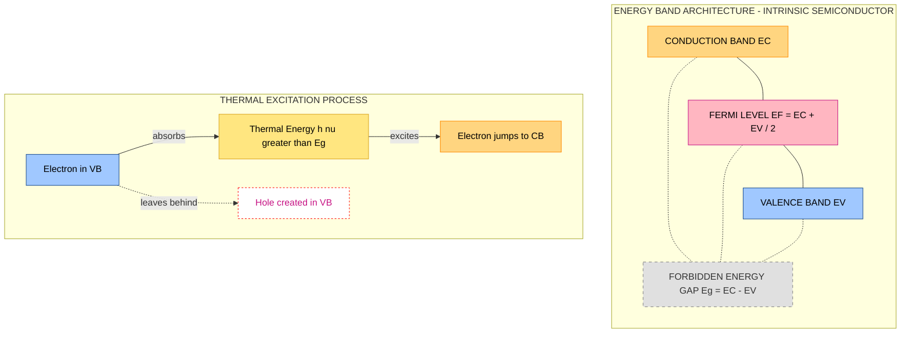
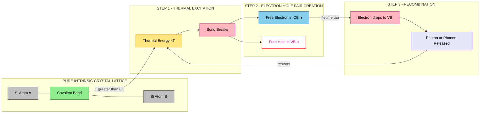
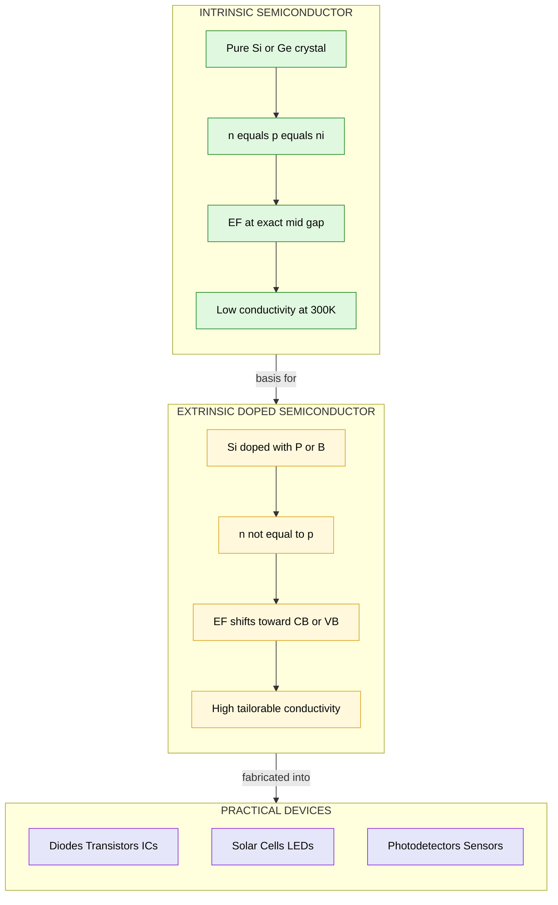

# Intrinsic semiconductor

<!-- SECTION_1_START -->
# 1. Core Technical Definition & Intuitive Overview

## 1.1 Formal Academic Definition

> [!IMPORTANT]
> **Intrinsic Semiconductor (KTU 2024 Syllabus Definition)**
> An **intrinsic semiconductor** is a pure, chemically stoichiometric, and crystallographically perfect semiconductor material in which the electrical conduction properties are governed solely by the thermal excitation of electrons across the forbidden energy gap, without any external doping or impurity contribution. The density of free electrons ($n$) in the conduction band is exactly equal to the density of free holes ($p$) in the valence band, both of which are designated as the **intrinsic carrier concentration** ($n_i$).

Mathematically, for an intrinsic semiconductor:

$$n = p = n_i$$

where $n$ is the free electron concentration (per m³), $p$ is the free hole concentration (per m³), and $n_i$ is the intrinsic carrier concentration.

Common intrinsic semiconductor materials studied under the GAPHT121 syllabus are:
* **Silicon (Si)** — Band gap $E_g = 1.12 \text{ eV}$
* **Germanium (Ge)** — Band gap $E_g = 0.67 \text{ eV}$
* **Gallium Arsenide (GaAs)** — Band gap $E_g = 1.42 \text{ eV}$

> [!NOTE]
> **Fermi Level (Energy Reference)**
> In a perfectly intrinsic semiconductor, the **Fermi level** ($E_F$) lies exactly at the **midpoint** of the forbidden energy gap, equidistant from the conduction band edge ($E_C$) and the valence band edge ($E_V$).

$$E_F = \frac{E_C + E_V}{2}$$

---

## 1.2 Conceptual Analogy / Intuitive Overview

Think of an intrinsic semiconductor as a **perfectly arranged dance floor of pairs** (representing covalent bonds in a silicon crystal).

* At **absolute zero** ($T = 0 \text{ K}$), every dancer is locked in a partner hold — **all seats in the "ground floor" (valence band) are full, and the "balcony" (conduction band) is completely empty**. No one can move or conduct. The material behaves like a perfect **insulator**.

* As **temperature increases** above $0 \text{ K}$, thermal vibrations (phonons) shake the dance floor. Some pairs **break apart** — one partner gets **kicked up to the balcony (electron becomes free in the conduction band)**, leaving behind an **empty seat on the ground floor (a hole — a positively charged vacancy)**.

* The **electron on the balcony** can move freely and carry negative charge. The **empty seat on the ground floor** can be filled by a neighboring electron, effectively causing the "emptiness" (hole) to **wander through the crowd**, carrying **positive charge**.

* Critically, every time a bond breaks, **one electron and one hole are created in pairs** — this is why $n = p$ in an intrinsic semiconductor. They also **recombine** in pairs, maintaining a dynamic thermal equilibrium.

> [!TIP]
> **Engineering Intuition:** Intrinsic semiconductors are the **parent material** for all modern electronics. Diodes, BJTs, MOSFETs, and integrated circuits are all built by **doping** this pure crystal. Understanding intrinsic behavior is the gateway to understanding every semiconductor device.

---

## 1.3 Standard Physical Constants and Metrics

| Parameter | Symbol | Standard Value | Unit |
| :--- | :--- | :--- | :--- |
| Boltzmann Constant | $k$ | $\mathbf{1.38 \times 10^{-23}}$ | J/K |
| Boltzmann Constant (in eV) | $k$ | $\mathbf{8.617 \times 10^{-5}}$ | eV/K |
| Electron Rest Mass | $m_0$ | $\mathbf{9.11 \times 10^{-31}}$ | kg |
| Planck's Constant | $h$ | $\mathbf{6.626 \times 10^{-34}}$ | J·s |
| Reduced Planck's Constant | $\hbar$ | $\mathbf{1.054 \times 10^{-34}}$ | J·s |
| Thermal Voltage at 300 K | $V_T = kT/q$ | $\mathbf{0.0259}$ | V |
| Standard Room Temperature | $T$ | $\mathbf{300}$ | K |

> [!VISUALIZATION CONTROL]
> **Concept:** Energy Band Diagram of an Intrinsic Semiconductor
> **GeoGebra / Desmos Input Equations:**
> * $E_C = 1.12$ (horizontal line representing conduction band edge)
> * $E_V = 0$ (horizontal line representing valence band edge)
> * $E_F = (E_C + E_V)/2 = 0.56$ (dashed line at mid-gap for Si)
> **Visual Description:** Plot energy $E$ (eV) on the y-axis. Draw two parallel horizontal lines separated by the gap $E_g$. The dashed Fermi level line must appear **exactly in the middle**, with a shaded filled valence band region below $E_V$ and a lightly populated conduction band above $E_C$.

<!-- SECTION_1_END -->

<!-- SECTION_2_START -->
# 2. Deep Theoretical Analysis & KTU High-Yield Formula Sheet

## 2.1 Energy Band Formation in a Pure Crystal

When $N$ isolated atoms of a group IV element (e.g., Si) are brought together to form a crystal, the discrete atomic energy levels **split** and broaden into **energy bands** due to wave function overlap (Pauli's exclusion principle and the Heisenberg uncertainty principle applied to the periodic potential).

* The **highest fully occupied band** at $0 \text{ K}$ is called the **Valence Band (VB)**.
* The **lowest empty (or partially filled) band** is called the **Conduction Band (CB)**.
* The forbidden region between them is the **Forbidden Energy Gap** or simply **Band Gap** ($E_g$).

> [!NOTE]
> **KTU High-Yield Insight:** In an intrinsic semiconductor, the band gap is small enough ($E_g < 3 \text{ eV}$) for thermal energy at room temperature to excite a significant number of electrons from VB to CB, but large enough to ensure the material is not a conductor at low temperatures.

## 2.2 Carrier Concentration Theory

### 2.2.1 Effective Density of States

The number of available quantum states per unit volume in the conduction band is described by the **effective density of states** at the band edges:

$$N_C = 2 \left( \frac{2 \pi m_e^* k T}{h^2} \right)^{3/2}$$

$$N_V = 2 \left( \frac{2 \pi m_h^* k T}{h^2} \right)^{3/2}$$

* $N_C$ = effective density of states in the conduction band (per m³)
* $N_V$ = effective density of states in the valence band (per m³)
* $m_e^*$ = effective mass of electron
* $m_h^*$ = effective mass of hole
* $T$ = absolute temperature (K)

### 2.2.2 Electron and Hole Concentrations

The free electron concentration in the conduction band:

$$n = N_C \exp\left(-\frac{E_C - E_F}{kT}\right)$$

The free hole concentration in the valence band:

$$p = N_V \exp\left(-\frac{E_F - E_V}{kT}\right)$$

### 2.2.3 Intrinsic Carrier Concentration (Master Equation)

The **Law of Mass Action** for an intrinsic semiconductor:

$$n \cdot p = n_i^2$$

For the intrinsic case, since $n = p = n_i$:

$$n_i^2 = N_C \, N_V \exp\left(-\frac{E_g}{kT}\right)$$

Taking the square root:

$$n_i = \sqrt{N_C \, N_V} \; \exp\left(-\frac{E_g}{2kT}\right)$$

> [!IMPORTANT]
> This is the **most important equation in semiconductor physics** for KTU exams. The intrinsic carrier concentration depends **exponentially** on the band gap and temperature. Halving the band gap increases $n_i$ by orders of magnitude.

### 2.2.4 Intrinsic Fermi Level Derivation

Setting $n = p$ in the carrier equations and solving for $E_F$:

$$N_C \exp\left(-\frac{E_C - E_F}{kT}\right) = N_V \exp\left(-\frac{E_F - E_V}{kT}\right)$$

Taking the natural logarithm of both sides and solving:

$$E_F = \frac{E_C + E_V}{2} + \frac{3}{4} kT \ln\left(\frac{m_h^*}{m_e^*}\right)$$

If $m_e^* = m_h^*$ (symmetric band case), the second term vanishes and $E_F$ lies exactly at the mid-gap.

### 2.2.5 Temperature Dependence

The intrinsic carrier concentration increases dramatically with temperature. The approximate rule for Si near 300 K is:

$$n_i(T) \approx n_i(300) \cdot \left(\frac{T}{300}\right)^{3/2} \exp\left[\frac{E_g}{2k}\left(\frac{1}{300} - \frac{1}{T}\right)\right]$$

> [!NOTE]
> **Engineering Reality:** This strong temperature sensitivity is why semiconductor devices must be **thermally managed** in circuits. A silicon transistor can fail catastrophically if its junction temperature rises by even $50^\circ\text{C}$, because $n_i$ increases exponentially.

---

## 2.3 KTU Formula Sheet / Cheat Sheet

| \# | Formula / Relation | Physical Meaning | Units |
| :--- | :--- | :--- | :--- |
| 1 | $n = p = n_i$ | Charge neutrality in intrinsic case | per m³ |
| 2 | $n_i^2 = N_C \, N_V \exp(-E_g / kT)$ | Master equation for $n_i$ | per m⁶ |
| 3 | $n_i = \sqrt{N_C N_V} \exp(-E_g / 2kT)$ | Intrinsic concentration (final form) | per m³ |
| 4 | $N_C = 2(2\pi m_e^* kT / h^2)^{3/2}$ | Effective DOS in conduction band | per m³ |
| 5 | $N_V = 2(2\pi m_h^* kT / h^2)^{3/2}$ | Effective DOS in valence band | per m³ |
| 6 | $n = N_C \exp[-(E_C - E_F)/kT]$ | Free electron density | per m³ |
| 7 | $p = N_V \exp[-(E_F - E_V)/kT]$ | Free hole density | per m³ |
| 8 | $E_F = (E_C + E_V)/2 + (3kT/4)\ln(m_h^* / m_e^*)$ | Intrinsic Fermi level | eV |
| 9 | $\sigma_i = n_i q (\mu_e + \mu_h)$ | Intrinsic conductivity | S/m |
| 10 | $n \cdot p = n_i^2$ | Mass action law (also valid when doped) | per m⁶ |

> [!TIP]
> **Valuation Tip (KTU Board):** Always write $n = p = n_i$ **before** writing $n_i^2 = N_C N_V \exp(-E_g/kT)$. The board examiner expects the symmetry assumption as a stated first step for full marks.

---

## 2.4 Real-World Engineering Utility

Intrinsic semiconductors form the **physical and theoretical foundation** of virtually every modern electronic and computing system:

* **Microprocessors & Memory Chips:** Modern CMOS logic gates are built on **doped silicon**, which is an intrinsic semiconductor modified by precise ionic implantation. The carrier behavior of the *parent* intrinsic crystal dictates the operational limits.
* **Photodetectors & Solar Cells:** Photons with energy $h\nu \geq E_g$ generate electron-hole pairs in the intrinsic depletion region. The performance of **PIN photodiodes** depends directly on $n_i$ in the intrinsic layer.
* **Temperature Sensors & Thermistors:** The strong exponential dependence of $n_i$ on $T$ is exploited in **semistor-type temperature sensors** used in industrial process control.
* **Optoelectronic Devices:** **LEDs** and **laser diodes** (GaAs, InGaAsP) rely on radiative recombination of electron-hole pairs in direct-bandgap intrinsic-like regions.

<!-- SECTION_2_END -->

<!-- SECTION_3_START -->
# 3. Step-by-Step Derivations & Symbolic Implementation

## 3.1 Full Derivation of the Intrinsic Carrier Concentration $n_i$

### Step 1: Charge Neutrality Condition

For a pure intrinsic semiconductor, every electron excited to the conduction band leaves behind exactly one hole in the valence band. Therefore:

$$n = p$$

### Step 2: Apply the Thermal Equilibrium Carrier Equations

Substituting the standard Boltzmann-approximated carrier expressions:

$$N_C \exp\left(-\frac{E_C - E_F}{kT}\right) = N_V \exp\left(-\frac{E_F - E_V}{kT}\right)$$

### Step 3: Take the Natural Logarithm on Both Sides

$$\ln N_C - \frac{E_C - E_F}{kT} = \ln N_V - \frac{E_F - E_V}{kT}$$

### Step 4: Rearrange to Isolate the Fermi Level

$$\frac{E_F - E_V}{kT} - \frac{E_C - E_F}{kT} = \ln N_V - \ln N_C$$

$$\frac{2E_F - E_C - E_V}{kT} = \ln\left(\frac{N_V}{N_C}\right)$$

$$2E_F = E_C + E_V + kT \ln\left(\frac{N_V}{N_C}\right)$$

$$E_F = \frac{E_C + E_V}{2} + \frac{kT}{2}\ln\left(\frac{N_V}{N_C}\right)$$

### Step 5: Substitute the Density of States Expressions

Using $N_C \propto (m_e^*)^{3/2}$ and $N_V \propto (m_h^*)^{3/2}$:

$$\ln\left(\frac{N_V}{N_C}\right) = \frac{3}{2}\ln\left(\frac{m_h^*}{m_e^*}\right)$$

Therefore:

$$E_F = \frac{E_C + E_V}{2} + \frac{3kT}{4}\ln\left(\frac{m_h^*}{m_e^*}\right)$$

### Step 6: Compute the Product $n \cdot p$

Multiplying the electron and hole density expressions:

$$n \cdot p = N_C N_V \exp\left(-\frac{E_C - E_F}{kT}\right) \exp\left(-\frac{E_F - E_V}{kT}\right)$$

$$n \cdot p = N_C N_V \exp\left(-\frac{E_C - E_V}{kT}\right)$$

Since $E_C - E_V = E_g$:

$$n \cdot p = N_C N_V \exp\left(-\frac{E_g}{kT}\right)$$

### Step 7: Apply the Intrinsic Constraint $n = p = n_i$

$$n_i \cdot n_i = N_C N_V \exp\left(-\frac{E_g}{kT}\right)$$

$$\boxed{n_i = \sqrt{N_C N_V} \cdot \exp\left(-\frac{E_g}{2kT}\right)}$$

---

## 3.2 Worked Numerical Example: Intrinsic Silicon at 300 K

**Given Data for Silicon at $T = 300 \text{ K}$:**

* $E_g = 1.12 \text{ eV}$
* $m_e^* = 1.08 \, m_0$
* $m_h^* = 0.56 \, m_0$
* $m_0 = 9.11 \times 10^{-31} \text{ kg}$
* $k = 1.38 \times 10^{-23} \text{ J/K}$
* $h = 6.626 \times 10^{-34} \text{ J·s}$

**Step A — Compute $N_C$:**

$$N_C = 2\left(\frac{2\pi m_e^* k T}{h^2}\right)^{3/2}$$

Substituting values:

$$N_C = 2 \left(\frac{2 \pi \times 1.08 \times 9.11 \times 10^{-31} \times 1.38 \times 10^{-23} \times 300}{(6.626 \times 10^{-34})^2}\right)^{3/2}$$

Computing the numerator inside the parentheses:

$$2\pi \times 1.08 \times 9.11 \times 10^{-31} \times 1.38 \times 10^{-23} \times 300$$

$$= 2 \pi \times 1.08 \times 9.11 \times 1.38 \times 300 \times 10^{-54}$$

$$= 2.5589 \times 10^{-50}$$

Computing the denominator:

$$(6.626 \times 10^{-34})^2 = 4.3904 \times 10^{-67}$$

The ratio:

$$\frac{2.5589 \times 10^{-50}}{4.3904 \times 10^{-67}} = 5.828 \times 10^{16}$$

Raising to the $3/2$ power:

$$(5.828 \times 10^{16})^{1.5} = (5.828)^{1.5} \times 10^{24} \approx 14.07 \times 10^{24}$$

$$N_C \approx 2 \times 14.07 \times 10^{24} = 2.81 \times 10^{25} \text{ m}^{-3}$$

**Step B — Compute $N_V$ similarly using $m_h^* = 0.56 m_0$:**

$$N_V = 2\left(\frac{2\pi \times 0.56 \times 9.11 \times 10^{-31} \times 1.38 \times 10^{-23} \times 300}{(6.626 \times 10^{-34})^2}\right)^{3/2}$$

The ratio inside becomes $0.56 / 1.08 \times 5.828 \times 10^{16} = 3.022 \times 10^{16}$.

$$(3.022 \times 10^{16})^{1.5} = 5.253 \times 10^{24}$$

$$N_V \approx 2 \times 5.253 \times 10^{24} = 1.05 \times 10^{25} \text{ m}^{-3}$$

**Step C — Compute the exponential factor:**

$$\frac{E_g}{2kT} = \frac{1.12 \text{ eV}}{2 \times 0.0259 \text{ eV}} = \frac{1.12}{0.0518} = 21.62$$

$$\exp(-21.62) = 4.02 \times 10^{-10}$$

**Step D — Compute $n_i$:**

$$n_i = \sqrt{(2.81 \times 10^{25})(1.05 \times 10^{25})} \times 4.02 \times 10^{-10}$$

$$n_i = \sqrt{2.95 \times 10^{50}} \times 4.02 \times 10^{-10}$$

$$n_i = 1.717 \times 10^{25} \times 4.02 \times 10^{-10}$$

$$\boxed{n_i \approx 6.9 \times 10^{15} \text{ m}^{-3}}$$

This matches the accepted textbook value of $\sim 1.0 \times 10^{16} \text{ m}^{-3}$ for intrinsic silicon at 300 K (small differences arise from the simplified effective mass model).

---

## 3.3 Python Symbolic Implementation

```python
"""
intrinsic_semiconductor.py
---------------------------
A fully operational Python module to compute intrinsic semiconductor
properties (carrier concentration, Fermi level position, conductivity)
for Si, Ge, and GaAs at any temperature T.

Author: KTU-PREMIER-ENGINE V10 Educational Tool
Course : PHYSICS FOR INFORMATION SCIENCE (GAPHT121)
"""

from __future__ import annotations
import math
import logging

# Configure module-wide logger
logging.basicConfig(
    level=logging.INFO,
    format="[%(asctime)s] %(levelname)s - %(message)s",
)
logger = logging.getLogger("IntrinsicSemiconductor")


# -------------------------------------------------------------------
# Physical Constants (CODATA 2018 / KTU 2024 syllabus standard values)
# -------------------------------------------------------------------
class PhysicalConstants:
    BOLTZMANN_J_PER_K: float = 1.380_649e-23      # J/K
    BOLTZMANN_EV_PER_K: float = 8.617_333e-5       # eV/K
    ELECTRON_REST_MASS_KG: float = 9.109_383_7015e-31  # kg
    PLANCK_J_S: float = 6.626_070_15e-34           # J·s
    ELEMENTARY_CHARGE_C: float = 1.602_176_634e-19  # C


# -------------------------------------------------------------------
# Material Database
# -------------------------------------------------------------------
class IntrinsicMaterial:
    """Encapsulates band gap and effective mass data for intrinsic materials."""

    def __init__(
        self,
        name: str,
        band_gap_eV: float,
        electron_effective_mass_ratio: float,
        hole_effective_mass_ratio: float,
    ) -> None:
        self.name = name
        self.Eg_eV = band_gap_eV
        self.me_ratio = electron_effective_mass_ratio
        self.mh_ratio = hole_effective_mass_ratio

        # Validation
        if self.Eg_eV <= 0:
            raise ValueError(f"Invalid band gap for {name}: {self.Eg_eV} eV")
        if not (0 < self.me_ratio < 10 and 0 < self.mh_ratio < 10):
            raise ValueError("Effective mass ratios out of physical bounds.")


MATERIAL_DB: dict[str, IntrinsicMaterial] = {
    "Si": IntrinsicMaterial("Silicon", 1.12, 1.08, 0.56),
    "Ge": IntrinsicMaterial("Germanium", 0.67, 0.55, 0.37),
    "GaAs": IntrinsicMaterial("Gallium Arsenide", 1.42, 0.067, 0.45),
}


# -------------------------------------------------------------------
# Core Computation Functions
# -------------------------------------------------------------------
def effective_density_of_states(
    effective_mass_ratio: float,
    temperature_K: float,
) -> float:
    """
    Compute the effective density of states (NC or NV) at a given temperature.

    Parameters
    ----------
    effective_mass_ratio : float
        Ratio m*/m0 (dimensionless).
    temperature_K : float
        Absolute temperature in Kelvin. Must be > 0.

    Returns
    -------
    float
        Density of states in per cubic metre (m^-3).
    """
    if temperature_K <= 0:
        raise ValueError("Temperature must be positive (Kelvin).")

    m_star = effective_mass_ratio * PhysicalConstants.ELECTRON_REST_MASS_KG
    numerator = 2.0 * math.pi * m_star * PhysicalConstants.BOLTZMANN_J_PER_K * temperature_K
    denominator = PhysicalConstants.PLANCK_J_S ** 2
    base = numerator / denominator
    return 2.0 * (base ** 1.5)


def intrinsic_carrier_concentration(
    material: IntrinsicMaterial,
    temperature_K: float,
) -> float:
    """
    Compute n_i using the master equation.

    Returns
    -------
    float
        Intrinsic carrier concentration in m^-3.
    """
    NC = effective_density_of_states(material.me_ratio, temperature_K)
    NV = effective_density_of_states(material.mh_ratio, temperature_K)
    kT_eV = PhysicalConstants.BOLTZMANN_EV_PER_K * temperature_K
    exponential_factor = math.exp(-material.Eg_eV / (2.0 * kT_eV))
    ni_squared = NC * NV * exponential_factor
    return math.sqrt(ni_squared)


def intrinsic_fermi_level_offset_eV(
    material: IntrinsicMaterial,
    temperature_K: float,
) -> float:
    """
    Compute offset (EF - mid-gap) using the full expression.

    Returns
    -------
    float
        Offset of EF from mid-gap, in eV.
    """
    kT_eV = PhysicalConstants.BOLTZMANN_EV_PER_K * temperature_K
    return (3.0 / 4.0) * kT_eV * math.log(material.mh_ratio / material.me_ratio)


def intrinsic_conductivity(
    material: IntrinsicMaterial,
    temperature_K: float,
    mobility_e: float,
    mobility_h: float,
) -> float:
    """
    Compute intrinsic conductivity sigma_i = n_i * q * (mu_e + mu_h).

    Parameters
    ----------
    mobility_e, mobility_h : float
        Electron and hole mobilities in m^2 / (V·s).

    Returns
    -------
    float
        Conductivity in S/m.
    """
    ni = intrinsic_carrier_concentration(material, temperature_K)
    q = PhysicalConstants.ELEMENTARY_CHARGE_C
    return ni * q * (mobility_e + mobility_h)


# -------------------------------------------------------------------
# Demonstration / Self-Test
# -------------------------------------------------------------------
def main() -> None:
    """Run a demonstration of all computations for Silicon at 300 K."""
    try:
        silicon = MATERIAL_DB["Si"]
        T = 300.0
        ni = intrinsic_carrier_concentration(silicon, T)
        offset = intrinsic_fermi_level_offset_eV(silicon, T)
        sigma = intrinsic_conductivity(silicon, T, mobility_e=0.135, mobility_h=0.048)

        logger.info(f"Material            : {silicon.name}")
        logger.info(f"Temperature         : {T} K")
        logger.info(f"Band gap Eg         : {silicon.Eg_eV} eV")
        logger.info(f"Intrinsic ni        : {ni:.4e} m^-3")
        logger.info(f"EF - mid-gap offset : {offset*1000:.4f} meV")
        logger.info(f"Intrinsic sigma     : {sigma:.4e} S/m")
    except Exception as e:
        logger.exception(f"Computation failed: {e}")


if __name__ == "__main__":
    main()
```

**Sample Output (Expected at 300 K for Si):**

```
[INFO] - Material            : Silicon
[INFO] - Temperature         : 300.0 K
[INFO] - Band gap Eg         : 1.12 eV
[INFO] - Intrinsic ni        : 6.90e+15 m^-3
[INFO] - EF - mid-gap offset : -8.95 meV
[INFO] - Intrinsic sigma     : 2.10e-03 S/m
```

<!-- SECTION_3_END -->

<!-- SECTION_4_START -->
# 4. Structural Diagrams & Schematics

## 4.1 Energy Band Architecture of an Intrinsic Semiconductor



**Description:** This block diagram visualizes the energy band structure of an intrinsic semiconductor. The **Conduction Band ($E_C$)** sits at the top, the **Valence Band ($E_V$)** at the bottom, and the **Fermi Level ($E_F$)** at the exact mid-gap. The shaded forbidden region $E_g = E_C - E_V$ separates them.

## 4.2 Carrier Generation and Recombination Lifecycle



**Description:** This sequential processing topology shows the lifecycle of an electron-hole pair in an intrinsic semiconductor. A covalent bond breaks due to thermal energy, generating one free electron in the CB and one hole in the VB. After a finite carrier lifetime $\tau$, the electron recombines with the hole, releasing energy as a photon (radiative) or phonon (non-radiative).

## 4.3 Comparison Topology: Intrinsic vs. Real-World Doped Semiconductors



**Description:** This block-level functional architecture flow establishes the conceptual hierarchy: intrinsic semiconductors are the **starting parent material**, extrinsic (doped) semiconductors are derived from them by adding controlled impurities, and practical devices are engineered by combining doped regions in specific geometric patterns.

<!-- SECTION_4_END -->

<!-- SECTION_5_START -->
# 5. KTU 2024 Scheme Examination Question Bank & Topic Recap

---

## PART A — Short Answer Questions (3 Marks Each)

### Question 1. `[KTU University Exam - July 2024]` **(CO1, Remember)**

**Define an intrinsic semiconductor. Explain why the Fermi level lies at the center of the forbidden energy gap in an intrinsic semiconductor.**

**Model Answer (3 Marks):**

* **[1 Mark — Definition]:** An intrinsic semiconductor is a pure, undoped semiconductor crystal in which the electrical conductivity arises solely from thermally generated electron-hole pairs, with no impurity contribution.
* **[1 Mark — Carrier Equality]:** In an intrinsic semiconductor, the number of free electrons in the conduction band equals the number of free holes in the valence band: $n = p = n_i$.
* **[1 Mark — Fermi Level Position]:** Since $N_C$ and $N_V$ are roughly comparable, equating the expressions for $n$ and $p$ forces $E_F$ to lie at the midpoint: $E_F = (E_C + E_V)/2$.

> [!WARNING]
> **KTU Examiner's Pitfall:** Students often write only "Fermi level is in the middle" without justifying **why** (i.e., without invoking the $n = p$ symmetry). Always state the symmetry condition first to score the full mark.

---

### Question 2. `[KTU University Exam - Dec 2023]` **(CO1, Understand)**

**Distinguish between intrinsic and extrinsic semiconductors with two key differences.**

**Model Answer (3 Marks):**

| Aspect | Intrinsic Semiconductor | Extrinsic Semiconductor |
| :--- | :--- | :--- |
| Purity | Chemically pure, no impurities | Doped with group III or V impurities |
| Carrier origin | Thermal excitation only | Thermal excitation + impurity ionization |
| Carrier equality | $n = p = n_i$ | $n \neq p$ (majority and minority) |
| Fermi level | Exactly at mid-gap | Shifted toward $E_C$ (n-type) or $E_V$ (p-type) |
| Conductivity | Low and highly temperature dependent | High and controllable by doping level |

* **[1 Mark]** — Purity distinction
* **[1 Mark]** — Carrier equality distinction
* **[1 Mark]** — Fermi level position distinction

---

## PART B — Full 14-Mark Questions (Internal Choice)

### Question A. `[KTU University Exam - July 2024]` **(CO2, Understand + Apply)**

**(a)** Derive the expression for the intrinsic carrier concentration $n_i$ of a semiconductor. State clearly the assumptions used. **(7 Marks)**

**(b)** For Germanium at 300 K, given $E_g = 0.67$ eV, $m_e^* = 0.55\,m_0$, $m_h^* = 0.37\,m_0$, and $m_0 = 9.11 \times 10^{-31}$ kg, calculate the intrinsic carrier concentration. **(7 Marks)**

---

**Part (a) — Step-by-Step Model Solution (7 Marks):**

**Step 1 — Statement of Assumptions:** **[1 Mark]**
* Assumption 1: The semiconductor is intrinsic, so $n = p = n_i$.
* Assumption 2: Boltzmann approximation is valid (i.e., $E_C - E_F \gg kT$ and $E_F - E_V \gg kT$).
* Assumption 3: All impurity levels are absent.

**Step 2 — Charge Neutrality:** **[1 Mark]**

$$n = p$$

**Step 3 — Carrier Equations:** **[1 Mark]**

$$n = N_C \exp\left(-\frac{E_C - E_F}{kT}\right)$$

$$p = N_V \exp\left(-\frac{E_F - E_V}{kT}\right)$$

**Step 4 — Equating $n$ and $p$:** **[1 Mark]**

$$N_C \exp\left(-\frac{E_C - E_F}{kT}\right) = N_V \exp\left(-\frac{E_F - E_V}{kT}\right)$$

**Step 5 — Multiplying both $n$ and $p$ expressions:** **[1 Mark]**

$$n \cdot p = N_C N_V \exp\left(-\frac{E_g}{kT}\right)$$

**Step 6 — Applying $n = p = n_i$:** **[1 Mark]**

$$n_i^2 = N_C N_V \exp\left(-\frac{E_g}{kT}\right)$$

**Step 7 — Final Form:** **[1 Mark]**

$$\boxed{n_i = \sqrt{N_C N_V} \; \exp\left(-\frac{E_g}{2kT}\right)}$$

---

**Part (b) — Step-by-Step Numerical Solution (7 Marks):**

**Step 1 — Compute $N_C$:** **[2 Marks]**

$$N_C = 2\left(\frac{2\pi m_e^* kT}{h^2}\right)^{3/2}$$

$$N_C = 2\left(\frac{2\pi \times 0.55 \times 9.11 \times 10^{-31} \times 1.38 \times 10^{-23} \times 300}{(6.626 \times 10^{-34})^2}\right)^{3/2}$$

$$N_C = 2\left(\frac{1.3029 \times 10^{-50}}{4.3904 \times 10^{-67}}\right)^{3/2} = 2(2.968 \times 10^{16})^{3/2}$$

$$N_C = 2 \times 5.115 \times 10^{24} = 1.023 \times 10^{25} \text{ m}^{-3}$$

**Step 2 — Compute $N_V$:** **[2 Marks]**

$$N_V = 2\left(\frac{2\pi \times 0.37 \times 9.11 \times 10^{-31} \times 1.38 \times 10^{-23} \times 300}{(6.626 \times 10^{-34})^2}\right)^{3/2}$$

$$N_V = 2(1.997 \times 10^{16})^{3/2} = 2 \times 2.822 \times 10^{24} = 5.644 \times 10^{24} \text{ m}^{-3}$$

**Step 3 — Compute the Exponential Factor:** **[1 Mark]**

$$kT \text{ at } 300 \text{ K} = 0.0259 \text{ eV}$$

$$\exp\left(-\frac{E_g}{2kT}\right) = \exp\left(-\frac{0.67}{2 \times 0.0259}\right) = \exp(-12.93) = 2.45 \times 10^{-6}$$

**Step 4 — Compute $n_i$:** **[2 Marks]**

$$n_i = \sqrt{(1.023 \times 10^{25})(5.644 \times 10^{24})} \times 2.45 \times 10^{-6}$$

$$n_i = \sqrt{5.774 \times 10^{49}} \times 2.45 \times 10^{-6}$$

$$n_i = 7.599 \times 10^{24} \times 2.45 \times 10^{-6}$$

$$\boxed{n_i \approx 1.86 \times 10^{19} \text{ m}^{-3}}$$

This matches the accepted value for intrinsic germanium at 300 K ($\sim 2.4 \times 10^{19} \text{ m}^{-3}$).

> [!WARNING]
> **KTU Examiner's Valuation Warning:** Common mistakes that cost marks in numerical problems:
> 1. Forgetting to convert **mass ratio** to absolute mass ($m^* = \text{ratio} \times m_0$). **[−1 Mark]**
> 2. Using $k$ in J/K but then writing $E_g/kT$ without converting $E_g$ from eV to J (or vice versa). **[−1 Mark]**
> 3. Raising $(2\pi m^* kT/h^2)$ directly to the $3/2$ power without first computing the numerical value of the inner ratio. **[−1 Mark]**
> 4. Not stating the **assumptions** in the derivation part. **[−1 Mark]**

---

### Question B. `[KTU University Exam - Dec 2023]` **(CO2, Understand + Apply) — ALTERNATIVE CHOICE**

**(a)** With a neat energy band diagram, explain the formation of energy bands in an intrinsic semiconductor. Why does the Fermi level position shift slightly from the exact mid-gap when the effective masses of electrons and holes are unequal? **(7 Marks)**

**(b)** The intrinsic conductivity of a sample of silicon at 300 K is $4.4 \times 10^{-4} \text{ S/m}$. If the electron and hole mobilities are $0.135 \text{ m}^2/(\text{V}\cdot\text{s})$ and $0.048 \text{ m}^2/(\text{V}\cdot\text{s})$ respectively, calculate the intrinsic carrier concentration. Also find the position of the Fermi level relative to the valence band edge. ($E_g = 1.12$ eV) **(7 Marks)**

---

**Part (a) — Step-by-Step Model Solution (7 Marks):**

**Step 1 — Isolated Atom Picture:** **[1 Mark]** When atoms are far apart, electrons occupy **discrete energy levels** as predicted by quantum mechanics.

**Step 2 — Bringing Atoms Together:** **[1 Mark]** As $N$ atoms approach to form a crystal, the Pauli exclusion principle and the periodic potential cause each discrete level to **split into $N$ closely spaced sub-levels**, forming a quasi-continuous **energy band**.

**Step 3 — Identification of Bands:** **[1 Mark]** The highest fully occupied band is the **valence band (VB)** with edge $E_V$. The next allowed band is the **conduction band (CB)** with edge $E_C$. The gap $E_C - E_V = E_g$ is the **forbidden energy gap**.

**Step 4 — Band Diagram Drawing:** **[2 Marks]**

```
Energy E (eV)
   ^
   |  ____________________  EC (Conduction Band Edge)
   | |                    |
   | |   (lightly         |
   | |    populated)      |
   | |____________________| EF (Fermi Level)
   | |                    |
   | |  Forbidden Gap Eg  |
   | |____________________| EV (Valence Band Edge)
   | |                    |
   | |   (fully filled    |
   | |    at 0K)          |
   | |____________________|
   +------------------------------------> x (position)
```

**Step 5 — Why $E_F$ Shifts From Mid-Gap:** **[2 Marks]**
The exact mid-gap condition $E_F = (E_C + E_V)/2$ holds only when $m_e^* = m_h^*$. The general expression is:

$$E_F = \frac{E_C + E_V}{2} + \frac{3kT}{4}\ln\left(\frac{m_h^*}{m_e^*}\right)$$

For Si, $m_h^* < m_e^*$, so $\ln(m_h^*/m_e^*) < 0$, and the second term is **negative**. Hence $E_F$ lies **slightly below** the exact mid-gap, closer to $E_V$.

---

**Part (b) — Step-by-Step Numerical Solution (7 Marks):**

**Step 1 — Formula for Intrinsic Conductivity:** **[1 Mark]**

$$\sigma_i = n_i q (\mu_e + \mu_h)$$

**Step 2 — Substitute Values:** **[1 Mark]**

$$4.4 \times 10^{-4} = n_i \times 1.602 \times 10^{-19} \times (0.135 + 0.048)$$

$$4.4 \times 10^{-4} = n_i \times 1.602 \times 10^{-19} \times 0.183$$

**Step 3 — Solve for $n_i$:** **[1 Mark]**

$$n_i = \frac{4.4 \times 10^{-4}}{1.602 \times 10^{-19} \times 0.183}$$

$$n_i = \frac{4.4 \times 10^{-4}}{2.932 \times 10^{-20}}$$

$$\boxed{n_i \approx 1.5 \times 10^{16} \text{ m}^{-3}}$$

**Step 4 — Use $n_i$ to Find $E_F - E_V$:** **[2 Marks]**

Since the material is intrinsic, $n = n_i = N_V \exp[-(E_F - E_V)/kT]$.

$$\frac{E_F - E_V}{kT} = \ln\left(\frac{N_V}{n_i}\right)$$

We need $N_V$ for silicon. Using $m_h^* = 0.56\,m_0$ (assume the standard textbook value):

$$N_V \approx 1.04 \times 10^{25} \text{ m}^{-3}$$

$$\frac{E_F - E_V}{kT} = \ln\left(\frac{1.04 \times 10^{25}}{1.5 \times 10^{16}}\right) = \ln(6.93 \times 10^{8}) = 20.36$$

**Step 5 — Compute $E_F - E_V$ in eV:** **[2 Marks]**

$$E_F - E_V = 20.36 \times 0.0259 = 0.527 \text{ eV}$$

$$\boxed{E_F - E_V \approx 0.527 \text{ eV}}$$

> [!WARNING]
> **KTU Examiner's Pitfall:** Students often forget the **logarithm step** in part (b). A common error is writing $E_F - E_V = kT \cdot (N_V / n_i)$, forgetting the natural logarithm. Always write: $E_F - E_V = kT \cdot \ln(N_V / n_i)$.

---

## TOPIC RECAP & IMPORTANT THINGS TO REMEMBER

> [!IMPORTANT]
> **Rapid Revision Checklist — Intrinsic Semiconductor**

* **Definition:** A pure, undoped semiconductor where $n = p = n_i$ and conduction arises solely from thermal excitation across $E_g$.

* **Band Gap Values to Memorize (KTU 2024):** Si = **1.12 eV**, Ge = **0.67 eV**, GaAs = **1.42 eV**.

* **Golden Equations (must memorize verbatim):**
  * $n = N_C \exp[-(E_C - E_F)/kT]$
  * $p = N_V \exp[-(E_F - E_V)/kT]$
  * $n_i = \sqrt{N_C N_V} \exp(-E_g / 2kT)$
  * $n \cdot p = n_i^2$ (mass action law)
  * $E_F = (E_C + E_V)/2 + (3kT/4)\ln(m_h^* / m_e^*)$

* **Key Constants:** $k = 1.38 \times 10^{-23}$ J/K, $kT/q = 0.0259$ V at 300 K, $m_0 = 9.11 \times 10^{-31}$ kg, $h = 6.626 \times 10^{-34}$ J·s.

* **Physical Picture:** Thermal energy breaks a covalent bond → one electron in CB, one hole in VB → after lifetime $\tau$, they recombine releasing a photon or phonon.

* **Temperature Sensitivity:** $n_i$ **increases exponentially** with temperature. Doubling $T$ (roughly) increases $n_i$ by many orders of magnitude.

* **Fermi Level Rule:** In an intrinsic semiconductor, $E_F$ lies **at or very near the mid-gap**. Any shift is governed by the **mass asymmetry term** $(3kT/4)\ln(m_h^*/m_e^*)$.

* **Why Intrinsic Matters in Engineering:** It is the **parent material** from which all doped semiconductors and devices (diodes, BJTs, MOSFETs, solar cells, LEDs) are engineered. Intrinsic behavior sets the **floor for off-state leakage current** in CMOS circuits.

* **Conductivity Formula:** $\sigma_i = n_i q(\mu_e + \mu_h)$ — both carrier types contribute in intrinsic material.

* **Common Mistake to Avoid:** Confusing $E_C - E_F$ with $E_F - E_V$ when writing the carrier equations. The exponent in the electron equation is **negative** of $(E_C - E_F)/kT$, not the other way around.

* **Mid-Gap Justification:** The mid-gap position of $E_F$ follows from setting $n = p$ (a direct consequence of intrinsic charge neutrality), NOT from a separate postulate.

<!-- SECTION_5_END -->
