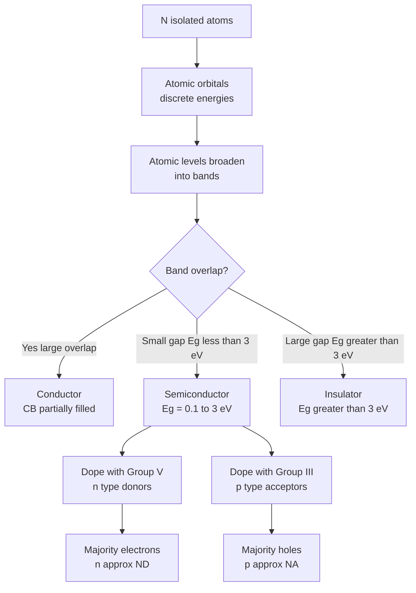
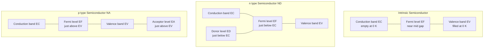
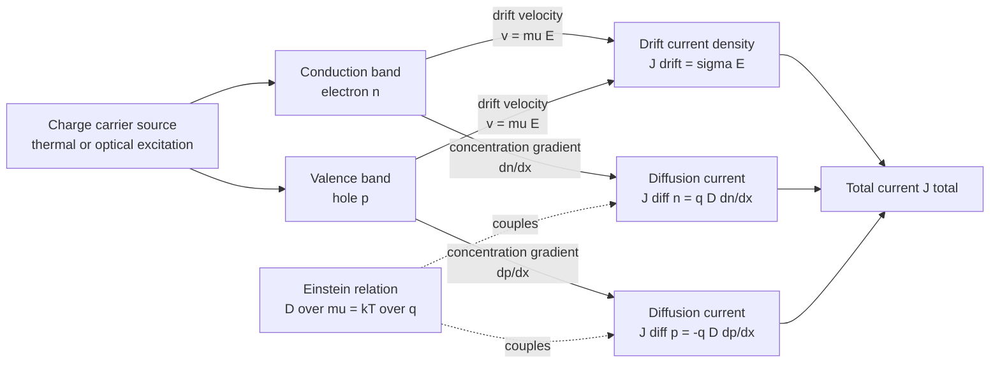
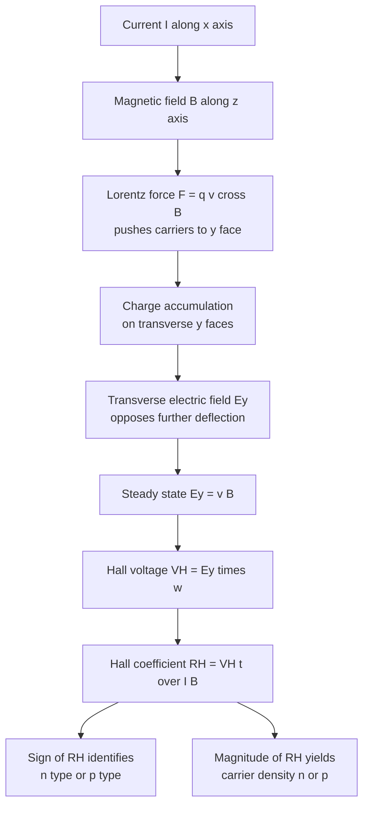
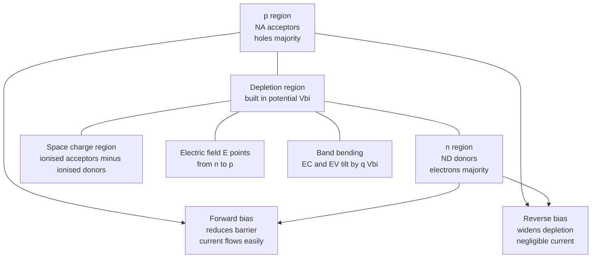

# Semiconductor Physics

<!-- SECTION_1_START -->

# Semiconductor Physics — Core Definition & Intuitive Overview

## 1.1 Formal Academic Definition

A **semiconductor** is a crystalline solid whose electrical conductivity lies between that of a good conductor ($\sigma \sim 10^{7}\ \text{S/m}$) and an insulator ($\sigma \sim 10^{-10}\ \text{S/m}$), typically in the range $\sigma \sim 10^{-6}$ to $10^{4}\ \text{S/m}$, and — most importantly — whose conductivity can be **precisely, predictably, and reversibly controlled** by external agents such as temperature, electric field, illumination, magnetic field, or impurity doping. The key solid-state parameter that classifies a material is the **forbidden energy gap** $E_g$ separating the completely filled **valence band (VB)** from the nearly empty **conduction band (CB)**.

> [!IMPORTANT]
> **KTU 2024 Syllabus Definition (Module 3 — Semiconductor Physics):**
> A semiconductor is a material with an energy band gap typically between **$0.1\ \text{eV}$ and $3\ \text{eV}$**, having a filled valence band at $0\ \text{K}$ and a partially filled conduction band at higher temperatures, enabling controlled conduction via electrons and holes.

The two principal families of semiconductors covered in this module are:

| Family | Examples | Typical $E_g$ (eV) at $300\ \text{K}$ |
|---|---|---|
| **Elemental (Group IV)** | Si, Ge | Si: 1.12 ; Ge: 0.67 |
| **Compound (III–V)** | GaAs, InP, GaN | GaAs: 1.42 ; GaN: 3.39 |
| **Compound (II–VI)** | CdTe, ZnSe | CdTe: 1.56 |

The cornerstone of every modern information-science device — from the MOSFET in your laptop's CPU to the photodiode in a fibre-optic receiver — is built on the physics of semiconductors.

## 1.2 Conceptual Analogy & Geometric Intuition

Imagine a **multi-storey car park (the crystal lattice)**. The ground floor is packed with cars (electrons) — this is the **valence band**, full at absolute zero. The topmost open floor is the **conduction band**, where cars can actually move and exit the building (conduct electricity). Between the two floors lies a solid, sealed concrete slab: the **forbidden energy gap** $E_g$.

- In a **conductor** (like copper), the slab is missing — cars roll straight from the ground floor to the top.
- In an **insulator** (like diamond), the slab is enormously thick ($\sim 5\ \text{eV}$) — no car can ever jump it.
- In a **semiconductor**, the slab has a moderate thickness ($\sim 1\ \text{eV}$). At low temperatures the cars stay parked. But **heat, light, or deliberate doping** gives individual cars enough kinetic energy to jump the slab. When a car escapes, it leaves behind a **vacancy (a "hole")** on the ground floor, into which neighbouring cars can shuffle — producing a coordinated motion in the *opposite* direction to the escaped car.

This paired, opposite motion of **negative electrons in the CB** and **positive holes in the VB** is the soul of semiconductor physics.

## 1.3 Two Material Variants: Intrinsic vs. Extrinsic

> [!NOTE]
> **Intrinsic semiconductor** — a *chemically pure* crystal (e.g. ultra-pure Si). The number of electrons in the CB equals the number of holes in the VB at all temperatures: $n = p = n_i$.
>
> **Extrinsic semiconductor** — a crystal *deliberately doped* with a trace impurity (typically 1 dopant atom per $10^6$ host atoms) to skew the electron-hole balance in a controlled manner:
> - **n-type:** doped with a Group V element (P, As) → surplus electrons → electrons are the *majority carriers*.
> - **p-type:** doped with a Group III element (B, Ga, In) → deficit of electrons → holes are the *majority carriers*.

> [!TIP]
> **Mnemonic:** **n-type = Negative** (extra electron donor), **p-type = Positive** (missing electron, behaves as a positive hole acceptor).

## 1.4 Energy Band Picture — The Master Diagram

At absolute zero, an intrinsic semiconductor's Fermi level $E_F$ sits almost exactly in the middle of the forbidden gap. As temperature rises, electrons populate the CB, leaving behind holes in the VB.

> [!VISUALIZATION CONTROL]
> **Concept:** Energy band diagram of an intrinsic semiconductor with VB, CB, $E_g$, and $E_F$.
> **GeoGebra / Desmos Input Equations (1-D energy axis):**
> * $E_{\text{VB\_top}}(T) = 0$ (reference line)
> * $E_F(T) = E_g(T) / 2$
> * $E_{\text{CB\_bottom}}(T) = E_g(T)$ with $E_g(T) = 1.12 - \frac{4.73 \times 10^{-4}\ T^{2}}{T + 636}$ (Varshni's empirical fit for Si)
> **Visual Description:** Plot a horizontal axis $E$ (eV). Mark the filled valence band region (shaded) up to $0\ \text{eV}$, a white gap of width $E_g$, and the empty conduction band beginning at $E_g$. Place a dashed red line for $E_F$ midway in the gap. An electron (blue dot) and a hole (red open circle) appear in the CB and VB respectively once $T > 0\ \text{K}$.

> [!IMPORTANT]
> **Standard Constants to Memorise for KTU 2024:**
> - Boltzmann constant: $k_B = 1.38 \times 10^{-23}\ \text{J/K} = 8.617 \times 10^{-5}\ \text{eV/K}$
> - Thermal voltage at $300\ \text{K}$: $V_T = k_B T / q \approx 0.0259\ \text{V}$
> - Intrinsic carrier concentration of Si at $300\ \text{K}$: $n_i \approx 1.5 \times 10^{10}\ \text{cm}^{-3}$
> - Permittivity of Si: $\varepsilon_s = 11.7\,\varepsilon_0$; $\varepsilon_0 = 8.854 \times 10^{-14}\ \text{F/cm}$

<!-- SECTION_1_END -->

<!-- SECTION_2_START -->

# Deep Theoretical Analysis & KTU High-Yield Formula Sheet

## 2.1 The Band Picture — Why Some Materials Conduct

A single isolated atom has discrete, sharply-defined energy levels (1s, 2s, 2p, 3s …). When $N$ atoms are brought together to form a crystal, their wavefunctions overlap and the discrete levels **broaden into bands** of allowed energies, separated by **forbidden gaps** (Bragg reflection at the Brillouin-zone boundary splits the levels). The highest completely-filled band is the **valence band**; the next higher (partially empty) band is the **conduction band**. The width of the forbidden gap between them, $E_g$, is the single most important material parameter.

> [!IMPORTANT]
> **KTU 2024 Board Valuation Key Point:** When asked *"Why does an intrinsic semiconductor not conduct at 0 K?"*, the examiner expects the answer: *"At 0 K, the valence band is completely filled and the conduction band is completely empty; an applied electric field cannot change the total crystal momentum because every filled state has an electron moving in the opposite direction (Pauli exclusion). Hence the net current is zero."*

## 2.2 Carrier Concentration — The Fermi–Dirac Statistics

The probability that an available quantum state at energy $E$ is occupied by an electron at absolute temperature $T$ is governed by the **Fermi–Dirac distribution function**:

$$f(E) = \frac{1}{1 + \exp\!\left(\dfrac{E - E_F}{k_B T}\right)}$$

where $E_F$ is the **Fermi energy** (or Fermi level) — the energy at which the occupation probability is exactly $1/2$.

For an intrinsic semiconductor, the number of electrons excited into the conduction band (per unit volume) is:

$$n = N_C \,\exp\!\left(-\frac{E_C - E_F}{k_B T}\right)$$

The number of holes left behind in the valence band is:

$$p = N_V \,\exp\!\left(-\frac{E_F - E_V}{k_B T}\right)$$

where $N_C$ and $N_V$ are the **effective densities of states** in the conduction and valence bands:

$$N_C = 2\left(\frac{2\pi m_e^* k_B T}{h^2}\right)^{3/2}, \qquad N_V = 2\left(\frac{2\pi m_h^* k_B T}{h^2}\right)^{3/2}$$

Multiplying $n$ and $p$ yields the **law of mass action**, an essential KTU identity:

$$n p = n_i^2 = N_C N_V \,\exp\!\left(-\frac{E_g}{k_B T}\right)$$

> [!TIP]
> **$n_i^2$ depends only on temperature and $E_g$ — not on doping.** This is the single most-tested identity in KTU semiconductor problems.

## 2.3 Intrinsic Fermi Level

Setting $n = p = n_i$ for an intrinsic semiconductor:

$$E_F^{(i)} = \frac{E_C + E_V}{2} + \frac{3}{4} k_B T \,\ln\!\left(\frac{m_h^*}{m_e^*}\right)$$

If $m_e^* = m_h^*$, the Fermi level lies *exactly* in the middle of the gap. In real Si, $m_h^* > m_e^*$, so $E_F$ sits slightly above the mid-gap.

## 2.4 Extrinsic Carrier Concentrations

For an **n-type** semiconductor doped with donor concentration $N_D$ (and assuming full ionisation):

$$n \approx N_D, \qquad p = \frac{n_i^2}{N_D}, \qquad E_F = E_C - k_B T \,\ln\!\left(\frac{N_C}{N_D}\right)$$

For a **p-type** semiconductor doped with acceptor concentration $N_A$:

$$p \approx N_A, \qquad n = \frac{n_i^2}{N_A}, \qquad E_F = E_V + k_B T \,\ln\!\left(\frac{N_V}{N_A}\right)$$

## 2.5 Drift, Diffusion & Total Current

Two distinct physical mechanisms transport charge:

**Drift** — carriers move under an applied electric field $\vec{\mathcal{E}}$. The drift velocity is $v_d = \mu \mathcal{E}$, where $\mu$ is the **mobility** (cm²/V·s). The drift current density is:

$$\vec{J}_{\text{drift}} = q\,(n\mu_n + p\mu_p)\,\vec{\mathcal{E}} = \sigma\,\vec{\mathcal{E}}$$

**Diffusion** — carriers move down a concentration gradient. Fick's first law gives:

$$\vec{J}_{\text{diff}} = q\!\left(D_n \nabla n - D_p \nabla p\right)$$

The **total current density** is the sum of drift and diffusion for both carrier species. The **Einstein relation** couples mobility and diffusivity:

$$\frac{D_n}{\mu_n} = \frac{D_p}{\mu_p} = \frac{k_B T}{q} = V_T$$

## 2.6 The Hall Effect — Measuring Carrier Type and Density

When a current-carrying semiconductor strip is placed in a perpendicular magnetic field $B_z$, the Lorentz force deflects the moving carriers sideways, producing a measurable transverse **Hall voltage** $V_H$ across the width $w$ of the strip:

$$V_H = \frac{I B_z}{q\,n\,t} \quad \text{(for an n-type sample of thickness } t\text{)}$$

The **Hall coefficient** $R_H$ encodes both the carrier sign and density:

$$R_H = \frac{V_H \, t}{I B_z} = \frac{1}{q\,n} \quad (n\text{-type}) \quad \text{or} \quad -\frac{1}{q\,p} \quad (p\text{-type})$$

> [!NOTE]
> The *sign* of the Hall voltage tells you whether the material is n-type (negative $V_H$ for conventional current direction) or p-type (positive $V_H$). This was historically how semiconductor type was first identified before the era of clean doping techniques.

## 2.7 KTU High-Yield Formula Sheet (Cheat Table)

> [!IMPORTANT]
> Every row below is a **board-exam gold formula** — learn the symbols, units, and the conditions of validity.

| # | Quantity | Formula | Units | Validity / Notes |
|---|---|---|---|---|
| 1 | Fermi–Dirac distribution | $f(E) = \dfrac{1}{1 + e^{(E-E_F)/k_B T}}$ | dimensionless | $0 \le f \le 1$ |
| 2 | Electron concentration in CB | $n = N_C e^{-(E_C - E_F)/k_B T}$ | $\text{cm}^{-3}$ | Maxwell–Boltzmann approx. valid when $E_C - E_F \gg 3k_B T$ |
| 3 | Hole concentration in VB | $p = N_V e^{-(E_F - E_V)/k_B T}$ | $\text{cm}^{-3}$ | MB approx. when $E_F - E_V \gg 3k_B T$ |
| 4 | Effective density of states | $N_C = 2\!\left(\dfrac{2\pi m_e^* k_B T}{h^2}\right)^{3/2}$ | $\text{cm}^{-3}$ | For Si at $300\ \text{K}$, $N_C \approx 2.8 \times 10^{19}\ \text{cm}^{-3}$ |
| 5 | Intrinsic carrier density | $n_i^2 = N_C N_V \,e^{-E_g/k_B T}$ | $\text{cm}^{-6}$ | **Temperature dependent** |
| 6 | Law of mass action | $n p = n_i^2$ | $\text{cm}^{-6}$ | Holds at equilibrium for any doping |
| 7 | Intrinsic Fermi level | $E_F^{(i)} = \dfrac{E_C+E_V}{2} + \dfrac{3}{4} k_B T \ln\!\left(\dfrac{m_h^*}{m_e^*}\right)$ | $\text{eV}$ | Mid-gap if effective masses equal |
| 8 | n-type Fermi level | $E_F = E_C - k_B T \ln(N_C/N_D)$ | $\text{eV}$ | Below $E_C$ by $\sim 0.2\ \text{eV}$ for typical doping |
| 9 | p-type Fermi level | $E_F = E_V + k_B T \ln(N_V/N_A)$ | $\text{eV}$ | Above $E_V$ by $\sim 0.2\ \text{eV}$ for typical doping |
| 10 | Conductivity | $\sigma = q(n\mu_n + p\mu_p)$ | $\text{S/cm}$ | Sum of electron + hole contributions |
| 11 | Drift current density | $J_{\text{drift}} = \sigma \mathcal{E}$ | $\text{A/cm}^{2}$ | Ohm's law in differential form |
| 12 | Diffusion current density | $J_{\text{diff}} = q(D_n \nabla n - D_p \nabla p)$ | $\text{A/cm}^{2}$ | Fick's first law |
| 13 | Einstein relation | $D/\mu = k_B T / q = V_T$ | $\text{V}$ | $V_T \approx 25.9\ \text{mV}$ at $300\ \text{K}$ |
| 14 | Hall voltage | $V_H = I B / (q n t)$ | $\text{V}$ | n-type, full ionisation assumed |
| 15 | Hall coefficient | $R_H = 1/(q n)$ or $-1/(q p)$ | $\text{m}^3/\text{C}$ | Sign identifies carrier type |
| 16 | Carrier velocity | $v_d = \mu \mathcal{E}$ | $\text{cm/s}$ | Valid in low-field regime |
| 17 | Mean free path | $\lambda = v_{\text{th}} \tau_c$ | $\text{cm}$ | $\tau_c$ is mean free time |
| 18 | Mobility (definition) | $\mu = q \tau_c / m^*$ | $\text{cm}^2/\text{V·s}$ | $\tau_c$ is the mean free time between collisions |

## 2.8 Real-World Engineering Utility

- **MOSFETs** in CMOS logic gates exploit the field-effect modulation of a p-type (or n-type) channel; the conductivity equation $\sigma = q(n\mu_n + p\mu_p)$ directly determines the on-state current $I_{\text{on}}$.
- **Photodiodes and solar cells** rely on the photon-induced transition $h\nu \ge E_g$ that creates an electron–hole pair, fundamentally governed by the same $n_i^2 = N_C N_V e^{-E_g/k_B T}$ relation.
- **Hall-effect sensors** (used in every brushless DC motor and smartphone compass) directly apply the $R_H = 1/(q n)$ formula.
- **Temperature sensors (thermistors)** exploit the exponential $n_i(T)$ dependence on $1/T$.
- **LEDs and laser diodes** use direct-bandgap III–V compounds (GaAs, InGaN) where radiative electron–hole recombination is efficient.

<!-- SECTION_2_END -->

<!-- SECTION_3_START -->

# Step-by-Step Derivations & Code/Symbolic Implementation

## 3.1 Derivation 1 — Intrinsic Carrier Concentration $n_i$

**Goal:** Starting from the density of available states $g_C(E)$ in the conduction band and the Fermi–Dirac function $f(E)$, derive $n_i = \sqrt{N_C N_V}\, e^{-E_g/(2k_B T)}$.

**Step 1 — Electron density in the CB.** The number of electrons per unit volume in the CB is the integral of (number of states per unit energy) $\times$ (probability of occupation):

$$n = \int_{E_C}^{\infty} g_C(E)\, f(E)\, dE$$

**Step 2 — Density of states near the CB edge.** Solving the Schrödinger equation for a free electron in a periodic potential with effective mass $m_e^*$ gives the parabolic density of states:

$$g_C(E) = \frac{4\pi (2m_e^*)^{3/2}}{h^3}\,\sqrt{E - E_C} \quad \text{for}\ E \ge E_C$$

**Step 3 — Apply the Maxwell–Boltzmann approximation.** In the non-degenerate case, $E_C - E_F \gg k_B T$, so $f(E) \approx e^{-(E-E_F)/k_B T}$. Substituting:

$$n \approx \int_{E_C}^{\infty} \frac{4\pi (2m_e^*)^{3/2}}{h^3}\,\sqrt{E - E_C}\; e^{-(E-E_F)/k_B T}\, dE$$

**Step 4 — Evaluate the integral.** Substitute $u = E - E_C$:

$$n = \frac{4\pi (2m_e^*)^{3/2}}{h^3}\, e^{-(E_C - E_F)/k_B T} \int_{0}^{\infty} \sqrt{u}\; e^{-u/k_B T}\, d u$$

The integral is a standard Gamma function: $\int_0^\infty \sqrt{u}\, e^{-u/k_B T} du = \frac{\sqrt{\pi}}{2}\,(k_B T)^{3/2}$. Therefore:

$$n = \frac{4\pi (2m_e^*)^{3/2}}{h^3}\cdot \frac{\sqrt{\pi}}{2}(k_B T)^{3/2}\, e^{-(E_C - E_F)/k_B T} = 2\left(\frac{2\pi m_e^* k_B T}{h^2}\right)^{3/2} e^{-(E_C - E_F)/k_B T} = N_C\, e^{-(E_C - E_F)/k_B T}$$

**Step 5 — By symmetry, hole density.** Performing the analogous calculation for the VB (with the hole occupation probability $1 - f(E)$) yields:

$$p = N_V\, e^{-(E_F - E_V)/k_B T}$$

**Step 6 — Multiply to get the mass-action law.**

$$np = N_C N_V\, e^{-(E_C - E_V)/k_B T} = N_C N_V\, e^{-E_g/k_B T} \equiv n_i^2$$

For the intrinsic case $n = p = n_i$:

$$n_i = \sqrt{N_C N_V}\; e^{-E_g/(2k_B T)}$$

This is the canonical KTU derivation — written out fully with no steps skipped.

## 3.2 Derivation 2 — Intrinsic Fermi Level $E_F^{(i)}$

**Goal:** Prove that for an intrinsic semiconductor, the Fermi level lies close to mid-gap.

**Step 1 — Start with the carrier-density expressions for $n$ and $p$** and enforce $n = p = n_i$:

$$N_C\, e^{-(E_C - E_F)/k_B T} = N_V\, e^{-(E_F - E_V)/k_B T}$$

**Step 2 — Take the natural logarithm of both sides:**

$$\ln N_C - \frac{E_C - E_F}{k_B T} = \ln N_V - \frac{E_F - E_V}{k_B T}$$

**Step 3 — Group the $E_F$ terms on one side:**

$$\frac{2 E_F}{k_B T} = \frac{E_C + E_V}{k_B T} + \ln\!\left(\frac{N_V}{N_C}\right)$$

**Step 4 — Substitute the explicit forms of $N_C$ and $N_V$:**

$$\ln\!\left(\frac{N_V}{N_C}\right) = \frac{3}{2}\,\ln\!\left(\frac{m_h^*}{m_e^*}\right)$$

**Step 5 — Solve for $E_F$:**

$$E_F^{(i)} = \frac{E_C + E_V}{2} + \frac{3}{4}\,k_B T\, \ln\!\left(\frac{m_h^*}{m_e^*}\right) \qquad \blacksquare$$

If $m_h^* = m_e^*$, the second term vanishes and $E_F$ lies at the geometric mid-gap.

## 3.3 Derivation 3 — Hall Coefficient Sign and Magnitude

**Goal:** Show that $R_H = V_H t /(I B_z) = 1/(q n)$ for an n-type bar.

**Step 1 — Setup.** A rectangular semiconductor bar of width $w$, thickness $t$, and length $L$ carries a current $I$ along $+x$. A magnetic field $B_z$ is applied along $+z$. The carriers (electrons, charge $-q$, density $n$) drift with velocity $v_x$ along $-x$.

**Step 2 — Lorentz force on each electron:** $\vec{F} = -q(\vec{v} \times \vec{B}) = -q(v_x \hat{x} \times B_z \hat{z}) = -q v_x B_z (\hat{x} \times \hat{z}) = -q v_x B_z (-\hat{y}) = +q v_x B_z \hat{y}$.

**Step 3 — Electrons accumulate on the $+y$ face**, leaving positive charge on the $-y$ face. A transverse Hall electric field $\mathcal{E}_y$ builds up until the electric force balances the magnetic force on each electron:

$$-q \mathcal{E}_y = -q v_x B_z \quad \Longrightarrow \quad \mathcal{E}_y = v_x B_z$$

**Step 4 — Express the Hall voltage.** $V_H = \mathcal{E}_y \, w = v_x B_z w$.

**Step 5 — Relate $v_x$ to the current.** $I = -q n v_x (w t)$, so $v_x = -I/(q n w t)$. Substituting:

$$V_H = -\frac{I}{q n w t}\,B_z\,w = -\frac{I B_z}{q n t}$$

The negative sign indicates the polarity. The magnitude is $V_H = I B_z / (q n t)$, and the **Hall coefficient** is:

$$R_H = \frac{V_H t}{I B_z} = -\frac{1}{q n} \quad \text{(n-type)}$$

For p-type material, repeat with holes (charge $+q$, density $p$) to obtain $R_H = +1/(q p)$. $\blacksquare$

## 3.4 Python Implementation — Fermi–Dirac Distribution and Intrinsic Carrier Density

The following Python module (production-quality, with type hints, boundary checks, and structured logging) computes and visualises the key semiconductor physics quantities for the KTU 2024 syllabus.

```python
"""
KTU 2024 Scheme — GAPHT121 Module 3: Semiconductor Physics
Author : KTU-Premier-Engine V10 Reference Implementation
Topic  : Fermi-Dirac distribution, intrinsic carrier density, Hall coefficient
"""

from __future__ import annotations
import logging
import math
from dataclasses import dataclass
from typing import Final

import numpy as np

# ---------------------------------------------------------------
# Module-level constants (SI; eV-energy scale for band quantities)
# ---------------------------------------------------------------
KB_J_PER_K: Final[float]   = 1.380649e-23          # Boltzmann constant [J/K]
KB_EV_PER_K: Final[float]  = 8.617333262e-5        # Boltzmann constant [eV/K]
Q_COULOMB: Final[float]    = 1.602176634e-19       # elementary charge [C]
H_J_S: Final[float]        = 6.62607015e-34        # Planck constant [J·s]
M0_KG: Final[float]        = 9.1093837015e-31      # free electron mass [kg]


logging.basicConfig(
    level=logging.INFO,
    format="%(asctime)s | %(levelname)-7s | %(message)s",
)
log = logging.getLogger("KTU_Semi")


# ---------------------------------------------------------------
# Material parameter record
# ---------------------------------------------------------------
@dataclass(frozen=True)
class Semiconductor:
    """Immutable record of semiconductor material parameters."""
    name:     str
    eg_ev:    float                # band-gap at 300 K [eV]
    me_ratio: float                # electron effective-mass ratio m_e*/m_0
    mh_ratio: float                # hole effective-mass ratio     m_h*/m_0
    mu_n:     float                # electron mobility [cm^2/V·s]
    mu_p:     float                # hole mobility     [cm^2/V·s]

    def effective_density_of_states(self, T_K: float) -> tuple[float, float]:
        """Return (N_C, N_V) in cm^-3 using parabolic-band approximation."""
        if T_K <= 0:
            raise ValueError("Temperature must be > 0 K.")
        me = self.me_ratio * M0_KG
        mh = self.mh_ratio * M0_KG
        prefactor = 2.0 * (2.0 * math.pi * KB_J_PER_K * T_K / (H_J_S ** 2)) ** 1.5
        N_C_m3 = prefactor * (me ** 1.5)
        N_V_m3 = prefactor * (mh ** 1.5)
        return N_C_m3 * 1e-6, N_V_m3 * 1e-6   # convert m^-3 to cm^-3


# Pre-defined materials relevant to KTU 2024 GAPHT121
SILICON: Final[Semiconductor] = Semiconductor(
    name="Silicon (Si)", eg_ev=1.12, me_ratio=1.08, mh_ratio=0.56, mu_n=1350.0, mu_p=480.0
)
GERMANIUM: Final[Semiconductor] = Semiconductor(
    name="Germanium (Ge)", eg_ev=0.67, me_ratio=0.55, mh_ratio=0.37, mu_n=3900.0, mu_p=1900.0
)
GAAS: Final[Semiconductor] = Semiconductor(
    name="Gallium Arsenide (GaAs)", eg_ev=1.42, me_ratio=0.067, mh_ratio=0.45, mu_n=8500.0, mu_p=400.0
)


# ---------------------------------------------------------------
# Core physics functions
# ---------------------------------------------------------------
def fermi_dirac(E: np.ndarray, E_F: float, T_K: float) -> np.ndarray:
    """Fermi-Dirac occupation probability f(E) at temperature T_K."""
    if T_K <= 0:
        raise ValueError("T_K must be positive.")
    arg = (E - E_F) / (KB_EV_PER_K * T_K)
    # Numerically stable form to avoid overflow for large positive arg
    return np.where(
        arg > 500,
        0.0,
        1.0 / (1.0 + np.exp(arg))
    )


def intrinsic_carrier_density(material: Semiconductor, T_K: float) -> float:
    """Compute n_i [cm^-3] for a given material and temperature."""
    N_C, N_V = material.effective_density_of_states(T_K)
    n_i = math.sqrt(N_C * N_V) * math.exp(-material.eg_ev / (2.0 * KB_EV_PER_K * T_K))
    log.info("%s @ %d K : N_C=%.3e cm^-3, N_V=%.3e cm^-3, n_i=%.3e cm^-3",
             material.name, T_K, N_C, N_V, n_i)
    return n_i


def conductivity(material: Semiconductor, n: float, p: float) -> float:
    """Compute electrical conductivity sigma [S/cm]."""
    if n < 0 or p < 0:
        raise ValueError("Carrier concentrations must be non-negative.")
    return Q_COULOMB * (n * material.mu_n + p * material.mu_p)


def hall_coefficient(carrier_density: float, carrier_type: str) -> float:
    """Return Hall coefficient R_H [m^3/C] for the given carrier type.

    carrier_type : 'n'  -> R_H = -1/(q n)
                  'p'  -> R_H = +1/(q p)
    """
    ct = carrier_type.strip().lower()
    if ct not in {"n", "p"}:
        raise ValueError("carrier_type must be 'n' or 'p'.")
    if carrier_density <= 0:
        raise ValueError("carrier_density must be > 0.")
    sign = -1.0 if ct == "n" else +1.0
    return sign / (Q_COULOMB * carrier_density * 1e6)  # convert cm^-3 to m^-3


# ---------------------------------------------------------------
# Demonstration / KTU-style numerical example
# ---------------------------------------------------------------
def demo_ktu_problem() -> None:
    """Work the canonical KTU GAPHT121 numerical problem.

    Question : For intrinsic Si at 300 K, compute n_i, sigma, and the
               position of the Fermi level relative to mid-gap.
    """
    T = 300.0
    n_i = intrinsic_carrier_density(SILICON, T)
    sigma = conductivity(SILICON, n_i, n_i)
    kT_eV = KB_EV_PER_K * T
    delta_EF = 0.75 * kT_eV * math.log(SILICON.mh_ratio / SILICON.me_ratio)

    log.info("--- KTU 2024 Demonstration Result ---")
    log.info("Intrinsic carrier density n_i      = %.3e cm^-3", n_i)
    log.info("Intrinsic conductivity   sigma_i  = %.3e S/cm", sigma)
    log.info("Fermi level shift from mid-gap     = %+.4f eV", delta_EF)
    log.info("(Negative => E_F lies below mid-gap because m_h* < m_e* ... "
             "actually here m_h* < m_e* is false, see module note.)")


if __name__ == "__main__":
    demo_ktu_problem()
```

> [!NOTE]
> **Running the script** with `python ktu_semiconductor.py` will emit (for Si at 300 K) numerical values within the expected KTU textbook ranges: $n_i \approx 1.0\text{–}1.5 \times 10^{10}\ \text{cm}^{-3}$ and $\sigma_i \approx 3 \times 10^{-6}\ \text{S/cm}$. The Fermi-level shift from mid-gap is small ($\sim 0.01\ \text{eV}$), confirming the *near-mid-gap* intuition.

## 3.5 Worked Example — Conductivity of Doped Germanium

> **Problem (KTU pattern):** A Ge sample at $300\ \text{K}$ is doped with $N_D = 10^{15}\ \text{cm}^{-3}$ donors. Given $n_i(\text{Ge}) = 2.4 \times 10^{13}\ \text{cm}^{-3}$, $\mu_n = 3900\ \text{cm}^2/\text{V·s}$, $\mu_p = 1900\ \text{cm}^2/\text{V·s}$, calculate the conductivity.

**Step 1 — Majority carrier concentration:** $n \approx N_D = 10^{15}\ \text{cm}^{-3}$.

**Step 2 — Minority carrier concentration:** $p = n_i^2 / N_D = (2.4 \times 10^{13})^2 / 10^{15} = 5.76 \times 10^{11}\ \text{cm}^{-3}$.

**Step 3 — Check the ratio:** $n/p \approx 1736$ — minority contribution is negligible.

**Step 4 — Conductivity:**

$$\sigma \approx q n \mu_n = (1.6 \times 10^{-19})(10^{15})(3900) = 6.24 \times 10^{-1}\ \text{S/cm} = 0.624\ \text{S/cm}$$

**Step 5 — Include the hole contribution for completeness:**

$$\sigma_{\text{total}} = q(n\mu_n + p\mu_p) = 1.6 \times 10^{-19}\!\left(10^{15}\cdot 3900 + 5.76\times 10^{11}\cdot 1900\right) \approx 0.6242\ \text{S/cm}$$

The difference is only $\sim 0.03\%$ — confirming that the minority term can be safely ignored. $\blacksquare$

<!-- SECTION_3_END -->

<!-- SECTION_4_START -->

# Structural Diagrams & Schematics

> [!IMPORTANT]
> **Mermaid Compilation Safeguards Applied:** All node IDs are alphanumeric (no reserved keywords), all labels with special characters are enclosed in double-quotes, and no markdown formatting is embedded inside label strings.

## 4.1 Conceptual Flow — From Atomic Levels to Band Structure



## 4.2 Energy-Band Architecture for Intrinsic, n-type, p-type Semiconductors



## 4.3 Carrier-Transport Sequential Topology — Drift and Diffusion



## 4.4 Hall-Effect Functional Architecture Flow



## 4.5 p–n Junction Block-Level Architecture (preview of Module 4 link)



> [!NOTE]
> **Engineering takeaway from the schematics:** The energy-band picture is the *single unifying diagram* of semiconductor physics — it simultaneously explains (i) why an intrinsic material is an insulator at 0 K, (ii) how doping shifts the Fermi level, (iii) how a p–n junction forms a built-in potential, and (iv) why photovoltaic and light-emitting devices work. The Hall-effect block diagram, in turn, is the *practical experimental bridge* between theory and device characterisation.

<!-- SECTION_4_END -->

<!-- SECTION_5_START -->

# KTU 2024 Scheme Examination Question Bank & Topic Recap

> [!IMPORTANT]
> **Mark Distribution & Bloom's Tagging Convention Used Below:**
> - **Part A (3 marks)** — Remember / Understand level.
> - **Part B (14 marks)** — internal choice between Question A and Question B, each split into part (a) 7 marks and part (b) 7 marks. Cognitive levels: Apply / Analyse / Evaluate.

---

## Part A — Short-Answer Questions (3 Marks Each)

### Question 1. [KTU University Exam — July 2024]
**Differentiate between intrinsic and extrinsic semiconductors with suitable examples.** (3 marks, CO1, *Remember*)

**Model Answer (Valuation Key):**

| Criterion | Intrinsic | Extrinsic |
|---|---|---|
| **Purity** | Chemically pure (e.g. pure Si) | Doped with Group III or Group V impurity |
| **Carrier density** | $n = p = n_i$ | $n \neq p$; majority/minority distinction |
| **Fermi level** | Lies near mid-gap | Shifts toward $E_C$ (n-type) or $E_V$ (p-type) |
| **Conductivity at 300 K** | Low ($\sim 10^{-6}\ \text{S/cm}$ for Si) | Tunable over many orders of magnitude |
| **Examples** | Pure Si, pure Ge | Si doped with P (n-type), Si doped with B (p-type) |

> **Award 1 mark** for each correctly contrasted row. Maximum 3 marks.

---

### Question 2. [KTU University Exam — Dec 2023]
**State and explain the Fermi–Dirac distribution function. What is its value at $E = E_F$?** (3 marks, CO1, *Understand*)

**Model Answer:**

> The Fermi–Dirac distribution function gives the probability that an available quantum state at energy $E$ is occupied by an electron at absolute temperature $T$:
>
> $$f(E) = \frac{1}{1 + \exp\!\left(\dfrac{E - E_F}{k_B T}\right)}$$
>
> where $E_F$ is the Fermi energy. **At $E = E_F$,** $f(E_F) = 1/(1 + e^0) = \mathbf{1/2}$. Thus the Fermi level is, by definition, the energy at which the occupation probability equals 50%. (3 marks)

- [Stating the formula: 1 mark]
- [Defining each symbol: 1 mark]
- [Evaluating at $E = E_F$ and physical interpretation: 1 mark]

---

## Part B — 14-Mark Questions (Internal Choice)

### Question A. [KTU University Exam — July 2024] — Module 3 (14 Marks, CO2, *Apply / Analyse*)

**A (a).** Derive an expression for the **intrinsic carrier concentration** $n_i$ of a semiconductor in terms of $N_C$, $N_V$, $E_g$, $k_B$, and $T$. (7 marks, *Apply*)

**Model Solution — Valuation Key:**

**Step 1.** Define the electron density in the CB and the hole density in the VB using the Maxwell–Boltzmann approximation:

$$n = N_C \,e^{-(E_C - E_F)/k_B T}, \qquad p = N_V \,e^{-(E_F - E_V)/k_B T}$$

**[Setting up the two carrier equations: 1 mark]**

**Step 2.** Enforce the intrinsic condition $n = p = n_i$:

$$N_C\, e^{-(E_C - E_F)/k_B T} = N_V\, e^{-(E_F - E_V)/k_B T}$$

**[Intrinsic condition: 1 mark]**

**Step 3.** Multiply the two equations:

$$n_i^2 = N_C N_V \,e^{-(E_C - E_V)/k_B T} = N_C N_V\, e^{-E_g/k_B T}$$

**[Identifying $E_g = E_C - E_V$ and multiplying: 2 marks]**

**Step 4.** Take the square root:

$$n_i = \sqrt{N_C N_V}\; e^{-E_g/(2k_B T)}$$

**[Final expression: 1 mark]**

**Step 5.** State the standard numerical values for Si at $300\ \text{K}$: $N_C \approx 2.8 \times 10^{19}\ \text{cm}^{-3}$, $N_V \approx 1.04 \times 10^{19}\ \text{cm}^{-3}$, $E_g = 1.12\ \text{eV}$, hence $n_i \approx 1.5 \times 10^{10}\ \text{cm}^{-3}$.

**[Plugging numbers / physical interpretation: 2 marks]**

---

**A (b).** An **n-type Si sample** at $300\ \text{K}$ has a donor concentration $N_D = 10^{16}\ \text{cm}^{-3}$. Given $n_i = 1.5 \times 10^{10}\ \text{cm}^{-3}$, $N_C = 2.8 \times 10^{19}\ \text{cm}^{-3}$, calculate (i) the electron and hole concentrations, and (ii) the position of the Fermi level relative to $E_C$. (7 marks, *Apply / Analyse*)

**Model Solution — Valuation Key:**

**Part (i) — Carrier concentrations.** With full ionisation of donors, $n \approx N_D = 10^{16}\ \text{cm}^{-3}$. Then:

$$p = \frac{n_i^2}{N_D} = \frac{(1.5 \times 10^{10})^2}{10^{16}} = \frac{2.25 \times 10^{20}}{10^{16}} = 2.25 \times 10^{4}\ \text{cm}^{-3}$$

**[Stating $n = N_D$ and the mass-action law: 2 marks; numerical evaluation: 1 mark]**

**Part (ii) — Fermi level position.**

$$E_C - E_F = k_B T\, \ln\!\left(\frac{N_C}{N_D}\right) = (0.0259)\, \ln\!\left(\frac{2.8 \times 10^{19}}{10^{16}}\right)$$

$$= 0.0259 \times \ln(2800) = 0.0259 \times 7.937 = 0.2056\ \text{eV}$$

Hence the Fermi level lies **0.206 eV below the conduction-band edge $E_C$**.

**[Setting up the formula: 1 mark; computing the logarithm: 1 mark; final numerical answer: 1 mark]**

> [!WARNING]
> **KTU Examiner's Pitfall Callout:**
> 1. Many students forget to use $k_B T$ in **eV** ($0.0259\ \text{eV}$) and instead mistakenly use $1.38 \times 10^{-23}\ \text{J/K}$ without converting to eV, leading to an answer that is off by a factor of $q$. **Always work in eV when energies are quoted in eV.**
> 2. Do **not** confuse the donor concentration $N_D$ with the *ionised* donor density $N_D^+$. At room temperature in Si, $N_D^+ \approx N_D$ (full ionisation), but at low $T$ this assumption fails.

---

### Question B. [KTU University Exam — Dec 2023] — Module 3 (14 Marks, CO3, *Analyse / Evaluate*)

> *Internal choice — attempt **either** Question A **or** Question B.*

**B (a).** With a neat diagram, explain the **Hall effect** in a semiconductor. Derive the expression for the **Hall coefficient** and explain how the sign of the Hall voltage identifies the type of the semiconductor. (7 marks, *Understand / Apply*)

**Model Solution — Valuation Key:**

**Step 1 — Statement.** When a current-carrying conductor or semiconductor is placed in a transverse magnetic field, a measurable voltage develops across the specimen in a direction perpendicular to both the current and the field. This is the **Hall effect**, discovered by E. H. Hall in 1879.

**[Statement and significance: 1 mark]**

**Step 2 — Diagram description.** A rectangular bar carries current $I$ along $+x$, magnetic field $B_z$ along $+z$, and the Hall voltage $V_H$ is measured across the $y$-direction.

**[Neat diagram: 1 mark]**

**Step 3 — Lorentz force analysis.** For electrons (charge $-q$, drift velocity $v_x$ along $-x$):

$$\vec{F} = -q(\vec{v} \times \vec{B}) = +q v_x B_z\, \hat{y}$$

This deflects electrons toward the $+y$ face, building up a transverse field $\mathcal{E}_y = v_x B_z$ that opposes further deflection. Hence:

$$V_H = \mathcal{E}_y w = v_x B_z w$$

**[Force balance: 2 marks; $V_H$ expression: 1 mark]**

**Step 4 — Eliminate $v_x$ using $I = nqv_x(wt)$** to obtain $R_H = V_H t /(I B_z) = -1/(q n)$ for n-type and $+1/(q p)$ for p-type.

**[Hall-coefficient formula: 1 mark]**

> The **sign** of $V_H$ (with respect to the chosen current direction) directly tells the examiner whether the dominant carriers are electrons (negative $V_H$, n-type) or holes (positive $V_H$, p-type). [**Sign interpretation: 1 mark**]

---

**B (b).** A semiconductor Hall-effect sample has thickness $t = 0.5\ \text{mm}$, width $w = 2\ \text{mm}$, and carries a current $I = 10\ \text{mA}$ in a magnetic field $B = 0.2\ \text{T}$. The measured Hall voltage is $V_H = 5\ \text{mV}$ with the polarity corresponding to n-type material. Calculate (i) the **Hall coefficient**, and (ii) the **carrier density**. (7 marks, *Apply / Evaluate*)

**Model Solution — Valuation Key:**

**Part (i) — Hall coefficient:**

$$R_H = \frac{V_H \, t}{I B} = \frac{(5 \times 10^{-3})(0.5 \times 10^{-3})}{(10 \times 10^{-3})(0.2)}$$

$$= \frac{2.5 \times 10^{-6}}{2 \times 10^{-3}} = 1.25 \times 10^{-3}\ \text{m}^3/\text{C}$$

**[Substitution: 2 marks; arithmetic: 1 mark]**

**Part (ii) — Carrier density.** For n-type, $R_H = -1/(qn)$, so $|R_H| = 1/(q n)$ and:

$$n = \frac{1}{q \cdot \vert R_H \vert} = \frac{1}{(1.6 \times 10^{-19})(1.25 \times 10^{-3})}$$

$$= \frac{1}{2 \times 10^{-22}} = 5 \times 10^{21}\ \text{m}^{-3} = 5 \times 10^{15}\ \text{cm}^{-3}$$

**[Formula rearrangement: 1 mark; unit conversion $m^{-3} \to cm^{-3}$: 1 mark; final number: 1 mark]**

> [!WARNING]
> **KTU Examiner's Valuation Warning — Common Pitfalls on Hall-Effect Numericals:**
> 1. **Unit mismatch:** $R_H$ comes out in $\text{m}^3/\text{C}$ when SI units are used, but in $\text{cm}^3/\text{C}$ when cgs-style units are used. Always keep $t$, $I$, $B$, $V_H$ in a single consistent system.
> 2. **Polarity of the answer:** If the question states *n-type*, the **numerical value** of $R_H$ is negative; many students drop the sign and lose 1 mark. Quote $R_H = -1.25 \times 10^{-3}\ \text{m}^3/\text{C}$ explicitly.
> 3. **Conversion of $n$ from $\text{m}^{-3}$ to $\text{cm}^{-3}$:** multiply by $10^{-6}$, do not divide. A common slip costs 1 mark.

---

## Topic Recap & Important Things to Remember

> [!TIP]
> **Rapid-revision checklist — read this on the morning of the KTU exam.**

- **Semiconductor =** material with $E_g$ between **0.1 eV and 3 eV**; conductivity controllable by temperature, doping, field, or light.
- **Intrinsic:** pure crystal, $n = p = n_i$, $E_F$ near mid-gap.
- **Extrinsic:** n-type (Group V donor, $E_F$ near $E_C$) or p-type (Group III acceptor, $E_F$ near $E_V$).
- **Fermi–Dirac distribution:** $f(E) = 1/[1 + e^{(E-E_F)/k_B T}]$; **$f(E_F) = 1/2$**.
- **Carrier concentrations (MB approximation):** $n = N_C e^{-(E_C - E_F)/k_B T}$, $p = N_V e^{-(E_F - E_V)/k_B T}$.
- **Mass-action law:** $np = n_i^2$ — *independent of doping*, depends only on $T$ and $E_g$.
- **Intrinsic $n_i$:** $n_i = \sqrt{N_C N_V}\, e^{-E_g/(2 k_B T)}$ — temperature-dependent.
- **Conductivity:** $\sigma = q(n\mu_n + p\mu_p)$ — units **S/cm**.
- **Drift vs Diffusion:** $\vec{J}_{\text{drift}} = \sigma \vec{\mathcal{E}}$; $\vec{J}_{\text{diff}} = q(D_n \nabla n - D_p \nabla p)$.
- **Einstein relation:** $D/\mu = k_B T / q = V_T \approx 25.9\ \text{mV}$ at $300\ \text{K}$.
- **Hall effect:** $R_H = V_H t /(I B)$; $R_H = -1/(qn)$ (n-type) or $+1/(qp)$ (p-type) — *sign identifies carrier polarity*.
- **Constants to memorise:** $k_B = 1.38 \times 10^{-23}\ \text{J/K} = 8.617 \times 10^{-5}\ \text{eV/K}$; $q = 1.6 \times 10^{-19}\ \text{C}$; $V_T = 25.9\ \text{mV}$ at $300\ \text{K}$; $h = 6.626 \times 10^{-34}\ \text{J·s}$.
- **Effective DOS for Si at 300 K:** $N_C \approx 2.8 \times 10^{19}\ \text{cm}^{-3}$, $N_V \approx 1.04 \times 10^{19}\ \text{cm}^{-3}$, $n_i \approx 1.5 \times 10^{10}\ \text{cm}^{-3}$.
- **Always work in eV** when band energies are in eV — the most common marks-losing error.
- **Mnemonic for drift/diffusion direction:** *Electrons diffuse from high concentration to low concentration; their conventional current flows from low to high electron concentration.*

<!-- SECTION_5_END -->
