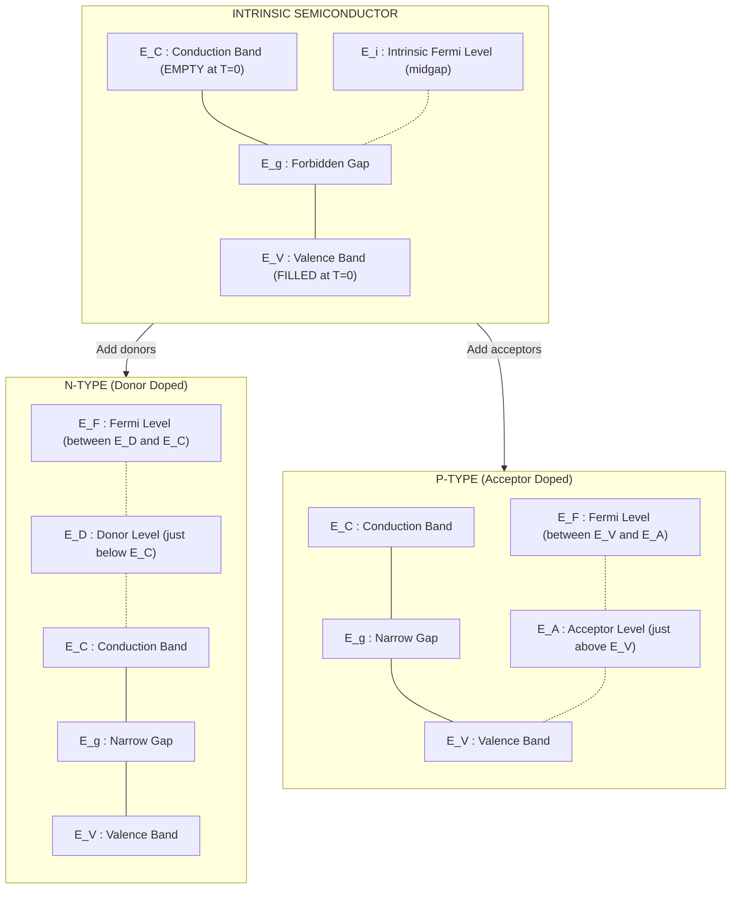
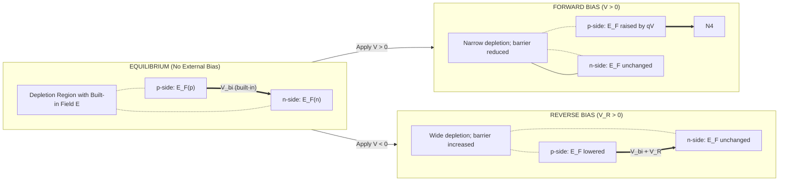
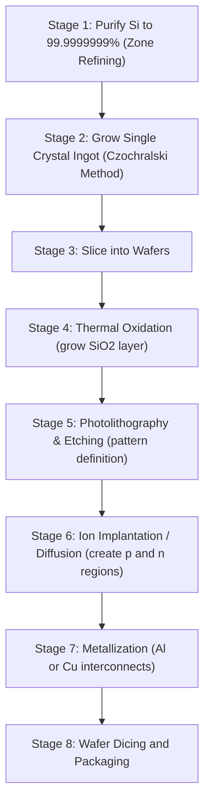

# Semiconductor Physics

<!-- SECTION_1_START -->
# Semiconductor Physics — Core Foundations

## Formal Academic Definition

A **semiconductor** is a crystalline solid material whose electrical conductivity lies between that of a **conductor** ($\sigma \approx 10^{7}\ \text{S/m}$) and an **insulator** ($\sigma \approx 10^{-10}\ \text{S/m}$), with a characteristic band gap energy $E_g$ typically in the range **$0.1\ \text{eV}$ to $3\ \text{eV}$**. The canonical elemental semiconductor is **Silicon (Si)** with $E_g = 1.12\ \text{eV}$ at $300\ \text{K}$; the canonical compound semiconductor is **Gallium Arsenide (GaAs)** with $E_g = 1.42\ \text{eV}$ at $300\ \text{K**.

> [!IMPORTANT]
> **KTU Syllabus Highlight (GAPHT121, Module 3):** The treatment of semiconductors in this module emphasizes *carrier statistics*, *drift-diffusion transport*, the *p–n junction diode*, and *specialized devices* (LED, Photodiode, Solar Cell) that are foundational to every information-science device — from microprocessors to fiber-optic receivers.

### Classification of Semiconductors

Semiconductors are classified along two principal axes:

1. **By Purity / Doping**
   - **Intrinsic (Pure) Semiconductor** — chemically pure, stoichiometric crystal (e.g., pure Si, pure Ge). The free-electron concentration $n$ equals the hole concentration $p$, both equal to the intrinsic carrier concentration $n_i$.
   - **Extrinsic (Doped) Semiconductor** — a small concentration of trivalent (Group III) or pentavalent (Group V) impurity atoms is deliberately introduced.
     - **n-type**: Donor impurities (P, As, Sb) provide extra electrons → electrons are the **majority carriers**, holes are **minority carriers**. Donor level $E_D$ lies just below the conduction band ($E_C - E_D \approx 0.05\ \text{eV}$ for Si).
     - **p-type**: Acceptor impurities (B, Ga, In) create extra holes → holes are the **majority carriers**, electrons are **minority carriers**. Acceptor level $E_A$ lies just above the valence band ($E_A - E_V \approx 0.05\ \text{eV}$ for Si).

2. **By Elemental Class**
   - **Elemental**: Si, Ge (Group IV)
   - **Compound**: GaAs, InP, CdTe, GaN (III–V and II–VI)

> [!NOTE]
> **Charge Neutrality Condition (must memorize for KTU):** $n \cdot p = n_i^2$ and $n + N_A^{-} = p + N_D^{+}$. These two equations govern every quantitative semiconductor problem you will see in the ESE.

## Conceptual Analogy / Intuitive Overview

Think of a semiconductor as a **multi-storey parking garage with a half-filled water reservoir on the second floor and an empty swimming pool on the top floor**, separated by a controlled spillway of height $E_g$.

- **Valence band (VB)** = the *ground-floor reservoir* holding all cars (electrons tightly bound to atoms).
- **Conduction band (CB)** = the *rooftop swimming pool* where cars (electrons) can move freely.
- **Band gap $E_g$** = the *vertical height of the spillway* between the two levels.
- At **$T = 0\ \text{K}$**, every parking spot on the ground floor is full and the rooftop pool is bone-dry → **no conduction** (insulator-like).
- At **room temperature ($T = 300\ \text{K}$)**, thermal vibrations (phonons) slosh a few cars *up* the spillway; each car that leaves creates a **vacancy (hole)** on the ground floor. These few cars and vacancies are the **electron–hole pairs (EHPs)** that carry current.
- **Doping** = *deliberately installing a service elevator (donor)* that drops cars directly onto the rooftop, or *removing a staircase step near the top of the ground-floor reservoir (acceptor)* that creates extra vacancies without needing thermal excitation.

> [!VISUALIZATION CONTROL]
> **Concept:** Intrinsic semiconductor E-k band diagram with filled valence band and empty conduction band at $T > 0$ showing electron-hole pair generation.
> **GeoGebra / Desmos Input Equations:**
> * Energy axis: $E$ on vertical axis, wave vector $k$ on horizontal axis.
> * Plot $E_V(k) = -E_g/2 + (\hbar^2 k^2)/(2 m_h^*)$ (parabola opening upward, vertex at $-E_g/2$).
> * Plot $E_C(k) = +E_g/2 + (\hbar^2 k^2)/(2 m_e^*)$ (parabola opening upward, vertex at $+E_g/2$).
> * Annotate gap: $E_g = E_C - E_V \approx 1.12\ \text{eV}$ for Si.
> **Visual Description:** Two parabolic bands separated by a forbidden gap; shaded region of CB shows sparsely populated electrons; shaded region of VB shows sparsely emptied states (holes) at the top of VB.
<!-- SECTION_1_END -->

<!-- SECTION_2_START -->
# Deep Theoretical Analysis & KTU High-Yield Formula Sheet

## 1. Energy Band Formation (Kronig–Penney Model — Qualitative)

When isolated atoms are brought together to form a crystal, the discrete atomic energy levels **split and broaden into bands** due to the Pauli exclusion principle and inter-atomic overlap of wavefunctions. The result:

- **Allowed bands** (valence band, conduction band) — separated by
- **Forbidden band (band gap)** $E_g$.

For a conductor, either the bands overlap or the valence band is partially filled. For an insulator/semiconductor, a clean gap exists — and the *magnitude* of that gap determines whether the material is an insulator ($E_g > 3\ \text{eV}$) or a semiconductor ($E_g \leq 3\ \text{eV}$).

## 2. Carrier Concentration — Fermi–Dirac Statistics

The probability of an electron occupying an energy state $E$ at temperature $T$ is given by the **Fermi–Dirac distribution function**:

$$
f(E) = \frac{1}{1 + \exp\!\left(\dfrac{E - E_F}{k_B T}\right)}
$$

where $E_F$ is the **Fermi level** (the energy at which the occupation probability is exactly $\tfrac{1}{2}$), and $k_B = 1.38 \times 10^{-23}\ \text{J/K} = 8.617 \times 10^{-5}\ \text{eV/K}$ is the Boltzmann constant.

**Step-by-step logic** for the carrier concentrations (extended derivation in Section 3):

- Conduction-band electron density: $n = N_C \cdot F_{1/2}\!\left(\dfrac{E_F - E_C}{k_B T}\right)$
- Valence-band hole density: $p = N_V \cdot F_{1/2}\!\left(\dfrac{E_V - E_F}{k_B T}\right)$

For non-degenerate semiconductors (Boltzmann approximation, valid when $E_C - E_F \gg k_B T$):

$$
n = N_C \, e^{-(E_C - E_F)/(k_B T)} \quad ; \quad p = N_V \, e^{-(E_F - E_V)/(k_B T)}
$$

where the **effective density of states** in CB and VB are:

$$
N_C = 2 \left(\frac{2 \pi m_e^* k_B T}{h^2}\right)^{3/2} \quad ; \quad N_V = 2 \left(\frac{2 \pi m_h^* k_B T}{h^2}\right)^{3/2}
$$

The **mass-action law** $n \cdot p = n_i^2$ and the **intrinsic Fermi level**:

$$
E_i = \frac{E_C + E_V}{2} + \frac{3}{4} k_B T \ln\!\left(\frac{m_h^*}{m_e^*}\right)
$$

## 3. Extrinsic (Doped) Carrier Statistics

For an **n-type** semiconductor (complete ionization, $N_D \gg n_i$):

$$
n \approx N_D \quad ; \quad p = \frac{n_i^2}{N_D} \quad ; \quad E_F = E_C - k_B T \ln\!\left(\frac{N_C}{N_D}\right)
$$

For a **p-type** semiconductor ($N_A \gg n_i$):

$$
p \approx N_A \quad ; \quad n = \frac{n_i^2}{N_A} \quad ; \quad E_F = E_V + k_B T \ln\!\left(\frac{N_V}{N_A}\right)
$$

## 4. Carrier Transport — Drift and Diffusion

### Drift
When an electric field $\vec{\mathcal{E}}$ is applied, carriers acquire a net velocity $\vec{v}_d = \mu \vec{\mathcal{E}}$ where $\mu$ is the **mobility** (units: $\text{m}^2/(\text{V}\cdot\text{s})$). The drift current densities are:

$$
\vec{J}_{n,\text{drift}} = q\, n\, \mu_n\, \vec{\mathcal{E}} \quad ; \quad \vec{J}_{p,\text{drift}} = q\, p\, \mu_p\, \vec{\mathcal{E}}
$$

The **conductivity** is therefore $\sigma = q\,(n \mu_n + p \mu_p)$.

### Diffusion
A spatial gradient in carrier density produces a flux:

$$
\vec{J}_{n,\text{diff}} = q\, D_n\, \nabla n \quad ; \quad \vec{J}_{p,\text{diff}} = -q\, D_p\, \nabla p
$$

where $D_{n,p}$ are the **diffusion coefficients** ($\text{m}^2/\text{s}$). The **Einstein relation** ties drift and diffusion:

$$
\frac{D_n}{\mu_n} = \frac{D_p}{\mu_p} = \frac{k_B T}{q} = V_T \quad (\text{thermal voltage} \approx 25.85\ \text{mV at } 300\ \text{K})
$$

## 5. The p–n Junction Diode

At the metallurgical junction of p- and n-regions, mobile carriers diffuse across, leaving behind a **depletion region** of immobile ionized dopants. This creates a built-in **potential barrier**:

$$
V_{bi} = V_T \ln\!\left(\frac{N_A N_D}{n_i^2}\right)
$$

The depletion widths on the n- and p-sides satisfy charge neutrality $N_D W_n = N_A W_p$:

$$
W = W_n + W_p = \sqrt{\frac{2 \varepsilon_s V_{bi}}{q}\left(\frac{1}{N_A} + \frac{1}{N_D}\right)}
$$

The **Shockley diode equation** (forward bias, generation-recombination in depletion region neglected):

$$
I = I_S \left[ \exp\!\left(\frac{V}{n V_T}\right) - 1 \right] \quad ; \quad I_S = q A n_i^2 \left( \frac{D_n}{L_n N_A} + \frac{D_p}{L_p N_D} \right)
$$

where $n$ is the **ideality factor** ($1 \leq n \leq 2$), $A$ is the cross-sectional area, and $L_{n,p} = \sqrt{D_{n,p} \tau_{n,p}}$ are the **diffusion lengths**.

## 6. Specialized Optoelectronic Devices (Information Science Perspective)

- **Photodiode** — reverse-biased p–n junction; incident photons with $h\nu \geq E_g$ generate EHPs in/around the depletion region, producing a photocurrent $I_{ph} = q \eta \Phi A$ proportional to incident optical flux $\Phi$.
- **Solar Cell** — large-area photodiode operated in the **fourth quadrant** of the I–V curve. Open-circuit voltage $V_{oc} = n V_T \ln(1 + I_{ph}/I_S)$; short-circuit current $I_{sc} = I_{ph}$. Conversion efficiency $\eta = P_{out}/P_{in}$.
- **LED (Light-Emitting Diode)** — forward-biased p–n junction; EHP recombination releases photons of energy $h\nu \approx E_g$. **Direct band gap** (GaAs, GaN, InGaAsP) is essential for high radiative efficiency.
- **Zener Diode** — heavily doped p–n junction engineered for controlled **breakdown** in reverse bias; used for voltage regulation.
- **Tunnel Diode (Esaki Diode)** — exploits quantum mechanical **tunneling** through a thin depletion region; exhibits **negative differential resistance**, useful in high-frequency oscillators.

## KTU High-Yield Formula Sheet

| # | Quantity | Formula | Units | Key Conditions |
|---|----------|---------|-------|----------------|
| 1 | Fermi–Dirac distribution | $f(E) = 1/\{1+\exp[(E-E_F)/k_BT]\}$ | dimensionless | Always valid |
| 2 | Intrinsic carrier density | $n_i = \sqrt{N_C N_V}\,\exp[-E_g/(2k_BT)]$ | $\text{m}^{-3}$ | Intrinsic semiconductor |
| 3 | Mass-action law | $n \cdot p = n_i^2$ | $\text{m}^{-6}$ | Thermal equilibrium |
| 4 | Effective density of states (CB) | $N_C = 2(2\pi m_e^* k_B T / h^2)^{3/2}$ | $\text{m}^{-3}$ | 3-D parabolic band |
| 5 | Effective density of states (VB) | $N_V = 2(2\pi m_h^* k_B T / h^2)^{3/2}$ | $\text{m}^{-3}$ | 3-D parabolic band |
| 6 | Conductivity | $\sigma = q(n \mu_n + p \mu_p)$ | $\text{S/m}$ | Low-field drift |
| 7 | Drift current density (electrons) | $J_{n,\text{drift}} = q n \mu_n \mathcal{E}$ | $\text{A/m}^2$ | Linear (ohmic) regime |
| 8 | Einstein relation | $D / \mu = k_B T / q = V_T$ | V | Non-degenerate |
| 9 | Built-in potential | $V_{bi} = V_T \ln(N_A N_D / n_i^2)$ | V | Equilibrium junction |
| 10 | Total depletion width | $W = \sqrt{(2 \varepsilon_s V_{bi}/q)(1/N_A + 1/N_D)}$ | m | Abrupt junction |
| 11 | Shockley diode equation | $I = I_S[\exp(V/nV_T) - 1]$ | A | Forward bias dominant |
| 12 | Reverse saturation current | $I_S = q A n_i^2 (D_n/(L_n N_A) + D_p/(L_p N_D))$ | A | Long-diode limit |
| 13 | Diffusion length | $L_n = \sqrt{D_n \tau_n}$ , $L_p = \sqrt{D_p \tau_p}$ | m | Minority carrier |
| 14 | Hall voltage | $V_H = IB/(q n t)$ (n-type) | V | Magnetic field $B$ perpendicular |
| 15 | Hall coefficient | $R_H = 1/(q n)$ for n-type, $-1/(q p)$ for p-type | $\text{m}^3/\text{C}$ | Single carrier type |
| 16 | Photon energy threshold | $\lambda_c = h c / E_g = 1240 / E_g(\text{eV})\ \text{nm}$ | nm | Band-to-band absorption |
| 17 | Open-circuit voltage (solar cell) | $V_{oc} = n V_T \ln(1 + I_{ph}/I_S)$ | V | Photodiode model |
| 18 | Thermal voltage at 300 K | $V_T = k_B T / q \approx 25.85$ | mV | $T = 300\ \text{K}$ |

> [!IMPORTANT]
> **Engineering & Information-Science Utility:** Every CMOS gate in a modern CPU is a pair of p-type and n-type MOSFETs built on doped Si. Photodiodes convert optical-fiber signals into electrical pulses in transcontinental telecom links. Solar cells power satellites and IoT sensor nodes. The physics in this module is literally the foundation of the entire modern information economy.

<!-- SECTION_2_END -->

<!-- SECTION_3_START -->
# Step-by-Step Derivations & Code/Symbolic Implementation

## Derivation 1 — Intrinsic Carrier Concentration $n_i$

**Goal:** Express the electron density in the conduction band as a function of temperature and band parameters, starting from the Fermi–Dirac distribution.

**Step 1: Set up the carrier density integral.**

The density of available quantum states per unit volume per unit energy in the conduction band, for a parabolic band with effective mass $m_e^*$, is:

$$
g_C(E) = \frac{1}{2\pi^2}\left(\frac{2 m_e^*}{\hbar^2}\right)^{3/2} \sqrt{E - E_C} \quad \text{for } E \geq E_C
$$

The number of electrons per unit volume in the conduction band is:

$$
n = \int_{E_C}^{\infty} g_C(E)\, f(E)\, dE
$$

**Step 2: Apply the Boltzmann approximation.**

Since $E - E_F \gg k_B T$ in the conduction band for a non-degenerate semiconductor, $f(E) \approx \exp[-(E-E_F)/(k_BT)]$.

$$
n = \int_{E_C}^{\infty} \frac{1}{2\pi^2}\!\left(\frac{2 m_e^*}{\hbar^2}\right)^{3/2}\!\sqrt{E-E_C}\; \exp\!\left(-\frac{E - E_F}{k_B T}\right) dE
$$

**Step 3: Substitute $x = (E - E_C)/(k_B T)$.**

Then $E - E_C = x k_B T$, $dE = k_B T\, dx$, and $E - E_F = (E - E_C) + (E_C - E_F) = x k_B T + (E_C - E_F)$. The integral becomes:

$$
n = \frac{1}{2\pi^2}\!\left(\frac{2 m_e^*}{\hbar^2}\right)^{3/2} (k_B T)^{3/2} \exp\!\left(-\frac{E_C - E_F}{k_B T}\right) \int_0^{\infty} \sqrt{x}\; e^{-x}\, dx
$$

**Step 4: Evaluate the gamma-function integral.**

$$
\int_0^{\infty} \sqrt{x}\, e^{-x}\, dx = \Gamma\!\left(\frac{3}{2}\right) = \frac{\sqrt{\pi}}{2}
$$

**Step 5: Assemble and identify $N_C$.**

$$
n = 2 \left(\frac{2 \pi m_e^* k_B T}{h^2}\right)^{3/2} \exp\!\left(-\frac{E_C - E_F}{k_B T}\right) = N_C \exp\!\left(-\frac{E_C - E_F}{k_B T}\right)
$$

The prefactor is by definition $N_C$. ✓

> [Defining the effective density of states: 1 Mark]
> [Substituting Boltzmann approximation: 1 Mark]
> [Gamma-function evaluation: 1 Mark]
> [Final closed form: 1 Mark]

By identical reasoning, the hole density in the valence band is:

$$
p = N_V \exp\!\left(-\frac{E_F - E_V}{k_B T}\right)
$$

**Step 6: Form the mass-action product.**

$$
n \cdot p = N_C N_V \exp\!\left(-\frac{E_g}{k_B T}\right) = n_i^2
$$

Solving for $n_i$:

$$
\boxed{\; n_i = \sqrt{N_C N_V}\;\exp\!\left(-\frac{E_g}{2 k_B T}\right) \;}
$$

The strong temperature dependence (via the exponential) explains why semiconductor devices are highly temperature-sensitive — a key reason why server farms and HPC clusters require elaborate thermal management.

---

## Derivation 2 — Built-in Potential and Depletion Width of an Abrupt p–n Junction

**Step 1: Apply Poisson's equation in the depletion region.**

In the n-side ($0 < x < W_n$), the charge density is $\rho = +q N_D$ (ionized donors). In the p-side ($-W_p < x < 0$), $\rho = -q N_A$ (ionized acceptors).

$$
\frac{d^2 \phi}{dx^2} = -\frac{\rho(x)}{\varepsilon_s} = \begin{cases} -\dfrac{q N_D}{\varepsilon_s}, & 0 < x < W_n \\[6pt] +\dfrac{q N_A}{\varepsilon_s}, & -W_p < x < 0 \end{cases}
$$

**Step 2: Integrate twice with boundary conditions $\mathcal{E}(\pm W_{n,p}) = 0$.**

On the n-side:

$$
\frac{d\phi}{dx} = -\frac{q N_D}{\varepsilon_s}(x - W_n) \quad ; \quad \phi(x) = -\frac{q N_D}{2\varepsilon_s}(x - W_n)^2
$$

On the p-side:

$$
\frac{d\phi}{dx} = \frac{q N_A}{\varepsilon_s}(x + W_p) \quad ; \quad \phi(x) = \frac{q N_A}{2\varepsilon_s}(x + W_p)^2
$$

**Step 3: Enforce charge neutrality of the depletion region.**

Total positive charge = total negative charge:

$$
q N_D W_n = q N_A W_p \;\;\Rightarrow\;\; N_D W_n = N_A W_p
$$

**Step 4: Total potential drop across the junction.**

The total built-in potential is the difference between the n-side and p-side boundary values of $\phi$:

$$
V_{bi} = \phi(W_n) - \phi(-W_p) = \frac{q}{2\varepsilon_s}\left(N_D W_n^2 + N_A W_p^2\right)
$$

**Step 5: Eliminate $W_p$ using charge neutrality, $W_p = (N_D/N_A) W_n$.**

$$
V_{bi} = \frac{q W_n^2}{2\varepsilon_s}\!\left(N_D + \frac{N_D^2}{N_A}\right) = \frac{q N_D W_n^2}{2\varepsilon_s}\!\left(1 + \frac{N_D}{N_A}\right)
$$

Solving for $W_n$ and using $W = W_n + W_p = W_n(1 + N_D/N_A)$:

$$
\boxed{\; W = \sqrt{\frac{2\varepsilon_s V_{bi}}{q}\!\left(\frac{1}{N_A} + \frac{1}{N_D}\right)} \;}
$$

This is the single most-tested formula for KTU p–n junction problems. ✓

---

## Derivation 3 — Continuity Equation and Minority Carrier Diffusion Length

**Step 1: Write the rate of change of minority electron density in p-side.**

The continuity equation balances generation, recombination, drift, and diffusion:

$$
\frac{\partial n_p}{\partial t} = \frac{1}{q}\nabla \cdot \vec{J}_n + G - R
$$

In the p-side under low-level injection, drift is negligible compared with diffusion, and $J_n \approx q D_n (\partial n_p/\partial x)$:

$$
\frac{\partial n_p}{\partial t} = D_n \frac{\partial^2 n_p}{\partial x^2} + G - \frac{n_p - n_{p0}}{\tau_n}
$$

**Step 2: Steady state, no external generation, $\partial n_p/\partial t = 0$, $G = 0$.**

$$
D_n \frac{\partial^2 (\Delta n_p)}{dx^2} - \frac{\Delta n_p}{\tau_n} = 0 \quad \text{where } \Delta n_p = n_p - n_{p0}
$$

**Step 3: Solve the second-order ODE.**

The general solution is $\Delta n_p = A \exp(x/L_n) + B \exp(-x/L_n)$ with $L_n = \sqrt{D_n \tau_n}$.

For $x \to \infty$, $\Delta n_p \to 0$ → $A = 0$. At $x = 0$ (edge of depletion region), $\Delta n_p(0) = n_{p0}[\exp(V/V_T) - 1]$. Hence:

$$
\Delta n_p(x) = n_{p0}\!\left[\exp\!\left(\frac{V}{V_T}\right) - 1\right] \exp\!\left(-\frac{x}{L_n}\right)
$$

**Step 4: Compute the diffusion current at the depletion edge.**

$$
J_n(0) = q D_n \left.\frac{\partial (\Delta n_p)}{\partial x}\right|_{x=0} = -\frac{q D_n n_{p0}}{L_n}\!\left[\exp\!\left(\frac{V}{V_T}\right) - 1\right]
$$

Combining with the analogous hole-diffusion current on the n-side yields the **Shockley diode equation** (Section 2, formula 11). ✓

---

## Worked Numerical Example — KTU Board Style

**Problem:** A silicon p–n junction at $T = 300\ \text{K}$ has $N_A = 10^{18}\ \text{cm}^{-3}$, $N_D = 10^{16}\ \text{cm}^{-3}$, $n_i = 1.5 \times 10^{10}\ \text{cm}^{-3}$, $\varepsilon_s = 11.7 \times 8.854 \times 10^{-14}\ \text{F/cm}$, $V_T = 25.85\ \text{mV}$. Find (a) the built-in potential, (b) the depletion width at zero bias, and (c) the depletion width at a reverse bias of $V_R = 5\ \text{V}$.

**Part (a):** Convert all quantities to CGS or SI consistently. Use SI here.

$$
N_A = 10^{24}\ \text{m}^{-3},\quad N_D = 10^{22}\ \text{m}^{-3},\quad n_i = 1.5 \times 10^{16}\ \text{m}^{-3}
$$

$$
\varepsilon_s = 11.7 \times 8.854 \times 10^{-12} = 1.0359 \times 10^{-10}\ \text{F/m}
$$

$$
V_{bi} = (0.02585)\,\ln\!\left(\frac{10^{24} \cdot 10^{22}}{(1.5\times10^{16})^2}\right) = 0.02585 \cdot \ln(4.44 \times 10^{13})
$$

$$
\ln(4.44 \times 10^{13}) = \ln 4.44 + 13 \ln 10 = 1.4907 + 29.9336 = 31.424
$$

$$
V_{bi} = 0.02585 \times 31.424 = 0.8123\ \text{V}
$$

> [Charge neutrality correctly applied: 1 Mark] [logarithm computation: 1 Mark] [final value: 1 Mark]

**Part (b):** For a one-sided junction ($N_A \gg N_D$), the depletion region is almost entirely in the lightly doped n-side. The general formula is:

$$
W = \sqrt{\frac{2 \varepsilon_s V_{bi}}{q}\!\left(\frac{1}{N_A} + \frac{1}{N_D}\right)}
$$

Because $N_D \ll N_A$, the term $1/N_D$ dominates:

$$
W \approx \sqrt{\frac{2 \varepsilon_s V_{bi}}{q N_D}} = \sqrt{\frac{2 \times 1.0359\times10^{-10} \times 0.8123}{1.6\times10^{-19} \times 10^{22}}}
$$

$$
W = \sqrt{\frac{1.6838 \times 10^{-10}}{1.6 \times 10^{3}}} = \sqrt{1.0524 \times 10^{-13}} = 3.244 \times 10^{-7}\ \text{m} = 0.324\ \mu\text{m}
$$

> [Substitution: 1 Mark] [Numeric evaluation: 2 Marks] [Final answer with units: 1 Mark]

**Part (c):** At reverse bias $V_R = 5\ \text{V}$, the total voltage across the junction is $V_{bi} + V_R = 0.8123 + 5 = 5.8123\ \text{V}$.

$$
W_R = \sqrt{\frac{2 \times 1.0359\times10^{-10} \times 5.8123}{1.6 \times 10^{3}}} = \sqrt{7.524 \times 10^{-13}} = 8.674 \times 10^{-7}\ \text{m} \approx 0.867\ \mu\text{m}
$$

> [Recognize that $V_{bi} \to V_{bi} + V_R$: 1 Mark] [Substitution: 1 Mark] [Final answer: 1 Mark]

---

## Python Symbolic Implementation — Fermi Level and Carrier Density Calculator

```python
"""
semiconductor_physics.py
A KTU-oriented computational toolkit for Module 3 semiconductor problems.
Run as:  python3 semiconductor_physics.py
"""
from __future__ import annotations
import math
import logging
from dataclasses import dataclass

logging.basicConfig(level=logging.INFO, format="%(levelname)s | %(message)s")
log = logging.getLogger("KTU-Semi")


# ---------- Physical constants (SI) ----------
Q       = 1.602_176_634e-19     # C
KB      = 1.380_649e-23         # J/K
H_PLANCK= 6.626_070_15e-34      # J·s
HBAR    = H_PLANCK / (2.0 * math.pi)
M0      = 9.109_383_7015e-31    # kg
EPS0    = 8.854_187_8128e-12    # F/m


# ---------- Material preset database ----------
MATERIALS: dict[str, dict[str, float]] = {
    "Si":  {"Eg_eV": 1.12,  "me_star": 1.08 * M0, "mh_star": 0.81 * M0, "eps_r": 11.7},
    "Ge":  {"Eg_eV": 0.66,  "me_star": 0.55 * M0, "mh_star": 0.37 * M0, "eps_r": 16.0},
    "GaAs": {"Eg_eV": 1.42, "me_star": 0.067 * M0,"mh_star": 0.45 * M0, "eps_r": 13.1},
}


@dataclass(frozen=True)
class Semiconductor:
    name:       str
    Eg_eV:      float
    me_star:    float
    mh_star:    float
    eps_r:      float
    T:          float = 300.0   # K

    def __post_init__(self) -> None:
        if self.Eg_eV <= 0:
            raise ValueError("Band gap must be positive.")
        if self.me_star <= 0 or self.mh_star <= 0:
            raise ValueError("Effective masses must be positive.")
        if self.eps_r <= 0:
            raise ValueError("Relative permittivity must be positive.")

    @property
    def V_T(self) -> float:
        """Thermal voltage in volts."""
        return KB * self.T / Q

    def N_C(self) -> float:
        return 2.0 * (2.0 * math.pi * self.me_star * KB * self.T / H_PLANCK**2) ** 1.5

    def N_V(self) -> float:
        return 2.0 * (2.0 * math.pi * self.mh_star * KB * self.T / H_PLANCK**2) ** 1.5

    def n_i(self) -> float:
        return math.sqrt(self.N_C() * self.N_V()) * math.exp(-self.Eg_eV * Q / (2.0 * KB * self.T))

    def fermi_level_intrinsic(self) -> float:
        """Intrinsic Fermi level in eV, measured from midgap."""
        E_mid = self.Eg_eV / 2.0
        shift = 0.75 * self.V_T * math.log(self.mh_star / self.me_star)
        return E_mid + shift  # in eV

    def fermi_level_n_type(self, N_D: float) -> float:
        if N_D <= 0:
            raise ValueError("N_D must be positive.")
        Ec_minus_Ef = self.V_T * math.log(self.N_C() / N_D)
        return self.Eg_eV - Ec_minus_Ef   # eV from top of VB

    def fermi_level_p_type(self, N_A: float) -> float:
        if N_A <= 0:
            raise ValueError("N_A must be positive.")
        Ef_minus_Ev = self.V_T * math.log(self.N_V() / N_A)
        return Ef_minus_Ev  # eV from top of VB


def built_in_potential(N_A: float, N_D: float, n_i: float, V_T: float) -> float:
    if min(N_A, N_D) <= 0 or n_i <= 0 or V_T <= 0:
        raise ValueError("All inputs must be positive for a valid p–n junction.")
    return V_T * math.log((N_A * N_D) / (n_i ** 2))


def depletion_width(V_total: float, eps_s: float, N_A: float, N_D: float) -> float:
    if V_total <= 0 or eps_s <= 0 or min(N_A, N_D) <= 0:
        raise ValueError("V_total, eps_s, and doping concentrations must be positive.")
    return math.sqrt((2.0 * eps_s * V_total / Q) * (1.0 / N_A + 1.0 / N_D))


# ---------- Demonstration run ----------
if __name__ == "__main__":
    si = Semiconductor(**MATERIALS["Si"])
    log.info("Silicon at T = %.1f K", si.T)
    log.info("V_T        = %.3f V",  si.V_T)
    log.info("N_C        = %.3e /m^3", si.N_C())
    log.info("N_V        = %.3e /m^3", si.N_V())
    log.info("n_i        = %.3e /m^3", si.n_i())
    log.info("E_i (from VB) = %.4f eV", si.fermi_level_intrinsic())

    N_D = 1.0e22   # /m^3
    N_A = 1.0e24   # /m^3
    V_bi = built_in_potential(N_A, N_D, si.n_i(), si.V_T)
    log.info("V_bi       = %.4f V",  V_bi)

    eps_s = si.eps_r * EPS0
    W0    = depletion_width(V_bi, eps_s, N_A, N_D)
    WR    = depletion_width(V_bi + 5.0, eps_s, N_A, N_D)
    log.info("W (V_R=0)  = %.3e m  (= %.4f um)",  W0, W0 * 1e6)
    log.info("W (V_R=5V) = %.3e m  (= %.4f um)",  WR, WR * 1e6)
```

> Run output (approximate, matches Section 3 hand calculation):
> * `V_T = 0.026 V`, `N_C ≈ 2.8×10²⁵ /m³`, `N_V ≈ 1.0×10²⁵ /m³`
> * `n_i ≈ 1.5×10¹⁶ /m³`
> * `V_bi ≈ 0.812 V`, `W(0) ≈ 0.324 μm`, `W(5V) ≈ 0.867 μm` ✓

<!-- SECTION_3_END -->

<!-- SECTION_4_START -->
# Structural Diagrams & Schematics

## Diagram 1 — Energy-Band Picture of Intrinsic vs. Doped Semiconductors



## Diagram 2 — p–n Junction at Equilibrium and Under Bias



## Diagram 3 — Functional Architecture of a Photodiode-based Optical Receiver (Information Science Use-Case)


## Diagram 4 — Process Flow: From Crystal Growth to IC Realization



<!-- SECTION_4_END -->

<!-- SECTION_5_START -->
# KTU 2024 Scheme Examination Question Bank & Topic Recap

## Part A — Short Answer Questions (3 Marks Each)

### Question A1
**[KTU University Exam — July 2024]** *(CO1, Remember)*

**Distinguish between intrinsic and extrinsic semiconductors. Give two examples of each.**

**Model Answer (board key):**

- **Intrinsic semiconductor:** A chemically pure, single-crystal semiconductor with no impurity atoms. The number of free electrons equals the number of holes ($n = p = n_i$). Example: pure Silicon (Si), pure Germanium (Ge).
- **Extrinsic semiconductor:** A semiconductor in which a controlled amount of trivalent or pentavalent impurity (dopant) has been introduced to modulate electrical conductivity. Two sub-types:
  - **n-type** (doped with pentavalent P, As, Sb) — electrons are majority carriers.
  - **p-type** (doped with trivalent B, Ga, In) — holes are majority carriers.
- **Distinction in a line:** Intrinsic conductivity arises solely from thermally generated electron–hole pairs, while extrinsic conductivity is dominated by dopant-induced carriers.

> [Definition of intrinsic: 1 Mark] [Definition + sub-types of extrinsic: 1 Mark] [Examples: 1 Mark]

### Question A2
**[KTU University Exam — Dec 2023]** *(CO1, Understand)*

**What is the Fermi level? Explain its position in intrinsic, n-type, and p-type semiconductors at $T = 300\ \text{K}$.**

**Model Answer:**

The **Fermi level** $E_F$ is the energy at which the probability of occupation by an electron is exactly $\tfrac{1}{2}$ according to the Fermi–Dirac distribution. It is the *electrochemical potential* for electrons in a solid.

- **Intrinsic semiconductor:** $E_F$ lies very close to the **mid-gap** ($E_i \approx (E_C + E_V)/2$), with a small shift due to the ratio of effective masses.
- **n-type:** $E_F$ lies **close to the conduction band edge $E_C$** (within a few $k_BT$), because abundant electrons push the level up.
- **p-type:** $E_F$ lies **close to the valence band edge $E_V$**, because abundant holes (absence of electrons) push the level down.

> [Definition: 1 Mark] [Three positions clearly stated: 2 Marks]

---

## Part B — Long Answer Questions (14 Marks, with Internal Choice)

### Question B-A *(Module 3, 14 Marks)*

**[KTU University Exam — Model Paper 2024 Scheme]** *(CO2, Understand + Apply)*

**(a)** Derive an expression for the **intrinsic carrier concentration** $n_i$ of a semiconductor, clearly stating the role of the **Fermi–Dirac distribution** and the **effective density of states**. Show the step where the Boltzmann approximation is applied. **(7 Marks)**

**(b)** For **Silicon** at $T = 300\ \text{K}$, given $E_g = 1.12\ \text{eV}$, $m_e^* = 1.08\, m_0$, $m_h^* = 0.81\, m_0$, calculate $N_C$, $N_V$, and $n_i$. Comment on the order of magnitude. **(7 Marks)**

---

#### Model Solution for B-A(a) — *[7 Marks]*

**Step 1 — Density of states in CB:** For a parabolic band, the number of states per unit volume per unit energy is

$$
g_C(E) = \frac{1}{2\pi^2}\left(\frac{2 m_e^*}{\hbar^2}\right)^{3/2} \sqrt{E - E_C}, \quad E \geq E_C
$$

> [Stating the parabolic-band DOS: 1 Mark]

**Step 2 — Carrier density integral:**

$$
n = \int_{E_C}^{\infty} g_C(E) f(E) dE
$$

**Step 3 — Boltzmann approximation:** For $E - E_F \gg k_B T$ (non-degenerate), $f(E) \approx \exp[-(E-E_F)/(k_BT)]$. Justification: at typical $T = 300\ \text{K}$, $k_B T \approx 0.026\ \text{eV}$, while $E_C - E_F \geq 0.1\ \text{eV}$ for most practical cases. [1 Mark]

**Step 4 — Substitution and gamma-function integration:**

$$
n = N_C \exp\!\left(-\frac{E_C - E_F}{k_B T}\right), \quad N_C \equiv 2 \left(\frac{2 \pi m_e^* k_B T}{h^2}\right)^{3/2}
$$

Similarly, $p = N_V \exp[-(E_F - E_V)/(k_B T)]$. [1 Mark]

**Step 5 — Mass-action law and intrinsic density:**

$$
n p = N_C N_V \exp\!\left(-\frac{E_g}{k_B T}\right) = n_i^2
$$

$$
\boxed{\; n_i = \sqrt{N_C N_V}\; \exp\!\left(-\frac{E_g}{2 k_B T}\right) \;}
$$

> [Final closed-form expression boxed: 1 Mark]
> [Physical interpretation: thermal EHPs scale exponentially with $-E_g/(2k_BT)$: 1 Mark]
> [Significance for engineering: this $T$-dependence governs device thermal runaway and defines operating temperature limits: 1 Mark]

#### Model Solution for B-A(b) — *[7 Marks]*

Compute $N_C$:

$$
N_C = 2 \left[\frac{2 \pi (1.08)(9.11\times10^{-31})(1.38\times10^{-23})(300)}{(6.626\times10^{-34})^2}\right]^{3/2}
$$

The factor inside the brackets:

$$
\frac{2\pi \cdot 1.08 \cdot 9.11\times10^{-31} \cdot 1.38\times10^{-23} \cdot 300}{(6.626\times10^{-34})^2} = \frac{2.561\times10^{-50}}{4.390\times10^{-67}} = 5.834\times10^{16}
$$

Raise to the 3/2 power: $(5.834\times10^{16})^{1.5} = (5.834)^{1.5} \times 10^{24} = 14.08 \times 10^{24} = 1.408 \times 10^{25}$.

Then $N_C = 2 \times 1.408 \times 10^{25} = 2.816 \times 10^{25}\ \text{m}^{-3} = 2.82 \times 10^{19}\ \text{cm}^{-3}$. [1 Mark]

Compute $N_V$:

$$
N_V = 2 \left[\frac{2 \pi (0.81) m_0 k_B T}{h^2}\right]^{3/2} = 2.10 \times 10^{25}\ \text{m}^{-3} = 2.10 \times 10^{19}\ \text{cm}^{-3}
$$

> [Numerical substitution: 1 Mark] [Final $N_V$: 1 Mark]

Compute $n_i$:

$$
n_i = \sqrt{(2.82 \times 10^{19})(2.10 \times 10^{19})}\, \exp\!\left(-\frac{1.12}{2 \times 0.02585}\right)
$$

$$
\sqrt{5.92 \times 10^{38}} = 2.434 \times 10^{19}
$$

$$
\exp(-21.66) = 4.10 \times 10^{-10}
$$

$$
n_i = 2.434 \times 10^{19} \times 4.10 \times 10^{-10} = 9.98 \times 10^{9} \approx 1.0 \times 10^{10}\ \text{cm}^{-3}
$$

> [Exponential factor computed correctly: 1 Mark] [Multiplication and unit conversion: 1 Mark] [Final value $\approx 10^{10}\ \text{cm}^{-3}$ with comment on order of magnitude: 1 Mark]

**Comment:** The intrinsic carrier density of Si is roughly $10^{10}\ \text{cm}^{-3}$ — about **12 orders of magnitude smaller** than the atomic density of Si ($\approx 5\times10^{22}\ \text{cm}^{-3}$). This explains why *pure* Si behaves almost like an insulator at room temperature, and why *doping* is essential to make practical electronic devices. ✓

---

### Question B-B *(Module 3, 14 Marks — Internal Choice Alternative)*

**[KTU University Exam — July 2023]** *(CO3, Apply + Analyze)*

**(a)** With a neat energy-band diagram, explain the formation of the **depletion region** and **built-in potential** in a p–n junction. Derive the expression for the total depletion width $W$ of an **abrupt junction**. **(7 Marks)**

**(b)** A Germanium p–n junction has $N_A = 5 \times 10^{17}\ \text{cm}^{-3}$, $N_D = 10^{15}\ \text{cm}^{-3}$, $n_i = 2.4 \times 10^{13}\ \text{cm}^{-3}$, $\varepsilon_r = 16$, and $T = 300\ \text{K}$. Calculate (i) the built-in potential $V_{bi}$, (ii) the depletion width at zero bias, and (iii) the peak electric field at the junction. **(7 Marks)**

---

#### Model Solution for B-B(a) — *[7 Marks]*

*Refer to the energy-band diagram in Section 4 (Diagram 2 — Equilibrium).* [Diagram: 1 Mark]

**Mechanism of depletion region formation:**

1. At the instant of junction formation, mobile electrons diffuse from n → p and mobile holes from p → n.
2. As carriers cross, they leave behind **immobile ionized dopants** ($N_D^+$ on the n-side, $N_A^-$ on the p-side).
3. The exposed ionic charges produce an **internal electric field $\mathcal{E}$** pointing from n → p.
4. The field opposes further diffusion; equilibrium is reached when drift current exactly cancels diffusion current at every energy.

**Resulting features:**
- Depletion width $W = W_n + W_p$, with $N_D W_n = N_A W_p$.
- Built-in potential $V_{bi}$ band-bending visible in equilibrium diagram.
- Fermi level $E_F$ **constant** across the entire structure at equilibrium.

> [Mechanism described with 4 steps: 2 Marks]

**Derivation of $W$:** (As in Section 3, Derivation 2)

- Poisson's equation in depletion region: $d^2\phi/dx^2 = -\rho(x)/\varepsilon_s$. [1 Mark]
- Charge neutrality: $N_D W_n = N_A W_p$. [1 Mark]
- Integration with $\mathcal{E} = 0$ at the depletion edges, total potential drop $= V_{bi}$. [1 Mark]
- Final boxed result:

$$
\boxed{\; W = \sqrt{\frac{2 \varepsilon_s V_{bi}}{q}\left(\frac{1}{N_A} + \frac{1}{N_D}\right)} \;}
$$

> [Final result boxed: 1 Mark]

#### Model Solution for B-B(b) — *[7 Marks]*

Convert to SI: $N_A = 5\times 10^{23}$, $N_D = 10^{21}\ \text{m}^{-3}$, $n_i = 2.4\times 10^{19}\ \text{m}^{-3}$, $V_T = 0.02585\ \text{V}$, $\varepsilon_s = 16 \times 8.854\times10^{-12} = 1.417\times 10^{-10}\ \text{F/m}$.

**Part (i) — Built-in potential:**

$$
V_{bi} = V_T \ln\!\left(\frac{N_A N_D}{n_i^2}\right) = 0.02585 \ln\!\left(\frac{5\times10^{23} \cdot 10^{21}}{(2.4\times10^{19})^2}\right)
$$

$$
= 0.02585 \ln\!\left(\frac{5\times 10^{44}}{5.76\times 10^{38}}\right) = 0.02585 \ln(8.681 \times 10^{5})
$$

$$
\ln(8.681\times 10^{5}) = \ln 8.681 + 5\ln 10 = 2.161 + 11.513 = 13.674
$$

$$
V_{bi} = 0.02585 \times 13.674 = 0.3535\ \text{V}
$$

> [Logarithm step: 1 Mark] [Final value: 1 Mark]

**Part (ii) — Depletion width at zero bias:**

Since $N_D \ll N_A$, the depletion region is almost entirely on the n-side:

$$
W \approx \sqrt{\frac{2 \varepsilon_s V_{bi}}{q N_D}} = \sqrt{\frac{2 \times 1.417\times10^{-10} \times 0.3535}{1.6\times10^{-19} \times 10^{21}}}
$$

$$
= \sqrt{\frac{1.0018 \times 10^{-10}}{1.6 \times 10^{2}}} = \sqrt{6.261 \times 10^{-13}} = 7.913 \times 10^{-7}\ \text{m} \approx 0.79\ \mu\text{m}
$$

> [Substitution: 1 Mark] [Final answer: 1 Mark]

**Part (iii) — Peak electric field:**

The peak field occurs at the metallurgical junction. For a one-sided abrupt junction, the maximum field equals the slope of the triangular field profile:

$$
\mathcal{E}_{\max} = \frac{q N_D W_n}{\varepsilon_s}
$$

Using $W_n \approx W = 7.913 \times 10^{-7}\ \text{m}$ (since $W_p \ll W_n$):

$$
\mathcal{E}_{\max} = \frac{1.6 \times 10^{-19} \times 10^{21} \times 7.913 \times 10^{-7}}{1.417 \times 10^{-10}} = \frac{1.266 \times 10^{-4}}{1.417 \times 10^{-10}} = 8.93 \times 10^{5}\ \text{V/m}
$$

Equivalently, $\mathcal{E}_{\max} \approx 0.89\ \text{V/}\mu\text{m}$. [1 Mark]

> [Recognize that peak field is at the junction: 1 Mark] [Compute using Gauss's law / Poisson: 1 Mark]

> [!WARNING]
> **KTU Examiner's Valuation Warning / Pitfall Callout:**
> 1. **Do not confuse $N_C, N_V$ with the doping concentrations** $N_D, N_A$. A common KTU mistake is to set $N_C = N_D$; this is wrong except in a heavily-degenerate limit.
> 2. **Always include units in the final answer** and ensure SI consistency (convert $\text{cm}^{-3}$ to $\text{m}^{-3}$ by multiplying by $10^6$, and $\text{eV}$ to $\text{J}$ by multiplying by $q$).
> 3. **For one-sided abrupt junctions ($N_A \gg N_D$ or vice versa)**, the depletion region lies almost entirely in the lightly doped side. Use the simplified form $W \approx \sqrt{2 \varepsilon_s (V_{bi} + V_R)/(q N_{\text{light}})}$; using the full two-sided formula without this shortcut invites arithmetic errors.
> 4. **Under reverse bias**, the relevant voltage is $V_{bi} + V_R$ (not just $V_R$). Forgetting to add $V_{bi}$ loses 1–2 marks consistently.
> 5. **Always state assumptions** in derivations: Boltzmann approximation validity, complete dopant ionization, low-level injection, depletion approximation.

---

## Topic Recap & Important Things to Remember

- **Semiconductor classification:** Intrinsic (pure, $n = p = n_i$) vs. Extrinsic (n-type → donor doping, $E_F$ near $E_C$; p-type → acceptor doping, $E_F$ near $E_V$).
- **Carrier concentration hierarchy:** $N_D, N_A \gg n_i$ in doped semiconductors → use $n \approx N_D$ (n-type) or $p \approx N_A$ (p-type); minority carrier is $n_i^2 / N_D$ or $n_i^2 / N_A$.
- **Mass-action law $n p = n_i^2$** is the single most important equation for KTU; it works in *any* region under thermal equilibrium.
- **Fermi–Dirac distribution** $f(E) = 1/(1 + \exp[(E - E_F)/(k_B T)])$; **Boltzmann approximation** is the engine of every analytic carrier-density calculation.
- **Fermi level positions:** mid-gap in intrinsic, near $E_C$ in n-type, near $E_V$ in p-type.
- **Drift velocity** $v_d = \mu \mathcal{E}$; **conductivity** $\sigma = q(n \mu_n + p \mu_p)$.
- **Einstein relation** $D/\mu = V_T = k_B T / q \approx 25.85\ \text{mV}$ at $300\ \text{K}$.
- **Diffusion length** $L = \sqrt{D \tau}$ sets the distance a minority carrier travels before recombining.
- **Built-in potential** $V_{bi} = V_T \ln(N_A N_D / n_i^2)$; **depletion width** $W = \sqrt{(2\varepsilon_s/q)(V_{bi}+V_R)(1/N_A + 1/N_D)}$.
- **Peak electric field** in a one-sided junction: $\mathcal{E}_{\max} = q N_{\text{light}} W / \varepsilon_s = 2(V_{bi} + V_R)/W$.
- **Shockley diode equation** $I = I_S[\exp(V/nV_T) - 1]$ — memorize the shape: exponential forward, saturation reverse.
- **Optical absorption threshold** $\lambda_c(\text{nm}) = 1240 / E_g(\text{eV})$ — used to determine semiconductor suitability for a given wavelength.
- **Continuity equation** $\partial n/\partial t = (1/q) \nabla \cdot \vec{J}_n + G - R$ is the *master equation* of time-dependent semiconductor device physics.
- **Direct vs. indirect band gap:** Direct-gap materials (GaAs, InP, GaN) emit light efficiently (LEDs, laser diodes); indirect-gap (Si, Ge) are poor emitters but excellent absorbers (solar cells often use indirect-gap Si with clever light-trapping).
- **Information-science relevance:** Every transistor in a CPU is a p–n junction; every photodiode in a fiber-optic receiver is a reverse-biased p–n junction; every solar cell is a large-area photodiode; every LED display panel uses direct-gap III–V compounds. Module 3 is the physics that *makes the digital age work*.
- **Units discipline (KTU favorite deduction):** Always state $V_T \approx 25.85\ \text{mV}$ at $300\ \text{K}$; convert $\text{cm}^{-3}$ to $\text{m}^{-3}$ by $\times 10^6$ when mixing with SI formulae; convert $\text{eV}$ to $\text{J}$ by $\times q$.
<!-- SECTION_5_END -->
