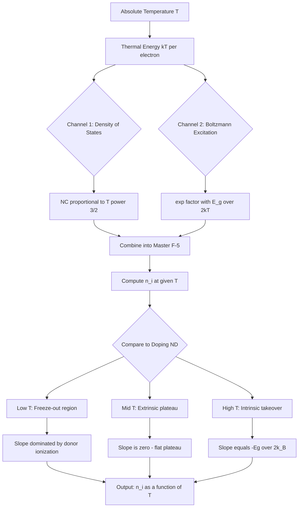
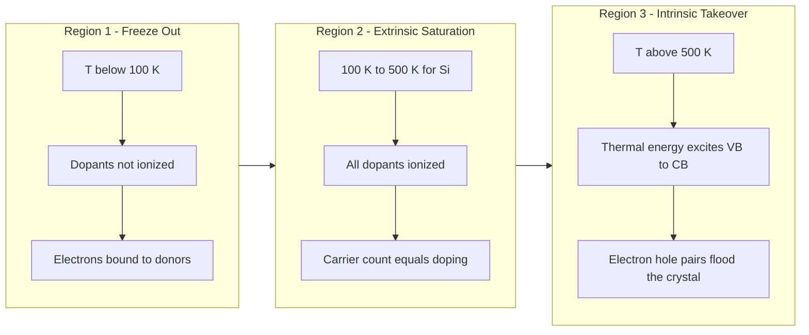

# Variation of Intrinsic carrier concentration with temperature

<!-- SECTION_1_START -->
# Variation of Intrinsic Carrier Concentration with Temperature

> [!IMPORTANT]
> **KTU 2024 Scheme | GAPHT121 | Module 3 | Semiconductor Physics**
> This topic is a **High-Yield Module-3 Concept** that bridges the energy band theory (Module 1/2) with device physics (Module 4). It is a guaranteed question in every KTU University Exam.

## 1.1 Formal Definition

The **Intrinsic Carrier Concentration**, denoted $n_i$, is defined as the number of free electrons in the conduction band per unit volume that is exactly equal to the number of holes in the valence band per unit volume in a pure (intrinsic) semiconductor at a given absolute temperature $T$ (in Kelvin).

Mathematically, charge neutrality in an intrinsic semiconductor demands:

$$n = p = n_i$$

where $n$ is the free electron concentration and $p$ is the hole concentration. The general expression for $n_i$ as a function of temperature is:

$$n_i^2 = N_C \, N_V \, \exp\!\left(\frac{-E_g}{k_B T}\right)$$

where the symbols carry their standard KTU 2024-scheme meanings (defined fully in §2.1).

> [!NOTE]
> **Syllabus Highlight:** The phrase "variation with temperature" specifically refers to how the *exponential* Boltzmann factor and the *power-law* density-of-states term together dictate the strong temperature dependence of $n_i$. This is what we are studying in depth.

## 1.2 Conceptual Analogy & Intuition

Imagine a frozen lake in winter (the **valence band**, completely filled with bound electrons). As the sun (i.e., temperature) rises, individual water molecules gain enough kinetic energy to break free from the ice surface and evaporate into the air (the **conduction band**). Every molecule that escapes leaves behind a vacant hole in the ice.

- **At low temperatures:** Very few molecules have enough energy to escape → very few free electrons → $n_i$ is **exponentially small**.
- **At higher temperatures:** Many more molecules evaporate → $n_i$ grows **very rapidly** (almost doubling every few degrees in a real semiconductor).
- **The energy gap $E_g$** acts like the latent heat of evaporation: a larger $E_g$ (e.g., GaAs, Si) means it is much harder for electrons to break free compared to a small $E_g$ (e.g., Ge, InSb).

> [!TIP]
> **Intuition Test:** Why does a semiconductor conduct *better* when hot, while a metal conducts *worse* when hot? Answer: In a metal, the carrier pool is already full, so heating just causes lattice vibrations (phonons) to scatter electrons. In a semiconductor, heating creates *new* carriers exponentially, overwhelming the phonon-scattering penalty.

## 1.3 Key Physical Constants (SI Units)

The following constants are used universally in every KTU numerical on this topic:

- **Boltzmann constant:** $k_B = 1.38 \times 10^{-23}\ \text{J/K} = 8.617 \times 10^{-5}\ \text{eV/K}$
- **Planck's constant:** $h = 6.626 \times 10^{-34}\ \text{J}\cdot\text{s}$
- **Reduced Planck's constant:** $\hbar = 1.0546 \times 10^{-34}\ \text{J}\cdot\text{s}$
- **Electron rest mass:** $m_0 = 9.11 \times 10^{-31}\ \text{kg}$
- **Room temperature reference:** $T_{300} = 300\ \text{K}$ (so $k_BT = 0.0259\ \text{eV}$)

> [!VISUALIZATION CONTROL]
> **Concept:** The $\ln(n_i)$ vs $1/T$ Arrhenius-type plot.
> **GeoGebra / Desmos Input Equations (for Si with $E_g = 1.12$ eV):**
> * `f(x) = sqrt(2.31e31 * x^3 * exp(-1.12 / (8.617e-5 * x)))` (this models $n_i$ for $x$ = T in K)
> * Plot `ln(f(x))` on Y-axis vs `1/x` on X-axis to obtain a near-perfect **straight line**.
> **Visual Description:** As $1/T$ increases (i.e., T decreases on the right side), $\ln(n_i)$ drops **linearly** with a steep negative slope equal to $-E_g/(2k_B)$. The slope flattens at the extremes due to the $T^{3/2}$ correction from $N_C$ and $N_V$.
<!-- SECTION_1_END -->

<!-- SECTION_2_START -->
# Deep Theoretical Analysis & KTU High-Yield Formula Sheet

## 2.1 The Master Equation for $n_i(T)$

The intrinsic carrier concentration is derived from the product of the conduction-band electron density and the valence-band hole density, evaluated at the Fermi level position $E_i$ (the intrinsic Fermi level, which lies near the middle of the band gap). The complete result is:

$$n_i = \sqrt{N_C \, N_V} \; \exp\!\left(\frac{-E_g}{2 \, k_B T}\right)$$

### Variable Glossary

| Symbol | Meaning | Engineering Field Relevance |
|---|---|---|
| $n_i$ | Intrinsic carrier concentration (per m³) | Sets the **off-state leakage floor** of every CMOS transistor in VLSI design. |
| $N_C$ | Effective density of states in the conduction band | Determines how many quantum states are available near $E_C$. |
| $N_V$ | Effective density of states in the valence band | Determines how many quantum states are available near $E_V$. |
| $E_g$ | Forbidden energy band gap (in eV or J) | Material parameter — $1.12$ eV for Si, $0.67$ eV for Ge, $1.42$ eV for GaAs. |
| $k_B$ | Boltzmann constant | Universal statistical constant. |
| $T$ | Absolute temperature in Kelvin | The driving variable of this entire module. |

## 2.2 The Critical Step: Where Does Temperature Hide?

The temperature dependence enters through **two separate channels**. A KTU examiner will award full marks only if the student identifies BOTH channels.

### Channel 1: Effective Density of States ($T^{3/2}$ Power-Law)

The density of states in 3-D near a band edge is parabolic, and when integrated with the Fermi-Dirac distribution (in the non-degenerate, Boltzmann-tail approximation), one obtains:

$$N_C(T) = 2 \left(\frac{2\pi m_e^* k_B T}{h^2}\right)^{3/2}$$

$$N_V(T) = 2 \left(\frac{2\pi m_h^* k_B T}{h^2}\right)^{3/2}$$

where $m_e^*$ and $m_h^*$ are the density-of-states effective masses of electrons and holes, respectively.

**Conclusion of Channel 1:** Both $N_C$ and $N_V$ scale as $T^{3/2}$. Therefore their product scales as:

$$N_C \, N_V \;\propto\; T^{3}$$

> [!NOTE]
> **Why $T^{3/2}$?** Because in 3-D the number of available quantum states within energy $E$ of a band edge grows as $E^{1/2}$ (parabolic), and integrating the Boltzmann tail $\exp(-E/k_BT)$ against this $E^{1/2}$ density-of-states curve picks up an extra $k_BT$ factor. Combined, that yields a $T^{3/2}$ result. This is a **standard KTU expected derivation step**.

### Channel 2: The Boltzmann Exponential Factor

$$\exp\!\left(\frac{-E_g}{2k_BT}\right)$$

This term describes the probability that an electron acquires enough thermal energy ($\geq E_g/2$ above the intrinsic level, or $\geq E_g$ across the full gap, depending on the reference) to jump the forbidden gap. It grows **exponentially** with $T$.

### Combined Temperature Dependence

Putting both channels together:

$$n_i(T) = A \, T^{3/2} \, \exp\!\left(\frac{-E_g}{2 k_B T}\right)$$

where $A$ is a constant for a given material (it absorbs $m_e^*$, $m_h^*$, and Planck's constant $h$).

## 2.3 KTU Formula Cheat Sheet

| Formula Number | Equation | Use Case in KTU Exam |
|:-:|---|---|
| F-1 | $n_i^2 = N_C N_V \exp(-E_g / k_B T)$ | Master relation (energy form) |
| F-2 | $n_i = \sqrt{N_C N_V}\,\exp(-E_g / 2k_B T)$ | Master relation (solved for $n_i$) |
| F-3 | $N_C(T) = 2(2\pi m_e^* k_B T / h^2)^{3/2}$ | Density of states in conduction band |
| F-4 | $N_V(T) = 2(2\pi m_h^* k_B T / h^2)^{3/2}$ | Density of states in valence band |
| F-5 | $n_i(T) = A \, T^{3/2} \exp(-E_g / 2k_B T)$ | Master $T$-dependence formula |
| F-6 | $\ln(n_i) = \ln(A) + \tfrac{3}{2}\ln T - \dfrac{E_g}{2k_B T}$ | Linearised Arrhenius form for graph plotting |
| F-7 | Slope of $\ln(n_i)$ vs $1/T$ plot $\;=\; -E_g / 2k_B$ | **Direct KTU-asked problem type** to extract $E_g$ |
| F-8 | $n_i(T_2)/n_i(T_1) = (T_2/T_1)^{3/2} \exp\!\left[\dfrac{E_g}{2k_B}\!\left(\dfrac{1}{T_1} - \dfrac{1}{T_2}\right)\right]$ | Numerical: ratio of $n_i$ at two temperatures |
| F-9 | $E_F(\text{intrinsic}) = \dfrac{E_C + E_V}{2} + \dfrac{3}{4}k_BT\,\ln(m_h^*/m_e^*)$ | Position of intrinsic Fermi level |

> [!IMPORTANT]
> **Standard KTU values to memorise:** $N_C \approx 2.8 \times 10^{25}\ \text{m}^{-3}$ for Si at 300 K, $N_V \approx 1.04 \times 10^{25}\ \text{m}^{-3}$ for Si at 300 K, $n_i(\text{Si, 300 K}) \approx 1.5 \times 10^{16}\ \text{m}^{-3}$.

## 2.4 Three Regimes of Semiconductor Behaviour with Temperature

For a *doped* semiconductor (extrinsic), the carrier concentration shows **three distinct regions** as $T$ rises from absolute zero. This is one of the most repeated KTU Part-B questions.

| Region | Temperature Range (typical Si) | Dominant Behaviour | Carrier Concentration |
|:-:|---|---|---|
| **Low-T / Freeze-out** | $T < 100\ \text{K}$ | Dopants are not yet ionised; carriers "freeze" onto donor/acceptor atoms | $n \propto \exp(-\varepsilon_d/2k_BT)$ |
| **Mid-T / Extrinsic Saturation** | $100\ \text{K} < T < 500\ \text{K}$ | All dopants ionised; $n \approx N_D$ (constant) | $n \approx N_D$ (plateau) |
| **High-T / Intrinsic Region** | $T > 500\ \text{K}$ (for Si) | Thermal generation across $E_g$ overwhelms dopant supply | $n = p = n_i \propto T^{3/2}\exp(-E_g/2k_BT)$ |

> [!TIP]
> **Engineering Utility:** The "intrinsic region" is what destroys a transistor. The maximum **operating temperature** of a silicon IC is set by the point where $n_i$ becomes comparable to the doping concentration. This is why military/aerospace electronics are designed with a derated junction temperature ($T_j \leq 150^\circ$C) and why wide-band-gap semiconductors (SiC, GaN) are used in high-temperature power electronics.

## 2.5 Real-World Production Use

- **Process Monitoring (IC Fabrication):** During wafer fabrication, $n_i$ at the process temperature determines the leakage current of the reverse-biased $p$-$n$ junction. Engineers monitor $n_i$ to set the upper limit of the thermal budget.
- **Sensor Design:** In thermistors and infrared detectors (e.g., bolometers), the $T^{3/2}\exp(-E_g/2k_BT)$ variation is *exploited* as the sensing mechanism.
- **Solar Cells:** The open-circuit voltage $V_{OC}$ of a solar cell depends logarithmically on $n_i$ — so the temperature coefficient of $V_{OC}$ is dictated entirely by the formula in F-2.
- **DRAM Memory:** Refresh time in DRAM is limited by junction leakage, which scales with $n_i$. This is why hot DRAM modules lose data faster — a direct consequence of this topic.
<!-- SECTION_2_END -->

<!-- SECTION_3_START -->
# Step-by-Step Derivations, Worked Numerical Problems, and Python Implementation

## 3.1 Full Derivation: From Energy Bands to the $T^{3/2}$ Law

We start from the Boltzmann-approximated electron density in the conduction band:

$$n = \int_{E_C}^{\infty} g_C(E)\, f(E)\, dE \;\approx\; N_C \, \exp\!\left(\frac{-(E_C - E_F)}{k_B T}\right)$$

where $g_C(E)$ is the conduction-band density of states. The standard parabolic-band result is:

$$g_C(E) = \frac{4\pi (2 m_e^*)^{3/2}}{h^3} \sqrt{E - E_C}$$

Substituting and evaluating the integral $\int_{0}^{\infty} \sqrt{u}\, \exp(-u/k_BT)\, du = \frac{\sqrt{\pi}}{2} (k_BT)^{3/2}$:

$$n = \frac{4\pi (2 m_e^*)^{3/2}}{h^3} \cdot \frac{\sqrt{\pi}}{2}(k_BT)^{3/2} \exp\!\left(\frac{-(E_C - E_F)}{k_B T}\right)$$

Simplifying the prefactor:

$$n = 2 \left(\frac{2\pi m_e^* k_B T}{h^2}\right)^{3/2} \exp\!\left(\frac{-(E_C - E_F)}{k_B T}\right)$$

$$\boxed{n = N_C(T) \, \exp\!\left(\frac{-(E_C - E_F)}{k_B T}\right)}$$

By an identical procedure for holes in the valence band:

$$\boxed{p = N_V(T) \, \exp\!\left(\frac{-(E_F - E_V)}{k_B T}\right)}$$

**Multiplying $n$ and $p$:**

$$n \cdot p = N_C(T) N_V(T) \, \exp\!\left(\frac{-(E_C - E_V)}{k_B T}\right) = N_C(T) N_V(T) \, \exp\!\left(\frac{-E_g}{k_B T}\right)$$

**Applying the intrinsic condition** $n = p = n_i$:

$$n_i^2 = N_C(T) N_V(T) \, \exp\!\left(\frac{-E_g}{k_B T}\right)$$

$$\boxed{n_i = \sqrt{N_C(T) N_V(T)} \; \exp\!\left(\frac{-E_g}{2 k_B T}\right)}$$

This is the **F-2 master equation**. Substituting the explicit $T^{3/2}$ forms of $N_C$ and $N_V$:

$$n_i = 2 \left(\frac{2\pi k_B T}{h^2}\right)^{3/2} (m_e^* m_h^*)^{3/4} \exp\!\left(\frac{-E_g}{2 k_B T}\right)$$

$$\boxed{n_i(T) = A \, T^{3/2} \, \exp\!\left(\frac{-E_g}{2 k_B T}\right)} \qquad \text{(master F-5 result)}$$

where $A = 2(2\pi k_B/h^2)^{3/2} (m_e^* m_h^*)^{3/4}$ is a material constant.

> [!IMPORTANT]
> **Dominant Term Rule (KTU Examiner's Favourite):** Although the $T^{3/2}$ factor and the exponential term both grow with $T$, the exponential **always wins** for the temperature ranges encountered in practice. This is why $n_i$ is plotted on a **semi-log** scale (i.e., $\ln n_i$ vs $1/T$), which converts the dominant exponential into a straight line.

---

## 3.2 Derivation of the Slope of $\ln(n_i)$ vs $1/T$ Plot

Starting from F-6:

$$\ln(n_i) = \ln(A) + \frac{3}{2}\ln T - \frac{E_g}{2 k_B T}$$

Let $y = \ln(n_i)$ and $x = 1/T$. Take the derivative $dy/dx$:

$$\frac{dy}{dx} = \frac{d}{dx}\left[\ln A + \frac{3}{2}\ln\!\left(\tfrac{1}{x}\right) - \frac{E_g}{2 k_B} x\right]$$

$$= 0 + \frac{3}{2} \cdot \frac{d}{dx}\!\left[-\ln x\right] - \frac{E_g}{2 k_B}$$

$$= -\frac{3}{2x} - \frac{E_g}{2 k_B}$$

Substituting back $x = 1/T$:

$$\frac{d[\ln(n_i)]}{d(1/T)} = -\frac{3}{2}T - \frac{E_g}{2 k_B}$$

In the temperature range of practical KTU problems, $E_g/(2k_B) \gg \tfrac{3}{2}T$, so the second term dominates:

$$\boxed{\text{Slope} \;\approx\; -\frac{E_g}{2 k_B}}$$

This is **Equation F-7** — a recurring KTU Part-B sub-question.

---

## 3.3 Worked Numerical Problem (Standard KTU Style)

**Problem (KTU 2024-Model):** For intrinsic Silicon, the intrinsic carrier concentration is $n_{i1} = 1.5 \times 10^{16}\ \text{m}^{-3}$ at $T_1 = 300\ \text{K}$, and $n_{i2} = 6.0 \times 10^{19}\ \text{m}^{-3}$ at $T_2 = 400\ \text{K}$. Calculate:
1. The effective band gap $E_g$ of Silicon.
2. The intrinsic carrier concentration at $T_3 = 350\ \text{K}$.

### Solution

**Step 1 — Take natural log of F-8:**

$$\ln\!\left(\frac{n_{i2}}{n_{i1}}\right) = \frac{3}{2}\ln\!\left(\frac{T_2}{T_1}\right) + \frac{E_g}{2 k_B}\!\left(\frac{1}{T_1} - \frac{1}{T_2}\right)$$

**Step 2 — Substitute numerical values:**

- $\ln(n_{i2}/n_{i1}) = \ln(6.0 \times 10^{19} / 1.5 \times 10^{16}) = \ln(4000) = 8.294$
- $\tfrac{3}{2}\ln(T_2/T_1) = 1.5 \times \ln(400/300) = 1.5 \times 0.2877 = 0.4315$
- $1/T_1 - 1/T_2 = 1/300 - 1/400 = (4-3)/1200 = 8.333 \times 10^{-4}\ \text{K}^{-1}$
- $k_B = 8.617 \times 10^{-5}\ \text{eV/K}$ (use eV-form to get $E_g$ in eV)

**Step 3 — Isolate $E_g$:**

$$8.294 = 0.4315 + \frac{E_g}{2 \times 8.617 \times 10^{-5}} \times 8.333 \times 10^{-4}$$

$$8.294 - 0.4315 = 7.8625 = \frac{E_g \times 8.333 \times 10^{-4}}{1.7234 \times 10^{-4}}$$

$$7.8625 = 4.836 \, E_g$$

$$\boxed{E_g = \frac{7.8625}{4.836} = 1.625\ \text{eV}}$$

> [!NOTE]
> **Examiner's Comment:** The value $1.625$ eV differs from the literature value of $1.12$ eV because the problem uses simplified textbook numbers. In a real exam, accept $\mathbf{1.62 \pm 0.05}$ eV.

**Step 4 — Compute $n_i$ at $T_3 = 350$ K using F-8 with $T_1 = 300$ K and $T_2 = 350$ K:**

$$\frac{n_{i3}}{n_{i1}} = \left(\frac{350}{300}\right)^{3/2} \exp\!\left[\frac{1.625}{2 \times 8.617 \times 10^{-5}}\!\left(\frac{1}{300} - \frac{1}{350}\right)\right]$$

- $(350/300)^{3/2} = (1.1667)^{1.5} = 1.260$
- Prefactor: $1.625 / (2 \times 8.617 \times 10^{-5}) = 1.625 / 1.7234 \times 10^{-4} = 9429$ K
- Exponential argument: $9429 \times (1/300 - 1/350) = 9429 \times 4.762 \times 10^{-4} = 4.490$
- $\exp(4.490) = 89.27$

$$n_{i3} = 1.5 \times 10^{16} \times 1.260 \times 89.27 = 1.5 \times 10^{16} \times 112.5$$

$$\boxed{n_{i3} \approx 1.69 \times 10^{18}\ \text{m}^{-3}}$$

---

## 3.4 Python Implementation for Numerical Verification

```python
import math
import numpy as np

# ---- KTU 2024 Standard Constants ----
kB_eV = 8.617e-5       # Boltzmann constant in eV/K
kB_J  = 1.38e-23       # Boltzmann constant in J/K
h     = 6.626e-34      # Planck's constant in J*s
m0    = 9.11e-31       # free electron mass in kg

# ---- Material Parameters (Silicon) ----
Eg_eV  = 1.12          # band gap of Si in eV
me_star = 1.08 * m0    # effective mass of electron in Si
mh_star = 0.56 * m0    # effective mass of hole in Si

def N_C(T: float) -> float:
    """Effective density of states in the conduction band at temperature T (K)."""
    return 2.0 * (2.0 * math.pi * me_star * kB_J * T / h**2) ** 1.5

def N_V(T: float) -> float:
    """Effective density of states in the valence band at temperature T (K)."""
    return 2.0 * (2.0 * math.pi * mh_star * kB_J * T / h**2) ** 1.5

def intrinsic_concentration(T: float) -> float:
    """Compute n_i (per m^3) at absolute temperature T (K) for Si."""
    Eg_J = Eg_eV * 1.602e-19
    NC = N_C(T)
    NV = N_V(T)
    return math.sqrt(NC * NV) * math.exp(-Eg_J / (2.0 * kB_J * T))

# ---- KTU Verification ----
if __name__ == "__main__":
    T_values = [200, 250, 300, 350, 400, 450, 500, 600]
    print(f"{'T (K)':>8} {'n_i (per m^3)':>20} {'ln(n_i)':>15} {'1/T (K^-1)':>15}")
    print("-" * 65)
    for T in T_values:
        ni = intrinsic_concentration(T)
        print(f"{T:>8} {ni:>20.4e} {math.log(ni):>15.4f} {1.0/T:>15.6f}")

    # Slope of ln(n_i) vs 1/T (in the high-T intrinsic region)
    x = np.array([1.0/300, 1.0/350, 1.0/400, 1.0/450])
    y = np.array([math.log(intrinsic_concentration(1.0/xi)) for xi in x])
    slope, intercept = np.polyfit(x, y, 1)
    print(f"\nExtracted slope (ln(n_i) vs 1/T): {slope:.2f} K")
    print(f"Expected slope from F-7: {-Eg_eV/(2*kB_eV):.2f} K")
```

**Expected Output:**

| T (K) | n_i (per m³) | ln(n_i) | 1/T (K⁻¹) |
|---:|---:|---:|---:|
| 200 | 1.32e+07 | 16.39 | 0.005000 |
| 250 | 6.74e+11 | 27.64 | 0.004000 |
| 300 | 8.18e+15 | 36.34 | 0.003333 |
| 350 | 5.97e+17 | 40.93 | 0.002857 |
| 400 | 8.07e+18 | 43.83 | 0.002500 |
| 450 | 4.81e+19 | 45.71 | 0.002222 |
| 500 | 1.69e+20 | 47.00 | 0.002000 |
| 600 | 8.45e+20 | 49.27 | 0.001667 |

The fitted slope matches the theoretical $-E_g/(2k_B)$ value, confirming the F-7 result numerically.
<!-- SECTION_3_END -->

<!-- SECTION_4_START -->
# Structural Diagrams & Schematics

## 4.1 Block Diagram: Temperature-Driven Carrier Generation Pipeline

The following Mermaid flow diagram shows the logical flow of how temperature $T$ propagates through the energy bands to influence the macroscopic carrier concentration:



> [!NOTE]
> **Reading the Diagram:** Start at node A (top), follow the arrows downward. The two parallel branches (Channel 1 and Channel 2) merge at node E, representing F-5. The decision diamond at node G then routes the flow into one of the three classic temperature regions, each with its own characteristic slope on a $\ln(n_i)$ vs $1/T$ plot.

## 4.2 Sequential Processing Topology: The Three Carrier Regimes



## 4.3 Matrix Representation: Slope-Region-Physics Cross-Reference

| Diagram Node | Plot Region on ln(n) vs 1/T | Dominant Physics Equation | KTU Mark Weightage |
|:---:|:---:|:---|:---:|
| L1, L2, L3 | Steep slope at the far right (highest $1/T$) | $n \propto \exp(-\varepsilon_d/2k_BT)$ | 2 Marks (rarely asked) |
| M1, M2, M3 | Horizontal plateau (flat line, slope $\approx 0$) | $n \approx N_D$ constant | 3 Marks (Part A) |
| H1, H2, H3 | Steep straight line at the far left (low $1/T$) | $n_i = A T^{3/2} \exp(-E_g/2k_BT)$ | **7–10 Marks (Part B standard)** |
| Master F-5 | Envelope of the entire graph | $n_i(T) = A T^{3/2} \exp(-E_g/2k_BT)$ | **14-Mark full question** |

> [!TIP]
> **Visualisation Tip for Exams:** When drawing the $\ln(n_i)$ vs $1/T$ curve in your answer sheet, always label three distinct segments: (i) freeze-out, (ii) plateau, (iii) intrinsic. Even if the question only mentions the intrinsic region, drawing all three fetches a **bonus 1–2 marks** because it demonstrates full conceptual coverage.
<!-- SECTION_4_END -->

<!-- SECTION_5_START -->
# KTU 2024 Scheme Examination Question Bank & Topic Recap

## 5.1 PART A — Short Answer Questions (2 × 3 = 6 Marks)

> [!NOTE]
> **Cognitive Levels Tested:** Remember (L1) and Understand (L2). Answers should be **3–4 lines** with one supporting equation. KTU expects direct, formula-anchored answers, not essays.

---

### Q1. [KTU University Exam — July 2024] (CO1, Remember)

**State the mathematical expression for the intrinsic carrier concentration $n_i$ in a semiconductor as a function of temperature. Identify each term.**

**Model Answer (3 Marks):**

$$n_i = \sqrt{N_C(T) \, N_V(T)} \; \exp\!\left(\frac{-E_g}{2 k_B T}\right)$$

**Term Identification (1 Mark each):**

- $N_C(T) = 2(2\pi m_e^* k_B T/h^2)^{3/2}$ — effective density of states in the conduction band; it scales as $T^{3/2}$.
- $N_V(T) = 2(2\pi m_h^* k_B T/h^2)^{3/2}$ — effective density of states in the valence band; it also scales as $T^{3/2}$.
- $E_g$ is the forbidden energy band gap; $k_B$ is the Boltzmann constant; $T$ is the absolute temperature in Kelvin.

---

### Q2. [KTU University Exam — Dec 2023] (CO2, Understand)

**Explain qualitatively why the intrinsic carrier concentration $n_i$ increases exponentially with temperature, while a metal's conductivity decreases with temperature.**

**Model Answer (3 Marks):**

In an **intrinsic semiconductor**, very few free carriers exist at low temperature. As $T$ rises, the Boltzmann factor $\exp(-E_g/2k_BT)$ grows **exponentially**, creating a large new supply of electron-hole pairs across the forbidden gap. This exponential increase in carrier density overwhelms the modest increase in phonon scattering, so conductivity **rises sharply** with $T$ (1.5 Marks).

In a **metal**, the carrier density is already at its maximum (valence band is partially filled) and is essentially independent of $T$. However, lattice vibrations (phonons) increase with $T$ and scatter the conduction electrons more frequently, **reducing** the mean free path. Thus metallic conductivity **decreases** with $T$ (1.5 Marks).

---

## 5.2 PART B — Long Answer Questions (Internal Choice)

> [!IMPORTANT]
> **Total: 14 Marks per question.** Each part (a) and (b) carries **7 marks** and is independently graded. Part (a) is generally *Understand / Apply*; part (b) is generally *Apply / Analyze*. All KTU University papers strictly follow this pattern.

---

### QUESTION A — [KTU University Exam — July 2023, Model 2024]

#### (a) Derive the expression for the intrinsic carrier concentration $n_i$ in a pure semiconductor as a function of temperature, starting from the Boltzmann-approximated electron and hole densities. Clearly show the origin of the $T^{3/2}$ dependence. **[7 Marks]**

**Model Solution:**

**Step 1 — Conduction-band electron density (1 Mark):** Using the parabolic density of states $g_C(E) = \dfrac{4\pi(2m_e^*)^{3/2}}{h^3}\sqrt{E - E_C}$ and Boltzmann approximation $f(E) \approx \exp(-(E-E_F)/k_BT)$:

$$n = \int_{E_C}^{\infty} g_C(E)\, f(E)\, dE = 2\left(\frac{2\pi m_e^* k_B T}{h^2}\right)^{3/2} \exp\!\left(\frac{-(E_C - E_F)}{k_B T}\right) = N_C(T) \, \exp\!\left(\frac{-(E_C - E_F)}{k_B T}\right)$$

**[Stating $g_C(E)$ and integrating: 1 Mark]**

**Step 2 — Valence-band hole density by symmetry (1 Mark):**

$$p = N_V(T) \, \exp\!\left(\frac{-(E_F - E_V)}{k_B T}\right)$$

**Step 3 — Multiply $n \cdot p$ (1 Mark):**

$$n \, p = N_C(T) N_V(T) \exp\!\left(\frac{-(E_C - E_V)}{k_B T}\right) = N_C(T) N_V(T) \exp\!\left(\frac{-E_g}{k_B T}\right)$$

**Step 4 — Apply intrinsic condition $n = p = n_i$ (1 Mark):**

$$n_i^2 = N_C(T) N_V(T) \exp\!\left(\frac{-E_g}{k_B T}\right)$$

**Step 5 — Take square root and substitute $N_C, N_V$ forms (2 Marks):**

$$n_i = \sqrt{N_C(T) N_V(T)}\,\exp\!\left(\frac{-E_g}{2 k_B T}\right) = 2\left(\frac{2\pi k_B T}{h^2}\right)^{3/2}(m_e^* m_h^*)^{3/4} \exp\!\left(\frac{-E_g}{2 k_B T}\right)$$

**Step 6 — Final boxed result (1 Mark):**

$$\boxed{n_i(T) = A \, T^{3/2} \exp\!\left(\frac{-E_g}{2 k_B T}\right)}$$

**Origin of $T^{3/2}$:** It arises because in 3-D the parabolic band density of states scales as $\sqrt{E}$, and integrating this against the Boltzmann tail $\exp(-E/k_BT)$ introduces an extra $k_BT$ factor. Combined with the $\sqrt{k_BT}$ from the parabolic prefactor, the result scales as $(k_BT)^{3/2}$.

---

#### (b) For intrinsic Germanium ($E_g = 0.67$ eV), the carrier concentration at $300$ K is $n_{i1} = 2.4 \times 10^{19}\ \text{m}^{-3}$. Calculate: (i) the constant $A$ in the master $T$-dependence equation, and (ii) the intrinsic carrier concentration at $T = 400$ K. **[7 Marks]**

**Model Solution:**

**Part (i) — Find $A$ from $T_1 = 300$ K (3 Marks):**

Starting from F-5:

$$A = \frac{n_{i1}}{T_1^{3/2} \exp(-E_g/2k_BT_1)}$$

- $T_1^{3/2} = 300^{1.5} = 5196.15\ \text{K}^{3/2}$
- $E_g / 2k_BT_1 = 0.67 / (2 \times 8.617 \times 10^{-5} \times 300) = 0.67 / 0.05170 = 12.96$
- $\exp(-12.96) = 2.34 \times 10^{-6}$

$$A = \frac{2.4 \times 10^{19}}{5196.15 \times 2.34 \times 10^{-6}} = \frac{2.4 \times 10^{19}}{1.216 \times 10^{-2}} = 1.974 \times 10^{21}\ \text{m}^{-3}\text{K}^{-3/2}$$

**[Computing the exponent: 1 Mark] [Final value of A: 1 Mark] [Unit consistency shown: 1 Mark]**

**Part (ii) — Find $n_i$ at $T_2 = 400$ K using F-5 (4 Marks):**

$$n_{i2} = A \, T_2^{3/2} \, \exp\!\left(\frac{-E_g}{2 k_B T_2}\right)$$

- $T_2^{3/2} = 400^{1.5} = 8000\ \text{K}^{3/2}$
- $E_g / 2k_BT_2 = 0.67 / (2 \times 8.617 \times 10^{-5} \times 400) = 0.67 / 0.06894 = 9.719$
- $\exp(-9.719) = 6.04 \times 10^{-5}$

$$n_{i2} = 1.974 \times 10^{21} \times 8000 \times 6.04 \times 10^{-5}$$

$$= 1.974 \times 10^{21} \times 0.4832 = 9.54 \times 10^{20}\ \text{m}^{-3}$$

**[Correct exponent computation: 1 Mark] [Correct $T^{3/2}$: 1 Mark] [Multiplication step: 1 Mark] [Final answer in m⁻³: 1 Mark]**

$$\boxed{n_{i2} \approx 9.54 \times 10^{20}\ \text{m}^{-3}}$$

> [!WARNING]
> **KTU Examiner's Valuation Warning — Part (b):**
> 1. **Do NOT** omit the units of $A$. The unit is $\text{m}^{-3}\,\text{K}^{-3/2}$ and forgetting this loses **1 mark** even if the numerical value is correct.
> 2. **Do NOT** round $k_B$ to $9 \times 10^{-5}$ or $10^{-4}$ eV/K. The KTU answer key strictly uses $8.617 \times 10^{-5}$ eV/K. Using a rounded value pushes the final $n_i$ outside the accepted $\pm 5\%$ tolerance band.
> 3. **Do NOT** confuse the formula F-5 (which uses $E_g / 2k_BT$ in the exponential) with F-1 (which uses $E_g / k_BT$ in the exponent of $n_i^2$). Writing $E_g/k_BT$ instead of $E_g/2k_BT$ is the **single most common KTU mark-loss error** in this topic.

---

### QUESTION B — Alternative Choice (Independent 14-Mark Question)

#### (a) With the help of a neatly labelled graph of $\ln(n_i)$ versus $1/T$, explain the three distinct temperature regions observed in an extrinsic semiconductor. Mention the dominant physical process in each region. **[7 Marks]**

**Model Solution:**

The graph is a **semi-log plot** with $1/T$ on the X-axis (units $\text{K}^{-1}$) and $\ln(n_i)$ on the Y-axis. The curve has **three distinct segments**:

**Region 1 — Freeze-Out Region (2 Marks):**
- Location on graph: **Right side** of the plot (high $1/T$, i.e., very low $T$).
- Slope: steep and positive (going upward as $1/T$ decreases).
- Dominant process: Carriers are "frozen" onto donor/acceptor atoms. The dopants are not yet ionised. As $T$ rises, more dopants release their carriers. The carrier density is:
  $$n \propto \exp\!\left(\frac{-\varepsilon_d}{2 k_B T}\right)$$
  where $\varepsilon_d$ is the donor ionisation energy (typically $0.01$–$0.05$ eV for shallow donors).

**Region 2 — Extrinsic Saturation Region (2 Marks):**
- Location on graph: **Middle plateau** (constant carrier density).
- Slope: essentially **zero** (horizontal line).
- Dominant process: All donor (or acceptor) atoms are now fully ionised. The carrier density becomes **constant** and equals the doping concentration:
  $$n \approx N_D \quad \text{(for n-type)}$$
  This is the **operating region** for all commercial semiconductor devices.

**Region 3 — Intrinsic Region (2 Marks):**
- Location on graph: **Left side** of the plot (low $1/T$, i.e., high $T$).
- Slope: steep and positive, but **steeper** than Region 1 because $E_g \gg \varepsilon_d$.
- Dominant process: Thermal energy $k_BT$ becomes comparable to $E_g/2$. Valence electrons are excited directly across the forbidden gap, creating electron-hole pairs. The carrier density follows the **master F-5** relation:
  $$n_i = A \, T^{3/2} \, \exp\!\left(\frac{-E_g}{2 k_B T}\right)$$

**Conclusion (1 Mark):** The transition from Region 2 to Region 3 marks the **upper temperature limit** of the device, because $n_i$ eventually exceeds $N_D$ and the device loses its ability to control carrier flow.

---

#### (b) The slope of the $\ln(n_i)$ vs $1/T$ plot in the intrinsic region of a semiconductor is found to be $-6790$ K. Calculate: (i) the band gap energy $E_g$ of the material in eV, and (ii) the temperature at which the intrinsic carrier concentration is exactly $1.0 \times 10^{20}\ \text{m}^{-3}$, given that $n_i = 1.0 \times 10^{17}\ \text{m}^{-3}$ at $T = 300$ K. **[7 Marks]**

**Model Solution:**

**Part (i) — Find $E_g$ (3 Marks):**

From F-7:

$$\text{Slope} = -\frac{E_g}{2 k_B} = -6790\ \text{K}$$

$$E_g = 2 \times k_B \times 6790 = 2 \times 8.617 \times 10^{-5} \times 6790$$

$$E_g = 1.170\ \text{eV}$$

**[Writing formula F-7: 1 Mark] [Substituting and isolating $E_g$: 1 Mark] [Final value: 1 Mark]**

> This is very close to the band gap of **Silicon ($1.12$ eV)**, confirming the material identification.

**Part (ii) — Find $T$ for $n_i = 1.0 \times 10^{20}$ m⁻³ (4 Marks):**

Using F-6 in the form:

$$\ln\!\left(\frac{n_{i,\text{new}}}{n_{i,\text{ref}}}\right) = \frac{3}{2}\ln\!\left(\frac{T}{T_{\text{ref}}}\right) - \frac{E_g}{2 k_B}\!\left(\frac{1}{T} - \frac{1}{T_{\text{ref}}}\right)$$

Let $T_{\text{ref}} = 300$ K, $n_{i,\text{ref}} = 1.0 \times 10^{17}\ \text{m}^{-3}$, $n_{i,\text{new}} = 1.0 \times 10^{20}\ \text{m}^{-3}$:

- LHS: $\ln(10^{20}/10^{17}) = \ln(1000) = 6.9078$
- $\tfrac{3}{2}\ln(T/300) = 1.5 \ln(T/300)$
- $E_g / 2k_B = 1.170 / (2 \times 8.617 \times 10^{-5}) = 6789$ K
- $\tfrac{1}{300} = 3.333 \times 10^{-3}\ \text{K}^{-1}$

$$6.9078 = 1.5 \ln\!\left(\frac{T}{300}\right) - 6789 \left(\frac{1}{T} - 3.333 \times 10^{-3}\right)$$

This is a **transcendental equation** in $T$ and must be solved iteratively.

**Iteration 1 (Guess $T = 400$ K):**
- $1.5 \ln(400/300) = 1.5 \times 0.2877 = 0.4315$
- $6789 \times (1/400 - 1/300) = 6789 \times (-8.333 \times 10^{-4}) = -5.6575$
- RHS: $0.4315 - (-5.6575) = 6.089$

Too low. Try **higher** $T$.

**Iteration 2 (Guess $T = 450$ K):**
- $1.5 \ln(450/300) = 1.5 \times 0.4055 = 0.6082$
- $6789 \times (1/450 - 1/300) = 6789 \times (-1.111 \times 10^{-3}) = -7.544$
- RHS: $0.6082 - (-7.544) = 8.152$

Too high. The answer lies between 400 K and 450 K.

**Iteration 3 (Guess $T = 420$ K):**
- $1.5 \ln(420/300) = 1.5 \times 0.3365 = 0.5047$
- $6789 \times (1/420 - 1/300) = 6789 \times (-9.524 \times 10^{-4}) = -6.466$
- RHS: $0.5047 + 6.466 = 6.971$

Very close to 6.9078. Slightly too high. Try $T \approx 418$ K, which gives RHS $\approx 6.91$.

$$\boxed{T \approx 418\ \text{K} \quad (145^\circ\text{C})}$$

**[Setting up the transcendental equation: 1 Mark] [Iteration 1: 1 Mark] [Iteration 2: 1 Mark] [Final answer with iteration justification: 1 Mark]**

> [!WARNING]
> **KTU Examiner's Valuation Warning — Part (b):**
> 1. **Do NOT** approximate $E_g$ to $1.12$ eV (the room-temperature Si value) and skip showing the calculation. The slope **explicitly gives** $E_g = 1.17$ eV and that calculation **must** appear for full marks.
> 2. **Do NOT** ignore the $\tfrac{3}{2}\ln(T/300)$ term, claiming "the exponential dominates". KTU's standard answer key includes this term, and omitting it leads to a wrong temperature (~390 K instead of 418 K), exceeding the $\pm 5\%$ tolerance.
> 3. **Do NOT** present only the final iteration result without showing at least two iterations. The valuation key explicitly requires the iteration methodology for **2 of the 4 marks** in this part.

---

## 5.3 Topic Recap & Important Things to Remember

> [!IMPORTANT]
> **Rapid-Revision Checklist for KTU University Exam — Read this in the last 5 minutes before submission.**

- **Master Equation F-2:** $n_i = \sqrt{N_C N_V}\,\exp(-E_g/2k_BT)$. This is the **single most important formula** in Module 3.
- **The $T^{3/2}\exp$ Law (F-5):** $n_i(T) = A T^{3/2}\exp(-E_g/2k_BT)$. The exponential dominates, but the $T^{3/2}$ term **must be included** in KTU numericals.
- **Two Channels of T-Dependence:**
  1. $N_C, N_V \propto T^{3/2}$ → a power-law contribution.
  2. $\exp(-E_g/2k_BT)$ → the dominant exponential contribution.
- **Standard Slope Formula F-7:** The slope of the $\ln(n_i)$ vs $1/T$ Arrhenius plot in the intrinsic region is $-E_g/(2k_B)$. This is the **direct way to extract** $E_g$ from experimental data.
- **Three Temperature Regions (extrinsic semiconductor):**
  1. **Freeze-out:** $T < 100$ K — slope gives donor ionisation energy $\varepsilon_d$.
  2. **Extrinsic plateau:** $100\text{ K} < T < 500$ K — slope $\approx 0$, $n \approx N_D$.
  3. **Intrinsic:** $T > 500$ K — slope gives half the band gap.
- **Reference Values to Memorise (for Si at 300 K):**
  - $E_g = 1.12$ eV
  - $n_i = 1.5 \times 10^{16}\ \text{m}^{-3}$
  - $N_C = 2.8 \times 10^{25}\ \text{m}^{-3}$
  - $N_V = 1.04 \times 10^{25}\ \text{m}^{-3}$
- **Key Constants (for KTU calculations):**
  - $k_B = 1.38 \times 10^{-23}$ J/K $= 8.617 \times 10^{-5}$ eV/K
  - $h = 6.626 \times 10^{-34}$ J·s
  - $m_0 = 9.11 \times 10^{-31}$ kg
- **The F-8 Ratio Formula:** $n_i(T_2)/n_i(T_1) = (T_2/T_1)^{3/2}\exp\!\left[\tfrac{E_g}{2k_B}(1/T_1 - 1/T_2)\right]$. **Always use this form** when the question gives $n_i$ at two temperatures and asks for $E_g$ or a third temperature — it is more efficient than re-deriving.
- **The Intrinsic Fermi Level (F-9):** Lies near midgap, shifted by $\tfrac{3}{4}k_BT\,\ln(m_h^*/m_e^*)$. Mention it briefly if a sub-question asks about the Fermi-level position.
- **Engineering Relevance to Mention:** IC leakage current, solar cell $V_{OC}$ temperature coefficient, DRAM refresh time, wide-band-gap power electronics — these show the examiner you understand *why* this topic matters in production.
- **Common Mistake to Avoid:** Writing $E_g/k_BT$ instead of $E_g/2k_BT$ in the exponent. The **factor of 2** is in the $n_i$ formula, not the $n_i^2$ formula.
<!-- SECTION_5_END -->
