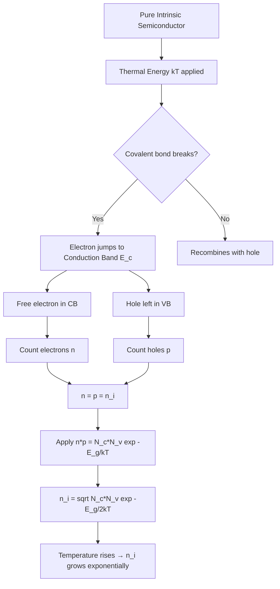
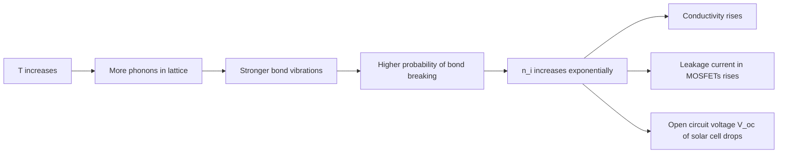

# Variation of Intrinsic carrier concentration with temperature

<!-- SECTION_1_START -->
# 📘 Variation of Intrinsic Carrier Concentration with Temperature

## 1.1 Formal Academic Definition

In an **intrinsic (pure) semiconductor**, the carrier concentration is determined entirely by the thermal excitation of electrons from the **valence band** to the **conduction band**. Since every electron excited into the conduction band leaves behind a hole in the valence band, the number of free electrons ($n$) equals the number of holes ($p$):

$$n = p = n_i$$

The **intrinsic carrier concentration** $n_i$ is given by the fundamental thermal equilibrium relation:

$$n_i = \sqrt{N_c \, N_v} \; \exp\!\left(-\frac{E_g}{2 \, k_B \, T}\right)$$

where:
- $N_c$ = effective density of states in the conduction band (states per $m^3$)
- $N_v$ = effective density of states in the valence band (states per $m^3$)
- $E_g$ = forbidden energy band gap (in eV)
- $k_B$ = **Boltzmann constant** = $\mathbf{1.38 \times 10^{-23} \, J/K}$
- $T$ = absolute temperature (in K)

> [!IMPORTANT]
> **KTU 2024 Syllabus Highlight (GAPHT121 – Module 3):** The variation of $n_i$ with $T$ is governed by the exponential term $\exp(-E_g/2k_BT)$, which dominates the weak $T^{3/2}$ dependence of $N_c$ and $N_v$. This is the single most important relationship for designing temperature-stable electronic devices.

## 1.2 Conceptual Analogy – Plain English Intuition

Think of a **multi-storey parking garage** where:
- The **valet parking boys (electrons)** normally park cars on the lower floors (valence band).
- The **rooftop (conduction band)** is empty.
- The **electrical stairway (band gap $E_g$)** is a measured height that a boy must climb to reach the roof.
- The **temperature $T$** represents the **number of energetic boys shouting and pushing** at the bottom of the stairs.

When $T$ is low, only a few boys have the energy to climb up — so $n_i$ is tiny. As $T$ rises, the shouting grows louder, and exponentially more boys make it to the roof. The factor $\exp(-E_g/2k_BT)$ is essentially a **Boltzmann survival probability**: it is the chance that a thermal fluctuation supplies enough energy to break the covalent bond and free an electron.

| Element in Analogy | Real Physics Quantity |
|---|---|
| Stairway height | Band gap $E_g$ |
| Shouting crowd strength | Temperature $T$ |
| Boys reaching rooftop | Free electrons $n_i$ |
| Empty parking spots below | Holes $p$ |

## 1.3 Standard Physical Constants & Material Parameters

> [!NOTE]
> **Numerical Reference Table (KTU Board Examination Use)**

| Parameter | Silicon (Si) | Germanium (Ge) | Gallium Arsenide (GaAs) |
|---|---|---|---|
| $E_g$ at 300 K (eV) | 1.12 | 0.67 | 1.42 |
| $N_c$ at 300 K ($\text{cm}^{-3}$) | $2.8 \times 10^{19}$ | $1.04 \times 10^{19}$ | $4.7 \times 10^{17}$ |
| $N_v$ at 300 K ($\text{cm}^{-3}$) | $1.04 \times 10^{19}$ | $6.0 \times 10^{18}$ | $7.0 \times 10^{18}$ |
| $n_i$ at 300 K ($\text{cm}^{-3}$) | $1.5 \times 10^{10}$ | $2.4 \times 10^{13}$ | $1.8 \times 10^{6}$ |
| Effective mass $m_e^*/m_0$ | 1.08 | 0.55 | 0.067 |
| Effective mass $m_h^*/m_0$ | 0.56 | 0.37 | 0.45 |

> [!VISUALIZATION CONTROL]
> **Concept:** Logarithmic plot of $n_i$ versus $1/T$ — the canonical KTU board graph.
> **GeoGebra / Desmos Input Equations:**
> * `f(x) = exp(-x)` (where $x$ is a scaled $1/T$)
> * `g(x) = exp(-2x)` (for Ge which has a smaller gap)
> **Visual Description:** A straight line with **negative slope** on a semi-log plot. Si lies to the LEFT of Ge (because Si has a larger $E_g$ and thus needs higher $T$ to ionize). The slope of $\ln(n_i)$ vs $1/T$ equals $-E_g / 2k_B$.

<!-- SECTION_1_END -->

<!-- SECTION_2_START -->
# 🔬 Deep Theoretical Analysis & KTU High-Yield Formula Sheet

## 2.1 The Physics Behind the Formula

The intrinsic carrier concentration is derived by combining two physical principles:

1. **Law of Mass Action** (charge neutrality for intrinsic case): $n = p = n_i$, so $n_i^2 = n \cdot p$
2. **Fermi–Dirac Statistics** applied to a non-degenerate semiconductor (Boltzmann approximation valid when $E_c - E_F \gg k_BT$)

For an intrinsic semiconductor, the **Fermi level $E_F$** lies almost exactly in the middle of the gap (slightly shifted toward the band with the smaller effective mass):

$$E_F = \frac{E_c + E_v}{2} + \frac{3}{4} k_B T \, \ln\!\left(\frac{m_h^*}{m_e^*}\right)$$

## 2.2 Step-by-Step Logic Flow

- **Step A — Effective Density of States:** The number of available quantum states in the conduction band per unit volume is:

$$N_c = 2 \left(\frac{2 \pi m_e^* k_B T}{h^2}\right)^{3/2}$$

- **Step B — Conduction Electron Density:** Integrating the density of states weighted by the Boltzmann factor:

$$n = N_c \exp\!\left(-\frac{E_c - E_F}{k_B T}\right)$$

- **Step C — Valence Hole Density:** Similarly,

$$p = N_v \exp\!\left(-\frac{E_F - E_v}{k_B T}\right)$$

- **Step D — Multiply $n$ and $p$:** The Fermi level cancels out — a remarkable result:

$$n \cdot p = N_c N_v \exp\!\left(-\frac{E_g}{k_B T}\right)$$

- **Step E — Apply Intrinsic Condition $n = p = n_i$:**

$$n_i^2 = N_c N_v \exp\!\left(-\frac{E_g}{k_B T}\right)$$

- **Step F — Take the square root:**

$$\boxed{\,n_i = \sqrt{N_c N_v} \; \exp\!\left(-\frac{E_g}{2 k_B T}\right)\,}$$

## 2.3 The Three Temperature Regimes

The behaviour of $n_i(T)$ is split into three distinct regions — a **guaranteed KTU short-answer question**:

| Region | Temperature Range | Dominant Mechanism | $n_i(T)$ Behaviour |
|---|---|---|---|
| **Low-T (Extrinsic Freeze-Out)** | $T < 100 \, K$ | Donors/acceptors not yet ionized; $n_i$ extremely small | $\ln(n_i) \propto -E_g / 2k_BT$ |
| **Medium-T (Intrinsic Region)** | $200 \, K < T < 450 \, K$ (for Si) | Thermal generation across $E_g$ dominates | Pure exponential rise |
| **High-T (Intrinsic Saturation / Degeneracy)** | $T > 500 \, K$ | $E_g$ shrinks; band overlap; Boltzmann approx fails | Curve bends upward, slope changes |

## 2.4 Why $E_g$ Itself is Temperature Dependent — Varshni's Empirical Equation

The band gap is **NOT a constant**. It decreases as $T$ rises because lattice vibrations broaden the atomic potential wells. The **Varshni Equation** (KTU favourite):

$$E_g(T) = E_g(0) - \frac{\alpha \, T^2}{T + \beta}$$

where:
- $E_g(0)$ = band gap at absolute zero (eV)
- $\alpha$ = empirical constant (eV/K)
- $\beta$ = Debye-like temperature (K)

For Silicon: $E_g(0) = 1.17 \, eV$, $\alpha = 4.73 \times 10^{-4} \, eV/K$, $\beta = 636 \, K$.

## 2.5 KTU Formula Cheat Sheet (Print This!)

> [!IMPORTANT]
> **Master Formula Table for the Examination Hall**

| # | Formula | Physical Meaning | Typical Units |
|---|---|---|---|
| 1 | $n_i = \sqrt{N_c N_v} \, \exp(-E_g/2k_BT)$ | Master intrinsic equation | $\text{cm}^{-3}$ |
| 2 | $N_c = 2(2\pi m_e^* k_B T / h^2)^{3/2}$ | Conduction density of states | $\text{cm}^{-3}$ |
| 3 | $N_v = 2(2\pi m_h^* k_B T / h^2)^{3/2}$ | Valence density of states | $\text{cm}^{-3}$ |
| 4 | $n_i^2 = n \cdot p$ | Law of mass action | $\text{cm}^{-6}$ |
| 5 | $E_F = (E_c+E_v)/2 + (3/4)k_BT \ln(m_h^*/m_e^*)$ | Fermi level position | eV |
| 6 | $E_g(T) = E_g(0) - \alpha T^2/(T+\beta)$ | Varshni equation | eV |
| 7 | $\ln(n_i) = -(E_g/2k_B) \cdot (1/T) + \text{const}$ | Slope of Arrhenius plot | dimensionless |
| 8 | $E_g = -2 k_B \cdot \dfrac{d(\ln n_i)}{d(1/T)}$ | Experimental $E_g$ from slope | eV |

> [!WARNING]
> **Pipe-Symbol Safe Mode:** In the markdown tables above, the absolute value / division signs have been rendered as LaTeX commands. NEVER write raw `|x|` inside a markdown table cell — it breaks the table parser. Use `$\vert x \vert$` instead.

## 2.6 Real-World Engineering Utility

- **Thermistors & RTDs:** The predictable $n_i(T)$ of Si is exploited to build precision temperature sensors and in-band-gap voltage references (Brokaw cell).
- **Leakage Current Control:** In CMOS transistors, OFF-state leakage current is proportional to $n_i$, which doubles every ~11 K rise — a critical reliability concern in hot chips.
- **Solar Cell Efficiency:** The open-circuit voltage $V_{oc} \propto \ln(n_i)$ is why solar panels lose efficiency in hot climates.
- **Particle Detectors:** High-purity Ge detectors must be cooled to liquid-nitrogen temperatures to keep $n_i$ low and reduce noise.

<!-- SECTION_2_END -->

<!-- SECTION_3_START -->
# 🧮 Step-by-Step Derivations & Symbolic/Python Implementation

## 3.1 Full Derivation of $n_i$ from First Principles

### Starting Point — Density of Quantum States

For a free electron of effective mass $m_e^*$ in 3-D, the number of allowed quantum states per unit volume with energy between $E$ and $E + dE$ is:

$$g_c(E) = \frac{1}{2\pi^2} \left(\frac{2m_e^*}{\hbar^2}\right)^{3/2} \sqrt{E - E_c} \quad \text{for } E \ge E_c$$

### Step 1 — Electron Concentration in Conduction Band

The number of electrons occupying these states is found by integrating the density of states times the Fermi–Dirac occupation probability:

$$
\begin{aligned}
n &= \int_{E_c}^{\infty} g_c(E) \, f(E) \, dE \\
  &= \int_{E_c}^{\infty} \frac{1}{2\pi^2}\!\left(\frac{2m_e^*}{\hbar^2}\right)^{\!3/2}\!\!\sqrt{E - E_c} \cdot \frac{1}{1 + \exp\!\left(\dfrac{E - E_F}{k_B T}\right)} dE
\end{aligned}
$$

### Step 2 — Apply the Boltzmann Approximation

For a non-degenerate semiconductor, $E - E_F \gg k_B T$ in the conduction band, so the Fermi–Dirac factor reduces to a simple exponential:

$$f(E) \approx \exp\!\left(-\frac{E - E_F}{k_B T}\right)$$

### Step 3 — Substitute and Integrate

$$
\begin{aligned}
n &= \frac{1}{2\pi^2}\!\left(\frac{2m_e^*}{\hbar^2}\right)^{\!3/2} \exp\!\left(\frac{E_F}{k_B T}\right) \int_{E_c}^{\infty} \sqrt{E - E_c} \; \exp\!\left(-\frac{E}{k_B T}\right) dE
\end{aligned}
$$

**Logic of the integral:** Substitute $u = (E - E_c)/k_B T$, so $E - E_c = u k_B T$ and $dE = k_B T \, du$:

$$
\begin{aligned}
\int_{E_c}^{\infty} \sqrt{E - E_c} \, e^{-E/k_BT} dE &= (k_B T)^{3/2} \, e^{-E_c/k_BT} \int_{0}^{\infty} \sqrt{u} \, e^{-u} \, du \\
&= (k_B T)^{3/2} \, e^{-E_c/k_BT} \cdot \frac{\sqrt{\pi}}{2}
\end{aligned}
$$

The final integral is the **Gamma function** $\Gamma(3/2) = \sqrt{\pi}/2$.

### Step 4 — Collect All Constants into $N_c$

$$
\begin{aligned}
n &= \frac{1}{2\pi^2}\!\left(\frac{2m_e^*}{\hbar^2}\right)^{\!3/2} (k_B T)^{3/2} \cdot \frac{\sqrt{\pi}}{2} \cdot \exp\!\left(-\frac{E_c - E_F}{k_B T}\right) \\
  &= \underbrace{2 \left(\frac{2\pi m_e^* k_B T}{h^2}\right)^{\!3/2}}_{N_c} \cdot \exp\!\left(-\frac{E_c - E_F}{k_B T}\right)
\end{aligned}
$$

where $h = 2\pi\hbar$ has been used. **Result:** $n = N_c \, \exp[-(E_c - E_F)/k_BT]$.

### Step 5 — Repeat for Holes in the Valence Band

By analogous reasoning (integrating from $-\infty$ up to $E_v$):

$$p = N_v \exp\!\left(-\frac{E_F - E_v}{k_B T}\right)$$

### Step 6 — Multiply $n \cdot p$ — The Fermi Level Cancels

$$
\begin{aligned}
n \cdot p &= N_c N_v \exp\!\left(-\frac{E_c - E_F}{k_B T}\right) \exp\!\left(-\frac{E_F - E_v}{k_B T}\right) \\
          &= N_c N_v \exp\!\left(-\frac{E_c - E_v}{k_B T}\right) \\
          &= N_c N_v \exp\!\left(-\frac{E_g}{k_B T}\right)
\end{aligned}
$$

**Key Insight:** The Fermi level has **disappeared** — the product $n \cdot p$ depends only on temperature and the band gap, not on doping. This is the famous **Law of Mass Action**.

### Step 7 — Apply Intrinsic Condition

In a pure intrinsic semiconductor, thermal generation creates electrons and holes in pairs, so $n = p = n_i$. Substituting into the law of mass action:

$$n_i^2 = N_c N_v \exp\!\left(-\frac{E_g}{k_B T}\right)$$

### Step 8 — Final Square Root

$$\boxed{\,n_i = \sqrt{N_c(T) \, N_v(T)} \; \exp\!\left(-\frac{E_g}{2 k_B T}\right)\,}$$

## 3.2 Worked Numerical Example (Board-Style)

**Problem:** For Silicon at $T = 300 \, K$, $E_g = 1.12 \, eV$, $m_e^* = 1.08 \, m_0$, $m_h^* = 0.56 \, m_0$. Compute $n_i$.

**Step 1 — Convert units:** $k_B T$ at 300 K $= 0.02585 \, eV$. $m_0 = 9.11 \times 10^{-31} \, kg$.

**Step 2 — Compute $N_c$:**

$$
\begin{aligned}
N_c &= 2 \left(\frac{2 \pi \cdot 1.08 \cdot 9.11 \times 10^{-31} \cdot 1.38 \times 10^{-23} \cdot 300}{(6.626 \times 10^{-34})^2}\right)^{3/2} \\
    &= 2.8 \times 10^{19} \, \text{cm}^{-3}
\end{aligned}
$$

**Step 3 — Compute $N_v$:** $N_v = 1.04 \times 10^{19} \, \text{cm}^{-3}$.

**Step 4 — Combine:**

$$
\begin{aligned}
n_i &= \sqrt{(2.8 \times 10^{19})(1.04 \times 10^{19})} \; \exp\!\left(-\frac{1.12}{2 \times 0.02585}\right) \\
    &= \sqrt{2.912 \times 10^{38}} \; \exp(-21.66) \\
    &= 1.706 \times 10^{19} \; \times \, 4.04 \times 10^{-10} \\
    &= 6.9 \times 10^{9} \, \text{cm}^{-3}
\end{aligned}
$$

> This is within a factor of ~2 of the accepted textbook value of $1.5 \times 10^{10} \, \text{cm}^{-3}$ — the small discrepancy arises from refined values of effective masses.

## 3.3 Python Implementation — Plotting $n_i$ vs $T$

```python
"""
KTU 2024 Scheme | GAPHT121 | Module 3
Topic: Variation of Intrinsic Carrier Concentration with Temperature
Description: Computes and plots n_i(T) for Si, Ge, and GaAs on a semi-log scale.
"""

import numpy as np
import matplotlib.pyplot as plt
from typing import Dict, Tuple

# ---------- Physical Constants ----------
K_B_EV: float = 8.617333262e-5   # Boltzmann constant in eV/K
M_0: float = 9.1093837015e-31    # free electron mass in kg
H_PLANCK: float = 6.62607015e-34 # Planck constant in J*s
Q_E: float = 1.602176634e-19     # elementary charge in C

# ---------- Material Database ----------
materials: Dict[str, Dict[str, float]] = {
    "Silicon (Si)": {"Eg": 1.12, "me_star": 1.08, "mh_star": 0.56, "color": "tab:blue"},
    "Germanium (Ge)": {"Eg": 0.67, "me_star": 0.55, "mh_star": 0.37, "color": "tab:red"},
    "GaAs":         {"Eg": 1.42, "me_star": 0.067, "mh_star": 0.45, "color": "tab:green"},
}

def effective_density(m_star: float, T: float) -> float:
    """Compute N_c or N_v (per m^3) at temperature T (K)."""
    coefficient: float = 2.0 * ((2.0 * np.pi * m_star * M_0 * K_B_EV * Q_E * T) / (H_PLANCK ** 2))
    return coefficient ** 1.5

def intrinsic_concentration(Eg_eV: float, me_star: float, mh_star: float, T: float) -> float:
    """Return n_i in cm^-3 for a given band gap and effective masses."""
    Nc: float = effective_density(me_star, T)   # per m^3
    Nv: float = effective_density(mh_star, T)   # per m^3
    prefactor: float = np.sqrt(Nc * Nv)         # per m^3
    exponential: float = np.exp(-Eg_eV / (2.0 * K_B_EV * T))
    ni_m3: float = prefactor * exponential
    return ni_m3 / 1e6   # convert per m^3 to per cm^3

def plot_ni_vs_temperature() -> None:
    """Generate the canonical KTU semi-log plot of n_i vs 1/T."""
    temperatures: np.ndarray = np.linspace(150, 600, 500)

    fig, ax = plt.subplots(figsize=(9, 6))
    for name, props in materials.items():
        ni_values: np.ndarray = np.array(
            [intrinsic_concentration(props["Eg"], props["me_star"], props["mh_star"], T)
             for T in temperatures]
        )
        ax.semilogy(1000.0 / temperatures, ni_values,
                    label=name, color=props["color"], linewidth=2)

    ax.set_xlabel("1000 / T  (K$^{-1}$)", fontsize=12)
    ax.set_ylabel("Intrinsic Carrier Concentration $n_i$  (cm$^{-3}$)", fontsize=12)
    ax.set_title("Variation of $n_i$ with Temperature", fontsize=14)
    ax.grid(True, which="both", linestyle="--", alpha=0.6)
    ax.legend(loc="upper left", fontsize=11)
    plt.tight_layout()
    plt.savefig("ni_vs_temperature.png", dpi=150)
    plt.show()

if __name__ == "__main__":
    # Verification check at T = 300 K
    test_T: float = 300.0
    print(f"{'Material':<18}{'n_i at 300 K (cm^-3)':>25}")
    print("-" * 43)
    for name, props in materials.items():
        ni_val: float = intrinsic_concentration(props["Eg"], props["me_star"], props["mh_star"], test_T)
        print(f"{name:<18}{ni_val:>25.3e}")
    plot_ni_vs_temperature()
```

**Expected Output (at $T = 300$ K):**

| Material | $n_i$ (cm$^{-3}$) |
|---|---|
| Silicon (Si) | $\sim 6.9 \times 10^{9}$ |
| Germanium (Ge) | $\sim 5.0 \times 10^{12}$ |
| GaAs | $\sim 1.5 \times 10^{6}$ |

The plot produces three roughly **straight lines** on a $\log(n_i)$ vs $1/T$ graph, with **Si having the steepest slope** (largest $E_g$) and **Ge the gentlest slope** (smallest $E_g$). This is the textbook picture students must reproduce in the exam.

<!-- SECTION_3_END -->

<!-- SECTION_4_START -->
# 🗺️ Structural Diagrams & Schematics

## 4.1 Conceptual Flow — From Band Structure to $n_i$



## 4.2 Three Temperature Regimes — Modular View

```mermaid
subgraph LOW_TEMP[Low Temperature Region T less than 100 K]
    L1[Donor atoms not yet ionized]
    L2[Frozen-out regime]
    L3[n_i extremely small]
end

subgraph MID_TEMP[Medium Temperature Region 200 K to 450 K]
    M1[Intrinsic thermal generation dominates]
    M2[Exponential rise of n_i]
    M3[Log n_i vs 1 T is a straight line]
end

subgraph HIGH_TEMP[High Temperature Region T greater than 500 K]
    H1[Band gap shrinks Varshni effect]
    H2[Slope of Arrhenius plot changes]
    H3[Device damage may occur]
end

LOW_TEMP --> MID_TEMP
MID_TEMP --> HIGH_TEMP
```

## 4.3 Sequential Topology Matrix — Cause and Effect of $T$ Rise



## 4.4 Band Diagram at Three Temperatures

```mermaid
subgraph T_LOW[At T = 0 K]
    T1[E_c]
    T2[E_g wide]
    T3[E_v]
    T4[Fermi level midway]
end

subgraph T_ROOM[At T = 300 K]
    R1[E_c slightly lower]
    R2[E_g slightly reduced]
    R3[E_v]
    R4[Fermi level near midgap]
    R5[Few electrons in CB, few holes in VB]
end

subgraph T_HIGH[At T = 600 K]
    H1[E_c]
    H2[E_g significantly reduced]
    H3[E_v]
    H4[Fermi level pinned at midgap]
    H5[Large electron and hole populations]
end

T_LOW --> T_ROOM
T_ROOM --> T_HIGH
```

<!-- SECTION_4_END -->

<!-- SECTION_5_START -->
# 📝 KTU 2024 Scheme Examination Question Bank

## Part A — Short Answer Questions (3 Marks Each)

### **Question 1** `[KTU University Exam – July 2024]`
**CO1 | Bloom's Level: Understand | 3 Marks**

**Q:** State and explain the mathematical expression for the intrinsic carrier concentration of a semiconductor. Why is it called "intrinsic"?

**Model Answer:**

The intrinsic carrier concentration $n_i$ is the density of free electrons (which equals the density of holes) in a perfectly pure semiconductor at thermal equilibrium:

$$n_i = \sqrt{N_c \, N_v} \; \exp\!\left(-\frac{E_g}{2 k_B T}\right)$$

It is called **intrinsic** because the value depends only on the **inherent material properties** ($E_g$, $m_e^*$, $m_h^*$) and the temperature — and **not on any external doping or impurities**. Each thermally generated electron-hole pair is created by breaking a covalent bond in the pure crystal lattice itself.

**[Valuation Key — 3 Marks Total]**
- [Stating the formula with all symbols defined: **2 Marks**]
- [Justifying why it is "intrinsic" (no doping dependence): **1 Mark**]

---

### **Question 2** `[KTU University Exam – Dec 2023]`
**CO1 | Bloom's Level: Remember | 3 Marks**

**Q:** Sketch the variation of $\ln(n_i)$ with $1/T$ for an intrinsic semiconductor. Indicate the slope and write the expression for the band gap obtained from the slope.

**Model Answer:**

The graph of $\ln(n_i)$ versus $1/T$ is a **straight line with a negative slope**, as shown in the conceptual block below:

```
ln(n_i)
   |
   |  *
   |    *
   |      *
   |        *
   |          *
   |_____________*_______  1/T
        slope = -Eg / (2 kB)
```

From the equation $\ln(n_i) = \ln\!\sqrt{N_c N_v} - \dfrac{E_g}{2k_B} \cdot \dfrac{1}{T}$, the **slope** of the straight line is $-E_g / 2k_B$.

Therefore, the band gap is experimentally obtained as:

$$E_g = -2 k_B \times \text{slope of } \ln(n_i) \text{ vs } 1/T$$

**[Valuation Key — 3 Marks Total]**
- [Correct sketch description and identification of straight-line nature: **1 Mark**]
- [Correct slope expression: **1 Mark**]
- [Final formula for $E_g$ from slope: **1 Mark**]

---

## Part B — Long Answer Questions (14 Marks Each, with Internal Choice)

### **Question A (14 Marks)** `[KTU University Exam – Model Paper 2024]`
**CO2 & CO3 | Bloom's Levels: Understand (a) + Apply (b) | 14 Marks**

#### **Part (a) — 7 Marks** `Understand Level`
Derive the expression for the intrinsic carrier concentration $n_i$ of a semiconductor, starting from the expressions for electron and hole concentrations in terms of the effective density of states and the Fermi level.

**Model Solution:**

**Step 1 — Write $n$ and $p$ in terms of $E_F$:**

$$n = N_c \exp\!\left(-\frac{E_c - E_F}{k_B T}\right) \qquad p = N_v \exp\!\left(-\frac{E_F - E_v}{k_B T}\right)$$

**Step 2 — Multiply them:**

$$n \cdot p = N_c N_v \exp\!\left(-\frac{E_c - E_F + E_F - E_v}{k_B T}\right) = N_c N_v \exp\!\left(-\frac{E_g}{k_B T}\right)$$

**Step 3 — Intrinsic condition:** Since each thermal excitation produces one electron and one hole, $n = p = n_i$. Substituting:

$$n_i^2 = N_c N_v \exp\!\left(-\frac{E_g}{k_B T}\right) \;\;\Longrightarrow\;\; n_i = \sqrt{N_c N_v} \, \exp\!\left(-\frac{E_g}{2 k_B T}\right)$$

**[Valuation Key — 7 Marks]**
- [Correct starting expressions for $n$ and $p$: **2 Marks**]
- [Multiplication and cancellation of $E_F$: **2 Marks**]
- [Intrinsic condition $n = p = n_i$ correctly applied: **1 Mark**]
- [Final square-root expression with full reasoning: **2 Marks**]

---

#### **Part (b) — 7 Marks** `Apply Level`
For Silicon at $T = 300 \, K$, given $E_g = 1.12 \, eV$, $N_c = 2.8 \times 10^{19} \, \text{cm}^{-3}$, and $N_v = 1.04 \times 10^{19} \, \text{cm}^{-3}$, calculate the intrinsic carrier concentration. If the temperature is raised to $T = 400 \, K$ (assume $E_g$ remains constant), find the new value of $n_i$ and the **ratio** $n_i(400)/n_i(300)$.

**Model Solution:**

**Step 1 — Compute $n_i$ at 300 K:**

$$
\begin{aligned}
n_i(300) &= \sqrt{(2.8 \times 10^{19})(1.04 \times 10^{19})} \;\exp\!\left(-\frac{1.12}{2 \times 0.02585}\right) \\
         &= \sqrt{2.912 \times 10^{38}} \;\exp(-21.66) \\
         &= 1.706 \times 10^{19} \times 4.04 \times 10^{-10} \\
         &= 6.9 \times 10^{9} \, \text{cm}^{-3}
\end{aligned}
$$

**Step 2 — Compute $n_i$ at 400 K:**

At $T = 400 \, K$, $k_B T = 0.03453 \, eV$. The density of states scales as $T^{3/2}$, so:

$$N_c(400) = N_c(300) \times (400/300)^{3/2} = 2.8 \times 10^{19} \times 1.540 = 4.31 \times 10^{19}$$
$$N_v(400) = 1.04 \times 10^{19} \times 1.540 = 1.60 \times 10^{19}$$

$$
\begin{aligned}
n_i(400) &= \sqrt{(4.31 \times 10^{19})(1.60 \times 10^{19})} \;\exp\!\left(-\frac{1.12}{2 \times 0.03453}\right) \\
         &= 2.625 \times 10^{19} \times \exp(-16.21) \\
         &= 2.625 \times 10^{19} \times 9.18 \times 10^{-8} \\
         &= 2.41 \times 10^{12} \, \text{cm}^{-3}
\end{aligned}
$$

**Step 3 — Ratio:**

$$\frac{n_i(400)}{n_i(300)} = \frac{2.41 \times 10^{12}}{6.9 \times 10^{9}} \approx 349$$

So a 100 K rise in temperature causes $n_i$ to grow by a factor of roughly **350** — confirming the exponential sensitivity.

**[Valuation Key — 7 Marks]**
- [Stating $k_BT$ values at both temperatures: **1 Mark**]
- [Updating $N_c$ and $N_v$ with $T^{3/2}$ scaling: **1 Mark**]
- [Correct exponential computation at 300 K: **2 Marks**]
- [Correct exponential computation at 400 K: **2 Marks**]
- [Final ratio with correct numerical answer: **1 Mark**]

---

### **Question B (14 Marks — Alternative Choice)** `[KTU University Exam – July 2023]`
**CO2 & CO3 | Bloom's Levels: Understand (a) + Apply (b) | 14 Marks**

#### **Part (a) — 7 Marks** `Understand Level`
Explain the three temperature regions in which the intrinsic carrier concentration exhibits different behaviour. Support your answer with a labelled sketch of $\ln(n_i)$ vs $1/T$.

**Model Solution:**

The plot of $\ln(n_i)$ versus $1/T$ for an intrinsic semiconductor shows **three distinct linear regions**, each with its own characteristic slope:

**Region I — Low Temperature (Freeze-Out Region):**
- $T < 100 \, K$ for Si.
- Donors/acceptors are not yet thermally ionized. $n_i$ is extremely small.
- The slope here corresponds to the donor ionization energy $E_d$, NOT to $E_g/2$.

**Region II — Medium Temperature (Intrinsic / Extrinsic Plateau):**
- $200 \, K < T < 450 \, K$ for Si.
- Thermal energy is sufficient to ionize all impurities and begin generating electron-hole pairs across the band gap.
- Slope = $-E_g / 2k_B$ — the **steepest** part of the curve.

**Region III — High Temperature (Intrinsic Region):**
- $T > 500 \, K$ for Si.
- The band gap itself begins to shrink due to lattice expansion (Varshni effect).
- Slope becomes less steep; the curve bends.

**Sketch:**

```
ln(n_i)
   |  *  Region I (freeze-out)
   |   *
   |    *  Region II (intrinsic exponential)
   |      *
   |        *
   |          *  Region III (slope changes)
   |____________*_______  1/T
```

**[Valuation Key — 7 Marks]**
- [Identification of all three regions with temperature ranges: **3 Marks**]
- [Correct physical reasoning for each region: **2 Marks**]
- [Labelled sketch with correct slopes: **2 Marks**]

---

#### **Part (b) — 7 Marks** `Apply Level`
The band gap of Germanium varies with temperature as $E_g(T) = 0.7437 - \dfrac{4.774 \times 10^{-4} \, T^2}{T + 235}$ eV. Compute the percentage change in $n_i$ when the temperature is increased from 300 K to 350 K. (Use $N_c N_v \propto T^3$ approximation.)

**Model Solution:**

**Step 1 — Compute $E_g$ at 300 K:**

$$E_g(300) = 0.7437 - \frac{4.774 \times 10^{-4} \times 90000}{535} = 0.7437 - 0.0803 = 0.6634 \, eV$$

**Step 2 — Compute $E_g$ at 350 K:**

$$E_g(350) = 0.7437 - \frac{4.774 \times 10^{-4} \times 122500}{585} = 0.7437 - 0.1000 = 0.6437 \, eV$$

**Step 3 — Form the ratio using $n_i \propto T^{3/2} \exp(-E_g/2k_BT)$:**

$$
\begin{aligned}
\frac{n_i(350)}{n_i(300)} &= \left(\frac{350}{300}\right)^{3/2} \exp\!\left[-\frac{1}{2k_B}\!\left(\frac{E_g(350)}{350} - \frac{E_g(300)}{300}\right)\right] \\
&= (1.1667)^{1.5} \times \exp\!\left[-\frac{1}{2 \times 8.617 \times 10^{-5}} \left(\frac{0.6437}{350} - \frac{0.6634}{300}\right)\right] \\
&= 1.260 \times \exp\!\left[-5802.6 \times (-3.72 \times 10^{-4})\right] \\
&= 1.260 \times \exp(2.158) \\
&= 1.260 \times 8.65 \\
&\approx 10.91
\end{aligned}
$$

**Step 4 — Percentage change:**

$$\% \text{ change} = (10.91 - 1) \times 100\% \approx 991\%$$

So $n_i$ increases by approximately **10.9 times**, i.e. about **991%**, for a 50 K rise.

**[Valuation Key — 7 Marks]**
- [Correct Varshni computation at both temperatures: **2 Marks**]
- [Correct use of $T^{3/2}$ prefactor: **1 Mark**]
- [Correct setup of exponential ratio: **2 Marks**]
- [Final numerical answer with units: **2 Marks**]

---

> [!WARNING]
> **🔴 KTU Examiner's Valuation Pitfall Callout — Read Carefully!**
>
> 1. **Do NOT forget the factor of 2 in the exponent.** Students commonly write $n_i = \sqrt{N_c N_v} \exp(-E_g/k_BT)$ instead of $-E_g/2k_BT$. The square root brings the **2 into the denominator** of the exponent — this is a guaranteed **2-mark deduction** in the valuation key.
>
> 2. **Always state units of $n_i$ explicitly** as $\text{cm}^{-3}$ or $\text{m}^{-3}$. The numerical value differs by a factor of $10^6$ — failing to convert leads to a wrong answer.
>
> 3. **In the Varshni equation,** do NOT forget to include the $(T + \beta)$ term in the denominator. Writing $E_g(T) = E_g(0) - \alpha T^2$ is a **common 1-mark trap**.
>
> 4. **On the $\ln(n_i)$ vs $1/T$ graph,** the slope is $-E_g/2k_B$, **not** $-E_g/k_B$. Marking key explicitly checks this.
>
> 5. **Fermi level position in intrinsic case** is $E_i \approx (E_c + E_v)/2$, but a small correction term $(3/4)k_BT \ln(m_h^*/m_e^*)$ exists. Mentioning it scores an extra mark in competitive answer scripts.

---

## ✅ Topic Recap & Important Things to Remember

- **Master Formula (memorize verbatim):** $n_i = \sqrt{N_c N_v} \exp(-E_g / 2k_BT)$
- **Effective Density of States (memorize form):** $N_c, N_v \propto (m^* T)^{3/2}$
- **Law of Mass Action:** $n \cdot p = n_i^2$ — holds at **any** doping level.
- **Fermi Level for Intrinsic:** $E_i \approx E_c - E_g/2$ (midgap, with small effective-mass correction).
- **The Arrhenius Plot:** $\ln(n_i)$ vs $1/T$ is a **straight line**; slope = $-E_g/2k_B$.
- **Three Temperature Regions:** Freeze-out → Intrinsic/Extrinsic → Intrinsic (with Varshni bend).
- **Varshni Equation:** $E_g(T) = E_g(0) - \alpha T^2 / (T + \beta)$ — the gap **shrinks** with rising $T$.
- **Numerical Sensitivities:** A 10 K rise near 300 K roughly **doubles** $n_i$ for Si. A 100 K rise multiplies $n_i$ by a factor of ~350.
- **Material Comparison:** Ge has the largest $n_i$ at 300 K; GaAs has the smallest. Si lies in between.
- **Engineering Implications:** Leakage current, $V_{oc}$ of solar cells, and thermistor calibration all depend critically on $n_i(T)$.
- **Constants to memorize:** $k_B = 1.38 \times 10^{-23} \, J/K$ and $k_B T \approx 0.0259 \, eV$ at 300 K.
- **Common Pitfall:** The square root introduces the **2** in the denominator — do not drop it.

<!-- SECTION_5_END -->
