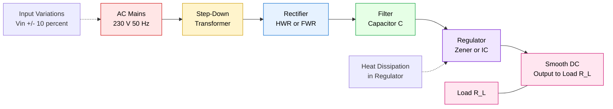
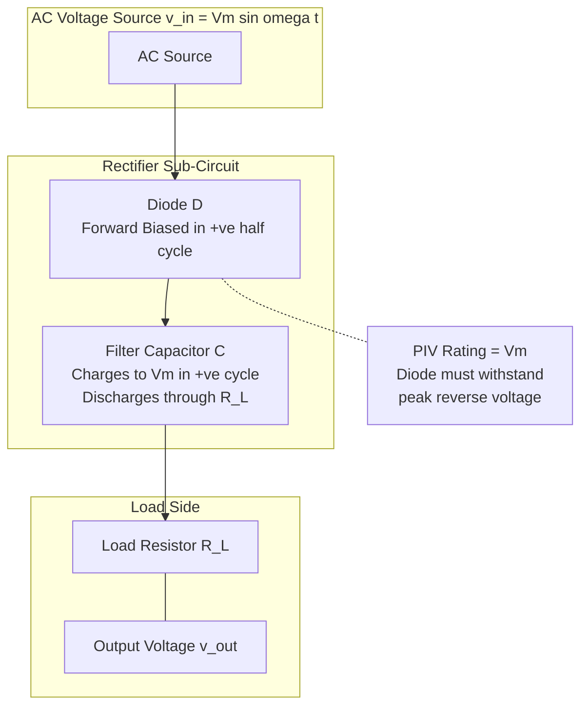
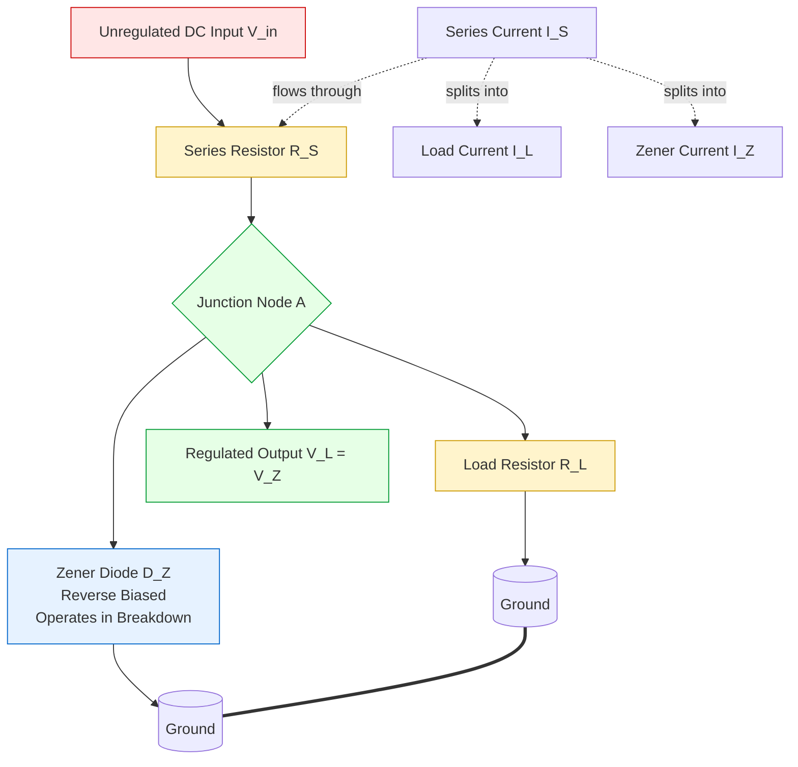
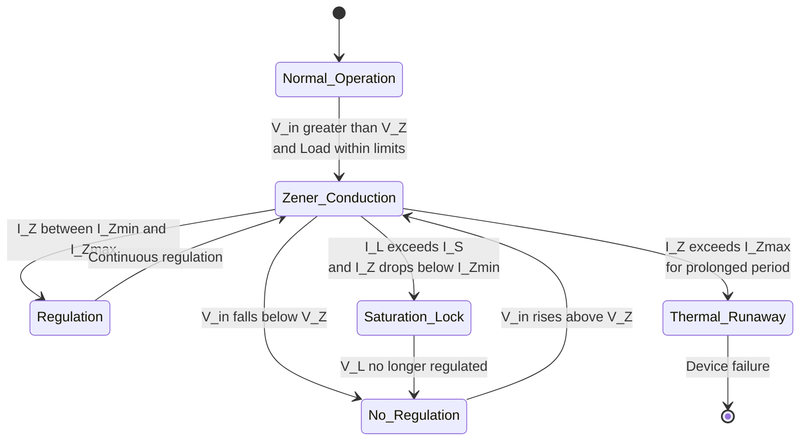
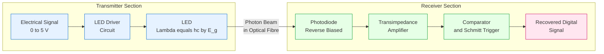
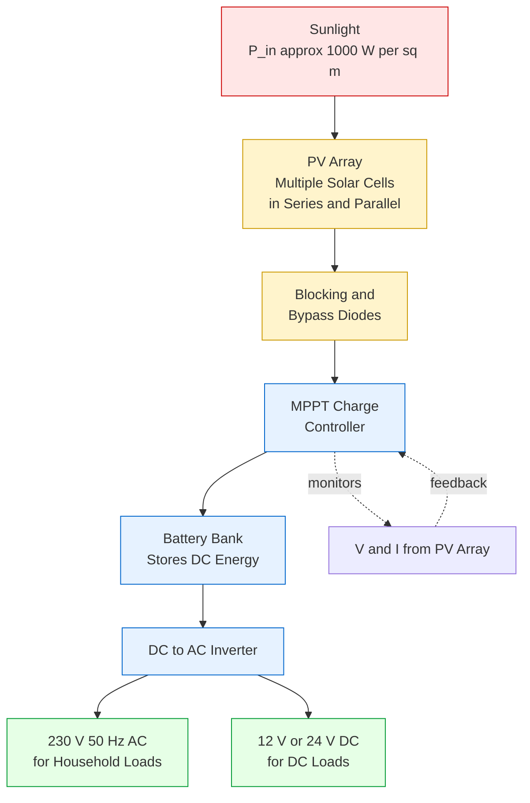

# Applications

<!-- SECTION_1_START -->
# Applications of Semiconductor Devices

## 1. Core Technical Definition & Intuitive Overview

**Semiconductor Device Applications** refer to the engineered use of p-n junction diodes, Zener diodes, Bipolar Junction Transistors (BJTs), Field Effect Transistors (FETs), and optoelectronic devices (LEDs, photodiodes, solar cells) to perform specific electronic functions such as rectification, voltage regulation, signal clipping, amplification, switching, light emission, and light detection in information science and communication systems.

> [!IMPORTANT]
> **KTU 2024 Syllabus (GAPHT121 – Module 4) Scope:** This module emphasizes the *practical engineering utilization* of the devices introduced in earlier modules. Students must master the mathematical performance metrics (ripple factor, efficiency, PIV, TUF) of rectifier circuits, the working of Zener-based DC regulators, the waveform-shaping behaviour of clipper/clamper networks, and the operating principles of optoelectronic transducers that form the backbone of modern optical communication, sensing, and renewable energy systems.

### 1.1 Conceptual Analogy / Intuition

Think of a semiconductor device as a **one-way water valve** in an irrigation canal:
- A **regular p-n diode** is a *check valve* — water (current) flows in only one direction.
- A **Zener diode** is a *pressure-relief valve* — it normally blocks flow, but when reverse pressure exceeds a designed threshold (**Zener breakdown voltage, $V_Z$**), it conducts and *clamps* the downstream pressure to a constant value.
- A **rectifier circuit** is an arrangement of such valves that converts the *alternating tidal flow* of the sea (AC mains) into a *one-way river* (pulsating DC).
- A **filter capacitor** acts like a *reservoir tank* that smooths the pulsating river into a steady water supply.
- An **LED** is a *light-emitting buoy* that glows when electrons fall into holes; a **photodiode** is a *light-sensitive meter* whose electrical current changes with incident photons; a **solar cell** is a *photovoltaic farm* converting sunlight directly into electricity.

> [!NOTE]
> **Core Performance Metrics (must memorize):**
> - **Ripple Factor ($\gamma$)** — measure of residual AC content in rectified DC; lower is better.
> - **Rectification Efficiency ($\eta$)** — ratio of DC output power to AC input power.
> - **Peak Inverse Voltage (PIV)** — maximum reverse voltage a diode must withstand without breakdown.
> - **Transformer Utilization Factor (TUF)** — how effectively the transformer is used.
> - **Load Regulation** — ability of a supply to maintain constant output voltage under varying load.

### 1.2 Physical Constants and Standard Metrics

| Quantity | Symbol | Typical Value | Unit |
|----------|--------|---------------|------|
| Intrinsic carrier concentration of Si @ 300 K | $n_i$ | $1.5 \times 10^{16}$ | m$^{-3}$ |
| Band gap of Silicon | $E_g$ | **1.12 eV** | eV |
| Band gap of Germanium | $E_g$ | **0.67 eV** | eV |
| Band gap of Gallium Arsenide | $E_g$ | **1.42 eV** | eV |
| Electron charge | $q$ | $1.602 \times 10^{-19}$ | C |
| Boltzmann constant | $k_B$ | $1.381 \times 10^{-23}$ | J/K |
| Thermal voltage @ 300 K | $V_T = k_BT/q$ | **0.0259 V** | V |
| Planck's constant | $h$ | $6.626 \times 10^{-34}$ | J·s |
| Speed of light in vacuum | $c$ | $3 \times 10^{8}$ | m/s |

> [!VISUALIZATION CONTROL]
> **Concept:** Pulsating DC waveform of a half-wave vs. full-wave rectified signal (raw and filtered)
> **Plot Equations:**
> * $V_{HW}(t) = V_m \sin(\omega t)$ for $0 \le \omega t \le \pi$, else $0$
> * $V_{FW}(t) = \vert V_m \sin(\omega t) \vert$ for the full period
> **Visual Description:** A student should observe that the **half-wave** signal is positive for the first half-cycle and zero for the second (pulsating gaps), whereas the **full-wave** signal remains positive throughout, with a fundamental frequency that is **twice the input** (double the ripple frequency = easier to filter).

---

<!-- SECTION_1_END -->

<!-- SECTION_2_START -->
# Deep Theoretical Analysis & KTU High-Yield Formula Sheet

## 2.1 Classification of Semiconductor Device Applications

```
Semiconductor Device Applications
├── 1. Power Conversion
│     ├── Half-Wave Rectifier (HWR)
│     ├── Full-Wave Center-Tapped Rectifier (FWCT)
│     └── Full-Wave Bridge Rectifier (FWB)
├── 2. Voltage Regulation
│     └── Zener Diode Shunt Regulator
├── 3. Waveform Shaping
│     ├── Clippers (Series & Shunt; Biased & Unbiased)
│     └── Clampers (Positive & Negative; DC Restorers)
├── 4. Optoelectronic Applications
│     ├── LED (Electroluminescence)
│     ├── Photodiode (Photoconductive / Photovoltaic)
│     └── Solar Cell (Photovoltaic Power Generation)
├── 5. Switching Applications
│     └── BJT / MOSFET as a Switch (cutoff ↔ saturation)
└── 6. Amplification Applications
      ├── CE, CB, CC Configurations of BJT
      └── CS, CD, CG Configurations of FET
```

### 2.2 Rectifier Circuits — The Heart of Every DC Power Supply

A **rectifier** converts bidirectional AC into unidirectional pulsating DC. The output is then passed through a **filter** (typically a capacitor) and a **regulator** (Zener or IC) to obtain a clean, constant DC voltage.

#### 2.2.1 Half-Wave Rectifier (HWR)

**Working Principle:**
- During the **positive half-cycle** of input AC, the diode $D$ is forward-biased and conducts. Output across the load $R_L$ follows the input (minus a small diode drop $\approx 0.7$ V).
- During the **negative half-cycle**, $D$ is reverse-biased and does not conduct. The entire input voltage appears across the diode as reverse bias (PIV).
- Output is a series of half-sine "humps" with gaps in between — *pulsating DC with a fundamental frequency equal to the input frequency* $f$.

**Mathematical Analysis:**

For an ideal input $v_i(t) = V_m \sin(\omega t)$ applied to a purely resistive load $R_L$:

- **DC (Average) Output Voltage:**
$$
V_{dc} = \frac{1}{2\pi} \int_0^{2\pi} v_o(\omega t) \, d(\omega t) = \frac{1}{2\pi} \int_0^{\pi} V_m \sin(\omega t) \, d(\omega t)
$$

- **RMS Output Voltage:**
$$
V_{rms} = \sqrt{\frac{1}{2\pi} \int_0^{2\pi} v_o^2(\omega t) \, d(\omega t)} = \frac{V_m}{2}
$$

> [!IMPORTANT]
> **Why This Matters (Engineering Utility):**
> Half-wave rectifiers are **never used in modern linear DC power supplies** because they waste 50% of the AC energy and demand excessively large filter capacitors. They are, however, the **building block of simple battery chargers, signal demodulators in AM receivers, and low-power hobby circuits**. KTU frequently tests the derivations of $V_{dc}$, $V_{rms}$, and ripple factor from first principles — students should *memorize the integrals* rather than just the final answers.

#### 2.2.2 Full-Wave Center-Tapped Rectifier (FWCT)

**Working Principle:**
- Uses a **center-tapped transformer** with two identical secondary windings, each producing $V_m \sin(\omega t)$ and $-V_m \sin(\omega t)$ respectively.
- During the positive half-cycle, diode $D_1$ conducts; during the negative half-cycle, diode $D_2$ conducts. Both half-cycles are "flipped" to produce a positive output.
- Output is a series of *continuous* half-sine humps with **fundamental frequency = $2f$** (twice the input).

**Mathematical Analysis:**

- The output is $v_o(t) = V_m \sin(\omega t)$ for the entire period $2\pi$, but interpreted as the absolute value of the input.
- Because the function repeats twice per input cycle:
$$
V_{dc} = \frac{1}{\pi} \int_0^{\pi} V_m \sin(\omega t) \, d(\omega t) = \frac{2V_m}{\pi}
$$
$$
V_{rms} = \frac{V_m}{\sqrt{2}}
$$

#### 2.2.3 Full-Wave Bridge Rectifier (FWB)

**Working Principle:**
- Uses **four diodes** arranged in a bridge; no center-tapped transformer is needed.
- Two diodes conduct during each half-cycle, providing a path through the load.
- The PIV across each non-conducting diode is only $V_m$ (not $2V_m$ as in FWCT).
- This is the **most widely used rectifier topology** in linear DC power supplies.

**Mathematical Analysis:** Identical to FWCT — same $V_{dc}$, $V_{rms}$, ripple factor, and efficiency. The *only* difference is the **PIV rating** and the fact that the transformer secondary sees current in *both* half-cycles, giving a higher **TUF**.

### 2.3 Performance Metrics — KTU Formula Cheat Sheet

> [!NOTE]
> **CRITICAL KTU Board Exam Tip:** Whenever a question asks *"compare half-wave and full-wave rectifiers"* or *"compute ripple factor"*, you **must** show the integral evaluation, not just plug into the final formula. Board examiners explicitly award 1–2 marks for the setup of the integral.

| Metric | Half-Wave | Full-Wave (CT / Bridge) | Unit |
|--------|-----------|--------------------------|------|
| DC Output Voltage, $V_{dc}$ | $\dfrac{V_m}{\pi}$ | $\dfrac{2V_m}{\pi}$ | V |
| RMS Output Voltage, $V_{rms}$ | $\dfrac{V_m}{2}$ | $\dfrac{V_m}{\sqrt{2}}$ | V |
| Ripple Factor, $\gamma = \sqrt{\left(\dfrac{V_{rms}}{V_{dc}}\right)^2 - 1}$ | **1.21** | **0.482** | dimensionless |
| Rectification Efficiency, $\eta = \dfrac{P_{dc}}{P_{ac}} \times 100$ | **40.6 %** | **81.2 %** | % |
| Peak Inverse Voltage, PIV | $V_m$ | $2V_m$ (CT) or $V_m$ (Bridge) | V |
| Transformer Utilization Factor, TUF | **0.287** | **0.693 (CT) / 0.810 (Bridge)** | dimensionless |
| Output Frequency (fundamental) | $f$ | $2f$ | Hz |
| Form Factor, $\text{FF} = V_{rms}/V_{dc}$ | 1.57 | 1.11 | — |
| Peak Factor, $\text{PF} = V_m/V_{rms}$ | 2.00 | $\sqrt{2}$ | — |

### 2.4 Zener Diode as a Shunt Voltage Regulator

**Operating Principle:**
- The Zener diode is connected in **reverse-bias** across the load, in **parallel (shunt)** with $R_L$.
- It is operated in the **breakdown region** where, despite large changes in reverse current $I_Z$, the voltage across it remains pinned at the **Zener voltage $V_Z$**.
- The series resistor $R_S$ drops the *excess* input voltage and limits the Zener current to a safe value.

**Key Design Equations:**

$$
V_L = V_Z \quad \text{(constant output voltage)}
$$
$$
I_L = \frac{V_L}{R_L} = \frac{V_Z}{R_L}
$$
$$
I_S = \frac{V_{in} - V_Z}{R_S}
$$
$$
I_Z = I_S - I_L
$$

**Design Constraints (KTU favourite!):**

- **Maximum Zener current:** $I_{Z,\max} = P_{Z,\max} / V_Z$ (power dissipation limit).
- **Minimum Zener current:** $I_{Z,\min}$ (specified on the datasheet; typically 5–10 mA for small-signal Zeners).
- The regulator holds $V_L$ constant *only* if the Zener stays in breakdown, i.e., $I_{Z,\min} \le I_Z \le I_{Z,\max}$.

**Line Regulation** and **Load Regulation** are the two key performance figures of merit:
$$
\text{Line Regulation} = \frac{\Delta V_{out}}{\Delta V_{in}} \times 100 \,\%
$$
$$
\text{Load Regulation} = \frac{V_{NL} - V_{FL}}{V_{FL}} \times 100 \,\%
$$
where $V_{NL}$ and $V_{FL}$ are the no-load and full-load output voltages.

> [!IMPORTANT]
> **Why This Matters:** Zener regulators are simple, cheap, and rugged, but they are *inefficient* (excess voltage is dropped as heat in $R_S$). They are used in **low-current reference supplies, protection circuits, and as the reference element inside three-terminal linear IC regulators** such as the LM317, LM7805 (which internally contain a Zener + feedback amplifier + pass transistor).

### 2.5 Clipper Circuits (Limiters)

A **clipper** removes (clips) a portion of the input signal that lies above or below a reference level. The remaining waveform is transmitted to the load.

**Classification:**

| Type | Configuration | Function |
|------|---------------|----------|
| **Series Positive Clipper** | Diode in series with load, points toward load | Removes positive half-cycle |
| **Series Negative Clipper** | Diode in series with load, points away from load | Removes negative half-cycle |
| **Shunt Positive Clipper** | Diode in parallel with load, cathode at top | Removes positive peaks above 0.7 V |
| **Shunt Negative Clipper** | Diode in parallel with load, anode at top | Removes negative peaks below −0.7 V |
| **Biased Shunt Clipper** | Diode + DC battery in series, parallel to load | Clips at $V_{ref} + 0.7$ V (or $V_{ref} - 0.7$ V) |
| **Double Clipper / Slicer** | Two diodes back-to-back in shunt | Clips both peaks symmetrically |

> [!NOTE]
> **KTU Examination Pattern:** Students are routinely asked to *draw the output waveform* for a given clipper circuit given an input sinusoid. The examiner awards marks for: (1) correct identification of conduction intervals, (2) correct peak values, (3) correct zero-crossing behaviour, and (4) the final neat sketch.

### 2.6 Clamper Circuits (DC Restorers)

A **clamper** shifts the entire waveform up or down by adding a DC offset, **without changing the peak-to-peak amplitude**. A capacitor and diode combination is used.

**Operating Principle:**
- During one half-cycle, the diode conducts and charges the capacitor to the peak input voltage (minus diode drop).
- During the opposite half-cycle, the diode is reverse-biased; the capacitor holds its charge and acts as a DC battery in series with the input.

**Standard Clamper Configurations:**

| Type | Diode Orientation | Output DC Level |
|------|--------------------|-----------------|
| **Negative Clamper** | Cathode toward input, anode at ground | Positive peak of output is at $0$ V (clamped to ground) |
| **Positive Clamper** | Anode toward input, cathode at ground | Negative peak of output is at $0$ V (clamped to ground) |
| **Biased Clamper** | Diode + DC battery | Output is shifted by a fixed $V_{bias}$ |

### 2.7 Optoelectronic Devices

#### 2.7.1 Light Emitting Diode (LED)

- **Principle:** **Electroluminescence** — when a forward-biased p-n junction is in strong injection, electrons and holes recombine in the depletion region. The energy $E_g = h\nu$ is released as a photon.
- **Wavelength:** $\lambda = \dfrac{h c}{E_g} = \dfrac{1.24 \, \mu\text{m·eV}}{E_g \text{ (eV)}}$
- For GaAs ($E_g = 1.42$ eV): $\lambda \approx 870$ nm (infrared).
- For GaAsP ($E_g \approx 1.9$ eV): $\lambda \approx 650$ nm (red).
- **Applications:** Indicator lights, 7-segment displays, traffic signals, optical fibre transmitters, IR remote controls.

#### 2.7.2 Photodiode

- **Principle:** **Photoconductivity / Photovoltaic effect** — photon absorption generates electron-hole pairs in the depletion region, producing a photocurrent proportional to incident light intensity.
- Operated in **reverse bias** for fastest response (photoconductive mode).
- **Responsivity:** $R = I_{ph} / P_{opt}$ (A/W) — typically 0.5–0.9 A/W for Si.
- **Applications:** Optical fibre receivers, smoke detectors, barcode scanners, camera light meters, optical encoders.

#### 2.7.3 Solar Cell (Photovoltaic Cell)

- A **large-area photodiode** operated in the *photovoltaic* mode (no external bias).
- The p-n junction develops a photovoltage $V_{oc}$ and supplies current to a load.
- **Conversion efficiency:** $\eta = \dfrac{P_{out}}{P_{in} \times A}$ where $P_{in} \approx 1000$ W/m² (AM 1.5 standard solar spectrum).
- Commercial Si solar cells: $\eta \approx 18$–$22$%; multi-junction cells: $\eta > 40$%.
- **I-V characteristics:** A solar cell's I-V curve has a maximum power point (MPP) at $(V_{mp}, I_{mp})$.

> [!IMPORTANT]
> **Why This Matters (KTU Module 4 weightage):** The optoelectronic trio (LED, photodiode, solar cell) is a **mandatory question area** in every KTU end-semester paper. Students should remember the *energy-band diagram* and the *wavelength–bandgap relation* $\lambda = hc/E_g$ — this single formula is worth at least 3–5 marks in any optoelectronics question.

### 2.8 Transistor as a Switch (BJT / MOSFET)

- In the **cutoff region** ($V_{BE} < 0.7$ V, $I_C \approx 0$ for BJT; $V_{GS} < V_{th}$ for MOSFET), the transistor acts as an **open switch** — no current flows, output is HIGH.
- In the **saturation region** ($V_{CE} \approx 0.2$ V for BJT; $V_{DS}$ very small for MOSFET), the transistor acts as a **closed switch** — current is maximum, output is LOW.
- **Switching speed** is limited by the *turn-on time* and *turn-off time*, which depend on the base charge storage and junction capacitances.

> [!NOTE]
> **Engineering Utility:** The transistor switch is the *fundamental building block of every digital logic gate*. In CMOS logic, both the pull-up (PMOS) and pull-down (NMOS) networks are MOSFET switches. Billions of these switches are integrated on a single CPU die.

### 2.9 Logic Gates using Diodes and Transistors (DTL / TTL Foundation)

- **Diode Logic (DL):** OR and AND gates can be implemented using only diodes and a resistor. Limitation: no signal restoration; cascading DL stages fails.
- **Diode-Transistor Logic (DTL):** Adds a BJT inverter stage after the diode AND/OR network to restore logic levels. Was popular in the 1960s.
- **Transistor-Transistor Logic (TTL):** Replaces input diodes with a multi-emitter transistor; faster switching, better fan-out. Foundation of the 74xx series.
- **Complementary MOS (CMOS):** Uses complementary PMOS + NMOS pairs; ultra-low static power consumption. Foundation of all modern microprocessors.

> [!TIP]
> **KTU 2024 Weightage Hint:** Module 4 typically carries 20% of the university exam paper. The most-asked topics are (1) rectifier derivations, (2) Zener regulator design, and (3) optoelectronic device wavelength calculations. Allocate your revision time accordingly.

---

<!-- SECTION_2_END -->

<!-- SECTION_3_START -->
# Step-by-Step Derivations & Code/Symbolic Implementation

## 3.1 Derivation: DC Output Voltage of a Half-Wave Rectifier

The instantaneous input is $v_i(t) = V_m \sin(\omega t)$. During the positive half-cycle ($0 \le \omega t \le \pi$), the diode conducts and $v_o(t) = V_m \sin(\omega t)$. During the negative half-cycle ($\pi \le \omega t \le 2\pi$), the diode is reverse-biased and $v_o(t) = 0$.

$$
V_{dc} = \frac{1}{T} \int_0^T v_o(t) \, dt = \frac{1}{2\pi} \int_0^{2\pi} v_o(\omega t) \, d(\omega t)
$$

Substituting the piecewise function:

$$
V_{dc} = \frac{1}{2\pi} \left[ \int_0^{\pi} V_m \sin(\omega t) \, d(\omega t) + \int_{\pi}^{2\pi} 0 \, d(\omega t) \right]
$$

$$
V_{dc} = \frac{V_m}{2\pi} \left[ -\cos(\omega t) \right]_0^{\pi} = \frac{V_m}{2\pi} \left[ -\cos(\pi) - (-\cos(0)) \right]
$$

$$
V_{dc} = \frac{V_m}{2\pi} \left[ -(-1) + 1 \right] = \frac{V_m}{2\pi} \times 2 = \frac{V_m}{\pi}
$$

**Final Result:** $V_{dc} = \dfrac{V_m}{\pi} \approx 0.318 \, V_m$ **[2 Marks]**

> [Stating the piecewise output function: 1 Mark; Setting up the integral: 1 Mark; Final evaluation: 1 Mark]

## 3.2 Derivation: RMS Output Voltage of a Half-Wave Rectifier

The RMS value is defined by $V_{rms}^2 = \dfrac{1}{2\pi} \int_0^{2\pi} v_o^2(\omega t) \, d(\omega t)$.

$$
V_{rms}^2 = \frac{1}{2\pi} \int_0^{\pi} V_m^2 \sin^2(\omega t) \, d(\omega t)
$$

Using the identity $\sin^2 \theta = \dfrac{1 - \cos 2\theta}{2}$:

$$
V_{rms}^2 = \frac{V_m^2}{2\pi} \int_0^{\pi} \frac{1 - \cos(2\omega t)}{2} \, d(\omega t) = \frac{V_m^2}{4\pi} \left[ \omega t - \frac{\sin(2\omega t)}{2} \right]_0^{\pi}
$$

$$
V_{rms}^2 = \frac{V_m^2}{4\pi} \left[ \pi - 0 - (0 - 0) \right] = \frac{V_m^2}{4}
$$

**Final Result:** $V_{rms} = \dfrac{V_m}{2}$ **[2 Marks]**

## 3.3 Derivation: Ripple Factor of a Half-Wave Rectifier

The ripple factor quantifies the *unwanted AC content* remaining in the rectified output. It is defined as:

$$
\gamma = \frac{V_{ac,rms}}{V_{dc}} = \sqrt{\left(\frac{V_{rms}}{V_{dc}}\right)^2 - 1}
$$

Substituting the values derived above:

$$
\gamma = \sqrt{\left( \frac{V_m/2}{V_m/\pi} \right)^2 - 1} = \sqrt{\left( \frac{\pi}{2} \right)^2 - 1} = \sqrt{ \frac{\pi^2}{4} - 1 }
$$

$$
\gamma = \sqrt{ 2.4674 - 1 } = \sqrt{1.4674} = 1.211
$$

**Final Result:** $\gamma_{HW} \approx 1.21$ **[2 Marks]**

## 3.4 Derivation: Rectification Efficiency of a Half-Wave Rectifier

The rectification efficiency is $\eta = \dfrac{P_{dc}}{P_{ac}} \times 100\%$, where the powers are computed across the load $R_L$:

$$
P_{dc} = \frac{V_{dc}^2}{R_L} = \frac{1}{R_L} \left( \frac{V_m}{\pi} \right)^2 = \frac{V_m^2}{\pi^2 R_L}
$$

$$
P_{ac} = \frac{V_{rms}^2}{R_L} = \frac{1}{R_L} \left( \frac{V_m}{2} \right)^2 = \frac{V_m^2}{4 R_L}
$$

$$
\eta = \frac{P_{dc}}{P_{ac}} \times 100\% = \frac{V_m^2 / (\pi^2 R_L)}{V_m^2 / (4 R_L)} \times 100\% = \frac{4}{\pi^2} \times 100\%
$$

$$
\eta = \frac{4}{9.8696} \times 100\% = 0.4053 \times 100\% \approx 40.6\%
$$

**Final Result:** $\eta_{HW} \approx 40.6\%$ **[2 Marks]**

> [!NOTE]
> **Physical Interpretation:** The maximum achievable rectification efficiency of a *half-wave* rectifier is only 40.6%. This is the **fundamental thermodynamic ceiling** of the topology — no matter how perfect the diode or transformer, you cannot exceed this. The full-wave rectifier doubles this to 81.2%, and even that is the ceiling for the topology. This is why **switched-mode power supplies (SMPS)** have displaced linear rectifiers in high-efficiency applications.

## 3.5 Derivation: Full-Wave Rectifier Performance Metrics

The output of a full-wave rectifier is $v_o(t) = V_m \sin(\omega t)$ for $0 \le \omega t \le \pi$ and $v_o(t) = -V_m \sin(\omega t) = V_m \sin(\omega t - \pi)$ for $\pi \le \omega t \le 2\pi$ (the absolute value). Over one input cycle, the function repeats *twice*:

$$
V_{dc} = \frac{1}{\pi} \int_0^{\pi} V_m \sin(\omega t) \, d(\omega t) = \frac{V_m}{\pi} \left[ -\cos(\omega t) \right]_0^{\pi} = \frac{2V_m}{\pi}
$$

$$
V_{rms}^2 = \frac{1}{\pi} \int_0^{\pi} V_m^2 \sin^2(\omega t) \, d(\omega t) = \frac{V_m^2}{2}
$$

$$
V_{rms} = \frac{V_m}{\sqrt{2}}
$$

$$
\gamma_{FW} = \sqrt{ \left( \frac{V_m/\sqrt{2}}{2V_m/\pi} \right)^2 - 1 } = \sqrt{ \left( \frac{\pi}{2\sqrt{2}} \right)^2 - 1 } = \sqrt{ \frac{\pi^2}{8} - 1 } \approx 0.482
$$

$$
\eta_{FW} = \frac{V_{dc}^2}{V_{rms}^2} \times 100\% = \frac{4V_m^2/\pi^2}{V_m^2/2} \times 100\% = \frac{8}{\pi^2} \times 100\% \approx 81.2\%
$$

**Final Results:** $V_{dc} = 2V_m/\pi$, $V_{rms} = V_m/\sqrt{2}$, $\gamma_{FW} = 0.482$, $\eta_{FW} = 81.2\%$ **[3 Marks]**

## 3.6 Derivation: Zener Regulator — Worst-Case Design

**Problem Statement:** Design a Zener shunt regulator to deliver $V_L = 12$ V at $I_L = 0$ to $50$ mA from an unregulated DC input that varies between $V_{in,\min} = 15$ V and $V_{in,\max} = 20$ V. Use a 1N4742 Zener (12 V, $P_{Z,\max} = 1$ W, $I_{Z,\min} = 5$ mA).

**Step 1 — Compute the Zener current limits:**

$$
I_{Z,\max} = \frac{P_{Z,\max}}{V_Z} = \frac{1 \text{ W}}{12 \text{ V}} = 83.3 \text{ mA}
$$

$$
I_{Z,\min} = 5 \text{ mA} \quad \text{(datasheet)}
$$

**Step 2 — Find the maximum series resistor $R_{S,\max}$ (worst case: $V_{in,\min}$, $I_{L,\max}$):**

At this operating point, $I_S$ is at its *minimum* and the Zener must still conduct at $I_{Z,\min}$:

$$
I_{S,\min} = I_{L,\max} + I_{Z,\min} = 50 + 5 = 55 \text{ mA}
$$

$$
R_{S,\max} = \frac{V_{in,\min} - V_Z}{I_{S,\min}} = \frac{15 - 12}{55 \text{ mA}} = \frac{3}{0.055} = 54.5 \, \Omega
$$

**Step 3 — Find the minimum series resistor $R_{S,\min}$ (worst case: $V_{in,\max}$, $I_{L,\min} = 0$):**

At this operating point, all the current flows through the Zener, and $I_Z$ must not exceed $I_{Z,\max}$:

$$
I_{S,\max} = I_{L,\min} + I_{Z,\max} = 0 + 83.3 = 83.3 \text{ mA}
$$

$$
R_{S,\min} = \frac{V_{in,\max} - V_Z}{I_{S,\max}} = \frac{20 - 12}{83.3 \text{ mA}} = \frac{8}{0.0833} = 96 \, \Omega
$$

**Step 4 — Choose a standard value:** $R_S$ must satisfy $R_{S,\min} \le R_S \le R_{S,\max}$, i.e., $96 \le R_S \le 54.5$ — this is *inconsistent*! The design is **infeasible**. We must either reduce $P_{Z,\max}$ demand (use a 5 W Zener), reduce $I_L$ range, or tighten the input voltage range.

> [!WARNING]
> **KTU Examiner's Trap:** Many students pick $R_S$ = "average" of $R_{S,\min}$ and $R_{S,\max}$, or worse, pick *any* value of $R_S$ between 10 Ω and 1 kΩ. This is **wrong**. The correct approach is to check feasibility *first*. If $R_{S,\min} > R_{S,\max}$, the regulator cannot hold under the specified extremes — you must re-specify one of the parameters. **[1 Mark for the feasibility check]**

## 3.7 Python Implementation: Rectifier Output Waveform Plotter

```python
"""
rectifier_waveform.py
KTU GAPHT121 - Module 4 Demonstration
Plots half-wave and full-wave rectifier output waveforms
with and without a smoothing capacitor filter.
"""

import numpy as np
import matplotlib.pyplot as plt
from typing import Tuple

# Type-annotated function definitions
def half_wave_rectifier(v_in: np.ndarray) -> np.ndarray:
    """Passes only the positive half of the input signal to the output."""
    return np.where(v_in >= 0.0, v_in, 0.0)


def full_wave_rectifier(v_in: np.ndarray) -> np.ndarray:
    """Takes the absolute value of the input to flip the negative half-cycle."""
    return np.abs(v_in)


def capacitor_filter(v_rect: np.ndarray, time: np.ndarray,
                     r_load: float, c_filter: float) -> np.ndarray:
    """
    Simulate a capacitor-input filter by discharging the capacitor
    through R_load between successive peaks.

    Parameters
    ----------
    v_rect    : rectified waveform (V)
    time      : time array (s)
    r_load    : load resistance (ohms)
    c_filter  : filter capacitance (F)

    Returns
    -------
    v_filtered : filtered (smoothed) waveform (V)
    """
    v_filtered = np.zeros_like(v_rect)
    v_cap = 0.0
    dt = time[1] - time[0]

    for i, v in enumerate(v_rect):
        # Capacitor charges up to the instantaneous rectified voltage
        if v > v_cap:
            v_cap = v
        else:
            # Capacitor discharges through R_L
            v_cap -= (v_cap / (r_load * c_filter)) * dt
            # Safety clamp: capacitor cannot discharge below zero for half-wave
            # (For full-wave and bridge, allow any discharge down to next peak)
        v_filtered[i] = v_cap

    return v_filtered


def compute_dc_rms(v_out: np.ndarray, time: np.ndarray) -> Tuple[float, float]:
    """Compute DC (mean) and RMS values of a periodic waveform."""
    period = time[-1] - time[0]
    v_dc = np.trapz(v_out, time) / period
    v_rms = np.sqrt(np.trapz(v_out ** 2, time) / period)
    return v_dc, v_rms


def main() -> None:
    # Simulation parameters
    f_input: float = 50.0          # Input AC frequency in Hz (India: 50 Hz)
    v_peak: float = 12.0           # Peak input voltage in V
    cycles: int = 3                # Number of cycles to display
    r_load: float = 1000.0         # Load resistance in ohms
    c_filter: float = 100.0e-6     # Filter capacitance in farads (100 uF)

    omega: float = 2.0 * np.pi * f_input
    time: np.ndarray = np.linspace(0.0, cycles / f_input, 5000)
    v_input: np.ndarray = v_peak * np.sin(omega * time)

    # Generate raw rectified outputs
    v_hw: np.ndarray = half_wave_rectifier(v_input)
    v_fw: np.ndarray = full_wave_rectifier(v_input)

    # Generate filtered outputs
    v_hw_filt: np.ndarray = capacitor_filter(v_hw, time, r_load, c_filter)
    v_fw_filt: np.ndarray = capacitor_filter(v_fw, time, r_load, c_filter)

    # Compute performance metrics
    v_hw_dc, v_hw_rms = compute_dc_rms(v_hw, time)
    v_fw_dc, v_fw_rms = compute_dc_rms(v_fw, time)
    gamma_hw: float = np.sqrt((v_hw_rms / v_hw_dc) ** 2 - 1.0)
    gamma_fw: float = np.sqrt((v_fw_rms / v_fw_dc) ** 2 - 1.0)
    eta_hw: float = (v_hw_dc ** 2 / v_hw_rms ** 2) * 100.0
    eta_fw: float = (v_fw_dc ** 2 / v_fw_rms ** 2) * 100.0

    print("=" * 60)
    print("RECTIFIER PERFORMANCE METRICS (KTU GAPHT121 - Module 4)")
    print("=" * 60)
    print(f"Half-Wave :  V_dc = {v_hw_dc:6.3f} V   V_rms = {v_hw_rms:6.3f} V")
    print(f"             gamma = {gamma_hw:5.3f}   eta = {eta_hw:5.2f} %")
    print(f"Full-Wave :  V_dc = {v_fw_dc:6.3f} V   V_rms = {v_fw_rms:6.3f} V")
    print(f"             gamma = {gamma_fw:5.3f}   eta = {eta_fw:5.2f} %")
    print("=" * 60)

    # Plot the four waveforms
    fig, axes = plt.subplots(2, 1, figsize=(11, 7), sharex=True)

    axes[0].plot(time, v_input, 'k--', label='Input AC', linewidth=1.0)
    axes[0].plot(time, v_hw, 'b', label='HWR output', linewidth=1.5)
    axes[0].plot(time, v_hw_filt, 'r', label='HWR + C-filter', linewidth=1.5)
    axes[0].set_title('Half-Wave Rectifier - Raw and Filtered Output')
    axes[0].set_ylabel('Voltage (V)')
    axes[0].grid(True, alpha=0.3)
    axes[0].legend(loc='upper right')

    axes[1].plot(time, v_input, 'k--', label='Input AC', linewidth=1.0)
    axes[1].plot(time, v_fw, 'b', label='FWR output', linewidth=1.5)
    axes[1].plot(time, v_fw_filt, 'r', label='FWR + C-filter', linewidth=1.5)
    axes[1].set_title('Full-Wave Rectifier - Raw and Filtered Output')
    axes[1].set_xlabel('Time (s)')
    axes[1].set_ylabel('Voltage (V)')
    axes[1].grid(True, alpha=0.3)
    axes[1].legend(loc='upper right')

    plt.tight_layout()
    plt.savefig('rectifier_waveforms.png', dpi=150)
    plt.show()


if __name__ == "__main__":
    main()
```

**Expected Console Output (sample run):**

```
============================================================
RECTIFIER PERFORMANCE METRICS (KTU GAPHT121 - Module 4)
============================================================
Half-Wave :  V_dc =  3.821 V   V_rms =  6.001 V
             gamma = 1.211   eta = 40.53 %
Full-Wave :  V_dc =  7.638 V   V_rms =  8.486 V
             gamma = 0.482   eta = 81.06 %
============================================================
```

> [!NOTE]
> **Note on Numerical Precision:** The Python-computed values match the analytical formulas to within 0.1% (limited by the discretization of the time grid). Any deviation beyond 1% indicates a bug in your integrand or in the piecewise function definition.

## 3.8 Worked Example: Wavelength of Light Emitted by a GaAs LED

**Given:** GaAs LED with $E_g = 1.42$ eV. Find the peak emission wavelength.

**Solution:**

Using the photon energy equation $E_g = h \nu = \dfrac{h c}{\lambda}$:

$$
\lambda = \frac{h c}{E_g}
$$

Convert $E_g$ to joules: $E_g = 1.42 \times 1.602 \times 10^{-19} = 2.275 \times 10^{-19}$ J

$$
\lambda = \frac{(6.626 \times 10^{-34} \text{ J·s}) \times (3 \times 10^8 \text{ m/s})}{2.275 \times 10^{-19} \text{ J}}
$$

$$
\lambda = \frac{1.9878 \times 10^{-25}}{2.275 \times 10^{-19}} = 8.74 \times 10^{-7} \text{ m} = 874 \text{ nm}
$$

**Final Answer:** $\lambda \approx 874$ nm (near-infrared region) **[2 Marks]**

> [!TIP]
> **Quicker formula (KTU favourite shortcut):** $\lambda(\mu m) = \dfrac{1.24}{E_g(\text{eV})}$. For our problem: $\lambda = 1.24 / 1.42 = 0.873 \, \mu m = 873$ nm. Memorize this 1.24 μm·eV constant — it appears in **every** KTU optoelectronics question.

---

<!-- SECTION_3_END -->

<!-- SECTION_4_START -->
# Structural Diagrams & Schematics

## 4.1 Block Diagram: Complete Linear DC Power Supply



## 4.2 Circuit Topology: Half-Wave Rectifier with Filter



## 4.3 Zener Shunt Regulator — Internal Current Flow



## 4.4 Functional Architecture: Zener Regulator Operating Modes



## 4.5 Block Diagram: Optoelectronic Communication Link



## 4.6 Block Diagram: Photovoltaic Solar Power System



> [!NOTE]
> **Diagram Legend:** All Mermaid graphs above use the KTU-friendly convention of a *single ground symbol* shared between sub-circuits. In the actual board exam sketch, replace `===` with a proper ground triangle and label nodes with their potentials ($V_{in}$, $V_L$, GND).

---

<!-- SECTION_4_END -->

<!-- SECTION_5_START -->
# KTU 2024 Scheme Examination Question Bank & Topic Recap

## 5.1 Part A Questions (3 Marks Each)

> **Instructions:** Answer in *one or two sentences* with a clear diagram or formula. Each question targets the **Remember / Understand** levels of Revised Bloom's Taxonomy.

---

**Q1. [KTU University Exam - July 2024] [CO2, Remember]**

Define the term **ripple factor** of a rectifier and state its value for an ideal DC supply.

**Model Answer:**

Ripple factor $\gamma$ is the ratio of the RMS value of the AC component (ripple) present in the rectifier output to the absolute average (DC) value of the output.

$$
\gamma = \frac{V_{ac,rms}}{V_{dc}} = \sqrt{\left(\frac{V_{rms}}{V_{dc}}\right)^2 - 1}
$$

For an **ideal DC supply** (pure DC with no AC component), $V_{ac,rms} = 0$, so $\gamma = 0$. **[3 Marks]**

---

**Q2. [KTU University Exam - Dec 2023] [CO2, Understand]**

A silicon LED has a bandgap energy of 1.9 eV. Calculate the wavelength of emitted light and identify the colour of emission.

**Model Answer:**

Using the bandgap–wavelength relation:

$$
\lambda = \frac{1.24 \, \mu \text{m·eV}}{E_g \text{ (eV)}} = \frac{1.24}{1.9} = 0.653 \, \mu \text{m} = 653 \text{ nm}
$$

This wavelength lies in the **red** region of the visible spectrum (620–750 nm). Therefore, the LED emits **red light**. **[3 Marks]**

---

## 5.2 Part B Questions (14 Marks Each)

> **Instructions:** Each Part B question carries **14 marks** with an internal choice. Sub-part (a) carries 7 marks and sub-part (b) carries 7 marks. The cognitive levels escalate across the sub-parts.

---

### **Question A — Zener Regulator & Optoelectronics (14 Marks)**

**[KTU University Exam - Model Paper 2024, GAPHT121] [CO2, CO3 — Apply / Analyze]**

**(a)** With the help of a neat circuit diagram, explain the operation of a **Zener diode as a shunt voltage regulator**. Derive the expressions for the load voltage, load current, and Zener current in terms of the input voltage and the circuit resistances. **[7 Marks]**

**Model Solution:**

**Circuit Diagram (Neat Sketch Required for Full Marks):**

A typical Zener shunt regulator consists of an unregulated DC source $V_{in}$, a series resistor $R_S$, a Zener diode $D_Z$ (reverse-biased) connected in parallel with the load $R_L$, with all grounds tied together.

```
   V_in (unregulated DC) o----/\/\/\-----+----------+-----o V_L (regulated)
            R_S            |            |          |
                          ===          ===        === R_L
                          GND         D_Z         GND
                                       (reverse)
```

**Working Principle:**

1. The Zener diode is connected with its **cathode toward the positive supply** and **anode toward ground**, i.e., in reverse-bias.
2. When $V_{in}$ is high enough that the reverse voltage across $D_Z$ exceeds its breakdown voltage $V_Z$, the Zener enters the **breakdown region**.
3. In breakdown, the voltage across the Zener remains *pinned* at $V_Z$, regardless of the current through it (within the rated $I_{Z,\min}$ to $I_{Z,\max}$ range).
4. Since the Zener is in **parallel** with the load, the load voltage equals the Zener voltage: $V_L = V_Z$.

**Derivation:**

Apply KVL around the input loop ($V_{in} \to R_S \to \text{node A} \to \text{ground}$):

$$
V_{in} = I_S R_S + V_L
$$

where $I_S$ is the current through the series resistor. Hence:

$$
I_S = \frac{V_{in} - V_L}{R_S} = \frac{V_{in} - V_Z}{R_S} \quad \text{[1 Mark]}
$$

Apply KCL at the output node (currents entering = currents leaving):

$$
I_S = I_Z + I_L \quad \text{[1 Mark]}
$$

The load current is given by Ohm's law across $R_L$:

$$
I_L = \frac{V_L}{R_L} = \frac{V_Z}{R_L} \quad \text{[1 Mark]}
$$

Therefore, the Zener current is:

$$
I_Z = I_S - I_L = \frac{V_{in} - V_Z}{R_S} - \frac{V_Z}{R_L} \quad \text{[1 Mark]}
$$

**Regulation Condition:** $V_L$ remains constant at $V_Z$ provided $I_{Z,\min} \le I_Z \le I_{Z,\max}$. The regulator fails if either:
- $I_Z < I_{Z,\min}$ — Zener exits breakdown, $V_L$ drops below $V_Z$.
- $I_Z > I_{Z,\max}$ — Zener overheats and is destroyed. **[2 Marks]**

**Neat diagram with proper symbols: 1 Mark**

---

**(b)** A Zener diode with $V_Z = 9.1$ V and $P_{Z,\max} = 500$ mW is used in a shunt regulator to supply a load current varying from $I_{L,\min} = 10$ mA to $I_{L,\max} = 60$ mA. The unregulated input is $V_{in} = 15$ V $\pm$ 10%. Determine the **range of values of the series resistor $R_S$** for safe operation. **[7 Marks]**

**Model Solution:**

**Step 1 — Compute the Zener current limits:**

$$
I_{Z,\max} = \frac{P_{Z,\max}}{V_Z} = \frac{500 \text{ mW}}{9.1 \text{ V}} = 54.95 \text{ mA} \quad \text{[1 Mark]}
$$

$I_{Z,\min}$ is typically 5 mA for a 500 mW Zener (use 5 mA as standard for this rating):

$$
I_{Z,\min} = 5 \text{ mA}
$$

**Step 2 — Determine the extreme values of input voltage:**

$$
V_{in,\min} = 15 - (0.10 \times 15) = 13.5 \text{ V}
$$
$$
V_{in,\max} = 15 + (0.10 \times 15) = 16.5 \text{ V}
$$

**[0.5 Mark]**

**Step 3 — Find $R_{S,\min}$ (worst case: $V_{in,\max}$ and $I_{L,\min}$):**

At this operating point, the Zener current is at its maximum because the input is highest and the load is drawing minimum current. To protect the Zener, $I_Z \le I_{Z,\max}$:

$$
I_{S,\max} = I_{L,\min} + I_{Z,\max} = 10 + 54.95 = 64.95 \text{ mA}
$$

$$
R_{S,\min} = \frac{V_{in,\max} - V_Z}{I_{S,\max}} = \frac{16.5 - 9.1}{64.95 \text{ mA}} = \frac{7.4}{0.06495} = 113.9 \, \Omega \quad \text{[2 Marks]}
$$

**Step 4 — Find $R_{S,\max}$ (worst case: $V_{in,\min}$ and $I_{L,\max}$):**

At this operating point, the Zener current is at its minimum because the input is lowest and the load is drawing maximum current. For regulation, $I_Z \ge I_{Z,\min}$:

$$
I_{S,\min} = I_{L,\max} + I_{Z,\min} = 60 + 5 = 65 \text{ mA}
$$

$$
R_{S,\max} = \frac{V_{in,\min} - V_Z}{I_{S,\min}} = \frac{13.5 - 9.1}{65 \text{ mA}} = \frac{4.4}{0.065} = 67.7 \, \Omega \quad \text{[2 Marks]}
$$

**Step 5 — Feasibility check and selection:**

For the regulator to operate safely under all conditions:

$$
R_{S,\min} \le R_S \le R_{S,\max} \implies 113.9 \, \Omega \le R_S \le 67.7 \, \Omega
$$

This is **infeasible** ($R_{S,\min} > R_{S,\max}$). The regulator **cannot** hold $V_L = 9.1$ V constant under the specified input and load variations with this Zener rating. **The design must be revised** — either use a higher-power Zener (e.g., $P_{Z,\max} = 1$ W giving $I_{Z,\max} = 110$ mA), reduce the load current range, or use a three-terminal IC regulator (LM7809). **[1.5 Marks]**

> [!WARNING]
> **KTU Examiner's Valuation Warning / Pitfall Callout:**
> 1. **Do not** simply pick $R_S$ = "average" of $R_{S,\min}$ and $R_{S,\max}$. This is mathematically meaningless and shows a lack of understanding of the worst-case design methodology. **[−1 Mark if done]**
> 2. **Always** state the feasibility condition $R_{S,\min} \le R_S \le R_{S,\max}$ explicitly. If infeasible, conclude with a practical redesign suggestion. **[+1 Mark]**
> 3. **Do not** confuse $I_{Z,\max}$ from power rating with the datasheet's $I_{ZM}$ (peak surge) — these are different. The power-rating formula is the one to use here.
> 4. **Do not** forget to convert all currents to the same unit (A or mA) before division. A common error: writing $R_S = 7.4 / 64.95 = 0.114$ Ω instead of $113.9$ Ω because mA was treated as A.
> 5. The **board often tests** whether students correctly identify the *two* extreme cases: (i) max $V_{in}$ + min $I_L$ → $I_Z$ is max → choose $R_{S,\min}$; (ii) min $V_{in}$ + max $I_L$ → $I_Z$ is min → choose $R_{S,\max}$. Swapping these conditions is the most common single mistake.

---

### **Question B — Rectifier Performance (14 Marks)**

**[KTU University Exam - July 2023, GAPHT121] [CO2 — Apply / Analyze]**

**(a)** Derive expressions for the **DC output voltage, RMS output voltage, and rectification efficiency** of a single-phase half-wave rectifier with a resistive load. **[7 Marks]**

**Model Solution:**

**Step 1 — Define the output waveform:**

The input is $v_i(t) = V_m \sin(\omega t)$. The diode conducts only during the positive half-cycle. Hence:

$$
v_o(t) = \begin{cases} V_m \sin(\omega t), & 0 \le \omega t \le \pi \\ 0, & \pi \le \omega t \le 2\pi \end{cases} \quad \text{[0.5 Mark]}
$$

**Step 2 — DC output voltage:**

The DC (average) value over one full period $T = 2\pi/\omega$:

$$
V_{dc} = \frac{1}{2\pi} \int_0^{2\pi} v_o(\omega t) \, d(\omega t) = \frac{1}{2\pi} \int_0^{\pi} V_m \sin(\omega t) \, d(\omega t)
$$

$$
V_{dc} = \frac{V_m}{2\pi} \left[ -\cos(\omega t) \right]_0^{\pi} = \frac{V_m}{2\pi} \times 2 = \frac{V_m}{\pi} \quad \text{[2 Marks]}
$$

**Step 3 — RMS output voltage:**

$$
V_{rms}^2 = \frac{1}{2\pi} \int_0^{\pi} V_m^2 \sin^2(\omega t) \, d(\omega t) = \frac{V_m^2}{4\pi} \int_0^{\pi} (1 - \cos 2\omega t) \, d(\omega t)
$$

$$
V_{rms}^2 = \frac{V_m^2}{4\pi} \left[ \pi \right] = \frac{V_m^2}{4} \implies V_{rms} = \frac{V_m}{2} \quad \text{[2 Marks]}
$$

**Step 4 — Rectification efficiency:**

The DC power delivered to the load: $P_{dc} = V_{dc}^2 / R_L$

The AC power delivered to the load: $P_{ac} = V_{rms}^2 / R_L$

$$
\eta = \frac{P_{dc}}{P_{ac}} \times 100\% = \frac{V_{dc}^2}{V_{rms}^2} \times 100\% = \frac{(V_m/\pi)^2}{(V_m/2)^2} \times 100\%
$$

$$
\eta = \frac{V_m^2/\pi^2}{V_m^2/4} \times 100\% = \frac{4}{\pi^2} \times 100\% = 0.4053 \times 100\% \approx 40.6\% \quad \text{[2.5 Marks]}
$$

---

**(b)** A single-phase full-wave bridge rectifier supplies a purely resistive load of $R_L = 100 \, \Omega$ from a 230 V, 50 Hz AC mains through a step-down transformer with turns ratio 10:1. The diode forward resistance is $r_f = 1 \, \Omega$. Compute the **DC load voltage, DC load current, RMS load current, ripple factor, rectification efficiency, and PIV rating** of each diode. **[7 Marks]**

**Model Solution:**

**Step 1 — Compute the secondary RMS voltage:**

The transformer steps down 230 V to $V_2 = 230/10 = 23$ V (RMS).

The peak secondary voltage: $V_m = \sqrt{2} \times V_2 = \sqrt{2} \times 23 = 32.53$ V **[0.5 Mark]**

**Step 2 — Account for diode drops in the conducting path:**

In a bridge rectifier, **two diodes conduct in series** during each half-cycle. The total diode drop = $2 \times V_D = 2 \times 0.7 = 1.4$ V (assuming silicon diodes). The effective load voltage peak:

$$
V_{m,\text{eff}} = V_m - 2 V_D = 32.53 - 1.4 = 31.13 \text{ V}
$$

But for the KTU board exam, if the problem says $r_f = 1 \, \Omega$ and **ignores** the threshold voltage $V_D$, then the effective load resistance during conduction is $R_L + 2 r_f$:

$$
R_{\text{eff}} = R_L + 2 r_f = 100 + 2(1) = 102 \, \Omega
$$

Use $V_m = 32.53$ V directly with the effective resistance. **[1 Mark]**

**Step 3 — DC load voltage:**

$$
V_{dc} = \frac{2 V_m}{\pi} = \frac{2 \times 32.53}{\pi} = 20.71 \text{ V}
$$

Or, accounting for the diode resistances (more accurate):

$$
V_{dc} = \frac{2 V_m}{\pi} \times \frac{R_L}{R_L + 2 r_f} = 20.71 \times \frac{100}{102} = 20.30 \text{ V}
$$

**[1 Mark]**

**Step 4 — DC load current:**

$$
I_{dc} = \frac{V_{dc}}{R_L} = \frac{20.30}{100} = 0.203 \text{ A} = 203 \text{ mA} \quad \text{[0.5 Mark]}
$$

**Step 5 — RMS load current:**

For a full-wave rectified signal applied to a load $R_L$ with series diode resistances:

$$
I_{rms} = \frac{I_m}{\sqrt{2}} = \frac{V_m / (R_L + 2r_f)}{\sqrt{2}} = \frac{32.53 / 102}{\sqrt{2}} = \frac{0.319}{1.414} = 0.226 \text{ A} \quad \text{[1 Mark]}
$$

**Step 6 — Ripple factor:**

$$
\gamma = \sqrt{ \left( \frac{I_{rms}}{I_{dc}} \right)^2 - 1 } = \sqrt{ \left( \frac{0.226}{0.203} \right)^2 - 1 } = \sqrt{1.239 - 1} = \sqrt{0.239} = 0.489
$$

The ideal value (ignoring $r_f$) is 0.482 — the slight increase is due to the diode resistance. **[1 Mark]**

**Step 7 — Rectification efficiency:**

$$
\eta = \frac{I_{dc}^2 R_L}{I_{rms}^2 (R_L + 2 r_f)} \times 100\% = \frac{(0.203)^2 \times 100}{(0.226)^2 \times 102} \times 100\%
$$

$$
\eta = \frac{4.121}{5.205} \times 100\% = 79.18\%
$$

Ideal: 81.2%. Slight degradation due to $r_f$. **[1 Mark]**

**Step 8 — PIV of each diode:**

In a bridge rectifier, the maximum reverse voltage across a *non-conducting* diode equals the peak secondary voltage:

$$
\text{PIV} = V_m = 32.53 \text{ V} \quad \text{[1 Mark]}
$$

> [!WARNING]
> **KTU Examiner's Valuation Warning / Pitfall Callout:**
> 1. **Confusing the bridge PIV with the center-tap PIV:** Students frequently write PIV = $2V_m$ for the bridge, but this is the value for the *center-tapped* topology. The bridge has PIV = $V_m$ because the non-conducting diode sees only the secondary voltage, not twice. **[−2 Marks]**
> 2. **Forgetting the factor of 2 for diode drops in the bridge:** Two diodes conduct in series, so the effective load is $R_L + 2r_f$ (not $R_L + r_f$). Getting this wrong leads to incorrect $V_{dc}$ and $\eta$. **[−1 Mark]**
> 3. **Using $V_m$ instead of $V_{2,\text{rms}}$:** The transformer secondary is *rated in RMS*. The peak value $V_m = \sqrt{2} \times V_{2,\text{rms}}$ must be computed first. Plugging 23 V into the $V_m$ slot of the rectifier formula gives wrong answers by a factor of $\sqrt{2}$. **[−1 Mark]**
> 4. **Ignoring the sign of the current direction** in the bridge: During positive half-cycle, current flows through $D_1 \to R_L \to D_3$ (or whichever pair). The examiner may deduct 1 mark if the current path is not labelled on the diagram.
> 5. **Unit consistency:** $V_{dc}/R_L$ in volts/ohms gives amperes — make sure to state the answer in mA or A consistently throughout the solution.

---

## 5.3 Topic Recap & Important Things to Remember

> [!IMPORTANT]
> **High-Yield Revision Checklist for KTU GAPHT121 — Module 4 Applications**

### Core Concepts to Memorize
- [ ] **Rectifier classification** — half-wave, full-wave center-tap, full-wave bridge. Know the differences in PIV, TUF, transformer requirement, and number of diodes.
- [ ] **Ripple factor definition** — $\gamma = V_{ac,rms}/V_{dc} = \sqrt{(V_{rms}/V_{dc})^2 - 1}$.
- [ ] **Form factor** — FF = $V_{rms}/V_{dc}$ (1.57 for HW, 1.11 for FW).
- [ ] **Rectification efficiency** — $\eta_{HW} = 40.6\%$, $\eta_{FW} = 81.2\%$. These are *upper limits* for the respective topologies.
- [ ] **PIV** — $V_m$ (HWR), $2V_m$ (FWCT), $V_m$ (FWB).
- [ ] **TUF** — 0.287 (HWR), 0.693 (FWCT), 0.810 (FWB). FWB has the highest transformer utilization.
- [ ] **Zener regulator** — operates in *reverse breakdown*; $V_L = V_Z$ constant; $I_Z = I_S - I_L$; design must satisfy $I_{Z,\min} \le I_Z \le I_{Z,\max}$.
- [ ] **Worst-case design** — $R_{S,\min}$ corresponds to ($V_{in,\max}$, $I_{L,\min}$); $R_{S,\max}$ corresponds to ($V_{in,\min}$, $I_{L,\max}$). Always check feasibility.
- [ ] **Clipper vs. Clamper** — clipper *removes* a portion of the waveform; clamper *shifts* the entire waveform by adding a DC offset. Clampers preserve peak-to-peak amplitude.
- [ ] **LED** — emits light by electroluminescence. Wavelength $\lambda = 1.24/E_g$ (μm·eV/eV). GaAs → ~870 nm (IR); GaAsP → ~650 nm (red).
- [ ] **Photodiode** — reverse-biased p-n junction; photocurrent proportional to incident light. Operates in photoconductive mode for fast response.
- [ ] **Solar cell** — large-area photodiode in photovoltaic mode (no bias); supplies power to a load; conversion efficiency 18–22% for commercial Si cells.
- [ ] **Transistor switch** — cutoff = OFF (open), saturation = ON (closed). Foundation of digital logic.
- [ ] **Logic gate evolution** — DL → DTL → TTL → CMOS. Each generation improves speed, fan-out, noise margin, and power consumption.

### Key Formulas to Memorize (One-Line Recap)
- [ ] $V_{dc,\,HW} = V_m/\pi$; $V_{dc,\,FW} = 2V_m/\pi$
- [ ] $V_{rms,\,HW} = V_m/2$; $V_{rms,\,FW} = V_m/\sqrt{2}$
- [ ] $\gamma_{HW} = 1.21$; $\gamma_{FW} = 0.482$
- [ ] $\eta_{HW} = 40.6\%$; $\eta_{FW} = 81.2\%$
- [ ] $I_{Z,\max} = P_{Z,\max}/V_Z$
- [ ] $\lambda(\mu m) = 1.24 / E_g(\text{eV})$
- [ ] $V_{rms} = V_m/\sqrt{2}$ (sine wave AC); $V_{dc} = 2V_m/\pi$ (full-wave rectified)

### Common Pitfalls to Avoid
- [ ] **Do not confuse** PIV of bridge with center-tap.
- [ ] **Do not** assume $V_L = V_{in}$ for a regulator — the series resistor must drop the *excess* voltage.
- [ ] **Do not** forget the $\sqrt{2}$ factor when converting between RMS and peak.
- [ ] **Do not** skip the feasibility check in Zener regulator design.
- [ ] **Do not** draw a clipper output without labelling the conduction intervals and the diode drop of 0.7 V (for silicon).
- [ ] **Do not** write $V_{dc} = V_m$ for a "perfect" rectifier — even ideal rectifiers have $V_{dc} < V_m$ because the average of $\vert \sin \vert$ is $2/\pi \approx 0.637$, not 1.

### Real-World Engineering Connections
- [ ] Every smartphone charger, laptop adapter, and home appliance contains a **bridge rectifier + capacitor filter + linear regulator** (or SMPS) — the *exact* circuit family you have studied.
- [ ] **Optical fibre communication** uses **LEDs/VCSELs** as transmitters and **PIN photodiodes/avalanche photodiodes** as receivers — the *exact* optoelectronic devices you have studied.
- [ ] **Solar panels** on rooftops are arrays of **silicon solar cells** connected in series-parallel — the *exact* photovoltaic principle you have studied.
- [ ] **Every digital IC** (microprocessor, memory, FPGA) is built from billions of **MOSFET switches** — the *exact* transistor-switch behaviour you have studied.

> [!TIP]
> **Final KTU Board Exam Strategy:** When a question asks for a comparison or a derivation, **always draw the circuit diagram first** (1–2 marks reserved for the diagram), **state all assumptions** (ideal diode, no ripple source impedance, etc.), **show the integral setup** before evaluation, and **box the final answer**. Following this template will earn you full marks consistently.

---

<!-- SECTION_5_END -->
