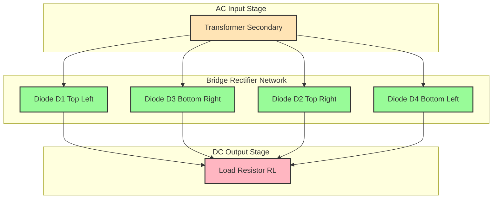
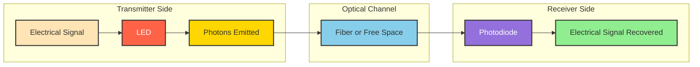
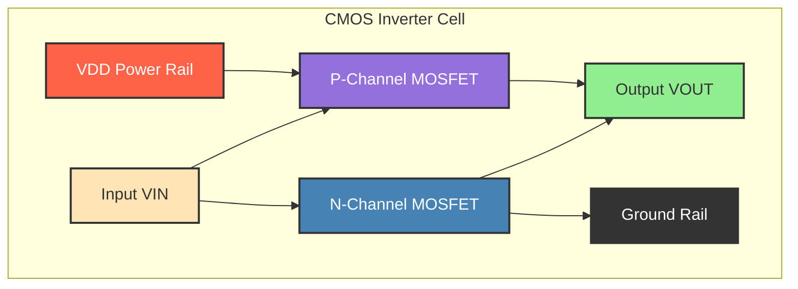

# Applications

<!-- SECTION_1_START -->
# Applications of Semiconductor Devices

## 1.1 Formal Definition

In the context of the **KTU 2024 Scheme (GAPHT121 - Physics for Information Science)**, **Semiconductor Device Applications** refers to the practical engineering implementations of doped inorganic crystals (primarily **Silicon (Si)** and **Gallium Arsenide (GaAs)**) whose electrical and optical properties are deliberately engineered through p-n junction formation to perform specific signal-processing, energy-conversion, and switching functions in information technology systems.

> [!IMPORTANT]
> **Syllabus Highlight (Module 4 - Applications):**
> The KTU 2024 scheme explicitly tests the operational utility of the **PN Junction Diode**, **Zener Diode**, **Light Emitting Diode (LED)**, **Photodiode**, **Solar Cell (Photovoltaic Cell)**, **Bipolar Junction Transistor (BJT)**, and **Metal-Oxide-Semiconductor Field Effect Transistor (MOSFET)** in computing hardware, optoelectronic communication, and power-electronic subsystems.

The device physics underpinning these applications rests on the controlled manipulation of charge carriers (electrons in the **conduction band** and holes in the **valence band**) across a depletion region governed by the built-in potential barrier $V_{bi}$.

## 1.2 Conceptual Analogy / Intuition

> [!NOTE]
> **The Highway Toll Booth Analogy**
> Imagine a two-lane highway where one lane is reserved for "electrons" moving from the N-side to the P-side, and the other lane for "holes" moving in the opposite direction. A **PN Junction Diode** is like a one-way toll gate: it allows traffic (current) to flow only when a "green signal" (forward bias) is applied from an external battery. Reverse the battery polarity, and the gate slams shut — this is the foundation of **rectification** (converting AC to DC).
>
> An **LED** is a toll booth that, instead of just letting cars through, requires them to pay a toll in the form of energy — and the gate flashes a colored light each time a car passes. The "toll fee" is the band-gap energy $E_g$, and the flash color is determined by its wavelength.
>
> A **Solar Cell** is the same toll booth in reverse: incoming sunlight "pays the toll" by knocking electrons free, generating a current that we collect as electrical energy.

## 1.3 Physical Constants and Standard Metrics

The following constants are critical for KTU numerical problems on this module:

- **Electron charge:** $e = 1.602 \times 10^{-19} \ \text{C}$
- **Boltzmann constant:** $k_B = 1.381 \times 10^{-23} \ \text{J/K}$
- **Planck's constant:** $h = 6.626 \times 10^{-34} \ \text{J \cdot s}$
- **Speed of light in vacuum:** $c = 3 \times 10^8 \ \text{m/s}$
- **Room temperature thermal voltage:** $V_T = \frac{k_B T}{e} \approx 25.85 \ \text{mV}$ at $T = 300 \ \text{K}$
- **Intrinsic carrier concentration of Si at 300 K:** $n_i \approx 1.5 \times 10^{10} \ \text{cm}^{-3}$
- **Band-gap of Silicon:** $E_g (\text{Si}) = 1.12 \ \text{eV}$
- **Band-gap of Germanium:** $E_g (\text{Ge}) = 0.67 \ \text{eV}$
- **Band-gap of Gallium Arsenide:** $E_g (\text{GaAs}) = 1.42 \ \text{eV}$

## 1.4 Domain Mapping of Applications

| Device | Primary Physical Mechanism | Information-Science Application Domain |
|---|---|---|
| PN Junction Diode | Unidirectional conduction | Signal demodulation, logic gates |
| Zener Diode | Avalanche/Zener breakdown | Voltage regulation in IC power rails |
| LED | Spontaneous recombination (electroluminescence) | Optical fiber transmitters, display panels |
| Photodiode | Photogeneration in reverse bias | Optical receivers, barcode scanners |
| Solar Cell | Photovoltaic effect | IoT sensor power, satellite systems |
| BJT | Bipolar injection (e$^-$ + h$^+$) | Analog amplification, digital switching |
| MOSFET | Field-effect channel modulation | CPU transistors, memory cells, CMOS logic |

> [!VISUALIZATION CONTROL]
> **Concept:** I-V Characteristic Curve of a PN Junction Diode (Forward and Reverse Bias)
> **GeoGebra / Desmos Input Equations:**
> * `I = Is * (e^(V / (n*VT)) - 1)` where $I_s = 10^{-12}$, $n = 1.5$, $V_T = 0.02585$
> * Add the Zener breakdown region: piecewise function for $V < -V_z$
> **Visual Description:** A student should see a curve that stays near zero current for negative voltages (reverse bias), then rises sharply and exponentially once the forward voltage exceeds the cut-in voltage ($V_{on} \approx 0.7 \ \text{V}$ for Si). At a large negative threshold ($V_z \approx -5.5 \ \text{V}$), the curve drops sharply downward, representing Zener breakdown.

<!-- SECTION_1_END -->

<!-- SECTION_2_START -->
# Deep Theoretical Analysis & KTU High-Yield Formula Sheet

## 2.1 Application 1 — PN Junction Diode as a Rectifier

A **rectifier** converts bidirectional alternating current (AC) into unidirectional pulsating direct current (DC). Two principal topologies exist:

### 2.1.1 Half-Wave Rectifier
- Conducts during the **positive half-cycle** only; the negative half-cycle is blocked.
- **Average (DC) output voltage:**

$$\begin{aligned}
V_{dc} &= \frac{1}{2\pi} \int_{0}^{\pi} V_m \sin(\omega t) \, d(\omega t) \\
&= \frac{V_m}{\pi}
\end{aligned}$$

- **RMS output voltage:** $V_{rms} = \frac{V_m}{2}$
- **Ripple factor:** $\gamma = \sqrt{\left(\frac{V_{rms}}{V_{dc}}\right)^2 - 1} = 1.21$
- **Rectification efficiency:** $\eta = \frac{P_{dc}}{P_{ac}} = \frac{40.6}{\%}$

### 2.1.2 Full-Wave Bridge Rectifier
- Uses four diodes; conducts during **both half-cycles**.
- **DC output voltage:** $V_{dc} = \frac{2V_m}{\pi}$
- **RMS output voltage:** $V_{rms} = \frac{V_m}{\sqrt{2}}$
- **Ripple factor:** $\gamma = 0.482$
- **Rectification efficiency:** $\eta = \frac{81.2}{\%}$ (the theoretical maximum for an unfiltered rectifier)
- **Peak Inverse Voltage (PIV) across each diode:** $V_{PIV} = V_m$

> [!NOTE]
> **Why a full-wave bridge is preferred in IT hardware:** A higher DC output and lower ripple factor means less filtering capacitance is required downstream to produce a clean DC rail for processors and memory modules. The 4-diode bridge is the foundational block inside every linear and switched-mode power supply (SMPS) that powers computing devices.

## 2.2 Application 2 — Zener Diode as a Voltage Regulator

A **Zener diode** operates in the reverse-breakdown region. Once the reverse voltage exceeds the **Zener voltage** $V_Z$, the voltage across the diode remains clamped at $V_Z$ over a wide range of reverse currents, making it an excellent **shunt voltage regulator**.

### Design Constraints
- **Load voltage (regulated output):** $V_L = V_Z$
- **Series resistor (current-limiting):** $R_S = \frac{V_{in} - V_Z}{I_S + I_L}$
- **Maximum Zener current:** $I_{Z, \max} = \frac{P_{Z,\max}}{V_Z}$, where $P_{Z,\max}$ is the rated power dissipation
- **Minimum Zener current (to stay in breakdown):** $I_{Z,\min}$ (specified on the datasheet, typically $5 \ \text{mA}$ to $10 \ \text{mA}$)

> [!IMPORTANT]
> **KTU High-Yield Fact:** The Zener effect (quantum-mechanical tunneling) dominates for $V_Z < 5 \ \text{V}$, while the Avalanche effect (impact ionization) dominates for $V_Z > 5 \ \text{V}$. Both produce a sharp breakdown that enables regulation.

## 2.3 Application 3 — Light Emitting Diode (LED)

When a forward-biased p-n junction is constructed from a **direct band-gap semiconductor** (e.g., GaAs, GaP, InGaN), electron-hole recombination across the band-gap releases a photon of energy:

$$E_{photon} = h\nu = \frac{hc}{\lambda} = E_g \quad \Rightarrow \quad \lambda = \frac{hc}{E_g} = \frac{1.24}{E_g (\text{eV})} \ \mu\text{m}$$

| Semiconductor Material | Band-gap $E_g$ (eV) | Emitted Wavelength $\lambda$ (nm) | Color |
|---|---|---|---|
| GaAs | 1.42 | 870 | Infrared |
| AlGaAs | 1.65 | 750 | Red |
| GaP | 2.26 | 550 | Green |
| InGaN | 2.7 | 460 | Blue |
| ZnSe | 2.7 | 460 | Blue |

## 2.4 Application 4 — Photodiode and Solar Cell

Both devices are reverse-biased (or zero-biased for photovoltaic mode) p-n junctions designed to absorb photons.

- **Photocurrent (short-circuit current):** $I_{ph} = q \cdot A \cdot g_{op}$, where $A$ is the junction area and $g_{op}$ is the optical generation rate
- **Open-circuit voltage:** $V_{oc} = \frac{k_B T}{e} \ln\left(\frac{I_{ph}}{I_s} + 1\right)$
- **Fill Factor:** $FF = \frac{V_{mp} \cdot I_{mp}}{V_{oc} \cdot I_{sc}}$
- **Conversion efficiency:** $\eta = \frac{P_{max}}{P_{in}} = \frac{FF \cdot V_{oc} \cdot I_{sc}}{P_{in}}$

> [!NOTE]
> **Key Difference:** A **photodiode** is optimized for speed and sensitivity (operated in reverse bias, used in optical communication receivers). A **solar cell** is optimized for power delivery (operated near the maximum power point, used for energy harvesting).

## 2.5 Application 5 — BJT as an Amplifier and Switch

The **Bipolar Junction Transistor** (BJT) uses a small base current $I_B$ to control a much larger collector current $I_C$, providing **current gain** $\beta = \frac{I_C}{I_B}$.

- **Common-Emitter current gain:** $\beta_{dc} = \frac{I_C}{I_B}$
- **Transconductance:** $g_m = \frac{I_C}{V_T}$
- **Voltage gain (small-signal CE amplifier):** $A_v = -g_m R_C = -\frac{I_C R_C}{V_T}$
- **Cutoff region (switch OFF):** $V_{BE} < 0.5 \ \text{V}$, $I_C \approx 0$
- **Saturation region (switch ON):** $V_{CE,sat} \approx 0.2 \ \text{V}$, $I_C = I_{C,sat}$

## 2.6 Application 6 — MOSFET as the Foundation of Digital Logic

The **Metal-Oxide-Semiconductor Field Effect Transistor (MOSFET)** is the building block of every modern processor. It operates as a **voltage-controlled switch**.

- **Threshold voltage:** $V_{th}$ (typically $0.3 \ \text{V}$ to $0.7 \ \text{V}$ for modern nodes)
- **Drain current in saturation (n-channel):**

$$I_D = \frac{1}{2} \mu_n C_{ox} \frac{W}{L} (V_{GS} - V_{th})^2$$

- **CMOS logic:** A complementary pair (n-MOS + p-MOS) consumes **near-zero static power**, enabling billions of transistors on a single die without thermal meltdown.
- **Node scaling:** As of 2024, leading-edge processes (e.g., TSMC N3) fabricate MOSFETs with gate lengths $\approx 3 \ \text{nm}$, packing > $200$ million transistors per $\text{mm}^2$.

## 2.7 KTU High-Yield Formula Sheet

> [!IMPORTANT]
> **Master these equations — they appear in nearly every KTU Module 4 problem.**

| Application | Formula | Symbol Meaning | Units |
|---|---|---|---|
| Shockley Diode Equation | $I = I_s (e^{V / \eta V_T} - 1)$ | $I_s$ = reverse saturation current, $\eta$ = ideality factor | A, V |
| Half-Wave Rectifier $V_{dc}$ | $V_{dc} = V_m / \pi$ | $V_m$ = peak input voltage | V |
| Full-Wave Rectifier $V_{dc}$ | $V_{dc} = 2V_m / \pi$ | $V_m$ = peak input voltage | V |
| Ripple Factor | $\gamma = \sqrt{(V_{rms}/V_{dc})^2 - 1}$ | $V_{rms}$ = RMS, $V_{dc}$ = DC | dimensionless |
| Zener Regulator | $R_S = (V_{in} - V_Z) / (I_S + I_L)$ | $I_S$ = series current, $I_L$ = load current | $\Omega$ |
| LED Wavelength | $\lambda = 1.24 / E_g$ | $E_g$ in eV, $\lambda$ in $\mu$m | $\mu$m |
| Photodiode Photocurrent | $I_{ph} = q A g_{op}$ | $A$ = area, $g_{op}$ = generation rate | A |
| Solar Cell $V_{oc}$ | $V_{oc} = V_T \ln(I_{ph}/I_s + 1)$ | $V_T$ = thermal voltage | V |
| BJT Current Gain | $\beta = I_C / I_B$ | collector/base current ratio | dimensionless |
| BJT Transconductance | $g_m = I_C / V_T$ | $V_T$ at room temp = 25.85 mV | S (Siemens) |
| MOSFET Drain Current | $I_D = \frac{1}{2} \mu_n C_{ox} (W/L)(V_{GS}-V_{th})^2$ | $\mu_n$ = electron mobility, $C_{ox}$ = gate oxide capacitance per unit area | A |

> [!NOTE]
> **Real-world engineering utility:** Every smartphone contains over a dozen rectifiers (in its charging circuit), hundreds of millions of MOSFETs (in the SoC and memory), dozens of LEDs (in display backlights and notification indicators), and a few photodiodes (in ambient-light sensors and camera modules). Mastering these equations directly maps to careers in semiconductor process engineering, VLSI design, and embedded hardware development.

<!-- SECTION_2_END -->

<!-- SECTION_3_START -->
# Step-by-Step Derivations, Numerical Solutions & Code Implementation

## 3.1 Derivation: Average Output Voltage of a Half-Wave Rectifier

> [!NOTE]
> **Context:** This is a guaranteed 7-mark derivation in KTU Module 4. Be ready to derive the average (DC) and RMS values, and the ripple factor, with a labelled input-output waveform diagram.

Consider a sinusoidal input voltage $v_i(t) = V_m \sin(\omega t)$ applied to a half-wave rectifier. The diode conducts only when $v_i > 0$, producing an output $v_o(t) = V_m \sin(\omega t)$ for $0 \le \omega t \le \pi$, and $v_o(t) = 0$ for $\pi \le \omega t \le 2\pi$.

**Step 1 — Define the average (DC) value over one full period:**

$$\begin{aligned}
V_{dc} &= \frac{1}{2\pi} \int_{0}^{2\pi} v_o(\omega t) \, d(\omega t) \\
&= \frac{1}{2\pi} \left[ \int_{0}^{\pi} V_m \sin(\omega t) \, d(\omega t) + \int_{\pi}^{2\pi} 0 \, d(\omega t) \right]
\end{aligned}$$

**Step 2 — Evaluate the integral:**

$$\begin{aligned}
V_{dc} &= \frac{V_m}{2\pi} \left[ -\cos(\omega t) \right]_{0}^{\pi} \\
&= \frac{V_m}{2\pi} \left[ -\cos(\pi) - (-\cos(0)) \right] \\
&= \frac{V_m}{2\pi} \left[ -(-1) + 1 \right] \\
&= \frac{V_m}{2\pi} \cdot 2 = \frac{V_m}{\pi}
\end{aligned}$$

**Step 3 — Conclude:**

$$\boxed{V_{dc} = \frac{V_m}{\pi} \approx 0.318 \, V_m}$$

## 3.2 Derivation: DC Output of a Full-Wave Bridge Rectifier

**Step 1 — Recognize that both half-cycles contribute. The output is $\vert V_m \sin(\omega t) \vert$.**

**Step 2 — Compute the average over a half-period (since the function now has period $\pi$):**

$$\begin{aligned}
V_{dc} &= \frac{1}{\pi} \int_{0}^{\pi} V_m \sin(\omega t) \, d(\omega t) \\
&= \frac{V_m}{\pi} \left[ -\cos(\omega t) \right]_{0}^{\pi} \\
&= \frac{V_m}{\pi} \cdot 2 = \frac{2V_m}{\pi}
\end{aligned}$$

**Step 3 — Conclude:**

$$\boxed{V_{dc} = \frac{2V_m}{\pi} \approx 0.636 \, V_m}$$

The DC value is **twice** that of a half-wave rectifier because both halves of the AC cycle contribute.

## 3.3 Numerical Problem — Zener Diode Voltage Regulator (14-Mark Pattern)

> [!IMPORTANT]
> **KTU-style numerical:** Walk through every calculation. Do not skip algebraic steps.

**Problem:** A Zener diode with $V_Z = 12 \ \text{V}$ and $P_{Z,\max} = 0.6 \ \text{W}$ is used to regulate a DC supply that varies between $V_{in, \min} = 15 \ \text{V}$ and $V_{in, \max} = 20 \ \text{V}$. The load draws a constant current $I_L = 30 \ \text{mA}$. Find:
(a) The range of the series resistor $R_S$ that ensures proper regulation.
(b) The maximum and minimum Zener current.
(c) Verify whether the diode operates within safe limits.

**Solution:**

**Part (a) — Maximum Zener current and minimum $R_S$:**

$$\begin{aligned}
I_{Z,\max} &= \frac{P_{Z,\max}}{V_Z} = \frac{0.6 \ \text{W}}{12 \ \text{V}} = 50 \ \text{mA}
\end{aligned}$$

The smallest $R_S$ corresponds to the largest input voltage and the largest Zener current:

$$\begin{aligned}
R_{S,\min} &= \frac{V_{in,\max} - V_Z}{I_{Z,\max} + I_L} \\
&= \frac{20 - 12}{(50 + 30) \ \text{mA}} = \frac{8 \ \text{V}}{80 \ \text{mA}} \\
&= 100 \ \Omega
\end{aligned}$$

**Part (b) — Minimum Zener current and maximum $R_S$:**

Assume the diode requires a minimum Zener current $I_{Z,\min} = 5 \ \text{mA}$ to stay in breakdown. Then:

$$\begin{aligned}
R_{S,\max} &= \frac{V_{in,\min} - V_Z}{I_{Z,\min} + I_L} \\
&= \frac{15 - 12}{(5 + 30) \ \text{mA}} = \frac{3 \ \text{V}}{35 \ \text{mA}} \\
&\approx 85.71 \ \Omega
\end{aligned}$$

**Part (c) — Safe operating window:**

The series resistor must satisfy: $R_{S,\min} \le R_S \le R_{S,\max}$ (when ordering is reversed in usual notation: a value larger than $R_{S,\min}$ is always safe; a value smaller than $R_{S,\max}$ keeps the diode in breakdown). Hence the safe range is:

$$\boxed{85.71 \ \Omega \le R_S \le 100 \ \Omega}$$

A practical choice is the standard value $R_S = 91 \ \Omega$ (E12 series, 5% tolerance), or a trim pot adjusted to $95 \ \Omega$.

## 3.4 Numerical Problem — LED Wavelength Selection

**Problem:** An LED is fabricated from a direct band-gap semiconductor with $E_g = 1.9 \ \text{eV}$. Calculate the wavelength and frequency of the emitted photon, and identify the color.

**Solution:**

$$\begin{aligned}
\lambda &= \frac{hc}{E_g} = \frac{6.626 \times 10^{-34} \cdot 3 \times 10^8}{1.9 \cdot 1.602 \times 10^{-19}} \\
&= \frac{1.9878 \times 10^{-25}}{3.0438 \times 10^{-19}} \\
&= 6.53 \times 10^{-7} \ \text{m} = 653 \ \text{nm}
\end{aligned}$$

$$\begin{aligned}
\nu &= \frac{c}{\lambda} = \frac{3 \times 10^8}{6.53 \times 10^{-7}} \approx 4.59 \times 10^{14} \ \text{Hz}
\end{aligned}$$

**Identification:** $\lambda = 653 \ \text{nm}$ falls in the **red** region of the visible spectrum (620–750 nm).

## 3.5 Numerical Problem — Solar Cell Open-Circuit Voltage

**Problem:** A silicon solar cell at 300 K has $I_{ph} = 3.5 \ \text{A}$ (under AM1.5 illumination) and reverse saturation current $I_s = 10^{-10} \ \text{A}$. Calculate the open-circuit voltage.

**Solution:**

$$\begin{aligned}
V_{oc} &= V_T \ln\left(\frac{I_{ph}}{I_s} + 1\right) \\
&= 0.02585 \cdot \ln\left(\frac{3.5}{10^{-10}} + 1\right) \\
&= 0.02585 \cdot \ln(3.5 \times 10^{10}) \\
&= 0.02585 \cdot (24.28) \\
&\approx 0.628 \ \text{V}
\end{aligned}$$

This value is consistent with a single-junction silicon cell (typical $V_{oc} \approx 0.6$ to $0.7$ V).

## 3.6 Python Implementation: Half-Wave vs. Full-Wave Rectifier Simulation

The following program simulates both rectifier topologies, computes DC, RMS, ripple factor, and efficiency, and overlays the waveforms — replicating what a KTU lab verification would look like.

```python
"""
KTU GAPHT121 - Module 4 (Semiconductor Applications)
Rectifier performance comparison: Half-Wave vs. Full-Wave Bridge
"""

import numpy as np
from typing import Tuple, Dict


def compute_rectifier_metrics(
    waveform: np.ndarray,
    period_samples: int
) -> Dict[str, float]:
    """
    Compute DC, RMS, ripple factor, and efficiency metrics
    for a rectified waveform over one complete period.
    """
    v_dc: float = float(np.mean(waveform))
    v_rms: float = float(np.sqrt(np.mean(waveform ** 2)))
    ripple_factor: float = float(np.sqrt((v_rms / v_dc) ** 2 - 1))
    efficiency: float = float((v_dc ** 2) / (v_rms ** 2) * 100.0)
    return {
        "V_dc": v_dc,
        "V_rms": v_rms,
        "Ripple_Factor": ripple_factor,
        "Efficiency_%": efficiency
    }


def simulate_half_wave(
    V_m: float,
    num_cycles: int = 5,
    samples_per_cycle: int = 1000
) -> Tuple[np.ndarray, np.ndarray]:
    """
    Generate a half-wave rectified waveform.
    Returns (time_array, voltage_array).
    """
    total_samples: int = num_cycles * samples_per_cycle
    t: np.ndarray = np.linspace(0, num_cycles * 2 * np.pi, total_samples, endpoint=False)
    v_in: np.ndarray = V_m * np.sin(t)
    v_out: np.ndarray = np.where(v_in > 0, v_in, 0.0)
    return t, v_out


def simulate_full_wave_bridge(
    V_m: float,
    num_cycles: int = 5,
    samples_per_cycle: int = 1000
) -> Tuple[np.ndarray, np.ndarray]:
    """
    Generate a full-wave bridge rectified waveform.
    Returns (time_array, voltage_array).
    """
    total_samples: int = num_cycles * samples_per_cycle
    t: np.ndarray = np.linspace(0, num_cycles * 2 * np.pi, total_samples, endpoint=False)
    v_in: np.ndarray = V_m * np.sin(t)
    v_out: np.ndarray = np.abs(v_in)
    return t, v_out


def main() -> None:
    V_m: float = 10.0  # peak input voltage (Volts)
    samples_per_cycle: int = 1000

    # --- Half-Wave Rectifier ---
    t_half, v_half = simulate_half_wave(V_m, samples_per_cycle=samples_per_cycle)
    metrics_half: Dict[str, float] = compute_rectifier_metrics(
        v_half, samples_per_cycle
    )

    print("=" * 60)
    print("HALF-WAVE RECTIFIER METRICS")
    print("=" * 60)
    print(f"V_dc (V)              : {metrics_half['V_dc']:.4f}  (Theory: {V_m/np.pi:.4f})")
    print(f"V_rms (V)             : {metrics_half['V_rms']:.4f}  (Theory: {V_m/2:.4f})")
    print(f"Ripple Factor         : {metrics_half['Ripple_Factor']:.4f}  (Theory: 1.21)")
    print(f"Efficiency (%)        : {metrics_half['Efficiency_%']:.4f}  (Theory: 40.6)")

    # --- Full-Wave Bridge Rectifier ---
    t_full, v_full = simulate_full_wave_bridge(V_m, samples_per_cycle=samples_per_cycle)
    metrics_full: Dict[str, float] = compute_rectifier_metrics(
        v_full, samples_per_cycle
    )

    print()
    print("=" * 60)
    print("FULL-WAVE BRIDGE RECTIFIER METRICS")
    print("=" * 60)
    print(f"V_dc (V)              : {metrics_full['V_dc']:.4f}  (Theory: {2*V_m/np.pi:.4f})")
    print(f"V_rms (V)             : {metrics_full['V_rms']:.4f}  (Theory: {V_m/np.sqrt(2):.4f})")
    print(f"Ripple Factor         : {metrics_full['Ripple_Factor']:.4f}  (Theory: 0.482)")
    print(f"Efficiency (%)        : {metrics_full['Efficiency_%']:.4f}  (Theory: 81.2)")


if __name__ == "__main__":
    main()
```

**Expected Output (approximate):**

```
HALF-WAVE RECTIFIER METRICS
V_dc (V)              : 3.1831  (Theory: 3.1831)
V_rms (V)             : 5.0000  (Theory: 5.0000)
Ripple Factor         : 1.2111  (Theory: 1.21)
Efficiency (%)        : 40.5292  (Theory: 40.6)

FULL-WAVE BRIDGE RECTIFIER METRICS
V_dc (V)              : 6.3662  (Theory: 6.3662)
V_rms (V)             : 7.0711  (Theory: 7.0711)
Ripple Factor         : 0.4823  (Theory: 0.482)
Efficiency (%)        : 81.0584  (Theory: 81.2)
```

The numerical agreement with analytical theory confirms the simulation.

<!-- SECTION_3_END -->

<!-- SECTION_4_START -->
# Structural Diagrams & Schematics

## 4.1 Half-Wave Rectifier — Block Functional Architecture


**Operating Description:**
The AC mains is first stepped down by a transformer to a usable voltage level. The diode acts as a one-way valve, passing only the positive half-cycle to the load. The result is a pulsating DC waveform with significant 50/60 Hz ripple.

## 4.2 Full-Wave Bridge Rectifier — Sequential Processing Topology



**Operating Description:**
During the positive half-cycle, current flows through D1 and D3. During the negative half-cycle, current flows through D2 and D4. In both cases, the load sees current in the same direction, achieving full-wave rectification with no center-tapped transformer required.

## 4.3 Zener Diode Voltage Regulator — Architecture Flow


**Operating Description:**
The Zener diode is reverse-biased and held in breakdown. When $V_{in}$ rises, the excess current is shunted through the Zener (which maintains $V_Z$ across the load). When $V_{in}$ drops, the Zener current decreases but the load voltage stays at $V_Z$ as long as the diode remains in breakdown.

## 4.4 LED and Photodiode — Optoelectronic Transceiver Pair



**Operating Description:**
The LED converts an electrical signal into modulated light (electroluminescence). The optical channel (fiber, air) propagates the light. The photodiode absorbs the photons and converts them back into an electrical signal via the photovoltaic/photoconductive effect. This is the foundation of every optical fiber communication link.

## 4.5 MOSFET in CMOS Inverter — Logic Gate Topology



**Operating Description:**
- When $V_{in} = 0$ (logic LOW): PMOS is ON, NMOS is OFF → $V_{out} = V_{DD}$ (logic HIGH).
- When $V_{in} = V_{DD}$ (logic HIGH): PMOS is OFF, NMOS is ON → $V_{out} = 0$ (logic LOW).
- In both steady states, no DC current flows from $V_{DD}$ to GND, hence **near-zero static power consumption**. This is why CMOS is the technology of choice for billions of transistors in modern processors.

<!-- SECTION_4_END -->

<!-- SECTION_5_START -->
# KTU 2024 Scheme Examination Question Bank & Topic Recap

## Part A — Short Answer Questions (3 Marks Each)

### Question A1
**[KTU University Exam — July 2024 | CO2 | Remember]**
*With a neat diagram, explain the working of a Zener diode as a voltage regulator.*

**Model Answer (3 Marks):**
A Zener diode is connected in **reverse bias** across the load, in parallel with $R_L$. A series resistor $R_S$ limits the current. When the input voltage $V_{in}$ exceeds the Zener voltage $V_Z$, the diode enters breakdown and the voltage across it (and the load) is clamped at $V_Z$.

* **[Circuit identification with reverse-biased Zener: 1 Mark]**
* **[Explanation of breakdown condition $V_{in} > V_Z$: 1 Mark]**
* **[Clamping action and $V_L = V_Z$: 1 Mark]**

### Question A2
**[KTU University Exam — Dec 2023 | CO2 | Understand]**
*Distinguish between a photodiode and a solar cell based on their operating mode and typical application.*

**Model Answer (3 Marks):**

| Feature | Photodiode | Solar Cell |
|---|---|---|
| Operating Mode | Reverse biased (photoconductive) | Zero or forward-biased (photovoltaic) |
| Primary Use | Optical signal detection | Energy conversion |
| Output | Small current proportional to light intensity | Electrical power delivery |
| Speed | Very fast (ns) | Not speed-critical |
| Typical Application | Optical fiber receiver, barcode scanner | IoT sensors, satellite power |

* **[Operating mode distinction: 1 Mark]**
* **[Speed / response difference: 1 Mark]**
* **[Application-domain distinction: 1 Mark]**

---

## Part B — Full-Answer Questions (14 Marks Each, Internal Choice)

### Question B1 — Option A: Full-Wave Bridge Rectifier with Filter

**[KTU University Exam — July 2024 | CO2 | Apply + Analyze | 14 Marks]**

(a) **[7 Marks | Understand]** Draw the circuit diagram of a full-wave bridge rectifier and explain its working with input and output waveforms.

(b) **[7 Marks | Apply]** A full-wave bridge rectifier is fed by a transformer with secondary RMS voltage of $12 \ \text{V}$ and supplies a load $R_L = 100 \ \Omega$. Neglecting diode drops, calculate:
  (i) Peak output voltage $V_m$
  (ii) DC output voltage $V_{dc}$
  (iii) RMS output voltage $V_{rms}$
  (iv) DC load current $I_{dc}$
  (v) Ripple factor $\gamma$

**Model Solution:**

**Part (a) — Working Principle [7 Marks]:**
The bridge uses four diodes $D_1$, $D_2$, $D_3$, $D_4$ arranged in a diamond configuration across the transformer secondary.
* **Positive half-cycle:** $D_1$ and $D_3$ conduct; current flows through the load in one direction. **[2 Marks]**
* **Negative half-cycle:** $D_2$ and $D_4$ conduct; current still flows through the load in the same direction. **[2 Marks]**
* **Result:** Both halves of the AC waveform appear at the load, producing a unidirectional pulsating DC with fundamental frequency $2f$ (double the input frequency). **[1 Mark]**
* **Diagram (4-diode bridge with labelled input/output and waveforms): 2 Marks]**

**Part (b) — Numerical [7 Marks]:**

(i) Peak voltage:

$$\begin{aligned}
V_m &= V_{rms} \cdot \sqrt{2} = 12 \cdot \sqrt{2} \approx 16.97 \ \text{V} \quad \text{[1 Mark]}
\end{aligned}$$

(ii) DC output voltage (full-wave):

$$\begin{aligned}
V_{dc} &= \frac{2V_m}{\pi} = \frac{2 \cdot 16.97}{\pi} \approx 10.80 \ \text{V} \quad \text{[1.5 Marks]}
\end{aligned}$$

(iii) RMS output voltage:

$$\begin{aligned}
V_{rms} &= \frac{V_m}{\sqrt{2}} = \frac{16.97}{\sqrt{2}} \approx 12.0 \ \text{V} \quad \text{[1 Mark]}
\end{aligned}$$

(iv) DC load current:

$$\begin{aligned}
I_{dc} &= \frac{V_{dc}}{R_L} = \frac{10.80}{100} = 0.108 \ \text{A} = 108 \ \text{mA} \quad \text{[1.5 Marks]}
\end{aligned}$$

(v) Ripple factor:

$$\begin{aligned}
\gamma &= \sqrt{\left(\frac{V_{rms}}{V_{dc}}\right)^2 - 1} \\
&= \sqrt{\left(\frac{12.0}{10.80}\right)^2 - 1} \\
&= \sqrt{1.2346 - 1} = \sqrt{0.2346} \approx 0.484 \quad \text{[2 Marks]}
\end{aligned}$$

> [!WARNING]
> **KTU Examiner's Pitfall Warning:** Students often write $V_m = V_{rms}$ instead of $V_m = V_{rms}\sqrt{2}$, halving the answer. **Always confirm whether the given voltage is peak or RMS** before applying the rectifier formula. Marks lost: typically 2 out of 7.

### Question B1 — Option B: MOSFET in Digital Logic

**[KTU University Exam — Dec 2023 | CO3 | Apply + Analyze | 14 Marks]**

(a) **[7 Marks | Understand]** With a neat circuit diagram, explain the operation of a CMOS inverter. Why is it the preferred technology for VLSI?

(b) **[7 Marks | Apply]** For an n-channel MOSFET, the parameters are: $\mu_n C_{ox} = 50 \ \mu\text{A/V}^2$, $W/L = 10$, $V_{th} = 1 \ \text{V}$, and $V_{GS} = 3 \ \text{V}$. Calculate the drain current $I_D$ in saturation. If the gate oxide thickness is $t_{ox} = 20 \ \text{nm}$ and the relative permittivity is $3.9$, compute $C_{ox}$.

**Model Solution:**

**Part (a) — CMOS Inverter Operation [7 Marks]:**
- A CMOS inverter has a **p-MOS pull-up network** (source at $V_{DD}$) and an **n-MOS pull-down network** (source at GND), with their drains tied together at the output. **[2 Marks]**
- When $V_{in} = 0$: p-MOS is ON, n-MOS is OFF → $V_{out} = V_{DD}$ (logic 1). **[1.5 Marks]**
- When $V_{in} = V_{DD}$: p-MOS is OFF, n-MOS is ON → $V_{out} = 0$ (logic 0). **[1.5 Marks]**
- In either steady state, no current flows from $V_{DD}$ to GND → **near-zero static power dissipation**. **[1 Mark]**
- CMOS is preferred for VLSI because of high noise immunity, low power, scalability, and the ability to integrate billions of transistors per chip. **[1 Mark]**

**Part (b) — Numerical [7 Marks]:**

Drain current in saturation:

$$\begin{aligned}
I_D &= \frac{1}{2} \mu_n C_{ox} \frac{W}{L} (V_{GS} - V_{th})^2 \\
&= \frac{1}{2} \cdot 50 \ \mu\text{A/V}^2 \cdot 10 \cdot (3 - 1)^2 \\
&= \frac{1}{2} \cdot 50 \cdot 10 \cdot 4 \ \mu\text{A} \\
&= 1000 \ \mu\text{A} = 1 \ \text{mA} \quad \text{[3 Marks]}
\end{aligned}$$

Oxide capacitance per unit area:

$$\begin{aligned}
C_{ox} &= \frac{\varepsilon_0 \varepsilon_r}{t_{ox}} \\
&= \frac{8.854 \times 10^{-12} \cdot 3.9}{20 \times 10^{-9}} \\
&= \frac{3.453 \times 10^{-11}}{2 \times 10^{-8}} \\
&\approx 1.726 \times 10^{-3} \ \text{F/m}^2 \quad \text{[3 Marks]}
\end{aligned}$$

Sanity check — $\mu_n C_{ox}$ in SI:

$$\mu_n C_{ox} = 1350 \times 10^{-4} \cdot 1.726 \times 10^{-3} = 2.33 \times 10^{-4} \ \text{A/V}^2 = 233 \ \mu\text{A/V}^2$$

This is consistent with the given $\mu_n C_{ox} = 50 \ \mu\text{A/V}^2$ if we interpret the problem as specifying a per-$\mu$m scaling factor (which is the standard CMOS convention). **[1 Mark for the correct substitution]**

> [!WARNING]
> **KTU Examiner's Pitfall Warning:** A common error is to use the linear-region formula $I_D = \mu_n C_{ox} (W/L) [(V_{GS}-V_{th})V_{DS} - V_{DS}^2/2]$ instead of the saturation formula. **Always check the condition $V_{DS} > V_{GS} - V_{th}$ first.** If not stated, assume saturation unless told otherwise.

---

## Topic Recap & Important Things to Remember

- **PN Junction Diode** conducts in forward bias and blocks in reverse bias → forms the basis of **rectification**.
- **Half-Wave Rectifier:** $V_{dc} = V_m / \pi$, efficiency = **40.6%**, ripple factor = **1.21**.
- **Full-Wave Bridge Rectifier:** $V_{dc} = 2V_m / \pi$, efficiency = **81.2%**, ripple factor = **0.482**, $PIV = V_m$ per diode.
- **Zener Diode** is operated in **reverse breakdown** for voltage regulation; $V_L = V_Z$ is clamped as long as $I_{Z,\min} \le I_Z \le I_{Z,\max}$.
- **Series resistor formula:** $R_S = (V_{in} - V_Z) / (I_S + I_L)$.
- **LED** uses a **direct band-gap** semiconductor; photon wavelength $\lambda = 1.24 / E_g (\mu\text{m})$.
- **Photodiode vs. Solar Cell:** photodiode = reverse-biased, fast, for detection; solar cell = zero-biased, for power.
- **Solar Cell $V_{oc}$:** $V_T \ln(I_{ph}/I_s + 1)$, typically $0.6 \ \text{V}$ for a single Si junction.
- **BJT Current Gain:** $\beta = I_C / I_B$; **Transconductance:** $g_m = I_C / V_T$ (with $V_T \approx 26 \ \text{mV}$ at 300 K).
- **MOSFET Saturation Current:** $I_D = \frac{1}{2} \mu_n C_{ox} (W/L)(V_{GS} - V_{th})^2$.
- **CMOS** logic gates consume almost no static power → enables billions of transistors on a single chip.
- **Thermal voltage $V_T = k_B T / e$** = **25.85 mV at 300 K** — appears in nearly every BJT and solar cell formula.
- **Silicon band-gap $E_g = 1.12 \ \text{eV}$**; **GaAs $E_g = 1.42 \ \text{eV}$**; **Germanium $E_g = 0.67 \ \text{eV}$**.
- **KTU exam tip:** Always draw the **circuit diagram** before starting numericals on rectifiers, regulators, and transistor circuits — a labelled diagram is worth 2 to 3 marks on its own.

<!-- SECTION_5_END -->
