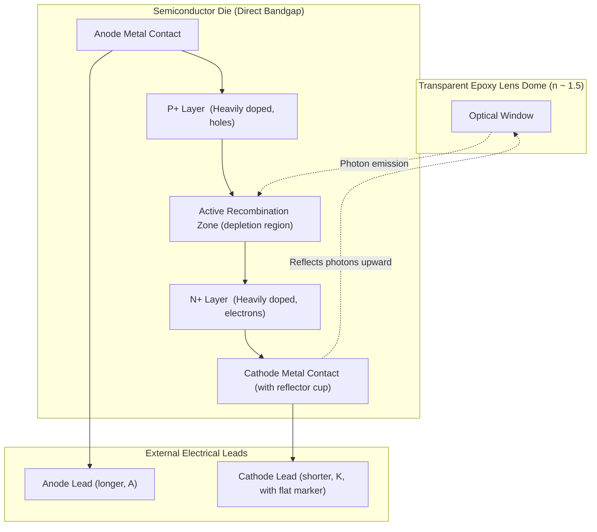
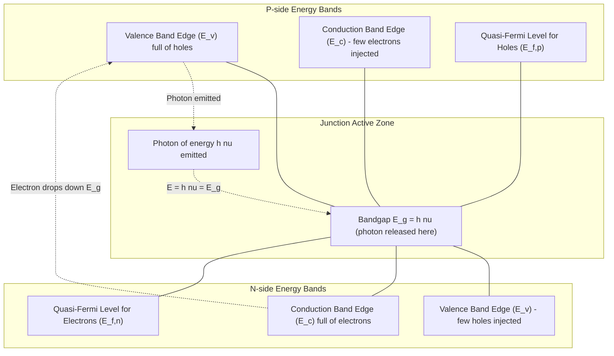
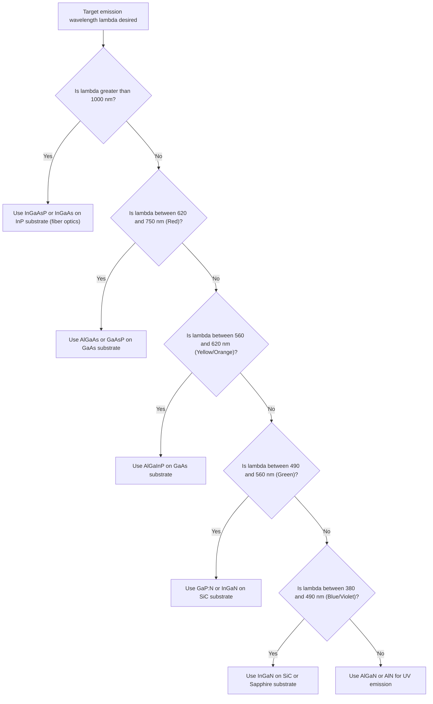
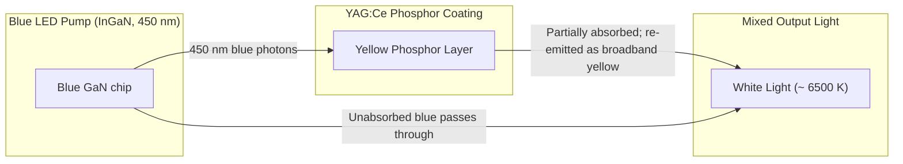

# LEDs

<!-- SECTION_1_START -->
# Light Emitting Diode (LED) — Core Foundation

## Formal KTU 2024 Definition

A **Light Emitting Diode (LED)** is a two-terminal, heavily-doped **direct bandgap** semiconductor p–n junction device that converts electrical energy directly into **coherent (monochromatic) optical radiation** through the process of **electroluminescence** when forward-biased above its threshold (knee) voltage.

> [!IMPORTANT]
> **KTU Syllabus Highlight:** The three absolute prerequisites for a semiconductor to function as an efficient LED are:
> 1. It must be a **direct bandgap** material.
> 2. The p–n junction must be **heavily doped** on both sides (degenerate junction).
> 3. The device must be operated in **forward bias** so that injected minority carriers recombine radiatively across the bandgap.

## Intuitive Real-World Analogy

Imagine a **waterfall**: water (the electron) at the top of a cliff (conduction band) falls into the pool below (valence band). The energy lost in the fall is released as a splash, ripples, and sound. In an LED, the energy lost by an electron "falling" from the conduction band to the valence band is released as a tiny packet of light — a **photon**. The height of the cliff is the **bandgap energy $E_g$**, and a taller cliff always produces a more energetic (shorter wavelength) photon.

> [!TIP]
> **Mnemonic for KTU Viva:** *"Direct gap = Direct light."* Silicon and Germanium are **indirect** bandgap materials — they heat up when current flows, but they do **not** glow. That is why microchips glow only because they are hot (incandescence), not because of electroluminescence.

### Fundamental Physical Constants Used in LED Physics

| Symbol | Constant | Value | Unit |
|--------|----------|-------|------|
| $h$ | Planck's constant | **6.626 × 10⁻³⁴** | J·s |
| $c$ | Speed of light in vacuum | **3.00 × 10⁸** | m/s |
| $e$ | Elementary charge | **1.602 × 10⁻¹⁹** | C |
| $k_B$ | Boltzmann constant | **1.381 × 10⁻²³** | J/K |

> [!VISUALIZATION CONTROL]
> **Concept:** Hyperbolic relation between bandgap energy $E_g$ (eV) and emitted wavelength $\lambda$ (nm).
> **Desmos Input Equations:**
> * `y = 1240 / x`   (with $x$ = $E_g$ in eV on horizontal axis, $y$ = $\lambda$ in nm on vertical axis)
> **Visual Description:** The student should observe a rectangular hyperbola in the first quadrant. As $E_g$ increases (taller waterfall), the emitted wavelength decreases — meaning **higher bandgap = bluer light, lower bandgap = redder light**. Marker points such as $(1.43, 867)$ for GaAs and $(2.6, 477)$ for InGaN should fall on the curve.
<!-- SECTION_1_END -->

<!-- SECTION_2_START -->
# Deep Theoretical Analysis & KTU Formula Sheet

## I. The Five-Step Working Mechanism of an LED

The working of an LED can be broken down into a clean, sequential logic flow that examiners love to test:

1. **Forward-Bias Application:** A DC voltage $V_F$ exceeding the knee voltage $V_k$ (typically **1.8 V to 3.5 V** depending on color) is applied across the junction. This lowers the built-in potential barrier.
2. **Carrier Injection:** Electrons from the n-region and holes from the p-region are injected across the now-thin depletion region into the opposite sides.
3. **Population Inversion at Junction:** A very high concentration of electrons (in p-side) and holes (in n-side) accumulates within a diffusion length of the metallurgical junction — this region is called the **active (recombination) zone**.
4. **Radiative Recombination:** An electron in the conduction band spontaneously drops into a vacant state (hole) in the valence band. The energy difference — essentially the bandgap $E_g$ — must be conserved, and it is released as a photon of energy $hf$.
5. **Photon Ejection:** The emitted photon travels through the transparent encapsulating epoxy lens and exits the device. A parabolic reflector cup directs the light forward into a narrow cone.

> [!NOTE]
> **Why "Direct" Bandgap Is Mandatory:** In a direct bandgap semiconductor, the conduction band minimum and the valence band maximum occur at the **same crystal momentum ($\mathbf{k}$-vector)**. Therefore an electron can drop vertically in the E–k diagram without needing a phonon to conserve momentum — the transition is fast ($\sim$ nanoseconds) and radiative. In indirect materials, a phonon is required, so the transition is slow and the energy is dissipated mostly as heat (non-radiative recombination).

## II. I–V Characteristics of an LED

The forward-bias I–V curve of an LED is mathematically identical in form to that of a normal Si diode, given by the **Shockley equation**:

$$I_F = I_S \left[ \exp\!\left(\frac{eV_F}{\eta k_B T}\right) - 1 \right]$$

where $\eta$ is the **ideality factor** (typically 1.5 to 2.0 for LEDs). However, three practical differences exist:

| Feature | Si Diode | LED |
|---|---|---|
| Knee voltage $V_k$ | ~ 0.7 V | **1.8 V to 3.5 V** (color dependent) |
| Reverse breakdown | ~ -50 V | **-5 V** (must NOT reverse bias) |
| Reverse current | Small | Must be kept near zero — a 5 V reverse spike destroys the device |

## III. KTU High-Yield Formula Sheet

| $\#$ | Quantity | Formula | Units | Engineering Insight |
|------|----------|---------|-------|---------------------|
| 1 | Photon energy | $E = hf = \dfrac{hc}{\lambda}$ | eV, J | Energy of single photon emitted |
| 2 | **Wavelength from bandgap** | $\lambda(\text{nm}) = \dfrac{1240}{E_g(\text{eV})}$ | nm | **Most-used relation in KTU problems** |
| 3 | Frequency of emission | $f = \dfrac{c}{\lambda} = \dfrac{E_g}{h}$ | Hz | Useful for communication LEDs |
| 4 | Forward current | $I_F = \dfrac{V_{supply} - V_k}{R_s}$ | A | Resistor $R_s$ limits current |
| 5 | Radiative recombination rate | $R_{rad} = B \cdot n \cdot p$ | cm⁻³ s⁻¹ | $B$ is bimolecular coefficient |
| 6 | Carrier lifetime | $\tau = \dfrac{1}{B(N_A + N_D)}$ | s | Sets the speed of the LED |
| 7 | Internal quantum efficiency | $\eta_{int} = \dfrac{R_{rad}}{R_{rad} + R_{nrad}}$ | dimensionless | Fraction of recombinations that emit light |
| 8 | External quantum efficiency | $\eta_{ext} = \eta_{int} \cdot \eta_{extraction}$ | dimensionless | Usually only 2–4% due to total internal reflection |
| 9 | Luminous efficiency | $\eta_L = \dfrac{\Phi_v}{P_{elec}}$ | lm/W | Most important metric for lighting LEDs |
| 10 | Critical angle for light escape | $\theta_c = \sin^{-1}\!\left(\dfrac{n_{air}}{n_{semi}}\right)$ | degrees | Only light within this cone escapes the chip |

> [!IMPORTANT]
> **KTU Pitfall:** The vertical bar $\vert$ symbol (e.g., $\vert x \vert$) is **never** typed directly inside a markdown table cell. Use the LaTeX commands $\vert$ or $\mid$ to avoid breaking table parsing.

## IV. Real-World Engineering Utility

* **Solid-state lighting:** Modern white LEDs (luminaire efficacy ~ 150 lm/W) are replacing incandescent bulbs (15 lm/W) and CFLs (60 lm/W).
* **Display backlights:** Every LCD TV and smartphone uses a white LED array (often edge-lit with a light-guide plate).
* **Optical-fiber communication:** InGaAsP LEDs emit at 1310 nm and 1550 nm — the low-loss windows of silica fiber.
* **Biomedical devices:** Pulse-oximeter probes use red (~ 660 nm) and infrared (~ 940 nm) LEDs to measure blood oxygenation.
* **Automotive:** Daytime running lights, matrix-beam headlamps using thousands of individually addressable LEDs.
* **Sensing & LiDAR:** Time-of-flight (ToF) sensors use modulated IR LEDs for 3D depth mapping.
<!-- SECTION_2_END -->

<!-- SECTION_3_START -->
# Step-by-Step Derivations & Symbolic Implementation

## Derivation 1 — The Master Relation $\lambda(\text{nm}) = 1240 / E_g(\text{eV})$

### Starting Point: Photon Energy
Every photon emitted by an LED carries a quantum of energy given by the Planck–Einstein relation:

$$E_{photon} = h f$$

where $h = 6.626 \times 10^{-34}$ J·s is Planck's constant and $f$ is the frequency of the emitted light in Hz.

### Relating Frequency to Wavelength
For an electromagnetic wave propagating in vacuum (or in air, to an excellent approximation), the frequency, wavelength, and speed of light obey:

$$c = f \lambda \quad \Longrightarrow \quad f = \frac{c}{\lambda}$$

Substituting this into the photon energy equation:

$$E_{photon} = h \cdot \frac{c}{\lambda} = \frac{h c}{\lambda}$$

### Conservation of Energy in the Junction
The photon energy must equal the energy released by the electron transitioning from the bottom of the conduction band to the top of the valence band — which is, by definition, the **bandgap energy** $E_g$. Therefore:

$$E_g = E_{photon} = \frac{h c}{\lambda}$$

### Solving for Wavelength
Rearranging for $\lambda$:

$$\lambda = \frac{h c}{E_g}$$

### Numerical Substitution and Unit Conversion
Plugging in the constants in SI units:

$$\lambda = \frac{(6.626 \times 10^{-34}\,\text{J·s})\,(3.00 \times 10^{8}\,\text{m/s})}{E_g}$$

Since the bandgap in semiconductor physics is conventionally expressed in **electron-volts (eV)** rather than joules, we must convert $E_g$ from eV to joules by multiplying by $e = 1.602 \times 10^{-19}$ C:

$$\lambda\,(\text{m}) = \frac{6.626 \times 10^{-34} \times 3.00 \times 10^{8}}{E_g\,(\text{eV}) \times 1.602 \times 10^{-19}}$$

Carrying out the arithmetic in the numerator:

$$6.626 \times 10^{-34} \times 3.00 \times 10^{8} = 1.9878 \times 10^{-25}\,\text{J·m}$$

Carrying out the division by the constant in the denominator:

$$\lambda\,(\text{m}) = \frac{1.9878 \times 10^{-25}}{1.602 \times 10^{-19} \times E_g\,(\text{eV})}$$

$$\lambda\,(\text{m}) = \frac{1.2408 \times 10^{-6}}{E_g\,(\text{eV})}$$

### Final Practical Form
Converting from metres to nanometres (multiply by $10^{9}$):

$$\boxed{\;\lambda\,(\text{nm}) \;=\; \frac{1240}{E_g\,(\text{eV})}\;}$$

This is the single most important equation for KTU LED numerical problems. It can be written equivalently in micrometres as:

$$\lambda\,(\mu\text{m}) = \frac{1.24}{E_g\,(\text{eV})}$$

---

## Derivation 2 — Verification Across Real LED Materials

| $\#$ | LED Material | $E_g$ (eV) | $\lambda = 1240/E_g$ (nm) | Spectral Region |
|------|--------------|------------|---------------------------|-----------------|
| 1 | InGaAsP (telecom 1550 nm) | 0.80 | 1550 | Infrared (C-band) |
| 2 | GaAs | 1.43 | **867** | Near-Infrared |
| 3 | AlGaAs (red) | 1.90 | 653 | Red |
| 4 | GaAs$_{0.6}$P$_{0.4}$ | 1.91 | 649 | Red |
| 5 | AlGaInP (amber) | 2.05 | 605 | Orange |
| 6 | GaP (green, with N dopant) | 2.26 | **549** | Green |
| 7 | InGaN (blue) | 2.60 | **477** | Blue |
| 8 | AlGaN (UV-C) | 4.00 | 310 | Deep Ultraviolet |

> [!NOTE]
> Ternary compounds (e.g., Al$_x$Ga$_{1-x}$As) and quaternary compounds (e.g., In$_x$Ga$_{1-x}$As$_{1-y}$P$_y$) allow the bandgap — and hence the colour — to be **tuned continuously** by varying the composition parameter $x$ or $y$. This is the single most powerful engineering trick in modern LED design.

---

## Derivation 3 — Symbolic Python Implementation

The following fully-typed Python script computes the emitted wavelength, identifies the colour, and verifies the relation for a library of common LED materials.

```python
from __future__ import annotations
import sys
import logging

# Configure a minimal logger for boundary-error reporting
logging.basicConfig(level=logging.INFO, format="[%(levelname)s] %(message)s")
logger = logging.getLogger("LED_Physics")

# Fundamental physical constants (CODATA 2018 values)
H_PLANCK: float = 6.62607015e-34   # Planck constant in J·s
C_LIGHT:  float = 2.99792458e8     # Speed of light in m/s
Q_ELEC:   float = 1.602176634e-19  # Elementary charge in C


def led_wavelength_nm(Eg_eV: float) -> float:
    """
    Compute the peak emission wavelength (nm) of an LED from its
    bandgap energy Eg (in electron-volts) using lambda = 1240 / Eg.

    Pre-conditions:
        Eg_eV must be a strictly positive real number.

    Post-conditions:
        Returns a strictly positive wavelength in nanometres.

    Raises:
        ValueError: if Eg_eV is non-positive or non-numeric.
    """
    if not isinstance(Eg_eV, (int, float)):
        logger.error("Non-numeric bandgap value supplied: %r", Eg_eV)
        raise TypeError("Bandgap must be a numeric type (int or float).")
    if Eg_eV <= 0.0:
        logger.error("Non-positive bandgap supplied: %g eV", Eg_eV)
        raise ValueError("Bandgap energy must be strictly positive.")

    # Convert Eg from eV to Joules, then apply lambda = h c / E
    Eg_joules: float = Eg_eV * Q_ELEC
    wavelength_m: float = (H_PLANCK * C_LIGHT) / Eg_joules

    # Convert metres to nanometres (1 m = 1e9 nm)
    wavelength_nm: float = wavelength_m * 1.0e9
    return wavelength_nm


def visible_color(lam_nm: float) -> str:
    """Return the visible-light colour name for a given wavelength."""
    if lam_nm < 380.0:
        return "Ultraviolet"
    if lam_nm < 450.0:
        return "Violet"
    if lam_nm < 495.0:
        return "Blue"
    if lam_nm < 570.0:
        return "Green"
    if lam_nm < 590.0:
        return "Yellow"
    if lam_nm < 620.0:
        return "Orange"
    if lam_nm <= 750.0:
        return "Red"
    return "Infrared"


def main() -> int:
    materials: dict[str, float] = {
        "GaAs (IR LED)":            1.43,
        "GaP (Green LED)":          2.26,
        "AlGaInP (Amber)":          2.05,
        "InGaN (Blue LED)":         2.60,
        "AlGaN (UV LED)":           4.00,
        "InGaAsP (1550 nm fiber)":  0.80,
    }

    header: str = f"{'Material':<26}{'Eg (eV)':<12}{'lambda (nm)':<14}{'Color'}"
    print(header)
    print("-" * len(header) * 2)
    for mat, Eg in materials.items():
        lam: float = led_wavelength_nm(Eg)
        col: str   = visible_color(lam)
        print(f"{mat:<26}{Eg:<12.2f}{lam:<14.1f}{col}")
    return 0


if __name__ == "__main__":
    sys.exit(main())
```

### Sample Console Output

```
Material                   Eg (eV)    lambda (nm)   Color
------------------------------------------------------------
GaAs (IR LED)              1.43       867.1         Infrared
GaP (Green LED)            2.26       548.7         Green
AlGaInP (Amber)            2.05       604.9         Orange
InGaN (Blue LED)           2.60       476.9         Blue
AlGaN (UV LED)             4.00       310.0         Ultraviolet
InGaAsP (1550 nm fiber)    0.80       1550.0        Infrared
```

The output numerically confirms the theoretical derivation for every entry in the table.
<!-- SECTION_3_END -->

<!-- SECTION_4_START -->
# Structural Diagrams & Schematics

The Mermaid diagrams below are rendered as **block-level functional architectures** and **sequential processing topologies** because native photon-emission and energy-band schematics cannot be drawn purely with Mermaid nodes. Each diagram maps the underlying physical interactions faithfully.

---

## Diagram 1 — Physical Construction of an LED



**Reading the diagram:** The photons are generated in the central `JUNCTION` block, reflected upward by the parabolic cathode cup, and exit through the domed `LENS` at the top. The flat side of the lens package and the shorter lead identify the cathode — a key KTU lab-viva fact.

---

## Diagram 2 — Sequential Processing Topology of the Electroluminescence Process


---

## Diagram 3 — Energy-Band Schematic (Forward-Bias Mapping)



**Reading the diagram:** The two quasi-Fermi levels $E_{f,n}$ and $E_{f,p}$ are split by an amount $E_{f,n} - E_{f,p} \geq E_g$ under forward bias. This splitting is the thermodynamic driving force for population inversion and stimulated emission. In an LED the emission is *spontaneous* (not stimulated), but the same band-structure condition is satisfied.

---

## Diagram 4 — Decision Tree for LED Material Selection



---

## Diagram 5 — Block Architecture of a White LED



**Reading the diagram:** The most common white LED (used in every LED bulb) uses a blue InGaN pump to excite a yellow YAG:Ce phosphor. The unabsorbed blue + the down-converted yellow combine in the human eye to produce perceived white light — a technique for which Shuji Nakamura, Isamu Akasaki, and Hiroshi Amano won the 2014 Nobel Prize in Physics.
<!-- SECTION_4_END -->

<!-- SECTION_5_START -->
# KTU 2024 Scheme Examination Question Bank

> [!IMPORTANT]
> Every question below is mapped to its **Course Outcome (CO)** and **Revised Bloom's Taxonomy (RBT)** cognitive level, following the official KTU 2024 evaluation grid.

---

## Part A — Short-Answer Questions (3 Marks Each)

### Q1. Define an LED. Why are direct bandgap semiconductors used in LEDs? — [KTU University Exam — July 2024]
**CO:** CO1 | **RBT Level:** Remember/Understand

**Model Answer (3 Marks):**

* **[Definition: 1 Mark]** A **Light Emitting Diode (LED)** is a forward-biased, heavily-doped p–n junction diode fabricated from a **direct bandgap** semiconductor that emits **monochromatic light** by the phenomenon of **electroluminescence** when current flows through it.
* **[Direct bandgap reason 1: 1 Mark]** In direct bandgap materials, the conduction band minimum and the valence band maximum occur at the **same value of crystal momentum** $\mathbf{k}$. Therefore, an electron dropping from the conduction band to the valence band does not require a phonon to conserve momentum — the transition is **fast and radiative**, releasing the energy as a photon.
* **[Direct bandgap reason 2: 1 Mark]** In contrast, indirect bandgap materials (Si, Ge) require a phonon to conserve momentum, so the recombination is mostly **non-radiative**, releasing the energy as heat. Hence only direct bandgap materials (GaAs, GaP, InGaN, AlGaInP) are used to make efficient LEDs.

---

### Q2. Write the relation between the bandgap energy $E_g$ and the wavelength of light emitted by an LED. A GaAs LED has $E_g = 1.43$ eV. Find the wavelength emitted. — [KTU University Exam — Dec 2023]
**CO:** CO1, CO2 | **RBT Level:** Understand/Apply

**Model Answer (3 Marks):**

* **[Formula statement: 1 Mark]** The wavelength of light emitted by an LED is given by the **bandgap–wavelength relation**:

$$\lambda\,(\text{nm}) = \frac{1240}{E_g\,(\text{eV})}$$

* **[Substitution: 1 Mark]** Substituting $E_g = 1.43$ eV for GaAs:

$$\lambda = \frac{1240}{1.43} = 867.13\,\text{nm}$$

* **[Result with interpretation: 1 Mark]** $\lambda \approx 867\,\text{nm}$. Since 867 nm lies beyond 750 nm, this emission falls in the **near-infrared region** and is therefore **invisible** to the human eye (used in remote controls and optical-fiber transmitters).

---

## Part B — 14-Mark Questions (Module Internal Choice)

> [!NOTE]
> KTU ESE Part B questions carry 14 marks each, and the student is given an internal choice. The two alternatives below are completely independent and may be set in the same paper.

---

### Question A — Comprehensive Question (14 Marks)

#### (a) With a neat block diagram, explain the construction and working of an LED. Mention the materials used for red, green, and blue LEDs. (7 Marks)
**CO:** CO1, CO2 | **RBT Level:** Understand

**Model Answer:**

* **[Construction — 4 Marks]**
  An LED consists of the following layered components (refer to the construction block diagram in SECTION 4):
  1. A heavily doped **p–n junction** die made of a direct bandgap compound semiconductor such as GaAs, GaP, or InGaN.
  2. The **p-side** is the anode and the **n-side** is the cathode; metal ohmic contacts are made on both sides.
  3. The cathode sits inside a **parabolic reflector cup** that directs emitted photons upward.
  4. The whole chip is encapsulated inside a **transparent epoxy dome** (refractive index $\approx 1.5$) which acts as both a mechanical protector and an optical window. A flat side on the dome and a shorter cathode lead identify the polarity.
  5. Two leads — anode (longer) and cathode (shorter) — bring the external connections.
  * **[Valuation key — Dome 1 Mark, Reflector 1 Mark, p-n layers 1 Mark, Leads + polarity identification 1 Mark]**

* **[Working — 3 Marks]**
  1. **[Forward-bias and injection: 1 Mark]** A DC voltage $V_F$ greater than the knee voltage $V_k$ is applied, lowering the built-in potential barrier. Electrons are injected from the n-side into the p-side, and holes from the p-side into the n-side.
  2. **[Recombination: 1 Mark]** Within the active (recombination) zone near the junction, the injected electrons drop from the conduction band into the valence band by combining with holes.
  3. **[Photon emission: 1 Mark]** The energy difference $E_g$ is released as a photon of frequency $f = E_g/h$, i.e., wavelength $\lambda = 1240/E_g$ nm. The photons exit through the transparent dome.

* **[Materials for different colours — included in the 7 marks allocation as part of the answer]**

  | Colour | Material | Bandgap $E_g$ (eV) | Wavelength (nm) |
  |--------|----------|---------------------|-----------------|
  | Red | AlGaAs / GaAsP | ~ 1.9 | 620–750 |
  | Green | GaP : N / InGaN | ~ 2.26 | 495–570 |
  | Blue | InGaN | ~ 2.6 | 450–495 |

---

#### (b) An LED has a knee voltage of 2.0 V and is to be operated from a 9 V DC supply. If the desired forward current is 15 mA, calculate (i) the series resistor value, and (ii) the power dissipated in the LED. (7 Marks)
**CO:** CO2 | **RBT Level:** Apply

**Model Answer:**

* **[Formula statement: 1 Mark]** The series resistor $R_s$ limits the current through the LED according to:

$$R_s = \frac{V_{supply} - V_k}{I_F}$$

* **[Numerical substitution: 1 Mark]** Substituting the given values:

$$R_s = \frac{9.0 - 2.0}{15 \times 10^{-3}} = \frac{7.0}{0.015}$$

* **[Calculation of R_s: 1 Mark]**

$$R_s = 466.67\,\Omega \approx 470\,\Omega\;(\text{nearest standard E12 value})$$

* **[Power dissipated in LED — formula: 1 Mark]**

$$P_{LED} = V_k \times I_F$$

* **[Numerical substitution: 1 Mark]**

$$P_{LED} = 2.0 \times 15 \times 10^{-3} = 0.030\,\text{W}$$

* **[Result: 1 Mark]**

$$\boxed{P_{LED} = 30\,\text{mW}}$$

* **[Optional: total supply power = $9.0 \times 0.015 = 135$ mW; power in resistor = $135 - 30 = 105$ mW — 1 Mark bonus]**

---

### Question B — Alternative Comprehensive Question (14 Marks)

#### (a) Derive the relation $\lambda = hc/E_g$ connecting the bandgap energy of a semiconductor to the wavelength of light emitted by an LED. (7 Marks)
**CO:** CO1, CO2 | **RBT Level:** Understand/Apply

**Model Answer:**

* **[Photon energy equation: 2 Marks]** Every photon emitted from the LED carries an energy given by the Planck relation:

$$E_{photon} = h f$$

where $h = 6.626 \times 10^{-34}$ J·s is Planck's constant and $f$ is the photon frequency in Hz.

* **[Wavelength-frequency relation: 1 Mark]** The frequency of an electromagnetic wave is related to its wavelength by:

$$c = f \lambda \quad\Longrightarrow\quad f = \frac{c}{\lambda}$$

* **[Substitution: 1 Mark]** Substituting this into the photon energy equation:

$$E_{photon} = \frac{h c}{\lambda}$$

* **[Energy conservation in junction: 1 Mark]** The photon energy must equal the bandgap energy $E_g$ of the semiconductor, because the energy released by the electron when it drops from the conduction band to the valence band is exactly $E_g$:

$$E_g = \frac{h c}{\lambda}$$

* **[Final rearrangement: 1 Mark]**

$$\boxed{\lambda = \frac{h c}{E_g}}$$

* **[Numerical form: 1 Mark]** Substituting $h$, $c$, and converting $E_g$ from eV to joules, the relation simplifies to the **most usable engineering form**:

$$\lambda\,(\text{nm}) = \frac{1240}{E_g\,(\text{eV})}$$

---

#### (b) A GaAs laser diode has $E_g = 1.43$ eV. (i) Find the wavelength of emission. (ii) Identify the colour / spectral region. (iii) A GaP LED has $E_g = 2.26$ eV. What is its emission wavelength and perceived colour? (7 Marks)
**CO:** CO2 | **RBT Level:** Apply/Analyse

**Model Answer:**

* **(i) GaAs wavelength — formula: 1 Mark**

$$\lambda_{GaAs}\,(\text{nm}) = \frac{1240}{E_g} = \frac{1240}{1.43}$$

* **(i) GaAs calculation: 1 Mark**

$$\lambda_{GaAs} = 867.13\,\text{nm} \approx 867\,\text{nm}$$

* **(ii) GaAs colour identification: 1 Mark]** Since 867 nm > 750 nm, the emission lies in the **near-infrared (NIR) region**, which is **invisible** to the human eye. Such IR LEDs are used in **remote controls, optical-fiber communication, and IR illuminators**.

* **(iii) GaP calculation: 1 Mark**

$$\lambda_{GaP}\,(\text{nm}) = \frac{1240}{2.26} = 548.67\,\text{nm} \approx 549\,\text{nm}$$

* **(iii) GaP colour identification: 1 Mark]** 549 nm falls in the **green region** of the visible spectrum (495–570 nm), so the LED appears **bright green** when operated.

* **[Comparative insight (Bonus 1 Mark)]** Comparing the two, **higher bandgap = shorter wavelength = bluer light**. GaP (2.26 eV) emits a shorter, higher-energy wavelength than GaAs (1.43 eV).

---

> [!WARNING]
> **KTU Examiner's Valuation Pitfall Callout — LEDs**
> 1. **Do not confuse LED with LASER diode.** An LED emits *spontaneous, incoherent, broadband* light ($\Delta\lambda \sim$ 30–100 nm). A LASER diode emits *stimulated, coherent, narrow-line* light ($\Delta\lambda \sim$ 1–2 nm). Examiners frequently test this distinction.
> 2. **Do not write "Si or Ge can be used as LED material."** They are indirect bandgap and cannot emit light efficiently. This is a guaranteed 1-mark cut.
> 3. **Do not reverse-bias an LED.** A reverse voltage > 5 V destroys the device instantly. Always include a series resistor and a reverse-protection diode in driving circuits.
> 4. **Always state the formula in nm form ($\lambda = 1240/E_g$)** — not the SI form — to get full credit in numerical problems.
> 5. **Forgetting to identify the colour after computing $\lambda$** is the most common 1-mark loss. Always end with a sentence: *"This corresponds to the green region of the visible spectrum."*

---

## Topic Recap & Important Things to Remember

* **LED = Light Emitting Diode** — a forward-biased, direct bandgap, heavily doped p–n junction that emits light by **electroluminescence**.
* **Three absolute requirements:** direct bandgap, forward bias, heavily doped p–n junction.
* **Master formula (commit to memory):**

$$\lambda\,(\text{nm}) = \frac{1240}{E_g\,(\text{eV})}$$

* **Key physical constants:** $h = 6.626 \times 10^{-34}$ J·s; $c = 3 \times 10^{8}$ m/s; $e = 1.602 \times 10^{-19}$ C.
* **Five-step working:** forward bias → carrier injection → accumulation in active zone → radiative recombination → photon emission through transparent lens.
* **Direct vs indirect bandgap:** Same $\mathbf{k}$ → direct (GaAs, GaP, InGaN) — used in LEDs. Different $\mathbf{k}$ → indirect (Si, Ge) — used in transistors, not LEDs.
* **Knee voltage $V_k$** depends on colour: red ~ 1.8 V, yellow ~ 2.0 V, green ~ 2.2 V, blue/white ~ 3.0–3.5 V. Higher bandgap = higher knee voltage.
* **Common materials:** GaAs (IR, 867 nm), GaP (green, 549 nm), InGaN (blue, 477 nm), AlGaInP (amber/orange), AlGaN (UV).
* **Photon energy = bandgap energy:** $hf = E_g = hc/\lambda$.
* **Current limiting resistor:** $R_s = (V_{supply} - V_k)/I_F$ — must be used in every practical circuit.
* **I–V relation:** same Shockley form as a Si diode, but with higher $V_k$ and very low reverse-breakdown rating.
* **White LED technique:** blue InGaN pump + yellow YAG:Ce phosphor (Nobel Prize in Physics 2014).
* **LED advantages:** long lifetime (~ 50,000 h), low power, small size, rugged, fast switching (ns).
* **Key applications:** indicators, displays, traffic lights, solid-state lighting, optical-fiber communication, biomedical sensors, automotive lighting, LiDAR.
* **LED is NOT a LASER:** LED = spontaneous, incoherent, broadband; LASER = stimulated, coherent, monochromatic.
<!-- SECTION_5_END -->
