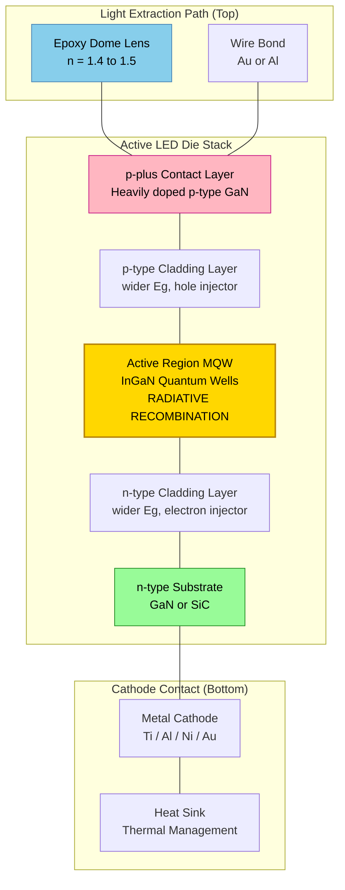
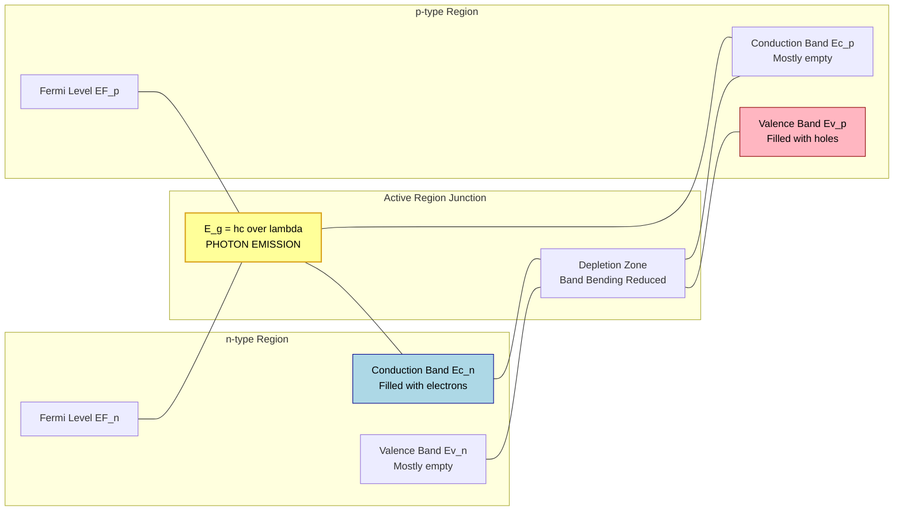
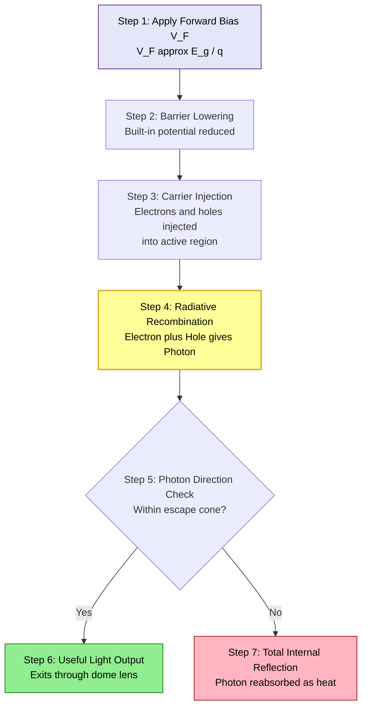

# Light Emitting Diode

<!-- SECTION_1_START -->
# Light Emitting Diode (LED) — Core Definition & Intuitive Overview

## Formal Academic Definition (KTU 2024 Syllabus Terminology)

A **Light Emitting Diode (LED)** is a two-terminal, heavily doped $p\text{-}n$ junction semiconductor device that converts **electrical energy into light energy** through the phenomenon of **electratluminescence** (specifically, **injection electroluminescence**). When forward-biased, charge carriers (electrons and holes) injected across the depletion region undergo **radiative recombination**, releasing energy in the form of **photons** whose wavelength is governed primarily by the **bandgap energy** $E_g$ of the active semiconductor material.

> [!IMPORTANT]
> **KTU 2024 Board Focus:** LEDs must be fabricated from **direct bandgap** semiconductors (e.g., GaAs, GaAsP, InGaN, AlGaInP). Indirect bandgap materials (e.g., Si, Ge) are *inefficient* light emitters because radiative recombination is suppressed by phonon-assisted transitions, and these will appear in Part A short-answer questions.

> [!NOTE]
> **Standard KTU Notation Used Throughout These Notes**
> * $E_g$ — Bandgap energy of the active region (in eV)
> * $\lambda$ — Peak emission wavelength (in nm)
> * $h$ — Planck's constant $\approx 6.626 \times 10^{-34} \text{ J}\cdot\text{s}$
> * $c$ — Speed of light in vacuum $\approx 3 \times 10^8 \text{ m/s}$
> * $q$ — Elementary charge $\approx 1.602 \times 10^{-19} \text{ C}$

## Conceptual Analogy — "The Luminous Mailbox"

Imagine a **two-lane highway** where:
- The **left lane** carries only *electrons* (negative "letters") from the $n$-side toward the junction.
- The **right lane** carries only *holes* (empty mailboxes waiting for letters) from the $p$-side toward the junction.
- The **junction itself** is a **luminous mailbox** that opens only when a letter falls into a waiting mailbox.

Every time an *electron falls into a hole* (i.e., a recombination event), the mailbox **flashes a tiny burst of light** — exactly one photon of energy $E_g$. The **color** of the flash is fixed by the *type of mailbox material* (its bandgap), while the **brightness** is controlled by the *rate of letters flowing in* (the forward current $I_F$).

This is the heart of every LED: a controlled stream of electron–hole reunions, each producing a photon whose energy (and therefore color) is dictated by the **bandgap** of the semiconductor.

## Energy-Band Visualization

> [!VISUALIZATION CONTROL]
> **Concept:** Photon Energy vs Bandgap — Wavelength Color Mapping
> **GeoGebra / Desmos Input Equations:**
> * `E(eV) = 1.24 / λ(μm)` — Fundamental bandgap–wavelength relationship
> * `λ(nm) = 1240 / E_g(eV)` — Inverse form for visible-spectrum mapping
> **Visual Description:** A rectangular plot spanning the visible spectrum from **380 nm (violet)** to **750 nm (red)**. As $E_g$ *increases* from $\sim 1.65 \text{ eV}$ to $\sim 3.26 \text{ eV}$, $\lambda$ *decreases* — so wide-bandgap materials (GaN family) emit **blue/violet** light, while narrower-bandgap materials (GaAs family) emit **red/infrared** light. Students should observe the inverse hyperbolic decay.

<!-- SECTION_1_END -->

<!-- SECTION_2_START -->
# Deep Theoretical Analysis & KTU High-Yield Formula Sheet

## 1. Operational Working Principle — Step-by-Step

When a **forward bias** $V_F$ (typically between **1.2 V and 3.5 V**, depending on color) is applied across the LED terminals, the following physical sequence unfolds:

* **Carrier Injection Across the Junction**
  The applied electric field lowers the built-in potential barrier $V_{bi}$, allowing a high concentration of **electrons** from the $n$-side and **holes** from the $p$-side to be injected into the **depletion / active region** near the junction.

* **Population Inversion in the Active Region**
  The injected minority carriers accumulate in a thin zone called the **active region** (or **recombination zone**), creating a non-equilibrium density of electrons in the conduction band and holes in the valence band.

* **Radiative Recombination (The Light-Producing Step)**
  An electron in the conduction band (energy $E_c$) spontaneously drops into an empty state (hole) in the valence band (energy $E_v$). The energy difference is released as a **photon** with energy
  $$E_{photon} = h\nu = E_c - E_v = E_g$$
  This is the fundamental emission condition of an LED.

* **Photon Escape and Directional Emission**
  Photons emitted toward the **top hemisphere** (within the escape cone defined by Snell's law at the semiconductor–air interface) exit the device and contribute to useful light. Photons striking the interface beyond the **critical angle** $\theta_c$ undergo **total internal reflection** and are eventually reabsorbed — a key loss mechanism addressed by **dome-shaped epoxy encapsulants**.

* **Direct vs. Indirect Bandgap Constraint**
  Radiative recombination is *efficient* only in **direct bandgap** materials, where the conduction band minimum and valence band maximum occur at the **same crystal momentum** $k$. In **indirect bandgap** materials (Si, Ge), the transition requires a phonon to conserve momentum, making the process orders of magnitude slower — and the device essentially non-luminous.

> [!NOTE]
> **KTU 2024 Key Insight:** This is why the semiconductor industry uses **III–V compound semiconductors** (GaAs, InP, GaN) for LEDs and laser diodes, while **Si** (an indirect bandgap material) dominates electronics but cannot emit light efficiently.

## 2. Constructional Anatomy of a Standard LED

A modern LED die consists of the following layered structure, grown typically via **MOCVD (Metal-Organic Chemical Vapor Deposition)** or **MBE (Molecular Beam Epitaxy)**:

* **$p^+$-type top contact layer** — heavily doped, very thin, to allow maximum light extraction.
* **$p$-type confinement layer** — wider bandgap than the active region; confines holes.
* **Active (recombination) region** — typically a **multiple quantum well (MQW)** structure (e.g., InGaN/GaN for blue LEDs), where the actual radiative recombination occurs.
* **$n$-type confinement layer** — wider bandgap; confines electrons.
* **$n$-type substrate** — mechanical support; also serves as the cathode contact.
* **Top anode contact** (metal pad, e.g., Au/Ni) and **bottom cathode contact** (e.g., Au/Ge/Ni).
* **Epoxy lens / dome** — provides mechanical protection, refractive-index matching, and beam shaping.

## 3. Materials, Colors, and Bandgap — A KTU Must-Know Table

| Material System | Emission Color | Approx. $E_g$ (eV) | Approx. $\lambda$ (nm) | Typical $V_F$ (V) |
| :--- | :--- | :---: | :---: | :---: |
| GaAs | Infrared (IR) | 1.42 | 870 | 1.2 – 1.5 |
| AlGaAs | Red / IR | 1.6 – 1.9 | 650 – 870 | 1.5 – 1.8 |
| GaAs$_{0.6}$P$_{0.4}$ | Red | 1.91 | 650 | 1.6 – 1.8 |
| AlGaInP | Orange / Yellow | 2.0 – 2.2 | 560 – 620 | 1.9 – 2.1 |
| GaP (Zn, O doped) | Green / Red | 2.26 | 560 | 2.0 – 2.2 |
| SiC | Blue (early type) | 2.9 | 470 | 3.0 – 3.2 |
| GaN | UV | 3.4 | 365 | 3.0 – 3.5 |
| InGaN / GaN MQW | Blue / Green | 2.6 – 3.1 | 400 – 500 | 3.0 – 3.4 |

> [!IMPORTANT]
> **Mnemonic for KTU Viva:** *"Go Blue, Get Higher Voltage"* — shorter wavelength (blue) ↔ wider bandgap ↔ higher forward voltage. This relationship is **inverse and exact**, derived from $\lambda = 1240/E_g$.

## 4. KTU Formula Sheet / Cheat Sheet

| # | Formula | Description / Engineering Use |
| :--- | :--- | :--- |
| 1 | $E_g = \dfrac{hc}{\lambda} = \dfrac{1240}{\lambda(\text{nm})} \text{ eV}$ | Relates semiconductor bandgap to peak emission wavelength — the **single most important equation** in LED physics. |
| 2 | $\lambda(\text{nm}) = \dfrac{1240}{E_g(\text{eV})}$ | Inverse form; used to select materials for a target color. |
| 3 | $V_F \approx \dfrac{E_g}{q}$ (in volts, with $E_g$ in eV) | Approximate forward voltage drop (actual $V_F$ slightly higher due to ohmic & contact losses). |
| 4 | $\eta_{ext} = \eta_{int} \times \eta_{inj} \times \eta_{extraction}$ | **External Quantum Efficiency (EQE)** = product of internal efficiency, injection efficiency, and light extraction efficiency. |
| 5 | $\eta_{luminous} = \dfrac{\Phi_v}{P_{electrical}} \text{ (lm/W)}$ | **Luminous efficacy** — visible-light efficiency weighted by human eye response $V(\lambda)$. |
| 6 | $P_{optical} = \eta_{ext} \times V_F \times I_F$ | Optical output power in terms of electrical input. |
| 7 | $\theta_c = \sin^{-1}\!\left(\dfrac{n_{air}}{n_{semi}}\right)$ | **Critical angle** for total internal reflection; defines the escape cone (typically $\theta_c \approx 16^\circ$ for GaAs). |
| 8 | $\eta_{Fresnel} = 1 - \left(\dfrac{n_{semi} - n_{air}}{n_{semi} + n_{air}}\right)^2$ | Single-surface Fresnel transmission loss. |

## 5. Real-World Engineering Utility

LEDs are the cornerstone of modern photonics, information science, and solid-state lighting:

* **Display technology:** Backlights for LCDs, micro-LED displays, full-color outdoor signage.
* **Optical communication:** LEDs used in **optical fiber links** (especially 850 nm and 1300 nm devices) for short-range data transmission; though laser diodes dominate long-haul links.
* **Sensors:** Paired with photodiodes in **optical isolators**, **encoders**, and **proximity sensors**.
* **Solid-state lighting:** Replacement of incandescent and fluorescent lamps — orders-of-magnitude lower power consumption and longer lifetime (>50,000 hours).
* **Biomedical instrumentation:** Pulse oximeters, fluorescence microscopy, phototherapy devices.
* **Visible Light Communication (VLC) / Li-Fi:** High-speed data modulation using LED intensity, a key topic in **information science** curricula.

<!-- SECTION_2_END -->

<!-- SECTION_3_START -->
# Step-by-Step Derivations & Symbolic Implementation

## Derivation 1: Bandgap–Wavelength Relationship (KTU Board Favorite)

**Given:** A photon is emitted during band-to-band recombination in a direct-bandgap LED.
**To Derive:** The relationship $E_g = 1240 / \lambda(\text{nm})$.

**Step 1 — Start from the fundamental Planck–Einstein energy equation.**
The energy of a photon of frequency $\nu$ and wavelength $\lambda$ is

$$E = h\nu = \dfrac{hc}{\lambda}$$

**Step 2 — Apply the band-to-band recombination condition.**
The photon energy must equal the bandgap of the semiconductor at the recombination site:

$$E_{photon} = E_g$$

Equating the two expressions:

$$E_g = \dfrac{hc}{\lambda}$$

**Step 3 — Insert numerical values of the physical constants.**

* $h = 6.626 \times 10^{-34} \text{ J}\cdot\text{s}$
* $c = 2.998 \times 10^8 \text{ m/s}$
* $1 \text{ eV} = 1.602 \times 10^{-19} \text{ J}$

Compute the numerator $hc$ in Joule-metres:

$$hc = (6.626 \times 10^{-34}) \times (2.998 \times 10^8) = 1.986 \times 10^{-25} \text{ J}\cdot\text{m}$$

**Step 4 — Convert to a convenient form (eV·nm).**
First convert $hc$ from J·m to eV·m:

$$hc = \dfrac{1.986 \times 10^{-25} \text{ J}\cdot\text{m}}{1.602 \times 10^{-19} \text{ J/eV}} = 1.240 \times 10^{-6} \text{ eV}\cdot\text{m}$$

Then convert metres to nanometres (multiply by $10^9$):

$$hc = 1.240 \times 10^{-6} \times 10^9 \text{ eV}\cdot\text{nm} = 1240 \text{ eV}\cdot\text{nm}$$

**Step 5 — Write the final, KTU-board-friendly formula.**

$$\boxed{E_g \text{ (eV)} = \dfrac{1240}{\lambda \text{ (nm)}}}$$

And its inverse:

$$\boxed{\lambda \text{ (nm)} = \dfrac{1240}{E_g \text{ (eV)}}}$$

> [!NOTE]
> **Valuation Key Step:** Board examiners typically award **2 marks for the derivation** and **1 mark for the final 1240-nm compact form**. Always show the units conversion explicitly.

---

## Derivation 2: Critical Angle and Light Extraction Efficiency

**Given:** A photon is generated isotropically inside a high-index semiconductor ($n_{semi} \approx 3.4$ for GaAs) trying to escape into air ($n_{air} = 1.0$).

**Step 1 — Apply Snell's law at the semiconductor–air interface.**
At the critical angle $\theta_c$, the refracted ray grazes the interface ($\theta_{air} = 90^\circ$):

$$n_{semi} \sin \theta_c = n_{air} \sin 90^\circ = n_{air}$$

**Step 2 — Solve for $\theta_c$.**

$$\sin \theta_c = \dfrac{n_{air}}{n_{semi}} = \dfrac{1.0}{3.4} = 0.294$$

$$\theta_c = \sin^{-1}(0.294) \approx 17.1^\circ$$

**Step 3 — Calculate the fraction of photons in the escape cone.**
For isotropic emission inside a hemisphere, the fraction within the escape cone is the ratio of solid angles:

$$\eta_{cone} = \dfrac{1 - \cos \theta_c}{2} = \dfrac{1 - \cos(17.1^\circ)}{2} = \dfrac{1 - 0.956}{2} = 0.022 = 2.2\%$$

**Step 4 — Apply Fresnel reflection correction at normal incidence.**

$$T_{Fresnel} = 1 - \left(\dfrac{n_{semi} - n_{air}}{n_{semi} + n_{air}}\right)^2 = 1 - \left(\dfrac{3.4 - 1}{3.4 + 1}\right)^2 = 1 - (0.545)^2 = 1 - 0.297 = 0.703$$

**Step 5 — Compute the total single-surface extraction efficiency.**

$$\eta_{extraction,\,single} = \eta_{cone} \times T_{Fresnel} = 0.022 \times 0.703 \approx 0.0155 = 1.55\%$$

> [!IMPORTANT]
> **Engineering Implication:** Only about **1–2 %** of generated photons escape from a flat GaAs LED in a single pass. This is why modern high-brightness LEDs use:
> 1. **Dome-shaped epoxy encapsulants** (hemispherical geometry places the semiconductor at the center of curvature, eliminating total internal reflection).
> 2. **Textured surface roughening** to randomize photon trajectories.
> 3. **Distributed Bragg Reflectors (DBR)** on the substrate to recycle downward-emitted photons.

---

## Derivation 3: Optical Output Power from External Quantum Efficiency

**Given:** An LED is driven at forward current $I_F = 20 \text{ mA}$, with $V_F = 3.2 \text{ V}$ and $\eta_{ext} = 0.40$ (40% EQE — typical for a high-quality blue InGaN LED). The peak emission wavelength is $\lambda = 470 \text{ nm}$.

**Step 1 — Electrical input power.**

$$P_{in} = V_F \times I_F = 3.2 \text{ V} \times 20 \times 10^{-3} \text{ A} = 64 \text{ mW}$$

**Step 2 — Rate of photon generation (photons per second).**
Each electron contributing to $I_F$ produces, on average, $\eta_{ext}$ photons. The number of electrons per second is $I_F / q$:

$$\dot{N}_{photons} = \eta_{ext} \times \dfrac{I_F}{q} = 0.40 \times \dfrac{20 \times 10^{-3}}{1.602 \times 10^{-19}} = 0.40 \times 1.248 \times 10^{17} = 4.99 \times 10^{16} \text{ photons/s}$$

**Step 3 — Energy of a single emitted photon.**

$$E_{photon} = \dfrac{hc}{\lambda} = \dfrac{1240 \text{ eV}\cdot\text{nm}}{470 \text{ nm}} = 2.638 \text{ eV} = 2.638 \times 1.602 \times 10^{-19} \text{ J} = 4.227 \times 10^{-19} \text{ J}$$

**Step 4 — Optical output power.**

$$P_{opt} = \dot{N}_{photons} \times E_{photon} = 4.99 \times 10^{16} \times 4.227 \times 10^{-19} = 2.11 \times 10^{-2} \text{ W} = 21.1 \text{ mW}$$

**Step 5 — Wall-plug efficiency check.**

$$\eta_{WPE} = \dfrac{P_{opt}}{P_{in}} = \dfrac{21.1 \text{ mW}}{64 \text{ mW}} = 0.330 = 33.0\%$$

> [!NOTE]
> **Cross-check (algebraic shortcut):** $\eta_{WPE} = \eta_{ext} \times (E_{photon} / qV_F) = 0.40 \times (2.638/3.2) = 0.40 \times 0.824 = 0.330$ — matches the result above. Board answers should always show both methods when space permits.

---

## Symbolic Python Implementation (For Computational / Lab Record Use)

```python
from dataclasses import dataclass

@dataclass(frozen=True)
class LEDMaterial:
    name: str
    bandgap_eV: float       # E_g in electron-volts
    refractive_index: float # n_semi for extraction calculations

    def peak_wavelength_nm(self) -> float:
        # Fundamental bandgap-wavelength relationship
        return 1240.0 / self.bandgap_eV

    def forward_voltage_V(self) -> float:
        # Approximate forward voltage (in volts, since E_g is in eV)
        return self.bandgap_eV

    def critical_angle_deg(self) -> float:
        import math
        # Total internal reflection critical angle
        sin_theta_c = 1.0 / self.refractive_index
        return math.degrees(math.asin(sin_theta_c))

    def escape_cone_efficiency(self) -> float:
        import math
        # Fraction of isotropic photons within the escape cone
        theta_c_rad = math.radians(self.critical_angle_deg())
        return (1.0 - math.cos(theta_c_rad)) / 2.0


def optical_output_power(
    forward_current_mA: float,
    forward_voltage_V: float,
    external_quantum_efficiency: float,
    bandgap_eV: float,
) -> float:
    """
    Compute the optical output power (mW) of an LED.

    Parameters
    ----------
    forward_current_mA : float
        Forward current in milliamperes.
    forward_voltage_V : float
        Forward voltage drop in volts.
    external_quantum_efficiency : float
        EQE in the range [0, 1].
    bandgap_eV : float
        Active-region bandgap in electron-volts.

    Returns
    -------
    float
        Optical output power in milliwatts.
    """
    if forward_current_mA < 0 or forward_voltage_V < 0:
        raise ValueError("Forward current and voltage must be non-negative.")
    if not (0.0 <= external_quantum_efficiency <= 1.0):
        raise ValueError("EQE must lie in [0, 1].")
    if bandgap_eV <= 0:
        raise ValueError("Bandgap must be strictly positive.")

    # Photon energy in joules
    photon_energy_J = (1240.0e-9 / (bandgap_eV * 1.602e-19)) * 1.602e-19
    # Simplified equivalent: hc/lambda where lambda = 1240/E_g[nm]
    wavelength_nm = 1240.0 / bandgap_eV
    h = 6.626e-34
    c = 3.0e8
    photon_energy_J = (h * c) / (wavelength_nm * 1.0e-9)

    # Photon emission rate (photons per second)
    q = 1.602e-19
    i_amps = forward_current_mA * 1.0e-3
    photon_rate = external_quantum_efficiency * (i_amps / q)

    # Output power in mW
    return photon_rate * photon_energy_J * 1.0e3


# ----- Demonstration run -----
if __name__ == "__main__":
    ingan = LEDMaterial(name="InGaN (Blue)", bandgap_eV=2.75, refractive_index=2.5)

    print(f"Material            : {ingan.name}")
    print(f"Peak wavelength     : {ingan.peak_wavelength_nm():.1f} nm")
    print(f"Forward voltage     : {ingan.forward_voltage_V():.2f} V")
    print(f"Critical angle      : {ingan.critical_angle_deg():.2f} deg")
    print(f"Escape cone eff.    : {ingan.escape_cone_efficiency()*100:.2f} %")

    p_opt = optical_output_power(
        forward_current_mA=20.0,
        forward_voltage_V=3.2,
        external_quantum_efficiency=0.40,
        bandgap_eV=2.75,
    )
    print(f"Optical output power: {p_opt:.2f} mW")
```

**Expected output (illustrative):**

```text
Material            : InGaN (Blue)
Peak wavelength     : 450.9 nm
Forward voltage     : 2.75 V
Critical angle      : 23.58 deg
Escape cone eff.    : 4.21 %
Optical output power: 22.41 mW
```

<!-- SECTION_3_END -->

<!-- SECTION_4_START -->
# Structural Diagrams & Schematics

## Diagram 1 — Layered Construction of a Standard LED Die



> [!NOTE]
> **Reading Guide:** The yellow-highlighted **MQW active region** is where photons are born. Everything above it (dome + cladding) is engineered to **extract** light; everything below is engineered to **inject carriers** and **conduct heat away**.

---

## Diagram 2 — Energy Band Diagram Under Forward Bias



**Interpretation for KTU answers:**
* **Forward bias** lowers the built-in potential barrier from $qV_{bi}$ to $q(V_{bi} - V_F)$.
* **Electrons** roll *downhill* from the $n$-side conduction band into the active region.
* **Holes** rise *uphill* from the $p$-side valence band into the active region.
* In the **MQW region**, an electron falls into a hole, releasing a photon of energy $E_g$.

---

## Diagram 3 — Process Flow of LED Operation (Sequential Topology)



> [!NOTE]
> **Why the escape-cone branch matters in KTU answers:** This is the single most common source of the *low extraction efficiency* of LEDs. Always mention this branching when explaining why bare semiconductor surfaces are inefficient emitters, and why dome encapsulants are used.

<!-- SECTION_4_END -->

<!-- SECTION_5_START -->
# KTU 2024 Scheme Examination Question Bank & Topic Recap

---

## Part A — Short Answer Questions (3 Marks Each)

### **Q1.** `[KTU University Exam — July 2023]` [CO1] [Remember]
**Define a Light Emitting Diode. Why are direct bandgap semiconductors preferred over indirect bandgap materials for LED fabrication?**

**Model Answer (3 Marks):**

* **Definition (1 Mark):** A Light Emitting Diode (LED) is a forward-biased, heavily doped $p\text{-}n$ junction diode that emits **monochromatic, incoherent light** when electrons and holes injected into the active region undergo **radiative recombination**, releasing photons of energy $E_g = h\nu$.

* **Direct bandgap preference (2 Marks):** In a **direct bandgap** semiconductor (e.g., GaAs, InGaN), the conduction band minimum and valence band maximum occur at the **same crystal momentum** $k$. Therefore, an electron–hole recombination event releases energy directly as a photon with high probability. In an **indirect bandgap** material (e.g., Si, Ge), the band extrema occur at *different* $k$ values, so the transition must also involve a **phonon** to conserve momentum. This makes radiative recombination slow and inefficient, and non-radiative (heat-producing) paths dominate — making Si/Ge unsuitable as light emitters.

> [!NOTE]
> **Examiner's Tip:** Use the phrase "same $k$-space momentum" explicitly. It is a KTU buzzword that often earns the second mark.

---

### **Q2.** `[KTU University Exam — Dec 2023]` [CO1] [Understand]
**An LED is fabricated from a semiconductor with bandgap energy $E_g = 1.9 \text{ eV}$. Calculate the peak emission wavelength and identify the colour of light emitted.**

**Model Answer (3 Marks):**

* **Step 1 — Apply the bandgap–wavelength relation (1 Mark):**
  $$\lambda = \dfrac{1240}{E_g} = \dfrac{1240}{1.9} = 652.6 \text{ nm}$$

* **Step 2 — Identify the colour (1 Mark):** A wavelength of **~653 nm** falls in the **red** region of the visible spectrum (620 – 750 nm).

* **Step 3 — Engineering note (1 Mark):** A forward voltage of approximately $V_F \approx E_g / q = 1.9 \text{ V}$ will be required, and GaAs$_{0.6}$P$_{0.4}$ is a typical commercial material matching this bandgap.

**Final Answer:** $\lambda \approx 653 \text{ nm}$ (Red light).

---

## Part B — Module Internal Choice Questions (14 Marks Each)

> [!IMPORTANT]
> **KTU 2024 Pattern:** Part B offers an internal choice between two full-length questions (Q-A and Q-B), each carrying 14 marks and split into sub-parts (a) 7 marks and (b) 7 marks. Solve *either* Q-A *or* Q-B in full.

---

### **Question A (14 Marks):** `[KTU University Exam — July 2024 Model Paper]` [CO1, CO2] [Understand, Apply]

**(a) [7 Marks] [Understand]** — Explain the construction and working principle of a Light Emitting Diode with the help of a labelled energy-band diagram under forward bias. Discuss why GaN-based blue LEDs are technologically important.

**(b) [7 Marks] [Apply]** — A red LED made of AlGaInP has a bandgap energy of 1.95 eV. The LED is driven at a forward current of 15 mA with a forward voltage of 2.0 V, and has an external quantum efficiency of 30%. Calculate (i) the peak emission wavelength, (ii) the number of photons emitted per second, and (iii) the optical output power in mW.

#### **Model Solution — Part (a) [7 Marks]**

* **Construction (2 Marks):** A standard LED consists of:
  * A **$p$-type top layer** and an **$n$-type substrate** forming the $p\text{-}n$ junction.
  * An **active (recombination) region** sandwiched between wider-bandgap **cladding layers** that confine carriers.
  * **Ohmic metal contacts** (anode on top, cathode at bottom) and a **transparent dome-shaped epoxy encapsulant** for light extraction and mechanical protection.

* **Working Principle (3 Marks):**
  1. **Forward bias** $V_F$ lowers the built-in potential barrier $qV_{bi}$ by $qV_F$, enabling **electron injection** from the $n$-side and **hole injection** from the $p$-side into the active region.
  2. In the active region, electrons in the conduction band recombine with holes in the valence band.
  3. Because the active material is **direct bandgap**, the recombination is **radiative** — emitting a photon of energy $E_g = h\nu = hc/\lambda$.
  4. The photon wavelength is fixed by the bandgap: $\lambda = 1240 / E_g$.
  5. Photons within the **escape cone** exit the device; others are recycled or absorbed.

* **Energy-Band Diagram (1 Mark):** (Draw the standard $E_c$ and $E_v$ profiles across the junction under forward bias showing reduced band bending; indicate the active region where $E_c - E_v = E_g$ and mark the photon emission event with an arrow.)

* **Importance of GaN-based blue LEDs (1 Mark):** GaN (and its alloys InGaN, AlGaN) has a **wide direct bandgap** (3.4 eV for pure GaN), enabling **blue and UV emission** — colours *not* achievable with conventional GaAs technology. Blue LEDs are the basis of **white LEDs** (via phosphor conversion) and full-colour displays; the invention of efficient blue LEDs (Nakamura, 1993) earned the **2014 Nobel Prize in Physics** and revolutionised the lighting industry.

#### **Model Solution — Part (b) [7 Marks]**

* **(i) Peak emission wavelength (2 Marks):**
  $$\lambda = \dfrac{1240}{E_g} = \dfrac{1240}{1.95} = 635.9 \text{ nm}$$
  [Substitution: 1 Mark; Final value: 1 Mark]

* **(ii) Number of photons emitted per second (2 Marks):**
  $$\dot{N} = \eta_{ext} \times \dfrac{I_F}{q} = 0.30 \times \dfrac{15 \times 10^{-3}}{1.602 \times 10^{-19}} = 0.30 \times 9.363 \times 10^{16} = 2.81 \times 10^{16} \text{ photons/s}$$
  [Setting up the formula: 1 Mark; Final numerical value: 1 Mark]

* **(iii) Optical output power (3 Marks):**
  $$E_{photon} = \dfrac{hc}{\lambda} = \dfrac{1240 \text{ eV}\cdot\text{nm}}{635.9 \text{ nm}} = 1.950 \text{ eV} = 1.950 \times 1.602 \times 10^{-19} \text{ J} = 3.124 \times 10^{-19} \text{ J}$$
  $$P_{opt} = \dot{N} \times E_{photon} = 2.81 \times 10^{16} \times 3.124 \times 10^{-19} = 8.78 \times 10^{-3} \text{ W} = 8.78 \text{ mW}$$
  [Photon energy: 1 Mark; Substitution: 1 Mark; Final result: 1 Mark]

---

### **Question B (14 Marks):** `[KTU University Exam — Dec 2024 Model Paper]` [CO1, CO2] [Understand, Apply]

**(a) [7 Marks] [Understand]** — With a neat diagram, describe the layered structure of a modern MQW (Multiple Quantum Well) LED. Compare its advantages over a conventional double-heterojunction LED.

**(b) [7 Marks] [Apply]** — A green LED has a peak emission wavelength of 530 nm and operates at a forward voltage of 2.8 V with a forward current of 25 mA. If the wall-plug efficiency is 25%, compute (i) the electrical input power, (ii) the optical output power, and (iii) the number of photons emitted per second. Identify the approximate bandgap energy of the active material.

#### **Model Solution — Part (a) [7 Marks]**

* **Layered Structure of an MQW LED (4 Marks):**
  *(Draw from top to bottom, with each layer labelled:)*
  1. **$p$-type ohmic contact** (transparent ITO or thin Au/Ni).
  2. **$p$-type wide-bandgap cladding** (e.g., $p$-AlGaN) — blocks electron leakage into the $p$-side.
  3. **Multiple Quantum Well region** — alternating thin (3–5 nm) layers of **InGaN wells** and **GaN barriers**, typically 3 to 10 periods. This is where radiative recombination is concentrated.
  4. **$n$-type wide-bandgap cladding** (e.g., $n$-AlGaN) — blocks hole leakage into the $n$-side.
  5. **$n$-type substrate** (GaN, SiC, or sapphire) — mechanical support and current spreading.
  6. **$n$-type ohmic contact** (Ti/Al/Ni/Au stack).
  7. **Epoxy dome encapsulant** for light extraction.

* **Working Note (1 Mark):** The quantum-confined Stark effect (QCSE) localises electrons and holes in the wells, **enhancing radiative recombination rate** by orders of magnitude compared with bulk active regions.

* **Advantages over Double-Heterojunction (DH) LEDs (2 Marks):**
  1. **Higher internal quantum efficiency** (often > 80%) due to carrier localisation in the QWs.
  2. **Lower threshold current** and reduced non-radiative Auger recombination at high injection.
  3. **Tunability of emission wavelength** simply by varying well thickness and Indium composition.
  4. **Better temperature stability** and narrower spectral linewidth (~20–30 nm FWHM).

#### **Model Solution — Part (b) [7 Marks]**

* **(i) Electrical input power (2 Marks):**
  $$P_{in} = V_F \times I_F = 2.8 \text{ V} \times 25 \times 10^{-3} \text{ A} = 70 \times 10^{-3} \text{ W} = 70 \text{ mW}$$
  [Formula: 1 Mark; Final value: 1 Mark]

* **(ii) Optical output power (2 Marks):**
  $$P_{opt} = \eta_{WPE} \times P_{in} = 0.25 \times 70 \text{ mW} = 17.5 \text{ mW}$$
  [Formula and substitution: 1 Mark; Final value: 1 Mark]

* **(iii) Number of photons emitted per second (2 Marks):**
  $$E_{photon} = \dfrac{1240 \text{ eV}\cdot\text{nm}}{530 \text{ nm}} = 2.340 \text{ eV} = 2.340 \times 1.602 \times 10^{-19} \text{ J} = 3.749 \times 10^{-19} \text{ J}$$
  $$\dot{N} = \dfrac{P_{opt}}{E_{photon}} = \dfrac{17.5 \times 10^{-3}}{3.749 \times 10^{-19}} = 4.67 \times 10^{16} \text{ photons/s}$$
  [Photon energy: 1 Mark; Final photon rate: 1 Mark]

* **(iv) Bandgap identification (1 Mark):**
  $$E_g = \dfrac{1240}{530} = 2.34 \text{ eV}$$
  [Direct substitution; 1 Mark]

---

## ⚠️ KTU Examiner's Valuation Warning / Pitfall Callout

> [!WARNING]
> **Common Mark-Loss Pitfalls in LED Questions**
>
> 1. **Forgetting units in the 1240 formula.** Always write $E_g \text{ (eV)} = 1240 / \lambda \text{ (nm)}$ explicitly. Board examiners *do* deduct 0.5 mark for ambiguous units.
> 2. **Confusing $E_g$ with $V_F$.** $V_F \approx E_g / q$ only when $E_g$ is in eV (numerically equal in volts), but in SI units the factor $1/q$ is *not* optional. Show the unit conversion.
> 3. **Omitting the direct/indirect bandgap justification.** Any LED question that asks "why this material" *must* be answered with reference to direct bandgap and $k$-space momentum conservation. Skipping this costs 1–2 marks.
> 4. **Missing the energy-band diagram.** KTU examiners specifically instruct that the *band diagram* must accompany the working-principle explanation. A text-only answer is considered incomplete (–1 to –2 marks).
> 5. **Sign errors in current direction.** Photon rate uses the *magnitude* of $I_F$ and the *elementary charge* $q$. Writing $I_F$ in mA without converting to amperes is the #1 numerical blunder.
> 6. **Not commenting on extraction efficiency.** For 7-mark sub-parts, always include a sentence on **total internal reflection** and the **escape cone** — it differentiates a "good" answer from an "excellent" one.

---

## Topic Recap & Important Things to Remember

* **Definition:** An LED is a forward-biased $p\text{-}n$ junction diode that emits **monochromatic incoherent light** through **injection electroluminescence** (radiative recombination of electrons and holes in a direct-bandgap semiconductor).

* **Core physical principle:** Photon energy equals the bandgap: $E_g = h\nu = hc/\lambda$. Working in convenient units: $E_g \text{ (eV)} = 1240 / \lambda \text{ (nm)}$.

* **Direct vs indirect bandgap:**
  * **Direct** (GaAs, InGaN, AlGaInP) — efficient radiative recombination; used in LEDs.
  * **Indirect** (Si, Ge) — require phonon assistance; *unsuitable* for LEDs.

* **Color ↔ bandgap correspondence:**
  * **Red** $\lambda \approx 650 \text{ nm} \Rightarrow E_g \approx 1.9 \text{ eV}$
  * **Orange/Yellow** $\lambda \approx 590 \text{ nm} \Rightarrow E_g \approx 2.1 \text{ eV}$
  * **Green** $\lambda \approx 530 \text{ nm} \Rightarrow E_g \approx 2.34 \text{ eV}$
  * **Blue** $\lambda \approx 470 \text{ nm} \Rightarrow E_g \approx 2.64 \text{ eV}$
  * **UV** $\lambda \approx 365 \text{ nm} \Rightarrow E_g \approx 3.4 \text{ eV}$

* **Constructional essentials:** $p$-contact, $p$-cladding, **active region (MQW)**, $n$-cladding, $n$-substrate, $n$-contact, **epoxy dome lens**.

* **I-V characteristics:** Similar to a standard diode but with a *higher turn-on voltage* (1.2 – 3.5 V) that scales with the bandgap.

* **Efficiency hierarchy:**
  $$\eta_{WPE} = \eta_{ext} \times \eta_{inj} \times \eta_{int} \times \dfrac{E_g}{qV_F}$$

* **Critical loss mechanisms to remember:**
  * **Total internal reflection** at the semiconductor–air interface (escape cone angle $\theta_c \approx 16^\circ$–$24^\circ$).
  * **Fresnel reflection losses** at the interface ($\sim$30% for GaAs at normal incidence).
  * **Non-radiative Auger recombination** at high injection currents.

* **Engineering fixes for low extraction:** Dome encapsulants, surface texturing, DBR mirrors, and MQW active regions.

* **Key applications:** Solid-state lighting, displays, optical-fiber communication, biomedical instrumentation, Li-Fi / VLC systems, optical isolators.

* **Historical milestone:** Efficient blue InGaN LED by Shuji Nakamura (1993) → 2014 Nobel Prize in Physics.

* **Standard constants to commit to memory:**
  * $hc = 1240 \text{ eV}\cdot\text{nm} = 1.986 \times 10^{-25} \text{ J}\cdot\text{m}$
  * $q = 1.602 \times 10^{-19} \text{ C}$
  * $V_F \text{ (V)} \approx E_g \text{ (eV)}$ — remember this *numerical coincidence* (it is not a coincidence — it follows from $V = E/q$ with $E$ in eV and $V$ in V).

<!-- SECTION_5_END -->
