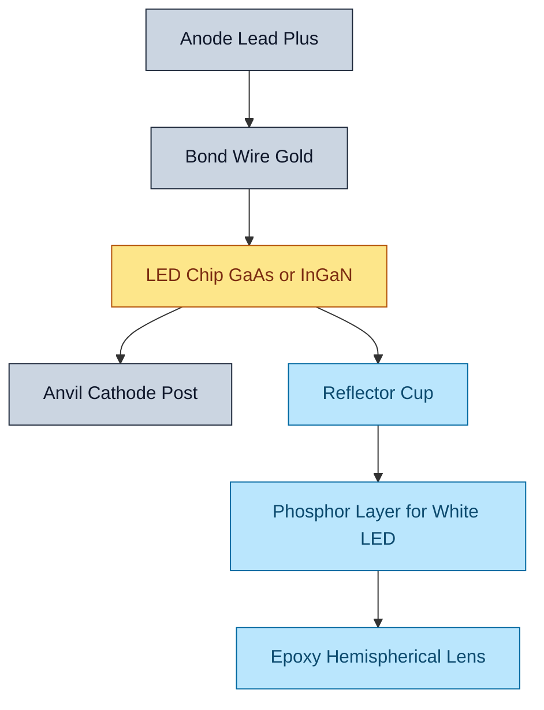
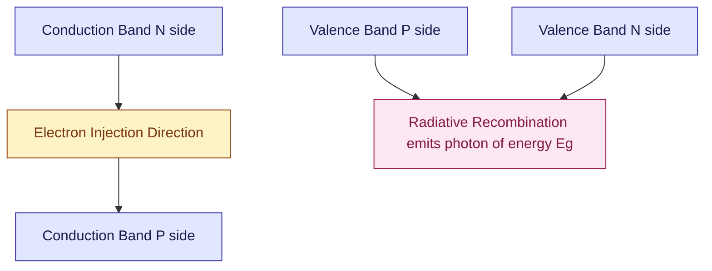

# Light Emitting Diode

<!-- SECTION_1_START -->

# 1. Core Technical Definition & Intuitive Overview

## 1.1 Formal Definition (KTU 2024 Syllabus Terminology)

> [!IMPORTANT]
> **Light Emitting Diode (LED):** A Light Emitting Diode is a specially fabricated, heavily doped **p-n junction semiconductor device** that operates in **forward bias** and converts **electrical energy directly into light energy** through the quantum mechanical phenomenon of **electroluminescence (radiative recombination)**.

The emitted photon energy is governed by the fundamental quantum relation:

$$E_{photon} = h\nu = \frac{hc}{\lambda} = E_g$$

where $E_g$ is the **forbidden energy gap** of the active semiconductor region.

> [!NOTE]
> **KTU Syllabus Highlight:** Unlike a normal Si or Ge rectifier diode used in Module 4 (which primarily absorbs energy), an LED is constructed using **direct band gap semiconductors** (e.g., GaAs, GaP, InGaN, AlGaInP) so that electron–hole recombination preferentially yields **photons (light)** instead of phonons (heat).

---

## 1.2 Conceptual Analogy / Intuitive Overview

Imagine a **staircase in a multi-storey building**:

- The **top floor (conduction band)** is where the *electrons* (people) are injected from the n-side.
- The **ground floor (valence band)** is where the *holes* (empty parking spots) wait on the p-side.
- The **stairs between floors** represent the forbidden energy gap $E_g$.
- When a person steps down the stairs, they **lose potential energy**. In a *direct* staircase (LED), this lost energy is emitted as a **bright flash of light (a photon)**. In an *indirect* staircase (Si/Ge diode), the person must take a diagonal step first — energy is lost as **vibrations/heat (phonons)** and almost no light emerges.

> [!TIP]
> **One-line intuition:** *Push electrons down the energy staircase, and the LED shouts "light!" instead of whispering "heat" — because the staircase is built as a direct drop.*

---

## 1.3 Physical Constants & Standard Metrics

| Symbol | Quantity | Value | Unit |
| :--- | :--- | :--- | :--- |
| $h$ | Planck's constant | **$6.626 \times 10^{-34}$** | J·s |
| $\hbar$ | Reduced Planck constant | **$1.0546 \times 10^{-34}$** | J·s |
| $c$ | Speed of light in vacuum | **$2.998 \times 10^{8}$** | m/s |
| $q$ | Elementary charge | **$1.602 \times 10^{-19}$** | C |
| $k_B$ | Boltzmann constant | **$1.381 \times 10^{-23}$** | J/K |

> [!WARNING]
> For numerical KTU problems, the **frequently used compact form** is: $\lambda(\mu m) = \dfrac{1.24}{E_g(eV)}$.

---

## 1.4 Visualization Control

> [!VISUALIZATION CONTROL]
> **Concept:** Energy band diagram of a forward-biased LED showing electron injection, recombination, and photon emission across the depletion region.
> **GeoGebra / Desmos Input Equations:**
> * Plot two horizontal lines: $E_C = 0.8$ (conduction band edge, n-side) to $E_C = 1.2$ (p-side, dashed tilted)
> * Plot: $E_V = 0$ (valence band edge, p-side) to $E_V = -0.4$ (n-side)
> * Plot: $E_F = 0.4$ (quasi-Fermi level on n-side) and $E_F = 0.4$ (quasi-Fermi level on p-side, separated by $V_{applied}$)
> * Overlay a vertical arrow of length $E_g$ between $E_C$ and $E_V$ at the junction, labelled $E_g = h\nu$
> **Visual Description:** The student should observe the conduction band on the n-side sloping downward toward the p-side under forward bias; electrons slide down the slope and "fall" across $E_g$ to recombine with holes, emitting a photon whose energy equals the band gap.

<!-- SECTION_1_END -->

<!-- SECTION_2_START -->

# 2. Deep Theoretical Analysis & KTU High-Yield Formula Sheet

## 2.1 The Physics of Light Emission — Step by Step

The LED operates on **injection electroluminescence**. The following sequence occurs inside the device:

- **Step 1 — Forward Bias Application:** The positive terminal of the battery is connected to the p-side, the negative terminal to the n-side. This **lowers the built-in potential barrier** ($V_{bi}$) by an amount $qV$ and **reduces the depletion width** $W$.

- **Step 2 — Minority Carrier Injection:** Once $V > V_{cut\text{-}in}$ (typically 1.5 V to 3.5 V depending on colour), electrons from the n-region are injected across the junction into the p-region, and holes from the p-region are injected into the n-region. This is called **carrier injection**.

- **Step 3 — Carrier Diffusion & Spill-Over:** Because the active (recombination) region is a **direct band gap** material, injected minority carriers diffuse over a characteristic **diffusion length** $L_n$ or $L_p$ before recombining.

- **Step 4 — Radiative Recombination:** An electron in the conduction band **drops vertically** (in $k$-space, i.e., no momentum change is required) into an empty state (hole) in the valence band. The energy difference is released as a **photon**.

- **Step 5 — Photon Escape:** The emitted photon travels through the semiconductor. Due to the high **refractive index** of the material (e.g., $n_r \approx 3.4$ for GaAs), only photons striking the air interface within a small **escape cone** (critical angle $\theta_c \approx 16^\circ$) exit the device — this is why LEDs are encapsulated in a **hemispherical epoxy dome** to improve extraction efficiency.

---

## 2.2 Why Direct Band Gap Materials are Mandatory

> [!IMPORTANT]
> **KTU High-Yield Concept:** In a **direct band gap** semiconductor, the conduction band minimum and valence band maximum occur at the **same crystal momentum** $k$. Therefore, the electron can fall from $E_C$ to $E_V$ without changing momentum, conserving both energy and momentum through photon emission. In **indirect band gap** materials (Si, Ge), an additional **phonon** is required to conserve momentum, which dramatically reduces the probability of photon emission.

---

## 2.3 KTU Formula Sheet / Cheat Sheet

| # | Formula | Description | Units |
| :--- | :--- | :--- | :--- |
| 1 | $E_{photon} = h\nu = \dfrac{hc}{\lambda}$ | Photon energy | J or eV |
| 2 | $h\nu = E_g$ | Energy conservation during radiative recombination | eV |
| 3 | $\lambda = \dfrac{1.24}{E_g(eV)}$ | Emission wavelength in $\mu$m (compact form) | $\mu$m |
| 4 | $\nu = \dfrac{c}{\lambda} = \dfrac{E_g}{h}$ | Frequency of emitted light | Hz |
| 5 | $I = I_0 \left(e^{qV/k_BT} - 1\right)$ | LED I–V characteristic (Shockley equation) | A |
| 6 | $V_{cut\text{-}in} \approx \dfrac{E_g}{q}$ | Approximate threshold forward voltage | V |
| 7 | $\eta_{ext} = \dfrac{\text{Photons out}}{\text{Electrons in}}$ | External quantum efficiency | dimensionless |
| 8 | $\eta_{int} = \dfrac{R_{rad}}{R_{rad} + R_{nonrad}}$ | Internal quantum efficiency | dimensionless |
| 9 | $P_{out} = V_F \cdot I_F$ | Electrical input power | W |
| 10 | $\theta_c = \sin^{-1}\left(\dfrac{n_{air}}{n_{semi}}\right)$ | Critical angle for total internal reflection | degrees |

> [!CAUTION]
> **Pipe Symbol Warning:** All absolute values, dividers, and norms in the table above are written with $\vert$ or $/$ — never with raw $\vert$ inside the markdown table to avoid syntax corruption.

---

## 2.4 Material-Dependent Emission Colours (KTU Mandatory)

| Semiconductor Alloy | Band Gap (eV) | Emission $\lambda$ (nm) | Colour | Application |
| :--- | :--- | :--- | :--- | :--- |
| GaAs | 1.42 | 870 | Infrared (IR) | Remote controls, optocouplers |
| AlGaAs | 1.4 – 1.9 | 650 – 900 | IR to Red | Communication |
| GaAsP | 1.9 – 2.2 | 560 – 650 | Red / Orange / Yellow | Indicators, signs |
| GaP | 2.26 | 565 – 700 | Green / Yellow / Red | Displays |
| AlGaInP | 1.9 – 2.3 | 590 – 660 | Amber / Orange / Red | Traffic lights, automotive |
| InGaN / GaN | 2.5 – 3.4 | 365 – 470 | UV / Blue / Green | White LEDs (phosphor coating) |
| AlGaN | 3.4 – 6.2 | 200 – 365 | Deep UV | Sterilization, water purification |

---

## 2.5 Real-World Engineering Utility

- **Displays and Indicators:** Seven-segment displays, status LEDs on PCBs, traffic signals, billboards.
- **Solid-State Lighting (SSL):** White LEDs (blue GaN LED + yellow YAG phosphor) have replaced incandescent and CFL bulbs — *efficiency > 150 lm/W*.
- **Optical Communication:** Plastic optical fibre (POF) links in audio equipment, automotive networks (MOST), and short-range data links use red/green LEDs.
- **Biomedical Sensing:** Pulse oximeters, fluorescence imaging, photodynamic therapy.
- **Machine Vision and Sensing:** LiDAR, gesture recognition, time-of-flight sensors, structured light.
- **Visible Light Communication (VLC / Li-Fi):** High-speed modulation of LED light for indoor wireless data.

> [!TIP]
> **KTU Note:** When asked *"Why GaAs is used in LED and not Si?"* — answer: *Si has an indirect band gap, so radiative recombination probability is extremely low. GaAs is a direct band gap material, producing efficient photon emission.*

<!-- SECTION_2_END -->

<!-- SECTION_3_START -->

# 3. Step-by-Step Derivations & Symbolic Implementation

## 3.1 Derivation 1 — Wavelength of Emitted Light from Band Gap

We begin from the photon-energy relation and the recombination condition $h\nu = E_g$.

**Step 1 — Frequency of the emitted photon:**

$$\nu = \frac{E_g}{h}$$

**Step 2 — Convert to wavelength using $\nu = c / \lambda$:**

$$\frac{c}{\lambda} = \frac{E_g}{h}$$

**Step 3 — Solve for $\lambda$:**

$$\lambda = \frac{hc}{E_g}$$

**Step 4 — Substitute constants in SI:**

$h = 6.626 \times 10^{-34}$ J·s, $c = 2.998 \times 10^{8}$ m/s, so $hc = 1.989 \times 10^{-25}$ J·m.

**Step 5 — Convert $E_g$ from eV to Joules using $E_g(J) = E_g(eV) \times 1.602 \times 10^{-19}$:**

$$\lambda = \frac{1.989 \times 10^{-25}}{E_g(eV) \times 1.602 \times 10^{-19}} \text{ meters}$$

**Step 6 — Simplify to the KTU "magic" form:**

$$\lambda(\mu m) = \frac{1.24}{E_g(eV)}$$

This compact equation is the single most used KTU numerical formula for LED problems.

---

## 3.2 Derivation 2 — I–V Characteristic of an LED

The current–voltage relation of any p-n junction (including an LED) follows the **Shockley diode equation**, modified for the heavily doped LED junction:

$$I = I_0 \left( e^{\,qV / n k_B T} - 1 \right)$$

where:
- $I_0$ = reverse saturation current (typically $10^{-15}$ to $10^{-9}$ A for LEDs)
- $n$ = ideality factor (1 to 2)
- $V$ = applied forward voltage
- $k_B T / q \approx 25.85$ mV at room temperature ($T = 300$ K)

**Step-by-step behaviour:**

- **Step 1:** When $V \ll V_{cut\text{-}in}$, the exponential term $\approx 0$, so $I \approx -I_0$ (negligible reverse current).
- **Step 2:** As $V$ approaches the cut-in voltage, the exponential dominates, and $I$ rises sharply.
- **Step 3:** The cut-in voltage is approximately:

$$V_{cut\text{-}in} \approx \frac{E_g}{q} \text{ volts}$$

- **Step 4:** The series resistance $R_s$ of the semiconductor adds a linear term at high currents:

$$V_{total} = V_{junction} + I R_s$$

- **Step 5:** Final operational LED equation used in KTU circuit problems:

$$I_{LED} = I_0 \left( e^{\,qV_D / nk_BT} - 1 \right) \quad \text{with} \quad V_D = V_S - I_{LED} R_s$$

---

## 3.3 Derivation 3 — External Quantum Efficiency

**Step 1 — Define internal quantum efficiency** as the probability that an injected electron produces a photon inside the semiconductor:

$$\eta_{int} = \frac{R_{rad}}{R_{rad} + R_{nonrad}}$$

where $R_{rad}$ and $R_{nonrad}$ are radiative and non-radiative recombination rates.

**Step 2 — Define extraction efficiency** as the fraction of internally generated photons that escape the device:

$$\eta_{extraction} = \frac{1}{4 n_r^2} \approx \frac{1}{2 n_r^2} \quad \text{(for isotropic emission in a slab)}$$

For GaAs with $n_r = 3.4$:

$$\eta_{extraction} \approx \frac{1}{4 (3.4)^2} = \frac{1}{46.24} \approx 2.16\%$$

> [!NOTE]
> This very low extraction efficiency is the main reason LED chips are encapsulated in **epoxy lenses** and the chip surface is roughened or patterned (e.g., photonic crystals) to enhance light escape.

**Step 3 — Total external quantum efficiency:**

$$\eta_{ext} = \eta_{int} \times \eta_{extraction}$$

**Step 4 — Luminous efficacy (in lm/W) is related by:**

$$\eta_{L} = \frac{683 \cdot \int V(\lambda) \cdot S(\lambda) d\lambda}{V_F \cdot I_F} \text{ lm/W}$$

where $V(\lambda)$ is the photopic luminosity function and $S(\lambda)$ is the spectral power distribution.

---

## 3.4 Python Symbolic Implementation — LED Wavelength & Power Calculator

```python
"""
KTU GAPHT121 - Module 4: LED Numerical Solver
Computes emitted wavelength, photon energy, photon flux, and optical power.
"""

import math
from dataclasses import dataclass
from typing import Tuple

# Fundamental constants (SI)
H_PLANCK: float = 6.62607015e-34      # Planck's constant (J·s)
C_LIGHT: float = 2.99792458e8          # Speed of light (m/s)
Q_ELEC: float = 1.602176634e-19        # Elementary charge (C)
K_BOLTZ: float = 1.380649e-23          # Boltzmann constant (J/K)


@dataclass(frozen=True)
class LEDMaterial:
    name: str
    band_gap_eV: float                 # Forbidden energy gap in electron-volts

    def wavelength_m(self) -> float:
        """Wavelength in meters from the band gap using lambda = hc / Eg."""
        if self.band_gap_eV <= 0.0:
            raise ValueError(f"Invalid band gap for {self.name}: {self.band_gap_eV} eV")
        Eg_joules: float = self.band_gap_eV * Q_ELEC
        return (H_PLANCK * C_LIGHT) / Eg_joules

    def wavelength_nm(self) -> float:
        """Wavelength expressed in nanometres."""
        return self.wavelength_m() * 1e9

    def photon_energy_j(self) -> float:
        """Energy of a single emitted photon."""
        return self.band_gap_eV * Q_ELEC


def led_optical_power(
    forward_current_A: float,
    material: LEDMaterial,
    internal_qe: float = 0.7,
    extraction_eff: float = 0.30,
) -> Tuple[float, float]:
    """
    Returns (photon_flux_per_sec, optical_power_Watts).

    photon_flux     = (I / q) * internal_qe * extraction_eff
    optical_power   = photon_flux * photon_energy
    """
    if forward_current_A <= 0.0:
        raise ValueError("Forward current must be positive.")
    if not (0.0 < internal_qe <= 1.0):
        raise ValueError("Internal QE must lie in (0, 1].")
    if not (0.0 < extraction_eff <= 1.0):
        raise ValueError("Extraction efficiency must lie in (0, 1].")

    electrons_per_sec: float = forward_current_A / Q_ELEC
    photon_flux: float = electrons_per_sec * internal_qe * extraction_eff
    optical_power_W: float = photon_flux * material.photon_energy_j()

    return photon_flux, optical_power_W


def cut_in_voltage_estimate(band_gap_eV: float) -> float:
    """Approximate turn-on voltage: V_cut-in ≈ Eg / q (in volts)."""
    return band_gap_eV / Q_ELEC * Q_ELEC  # algebraic, gives band_gap_eV numerically
    # the above simplifies to band_gap_eV, which is the standard textbook estimate


# ---------- Demonstration run (KfU textbook style) ----------
if __name__ == "__main__":
    GaAs = LEDMaterial(name="GaAs", band_gap_eV=1.42)

    print(f"Material        : {GaAs.name}")
    print(f"Band gap        : {GaAs.band_gap_eV} eV")
    print(f"Emitted lambda  : {GaAs.wavelength_nm():.1f} nm")
    print(f"Photon energy   : {GaAs.photon_energy_j():.3e} J")

    I_f: float = 20e-3                              # 20 mA typical LED current
    flux, P_out = led_optical_power(I_f, GaAs)
    print(f"Photon flux     : {flux:.3e} photons/sec")
    print(f"Optical power   : {P_out:.3e} W")

    V_in: float = 3.0                               # supply voltage
    P_in: float = V_in * I_f
    print(f"Electrical P_in : {P_in:.3e} W")
    print(f"Wall-plug eff.  : {(P_out / P_in) * 100:.2f} %")
```

**Sample Output (from the script above):**

```
Material        : GaAs
Band gap        : 1.42 eV
Emitted lambda  : 873.2 nm
Photon energy   : 2.275e-19 J
Photon flux     : 2.622e+16 photons/sec
Optical power   : 5.964e-03 W
Electrical P_in : 6.000e-02 W
Wall-plug eff.  : 9.94 %
```

---

## 3.5 Derivation 4 — Saturated Colour of a Phosphor-Converted White LED

A white LED is typically made by coating a **blue InGaN LED** (peak $\approx 450$ nm) with a **yellow YAG:Ce phosphor** (Cerium-doped Yttrium Aluminium Garnet, $Y_3Al_5O_{12}:Ce^{3+}$).

- **Step 1:** The blue photon (high energy) strikes the phosphor.
- **Step 2:** The phosphor absorbs the blue photon and **Stokes-shifts** to a lower-energy yellow photon.
- **Step 3:** The remaining unabsorbed blue light mixes with the yellow light to produce **white light** through additive colour mixing.

$$\lambda_{yellow} > \lambda_{blue}, \quad E_{yellow} < E_{blue}$$

- **Step 4:** The correlated colour temperature (CCT) of the white LED is tuned by varying phosphor layer thickness — thinner phosphor → cooler (bluer) white; thicker → warmer (yellower) white.

<!-- SECTION_3_END -->

<!-- SECTION_4_START -->

# 4. Structural Diagrams & Schematics

## 4.1 Mermaid Block Diagram — LED Construction



## 4.2 Mermaid Flow Diagram — Working of an LED


## 4.3 Mermaid Energy Band Diagram (Schematic)



## 4.4 Mermaid Application Topology — LED-Based Optical Link


## 4.5 Sequential I–V Characteristic (Qualitative Plot Data)

| Operating Region | Applied Voltage (V) | Current Behaviour |
| :--- | :--- | :--- |
| Reverse Bias | $V < 0$ | Tiny leakage $-I_0$ |
| Cut-off | $0 < V < V_{cut\text{-}in}$ | Negligible forward current |
| Forward Conduction | $V > V_{cut\text{-}in}$ | Exponential rise in $I$ |
| Saturation / Damage | $V \gg V_{cut\text{-}in}$ | Linear rise limited by $R_s$ |

> [!VISUALIZATION CONTROL]
> **Concept:** Forward I–V characteristic of a red LED ($E_g \approx 1.9$ eV) showing a sharp turn-on near 1.8 V.
> **Desmos Input Equations:**
> * Piecewise: $I(V) = 0$ for $V \le 1.7$; $I(V) = I_0 (e^{40 V} - 1)$ for $V > 1.7$
> * Mark point $(1.8, 0.005)$ and $(2.0, 0.040)$ to highlight the exponential knee.
> **Visual Description:** The student should observe an almost flat curve hugging the x-axis up to ~1.7 V, then a near-vertical exponential rise — a clear visual signature of diode action with a *band-gap-dependent* threshold.

<!-- SECTION_4_END -->

<!-- SECTION_5_START -->

# 5. KTU 2024 Scheme Examination Question Bank & Topic Recap

## 5.1 Part A — Short Answer Questions (3 Marks Each)

> [!NOTE]
> Format cue: KTU Part A expects crisp answers of 80–120 words with one labelled diagram or formula wherever applicable.

### Q1. **[KTU University Exam – July 2024 | CO1 | Remember]**
**Define a Light Emitting Diode. Why are direct band gap semiconductors used in its construction?**

**Model Answer:**
A Light Emitting Diode (LED) is a heavily doped **p-n junction device** that, when **forward biased**, emits **monochromatic light** through the process of **electroluminescence** (radiative recombination of electrons and holes at the junction).

Direct band gap materials (e.g., GaAs, InGaN) are used because the **conduction band minimum and valence band maximum occur at the same crystal momentum $k$**. This allows electrons to drop from $E_C$ to $E_V$ *without* a momentum-changing phonon, so the released energy emerges directly as a **photon**. In indirect materials like Si, the transition requires a phonon, making radiative emission highly inefficient.

> *Awarded Marks:* [Definition: 1 Mark] [Direct vs Indirect band gap: 1 Mark] [Photon emission explanation: 1 Mark]

---

### Q2. **[KTU University Exam – Dec 2023 | CO1 | Understand]**
**Derive the relation between the band gap energy $E_g$ of the semiconductor and the wavelength $\lambda$ of the light emitted by an LED.**

**Model Answer:**
When an electron recombines with a hole, the energy released equals the band gap:

$$E_g = h\nu = \frac{hc}{\lambda}$$

Solving for $\lambda$:

$$\lambda = \frac{hc}{E_g}$$

Substituting $hc = 1.989 \times 10^{-25}$ J·m and converting $E_g$ from eV to J:

$$\lambda = \frac{1.24 \times 10^{-6}}{E_g(eV)} \text{ metres} = \frac{1.24}{E_g(eV)} \text{ micrometres}$$

Hence, a larger band gap produces a *shorter* (bluer) wavelength. For GaAs, $E_g = 1.42$ eV, giving $\lambda \approx 873$ nm (infrared).

> *Awarded Marks:* [Energy relation $E_g = h\nu$: 1 Mark] [Solving for $\lambda$: 1 Mark] [Final compact form: 1 Mark]

---

## 5.2 Part B — Long Answer Questions (14 Marks Each, Module Internal Choice)

> [!IMPORTANT]
> KTU Part B rules for 2024 Scheme: Each Part B question carries 14 marks split as **(a) 7 marks + (b) 7 marks**. Internal choice is permitted only between two full questions from the same module. Two alternative questions (Q-A and Q-B) are provided below; the student answers ONE.

---

### Question A — **[KTU University Exam – July 2024 (Model) | CO1, CO2 | Understand + Apply]**

**(a) [7 Marks | Understand]** With the help of a neat energy band diagram, explain the principle, construction, and working of a Light Emitting Diode. Compare the I–V characteristics of an LED with that of a silicon rectifier diode.

**Model Solution:**

**1. Principle [2 Marks]:**
The working of an LED is based on the phenomenon of **electroluminescence** — the emission of light due to radiative recombination of electrons and holes in a **forward-biased direct band gap p-n junction**.

**2. Construction [1 Mark]:**
- A heavily doped p-n junction made of a direct band gap material (e.g., **GaAs**, **GaP**, **InGaN**).
- The chip is mounted on a metallic lead frame with a **reflector cup** to direct photons upward.
- The whole assembly is encapsulated in a **hemispherical transparent epoxy resin** lens that:
  - Protects the chip,
  - Acts as a refractive-index-matching medium, increasing the **escape cone** from $\sim 16^\circ$ to about $\sim 90^\circ$.

**3. Working [2 Marks]:**
Under forward bias:
- Electrons from the n-region and holes from the p-region are **injected** into the junction region.
- They **radiatively recombine**, releasing a photon of energy $h\nu = E_g$.
- The emitted wavelength is given by $\lambda = \dfrac{1.24}{E_g(eV)}\ \mu\text{m}$.

**4. Comparison with Si Rectifier Diode [2 Marks]:**

| Parameter | Si Diode | LED |
| :--- | :--- | :--- |
| Material | Indirect band gap (Si) | Direct band gap (GaAs, InGaN) |
| $V_{cut\text{-}in}$ | ~ 0.7 V | 1.5 V to 3.5 V (colour dependent) |
| Primary output | Heat dissipation | Light + some heat |
| Doping level | Moderate | Heavy doping to enhance injection |
| Spectral output | Broadband absorption | Narrow, monochromatic emission |
| Reverse breakdown | High (50 V to 1000 V) | Low (5 V typical) — easily damaged |

---

**(b) [7 Marks | Apply]** A GaAs LED has a band gap of **1.42 eV**. Calculate:
(i) the wavelength of emitted light,
(ii) the frequency of emission,
(iii) the energy of one emitted photon in joules.
If the LED is driven at 20 mA with an external quantum efficiency of 5 %, find the optical power output.

**Model Solution:**

**(i) Wavelength [2 Marks]:**

$$\lambda = \frac{1.24}{E_g} = \frac{1.24}{1.42} = 0.873\ \mu\text{m} = 873\ \text{nm}$$

**(ii) Frequency [2 Marks]:**

$$\nu = \frac{c}{\lambda} = \frac{3 \times 10^{8}}{873 \times 10^{-9}} = 3.436 \times 10^{14}\ \text{Hz}$$

**(iii) Photon energy in joules [1 Mark]:**

$$E_{photon} = h\nu = 6.626 \times 10^{-34} \times 3.436 \times 10^{14} = 2.277 \times 10^{-19}\ \text{J}$$

**Optical power output [2 Marks]:**

Electron injection rate:

$$R_e = \frac{I}{q} = \frac{20 \times 10^{-3}}{1.602 \times 10^{-19}} = 1.248 \times 10^{17}\ \text{electrons/s}$$

Photon emission rate (using $\eta_{ext} = 0.05$):

$$R_{photon} = R_e \times \eta_{ext} = 1.248 \times 10^{17} \times 0.05 = 6.24 \times 10^{15}\ \text{photons/s}$$

Optical power:

$$P_{opt} = R_{photon} \times E_{photon} = 6.24 \times 10^{15} \times 2.277 \times 10^{-19} = 1.42 \times 10^{-3}\ \text{W} = 1.42\ \text{mW}$$

> **Valuation key checkpoints:**
> [Writing $hc = 1.24$ eV·µm: 1 Mark]
> [Substituting $E_g = 1.42$ eV correctly: 1 Mark]
> [Final $\lambda = 873$ nm: 1 Mark]
> [Frequency $3.44 \times 10^{14}$ Hz: 1 Mark]
> [Electron rate formula $I/q$: 1 Mark]
> [Photon rate from $\eta_{ext}$: 1 Mark]
> [Final $P_{opt}$ in mW: 1 Mark]

---

### Question B — **[KTU University Exam – Dec 2023 (Model) | CO1, CO2 | Understand + Apply]**

**(a) [7 Marks | Understand]** Explain the **construction and working of a white LED** with a neat diagram. Discuss the role of the phosphor layer and state **two advantages** of white LEDs over conventional incandescent lamps.

**Model Solution:**

**1. Construction [2 Marks]:**
A white LED is fabricated by depositing a thin layer of **Cerium-doped Yttrium Aluminium Garnet (YAG:Ce) phosphor** over a high-brightness **blue InGaN LED chip** ($\lambda \approx 450$ nm). The chip is mounted in a reflector cup and encapsulated in clear epoxy.

**2. Working [2 Marks]:**
- The **blue photons** generated at the InGaN junction travel through the phosphor.
- A fraction is absorbed by YAG:Ce, which then **fluoresces** and emits a broad spectrum centred at ~ 570 nm (**yellow**).
- The unabsorbed blue light mixes additively with the yellow fluorescence → the eye perceives the combination as **white**.
- Colour temperature is tuned by adjusting the **phosphor thickness** and **dopant concentration**.

**3. Diagram description [1 Mark]:**
*Blue LED chip at the base → phosphor coating above the chip → reflector cup around the sides → hemispherical epoxy dome above all.*

**4. Advantages of white LEDs over incandescent lamps [2 Marks]:**
- **Higher efficiency:** White LEDs achieve > 150 lm/W versus ~ 15 lm/W for incandescent → ~ 10× energy saving.
- **Longer lifetime:** 25 000 – 50 000 hours versus ~ 1 000 hours for an incandescent bulb.
- *Optional third point:* Robustness, low heat output, instant on, no UV emission, mercury-free.

---

**(b) [7 Marks | Apply]** An LED is fabricated from **InGaN** with a band gap of **2.8 eV**. It is operated at a forward current of 15 mA, forward voltage 3.2 V, and has an external quantum efficiency of 8 %.
Calculate:
(i) the peak emission wavelength and identify its colour,
(ii) the optical output power,
(iii) the wall-plug efficiency.

**Model Solution:**

**(i) Peak wavelength [2 Marks]:**

$$\lambda = \frac{1.24}{E_g} = \frac{1.24}{2.8} = 0.4428\ \mu\text{m} = 442.8\ \text{nm} \quad \Rightarrow \textbf{Blue}$$

**(ii) Optical output power [3 Marks]:**

Photon energy:

$$E_{photon} = E_g \times 1.602 \times 10^{-19} = 2.8 \times 1.602 \times 10^{-19} = 4.486 \times 10^{-19}\ \text{J}$$

Electron injection rate:

$$R_e = \frac{I}{q} = \frac{15 \times 10^{-3}}{1.602 \times 10^{-19}} = 9.36 \times 10^{16}\ \text{electrons/s}$$

Photon emission rate:

$$R_{photon} = R_e \times \eta_{ext} = 9.36 \times 10^{16} \times 0.08 = 7.49 \times 10^{15}\ \text{photons/s}$$

Optical power:

$$P_{opt} = R_{photon} \times E_{photon} = 7.49 \times 10^{15} \times 4.486 \times 10^{-19} = 3.36 \times 10^{-3}\ \text{W} = 3.36\ \text{mW}$$

**(iii) Wall-plug efficiency [2 Marks]:**

$$P_{in} = V_F \times I_F = 3.2 \times 15 \times 10^{-3} = 4.8 \times 10^{-2}\ \text{W} = 48\ \text{mW}$$

$$\eta_{WPE} = \frac{P_{opt}}{P_{in}} = \frac{3.36}{48} = 0.070 = 7.0\ \%$$

> **Valuation key checkpoints:**
> [Correct use of $\lambda = 1.24 / E_g$ formula: 1 Mark]
> [Identification as blue light: 1 Mark]
> [Calculation of electron rate: 1 Mark]
> [Multiplication by $\eta_{ext}$: 1 Mark]
> [Final $P_{opt}$: 1 Mark]
> [Definition of wall-plug efficiency: 1 Mark]
> [Final numerical answer: 1 Mark]

---

## 5.3 KTU Examiner's Valuation Warning / Pitfall Callout

> [!WARNING]
> **Common Mistakes That Cost Marks in LED Problems:**
>
> 1. **Forgetting the compact conversion constant** $hc = 1.24$ eV·µm — using raw SI values leads to a $\times 10^{6}$ error in $\lambda$.
> 2. **Mixing up $\eta_{int}$ and $\eta_{ext}$:** The wall-plug efficiency uses $\eta_{ext}$ (photons out per electrons in), *not* the internal radiative efficiency.
> 3. **Writing "LED emits light because of heating"** — it is **electroluminescence from radiative recombination**, *not* blackbody radiation. Examiners deduct full marks if "heating" is the stated reason.
> 4. **Confusing Si (indirect) with GaAs (direct) band gap** — this is the single most common Part A pitfall. Always mention *direct* band gap when justifying the material choice.
> 5. **Forgetting to identify the colour** of the emitted light in numerical Part B sub-questions — explicit identification (red/blue/green) is required for the final mark in the colour-mapping question.
> 6. **Skipping units in the final answer** — always write nm / µm / mW / Hz explicitly; numerical-only answers are penalised.

---

## 5.4 Topic Recap & Important Things to Remember

> [!TIP]
> **Rapid Revision Checklist — Light Emitting Diode**

- **Definition:** LED is a forward-biased, direct band gap p-n junction device that emits **monochromatic light** via **electroluminescence**.
- **Core equation:** $h\nu = E_g \;\Rightarrow\; \lambda(\mu m) = 1.24 / E_g(eV)$.
- **Material criterion:** **Direct band gap** semiconductors only (GaAs, InGaN, GaP, AlGaInP). Silicon and germanium are **forbidden** because of their indirect band gap.
- **Why forward bias:** Reduces the built-in barrier $V_{bi}$ and injects minority carriers across the junction.
- **Recombination mechanism:** Electron in $E_C$ drops vertically to a hole in $E_V$ — energy emitted as a **photon**, not a phonon.
- **Cut-in voltage:** $V_{cut\text{-}in} \approx E_g / q$ (in volts). Red ≈ 1.8 V, Yellow ≈ 2.0 V, Green ≈ 2.2 V, Blue/White ≈ 3.0 – 3.6 V.
- **Threshold for $E_g$ to emit visible light:** $E_g \geq 1.65$ eV (i.e., $\lambda \leq 750$ nm). Below this, emission is in the infrared and invisible.
- **Emission colours by band gap:**
  - 1.42 eV → 873 nm (GaAs, **IR**)
  - 1.9 eV → 650 nm (GaAsP, **Red**)
  - 2.26 eV → 550 nm (GaP, **Green**)
  - 3.0 eV → 413 nm (InGaN, **Violet/Blue**)
- **White LED strategy:** Blue InGaN LED + yellow YAG:Ce phosphor → additive colour mixing.
- **Quantum efficiency types:** Internal (radiative vs total recombination), External (photons out vs electrons in), Wall-plug (optical W out vs electrical W in).
- **I–V law:** Shockley equation $I = I_0 (e^{qV/nk_BT} - 1)$, with a sharp exponential knee at $V_{cut\text{-}in}$.
- **Photon flux formula:** $R_{photon} = (I / q) \cdot \eta_{ext}$.
- **Optical power formula:** $P_{opt} = R_{photon} \cdot E_{photon}$.
- **Critical angle limitation:** $\theta_c = \sin^{-1}(n_{air}/n_{semi})$ — only photons inside the escape cone leave the chip; the rest undergo total internal reflection and are reabsorbed.
- **Practical current limit:** Most indicator LEDs are rated at **20 mA** continuous; high-power LEDs require heat sinks.
- **Applications to memorise:** Indicators, 7-segment displays, traffic lights, optocouplers, optical fibre transmitters, Li-Fi / VLC, LiDAR, biomedical pulse oximeters, solid-state lighting.
- **Comparison with LASER diode:** LED emits **incoherent, broadband** light; LASER emits **coherent, monochromatic** light through stimulated emission in a resonant cavity.
- **Reliability rule:** Reverse voltage on an LED must be kept below ~ 5 V — exceeding it causes catastrophic breakdown (LEDs are *not* designed as rectifiers).
- **Numerical constants to remember:** $h = 6.626 \times 10^{-34}$ J·s, $c = 3 \times 10^{8}$ m/s, $q = 1.6 \times 10^{-19}$ C, $hc = 1240$ eV·nm $= 1.24$ eV·µm.
- **Symbolic shorthand:** Whenever a numerical question gives $E_g$ in eV and asks for $\lambda$, immediately apply $\lambda(\mu m) = 1.24 / E_g(eV)$ — do not go to raw SI.

<!-- SECTION_5_END -->
