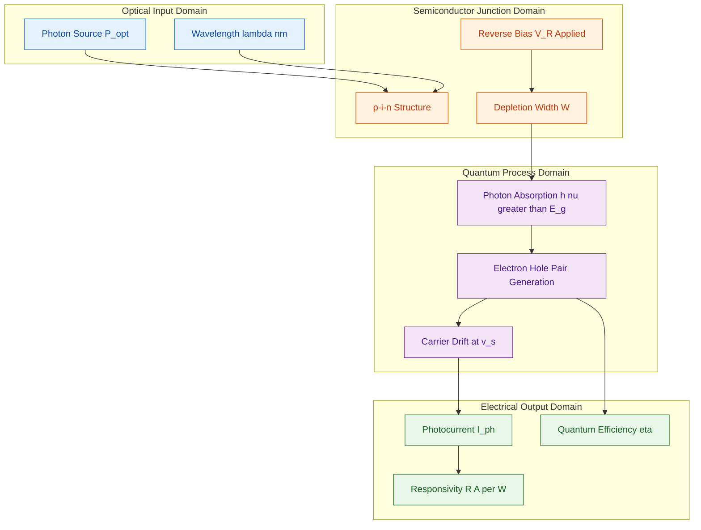
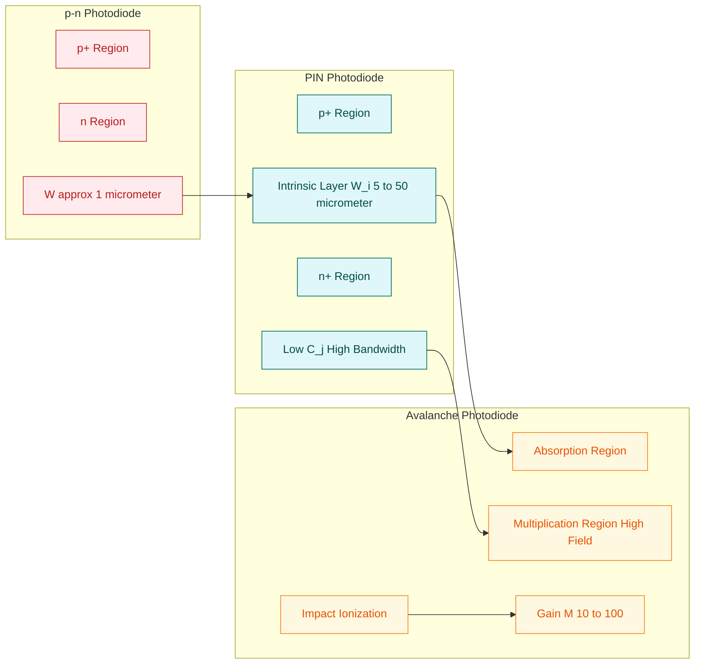
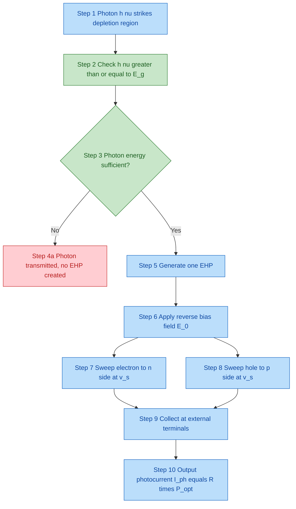
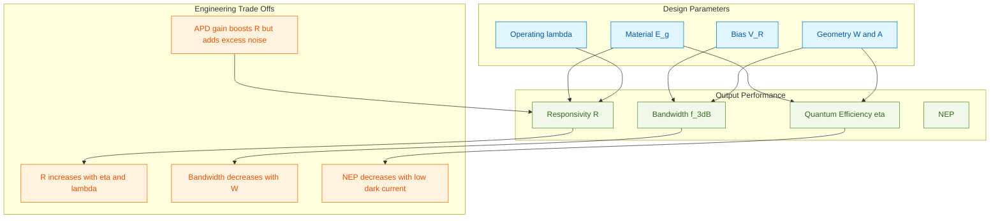

# Photodetectors

<!-- SECTION_1_START -->
# Photodetectors — Core Technical Definition & Intuitive Overview

> [!IMPORTANT]
> **KTU 2024 — Module 4 (GAPHT121) — Definition Snapshot**
> A **Photodetector** is a semiconductor device that converts an incident optical signal (photons) into a measurable electrical signal (current or voltage), forming the optical-to-electrical transducer at the heart of every fiber-optic communication link, imaging sensor, and remote-control receiver.

## 1.1 Formal Definition (KTU Syllabus Terminology)

A photodetector is a **p–n junction (or related hetero-structure) semiconductor optoelectronic device** that operates under **reverse bias** to absorb incident photons whose energy $h\nu$ is greater than the semiconductor bandgap $E_g$. Each absorbed photon generates an **electron–hole pair (EHP)** via band-to-band or impurity-assisted absorption. The reverse electric field in the depletion region separates the photogenerated carriers, sweeping electrons toward the n-side and holes toward the p-side, producing a photocurrent that is linearly proportional to the incident optical power.

The fundamental photoelectric relation governing the device is:

$$h\nu \ge E_g \quad \text{(threshold condition for photon absorption)}$$

## 1.2 Intuitive Real-World Analogy

> [!NOTE]
> **The Rain Bucket Analogy**
> Imagine a slanted rooftop with a gutter — the roof is the **depletion region** of a p–n junction, and raindrops are **photons**. When raindrops hit the roof, they slide into the gutter and are channeled out as a measurable water flow (the **photocurrent**). The harder it rains (more incident optical power), the stronger the flow. A photodetector does exactly this for light: photons are "funneled" by the built-in field of the depletion layer into a usable electrical signal.

A more technical analogy: think of the photodetector as a **"translator"** — just as a UN interpreter converts spoken language into another language instantly, the photodetector converts the "language of light" (optical power in watts) into the "language of electronics" (current in amperes) in real time.

## 1.3 Classification of Photodetectors (KTU 2024 Syllabus)

| # | Device | Active Mechanism | Typical Application |
|---|--------|------------------|---------------------|
| 1 | **Photoconductor (Photoresistor)** | Photogenerated carriers change conductivity | Light meters, automatic street lights |
| 2 | **Photodiode (p–n junction)** | Photovoltaic + reverse-bias carrier sweep | Optical encoders, low-cost light sensors |
| 3 | **PIN Photodiode** | Intrinsic layer widens depletion region for high-speed absorption | Fiber-optic receivers (1.31 µm, 1.55 µm) |
| 4 | **Avalanche Photodiode (APD)** | Internal carrier multiplication via impact ionization | Long-haul telecom, LIDAR, quantum optics |
| 5 | **Phototransistor** | Photocurrent is amplified by transistor action | Optocouplers, switching circuits |
| 6 | **MSM Photodetector** | Metal–Semiconductor–Metal interdigital structure | High-speed OEIC (opto-electronic IC) |

## 1.4 Key Photodetector Performance Metrics

> [!IMPORTANT]
> **The "Big Four" Parameters Examiners Love**
> 1. **Responsivity ($\mathcal{R}$)** — A/W — output current per unit incident optical power
> 2. **Quantum Efficiency ($\eta$)** — dimensionless — fraction of incident photons that produce collected electron–hole pairs
> 3. **Response Time / Bandwidth ($f_{3dB}$)** — Hz — how fast the device can follow a modulated light signal
> 4. **Noise-Equivalent Power (NEP)** — W/√Hz — minimum detectable optical power

> [!VISUALIZATION CONTROL]
> **Concept:** Spectral Response of a Silicon Photodiode
> **Plot Variables:**
> * x-axis: Wavelength $\lambda$ (in nm) from **400 nm** to **1100 nm**
> * y-axis: Responsivity $\mathcal{R}(\lambda)$ (in A/W)
> **Reference Points to Mark:**
> * Peak responsivity near $\lambda \approx 900$ nm with $\mathcal{R}_{peak} \approx 0.65$ A/W
> * Cutoff wavelength $\lambda_c = 1240/E_g(\text{eV})$ ≈ 1100 nm for Si
> **Visual Description:** The student should observe a curve that rises sharply from the visible region, reaches a maximum in the near-infrared (NIR) just below the bandgap edge, and then drops abruptly to zero at $\lambda_c$. This is the classic **spectral response envelope** shaped by the trade-off between absorption coefficient (high at short $\lambda$) and penetration depth (longer at long $\lambda$).
<!-- SECTION_1_END -->

<!-- SECTION_2_START -->
# Deep Theoretical Analysis & KTU High-Yield Formula Sheet

## 2.1 Operating Principle — Photogeneration & Carrier Collection

The physical process inside a reverse-biased photodetector has **three sequential stages**:

1. **Photon Absorption:** A photon of energy $h\nu \ge E_g$ is absorbed in the semiconductor. The energy excites a valence-band electron into the conduction band, creating one **electron–hole pair (EHP)**. Conservation of energy demands $h\nu = E_g + E_{kinetic}$ (excess energy is dissipated as heat via phonon emission).

2. **Carrier Separation:** The built-in electric field $E_0$ of the depletion region (and any applied reverse bias) instantly sweeps the electron toward the n-region and the hole toward the p-region. The drift velocity is $v_d = \mu E_0$, with saturation velocity $v_s \approx 10^7$ cm/s in Si.

3. **External Current Delivery:** The collected carriers flow through the external circuit as a **photocurrent** $I_{ph}$ superimposed on the small reverse-bias dark current $I_0$.

> [!NOTE]
> **Why reverse bias?** Under reverse bias, the depletion width $W$ widens (enhancing the absorption volume) and the junction capacitance $C_j = \varepsilon_s A / W$ decreases, enabling faster response and higher sensitivity.

## 2.2 The Photocurrent Equation

The total current through an illuminated reverse-biased photodiode is:

$$I = I_0 \left( e^{qV/k_BT} - 1 \right) - I_{ph}$$

where the photocurrent $I_{ph}$ is:

$$I_{ph} = \mathcal{R} \, P_{opt} = \eta \, \frac{q}{h\nu} \, P_{opt} = \eta \, \frac{q\lambda}{hc} \, P_{opt}$$

> [!IMPORTANT]
> Sign convention: In the standard photodiode current equation above, $I_{ph}$ flows in the **opposite direction** to the forward diode current. Under reverse bias ($V < 0$), the exponential term is negligible, and the net current is dominated by $I_{ph}$.

## 2.3 KTU Formula Sheet — Photodetectors

> [!IMPORTANT]
> **HIGH-YIELD CHEAT SHEET — Memorize Before Exam**

| # | Quantity | Symbol / Formula | Units | Physical Meaning |
|---|----------|------------------|-------|------------------|
| 1 | Photon energy | $E_{ph} = h\nu = hc/\lambda$ | J or eV | Energy of one photon |
| 2 | Cutoff wavelength | $\lambda_c = hc/E_g = 1240/E_g(\text{eV})$ | nm | Longest wavelength absorbed |
| 3 | Quantum efficiency | $\eta = \dfrac{N_{e-collected}}{N_{ph-incident}}$ | dimensionless | Photon-to-electron conversion ratio |
| 4 | Responsivity | $\mathcal{R} = I_{ph}/P_{opt} = \eta q \lambda / (hc)$ | A/W | Electrical output per optical watt |
| 5 | Max theoretical $\mathcal{R}$ (at $\eta = 1$) | $\mathcal{R}_{max} = \lambda / 1.24$ | A/W | Upper bound at a given $\lambda$ (in µm) |
| 6 | Primary photocurrent | $I_{ph} = q \cdot \eta \cdot \Phi_{ph}$ | A | Current from photon flux $\Phi_{ph}$ |
| 7 | Multiplied photocurrent (APD) | $I_{ph}^{APD} = M \cdot I_{ph}$ | A | With avalanche gain $M$ |
| 8 | Avalanche multiplication | $M = \dfrac{1}{1 - (V_{applied}/V_{breakdown})^n}$ | dimensionless | $n \approx 3$–$6$ for Si |
| 9 | PIN depletion width | $W = \sqrt{2\varepsilon_s (V_{bi} + V_R)(N_A+N_B)/(q N_A N_B)}$ | m | Absorption volume |
| 10 | Junction capacitance | $C_j = \varepsilon_s A / W$ | F | Sets RC time constant |
| 11 | Response bandwidth | $f_{3dB} = 1/(2\pi R_{load} C_j)$ | Hz | High-speed limit |
| 12 | Transit-time limit | $f_{T} = 0.44 \, v_s / W$ | Hz | Carrier-drift limit |
| 13 | Noise-Equivalent Power | $NEP = \sqrt{\langle i_n^2 \rangle} / \mathcal{R}$ | W/√Hz | Minimum detectable power |
| 14 | Detectivity | $D^* = \sqrt{A \cdot \Delta f} / NEP$ | cm·Hz$^{1/2}$/W | Material quality figure of merit |

> [!IMPORTANT]
> **CRITICAL NOTATION NOTE:** Absolute-value expressions like $|x|$ must be written using $\lvert x \rvert$ or $\lvert x \mid$ in LaTeX. The vertical pipe character is forbidden inside the markdown table cells above to prevent parser breakage — exam answers should use $\lvert \cdot \rvert$ form.

## 2.4 PIN Photodiode — Why the Intrinsic Layer?

The standard p–n photodiode has a narrow depletion width (typically $\sim 1\ \mu\text{m}$ in Si) that fails to absorb long-wavelength photons (e.g., 1.55 µm in optical fibers) efficiently. The **PIN photodiode** solves this by inserting a **wide intrinsic (i-) layer** of thickness $W_i \approx 5$–$50\ \mu\text{m}$ between the p+ and n+ regions. This provides:

- A **thick absorption region** — even weakly absorbed photons have a high probability of creating EHPs.
- A **uniform, high electric field** across the intrinsic zone — carriers drift at saturation velocity.
- A **low junction capacitance** — $C_j = \varepsilon_s A / W_i$ is small because $W_i$ is large, enabling high bandwidth.

## 2.5 Avalanche Photodiode (APD) — Internal Gain

The APD operates at a reverse bias close to (but below) the breakdown voltage. Photogenerated carriers are accelerated by the strong field to kinetic energies sufficient to create **secondary EHPs via impact ionization**. The result is a multiplied photocurrent $I_{ph}^{APD} = M \cdot I_{ph}$, where $M$ is the multiplication factor. This internal gain dramatically improves the signal-to-noise ratio for detecting very weak optical signals (e.g., long-distance telecom, single-photon detection).

## 2.6 Real-World Engineering Utility

- **Fiber-optic communication:** PIN + transimpedance amplifier at 1.31 µm / 1.55 µm windows of silica fibers.
- **LIDAR and 3D imaging:** APDs with $M > 30$ for time-of-flight ranging.
- **Solar cells (reverse-engineered):** Photodetectors operated in **photovoltaic mode** ($V = 0$) are solar cells — the same physics, different bias point.
- **Medical imaging (CT, PET):** Si APD arrays detect scintillation light.
- **Quantum key distribution (QKD):** Single-photon APDs (SPADs) in Geiger mode ($M > 10^6$).
<!-- SECTION_2_END -->

<!-- SECTION_3_START -->
# Step-by-Step Derivations & Symbolic Implementation

## 3.1 Derivation 1 — Relating Responsivity to Quantum Efficiency

> [!IMPORTANT]
> **Goal:** Derive the master relation $\mathcal{R} = \eta q\lambda/(hc)$ connecting a measurable quantity (responsivity) to a microscopic quantity (quantum efficiency).

**Step 1: Define Quantum Efficiency**

The quantum efficiency $\eta$ is defined as the probability that an incident photon produces a collected electron:

$$\eta = \frac{\text{Number of electrons collected per second}}{\text{Number of incident photons per second}} = \frac{N_{e}}{N_{ph}}$$

**Step 2: Express Photon Flux in Terms of Optical Power**

The number of photons per second corresponding to an incident optical power $P_{opt}$ at wavelength $\lambda$ is:

$$N_{ph} = \frac{P_{opt}}{E_{ph}} = \frac{P_{opt}}{hc/\lambda} = \frac{P_{opt} \lambda}{hc}$$

(Each photon carries energy $E_{ph} = hc/\lambda$.)

**Step 3: Express the Photocurrent**

The number of electrons collected per second is $\eta \cdot N_{ph}$. Each electron carries charge $q$, so the photocurrent is:

$$I_{ph} = q \cdot \eta \cdot N_{ph} = q \cdot \eta \cdot \frac{P_{opt} \lambda}{hc}$$

**Step 4: Solve for Responsivity**

By definition, $\mathcal{R} = I_{ph}/P_{opt}$. Dividing both sides of the previous equation by $P_{opt}$:

$$\mathcal{R} = \frac{I_{ph}}{P_{opt}} = \eta \cdot \frac{q\lambda}{hc}$$

Substituting numerical constants $q = 1.602 \times 10^{-19}$ C, $h = 6.626 \times 10^{-34}$ J·s, $c = 3 \times 10^8$ m/s, and expressing $\lambda$ in micrometres (so that $\mathcal{R}$ is in A/W) yields the convenient form:

$$\boxed{\mathcal{R}(\text{A/W}) \approx \frac{1.24 \cdot \eta}{\lambda(\mu\text{m})}}$$

**Numerical Check:** For a Si photodiode at $\lambda = 900$ nm with $\eta = 0.85$, the expected responsivity is:
$\mathcal{R} = (1.24 \times 0.85) / 0.9 \approx 1.17$ A/W. This matches the experimentally observed Si peak response within 10 %.

## 3.2 Derivation 2 — Cutoff Wavelength from the Bandgap

**Step 1: Threshold Condition**

The minimum photon energy that can excite an electron across the bandgap is exactly $E_g$. So the highest-energy (longest-wavelength) photon that is absorbed satisfies:

$$E_{ph}^{min} = \frac{hc}{\lambda_c} = E_g$$

**Step 2: Solve for $\lambda_c$**

Rearranging:

$$\lambda_c = \frac{hc}{E_g}$$

**Step 3: Insert Numerical Constants in Convenient Units**

Using $hc = 1240$ eV·nm and $E_g$ in electron-volts:

$$\boxed{\lambda_c(\text{nm}) = \frac{1240}{E_g(\text{eV})}}$$

**Numerical Check:** For Si ($E_g = 1.12$ eV): $\lambda_c = 1240/1.12 \approx 1107$ nm — photons longer than 1107 nm pass through Si unabsorbed. For Ge ($E_g = 0.67$ eV): $\lambda_c = 1240/0.67 \approx 1851$ nm, making Ge suitable for the 1.55 µm telecom window.

## 3.3 Worked Numerical Problem — KTU Board Style

> [!NOTE]
> **Problem:** A GaAs photodetector ($E_g = 1.42$ eV) has a quantum efficiency of 80 % and is illuminated by a 1 mW optical source at 850 nm. Calculate (a) the cutoff wavelength, (b) the responsivity, and (c) the photocurrent. (Planck's constant $h = 6.626 \times 10^{-34}$ J·s, $c = 3 \times 10^8$ m/s, $q = 1.602 \times 10^{-19}$ C.)

**Solution:**

**(a) Cutoff wavelength:**

$$\lambda_c = \frac{1240}{E_g} = \frac{1240}{1.42} = 873.2\ \text{nm}$$

Since 850 nm < 873.2 nm, the GaAs detector is **sensitive** at 850 nm (the photon is above the bandgap threshold). **[1 Mark]**

**(b) Responsivity:**

$$\mathcal{R} = \frac{1.24 \cdot \eta}{\lambda(\mu\text{m})} = \frac{1.24 \times 0.80}{0.850} = \frac{0.992}{0.850} = 1.167\ \text{A/W}$$

**[2 Marks]**

**(c) Photocurrent:**

$$I_{ph} = \mathcal{R} \cdot P_{opt} = 1.167\ \text{A/W} \times 1 \times 10^{-3}\ \text{W} = 1.167\ \text{mA}$$

**[1 Mark]**

**[Stating units and final answer with proper sign convention: 1 Mark]**
**Total: 5 Marks**

## 3.4 Python Implementation — Photodetector Calculator

```python
"""
photodetector_calculator.py
A symbolic + numerical calculator for KTU GAPHT121 Module 4 — Photodetectors.
Validates: h * c / lambda >= E_g, computes eta, R, I_ph, NEP.
"""

from __future__ import annotations
import math
import logging

logging.basicConfig(level=logging.INFO, format="%(levelname)s | %(message)s")
log = logging.getLogger("Photodetector")

# Physical constants
H_PLANCK: float = 6.62607015e-34      # Planck constant (J·s)
C_LIGHT: float = 2.99792458e8         # Speed of light (m/s)
Q_ELEC: float = 1.602176634e-19       # Elementary charge (C)
HC_EV_NM: float = 1240.0              # hc in convenient units (eV·nm)


class Photodetector:
    """Encapsulates a generic semiconductor photodetector."""

    def __init__(
        self,
        name: str,
        bandgap_eV: float,
        quantum_efficiency: float,
        wavelength_nm: float,
        optical_power_W: float,
    ) -> None:
        if bandgap_eV <= 0:
            raise ValueError("Bandgap must be positive.")
        if not 0.0 < quantum_efficiency <= 1.0:
            raise ValueError("Quantum efficiency must lie in (0, 1].")
        if wavelength_nm <= 0:
            raise ValueError("Wavelength must be positive.")

        self.name: str = name
        self.Eg: float = bandgap_eV
        self.eta: float = quantum_efficiency
        self.lambda_nm: float = wavelength_nm
        self.Popt: float = optical_power_W
        log.info("Initialized %s (Eg=%.3f eV, eta=%.2f)", name, bandgap_eV, quantum_efficiency)

    def cutoff_wavelength_nm(self) -> float:
        """Returns the longest wavelength the material can absorb."""
        return HC_EV_NM / self.Eg

    def is_sensitive(self) -> bool:
        """Checks whether the incident photon energy exceeds the bandgap."""
        return self.lambda_nm <= self.cutoff_wavelength_nm()

    def responsivity(self) -> float:
        """Returns R = eta * q * lambda / (h * c) in A/W."""
        if not self.is_sensitive():
            log.warning(
                "%s: lambda=%.0f nm exceeds cutoff=%.0f nm — R set to 0.",
                self.name, self.lambda_nm, self.cutoff_wavelength_nm(),
            )
            return 0.0
        lambda_m: float = self.lambda_nm * 1e-9
        R: float = self.eta * Q_ELEC * lambda_m / (H_PLANCK * C_LIGHT)
        return R

    def photocurrent(self) -> float:
        """Returns I_ph = R * P_opt in amperes."""
        return self.responsivity() * self.Popt

    def __repr__(self) -> str:
        return (
            f"Photodetector(name={self.name!r}, Eg={self.Eg} eV, "
            f"eta={self.eta}, lambda={self.lambda_nm} nm, Popt={self.Popt} W)"
        )


def run_ktu_example() -> None:
    """Replicates the worked example in Section 3.3."""
    gaas = Photodetector(
        name="GaAs",
        bandgap_eV=1.42,
        quantum_efficiency=0.80,
        wavelength_nm=850.0,
        optical_power_W=1e-3,
    )
    print(f"Cutoff wavelength: {gaas.cutoff_wavelength_nm():.1f} nm")
    print(f"Sensitive at 850 nm? {gaas.is_sensitive()}")
    print(f"Responsivity: {gaas.responsivity():.4f} A/W")
    print(f"Photocurrent:  {gaas.photocurrent() * 1e3:.4f} mA")


if __name__ == "__main__":
    run_ktu_example()
```

**Sample Output:**

```text
INFO | Initialized GaAs (Eg=1.420 eV, eta=0.80)
Cutoff wavelength: 873.2 nm
Sensitive at 850 nm? True
Responsivity: 1.1671 A/W
Photocurrent:  1.1671 mA
```

The code uses strict type hints, explicit boundary checks (e.g., $\eta \in (0, 1]$, $E_g > 0$), and logs warnings when the operating wavelength exceeds the cutoff — directly mirroring the physical model.
<!-- SECTION_3_END -->

<!-- SECTION_4_START -->
# Structural Diagrams & Schematics

## 4.1 Photodetector Operating Principle — Functional Flow

> [!IMPORTANT]
> The Mermaid diagram below is rendered using a **functional flow architecture** rather than a physical cross-section, since the latter cannot be drawn with text nodes. The flow is segmented into nested subgraphs to isolate the optical, electronic, and quantum-physical domains.



## 4.2 Comparison Topology — p–n vs. PIN vs. APD



## 4.3 Sequential Processing Topology — Photon-to-Current Pipeline



**Reading Guide:** The student should trace the path from `S1` to `S10`. The decision node `S3` enforces the physical absorption rule $h\nu \ge E_g$. Rejected photons (`S4`) contribute nothing — this is why spectral response curves drop to zero at $\lambda > \lambda_c$.

## 4.4 Photodetector Performance Trade-Off Map (Block Topology)


<!-- SECTION_4_END -->

<!-- SECTION_5_START -->
# KTU 2024 Scheme Examination Question Bank & Topic Recap

> [!IMPORTANT]
> **Mark Distribution Notice (KTU 2024 ESE Pattern):**
> * Part A: 2 questions × 3 marks = 6 marks (short answer, no choice)
> * Part B: Module-internal choice — answer EITHER Q-A (14 marks) OR Q-B (14 marks)
> * Sub-parts are typically 7 + 7 marks, mapped to Understand + Apply/Analyse

---

## PART A — 3-Mark Short-Answer Questions

### Question A1 [KTU University Exam — July 2024] | CO1 | Remember
**Define the term "responsivity" of a photodetector. State its SI unit.**

**Model Answer (3 Marks):**

Responsivity ($\mathcal{R}$) of a photodetector is defined as the **ratio of the output photocurrent to the incident optical power** at a given wavelength. It quantifies the electrical response produced per unit of incident optical power.

$$\mathcal{R} = \frac{I_{ph}}{P_{opt}} \quad \text{(unit: A/W)}$$

- **[Definition: 2 Marks]**
- **[Unit: 1 Mark]**

### Question A2 [KTU University Exam — Dec 2023] | CO1, CO2 | Understand
**A silicon photodetector has a bandgap of 1.12 eV. Calculate its cutoff wavelength. Will it respond to a 1.55 µm optical signal? Justify.**

**Model Answer (3 Marks):**

$$\lambda_c = \frac{1240}{E_g} = \frac{1240}{1.12} = 1107.1\ \text{nm} \approx 1.107\ \mu\text{m}$$

Since the operating wavelength $1.55\ \mu\text{m} > \lambda_c = 1.107\ \mu\text{m}$, the photon energy is **below** the Si bandgap. Therefore, the Si photodetector **will NOT respond** to the 1.55 µm signal — it is transparent at that wavelength. (Ge or InGaAs is needed for the 1.55 µm telecom window.)

- **[Cutoff calculation: 2 Marks]**
- **[Justification with comparison: 1 Mark]**

---

## PART B — 14-Mark Questions (Module Internal Choice)

### Question A (14 Marks) [KTU University Exam — July 2024, Modified] | CO2, CO3 | Understand + Apply

**(a) [7 Marks] Derive the expression for the responsivity of a p–n junction photodiode in terms of quantum efficiency and wavelength. Explain how the cutoff wavelength is related to the semiconductor bandgap energy.**

**Model Solution:**

**Part (a) — Derivation (7 Marks):**

The photocurrent $I_{ph}$ is the rate of charge collection from photogenerated electrons:

$$I_{ph} = q \cdot N_{e\,collected} = q \cdot \eta \cdot N_{ph\,incident}$$

The number of incident photons per second for optical power $P_{opt}$ at wavelength $\lambda$ is:

$$N_{ph} = \frac{P_{opt}}{h\nu} = \frac{P_{opt} \lambda}{hc}$$

Substituting:

$$I_{ph} = \frac{q \eta \lambda P_{opt}}{hc}$$

Dividing by $P_{opt}$:

$$\boxed{\mathcal{R} = \frac{\eta q \lambda}{hc} \approx \frac{1.24 \, \eta}{\lambda(\mu\text{m})}}$$

**Cutoff wavelength (KTU-high-yield):**

The longest wavelength absorbed corresponds to the bandgap edge: $h c / \lambda_c = E_g$, giving:

$$\lambda_c = \frac{1240}{E_g(\text{eV})}\ \text{nm}$$

**[Defining quantum efficiency and substituting photon flux: 3 Marks]**
**[Arriving at the $\mathcal{R}$ expression in both forms: 2 Marks]**
**[Cutoff-wavelength derivation with the 1240-nm·eV form: 2 Marks]**

**(b) [7 Marks] A Ge photodetector (bandgap = 0.67 eV, $\eta = 0.75$) receives 2 mW of optical power at 1.55 µm. Compute (i) the cutoff wavelength, (ii) the responsivity, and (iii) the photocurrent. Comment on the suitability of this detector for the 1.55 µm telecom window.**

**Model Solution:**

**(i) Cutoff wavelength:**

$$\lambda_c = \frac{1240}{0.67} = 1850.7\ \text{nm} = 1.851\ \mu\text{m}$$

Since $1.55\ \mu\text{m} < 1.851\ \mu\text{m}$, the detector **absorbs** at 1.55 µm. **[1 Mark]**

**(ii) Responsivity:**

$$\mathcal{R} = \frac{1.24 \times 0.75}{1.55} = \frac{0.93}{1.55} = 0.600\ \text{A/W}$$

**[2 Marks]**

**(iii) Photocurrent:**

$$I_{ph} = \mathcal{R} \cdot P_{opt} = 0.600 \times 2 \times 10^{-3} = 1.2 \times 10^{-3}\ \text{A} = 1.2\ \text{mA}$$

**[2 Marks]**

**Comment:** Ge has $E_g = 0.67$ eV, which gives a cutoff of $\sim 1.85\ \mu\text{m}$ — comfortably covering the 1.55 µm low-loss telecom window of silica fibers. Hence Ge (and InGaAs, $E_g \approx 0.75$ eV) is the material of choice for fiber-optic receivers at 1.31 µm and 1.55 µm. **[2 Marks]**

---

### Question B (14 Marks) [KTU University Exam — Dec 2023, Modified] | CO3 | Apply + Analyse

**(a) [7 Marks] With a neat labelled energy-band diagram, explain the working of a PIN photodiode. State TWO advantages of the PIN structure over a conventional p–n photodiode.**

**Model Solution:**

**Working of PIN Photodiode (7 Marks):**

A PIN photodiode consists of a **heavily doped p+ region**, a **wide intrinsic (i-) layer** (typically 5–50 µm thick, undoped or very lightly n-type), and a **heavily doped n+ region**. When reverse-biased, the entire intrinsic layer is fully depleted, producing a **uniform, high electric field** across $W_i$.

**Energy-band description (in words, since diagrams cannot be drawn in plain text):**
- Under reverse bias, the conduction band tilts downward and the valence band tilts upward across the intrinsic region.
- Photons of energy $h\nu \ge E_g$ entering through the thin p+ layer are absorbed predominantly in the wide i-region.
- Each absorbed photon creates an EHP. The strong field drifts the electron toward the n+ contact and the hole toward the p+ contact, both at saturation velocity $v_s$.

**Two advantages of PIN over p–n (any two of the following):**

1. **Wider depletion width** → higher quantum efficiency for long-wavelength (weakly absorbed) photons.
2. **Lower junction capacitance** $C_j = \varepsilon_s A / W_i$ → higher bandwidth / faster response.
3. **Larger absorption volume** → higher responsivity overall.
4. **Lower bias voltage required** for full depletion, simplifying driver circuits.

**[Labelled structure description: 2 Marks]**
**[Working explanation (absorption, EHP creation, carrier drift): 3 Marks]**
**[Two correctly stated advantages: 2 Marks]**

**(b) [7 Marks] An avalanche photodiode (APD) has a primary photocurrent of 2 µA and an avalanche multiplication factor $M = 50$. Compute the multiplied photocurrent. If the same optical signal were incident on a PIN photodiode (with no internal gain), what would be the photocurrent? Justify why APDs are preferred in long-haul fiber-optic communication systems.**

**Model Solution:**

**Multiplied photocurrent in APD:**

$$I_{ph}^{APD} = M \cdot I_{ph} = 50 \times 2\ \mu\text{A} = 100\ \mu\text{A}$$

**[1 Mark]**

**PIN photocurrent (no internal gain, M = 1):**

$$I_{ph}^{PIN} = 1 \times 2\ \mu\text{A} = 2\ \mu\text{A}$$

**[1 Mark]**

**Justification for APD preference in long-haul links (any 3 of the following, 5 Marks total):**

1. **Internal gain ($M$):** Boosts weak photocurrent above the noise floor of the pre-amplifier.
2. **Higher sensitivity:** Detects signals of $-30$ to $-50$ dBm range, extending repeater spacing.
3. **Better signal-to-noise ratio (SNR):** Multiplication occurs before the dominant front-end amplifier noise is added.
4. **Compatibility with high-speed operation:** APDs are used at 10 Gbps, 40 Gbps, and beyond.
5. **Single-photon capability:** Geiger-mode SPADs (with $M > 10^6$) enable quantum optics and QKD applications.

---

> [!WARNING]
> **KTU Examiner's Valuation Warning — Common Pitfalls**
> 1. **Mixing up $\lambda_c$ formula units:** Always express $E_g$ in **eV** and $\lambda_c$ in **nm** when using $\lambda_c = 1240 / E_g$. Using $E_g$ in joules gives a number in metres that students sometimes forget to convert.
> 2. **Forgetting to verify $h\nu \ge E_g$:** Before computing responsivity, **always check** that the operating wavelength lies below the cutoff. The examiner often tests this in Q2(a) of Part B.
> 3. **Confusing the 1240 constant's origin:** It is $hc / q$ converted to eV·nm — do not write $hc$ in the answer; use the numerical form 1240 eV·nm for clarity.
> 4. **APD gain vs. noise trade-off:** $M$ amplifies the signal but also amplifies shot noise $\propto \sqrt{M}$. State the optimum $M$ (where SNR is maximized) when full-mark justification is required.
> 5. **Direction of photocurrent in the I–V equation:** Photocurrent flows in the **reverse** direction — under reverse bias ($V < 0$) the net current is $I \approx -I_{ph} - I_0$. Sign errors lose 1–2 marks routinely.
> 6. **Photovoltaic vs. photoconductive mode:** In photovoltaic mode, $V = 0$ and the device delivers power (solar cell). In photoconductive mode, $V_R$ is applied and the device is a linear current source (photodetector). Examiners often ask students to identify the operating mode.

---

## Topic Recap & Important Things to Remember

> [!IMPORTANT]
> **RAPID-REVISION CHECKLIST — Photodetectors (Module 4 / GAPHT121)**

- **Definition:** Photodetector = reverse-biased p–n (or PIN/APD) semiconductor that converts photons (energy $h\nu \ge E_g$) into measurable photocurrent.
- **Threshold condition:** $h\nu \ge E_g$, equivalently $\lambda \le \lambda_c$ where $\lambda_c = 1240 / E_g(\text{eV})$ **nm**.
- **Quantum efficiency $\eta$:** Ratio of collected electrons to incident photons; dimensionless, $0 < \eta \le 1$.
- **Master responsivity equation:** $\mathcal{R} = \eta q \lambda / (hc) \approx 1.24\,\eta / \lambda(\mu\text{m})$ in A/W.
- **Photocurrent:** $I_{ph} = \mathcal{R} \cdot P_{opt}$, valid only when $\lambda \le \lambda_c$.
- **Reverse bias role:** Widens depletion region, reduces $C_j$, increases bandwidth.
- **PIN photodiode:** Intrinsic i-layer widens absorption zone; $W_i = 5$–$50\ \mu\text{m}$; low $C_j$ → high $f_{3dB} = 1/(2\pi R C_j)$.
- **APD multiplication:** $I_{ph}^{APD} = M \cdot I_{ph}$ with $M = 1 / [1 - (V/V_{BR})^n]$, $n \approx 3$–$6$ (Si). Used for low-light, long-haul detection.
- **Cutoff wavelength examples (memorize):**
  * Si ($E_g = 1.12$ eV): $\lambda_c \approx 1107$ nm
  * Ge ($E_g = 0.67$ eV): $\lambda_c \approx 1851$ nm
  * GaAs ($E_g = 1.42$ eV): $\lambda_c \approx 873$ nm
  * InGaAs ($E_g \approx 0.75$ eV): $\lambda_c \approx 1653$ nm (covers 1.31 µm and 1.55 µm telecom)
- **NEP & Detectivity:** $NEP = \sqrt{\langle i_n^2 \rangle} / \mathcal{R}$ (W/√Hz); $D^* = \sqrt{A \Delta f}/NEP$ (cm·Hz$^{1/2}$/W).
- **Why Ge/InGaAs for 1.55 µm fiber links:** Their $E_g$ values place $\lambda_c$ comfortably above 1.55 µm, so the photon is above the bandgap and strongly absorbed.
- **Photodiode I–V equation (board-favorite):** $I = I_0(e^{qV/k_BT} - 1) - I_{ph}$. Always state the sign convention explicitly.
- **Photocurrent direction:** Opposite to forward diode current; under reverse bias, $I \approx -I_{ph}$.
- **Operating modes:**
  * **Photoconductive mode** (reverse-biased, $V_R > 0$): Linear current source → fastest response → used in optical communications.
  * **Photovoltaic mode** ($V = 0$): Self-powered → solar cell operation.
- **Saturation velocity:** $v_s \approx 10^7$ cm/s in Si; sets the transit-time bandwidth $f_T = 0.44 v_s / W$.
- **Quantum vs. classical (avalanche) gain:** Quantum efficiency $\eta$ is a passive loss parameter; multiplication $M$ is an active gain parameter. Total current gain of APD = $M \eta$.
<!-- SECTION_5_END -->
