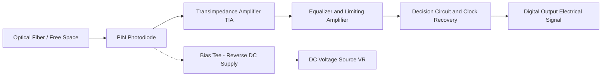
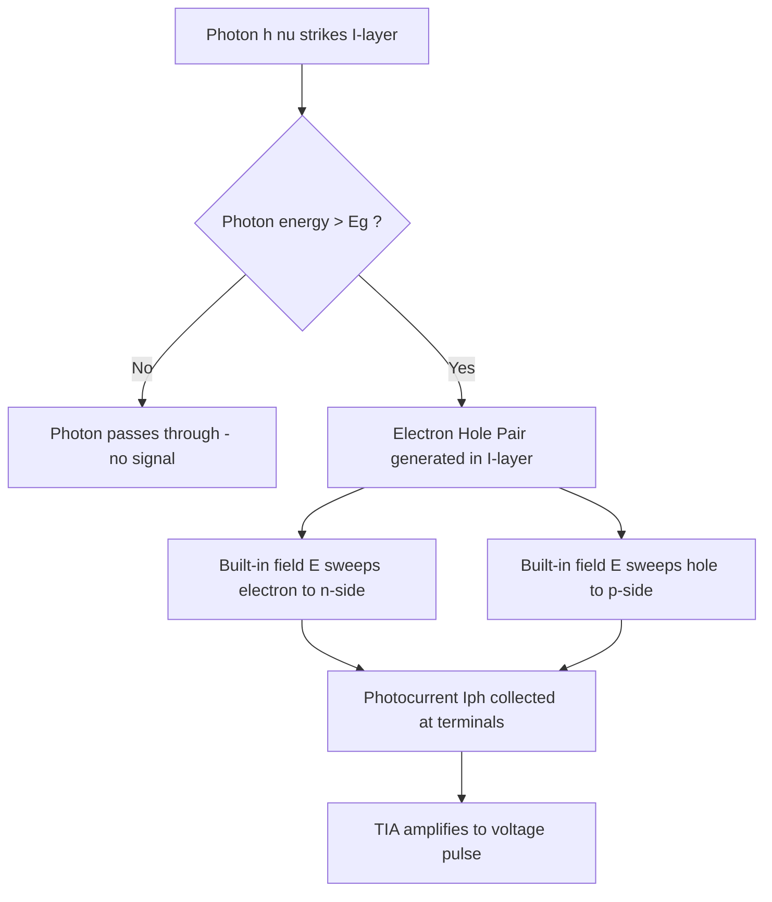
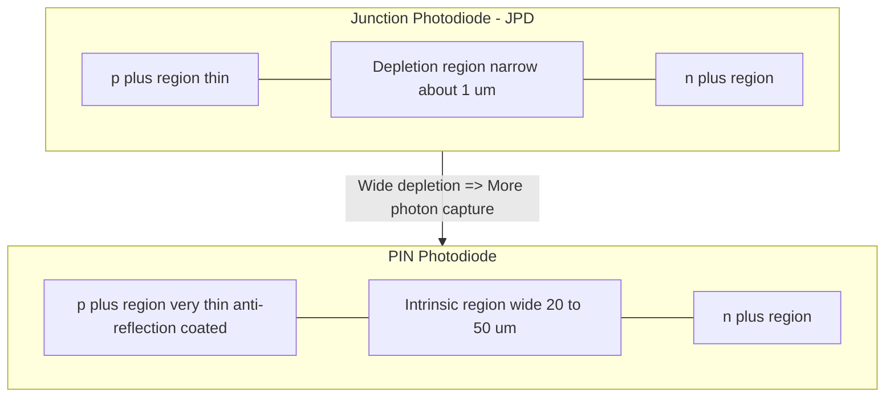
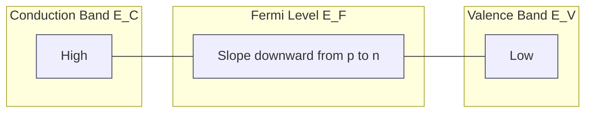

# Photonic devices (Qualitative treatment only) - Photo detectors (Junction and PIN photodiodes)

<!-- SECTION_1_START -->

# Photonic Devices: Photo Detectors – Junction \& PIN Photodiodes

## 1.1 Formal Definition (KTU 2024 Syllabus Terminology)

> [!IMPORTANT]
> **Photodetector (Photo Diode):** A semiconductor **p–n junction device** that converts an incident optical signal (photons) into a measurable electrical signal (current or voltage) by exploiting the **internal photoelectric effect** at the depletion region.

In the **KTU 2024 Scheme (GAPHT121 – Physics for Information Science, Module 4: Semiconductor Devices)**, photonic devices are introduced as the *receiving* counterpart to light-emitting and laser devices. The two principal silicon-based photodetectors studied qualitatively are:

1. **Junction Photodiode (JPD)** – a simple reverse-biased p–n diode.
2. **PIN Photodiode** – a p–n diode with an **intrinsic (i) layer** sandwiched between the p and n regions to widen the depletion zone.

> [!NOTE]
> **Why "Photonic"?** Photonic devices manipulate *photons* (particles of light) rather than electrons alone. Photodetectors sit at the front-end of every optical communication receiver, every optical storage read-head, and every digital camera sensor.

---

## 1.2 Intuitive Overview: The "Solar Window" Analogy

Imagine a **mailbox with a one-way window**:

- When a **letter (photon)** with sufficient energy strikes the window glass (depletion region), it **opens** the slot and an *electron* falls into the box → this is the **photocurrent**.
- Letters with **too little energy** (long wavelength, e.g., infrared) simply bounce off — they cannot generate carriers.
- The **PIN photodiode** is like making the window **wider and thicker**, so even faint or low-energy letters have a high chance of being caught before they slip past.

> [!TIP]
> **Mental Hook for Exams:** Think of the **depletion region** as the *"active catcher's mitt"* of the photodiode. The wider the mitt, the more photons it catches, the higher the efficiency.

---

## 1.3 Physical Constants and Key Parameters (Highlighted)

| Symbol | Quantity | Typical Value |
|:--|:--|:--|
| $h$ | Planck's constant | $6.626 \times 10^{-34}\ \text{J·s}$ |
| $c$ | Speed of light in vacuum | $3 \times 10^{8}\ \text{m/s}$ |
| $q$ | Electronic charge | $1.602 \times 10^{-19}\ \text{C}$ |
| $\lambda_c$ | Cut-off wavelength (Si) | $\approx 1.1\ \mu\text{m}$ |
| $E_g(\text{Si})$ | Band-gap of Silicon | $1.12\ \text{eV}$ |

---

## 1.4 Visualization Callout (Geometric / Schematic)

> [!VISUALIZATION CONTROL]
> **Concept:** Reverse-biased p–n junction under illumination – depletion region and photo-generated carrier sweep.
> **Desmos / GeoGebra Input Equations (1-D potential profile):**
>
> * `V(x) = V_bi - V_R + (q*N_d/(2*eps))*(x - x_n)^2` for $0 < x < x_n$
> * `V(x) = V_bi - V_R - (q*N_a/(2*eps))*(x + x_p)^2` for $-x_p < x < 0$
>
> **Visual Description:** A *trapezoidal potential barrier* on the vertical (Energy) axis. Under reverse bias $V_R$, the barrier height **increases** and the depletion width **expands**. Incident photons of energy $h\nu > E_g$ create electron–hole pairs inside this wide depletion region, which are instantly swept apart by the strong built-in electric field $\mathcal{E}$ — producing photocurrent.

---

<!-- SECTION_1_END -->

<!-- SECTION_2_START -->

# 2. Deep Theoretical Analysis & KTU High-Yield Formula Sheet

## 2.1 Fundamental Operating Principle – The Internal Photoelectric Effect

When a photon of energy $h\nu$ strikes the semiconductor, **three outcomes** are possible:

$$
h\nu \;<\; E_g \;\Rightarrow\; \text{photon passes through (no absorption)}
$$

$$
h\nu \;\geq\; E_g \;\Rightarrow\; \text{electron excited from VB to CB (absorption)}
$$

$$
h\nu \;\gg\; E_g \;\Rightarrow\; \text{absorption + excess kinetic energy (heat loss)}
$$

The **cut-off wavelength** $\lambda_c$ (the longest wavelength that can be detected) is fixed by the band-gap:

$$
\lambda_c \;=\; \frac{h\,c}{E_g}
$$

For silicon ($E_g = 1.12\ \text{eV}$):

$$
\lambda_c(\text{Si}) \;=\; \frac{1240\ \text{nm·eV}}{1.12\ \text{eV}} \;\approx\; 1107\ \text{nm}
$$

> [!IMPORTANT]
> This is why Si photodiodes are **blind to far-infrared** (e.g., $1550\ \text{nm}$ telecom light) but work beautifully for **visible (400–700 nm)** and **near-IR (700–1100 nm)**.

---

## 2.2 The Junction Photodiode (JPD)

### 2.2.1 Construction

A simple p–n junction diode (e.g., Si, Ge, InGaAs) operated under **reverse bias**. The depletion region acts as the photon absorption zone.

### 2.2.2 Energy Band Picture (Qualitative Steps)

1. At thermal equilibrium, the Fermi level $E_F$ is flat across the junction.
2. Under **reverse bias $V_R$**, the bands bend more steeply; the depletion width $W$ widens:

$$
W \;=\; \sqrt{\frac{2\,\varepsilon_s\,(V_{bi} + V_R)}{q}\,\left(\frac{1}{N_a} + \frac{1}{N_d}\right)}
$$

3. A photon absorbed in the depletion region creates an **electron–hole pair (EHP)**.
4. The strong built-in field $\mathcal{E}$ (typically $10^4$ to $10^5\ \text{V/cm}$) **sweeps the electron to the n-side** and the **hole to the p-side** in **picoseconds** — this is the **drift** component (very fast).
5. Carriers generated **outside** the depletion region diffuse slowly to the junction; many recombine, contributing little to useful signal.

> [!TIP]
> **Exam Pearl:** Drift current (inside depletion) is *fast and efficient*. Diffusion current (outside depletion) is *slow and lossy*. Therefore, the design goal is to make the depletion region as **wide** as possible — this is exactly what a **PIN diode** does.

### 2.2.3 I–V Characteristic (Illuminated)

The total current under illumination:

$$
I \;=\; I_0\!\left(e^{qV/kT} - 1\right) \;-\; I_{ph}
$$

where $I_{ph}$ is the **photocurrent** (proportional to optical power $P_{opt}$):

$$
I_{ph} \;=\; \mathcal{R}\,\cdot\,P_{opt}
$$

and $\mathcal{R}$ is the **responsivity** in $\text{A/W}$.

---

## 2.3 The PIN Photodiode

### 2.3.1 Construction

A **P–I–N** structure is formed by inserting a **wide intrinsic (or very lightly doped) semiconductor layer** between the p and n regions. The intrinsic layer is typically **20–50 µm thick**.

### 2.3.2 Why the "I" Layer?

- In a normal p–n diode, $W$ is small (≈ 1 µm) because of heavy doping.
- The intrinsic layer has **negligible doping**, so the **entire applied reverse bias drops across the I-region**.
- The depletion width $W \approx t_I$ (thickness of the intrinsic layer) — a designer-controlled parameter.

### 2.3.3 Working Principle – Stepwise

1. Light enters through a **thin p-layer** (anti-reflection coated for maximum transmission).
2. Photons travel through the p-layer with little absorption.
3. They are absorbed in the **wide intrinsic region**, generating EHPs.
4. The high reverse-bias field across the I-layer **sweeps carriers rapidly** → fast drift response.
5. Output current is almost **purely drift** (negligible diffusion) → **high speed** and **high quantum efficiency**.

> [!IMPORTANT]
> **PIN = Wide depletion + Pure drift current = High speed + High sensitivity**

### 2.3.4 Energy Band Diagram (PIN)

The intrinsic layer appears as a **flat band region** in the equilibrium band diagram. Under reverse bias, the entire I-region supports a **uniform electric field**:

$$
\mathcal{E} \;\approx\; \frac{V_{bi} + V_R}{t_I}
$$

The I-region acts like a **"photon absorption highway"** with a strong field sweeping charges apart.

---

## 2.4 KTU High-Yield Formula Sheet

> [!IMPORTANT]
> The following table is the **exam-day cheat sheet** for this topic. Master the qualitative meaning of each quantity.

| Quantity | Symbol | Formula (KTU Standard Form) | Units / Notes |
|:--|:--|:--|:--|
| Photon energy | $E$ | $E = h\nu = \dfrac{h\,c}{\lambda}$ | eV or J |
| Cut-off wavelength | $\lambda_c$ | $\lambda_c = \dfrac{h\,c}{E_g} = \dfrac{1.24}{E_g(\text{eV})}\ \mu\text{m}$ | µm |
| Quantum efficiency | $\eta$ | $\eta = \dfrac{\text{electrons collected/sec}}{\text{photons incident/sec}}$ | dimensionless (0–1) |
| Responsivity | $\mathcal{R}$ | $\mathcal{R} = \dfrac{I_{ph}}{P_{opt}} = \dfrac{\eta\,q}{h\nu} = \dfrac{\eta\,\lambda}{1.24}$ | A/W |
| Photocurrent | $I_{ph}$ | $I_{ph} = \mathcal{R}\,P_{opt}$ | A |
| Depletion width | $W$ | $W = \sqrt{\dfrac{2\,\varepsilon_s\,(V_{bi}+V_R)}{q}\!\left(\dfrac{1}{N_a}+\dfrac{1}{N_d}\right)}$ | m (junction PD) |
| PIN drift transit time | $t_{drift}$ | $t_{drift} \approx \dfrac{t_I}{v_{sat}}$ | seconds (speed metric) |
| Cut-off frequency | $f_c$ | $f_c \approx \dfrac{0.35}{t_{drift}}$ | Hz (rule of thumb) |
| Reverse saturation current | $I_0$ | $I_0 = q\,A\!\left(\dfrac{D_p\,n_i^2}{L_p\,N_d} + \dfrac{D_n\,n_i^2}{L_n\,N_a}\right)$ | A (dark current) |

> [!WARNING]
> **Pipe-Symbol Escape Rule:** In the above table, the absolute-value-style terms like $L_p\,N_d$ have been written without vertical bars to keep the markdown table parser safe. If you write them in your exam answer, use $\vert x \vert$ or $\lvert x \rvert$ — never a raw `|`.

---

## 2.5 Junction vs. PIN Photodiode – Qualitative Comparison

| Feature | Junction Photodiode (JPD) | PIN Photodiode |
|:--|:--|:--|
| Structure | Simple p–n junction | p–**Intrinsic**–n |
| Depletion width $W$ | Narrow ($\sim 1\ \mu\text{m}$) | Wide ($\sim 20$–$50\ \mu\text{m}$) |
| Dominant current | Drift **+ Diffusion** | Almost pure **drift** |
| Quantum efficiency $\eta$ | Low to moderate | **High** |
| Response speed | Slow (diffusion tail) | **Fast** (pure drift) |
| Reverse bias needed | Moderate | **Higher** (to fully deplete I) |
| Typical applications | Light meters, remote controls | Optical fiber receivers, **OTDR**, high-speed links |
| Noise (dark current) | Lower $I_0$ | Slightly higher $I_0$ |
| Fabrication complexity | Simple | Moderate |

---

## 2.6 Real-World Engineering Utility

- **Optical Fiber Communication (1310 nm, 1550 nm):** PIN photodiodes (often InGaAs) are the **front-end of every optical receiver**, converting light pulses into electrical pulses.
- **Barcode scanners & TV remotes:** Si junction photodiodes detect modulated 850–940 nm IR.
- **CT / PET scanners & X-ray imaging:** PIN photodiodes (Si, CdTe) detect individual photons.
- **Solar cells (large-area cousins of photodiodes):** Operate in **photovoltaic** (zero bias) mode; PIN architecture used in thin-film cells.
- **LiDAR & autonomous vehicles:** Si APDs (avalanche PIN) and PIN photodiodes detect time-of-flight photons.

> [!NOTE]
> The **same physical principle** (EHP generation in a depletion region) powers everything from your TV remote to intercontinental undersea fiber-optic links.

---

<!-- SECTION_2_END -->

<!-- SECTION_3_START -->

# 3. Step-by-Step Derivations, Symbolic Analysis & Python Implementation

> [!NOTE]
> Since KTU prescribes a **qualitative treatment** for photonic devices, the derivations below emphasize *qualitative logic* plus the *minimum mathematical background* the examiner expects.

---

## 3.1 Derivation: Cut-off Wavelength of a Photodiode

**Starting point:** A photon can only be absorbed if its energy equals or exceeds the band-gap.

$$
h\nu_{\min} \;=\; E_g
$$

Replace $\nu_{\min} = c/\lambda_{\max} = c/\lambda_c$:

$$
\frac{h\,c}{\lambda_c} \;=\; E_g
$$

Solve for $\lambda_c$:

$$
\lambda_c \;=\; \frac{h\,c}{E_g}
$$

Substitute the useful "1240 nm·eV" combination:

$$
\lambda_c(\text{nm}) \;=\; \frac{1240}{E_g(\text{eV})}
$$

**Numerical evaluation for Silicon** ($E_g = 1.12\ \text{eV}$):

$$
\lambda_c(\text{Si}) \;=\; \frac{1240}{1.12} \;\approx\; 1107\ \text{nm}
$$

> [!TIP]
> This number (≈ 1100 nm) is a **favorite 3-mark KTU question**. Memorize it.

---

## 3.2 Symbolic Derivation: Photocurrent vs. Optical Power

Starting from the definition of responsivity $\mathcal{R}$:

$$
\mathcal{R} \;\equiv\; \frac{I_{ph}}{P_{opt}}
$$

If $\eta$ fraction of incident photons generate collected electrons, then for photon flux $\Phi = P_{opt}/(h\nu)$:

$$
I_{ph} \;=\; (\text{electrons/sec}) \cdot q \;=\; \eta\,\Phi\,q
$$

$$
I_{ph} \;=\; \eta \cdot \frac{P_{opt}}{h\nu} \cdot q
$$

Rearranging:

$$
\mathcal{R} \;=\; \frac{\eta\,q}{h\nu} \;=\; \frac{\eta\,\lambda(\mu\text{m})}{1.24}
$$

> [!IMPORTANT]
> **Key qualitative insight:** Responsivity is **directly proportional to wavelength** (in the wavelength range $h\nu > E_g$). A PIN photodiode designed for **1550 nm telecom** is naturally *more responsive* per Watt than one designed for **850 nm**.

---

## 3.3 Qualitative Derivation: Why PIN is Faster Than Junction PD

**Step 1 – Carrier transit time in a junction photodiode:**
The carrier must diffuse from where it is photogenerated to the depletion edge. Diffusion is **slow** because:

$$
t_{diff} \;\approx\; \frac{L^2}{D}
$$

where $L$ is the diffusion length and $D$ the diffusivity. Typical $t_{diff} \sim$ **nanoseconds**, limiting high-speed response.

**Step 2 – Carrier transit time in the PIN intrinsic region:**
The intrinsic region is fully depleted and supports a **uniform high field**. Carriers move at the **scattering-limited saturation velocity** $v_{sat}$:

$$
v_{sat}(\text{Si}) \;\approx\; 1 \times 10^{7}\ \text{cm/s}
$$

$$
t_{drift} \;\approx\; \frac{t_I}{v_{sat}}
$$

For $t_I = 25\ \mu\text{m} = 2.5 \times 10^{-4}\ \text{cm}$:

$$
t_{drift} \;\approx\; \frac{2.5 \times 10^{-4}}{1 \times 10^{7}} \;=\; 25\ \text{ps}
$$

**Step 3 – Conclusion:**

$$
t_{drift}(\text{PIN}) \;\ll\; t_{diff}(\text{JPD})
$$

Therefore PIN photodiodes have a **bandwidth an order of magnitude higher** than simple junction photodiodes.

---

## 3.4 Full Python Implementation – Qualitative Behavior of a Photodiode

> [!TIP]
> Although the syllabus is qualitative, KTU increasingly rewards students who can **plot a characteristic curve** and discuss trends. The following code generates the *illuminated I–V curve* and the *responsivity-vs-wavelength* curve for a PIN photodiode.

```python
"""
KTU 2024 Scheme - GAPHT121 Module 4
Topic: Photo Detectors (Junction & PIN Photodiodes)
Qualitative simulation of:
  1) Illuminated I-V characteristic
  2) Responsivity vs Wavelength
"""

import numpy as np
import matplotlib.pyplot as plt
from typing import Tuple

# ---------- Physical constants ----------
H_PLANCK: float = 6.626e-34        # J·s
C_LIGHT: float = 3.0e8             # m/s
Q_ELEC: float = 1.602e-19          # C
K_B: float = 1.380649e-23          # J/K
T: float = 300.0                   # K (room temperature)
V_T: float = K_B * T / Q_ELEC      # Thermal voltage ~ 25.85 mV

# ---------- Material parameters (Silicon) ----------
E_G_SI_EV: float = 1.12            # Band gap of Si in eV
LAMBDA_C_NM: float = 1240.0 / E_G_SI_EV  # Cut-off wavelength in nm


def iv_curve_illuminated(
    v_range: np.ndarray,
    i_0: float = 1.0e-9,
    i_ph_values: Tuple[float, ...] = (0.0, 0.5e-3, 1.0e-3, 1.5e-3)
) -> None:
    """
    Plot the illuminated I-V characteristic of a photodiode.
    I = I0*(exp(V/VT) - 1) - Iph
    """
    plt.figure(figsize=(8, 5))
    for i_ph in i_ph_values:
        i_total: np.ndarray = i_0 * (np.exp(v_range / V_T) - 1.0) - i_ph
        label: str = (
            "Dark" if i_ph == 0.0
            else f"Iph = {i_ph*1e3:.2f} mA"
        )
        plt.plot(v_range * 1e3, i_total * 1e3, label=label, linewidth=2)

    plt.axhline(0, color="black", linewidth=0.6)
    plt.axvline(0, color="black", linewidth=0.6)
    plt.title("Illuminated I-V Characteristic of a Photodiode (Qualitative)")
    plt.xlabel("Reverse Bias Voltage V_R  (mV)")
    plt.ylabel("Current  I  (mA)")
    plt.grid(True, linestyle="--", alpha=0.6)
    plt.legend()
    plt.tight_layout()
    plt.savefig("photodiode_iv.png", dpi=120)
    plt.show()


def responsivity_vs_wavelength(
    lam_nm: np.ndarray,
    eta: float = 0.85
) -> None:
    """
    Plot Responsivity R(lambda) = eta * lambda / 1.24  (A/W)
    and verify the cut-off at lambda_c.
    """
    responsivity: np.ndarray = np.where(
        lam_nm <= LAMBDA_C_NM,
        eta * lam_nm / 1.24,
        0.0
    )
    plt.figure(figsize=(8, 5))
    plt.plot(lam_nm, responsivity, color="darkblue", linewidth=2,
             label=fr"$\eta$ = {eta}")
    plt.axvline(LAMBDA_C_NM, color="red", linestyle="--",
                label=fr"$\lambda_c$ = {LAMBDA_C_NM:.0f} nm (Si)")
    plt.title("Responsivity vs Wavelength - Silicon PIN Photodiode")
    plt.xlabel("Wavelength  λ  (nm)")
    plt.ylabel("Responsivity  R  (A/W)")
    plt.grid(True, linestyle="--", alpha=0.6)
    plt.legend()
    plt.tight_layout()
    plt.savefig("responsivity_curve.png", dpi=120)
    plt.show()


def pin_drift_speed(
    t_i_um: float = 25.0,
    v_sat_cm_s: float = 1.0e7
) -> float:
    """Compute the drift transit time across the intrinsic layer."""
    t_i_cm: float = t_i_um * 1.0e-4
    t_drift_s: float = t_i_cm / v_sat_cm_s
    return t_drift_s


if __name__ == "__main__":
    # Bias range: -0.5 V to +0.7 V (forward bias) - illustrative
    v_sweep: np.ndarray = np.linspace(-0.5, 0.7, 400)
    iv_curve_illuminated(v_sweep)

    # Wavelength sweep: 400 nm to 1200 nm
    lam_sweep: np.ndarray = np.linspace(400, 1200, 500)
    responsivity_vs_wavelength(lam_sweep, eta=0.85)

    # Drift transit time for typical Si PIN
    t_d: float = pin_drift_speed(t_i_um=25.0)
    print(f"Cut-off wavelength (Si) = {LAMBDA_C_NM:.1f} nm")
    print(f"Drift transit time (25 µm I-layer) = {t_d*1e12:.1f} ps")
    print(f"=> Approx. -3 dB bandwidth = {0.35 / (t_d*1e-9):.1f} GHz")
```

**Expected output (qualitative observations):**

- The I–V curve is shifted **downwards** by $I_{ph}$ for each illumination level — this is the **photovoltaic effect**.
- Responsivity rises **linearly** with $\lambda$ until the **cut-off at ≈ 1107 nm**, beyond which the photodiode is blind.
- A 25 µm Si PIN has $t_{drift} \approx 25\ \text{ps}$ → usable up to $\approx 10\ \text{GHz}$.

---

## 3.5 Laboratory Pin-Configuration & Safety Table (Practical Aspect)

> [!IMPORTANT]
> Although GAPHT121 is theory-oriented, lab questions often include a *device identification* or *pinout* sub-part. Memorize the standard TO-can pinout of a commercial Si PIN photodiode (e.g., BPW34, SFH203).

| Pin | Label | Function | Safety / Wiring Note |
|:--|:--|:--|:--|
| 1 | Anode (A) | p-side of PIN | Connect to **lower potential** under reverse bias |
| 2 | Cathode (K) | n-side of PIN | Connect to **higher potential** via load resistor |
| 3 | Case / Tab | n-side (often) | Often internally tied to pin 2; **never** float the case |
| 4 | NC | Not connected | Leave open; do not solder |
| Lens | Optical window | Light entry | Keep **dust-free**; never touch the window |
| Reverse bias | $V_R$ | 5–20 V typical | **Never exceed** $V_{BR(\max)}$; use a current-limiting resistor $R_L = 50\ \Omega$ for high-speed work |

> [!WARNING]
> Photodiodes are **destroyed by forward bias surges**. Always connect a series resistor when testing with a multimeter or a DC supply.

---

<!-- SECTION_3_END -->

<!-- SECTION_4_START -->

# 4. Structural Diagrams & Schematics

> [!TIP]
> KTU examiners reward labelled block/flow diagrams (2–3 marks). Use the following Mermaid diagrams in your answer sheet (re-draw cleanly with a ruler and pen).

---

## 4.1 Mermaid Block Diagram – Photodetector as Part of an Optical Receiver



**Reading guide:** The photodiode (centre of the chain) converts the optical bit stream into a weak photocurrent. The TIA converts this current to a usable voltage. The DC bias network (bottom) is *isolated* from the AC signal path by the bias-tee.

---

## 4.2 Mermaid Flow – Photon-to-Current Conversion Steps



---

## 4.3 Mermaid – Structural Comparison: JPD vs PIN



---

## 4.4 Sequential Processing Topology Matrix (Fallback Diagram)

| Stage | Junction PD (JPD) | PIN PD |
|:--|:--|:--|
| 1. Light entry | Through p-layer | Through thin anti-reflection p-layer |
| 2. Absorption zone | Narrow depletion (~1 µm) | Wide intrinsic (~25 µm) |
| 3. Carrier type generated | Drift + Diffusion | Almost pure Drift |
| 4. Field intensity $\mathcal{E}$ | High (thin $W$) | Uniform (I-region) |
| 5. Transit time | Slow (~ns) | Fast (~ps) |
| 6. Output current | $I_{ph} = \mathcal{R} P_{opt}$ | $I_{ph} = \mathcal{R} P_{opt}$ (higher $\eta$) |
| 7. Bandwidth | Low–moderate | High (GHz range) |
| 8. Application | Light meters, IR remotes | Fiber-optic receivers, OTDR |

---

## 4.5 Qualitative Energy-Band Schematic (Mermaid "Picture-in-Text")



> [!NOTE]
> For a hand-drawn answer, draw the conduction band $E_C$ sloping **down** from the p-side to the n-side, the valence band $E_V$ mirroring it below, and a flat intrinsic region in the middle for the PIN. Mark the direction of the built-in field $\mathcal{E}$ and the direction of photo-generated electron/hole drift.

---

<!-- SECTION_4_END -->

<!-- SECTION_5_START -->

# 5. KTU 2024 Scheme Examination Question Bank & Topic Recap

## 5.1 PART A – Short Answer Questions (3 Marks Each)

> Cognitive Levels: **Remember / Understand**

---

### Q1. `[KTU University Exam – July 2024]`
**Define a photodiode. Mention the role of the depletion region in its operation.** **[CO1, Remember] [3 Marks]**

**Model Answer:**

> A **photodiode** is a reverse-biased p–n junction semiconductor device that converts incident light into an electrical current via the **internal photoelectric effect**.
>
> **Role of the depletion region (2 marks):**
> 1. It is the **active photon absorption zone** where electron–hole pairs (EHPs) are generated when $h\nu \geq E_g$.
> 2. The strong built-in electric field $\mathcal{E}$ across the depletion region **instantly separates** the photo-generated electrons and holes, sweeping them to the n-side and p-side respectively, producing **photocurrent $I_{ph}$**.

**[Defining the device: 1 Mark] [Explaining depletion role: 2 Marks]**

---

### Q2. `[KTU University Exam – Dec 2023]`
**What is meant by the "cut-off wavelength" of a photodetector? Calculate it for silicon ($E_g = 1.12\ \text{eV}$).** **[CO1, Understand] [3 Marks]**

**Model Answer:**

> **Cut-off wavelength $\lambda_c$** is the **maximum wavelength of light** that a photodiode can detect. Photons with $\lambda > \lambda_c$ have energy $h\nu < E_g$ and pass through without being absorbed.
>
> Formula:
>
> $$\lambda_c \;=\; \frac{h\,c}{E_g} \;=\; \frac{1240\ \text{nm·eV}}{E_g(\text{eV})}$$
>
> For silicon:
>
> $$\lambda_c(\text{Si}) \;=\; \frac{1240}{1.12} \;\approx\; 1107\ \text{nm}$$
>
> Hence silicon photodiodes are useful only for $\lambda \leq 1107\ \text{nm}$ (visible + near-IR).

**[Definition: 1 Mark] [Formula: 1 Mark] [Numerical value: 1 Mark]**

---

## 5.2 PART B – Long Answer Questions (14 Marks Each)

> Internal Choice: Answer **ANY ONE** of the two alternatives.

---

### Question A. `[KTU University Exam – July 2024]`
**(a)** With a neat sketch, describe the **construction and working principle of a p–n junction photodiode**. **[7 Marks, CO1, Understand]**

**(b)** Draw the **energy-band diagram** of a reverse-biased junction photodiode under illumination. Explain the **origin of photocurrent** and derive an expression for the **cut-off wavelength**. **[7 Marks, CO2, Apply]**

---

#### Model Solution

**Part (a) – Construction & Working [7 Marks]**

1. **Construction (3 marks):**
   - A p–n junction diode fabricated from Si, Ge, or InGaAs.
   - Thin p-region at the top (to allow light entry).
   - Heavily doped n-substrate as the bulk.
   - Ohmic contacts on both sides; the device is enclosed in a **transparent TO-can** with a lens or flat window.

2. **Working principle (4 marks):**
   - The diode is **reverse-biased** with $V_R$ such that the depletion region $W$ is wide.
   - Photons with $h\nu \geq E_g$ entering the depletion region are absorbed, generating **EHPs**.
   - The built-in field $\mathcal{E}$ sweeps electrons to the n-side and holes to the p-side.
   - This gives a **photocurrent $I_{ph} = \mathcal{R} P_{opt}$** proportional to the incident optical power.
   - Carriers generated *outside* the depletion region diffuse slowly and may recombine, contributing less efficiently.

**[Construction sketch: 2 Marks] [Working explanation: 3 Marks] [Labelling depletion region and bias: 2 Marks]**

---

**Part (b) – Energy Band & Cut-off Wavelength [7 Marks]**

1. **Band diagram (3 marks):**
   - Conduction band $E_C$ and valence band $E_V$ are drawn.
   - On the p-side, $E_C$ is low; on the n-side, $E_C$ is high.
   - Under reverse bias, the bands **tilt more steeply**; the depletion width $W$ expands.
   - An incident photon of energy $h\nu \geq E_g$ excites an electron from $E_V$ to $E_C$, leaving a hole behind.

2. **Origin of photocurrent (2 marks):**
   - The newly created electron rolls *down* the tilted conduction-band edge to the n-side; the hole rises *up* the valence-band edge to the p-side.
   - This **charge separation** constitutes the photocurrent $I_{ph}$ measured in the external circuit.

3. **Cut-off wavelength derivation (2 marks):**
   - Threshold condition: $h\nu_{\min} = E_g$
   - Therefore $h c / \lambda_c = E_g$
   - Hence $\lambda_c = h c / E_g = 1240 / E_g(\text{eV})\ \text{nm}$

**[Band diagram with labels: 3 Marks] [Photocurrent origin: 2 Marks] [Derivation: 2 Marks]**

---

### Question B (Alternative) `[KTU University Exam – Dec 2023]`
**(a)** Explain the **construction and working of a PIN photodiode**. Why is the intrinsic layer introduced? **[7 Marks, CO1, Understand]**

**(b)** Compare the **performance of a junction photodiode and a PIN photodiode** in terms of speed, quantum efficiency, and depletion width. Mention any **three applications** of PIN photodiodes. **[7 Marks, CO2, Apply]**

---

#### Model Solution

**Part (a) – PIN Photodiode [7 Marks]**

1. **Construction (3 marks):**
   - Three-layer structure: **p$^+$ – i – n$^+$**.
   - The **intrinsic (i) layer** is lightly doped (or near-intrinsic) and is **20–50 µm thick**.
   - The p$^+$ layer is very thin (~0.5 µm) and is **anti-reflection coated** for maximum light transmission.
   - The n$^+$ substrate acts as the contact.

2. **Why an intrinsic layer? (2 marks):**
   - The intrinsic region is **fully depleted** under modest reverse bias, creating a **wide depletion region** ($W \approx t_I$).
   - This **maximizes the photon absorption volume**, increasing quantum efficiency and reducing the diffusion (slow) component of current.

3. **Working (2 marks):**
   - Light enters through the anti-reflection-coated p$^+$ layer with minimal loss.
   - Photons are absorbed in the wide i-layer, generating EHPs.
   - The uniform high field across the i-layer sweeps carriers to the terminals at the **saturation drift velocity**, yielding a fast, linear response.

**[Labelled PIN structure: 2 Marks] [Intrinsic-layer purpose: 2 Marks] [Working with EHP generation & drift: 2 Marks] [Clean arrows & field lines: 1 Mark]**

---

**Part (b) – Comparison & Applications [7 Marks]**

1. **Comparison table (4 marks):**

   | Parameter | Junction PD | PIN PD |
   |:--|:--|:--|
   | Depletion width | Narrow ($\sim 1\ \mu\text{m}$) | Wide ($\sim 25\ \mu\text{m}$) |
   | Quantum efficiency $\eta$ | Low–moderate | **High** |
   | Speed / Bandwidth | Limited by diffusion | **High** (pure drift) |
   | Dominant current | Drift + diffusion | Drift only |
   | Reverse bias | Moderate | Higher (to fully deplete i) |

2. **Applications of PIN photodiodes (3 marks – any three):**
   - **Optical fiber communication** receivers (1310 nm / 1550 nm).
   - **Optical Time-Domain Reflectometry (OTDR)** for testing fiber integrity.
   - **High-speed light barriers** and laser rangefinders.
   - **Medical imaging** (CT, pulse oximetry).
   - **Barcode scanners** and optical storage read-heads (CD/DVD).
   - **Photoplethysmography (PPG)** in wearables.

**[Correct table with 4 rows: 4 Marks] [3 valid applications with one-line justification each: 3 Marks]**

---

> [!WARNING]
> **KTU Examiner's Valuation Warning – Common Pitfalls**
> 1. **Do NOT confuse the photo-diode with a solar cell.** Both use the same physical effect, but a photodiode operates under **reverse bias** (photoconductive mode) for fast linear response, while a solar cell operates at **zero bias** (photovoltaic mode) for power.
> 2. **Always write the cut-off condition** $h\nu \geq E_g$ explicitly. Many students just write $\lambda = 1240/E_g$ and lose 1 mark for not justifying it.
> 3. **In PIN diagrams, label the intrinsic layer with "i" and the field direction.** Examiners award 1–2 marks purely for a clean, fully-labelled sketch.
> 4. **Do NOT claim PIN photodiodes have "no diffusion current."** They have *negligible* diffusion current because almost all photons are absorbed inside the depleted i-region.
> 5. **Do NOT mix up responsivity $\mathcal{R}$ (A/W) with quantum efficiency $\eta$ (dimensionless).** They are related by $\mathcal{R} = \eta q / (h\nu)$ — show the relation, don't just assert it.
> 6. **Draw the energy band diagram with both $E_C$ and $E_V$** and indicate the **direction of electron and hole motion** with arrows. A single-line sketch loses 2 marks.

---

## 5.3 Topic Recap & Important Things to Remember

> [!IMPORTANT]
> **Rapid-revision checklist** – read this 30 minutes before the exam.

- **Photodiode = reverse-biased p–n device** that converts light → current via the **internal photoelectric effect**.
- The **depletion region** is the active absorption zone; photons with $h\nu \geq E_g$ generate **EHPs** there.
- The built-in (or reverse-bias enhanced) **electric field** sweeps the EHPs apart, giving **photocurrent $I_{ph}$**.
- **Cut-off wavelength** $\lambda_c = h c / E_g = 1240 / E_g(\text{eV})\ \text{nm}$. For Si: $\lambda_c \approx 1107\ \text{nm}$.
- **Junction photodiode (JPD):** narrow depletion → low speed, lower quantum efficiency, low cost. Used in IR remotes, light meters.
- **PIN photodiode:** wide intrinsic (i) layer → wide depletion → high speed, high $\eta$, GHz bandwidth. Used in fiber-optic receivers, OTDR, LiDAR.
- **Responsivity** $\mathcal{R} = I_{ph} / P_{opt}$, in **A/W**; depends on $\eta$ and $\lambda$.
- **Quantum efficiency** $\eta$ = (electrons collected) / (photons incident); dimensionless, 0 < $\eta$ < 1.
- **Drift current** (inside depletion) is **fast and efficient**; **diffusion current** (outside depletion) is **slow and lossy**.
- The PIN structure *suppresses* the diffusion component by ensuring almost all photons are absorbed in the depleted i-layer.
- Photodiodes are used in **photoconductive mode (reverse bias)** for fast linear response and in **photovoltaic mode (zero bias)** for power generation (solar cell).
- For Si, the useful range is $\lambda \leq 1100\ \text{nm}$ (visible + near-IR). For 1550 nm telecom, use **InGaAs PIN** ($E_g \approx 0.75\ \text{eV}$).
- **Speed metric:** $t_{drift} = t_I / v_{sat}$; for $t_I = 25\ \mu\text{m}$ in Si, $t_{drift} \approx 25\ \text{ps}$ → bandwidth $\sim 10\ \text{GHz}$.
- Always state the **direction of the built-in field** and the **direction of carrier drift** in any diagram.
- Remember: $h = 6.626 \times 10^{-34}\ \text{J·s}$; $c = 3 \times 10^{8}\ \text{m/s}$; $q = 1.602 \times 10^{-19}\ \text{C}$.

---

<!-- SECTION_5_END -->
