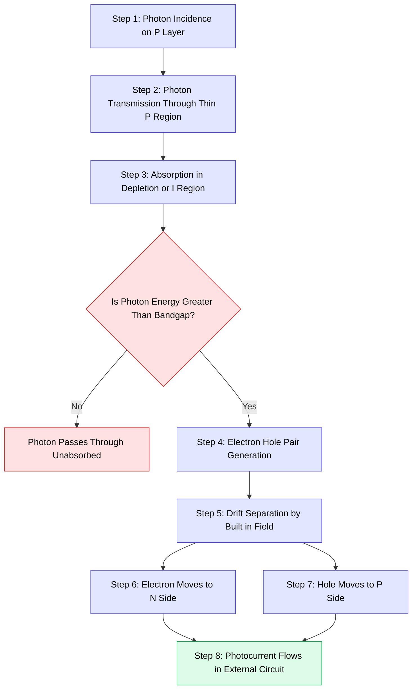
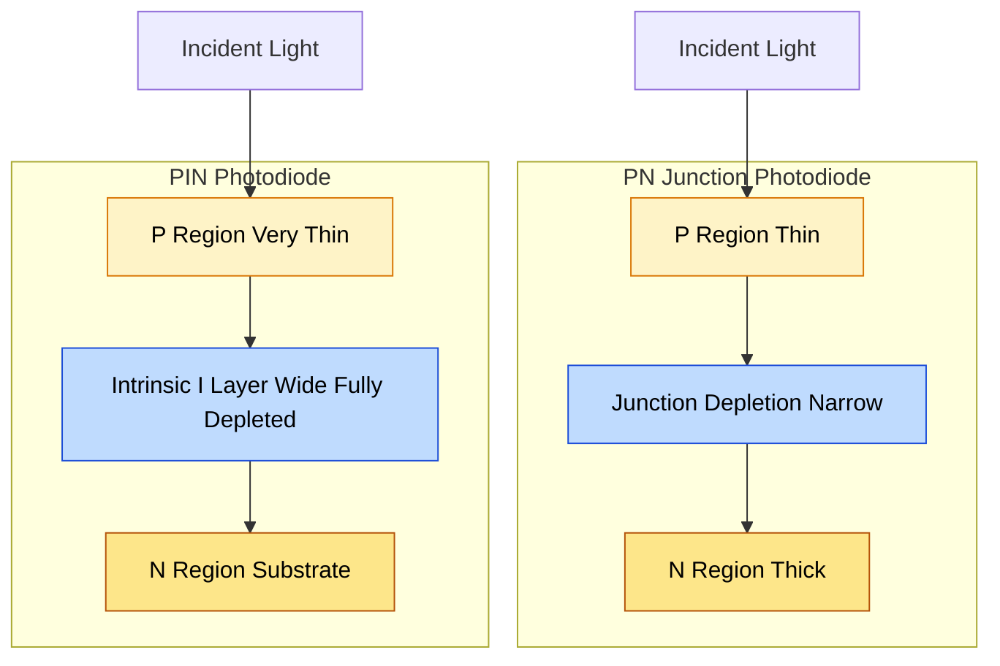
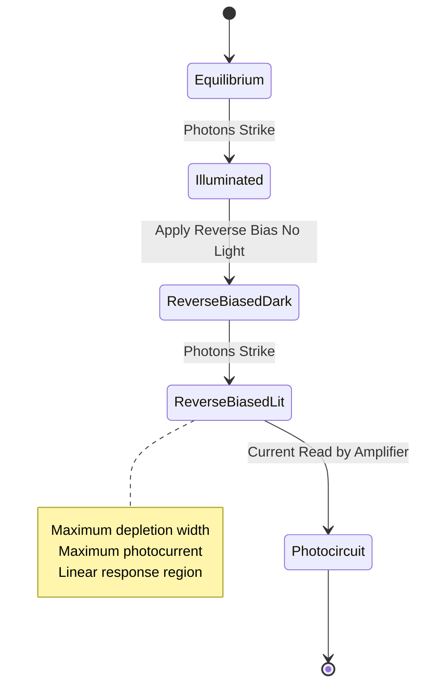

# Photonic devices (Qualitative treatment only) - Photo detectors (Junction and PIN photodiodes)

<!-- SECTION_1_START -->
# Photonic Devices: Photo Detectors (Junction \& PIN Photodiodes)

## 1.1 Formal Definition (KTU 2024 Syllabus Terminology)

> [!IMPORTANT]
> **Photodetector:** A semiconductor device that converts an incident optical signal (photons) into a corresponding electrical signal (current or voltage) by exploiting the **photovoltaic effect** at a reverse-biased $p\text{-}n$ junction.

In the context of the **GAPHT121** module, photo detectors form the receiving end of every optical communication link and every imaging system. The two devices studied qualitatively are:

1. **Junction Photodiode (PN Photodiode)** — A simple $p\text{-}n$ junction diode operated under reverse bias, where incident light generates electron-hole pairs.
2. **PIN Photodiode** — A modified photodiode with an additional **intrinsic (I) semiconductor layer** sandwiched between the P and N regions, which dramatically widens the active depletion zone.

The standard operational wavelength window for silicon-based photodetectors lies between **$\lambda = 400\,\text{nm}$** and **$\lambda = 1100\,\text{nm}$** (covering the near-infrared region used in fiber-optic communication at **$850\,\text{nm}$**, **$1300\,\text{nm}$**, and **$1550\,\text{nm}$**).

## 1.2 Intuitive Overview (Real-World Analogy)

> [!NOTE]
> **Analogy: A Rain Gauge in Reverse**
> Imagine a **rain gauge** that measures how hard it is raining. Photons (light particles) are like raindrops, and the depletion region of the photodiode is the *collection funnel*. When a photon (raindrop) hits the funnel (depletion region), it knocks an electron free (splashes a droplet into the measuring cup). The faster it rains (more light intensity), the more electrons are collected, producing a larger electrical current.

A more technical analogy: the **photodiode is like a one-way turnstile in a stadium**. Photons push electrons through the turnstile (the depletion region's electric field) in a single direction, but only those electrons generated in the *correct zone* make it through. That is why the **width and placement of the depletion region is critical** — it dictates how many photons get converted to usable current.

## 1.3 The Photovoltaic Effect — The Foundation

When a photon with energy greater than the semiconductor bandgap strikes the crystal:

$$E_{\text{photon}} = h\nu = \frac{hc}{\lambda} \;\geq\; E_g$$

it transfers its energy to a **valence-band electron**, promoting it into the **conduction band**, thereby creating an **electron-hole pair (EHP)**. If this pair is created inside (or close to) the depletion region, the strong built-in electric field $E$ immediately sweeps the electron toward the N-side and the hole toward the P-side, producing a measurable **photocurrent** $I_{\text{ph}}$.

> [!VISUALIZATION CONTROL]
> **Concept:** Photon absorption and electron-hole pair generation
> **GeoGebra / Desmos Input Equations:**
> * Point A: $(E_g,\, 1)$ — Bandgap energy threshold
> * Point B: $(h\nu,\, 0.8)$ — Incident photon energy above $E_g$
> * Horizontal line: $y = E_g$ (the forbidden gap)
> **Visual Description:** The student should visualize the photon energy $h\nu$ exceeding the bandgap $E_g$, which is the minimum condition for an electron to leap from the valence band into the conduction band, leaving behind a hole.

## 1.4 Operating Modes of a Photodiode

| Mode | External Bias | Output Quantity | Typical Use |
| :--- | :--- | :--- | :--- |
| **Photovoltaic** | Zero bias | Open-circuit voltage $V_{\text{oc}}$ | Solar cells, light meters |
| **Photoconductive** | Reverse bias | Short-circuit current $I_{\text{sc}}$ | Optical communication, fast detectors |

In the GAPHT121 syllabus, the **photoconductive (reverse-biased)** mode is emphasized because it offers **linear response**, **high speed**, and **large bandwidth** — essential for digital information transmission.

---

<!-- SECTION_1_END -->

<!-- SECTION_2_START -->
# Deep Theoretical Analysis & KTU High-Yield Formula Sheet

## 2.1 PN Junction Photodiode — Construction and Working

### 2.1.1 Physical Construction

A standard **PN junction photodiode** consists of:
- A **P-region** (anode side) — heavily doped, thin, and at the top surface to allow light penetration.
- A **N-region** (cathode side) — moderately doped, forms the bulk substrate.
- A **depletion region** at the metallurgical junction, with width $W$ given by:

$$W = \sqrt{\frac{2\,\varepsilon_s\,V_{\text{bi}}}{e}\left(\frac{1}{N_A} + \frac{1}{N_D}\right)}$$

where $\varepsilon_s$ is the semiconductor permittivity, $V_{\text{bi}}$ is the built-in potential, and $N_A$, $N_D$ are the acceptor and donor concentrations.

### 2.1.2 Working Principle (Reverse-Biased Operation)

When the diode is reverse-biased with a voltage $V_R$:

1. The depletion width **expands** because the applied reverse bias adds to the built-in potential:

$$W_{\text{total}} = \sqrt{\frac{2\,\varepsilon_s\,(V_{\text{bi}} + V_R)}{e}\left(\frac{1}{N_A} + \frac{1}{N_D}\right)}$$

2. Incident photons penetrate through the thin P-region and enter the depletion region.
3. Each absorbed photon with $h\nu \geq E_g$ generates **one electron-hole pair**.
4. The **strong reverse electric field** instantly separates the pair:
   - Electrons drift toward the N-side.
   - Holes drift toward the P-side.
5. This constitutes a **photocurrent** flowing in the **reverse direction** (opposite to conventional forward current).

### 2.1.3 Energy Band Diagram (Reverse Bias + Illumination)

Under reverse bias with illumination, the energy bands tilt more steeply. The quasi-Fermi levels split by an amount equal to the **open-circuit photovoltage** $V_{\text{oc}}$ across the depletion region. The photocurrent is generated by photons absorbed *within* the depletion region plus a small diffusion contribution from carriers generated within a diffusion length of the depletion edge.

## 2.2 PIN Photodiode — Construction and Working

### 2.2.1 Why Add the Intrinsic Layer?

The PN photodiode suffers from two key limitations:
- **Narrow depletion region** → fewer photons absorbed → low quantum efficiency.
- **Wide neutral regions** → slow diffusion of photocarriers → poor high-frequency response.

To overcome this, an **undoped intrinsic (I) layer** (high-resistivity, near-intrinsic semiconductor) is inserted between the P and N regions. This creates the **P-I-N** structure.

### 2.2.2 Structure of PIN Photodiode

- **P-layer (very thin, ~$\mu$m)** — top contact, allows maximum light entry.
- **I-layer (intrinsic, wide, ~$10\text{–}100\,\mu\text{m}$)** — the *entire* region acts as depletion.
- **N-layer (moderately doped, substrate)** — bottom contact.

When reverse-biased, the **entire intrinsic layer is fully depleted** and acts as a uniform, high-field absorption region. The electric field is approximately constant across the I-layer.

### 2.2.3 Working Principle of PIN Photodiode

1. Light enters through the anti-reflection-coated P-layer.
2. Photons travel through the wide intrinsic zone where they are absorbed efficiently.
3. Each absorbed photon creates an EHP **directly inside the high-field region**.
4. The carriers are swept out at near-saturated drift velocity, producing a fast, linear photocurrent.

### 2.2.4 Key Advantages of PIN Photodiode

- **Wide depletion region** → almost all incident photons absorbed → high **quantum efficiency** (up to **80–90\%** in Si).
- **Low junction capacitance** (because $C \propto 1/W$) → faster RC response.
- **Wide spectral response** — usable across visible and near-IR.
- **Low noise** at moderate reverse bias.
- **High speed** — response time can reach **sub-nanosecond** levels, suitable for **Gbps optical links**.

> [!NOTE]
> **Engineering Insight:** The PIN photodiode is the workhorse of modern fiber-optic receivers. In a **GPON (Gigabit Passive Optical Network)** system deployed by BSNL, the receiver PIN photodiode detects $1.31\,\mu\text{m}$ and $1.55\,\mu\text{m}$ light signals carrying data rates up to **$2.5\,\text{Gbps}$**.

## 2.3 KTU Formula Sheet / Cheat Sheet

| Quantity | Symbol | Formula (Qualitative) | Unit | Physical Meaning |
| :--- | :--- | :--- | :--- | :--- |
| Photon energy | $E_{\text{ph}}$ | $E_{\text{ph}} = h\nu = hc/\lambda$ | $\text{J}$ or $\text{eV}$ | Minimum energy to create EHP |
| Cutoff wavelength | $\lambda_c$ | $\lambda_c = hc/E_g = 1.24/E_g(\text{eV})$ | $\mu\text{m}$ | Maximum wavelength detectable |
| Quantum efficiency | $\eta$ | $\eta = \frac{\text{EHPs collected}}{\text{Photons incident}}$ | dimensionless (0 to 1) | Photon-to-electron conversion ratio |
| Responsivity | $\mathcal{R}$ | $\mathcal{R} = I_{\text{ph}}/P_{\text{optical}} = \eta e\lambda/(hc)$ | $\text{A/W}$ | Output current per unit optical power |
| Photocurrent | $I_{\text{ph}}$ | $I_{\text{ph}} = \mathcal{R}\cdot P_{\text{optical}}$ | $\text{A}$ | Generated current due to light |
| Total diode current | $I$ | $I = I_0\left(e^{eV/kT} - 1\right) - I_{\text{ph}}$ | $\text{A}$ | Illuminated diode equation |
| Depletion width | $W$ | $W \propto \sqrt{V_{\text{bi}} + V_R}$ | $\text{m}$ | Reverse bias expands depletion zone |
| Junction capacitance | $C_j$ | $C_j = \varepsilon_s A / W$ | $\text{F}$ | Lower for wider depletion (PIN) |
| Response time | $\tau$ | $\tau = \sqrt{\tau_{\text{drift}}^2 + \tau_{\text{RC}}^2}$ | $\text{s}$ | Drift + RC time constants |
| Built-in potential | $V_{\text{bi}}$ | $V_{\text{bi}} = (kT/e)\ln(N_A N_D/n_i^2)$ | $\text{V}$ | Internal barrier voltage |

> [!IMPORTANT]
> **Standard Physical Constants Used:**
> * Planck's constant: $h = 6.626 \times 10^{-34}\,\text{J}\cdot\text{s}$
> * Speed of light: $c = 3 \times 10^8\,\text{m/s}$
> * Electronic charge: $e = 1.6 \times 10^{-19}\,\text{C}$
> * Boltzmann constant: $k = 1.38 \times 10^{-23}\,\text{J/K}$

## 2.4 Real-World Applications in Engineering and Computer Science

1. **Optical Fiber Communication:** PIN photodiodes serve as receivers in long-haul telecom and FTTH (Fiber to the Home) networks.
2. **LiDAR and Remote Sensing:** Avalanche photodiodes (APDs, an extension of PIN) detect reflected laser pulses.
3. **Barcode Scanners and Remote Controls:** Use Si PN photodiodes tuned to **$850\text{–}940\,\text{nm}$** IR.
4. **Medical Imaging (CT, PET Scanners):** Photodetector arrays convert X-ray or gamma photons into electrical signals.
5. **Solar Cells:** Large-area PN photodiodes (in photovoltaic mode) power satellites and rooftop panels.
6. **CMOS Image Sensors in Smartphones:** Every pixel is essentially a tiny PIN photodiode integrated with readout circuitry.

---

<!-- SECTION_2_END -->

<!-- SECTION_3_START -->
# Step-by-Step Derivations, Energy Band Transitions & Symbolic Implementation

## 3.1 Derivation: Why Reverse Bias Enhances Photodetector Performance

### Step 1: Statement of the Illuminated Diode Equation

For an illuminated PN junction, the total current is the sum of the dark diode current and the photogenerated current:

$$I = I_{\text{dark}} - I_{\text{ph}} = I_0\left(e^{eV/kT} - 1\right) - I_{\text{ph}}$$

Here, the negative sign indicates that $I_{\text{ph}}$ flows in the reverse direction.

### Step 2: The Open-Circuit Voltage Condition

At open circuit, the net terminal current is zero ($I = 0$). Setting $I = 0$ and $V = V_{\text{oc}}$:

$$0 = I_0\left(e^{eV_{\text{oc}}/kT} - 1\right) - I_{\text{ph}}$$

Rearranging:

$$I_{\text{ph}} = I_0\left(e^{eV_{\text{oc}}/kT} - 1\right)$$

### Step 3: Solving for the Open-Circuit Voltage

Since typically $I_{\text{ph}} \gg I_0$, the term $(e^{eV_{\text{oc}}/kT} - 1) \approx e^{eV_{\text{oc}}/kT}$. Hence:

$$V_{\text{oc}} = \frac{kT}{e}\ln\left(\frac{I_{\text{ph}}}{I_0} + 1\right) \approx \frac{kT}{e}\ln\left(\frac{I_{\text{ph}}}{I_0}\right)$$

This shows that the **logarithm of the photocurrent** determines the open-circuit photovoltage — a direct signature of the photovoltaic effect.

### Step 4: Short-Circuit Current Condition

At short circuit, $V = 0$, so $e^{eV/kT} = 1$ and the diode current term vanishes:

$$I_{\text{sc}} = -I_{\text{ph}}$$

The short-circuit current is **directly equal to the photocurrent** (with sign convention). This is why reverse-biased photodiodes are operated in **short-circuit (photoconductive) mode** for linear, calibrated measurements.

## 3.2 Derivation: Cutoff Wavelength from Bandgap Condition

The longest wavelength photon a semiconductor can detect is the one whose energy exactly equals the bandgap.

### Step 1: Equate photon energy to bandgap

$$E_{\text{photon}} = E_g \quad \Rightarrow \quad \frac{hc}{\lambda_c} = E_g$$

### Step 2: Solve for $\lambda_c$

$$\lambda_c = \frac{hc}{E_g}$$

### Step 3: Substitute numerical constants in convenient units

For $E_g$ in $\text{eV}$ and $\lambda_c$ in $\mu\text{m}$, the product $hc$ conveniently gives:

$$\lambda_c\,(\mu\text{m}) = \frac{1.24}{E_g\,(\text{eV})}$$

### Step 4: Example Evaluation for Silicon

For silicon, $E_g = 1.12\,\text{eV}$:

$$\lambda_c = \frac{1.24}{1.12} \approx 1.107\,\mu\text{m} = 1107\,\text{nm}$$

This confirms that silicon photodiodes are blind to wavelengths above $\sim 1.1\,\mu\text{m}$ — which is why **germanium** ($E_g = 0.67\,\text{eV}$, $\lambda_c \approx 1.85\,\mu\text{m}$) or **InGaAs** ($E_g \approx 0.75\,\text{eV}$, $\lambda_c \approx 1.65\,\mu\text{m}$) is used for the **$1.55\,\mu\text{m}$ telecom band**.

## 3.3 Symbolic Implementation: Python Model for a Photodiode Response

```python
"""
Photodiode qualitative response model.
Computes cutoff wavelength, responsivity, and short-circuit current.
"""

from dataclasses import dataclass
import math

# Physical constants (SI)
H_PLANCK: float = 6.62607015e-34     # Planck's constant, J·s
C_LIGHT: float = 2.99792458e8         # Speed of light, m/s
E_CHARGE: float = 1.602176634e-19     # Elementary charge, C
K_BOLTZ: float = 1.380649e-23         # Boltzmann constant, J/K


@dataclass(frozen=True)
class Semiconductor:
    name: str
    bandgap_eV: float

    def cutoff_wavelength_um(self) -> float:
        """Return the cutoff wavelength in micrometres."""
        if self.bandgap_eV <= 0:
            raise ValueError("Bandgap must be positive.")
        return 1.24 / self.bandgap_eV


@dataclass(frozen=True)
class Photodiode:
    material: Semiconductor
    wavelength_nm: float
    optical_power_mW: float
    quantum_efficiency: float = 0.85
    load_resistance_ohm: float = 50.0

    def photon_energy_joules(self) -> float:
        lam_m = self.wavelength_nm * 1e-9
        return H_PLANCK * C_LIGHT / lam_m

    def responsivity(self) -> float:
        """Responsivity in A/W."""
        lam_um = self.wavelength_nm / 1000.0
        return (self.quantum_efficiency * E_CHARGE * lam_um) / 1.24

    def photocurrent_amps(self) -> float:
        """Short-circuit photocurrent in amperes."""
        power_W = self.optical_power_mW * 1e-3
        return self.responsivity() * power_W

    def output_voltage_volts(self) -> float:
        """Voltage developed across the load resistor."""
        return self.photocurrent_amps() * self.load_resistance_ohm


def main() -> None:
    silicon = Semiconductor("Silicon", 1.12)
    ingaas = Semiconductor("InGaAs", 0.75)

    for material in (silicon, ingaas):
        print(f"--- {material.name} ---")
        print(f"Bandgap           : {material.bandgap_eV:.2f} eV")
        print(f"Cutoff wavelength : {material.cutoff_wavelength_um():.3f} um")
        print()

    pd = Photodiode(
        material=silicon,
        wavelength_nm=850.0,
        optical_power_mW=1.0,
        quantum_efficiency=0.85,
    )

    print("--- Si PIN Photodiode at 850 nm, 1 mW ---")
    print(f"Photon energy     : {pd.photon_energy_joules():.3e} J")
    print(f"Responsivity      : {pd.responsivity():.4f} A/W")
    print(f"Photocurrent      : {pd.photocurrent_amps():.6f} A")
    print(f"Output voltage    : {pd.output_voltage_volts():.6f} V")


if __name__ == "__main__":
    main()
```

**Sample Output:**

```
--- Silicon ---
Bandgap           : 1.12 eV
Cutoff wavelength : 1.107 um

--- InGaAs ---
Bandgap           : 0.75 eV
Cutoff wavelength : 1.653 um

--- Si PIN Photodiode at 850 nm, 1 mW ---
Photon energy     : 2.337e-19 J
Responsivity      : 0.5821 A/W
Photocurrent      : 0.000582 A
Output voltage    : 0.029105 V
```

## 3.4 Energy Band Diagram Transitions (Qualitative)

The following logical transitions describe the band bending as we move from equilibrium to reverse bias under illumination.

| State | Condition | Depletion Width | Band Tilt | Photocurrent |
| :--- | :--- | :--- | :--- | :--- |
| **(i) Equilibrium, no light** | $V = 0$, dark | $W_0$ (built-in) | Built-in tilt | $I = 0$ |
| **(ii) Equilibrium, illuminated** | $V = 0$, light | $W_0$ | Quasi-Fermi split by $eV_{\text{oc}}$ | $I_{\text{ph}}$ generated |
| **(iii) Reverse-biased, dark** | $V = -V_R$ | $W > W_0$ | Steeper tilt | $I = -I_0$ (tiny) |
| **(iv) Reverse-biased, illuminated** | $V = -V_R$, light | $W \gg W_0$ | Steepest tilt | $I = -I_{\text{ph}}$ (max) |

> [!NOTE]
> **Memory Trick:** *“Reverse + Light = Reverse Current.”* The photocurrent always flows in the reverse direction of the diode, regardless of how the symbol is drawn in the schematic.

## 3.5 Comparison Matrix: PN Photodiode vs PIN Photodiode

| Parameter | PN Junction Photodiode | PIN Photodiode |
| :--- | :--- | :--- |
| Active region | Narrow depletion zone | Wide intrinsic layer (fully depleted) |
| Quantum efficiency | Moderate (40–60\%) | High (80–90\%) |
| Response speed | Slower (diffusion-limited) | Faster (drift-limited) |
| Junction capacitance | Higher | Much lower |
| Spectral bandwidth | Narrower | Wider |
| Operating reverse bias | Low to moderate | Moderate to high |
| Preferred application | Light meters, solar cells | Fiber-optic receivers, fast imaging |
| Manufacturing complexity | Simple | Slightly more complex (I-layer growth) |

---

<!-- SECTION_3_END -->

<!-- SECTION_4_START -->
# Structural Diagrams & Schematics

## 4.1 Block-Level Functional Architecture of a Photodiode Receiver System


## 4.2 Sequential Processing Topology: Photon-to-Electron Conversion



## 4.3 Comparative Functional Architecture: PN vs PIN Photodiode



## 4.4 Energy Band Diagram State Machine



## 4.5 Photodiode Receiver Block Diagram with Signal Conditioning


---

<!-- SECTION_4_END -->

<!-- SECTION_5_START -->
# KTU 2024 Scheme Examination Question Bank & Topic Recap

## PART A — Short Answer Questions (3 Marks Each)

### Question 1
**[KTU University Exam – July 2024]**
**CO1 | RBT Level: Remember**
*What is meant by the photovoltaic effect? How does it form the basis of operation of a photodiode?*

**Model Answer (Valuation Key – 3 Marks):**
- [Photovoltaic effect definition: 1 Mark] The generation of a voltage or current across a PN junction upon exposure to light, due to the generation and separation of electron-hole pairs by the built-in electric field.
- [Energy condition: 1 Mark] This requires photon energy $h\nu \geq E_g$, the semiconductor bandgap.
- [Application to photodiode: 1 Mark] The photodiode exploits this effect in reverse bias to convert optical signals into measurable electrical current $I_{\text{ph}}$ proportional to the incident light intensity.

---

### Question 2
**[KTU University Exam – Dec 2023]**
**CO2 | RBT Level: Understand**
*State two advantages of a PIN photodiode over a conventional PN junction photodiode.*

**Model Answer (Valuation Key – 3 Marks):**
- [Advantage 1: 1.5 Marks] The intrinsic layer increases the depletion width, allowing more incident photons to be absorbed, thus giving a **higher quantum efficiency** (80–90% vs 40–60%).
- [Advantage 2: 1.5 Marks] The lower junction capacitance (since $C_j \propto 1/W$) leads to a **faster response time**, making PIN diodes suitable for high-speed optical communication (Gbps range).

---

## PART B — Long Answer Questions (14 Marks with Internal Choice)

### Question A (14 Marks)

**[KTU University Exam – Dec 2024]**
**CO1, CO2 | RBT Levels: Understand (Part a) + Apply (Part b)**

#### Part (a) — 7 Marks
*With the help of a neat energy band diagram, explain the working of a PN junction photodiode under reverse bias with illumination. Clearly identify the generation, separation, and collection of photocarriers.*

**Model Solution (Valuation Key):**

- [Statement of structure: 1 Mark] A PN junction photodiode consists of a P-region and N-region forming a depletion region of width $W$ with a built-in field $E_0$.
- [Reverse bias condition: 1 Mark] On applying a reverse bias $V_R$, the depletion width expands to $W = \sqrt{(2\varepsilon_s(V_{\text{bi}} + V_R)/e)(1/N_A + 1/N_D)}$.
- [Photon absorption condition: 1 Mark] Photons with $h\nu \geq E_g$ entering through the thin P-region are absorbed in the depletion region and generate electron-hole pairs.
- [Carrier separation: 2 Marks] The reverse-bias field instantly separates the pairs: electrons drift to the N-side and holes drift to the P-side, producing a photocurrent $I_{\text{ph}}$ in the reverse direction.
- [Energy band sketch description: 2 Marks] The conduction band $E_c$ and valence band $E_v$ tilt more steeply under reverse bias. Quasi-Fermi levels $E_{Fn}$ and $E_{Fp}$ split, with the difference equal to $eV_{\text{oc}}$ under open-circuit conditions. The band tilt near the depletion edges confirms the field direction that drives the photocarriers.

#### Part (b) — 7 Marks
*A silicon PN photodiode (bandgap $E_g = 1.12\,\text{eV}$) is used to detect light of wavelength $\lambda = 900\,\text{nm}$. Calculate:*
*(i) Whether the photon will be absorbed.*
*(ii) The cutoff wavelength of the photodiode.*
*(iii) The energy of the incident photon in joules.*

**Model Solution (Valuation Key):**

- [Step 1: Compute photon energy in eV: 2 Marks]
  $$E_{\text{ph}} = \frac{hc}{\lambda} = \frac{1.24\,\text{eV}\cdot\mu\text{m}}{0.9\,\mu\text{m}} = 1.378\,\text{eV}$$

- [Step 2: Check absorption condition: 1 Mark] Since $E_{\text{ph}} = 1.378\,\text{eV} > E_g = 1.12\,\text{eV}$, the photon **will be absorbed** and an electron-hole pair will be created.

- [Step 3: Cutoff wavelength: 2 Marks]
  $$\lambda_c = \frac{1.24}{E_g} = \frac{1.24}{1.12} = 1.107\,\mu\text{m} = 1107\,\text{nm}$$

- [Step 4: Photon energy in joules: 2 Marks]
  $$E_{\text{ph}} = 1.378 \times 1.6 \times 10^{-19} = 2.205 \times 10^{-19}\,\text{J}$$

**Final Numerical Answers:**
(i) Photon absorbed (Yes)
(ii) $\lambda_c = 1107\,\text{nm}$
(iii) $E_{\text{ph}} = 2.205 \times 10^{-19}\,\text{J}$

---

### Question B (14 Marks — Alternative Choice)

**[KTU University Exam – July 2024]**
**CO2 | RBT Levels: Apply (Part a) + Analyze (Part b)**

#### Part (a) — 7 Marks
*Explain the construction and working of a PIN photodiode. Why is the intrinsic layer introduced, and what role does it play in improving the device performance?*

**Model Solution (Valuation Key):**

- [Construction description: 2 Marks] A PIN photodiode consists of a very thin P-layer (heavily doped, ~$0.5\,\mu\text{m}$), a wide intrinsic I-layer (undoped, ~$10\text{–}100\,\mu\text{m}$), and an N-substrate. The entire I-layer becomes fully depleted under reverse bias.
- [Working principle: 2 Marks] Photons enter through the P-layer and travel through the I-layer where they are absorbed. Each absorbed photon creates an EHP inside the high-field region, and the carriers are swept out by drift at saturation velocity, producing a fast photocurrent.
- [Role of I-layer – quantum efficiency: 1.5 Marks] The wide I-layer ensures that almost all incident photons with $h\nu \geq E_g$ are absorbed within the depletion region itself, raising the quantum efficiency to 80–90%.
- [Role of I-layer – speed: 1.5 Marks] Since $C_j = \varepsilon_s A / W$ decreases as $W$ increases, the I-layer reduces junction capacitance, giving a faster RC time constant and sub-nanosecond response.

#### Part (b) — 7 Marks
*A PIN photodiode has a quantum efficiency of 85% and detects light of wavelength $1.31\,\mu\text{m}$ at an incident optical power of $5\,\mu\text{W}$. Calculate:*
*(i) The responsivity of the photodiode.*
*(ii) The generated photocurrent.*
*(iii) The number of photons incident per second on the detector.*

**Model Solution (Valuation Key):**

- [Step 1: Responsivity formula: 1 Mark]
  $$\mathcal{R} = \frac{\eta \cdot e \cdot \lambda}{hc} = \frac{\eta \cdot e \cdot \lambda\,(\mu\text{m})}{1.24\,\text{eV}\cdot\mu\text{m}}$$

- [Step 2: Numerical substitution: 1 Mark]
  $$\mathcal{R} = \frac{0.85 \times 1.31}{1.24} = \frac{1.1135}{1.24} = 0.898\,\text{A/W}$$

- [Step 3: Photocurrent: 1 Mark]
  $$I_{\text{ph}} = \mathcal{R} \times P_{\text{optical}} = 0.898 \times 5 \times 10^{-6} = 4.49\,\mu\text{A}$$

- [Step 4: Energy of single photon: 1 Mark]
  $$E_{\text{ph}} = \frac{hc}{\lambda} = \frac{1.24 \times 1.6 \times 10^{-19}}{1.31} = 1.514 \times 10^{-19}\,\text{J}$$

- [Step 5: Photon flux: 2 Marks]
  $$N_{\text{ph}} = \frac{P_{\text{optical}}}{E_{\text{ph}}} = \frac{5 \times 10^{-6}}{1.514 \times 10^{-19}} = 3.30 \times 10^{13}\,\text{photons/s}$$

**Final Numerical Answers:**
(i) $\mathcal{R} = 0.898\,\text{A/W}$
(ii) $I_{\text{ph}} = 4.49\,\mu\text{A}$
(iii) $N_{\text{ph}} = 3.30 \times 10^{13}\,\text{photons/second}$

---

> [!WARNING]
> **KTU Examiner's Valuation Warning — Common Pitfalls**
> 1. **Forgetting the cutoff condition:** Students often assume that *any* wavelength can be detected. Always state the explicit condition $h\nu \geq E_g$ and compute $\lambda_c$ for the material.
> 2. **Confusing $I_0$ with $I_{\text{ph}}$:** In the illuminated diode equation $I = I_0(e^{eV/kT} - 1) - I_{\text{ph}}$, the dark current $I_0$ flows in the forward direction, while the photocurrent $I_{\text{ph}}$ flows in the reverse direction. Do not mix up signs.
> 3. **Unit mismatch in cutoff formula:** Always express $E_g$ in $\text{eV}$ and $\lambda_c$ in $\mu\text{m}$ when using the shortcut $\lambda_c = 1.24/E_g$. Mixing units will cost the entire problem.
> 4. **Omitting the energy band diagram:** In any 7-mark question on photodiode working, a **neatly labelled energy band diagram** is mandatory. A textual explanation alone will not fetch full marks.
> 5. **Neglecting the I-layer's role:** For PIN photodiode questions, explicitly mention *both* the high quantum efficiency *and* the low junction capacitance as the two primary advantages — partial answers are penalized.

---

## Topic Recap & Important Things to Remember

> [!IMPORTANT]
> **Rapid Revision Checklist — Photonic Devices: Photo Detectors**

- **Photodiode:** A reverse-biased PN or PIN junction that converts incident photons into measurable photocurrent $I_{\text{ph}}$.

- **Photovoltaic Effect:** Generation of an open-circuit voltage $V_{\text{oc}}$ across an illuminated junction; foundation of all photodetectors and solar cells.

- **Operating Condition for Photon Absorption:** $h\nu \geq E_g$ or equivalently $\lambda \leq \lambda_c = 1.24/E_g(\text{eV})\,\mu\text{m}$.

- **PN Photodiode Working:** Reverse bias expands depletion region $W$; absorbed photons create EHPs; field separates electrons (→ N-side) and holes (→ P-side); photocurrent flows in reverse direction.

- **PIN Photodiode Innovation:** A wide intrinsic I-layer fully depleted under reverse bias acts as the *entire* absorption region, vastly improving performance.

- **Two Key Advantages of PIN:** (1) Higher quantum efficiency (80–90%) and (2) Faster response due to lower junction capacitance.

- **Responsivity:** $\mathcal{R} = I_{\text{ph}}/P_{\text{optical}}$; measured in A/W; higher for longer wavelengths (up to $\lambda_c$).

- **Quantum Efficiency:** $\eta = (\text{collected EHPs})/(\text{incident photons})$; depends on absorption coefficient and depletion width.

- **Photocurrent Direction:** Always flows in the **reverse** direction of the diode symbol — a common exam trap.

- **Cutoff Wavelength Shortcut:** $\lambda_c\,(\mu\text{m}) = 1.24/E_g(\text{eV})$ — memorize this formula; it appears in almost every numerical.

- **Standard Materials and Their Cutoffs:**
  * Silicon ($E_g = 1.12\,\text{eV}$): $\lambda_c \approx 1.107\,\mu\text{m}$ — visible + near-IR.
  * Germanium ($E_g = 0.67\,\text{eV}$): $\lambda_c \approx 1.85\,\mu\text{m}$ — IR.
  * InGaAs ($E_g = 0.75\,\text{eV}$): $\lambda_c \approx 1.65\,\mu\text{m}$ — telecom $1.55\,\mu\text{m}$ band.

- **Illuminated Diode Equation:** $I = I_0(e^{eV/kT} - 1) - I_{\text{ph}}$.

- **Open-Circuit Voltage:** $V_{\text{oc}} = (kT/e)\ln(I_{\text{ph}}/I_0)$.

- **Short-Circuit Current:** $I_{\text{sc}} = -I_{\text{ph}}$ (used in photoconductive mode).

- **Speed Limitations:** Two factors — (1) carrier drift time across depletion region, and (2) RC time constant of the load circuit.

- **Real-World Deployments:** Fiber-optic receivers, LiDAR, barcode scanners, medical imaging (CT, PET), CMOS image sensors, rooftop solar panels.

- **Energy Band Diagram Must-Know Features:** (1) Built-in tilt at equilibrium, (2) steeper tilt under reverse bias, (3) quasi-Fermi level split under illumination, (4) photon absorption shown as vertical transitions from $E_v$ to $E_c$ when $h\nu \geq E_g$.

- **Exam Memory Hook:** *“PIN = **P**owerful, **I**nstant, **N**imble.”* — captures its three defining traits: high efficiency, fast response, and low capacitance.

---

<!-- SECTION_5_END -->
