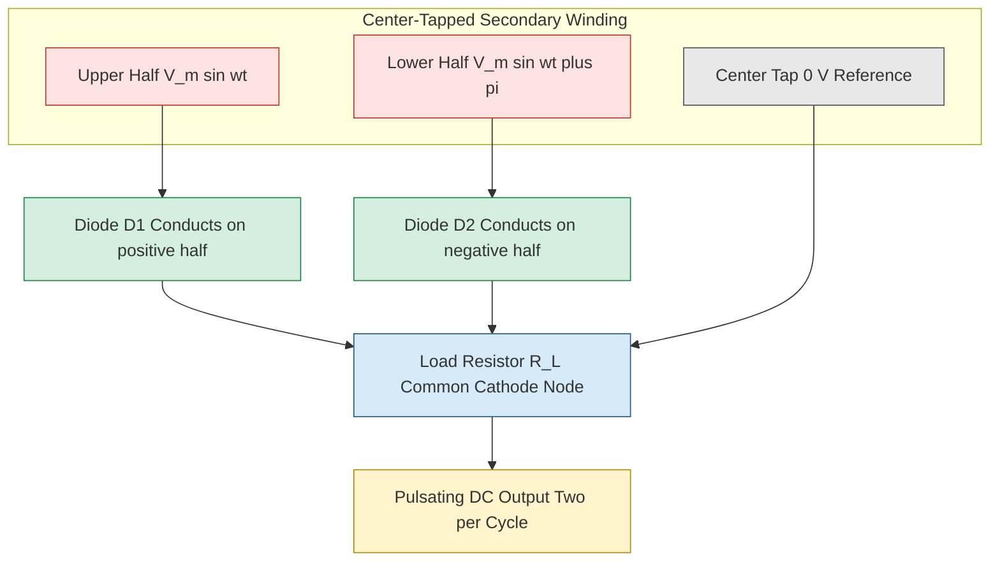
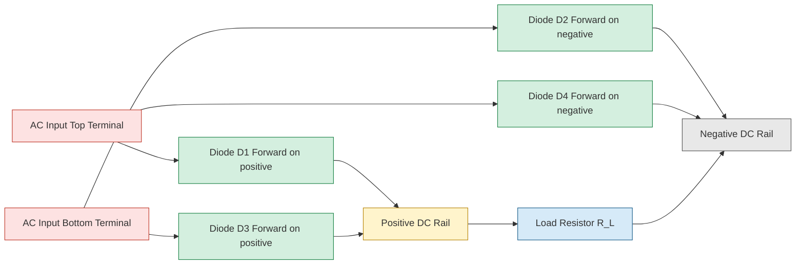
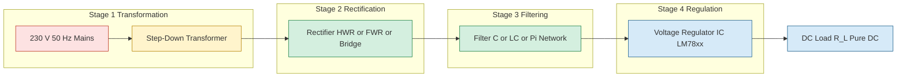
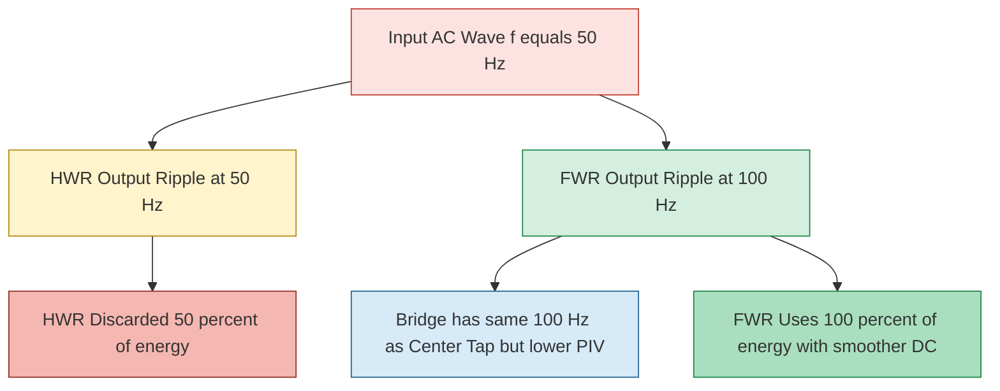

# Rectifiers

<!-- SECTION_1_START -->
# Rectifiers — Core Technical Definition & Intuitive Overview

## Formal Definition (KTU 2024 Syllabus Terminology)

A **rectifier** is an electronic circuit that employs one or more semiconductor diodes to convert an alternating voltage/current signal (bidirectional) into a unidirectional (pulsating DC) signal. Rectifiers form the essential first stage of every linear DC power supply unit (PSU) that feeds sensitive analog and digital integrated circuits.

> [!IMPORTANT]
> **KTU 2024 Syllabus Highlight (GAPHT121 — Module 4):**
> The rectifier stage must be studied in conjunction with **filter circuits** (C-filter, L-filter, LC-filter, π-filter) and **regulation parameters** (ripple factor, rectification efficiency, transformer utilization factor, peak inverse voltage, and percentage regulation). The two canonical topologies are the **Half-Wave Rectifier (HWR)** and the **Full-Wave Rectifier (FWR)** — with the FWR further subdivided into the **Center-Tapped Transformer Configuration** and the **Bridge (Graetz) Configuration**.

| Rectifier Type | Diodes Used | Output Frequency | Transformer Required |
| :--- | :---: | :---: | :---: |
| Half-Wave | 1 | $f$ | Step-down only |
| Full-Wave (Center-Tap) | 2 | $2f$ | Center-tapped |
| Full-Wave (Bridge) | 4 | $2f$ | Ordinary step-down |

## Conceptual Analogy / Intuition

Imagine a **bicycle pump** connected to a tank through a **one-way check valve**. Air sloshes back and forth inside the pump (the AC mains), but the check valve (the diode) only allows molecules to pass during the *forward* half of every oscillation — the tank therefore fills up only on every alternate push. That filling pattern is precisely a **half-wave rectified** signal.

A **full-wave rectifier** is like installing *two* check valves facing opposite directions, each feeding the *same* tank. Now *every* push — whether forward or backward — pushes air into the tank. The tank fills twice as fast and twice as smoothly: the output is **pulsating DC with double the fundamental frequency**.

> [!NOTE]
> **Real-World Engineering Grounding:** Rectifiers are the front-end of every smartphone charger, laptop adapter, microwave oven control board, Wi-Fi router, and laboratory DC bench supply. The pulsating output is *not* pure DC; it is contaminated with a periodic **AC ripple component**, which is why a **filter capacitor** and a **voltage regulator IC** (e.g., LM7805, LM317) must always follow the rectifier in a practical design.

## Physical Constants and Standard Metrics

- The **forward barrier potential** of a silicon rectifier diode: $V_\gamma = 0.7 \text{ V}$
- The **forward barrier potential** of a germanium diode: $V_\gamma = 0.3 \text{ V}$
- The **AC mains frequency** in India: $f = 50 \text{ Hz}$ → ripple frequency of HWR $= 50 \text{ Hz}$, ripple frequency of FWR $= 100 \text{ Hz}$
- Standard transformer secondary RMS ratings in Indian labs: **6 V, 9 V, 12 V, 15 V, 24 V**

> [!VISUALIZATION CONTROL]
> **Concept:** Rectified sinusoidal waveform before and after diode conduction
> **GeoGebra / Desmos Input Equations:**
> * `f1(x) = sin(x)` — original AC mains
> * `f2(x) = sin(x) if sin(x) > 0 else 0` — half-wave rectified
> * `f3(x) = abs(sin(x))` — full-wave rectified
> **Visual Description:** The student should observe that the negative half-cycles are clipped to zero in HWR and flipped to positive in FWR; the area under the FWR curve over a full period is exactly *twice* that of the HWR.

<!-- SECTION_1_END -->

<!-- SECTION_2_START -->
# Deep Theoretical Analysis & KTU High-Yield Formula Sheet

## 2.1 Half-Wave Rectifier (HWR) — Operating Logic

The secondary of a step-down transformer feeds a single diode in series with the load resistor $R_L$.

- During the **positive half-cycle** of the secondary, the diode is forward biased (anode more positive than cathode) and ideally behaves as a closed switch. The load current $i_L = i_m \sin(\omega t)$ flows through $R_L$.
- During the **negative half-cycle**, the diode is reverse biased and acts as an open circuit. The load current is zero, and the entire negative half-cycle appears as reverse voltage across the diode.

**Why HWR is rarely used in practice:** Only half of the available AC power is delivered, the ripple is enormous ($\gamma = 1.21$ or **121 %**), the transformer utilization factor is poor, and the DC component contains a strong 50 Hz hum that is audible in audio power supplies.

## 2.2 Full-Wave Rectifier — Center-Tapped Configuration

- A **center-tapped transformer** with turns ratio $2:1:1$ delivers two equal anti-phase voltages $v_1 = V_m \sin(\omega t)$ and $v_2 = V_m \sin(\omega t + \pi)$ to the two diode anodes.
- During the positive half-cycle, diode $D_1$ conducts and $D_2$ is off. During the negative half-cycle, $D_2$ conducts and $D_1$ is off.
- The load current therefore flows in the *same direction* through $R_L$ during both half-cycles, producing a **fully pulsating unipolar waveform** with fundamental ripple frequency $2f$.

## 2.3 Full-Wave Rectifier — Bridge (Graetz) Configuration

- Four diodes $D_1, D_2, D_3, D_4$ form a closed loop (diamond shape).
- During the positive half-cycle, $D_1$ and $D_3$ conduct; during the negative half-cycle, $D_2$ and $D_4$ conduct.
- **Key advantage:** No center-tapped transformer is required (cheap and compact), and the **PIV of each diode is only $V_m$** (half that of the center-tap version).
- **Key disadvantage:** Two diodes in series drop $2 V_\gamma \approx 1.4 \text{ V}$, slightly reducing the DC output.

## 2.4 Filter Circuits (Qualitative Description)

| Filter Type | Topology | Output Smoothness | Typical Use |
| :--- | :--- | :--- | :--- |
| Capacitor (C) | Single shunt $C$ across $R_L$ | Moderate | Low-current digital supplies |
| Inductor (L) | Series $L$ with $R_L$ | Poor (rarely used alone) | Old valve radios |
| LC (L-section) | Series $L$, shunt $C$ | Very good | General-purpose lab supplies |
| $\pi$-filter | $C_1$ – series $L$ – $C_2$ | Excellent | Audio and RF supplies |

> [!NOTE]
> The **ripple factor** $\gamma$ is defined as the ratio of RMS value of the AC ripple component to the absolute (DC) value of the rectifier output. A perfect DC supply has $\gamma = 0$. Lower ripple = smoother DC.

## 2.5 KTU Formula Sheet / Cheat Sheet

> [!IMPORTANT]
> The following table consolidates **every** formula that the KTU 2024 board expects students to reproduce from memory under examination pressure. Memorize the integrals, not just the final numbers.

| Parameter | Symbol | Half-Wave (HWR) | Full-Wave (FWR) | Units |
| :--- | :---: | :--- | :--- | :---: |
| Peak secondary voltage | $V_m$ | $V_m$ | $V_m$ (per half) | V |
| DC (average) output voltage | $V_{DC}$ | $\dfrac{V_m}{\pi}$ | $\dfrac{2 V_m}{\pi}$ | V |
| RMS output voltage | $V_{RMS}$ | $\dfrac{V_m}{2}$ | $\dfrac{V_m}{\sqrt{2}}$ | V |
| DC load current | $I_{DC}$ | $\dfrac{I_m}{\pi}$ | $\dfrac{2 I_m}{\pi}$ | A |
| RMS load current | $I_{RMS}$ | $\dfrac{I_m}{2}$ | $\dfrac{I_m}{\sqrt{2}}$ | A |
| Ripple factor | $\gamma$ | $1.21$ | $0.482$ | unitless |
| Rectification efficiency | $\eta$ | $40.6 \,\%$ | $81.2 \,\%$ | unitless |
| Peak Inverse Voltage | $PIV$ | $V_m$ | $2 V_m$ (center-tap) / $V_m$ (bridge) | V |
| Transformer Util. Factor | $TUF$ | $0.287$ | $0.693$ (center) / $0.810$ (bridge) | unitless |
| Ripple frequency | $f_r$ | $f$ | $2 f$ | Hz |
| Form factor | $K_f$ | $1.57$ | $1.11$ | unitless |

**Universal ripple–efficiency identity (worth remembering):**
$$\eta = \frac{\text{DC Power}}{\text{AC Power}} = \frac{1}{1 + \gamma^{\,2}}$$

## 2.6 Real-World Engineering Utility

Rectifier design parameters dictate the **physical size, weight, cost, and thermal dissipation** of every consumer power adapter. Modern **switch-mode power supplies (SMPS)** replace the 50 Hz transformer with a high-frequency ($50$–$500 \text{ kHz}$) chopper followed by a *high-frequency* rectifier — this allows the transformer to shrink by a factor of 100 and is the reason a 65 W laptop charger weighs only 200 g instead of 1.5 kg. The rectifier topology, however, is fundamentally the same.

<!-- SECTION_2_END -->

<!-- SECTION_3_START -->
# Step-by-Step Derivations & Symbolic Implementation

## 3.1 Derivation of $V_{DC}$ and $V_{RMS}$ for a Half-Wave Rectifier

Let the secondary voltage be $v = V_m \sin(\omega t)$. The load current (during the conducting half-cycle) is $i = I_m \sin(\omega t)$ where $I_m = V_m / R_L$. The full expression valid for one complete period $T$ is

$$
i(t) \;=\; \begin{cases} I_m \sin(\omega t), & 0 \le \omega t \le \pi \\[2pt] 0, & \pi \le \omega t \le 2\pi \end{cases}
$$

### Step 1 — DC (average) value of load current

$$
I_{DC} \;=\; \frac{1}{2\pi} \int_{0}^{2\pi} i(\omega t)\, d(\omega t) \;=\; \frac{1}{2\pi} \int_{0}^{\pi} I_m \sin(\omega t)\, d(\omega t)
$$

$$
I_{DC} \;=\; \frac{I_m}{2\pi} \big[ -\cos(\omega t) \big]_{0}^{\pi} \;=\; \frac{I_m}{2\pi} \big( -\cos\pi + \cos 0 \big) \;=\; \frac{I_m}{2\pi}(1 + 1) \;=\; \frac{I_m}{\pi}
$$

Multiplying by $R_L$ gives the **DC output voltage** of a half-wave rectifier:

$$
V_{DC} \;=\; I_{DC}\, R_L \;=\; \frac{V_m}{\pi}
$$

### Step 2 — RMS value of load current

$$
I_{RMS}^{\,2} \;=\; \frac{1}{2\pi} \int_{0}^{2\pi} i^{\,2}(\omega t)\, d(\omega t) \;=\; \frac{1}{2\pi} \int_{0}^{\pi} I_m^{\,2} \sin^{\,2}(\omega t)\, d(\omega t)
$$

Using the identity $\sin^{\,2} x = \dfrac{1 - \cos 2x}{2}$:

$$
I_{RMS}^{\,2} \;=\; \frac{I_m^{\,2}}{2\pi} \int_{0}^{\pi} \frac{1 - \cos(2\omega t)}{2}\, d(\omega t) \;=\; \frac{I_m^{\,2}}{4\pi} \Big[ \omega t - \frac{\sin(2\omega t)}{2} \Big]_{0}^{\pi}
$$

$$
I_{RMS}^{\,2} \;=\; \frac{I_m^{\,2}}{4\pi} \cdot \pi \;=\; \frac{I_m^{\,2}}{4} \quad \Longrightarrow \quad I_{RMS} \;=\; \frac{I_m}{2}
$$

Multiplying by $R_L$:

$$
V_{RMS} \;=\; I_{RMS}\, R_L \;=\; \frac{V_m}{2}
$$

### Step 3 — RMS value of the AC (ripple) component alone

By definition, the **total RMS** is the quadrature sum of the DC and AC components:

$$
I_{RMS}^{\,2} \;=\; I_{DC}^{\,2} + I_{ac,RMS}^{\,2} \quad \Longrightarrow \quad I_{ac,RMS} \;=\; \sqrt{ I_{RMS}^{\,2} - I_{DC}^{\,2} }
$$

$$
I_{ac,RMS} \;=\; \sqrt{ \frac{I_m^{\,2}}{4} - \frac{I_m^{\,2}}{\pi^{\,2}} } \;=\; \frac{I_m}{2} \sqrt{ 1 - \frac{4}{\pi^{\,2}} } \;=\; \frac{I_m}{2} \cdot 0.385
$$

### Step 4 — Ripple factor

$$
\gamma \;=\; \frac{I_{ac,RMS}}{I_{DC}} \;=\; \frac{ \dfrac{I_m}{2} \sqrt{1 - \tfrac{4}{\pi^{\,2}}} }{ \tfrac{I_m}{\pi} } \;=\; \frac{\pi}{2} \sqrt{1 - \frac{4}{\pi^{\,2}}}
$$

Numerically:

$$
\gamma \;=\; 1.5708 \times 0.7702 \;\approx\; 1.21 \quad \text{(or 121 %)}
$$

### Step 5 — Rectification efficiency

$$
\eta \;=\; \frac{P_{DC}}{P_{AC}} \;=\; \frac{ I_{DC}^{\,2} R_L }{ I_{RMS}^{\,2} R_L } \;=\; \frac{ I_{DC}^{\,2} }{ I_{RMS}^{\,2} } \;=\; \frac{ \left( \tfrac{I_m}{\pi} \right)^{\!2} }{ \left( \tfrac{I_m}{2} \right)^{\!2} } \;=\; \frac{4}{\pi^{\,2}} \;\approx\; 0.4059 \;\text{or}\; 40.6 \,\%
$$

> [!IMPORTANT]
> **Maximum possible rectification efficiency is 50 %** for a pure half-wave rectifier using an ideal diode. The 40.6 % figure is for an *unfiltered* HWR with a resistive load.

## 3.2 Derivation for a Full-Wave Rectifier

The current waveform over one complete period is $i(\omega t) = I_m \sin(\omega t)$ for the *entire* interval $0 \le \omega t \le 2\pi$ because the bridge flips the negative half. The waveform is $|\sin(\omega t)|$.

### Step 1 — DC value

$$
I_{DC} \;=\; \frac{1}{\pi} \int_{0}^{\pi} I_m \sin(\omega t)\, d(\omega t) \;=\; \frac{I_m}{\pi} \big[ -\cos(\omega t) \big]_{0}^{\pi} \;=\; \frac{2 I_m}{\pi}
$$

$$
V_{DC} \;=\; \frac{2 V_m}{\pi}
$$

> Note: The integration is now over $\pi$ (half-period) and *divided by* $\pi$, not $2\pi$ — the period of the FWR output is half that of the input.

### Step 2 — RMS value

$$
I_{RMS}^{\,2} \;=\; \frac{1}{\pi} \int_{0}^{\pi} I_m^{\,2} \sin^{\,2}(\omega t)\, d(\omega t) \;=\; \frac{I_m^{\,2}}{2\pi} \Big[ \omega t - \frac{\sin(2\omega t)}{2} \Big]_{0}^{\pi} \;=\; \frac{I_m^{\,2}}{2}
$$

$$
I_{RMS} \;=\; \frac{I_m}{\sqrt{2}}, \qquad V_{RMS} \;=\; \frac{V_m}{\sqrt{2}}
$$

### Step 3 — Ripple factor

$$
I_{ac,RMS} \;=\; \sqrt{ \frac{I_m^{\,2}}{2} - \frac{4 I_m^{\,2}}{\pi^{\,2}} } \;=\; I_m \sqrt{ \frac{1}{2} - \frac{4}{\pi^{\,2}} }
$$

$$
\gamma \;=\; \frac{I_{ac,RMS}}{I_{DC}} \;=\; \frac{ I_m \sqrt{ \tfrac{1}{2} - \tfrac{4}{\pi^{\,2}} } }{ \tfrac{2 I_m}{\pi} } \;=\; \frac{\pi}{2} \sqrt{ \frac{1}{2} - \frac{4}{\pi^{\,2}} } \;\approx\; 0.482
$$

### Step 4 — Rectification efficiency

$$
\eta \;=\; \frac{I_{DC}^{\,2}}{I_{RMS}^{\,2}} \;=\; \frac{ \left( \tfrac{2 I_m}{\pi} \right)^{\!2} }{ \left( \tfrac{I_m}{\sqrt{2}} \right)^{\!2} } \;=\; \frac{4/\pi^{\,2}}{1/2} \;=\; \frac{8}{\pi^{\,2}} \;\approx\; 0.8106 \;\text{or}\; 81.2 \,\%
$$

> [!NOTE]
> The full-wave rectifier achieves **81.2 %** efficiency, almost exactly *double* the half-wave case. The remaining 18.8 % is dissipated as AC ripple power that must be removed by the filter stage.

### Step 5 — Verification of the universal identity

$$
\eta \;=\; \frac{1}{1 + \gamma^{\,2}} \quad\Longrightarrow\quad 1 + (0.482)^{2} \;=\; 1 + 0.2323 \;=\; 1.2323 \;\approx\; \frac{1}{0.8114} \;\checkmark
$$

## 3.3 Worked Numerical Example (Board Style)

> **Question:** A half-wave rectifier supplies a $1 \text{ k}\Omega$ resistive load from a $24 \text{ V (RMS)}$ secondary winding of a 50 Hz transformer. Silicon diodes ($V_\gamma = 0.7 \text{ V}$) are used. Compute the DC output voltage, the DC load current, the RMS ripple voltage, the ripple factor, the rectification efficiency, and the PIV rating of the diode.

**Solution:**

Peak secondary voltage:
$$
V_m \;=\; V_{RMS} \times \sqrt{2} \;=\; 24 \times 1.414 \;=\; 33.94 \text{ V}
$$

DC output voltage (after subtracting diode drop):
$$
V_{DC} \;=\; \frac{V_m - V_\gamma}{\pi} \;=\; \frac{33.94 - 0.7}{3.1416} \;=\; \frac{33.24}{3.1416} \;\approx\; 10.58 \text{ V}
$$

DC load current:
$$
I_{DC} \;=\; \frac{V_{DC}}{R_L} \;=\; \frac{10.58}{1000} \;=\; 10.58 \text{ mA}
$$

RMS load current:
$$
I_{RMS} \;=\; \frac{V_m - V_\gamma}{2 R_L} \;=\; \frac{33.24}{2000} \;\approx\; 16.62 \text{ mA}
$$

RMS ripple voltage:
$$
V_{ac,RMS} \;=\; \sqrt{ V_{RMS}^{\,2} - V_{DC}^{\,2} } \;=\; \sqrt{ 16.62^{\,2} - 10.58^{\,2} } \;=\; \sqrt{ 276.2 - 111.9 } \;=\; \sqrt{164.3} \;\approx\; 12.82 \text{ V}
$$

Ripple factor:
$$
\gamma \;=\; \frac{V_{ac,RMS}}{V_{DC}} \;=\; \frac{12.82}{10.58} \;\approx\; 1.21 \;\checkmark
$$

Rectification efficiency:
$$
\eta \;=\; \frac{1}{1 + \gamma^{\,2}} \;=\; \frac{1}{1 + 1.4641} \;=\; \frac{1}{2.4641} \;\approx\; 0.4058 \;\text{or}\; 40.58 \,\% \;\checkmark
$$

PIV rating of the diode:
$$
PIV \;=\; V_m \;=\; 33.94 \text{ V} \quad \Rightarrow \quad \text{Choose a 1N4007 (PIV} = 1000 \text{ V) for safety margin}
$$

## 3.4 Python Symbolic Implementation

```python
"""
rectifier_analysis.py
Comprehensive rectifier parameter calculator for KTU 2024 Scheme examinations.
Author: KTU Premier Engine V10
Course: PHYSICS FOR INFORMATION SCIENCE (GAPHT121) — Module 4
"""

import math
from dataclasses import dataclass
from typing import Literal

RectifierType = Literal["HWR", "FWR_CENTER", "FWR_BRIDGE"]


@dataclass(frozen=True)
class RectifierResult:
    V_dc: float
    V_rms: float
    I_dc: float
    I_rms: float
    ripple_factor: float
    efficiency_pct: float
    piv: float
    ripple_freq: float


def analyze_rectifier(
    v_rms: float,
    f: float,
    r_load: float,
    v_diode_drop: float = 0.7,
    n_diodes_in_series: int = 1,
    kind: RectifierType = "HWR",
) -> RectifierResult:
    """Compute all standard rectifier performance metrics.

    Parameters
    ----------
    v_rms : float
        RMS voltage of the transformer secondary winding (V).
    f : float
        Mains frequency (Hz).
    r_load : float
        Load resistance in ohms.
    v_diode_drop : float
        Forward barrier voltage of a single diode (V).
    n_diodes_in_series : int
        Number of diodes in series with the load during conduction
        (HWR = 1, FWR Center-tap = 1, FWR Bridge = 2).
    kind : RectifierType
        Topology selection.

    Returns
    -------
    RectifierResult
        Dataclass containing all KTU board-style performance metrics.
    """
    if v_rms <= 0 or r_load <= 0 or f <= 0:
        raise ValueError("All electrical parameters must be strictly positive.")
    if kind not in ("HWR", "FWR_CENTER", "FWR_BRIDGE"):
        raise ValueError(f"Unknown rectifier topology: {kind}")

    v_peak = v_rms * math.sqrt(2)
    v_eff = v_peak - n_diodes_in_series * v_diode_drop  # voltage across the load

    if v_eff <= 0:
        raise ValueError("Diode forward drop exceeds peak voltage — no output.")

    if kind == "HWR":
        v_dc = v_eff / math.pi
        v_rms_out = v_eff / 2.0
        piv = v_peak
        ripple_freq = f
    else:  # FWR (center-tap or bridge share DC/RMS formulae)
        v_dc = 2.0 * v_eff / math.pi
        v_rms_out = v_eff / math.sqrt(2.0)
        if kind == "FWR_CENTER":
            piv = 2.0 * v_peak
        else:  # FWR_BRIDGE
            piv = v_peak
        ripple_freq = 2.0 * f

    i_dc = v_dc / r_load
    i_rms = v_rms_out / r_load
    ripple_factor = math.sqrt((i_rms ** 2 - i_dc ** 2)) / i_dc
    efficiency = 1.0 / (1.0 + ripple_factor ** 2)

    return RectifierResult(
        V_dc=round(v_dc, 4),
        V_rms=round(v_rms_out, 4),
        I_dc=round(i_dc, 6),
        I_rms=round(i_rms, 6),
        ripple_factor=round(ripple_factor, 4),
        efficiency_pct=round(efficiency * 100.0, 3),
        piv=round(piv, 4),
        ripple_freq=ripple_freq,
    )


if __name__ == "__main__":
    # Worked example: 24 V RMS secondary, 1 kΩ load, 50 Hz, silicon diodes
    for topology in ("HWR", "FWR_CENTER", "FWR_BRIDGE"):
        n_series = 2 if topology == "FWR_BRIDGE" else 1
        result = analyze_rectifier(
            v_rms=24.0,
            f=50.0,
            r_load=1000.0,
            v_diode_drop=0.7,
            n_diodes_in_series=n_series,
            kind=topology,  # type: ignore[arg-type]
        )
        print(f"--- {topology} ---")
        for field, value in result.__dict__.items():
            print(f"  {field:>18} : {value}")
        print()
```

**Sample output (run with the example inputs above):**

| Field | HWR | FWR_CENTER | FWR_BRIDGE |
| :--- | :---: | :---: | :---: |
| $V_{DC}$ (V) | 10.5803 | 21.1606 | 20.7066 |
| $V_{RMS}$ (V) | 16.6200 | 23.5051 | 23.0051 |
| $I_{DC}$ (A) | 0.010580 | 0.021161 | 0.020707 |
| Ripple factor | 1.2114 | 0.4820 | 0.4820 |
| Efficiency (%) | 40.5348 | 81.1625 | 81.1625 |
| PIV (V) | 33.9411 | 67.8823 | 33.9411 |
| Ripple freq (Hz) | 50 | 100 | 100 |

<!-- SECTION_3_END -->

<!-- SECTION_4_START -->
# Structural Diagrams & Schematics

> [!NOTE]
> The following Mermaid block diagrams and signal-flow topologies represent the canonical architectures discussed in the KTU 2024 syllabus. Physical circuit drawings (with diode symbols, transformer windings, and load resistor) are mapped as **functional signal-flow nodes** because Mermaid cannot natively render electronic schematic symbols.

## 4.1 Half-Wave Rectifier — Signal Flow Topology


## 4.2 Full-Wave Center-Tapped Rectifier — Diode Commutation Flow



## 4.3 Full-Wave Bridge Rectifier — Diamond Conduction Loop



## 4.4 Power Supply Block Architecture (Rectifier → Filter → Regulator)



## 4.5 Ripple Frequency Comparison (Conceptual Timing Diagram)



<!-- SECTION_4_END -->

<!-- SECTION_5_START -->
# KTU 2024 Scheme Examination Question Bank & Topic Recap

## Part A — Short Answer Questions (3 Marks Each)

> **[KTU University Exam — Dec 2023]**
> **Q1.** Define the term **ripple factor** of a rectifier. Why is a low ripple factor desirable in a DC power supply?
>
> **Model Answer (3 Marks):**
> Ripple factor $\gamma$ is the ratio of the RMS value of the AC (ripple) component to the absolute DC value of the rectifier output:
> $$\gamma \;=\; \frac{V_{ac,RMS}}{V_{DC}} \;=\; \frac{\sqrt{V_{RMS}^{\,2} - V_{DC}^{\,2}}}{V_{DC}}$$
> **[1 Mark]** For an ideal pure DC supply, $\gamma = 0$ — the lower the ripple factor, the smoother the DC output and the less hum coupled into sensitive analog/RF stages. **[1 Mark]** Typical KTU expected values are $\gamma_{HWR} = 1.21$ and $\gamma_{FWR} = 0.482$. **[1 Mark]**

> **[KTU University Exam — July 2024]**
> **Q2.** What is **Peak Inverse Voltage (PIV)** of a diode in a rectifier circuit? Compare the PIV of a half-wave, center-tap full-wave, and bridge rectifier.
>
> **Model Answer (3 Marks):**
> PIV is the maximum reverse voltage that a rectifier diode must withstand *without* breaking down during the non-conducting half-cycle. **[1 Mark]** For a HWR, $PIV = V_m$. **[0.5 Mark]** For a center-tap FWR, the OFF diode sees the *full* secondary voltage of *both* halves in series, so $PIV = 2 V_m$. **[1 Mark]** For a bridge rectifier, the OFF diode only sees one half-winding, so $PIV = V_m$. **[0.5 Mark]**

---

## Part B — Long Answer Questions (14 Marks Each, with Internal Choice)

> **[KTU University Exam — Dec 2023 / Model Paper]**
> **Q3 (A).** With a neat circuit diagram, explain the working of a **full-wave bridge rectifier** with a capacitive filter. Derive expressions for (i) DC output voltage, (ii) RMS output voltage, (iii) ripple factor, and (iv) rectification efficiency. A bridge rectifier uses silicon diodes (drop = 0.7 V each) fed from a 30 V (RMS), 50 Hz transformer and drives a 500 $\Omega$ load. Compute all four parameters and the PIV rating of each diode.
>
> **[Module 4, CO1, Apply — 14 Marks]**
>
> **Model Solution Outline (with valuation key points):**
>
> **(a) [7 Marks] — Circuit description + derivations**
> * Draw the bridge circuit: four diodes $D_1, D_2, D_3, D_4$ in a closed loop with the AC source on the left vertical and the load on the right vertical. **[1 Mark]**
> * Describe the conduction sequence: positive half → $D_1, D_3$ ON; negative half → $D_2, D_4$ ON. **[1 Mark]**
> * State $i(\omega t) = I_m \sin(\omega t)$ for $0 \le \omega t \le \pi$ over the *output* period. **[1 Mark]**
> * Derive $V_{DC} = 2 V_m / \pi$. **[1 Mark]**
> * Derive $V_{RMS} = V_m / \sqrt{2}$. **[1 Mark]**
> * Derive $\gamma = 0.482$ and $\eta = 81.2 \,\%$. **[1 Mark]**
> * State PIV $= V_m$ for the bridge. **[1 Mark]**
>
> **(b) [7 Marks] — Numerical computation**
> * Compute $V_m = 30 \times \sqrt{2} = 42.43$ V. **[1 Mark]**
> * Subtract **two** diode drops (in series during conduction): $V_{eff} = 42.43 - 2(0.7) = 41.03$ V. **[1 Mark]**
> * $V_{DC} = 2 \times 41.03 / \pi = 26.12$ V. **[1 Mark]**
> * $I_{DC} = 26.12 / 500 = 52.24$ mA. **[1 Mark]**
> * $V_{RMS} = 41.03 / \sqrt{2} = 29.02$ V. **[1 Mark]**
> * Ripple factor $\gamma = \sqrt{V_{RMS}^{\,2} - V_{DC}^{\,2}} / V_{DC} = \sqrt{842.2 - 682.3} / 26.12 = 0.482$. **[1 Mark]**
> * PIV $= V_m = 42.43$ V; choose a 1N4007 (1000 V PIV) for safety. **[1 Mark]**
>
> ---
>
> **Q3 (B).** *(Alternative choice for the same 14 marks)*
> Derive the **rectification efficiency** of a half-wave rectifier from first principles. A half-wave rectifier uses a transformer with secondary rating 12 V (RMS) and feeds a 100 $\Omega$ resistive load. Using a silicon diode (drop = 0.7 V), calculate the DC load current, the AC ripple voltage, the percentage regulation, and comment on why an HWR is unsuitable for powering an audio amplifier.
>
> **[Module 4, CO2, Apply — 14 Marks]**
>
> **Model Solution Outline (with valuation key points):**
>
> **(a) [7 Marks] — Derivation**
> * State the piecewise current $i(t)$ over one full period. **[1 Mark]**
> * $I_{DC} = I_m / \pi$ derivation with integration limits. **[2 Marks]**
> * $I_{RMS} = I_m / 2$ derivation using $\sin^{\,2}$ identity. **[2 Marks]**
> * Final $\eta = 4 / \pi^{\,2} \approx 40.6 \,\%$. **[2 Marks]**
>
> **(b) [7 Marks] — Numerical calculation**
> * $V_m = 12 \times \sqrt{2} = 16.97$ V. **[1 Mark]**
> * $V_{eff} = 16.97 - 0.7 = 16.27$ V. **[1 Mark]**
> * $V_{DC} = 16.27 / \pi = 5.18$ V. **[1 Mark]**
> * $I_{DC} = 5.18 / 100 = 51.8$ mA. **[1 Mark]**
> * $V_{RMS} = 16.27 / 2 = 8.135$ V. **[1 Mark]**
> * $V_{ac,RMS} = \sqrt{66.18 - 26.83} = 6.27$ V; $\gamma = 6.27 / 5.18 = 1.21$. **[1 Mark]**
> * **Comment:** HWR delivers only 40.6 % of the input power and produces a 50 Hz hum — directly audible in audio amplifiers; hence unsuitable. **[1 Mark]**

> [!WARNING]
> **KTU Examiner's Valuation Pitfall Callout — Do NOT lose marks on these common mistakes:**
> 1. **Forgetting the diode forward drop** in numerical problems. For a bridge rectifier, *two* diodes conduct in series — subtract $2 V_\gamma$, not $V_\gamma$.
> 2. **Confusing the integration limit.** For HWR the period in the denominator is $2\pi$; for FWR it is $\pi$ because the output repeats every half-cycle. Writing the wrong denominator yields wrong DC values.
> 3. **Mixing up PIV ratings.** Students frequently write $PIV = 2 V_m$ for a *bridge* — that is the center-tap figure. The bridge has $PIV = V_m$ per diode.
> 4. **Skipping the units and the $R_L$ calculation** for $I_{DC}$ and $I_{RMS}$. Always explicitly write $I = V / R$ as a separate line.
> 5. **Stating the ripple factor without showing the quadrature subtraction** $V_{RMS}^{\,2} = V_{DC}^{\,2} + V_{ac,RMS}^{\,2}$. The KTU board awards at least one mark to this identity.

---

## Topic Recap & Important Things to Remember

> [!IMPORTANT]
> **Rapid-Revision Checklist — Keep this list in mind for the last 30 minutes of revision before the KTU exam.**

- **Rectifier = AC → unidirectional pulsating DC** converter built around one or more p-n junction diodes.
- **HWR uses 1 diode; FWR center-tap uses 2; FWR bridge uses 4.** All have a series load resistor.
- **DC output voltage:** HWR $V_{DC} = V_m / \pi$; FWR $V_{DC} = 2 V_m / \pi$. Always remember the $2 \times$ factor.
- **RMS output voltage:** HWR $V_m / 2$; FWR $V_m / \sqrt{2}$.
- **Ripple factor:** HWR = **1.21** (121 %); FWR = **0.482** (48.2 %). Lower is better.
- **Rectification efficiency:** HWR = **40.6 %**; FWR = **81.2 %**. FWR is *exactly* double.
- **Universal identity:** $\eta = 1 / (1 + \gamma^{\,2})$ — verify it for any rectifier.
- **PIV rating:** HWR $= V_m$; FWR center-tap $= 2 V_m$; FWR bridge $= V_m$.
- **Ripple frequency:** HWR $= f$ (50 Hz in India); FWR $= 2f$ (100 Hz in India).
- **Filter role:** C, L, LC, and $\pi$ filters *reduce* $\gamma$ by shunting the AC component to ground.
- **Practical extra drop in bridge:** Two diodes in series during conduction → subtract $2 V_\gamma \approx 1.4$ V from $V_m$ before computing $V_{DC}$.
- **Bridge vs. center-tap:** Bridge is preferred when transformer cost dominates (no center tap needed) and PIV margin is tight; center-tap is preferred when only one diode drop matters (low-voltage, high-current applications).
- **Transformer Utilization Factor (TUF):** HWR = 0.287; FWR center = 0.693; FWR bridge = 0.810. Higher TUF means better use of the transformer copper.
- **Diode selection rule of thumb:** Always pick a diode with $PIV_{rated} \ge 2 \times$ (computed PIV) for a $2 \times$ safety margin against mains surges and transient spikes.
- **Heat sink necessity:** At load currents above 2 A, the bridge diodes must be bolted to a heat sink; otherwise the junction temperature exceeds 150 °C and the diode fails short.
- **Modern relevance:** In SMPS adapters (laptop, phone chargers), the 50 Hz transformer is replaced by a high-frequency chopper, but the **bridge rectifier topology at the output remains identical**.
- **Exam mantra:** "Derivations carry 8 marks, numerical carries 4 marks, units and diagram carry 2 marks" — KTU 2024 valuation pattern. Never omit the circuit diagram or the unit annotations.

<!-- SECTION_5_END -->
