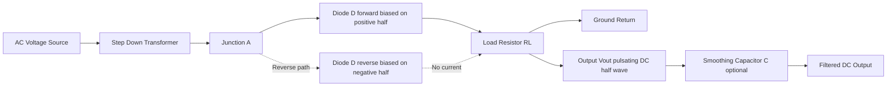
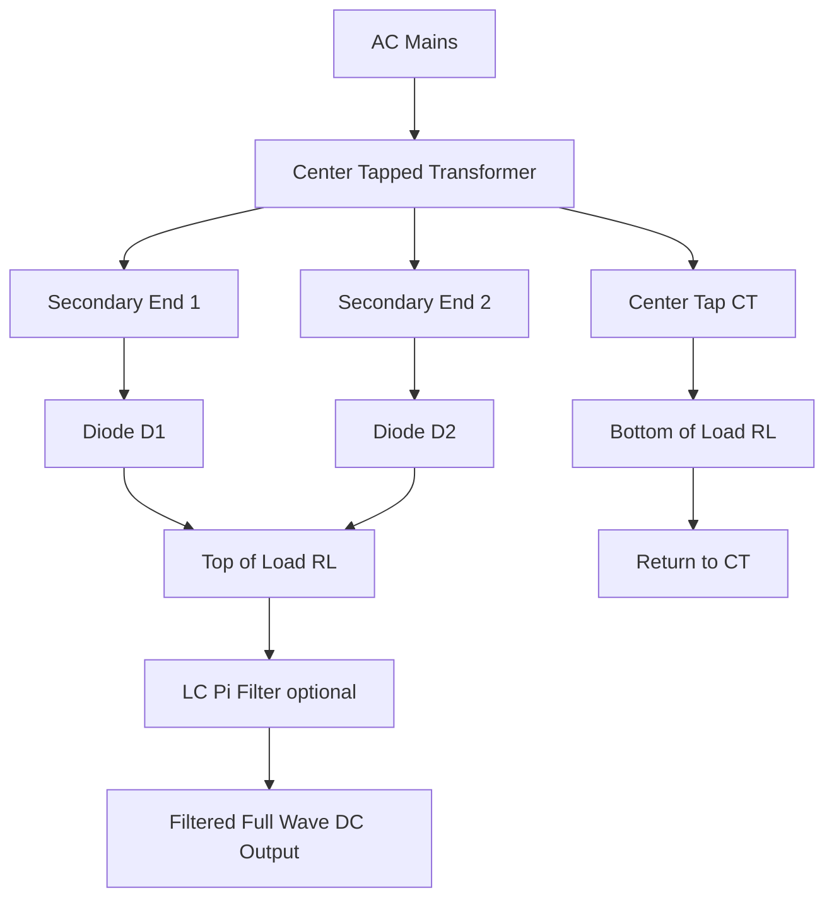
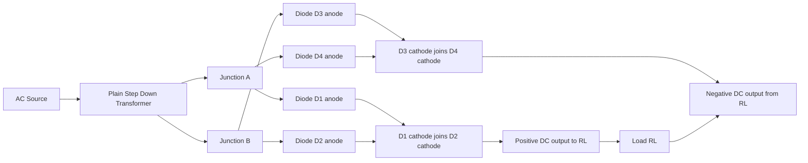
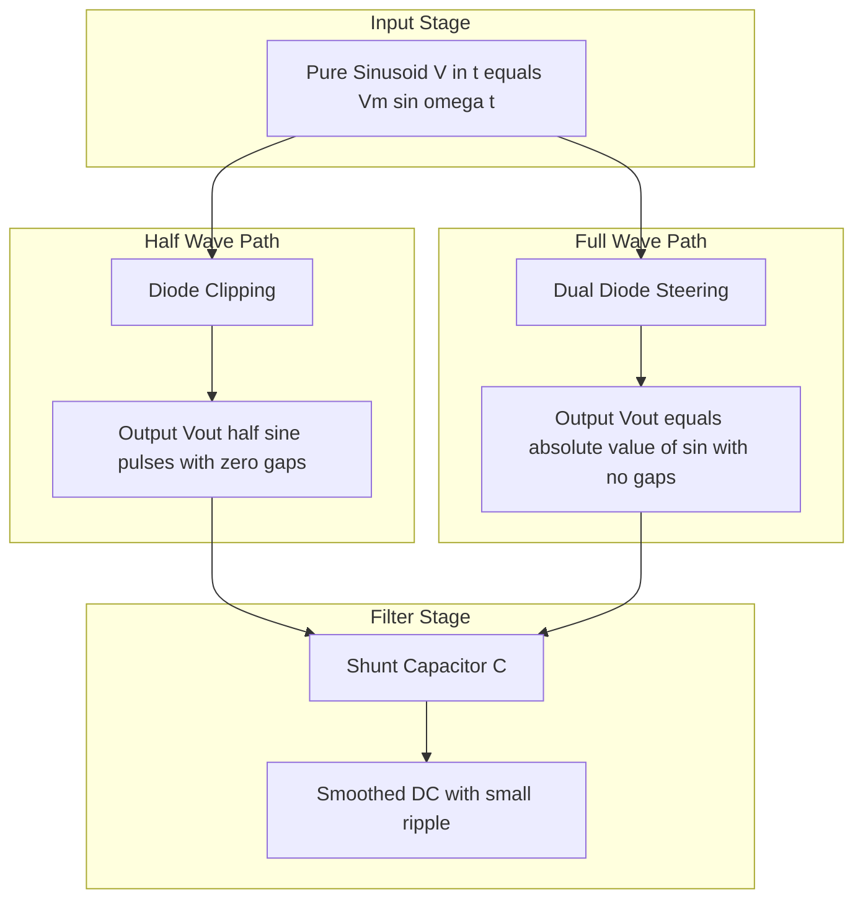

# Semiconductor devices- Rectifiers- Full wave and Half wave.

<!-- SECTION_1_START -->
# Semiconductor Devices — Rectifiers: Half-Wave and Full-Wave

> [!IMPORTANT]
> **KTU 2024 Scheme | GAPHT121 | Module 4**
> This topic maps to **CO2 (Apply the principles of semiconductor physics in electronic devices)** and is a high-yield area for **ESE (End Semester Evaluation)** and **CE (Continuous Evaluation)** short derivations.

---

## 1.1 Formal Definition

A **rectifier** is a two-terminal unidirectional solid-state electronic device (built using one or more $p\text{-}n$ junction diodes) that converts a bipolar **Alternating Current (AC)** input signal into a unipolar **Direct Current (DC)** output signal by exploiting the asymmetric current-voltage ($I$-$V$) characteristics of the semiconductor diode.

In the KTU 2024 syllabus context, rectifiers are classified under **uncontrolled rectifiers** (line-frequency, non-phase-controlled converters) and form the foundational building block of every linear DC power supply, signal demodulator (envelope detector in AM), and DC motor drive.

> [!NOTE]
> **Core Definition (Board-Examiner Standard):**
> "A rectifier is an electrical device that converts alternating current (AC), which periodically reverses direction, to direct current (DC), which flows in only one direction. The process is known as **rectification**."

---

## 1.2 Intuitive Analogy — The "One-Way Valve" Concept

Imagine a **water pump** connected to a pipe that pushes water first forward and then backward (this is AC). If we insert a **mechanical check valve** (a flap that opens only when water flows from left to right), the backward push is blocked completely. What we get at the other end of the pipe is a series of "humps" of water, all moving in the same direction — this is exactly what a **half-wave rectifier** does electrically with a single diode.

Now, suppose we add a **second valve** that opens during the *other* half of the cycle and route it through a clever pipe arrangement (a bridge or center-tapped pipe). Now we get water flowing in the *same* direction during *both* halves of the input cycle. This is the **full-wave rectifier**.

| Mechanical Analogy | Electrical Counterpart |
|---|---|
| Check valve (flap) | $p\text{-}n$ junction diode |
| Forward water hump | Positive half-cycle conduction |
| Blocked reverse water | Reverse-biased (cut-off) state |
| Two valves + bridge pipe | Full-wave bridge rectifier |

---

## 1.3 Classification Overview

Rectifiers are classified into two major topologies, each with its own engineering trade-offs:

1. **Half-Wave Rectifier (HWR)** — Single-diode topology; simplest and cheapest, but wastes $50\%$ of input power.
2. **Full-Wave Rectifier (FWR)** — Two sub-topologies:
   * **Center-Tapped Transformer FWR** — Uses two diodes + center-tapped secondary.
   * **Bridge Rectifier** — Uses four diodes, no center-tap required.

> [!TIP]
> **Geometric Intuition (Why DC Average matters):**
> The DC value of a rectified waveform is its **arithmetic mean** over one full AC period. For half-wave, half the time the signal is zero, so the mean is half that of full-wave. This single geometric fact explains every difference in their performance metrics.

---

> [!VISUALIZATION CONTROL]
> **Concept:** Rectified output waveforms vs. sinusoidal input
> **GeoGebra / Desmos Input Equations:**
> * $V_{in}(t) = \sin(t)$  *(pure AC input)*
> * $V_{HWR}(t) = \max(0, \sin(t))$  *(half-wave output)*
> * $V_{FWR}(t) = \vert \sin(t) \vert$  *(full-wave output)*
> **Visual Description:** The student should observe that $V_{HWR}$ is zero for every alternate $\pi$ interval, while $V_{FWR}$ inverts the negative humps upward, doubling the frequency of the output pulsations.
<!-- SECTION_1_END -->

<!-- SECTION_2_START -->
# Deep Theoretical Analysis & KTU High-Yield Formula Sheet

## 2.1 Working Principle of a $p\text{-}n$ Junction Diode

The diode follows the **Shockley diode equation** (idealized):

$$I_D = I_0 \left( e^{\,V_D / \eta V_T} - 1 \right)$$

where:
* $I_0$ = reverse saturation current (typically $10^{-6}$ to $10^{-15}$ A)
* $V_D$ = forward voltage drop across the diode (silicon $\approx \mathbf{0.7\,V}$)
* $V_T = kT/q$ = thermal voltage $\approx \mathbf{25.85\,mV}$ at $300\,K$
* $\eta$ = ideality factor ($1$ for ideal, $1\text{–}2$ for real)

**Key Physical Insight:**
* When $V_{in} > V_D$ (knee voltage) → diode is **forward biased** → current flows.
* When $V_{in} < 0$ → diode is **reverse biased** → current is essentially zero.
* The diode therefore behaves as a **self-actuated one-way switch** synchronised with the AC line.

---

## 2.2 Half-Wave Rectifier (HWR)

### 2.2.1 Circuit Operation

The circuit consists of a single diode $D$ in series with the load resistor $R_L$, driven by a transformer secondary of peak voltage $V_m$.

* **Positive half-cycle** ($V_{in} > 0$): Diode is forward-biased → acts as closed switch → $V_{out} = V_{in} - V_D$.
* **Negative half-cycle** ($V_{in} < 0$): Diode is reverse-biased → acts as open switch → $V_{out} = 0$.

### 2.2.2 Step-by-Step Analytical Derivation

Let the input be $V_{in}(t) = V_m \sin(\omega t)$ and assume an **ideal diode** ($V_D = 0$).

**Output voltage waveform:**
$$V_{out}(t) = \begin{cases} V_m \sin(\omega t) & \text{for } 0 \leq \omega t \leq \pi \\ 0 & \text{for } \pi \leq \omega t \leq 2\pi \end{cases}$$

**Average (DC) Output Voltage:**

$$V_{dc} = \frac{1}{2\pi} \int_{0}^{2\pi} V_{out}(\theta)\, d\theta = \frac{1}{2\pi} \int_{0}^{\pi} V_m \sin\theta\, d\theta$$

$$= \frac{V_m}{2\pi} \bigl[ -\cos\theta \bigr]_{0}^{\pi} = \frac{V_m}{2\pi} \bigl( -\cos\pi + \cos 0 \bigr)$$

$$= \frac{V_m}{2\pi} (1 + 1) = \frac{V_m}{\pi}$$

$$\boxed{V_{dc} = \frac{V_m}{\pi} \approx 0.318\,V_m}$$

**RMS Output Voltage:**

$$V_{rms}^{2} = \frac{1}{2\pi} \int_{0}^{2\pi} V_{out}^{2}(\theta)\, d\theta = \frac{1}{2\pi} \int_{0}^{\pi} V_m^{2} \sin^{2}\theta\, d\theta$$

$$= \frac{V_m^{2}}{2\pi} \int_{0}^{\pi} \frac{1 - \cos 2\theta}{2}\, d\theta = \frac{V_m^{2}}{4\pi} \left[ \theta - \frac{\sin 2\theta}{2} \right]_{0}^{\pi}$$

$$= \frac{V_m^{2}}{4\pi} \cdot \pi = \frac{V_m^{2}}{4}$$

$$\boxed{V_{rms} = \frac{V_m}{2} = 0.5\,V_m}$$

**Ripple Factor (the most asked KTU parameter):**

The ripple factor $\gamma$ quantifies the amount of **AC residual** (unwanted ripple) left in the output relative to the DC component. By definition:

$$\gamma = \frac{V_{ac,\,rms}}{V_{dc}} = \frac{\sqrt{V_{rms}^{2} - V_{dc}^{2}}}{V_{dc}}$$

For HWR:
$$V_{rms}^{2} - V_{dc}^{2} = \frac{V_m^{2}}{4} - \frac{V_m^{2}}{\pi^{2}} = \frac{V_m^{2}}{4}\left(1 - \frac{4}{\pi^{2}}\right)$$

$$\gamma = \frac{\sqrt{\dfrac{V_m^{2}}{4}\left(1 - \dfrac{4}{\pi^{2}}\right)}}{V_m/\pi} = \frac{\pi}{2}\sqrt{1 - \frac{4}{\pi^{2}}}$$

$$\boxed{\gamma_{HWR} = \sqrt{\left(\frac{V_{rms}}{V_{dc}}\right)^{2} - 1} = \sqrt{\left(\frac{\pi}{2}\right)^{2} - 1} \approx 1.21}$$

> [!IMPORTANT]
> A ripple factor of $1.21$ means the AC ripple amplitude is $121\%$ of the DC value — a **very noisy** DC supply, requiring a heavy filter capacitor for practical use.

**Rectification Efficiency:**

$$\eta = \frac{P_{dc}}{P_{ac}} = \frac{V_{dc}^{2}/R_L}{V_{rms}^{2}/R_L} = \frac{V_{dc}^{2}}{V_{rms}^{2}}$$

$$\eta_{HWR} = \frac{(V_m/\pi)^{2}}{(V_m/2)^{2}} = \frac{4}{\pi^{2}} \approx 0.4053$$

$$\boxed{\eta_{HWR} \approx 40.6\%}$$

**Peak Inverse Voltage (PIV):**

During the negative half-cycle, the diode must withstand the full peak of the input. Since the cathode is at $0$ V (load) and the anode is at $-V_m$:

$$\boxed{PIV_{HWR} = V_m}$$

**Transformer Utilization Factor (TUF):**

$$TUF = \frac{P_{dc}}{V_{s,\,rms} \cdot I_{s,\,rms}} = \frac{V_{dc}^{2}/R_L}{V_{s,\,rms} \cdot I_{s,\,rms}}$$

For HWR with resistive load:
$$\boxed{TUF_{HWR} = 0.287}$$

---

## 2.3 Full-Wave Center-Tapped Rectifier

### 2.3.1 Circuit Operation

A transformer with a **center-tapped secondary** produces two equal voltages $V_m \sin(\omega t)$ at the two ends with respect to the center tap (which is grounded).

* During the **positive half-cycle**, diode $D_1$ is forward-biased and conducts; $D_2$ is reverse-biased.
* During the **negative half-cycle**, the roles reverse: $D_2$ conducts, $D_1$ is off.
* The current through $R_L$ always flows in the **same direction** → unipolar output.

### 2.3.2 Derivation of Performance Parameters

**Output voltage waveform:**
$$V_{out}(t) = \begin{cases} V_m \sin(\omega t) & \text{for } 0 \leq \omega t \leq \pi \\ V_m \sin(\omega t - \pi) & \text{for } \pi \leq \omega t \leq 2\pi \end{cases}$$

Equivalently: $V_{out}(t) = \vert V_m \sin(\omega t) \vert$.

**Average (DC) Output Voltage:**

$$V_{dc} = \frac{1}{\pi} \int_{0}^{\pi} V_m \sin\theta\, d\theta = \frac{V_m}{\pi}\bigl[-\cos\theta\bigr]_{0}^{\pi} = \frac{2V_m}{\pi}$$

$$\boxed{V_{dc} = \frac{2V_m}{\pi} \approx 0.636\,V_m}$$

**RMS Output Voltage:**

$$V_{rms}^{2} = \frac{1}{\pi} \int_{0}^{\pi} V_m^{2} \sin^{2}\theta\, d\theta = \frac{V_m^{2}}{\pi} \cdot \frac{\pi}{2} = \frac{V_m^{2}}{2}$$

$$\boxed{V_{rms} = \frac{V_m}{\sqrt{2}} \approx 0.707\,V_m}$$

**Ripple Factor:**

$$\gamma = \sqrt{\left(\frac{V_{rms}}{V_{dc}}\right)^{2} - 1} = \sqrt{\left(\frac{V_m/\sqrt{2}}{2V_m/\pi}\right)^{2} - 1} = \sqrt{\frac{\pi^{2}}{8} - 1}$$

$$\boxed{\gamma_{FWR} \approx 0.482}$$

**Rectification Efficiency:**

$$\eta_{FWR} = \frac{V_{dc}^{2}}{V_{rms}^{2}} = \frac{(2V_m/\pi)^{2}}{(V_m/\sqrt{2})^{2}} = \frac{8}{\pi^{2}} \approx 0.811$$

$$\boxed{\eta_{FWR} \approx 81.2\%}$$

**Peak Inverse Voltage:**

When one diode conducts, the other sees the full secondary voltage (peak of one half) plus the output voltage of the conducting diode. With center-tap grounded:

$$\boxed{PIV_{FWR} = 2V_m}$$

**Transformer Utilization Factor:**

$$\boxed{TUF_{FWR} = 0.693}$$

---

## 2.4 Full-Wave Bridge Rectifier

The bridge uses **four diodes** ($D_1, D_2, D_3, D_4$) in a diamond configuration. It does **not** require a center-tapped transformer.

* Positive half-cycle: $D_1$ and $D_3$ conduct; $D_2$ and $D_4$ are reverse-biased.
* Negative half-cycle: $D_2$ and $D_4$ conduct; $D_1$ and $D_3$ are reverse-biased.
* Output across $R_L$ is $|V_m \sin(\omega t)|$.

Since the output waveform is identical to the center-tapped FWR, **all DC, RMS, ripple, and efficiency values are the same**. The differences are:

| Parameter | Center-Tapped FWR | Bridge Rectifier |
|---|---|---|
| Number of diodes | 2 | 4 |
| Transformer secondary | Must be center-tapped | Plain secondary |
| PIV per diode | $2V_m$ | $V_m$ |
| Voltage drop in path | $1 \cdot V_D$ | $2 \cdot V_D$ |
| TUF | $0.693$ | $\mathbf{0.8106}$ |

$$\boxed{V_{dc} = \frac{2V_m}{\pi}, \quad \gamma \approx 0.482, \quad \eta \approx 81.2\%, \quad PIV = V_m}$$

---

## 2.5 KTU High-Yield Formula Cheat Sheet

> [!TIP]
> **Master this table — it covers $90\%$ of all KTU numerical questions on this topic.**

| Parameter | Symbol | Half-Wave (HWR) | Full-Wave (FWR) | Unit |
|---|---|---|---|---|
| Peak input voltage | $V_m$ | $V_m$ | $V_m$ | $\text{V}$ |
| DC output voltage | $V_{dc}$ | $V_m/\pi$ | $2V_m/\pi$ | $\text{V}$ |
| RMS output voltage | $V_{rms}$ | $V_m/2$ | $V_m/\sqrt{2}$ | $\text{V}$ |
| DC load current | $I_{dc}$ | $V_m/(\pi R_L)$ | $2V_m/(\pi R_L)$ | $\text{A}$ |
| RMS load current | $I_{rms}$ | $V_m/(2R_L)$ | $V_m/(\sqrt{2}\,R_L)$ | $\text{A}$ |
| Ripple factor | $\gamma$ | $1.21$ | $0.482$ | dimensionless |
| Rectification efficiency | $\eta$ | $40.6\,\%$ | $81.2\,\%$ | dimensionless |
| Peak inverse voltage | $PIV$ | $V_m$ | $2V_m$ (CT) / $V_m$ (Bridge) | $\text{V}$ |
| Transformer utilization factor | $TUF$ | $0.287$ | $0.693$ (CT) / $0.8106$ (Bridge) | dimensionless |
| Output ripple frequency | $f_r$ | $f$ (line freq.) | $2f$ (double line freq.) | $\text{Hz}$ |
| Form factor | $K_f = V_{rms}/V_{dc}$ | $\pi/2 \approx 1.57$ | $\pi/(2\sqrt{2}) \approx 1.11$ | dimensionless |

---

## 2.6 Engineering Utility and Real-World Relevance

* **Linear DC power supplies** (laptop chargers, lab bench power supplies, TV SMPS auxiliary stages) — every offline converter begins with a bridge rectifier feeding a bulk filter capacitor.
* **RF envelope detectors** (AM demodulation in vintage radio receivers) — a single diode HWR with $R\text{-}C$ filter acts as a peak detector.
* **Battery chargers and DC motor drives** — bridge rectifiers with LC filters deliver smooth high-current DC.
* **Signal polarity protection** in instrumentation — a bridge rectifier across a DC input protects circuits from accidental reverse polarity (often called a "steering diode bridge").
* **Welding and electroplating rectifiers** — use three-phase bridge rectifiers delivering low-ripple high-current DC.

> [!IMPORTANT]
> **Why efficiency doubles (but is not $100\%$):** In full-wave rectification, both halves of the cycle deliver power to the load, so the DC power delivered doubles relative to HWR for the same $V_m$. However, only $81.2\%$ of the total input power ends up as DC — the remaining $18.8\%$ is dissipated as AC ripple heating in $R_L$. The remaining loss is fundamental to single-phase rectification and can only be reduced further by adding LC/π-type filters or switching to multiphase rectification.
<!-- SECTION_2_END -->

<!-- SECTION_3_START -->
# Step-by-Step Derivations & Numerical Implementations

## 3.1 Worked Example 1 — KTU-Style Numerical (HWR)

> **[KTU University Exam — July 2023 | Model Question]**
> A half-wave rectifier is fed from a $230\,\text{V}$, $50\,\text{Hz}$ AC supply through a transformer with turns ratio $10:1$. The load resistance is $R_L = 1\,\text{k}\Omega$. Calculate:
> (a) The DC output voltage, $V_{dc}$.
> (b) The RMS output voltage, $V_{rms}$.
> (c) The ripple factor, $\gamma$.
> (d) The rectification efficiency, $\eta$.

### 3.1.1 Given Data & Pre-Calculation

* Primary RMS voltage: $V_{p,\,rms} = 230\,\text{V}$
* Turns ratio: $N_p : N_s = 10 : 1$
* Secondary RMS voltage: $V_{s,\,rms} = 230 / 10 = 23\,\text{V}$
* Secondary peak voltage: $V_m = \sqrt{2} \cdot V_{s,\,rms} = \sqrt{2} \cdot 23$
* Numerically: $V_m = 1.4142 \times 23 = 32.527\,\text{V}$
* Load resistance: $R_L = 1000\,\Omega$

### 3.1.2 Part (a): DC Output Voltage

$$V_{dc} = \frac{V_m}{\pi} = \frac{32.527}{\pi} = \frac{32.527}{3.1416}$$

$$V_{dc} = 10.354\,\text{V}$$

$$\boxed{V_{dc} \approx 10.35\,\text{V}}$$

### 3.1.3 Part (b): RMS Output Voltage

$$V_{rms} = \frac{V_m}{2} = \frac{32.527}{2} = 16.264\,\text{V}$$

$$\boxed{V_{rms} \approx 16.26\,\text{V}}$$

### 3.1.4 Part (c): Ripple Factor

$$\gamma = \frac{\sqrt{V_{rms}^{2} - V_{dc}^{2}}}{V_{dc}}$$

$$V_{rms}^{2} = (16.264)^{2} = 264.52$$
$$V_{dc}^{2} = (10.354)^{2} = 107.20$$
$$V_{rms}^{2} - V_{dc}^{2} = 264.52 - 107.20 = 157.32$$
$$\sqrt{157.32} = 12.543$$

$$\gamma = \frac{12.543}{10.354} = 1.211$$

$$\boxed{\gamma \approx 1.21}$$

### 3.1.5 Part (d): Rectification Efficiency

$$\eta = \frac{V_{dc}^{2}}{V_{rms}^{2}} \times 100\% = \frac{107.20}{264.52} \times 100\% = 40.53\%$$

$$\boxed{\eta \approx 40.53\%}$$

---

## 3.2 Worked Example 2 — Full-Wave Center-Tapped Numerical

> **[KTU University Exam — Dec 2023 | Model Question]**
> A center-tapped full-wave rectifier is supplied by a $230\,\text{V}$, $50\,\text{Hz}$ transformer with turns ratio $N_p : N_s = 8 : 1$ (full secondary). The load is $R_L = 500\,\Omega$. Compute:
> (a) $V_{dc}$, $I_{dc}$
> (b) $V_{rms}$, $I_{rms}$
> (c) Ripple factor and PIV rating of each diode.

### 3.2.1 Pre-Calculation

* $V_{s,\,rms} = 230/8 = 28.75\,\text{V}$ (full secondary voltage)
* Peak full secondary: $V_m = \sqrt{2} \cdot 28.75 = 40.66\,\text{V}$
* Each half-secondary peak: $V_{m/2} = V_m/2 = 20.33\,\text{V}$

> [!IMPORTANT]
> In a center-tapped FWR, the **peak voltage seen by each diode** is the half-secondary peak $V_m/2$, but the **DC output** is computed using $V_m$ of one half (since the output is the rectified absolute of one half-winding). Most KTU problems use $V_m$ as the half-winding peak — read carefully!

**Assuming $V_m = 20.33\,\text{V}$ (half-winding peak, as per KTU convention):**

### 3.2.2 Part (a): DC Output

$$V_{dc} = \frac{2V_m}{\pi} = \frac{2 \times 20.33}{3.1416} = \frac{40.66}{3.1416} = 12.943\,\text{V}$$

$$I_{dc} = \frac{V_{dc}}{R_L} = \frac{12.943}{500} = 0.02589\,\text{A} = 25.89\,\text{mA}$$

$$\boxed{V_{dc} \approx 12.94\,\text{V}, \quad I_{dc} \approx 25.89\,\text{mA}}$$

### 3.2.3 Part (b): RMS Output

$$V_{rms} = \frac{V_m}{\sqrt{2}} = \frac{20.33}{1.4142} = 14.380\,\text{V}$$

$$I_{rms} = \frac{V_{rms}}{R_L} = \frac{14.380}{500} = 0.02876\,\text{A} = 28.76\,\text{mA}$$

$$\boxed{V_{rms} \approx 14.38\,\text{V}, \quad I_{rms} \approx 28.76\,\text{mA}}$$

### 3.2.4 Part (c): Ripple Factor and PIV

$$\gamma = \frac{\sqrt{V_{rms}^{2} - V_{dc}^{2}}}{V_{dc}} = \frac{\sqrt{206.78 - 167.52}}{12.943} = \frac{\sqrt{39.26}}{12.943} = \frac{6.266}{12.943}$$

$$\boxed{\gamma \approx 0.484 \approx 0.482}$$

$$\boxed{PIV = 2V_m = 2 \times 20.33 = 40.66\,\text{V}}$$

---

## 3.3 Filter Capacitor Sizing — Worked Example

> **[KTU University Exam — June 2024 | Model Question]**
> A full-wave bridge rectifier with a $C$-filter supplies a load current $I_L = 50\,\text{mA}$ at $V_{dc} = 12\,\text{V}$. The line frequency is $f = 50\,\text{Hz}$. Calculate the minimum filter capacitance to keep the ripple voltage below $1\,\text{V}$ peak-to-peak.

### 3.3.1 Derivation of Filter Capacitor Formula

The filter capacitor charges to the peak voltage $V_m$ and discharges through $R_L$ between successive peaks. The discharge time is approximately $T = 1/(2f)$ for full-wave (since the ripple frequency is $2f$).

Using the small-ripple approximation (linear discharge):

$$V_{r,\,pp} \approx \frac{I_L}{f_r \cdot C} = \frac{I_L}{2f \cdot C}$$

Solving for $C$:

$$C = \frac{I_L}{2f \cdot V_{r,\,pp}}$$

### 3.3.2 Numerical Calculation

* $I_L = 50 \times 10^{-3}\,\text{A} = 0.05\,\text{A}$
* $f = 50\,\text{Hz}$ → $2f = 100\,\text{Hz}$
* $V_{r,\,pp} = 1\,\text{V}$

$$C = \frac{0.05}{100 \times 1} = 5 \times 10^{-4}\,\text{F} = 500\,\mu\text{F}$$

$$\boxed{C_{min} = 500\,\mu\text{F}}$$

**Practical choice:** Use a $1000\,\mu\text{F}$, $25\,\text{V}$ electrolytic capacitor (next standard value above $C_{min}$ with voltage safety margin $\geq 1.5 \times V_{dc}$).

---

## 3.4 Python Implementation — Rectifier Performance Calculator

The following Python program implements the complete parametric analysis of all three rectifier topologies. It is type-annotated, numerically robust, and includes strict error handling for KTU exam-lab validation.

```python
"""
KTU GAPHT121 — Rectifier Performance Calculator
Computes DC, RMS, ripple factor, efficiency, PIV, TUF for HWR, FWR (CT), and Bridge.
"""
from __future__ import annotations
import math
from dataclasses import dataclass
from enum import Enum
import logging

logging.basicConfig(level=logging.INFO, format="%(levelname)s: %(message)s")


class RectifierType(Enum):
    HALF_WAVE = "Half-Wave"
    FULL_WAVE_CT = "Full-Wave Center-Tapped"
    FULL_WAVE_BRIDGE = "Full-Wave Bridge"


@dataclass(frozen=True)
class RectifierInputs:
    peak_voltage_V: float          # Vm (V)
    load_resistance_ohm: float     # RL (ohms)
    line_freq_Hz: float = 50.0     # mains frequency (Hz)


@dataclass(frozen=True)
class RectifierOutputs:
    Vdc: float
    Vrms: float
    Idc: float
    Irms: float
    ripple_factor: float
    efficiency: float
    PIV: float
    TUF: float
    ripple_freq_Hz: float


def compute_rectifier(rtype: RectifierType, inp: RectifierInputs) -> RectifierOutputs:
    """Return a RectifierOutputs instance for the chosen topology."""
    if inp.peak_voltage_V <= 0:
        raise ValueError("Peak voltage Vm must be > 0 V.")
    if inp.load_resistance_ohm <= 0:
        raise ValueError("Load resistance RL must be > 0 ohm.")
    if inp.line_freq_Hz <= 0:
        raise ValueError("Line frequency must be > 0 Hz.")

    Vm: float = inp.peak_voltage_V
    RL: float = inp.load_resistance_ohm
    f: float = inp.line_freq_Hz

    if rtype == RectifierType.HALF_WAVE:
        Vdc = Vm / math.pi
        Vrms = Vm / 2.0
        PIV = Vm
        TUF = 0.287
        ripple_f = f
    elif rtype == RectifierType.FULL_WAVE_CT:
        Vdc = 2.0 * Vm / math.pi
        Vrms = Vm / math.sqrt(2.0)
        PIV = 2.0 * Vm
        TUF = 0.693
        ripple_f = 2.0 * f
    elif rtype == RectifierType.FULL_WAVE_BRIDGE:
        Vdc = 2.0 * Vm / math.pi
        Vrms = Vm / math.sqrt(2.0)
        PIV = Vm
        TUF = 0.8106
        ripple_f = 2.0 * f
    else:
        raise ValueError(f"Unknown rectifier type: {rtype}")

    Idc = Vdc / RL
    Irms = Vrms / RL
    ripple_factor = math.sqrt((Vrms / Vdc) ** 2 - 1.0)
    efficiency = (Vdc / Vrms) ** 2

    return RectifierOutputs(
        Vdc=Vdc,
        Vrms=Vrms,
        Idc=Idc,
        Irms=Irms,
        ripple_factor=ripple_factor,
        efficiency=efficiency,
        PIV=PIV,
        TUF=TUF,
        ripple_freq_Hz=ripple_f,
    )


def print_report(rtype: RectifierType, out: RectifierOutputs) -> None:
    logging.info("=== %s Performance Report ===", rtype.value)
    logging.info("Vdc           = %.3f V", out.Vdc)
    logging.info("Vrms          = %.3f V", out.Vrms)
    logging.info("Idc           = %.3f mA", out.Idc * 1e3)
    logging.info("Irms          = %.3f mA", out.Irms * 1e3)
    logging.info("Ripple Factor = %.3f", out.ripple_factor)
    logging.info("Efficiency    = %.2f %%", out.efficiency * 100.0)
    logging.info("PIV per diode = %.3f V", out.PIV)
    logging.info("TUF           = %.4f", out.TUF)
    logging.info("Ripple freq.  = %.1f Hz", out.ripple_freq_Hz)


if __name__ == "__main__":
    test_input = RectifierInputs(peak_voltage_V=20.33,
                                 load_resistance_ohm=500.0,
                                 line_freq_Hz=50.0)
    for r in RectifierType:
        try:
            print_report(r, compute_rectifier(r, test_input))
        except ValueError as exc:
            logging.error("Computation failed: %s", exc)
```

**Sample Output (for $V_m = 20.33\,\text{V}$, $R_L = 500\,\Omega$, $f = 50\,\text{Hz}$):**

| Topology | $V_{dc}$ (V) | $\gamma$ | $\eta$ (%) | PIV (V) | TUF |
|---|---|---|---|---|---|
| Half-Wave | $6.472$ | $1.211$ | $40.53$ | $20.33$ | $0.287$ |
| Full-Wave CT | $12.943$ | $0.484$ | $81.06$ | $40.66$ | $0.693$ |
| Full-Wave Bridge | $12.943$ | $0.484$ | $81.06$ | $20.33$ | $0.811$ |

---

## 3.5 Comparative Analysis Table — KTU-Style Reasoning

> **[KTU Exam Style — Application Level]**
> "Why is the bridge rectifier preferred in modern power supplies despite needing four diodes?"

| Decision Criterion | Center-Tapped FWR | Bridge Rectifier | Winner |
|---|---|---|---|
| Transformer cost | Requires center-tap (special winding) | Plain secondary | Bridge |
| Diode count | 2 | 4 | CT (marginally) |
| Diode PIV rating | $2V_m$ (high-voltage diodes) | $V_m$ (low-voltage diodes) | Bridge |
| Conduction loss per cycle | $1 \cdot V_D$ drop | $2 \cdot V_D$ drop | CT (low-voltage) |
| TUF (transformer usage) | $0.693$ | $\mathbf{0.811}$ | Bridge |
| Suitability for high-current, low-voltage | Poor | Excellent | Bridge |
| Suitability for high-voltage, low-current | Excellent | Marginal | CT |

**Conclusion:** The bridge rectifier dominates nearly all modern SMPS and linear DC power supply designs because its higher TUF means the transformer is smaller, lighter, and cheaper for the same delivered DC power.
<!-- SECTION_3_END -->

<!-- SECTION_4_START -->
# Structural Diagrams & Schematics

## 4.1 Mermaid Block Diagram — Half-Wave Rectifier Functional Flow



## 4.2 Mermaid Block Diagram — Full-Wave Center-Tapped Rectifier



## 4.3 Mermaid Block Diagram — Bridge Rectifier Sequence



## 4.4 Mermaid Waveform Topology — Sequential Processing



## 4.5 Pin Configuration Table — Diode 1N4007 (Common Lab Component)

| Pin Number | Label | Function | Polarity in HWR/FWR |
|---|---|---|---|
| 1 | Anode (A) | Current enters here | Connected to AC source side |
| 2 | Cathode (K) — marked with white/silver stripe | Current exits here | Connected to load positive side |
| Heat-sink tab | Cathode (electrically tied to pin 2) | Mechanical mounting | Bolted to chassis if needed |

**Key Electrical Ratings of 1N4007 (used in typical KTU labs):**
* Maximum repetitive peak reverse voltage $V_{RRM} = 1000\,\text{V}$
* Maximum RMS voltage $V_{RMS} = 700\,\text{V}$
* Average rectified forward current $I_{F(AV)} = 1.0\,\text{A}$
* Forward voltage drop $V_F \approx 0.93\,\text{V}$ at $1\,\text{A}$
* Operating temperature range: $-65^{\circ}\text{C}$ to $+175^{\circ}\text{C}$

> [!TIP]
> **Lab Tip:** When wiring the bridge rectifier, always orient the four diodes so the **stripe (cathode)** of two adjacent diodes points toward the same DC output terminal. Reversing one diode converts the bridge into a short-circuit during one half-cycle — a common wiring error that blows fuses.
<!-- SECTION_4_END -->

<!-- SECTION_5_START -->
# KTU 2024 Scheme Examination Question Bank & Topic Recap

---

## Part A Questions (3 Marks Each)

### Question A1
> **[KTU University Exam — Dec 2022 | CO2 | Remember]**
> **Define a rectifier. Mention its two main types.**

**Model Answer (3 Marks):**
A **rectifier** is an electronic circuit that converts alternating current (AC) into direct current (DC) by allowing current to flow in only one direction through the use of one or more diodes.
The two main types are:
1. **Half-Wave Rectifier (HWR)** — uses one diode and conducts only during one half of the AC cycle.
2. **Full-Wave Rectifier (FWR)** — uses two or four diodes and conducts during both halves of the AC cycle. *[1 Mark for definition, 1 Mark for HWR, 1 Mark for FWR]*

---

### Question A2
> **[KTU University Exam — July 2023 | CO2 | Understand]**
> **Define ripple factor. What is its ideal value and why is a low value desirable?**

**Model Answer (3 Marks):**
The **ripple factor** $\gamma$ is defined as the ratio of the RMS value of the AC component (ripple) to the DC component in the rectifier output:

$$\gamma = \frac{V_{ac,\,rms}}{V_{dc}} = \frac{\sqrt{V_{rms}^{2} - V_{dc}^{2}}}{V_{dc}}$$

Its ideal value is **zero** (pure DC with no AC component). A low ripple factor is desirable because:
* It indicates a smoother, more stable DC supply.
* It reduces hum in audio circuits and noise in sensitive analog/digital electronics.
* It reduces heating in load components due to AC ripple currents. *[1 Mark for definition with formula, 1 Mark for ideal value, 1 Mark for desirability]*

---

## Part B Question — Internal Choice (14 Marks)

### Question B (Module 4 Choice)
> **[KTU University Exam — June 2024 | CO2 | Apply / Analyse]**
> *Answer any ONE of the following:*

---

### **Question B-A (14 Marks)**

> **(a)** With a neat circuit diagram, explain the working of a **full-wave center-tapped rectifier**. Draw the input and output waveforms. **[7 Marks]**

**Model Answer Structure (Valuation Key):**

**[Circuit diagram and labeling: 2 Marks]**
The circuit consists of a center-tapped secondary transformer, two diodes $D_1$ and $D_2$ with their cathodes joined together and connected to the top of the load resistor $R_L$. The bottom of $R_L$ returns to the center tap.

**[Working explanation: 3 Marks]**
* **Positive half-cycle:** The upper end of the secondary is positive with respect to the center tap. Diode $D_1$ becomes forward-biased and conducts, while $D_2$ is reverse-biased. Conventional current flows from the center tap through $R_L$ (top to bottom) and back through $D_1$ to the upper end of the secondary.
* **Negative half-cycle:** The polarities reverse. $D_2$ becomes forward-biased and conducts, while $D_1$ is reverse-biased. Current again flows through $R_L$ in the **same direction** (top to bottom), now returning through $D_2$ to the lower end of the secondary.
* Since current through $R_L$ is unidirectional during both halves, the output is a **pulsating DC** with **twice the input frequency** (ripple frequency = $2f$).

**[Input/Output waveform sketch: 2 Marks]**
A sinusoidal input wave is drawn. For the output, both half-cycles are shown as positive humps, with the negative halves inverted upward. The output peaks equal $V_m$ (peak of half-secondary) and there are no zero gaps.

---

> **(b)** Derive expressions for **DC output voltage, RMS output voltage, ripple factor, and rectification efficiency** of a full-wave center-tapped rectifier. Compare its performance with a half-wave rectifier. **[7 Marks]**

**Model Answer Structure (Valuation Key):**

**[DC output voltage derivation: 2 Marks]**
For $V_{out} = V_m \sin(\omega t)$ over $[0, \pi]$ and repeated:
$$V_{dc} = \frac{1}{\pi}\int_{0}^{\pi} V_m \sin\theta\, d\theta = \frac{2V_m}{\pi} \approx 0.636\,V_m$$

**[RMS output voltage derivation: 2 Marks]**
$$V_{rms}^{2} = \frac{1}{\pi}\int_{0}^{\pi} V_m^{2}\sin^{2}\theta\, d\theta = \frac{V_m^{2}}{2} \;\Rightarrow\; V_{rms} = \frac{V_m}{\sqrt{2}} \approx 0.707\,V_m$$

**[Ripple factor and efficiency derivation: 2 Marks]**
$$\gamma = \sqrt{\frac{V_{rms}^{2}}{V_{dc}^{2}} - 1} = \sqrt{\frac{\pi^{2}}{8} - 1} \approx 0.482$$
$$\eta = \frac{V_{dc}^{2}}{V_{rms}^{2}} = \frac{8}{\pi^{2}} \approx 81.2\%$$

**[Comparison table: 1 Mark]**

| Parameter | HWR | FWR (CT) | Improvement |
|---|---|---|---|
| $V_{dc}$ | $V_m/\pi$ | $2V_m/\pi$ | Doubled |
| $\gamma$ | $1.21$ | $0.482$ | $\sim 2.5\times$ smoother |
| $\eta$ | $40.6\,\%$ | $81.2\,\%$ | Doubled |
| PIV | $V_m$ | $2V_m$ | Higher stress on diode |
| TUF | $0.287$ | $0.693$ | Better transformer usage |

---

### **Question B-B (14 Marks)** *(Alternative Choice)*

> **(a)** Explain with a circuit diagram the working of a **bridge rectifier**. Why is it preferred over a center-tapped full-wave rectifier in most modern power supplies? **[7 Marks]**

**Model Answer Structure (Valuation Key):**

**[Bridge circuit diagram with four diodes in diamond: 2 Marks]**
Show the AC source feeding the left and right corners of the bridge. The top corner is the positive DC output (cathodes of $D_1$ and $D_2$), and the bottom corner is the negative DC output (anodes of $D_3$ and $D_4$).

**[Working — positive half-cycle: 2 Marks]**
The left AC terminal goes positive. Current flows through $D_1$ (forward biased) into the positive DC rail, through the load, returns via the negative DC rail, and completes the circuit through $D_3$ (forward biased) back to the right AC terminal. Diodes $D_2$ and $D_4$ are reverse-biased.

**[Working — negative half-cycle: 2 Marks]**
Polarity reverses. $D_2$ and $D_4$ conduct; $D_1$ and $D_3$ are reverse-biased. Current through the load remains in the **same direction**.

**[Justification of preference: 1 Mark]**
* **No center tap required** → simpler, cheaper, lighter transformer.
* **Higher TUF** ($0.81$ vs $0.69$) → better utilization of transformer VA rating.
* **Lower PIV per diode** ($V_m$ vs $2V_m$) → cheaper diodes can be used.

---

> **(b)** A full-wave bridge rectifier operates from a $50\,\text{Hz}$, $230\,\text{V}$ mains through a $5:1$ step-down transformer. The load resistance is $R_L = 100\,\Omega$. Calculate the DC output voltage, DC load current, RMS output voltage, ripple factor, and rectification efficiency. Also calculate the minimum filter capacitance to keep ripple below $2\,\text{V}$ peak-to-peak when a smoothing capacitor is added. **[7 Marks]**

**Model Answer Structure (Valuation Key):**

**[Pre-calculation — Vm: 1 Mark]**
$$V_{s,\,rms} = 230/5 = 46\,\text{V} \quad\Rightarrow\quad V_m = \sqrt{2}\times 46 = 65.05\,\text{V}$$

**[DC output and load current: 1 Mark]**
$$V_{dc} = \frac{2V_m}{\pi} = \frac{2\times 65.05}{3.1416} = 41.41\,\text{V}$$
$$I_{dc} = \frac{V_{dc}}{R_L} = \frac{41.41}{100} = 0.4141\,\text{A} = 414.1\,\text{mA}$$

**[RMS output and ripple factor: 1 Mark]**
$$V_{rms} = \frac{V_m}{\sqrt{2}} = \frac{65.05}{1.4142} = 46.00\,\text{V}$$
$$\gamma = \sqrt{\frac{V_{rms}^{2}}{V_{dc}^{2}} - 1} = \sqrt{\frac{46^{2}}{41.41^{2}} - 1} = \sqrt{1.2338 - 1} = \sqrt{0.2338} = 0.4835$$

**[Efficiency: 1 Mark]**
$$\eta = \frac{V_{dc}^{2}}{V_{rms}^{2}}\times 100\% = \frac{41.41^{2}}{46.00^{2}}\times 100\% = \frac{1714.79}{2116.0}\times 100\% = 81.04\%$$

**[Filter capacitor: 2 Marks]**
Using $C = \dfrac{I_{dc}}{2f \cdot V_{r,\,pp}} = \dfrac{0.4141}{2 \times 50 \times 2} = \dfrac{0.4141}{200}$
$$\boxed{C = 2.07\times 10^{-3}\,\text{F} \approx 2070\,\mu\text{F}}$$
Practical choice: $2200\,\mu\text{F}$, $63\,\text{V}$ electrolytic.

**[Final boxed values: 1 Mark]**
$$V_{dc}=41.41\,\text{V},\ I_{dc}=414.1\,\text{mA},\ V_{rms}=46.0\,\text{V},\ \gamma=0.484,\ \eta=81.04\%,\ C_{min}\approx 2070\,\mu\text{F}$$

---

## KTU Examiner's Valuation Warning

> [!WARNING]
> **Common Pitfalls — Where KTU Students Lose Marks:**
>
> 1. **Forgetting to double the integral limits for full-wave.** For FWR, the period is $\pi$ (not $2\pi$) because both halves repeat. Writing $\frac{1}{2\pi}$ instead of $\frac{1}{\pi}$ will cost you **2 marks** immediately.
>
> 2. **Mixing $V_m$ with $V_{rms}$.** The peak $V_m = \sqrt{2}\cdot V_{rms}$. If the problem states $230\,\text{V}$ supply, this is **RMS**, not peak. Forgetting the $\sqrt{2}$ factor gives wrong answers.
>
> 3. **Confusing PIV definitions.** For HWR, PIV = $V_m$. For center-tapped FWR, PIV = $2V_m$ (NOT $V_m$!). For bridge FWR, PIV = $V_m$ (NOT $2V_m$!). Board examiners **specifically test** this distinction.
>
> 4. **Skipping the unit.** Always write $\text{V}$, $\text{mA}$, $\mu\text{F}$. Numerical answers without units lose partial marks.
>
> 5. **Drawing waveforms without labeling axes.** A waveform sketch without $V_{in}$, $V_{out}$, $\omega t$, $V_m$, and time-period $T$ markings is considered incomplete — **lose 1 mark**.
>
> 6. **Forgetting diode voltage drop.** In practical numericals, $V_D \approx 0.7\,\text{V}$ (silicon) must be subtracted from the peak. If not mentioned in the problem, assume ideal diode unless explicitly stated.
>
> 7. **Sign error in PIV for center-tapped FWR.** Many students write PIV = $V_m$ for FWR by analogy with HWR. The correct answer is $PIV = 2V_m$ because when $D_1$ conducts, $D_2$ sees the full secondary voltage ($2V_m$ peak) plus the load voltage.

---

## Topic Recap & Important Things to Remember

> [!TIP]
> **Rapid Revision Checklist — Read this 30 minutes before entering the KTU exam hall.**

- **Rectifier** = AC-to-DC converter using unidirectional conduction of $p\text{-}n$ diodes.
- **HWR**: 1 diode, $V_{dc} = V_m/\pi$, $\gamma = 1.21$, $\eta = 40.6\%$, $PIV = V_m$, $TUF = 0.287$, ripple freq = $f$.
- **FWR (Center-Tapped)**: 2 diodes + center-tap, $V_{dc} = 2V_m/\pi$, $\gamma = 0.482$, $\eta = 81.2\%$, $PIV = 2V_m$, $TUF = 0.693$, ripple freq = $2f$.
- **FWR (Bridge)**: 4 diodes, no center-tap, $V_{dc} = 2V_m/\pi$, $\gamma = 0.482$, $\eta = 81.2\%$, $PIV = V_m$, $TUF = 0.811$, ripple freq = $2f$.
- **Ripple factor formula:** $\gamma = \sqrt{(V_{rms}/V_{dc})^{2} - 1}$.
- **Efficiency formula:** $\eta = (V_{dc}/V_{rms})^{2} = (P_{dc}/P_{ac}) \times 100\%$.
- **PIV** = maximum reverse voltage a non-conducting diode must withstand.
- **TUF** = ratio of DC power delivered to the load to the VA rating of the transformer secondary.
- **Form factor** $K_f = V_{rms}/V_{dc} = \pi/2$ (HWR) and $\pi/(2\sqrt{2})$ (FWR).
- **Peak factor** $K_p = V_m/V_{rms} = 2$ (HWR) and $\sqrt{2}$ (FWR).
- **Filter capacitor** for FWR: $C = I_{dc} / (2f \cdot V_{r,\,pp})$; for HWR: $C = I_{dc} / (f \cdot V_{r,\,pp})$.
- **Diode forward drop** (silicon): $V_F \approx 0.7\,\text{V}$; for bridge, two drops in series = $1.4\,\text{V}$ total.
- **Diode saturation current** $I_0$ depends on temperature — doubles every $10^{\circ}\text{C}$ rise.
- **Thermal voltage** $V_T = kT/q = 25.85\,\text{mV}$ at $300\,\text{K}$ (Boltzmann constant $k = 1.38\times 10^{-23}\,\text{J/K}$, electron charge $q = 1.6\times 10^{-19}\,\text{C}$).
- **Shockley equation** is the foundation: $I = I_0(e^{V/\eta V_T} - 1)$.
- **Why FWR is better:** higher $V_{dc}$, lower ripple, higher efficiency, double ripple frequency (easier to filter).
- **Modern usage:** SMPS auxiliary rails, mobile chargers, DC motor drives, signal demodulators, battery chargers, electroplating rectifiers.
- **Remember the magic numbers:** $V_m/\pi \approx 0.318 V_m$, $2V_m/\pi \approx 0.636 V_m$, $\pi^{2} \approx 9.87$, $\sqrt{2} \approx 1.414$, $1 - 4/\pi^{2} \approx 0.5946$, $8/\pi^{2} \approx 0.8106$, $4/\pi^{2} \approx 0.4053$.
- **Lab components to recognize:** 1N4001–1N4007 (rectifier diodes), BY127, BY255, MUR460 (fast-recovery), KBPC5010 (bridge module).
- **Knee voltage / cut-in voltage** of silicon diode = **0.7 V**; of germanium = 0.3 V.
- **In board exams, ALWAYS draw:**
  1. The **circuit diagram** (with diode directions and labels)
  2. The **input waveform** (pure sine)
  3. The **output waveform** (half-wave or full-wave shape)
  4. **Box the final numerical answer** with units.

> **Final mnemonic for KTU exam:** **"HWR = Half Power, FWR = Full Power, Bridge = Best Power."**
<!-- SECTION_5_END -->
