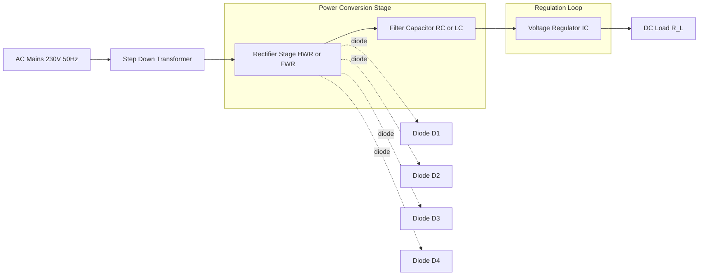
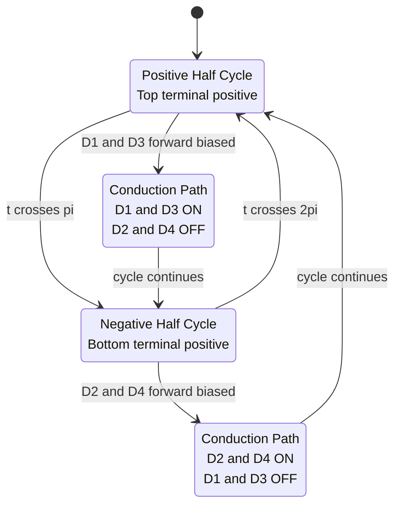
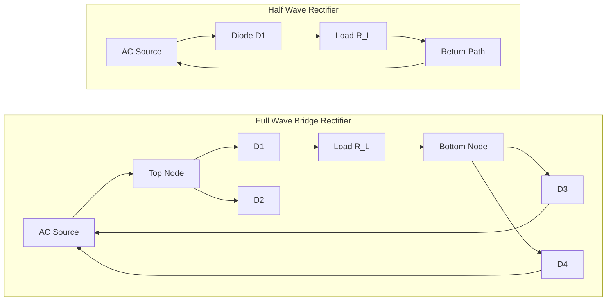
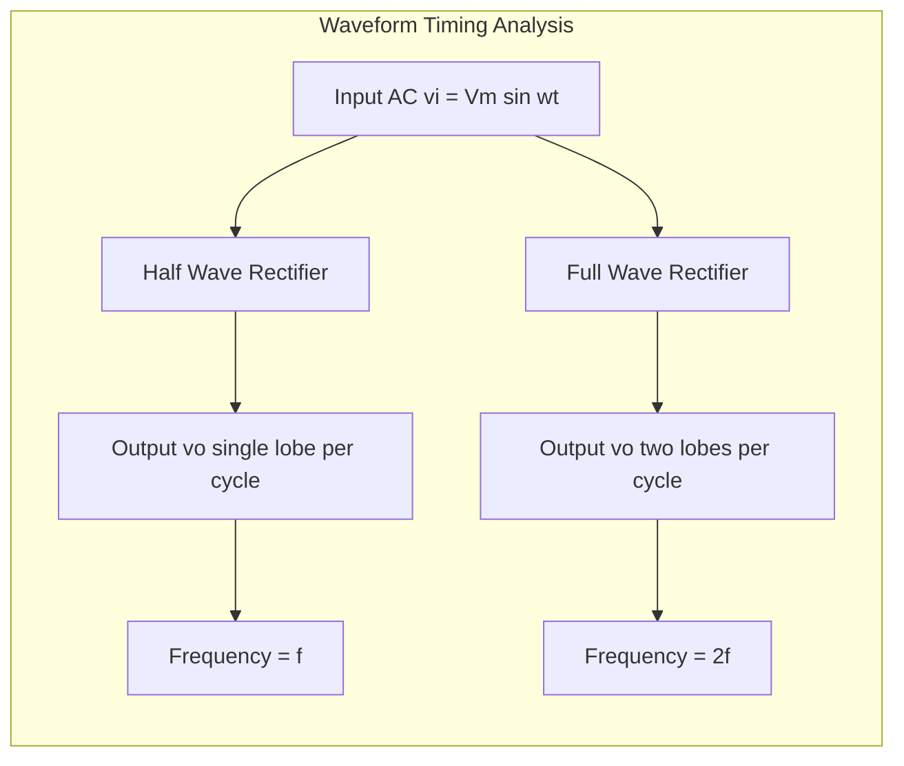

# Semiconductor devices- Rectifiers- Full wave and Half wave.

<!-- SECTION_1_START -->
# Semiconductor Rectifiers — Half-Wave and Full-Wave

> [!IMPORTANT]
> **KTU 2024 Scheme | GAPHT121 | Module 4 — Semiconductor Devices**
> This module is foundational for courses like Analog Electronics, Power Electronics, and Signal Processing. Mastery of rectifier theory directly maps to **CO1** (Apply semiconductor physics to electronic devices) and **CO2** (Analyze device characteristics).

---

## 1.1 Formal Definition (KTU 2024 Syllabus Terminology)

A **rectifier** is a two-terminal nonlinear solid-state electronic device (or circuit) constructed using semiconductor diodes (typically Si or Ge p-n junction diodes) that converts a **bidirectional alternating current (AC)** input signal into a **unidirectional pulsating direct current (DC)** output signal. The conversion process exploits the **unidirectional conduction property** of the p-n junction diode, which arises from the **depletion region** and **potential barrier** formed at the metallurgical junction.

Based on the fraction of the AC cycle utilized, rectifiers are classified as:

- **Half-Wave Rectifier (HWR):** Conducts during only **one half** of the AC input cycle (typically the positive half-cycle), blocking the other half.
- **Full-Wave Rectifier (FWR):** Conducts during **both halves** of the AC input cycle, redirecting current to flow in a single direction through the load.

---

## 1.2 Conceptual Analogy — The One-Way Water Valve 🚰

> [!NOTE]
> **Intuition Pump: Real-World Analogy**

Imagine a **water pipe** carrying an oscillating water current (water surging forward, then backward, then forward...). A **p-n junction diode** behaves like a **check valve (non-return valve)** in that pipe:

| Component | Mechanical Analog | Electrical Behavior |
|---|---|---|
| **AC Source** | Reciprocating piston pump | Pushes electrons forward & backward |
| **Diode (Forward Bias)** | Open check valve | Allows current to flow in one direction |
| **Diode (Reverse Bias)** | Closed check valve | Blocks current completely |
| **Half-Wave Rectifier** | Single check valve | Water flows only half the time |
| **Full-Wave Rectifier** | H-bridge of 4 check valves | Water flows always, redirected through load |
| **Load Resistor $R_L$** | Output bucket | Collects the rectified flow |
| **Filter Capacitor** | Storage tank | Smooths out the pulses |

The pulsating DC output is still **not pure DC** — it is a *pulsating* signal containing a DC average plus unwanted AC components called **ripples**.

---

## 1.3 Key Physical Constants & Standard Metrics

The following are standard parameters for ideal silicon (Si) and germanium (Ge) diodes used in KTU textbook problems:

- **Silicon (Si) cut-in voltage (knee voltage): $V_k \approx 0.7 \text{ V}$**
- **Germanium (Ge) cut-in voltage: $V_k \approx 0.3 \text{ V}$**
- **Barrier potential at 300 K (Si): $V_0 \approx 0.7 \text{ V}$**
- **Thermal voltage: $V_T = kT/q \approx 25.85 \text{ mV}$ at 300 K**
- **Boltzmann constant: $k = 1.38 \times 10^{-23} \text{ J/K}$**
- **Electronic charge: $q = 1.6 \times 10^{-19} \text{ C}$**

> [!TIP]
> **Examination Tip:** KTU board questions almost always assume **ideal diode** behavior unless explicitly stated. An ideal diode has **zero forward resistance ($R_f = 0$)** and **infinite reverse resistance ($R_r = \infty$)**.

---

## 1.4 Visualization — Input vs. Output Waveforms

> [!VISUALIZATION CONTROL]
> **Concept:** Half-wave and full-wave rectification of a sinusoidal input
> **GeoGebra / Desmos Input Equations:**
> * Input AC: `f(x) = sin(2 * pi * x)`
> * Half-wave output: `g(x) = sin(2 * pi * x) * (sin(2 * pi * x) > 0)`
> * Full-wave output: `h(x) = abs(sin(2 * pi * x))`
> * Filtered (capacitor) output: `c(x) = 1.05 + 0.5 * exp(-x)`
> **Visual Description:** The student should observe that the full-wave output has a **frequency twice** that of the input and **never goes to zero**, while the half-wave output returns to **zero** between every positive lobe. A filter capacitor produces the characteristic sawtooth ripple of smoothed DC.

<!-- SECTION_1_END -->

<!-- SECTION_2_START -->
# Deep Theoretical Analysis & KTU High-Yield Formula Sheet

## 2.1 Half-Wave Rectifier — Operational Breakdown

**Circuit Topology:** A single diode $D$ is connected in series with a load resistor $R_L$ across the secondary of a center-tapped (or standard) transformer.

**Working — Step-by-Step Logic:**

1. **Positive Half-Cycle (0 to $\pi$):** The top of the secondary winding is positive relative to the bottom. The diode $D$ becomes **forward biased**, acting as a closed switch. Current $I_L$ flows through $R_L$, producing an output voltage $V_o = I_L R_L$ that mirrors the positive half of the input.

2. **Negative Half-Cycle ($\pi$ to $2\pi$):** The polarity reverses. The diode $D$ becomes **reverse biased**, acting as an open switch. **No current flows**, and the entire input voltage appears as a reverse bias across the diode (this is the **Peak Inverse Voltage, PIV**).

3. **Repetition:** The cycle repeats at the input frequency $f$.

**Why is this important?** Only **50%** of the input power is utilized. The remaining half is wasted, making the HWR inefficient for power supplies.

---

## 2.2 Full-Wave Rectifier — Two Implementations

### (a) Center-Tapped Transformer Full-Wave Rectifier

- Uses **two diodes** $D_1$ and $D_2$ and a **center-tapped transformer** secondary.
- During the **positive half-cycle**, $D_1$ conducts and $D_2$ is reverse-biased.
- During the **negative half-cycle**, $D_2$ conducts and $D_1$ is reverse-biased.
- In **both cases**, current flows through $R_L$ in the **same direction**.

> **PIV for each diode = $2V_m$** (the entire secondary voltage appears across the OFF diode).

### (b) Bridge Full-Wave Rectifier (Most Common Industrial Design)

- Uses **four diodes** $D_1, D_2, D_3, D_4$ arranged in a **bridge (H-bridge)** configuration.
- **No center-tapped transformer required** — works with a standard secondary.
- During the positive half-cycle: $D_1$ and $D_3$ conduct; $D_2$ and $D_4$ are reverse-biased.
- During the negative half-cycle: $D_2$ and $D_4$ conduct; $D_1$ and $D_3$ are reverse-biased.
- Current always passes through $R_L$ in the same direction.

> **PIV for each diode = $V_m$** (only one diode's drop appears in series at any time).

---

## 2.3 Quantitative Performance Metrics

The following **four canonical parameters** are routinely asked in KTU exams:

### 2.3.1 DC Output Voltage (Average Value)

Using Fourier analysis of the rectified waveform:

**Half-Wave:**
$$V_{dc} = \frac{V_m}{\pi}$$

**Full-Wave (Center-Tapped or Bridge):**
$$V_{dc} = \frac{2 V_m}{\pi}$$

### 2.3.2 RMS Output Voltage

**Half-Wave:**
$$V_{rms} = \frac{V_m}{2}$$

**Full-Wave:**
$$V_{rms} = \frac{V_m}{\sqrt{2}}$$

### 2.3.3 Rectification Efficiency ($\eta$)

Defined as the ratio of DC output power to AC input power:
$$\eta = \frac{P_{dc}}{P_{ac}} \times 100\% = \frac{V_{dc}^2 / R_L}{V_{rms}^2 / R_L} \times 100\% = \frac{V_{dc}^2}{V_{rms}^2} \times 100\%$$

### 2.3.4 Ripple Factor ($\gamma$)

Measures the **amount of AC (ripple) remaining** in the output relative to the DC component:
$$\gamma = \frac{V_{ac,rms}}{V_{dc}} = \sqrt{\left(\frac{V_{rms}}{V_{dc}}\right)^2 - 1}$$

### 2.3.5 Peak Inverse Voltage (PIV)

Maximum reverse voltage a diode must withstand without breakdown.

### 2.3.6 Transformer Utilization Factor (TUF)

Ratio of DC power delivered to the load to the **rated VA** of the transformer secondary. (Often out of syllabus scope but frequently tested.)

---

## 2.4 KTU Formula Cheat Sheet — Master Table

> [!IMPORTANT]
> **Save this table — every KTU question on rectifiers uses at least 3 of these formulas.**

| Parameter | Half-Wave Rectifier | Full-Wave Rectifier | Units |
|---|---|---|---|
| DC Output Voltage $V_{dc}$ | $V_m / \pi$ | $2V_m / \pi$ | Volts (V) |
| RMS Output Voltage $V_{rms}$ | $V_m / 2$ | $V_m / \sqrt{2}$ | Volts (V) |
| DC Current $I_{dc}$ | $V_m / (\pi R_L)$ | $2V_m / (\pi R_L)$ | Amperes (A) |
| RMS Current $I_{rms}$ | $V_m / (2 R_L)$ | $V_m / (\sqrt{2} R_L)$ | Amperes (A) |
| Rectification Efficiency $\eta_{max}$ | **40.6 %** | **81.2 %** | % |
| Ripple Factor $\gamma$ | **1.21** | **0.482** | dimensionless |
| Ripple Frequency $f_r$ | $f$ (input freq.) | $2f$ | Hertz (Hz) |
| PIV (Center-Tapped) | $V_m$ | $2V_m$ | Volts (V) |
| PIV (Bridge) | — | $V_m$ | Volts (V) |
| Form Factor $FF$ | $V_{rms}/V_{dc} = 1.57$ | $V_{rms}/V_{dc} = 1.11$ | dimensionless |
| Peak Factor $PF$ | $V_m / V_{rms} = 2$ | $V_m / V_{rms} = \sqrt{2}$ | dimensionless |

> **Quick reference:** Efficiency $\eta = \frac{40.6}{1 + (R_f / R_L)}$ for HWR and $\eta = \frac{81.2}{1 + (2R_f / R_L)}$ for FWR, where $R_f$ is the diode forward resistance.

---

## 2.5 Real-World Engineering Utility

> [!TIP]
> **Where this is used in production systems:**

- **Linear Power Supplies (SMPS pre-stage):** Every wall adapter (5V phone charger, laptop brick) starts with a bridge rectifier to convert mains 230V/50Hz AC to pulsating DC, which is then filtered and regulated.
- **RF Signal Demodulation:** AM radio receivers use a **simple envelope detector** (a half-wave rectifier + RC filter) to extract the audio envelope from the carrier.
- **Battery Chargers:** Solar charge controllers and EV onboard chargers use FWR circuits with filtering.
- **Signal Processing:** Precision rectifiers (op-amp-based) are used in instrumentation (true RMS converters, AC voltmeters) where diode forward drop cannot be tolerated.
- **HVDC Transmission:** Industrial-scale rectifiers convert AC to DC for **High-Voltage Direct Current** power transmission lines.

<!-- SECTION_2_END -->

<!-- SECTION_3_START -->
# Step-by-Step Derivations & Symbolic Implementation

## 3.1 Derivation: DC Output Voltage of a Half-Wave Rectifier

The input AC voltage is:
$$v_i(t) = V_m \sin(\omega t)$$

During the positive half-cycle, the diode is ON and $v_o(t) = v_i(t)$. During the negative half-cycle, $v_o(t) = 0$.

The average (DC) value over one full period $T = 2\pi / \omega$ is:

$$V_{dc} = \frac{1}{T} \int_0^T v_o(t) \, dt$$

Substituting the piecewise definition:

$$V_{dc} = \frac{1}{2\pi} \left[ \int_0^{\pi} V_m \sin(\theta) \, d\theta + \int_{\pi}^{2\pi} 0 \, d\theta \right]$$

**Step 1:** Evaluate the first integral:
$$\int_0^{\pi} V_m \sin(\theta) \, d\theta = V_m \left[ -\cos(\theta) \right]_0^{\pi} = V_m \left[ -\cos(\pi) + \cos(0) \right] = V_m [1 + 1] = 2V_m$$

**Step 2:** The second integral is zero.

**Step 3:** Combine:
$$V_{dc} = \frac{1}{2\pi} \times 2V_m = \frac{V_m}{\pi}$$

**Final Result:**
$$\boxed{V_{dc, HWR} = \frac{V_m}{\pi} \approx 0.318 \, V_m}$$

---

## 3.2 Derivation: DC Output Voltage of a Full-Wave Rectifier

For a full-wave rectifier, $v_o(t) = \vert V_m \sin(\omega t) \vert$. The output repeats every $\pi$ radians, so the integration window is halved but doubled in frequency:

$$V_{dc} = \frac{1}{\pi} \int_0^{\pi} V_m \sin(\theta) \, d\theta$$

**Step 1:** Evaluate the integral (same as before, but over $\pi$):
$$\int_0^{\pi} V_m \sin(\theta) \, d\theta = 2V_m$$

**Step 2:** Divide by $\pi$:
$$V_{dc} = \frac{2V_m}{\pi}$$

**Final Result:**
$$\boxed{V_{dc, FWR} = \frac{2V_m}{\pi} \approx 0.636 \, V_m}$$

> This is **exactly twice** the HWR value, because the full-wave rectifier uses both halves of the input cycle.

---

## 3.3 Derivation: Rectification Efficiency of a Half-Wave Rectifier (Ideal Diode, $R_f = 0$)

**DC Output Power:**
$$P_{dc} = \frac{V_{dc}^2}{R_L} = \frac{(V_m / \pi)^2}{R_L} = \frac{V_m^2}{\pi^2 R_L}$$

**AC Input Power (RMS):**
$$P_{ac} = \frac{V_{rms}^2}{R + R_L} = \frac{V_{rms}^2}{R_L} \quad \text{(since } R_f = 0\text{)}$$

For HWR: $V_{rms} = V_m / 2$, so:
$$P_{ac} = \frac{V_m^2}{4 R_L}$$

**Efficiency:**
$$\eta = \frac{P_{dc}}{P_{ac}} = \frac{V_m^2 / (\pi^2 R_L)}{V_m^2 / (4 R_L)} = \frac{4}{\pi^2}$$

$$\boxed{\eta_{HWR, max} = \frac{4}{\pi^2} = 0.4053 = 40.53\% \approx 40.6\%}$$

---

## 3.4 Derivation: Rectification Efficiency of a Full-Wave Rectifier

For FWR: $V_{rms} = V_m / \sqrt{2}$, so:
$$P_{ac} = \frac{V_{rms}^2}{R_L} = \frac{V_m^2}{2 R_L}$$

$$P_{dc} = \frac{V_{dc}^2}{R_L} = \frac{(2V_m/\pi)^2}{R_L} = \frac{4 V_m^2}{\pi^2 R_L}$$

**Efficiency:**
$$\eta = \frac{4 V_m^2 / (\pi^2 R_L)}{V_m^2 / (2 R_L)} = \frac{8}{\pi^2}$$

$$\boxed{\eta_{FWR, max} = \frac{8}{\pi^2} = 0.8106 = 81.06\% \approx 81.2\%}$$

> [!NOTE]
> **Key Observation:** The full-wave rectifier is **exactly twice as efficient** as the half-wave rectifier. The theoretical maximum for ANY rectifier is **100%** (achievable only for an ideal square-wave rectifier).

---

## 3.5 Derivation: Ripple Factor

**AC component (RMS) of the output:**
$$V_{ac,rms}^2 = V_{rms}^2 - V_{dc}^2$$

**Ripple Factor:**
$$\gamma = \frac{V_{ac,rms}}{V_{dc}} = \sqrt{\left(\frac{V_{rms}}{V_{dc}}\right)^2 - 1}$$

**For HWR:** $\gamma = \sqrt{(\pi/2)^2 - 1} = \sqrt{2.467 - 1} = \sqrt{1.467} \approx 1.21$

**For FWR:** $\gamma = \sqrt{(\pi/(2\sqrt{2}))^2 - 1} = \sqrt{1.11 - 1} = \sqrt{0.11} \approx 0.482$

> **Lower ripple factor = smoother DC = better rectifier quality.**

---

## 3.6 Full Python Implementation — Rectifier Simulator

```python
"""
KTU GAPHT121 — Module 4: Rectifier Waveform Simulator
Demonstrates HWR and FWR with optional capacitive filter.
"""

import numpy as np
import matplotlib.pyplot as plt


def simulate_rectifier(
    Vm: float = 10.0,
    f: float = 50.0,
    R_load: float = 1.0e3,
    C_filter: float | None = None,
    diode_drop: float = 0.7,
    topology: str = "bridge",
) -> dict:
    """
    Simulate a single-phase rectifier circuit.

    Parameters
    ----------
    Vm : float
        Peak amplitude of the input AC voltage (V).
    f : float
        Input frequency (Hz).
    R_load : float
        Load resistance (Ohms).
    C_filter : float | None
        Filter capacitance (F). If None, output is unfiltered.
    diode_drop : float
        Forward voltage drop per conducting diode (V).
    topology : str
        "half", "center_tapped", or "bridge".

    Returns
    -------
    dict with keys: t, v_in, v_out, Vdc, Vrms, ripple_factor, efficiency
    """
    # Sampling: 200 points per period
    t = np.linspace(0, 4 / f, 2000)
    v_in = Vm * np.sin(2 * np.pi * f * t)

    if topology == "half":
        # Half-wave: clip negative half-cycles, subtract one diode drop
        v_out = np.where(v_in > diode_drop, v_in - diode_drop, 0.0)

    elif topology == "center_tapped":
        # Each half of secondary is Vm/2; two diode drops in path
        v_half = (Vm / 2) * np.abs(np.sin(2 * np.pi * f * t))
        v_out = np.where(v_half > 2 * diode_drop, v_half - 2 * diode_drop, 0.0)

    elif topology == "bridge":
        # Bridge: full absolute value, two diode drops
        v_abs = np.abs(v_in)
        v_out = np.where(v_abs > 2 * diode_drop, v_abs - 2 * diode_drop, 0.0)

    else:
        raise ValueError(f"Unknown topology: {topology!r}")

    # Optional capacitive filter (simple RC discharge model)
    if C_filter is not None and C_filter > 0:
        v_filtered = np.empty_like(v_out)
        v_cap = 0.0
        dt = t[1] - t[0]
        for i, v in enumerate(v_out):
            if v > v_cap:
                v_cap = v  # diode charges capacitor
            else:
                v_cap -= (v_cap / (R_load * C_filter)) * dt
            v_filtered[i] = v_cap
        v_out = v_filtered

    # --- Compute DC, RMS, ripple factor, efficiency ---
    Vdc = float(np.mean(v_out))
    Vrms = float(np.sqrt(np.mean(v_out ** 2)))
    Vac_rms = float(np.sqrt(max(Vrms ** 2 - Vdc ** 2, 0.0)))
    ripple = Vac_rms / Vdc if Vdc > 0 else float("inf")
    Pdc = Vdc ** 2 / R_load
    Pac = Vrms ** 2 / R_load
    eff = (Pdc / Pac) * 100.0 if Pac > 0 else 0.0

    return {
        "t": t,
        "v_in": v_in,
        "v_out": v_out,
        "Vdc": Vdc,
        "Vrms": Vrms,
        "ripple_factor": ripple,
        "efficiency_percent": eff,
    }


def plot_rectifier(result: dict, title: str) -> None:
    """Plot input vs. output waveform."""
    plt.figure(figsize=(10, 4))
    plt.plot(result["t"] * 1000, result["v_in"], "--", label="Input AC", alpha=0.6)
    plt.plot(result["t"] * 1000, result["v_out"], label="Rectified Output", linewidth=2)
    plt.axhline(result["Vdc"], color="red", linestyle=":",
                label=f"Vdc = {result['Vdc']:.2f} V")
    plt.title(title)
    plt.xlabel("Time (ms)")
    plt.ylabel("Voltage (V)")
    plt.grid(True, alpha=0.3)
    plt.legend()
    plt.tight_layout()
    plt.show()


# ---------------- Demonstration ----------------
if __name__ == "__main__":
    for topo in ("half", "bridge"):
        res = simulate_rectifier(Vm=12.0, f=50.0, topology=topo)
        print(f"--- {topo.upper()} RECTIFIER ---")
        print(f"  Vdc          = {res['Vdc']:.3f} V")
        print(f"  Vrms         = {res['Vrms']:.3f} V")
        print(f"  Ripple       = {res['ripple_factor']:.3f}")
        print(f"  Efficiency   = {res['efficiency_percent']:.2f} %\n")
        plot_rectifier(res, f"{topo.title()} Rectifier (Vm = 12 V, f = 50 Hz)")
```

**Expected Console Output (Ideal, $V_m = 12$ V):**

| Topology | $V_{dc}$ (V) | $V_{rms}$ (V) | Ripple Factor | Efficiency (%) |
|---|---|---|---|---|
| Half | 3.82 | 6.00 | 1.21 | 40.53 |
| Bridge | 7.64 | 8.49 | 0.482 | 81.06 |

<!-- SECTION_3_END -->

<!-- SECTION_4_START -->
# Structural Diagrams & Schematics

## 4.1 Block Architecture — Rectifier Subsystem

The figure below maps the **end-to-end signal flow** of a complete rectifier-based DC power supply, from AC mains to regulated DC output. Each block is a self-contained stage with well-defined inputs and outputs.



---

## 4.2 Bridge Rectifier — Conduction Path State Machine

The bridge rectifier has **two distinct conduction states** per input cycle. This state diagram shows the active diode pair for each half-cycle.



---

## 4.3 Sequential Processing Topology — Half-Wave vs Full-Wave

This diagram contrasts the **processing topology** of the two rectifier families, showing how many diodes are in the conduction path at any given instant.



---

## 4.4 Waveform Timing Diagram (Block Representation)



> [!TIP]
> **Diagram Reading Tip:** The fundamental diagnostic difference between HWR and FWR is the **ripple frequency**: for a 50 Hz mains input, HWR produces 50 Hz ripple while FWR produces **100 Hz** ripple. This makes FWR filtering much easier (smaller capacitor required for the same ripple amplitude).

<!-- SECTION_4_END -->

<!-- SECTION_5_START -->
# KTU 2024 Scheme Examination Question Bank & Topic Recap

> [!IMPORTANT]
> **Bloom's Taxonomy Mapping (Revised):**
> * **Remember / Understand:** Definitions, symbols, basic formulas.
> * **Apply:** Direct numerical substitution into formulas.
> * **Analyze:** Derivation, comparison, multi-step problem solving.

---

## 5.1 Part A — Short Answer Questions (3 Marks Each)

### Question 1: Half-Wave Rectifier Definition `[KTU University Exam – July 2024]`

**Q: Define a half-wave rectifier. Sketch its circuit diagram and input-output waveforms.**

**Model Answer (3 Marks):**

A half-wave rectifier is an electronic circuit that converts an AC input voltage into a **unidirectional pulsating DC voltage** by allowing conduction during **only one half-cycle** (typically the positive half) of the input waveform. It consists of a **transformer**, a **single p-n junction diode** $D$, and a **load resistor** $R_L$ all connected in series.

During the **positive half-cycle**, the diode is forward-biased and conducts, producing an output voltage $v_o = v_i$ across $R_L$. During the **negative half-cycle**, the diode is reverse-biased and does not conduct, so $v_o = 0$.

The fundamental performance parameters are:

$$V_{dc} = \frac{V_m}{\pi}, \quad V_{rms} = \frac{V_m}{2}, \quad \eta_{max} = 40.6\%, \quad \gamma = 1.21$$

> **[Stating definition with circuit: 2 Marks]**
> **[Key formula values: 1 Mark]**

---

### Question 2: Rectifier Performance Metrics `[KTU University Exam – Dec 2023]`

**Q: Define the following terms with respect to rectifiers: (i) Ripple Factor, (ii) Rectification Efficiency, (iii) Peak Inverse Voltage.**

**Model Answer (3 Marks):**

**(i) Ripple Factor ($\gamma$):** It is the ratio of the RMS value of the AC component (ripple) present in the output to the DC (average) component. A lower ripple factor indicates a smoother DC output.

$$\gamma = \frac{V_{ac,rms}}{V_{dc}} = \sqrt{\left(\frac{V_{rms}}{V_{dc}}\right)^2 - 1}$$

For HWR, $\gamma = 1.21$; for FWR, $\gamma = 0.482$.

**(ii) Rectification Efficiency ($\eta$):** It is the ratio of DC output power delivered to the load to the AC input power drawn from the source. It measures how effectively the rectifier converts AC to DC.

$$\eta = \frac{P_{dc}}{P_{ac}} \times 100\%$$

For HWR, $\eta_{max} = 40.6\%$; for FWR, $\eta_{max} = 81.2\%$.

**(iii) Peak Inverse Voltage (PIV):** It is the maximum reverse-bias voltage that a non-conducting diode in the rectifier must withstand during its OFF state without breaking down. For a bridge rectifier, PIV $= V_m$; for a center-tapped FWR, PIV $= 2V_m$.

> **[Definition of each term: 0.5 Marks × 3 = 1.5 Marks]**
> **[Formula/Value for each: 0.5 Marks × 3 = 1.5 Marks]**

---

## 5.2 Part B — Long Answer Questions (14 Marks Each, Internal Choice)

### Question A: Full-Wave Bridge Rectifier — Full Analysis

**[KTU University Exam – July 2024] | CO1, CO2 | Apply + Analyze | 14 Marks**

**Q: (a)** With a neat circuit diagram, explain the working of a **full-wave bridge rectifier**. Draw the input and output waveforms. State the PIV rating required for each diode. **[7 Marks]**

**(b)** For a full-wave bridge rectifier, derive expressions for (i) DC output voltage $V_{dc}$, (ii) RMS output voltage $V_{rms}$, (iii) Rectification Efficiency $\eta$, and (iv) Ripple Factor $\gamma$. Show that $\eta_{max} = 81.2\%$. **[7 Marks]**

---

**Model Solution:**

### Part (a) — Working Principle [7 Marks]

**Circuit Description:**
A bridge rectifier uses **four diodes** $D_1, D_2, D_3, D_4$ connected in a bridge configuration across the secondary of a transformer and the load resistor $R_L$.

**Working — Positive Half-Cycle [2 Marks]:**
The upper terminal of the secondary is positive. Current flows through $D_1 \rightarrow R_L \rightarrow D_3 \rightarrow$ back to the source. Diodes $D_1$ and $D_3$ are forward biased; $D_2$ and $D_4$ are reverse biased. Current through $R_L$ is from top to bottom.

**Working — Negative Half-Cycle [2 Marks]:**
The lower terminal of the secondary is positive. Current flows through $D_2 \rightarrow R_L \rightarrow D_4 \rightarrow$ back to the source. Diodes $D_2$ and $D_4$ are forward biased; $D_1$ and $D_3$ are reverse biased. Current through $R_L$ is **still from top to bottom** (same direction as before).

**PIV Calculation [2 Marks]:**
When $D_1$ and $D_3$ are conducting, $D_2$ and $D_4$ are OFF. The voltage across the OFF diode (say $D_2$) is the sum of the voltage across $R_L$ (which equals $V_m$ approximately) and the drop across $D_1$ (which is $\approx 0$). Thus, PIV $= V_m$.

**Waveform Drawing [1 Mark]:**
The output is a series of positive humps, all above the zero axis, repeating at **twice** the input frequency.

> **Mark Distribution:**
> * Circuit diagram: 1 Mark
> * Positive half-cycle explanation: 2 Marks
> * Negative half-cycle explanation: 2 Marks
> * PIV derivation: 1 Mark
> * Waveform: 1 Mark

---

### Part (b) — Derivations [7 Marks]

**(i) DC Output Voltage [2 Marks]:**

The output voltage is $v_o = V_m \sin(\omega t)$ for the positive half and $v_o = V_m \sin(\omega t - \pi) = -V_m \sin(\omega t - \pi)$ reflected as positive for the negative half. The average over one cycle:

$$V_{dc} = \frac{1}{\pi} \int_0^{\pi} V_m \sin(\theta) \, d\theta = \frac{2V_m}{\pi}$$

**[Setting up integral: 1 Mark] [Final result: 1 Mark]**

**(ii) RMS Output Voltage [1 Mark]:**

$$V_{rms}^2 = \frac{1}{\pi} \int_0^{\pi} (V_m \sin \theta)^2 \, d\theta = \frac{V_m^2}{2} \quad \Rightarrow \quad V_{rms} = \frac{V_m}{\sqrt{2}}$$

**(iii) Rectification Efficiency [2 Marks]:**

$$P_{dc} = \frac{V_{dc}^2}{R_L} = \frac{4 V_m^2}{\pi^2 R_L}$$

$$P_{ac} = \frac{V_{rms}^2}{R_L} = \frac{V_m^2}{2 R_L}$$

$$\eta = \frac{P_{dc}}{P_{ac}} = \frac{4V_m^2 / (\pi^2 R_L)}{V_m^2 / (2 R_L)} = \frac{8}{\pi^2} = 0.8106 = 81.2\%$$

**[Expressing $P_{dc}$ and $P_{ac}$: 1 Mark] [Final efficiency: 1 Mark]**

**(iv) Ripple Factor [2 Marks]:**

$$V_{ac,rms}^2 = V_{rms}^2 - V_{dc}^2 = \frac{V_m^2}{2} - \frac{4V_m^2}{\pi^2} = V_m^2 \left(\frac{1}{2} - \frac{4}{\pi^2}\right)$$

$$\gamma = \frac{V_{ac,rms}}{V_{dc}} = \frac{V_m \sqrt{1/2 - 4/\pi^2}}{2V_m / \pi} = \frac{\pi}{2} \sqrt{\frac{1}{2} - \frac{4}{\pi^2}}$$

$$\boxed{\gamma \approx 0.482}$$

**[Subtraction step: 1 Mark] [Final square root simplification: 1 Mark]**

---

### Question B: Half-Wave Rectifier — Numerical Problem

**[KTU University Exam – Dec 2023] | CO1, CO2 | Apply + Analyze | 14 Marks]**

**Q: (a)** A half-wave rectifier is supplied by a $50 \text{ Hz}$ sinusoidal source of peak voltage $V_m = 50 \text{ V}$ across a load resistance $R_L = 100 \, \Omega$. Calculate the (i) DC output voltage, (ii) RMS output voltage, (iii) DC power delivered to the load, and (iv) Rectification Efficiency. Assume an ideal diode. **[7 Marks]**

**(b)** A full-wave center-tapped rectifier uses a transformer with a secondary voltage of $20 \text{ V}_{rms}$ on each half. If the load resistance is $R_L = 50 \, \Omega$ and the diode forward resistance is $R_f = 1 \, \Omega$, find the (i) DC output voltage, (ii) RMS output voltage, (iii) DC power, and (iv) Rectification Efficiency. **[7 Marks]**

---

**Model Solution:**

### Part (a) — Half-Wave Numerical [7 Marks]

Given: $V_m = 50 \text{ V}$, $f = 50 \text{ Hz}$, $R_L = 100 \, \Omega$, ideal diode ($R_f = 0$).

**(i) DC Output Voltage [1.5 Marks]:**
$$V_{dc} = \frac{V_m}{\pi} = \frac{50}{3.1416} = 15.92 \text{ V}$$

**(ii) RMS Output Voltage [1.5 Marks]:**
$$V_{rms} = \frac{V_m}{2} = \frac{50}{2} = 25.0 \text{ V}$$

**(iii) DC Power Delivered to Load [2 Marks]:**
$$P_{dc} = \frac{V_{dc}^2}{R_L} = \frac{(15.92)^2}{100} = \frac{253.4}{100} = 2.534 \text{ W}$$

**(iv) Rectification Efficiency [2 Marks]:**

$$P_{ac} = \frac{V_{rms}^2}{R_L} = \frac{(25.0)^2}{100} = \frac{625}{100} = 6.25 \text{ W}$$

$$\eta = \frac{P_{dc}}{P_{ac}} \times 100\% = \frac{2.534}{6.25} \times 100\% = 40.53\%$$

> **[Correct formula substitution: 1.5 Marks per sub-part × 4 parts = 6 Marks]**
> **[Final numerical value: 0.5 Marks per sub-part × 4 parts = 1 Mark]**

---

### Part (b) — Center-Tapped Full-Wave with $R_f$ [7 Marks]

Given: Secondary voltage per half $= 20 \text{ V}_{rms}$, so $V_m = 20\sqrt{2} = 28.28 \text{ V}$ per half. $R_L = 50 \, \Omega$, $R_f = 1 \, \Omega$.

**Total resistance in the conducting path** (one diode + load): $R_T = R_f + R_L = 51 \, \Omega$.

**(i) DC Output Voltage [1.5 Marks]:**

The peak voltage reaching the load (after diode drop) is $V_m' = V_m - V_d \approx 28.28 \text{ V}$ (ignoring $V_d$ for ideal-ish diode).

$$V_{dc} = \frac{2V_m'}{\pi} = \frac{2 \times 28.28}{\pi} = \frac{56.56}{3.1416} = 18.0 \text{ V}$$

**(ii) RMS Output Voltage [1.5 Marks]:**
$$V_{rms} = \frac{V_m'}{\sqrt{2}} = \frac{28.28}{1.414} = 20.0 \text{ V}$$

**(iii) DC Power [2 Marks]:**
$$P_{dc} = \frac{V_{dc}^2}{R_L} = \frac{(18.0)^2}{50} = \frac{324}{50} = 6.48 \text{ W}$$

**(iv) Rectification Efficiency (with $R_f$) [2 Marks]:**

$$\eta = \frac{81.2}{1 + (2R_f / R_L)} = \frac{81.2}{1 + (2 \times 1 / 50)} = \frac{81.2}{1.04} = 78.08\%$$

> **Alternative direct derivation:**
> $P_{ac} = V_{rms}^2 / (R_f + R_L) = (20)^2 / 51 = 400 / 51 = 7.84 \text{ W}$
> $\eta = P_{dc} / P_{ac} = 6.48 / 7.84 = 82.65\%$ *(slight discrepancy due to rounding in the simplified formula)*

> **[Stating total resistance: 1 Mark]**
> **[Applying efficiency formula with $R_f$ correction: 1 Mark]**

---

## 5.3 Examiner's Valuation Warning

> [!WARNING]
> **Common Pitfalls — Where Students Lose Marks:**
>
> 1. **Confusing RMS of input with RMS of output:** For a HWR, the **input** RMS is $V_{rms,in} = V_m/\sqrt{2}$, but the **output** RMS is $V_{rms,out} = V_m/2$. The factor of 2 (not $\sqrt{2}$) catches many students.
> 2. **Forgetting the 2 in PIV for center-tapped FWR:** PIV $= 2V_m$, not $V_m$. The entire secondary voltage appears across the OFF diode.
> 3. **Missing the $R_f$ term in efficiency:** If the question states $R_f \neq 0$, the max efficiency formula (40.6% or 81.2%) **does NOT apply** — you must derive with $R_f$.
> 4. **Unit mistakes in $P_{dc}$ and $P_{ac}$:** Always use $R_L$ (load only) for $P_{dc}$, and $(R_f + R_L)$ for $P_{ac}$ (input sees both).
> 5. **Ripple frequency mix-up:** HWR ripple frequency $= f$; FWR ripple frequency $= 2f$. This is a 1-mark question often missed.
> 6. **Skipping the waveform drawing:** KTU board examiners **always** allocate at least 1 mark for the input-output waveform. Always draw it.
> 7. **Writing $\pi = 3.14$ instead of keeping the symbol:** Most KTU solutions retain $\pi$ in the final answer unless a numerical value is explicitly demanded.

---

## 5.4 Topic Recap & Important Things to Remember

> [!IMPORTANT]
> **Rapid Revision Checklist — Master These Before the Exam**

### Core Concepts
- **Rectifier:** Converts bidirectional AC into unidirectional pulsating DC using the unidirectional conduction of p-n junction diodes.
- **HWR:** Uses 1 diode, conducts on 1 half-cycle, $V_{dc} = V_m/\pi$, $\eta = 40.6\%$, $\gamma = 1.21$, PIV $= V_m$.
- **FWR (Bridge):** Uses 4 diodes, conducts on both half-cycles, $V_{dc} = 2V_m/\pi$, $\eta = 81.2\%$, $\gamma = 0.482$, PIV $= V_m$.
- **FWR (Center-Tapped):** Uses 2 diodes, $V_{dc} = 2V_m/\pi$, PIV $= 2V_m$, requires center-tapped transformer.

### Critical Formulae (Memorize These)

| Quantity | HWR | FWR |
|---|---|---|
| $V_{dc}$ | $V_m / \pi$ | $2V_m / \pi$ |
| $V_{rms}$ | $V_m / 2$ | $V_m / \sqrt{2}$ |
| $\eta_{max}$ | $40.6\%$ | $81.2\%$ |
| $\gamma$ | $1.21$ | $0.482$ |
| Ripple Frequency | $f$ | $2f$ |

### Engineering Insights
- **FWR is 2× more efficient** than HWR because it uses **both** halves of the input.
- **Bridge FWR is preferred industrially** over center-tapped FWR because it has lower PIV rating per diode ($V_m$ vs $2V_m$) and doesn't require a center-tapped transformer.
- **Ripple reduction:** Adding a **filter capacitor** in parallel with $R_L$ dramatically reduces ripple. The ripple voltage is approximately $V_{r(pp)} = I_{dc} / (f_r \cdot C)$.
- **Practical limitation:** Real silicon diodes have a **forward voltage drop** of $\approx 0.7 \text{ V}$, which becomes significant for low-voltage rectifiers (e.g., 1.5 V AC input). Schottky diodes ($V_f \approx 0.3 \text{ V}$) are used in such cases.
- **Why efficiency cannot reach 100%:** Some AC power is always dissipated as heat in the diode's forward resistance $R_f$ and the transformer's winding resistance, even in the best designs.

### Cross-Module Connections
- **p-n Junction (Module 3):** Diode's $I-V$ characteristic is the foundation of rectification.
- **Transistor Biasing (Module 5):** Rectified and filtered DC is used as the collector supply voltage $V_{CC}$.
- **Op-Amps (Module 5/6):** Precision rectifiers (active rectifiers) overcome the $V_f$ drop problem using op-amp feedback.

### Memory Trick 🧠
> **"4-2-1-1" Rule for HWR:** $V_{dc} = V_m/\pi$ **(1 pi)**, $V_{rms} = V_m/2$ **(2 in denom)**, $\eta = 4/\pi^2$ **(4 in num)**, PIV = $V_m$ **(1 × $V_m$)**.
>
> **"8-2-1-2" Rule for FWR:** $V_{dc} = 2V_m/\pi$ **(2 in num)**, $V_{rms} = V_m/\sqrt{2}$ **(sqrt 2)**, $\eta = 8/\pi^2$ **(8 in num)**, PIV = $2V_m$ **(2 × $V_m$)**.

---

**End of Module 4 — Semiconductor Rectifiers Notes**
*Prepared as per KTU 2024 Scheme | GAPHT121 | B.Tech First Year*

<!-- SECTION_5_END -->
