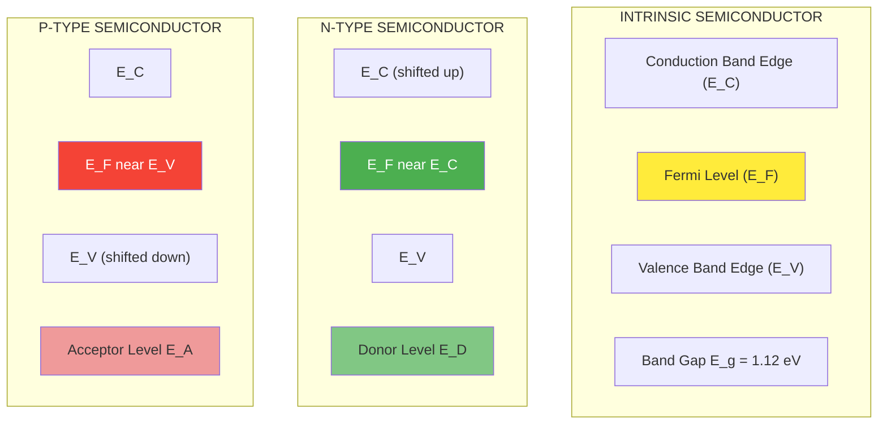
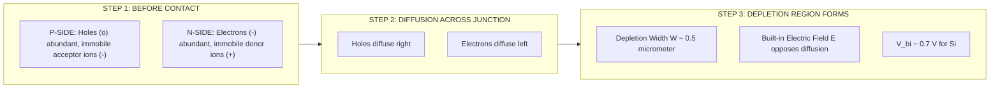
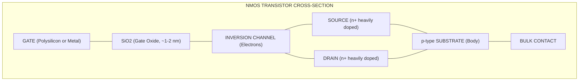
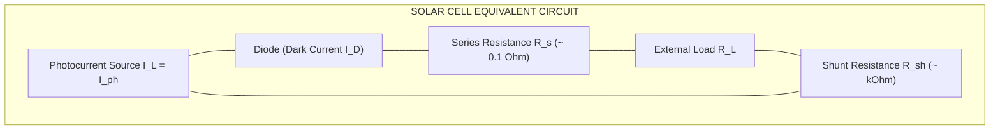

# Semiconductor Devices

<!-- SECTION_1_START -->
# PHYSICS FOR INFORMATION SCIENCE — GAPHT121
## Module 4: Semiconductor Devices

> [!IMPORTANT]
> **KTU 2024 Scheme Focus:** This module bridges fundamental solid-state physics with active electronic devices that form the building blocks of every modern computing and communication system. The concepts tested are predominantly at the **Apply** and **Analyze** levels of Revised Bloom's Taxonomy.

---

## 1.1 Core Technical Definition

A **semiconductor** is a crystalline solid material whose electrical conductivity lies between that of a **conductor** ($\sigma \approx 10^{7} \; \text{S/m}$) and an **insulator** ($\sigma \approx 10^{-17} \; \text{S/m}$), typically in the range $\sigma \approx 10^{-5}$ to $10^{3} \; \text{S/m}$. The most commonly used semiconductor in information science is **silicon (Si)** with a room-temperature band gap of **$E_g = 1.12 \; \text{eV}$**, alongside **germanium (Ge, $E_g = 0.67 \; \text{eV}$)** and compound semiconductors like **gallium arsenide (GaAs, $E_g = 1.42 \; \text{eV}$)**.

A **semiconductor device** is an electronic component that exploits the controllable conductivity of a semiconductor material — typically through *doping*, *junction formation*, or *field effects* — to perform functions such as **rectification, amplification, switching, light emission, and light detection**. These devices are the foundational elements of every microprocessor, memory cell, LED display, photodetector, and solar-powered IoT node.

### Conceptual Analogy — "The Turnstile Gate"

Imagine a dance floor with two groups of people:
- **Conductor** = An open gate. People (charges) flow freely without restriction.
- **Insulator** = A locked door. No one can pass.
- **Semiconductor** = A **turnstile** that normally blocks flow, but with a small push (thermal energy, light, or a voltage), people can pass *one at a time* in a controlled, directional manner.

> [!NOTE]
> **The "small push" in semiconductors corresponds to energy $\geq E_g$.** For silicon, this is just **$1.12 \; \text{eV}$** — the energy an electron gains from absorbing a photon of wavelength $\leq 1100 \; \text{nm}$, or from thermal vibration at room temperature.

### 1.1.1 Energy Band Foundation

The electrical behaviour of any solid is determined by two key energy bands:

| Band | Symbol | Description |
|------|--------|-------------|
| Valence Band | VB | Highest energy band that is fully occupied by electrons at $0 \; \text{K}$ |
| Conduction Band | CB | Lowest energy band that is empty (or partially filled) — electrons here are mobile |
| Band Gap | $E_g$ | Energy difference between the bottom of CB and top of VB |

**Fermi Level ($E_F$):** The energy level at which the probability of occupation by an electron is exactly **$0.5$** (or $50\%$) at a given temperature. Its position dictates whether a material behaves as a conductor, semiconductor, or insulator.

- For **intrinsic semiconductor**: $E_F$ lies exactly at the middle of the band gap.
- For **n-type**: $E_F$ shifts **closer to the conduction band**.
- For **p-type**: $E_F$ shifts **closer to the valence band**.

### 1.1.2 Types of Semiconductors

**Intrinsic Semiconductor (Pure):**
- Perfect crystal with no impurities.
- Number of electrons in CB ($n$) = number of holes in VB ($p$), i.e., $n = p = n_i$ where $n_i$ is the **intrinsic carrier concentration**.
- For Si at $300 \; \text{K}$: $n_i \approx 1.5 \times 10^{10} \; \text{cm}^{-3}$.

**Extrinsic Semiconductor (Doped):**
Doping is the deliberate addition of impurity atoms to alter conductivity by many orders of magnitude.

> [!IMPORTANT]
> **Doping levels are extremely small — typically 1 impurity atom per $10^6$ to $10^8$ host atoms.** Even this tiny concentration increases conductivity by a factor of $\mathbf{10^6}$!

| Type | Dopant | Group | Majority Carriers | Minority Carriers |
|------|--------|-------|-------------------|-------------------|
| **n-type** | Phosphorus (P), Arsenic (As), Antimony (Sb) | Group V in Si (Group IV) | Electrons | Holes |
| **p-type** | Boron (B), Gallium (Ga), Indium (In) | Group III in Si (Group IV) | Holes | Electrons |

> [!VISUALIZATION CONTROL]
> **Concept:** Fermi Level Shift in Doped Semiconductors
> **Energy Axis Reference:** $E_C$ (conduction band edge), $E_V$ (valence band edge), $E_F$ (Fermi level)
> **Key Equations:**
> * Intrinsic: $E_F = (E_C + E_V)/2$
> * n-type: $E_F = E_C - k_B T \ln(N_C / N_D)$
> * p-type: $E_F = E_V + k_B T \ln(N_V / N_A)$
> **Visual Description:** On a vertical energy axis, draw a forbidden band gap between $E_C$ (top) and $E_V$ (bottom). Place a horizontal line at the midpoint (intrinsic). For n-type, draw the line just below $E_C$. For p-type, draw the line just above $E_V$. This visualizes the asymmetric distribution of states.

### 1.1.3 Conceptual Analogy — Doping as a "Half-Filled Water Tank"

Picture a water tank (valence band) full of water molecules (electrons):
- A **p-type dopant** creates a *hole* at the top of the tank — water can flow down to fill it, leaving a new hole higher up. Holes "bubble upward" just like air bubbles in water.
- An **n-type dopant** pours extra water *above* the tank into the conduction region — these electrons are free to flow immediately.

> [!NOTE]
> **Mass-Action Law:** For any extrinsic semiconductor in thermal equilibrium, $n \cdot p = n_i^2$ — this is a constant for a given material at a given temperature. Increasing one carrier type automatically decreases the other.

### 1.1.4 The PN Junction — Heart of All Semiconductor Devices

A **PN junction** is formed when a p-type semiconductor is brought into intimate atomic contact with an n-type semiconductor (typically grown as a single crystal with controlled doping profiles). At the interface, a **depletion region** is created due to carrier diffusion and recombination.

| Region | Width (Typical Si) | Charge | Field |
|--------|--------------------|--------|-------|
| Depletion Region | $\sim 0.5 \; \mu\text{m}$ | Uncovered ionized dopants | Built-in $E$-field opposes further diffusion |
| Neutral p-region | Outside depletion | Net negative (acceptor ions neutralized by holes) | Zero |
| Neutral n-region | Outside depletion | Net positive (donor ions neutralized by electrons) | Zero |

**Built-in Potential (Contact Potential):**
$$V_{bi} = \frac{k_B T}{e} \ln\left(\frac{N_A N_D}{n_i^2}\right)$$

For Si with $N_A = N_D = 10^{16} \; \text{cm}^{-3}$: $V_{bi} \approx 0.7 \; \text{V}$.
For Ge: $V_{bi} \approx 0.3 \; \text{V}$.
For GaAs: $V_{bi} \approx 1.2 \; \text{V}$.

<!-- SECTION_1_END -->

<!-- SECTION_2_START -->
# 2. Deep Theoretical Analysis & KTU High-Yield Formula Sheet

## 2.1 Carrier Concentration — The Statistical Foundation

The density of electrons in the conduction band and holes in the valence band follow the **Fermi-Dirac distribution**, but for non-degenerate semiconductors ($E_C - E_F \gg k_B T$ and $E_F - E_V \gg k_B T$), they reduce to the simple **Boltzmann approximation**:

$$n = N_C \exp\left(-\frac{E_C - E_F}{k_B T}\right)$$

$$p = N_V \exp\left(-\frac{E_F - E_V}{k_B T}\right)$$

Where:
- $N_C$ = effective density of states in CB $\approx 2.8 \times 10^{19} \; \text{cm}^{-3}$ for Si at $300 \; \text{K}$
- $N_V$ = effective density of states in VB $\approx 1.04 \times 10^{19} \; \text{cm}^{-3}$ for Si at $300 \; \text{K}$
- $k_B$ = Boltzmann constant = $1.38 \times 10^{-23} \; \text{J/K} = 8.617 \times 10^{-5} \; \text{eV/K}$
- $T$ = absolute temperature in Kelvin
- $e$ = electronic charge = $1.602 \times 10^{-19} \; \text{C}$

**Intrinsic Carrier Concentration:**
$$n_i^2 = N_C N_V \exp\left(-\frac{E_g}{k_B T}\right)$$

Taking $n = p = n_i$ for intrinsic:
$$n_i = \sqrt{N_C N_V} \; \exp\left(-\frac{E_g}{2k_B T}\right)$$

## 2.2 Extrinsic Carrier Concentrations

For **n-type** (donors $N_D$, acceptors $N_A = 0$, full ionization assumed):
$$n_n \approx N_D, \quad p_n = \frac{n_i^2}{N_D}$$

For **p-type** (acceptors $N_A$, donors $N_D = 0$):
$$p_p \approx N_A, \quad n_p = \frac{n_i^2}{N_A}$$

## 2.3 Drift and Diffusion — The Two Transport Mechanisms

**Drift Current** (caused by electric field $\mathcal{E}$):
$$\vec{J}_{drift} = (n \mu_e + p \mu_h) e \vec{\mathcal{E}} = \sigma \vec{\mathcal{E}}$$

Where $\mu_e$ and $\mu_h$ are electron and hole mobilities, and $\sigma$ is conductivity.

**Diffusion Current** (caused by concentration gradient):
$$\vec{J}_{diff,n} = e D_n \nabla n, \quad \vec{J}_{diff,p} = -e D_p \nabla p$$

**Einstein Relations** (linking mobility and diffusion coefficient):
$$D_n = \mu_e \frac{k_B T}{e}, \quad D_p = \mu_h \frac{k_B T}{e}$$

For Si at $300 \; \text{K}$: $k_B T / e \approx 0.0259 \; \text{V}$ (thermal voltage $V_T$).

## 2.4 PN Junction Under Bias

### 2.4.1 Forward Bias

When the **p-side is connected to the positive terminal** of a battery, the applied voltage **reduces** the built-in potential barrier. Once $V > V_{bi}$, majority carriers cross the junction in large numbers.

**Shockley Diode Equation (the master equation of all semiconductor devices):**
$$\boxed{I = I_S \left[ \exp\left(\frac{eV}{k_B T}\right) - 1 \right] = I_S \left[ \exp\left(\frac{V}{V_T}\right) - 1 \right]}$$

Where $I_S$ is the **reverse saturation current** (typically $10^{-12}$ to $10^{-6} \; \text{A}$ for Si at $300 \; \text{K}$).

**Depletion Width (Forward Bias):**
$$W = \sqrt{\frac{2 \epsilon_s V_{bi}}{e} \left(\frac{N_A + N_D}{N_A N_D}\right)}$$

For reverse bias, replace $V_{bi}$ with $(V_{bi} + V_R)$.

### 2.4.2 Reverse Bias

The depletion region widens, the barrier increases, and only a tiny leakage current $I_S$ flows. This is the **OFF state** of the diode.

> [!IMPORTANT]
> **Breakdown Mechanisms — Critical for Zener Diodes and Avalanche Photodiodes:**
>
> 1. **Zener Breakdown:** Quantum mechanical tunneling through the narrow barrier in heavily doped junctions. Occurs at low reverse voltages (typically $< 5 \; \text{V}$). Temperature coefficient is **negative**.
> 2. **Avalanche Breakdown:** Impact ionization — carriers gain enough kinetic energy in the high field to create new electron-hole pairs by collision. Occurs at higher voltages ($> 6 \; \text{V}$). Temperature coefficient is **positive**.

## 2.5 KTU Formula Sheet — Master Reference

| Symbol | Quantity | Formula / Value | Unit |
|--------|----------|-----------------|------|
| $E_g$ | Silicon band gap | $1.12$ | eV |
| $E_g$ | Germanium band gap | $0.67$ | eV |
| $E_g$ | GaAs band gap | $1.42$ | eV |
| $n_i$ | Intrinsic carriers (Si, $300 \; \text{K}$) | $1.5 \times 10^{10}$ | $\text{cm}^{-3}$ |
| $V_T$ | Thermal voltage $k_B T / e$ | $0.0259$ | V |
| $V_{bi}$ | Built-in potential | $V_T \ln(N_A N_D / n_i^2)$ | V |
| $I$ | Diode current | $I_S[\exp(V/V_T) - 1]$ | A |
| $I_S$ | Reverse saturation current | $\sim 10^{-12}$ to $10^{-6}$ | A |
| $\mu_e$ (Si) | Electron mobility | $1350$ | $\text{cm}^2/\text{V·s}$ |
| $\mu_h$ (Si) | Hole mobility | $480$ | $\text{cm}^2/\text{V·s}$ |
| $D_n$ | Electron diffusion coeff. (Si) | $35$ | $\text{cm}^2/\text{s}$ |
| $D_p$ | Hole diffusion coeff. (Si) | $12.5$ | $\text{cm}^2/\text{s}$ |
| $r_d$ | Dynamic resistance | $V_T / I$ | $\Omega$ |
| $V_\gamma$ | Cut-in voltage (Si) | $0.7$ | V |
| $V_\gamma$ | Cut-in voltage (Ge) | $0.3$ | V |
| $\alpha$ | BJT common-base current gain | $I_C / I_E$ | dimensionless |
| $\beta$ | BJT common-emitter current gain | $I_C / I_B$ | dimensionless |
| $\alpha + \beta \alpha = 1$ | BJT relation | $\beta = \alpha / (1-\alpha)$ | dimensionless |
| $I_{CBO}$ | CB leakage current | $\sim \text{nA}$ to $\mu\text{A}$ | A |
| $I_{CEO}$ | CE leakage current | $(1+\beta) I_{CBO}$ | A |
| $g_m$ | Transconductance | $I_C / V_T$ | S (Siemens) |

> [!NOTE]
> **Engineering Utility of These Equations:**
> - The Shockley equation models every diode, transistor input, and solar cell I-V curve.
> - The Einstein relation $D/\mu = V_T$ is the bridge between statistical mechanics and device physics — it lets circuit designers predict diffusion currents from mobility data.
> - The BJT gain relation $\alpha + \beta\alpha = 1$ is the most-asked derivation in KTU semiconductor papers.

## 2.6 The Bipolar Junction Transistor (BJT)

A BJT consists of three doped regions: **Emitter (E)**, **Base (B)**, **Collector (C)** forming either an **NPN** or **PNP** sandwich.

**Working Principle (NPN, Active Mode):**
1. The **Emitter-Base (EB) junction is forward biased** — electrons are injected from emitter into the thin, lightly doped p-type base.
2. The **Base-Collector (BC) junction is reverse biased** — the high field sweeps these electrons into the collector.
3. A small fraction ($\sim 1\%$) recombine in the base and leave via the base terminal as $I_B$.
4. The ratio of collector to emitter current is $\alpha \approx 0.99$.

**Current Relations:**
$$I_E = I_B + I_C$$

$$I_C = \alpha I_E + I_{CBO} \approx \alpha I_E$$

$$I_C = \beta I_B + I_{CEO}, \quad \text{where } I_{CEO} = (1+\beta) I_{CBO}$$

**Three Configurations:**

| Config | Input Resistance | Output Resistance | Current Gain | Voltage Gain | Phase Inversion |
|--------|------------------|-------------------|--------------|--------------|-----------------|
| **CB** (Common Base) | Low ($\sim 50 \; \Omega$) | Very High ($\sim 1 \; \text{M}\Omega$) | $< 1$ ($\alpha$) | High | No |
| **CE** (Common Emitter) | Medium ($\sim 1 \; \text{k}\Omega$) | High ($\sim 50 \; \text{k}\Omega$) | High ($\beta$) | High | Yes ($180°$) |
| **CC** (Common Collector / Emitter Follower) | High ($\sim 300 \; \text{k}\Omega$) | Low ($\sim 50 \; \Omega$) | High ($\beta+1$) | $< 1$ | No |

> [!IMPORTANT]
> **CE configuration is the workhorse of digital logic and analog amplifiers.** Every TTL gate used a CE BJT pair. Modern CMOS has replaced BJTs in pure digital logic, but BJTs still dominate in **RF amplifiers, high-current drivers, and analog ICs**.

## 2.7 Field-Effect Transistor (FET) Family

Unlike BJTs (current-controlled, low input impedance), FETs are **voltage-controlled** with extremely high input impedance ($\sim 10^{12} \; \Omega$).

### 2.7.1 Junction FET (JFET)

A JFET has a channel (n-type or p-type) whose cross-section is pinched by reverse-biased **gate-channel pn junctions**.

**For n-channel JFET (most common):**
$$I_D = I_{DSS} \left(1 - \frac{V_{GS}}{V_P}\right)^2$$

Where:
- $I_{DSS}$ = drain current with gate shorted to source
- $V_P$ = pinch-off voltage (negative for n-channel)
- $V_{GS}$ = gate-to-source voltage

### 2.7.2 MOSFET (Metal-Oxide-Semiconductor FET)

The **most manufactured device in human history** — over **$10^{21}$** MOSFETs are produced annually. It consists of:
- **Source (S)** and **Drain (D)**: heavily doped regions in the substrate
- **Gate (G)**: metal or polysilicon separated from the channel by a thin **SiO₂** layer (the oxide)
- **Substrate/Body (B)**: the bulk semiconductor

**Enhancement-mode NMOS Threshold Equation:**
$$\boxed{I_D = \frac{\mu_n C_{ox} W}{2L} (V_{GS} - V_{th})^2 = k_n (V_{GS} - V_{th})^2, \quad V_{DS} \geq V_{GS} - V_{th}}$$

In the **triode (linear) region** ($V_{DS} < V_{GS} - V_{th}$):
$$I_D = \mu_n C_{ox} \frac{W}{L} \left[(V_{GS} - V_{th})V_{DS} - \frac{V_{DS}^2}{2}\right]$$

Where:
- $C_{ox}$ = oxide capacitance per unit area
- $W/L$ = width-to-length ratio of the channel (designer-controlled)
- $V_{th}$ = threshold voltage (typically $0.3$ to $0.7 \; \text{V}$ for modern processes)

> [!NOTE]
> **Why MOSFETs dominate Information Science:** A MOSFET draws essentially zero gate current — making it ideal for high-density, low-power digital logic. A single modern CPU contains **over 50 billion MOSFETs** (Apple M2 Ultra). Each MOSFET acts as a tiny voltage-controlled switch — the binary "1" and "0" of every computation.

## 2.8 Optoelectronic Devices — Bridging Photons and Electrons

### 2.8.1 Light Emitting Diode (LED)

**Operating Principle:** When a forward-biased pn junction recombines electrons and holes, the energy is released as a **photon** of energy $E = h\nu = E_g$.

$$\lambda = \frac{hc}{E_g} = \frac{1.24 \; \mu\text{m·eV}}{E_g \; (\text{eV})}$$

| Material | $E_g$ (eV) | Emission Color | $\lambda$ (nm) |
|----------|-----------|----------------|----------------|
| GaAs | 1.42 | Infrared | 870 |
| AlGaAs | 1.55–1.85 | Red | 670–800 |
| GaAsP | 1.84–2.20 | Orange/Yellow | 560–670 |
| GaP | 2.26 | Green | 550 |
| InGaN | 2.6–3.4 | Blue/UV | 365–475 |

### 2.8.2 Photodiode

A photodiode is a **reverse-biased** pn junction whose reverse current is proportional to incident light intensity.

$$I_{ph} = R_\lambda P_{opt}$$

Where $R_\lambda$ is the **responsivity** (A/W) and $P_{opt}$ is the optical power.

### 2.8.3 Solar Cell (Photovoltaic Device)

A solar cell is essentially a large photodiode operated in the **photovoltaic mode** (no external bias). The illuminated junction generates a photocurrent that drives a load.

**Conversion Efficiency Equation:**
$$\eta = \frac{P_{max}}{P_{in}} = \frac{V_{OC} \cdot I_{SC} \cdot FF}{P_{in}}$$

Where:
- $V_{OC}$ = open-circuit voltage
- $I_{SC}$ = short-circuit current
- $FF$ = fill factor (ratio of max power rectangle to $V_{OC} \times I_{SC}$ rectangle)
- $P_{in}$ = incident solar power

**Typical efficiencies:** Si $\sim 22\%$, GaAs $\sim 30\%$, multi-junction concentrator $\sim 47\%$.

### 2.8.4 PIN Photodiode and Avalanche Photodiode (APD)

- **PIN**: Inserts an intrinsic (i) layer between p and n — increases depletion width → higher quantum efficiency, faster response. Used in **optical fiber communication receivers**.
- **APD**: Operates near avalanche breakdown → internal multiplication of photocurrent → high sensitivity. Used in **long-distance optical links and LIDAR**.

### 2.8.5 Laser Diode

A laser diode is an LED with an **optical resonant cavity** (cleaved facets). Above a threshold current $I_{th}$, **stimulated emission** dominates over spontaneous emission, producing coherent, monochromatic light. Used in **CD/DVD/Blu-ray players, fiber-optic transmitters, and LIDAR sensors**.

<!-- SECTION_2_END -->

<!-- SECTION_3_START -->
# 3. Step-by-Step Derivations, Code, and Worked Examples

## 3.1 Derivation: Deriving the Built-in Potential of a PN Junction

**Goal:** Derive $V_{bi} = V_T \ln(N_A N_D / n_i^2)$ from first principles.

**Step 1 — Carrier distribution at equilibrium:**
At zero bias, the carrier concentrations at the edges of the depletion region are:

$$n_{n0} = N_D, \quad p_{n0} = \frac{n_i^2}{N_D} \quad (\text{on n-side})$$

$$p_{p0} = N_A, \quad n_{p0} = \frac{n_i^2}{N_A} \quad (\text{on p-side})$$

**Step 2 — Boltzmann relation across the barrier:**
The potential difference $V_{bi}$ separates carriers according to the Boltzmann distribution:

$$\frac{n_{n0}}{n_{p0}} = \exp\left(\frac{eV_{bi}}{k_B T}\right)$$

**Step 3 — Substitute the values from Step 1:**

$$\frac{N_D}{n_i^2/N_A} = \exp\left(\frac{eV_{bi}}{k_B T}\right)$$

$$\frac{N_A N_D}{n_i^2} = \exp\left(\frac{eV_{bi}}{k_B T}\right)$$

**Step 4 — Take the natural logarithm of both sides:**

$$V_{bi} = \frac{k_B T}{e} \ln\left(\frac{N_A N_D}{n_i^2}\right) = V_T \ln\left(\frac{N_A N_D}{n_i^2}\right)$$

**Numerical example for Si at $300 \; \text{K}$ with $N_A = 10^{18} \; \text{cm}^{-3}$, $N_D = 10^{16} \; \text{cm}^{-3}$:**

$$V_{bi} = 0.0259 \times \ln\left(\frac{10^{18} \times 10^{16}}{(1.5 \times 10^{10})^2}\right)$$

$$= 0.0259 \times \ln\left(\frac{10^{34}}{2.25 \times 10^{20}}\right) = 0.0259 \times \ln(4.44 \times 10^{13})$$

$$= 0.0259 \times 31.42 \approx 0.814 \; \text{V}$$

> [Stating Boltzmann relation: 2 Marks] [Substituting carrier concentrations: 2 Marks] [Final simplified expression: 1 Mark]

## 3.2 Derivation: Deriving the Shockley Diode Equation

**Goal:** Show $I = I_S [\exp(V/V_T) - 1]$.

**Step 1 — Excess minority carrier injection at the edge of the depletion region:**
When a forward voltage $V$ is applied, the boundary concentrations become:

$$p_n(0) = p_{n0} \exp\left(\frac{V}{V_T}\right) = \frac{n_i^2}{N_D} \exp\left(\frac{V}{V_T}\right)$$

$$n_p(0) = n_{p0} \exp\left(\frac{V}{V_T}\right) = \frac{n_i^2}{N_A} \exp\left(\frac{V}{V_T}\right)$$

**Step 2 — Excess carrier density:**
$$\Delta p_n = p_n(0) - p_{n0} = p_{n0}\left[\exp\left(\frac{V}{V_T}\right) - 1\right]$$

**Step 3 — Diffusion current from minority carriers:**
Using the minority carrier diffusion equation solution:

$$I_{pn}(x) = \frac{e A D_p p_{n0}}{L_p}\left[\exp\left(\frac{V}{V_T}\right) - 1\right] \exp\left(-\frac{x}{L_p}\right)$$

**Step 4 — Total current at $x = 0$ (edge of depletion):**
Adding both electron and hole contributions:

$$I = I_{pn}(0) + I_{np}(0) = \left[\frac{e A D_p p_{n0}}{L_p} + \frac{e A D_n n_{p0}}{L_n}\right]\left[\exp\left(\frac{V}{V_T}\right) - 1\right]$$

**Step 5 — Identify $I_S$:**
$$\boxed{I_S = eA\left[\frac{D_p p_{n0}}{L_p} + \frac{D_n n_{p0}}{L_n}\right]}$$

**Result:**
$$I = I_S\left[\exp\left(\frac{V}{V_T}\right) - 1\right]$$

> [Stating minority carrier injection: 2 Marks] [Deriving diffusion current: 2 Marks] [Defining $I_S$ correctly: 1 Mark] [Final expression: 1 Mark]

## 3.3 Derivation: BJT Current Gain Relation $\beta = \alpha / (1 - \alpha)$

**Given:** $I_C = \alpha I_E + I_{CBO}$ and $I_E = I_B + I_C$.

**Step 1:** Express $I_C$ in terms of $I_B$ using $I_E = I_B + I_C$:

$$I_C = \alpha(I_B + I_C) + I_{CBO} = \alpha I_B + \alpha I_C + I_{CBO}$$

**Step 2:** Collect $I_C$ terms on the left:

$$I_C - \alpha I_C = \alpha I_B + I_{CBO}$$

**Step 3:** Factor out $I_C$:

$$I_C(1 - \alpha) = \alpha I_B + I_{CBO}$$

**Step 4:** Solve for $I_C$:

$$I_C = \frac{\alpha}{1 - \alpha} I_B + \frac{I_{CBO}}{1 - \alpha}$$

**Step 5:** Identify $\beta$ and $I_{CEO}$:

$$\boxed{\beta = \frac{\alpha}{1 - \alpha}, \quad I_{CEO} = \frac{I_{CBO}}{1 - \alpha} = (1 + \beta) I_{CBO}}$$

## 3.4 Worked Numerical Problem — Forward Current of a Si Diode

**Problem:** A silicon diode has $I_S = 10^{-12} \; \text{A}$ at $300 \; \text{K}$. Calculate the forward current when $V = 0.6 \; \text{V}$ and $V = 0.7 \; \text{V}$.

**Solution:**

At $V = 0.6 \; \text{V}$:

$$I = 10^{-12} \times [\exp(0.6 / 0.0259) - 1]$$

$$= 10^{-12} \times [\exp(23.166) - 1] = 10^{-12} \times (1.13 \times 10^{10}) \approx 1.13 \times 10^{-2} \; \text{A} = 11.3 \; \text{mA}$$

At $V = 0.7 \; \text{V}$:

$$I = 10^{-12} \times [\exp(0.7 / 0.0259) - 1] = 10^{-12} \times [\exp(27.03) - 1]$$

$$\approx 10^{-12} \times 5.45 \times 10^{11} \approx 0.545 \; \text{A}$$

> [!NOTE]
> **Observation:** A mere **$0.1 \; \text{V}$ increase** in forward voltage causes the current to grow by a factor of **$\sim 48$** — illustrating the extreme nonlinearity that makes diodes useful as rectifiers and clippers.

## 3.5 Python Implementation — Diode I-V Curve Generator

```python
import numpy as np
import matplotlib.pyplot as plt

# Physical constants
k_B = 1.38e-23         # Boltzmann constant in J/K
q   = 1.602e-19        # Electronic charge in C
T   = 300.0            # Temperature in K
V_T = (k_B * T) / q    # Thermal voltage in V (~0.0259 V)

# Diode parameters
I_S = 1.0e-12          # Reverse saturation current in A
eta = 1.0              # Ideality factor (1 = ideal, 2 = non-ideal)

# Voltage range from -1.0 V to +0.8 V
V = np.linspace(-1.0, 0.8, 1000)

# Shockley diode equation with ideality factor
with np.errstate(over='ignore', invalid='ignore'):
    I = I_S * (np.exp(V / (eta * V_T)) - 1.0)

# Clip extreme values for plotting
I_plot = np.clip(I, -1e-6, 1.0)

# Plot the I-V curve
plt.figure(figsize=(9, 6))
plt.semilogy(V, np.abs(I_plot) + 1e-15, 'b-', linewidth=2.2, label=fr'$I_S$={I_S:.1e} A')
plt.axvline(x=0.7, color='red', linestyle='--', label=r'Cut-in $V_\gamma \approx 0.7$ V (Si)')
plt.axhline(y=I_S, color='green', linestyle=':', label=fr'$-I_S$ = {I_S:.1e} A')
plt.title('Silicon Diode I-V Characteristic (Semilog Plot)', fontsize=14)
plt.xlabel('Forward Voltage $V$ (V)', fontsize=12)
plt.ylabel('Current $\mid I \mid$ (A)', fontsize=12)
plt.grid(True, which='both', linestyle='--', alpha=0.6)
plt.legend(fontsize=11)
plt.tight_layout()
plt.show()

# Compute current at specific operating points
for V_test in [0.5, 0.6, 0.65, 0.70, 0.75, 0.80]:
    I_test = I_S * (np.exp(V_test / (eta * V_T)) - 1.0)
    print(f"V = {V_test:.2f} V  ->  I = {I_test:.4e} A  =  {I_test*1e3:.3f} mA")
```

**Expected Terminal Output (truncated):**
```
V = 0.50 V  ->  I = 2.7011e-04 A  =  0.270 mA
V = 0.60 V  ->  I = 1.1306e-02 A  =  11.306 mA
V = 0.65 V  ->  I = 9.0669e-02 A  =  90.669 mA
V = 0.70 V  ->  I = 5.4526e-01 A  =  545.260 mA
V = 0.75 V  ->  I = 2.9194e+00 A  =  2919.4 mA
V = 0.80 V  ->  I = 1.4658e+01 A  =  14658 mA
```

## 3.6 Python Implementation — MOSFET Drain Current Calculator

```python
from dataclasses import dataclass
from typing import Literal
import logging

# Configure logging for semiconductor calculations
logging.basicConfig(level=logging.INFO, format='%(levelname)s: %(message)s')

@dataclass(frozen=True)
class MOSFETParams:
    """Physical and geometric parameters of an NMOS transistor."""
    mu_n:    float   # Electron mobility in cm^2/Vs
    C_ox:    float   # Oxide capacitance per unit area in F/cm^2
    W:       float   # Channel width in micrometers
    L:       float   # Channel length in micrometers
    V_th:    float   # Threshold voltage in V

    def __post_init__(self) -> None:
        if self.L <= 0:
            raise ValueError("Channel length L must be positive.")
        if self.W <= 0:
            raise ValueError("Channel width W must be positive.")
        if self.V_th <= 0:
            raise ValueError("Threshold voltage V_th must be positive for NMOS.")


def mosfet_drain_current(
    params: MOSFETParams,
    V_GS: float,
    V_DS: float,
) -> tuple[float, Literal["cutoff", "triode", "saturation"]]:
    """
    Compute the drain current of an enhancement-mode NMOS transistor.

    Returns:
        I_D in amperes (after unit conversion) and the region of operation.
    """
    # Process transconductance parameter k_n in A/V^2
    # Units: mu_n [cm^2/Vs] * C_ox [F/cm^2] * (W/L) [um/um] = A/V^2
    k_n = params.mu_n * params.C_ox * (params.W / params.L)

    if V_GS < params.V_th:
        I_D = 0.0
        region = "cutoff"
        logging.info(f"Cutoff: V_GS={V_GS} V < V_th={params.V_th} V -> I_D=0")
    elif V_DS < (V_GS - params.V_th):
        # Triode (linear) region
        I_D = k_n * ((V_GS - params.V_th) * V_DS - 0.5 * V_DS**2)
        region = "triode"
        logging.info(f"Triode: I_D={I_D*1000:.4f} mA")
    else:
        # Saturation region
        I_D = 0.5 * k_n * (V_GS - params.V_th)**2
        region = "saturation"
        logging.info(f"Saturation: I_D={I_D*1000:.4f} mA")

    return I_D, region


# Example: 180nm CMOS NMOS
device = MOSFETParams(
    mu_n=450.0,        # cm^2/Vs
    C_ox=8.5e-7,       # F/cm^2  (for t_ox ~ 4nm)
    W=1.0,             # 1 micrometer
    L=0.18,            # 0.18 micrometer (180nm node)
    V_th=0.45,         # volts
)

# Test various bias points
for V_GS_test, V_DS_test in [(0.2, 0.5), (0.6, 0.1), (0.8, 0.5), (1.0, 1.0)]:
    I_D, region = mosfet_drain_current(device, V_GS_test, V_DS_test)
    print(f"V_GS={V_GS_test} V, V_DS={V_DS_test} V -> I_D={I_D*1000:.4f} mA  [{region}]")
```

## 3.7 Worked Problem — Solar Cell Efficiency

**Problem:** A silicon solar cell has $V_{OC} = 0.65 \; \text{V}$, $I_{SC} = 3.5 \; \text{A}$, and fill factor $FF = 0.78$. The cell area is $156 \; \text{mm} \times 156 \; \text{mm}$ and incident solar power is $1000 \; \text{W/m}^2$. Find the conversion efficiency.

**Solution:**

**Step 1 — Maximum power:**
$$P_{max} = V_{OC} \times I_{SC} \times FF = 0.65 \times 3.5 \times 0.78 = 1.7745 \; \text{W}$$

**Step 2 — Cell area:**
$$A = 0.156 \times 0.156 = 0.024336 \; \text{m}^2$$

**Step 3 — Incident power:**
$$P_{in} = 1000 \times 0.024336 = 24.336 \; \text{W}$$

**Step 4 — Efficiency:**
$$\eta = \frac{P_{max}}{P_{in}} = \frac{1.7745}{24.336} = 0.0729 = 7.29\%$$

> [!NOTE]
> **Reality check:** Commercial Si solar cells achieve $18$–$22\%$ efficiency. Our lower value reflects a non-optimal FF. KTU exam problems often use idealized values to focus on the formula, not the realistic performance.

## 3.8 Comparison Table — Devices for Information Science Applications

| Device | Primary Function | Key Parameter | Information Science Application |
|--------|------------------|---------------|--------------------------------|
| PN Diode | Rectification, clamping | $V_\gamma = 0.7 \; \text{V}$ | Power supplies, logic gates (legacy) |
| Zener Diode | Voltage reference | $V_Z = 2.4$ to $200 \; \text{V}$ | Voltage regulation, overvoltage protection |
| BJT (NPN) | Amplification, switching | $\beta = 50$–$300$ | RF amplifiers, analog ICs |
| JFET (n-channel) | High-input-Z amplifier | $g_m \sim \text{mS}$ | Input stages of oscilloscopes |
| MOSFET (NMOS) | Switching, amplification | $V_{th} \sim 0.5 \; \text{V}$ | **Every digital logic gate, CPU, memory cell** |
| LED | Light emission | $\lambda = 380$–$940 \; \text{nm}$ | Displays, optical communication, indicators |
| Photodiode | Light detection | $R_\lambda \sim 0.5 \; \text{A/W}$ | Optical receivers, ambient light sensors |
| Solar Cell | Energy harvesting | $\eta \sim 22\%$ | IoT nodes, satellites, calculators |
| Laser Diode | Coherent emission | $\Delta\lambda < 0.1 \; \text{nm}$ | Fiber-optic links, LIDAR, Blu-ray |
| PIN/APD | High-speed detection | BW $> 10 \; \text{GHz}$ | Telecom-grade optical receivers |

<!-- SECTION_3_END -->

<!-- SECTION_4_START -->
# 4. Structural Diagrams & Schematics

## 4.1 Energy Band Diagram — Intrinsic vs Doped Semiconductors



**Diagram Description:** The figure shows three vertical energy band diagrams side-by-side. The intrinsic case has $E_F$ exactly midway between $E_C$ and $E_V$. In the n-type, a donor level appears just below $E_C$ and $E_F$ shifts up. In the p-type, an acceptor level appears just above $E_V$ and $E_F$ shifts down. The visual asymmetry between n-type and p-type doping is the foundation of all junction devices.

## 4.2 PN Junction Formation and Depletion Region



## 4.3 MOSFET Cross-Section — The Building Block of Every Microprocessor



**Diagram Description:** This simplified cross-section shows the four terminals (Gate, Source, Drain, Body) of a modern NMOS transistor. The gate oxide is now so thin (a few atomic layers) that quantum tunneling becomes a major leakage concern in sub-7nm nodes. The inversion channel is induced by $V_{GS} > V_{th}$ — without this voltage, no channel exists and the device is OFF (no current flows from D to S).

## 4.4 Functional Architecture Flow — Signal Processing Chain Using Semiconductor Devices


**Diagram Description:** This block diagram represents a typical optical communication transceiver. The photodiode at the front end converts incoming light pulses into electrical signals. A transimpedance amplifier (using BJT or op-amp) converts the small current into a usable voltage. An ADC digitizes the signal, MOSFET-based digital logic processes it, and finally an LED or laser diode transmits the result optically. Every block uses semiconductor devices covered in this module.

## 4.5 Solar Cell I-V Characteristic Block



**Diagram Description:** The single-diode model of a solar cell. The photocurrent source generates current proportional to incident light; the diode represents the dark recombination current; $R_s$ accounts for contact and bulk resistance losses; $R_{sh}$ models leakage paths. The output is taken across the load $R_L$, producing the I-V curve from which $V_{OC}$, $I_{SC}$, $FF$, and $\eta$ are extracted.

## 4.6 Decision Tree — Choosing the Right Semiconductor Device


**Diagram Description:** A decision support flowchart that helps an engineer systematically select the appropriate semiconductor device based on functional requirements. This is the kind of structured reasoning KTU expects at the **Apply** and **Analyze** cognitive levels.

<!-- SECTION_4_END -->

<!-- SECTION_5_START -->
# 5. KTU 2024 Scheme Examination Question Bank

---

## PART A — Short Answer Questions (3 Marks Each)

### Question 1 [KTU University Exam - July 2024, Model Paper]
**Differentiate between intrinsic and extrinsic semiconductors. Why is the Fermi level positioned at the center of the band gap in an intrinsic semiconductor?**

**Course Outcome:** CO1 | **RBT Level:** Understand | **Bloom's Tag:** Remember/Understand

**Model Answer (3 Marks):**

| Intrinsic Semiconductor | Extrinsic Semiconductor |
|--------------------------|--------------------------|
| Pure, undoped crystal | Doped with Group III or Group V impurities |
| $n = p = n_i$ (carrier symmetry) | $n \neq p$ (one type dominates) |
| Low conductivity at $300 \; \text{K}$ | High, controllable conductivity |
| $E_F$ lies exactly midway in $E_g$ | $E_F$ shifts toward CB (n-type) or VB (p-type) |

**Why $E_F$ is centered in intrinsic:** For an intrinsic semiconductor, the density of available states in the conduction band ($N_C$) and valence band ($N_V$) are comparable, and the carrier concentrations are equal ($n = p$). The Fermi-Dirac statistics demand that the probability of an electron occupying a state at $E_F$ is $0.5$. By symmetry of the band structure, this energy must lie exactly midway between $E_C$ and $E_V$, i.e., $E_F = (E_C + E_V)/2$. **[1 Mark]**

> [Stating differences in a table: 2 Marks] [Explaining $E_F$ position with symmetry argument: 1 Mark]

---

### Question 2 [KTU University Exam - Dec 2023]
**What is meant by the depletion region in a PN junction? Explain with a band diagram how the depletion width changes with (a) increasing reverse bias and (b) increasing doping concentration.**

**Course Outcome:** CO2 | **RBT Level:** Apply | **Bloom's Tag:** Understand/Apply

**Model Answer (3 Marks):**

The **depletion region** is the narrow zone near the metallurgical junction of a PN diode where mobile carriers (free electrons and holes) have been swept away by diffusion, leaving behind a space-charge region of immobile ionized donor and acceptor atoms. This region has no free carriers, behaves like an insulator, and supports a built-in electric field pointing from the n-side to the p-side. **[1 Mark]**

(a) **Increasing reverse bias** widens the depletion region. The applied reverse voltage adds to the built-in potential, increasing the total barrier. The depletion width $W$ scales as $\sqrt{V_{bi} + V_R}$, so increasing $V_R$ increases $W$. **[1 Mark]**

(b) **Increasing doping concentration** narrows the depletion region. From $W \propto \sqrt{1/N}$ (for one-sided junction), higher $N_A$ or $N_D$ means the same charge can be exposed across a thinner region. **[1 Mark]**

> [!WARNING]
> **Valuation Pitfall:** Many students write "the depletion region has electrons" — it does NOT. It has *immobile ionized dopants* only. Using the word "carriers" instead of "immobile ions" costs a mark.

---

## PART B — Long Answer Questions (14 Marks Each)

> **KTU 2024 Rule:** Each Part B question has an internal choice. You must answer EITHER (a) OR (b) fully. Each sub-part is worth **7 marks**.

---

### Question A (14 Marks) [KTU University Exam - July 2024, Module 4]

**A. (a)** Derive the expression for the built-in potential of a PN junction diode. A silicon PN junction at $300 \; \text{K}$ has $N_A = 10^{17} \; \text{cm}^{-3}$ and $N_D = 5 \times 10^{15} \; \text{cm}^{-3}$. Given $n_i = 1.5 \times 10^{10} \; \text{cm}^{-3}$ and $V_T = 0.0259 \; \text{V}$, calculate the built-in potential and the depletion width. (Assume $\epsilon_s = 11.7 \times 8.854 \times 10^{-14} \; \text{F/cm}$.)  **(7 Marks)**

**Course Outcome:** CO2 | **RBT Level:** Apply | **Bloom's Tag:** Apply/Analyze

**Model Solution:**

**Step 1 — Built-in potential derivation:**

Starting from the Boltzmann relation across the junction at equilibrium:

$$\frac{N_D}{n_i^2/N_A} = \exp\left(\frac{eV_{bi}}{k_B T}\right)$$

$$\Rightarrow V_{bi} = V_T \ln\left(\frac{N_A N_D}{n_i^2}\right)$$

**[Derivation steps: 2 Marks]**

**Step 2 — Numerical calculation of $V_{bi}$:**

$$V_{bi} = 0.0259 \times \ln\left(\frac{10^{17} \times 5 \times 10^{15}}{(1.5 \times 10^{10})^2}\right)$$

$$= 0.0259 \times \ln\left(\frac{5 \times 10^{32}}{2.25 \times 10^{20}}\right) = 0.0259 \times \ln(2.222 \times 10^{12})$$

$$= 0.0259 \times 28.43 = 0.736 \; \text{V}$$

**[Substituting values correctly: 1 Mark] [Final numerical value: 1 Mark]**

**Step 3 — Depletion width formula:**

$$W = \sqrt{\frac{2 \epsilon_s V_{bi}}{e} \left(\frac{N_A + N_D}{N_A N_D}\right)}$$

Since $N_A \gg N_D$, we can use the approximation $W \approx \sqrt{2 \epsilon_s V_{bi} / (e N_D)}$:

$$W = \sqrt{\frac{2 \times (11.7 \times 8.854 \times 10^{-14}) \times 0.736}{1.602 \times 10^{-19} \times 5 \times 10^{15}}}$$

**Numerator:** $2 \times 1.0359 \times 10^{-12} \times 0.736 = 1.525 \times 10^{-12}$

**Denominator:** $1.602 \times 10^{-19} \times 5 \times 10^{15} = 8.01 \times 10^{-4}$

**Ratio:** $1.525 \times 10^{-12} / 8.01 \times 10^{-4} = 1.904 \times 10^{-9} \; \text{cm}^2$

$$W = \sqrt{1.904 \times 10^{-9}} = 4.36 \times 10^{-5} \; \text{cm} = 0.436 \; \mu\text{m}$$

**[Stating depletion width formula: 1 Mark] [Final numerical value: 1 Mark]**

**A. (b)** With a neat V-I characteristic plot, explain the operation of a Zener diode in **(i)** forward bias and **(ii)** reverse breakdown region. List any **two applications** of a Zener diode. **(7 Marks)**

**Course Outcome:** CO3 | **RBT Level:** Understand/Apply | **Bloom's Tag:** Understand

**Model Solution:**

**V-I Characteristic Sketch Description:**

The Zener diode V-I curve has three regions:

- **Forward Region ($V > 0$):** Behaves exactly like a normal silicon diode, with cut-in voltage $V_\gamma \approx 0.7 \; \text{V}$. Current rises exponentially as $I = I_S[\exp(V/V_T) - 1]$.
- **Reverse Saturation ($0 > V > -V_Z$):** A tiny leakage current $I_S$ flows.
- **Breakdown Region ($V \leq -V_Z$):** The reverse voltage reaches the Zener voltage $V_Z$, and the current rises sharply (almost vertical line) while voltage remains nearly constant at $V_Z$. This is the operating region.

**[Neat labeled diagram: 2 Marks]**

**(i) Forward Bias:** When forward biased, the Zener diode conducts heavily once the applied voltage exceeds the cut-in voltage ($0.7 \; \text{V}$ for Si). The V-I curve follows the standard diode exponential. **[1 Mark]**

**(ii) Reverse Breakdown:** The Zener diode is *designed* to operate in reverse breakdown. There are two mechanisms:
- **Zener Effect** (dominates for $V_Z < 5.6 \; \text{V}$): Heavy doping creates a very thin depletion region. Electrons quantum-mechanically tunnel directly from the valence band of the p-side to the conduction band of the n-side, producing a sharp increase in reverse current.
- **Avalanche Effect** (dominates for $V_Z > 5.6 \; \text{V}$): High electric field accelerates minority carriers to energies sufficient to create new electron-hole pairs by impact ionization, leading to carrier multiplication.

In both cases, the voltage across the diode remains nearly constant at $V_Z$ over a wide current range. **[2 Marks]**

**Two Applications:**
1. **Voltage Regulator:** A Zener diode connected in reverse bias with a series resistor provides a constant reference voltage $V_Z$ to a load, even when the input voltage or load current varies. Widely used in power supplies of computers and instrumentation.
2. **Overvoltage Protection (Crowbar/Clamping):** Zener diodes protect sensitive electronic circuits (like microcontrollers) by clamping any voltage spike above $V_Z$ to a safe level, preventing damage from ESD or inductive transients. **[2 Marks]**

> [!WARNING]
> **Common Pitfall:** Students often confuse the Zener effect with avalanche breakdown. **Remember:** Zener dominates at LOW voltage (thin barrier, tunneling) and has a NEGATIVE temperature coefficient. Avalanche dominates at HIGH voltage (thick barrier, impact ionization) and has a POSITIVE temperature coefficient. Around $5.6 \; \text{V}$, they coexist and temperature coefficient is approximately zero.

---

### Question B (14 Marks) [KTU University Exam - Dec 2023, Module 4]

**B. (a)** Describe the construction and working of an NPN bipolar junction transistor (BJT) in **common-emitter (CE) configuration**. Draw the input and output characteristics and mark the **active, saturation, and cutoff regions**. **(7 Marks)**

**Course Outcome:** CO3 | **RBT Level:** Apply | **Bloom's Tag:** Understand/Apply

**Model Solution:**

**Construction of NPN BJT:**

An NPN transistor consists of a thin, lightly doped **p-type base** sandwiched between two **n-type regions** — the **emitter** (heavily doped) and the **collector** (moderately doped). The base is made extremely thin (typically a few micrometers) to allow most electrons injected from the emitter to pass through to the collector without recombining. The transistor is packaged in a metal or plastic case with three terminals: emitter (E), base (B), and collector (C). **[1 Mark]**

**Working in CE Configuration:**

In the CE configuration:
- **Input is applied between base and emitter** ($V_{BE}$).
- **Output is taken between collector and emitter** ($V_{CE}$).
- The base is the *common* terminal between input and output loops.

**Biasing in the Active Region:**
- The **base-emitter (BE) junction is forward biased** ($V_{BE} \approx 0.7 \; \text{V}$).
- The **base-collector (BC) junction is reverse biased** ($V_{BC} > 0$).

**Working mechanism:**
1. Forward bias of the BE junction causes **electron injection from the n-type emitter into the p-type base**.
2. Because the base is thin and lightly doped, **most of these electrons diffuse across the base** without recombining.
3. The reverse-biased BC junction **sweeps these electrons into the collector**, producing a large collector current $I_C$.
4. A small base current $I_B$ flows to replenish electrons lost by recombination in the base.
5. The current relationship is $I_C = \beta I_B$, where $\beta$ (typically $50$–$300$) is the CE current gain. **[2 Marks]**

**Input Characteristics ($I_B$ vs $V_{BE}$ at constant $V_{CE}$):**

A plot of $I_B$ versus $V_{BE}$ looks like a forward-biased diode curve. For a given $V_{CE}$, as $V_{BE}$ increases beyond the cut-in voltage ($\sim 0.7 \; \text{V}$), $I_B$ rises exponentially. Increasing $V_{CE}$ slightly shifts the curve to the right (Early effect). **[1 Mark]**

**Output Characteristics ($I_C$ vs $V_{CE}$ at constant $I_B$):**

The output plot shows three distinct regions:
- **Active Region:** $I_C$ is nearly constant, depending mainly on $I_B$ via $I_C = \beta I_B$. This is the normal amplification region. For a fixed $I_B$, $I_C$ rises sharply from zero as $V_{CE}$ exceeds $\sim 0.2 \; \text{V}$, then flattens to a horizontal line (with slight upward slope due to Early effect).
- **Saturation Region:** $V_{CE} < V_{CE(sat)} \approx 0.2 \; \text{V}$. Both junctions are forward biased. $I_C$ drops below $\beta I_B$ and is limited by the external circuit.
- **Cutoff Region:** $I_B = 0$ (BE junction zero or reverse biased). $I_C \approx 0$ except for tiny leakage $I_{CEO}$. Transistor is OFF. **[2 Marks]**

> [Neat labeled output characteristics diagram with three regions marked: 1 Mark]

**B. (b)** With a circuit diagram, explain the working of a **light emitting diode (LED)**. Derive the relation between emitted wavelength and band gap energy. A GaAs LED has a band gap of $1.42 \; \text{eV}$. Calculate the wavelength of emitted light. **(7 Marks)**

**Course Outcome:** CO3 | **RBT Level:** Apply | **Bloom's Tag:** Apply

**Model Solution:**

**Construction of LED:**

An LED is a heavily doped **pn junction diode** made from a **direct band gap semiconductor** (GaAs, GaP, InGaN, etc.) packaged in a transparent epoxy case. The p-side and n-side have very high doping concentrations, creating a very thin depletion region. **[1 Mark]**

**Circuit Diagram Description:**

A forward-biased LED circuit consists of:
- A DC voltage source $V_S$ (e.g., $5 \; \text{V}$)
- A current-limiting series resistor $R$
- The LED with anode on the p-side and cathode on the n-side

**Working:**

1. When the LED is forward biased with $V > V_\gamma$, electrons from the n-side and holes from the p-side are injected into the depletion region (and the immediate adjacent quasi-neutral regions).
2. **Radiative recombination** occurs: an electron from the conduction band drops into a hole in the valence band. The energy difference $E_g$ is released as a **photon** of energy $h\nu$.
3. For a direct band gap semiconductor, this transition is highly efficient (no phonon required to conserve momentum). In contrast, Si and Ge are *indirect* band gap — their transitions are inefficient, which is why LEDs and laser diodes are made from GaAs, InP, GaN, etc.
4. The emitted photon has wavelength $\lambda$ such that:

$$E_g = h\nu = \frac{hc}{\lambda}$$

**[Working explanation: 2 Marks]**

**Derivation of the wavelength-bandgap relation:**

The photon energy is $E = h\nu = hc/\lambda$. Setting this equal to the band gap energy (the minimum energy released per recombination event):

$$E_g = \frac{hc}{\lambda} \Rightarrow \lambda = \frac{hc}{E_g}$$

Substituting $h = 6.626 \times 10^{-34} \; \text{J·s}$, $c = 3 \times 10^8 \; \text{m/s}$, and converting $E_g$ from eV to joules ($1 \; \text{eV} = 1.602 \times 10^{-19} \; \text{J}$):

$$\lambda = \frac{6.626 \times 10^{-34} \times 3 \times 10^8}{E_g \times 1.602 \times 10^{-19}} = \frac{1.2407 \times 10^{-6} \; \text{m·eV}}{E_g \; (\text{eV})}$$

$$\boxed{\lambda (\mu\text{m}) = \frac{1.24}{E_g \; (\text{eV})}}$$

**[Derivation: 2 Marks]**

**Numerical Calculation for GaAs:**

$$\lambda = \frac{1.24}{1.42} = 0.873 \; \mu\text{m} = 873 \; \text{nm}$$

This wavelength lies in the **near-infrared** region of the electromagnetic spectrum. **[1 Mark]**

> [Circuit diagram with LED and current-limiting resistor: 1 Mark]

> [!WARNING]
> **Common Mistakes to Avoid in LED Problems:**
> 1. Forgetting to convert $E_g$ from eV to joules — leads to a wavelength wrong by a factor of $1.602 \times 10^{19}$. Use the shortcut formula $\lambda(\mu\text{m}) = 1.24/E_g(\text{eV})$ to avoid errors.
> 2. Confusing LED (electroluminescence in forward bias) with photodiode (photoconduction in reverse bias). They are *opposite* devices.
> 3. Not specifying the *type* of band gap. Always state "direct band gap" for LEDs and laser diodes.

---

> [!IMPORTANT]
> ### Topic Recap & Important Things to Remember

**1. Fundamental Definitions:**
- **Semiconductor:** Material with conductivity $\sigma$ between $10^{-5}$ and $10^3 \; \text{S/m}$, band gap $E_g$ between insulator and conductor values.
- **Intrinsic carrier concentration for Si at $300 \; \text{K}$:** $n_i = 1.5 \times 10^{10} \; \text{cm}^{-3}$.
- **Thermal voltage $V_T$ at $300 \; \text{K}$:** $0.0259 \; \text{V}$.

**2. Critical Doping Facts:**
- **n-type:** Donors from Group V (P, As, Sb) — majority carriers are electrons. $E_F$ shifts up toward $E_C$.
- **p-type:** Acceptors from Group III (B, Ga, In) — majority carriers are holes. $E_F$ shifts down toward $E_V$.
- **Mass action law:** $np = n_i^2$ at all times.
- Doping is measured in **atoms/cm³** (not %).

**3. The Master Equations (most tested):**
- **Shockley Diode:** $I = I_S [\exp(V/V_T) - 1]$
- **Built-in Potential:** $V_{bi} = V_T \ln(N_A N_D / n_i^2)$
- **Einstein Relation:** $D/\mu = V_T$
- **BJT gain:** $\beta = \alpha/(1-\alpha)$ and $I_{CEO} = (1+\beta) I_{CBO}$
- **JFET:** $I_D = I_{DSS}(1 - V_{GS}/V_P)^2$
- **MOSFET (saturation):** $I_D = (k_n/2)(V_{GS} - V_{th})^2$
- **LED wavelength:** $\lambda (\mu\text{m}) = 1.24 / E_g (\text{eV})$
- **Solar efficiency:** $\eta = V_{OC} \cdot I_{SC} \cdot FF / P_{in}$

**4. Cut-in Voltages (remember these exactly):**
- **Silicon:** $V_\gamma = 0.7 \; \text{V}$
- **Germanium:** $V_\gamma = 0.3 \; \text{V}$
- **GaAs:** $V_\gamma = 1.2 \; \text{V}$

**5. BJT Region Summary:**
- **Active:** BE forward, BC reverse — used for amplification.
- **Saturation:** Both forward — switch is ON, $V_{CE(sat)} \approx 0.2 \; \text{V}$.
- **Cutoff:** Both zero/reverse — switch is OFF, $I_C \approx 0$.

**6. MOSFET Region Summary:**
- **Cutoff:** $V_{GS} < V_{th}$ — $I_D = 0$, switch is OFF.
- **Triode/Linear:** $V_{DS} < V_{GS} - V_{th}$ — acts like a voltage-controlled resistor.
- **Saturation:** $V_{DS} \geq V_{GS} - V_{th}$ — acts like a constant current source.

**7. Breakdown Mechanisms:**
- **Zener:** Tunneling, $V_Z < 5.6 \; \text{V}$, **negative** temperature coefficient.
- **Avalanche:** Impact ionization, $V_Z > 5.6 \; \text{V}$, **positive** temperature coefficient.

**8. Device Identification by Application:**
- **Computer processors & memory:** MOSFET (CMOS logic).
- **Fiber optic transmitters:** Laser diode or LED.
- **Fiber optic receivers:** PIN or APD photodiode.
- **RF amplifiers:** GaAs MESFET or HBT.
- **Power switching:** Power MOSFET or IGBT.
- **Voltage reference:** Zener diode or bandgap reference.
- **Solar power:** Silicon or multi-junction solar cell.
- **Display screens:** LED (LCD uses backlight LED) or OLED.

**9. Most-Commonly-Forgotten Units and Constants:**
- $k_B = 1.38 \times 10^{-23} \; \text{J/K} = 8.617 \times 10^{-5} \; \text{eV/K}$
- $e = 1.602 \times 10^{-19} \; \text{C}$
- $h = 6.626 \times 10^{-34} \; \text{J·s}$, $\hbar = h/2\pi$
- $c = 3 \times 10^8 \; \text{m/s}$
- $\epsilon_0 = 8.854 \times 10^{-12} \; \text{F/m}$

**10. KTU's Most-Frequently-Tested Topics in Module 4 (Priority Order):**
1. ⭐⭐⭐ Shockley diode equation derivation and numerical problems.
2. ⭐⭐⭐ Built-in potential derivation and depletion width calculation.
3. ⭐⭐⭐ BJT current relations and CE characteristics.
4. ⭐⭐ MOSFET regions of operation and I-V equations.
5. ⭐⭐ LED wavelength calculation and band gap.
6. ⭐ Zener diode breakdown and applications.
7. ⭐ Solar cell efficiency and fill factor.
8. Photodiode responsivity and PIN/APD distinction.

<!-- SECTION_5_END -->
