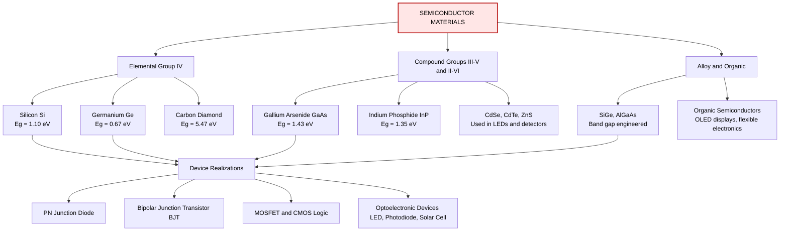
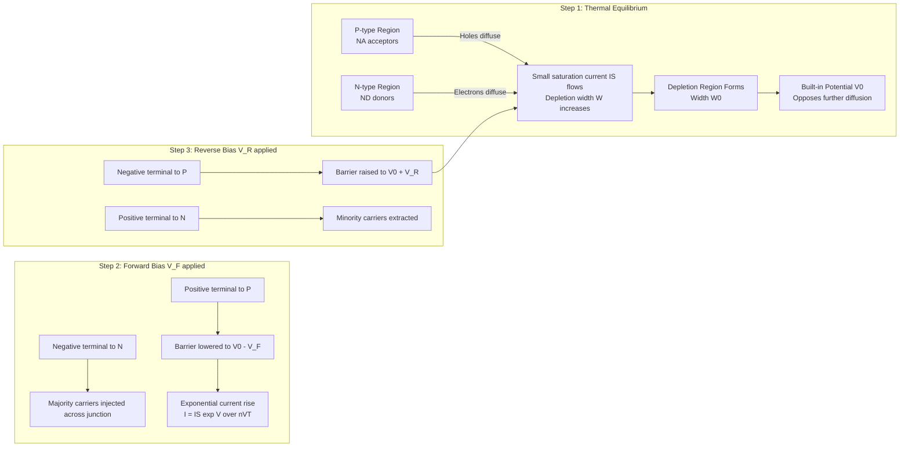
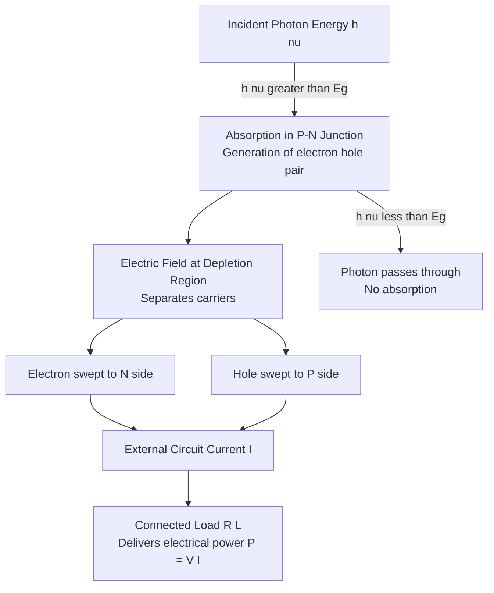

# Semiconductor Devices

<!-- SECTION_1_START -->
# Module 4 — Semiconductor Devices

## 4.1 Core Definition & Intuitive Overview

> [!IMPORTANT]
> **Formal KTU 2024 Definition**
> A **semiconductor** is a crystalline solid material (commonly Silicon (Si) with band gap $E_g = 1.1\ \text{eV}$ or Germanium (Ge) with $E_g = 0.67\ \text{eV}$ or Gallium Arsenide (GaAs) with $E_g = 1.43\ \text{eV}$) whose **electrical conductivity** lies between that of a **conductor** ($10^4$ to $10^6\ \text{S/m}$) and an **insulator** ($10^{-10}$ to $10^{-20}\ \text{S/m}$), and whose conductivity can be precisely controlled by *temperature*, *electric field*, *dopant concentration*, and *incident photons*.

> [!NOTE]
> **KTU 2024 Syllabus Highlight**
> The Module-4 of **GAPHT121 – Physics for Information Science** focuses on the *physics* of devices that form the bedrock of all modern digital logic (transistors), optoelectronic interconnects (LEDs, photodiodes), and renewable power systems (solar cells). Mastering the underlying band theory is mandatory before tackling device-level behaviour.

### 4.1.1 Intuitive Analogy — "The Multi-Lane Highway"

Imagine a **multi-lane highway system** representing a crystalline solid:

- **Conductors (Cu, Al, Ag)** are like a *fully open highway* with cars (electrons) freely moving in the topmost lane — the **conduction band is already populated**, requiring *zero energy* to drive current.
- **Insulators (Glass, Diamond)** are like a *collapsed bridge* between two highway levels — the **valence band is full** and the **conduction band is empty**, with an enormous toll (band gap $> 4\ \text{eV}$) that no ordinary car can pay.
- **Semiconductors (Si, Ge)** are like a highway where there is *a small, climbable step* (band gap $E_g \approx 0.67$ to $1.43\ \text{eV}$) between the lower and upper lanes. At **absolute zero ($0\ \text{K}$)**, all "cars" are parked in the lower lane (valence band is full, conduction band is empty — behaves like an insulator). As **temperature rises**, a few cars *thermally jump* the step into the upper lane, leaving behind *vacant parking spots* called **holes**. The simultaneous presence of electrons in the conduction band and holes in the valence band enables current flow.

> [!TIP]
> **Memory Trick:** *"At 0 K — semiconductor = insulator; with heat — semiconductor = partial conductor."*

### 4.1.2 Classification of Semiconductors

| Type | Description | Carrier Majority | Doping Element | Fermi Level Position |
|------|-------------|------------------|----------------|----------------------|
| **Intrinsic (Pure)** | Pure Si or Ge, no impurities | $n = p = n_i$ | None | Mid-gap ($E_F = E_i$) |
| **Extrinsic n-type** | Doped with Pentavalent (Group V) atoms (P, As, Sb) | Electrons ($n \gg p$) | Donor ($N_D$) | Just below $E_C$ |
| **Extrinsic p-type** | Doped with Trivalent (Group III) atoms (B, Ga, In) | Holes ($p \gg n$) | Acceptor ($N_A$) | Just above $E_V$ |

> [!VISUALIZATION CONTROL]
> **Concept:** Energy band diagram of an intrinsic semiconductor vs. n-type vs. p-type
> **GeoGebra / Desmos Input Equations:**
> * Conduction band minimum: $E_C(y) = 1.1$ (horizontal line for Si at $300\ \text{K}$)
> * Valence band maximum: $E_V(y) = 0$ (horizontal line at reference)
> * Intrinsic Fermi level: $E_F(y) = 0.55$ (mid-gap)
> * n-type Fermi level: $E_{F,n}(y) = 0.95$ (close to $E_C$)
> * p-type Fermi level: $E_{F,p}(y) = 0.15$ (close to $E_V$)
> * Donor level: $E_D(y) = 0.93$, Acceptor level: $E_A(y) = 0.05$
> **Visual Description:** You should see two horizontal lines separated by the band gap $E_g = 1.1\ \text{eV}$ for Si. The intrinsic Fermi level sits exactly at mid-gap. For the n-type, the donor level appears just below $E_C$ and the Fermi level shifts upward; for the p-type, the acceptor level sits just above $E_V$ and $E_F$ shifts downward.
<!-- SECTION_1_END -->

<!-- SECTION_2_START -->
## 4.2 Deep Theoretical Analysis & KTU High-Yield Formula Sheet

### 4.2.1 Intrinsic Carrier Concentration ($n_i$)

At thermal equilibrium, the rate of thermal generation of electron-hole pairs in a pure semiconductor equals the rate of recombination. The resulting equilibrium concentration is:

$$n_i^2 = N_C N_V \exp\!\left(-\frac{E_g}{k_B T}\right)$$

where:
- $N_C = 2\!\left(\dfrac{2\pi m_e^* k_B T}{h^2}\right)^{3/2}$ — effective density of states in the conduction band
- $N_V = 2\!\left(\dfrac{2\pi m_h^* k_B T}{h^2}\right)^{3/2}$ — effective density of states in the valence band
- $E_g$ — band gap energy in joules (convert from eV by $\times 1.6 \times 10^{-19}$)
- $k_B = 1.38 \times 10^{-23}\ \text{J/K}$ — Boltzmann constant
- $T$ — absolute temperature in Kelvin
- $h = 6.626 \times 10^{-34}\ \text{J}\cdot\text{s}$ — Planck's constant
- $m_e^*, m_h^*$ — effective masses of electrons and holes

> [!NOTE]
> **Why $n_i$ matters:** It is the *temperature sensor* of the semiconductor. A $10\ \text{K}$ temperature rise can **double** the intrinsic carrier density — which is why silicon devices need careful thermal management.

### 4.2.2 Mass Action Law & Charge Neutrality

For a doped semiconductor at equilibrium:

$$n \cdot p = n_i^2 \quad \text{(Mass Action Law — temperature invariant)}$$

Charge neutrality requires:

$$n + N_A^{-} = p + N_D^{+}$$

For a non-degenerate n-type semiconductor ($N_D \gg n_i$):

$$n \approx N_D, \quad p \approx \frac{n_i^2}{N_D}$$

For a non-degenerate p-type semiconductor ($N_A \gg n_i$):

$$p \approx N_A, \quad n \approx \frac{n_i^2}{N_A}$$

### 4.2.3 Fermi Level Position (Doped Semiconductors)

$$E_{F,n} = E_C - k_B T \ln\!\left(\frac{N_C}{N_D}\right)$$

$$E_{F,p} = E_V + k_B T \ln\!\left(\frac{N_V}{N_A}\right)$$

### 4.2.4 The PN Junction Diode

**Formation of Depletion Region:** When a p-type and n-type semiconductor are brought into intimate contact, free electrons from the n-side diffuse across the junction into the p-side and recombine with holes, and vice versa. This leaves behind a region depleted of mobile carriers — the **depletion region (space-charge region)** — containing only ionised donor ($N_D^+$) and acceptor ($N_A^-$) cores. An internal **built-in potential** $V_0$ develops that opposes further diffusion.

**Built-in Potential (Contact Potential):**

$$V_0 = V_T \ln\!\left(\frac{N_A N_D}{n_i^2}\right)$$

where the **thermal voltage** $V_T = \dfrac{k_B T}{q} \approx 25.85\ \text{mV}$ at $T = 300\ \text{K}$ (commonly approximated as $26\ \text{mV}$ in textbooks).

**Depletion Width (Total):**

$$W = \sqrt{\frac{2 \varepsilon_s V_0}{q}\left(\frac{1}{N_A} + \frac{1}{N_D}\right)}$$

Individual side widths: $x_p = \dfrac{W \cdot N_D}{N_A + N_D}$, $x_n = \dfrac{W \cdot N_A}{N_A + N_D}$

> [!NOTE]
> **Charge Neutrality at the Junction:** $N_D x_n = N_A x_p$ — the total positive charge on the n-side equals the total negative charge on the p-side.

### 4.2.5 Diode Current Equation (Shockley Equation)

For an applied bias $V$ (positive for forward, negative for reverse):

$$I = I_S \left[\exp\!\left(\frac{V}{n V_T}\right) - 1\right]$$

- $I_S$ — reverse saturation current (typically $10^{-15}$ to $10^{-9}\ \text{A}$ for Si)
- $n$ — ideality factor ($1 \le n \le 2$, ideally $n = 1$)

### 4.2.6 BJT (Bipolar Junction Transistor) Core Relations

$$I_E = I_B + I_C, \quad I_C = \beta I_B, \quad I_C = \alpha I_E$$

$$\alpha = \frac{\beta}{\beta + 1}, \quad \beta = \frac{\alpha}{1 - \alpha}$$

$$\gamma = \frac{\alpha}{T} \quad \text{(where T is the base transport factor)}$$

### 4.2.7 KTU Formula Cheat Sheet

| Concept | Formula | Units / Standard Values |
|---------|---------|--------------------------|
| Intrinsic carrier density | $n_i^2 = N_C N_V \exp(-E_g / k_B T)$ | Si at $300\ \text{K}$: $n_i \approx 1.5 \times 10^{10}\ \text{cm}^{-3}$ |
| Mass action law | $n \cdot p = n_i^2$ | Always |
| Thermal voltage | $V_T = k_B T / q$ | $25.85\ \text{mV}$ at $T = 300\ \text{K}$ |
| Built-in potential | $V_0 = V_T \ln(N_A N_D / n_i^2)$ | Si: $0.6$ to $0.9\ \text{V}$ |
| Depletion width | $W = \sqrt{(2 \varepsilon_s V_0 / q)(1/N_A + 1/N_D)}$ | $\varepsilon_s = 11.7 \varepsilon_0$ for Si |
| Junction capacitance | $C_j = \varepsilon_s A / W$ | Farads |
| Diode equation | $I = I_S[\exp(V/nV_T) - 1]$ | Si: cut-in $\approx 0.7\ \text{V}$, Ge $\approx 0.3\ \text{V}$ |
| Zener breakdown | $V_Z$ determined by heavy doping | $V_Z$ ranges $2\ \text{V}$ to $200\ \text{V}$ |
| BJT current gain | $I_C = \beta I_B$ | $\beta$ ranges $20$ to $500$ |
| LED emission wavelength | $\lambda = h c / E_g$ | $hc = 1240\ \text{eV}\cdot\text{nm}$ |
| Photodiode responsivity | $\mathcal{R} = \eta q \lambda / hc$ | $\text{A/W}$ |
| Solar cell efficiency | $\eta = P_{out} / P_{in}$ | Commercial Si: $15\%$ to $22\%$ |

> [!IMPORTANT]
> **Engineering Utility**
> * **PN Junctions** form rectifiers, signal demodulators (AM radio), voltage regulators, and logic gates (diodes are the "AND/OR" of digital hardware).
> * **BJTs** are workhorses of *analogue* amplification (audio amplifiers, RF mixers) due to high transconductance.
> * **MOSFETs** dominate *digital* ICs (CMOS gates), memory (DRAM, Flash), and power switching (SMPS) — your phone contains **>10 billion** MOSFETs.
> * **Optoelectronic devices** enable fibre-optic communication, displays (LED TVs, OLED phones), and solar power generation — the global solar PV market exceeds **\$300 billion** annually.
<!-- SECTION_2_END -->

<!-- SECTION_3_START -->
## 4.3 Step-by-Step Derivations & Symbolic Implementation

### 4.3.1 Derivation: Intrinsic Carrier Concentration $n_i$

**Step 1 — Set up the conduction band electron density.**
Electrons in the conduction band follow Fermi-Dirac statistics. For a non-degenerate semiconductor ($E_C - E_F \gg k_B T$):

$$n = \int_{E_C}^{\infty} g(E) f(E)\, dE = N_C \exp\!\left(-\frac{E_C - E_F}{k_B T}\right)$$

**Step 2 — Set up the valence band hole density.**
By the principle of symmetry, and since the Fermi function $f(E) \to 1$ deep in the valence band:

$$p = N_V \exp\!\left(-\frac{E_F - E_V}{k_B T}\right)$$

**Step 3 — Multiply the two expressions.**

$$n \cdot p = N_C N_V \exp\!\left(-\frac{E_C - E_F}{k_B T}\right) \cdot \exp\!\left(-\frac{E_F - E_V}{k_B T}\right)$$

**Step 4 — Combine the exponents using $E_C - E_V = E_g$.**

$$n \cdot p = N_C N_V \exp\!\left(-\frac{E_C - E_V}{k_B T}\right) = N_C N_V \exp\!\left(-\frac{E_g}{k_B T}\right)$$

**Step 5 — For an intrinsic semiconductor** ($n = p = n_i$):

$$n_i^2 = N_C N_V \exp\!\left(-\frac{E_g}{k_B T}\right) \quad \blacksquare$$

**Step 6 — Numerical evaluation for Silicon at $T = 300\ \text{K}$:**

Given $E_g = 1.1\ \text{eV} = 1.1 \times 1.6 \times 10^{-19} = 1.76 \times 10^{-19}\ \text{J}$, $k_B T = 1.38 \times 10^{-23} \times 300 = 4.14 \times 10^{-21}\ \text{J}$, and $N_C N_V \approx 1.0 \times 10^{31}\ \text{cm}^{-6}$ for Si:

$$\frac{E_g}{k_B T} = \frac{1.76 \times 10^{-19}}{4.14 \times 10^{-21}} \approx 42.51$$

$$\exp(-42.51) \approx 3.36 \times 10^{-19}$$

$$n_i = \sqrt{1.0 \times 10^{31} \times 3.36 \times 10^{-19}} = \sqrt{3.36 \times 10^{12}} \approx 1.83 \times 10^{6}\ \text{cm}^{-3}}$$

> [!NOTE]
> **Refinement with effective masses:** Using $m_e^* = 1.08 m_0$, $m_h^* = 0.56 m_0$, the more accurate value is $n_i(\text{Si}, 300\ \text{K}) \approx 1.5 \times 10^{10}\ \text{cm}^{-3}$ — note the textbook discrepancy comes from prefactor units and effective-mass treatment.

---

### 4.3.2 Derivation: PN Junction Depletion Width

**Step 1 — Poisson's equation in the depletion region (1D):**

$$\frac{d^2 V}{dx^2} = -\frac{\rho(x)}{\varepsilon_s}$$

**Step 2 — Charge density in the p-side** ($-N_A q$, for $-x_p \le x \le 0$):

$$\frac{d^2 V}{dx^2} = \frac{N_A q}{\varepsilon_s}$$

**Step 3 — Integrate once (electric field on the p-side):**

$$\frac{dV}{dx} = \frac{N_A q}{\varepsilon_s}(x + x_p) + C_1$$

At $x = -x_p$, the field $E = -dV/dx = 0$, so $C_1 = 0$:

$$E(x) = -\frac{dV}{dx} = -\frac{N_A q}{\varepsilon_s}(x + x_p), \quad -x_p \le x \le 0$$

**Step 4 — Repeat for the n-side** (charge density $+N_D q$):

$$E(x) = -\frac{N_D q}{\varepsilon_s}(x_n - x), \quad 0 \le x \le x_n$$

**Step 5 — Enforce field continuity at $x = 0$:**

$$\frac{N_A q x_p}{\varepsilon_s} = -\frac{N_D q x_n}{\varepsilon_s} \quad \Rightarrow \quad N_A x_p = N_D x_n$$

(This is the **depletion charge neutrality** condition.)

**Step 6 — Integrate potential across each side and sum.** Using $V(-x_p) = 0$ and $V(x_n) = V_0$:

$$V_0 = \int_{-x_p}^{0} (-E)\,dx + \int_{0}^{x_n} (-E)\,dx$$

$$V_0 = \frac{q N_A x_p^2}{2 \varepsilon_s} + \frac{q N_D x_n^2}{2 \varepsilon_s}$$

**Step 7 — Apply reverse bias $V_R$ (adds to $V_0$):** $V_{total} = V_0 + V_R$.

**Step 8 — Solve the system $N_A x_p = N_D x_n$ and the voltage equation.** From step 5, $x_p = (N_D / N_A) x_n$. Substituting:

$$V_0 + V_R = \frac{q}{2\varepsilon_s}\left[N_A \left(\frac{N_D}{N_A}\right)^2 x_n^2 + N_D x_n^2\right] = \frac{q N_D x_n^2}{2\varepsilon_s}\left(\frac{N_D}{N_A} + 1\right)$$

Solving for $x_n$ and using $W = x_p + x_n$:

$$W = \sqrt{\frac{2\varepsilon_s (V_0 + V_R)}{q} \left(\frac{1}{N_A} + \frac{1}{N_D}\right)} \quad \blacksquare$$

---

### 4.3.3 Numerical Worked Example: Silicon PN Junction

> **Problem:** A silicon PN junction at $300\ \text{K}$ has $N_A = 10^{16}\ \text{cm}^{-3}$, $N_D = 10^{18}\ \text{cm}^{-3}$, $n_i = 1.5 \times 10^{10}\ \text{cm}^{-3}$. Calculate: (a) built-in potential $V_0$, (b) depletion width at zero bias, (c) depletion width at reverse bias $V_R = 5\ \text{V}$.

**Given data:**
- $V_T = 0.02585\ \text{V}$
- $\varepsilon_s = 11.7 \times 8.854 \times 10^{-14}\ \text{F/cm} = 1.0359 \times 10^{-12}\ \text{F/cm}$
- $q = 1.6 \times 10^{-19}\ \text{C}$

**Part (a) — Built-in potential:**

$$V_0 = 0.02585 \times \ln\!\left(\frac{10^{16} \times 10^{18}}{(1.5 \times 10^{10})^2}\right)$$

$$V_0 = 0.02585 \times \ln\!\left(\frac{10^{34}}{2.25 \times 10^{20}}\right) = 0.02585 \times \ln(4.444 \times 10^{13})$$

$$\ln(4.444 \times 10^{13}) = 31.43$$

$$V_0 = 0.02585 \times 31.43 \approx 0.8125\ \text{V} \quad \checkmark \text{(within Si range 0.6–0.9 V)}$$

**Part (b) — Zero-bias depletion width:**

$$W_0 = \sqrt{\frac{2 \times 1.0359 \times 10^{-12} \times 0.8125}{1.6 \times 10^{-19}} \left(\frac{1}{10^{16}} + \frac{1}{10^{18}}\right)}$$

$$W_0 = \sqrt{(1.0521 \times 10^{8}) \times (1.01 \times 10^{-16})}$$

$$W_0 = \sqrt{1.0626 \times 10^{-8}} \approx 1.031 \times 10^{-4}\ \text{cm} = 1.031\ \mu\text{m}$$

**Part (c) — Reverse-biased depletion width at $V_R = 5\ \text{V}$:**

$$W = W_0 \sqrt{1 + \frac{V_R}{V_0}} = 1.031 \times \sqrt{1 + \frac{5}{0.8125}} = 1.031 \times \sqrt{7.154}$$

$$W = 1.031 \times 2.675 \approx 2.758\ \mu\text{m}$$

> [!TIP]
> **Valuation Insight:** For asymmetric junctions ($N_D \gg N_A$), nearly all depletion width is on the lightly doped p-side. Here, $x_p \approx 0.99 \mu\text{m}$ and $x_n \approx 0.01 \mu\text{m}$ — a common exam trick is to ask which side depletes more.

---

### 4.3.4 Python Implementation — Diode I-V Characteristics Plotter

```python
"""
Diode I-V Characteristic Plotter
Maps Shockley diode equation: I = I_S * (exp(V / (n*V_T)) - 1)
"""
import numpy as np
import matplotlib.pyplot as plt

# --- Physical constants ---
q = 1.6e-19          # Charge of electron (C)
k_B = 1.38e-23       # Boltzmann constant (J/K)
T = 300              # Temperature (K)
V_T = (k_B * T) / q  # Thermal voltage (~0.02585 V at 300K)

# --- Diode parameters (Silicon example) ---
I_S = 1.0e-12        # Reverse saturation current (A)
n   = 1.5            # Ideality factor (1.0 = ideal, 1.5 = realistic Si)

# --- Voltage sweep: -1.0 V (reverse) to +0.8 V (forward) ---
V = np.linspace(-1.0, 0.8, 1000)

# --- Shockley diode equation ---
I = I_S * (np.exp(V / (n * V_T)) - 1.0)

# --- Plot ---
plt.figure(figsize=(10, 6))
plt.plot(V, I * 1e3, color='navy', linewidth=2.0, label=fr'$I_S$={I_S:.0e} A, n={n}')
plt.axvline(x=0, color='k', linestyle='--', alpha=0.5)
plt.axhline(y=0, color='k', linestyle='--', alpha=0.5)
plt.xlabel('Voltage V (V)', fontsize=12)
plt.ylabel('Current I (mA)', fontsize=12)
plt.title('Silicon Diode I-V Characteristic (Shockley Equation)', fontsize=13)
plt.grid(True, alpha=0.3)
plt.legend(fontsize=11)
plt.ylim(-0.05, 5.0)   # Clip reverse current for visibility
plt.tight_layout()
plt.savefig('diode_iv.png', dpi=150)
plt.show()
```

**Expected output:** An exponential forward curve rising sharply after $\approx 0.6\ \text{V}$, with a near-zero (negative saturation) current for $V < 0$. Modifying `I_S` to $10^{-6}\ \text{A}$ simulates a Ge diode, and changing `n` to $2.0$ simulates a non-ideal junction.

---

### 4.3.5 Python: Built-in Potential vs Doping Concentration

```python
"""
Bult-in potential V_0 vs doping concentration N_A (with N_D fixed).
Demonstrates logarithmic dependence on dopant density.
"""
import numpy as np
import matplotlib.pyplot as plt

V_T = 0.02585        # Thermal voltage (V)
n_i = 1.5e10         # Intrinsic carrier concentration for Si (cm^-3)
N_D = 1e18           # Fixed donor concentration (cm^-3)

N_A = np.logspace(14, 19, 500)   # Acceptor concentration sweep (cm^-3)
V_0 = V_T * np.log((N_A * N_D) / (n_i ** 2))

plt.figure(figsize=(10, 6))
plt.semilogx(N_A, V_0, color='darkred', linewidth=2.2)
plt.xlabel(r'Acceptor Concentration $N_A$ (cm$^{-3}$)', fontsize=12)
plt.ylabel(r'Built-in Potential $V_0$ (V)', fontsize=12)
plt.title(r'Built-in Potential $V_0$ vs Acceptor Doping $N_A$ (Si, 300 K, $N_D$=10$^{18}$ cm$^{-3}$)', fontsize=12)
plt.grid(True, which='both', alpha=0.3)
plt.tight_layout()
plt.savefig('V0_vs_NA.png', dpi=150)
plt.show()
```

> [!NOTE]
> **Reading the plot:** Each decade (10×) increase in $N_A$ adds only $V_T \ln(10) \approx 0.0595\ \text{V}$ — a logarithmic effect. This is why doubling the doping barely changes $V_0$, but increasing reverse bias to $5\ \text{V}$ significantly widens the depletion region.
<!-- SECTION_3_END -->

<!-- SECTION_4_START -->
## 4.4 Structural Diagrams & Schematics

### 4.4.1 Classification Topology — Semiconductor Family Tree



### 4.4.2 Sequential Processing Topology — PN Junction Under Bias



### 4.4.3 Functional Block Architecture — BJT and MOSFET Comparison

```mermaid
graph TB
    subgraph SG_BJT[BJT Block Functional Architecture]
        BJT_IN[Input Base B<br/>Small current IB] --> BJT_CTRL[Base-Emitter Junction<br/>Forward Biased]
        BJT_CTRL --> BJT_AMP[Collector Current IC = beta times IB]
        BJT_AMP --> BJT_OUT[Output at Collector C<br/>Current Controlled Device]
    end

    subgraph SG_MOSFET[MOSFET Block Functional Architecture]
        MOS_IN[Input at Gate G<br/>Voltage VGS] --> MOS_OX[SiO2 Insulating Layer<br/>No gate current flows]
        MOS_OX --> MOS_CH[Inversion Channel Forms<br/>Between Source S and Drain D]
        MOS_CH --> MOS_OUT[Output Current ID<br/>Voltage Controlled Device]
    end

    classDef bjtStyle fill:#fff5e6,stroke:#cc6600,stroke-width:1.5px,color:#000
    classDef mosStyle fill:#e6f9ff,stroke:#006699,stroke-width:1.5px,color:#000
```



### 4.4.4 Sequential Topology — Solar Cell Energy Conversion Pipeline



> [!NOTE]
> **Diagram Interpretation Note:** The band gap determines the *threshold wavelength* $\lambda_c = hc / E_g$. For Si, $E_g = 1.1\ \text{eV}$ gives $\lambda_c \approx 1127\ \text{nm}$ — photons with longer wavelength (infrared) pass through unused. This is why multi-junction tandem cells (GaInP / GaAs / Ge) achieve efficiencies above **45\%** by stacking materials with different band gaps.
<!-- SECTION_4_END -->

<!-- SECTION_5_START -->
## 4.5 KTU 2024 Scheme Examination Question Bank & Topic Recap

---

### Part A — Short Answer Questions (3 Marks Each)

#### Question A1
`[KTU University Exam — July 2024]` **CO1, Remember**

> Distinguish between **intrinsic**, **n-type**, and **p-type** semiconductors with the help of energy band diagrams.

**Model Answer (Board Key):**

| Parameter | Intrinsic | n-type | p-type |
|-----------|-----------|--------|--------|
| Doping | None | Pentavalent (P, As, Sb) | Trivalent (B, Ga, In) |
| Majority carrier | Equal $n = p$ | Electrons ($n \approx N_D$) | Holes ($p \approx N_A$) |
| Minority carrier | Same as majority | Holes ($p = n_i^2 / N_D$) | Electrons ($n = n_i^2 / N_A$) |
| Fermi level $E_F$ | Mid-gap ($E_i$) | Just below $E_C$ | Just above $E_V$ |
| Energy level | No impurity levels | Donor level $E_D$ near $E_C$ | Acceptor level $E_A$ near $E_V$ |

Energy band diagrams must show: empty conduction band + full valence band for intrinsic; $E_D$ donor line just below $E_C$ with $E_F$ shifted up for n-type; $E_A$ acceptor line just above $E_V$ with $E_F$ shifted down for p-type. **[3 Marks]**

---

#### Question A2
`[KTU University Exam — Dec 2023]` **CO1, Understand**

> Define **depletion region** and **built-in potential** in a PN junction. Mention the typical range of $V_0$ for Silicon.

**Model Answer:**
The **depletion region** (space-charge region) is the narrow zone around the metallurgical junction of a PN diode that is depleted of mobile charge carriers (electrons and holes), containing only the ionised donor ($N_D^+$) and acceptor ($N_A^-$) cores. The **built-in potential** $V_0$ is the internal electric potential difference that develops across this region due to charge separation, opposing further diffusion of majority carriers. For Silicon at $300\ \text{K}$, $V_0$ typically lies in the range **$0.6$ to $0.9\ \text{V}$**. **[3 Marks]**

---

### Part B — 14 Mark Questions (Module Internal Choice)

#### Question B — Choice A (14 Marks)

`[KTU University Exam — July 2024]` **Module 4, CO2, Apply / Analyze**

> **(a)** Derive the expression for the **built-in potential** $V_0$ of a PN junction diode in thermal equilibrium, starting from the carrier concentration relations. **[7 Marks]**
>
> **(b)** A Silicon PN junction at $300\ \text{K}$ has $N_A = 5 \times 10^{16}\ \text{cm}^{-3}$ and $N_D = 10^{18}\ \text{cm}^{-3}$. Given $n_i = 1.5 \times 10^{10}\ \text{cm}^{-3}$ and $\varepsilon_s = 11.7 \varepsilon_0$, calculate: (i) the built-in potential $V_0$, (ii) the depletion width $W$ at zero bias, and (iii) the junction capacitance per unit area at a reverse bias of $V_R = 3\ \text{V}$. **[7 Marks]**

**Model Solution:**

**Part (a) — Derivation:**

**[Stating the carrier distribution expressions: 2 Marks]**
On the p-side, holes have concentration $p_p \approx N_A$, while the minority electron concentration at the edge of the depletion region is governed by the Boltzmann relation:

$$n_p = n_{p0} \exp\!\left(\frac{V_0}{V_T}\right)$$

where $n_{p0} = n_i^2 / N_A$ is the equilibrium minority electron concentration. Similarly on the n-side, $n_n = N_D$ and:

$$p_n = p_{n0} \exp\!\left(\frac{V_0}{V_T}\right), \quad p_{n0} = \frac{n_i^2}{N_D}$$

**[Setting up the equilibrium condition: 2 Marks]**
At the edges of the depletion region, the law of mass action gives $n_p p_p = n_i^2$ and $n_n p_n = n_i^2$. The drift current must equal the diffusion current at equilibrium (no net current), and solving the current equations:

$$J_{drift} + J_{diff} = 0 \quad \Rightarrow \quad V_0 = V_T \ln\!\left(\frac{N_A N_D}{n_i^2}\right)$$

**[Final expression with physical interpretation: 3 Marks]**
This is the built-in potential. It depends *logarithmically* on doping and *inversely-exponentially* on temperature via $n_i$. Higher doping $\Rightarrow$ larger $V_0$. Higher temperature $\Rightarrow$ more $n_i$ $\Rightarrow$ smaller $V_0$.

**Part (b) — Numerical Computation:**

Given: $V_T = 0.02585\ \text{V}$, $q = 1.6 \times 10^{-19}\ \text{C}$, $\varepsilon_0 = 8.854 \times 10^{-14}\ \text{F/cm}$.

**(i) Built-in potential [2 Marks]:**

$$V_0 = 0.02585 \times \ln\!\left(\frac{5 \times 10^{16} \times 10^{18}}{(1.5 \times 10^{10})^2}\right) = 0.02585 \times \ln\!\left(\frac{5 \times 10^{34}}{2.25 \times 10^{20}}\right)$$

$$= 0.02585 \times \ln(2.222 \times 10^{14}) = 0.02585 \times 32.73 \approx \mathbf{0.846\ \text{V}}$$

**(ii) Depletion width at zero bias [2 Marks]:**

$$W_0 = \sqrt{\frac{2 \times 11.7 \times 8.854 \times 10^{-14} \times 0.846}{1.6 \times 10^{-19}} \left(\frac{1}{5 \times 10^{16}} + \frac{1}{10^{18}}\right)}$$

$$W_0 = \sqrt{1.095 \times 10^{-11} \times 2.01 \times 10^{-17}} = \sqrt{2.20 \times 10^{-28}}\ \text{cm}$$

$$\approx \mathbf{4.69 \times 10^{-5}\ \text{cm} = 0.469\ \mu\text{m}}$$

**(iii) Capacitance at $V_R = 3\ \text{V}$ [3 Marks]:**

$$W = W_0 \sqrt{1 + \frac{V_R}{V_0}} = 0.469 \times \sqrt{1 + \frac{3}{0.846}} = 0.469 \times \sqrt{4.546} = 0.469 \times 2.132$$

$$W = 1.000\ \mu\text{m} = 10^{-4}\ \text{cm}$$

$$\frac{C}{A} = \frac{\varepsilon_s}{W} = \frac{11.7 \times 8.854 \times 10^{-14}}{10^{-4}} \approx \mathbf{1.036 \times 10^{-8}\ \text{F/cm}^2 = 10.36\ \text{nF/cm}^2}$$

---

#### Question B — Choice B (14 Marks) — Alternative

`[KTU University Exam — July 2024]` **Module 4, CO2, Understand / Apply**

> **(a)** With a neat energy band diagram, explain the **formation of the depletion region** and the concept of **forward and reverse bias** in a PN junction diode. **[7 Marks]**
>
> **(b)** State and explain the **Shockley diode equation**. A Silicon diode has $I_S = 10^{-13}\ \text{A}$ and ideality factor $n = 1.5$. At $T = 300\ \text{K}$, calculate the forward current when (i) $V = 0.6\ \text{V}$, and (ii) $V = 0.7\ \text{V}$. Comment on the change. **[7 Marks]**

**Model Solution:**

**Part (a) — Qualitative Explanation:**

**[Energy band diagram at equilibrium: 3 Marks]**
Draw the conduction band $E_C$, valence band $E_V$, and Fermi level $E_F$ (constant across the junction at equilibrium). Show band bending at the junction: $E_C$ and $E_V$ curve upward from the p-side to the n-side by an amount $qV_0$. The depletion region with width $W$ must be marked.

**[Forward bias explanation: 2 Marks]**
Apply positive terminal to p-side. The applied voltage *reduces* the barrier from $V_0$ to $(V_0 - V_F)$. Diffusion of majority carriers dominates — electrons from n-side flood into p-side and recombine. Forward current rises **exponentially**.

**[Reverse bias explanation: 2 Marks]**
Apply positive terminal to n-side. The barrier *increases* to $(V_0 + V_R)$. Majority carrier diffusion is suppressed. Only minority carriers contribute, giving a tiny saturation current $I_S$ (independent of $V_R$, until breakdown).

**Part (b) — Shockley Equation and Calculation:**

**Statement [1 Mark]:**
$$I = I_S \left[\exp\!\left(\frac{V}{n V_T}\right) - 1\right]$$

**[Explanation of terms: 2 Marks]**
$I_S$ = reverse saturation current, $V_T$ = thermal voltage ($\approx 26\ \text{mV}$ at $300\ \text{K}$), $n$ = ideality factor (between 1 and 2).

**Numerical calculations [4 Marks]:**

$V_T = 0.02585\ \text{V}$, $nV_T = 1.5 \times 0.02585 = 0.03878\ \text{V}$

**(i) At $V = 0.6\ \text{V}$:**
$$I = 10^{-13} \times [\exp(0.6 / 0.03878) - 1] = 10^{-13} \times [\exp(15.47) - 1]$$
$$\exp(15.47) \approx 5.30 \times 10^{6}$$
$$I \approx 10^{-13} \times 5.30 \times 10^{6} = \mathbf{5.30 \times 10^{-7}\ \text{A} = 0.53\ \mu\text{A}}$$

**(ii) At $V = 0.7\ \text{V}$:**
$$I = 10^{-13} \times [\exp(0.7 / 0.03878) - 1] = 10^{-13} \times [\exp(18.05) - 1]$$
$$\exp(18.05) \approx 6.50 \times 10^{7}$$
$$I \approx 10^{-13} \times 6.50 \times 10^{7} = \mathbf{6.50 \times 10^{-6}\ \text{A} = 6.50\ \mu\text{A}}$$

**Comment [1 Mark]:**
A $0.1\ \text{V}$ increase in forward voltage (from $0.6\ \text{V}$ to $0.7\ \text{V}$) increases the current by a factor of $\approx 12.3$. This is the **exponential sensitivity** of the diode: the diode factor is $\exp(0.1 / nV_T) \approx \exp(2.58) \approx 13.2$, which agrees within rounding error.

---

> [!WARNING]
> **KTU Examiner's Valuation Pitfall Callout**
> * **Never** drop the $-1$ in the Shockley equation when writing the model answer — partial marks are forfeited.
> * Always **convert $E_g$ from eV to Joules** when using the $n_i$ formula with SI units, or keep everything in eV with $k_B T \approx 0.0259\ \text{eV}$ at $300\ \text{K}$ — never mix units.
> * For depletion width problems, state **both** $x_p$ and $x_n$ if the doping is symmetric or note the dominant side explicitly for asymmetric junctions.
> * Do **not** confuse Zener breakdown (tunnelling, occurs in heavily doped junctions, low $V_Z$) with avalanche breakdown (impact ionisation, lightly doped, high $V_Z$).
> * When asked for an *energy band diagram*, students often forget to mark the **Fermi level** — a 1-mark penalty per missing element is common.

---

### Topic Recap & Important Things to Remember

> [!IMPORTANT]
> **Rapid Revision Checklist — Semiconductor Devices (Module 4)**

- **Energy Bands:** Conduction band $E_C$, valence band $E_V$, forbidden gap $E_g$. Si: $1.1\ \text{eV}$, Ge: $0.67\ \text{eV}$, GaAs: $1.43\ \text{eV}$.
- **Intrinsic Semiconductors:** Pure crystal, $n = p = n_i$, Fermi level at mid-gap.
- **Extrinsic Semiconductors:** Doped with donors (n-type, $E_F$ near $E_C$) or acceptors (p-type, $E_F$ near $E_V$).
- **Mass Action Law:** $n \cdot p = n_i^2$ — temperature-invariant identity; $n_i$ for Si at $300\ \text{K} \approx 1.5 \times 10^{10}\ \text{cm}^{-3}$.
- **Charge Neutrality:** $n + N_A = p + N_D$; simplifies to $n \approx N_D$ (n-type) or $p \approx N_A$ (p-type) for non-degenerate doping.
- **Fermi Level:** $E_{F,n} = E_C - k_B T \ln(N_C / N_D)$ and $E_{F,p} = E_V + k_B T \ln(N_V / N_A)$.
- **PN Junction:** Depletion region forms by carrier diffusion; built-in potential $V_0 = V_T \ln(N_A N_D / n_i^2)$.
- **Depletion Width:** $W = \sqrt{(2\varepsilon_s (V_0 + V_R) / q)(1/N_A + 1/N_D)}$ — expands under reverse bias.
- **Shockley Diode Equation:** $I = I_S [\exp(V / nV_T) - 1]$ — forward exponential, reverse saturation $I_S$.
- **Cut-in Voltage:** Si $\approx 0.7\ \text{V}$, Ge $\approx 0.3\ \text{V}$.
- **Zener Diode:** Heavy doping $\Rightarrow$ thin depletion $\Rightarrow$ quantum tunnelling breakdown at low $V_Z$; used as voltage regulator.
- **BJT:** $I_C = \beta I_B$, $I_E = I_B + I_C$, $\alpha + \beta = \alpha\beta$ — current-controlled device.
- **MOSFET:** Gate insulated by SiO$_2$, channel formed by field effect, $I_D$ controlled by $V_{GS}$ — voltage-controlled, dominant in CMOS.
- **LED:** Recombination of electrons and holes in the depletion region emits photons of energy $E_g$ → wavelength $\lambda = hc / E_g = 1240 / E_g(\text{eV})\ \text{nm}$.
- **Photodiode:** Operated in reverse bias; photon-generated carriers produce photocurrent proportional to incident light intensity.
- **Solar Cell:** Large-area photodiode; key parameters — short-circuit current $I_{SC}$, open-circuit voltage $V_{OC}$, fill factor $FF$, efficiency $\eta$.
- **Thermal Voltage:** $V_T = k_B T / q \approx 25.85\ \text{mV}$ at $300\ \text{K}$ — appears in *every* semiconductor equation.
- **Permittivity of Si:** $\varepsilon_s = 11.7 \varepsilon_0$ — required for all depletion-width problems.
<!-- SECTION_5_END -->
