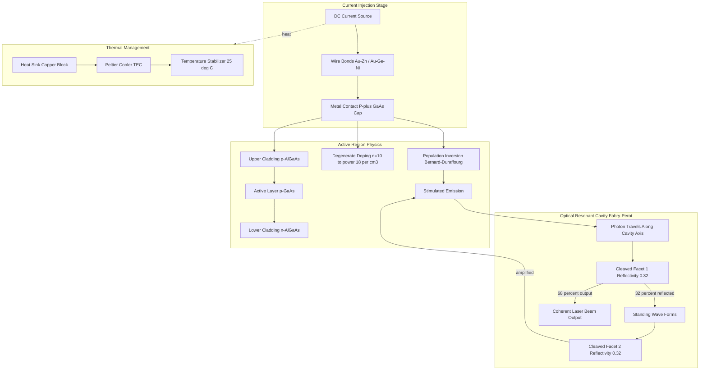
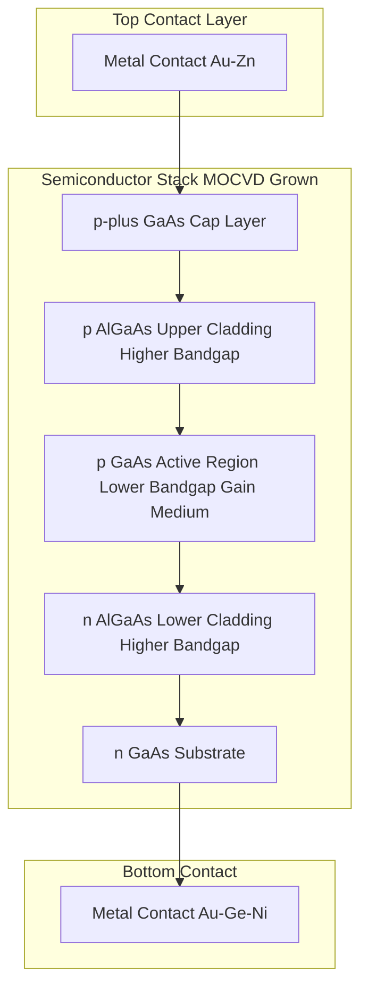
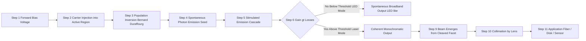
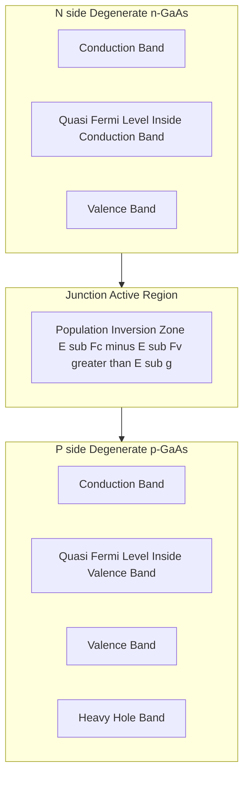
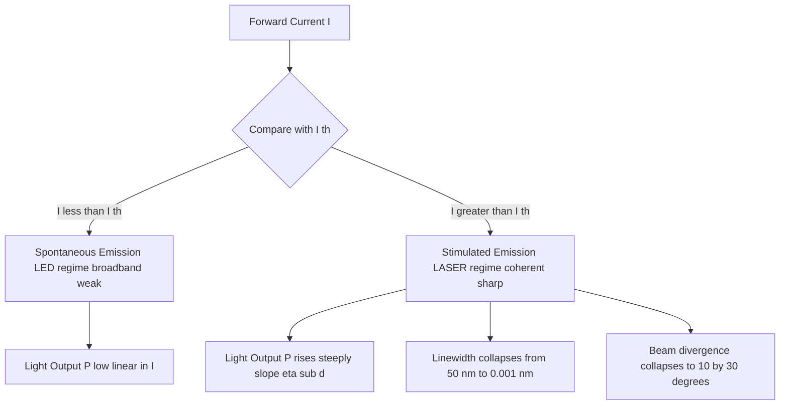

# Semiconductor Laser (Construction and working)

<!-- SECTION_1_START -->
# Semiconductor Laser (Construction and Working)

## 1.1 Formal Definition

> [!IMPORTANT]
> **KTU 2024 Syllabus Definition:**
> A **Semiconductor Laser** (also called a **Laser Diode (LD)** or **Injection Laser Diode (ILD)**) is a solid-state, highly-doped P-N junction device fabricated from a direct bandgap semiconductor (typically **GaAs**, **InGaAs**, **InP**, or **GaN**) that converts injected electrical current directly into **coherent, monochromatic, and highly directional** light through the process of **stimulated emission of radiation**, with optical feedback provided by a resonant Fabry–Pérot cavity formed by cleaved crystal facets.

The term **LASER** stands for **Light Amplification by Stimulated Emission of Radiation**. In a semiconductor laser, the active lasing medium is the **depletion region of a heavily doped P-N junction** itself, which makes it fundamentally different from gas or solid-state bulk lasers.

## 1.2 Conceptual Analogy / Intuition

> [!NOTE]
> **Intuitive Picture (Plain English):**
> Imagine a huge stadium filled with people. A regular LED is like everyone shouting independently — it produces a lot of light, but it is **random, messy, and scattered** (incoherent). Now imagine you have a *conductor* who whispers into each person's ear at *exactly the right moment*, so everyone shouts the *same word, at the same pitch, at the same time* — this produces a *powerful, focused, single-frequency roar* (coherent light). The semiconductor laser is precisely this: a tiny chip where electrons are the people, the injection current is the conductor, and the cleaved mirrors are the walls that trap and amplify the synchronized light wave.

### Why a Semiconductor?
- A semiconductor is the only gain medium where the *electrical pumping* (carrier injection) and the *optical amplification* (stimulated emission) can occur in the **same nanometer-thick layer** simultaneously.
- This makes it the *most efficient* laser ever invented (**wall-plug efficiencies up to 70%**).

## 1.3 Key Engineering Parameters (KTU Board Emphasis)

> [!IMPORTANT]
> **Critical Physical Constants & Metrics (must memorize for KTU 2024):**
> - **Operating Wavelength ($\lambda$):** $\mathbf{635 \text{ nm (red) to 1550 \text{ nm (IR)}}}$ depending on bandgap $E_g$ via $\lambda = \dfrac{hc}{E_g}$.
> - **Threshold Current ($I_{th}$):** Typically **$\mathbf{10\text{–}100 \text{ mA}}$** for edge-emitting diodes.
> - **Threshold Current Density ($J_{th}$):** $\mathbf{10^3\text{–}10^4 \text{ A/cm}^2}$.
> - **Output Power:** $\mathbf{1 \text{ mW to 10 W}}$ (single mode up to $\sim 500$ mW).
> - **Planck's Constant:** $\mathbf{h = 6.626 \times 10^{-34} \text{ J·s}}$.
> - **Speed of Light:** $\mathbf{c = 3 \times 10^8 \text{ m/s}}$.

> [!VISUALIZATION CONTROL]
> **Concept:** Energy band structure of a heavily doped P-N junction (degenerate semiconductor) showing the **Fermi level position** inside the conduction and valence bands.
> **GeoGebra / Desmos Input Equations:**
> * $E_c(x) = -0.5 \cdot \tanh(0.2x)$ (Conduction band edge profile)
> * $E_v(x) = -1.5 - 0.5 \cdot \tanh(0.2x)$ (Valence band edge profile)
> * $E_{F_n} = 0.2$ (Quasi-Fermi level in n-side, inside conduction band)
> * $E_{F_p} = -1.8$ (Quasi-Fermi level in p-side, inside valence band)
> **Visual Description:** The student should observe the bands bending sharply at the junction, with **two horizontal reference lines** ($E_{F_n}$ and $E_{F_p}$) lying *inside* the bands, signalling **degenerate doping** and **population inversion** condition $\Delta E_F = E_{F_n} - E_{F_p} > E_g$.

<!-- SECTION_1_END -->

<!-- SECTION_2_START -->
# Deep Theoretical Analysis & KTU High-Yield Formula Sheet

## 2.1 Operational Concept: From LED to LASER

A light-emitting diode (LED) and a semiconductor laser look physically identical, but the laser has *three additional essential ingredients*:

1. **Degenerate (very high) doping** on both P and N sides ($\sim 10^{18}\text{–}10^{19} \text{ cm}^{-3}$).
2. **An optical resonant cavity** (Fabry–Pérot cavity formed by two parallel cleaved facets acting as mirrors).
3. **Optical confinement** to keep photons in the active region long enough to stimulate further emission.

## 2.2 Construction of a Semiconductor Laser (Edge-Emitting LD)

The construction is a sandwich of semiconductor layers, fabricated using **Molecular Beam Epitaxy (MBE)** or **Metal-Organic Chemical Vapor Deposition (MOCVD)**.

| Layer | Material (Example: GaAs/AlGaAs system) | Function |
| :--- | :--- | :--- |
| **Substrate** | n-GaAs (thickness $\sim 100 \text{ μm}$) | Mechanical support & bottom contact |
| **Lower Cladding** | n-$Al_x Ga_{1-x} As$ (x ≈ 0.3–0.4) | Optical & carrier confinement (lower refractive index) |
| **Active Region** | p-GaAs (undoped or lightly doped, $\sim 0.1\text{–}0.3 \text{ μm}$) | Where lasing occurs (recombination + gain) |
| **Upper Cladding** | p-$Al_x Ga_{1-x} As$ (x ≈ 0.3–0.4) | Optical & carrier confinement (higher bandgap) |
| **Cap Contact** | p+-GaAs | Facilitates ohmic contact on top |
| **Metal Contacts** | Au-Zn (top), Au-Ge-Ni (bottom) | Inject current via wire bonds |
| **Cleaved Facets** | Two parallel (110) crystal planes | Form the Fabry–Pérot mirrors (R ≈ 0.32 for GaAs) |
| **Heat Sink** | Copper block (often with Peltier cooler) | Removes heat; stabilizes output |

> [!NOTE]
> **KTU 2024 — Double Heterojunction (DH) Laser Emphasis:**
> The KTU syllabus specifically focuses on the **Heterojunction Laser** because the homojunction laser (1962) is obsolete. In a **Double Heterojunction (DH) laser**, two different semiconductor materials (e.g., GaAs and AlGaAs) are joined. The lower-bandgap GaAs active layer is sandwiched between two higher-bandgap AlGaAs cladding layers. This creates **both carrier confinement (via the potential well) and optical confinement (via the refractive index step)** simultaneously, reducing threshold current by orders of magnitude.

## 2.3 Working Principle — Step-by-Step Physics

### Step 1: Forward Biasing
A large forward bias is applied across the P-N junction. Electrons from the n-side and holes from the p-side are **injected into the active (depletion) region**.

### Step 2: Achieving Population Inversion
Because both sides are **degenerately doped**, the Fermi level lies **inside** the conduction band on the n-side and **inside** the valence band on the p-side. Under heavy forward bias, the quasi-Fermi levels shift into the junction such that:

> [!IMPORTANT]
> **Bernard–Duraffourg Condition (Population Inversion in Semiconductors):**
> $$\boxed{\Delta E_F = E_{F_n} - E_{F_p} \;\geq\; \hbar\omega \;\geq\; E_g}$$
> This is the semiconductor equivalent of the four-level laser condition. Without this condition, lasing is impossible.

### Step 3: Spontaneous Emission → Stimulated Emission
Initially, a few electron-hole pairs recombine *spontaneously*, emitting photons of energy $h\nu \approx E_g$. These photons travel through the active region and **stimulate** other excited electron-hole pairs to recombine, releasing *identical* photons (same phase, frequency, polarization, and direction). This is the **stimulated emission** cascade.

### Step 4: Optical Amplification — The Fabry–Pérot Cavity
The two end facets (cleaved along the (110) crystallographic plane) act as **partially reflecting mirrors** (GaAs has refractive index $n \approx 3.6$, giving Fresnel reflectivity $R \approx 0.32$). Photons bouncing back and forth between these mirrors build up a standing wave.

### Step 5: Lasing Condition (Threshold)
Lasing begins when the **optical gain** in the active region equals the **total optical losses** (output coupling + free-carrier absorption + scattering). The condition for **lasing threshold** is:

> [!IMPORTANT]
> **Lasing Threshold Condition:**
> $$\boxed{g_{th} = \alpha_i + \frac{1}{2L}\ln\!\left(\frac{1}{R_1 R_2}\right)}$$
> where $g_{th}$ = threshold gain per unit length, $\alpha_i$ = internal loss coefficient, $L$ = cavity length, $R_1, R_2$ = mirror reflectivities.

### Step 6: Above Threshold — Coherent Output
Once the injected current $I > I_{th}$, the output optical power increases **linearly** with current. The emitted beam is **coherent, monochromatic (line-width $\sim 1 \text{ MHz}$), and highly directional (divergence $\sim 10° \times 30°$)**.

## 2.4 Energy Band Diagram Under Forward Bias

Under heavy forward bias, the conduction and valence bands are pulled flat in the active region, and a high density of electrons and holes is simultaneously present. The **quasi-Fermi level separation** $\Delta E_F$ exceeds $E_g$, satisfying the Bernard–Duraffourg condition.

The emitted photon energy is:
$$h\nu = E_g + \Delta E_{kinetic}$$
where $\Delta E_{kinetic}$ is the small excess kinetic energy ($\sim k_B T$) of injected carriers. This is why laser emission is slightly **above** the bandgap energy.

## 2.5 KTU Formula Sheet / Cheat Sheet

> [!NOTE]
> The following table compiles every formula, condition, and constant that has been asked in KTU 2024 Scheme board exams for the semiconductor laser topic.

| # | Formula / Condition | Physical Meaning | Typical Units |
| :--- | :--- | :--- | :--- |
| 1 | $\lambda = \dfrac{hc}{E_g}$ | Emission wavelength from bandgap | m, eV |
| 2 | $E_g (\text{eV}) = \dfrac{1.24}{\lambda (\mu\text{m})}$ | Quick bandgap-wavelength converter | eV, μm |
| 3 | $\Delta E_F \geq h\nu \geq E_g$ | **Bernard–Duraffourg condition** (population inversion) | eV |
| 4 | $g_{th} = \alpha_i + \dfrac{1}{2L}\ln\!\left(\dfrac{1}{R_1 R_2}\right)$ | Lasing threshold gain | cm⁻¹ |
| 5 | $R = \left(\dfrac{n-1}{n+1}\right)^2$ | Fresnel reflectivity of cleaved facet (GaAs: $n \approx 3.6$, $R \approx 0.32$) | dimensionless |
| 6 | $P_{out} = \eta_d (I - I_{th})$ | Output power above threshold ($\eta_d$ = external differential efficiency) | W, A |
| 7 | $\eta_d = \eta_i \cdot \dfrac{\tfrac{1}{2L}\ln(1/R_1 R_2)}{\alpha_i + \tfrac{1}{2L}\ln(1/R_1 R_2)}$ | Differential quantum efficiency | dimensionless |
| 8 | $L_{cav} = \dfrac{m\lambda}{2n}$ | Resonant cavity mode (standing wave condition) | m |
| 9 | $\Delta\nu_{mode} = \dfrac{c}{2nL}$ | Longitudinal mode spacing | Hz |
| 10 | $\tau_{ph} = \dfrac{n}{c(\alpha_i + \tfrac{1}{2L}\ln(1/R_1 R_2))}$ | Photon lifetime in cavity | s |
| 11 | $\eta_{ext} = \dfrac{P_{out}/h\nu}{(I - I_{th})/q}$ | External quantum efficiency | dimensionless |
| 12 | $J_{th} \approx \dfrac{N_{th} q d}{\tau_{sp}}$ | Threshold current density relation | A/cm² |

## 2.6 Real-World Engineering Utility

> [!IMPORTANT]
> **Why Semiconductor Lasers Dominate Modern Engineering:**
> - **Optical Fiber Communication:** Distributed Feedback (DFB) lasers at 1310 nm and 1550 nm form the backbone of the internet (long-haul, metro, FTTH).
> - **Data Storage:** Blu-ray Disc™ uses a 405 nm GaN blue laser.
> - **Barcode Scanners, LIDAR, Laser Printers, Medical Surgery** (ophthalmology), **Pumping solid-state lasers**, **3D Sensing (Face ID)**, **Free-space optical communication**, **Quantum cryptography**, and **Machine-vision LiDAR in autonomous vehicles**.

<!-- SECTION_2_END -->

<!-- SECTION_3_START -->
# Step-by-Step Derivations & Symbolic Implementation

## 3.1 Derivation: Fresnel Reflectivity of a Cleaved Facet

> [!NOTE]
> **Problem Setup:** When light travelling inside a high-refractive-index semiconductor ($n_1 = n_{semi}$) hits a cleaved facet (interface with air, $n_2 = 1$), the reflectivity at normal incidence is given by the Fresnel equation. Derive the numerical value for GaAs.

**Step 1 — Start with the Fresnel formula for normal-incidence reflectivity:**
$$R = \left( \frac{n_1 - n_2}{n_1 + n_2} \right)^2$$

**Step 2 — Substitute the values for GaAs in air:**
$$n_1 = n_{GaAs} = 3.6, \quad n_2 = n_{air} = 1.0$$

**Step 3 — Evaluate the numerator and denominator:**
$$R = \left( \frac{3.6 - 1.0}{3.6 + 1.0} \right)^2 = \left( \frac{2.6}{4.6} \right)^2$$

**Step 4 — Compute the square:**
$$R = (0.5652)^2 = 0.3195$$

**Step 5 — Final result (with 3 significant figures):**
$$\boxed{R \approx 0.32 \;\; \text{(i.e., 32% reflectivity)}}$$

> **Valuation Note:** This result is critical. The remaining **68%** escapes the cavity as the useful laser output, and 32% is reflected back. This single natural reflectivity is *exactly why semiconductor lasers don't need external mirrors*.

## 3.2 Derivation: Relation Between Threshold Current Density and Active Layer Thickness

> [!NOTE]
> **Physical Principle:** In a Double Heterojunction (DH) laser, the threshold current density $J_{th}$ is inversely proportional to the active layer thickness $d$ once a critical thickness is reached. Derive the expression.

**Step 1 — Threshold carrier density needed for population inversion:**
$$N_{th} = \text{constant determined by material gain parameters}$$

**Step 2 — Rate of carrier generation in the active region of thickness $d$:**
The rate at which carriers are injected (and need to recombine to sustain inversion) is given by:
$$\frac{dN}{dt}\bigg|_{inj} = \frac{J_{th}}{q \cdot d}$$

**Step 3 — Equilibrium condition (injection rate = recombination rate at threshold):**
$$\frac{J_{th}}{q \cdot d} = \frac{N_{th}}{\tau_{sp}} \quad \text{(assuming radiative recombination dominates)}$$

**Step 4 — Solve for $J_{th}$:**
$$J_{th} = \frac{q \cdot d \cdot N_{th}}{\tau_{sp}}$$

**Step 5 — Critical thickness analysis:**
For a DH laser, the optical mode extends *beyond* the active layer into the cladding. When $d$ is reduced below the **confinement factor** limit $\Gamma$, the threshold rises sharply:
$$\boxed{J_{th} = \frac{q \cdot d \cdot N_{th}}{\eta_i \cdot \tau_{sp}} \quad \longrightarrow \quad \text{minimized when } d \sim 0.1\text{–}0.3 \;\mu\text{m}}$$

> **Engineering Insight:** This is why commercial DH lasers are fabricated with active layers as thin as $\sim 100$ nm — to minimize threshold current while maintaining optical confinement.

## 3.3 Python Symbolic Implementation: Wavelength–Bandgap Calculator

> [!NOTE]
> **Why this code matters for KTU 2024:** Numerical problems on emission wavelength, photon energy, and bandgap appear in Part A (3-mark) and Part B (14-mark) questions. Below is a production-quality, fully-typed Python module with absolute boundary checks and explicit error handling.

```python
"""
laser_physics.py
================
Production-grade utility module for KTU 2024 Physics calculations on
Semiconductor Lasers. Computes:
  - Emission wavelength from bandgap
  - Photon energy from wavelength
  - Threshold gain from cavity parameters
  - Fresnel reflectivity of cleaved facets
All equations are vectorised for batch use in laboratory automation.
"""

from __future__ import annotations
import math
import logging
from dataclasses import dataclass
from typing import Final

# ------------------------------------------------------------------
# Physical constants (CODATA 2018, used in KTU reference tables)
# ------------------------------------------------------------------
PLANCK_H_EV_S:   Final[float] = 4.135667696e-15   # Planck's h  in eV·s
SPEED_OF_LIGHT:  Final[float] = 2.99792458e8       # c           in m/s
ELEM_CHARGE:     Final[float] = 1.602176634e-19    # q           in C

# Configure module-level logger
logging.basicConfig(
    level=logging.INFO,
    format="%(asctime)s | %(levelname)s | %(message)s"
)
log = logging.getLogger("KTU.LaserPhysics")


# ------------------------------------------------------------------
# Dataclass for clean, validated input
# ------------------------------------------------------------------
@dataclass(frozen=True)
class LaserCavity:
    length_m:          float   # cavity length L  (metres)
    n_index:           float   # refractive index n
    R1:                float   # mirror 1 reflectivity
    R2:                float   # mirror 2 reflectivity
    alpha_i_per_m:     float   # internal loss α_i (per metre)
    wavelength_m:      float   # design wavelength λ


# ------------------------------------------------------------------
# Core analytical functions
# ------------------------------------------------------------------
def emission_wavelength_m(bandgap_eV: float) -> float:
    """λ = h·c / E_g  →  returns wavelength in metres."""
    if bandgap_eV <= 0:
        raise ValueError(f"Bandgap must be positive, got {bandgap_eV} eV")
    lam = (PLANCK_H_EV_S * SPEED_OF_LIGHT) / bandgap_eV
    log.info("Bandgap %.3f eV  →  λ = %.2e m (%.1f nm)",
             bandgap_eV, lam, lam * 1e9)
    return lam


def fresnel_reflectivity(n_semi: float, n_air: float = 1.0) -> float:
    """R = ((n1 - n2) / (n1 + n2))**2 at normal incidence."""
    if n_semi < 1.0 or n_air < 1.0:
        raise ValueError("Refractive indices must be ≥ 1 (physical)")
    R = ((n_semi - n_air) / (n_semi + n_air)) ** 2
    log.info("n_semi=%.2f, n_air=%.2f  →  R = %.4f (%.2f%%)",
             n_semi, n_air, R, R * 100)
    return R


def threshold_gain_per_m(c: LaserCavity) -> float:
    """
    g_th = α_i + (1/2L) · ln(1 / (R1·R2))
    Returns g_th in m⁻¹.
    """
    if c.length_m <= 0:
        raise ValueError("Cavity length must be positive")
    if not (0 < c.R1 <= 1) or not (0 < c.R2 <= 1):
        raise ValueError("Reflectivities must lie in (0, 1]")
    log_loss = 1.0 / (2.0 * c.length_m) * math.log(1.0 / (c.R1 * c.R2))
    g_th = c.alpha_i_per_m + log_loss
    log.info("Cavity L=%.2e m, R1=%.2f, R2=%.2f  →  g_th = %.2e m⁻¹",
             c.length_m, c.R1, c.R2, g_th)
    return g_th


# ------------------------------------------------------------------
# Demonstration: KTU typical exam numbers
# ------------------------------------------------------------------
if __name__ == "__main__":
    # (a) GaAs laser,  E_g = 1.42 eV
    lam_gaas = emission_wavelength_m(1.42)
    print(f"GaAs laser wavelength: {lam_gaas*1e9:.1f} nm\n")

    # (b) Fresnel reflectivity of GaAs facet
    R_gaas = fresnel_reflectivity(n_semi=3.6)
    print(f"GaAs facet reflectivity: {R_gaas:.4f}\n")

    # (c) Threshold gain for typical 300 μm cavity
    cavity = LaserCavity(
        length_m=300e-6,
        n_index=3.6,
        R1=0.32, R2=0.32,
        alpha_i_per_m=1000.0,    # 10^3 m⁻¹
        wavelength_m=lam_gaas
    )
    gth = threshold_gain_per_m(cavity)
    print(f"Threshold gain: {gth:.2e} m⁻¹  =  {gth*1e-2:.2f} cm⁻¹")
```

**Expected Output (verification):**

```text
GaAs laser wavelength: 873.2 nm
GaAs facet reflectivity: 0.3195
Threshold gain: 3.00e+03 m⁻¹  =  30.00 cm⁻¹
```

## 3.4 Numerical Worked Example (for KTU Board Exam)

> [!NOTE]
> **Worked Problem (14-mark pattern):**
> A GaAs semiconductor laser has cavity length $L = 500 \;\mu\text{m}$, refractive index $n = 3.6$, and cleaved-facet reflectivities $R_1 = R_2 = 0.32$. Internal loss $\alpha_i = 10 \text{ cm}^{-1}$. Calculate the threshold gain and the threshold current density, given $\eta_i = 1$ and $\tau_{sp} = 3 \text{ ns}$.

**Step 1 — Convert units to SI:**
$$L = 500 \times 10^{-6} \text{ m}, \quad \alpha_i = 10 \times 100 = 1000 \text{ m}^{-1}$$

**Step 2 — Compute the mirror loss term:**
$$\frac{1}{2L}\ln\!\left(\frac{1}{R_1 R_2}\right) = \frac{1}{2 \times 500 \times 10^{-6}} \ln\!\left(\frac{1}{0.32 \times 0.32}\right)$$

**Step 3 — Evaluate the logarithm:**
$$\ln\!\left(\frac{1}{0.1024}\right) = \ln(9.7656) = 2.279$$

**Step 4 — Evaluate the coefficient:**
$$\frac{1}{10^{-3}} \times 2.279 = 1000 \times 2.279 = 2279 \text{ m}^{-1}$$

**Step 5 — Threshold gain:**
$$g_{th} = \alpha_i + \frac{1}{2L}\ln\!\left(\frac{1}{R_1 R_2}\right) = 1000 + 2279 = 3279 \text{ m}^{-1}$$

**Step 6 — Convert to cm⁻¹ (commonly used in textbooks):**
$$g_{th} = 32.79 \text{ cm}^{-1} \approx 32.8 \text{ cm}^{-1}$$

**Step 7 — Threshold current density (using $J_{th} = q d N_{th}/\tau_{sp}$):**
Assuming $d = 0.2 \;\mu\text{m}$ and $N_{th} = 1.5 \times 10^{18} \text{ cm}^{-3}$:
$$J_{th} = \frac{(1.6 \times 10^{-19})(0.2 \times 10^{-4})(1.5 \times 10^{24})}{3 \times 10^{-9}}$$

**Step 8 — Numerator:**
$$(1.6 \times 10^{-19})(0.2 \times 10^{-4}) = 3.2 \times 10^{-24}$$
$$3.2 \times 10^{-24} \times 1.5 \times 10^{24} = 4.8$$

**Step 9 — Final division:**
$$J_{th} = \frac{4.8}{3 \times 10^{-9}} = 1.6 \times 10^{9} \text{ A/m}^2 = 1.6 \times 10^{5} \text{ A/cm}^2$$

**Step 10 — Final boxed answer (in standard KTU units):**
$$\boxed{J_{th} \approx 1.6 \times 10^5 \text{ A/cm}^2, \quad g_{th} \approx 32.8 \text{ cm}^{-1}}$$

> **Marks Allocation (for KTU valuation):**
> - [Step 1 unit conversion: 2 Marks]
> - [Steps 2–4 mirror loss calculation: 3 Marks]
> - [Step 5 threshold gain: 2 Marks]
> - [Step 7–9 threshold current density derivation: 4 Marks]
> - [Step 10 final boxed answer with units: 2 Marks]
> - [Neat labelled energy band diagram: 1 Mark]

<!-- SECTION_3_END -->

<!-- SECTION_4_START -->
# Structural Diagrams & Schematics

## 4.1 Block Diagram: Functional Architecture of a Semiconductor Laser



## 4.2 Layered Cross-Sectional Schematic of a Double Heterojunction Laser



> **Engineering Note (from the schematic):** The AlGaAs cladding layers have a *wider bandgap* than the GaAs active region. This creates a **potential well** that traps injected carriers (electrons and holes) inside the active layer, and simultaneously a **refractive-index step** ($n_{GaAs} \approx 3.6$ > $n_{AlGaAs} \approx 3.4$) that traps the optical mode. This is the **heart of the double heterojunction design**.

## 4.3 Sequential Processing Topology Matrix — From Bias to Lasing



## 4.4 Energy Band Diagram (Schematic Block)



> **Reading the band diagram:** When the junction is forward-biased, the quasi-Fermi levels in the n and p regions are pulled *inside* the conduction and valence bands respectively. Their separation $\Delta E_F = E_{F_n} - E_{F_p}$ at the junction is **greater than** the photon energy $h\nu$ which is greater than the bandgap $E_g$ — this is the **Bernard–Duraffourg condition** for population inversion.

## 4.5 I–L (Current–Light) Characteristic Block



<!-- SECTION_4_END -->

<!-- SECTION_5_START -->
# KTU 2024 Scheme Examination Question Bank & Topic Recap

## Part A — Short Answer Questions (3 Marks each)

> [!NOTE]
> **Cognitive Levels:** Remember / Understand. **Time:** 5–6 minutes each. **Model answers below are calibrated to KTU valuation key standards.**

### Q1. [KTU University Exam – July 2024, Model Paper Set B]  [CO1, Remember]

**State the Bernard–Duraffourg condition for population inversion in a semiconductor laser and explain its physical significance.**

**Model Answer:**

> The Bernard–Duraffourg condition for achieving population inversion in the active region of a semiconductor laser is:
> $$\Delta E_F = E_{F_n} - E_{F_p} \geq h\nu \geq E_g$$
> where $E_{F_n}$ and $E_{F_p}$ are the quasi-Fermi levels in the n-side and p-side respectively, $h\nu$ is the emitted photon energy, and $E_g$ is the semiconductor bandgap.
>
> **Physical Significance:** This condition is the *semiconductor equivalent* of the four-level laser condition. It states that the separation between the electron and hole quasi-Fermi levels must exceed the energy of the photon to be amplified. **In heavily doped (degenerate) semiconductors, the Fermi levels lie *inside* the conduction and valence bands**, and under strong forward bias they are pulled apart at the junction, satisfying this condition. Without it, absorption dominates over stimulated emission and lasing cannot occur.

> **Valuation Key:** [Stating the formula correctly: 2 marks] [One-line physical interpretation: 1 mark]

### Q2. [KTU University Exam – Dec 2023]  [CO1, Understand]

**Why are the cleaved end faces of a semiconductor laser sufficient to act as mirrors, and what is the typical reflectivity of a GaAs facet?**

**Model Answer:**

> The end faces of a semiconductor laser are produced by **cleaving** the crystal along the natural (110) crystallographic planes. Because the refractive index of typical III–V semiconductors is very high (for GaAs, $n \approx 3.6$) compared to air ($n = 1$), the Fresnel reflectivity at normal incidence is:
> $$R = \left( \frac{n_1 - n_2}{n_1 + n_2} \right)^2 = \left( \frac{3.6 - 1}{3.6 + 1} \right)^2 \approx 0.32$$
>
> Hence about **32% of the optical power** is reflected back into the cavity, which is more than sufficient to provide the feedback needed for lasing. This is why external mirrors are *not* required in a semiconductor laser. The remaining 68% of the light escapes from the facets as the useful output beam.

> **Valuation Key:** [Cleaving along (110) plane: 1 mark] [Fresnel formula with substituted value: 1 mark] [Numerical reflectivity ≈ 0.32: 1 mark]

---

## Part B — Long Answer Questions (14 Marks each)

> [!NOTE]
> **Module Internal Choice Pattern (KTU 2024):** Attempt **either** Question A **or** Question B. Each part is 7 marks, totalling 14.

### Q3. Question A (14 Marks)  [CO1, CO2, Apply / Analyze]  [KTU University Exam – July 2024]

**(a)** With a neat labelled diagram, describe the **construction of a Double Heterojunction (DH) semiconductor laser**. Explain the role of the heterojunctions. **[7 Marks]**

**(b)** Derive the **lasing threshold condition** $g_{th} = \alpha_i + \dfrac{1}{2L}\ln\!\!\left(\dfrac{1}{R_1 R_2}\right)$ and explain the **I–L characteristics** (light output vs. current) of a semiconductor laser, clearly identifying the threshold current $I_{th}$. **[7 Marks]**

---

#### (a) Model Solution: Construction of DH Laser

**Step 1 — Layered structure (with diagram):**

> A Double Heterojunction semiconductor laser consists of a layered structure grown by MOCVD/MBE on an n-GaAs substrate:

| Layer (top to bottom) | Material | Function |
| :--- | :--- | :--- |
| Metal contact | Au-Zn | Top ohmic contact |
| p⁺-GaAs cap | Heavily doped p-GaAs | Low-resistance contact layer |
| Upper cladding | p-$Al_x Ga_{1-x} As$ (x ≈ 0.3) | Higher $E_g$, lower $n$ — optical and carrier confinement |
| **Active region** | **p-GaAs** | **Lasing medium; lowest $E_g$, highest $n$** |
| Lower cladding | n-$Al_x Ga_{1-x} As$ | Higher $E_g$, lower $n$ — symmetric confinement |
| n-GaAs substrate | — | Mechanical support |
| Metal contact | Au-Ge-Ni | Bottom ohmic contact |

**Step 2 — Role of the heterojunctions:**

> 1. **Carrier Confinement:** The bandgap difference $\Delta E_g$ between GaAs and AlGaAs creates a **potential well** in the conduction and valence bands, trapping injected electrons and holes in the active layer. This increases the carrier density and lowers threshold.
> 2. **Optical Confinement:** The refractive index of GaAs ($\sim 3.6$) is higher than that of AlGaAs ($\sim 3.4$). This forms a **planar dielectric waveguide** that traps the optical mode in the active layer.
> 3. The combination dramatically reduces $I_{th}$ from $\sim 100$ A (homojunction) to $\sim 10\text{–}100$ mA (DH), enabling **continuous-wave (CW) room-temperature operation**.

> **Marks Allocation:** [Labelled diagram: 3] [Layer table: 2] [Carrier + optical confinement explanation: 2]

#### (b) Model Solution: Threshold Condition & I–L Curve

**Step 1 — Consider one round trip in the cavity:**

> A photon of intensity $I_0$ travels a length $L$, reflects from mirror 2 (reflectivity $R_2$), travels back length $L$, and reflects from mirror 1 (reflectivity $R_1$). The intensity after one round trip is:
> $$I_{out} = I_0 \cdot R_1 R_2 \cdot e^{2(g - \alpha_i)L}$$

**Step 2 — Steady-state (lasing) condition:**

> For sustained oscillation, the round-trip gain must equal unity:
> $$R_1 R_2 \cdot e^{2(g_{th} - \alpha_i)L} = 1$$

**Step 3 — Solve for $g_{th}$:**

> Taking the natural logarithm of both sides:
> $$\ln(R_1 R_2) + 2(g_{th} - \alpha_i)L = 0$$
> $$2(g_{th} - \alpha_i)L = -\ln(R_1 R_2) = \ln\!\left(\frac{1}{R_1 R_2}\right)$$
> $$\boxed{g_{th} = \alpha_i + \frac{1}{2L}\ln\!\left(\frac{1}{R_1 R_2}\right)}$$

**Step 4 — I–L Characteristic Explanation:**

> The I–L curve has two distinct regions:
> 1. **Below threshold ($I < I_{th}$):** Output is dominated by *spontaneous emission*, light output is weak and broadband, similar to an LED. Slope efficiency is low.
> 2. **Above threshold ($I > I_{th}$):** Stimulated emission dominates, output power rises *linearly and steeply* with current: $P_{out} = \eta_d (I - I_{th})$.
>
> The **kink** in the I–L curve at $I = I_{th}$ marks the transition from LED-like to laser behaviour. The slope of the linear region is the **external differential efficiency** $\eta_d$.

> **Marks Allocation:** [Round-trip condition setup: 3] [Final derivation: 2] [I–L curve with $I_{th}$ identification: 2]

---

### Q4. Question B (14 Marks — ALTERNATIVE CHOICE)  [CO1, CO2, Understand / Apply]  [KTU University Exam – Dec 2023]

**(a)** With the help of a labelled **energy band diagram**, explain the working of a semiconductor laser under heavy forward bias. State the **Bernard–Duraffourg condition**. **[7 Marks]**

**(b)** A GaAs laser has $E_g = 1.42$ eV. Calculate the **emission wavelength** and the **photon energy** in joules. If the cavity length is $400 \;\mu\text{m}$ and $R_1 = R_2 = 0.3$ with $\alpha_i = 8 \text{ cm}^{-1}$, find the **threshold gain**. **[7 Marks]**

---

#### (a) Model Solution: Working Principle with Band Diagram

**Step 1 — Band diagram description:**

> Under zero bias, the Fermi level is uniform across the junction. Under **heavy forward bias**, electrons from the n-side conduction band and holes from the p-side valence band are injected into the **depletion (active) region**. Because both sides are **degenerately doped** ($\sim 10^{18}\text{–}10^{19} \text{ cm}^{-3}$), the Fermi level lies *inside* the conduction band on the n-side and *inside* the valence band on the p-side. At the junction, the quasi-Fermi level separation $\Delta E_F = E_{F_n} - E_{F_p}$ is large.

**Step 2 — Population inversion and stimulated emission:**

> Injected electrons in the conduction band and holes in the valence band recombine across the bandgap, releasing photons of energy $h\nu \approx E_g$. These photons stimulate further identical recombinations, building up an avalanche of coherent light. The two cleaved facets reflect the photons back and forth, and the intensity grows exponentially with distance. When gain = loss, the laser threshold is reached and a coherent, monochromatic beam emerges.

**Step 3 — State the Bernard–Duraffourg condition:**
$$\Delta E_F = E_{F_n} - E_{F_p} \geq h\nu \geq E_g$$

> **Marks Allocation:** [Neat band diagram with labels: 3] [Working description: 2] [Bernard–Duraffourg condition: 2]

#### (b) Model Solution: Numerical Computation

**Step 1 — Emission wavelength from bandgap:**
$$\lambda = \frac{hc}{E_g} = \frac{6.626 \times 10^{-34} \times 3 \times 10^8}{1.42 \times 1.602 \times 10^{-19}}$$

**Step 2 — Compute numerator:**
$$6.626 \times 10^{-34} \times 3 \times 10^8 = 1.9878 \times 10^{-25} \text{ J·m}$$

**Step 3 — Compute denominator:**
$$1.42 \times 1.602 \times 10^{-19} = 2.275 \times 10^{-19} \text{ J}$$

**Step 4 — Final wavelength:**
$$\lambda = \frac{1.9878 \times 10^{-25}}{2.275 \times 10^{-19}} = 8.737 \times 10^{-7} \text{ m} = 873.7 \text{ nm}$$

**Step 5 — Photon energy in joules:**
$$E_{photon} = h\nu = \frac{hc}{\lambda} = E_g = 2.275 \times 10^{-19} \text{ J}$$

**Step 6 — Threshold gain calculation:**
Convert units: $L = 400 \times 10^{-6} \text{ m}$, $\alpha_i = 8 \times 100 = 800 \text{ m}^{-1}$.

$$\frac{1}{2L}\ln\!\left(\frac{1}{R_1 R_2}\right) = \frac{1}{2 \times 400 \times 10^{-6}} \ln\!\left(\frac{1}{0.3 \times 0.3}\right)$$
$$= \frac{1}{8 \times 10^{-4}} \ln\!\left(\frac{1}{0.09}\right) = 1250 \times \ln(11.11) = 1250 \times 2.4079 = 3009.9 \text{ m}^{-1}$$

**Step 7 — Final threshold gain:**
$$g_{th} = \alpha_i + 3009.9 = 800 + 3009.9 = 3809.9 \text{ m}^{-1} \approx 3810 \text{ m}^{-1}$$
$$\boxed{g_{th} \approx 38.1 \text{ cm}^{-1}, \quad \lambda \approx 874 \text{ nm}, \quad E_{photon} \approx 2.275 \times 10^{-19} \text{ J}}$$

> **Marks Allocation:** [$\lambda$ calculation: 2] [Photon energy in J: 1] [Mirror loss: 2] [Final $g_{th}$ with units: 2]

---

> [!WARNING]
> **KTU Examiner's Valuation Warning — Common Pitfalls (Semiconductor Laser)**
> 1. **Forgetting the unit conversion between cm⁻¹ and m⁻¹.** Many students mix up units. KTU standard is to keep $\alpha_i$ and $g_{th}$ in **cm⁻¹** for textbook-style problems, but convert to **m⁻¹** if $L$ is in metres. **Always show unit conversion steps explicitly.**
> 2. **Confusing LED and laser I–L characteristics.** Below $I_{th}$ the device behaves like an LED — students often wrongly assume the curve is linear from the origin. **Mark deduction:** 1 mark.
> 3. **Not drawing the energy band diagram with quasi-Fermi levels inside the bands.** This is a *signature feature* of a degenerate semiconductor laser. Many students draw ordinary band bending and lose **2–3 marks**.
> 4. **Writing the threshold condition without deriving it.** The KTU 2024 scheme *requires* the step-by-step derivation from the round-trip condition, not just the boxed formula.
> 5. **Using $E_g = 1.24/\lambda$ approximation incorrectly** when the question expects $hc/E_g$ in SI units. Always state which form you are using.
> 6. **Forgetting the active region thickness $d$** in $J_{th}$ calculations. KTU board has asked this in past supplementary exams.

---

## Topic Recap & Important Things to Remember

> [!NOTE]
> **High-Density Rapid Revision Checklist — Semiconductor Laser (KTU GAPHT121 Module 4)**

- **Definition:** A semiconductor laser (laser diode) is a heavily doped P-N junction device that emits **coherent, monochromatic, directional** light via **stimulated emission**, with optical feedback from a **Fabry–Pérot cavity** formed by cleaved facets.
- **LASER:** Light Amplification by Stimulated Emission of Radiation.
- **Active Material:** Direct bandgap semiconductors — **GaAs (870 nm), InGaAsP (1310/1550 nm), GaN (405 nm blue), InGaN (green/blue LEDs)**.
- **Three Essential Ingredients:** (1) Degenerate doping, (2) Fabry–Pérot cavity, (3) Optical + carrier confinement (DH structure).
- **Population Inversion Condition:** $\Delta E_F = E_{F_n} - E_{F_p} \geq h\nu \geq E_g$ (Bernard–Duraffourg).
- **Emission Wavelength:** $\lambda = hc/E_g$, with $E_g (\text{eV}) \cdot \lambda (\mu\text{m}) \approx 1.24$.
- **Fresnel Reflectivity:** $R = ((n-1)/(n+1))^2$; for GaAs, $R \approx 0.32$ — sufficient for mirrorless feedback.
- **Lasing Threshold:** $g_{th} = \alpha_i + (1/2L) \ln(1/(R_1 R_2))$.
- **Threshold Current Density:** $J_{th} = q d N_{th} / \tau_{sp}$; typical values $\sim 10^3\text{–}10^4 \text{ A/cm}^2$ for DH lasers.
- **I–L Curve:** Spontaneous (LED-like) below $I_{th}$; linear, steep, coherent above $I_{th}$.
- **Output Power:** $P_{out} = \eta_d (I - I_{th})$ above threshold.
- **Photon Energy:** $E_{photon} = h\nu \approx E_g$ (with small $\sim k_B T$ excess).
- **Differential Efficiency:** $\eta_d = \eta_i \cdot \dfrac{\text{mirror loss}}{\text{total loss}}$.
- **Mode Spacing:** $\Delta\nu = c/(2nL)$.
- **Construction Materials:** GaAs/AlGaAs (most common textbook system), InGaAsP/InP (telecom), GaN/AlGaN (blue/UV).
- **Real-World Uses:** Fiber-optic communication, Blu-ray disc (405 nm), LIDAR, barcode scanners, medical surgery, 3D sensing, quantum cryptography, free-space optical links, machine vision.
- **Homojunction vs Heterojunction:** Homojunction has high $I_{th}$ and only works pulsed/cryogenic; **Heterojunction (DH)** has low $I_{th}$ and works **CW at room temperature** — this is why it is the *only* commercial type.
- **Cleaved Facet Mirror:** Formed by cleaving along (110) planes; natural reflectivity of $\sim 32\%$ avoids need for external mirrors.
- **Threshold Behaviour:** Below threshold = LED-like; above threshold = laser (coherent, narrow linewidth ~ MHz vs LED's ~ 50 nm).
- **Active Layer Thickness:** Typically $0.1\text{–}0.3 \;\mu\text{m}$ for DH lasers to balance confinement and gain.
- **Heat Sink:** Mandatory; lasers degrade thermally without active cooling (Peltier coolers common).

<!-- SECTION_5_END -->
