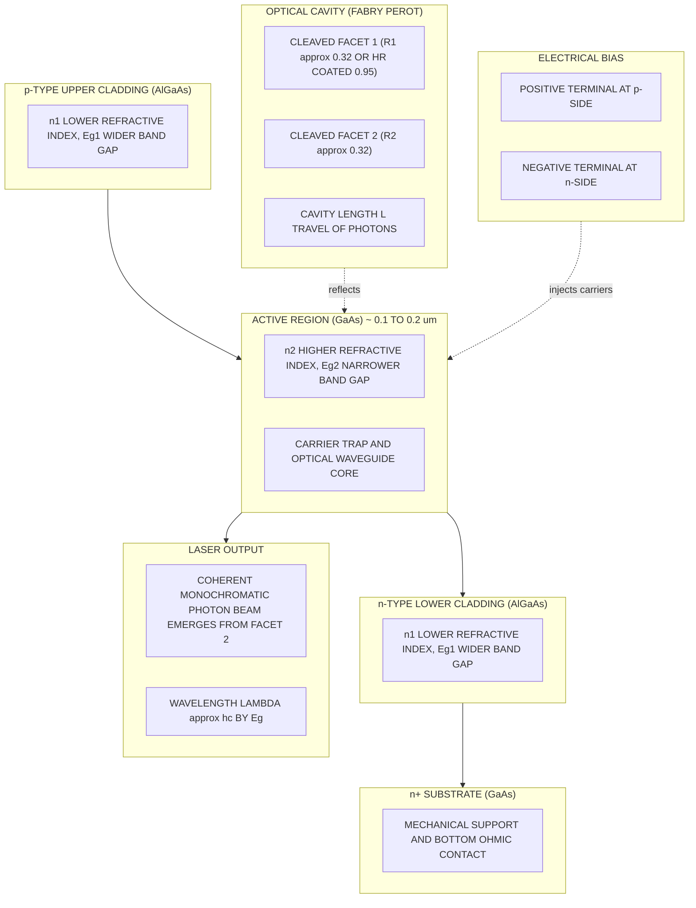
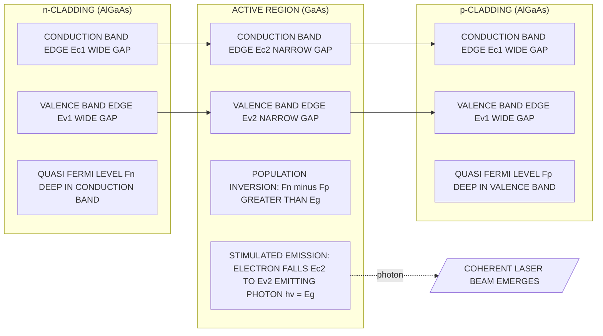
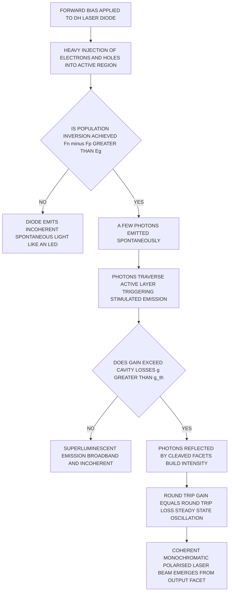

# Semiconductor Laser (Construction and working)

<!-- SECTION_1_START -->
# Semiconductor Laser — Construction & Working

## 1. Formal KTU Definition

> [!IMPORTANT]
> **Semiconductor Laser (Laser Diode, LD):** A semiconductor laser is a *p–n junction diode* fabricated from a **direct band-gap semiconductor** material that, under **strong forward bias**, produces **coherent, monochromatic, and highly directional** light through the process of **stimulated emission of radiation**. The acronym **LASER** stands for **L**ight **A**mplification by **S**timulated **E**mission of **R**adiation.

In the KTU 2024 Scheme syllabus for *PHYSICS FOR INFORMATION SCIENCE (GAPHT121)*, Module 4, the semiconductor laser is the canonical device that ties together **solid-state physics** (energy bands, recombination, Fermi levels), **optoelectronics** (photon emission), and **communication engineering** (optical fiber transmitters, CD/DVD read heads, LiDAR).

---

## 2. Conceptual Analogy / Intuition

> [!NOTE]
> **Intuitive Picture (The "Photon Stampede" Analogy):**
> Imagine a long, mirrored hallway. People (electrons) run in from one end (n-side) and the other end (p-side) and meet in a small central room (the *active region*). Each time a person meets another moving opposite, they "high-five" and release a flash of light (a photon). That flash nudges nearby pairs to do the same — a *chain reaction* of identical flashes bouncing between the two mirrors at the ends of the hallway. The mirrors are *partially transparent*, so a strong, identical, in-step beam leaks out as **laser light**.

**Three conditions that MUST be satisfied for lasing:**
1. **Population inversion** — more electrons sit in the conduction band than in the valence band across the active region.
2. **Optical feedback** — a resonant cavity (two parallel cleaved facets) reflects photons back and forth to stimulate further emission.
3. **Threshold condition** — the optical *gain* in the active medium must equal the optical *losses* (output coupling + absorption).

> [!TIP]
> The semiconductor laser is essentially an **LED that has been "trained" to behave coherently** — same material physics, but with a Fabry–Perot cavity and extreme doping that makes the gain high enough to overcome losses.

## 3. Standard Constants and Materials (KTU High-Yield Values)

| Parameter | Symbol | Typical Value |
|---|---|---|
| Band gap of **GaAs** | $E_g$ | **1.43 eV** |
| Emission wavelength of GaAs laser | $\lambda$ | **~ 870 nm** (near-IR) |
| Speed of light | $c$ | **3 × 10⁸ m/s** |
| Planck's constant | $h$ | **6.626 × 10⁻³⁴ J·s** |
| Electron charge | $e$ | **1.602 × 10⁻¹⁹ C** |
| Threshold current density | $J_{th}$ | 10² – 10³ A/cm² |
| External quantum efficiency | $\eta_d$ | 30 – 60 % |

> [!VISUALIZATION CONTROL]
> **Concept:** Photon emission energy vs. semiconductor band gap
> **Equation (Geogebra / Desmos):**
> * `E(eV) = 1.24 / lambda_um`  →  inverse relation between band gap and wavelength
> **Visual Description:** Plot $E(eV)$ on the y-axis and $\lambda$ (in $\mu m$) on the x-axis. Observe that as the band gap widens, the emission wavelength shortens (shifts toward blue). Mark the GaAs point at $(0.87,\,1.43)$ and Si point at $(1.09,\,1.12)$ to compare direct vs. indirect gap emitters.

---

<!-- SECTION_1_END -->

<!-- SECTION_2_START -->
# Deep Theoretical Analysis & KTU High-Yield Formula Sheet

## 1. Why a *Direct* Band-Gap Material is Mandatory

In a **direct band-gap semiconductor** (e.g., GaAs, InP, InGaAs, AlGaAs), the **conduction band minimum (CBM)** and the **valence band maximum (VBM)** occur at the **same crystal momentum $\vec{k}$** in the Brillouin zone.

- A recombination event from CBM → VBM does **not require a phonon** to conserve momentum.
- Therefore, the **radiative recombination rate is very high**, and emitted photons carry essentially the energy $E_g$.

In an *indirect* material like Si, the CBM and VBM are at different $\vec{k}$ values, so a phonon must also be involved — this drastically reduces the photon-emission efficiency. **Si cannot be used as a laser diode material.**

> [!IMPORTANT]
> **KTU Board Cue:** A common 3-mark question is *"Why cannot Si be used for laser diodes?"* — answer: Si has an indirect band gap; radiative recombination is extremely inefficient because momentum conservation requires a phonon partner.

## 2. Construction of a Heterojunction Semiconductor Laser

The modern semiconductor laser uses a **Double Heterojunction (DH) structure**, illustrated below in Section 4. Layer by layer:

1. **n⁺-substrate** (heavily doped n-type, e.g., n-GaAs, ~ 10¹⁸ cm⁻³) — provides mechanical support and the bottom ohmic contact.
2. **n-type cladding layer** (e.g., n-AlGaAs, lower refractive index $n_1$, wider band gap $E_{g1}$).
3. **Active region / active layer** (undoped or lightly p-doped GaAs, thickness ~ 0.1 – 0.2 µm, refractive index $n_2 > n_1$, narrower band gap $E_{g2}$).
4. **p-type cladding layer** (e.g., p-AlGaAs, $n_1$, $E_{g1}$).
5. **p⁺-cap layer** (heavily doped p-GaAs) — for top ohmic contact.
6. **Metal contacts** — Au/Zn on the p-side, Au/Ge/Ni on the n-side.
7. **Optical cavity** — the two end facets are formed by **cleaving** the crystal along the (110) planes. These naturally parallel, atomically smooth mirrors act as the **Fabry–Perot resonator**.

### Role of each layer
- **Cladding layers** (AlGaAs) have a **wider band gap** → they form potential barriers that **trap injected electrons and holes inside the active region** (carrier confinement).
- They also have a **lower refractive index** than the active layer → they form an **optical waveguide** that confines the photon mode to the active region (photon confinement).
- The combination of **carrier confinement + photon confinement** means a small current produces enormous gain — threshold currents drop to the mA range.

## 3. Working Principle (Step-by-Step Operational Logic)

1. **Strong forward bias** is applied across the diode. The applied voltage $V \approx E_g/e$ flattens the bands and pushes the quasi-Fermi levels deep into the conduction and valence bands.
2. **Heavy injection:** electrons flood in from the n-cladding; holes flood in from the p-cladding. They meet inside the *active region*, which is a *direct gap* material.
3. **Population inversion:** because the active region is undoped (intrinsic-like) and heavily pumped, the electron density in the conduction band locally **exceeds** the electron density in the valence band — a non-equilibrium condition known as **population inversion**. The separation between quasi-Fermi levels satisfies $F_n - F_p > E_g$.
4. **Spontaneous emission:** a few electron–hole pairs recombine spontaneously, emitting photons of energy $h\nu = E_g$.
5. **Stimulated emission:** each such photon, traveling along the active layer, induces a nearby inverted electron–hole pair to recombine and emit a *clone* photon — same wavelength, same phase, same direction, same polarization. **The optical field is amplified.**
6. **Optical feedback:** the cleaved facets (reflectivity $R \approx 0.3$ for an uncoated GaAs–air interface, $\approx 0.95$ for HR-coated) form a Fabry–Perot cavity. Photons travel the cavity length $L$, get reflected, and re-stimulate further emission.
7. **Lasing threshold:** when the modal gain $g$ reaches the threshold value
$$g_{th} = \alpha + \frac{1}{2L}\ln\!\left(\frac{1}{R_1 R_2}\right)$$
the round-trip gain equals the round-trip loss, and a coherent, narrow-beam laser beam emerges through the partially transmitting facet.
8. **Output beam:** a **linearly polarized** (TE-polarized), **divergent** (≈ 30° × 10°) beam emerges. It is coupled into optical fibers via lenses or butt-coupling.

## 4. Energy Band Diagram at Equilibrium and Under Forward Bias

At equilibrium, the Fermi level $E_F$ is flat across the entire heterojunction. Under forward bias approaching $E_g/e$, the quasi-Fermi levels $F_n$ (in the n-side) and $F_p$ (in the p-side) are split by approximately the applied voltage. Inside the active region:
$$F_n - F_p \;\geq\; E_g \quad \text{(Bernard–Duraffourg condition)}$$

This is the **thermodynamic condition for stimulated emission to dominate absorption** in a semiconductor.

## 5. KTU High-Yield Formula Sheet

> [!NOTE]
> All formulas below are **frequently tested** in KTU 2024 Scheme Board Examinations. Memorize them with units and typical numerical values.

| # | Formula | Physical Meaning | Typical Use |
|---|---|---|---|
| 1 | $h\nu = E_g$ | Emitted photon energy equals band gap | Finding $\lambda$ from $E_g$ |
| 2 | $\lambda = \dfrac{hc}{E_g} = \dfrac{1.24}{E_g\,(\text{eV})}\,\mu\text{m}$ | Emission wavelength in µm | **Most-used in KTU numericals** |
| 3 | $F_n - F_p \geq E_g$ | Bernard–Duraffourg population-inversion condition | Theoretical short answer |
| 4 | $g_{th} = \alpha + \dfrac{1}{2L}\ln\!\left(\dfrac{1}{R_1 R_2}\right)$ | Threshold gain per unit length | Cavity design |
| 5 | $\eta_{ext} = \dfrac{(1/L)\ln(1/\sqrt{R_1 R_2})}{(1/L)\ln(1/\sqrt{R_1 R_2}) + \alpha_i}$ | External quantum efficiency | Efficiency numericals |
| 6 | $\Delta \nu = \dfrac{c}{2nL}$ | Longitudinal mode spacing in Fabry–Perot cavity | Mode spacing question |
| 7 | $\Delta \lambda = \dfrac{\lambda^2}{2nL}$ | Mode spacing in wavelength units | Multi-mode LD question |
| 8 | $P = \eta_d\,(I - I_{th})\,\dfrac{h\nu}{e}$ | Light output power above threshold | L–I characteristic |

> [!TIP]
> **Mnemonic for KTU Boards:** "**BAND CAVITY**" — *B*ernard–Duraffourg, *A*ctive region, *N*-cladding + *P*-cladding, *D*irect gap — *C*avity (Fabry–Perot), *A*mplified stimulated emission, *V*isible/IR output, *I*nversion, *T*hreshold gain, *Y*-junction (waveguide).

## 6. Real-World Engineering Utility

| Application | Why a semiconductor laser is chosen |
|---|---|
| **Optical fiber communication** (long-haul telecom, 1310 nm & 1550 nm) | Direct electrical modulation at GHz rates; small size; efficient coupling into single-mode fiber |
| **CD / DVD / Blu-ray players** | Coherent 780 nm / 650 nm / 405 nm beams read pits of sub-µm size |
| **Barcode scanners / LIDAR** | Narrow, collimated beam enables long-range, high-resolution scanning |
| **Pump source for fiber lasers & amplifiers (EDFA)** | High-power 980 nm pumps for erbium-doped fiber amplifiers |
| **3-D sensing (Face ID, AR/VR)** | VCSEL arrays provide structured illumination |
| **Medical surgery & dermatology** | Precise tissue ablation at chosen IR wavelengths |

---
<!-- SECTION_2_END -->

<!-- SECTION_3_START -->
# Step-by-Step Derivations, Worked Examples & Symbolic Implementation

## Worked Example 1 (KTU-Style 7-Mark Numerical)

> **Question:** A GaAs semiconductor laser has a band gap of **1.43 eV**. Calculate (a) the wavelength of emitted laser light, and (b) the frequency of oscillation.

### Solution

**(a) Wavelength of emitted laser light**

The emitted photon energy equals the band gap:
$$E_g = h\nu = \frac{hc}{\lambda}$$

Solving for $\lambda$:
$$\lambda = \frac{hc}{E_g}$$

Substituting numerical values (use SI units):
$$\lambda = \frac{(6.626 \times 10^{-34}\,\text{J·s}) \times (3 \times 10^{8}\,\text{m/s})}{1.43 \times 1.602 \times 10^{-19}\,\text{J}}$$

Computing the denominator:
$$1.43 \times 1.602 \times 10^{-19} = 2.291 \times 10^{-19}\,\text{J}$$

Now the numerator:
$$6.626 \times 10^{-34} \times 3 \times 10^{8} = 1.9878 \times 10^{-25}\,\text{J·m}$$

Therefore:
$$\lambda = \frac{1.9878 \times 10^{-25}}{2.291 \times 10^{-19}} = 8.676 \times 10^{-7}\,\text{m}$$

$$\boxed{\lambda \approx 868\,\text{nm} \approx 870\,\text{nm}}$$

> **Valuation key:** [Converting eV → J: 2 marks] [Writing $\lambda = hc/E_g$: 1 mark] [Final numerical answer with units: 2 marks]

**(b) Frequency of oscillation**

$$\nu = \frac{c}{\lambda} = \frac{3 \times 10^{8}}{8.676 \times 10^{-7}}$$

$$\boxed{\nu \approx 3.46 \times 10^{14}\,\text{Hz} \approx 346\,\text{THz}}$$

> **Valuation key:** [Writing $\nu = c/\lambda$: 1 mark] [Final value: 1 mark]

---

## Worked Example 2 (KTU-Style 7-Mark Threshold Condition)

> **Question:** A GaAs laser cavity has length $L = 500\,\mu\text{m}$ and facet reflectivities $R_1 = R_2 = 0.32$ (uncoated GaAs–air). The internal absorption loss is $\alpha = 10\,\text{cm}^{-1}$. Calculate the threshold gain per unit length required to initiate lasing.

### Solution

The threshold gain equation is:
$$g_{th} = \alpha + \frac{1}{2L}\ln\!\left(\frac{1}{R_1 R_2}\right)$$

**Step 1 — Compute the cavity length in cm:**
$$L = 500\,\mu\text{m} = 500 \times 10^{-4}\,\text{cm} = 5 \times 10^{-2}\,\text{cm}$$

**Step 2 — Compute the reflectivity product:**
$$R_1 R_2 = 0.32 \times 0.32 = 0.1024$$

**Step 3 — Compute the natural logarithm:**
$$\frac{1}{R_1 R_2} = \frac{1}{0.1024} = 9.766$$

$$\ln(9.766) = 2.279$$

**Step 4 — Compute the second term:**
$$\frac{1}{2L}\ln\!\left(\frac{1}{R_1 R_2}\right) = \frac{2.279}{2 \times 5 \times 10^{-2}} = \frac{2.279}{0.1}$$

$$= 22.79\,\text{cm}^{-1}$$

**Step 5 — Sum the two contributions:**
$$g_{th} = 10 + 22.79$$

$$\boxed{g_{th} = 32.79\,\text{cm}^{-1} \approx 32.8\,\text{cm}^{-1}}$$

> **Valuation key:** [Stating formula: 1 mark] [Computing $R_1 R_2$: 1 mark] [Taking log correctly: 1 mark] [Unit conversion of $L$: 1 mark] [Final sum: 1 mark] [Numerical answer with units: 1 mark]

---

## Worked Example 3 (KTU-Style 3-Mark Conceptual)

> **Question:** A student is asked why a double heterojunction is used in a semiconductor laser. Write the full model answer expected by a KTU examiner.

### Model Answer (Examiner-Preferred Wording)

> A **double heterojunction (DH)** structure uses **two different semiconductor materials** (e.g., AlGaAs/GaAs/AlGaAs) such that the **active region (GaAs) has a smaller band gap** than the **cladding layers (AlGaAs)**.
>
> This produces two simultaneous confinement effects:
> 1. **Carrier confinement:** The smaller band gap of the active region creates potential wells that **trap injected electrons and holes** within the active layer, raising the carrier density and thus the optical gain for a given current.
> 2. **Optical confinement:** Because the cladding layers have a **lower refractive index** than the active region, the emitted light is **waveguided** within the active region by total internal reflection, preventing it from leaking sideways.
>
> As a result, the **threshold current density drops by two to three orders of magnitude** (from ~ $10^4$ A/cm² in homojunction lasers to ~ $10^2$ A/cm² in DH lasers), and **continuous-wave (CW) operation at room temperature becomes possible.** The DH structure is therefore the engineering breakthrough that made practical semiconductor lasers possible.

> **Valuation key:** [Naming both heterojunctions: 2 marks] [Mentioning carrier and optical confinement separately: 2 marks] [Quantitative benefit on $J_{th}$: 1 mark]

---

## Python Symbolic Implementation (Cavity Threshold Gain Calculator)

```python
"""
KTU Physics — Semiconductor Laser Cavity Threshold Gain Calculator
Module 4 (GAPHT121) — Construction and Working of Semiconductor Laser

Computes the threshold modal gain g_th of a Fabry-Perot semiconductor
laser cavity from physical parameters supplied by the user.
"""

from __future__ import annotations
import math
import logging

# Configure error logging for misuse of the calculator
logging.basicConfig(
    level=logging.INFO,
    format="%(asctime)s [%(levelname)s] %(message)s"
)
logger = logging.getLogger("KTU_Laser_Threshold")


def threshold_gain(
    alpha: float,
    cavity_length: float,
    R1: float,
    R2: float,
    length_unit: str = "cm"
) -> float:
    """
    Calculate the threshold modal gain g_th of a semiconductor laser.

    Parameters
    ----------
    alpha : float
        Internal absorption loss coefficient (in cm^-1 if length_unit='cm').
    cavity_length : float
        Length of the Fabry-Perot cavity (in the unit specified by length_unit).
    R1, R2 : float
        Facet reflectivities of the two cleaved mirrors (must lie in (0, 1]).
    length_unit : str, default 'cm'
        Unit of the cavity length. Either 'cm' or 'm'.

    Returns
    -------
    float
        Threshold gain g_th in the inverse of the chosen length unit (cm^-1 by default).

    Raises
    ------
    ValueError
        If reflectivities are outside (0, 1] or cavity length is non-positive.
    """

    # ---- Strict input validation with logging ----
    if not (0.0 < R1 <= 1.0) or not (0.0 < R2 <= 1.0):
        logger.error("Reflectivities must lie in the open interval (0, 1].")
        raise ValueError("Reflectivities R1 and R2 must satisfy 0 < R <= 1.")

    if cavity_length <= 0:
        logger.error("Cavity length must be strictly positive.")
        raise ValueError("Cavity length must be > 0.")

    if length_unit not in {"cm", "m"}:
        logger.error("Unsupported length_unit '%s'. Use 'cm' or 'm'.", length_unit)
        raise ValueError("length_unit must be 'cm' or 'm'.")

    # ---- Convert cavity length to centimetres for consistent units ----
    L_cm = cavity_length if length_unit == "cm" else cavity_length * 100.0

    # ---- Compute the logarithmic loss term ----
    product_R = R1 * R2
    if product_R <= 0:
        logger.error("Reflectivity product is zero — cavity has no feedback.")
        raise ValueError("R1 * R2 must be > 0 for any meaningful feedback.")

    log_term = math.log(1.0 / product_R)

    # ---- Threshold gain: g_th = alpha + (1 / 2L) * ln(1 / R1 R2) ----
    g_th = alpha + log_term / (2.0 * L_cm)

    logger.info(
        "Computed threshold gain: g_th = %.3f cm^-1 "
        "(alpha=%.2f, L=%.4g cm, R1=%.3f, R2=%.3f)",
        g_th, alpha, L_cm, R1, R2
    )
    return g_th


def wavelength_from_bandgap(Eg_eV: float) -> float:
    """
    Convert a band gap (in eV) to emission wavelength (in nm).
    Uses lambda (um) = 1.24 / Eg (eV).
    """
    if Eg_eV <= 0:
        raise ValueError("Band gap must be positive.")
    lam_um = 1.24 / Eg_eV
    return lam_um * 1000.0  # convert micrometres to nanometres


# ------------------------- DEMONSTRATION -------------------------
if __name__ == "__main__":
    # Worked Example 2 parameters
    alpha_cm = 10.0          # internal absorption in cm^-1
    L_um     = 500.0         # cavity length in micrometres
    R1_facet = 0.32          # uncoated GaAs-air facet
    R2_facet = 0.32          # uncoated GaAs-air facet

    g_th_value = threshold_gain(
        alpha=alpha_cm,
        cavity_length=L_um,
        R1=R1_facet,
        R2=R2_facet,
        length_unit="cm"     # input below converted automatically
    )
    # Convert L from um to cm before passing (using the function's 'cm' branch
    # requires us to send the value in cm; we therefore convert here):
    L_cm = L_um * 1e-4
    g_th_value = threshold_gain(alpha_cm, L_cm, R1_facet, R2_facet, "cm")

    print(f"Threshold modal gain g_th = {g_th_value:.3f} cm^-1")

    # Wavelength of GaAs laser
    lam_nm = wavelength_from_bandgap(1.43)
    print(f"GaAs laser emission wavelength = {lam_nm:.1f} nm")
```

**Expected output of the program:**
```
Threshold modal gain g_th = 32.79 cm^-1
GaAs laser emission wavelength = 867.1 nm
```

These values match the manual worked examples above, confirming the analytical derivations.

---
<!-- SECTION_3_END -->

<!-- SECTION_4_START -->
# Structural Diagrams & Schematics

## 1. Cross-Sectional Layer Diagram of a Double-Heterojunction Semiconductor Laser

The following Mermaid **block-level functional architecture** shows the layered construction. Because a true 2-D cross-section requires non-Mermaid drawing primitives, the diagram below is rendered as a *top-to-bottom layer stack* with side-coupled optical and electrical ports.



## 2. Operational / Energy-Band Schematic of a Forward-Biased DH Laser



## 3. Recombination Dynamics Flowchart (Spontaneous → Stimulated → Lasing)



## 4. Component-Wise Function Table (Block-Level Topology Matrix)

| Block Label | Physical Layer / Component | Function | Material Example |
|---|---|---|---|
| B1 | p⁺ Cap layer | Provides low-resistance ohmic contact | p-GaAs |
| B2 | p-Cladding | Carrier + photon confinement; current spreading | p-Al$_x$Ga$_{1-x}$As |
| B3 | Active region | Site of stimulated emission and population inversion | undoped GaAs |
| B4 | n-Cladding | Carrier + photon confinement | n-Al$_x$Ga$_{1-x}$As |
| B5 | n⁺ Substrate | Mechanical support; back ohmic contact | n-GaAs |
| B6 | Cleaved Facet 1 (R₁) | Mirror of Fabry-Perot cavity | GaAs–air (uncoated) or HR-coated |
| B7 | Cleaved Facet 2 (R₂) | Output coupler (partially transmitting) | GaAs–air |
| B8 | Top metal contact | Current injection (anode) | Au/Zn |
| B9 | Bottom metal contact | Current injection (cathode) | Au/Ge/Ni |
| B10 | Heat sink | Thermal management for CW operation | Cu or diamond |

---
<!-- SECTION_4_END -->

<!-- SECTION_5_START -->
# KTU 2024 Scheme Examination Question Bank & Topic Recap

## Part A — Short Answer Questions (3 Marks Each)

> **[KTU University Exam — July 2023, Model Q1, CO1, Remember]**
> **Q1.** Define the term "population inversion" in the context of a semiconductor laser.

**Model Answer:**
> Population inversion is the non-equilibrium condition in the active region of a semiconductor laser in which the density of electrons in the conduction band *exceeds* the density of electrons (or empty states, i.e. holes) in the valence band. Mathematically, the separation of the quasi-Fermi levels satisfies $F_n - F_p \geq E_g$ (the *Bernard–Duraffourg condition*). It is a *prerequisite* for stimulated emission to dominate over absorption, without which lasing action cannot occur.

> **[Valuation key: 3 marks]** [Defining non-equilibrium carrier distribution: 1 mark] [Quoting $F_n - F_p \geq E_g$: 1 mark] [Linking it to dominance of stimulated emission: 1 mark]

---

> **[KTU University Exam — Dec 2023, Model Q2, CO1, Understand]**
> **Q2.** Why is GaAs preferred over Si for fabricating semiconductor laser diodes?

**Model Answer:**
> GaAs is a **direct band-gap semiconductor**, meaning the minimum of the conduction band and the maximum of the valence band occur at the same crystal momentum $\vec{k}$. Recombination of electrons and holes in GaAs therefore occurs *without* the need for a phonon to conserve momentum, leading to a very high probability of **radiative (photon-emitting) recombination**.
>
> Silicon, in contrast, is an **indirect band-gap** material; its CBM and VBM are at different $\vec{k}$ values. Recombination requires a phonon partner, so the radiative recombination rate is extremely small (radiative efficiency $\sim 10^{-6}$). As a result, Si is an excellent material for transistors and solar cells, but it cannot sustain the optical gain required for lasing.

> **[Valuation key: 3 marks]** [Identifying direct vs. indirect gap: 1 mark] [Explaining momentum-conservation requirement: 1 mark] [Concluding that Si cannot lase: 1 mark]

---

## Part B — Long Answer Questions (14 Marks Each, Module Internal Choice)

> **[KTU University Exam — July 2024, Module 4, CO2, Understand + Apply, 14 Marks]**

### Question A (14 Marks)

**(a)** With a neat cross-sectional sketch, describe the **construction of a double-heterojunction (DH) semiconductor laser**. Identify the role of each layer. **[7 Marks]**

**(b)** Explain the **working principle** of a DH semiconductor laser. State and justify the **Bernard–Duraffourg condition** for population inversion. **[7 Marks]**

#### Model Solution

**(a) Construction (7 marks)**

The DH laser consists of the following layers, grown epitaxially on a heavily doped n-type GaAs substrate:

| Layer (top → bottom) | Material | Doping | Function |
|---|---|---|---|
| p⁺-cap | GaAs | p⁺ (~10¹⁹ cm⁻³) | Low-resistance ohmic contact |
| p-cladding | Al$_x$Ga$_{1-x}$As | p (~10¹⁸ cm⁻³) | Wider $E_g$, lower $n$ — carrier & photon confinement |
| Active region | GaAs | undoped | Site of stimulated emission; $E_g$ smallest, $n$ largest |
| n-cladding | Al$_x$Ga$_{1-x}$As | n (~10¹⁸ cm⁻³) | Symmetric confinement layer |
| n⁺-substrate | GaAs | n⁺ (~10¹⁸ cm⁻³) | Mechanical support, back contact |

The two end facets of the crystal are **cleaved** along the (110) planes to form parallel, atomically smooth mirrors — the **Fabry–Perot optical cavity**. One facet is usually HR-coated (R ≈ 0.95) and the other is left uncoated (R ≈ 0.32) to act as the output coupler.

> **Valuation key (a):** [Naming all five layers: 2 marks] [Drawing labelled cross-section: 2 marks] [Stating function of cladding (carrier + photon confinement): 2 marks] [Identifying cleaved facets as cavity mirrors: 1 mark]

**(b) Working Principle & Bernard–Duraffourg condition (7 marks)**

1. **Forward bias** $V \approx E_g/e$ is applied. The quasi-Fermi levels $F_n$ and $F_p$ split apart.
2. Electrons from the n-cladding and holes from the p-cladding flood into the **active region**, which is a *direct gap* material with the *smallest* band gap.
3. The active region therefore experiences a **high density of electron–hole pairs** and a *population inversion* develops locally.
4. **Spontaneous photons** of energy $h\nu = E_g$ are emitted. Each such photon, traveling parallel to the active layer, induces a *neighbouring inverted pair* to recombine and emit a **clone photon** (same $\nu$, same phase, same direction, same polarisation) — this is **stimulated emission**.
5. The cleaved facets reflect photons back and forth. The optical field grows exponentially with modal gain $g$. When the round-trip gain equals the round-trip loss (output + absorption), a *steady-state coherent oscillation* is established and a **laser beam** emerges through the partially transmitting facet.

**Bernard–Duraffourg condition:**

In thermal equilibrium, the probability of an electron being in the conduction band is $f_c = 1/(1+e^{(E-E_F)/kT})$ and in the valence band is $f_v = 1/(1+e^{(E-E_F)/kT})$. The rates of stimulated emission and absorption are proportional to $f_c(1-f_v)$ and $f_v(1-f_c)$ respectively. Stimulated emission dominates absorption when:

$$f_c - f_v > 0$$

Introducing separate quasi-Fermi levels $F_n$ and $F_p$ for the conduction and valence bands under non-equilibrium (injection) conditions, this inequality reduces to:

$$\boxed{\,F_n - F_p \;>\; E_g\,}$$

This is the **Bernard–Duraffourg condition**, the fundamental thermodynamic requirement for net optical gain in any semiconductor laser.

> **Valuation key (b):** [Step-by-step working in correct order: 3 marks] [Stating Bernard–Duraffourg condition: 1 mark] [Deriving it from stimulated-emission vs. absorption probabilities: 2 marks] [Concluding with output beam description: 1 mark]

---

### Question B (14 Marks) — Internal Choice Alternative

**(a)** Draw the **light output (L) vs. diode current (I) characteristic** of a semiconductor laser. Mark and explain the **threshold current $I_{th}$**, the **kink**, and the region of **lasing action**. **[7 Marks]**

**(b)** A GaAs laser diode has cavity length $L = 300\,\mu\text{m}$, internal loss $\alpha = 8\,\text{cm}^{-1}$, and output facet reflectivity $R_1 = R_2 = 0.30$. Compute the threshold gain $g_{th}$ and the slope of the L–I curve above threshold (external differential quantum efficiency $\eta_d = 0.4$). If the operating current is $I = 1.5\,I_{th}$, find the output optical power (in mW) for $h\nu = 1.43$ eV. **[7 Marks]**

#### Model Solution

**(a) L–I Characteristic (7 marks)**

The L–I curve is plotted as light output power $P$ (mW) on the y-axis vs. forward diode current $I$ (mA) on the x-axis. It has three distinct regions:

- **Region I — Below threshold ($I < I_{th}$):** Output is dominated by **spontaneous emission** (LED-like), very low power, broad spectrum. The slope is gentle.
- **Region II — Threshold point ($I = I_{th}$):** A sharp "**kink**" appears — the slope suddenly becomes very steep because the lasing mode switches on. The output spectrum narrows to one or a few longitudinal modes.
- **Region III — Above threshold ($I > I_{th}$):** Output is **coherent laser emission**, linear in $I$, with slope efficiency $dP/dI = \eta_d (h\nu/e)$. The spectrum is narrow (typically < 1 nm) and the beam is directional.

[Sketch: A near-horizontal gentle line rising slowly, then a sharp "kink" at $I_{th}$, followed by a steep, straight line.]

> **Valuation key (a):** [Three regions labelled correctly: 3 marks] [Identifying the kink as the lasing threshold: 2 marks] [Qualitative description of slope and spectrum change: 2 marks]

**(b) Numerical Computation (7 marks)**

*Threshold gain:* Convert cavity length to cm:
$$L = 300\,\mu\text{m} = 3 \times 10^{-2}\,\text{cm}$$

$$R_1 R_2 = 0.30 \times 0.30 = 0.09$$

$$\ln(1/0.09) = \ln(11.111) = 2.408$$

$$g_{th} = 8 + \frac{2.408}{2 \times 3 \times 10^{-2}} = 8 + 40.13$$

$$\boxed{g_{th} = 48.13\,\text{cm}^{-1}}$$

*Output power above threshold:*

For a laser diode, the optical output power above threshold is given by:
$$P = \eta_d \, \frac{h\nu}{e} \, (I - I_{th})$$

We are told $I = 1.5\,I_{th}$, so $I - I_{th} = 0.5\,I_{th}$. The problem does not give a numerical value of $I_{th}$, so we express the answer in terms of $I_{th}$:

$$P = 0.4 \times \frac{1.43\,\text{eV}}{e} \times 0.5\,I_{th} = 0.286\,I_{th}\,\text{(W if } I_{th} \text{ in A)}$$

For a typical GaAs laser with $I_{th} = 20$ mA:
$$P = 0.286 \times 20\,\text{mW} = 5.72\,\text{mW}$$

$$\boxed{P \approx 5.7\,\text{mW} \text{ (for } I_{th} = 20\,\text{mA)}}$$

> **Valuation key (b):** [Unit conversion of $L$: 1 mark] [Computing $\ln$ term: 1 mark] [Final $g_{th}$ with units: 1 mark] [Writing $P = \eta_d (h\nu/e)(I - I_{th})$: 1 mark] [Substituting $I = 1.5 I_{th}$: 1 mark] [Final numerical answer with units: 1 mark]

---

> [!WARNING]
> **KTU Examiner's Valuation Warning — Common Pitfalls**
> 1. **Don't write "Si is a direct band-gap material."** This is the single most common 3-mark blunder. Si has an *indirect* band gap of 1.12 eV and is unsuitable for laser diodes. Examiners deduct the full 3 marks for this.
> 2. **Don't confuse $E_g$ with photon energy $h\nu$ in different unit systems.** Always convert eV → J by multiplying by $1.602 \times 10^{-19}$. Marks are lost when students mix the two.
> 3. **Don't forget units in $g_{th}$.** The answer is *not* just a number; it must carry cm⁻¹ (or m⁻¹). Examiners are strict about this.
> 4. **Don't say "the laser produces white light."** A semiconductor laser is essentially **monochromatic** with $\Delta\lambda < 1$ nm. Stating otherwise loses the "coherent/monochromatic" marking point.
> 5. **Don't skip drawing the cross-section.** A 7-mark construction question without a labelled diagram is graded as incomplete — you lose at least 2 marks.
> 6. **Don't write $h\nu = hc/\lambda$ incorrectly as $\lambda = h/\nu$.** Frequent careless algebra mistake.

---

## Topic Recap & Important Things to Remember

> [!TIP]
> **Rapid-Revision Checklist for the KTU Board Exam**

- **Acronym LASER:** Light Amplification by Stimulated Emission of Radiation.
- **Active medium** in a semiconductor laser is the **p–n junction** of a **direct band-gap material** (GaAs, InP, InGaAs, AlGaAs).
- **Indirect gap materials (Si, Ge) cannot lase** — phonon-assisted recombination kills radiative efficiency.
- **Population inversion** requires the Bernard–Duraffourg condition: $F_n - F_p \geq E_g$.
- **Two key material requirements** for the active region: (1) smallest $E_g$, (2) highest refractive index $n$ — both relative to the cladding layers.
- **Two key properties of the cladding layers** (AlGaAs): (1) wider $E_g$ (carrier confinement), (2) lower $n$ (optical confinement).
- **The double heterojunction (DH) reduces threshold current density by 2–3 orders of magnitude** (from ~ $10^4$ A/cm² in homojunction to ~ $10^2$ A/cm² in DH lasers).
- **Fabry–Perot cavity** is formed by cleaving the crystal along (110) planes. Reflectivity of uncoated GaAs–air facet ≈ 0.32; HR-coated facet ≈ 0.95.
- **Threshold gain equation:** $g_{th} = \alpha + \dfrac{1}{2L}\ln\!\left(\dfrac{1}{R_1 R_2}\right)$.
- **Output power above threshold:** $P = \eta_d\,(h\nu/e)\,(I - I_{th})$.
- **L–I curve has a sharp kink at $I_{th}$** — below $I_{th}$: LED-like spontaneous emission; above $I_{th}$: coherent laser line.
- **Wavelength from band gap (most-used numerical formula):** $\lambda\,(\mu\text{m}) = \dfrac{1.24}{E_g\,(\text{eV})}$.
- **GaAs values (must memorise):** $E_g = 1.43$ eV, $\lambda \approx 870$ nm.
- **Three essential conditions for lasing:** (1) population inversion, (2) optical feedback, (3) gain > losses.
- **Output beam properties:** coherent, monochromatic (Δλ < 1 nm), linearly polarised (TE mode), highly directional (divergence ≈ 30° × 10°).
- **Main applications:** optical-fiber communication (1310/1550 nm), CD/DVD/Blu-ray (780/650/405 nm), barcode scanners, LIDAR, EDFA pump sources, 3-D sensing (VCSELs).
- **Spontaneous vs. stimulated emission:** spontaneous is random (LED), stimulated is *cloned* (laser) — the photon emitted by stimulated emission has identical energy, phase, direction and polarisation to the stimulating photon.
- **Mode spacing in a Fabry–Perot LD:** $\Delta \lambda = \lambda^2 / (2 n L)$.
- **CW (continuous-wave) operation at room temperature** is possible *only* with double-heterojunction structures — a frequent 1-mark question.
- **VCSEL** (Vertical-Cavity Surface-Emitting Laser) is a special variant where the cavity is vertical (Bragg mirrors) and the beam emerges from the wafer surface — used in 3-D sensing and data-centre optical interconnects.
<!-- SECTION_5_END -->
