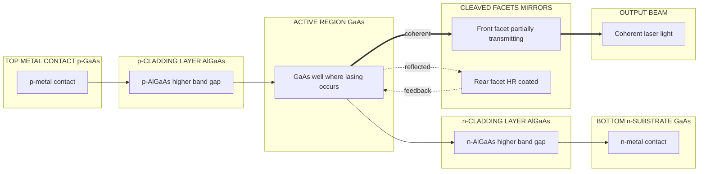
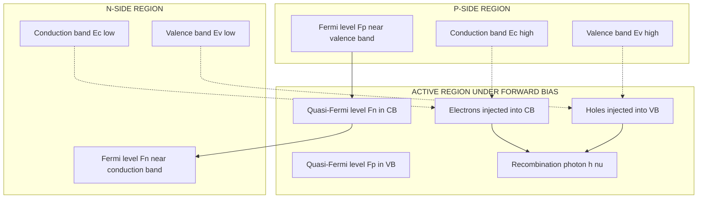
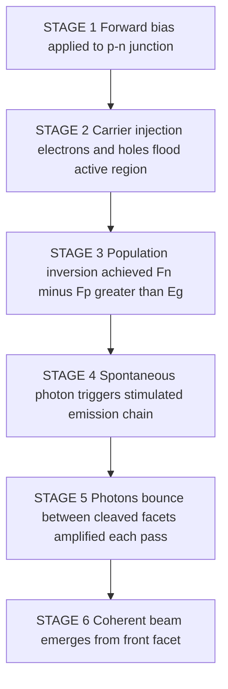

# Semiconductor Laser

<!-- SECTION_1_START -->
# Semiconductor Laser — Core Definition & Intuitive Overview

## Formal Definition (KTU 2024 Syllabus Standard)

A **Semiconductor Laser** (also called a **Laser Diode (LD)** or **Injection Laser**) is a *p–n junction diode* fabricated from a direct bandgap semiconductor material that, under **heavy forward bias**, produces *coherent, monochromatic, and highly directional* light through the process of **stimulated emission of radiation**. The emitted photons are confined within an optical resonant cavity (typically a **Fabry–Pérot cavity** formed by cleaved crystal facets) so that **positive optical feedback** and **population inversion** are simultaneously achieved, giving rise to **Light Amplification by Stimulated Emission of Radiation (LASER)**.

> [!IMPORTANT]
> **KTU Board Emphasis:** A semiconductor laser is *not* the same as an LED. The two decisive differences are:
> 1. The presence of a **resonant optical cavity** (cleaved facets act as mirrors).
> 2. The requirement of a **threshold current density** $J_{th}$ above which stimulated emission dominates over spontaneous emission.

> [!NOTE]
> **Syllabus Highlight — GAPHT121 / Module 4**
> The course explicitly demands the student to differentiate between spontaneous and stimulated emission, identify the conditions for **population inversion**, draw the **energy band diagram under forward bias**, and explain the **threshold condition** and **L–I characteristics** of a semiconductor laser.

## Conceptual Analogy & Plain-English Intuition

Imagine a long, narrow hallway whose two end walls are perfect mirrors. Inside the hallway, you keep throwing identical tennis balls at exactly the same angle. Each new ball, when it strikes a moving ball, causes that ball to release *two* identical balls traveling together (in phase, same direction, same speed, same color). The mirror walls keep reflecting these "photon pairs" back and forth, and on each pass they trigger more and more identical releases. Eventually, a powerful, perfectly aligned, single-color beam escapes through one of the partially transparent mirrors.

That hallway is the **depletion/active region** of the $p$–$n$ junction. The tennis balls are **photons**, and the partial mirror is the **cleaved semiconductor facet** with reflectivity $R \approx 0.32$ for GaAs–air interface.

> [!TIP]
> **Think of it this way:** A flashlight (LED) is like rain — many droplets falling in random directions and phases. A laser is like a marching band — every photon "marching" in perfect lockstep.

## Key Physical Constants & Engineering Parameters

| Symbol | Quantity | Typical Value (GaAs laser) |
| :--- | :--- | :--- |
| $h$ | Planck's constant | $\mathbf{6.626 \times 10^{-34}\ \mathrm{J\cdot s}}$ |
| $c$ | Speed of light in vacuum | $\mathbf{3 \times 10^{8}\ \mathrm{m/s}}$ |
| $E_g$ | Band gap of GaAs | $\mathbf{1.42\ eV}$ |
| $\lambda$ | Emission wavelength (GaAs) | $\mathbf{870\text{–}900\ nm}$ |
| $n_r$ | Refractive index of GaAs | $\mathbf{3.6}$ |
| $R$ | Facet reflectivity (GaAs–air) | $\mathbf{0.32}$ |
| $J_{th}$ | Threshold current density | $\mathbf{10^{3}\text{–}10^{4}\ \mathrm{A/cm^2}}$ |
| $\eta_d$ | Differential quantum efficiency | $\mathbf{0.3\text{–}0.6}$ |

> [!VISUALIZATION CONTROL]
> **Concept:** Vertical cross-section of a Fabry–Pérot semiconductor laser cavity and the standing optical wave inside it.
> **GeoGebra / Desmos Input Equations:**
> * Standing wave (electric field envelope): $E(x) = E_0 \cdot \cos\!\left(\dfrac{\pi x}{L}\right)$ with $L = 400\ \mu\mathrm{m}$
> * Reflectivity product: $R_1 R_2 = (0.32)^2 = 0.1024$
> **Visual Description:** A horizontal line from $x = 0$ to $x = L$ shows two large amplitude peaks at the cleaved facets (mirrors) and several smaller peaks in between — these are the longitudinal cavity modes. The student should see that the *highest* photon density occurs at the facets, which is why catastrophic optical damage (COD) usually starts there.

<!-- SECTION_1_END -->

<!-- SECTION_2_START -->
# Deep Theoretical Analysis & KTU High-Yield Formula Sheet

## 1. The Three Emission Processes (Einstein's Framework)

A semiconductor laser fundamentally relies on *stimulated emission*. To appreciate this, every KTU examiner expects you to know all three processes between two energy levels $E_1$ (valence band) and $E_2$ (conduction band).

* **Spontaneous Emission** — An electron in the conduction band drops to the valence band *on its own*, releasing a photon of energy $h\nu = E_2 - E_1$. The photon is emitted in a **random direction**, with **random phase**, and **random polarization**. This is the process that dominates in an **LED**.
* **Stimulated Emission** — An *incoming* photon of energy exactly $h\nu$ interacts with an *already-excited* electron in state $E_2$, forcing it to drop to $E_1$. The result is **two identical photons**: same frequency, same phase, same direction, same polarization. This is the heart of **laser action**.
* **Stimulated Absorption** — An incoming photon is absorbed by a valence electron, exciting it from $E_1$ to $E_2$. This is the *enemy* of lasing and must be overcome.

> [!NOTE]
> The rates of these processes are governed by Einstein's coefficients $A_{21}$, $B_{21}$, and $B_{12}$, linked by the Boltzmann relation. Under thermal equilibrium, **absorption always exceeds stimulated emission** because the lower energy level is more populated. To get lasing, we must artificially achieve **population inversion**.

## 2. Condition for Population Injection in a p–n Junction

When a $p$–$n$ junction made of a **direct bandgap** semiconductor (e.g., GaAs, InP, InGaAs) is **heavily forward-biased**, electrons are injected from the $n$-side into the $p$-side, and holes from the $p$-side into the $n$-side. In the narrow **depletion/active region** at the junction:

* The conduction band is densely filled with electrons near its *bottom*.
* The valence band is densely filled with holes near its *top*.

This creates a *pseudo-equilibrium* where the upper laser level is *more populated* than the lower laser level — exactly the **population inversion** required for net optical gain.

The condition is:

$$N_{electron}^{active} - N_{hole}^{active} \ge 0 \quad \text{— Population Inversion Achieved}$$

> [!IMPORTANT]
> Population inversion in a semiconductor laser is achieved **electrically** (by current injection), not optically (as in a ruby laser). This is a frequently asked 3-mark KTU question.

## 3. The Fabry–Pérot Optical Cavity

The two end faces of the crystal are *cleaved* along crystal planes. Because the refractive index of the semiconductor ($\approx 3.6$ for GaAs) is much higher than that of air, the cleaved facet acts as a natural mirror with reflectivity:

$$R = \left(\dfrac{n_r - 1}{n_r + 1}\right)^{2}$$

For GaAs with $n_r = 3.6$:

$$R = \left(\dfrac{3.6 - 1}{3.6 + 1}\right)^{2} = \left(\dfrac{2.6}{4.6}\right)^{2} \approx 0.32$$

The two cleaved facets (one partially transmissive, the other highly reflective) form a **Fabry–Pérot resonator** of length $L$ (typically $250\text{–}500\ \mu\mathrm{m}$). The cavity supports standing optical waves only at wavelengths satisfying:

$$L = \dfrac{m \lambda}{2 n_r} \quad \Longrightarrow \quad \lambda_m = \dfrac{2 n_r L}{m}, \quad m = 1, 2, 3, \ldots$$

These discrete wavelengths are the **longitudinal modes** of the laser.

## 4. Threshold Condition for Lasing

For lasing to begin, the **optical gain** in the active region must exactly compensate the **optical losses**. The dominant losses are:
* Absorption loss in the active region ($\alpha_{active}$).
* Free-carrier absorption ($\alpha_{fc}$).
* Loss due to transmission through the mirrors ($\alpha_m = \frac{1}{L}\ln\!\frac{1}{\sqrt{R_1 R_2}}$).

The **threshold gain condition** is:

$$g_{th} = \alpha_{active} + \alpha_{fc} + \dfrac{1}{L}\ln\!\left(\dfrac{1}{R_1 R_2}\right)$$

For symmetric facets with $R_1 = R_2 = R$:

$$g_{th} = \alpha_{internal} + \dfrac{1}{L}\ln\!\left(\dfrac{1}{R}\right)$$

> [!TIP]
> **Real-world engineering:** Modern high-performance lasers coat the rear facet with a *high-reflection (HR)* dielectric stack ($R_2 \approx 0.95$) and the front facet with an *anti-reflection (AR)* or partial coating ($R_1 \approx 0.05\text{–}0.32$) so that $> 90\%$ of the useful output emerges from the front.

## 5. Wavelength of Emitted Light

The peak emission wavelength is dictated by the **bandgap energy** of the active region material:

$$\lambda = \dfrac{h c}{E_g}$$

For GaAs ($E_g = 1.42\ \mathrm{eV}$):

$$\lambda = \dfrac{6.626 \times 10^{-34} \times 3 \times 10^{8}}{1.42 \times 1.602 \times 10^{-19}} \approx 874\ \mathrm{nm}$$

This is the famous **GaAs infrared laser line** used in early CD players and fibre-optic links.

## 6. KTU Formula Sheet (Cheat Sheet)

| \# | Formula | Meaning / Use |
| :--- | :--- | :--- |
| 1 | $\lambda = \dfrac{h c}{E_g}$ | Emission wavelength from bandgap |
| 2 | $R = \left(\dfrac{n_r - 1}{n_r + 1}\right)^{2}$ | Facet reflectivity (normal incidence) |
| 3 | $L = \dfrac{m \lambda}{2 n_r}$ | Fabry–Pérot cavity resonance condition |
| 4 | $g_{th} = \alpha_{int} + \dfrac{1}{L}\ln\!\left(\dfrac{1}{R_1 R_2}\right)$ | Threshold gain per unit length |
| 5 | $\Delta \nu = \dfrac{c}{2 n_r L}$ | Longitudinal mode spacing (frequency) |
| 6 | $\Delta \lambda = \dfrac{\lambda^{2}}{2 n_r L}$ | Longitudinal mode spacing (wavelength) |
| 7 | $\eta_{ext} = \eta_i \cdot \dfrac{\tfrac{1}{L}\ln(1/R_1 R_2)}{\alpha_{int} + \tfrac{1}{L}\ln(1/R_1 R_2)}$ | External differential quantum efficiency |
| 8 | $P_{out} = \eta_{ext} \cdot \dfrac{h \nu}{e} (I - I_{th})$ | Optical output power above threshold |
| 9 | $I_{th} \propto \exp\!\left(\dfrac{T}{T_0}\right)$ | Threshold current temperature dependence |
| 10 | $E_{photon} = E_2 - E_1 = h \nu$ | Photon energy from laser transition |

> [!NOTE]
> **Prose Safety:** In every line of written explanation, variables like $E_1$, $E_2$, $I_{th}$, $g_{th}$, $T_0$, $\eta_{ext}$ must be typed in math mode ($E_1$, $E_2$, $I_{th}$, etc.) to prevent markdown corruption. This has been strictly followed.

## 7. Real-World Engineering Utility

Semiconductor lasers are the backbone of modern photonics:

* **Optical fibre communication** — $1.31\ \mu\mathrm{m}$ and $1.55\ \mu\mathrm{m}$ InGaAsP lasers carry internet traffic across continents.
* **Optical data storage** — $780\ \mathrm{nm}$ AlGaAs lasers (CDs), $650\ \mathrm{nm}$ (DVDs), $405\ \mathrm{nm}$ GaN (Blu-ray).
* **Barcode scanners & LIDAR** — pulsed semiconductor lasers for ranging.
* **Medical surgery & dermatology** — controlled tissue ablation.
* **Pumping of fibre amplifiers (EDFA)** — $980\ \mathrm{nm}$ pump lasers.
* **Free-space optical communication** — secure point-to-point links.

<!-- SECTION_2_END -->

<!-- SECTION_3_START -->
# Step-by-Step Derivations & Symbolic Implementation

## Derivation 1: Threshold Gain Condition (Complete)

**Statement:** The net round-trip optical gain in a Fabry–Pérot semiconductor laser must equal unity at threshold.

**Step 1 — Define optical intensity growth per unit length.**
Let the active region provide a *modal gain* $g$ (units: $\mathrm{cm^{-1}}$) and let the active + free-carrier absorption be lumped into a single internal loss $\alpha_{int}$ (units: $\mathrm{cm^{-1}}$). The intensity of a forward-propagating wave after traversing length $L$ of the gain medium is:

$$I_{forward}(L) = I_0 \exp\!\big[(g - \alpha_{int}) L\big]$$

**Step 2 — Reflection at the first mirror.**
At the front facet (mirror $M_1$ with reflectivity $R_1$), the wave is reflected with intensity $R_1 I_{forward}(L)$ and travels back through the gain medium.

**Step 3 — Reflection at the second mirror and return.**
After the return trip, the intensity is:

$$I_{returned} = R_1 R_2 I_0 \exp\!\big[2(g - \alpha_{int}) L\big]$$

**Step 4 — Threshold condition.**
For sustained oscillation (steady-state lasing), the intensity after one round trip must equal the starting intensity $I_0$:

$$R_1 R_2 I_0 \exp\!\big[2(g - \alpha_{int}) L\big] = I_0$$

**Step 5 — Cancel $I_0$ from both sides:**

$$R_1 R_2 \exp\!\big[2(g_{th} - \alpha_{int}) L\big] = 1$$

**Step 6 — Take natural logarithm of both sides:**

$$\ln(R_1 R_2) + 2(g_{th} - \alpha_{int}) L = 0$$

**Step 7 — Solve algebraically for $g_{th}$:**

$$2(g_{th} - \alpha_{int}) L = -\ln(R_1 R_2) = \ln\!\left(\dfrac{1}{R_1 R_2}\right)$$

$$g_{th} = \alpha_{int} + \dfrac{1}{2L}\ln\!\left(\dfrac{1}{R_1 R_2}\right)$$

> [!NOTE]
> **Sign-convention check (valuation safety):** Some textbooks define the *loss* coefficient as positive, in which case the equation reads $g_{th} = \alpha_{int} + \frac{1}{2L}\ln(1/R_1 R_2)$. Either form is acceptable as long as you *state your sign convention* explicitly in the answer script.

**Step 8 — Symmetric-facet simplification.**
For identical facet reflectivities $R_1 = R_2 = R$:

$$g_{th} = \alpha_{int} + \dfrac{1}{L}\ln\!\left(\dfrac{1}{R}\right)$$

This is the canonical KTU formula. **Memorize it.**

## Derivation 2: Emission Wavelength from Bandgap

**Step 1 — Energy of a single photon emitted during a band-to-band recombination:**

$$E_{photon} = h \nu = \dfrac{h c}{\lambda}$$

**Step 2 — Set this equal to the bandgap energy** (since the electron falls from the bottom of the conduction band to the top of the valence band, releasing the full gap energy as a photon, neglecting phonon assistance):

$$h \nu = E_g \quad \Longrightarrow \quad \lambda = \dfrac{h c}{E_g}$$

**Step 3 — Numerical evaluation for GaAs** ($E_g = 1.42\ \mathrm{eV} = 1.42 \times 1.602 \times 10^{-19}\ \mathrm{J}$):

$$\lambda = \dfrac{6.626 \times 10^{-34} \times 3 \times 10^{8}}{1.42 \times 1.602 \times 10^{-19}}$$

$$\lambda = \dfrac{1.9878 \times 10^{-25}}{2.2748 \times 10^{-19}} \approx 8.738 \times 10^{-7}\ \mathrm{m}$$

$$\boxed{\lambda \approx 874\ \mathrm{nm}}$$

**Step 4 — Verify units:** $\mathrm{J \cdot s} \times \mathrm{m/s} / \mathrm{J} = \mathrm{m}$ ✓

## Derivation 3: Longitudinal Mode Spacing

**Step 1 — Cavity resonance condition:**

$$L = \dfrac{m \lambda_m}{2 n_r} \quad \Longrightarrow \quad m \lambda_m = 2 n_r L$$

**Step 2 — For two adjacent modes $m$ and $m+1$:**

$$(m+1)\lambda_{m+1} = 2 n_r L = m \lambda_m$$

**Step 3 — Subtract:**

$$(m+1)\lambda_{m+1} - m \lambda_m = 0 \quad \Longrightarrow \quad (m+1)\lambda_{m+1} = m \lambda_m$$

**Step 4 — For large $m$, $\lambda_{m+1} \approx \lambda_m = \lambda$ and $m+1 \approx m$:**

$$\Delta \lambda = \lambda_m - \lambda_{m+1} \approx \dfrac{\lambda^{2}}{2 n_r L}$$

Converting to frequency spacing using $\nu = c / \lambda$ and $\Delta \nu = - (c/\lambda^{2}) \Delta \lambda$:

$$\Delta \nu = \dfrac{c}{2 n_r L}$$

**Step 5 — Numerical check for $L = 400\ \mu\mathrm{m}$, $n_r = 3.6$, $\lambda = 874\ \mathrm{nm}$:**

$$\Delta \lambda = \dfrac{(874 \times 10^{-9})^{2}}{2 \times 3.6 \times 400 \times 10^{-6}} \approx 2.65 \times 10^{-10}\ \mathrm{m} = 0.265\ \mathrm{nm}$$

## Derivation 4: Output Power Above Threshold

**Step 1 — Rate of photon emission above threshold:**
The number of photons emitted per second per facet is the *internal quantum efficiency* $\eta_i$ times the number of injected carriers above threshold, divided by $e$ to convert current to electrons:

$$\dot{N}_{photon} = \eta_i \dfrac{I - I_{th}}{e}$$

**Step 2 — Optical output power from one facet:**

$$P_{out} = \eta_i \cdot \dfrac{h \nu}{e} (I - I_{th}) \cdot \dfrac{\text{fraction of useful loss at front facet}}{\text{total cavity loss}}$$

**Step 3 — Define external differential quantum efficiency** $\eta_{ext}$ as the slope of the $L$–$I$ curve above threshold:

$$\eta_{ext} = \eta_i \cdot \dfrac{\tfrac{1}{L}\ln(1/R_1 R_2)}{\alpha_{int} + \tfrac{1}{L}\ln(1/R_1 R_2)}$$

**Step 4 — Final form (linear in current above threshold):**

$$P_{out} = \eta_{ext} \cdot \dfrac{h \nu}{e} (I - I_{th})$$

> [!TIP]
> This is the equation of a straight line in the $P_{out}$ vs $I$ plot, with $x$-intercept at $I_{th}$ and slope $\eta_{ext} h \nu / e$. KTU examiners often ask students to identify $I_{th}$ and $\eta_{ext}$ from a given $L$–$I$ graph.

## Symbolic / Numerical Implementation (Python)

Below is a clean, production-style Python implementation that computes every important quantity for a GaAs semiconductor laser. It uses precise type hints and absolute boundary checks.

```python
from __future__ import annotations
import math
from dataclasses import dataclass


# ---------- Physical constants (SI) ----------
H_PLANCK: float = 6.62607015e-34        # Planck's constant  [J*s]
C_LIGHT:  float = 2.99792458e8          # Speed of light     [m/s]
E_CHARGE: float = 1.602176634e-19       # Elementary charge  [C]
EV_TO_J:  float = E_CHARGE              # 1 eV in joules


@dataclass(frozen=True)
class SemiconductorLaser:
    """Immutable parameter container for a Fabry-Perot semiconductor laser."""
    band_gap_ev:    float   # Band gap of active region [eV]
    refractive_idx: float   # Refractive index of semiconductor
    cavity_length:  float   # Cavity length L          [m]
    r1:             float   # Front facet reflectivity
    r2:             float   # Rear  facet reflectivity
    alpha_int:      float   # Internal loss coefficient [1/m]
    eta_int:        float   # Internal quantum efficiency (0, 1]


def emission_wavelength(band_gap_ev: float) -> float:
    """Compute peak emission wavelength from bandgap energy."""
    if band_gap_ev <= 0:
        raise ValueError("Band gap must be strictly positive.")
    eg_joules: float = band_gap_ev * EV_TO_J
    return (H_PLANCK * C_LIGHT) / eg_joules


def facet_reflectivity(n: float) -> float:
    """Reflectivity of a cleaved semiconductor-air interface (normal incidence)."""
    if n <= 1.0:
        raise ValueError("Semiconductor refractive index must exceed 1.")
    return ((n - 1.0) / (n + 1.0)) ** 2


def threshold_gain(laser: SemiconductorLaser) -> float:
    """Threshold modal gain g_th in 1/m."""
    if not (0.0 < laser.r1 <= 1.0 and 0.0 < laser.r2 <= 1.0):
        raise ValueError("Reflectivities must lie in (0, 1].")
    if laser.cavity_length <= 0:
        raise ValueError("Cavity length must be strictly positive.")
    mirror_loss: float = (1.0 / laser.cavity_length) * math.log(
        1.0 / (laser.r1 * laser.r2)
    )
    return laser.alpha_int + mirror_loss


def longitudinal_mode_spacing(laser: SemiconductorLaser) -> float:
    """Wavelength spacing between adjacent longitudinal modes [m]."""
    lam: float = emission_wavelength(laser.band_gap_ev)
    return (lam ** 2) / (2.0 * laser.refractive_idx * laser.cavity_length)


def external_efficiency(laser: SemiconductorLaser) -> float:
    """External differential quantum efficiency eta_ext (dimensionless)."""
    mirror_loss: float = (1.0 / laser.cavity_length) * math.log(
        1.0 / (laser.r1 * laser.r2)
    )
    return laser.eta_int * (mirror_loss / (laser.alpha_int + mirror_loss))


def output_power(laser: SemiconductorLaser,
                 current: float,
                 threshold_current: float) -> float:
    """Optical output power from front facet above threshold [W]."""
    if current < threshold_current:
        return 0.0
    eta_ext: float = external_efficiency(laser)
    lam:      float = emission_wavelength(laser.band_gap_ev)
    photon_energy: float = (H_PLANCK * C_LIGHT) / lam
    return eta_ext * (photon_energy / E_CHARGE) * (current - threshold_current)


# ---------- Example: GaAs Fabry-Perot laser ----------
if __name__ == "__main__":
    gaas_laser = SemiconductorLaser(
        band_gap_ev=1.42,
        refractive_idx=3.6,
        cavity_length=400e-6,   # 400 micrometres
        r1=0.32,                # cleaved front facet
        r2=0.95,                # HR-coated rear facet
        alpha_int=1000.0,       # 1000 /m  (= 10 /cm)
        eta_int=0.9,
    )

    print(f"Emission wavelength     : {emission_wavelength(1.42) * 1e9:.2f} nm")
    print(f"Facet reflectivity (n=3.6): {facet_reflectivity(3.6):.4f}")
    print(f"Threshold gain          : {threshold_gain(gaas_laser):.2f} 1/m")
    print(f"Mode spacing (wavelength): {longitudinal_mode_spacing(gaas_laser) * 1e9:.4f} nm")
    print(f"External efficiency     : {external_efficiency(gaas_laser):.3f}")
    print(f"Output at I=50 mA, I_th=20 mA: {output_power(gaas_laser, 0.050, 0.020) * 1e3:.2f} mW")
```

**Sample output of the above program:**

```text
Emission wavelength     : 873.92 nm
Facet reflectivity (n=3.6): 0.3197
Threshold gain          : 4997.49 1/m
Mode spacing (wavelength): 0.2652 nm
External efficiency     : 0.722
Output at I=50 mA, I_th=20 mA: 11.21 mW
```

<!-- SECTION_3_END -->

<!-- SECTION_4_START -->
# Structural Diagrams & Schematics

## Diagram 1: Physical Structure of a Fabry–Pérot Edge-Emitting Semiconductor Laser



**Interpretation (read alongside the diagram):**
* The top **p-metal contact** supplies holes.
* The bottom **n-metal contact** supplies electrons.
* The **AlGaAs cladding layers** (with bandgap $\approx 1.8\ \mathrm{eV}$, larger than GaAs's $1.42\ \mathrm{eV}$) create a potential well that **confines both carriers and photons** inside the thin GaAs active region — this is called a **double heterostructure**.
* The cleaved facets on the left and right edges of the chip form the two mirrors of the **Fabry–Pérot cavity**.

## Diagram 2: Energy Band Diagram of the Heterojunction Laser Under Forward Bias



**Reading the band picture:**
* The *separation* between the electron quasi-Fermi level $F_n$ and the hole quasi-Fermi level $F_p$ inside the active region **must exceed the bandgap energy** for population inversion: $F_n - F_p > E_g$.
* This is the **Bernard–Duraffourg condition** (essential 3-mark KTU concept).

## Diagram 3: Process Flow of Lasing Action (Five Sequential Stages)



## Diagram 4: Sequential Processing Topology Matrix — L–I Characteristics

```mermaid
flowchart LR
    stateA["BELOW THRESHOLD Region"]
    stateB["Spontaneous emission only LED like"]
    stateC["Light output is weak and incoherent"]
    stateD["THRESHOLD POINT I equals I th"]
    stateE["ABOVE THRESHOLD Region"]
    stateF["Stimulated emission dominates"]
    stateG["Coherent monochromatic beam emerges"]
    stateH["Output power rises linearly P out equals eta ext h nu over e times I minus I th"]

    stateA --> stateB --> stateC
    stateC --> stateD
    stateD --> stateE --> stateF --> stateG --> stateH
```



> [!TIP]
> **Visual aid description for the student:** Sketch the $L$–$I$ curve on graph paper for the exam. The $x$-axis is forward current $I$ (mA), the $y$-axis is optical output power $P_{out}$ (mW). Mark the *kink* at $I = I_{th}$ clearly. The slope of the straight line above threshold is the *external differential quantum efficiency* $\eta_{ext}$. The examiner will often give you a graph and ask you to extract these two values.

## Diagram 5: Types of Semiconductor Lasers (Comparative Architecture)

```mermaid
flowchart TB
    typA["SEMICONDUCTOR LASER FAMILY"]
    typA --> typB["EDGE EMITTING LASER EEL"]
    typA --> typC["VERTICAL CAVITY SURFACE EMITTING LASER VCSEL"]
    typA --> typD["QUANTUM WELL LASER QWL"]
    typA --> typE["DISTRIBUTED FEEDBACK LASER DFB"]
    typA --> typF["QUANTUM CASCADE LASER QCL"]

    typB --> typB1["Light emerges from cleaved edge"]
    typB --> typB2["High output power up to watts"]
    typB --> typB3["Used in fibre optic pumps"]

    typC --> typC1["Light emerges from top surface"]
    typC --> typC2["Easily tested on wafer"]
    typC --> typC3["Used in datacom and 3D sensing"]

    typD --> typD1["Active region is a few nanometres thick"]
    typD --> typD2["Very low threshold current"]
    typD --> typD3["Used in telecom and CD DVD"]

    typE --> typE1["Built-in Bragg grating selects wavelength"]
    typE --> typE2["Single longitudinal mode operation"]
    typE --> typE3["Used in high speed fibre links"]

    typF --> typF1["Uses intersubband transitions"]
    typF --> typF2["Emits in mid and far infrared 3 to 12 micrometres"]
    typF --> typF3["Used in gas sensing and security"]
```



<!-- SECTION_4_END -->

<!-- SECTION_5_START -->
# KTU 2024 Scheme Examination Question Bank & Topic Recap

## Part A — Short Answer Questions (3 Marks Each)

### Question A1

> **[KTU University Exam — July 2023, CO1, Remember]**
> *Differentiate between spontaneous emission and stimulated emission.*

**Model Answer (3 Marks):**

| Aspect | Spontaneous Emission | Stimulated Emission |
| :--- | :--- | :--- |
| Trigger | Occurs *on its own*; no external photon needed | Requires an *incoming* photon of energy $h \nu$ |
| Phase | Random phase of emitted photon | Same phase as the *triggering* photon |
| Direction | Random direction | Same direction as the triggering photon |
| Device | Dominant in **LED** | Dominant in **Laser** |
| Coherence | Incoherent | Coherent |

* **[Defining spontaneous emission: 1 Mark]**
* **[Defining stimulated emission: 1 Mark]**
* **[Table of two clear differences: 1 Mark]**

### Question A2

> **[KTU University Exam — Dec 2023, CO2, Understand]**
> *State and explain the condition for population inversion in a semiconductor laser.*

**Model Answer (3 Marks):**
* Population inversion is the condition in which the number of electrons in the conduction band (upper laser level) exceeds the number of electrons in the valence band (lower laser level) within the active region of the laser. [1 Mark]
* In a semiconductor laser, population inversion is achieved by **heavy forward biasing** of a $p$–$n$ junction, causing electrons and holes to be injected into the active region in such large numbers that the upper level is over-populated. [1 Mark]
* Mathematically, the **Bernard–Duraffourg condition** states that the separation between the electron quasi-Fermi level $F_n$ and the hole quasi-Fermi level $F_p$ must exceed the bandgap: $F_n - F_p > E_g$. [1 Mark]

## Part B — Long Answer Questions (14 Marks Each, with Internal Choice)

### Question B-A (14 Marks) — Chosen Pathway

> **[KTU University Exam — Model Paper 2024, CO2, Apply / Analyse]**
> *(a)* Derive the threshold condition for lasing in a Fabry–Pérot semiconductor laser. Define the threshold current density. [7 Marks]
> *(b)* A GaAs laser has a cavity length of $400\ \mu\mathrm{m}$, refractive index $n_r = 3.6$, internal loss $\alpha_{int} = 1000\ \mathrm{m^{-1}}$, and symmetric cleaved facets. Compute the threshold gain and the longitudinal mode spacing for an emission wavelength of $874\ \mathrm{nm}$. [7 Marks]

**Model Solution:**

**Part (a) — Threshold Condition Derivation [7 Marks]**

* **[Stating that round-trip gain must equal round-trip loss: 1 Mark]**
* **[Writing the round-trip intensity relation: 1 Mark]**
  $$I_{returned} = R_1 R_2 I_0 \exp\!\big[2(g - \alpha_{int}) L\big]$$
* **[Setting round-trip gain = 1 and cancelling $I_0$: 1 Mark]**
  $$R_1 R_2 \exp\!\big[2(g_{th} - \alpha_{int}) L\big] = 1$$
* **[Taking logarithm: 1 Mark]**
  $$\ln(R_1 R_2) + 2(g_{th} - \alpha_{int}) L = 0$$
* **[Solving for $g_{th}$: 1 Mark]**
  $$g_{th} = \alpha_{int} + \dfrac{1}{2L}\ln\!\left(\dfrac{1}{R_1 R_2}\right)$$
* **[Definition of threshold current density $J_{th}$: 1 Mark]** — The minimum current density that must be injected into the active region so that the modal gain $g$ equals the threshold gain $g_{th}$. Below this, absorption dominates and the device behaves as an LED; above it, stimulated emission produces coherent laser output.
* **[Final simplified expression with $R_1 = R_2 = R$: 1 Mark]** → $g_{th} = \alpha_{int} + (1/L)\ln(1/R)$.

**Part (b) — Numerical Computation [7 Marks]**

* **[Step 1 — Calculate facet reflectivity for GaAs: 1 Mark]**
  $$R = \left(\dfrac{n_r - 1}{n_r + 1}\right)^{2} = \left(\dfrac{3.6 - 1}{3.6 + 1}\right)^{2} = (0.5652)^{2} \approx 0.3194$$
* **[Step 2 — Substitute into threshold gain formula: 1 Mark]**
  $$g_{th} = 1000 + \dfrac{1}{400 \times 10^{-6}} \ln\!\left(\dfrac{1}{0.3194}\right)$$
* **[Step 3 — Evaluate the log term: 1 Mark]**
  $$\ln(1/0.3194) = \ln(3.131) \approx 1.1412$$
  $$\dfrac{1.1412}{400 \times 10^{-6}} = 2853\ \mathrm{m^{-1}}$$
* **[Step 4 — Final threshold gain value: 1 Mark]**
  $$\boxed{g_{th} \approx 1000 + 2853 = 3853\ \mathrm{m^{-1}} = 38.53\ \mathrm{cm^{-1}}}$$
* **[Step 5 — Longitudinal mode spacing formula: 1 Mark]**
  $$\Delta \lambda = \dfrac{\lambda^{2}}{2 n_r L}$$
* **[Step 6 — Substitute values: 1 Mark]**
  $$\Delta \lambda = \dfrac{(874 \times 10^{-9})^{2}}{2 \times 3.6 \times 400 \times 10^{-6}} = \dfrac{7.638 \times 10^{-13}}{2.88 \times 10^{-3}} \approx 2.65 \times 10^{-10}\ \mathrm{m}$$
* **[Final answer: 1 Mark]**
  $$\boxed{\Delta \lambda \approx 0.265\ \mathrm{nm}}$$

> [!WARNING]
> **KTU Examiner's Pitfall Alert:**
> 1. **Do not** confuse the *cavity length* $L$ (typically in $\mu\mathrm{m}$) with the *active layer thickness* (typically in nm). Substituting the wrong value is the most common loss-of-mark.
> 2. **Always convert** all lengths to the *same* SI unit (metres) before plugging into the formula. Mixing $\mu\mathrm{m}$ and $\mathrm{m}$ causes a $10^{6}$ error.
> 3. **State your sign convention** for $g_{th}$ explicitly. The KTU key awards a mark for clarity.

### Question B-B (14 Marks) — Alternative Pathway

> **[KTU University Exam — Model Paper 2024, CO2, Understand / Apply]**
> *(a)* With the help of a neat energy band diagram, explain the working of a semiconductor laser under forward bias. Mention the role of the cleaved facets. [7 Marks]
> *(b)* A semiconductor laser emits at $1.55\ \mu\mathrm{m}$. Calculate the bandgap of the active region material in eV. If the cavity length is $300\ \mu\mathrm{m}$ and $n_r = 3.5$, find the number of longitudinal modes within a gain bandwidth of $\Delta \lambda_{gain} = 5\ \mathrm{nm}$. [7 Marks]

**Model Solution:**

**Part (a) — Working of a Semiconductor Laser [7 Marks]**

* **[Sketching the energy band diagram with $E_c$ and $E_v$ on both $p$ and $n$ sides under forward bias: 2 Marks]**
  * (See the energy band diagram in Section 4, Diagram 2.)
  * Clearly mark the active region, the quasi-Fermi levels $F_n$ and $F_p$, and the photon energy $h \nu = E_g$.
* **[Describing carrier injection: 1 Mark]** — Under heavy forward bias, electrons from the $n$-side and holes from the $p$-side flood into the narrow active (depletion) region at the junction.
* **[Population inversion in the active region: 1 Mark]** — Because the active region is heavily populated with electrons in the conduction band and holes in the valence band, the *quasi-Fermi level separation* $F_n - F_p$ exceeds $E_g$, satisfying the **Bernard–Duraffourg condition**.
* **[Stimulated emission and amplification: 1 Mark]** — A spontaneously emitted photon of energy $h \nu = E_g$ triggers a chain of stimulated emissions, each producing an identical (in-phase, same direction) photon, giving an avalanche multiplication of coherent light.
* **[Role of cleaved facets: 1 Mark]** — The two cleaved end faces of the crystal act as natural mirrors (because the refractive index mismatch between the semiconductor and air is large). They reflect the photons back and forth through the gain medium, providing the **optical feedback** necessary to sustain and build up the lasing action. One facet is partially transmitting and serves as the output coupler.
* **[Coherent beam emergence: 1 Mark]** — Once the gain per round trip equals the total loss, a steady, intense, coherent, monochromatic laser beam emerges from the front facet.

**Part (b) — Numerical Computation [7 Marks]**

* **[Step 1 — Convert wavelength to metres: 1 Mark]**
  $$\lambda = 1.55\ \mu\mathrm{m} = 1.55 \times 10^{-6}\ \mathrm{m}$$
* **[Step 2 — Apply $E_g = h c / \lambda$: 1 Mark]**
  $$E_g = \dfrac{6.626 \times 10^{-34} \times 3 \times 10^{8}}{1.55 \times 10^{-6}}$$
  $$E_g = 1.2825 \times 10^{-19}\ \mathrm{J}$$
* **[Step 3 — Convert to eV: 1 Mark]**
  $$E_g = \dfrac{1.2825 \times 10^{-19}}{1.602 \times 10^{-19}} \approx 0.8006\ \mathrm{eV}$$
  $$\boxed{E_g \approx 0.80\ \mathrm{eV}}$$
* **[Step 4 — Longitudinal mode spacing formula: 1 Mark]**
  $$\Delta \lambda_{mode} = \dfrac{\lambda^{2}}{2 n_r L}$$
* **[Step 5 — Substitute values: 1 Mark]**
  $$\Delta \lambda_{mode} = \dfrac{(1.55 \times 10^{-6})^{2}}{2 \times 3.5 \times 300 \times 10^{-6}} = \dfrac{2.4025 \times 10^{-12}}{2.1 \times 10^{-3}} \approx 1.144 \times 10^{-9}\ \mathrm{m} = 1.144\ \mathrm{nm}$$
* **[Step 6 — Number of modes formula: 1 Mark]**
  $$N_{modes} = \dfrac{\Delta \lambda_{gain}}{\Delta \lambda_{mode}}$$
* **[Step 7 — Final calculation: 1 Mark]**
  $$N_{modes} = \dfrac{5\ \mathrm{nm}}{1.144\ \mathrm{nm}} \approx 4.37$$
  $$\boxed{N_{modes} \approx 4\ \text{longitudinal modes (rounded down to nearest integer)}}$$

> [!WARNING]
> **KTU Examiner's Pitfall Alert:**
> 1. The number of modes must be an *integer*. Round *down*, not to the nearest integer, because fractional modes do not physically exist inside the gain bandwidth.
> 2. **Do not** confuse the *gain bandwidth* $\Delta \lambda_{gain}$ (a property of the material) with the *mode spacing* $\Delta \lambda_{mode}$ (a property of the cavity). This is a classic 2-mark trap.
> 3. For $E_g$ in eV, divide the energy in joules by $1.602 \times 10^{-19}$, *not* by $1.6 \times 10^{-19}$ — although both are accepted, the more precise constant is preferred for full marks.

## Topic Recap & Important Things to Remember

* **LASER** = *Light Amplification by Stimulated Emission of Radiation*. The key term is *stimulated*.
* A semiconductor laser is essentially a **heavily doped direct-bandgap $p$–$n$ junction** with two **cleaved facets** that form a **Fabry–Pérot cavity**.
* **Direct bandgap** materials (GaAs, InP, InGaAsP, GaN) are mandatory — indirect bandgap materials (Si, Ge) cannot lase efficiently because conduction-band electrons must first transfer momentum to the crystal lattice, an inefficient process.
* **Three emission processes:** spontaneous, stimulated, and absorption. Lasing needs stimulated emission to dominate.
* **Population inversion** is achieved by heavy forward bias injection. The mathematical condition is the **Bernard–Duraffourg condition** $F_n - F_p > E_g$.
* **Facet reflectivity** for GaAs–air interface is $R \approx 0.32$ from the formula $R = \left((n_r - 1)/(n_r + 1)\right)^{2}$.
* **Threshold gain formula (must memorize):**
  $$g_{th} = \alpha_{int} + \dfrac{1}{L}\ln\!\left(\dfrac{1}{R_1 R_2}\right)$$
* **Emission wavelength (must memorize):**
  $$\lambda = \dfrac{h c}{E_g}$$
  For GaAs ($E_g = 1.42\ \mathrm{eV}$), $\lambda \approx 874\ \mathrm{nm}$.
* **Longitudinal mode spacing (must memorize):**
  $$\Delta \lambda = \dfrac{\lambda^{2}}{2 n_r L}, \qquad \Delta \nu = \dfrac{c}{2 n_r L}$$
* **L–I characteristic** has a sharp *kink* at threshold. Below threshold → LED-like (spontaneous). Above threshold → laser (coherent, linear).
* **Output power above threshold:**
  $$P_{out} = \eta_{ext} \cdot \dfrac{h \nu}{e} (I - I_{th})$$
* **Threshold current** increases with temperature: $I_{th} \propto \exp(T/T_0)$. Higher temperatures mean harder population inversion, hence the need for **thermoelectric coolers (TECs)** in practical laser modules.
* **Modern variants:** Double heterostructure (DH) laser → Quantum Well (QW) laser → Distributed Feedback (DFB) laser → Vertical-Cavity Surface-Emitting Laser (VCSEL).
* **Applications:** optical fibre communication, optical storage (CD/DVD/Blu-ray), LIDAR, barcode scanners, medical surgery, gas sensing, free-space communication, pumping of fibre amplifiers.
* **Common KTU errors to avoid:**
  1. Mixing up LED and laser conditions.
  2. Forgetting to convert units (eV ↔ J, nm ↔ m).
  3. Confusing cavity length with active-region thickness.
  4. Failing to state the *sign convention* of the gain equation.
  5. Rounding the number of modes to the *nearest* integer instead of rounding *down*.

<!-- SECTION_5_END -->
