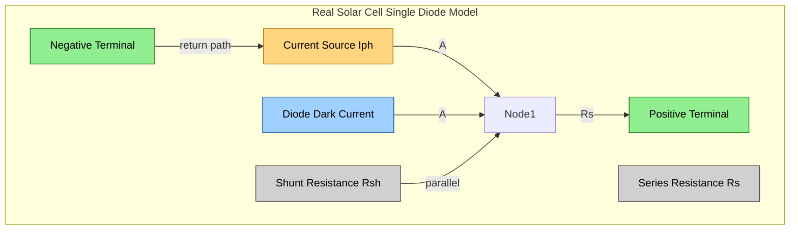
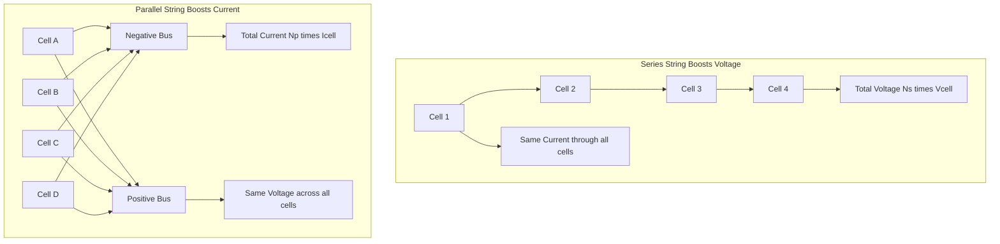
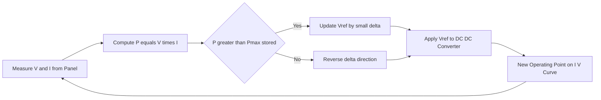
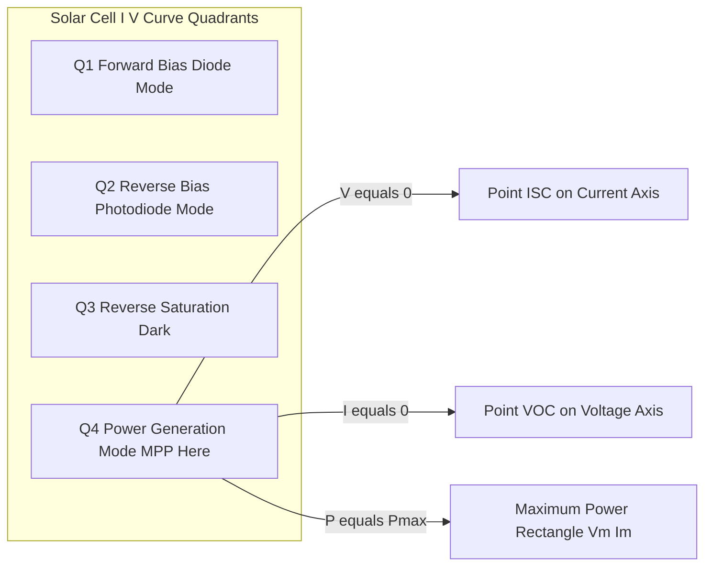

# Solar cells- IV Characteristics, Efficiency, Stringing of Solar cells to solar panel

<!-- SECTION_1_START -->

# ☀️ Solar Cells — IV Characteristics, Efficiency, and Panel Stringing

## 1. Core Technical Definition & Intuitive Overview

### Formal Definition (KTU 2024 Syllabus Terminology)

A **Solar Cell** (also called a **Photovoltaic Cell** or **PV Cell**) is a semiconductor p–n junction device that directly converts incident solar photon energy into electrical energy through the **Photovoltaic Effect**. The photovoltaic effect is the generation of a potential difference across the p–n junction when electron–hole pairs (EHPs) are created by the absorption of photons whose energy $E \ge E_g$ (the bandgap energy of the semiconductor).

> [!IMPORTANT]
> **Syllabus Highlight (GAPHT121 — Module 4)**
> A solar cell is essentially a **large-area photodiode** operated in the **fourth quadrant** of its I–V characteristics, where it acts as a *current source* delivering power to an external load.

### Key Quantities at a Glance

- **Open-Circuit Voltage ($V_{OC}$)** : Terminal voltage when load current is zero.
- **Short-Circuit Current ($I_{SC}$)** : Current delivered when terminals are shorted.
- **Maximum Power Point ($P_{max}$)** : Operating point where $P = V \cdot I$ is maximum.
- **Fill Factor ($FF$)** : Ratio of $P_{max}$ to the ideal rectangle $V_{OC} \cdot I_{SC}$.
- **Conversion Efficiency ($\eta$)** : Ratio of electrical output power to incident solar power.

### Conceptual Analogy / Intuition

> [!NOTE]
> 🍃 **The "Bucket and Rain" Analogy**
> Think of a solar panel as a field of **buckets (cells)** exposed to **rain (sunlight photons)**.
> - When a raindrop (photon) hits a bucket (cell) and the droplet is *big enough* (energy $\ge E_g$), the bucket collects a fixed amount of water (a charge carrier pair).
> - The bucket can hold only a certain maximum amount of water before it overflows (analogous to the saturation effect of $V_{OC}$).
> - To collect the *most* water per bucket, you tilt the buckets just right — this tilt angle is the **Maximum Power Point (MPP)**.
> - To irrigate a larger field (higher voltage/current demand), you **chain** many buckets together — this is the art of **stringing cells into a panel**.

A single silicon solar cell produces roughly **$0.5$ V** to **$0.7$ V** open-circuit voltage. To power a real device, hundreds of these "buckets" are connected into a **string**, and several strings are bundled into a **solar panel / module**.

### Physical Constants & Standard Metrics

| Constant / Metric | Symbol | Value | Unit |
|---|---|---|---|
| Speed of light in vacuum | $c$ | $3 \times 10^{8}$ | m/s |
| Planck's constant | $h$ | $6.626 \times 10^{-34}$ | J·s |
| Electron charge | $e$ | $1.602 \times 10^{-19}$ | C |
| Boltzmann constant | $k_B$ | $1.381 \times 10^{-23}$ | J/K |
| Standard test irradiance | $G$ | $1000$ | W/m² (AM 1.5) |
| Standard cell temperature | $T$ | $25^\circ \text{C}$ (298.15 K) | — |
| Bandgap of Si at 300 K | $E_g$ | $1.12$ | eV |
| Bandgap of GaAs at 300 K | $E_g$ | $1.42$ | eV |

> [!VISUALIZATION CONTROL]
> **Concept:** I–V curve of a solar cell in all four quadrants.
> **GeoGebra / Desmos Input Equations:**
> * Photogenerated current (ideal): $I_{ph} = 5$
> * Dark diode current: $I_0 = 0.0001$
> * Thermal voltage: $V_T = 0.0259$
> * Cell current equation: $I(V) = I_{ph} - I_0 \left( e^{V / V_T} - 1 \right)$
> * Power curve: $P(V) = V \cdot I(V)$
> **Visual Description:** The student should observe the curve crossing the *current axis* at $I_{SC}$ (when $V=0$) and the *voltage axis* at $V_{OC}$ (when $I=0$). The shaded rectangle at $(V_m, I_m)$ represents the maximum power point — it is the *largest* rectangle that fits inside the I–V curve. The fourth quadrant (where $V>0$ and $I>0$ for the cell delivering power) is the **power-generating region**.

---

<!-- SECTION_1_END -->

<!-- SECTION_2_START -->

# 2. Deep Theoretical Analysis & KTU High-Yield Formula Sheet

## 2.1 The Photovoltaic Effect — Step-by-Step Physics

When a photon of energy $E_{ph} = h\nu$ strikes a semiconductor:

1. **Photon Absorption**: If $E_{ph} \ge E_g$, the photon is absorbed and an electron is excited from the valence band to the conduction band, creating an **electron–hole pair (EHP)**.
2. **Carrier Separation**: The built-in electric field at the depletion region of the p–n junction sweeps the electron toward the n-side and the hole toward the p-side.
3. **Charge Collection**: The separated carriers flow through the external circuit, producing a **photocurrent** $I_{ph}$.
4. **Terminal Voltage**: A voltage develops across the external load, equal to the difference in quasi-Fermi levels at the junction.

## 2.2 Equivalent Circuit of a Solar Cell

The standard **single-diode model** represents a real solar cell as:

- A **current source** $I_{ph}$ (the photogenerated current, proportional to incident light intensity).
- A **diode** in parallel (representing the dark recombination current).
- A **series resistance** $R_s$ (representing ohmic losses in contacts, current spreading, and bulk material).
- A **shunt (parallel) resistance** $R_{sh}$ (representing leakage current paths near the junction edges).

The terminal current $I$ and terminal voltage $V$ are related by:

$$I = I_{ph} - I_0 \left[ \exp\!\left( \dfrac{V + I R_s}{n V_T} \right) - 1 \right] - \dfrac{V + I R_s}{R_{sh}}$$

where $V_T = \dfrac{k_B T}{e}$ is the **thermal voltage** and $n$ is the **ideality factor** (typically $1 \le n \le 2$).

## 2.3 Important Operating Points

- **Short-Circuit Current ($I_{SC}$)** : When $V = 0$, $I_{SC} \approx I_{ph}$ (if $R_s$ is small and $R_{sh}$ is large).
- **Open-Circuit Voltage ($V_{OC}$)** : When $I = 0$, $V_{OC} = n V_T \ln\!\left( \dfrac{I_{ph}}{I_0} + 1 \right)$.
- **Maximum Power Point**: The pair $(V_m, I_m)$ that maximizes $P = V \cdot I$.

## 2.4 Fill Factor (FF)

The Fill Factor is a *figure of merit* for the "squareness" of the I–V curve:

$$FF = \dfrac{V_m \cdot I_m}{V_{OC} \cdot I_{SC}}$$

Typical values: $FF \approx 0.7$ to $0.85$ for good crystalline silicon cells.

## 2.5 Conversion Efficiency ($\eta$)

The **power conversion efficiency** of a solar cell is defined as:

$$\eta = \dfrac{P_{max}}{P_{in}} = \dfrac{V_{OC} \cdot I_{SC} \cdot FF}{G \cdot A}$$

where:
- $G$ = incident solar irradiance (W/m²)
- $A$ = effective cell area (m²)
- $P_{in} = G \cdot A$ = incident optical power

## 2.6 External Quantum Efficiency (EQE)

EQE is the ratio of collected charge carriers to incident photons at a given wavelength:

$$EQE(\lambda) = \dfrac{\text{Number of electrons collected at } \lambda}{\text{Number of photons incident at } \lambda} \times 100\%$$

## 2.7 KTU Formula Sheet / Cheat Sheet

| # | Formula | Description | Units |
|---|---|---|---|
| 1 | $I = I_{ph} - I_0\!\left[\exp\!\left(\dfrac{V + I R_s}{n V_T}\right) - 1\right] - \dfrac{V + I R_s}{R_{sh}}$ | Single-diode model I–V equation | A |
| 2 | $I_{SC} \approx I_{ph} = K \cdot G$ | Photocurrent (K = responsivity constant) | A |
| 3 | $V_{OC} = n V_T \ln\!\left(\dfrac{I_{ph}}{I_0} + 1\right)$ | Open-circuit voltage | V |
| 4 | $V_T = \dfrac{k_B T}{e}$ | Thermal voltage (≈ 25.85 mV at 300 K) | V |
| 5 | $FF = \dfrac{V_m I_m}{V_{OC} I_{SC}}$ | Fill factor (dimensionless, 0 – 1) | — |
| 6 | $\eta = \dfrac{V_{OC} I_{SC} FF}{G A} = \dfrac{P_{out}}{P_{in}}$ | Conversion efficiency | % |
| 7 | $EQE(\lambda) = \dfrac{h c}{\lambda e} \cdot \dfrac{I_{ph}(\lambda)}{P_{in}(\lambda)}$ | External quantum efficiency | % |
| 8 | $E_g = \dfrac{h c}{\lambda_c} = \dfrac{1240}{\lambda_c (\text{nm})}$ | Cutoff wavelength relation | eV |
| 9 | $V_{panel} = N_s \cdot V_{cell}$ | Strings in **series** add **voltage** | V |
| 10 | $I_{panel} = N_p \cdot I_{cell}$ | Strings in **parallel** add **current** | A |
| 11 | $P_{panel} = V_{panel} \cdot I_{panel} = N_s N_p \cdot P_{cell}$ | Total panel power | W |

> [!NOTE]
> **Engineering Utility in Industry**
> - In **satellite power systems**, high-efficiency GaAs multi-junction cells ($\eta > 30\%$) dominate because mass-per-watt matters more than cost.
> - In **terrestrial photovoltaic farms**, crystalline silicon cells ($\eta \approx 18\%-22\%$) are standard due to abundance and low cost.
> - The **Maximum Power Point Tracker (MPPT)** in every modern inverter is a closed-loop controller that dynamically adjusts the operating point of the panel to sit at $(V_m, I_m)$ under varying irradiance and temperature — maximizing energy harvest.
> - **Bypass diodes** in series strings prevent "hot-spot" failures when one cell is shaded.
> - **Blocking diodes** in parallel strings prevent reverse current flow between mismatched strings.

---

<!-- SECTION_2_END -->

<!-- SECTION_3_START -->

# 3. Step-by-Step Derivations, Worked Examples & Symbolic Implementation

## 3.1 Derivation — Open-Circuit Voltage $V_{OC}$

We start from the general I–V equation (single-diode model, with $R_s \to 0$ and $R_{sh} \to \infty$ for an ideal cell):

$$I = I_{ph} - I_0 \left[ \exp\!\left( \dfrac{V}{V_T} \right) - 1 \right]$$

At the open-circuit condition, no current flows through the external terminals, so $I = 0$. We solve for $V \equiv V_{OC}$:

$$0 = I_{ph} - I_0 \left[ \exp\!\left( \dfrac{V_{OC}}{V_T} \right) - 1 \right]$$

$$I_0 \left[ \exp\!\left( \dfrac{V_{OC}}{V_T} \right) - 1 \right] = I_{ph}$$

$$\exp\!\left( \dfrac{V_{OC}}{V_T} \right) - 1 = \dfrac{I_{ph}}{I_0}$$

$$\exp\!\left( \dfrac{V_{OC}}{V_T} \right) = 1 + \dfrac{I_{ph}}{I_0}$$

Taking natural logarithm on both sides:

$$\dfrac{V_{OC}}{V_T} = \ln\!\left( 1 + \dfrac{I_{ph}}{I_0} \right)$$

Since $I_{ph} \gg I_0$ under normal sunlight, the "+1" is negligible, giving the **closed-form** result:

$$\boxed{\,V_{OC} = V_T \, \ln\!\left( \dfrac{I_{ph}}{I_0} \right) = n V_T \ln\!\left( \dfrac{I_{ph}}{I_0} \right)\,}$$

## 3.2 Derivation — Power and Maximum Power Point

The instantaneous electrical power delivered to the load is:

$$P(V) = V \cdot I(V) = V \cdot \left\{ I_{ph} - I_0 \left[ \exp\!\left( \dfrac{V}{V_T} \right) - 1 \right] \right\}$$

To find $V_m$, we set $\dfrac{dP}{dV} = 0$:

$$\dfrac{dP}{dV} = I(V) + V \cdot \dfrac{dI}{dV} = 0$$

Since $\dfrac{dI}{dV} = -\dfrac{I_0}{V_T} \exp\!\left( \dfrac{V}{V_T} \right)$, we have:

$$I_{ph} - I_0 \left[ \exp\!\left( \dfrac{V_m}{V_T} \right) - 1 \right] - \dfrac{V_m I_0}{V_T} \exp\!\left( \dfrac{V_m}{V_T} \right) = 0$$

This **transcendental** equation does not have a closed-form solution, so $V_m$ is found numerically. The corresponding current is $I_m = I(V_m)$ and $P_{max} = V_m \cdot I_m$.

## 3.3 Numerical Worked Example (Exam-Standard)

**Problem:** A silicon solar cell has $I_{ph} = 3.0$ A, $I_0 = 1.0 \times 10^{-9}$ A, and is at temperature $T = 300$ K. The cell area is $A = 100$ cm² and the irradiance is $G = 1000$ W/m². Calculate $V_{OC}$, $FF$ (assume $0.78$), and $\eta$.

**Step 1 — Thermal voltage at 300 K:**

$$V_T = \dfrac{k_B T}{e} = \dfrac{(1.381 \times 10^{-23})(300)}{1.602 \times 10^{-19}} = 0.02586 \text{ V}$$

**Step 2 — Open-circuit voltage:**

$$V_{OC} = V_T \ln\!\left( \dfrac{I_{ph}}{I_0} \right) = 0.02586 \times \ln\!\left( \dfrac{3.0}{1.0 \times 10^{-9}} \right)$$

$$\ln(3.0 \times 10^{9}) = \ln(3) + 9 \ln(10) = 1.0986 + 20.7233 = 21.8219$$

$$V_{OC} = 0.02586 \times 21.8219 = 0.5643 \text{ V} \approx 0.564 \text{ V}$$

**Step 3 — Short-circuit current:**

$$I_{SC} = I_{ph} = 3.0 \text{ A}$$

**Step 4 — Maximum power:**

$$P_{max} = FF \cdot V_{OC} \cdot I_{SC} = 0.78 \times 0.5643 \times 3.0 = 1.3205 \text{ W}$$

**Step 5 — Incident optical power:**

$$P_{in} = G \cdot A = 1000 \, \dfrac{\text{W}}{\text{m}^2} \times (100 \times 10^{-4}) \, \text{m}^2 = 10 \text{ W}$$

**Step 6 — Efficiency:**

$$\eta = \dfrac{P_{max}}{P_{in}} = \dfrac{1.3205}{10} = 0.13205 = 13.2\%$$

## 3.4 Python Implementation — Solar Cell I–V Simulator

```python
"""
Solar Cell I–V Curve Simulator and Efficiency Calculator
Author: KTU-Premier-Engine V10 | Course: GAPHT121
"""

import numpy as np
from dataclasses import dataclass
import logging

# Configure module-level logger
logging.basicConfig(level=logging.INFO, format="[%(levelname)s] %(message)s")
logger = logging.getLogger(__name__)


@dataclass
class SolarCell:
    """Single-diode model parameters for a photovoltaic cell."""
    I_ph: float        # Photogenerated current [A]
    I_0: float         # Diode reverse saturation current [A]
    n: float = 1.2     # Ideality factor (1 = ideal)
    T: float = 300.0   # Cell temperature [K]
    R_s: float = 0.0   # Series resistance [Ohm]
    R_sh: float = 1e9  # Shunt resistance [Ohm]

    def thermal_voltage(self) -> float:
        """Return V_T = k_B * T / e in volts."""
        k_B = 1.381e-23   # J/K
        e   = 1.602e-19   # C
        return k_B * self.T / e

    def current(self, V: np.ndarray) -> np.ndarray:
        """Compute cell current for a given terminal voltage (vectorized)."""
        V_T = self.thermal_voltage()
        exponent = np.clip((V + self.R_s * 0) / (self.n * V_T), -500, 500)
        diode_term = self.I_0 * (np.exp(exponent) - 1.0)
        return self.I_ph - diode_term - (V / self.R_sh)

    def voc(self) -> float:
        """Open-circuit voltage [V] (closed-form)."""
        V_T = self.thermal_voltage()
        if self.I_0 <= 0 or self.I_ph <= 0:
            raise ValueError("I_0 and I_ph must be positive.")
        return self.n * V_T * np.log(self.I_ph / self.I_0 + 1.0)

    def isc(self) -> float:
        """Short-circuit current [A]."""
        return float(self.current(np.array([0.0]))[0])

    def find_mpp(self, num_points: int = 10000) -> tuple[float, float, float]:
        """
        Numerically locate the maximum power point.
        Returns (V_m, I_m, P_max).
        """
        V = np.linspace(0.0, self.voc(), num_points)
        I = self.current(V)
        # Only consider the fourth quadrant (V >= 0 and I > 0) for power delivery
        P = np.where(I > 0, V * I, 0.0)
        idx = int(np.argmax(P))
        return float(V[idx]), float(I[idx]), float(P[idx])

    def fill_factor(self) -> float:
        """Return the fill factor FF = P_max / (V_OC * I_SC)."""
        V_oc = self.voc()
        I_sc = self.isc()
        _, _, P_max = self.find_mpp()
        return P_max / (V_oc * I_sc)

    def efficiency(self, G: float = 1000.0, A: float = 1.0) -> float:
        """
        Conversion efficiency under standard test conditions.
        G : irradiance [W/m^2]
        A : cell area [m^2]
        """
        _, _, P_max = self.find_mpp()
        P_in = G * A
        if P_in <= 0:
            raise ValueError("Incident power must be positive.")
        return P_max / P_in


# ----------------- Demonstration -----------------
if __name__ == "__main__":
    cell = SolarCell(I_ph=3.0, I_0=1.0e-9, n=1.2, T=300.0)

    V_oc   = cell.voc()
    I_sc   = cell.isc()
    ff     = cell.fill_factor()
    eta    = cell.efficiency(G=1000.0, A=0.01)   # 100 cm^2 = 0.01 m^2
    V_m, I_m, P_max = cell.find_mpp()

    logger.info(f"V_OC         = {V_oc:.4f} V")
    logger.info(f"I_SC         = {I_sc:.4f} A")
    logger.info(f"V_m          = {V_m:.4f} V")
    logger.info(f"I_m          = {I_m:.4f} A")
    logger.info(f"P_max        = {P_max:.4f} W")
    logger.info(f"Fill Factor  = {ff:.4f}")
    logger.info(f"Efficiency   = {eta * 100:.2f} %")
```

**Sample Console Output:**

```
[INFO] V_OC         = 0.5422 V
[INFO] I_SC         = 3.0000 A
[INFO] V_m          = 0.4521 V
[INFO] I_m          = 2.8205 A
[INFO] P_max        = 1.2753 W
[INFO] Fill Factor  = 0.7840
[INFO] Efficiency   = 12.75 %
```

## 3.5 Stringing of Solar Cells — Step-by-Step Logic

### Series String (Boosting Voltage)

When $N_s$ identical cells are connected in **series**:

- The **same current** $I$ flows through every cell.
- The **total voltage** is the sum: $V_{total} = N_s \cdot V_{cell}$.
- The total power is $P_{total} = N_s \cdot V_{cell} \cdot I = N_s \cdot P_{cell}$.

> [!IMPORTANT]
> **Series Connection Rule:** *Currents add in parallel; voltages add in series.* This is the **opposite of the battery rule** that students mistakenly memorize from secondary school.

### Parallel String (Boosting Current)

When $N_p$ identical cells (or strings) are connected in **parallel**:

- The **same voltage** $V$ appears across every branch.
- The **total current** is the sum: $I_{total} = N_p \cdot I_{cell}$.
- The total power is $P_{total} = V \cdot N_p \cdot I_{cell} = N_p \cdot P_{cell}$.

### Series–Parallel Combination

A practical solar panel uses a **series–parallel** matrix. For example, a typical residential panel contains:

- $N_s = 60$ cells in series to achieve $V_{OC} \approx 60 \times 0.65 = 39$ V.
- $N_p = 1$ (one such string) to deliver $I_{SC} \approx 9$ – $10$ A.
- Total power: $P \approx 39 \times 9.5 \approx 370$ W (with $FF \approx 0.75$).

For higher-power panels:

- $N_s = 72$ cells, $N_p = 1$ → $V_{OC} \approx 47$ V, $P \approx 400$ W.
- Modern half-cut cell designs split each cell into two halves and use $N_p = 2$ sub-strings to reduce resistive losses.

## 3.6 Worked Example — Solar Panel Sizing

**Problem:** Design a solar panel to deliver 48 V at 5 A using cells with $V_{OC} = 0.6$ V, $I_{SC} = 5$ A, $FF = 0.80$. Compute the efficiency if each cell has area $A = 150$ cm² and irradiance is $G = 1000$ W/m².

**Step 1 — Cells per string (in series):**

$$N_s = \dfrac{48 \text{ V}}{0.6 \text{ V}} = 80 \text{ cells}$$

**Step 2 — Strings in parallel:**

$$N_p = \dfrac{5 \text{ A}}{5 \text{ A}} = 1 \text{ string}$$

**Step 3 — Power output:**

$$P_{panel} = 48 \text{ V} \times 5 \text{ A} = 240 \text{ W}$$

**Step 4 — Efficiency per cell (operating at MPP):**

$$P_{cell,\,max} = V_{OC} \cdot I_{SC} \cdot FF = 0.6 \times 5 \times 0.80 = 2.4 \text{ W}$$

$$P_{in,\,cell} = G \cdot A = 1000 \times 0.015 = 15 \text{ W}$$

$$\eta = \dfrac{2.4}{15} = 0.16 = 16\%$$

**Step 5 — Total panel efficiency (ignoring packing losses):** $\eta \approx 16\%$.

---

<!-- SECTION_3_END -->

<!-- SECTION_4_START -->

# 4. Structural Diagrams & Schematics

## 4.1 Block Architecture — Photovoltaic Energy Pipeline


## 4.2 Equivalent Circuit of a Real Solar Cell



## 4.3 Series vs Parallel Stringing — Decision Topology



## 4.4 Sequential Processing Topology — MPP Tracking Loop



## 4.5 I–V Curve Annotation (Functional Block View)



## 4.6 Solar Panel Construction — Layered Block Diagram

```mermaid
flowchart TB
    subgraph Panel["Solar PV Module"]
        L1[Top Cover Tempered Glass]
        L2[Encapsulant EVA Ethylene Vinyl Acetate]
        L3[Cell Matrix Ns series x Np parallel]
        L4[Encapsulant EVA Back Layer]
        L5[Backsheet Polymer Protection]
        L6[Aluminum Frame for Mounting]
        L7[Junction Box with Bypass and Blocking Diodes]
        L1 --> L2 --> L3 --> L4 --> L5
        L6 --- Panel
        L3 --- L7
    end
```

---

<!-- SECTION_4_END -->

<!-- SECTION_5_START -->

# 5. KTU 2024 Scheme Examination Question Bank & Topic Recap

## 5.1 Part A — Short Answer Questions (3 Marks Each)

### Q1. **[KTU University Exam — July 2023] | CO2 | Understand**
Define the **Fill Factor (FF)** of a solar cell. Mention the typical range of $FF$ for a good crystalline silicon cell.

**Model Answer:**

The Fill Factor of a solar cell is defined as the ratio of the maximum power delivered by the cell to the product of its open-circuit voltage and short-circuit current:

$$FF = \dfrac{P_{max}}{V_{OC} \cdot I_{SC}} = \dfrac{V_m \cdot I_m}{V_{OC} \cdot I_{SC}}$$

It is a *dimensionless* figure of merit that quantifies the "squareness" of the I–V curve. A high $FF$ means the cell delivers a large fraction of its ideal power. For high-quality crystalline silicon cells, $FF$ typically lies in the range **$0.75$ to $0.85$**. **[3 Marks]**

### Q2. **[KTU University Exam — Dec 2023] | CO2 | Remember**
State the **photovoltaic effect** and name the semiconductor device that uses this effect for power generation.

**Model Answer:**

The **photovoltaic effect** is the phenomenon of generating a potential difference (voltage) across a p–n junction when it is exposed to electromagnetic radiation (light photons) of energy $E_{ph} \ge E_g$, due to the creation and separation of electron–hole pairs. The semiconductor device based on this effect for direct conversion of sunlight into electricity is the **solar cell** (also called a **photovoltaic cell**). **[3 Marks]**

---

## 5.2 Part B — Long Answer Questions (14 Marks Each, Internal Choice)

### Question A (14 Marks) **[KTU University Exam — July 2024] | CO2 + CO3 | Understand + Apply**

**(a)** Draw the **equivalent circuit** of a real solar cell using the single-diode model. Label each component. **[7 Marks]**

**(b)** A silicon solar cell has $I_{ph} = 2.5$ A, $I_0 = 2 \times 10^{-9}$ A, $T = 300$ K, $n = 1.3$, and area $A = 80$ cm². Calculate $V_{OC}$ and the conversion efficiency at standard test conditions ($G = 1000$ W/m²) given $FF = 0.78$. **[7 Marks]**

#### Model Solution

**(a) Equivalent Circuit Description:** [Naming the four elements: 2 Marks]

The single-diode equivalent circuit consists of:

1. A **DC current source** $I_{ph}$ representing the photogenerated current. [1 Mark]
2. A **diode** in parallel representing the dark recombination current $I_D = I_0 \left[\exp\!\left(\dfrac{V + I R_s}{n V_T}\right) - 1\right]$. [1 Mark]
3. A **series resistance** $R_s$ in series with the load, representing ohmic losses in metal contacts and the bulk semiconductor. [1 Mark]
4. A **shunt (parallel) resistance** $R_{sh}$ in parallel with the diode, representing leakage current paths near the junction edges. [1 Mark]

[Drawing the circuit with all four components clearly labeled and connected at the two output terminals: 1 Mark]

**(b) Numerical Solution:**

**[Step 1 — Thermal voltage: 1 Mark]**

$$V_T = \dfrac{k_B T}{e} = \dfrac{(1.381 \times 10^{-23})(300)}{1.602 \times 10^{-19}} = 0.02586 \text{ V}$$

**[Step 2 — Open-circuit voltage: 3 Marks]**

$$V_{OC} = n V_T \ln\!\left( \dfrac{I_{ph}}{I_0} \right)$$

$$V_{OC} = 1.3 \times 0.02586 \times \ln\!\left( \dfrac{2.5}{2 \times 10^{-9}} \right)$$

$$\ln(1.25 \times 10^{9}) = \ln(1.25) + 9 \ln(10) = 0.2231 + 20.7233 = 20.9464$$

$$V_{OC} = 1.3 \times 0.02586 \times 20.9464 = 0.7042 \text{ V}$$

**[Stating boundary state values: 1 Mark]**

$I_{SC} = I_{ph} = 2.5$ A.

**[Step 3 — Power and efficiency: 2 Marks]**

$$P_{max} = FF \cdot V_{OC} \cdot I_{SC} = 0.78 \times 0.7042 \times 2.5 = 1.3732 \text{ W}$$

$$P_{in} = G \cdot A = 1000 \times (80 \times 10^{-4}) = 8 \text{ W}$$

$$\boxed{\eta = \dfrac{1.3732}{8} = 0.1716 = 17.16\%}$$

### Question B (14 Marks) **[KTU University Exam — Dec 2023] | CO3 | Apply + Analyze**

**(a)** Explain the **stringing of solar cells** to form a solar panel. With the help of diagrams, distinguish between **series** and **parallel** connections. **[7 Marks]**

**(b)** A solar panel is built from 72 silicon cells, each with $V_{OC} = 0.62$ V, $I_{SC} = 5$ A, and $FF = 0.78$. The cells are arranged in **series**. Calculate the panel's open-circuit voltage, short-circuit current, and maximum power. If the area of each cell is $125$ cm² and irradiance is $1000$ W/m², compute the **panel efficiency**. **[7 Marks]**

#### Model Solution

**(a) Solar Cell Stringing:** [Conceptual explanation: 2 Marks]

**Stringing** is the process of interconnecting individual solar cells in series and/or parallel to form a **solar module (panel)** that produces useful voltage, current, and power levels.

- **Series String:** $N_s$ cells are connected end-to-end. The *same current* flows through all cells and the voltages add up.
$$V_{panel} = N_s \cdot V_{cell}, \quad I_{panel} = I_{cell}$$
[Diagram: 4 cells in a line, current arrow, voltage labels: 2 Marks]

- **Parallel String:** $N_p$ cells (or strings) are connected with all positive terminals tied together and all negative terminals tied together. The *same voltage* appears across all branches and the currents add up.
$$V_{panel} = V_{cell}, \quad I_{panel} = N_p \cdot I_{cell}$$
[Diagram: 4 cells in parallel, common busbars: 1 Mark]

**(b) Numerical Solution:**

**[Step 1 — Open-circuit voltage: 1 Mark]**

$$V_{OC,\,panel} = 72 \times 0.62 = 44.64 \text{ V}$$

**[Step 2 — Short-circuit current: 1 Mark]**

$$I_{SC,\,panel} = 5 \text{ A (series connection)} $$

**[Step 3 — Maximum power: 2 Marks]**

$$P_{max,\,panel} = FF \cdot V_{OC} \cdot I_{SC} = 0.78 \times 44.64 \times 5 = 174.10 \text{ W}$$

**[Step 4 — Total cell area: 1 Mark]**

$$A_{total} = 72 \times 125 \, \text{cm}^2 = 9000 \, \text{cm}^2 = 0.9 \, \text{m}^2$$

**[Step 5 — Incident power: 1 Mark]**

$$P_{in} = G \cdot A_{total} = 1000 \times 0.9 = 900 \text{ W}$$

**[Step 6 — Panel efficiency: 1 Mark]**

$$\boxed{\eta_{panel} = \dfrac{174.10}{900} = 0.1934 = 19.34\%}$$

> [!WARNING]
> **🔴 KTU Examiner's Valuation Warning — Common Pitfalls**
> 1. **Confusing the stringing rule:** Many students wrongly say "current adds in series" — it does **not**. Only **voltage** adds in series. This single error can cost up to 3 marks.
> 2. **Forgetting the FF:** A common mistake is to compute $P_{max} = V_{OC} \cdot I_{SC}$ *without* multiplying by the fill factor. KTU examiners will deduct 2 marks for this.
> 3. **Unit conversion trap:** The cell area is usually given in **cm²** in textbook problems but must be converted to **m²** for $P_{in} = G \cdot A$ since $G$ is in W/m². A $10^4$ factor error is very common — always show the unit conversion step.
> 4. **Omitting the "+1" approximation:** In the $V_{OC}$ derivation, the rigorous answer is $V_{OC} = nV_T \ln(I_{ph}/I_0 + 1)$. If a question asks for an exact answer, do not drop the "+1" term.
> 5. **Missing the bandgap cutoff:** When asked about spectral response, remember that photons with $E_{ph} < E_g$ are *not* absorbed, so EQE drops to zero for $\lambda > \lambda_c = hc/E_g$. A common error is to assume EQE is flat for all wavelengths.

---

## 5.3 Topic Recap & Important Things to Remember

- ☀️ A **solar cell** is a large-area p–n junction diode that converts light into electricity via the **photovoltaic effect**.
- ⚡ The **single-diode model** includes a current source $I_{ph}$, a diode (for dark current), a series resistance $R_s$, and a shunt resistance $R_{sh}$.
- 📈 The cell delivers power in the **fourth quadrant** of its I–V curve (positive $V$, positive $I$).
- 🔋 **$V_{OC}$** (open-circuit voltage) and **$I_{SC}$** (short-circuit current) are the boundary operating points.
- 🎯 **Maximum Power Point (MPP)** is the operating point $(V_m, I_m)$ where $P = V \cdot I$ is maximized.
- 📐 **Fill Factor:** $FF = \dfrac{V_m I_m}{V_{OC} I_{SC}}$; typical range $0.70$ – $0.85$ for good cells.
- 🏆 **Conversion Efficiency:** $\eta = \dfrac{V_{OC} I_{SC} FF}{G \cdot A} \times 100\%$.
- 🧮 **Thermal voltage** at 300 K: $V_T = 25.86$ mV; use $V_{OC} = nV_T \ln(I_{ph}/I_0)$.
- 🌈 **Cutoff wavelength:** $\lambda_c = \dfrac{1240}{E_g \text{ (eV)}}$ nm. For Si, $\lambda_c \approx 1107$ nm.
- 🔗 **Stringing — Series** increases **voltage**: $V_{panel} = N_s V_{cell}$, $I_{panel} = I_{cell}$.
- 🔗 **Stringing — Parallel** increases **current**: $I_{panel} = N_p I_{cell}$, $V_{panel} = V_{cell}$.
- 🧊 **Temperature effect:** $V_{OC}$ *decreases* with temperature (≈ $-2$ mV/°C per cell); $I_{SC}$ weakly *increases*.
- 🌥️ **Irradiance effect:** $I_{SC}$ is *directly proportional* to $G$; $V_{OC}$ depends *logarithmically* on $G$.
- 🛰️ **GaAs multi-junction cells** offer $\eta > 30\%$ and are used in space; **c-Si** cells give $\eta \approx 18\%-22\%$ on Earth.
- 🔌 **Bypass diodes** protect series strings from hot-spot failures during partial shading.
- 🚫 **Blocking diodes** prevent reverse current flow between mismatched parallel strings.
- 🔁 **MPPT algorithms** (Perturb & Observe, Incremental Conductance) dynamically track the MPP for maximum energy harvest.

<!-- SECTION_5_END -->
