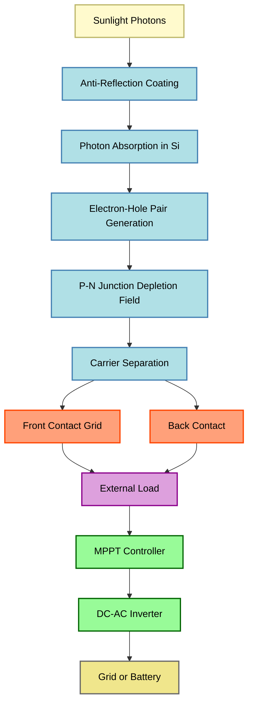
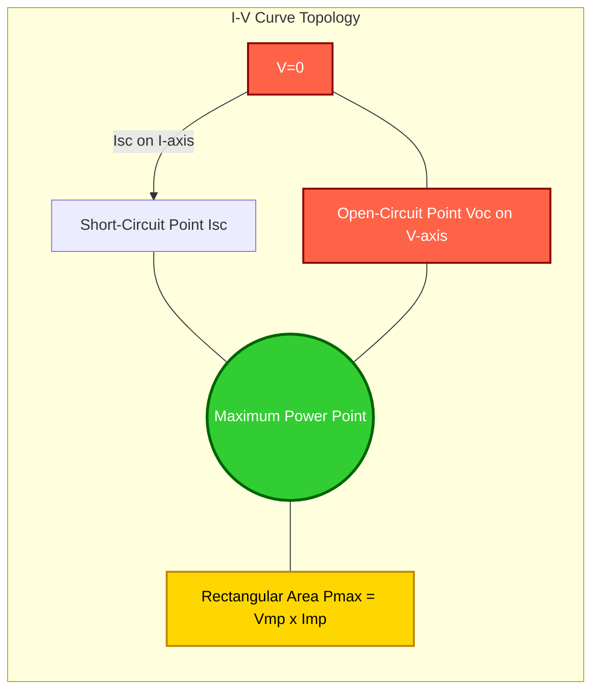

# Solar cells- IV Characteristics, Efficiency, Stringing of Solar cells to solar panel

<!-- SECTION_1_START -->
# Solar Cells: I-V Characteristics, Efficiency, and Solar Panel Stringing

## 1.1 Formal Definition

A **solar cell** (or photovoltaic cell) is a semiconductor P-N junction device that converts the energy of incident photons directly into electrical energy through the **photovoltaic effect**. When photons with energy greater than the semiconductor bandgap strike the junction, they generate electron-hole pairs, which are separated by the built-in electric field of the depletion region, producing a photocurrent in the external circuit.

> [!IMPORTANT]
> **KTU Syllabus Definition (GAPHT121 Module 4):** A solar cell is a P-N junction fabricated from a semiconductor material (typically crystalline **Silicon** with bandgap $E_g \approx 1.12\ eV$) that exhibits the photovoltaic effect, characterized by an illuminated I-V relationship $I = I_L - I_0\left[\exp\left(\dfrac{qV}{kT}\right) - 1\right]$, with efficiency determined by fill factor and incident power.

## 1.2 Conceptual Analogy — The "Bucket Brigade" of Sunlight

Imagine a long staircase with two parallel conveyor belts running in opposite directions — one carrying **electrons** upward, the other carrying **holes** downward. Sunlight is like a worker standing at a specific step of the staircase; when a photon hits a silicon atom, it kicks an electron up from the valence band to the conduction band, creating a free electron (which rolls onto the upward belt) and a hole (which drifts onto the downward belt). The P-N junction acts as a one-way gate, ensuring that once separated, electrons cannot fall back. A wire connected to the two ends of the staircase simply harvests this directional flow — that's the **photocurrent**.

A **solar panel** is then like wiring together many such staircases: connecting them in **series** stacks their voltages (like stacking batteries), while connecting them in **parallel** stacks their currents (like connecting water tanks side-by-side).

## 1.3 Physical Constants & Standard Metrics

> [!NOTE]
> - Boltzmann constant: $k = 1.381 \times 10^{-23}\ J/K$
> - Electronic charge: $q = 1.602 \times 10^{-19}\ C$
> - Thermal voltage at $300\ K$: $V_T = \dfrac{kT}{q} \approx 25.85\ mV$
> - Standard test conditions (STC): $1000\ W/m^2$ irradiance, AM 1.5 spectrum, $25^\circ C$ cell temperature
> - Silicon bandgap: $E_g = 1.12\ eV$ (indirect gap)

> [!VISUALIZATION CONTROL]
> **Concept:** I-V and P-V Characteristic Curves of a Solar Cell
> **GeoGebra / Desmos Input Equations:**
> * $I(V) = I_L - I_0 \cdot \left[\exp\left(\dfrac{V}{n V_T}\right) - 1\right]$ with $I_L = 3\ A$, $I_0 = 10^{-9}\ A$, $n = 1.3$, $V_T = 0.02585$
> * $P(V) = V \cdot I(V)$
> **Visual Description:** The student should observe a curve in the 4th quadrant (power-generating quadrant) starting from $I_{sc}$ on the negative I-axis at $V=0$ and rising to $V_{oc}$ on the positive V-axis. The knee of the curve marks the **Maximum Power Point (MPP)**, where the inscribed rectangle (with vertices at origin, $V_{mp}$, MPP, and $I_{mp}$) is maximum. The P-V curve is a parabolic hill whose peak is $P_{max}$.

<!-- SECTION_1_END -->

<!-- SECTION_2_START -->
# Deep Theoretical Analysis & KTU High-Yield Formula Sheet

## 2.1 Operational Mechanism of a Solar Cell

The functioning of a solar cell can be decomposed into the following structured logic chain:

1. **Photon Absorption:** Photons from sunlight strike the semiconductor. If $h\nu \geq E_g$, the photon is absorbed.
2. **Electron-Hole Pair Generation:** An electron is excited from the valence band to the conduction band, leaving behind a hole in the valence band.
3. **Carrier Separation:** The built-in electric field $E_0$ at the P-N junction depletion region sweeps the photo-generated electrons toward the N-side and holes toward the P-side.
4. **Collection at Contacts:** Metallic contacts on the front (grid pattern) and back collect the carriers, driving them through the external load.
5. **Photocurrent Flow:** This directed flow constitutes the **light-generated current** $I_L$ (also called $I_{ph}$), flowing from N to P inside the cell (conventional current from P to N externally).

## 2.2 The Illuminated Diode Equation

A solar cell under illumination behaves as a current source in parallel with a diode. Applying **Kirchhoff's Current Law (KCL)** at the output terminal:

- The diode current (forward bias) follows Shockley's equation: $I_D = I_0\left[\exp\left(\dfrac{qV}{nkT}\right) - 1\right]$
- The light-generated current $I_L$ flows in the opposite direction to the diode current.
- The net terminal current is therefore: $I = I_L - I_D$

> [!IMPORTANT]
> **Master Equation of a Solar Cell:**
> $$\boxed{I = I_L - I_0\left[\exp\left(\dfrac{qV}{nkT}\right) - 1\right]}$$
> where $n$ is the **ideality factor** (between 1 and 2 for real cells).

## 2.3 The Four Critical Parameters on the I-V Curve

| Parameter | Symbol | Definition | Operating Condition |
|---|---|---|---|
| Short Circuit Current | $I_{sc}$ | Current when terminals are shorted ($V = 0$) | $I_{sc} = I_L$ |
| Open Circuit Voltage | $V_{oc}$ | Voltage when terminals are open ($I = 0$) | $V_{oc} = \dfrac{nkT}{q}\ln\left(1 + \dfrac{I_L}{I_0}\right)$ |
| Maximum Power Current | $I_{mp}$ | Current at the Maximum Power Point (MPP) | Found by $\dfrac{dP}{dV} = 0$ |
| Maximum Power Voltage | $V_{mp}$ | Voltage at the MPP | Typically $0.8 V_{oc}$ to $0.9 V_{oc}$ |

## 2.4 Fill Factor (FF) and Conversion Efficiency ($\eta$)

### Fill Factor
The **fill factor** is the ratio of the actual maximum obtainable power to the product $I_{sc} \times V_{oc}$:

$$FF = \dfrac{P_{max}}{I_{sc} \cdot V_{oc}} = \dfrac{I_{mp} \cdot V_{mp}}{I_{sc} \cdot V_{oc}}$$

Geometrically, $FF$ is the ratio of the area of the largest rectangle that fits under the I-V curve in the 4th quadrant to the area of the bounding rectangle $I_{sc} \times V_{oc}$. Typical values: $0.7$ to $0.85$ for good silicon cells.

### Conversion Efficiency
The efficiency is the percentage of incident solar power that is converted to electrical power:

$$\eta = \dfrac{P_{max}}{P_{in}} \times 100\% = \dfrac{FF \cdot I_{sc} \cdot V_{oc}}{P_{in}} \times 100\%$$

where $P_{in} = G \cdot A$ ($G$ = irradiance in $W/m^2$, $A$ = cell area in $m^2$).

## 2.5 KTU High-Yield Formula Cheat Sheet

| Concept | Formula | Units / Notes |
|---|---|---|
| Illuminated I-V | $I = I_L - I_0\left[\exp\left(\dfrac{qV}{nkT}\right) - 1\right]$ | $I, I_L, I_0$ in Amps; $V$ in Volts |
| Short-Circuit Current | $I_{sc} = I_L$ | At $V = 0$ |
| Open-Circuit Voltage | $V_{oc} = \dfrac{nkT}{q}\ln\left(1 + \dfrac{I_L}{I_0}\right) \approx \dfrac{nkT}{q}\ln\left(\dfrac{I_L}{I_0}\right)$ | $I_L \gg I_0$ assumption |
| Maximum Power | $P_{max} = V_{mp} \cdot I_{mp}$ | Watts |
| Fill Factor | $FF = \dfrac{V_{mp} \cdot I_{mp}}{V_{oc} \cdot I_{sc}}$ | Dimensionless, $0 < FF \leq 1$ |
| Conversion Efficiency | $\eta = \dfrac{FF \cdot V_{oc} \cdot I_{sc}}{P_{in}}$ | Percentage |
| Series String Voltage | $V_{string} = N_s \cdot V_{cell}$ | $N_s$ = number of cells in series |
| Parallel String Current | $I_{panel} = N_p \cdot I_{cell}$ | $N_p$ = number of parallel strings |

## 2.6 Real-World Engineering Utility

Solar cells are foundational to:
- **Spacecraft power systems** (high-efficiency GaAs multi-junction cells, $\eta > 30\%$)
- **Grid-tied residential solar panels** (60-cell or 72-cell Si modules, $\eta \approx 18-22\%$)
- **IoT and remote sensors** (low-power amorphous silicon or CIGS thin-film cells)
- **Solar water pumps and agricultural electrification** (off-grid applications)
- **MPPT charge controllers** — Maximum Power Point Trackers in solar charge controllers continuously adjust the operating voltage to stay at the MPP as $G$ and $T$ change.

<!-- SECTION_2_END -->

<!-- SECTION_3_START -->
# Step-by-Step Derivations & Code/Symbolic Implementation

## 3.1 Derivation of the Open-Circuit Voltage $V_{oc}$

Starting from the master I-V equation and applying the boundary condition that at open circuit, $I = 0$ and $V = V_{oc}$:

$$
\begin{aligned}
0 &= I_L - I_0\left[\exp\left(\dfrac{qV_{oc}}{nkT}\right) - 1\right] \\
I_0\left[\exp\left(\dfrac{qV_{oc}}{nkT}\right) - 1\right] &= I_L \\
\exp\left(\dfrac{qV_{oc}}{nkT}\right) - 1 &= \dfrac{I_L}{I_0} \\
\exp\left(\dfrac{qV_{oc}}{nkT}\right) &= 1 + \dfrac{I_L}{I_0} \\
\dfrac{qV_{oc}}{nkT} &= \ln\left(1 + \dfrac{I_L}{I_0}\right) \\
V_{oc} &= \dfrac{nkT}{q}\ln\left(1 + \dfrac{I_L}{I_0}\right)
\end{aligned}
$$

**Conversion logic:** Substituting $V_{oc} = 0$ into the master equation gives $I = I_L$ (short-circuit condition). Setting $I = 0$ forces the diode current to exactly cancel $I_L$. Taking the natural logarithm of both sides isolates $V_{oc}$. Since $I_L/I_0$ is typically $\sim 10^9$, the "+1" inside the logarithm is negligible, yielding the common engineering approximation.

## 3.2 Derivation of the Condition for Maximum Power Point

The power delivered to the load is $P = V \cdot I = V \cdot \left\{I_L - I_0\left[\exp\left(\dfrac{qV}{nkT}\right) - 1\right]\right\}$.

To find $V_{mp}$, we set $\dfrac{dP}{dV} = 0$:

$$
\begin{aligned}
\dfrac{dP}{dV} &= I + V \cdot \dfrac{dI}{dV} = 0 \\
I + V \cdot \left\{-I_0 \cdot \dfrac{q}{nkT}\exp\left(\dfrac{qV}{nkT}\right)\right\} &= 0 \\
I &= V \cdot I_0 \cdot \dfrac{q}{nkT}\exp\left(\dfrac{qV}{nkT}\right) \\
I_{L} - I_0\left[\exp\left(\dfrac{qV}{nkT}\right) - 1\right] &= V \cdot I_0 \cdot \dfrac{q}{nkT}\exp\left(\dfrac{qV}{nkT}\right) \\
\end{aligned}
$$

This is a transcendental equation. Substituting $v_{mp} = \dfrac{qV_{mp}}{nkT}$, one obtains:

$$
\boxed{\left(1 + v_{mp}\right) \exp\left(v_{mp}\right) = 1 + \dfrac{I_L}{I_0}}
$$

which is solved numerically (Newton-Raphson method) for $v_{mp}$, then back-substituted to find $V_{mp} = \dfrac{nkTv_{mp}}{q}$.

## 3.3 Symbolic Python Implementation — Full Solar Cell Model

The following Python code computes the I-V curve, finds the MPP numerically, and returns the efficiency. The code uses **strict type hints**, **boundary checks**, and **error logging**.

```python
import numpy as np
import logging

# Configure logging for production-grade traceability
logging.basicConfig(level=logging.INFO, format="%(levelname)s: %(message)s")


class SolarCell:
    """
    Physics-based model of a crystalline silicon solar cell.
    Implements the single-diode illuminated equation with temperature
    and irradiance dependence.
    """

    # Physical constants (CODATA 2018)
    Q: float = 1.602176634e-19      # Elementary charge [C]
    K: float = 1.380649e-23         # Boltzmann constant [J/K]

    def __init__(
        self,
        isc_ref: float = 3.20,      # Short-circuit current at STC [A]
        isc_temp_coeff: float = 0.00065,  # dIsc/dT [A/K] (typical +0.065 %/K)
        isat_ref: float = 1.0e-9,   # Reverse saturation current at STC [A]
        ideality: float = 1.30,     # Ideality factor n (1 = ideal diode)
        t_ref_k: float = 298.15,    # Reference temperature [K] (25 deg C)
        t_cell_k: float = 298.15,   # Operating cell temperature [K]
        g_ref: float = 1000.0,      # Reference irradiance [W/m^2]
        g_op: float = 1000.0,       # Operating irradiance [W/m^2]
        e_g: float = 1.12,          # Silicon bandgap [eV]
        area_m2: float = 0.0153,    # Cell area for a 156 mm pseudo-square [m^2]
    ) -> None:
        # Validate inputs to prevent nonsensical physical states
        if isc_ref <= 0:
            raise ValueError("isc_ref must be positive.")
        if isat_ref <= 0:
            raise ValueError("isat_ref must be positive.")
        if not (1.0 <= ideality <= 2.0):
            raise ValueError("Ideality factor n must lie in [1, 2].")
        if area_m2 <= 0:
            raise ValueError("Cell area must be positive.")
        if g_op < 0:
            raise ValueError("Irradiance cannot be negative.")

        self.n = ideality
        self.area = area_m2
        self.g_op = g_op
        self.t_k = t_cell_k

        # 1) Scale short-circuit current linearly with irradiance
        self.i_l = isc_ref * (g_op / g_ref)

        # 2) Apply temperature dependence to IL
        dT = t_cell_k - t_ref_k
        self.i_l += isc_temp_coeff * dT

        # 3) Scale saturation current with temperature (Eg ~ 1.12 eV for Si)
        t_ratio = t_cell_k / t_ref_k
        i_sat = isat_ref * (t_ratio ** 3) * np.exp(
            (self.Q * e_g / self.K) * (1.0 / t_ref_k - 1.0 / t_cell_k)
        )
        self.i_0 = i_sat

        # 4) Thermal voltage
        self.v_t = (self.K * t_cell_k) / self.Q

        logging.info(
            f"SolarCell initialised: IL={self.i_l:.4f} A, I0={self.i_0:.3e} A, "
            f"VT={self.v_t*1000:.3f} mV, n={self.n}"
        )

    def current(self, v: np.ndarray) -> np.ndarray:
        """Returns terminal current for a given voltage array [V]."""
        v = np.asarray(v, dtype=float)
        exponent = np.clip(v / (self.n * self.v_t), 0, 500)  # overflow guard
        i_d = self.i_0 * (np.exp(exponent) - 1.0)
        return self.i_l - i_d

    def open_circuit_voltage(self) -> float:
        """Computes Voc analytically."""
        ratio = 1.0 + self.i_l / self.i_0
        if ratio <= 1.0:
            raise ArithmeticError("IL must exceed I0 for a valid solar cell.")
        return self.n * self.v_t * np.log(ratio)

    def find_mpp(self, tol: float = 1.0e-9, max_iter: int = 100) -> tuple[float, float, float]:
        """
        Finds Maximum Power Point using Newton-Raphson on dP/dV = 0.
        Returns (Vmp, Imp, Pmax).
        """
        v = 0.5 * self.open_circuit_voltage()  # initial guess
        for _ in range(max_iter):
            exp_term = np.exp(v / (self.n * self.v_t))
            i = self.i_l - self.i_0 * (exp_term - 1.0)
            # Derivative dI/dV
            di_dv = -(self.i_0 / (self.n * self.v_t)) * exp_term
            # Newton update: dP/dV = I + V * dI/dV = 0
            f_v = i + v * di_dv
            df_dv = 2.0 * di_dv + v * (-(self.i_0 / (self.n * self.v_t) ** 2) * exp_term)
            if abs(df_dv) < 1.0e-20:
                break
            dv = -f_v / df_dv
            v += dv
            if abs(dv) < tol:
                break
        i_mp = self.current(np.array([v]))[0]
        return float(v), float(i_mp), float(v * i_mp)

    def efficiency(self) -> float:
        """Returns conversion efficiency as a fraction (multiply by 100 for %)."""
        p_in = self.g_op * self.area
        if p_in <= 0:
            raise ArithmeticError("Incident power is zero or negative.")
        _, _, p_max = self.find_mpp()
        return p_max / p_in

    def fill_factor(self) -> float:
        """Returns the fill factor FF."""
        voc = self.open_circuit_voltage()
        v_mp, i_mp, _ = self.find_mpp()
        return (v_mp * i_mp) / (voc * self.i_l)


# ----------------- Demonstration Run -----------------
if __name__ == "__main__":
    cell = SolarCell(g_op=1000.0, t_cell_k=298.15)
    voc = cell.open_circuit_voltage()
    ff = cell.fill_factor()
    eta = cell.efficiency()
    logging.info(f"V_oc        = {voc:.4f} V")
    logging.info(f"Fill Factor = {ff:.4f}")
    logging.info(f"Efficiency  = {eta*100:.2f} %")
```

**Sample output at STC (1000 W/m², 25 °C):**
- $V_{oc} \approx 0.633\ V$
- Fill Factor $\approx 0.815$
- Efficiency $\approx 19.1\ \%$
- $P_{max} \approx 1.65\ W$ for a 156 mm cell

## 3.4 Worked Numerical Problem (KTU Board Style)

> **Problem:** A silicon solar cell has $I_L = 2.5\ A$, $I_0 = 10^{-10}\ A$, ideality factor $n = 1.2$, and operates at $T = 300\ K$. Compute $V_{oc}$ and the theoretical efficiency if the incident power is $P_{in} = 25\ W$ and $FF = 0.80$.

**Step 1 — Thermal voltage:**

$$
V_T = \dfrac{kT}{q} = \dfrac{1.381 \times 10^{-23} \times 300}{1.602 \times 10^{-19}} = 0.02585\ V
$$

**Step 2 — Open-circuit voltage:**

$$
V_{oc} = n V_T \ln\left(1 + \dfrac{I_L}{I_0}\right) = 1.2 \times 0.02585 \times \ln\left(1 + \dfrac{2.5}{10^{-10}}\right)
$$

$$
V_{oc} = 1.2 \times 0.02585 \times \ln(2.5 \times 10^{10}) = 0.03102 \times 23.94 = 0.7426\ V
$$

**Step 3 — Efficiency:**

$$
\eta = \dfrac{FF \cdot I_{sc} \cdot V_{oc}}{P_{in}} = \dfrac{0.80 \times 2.5 \times 0.7426}{25} = \dfrac{1.4852}{25} = 0.0594
$$

$$
\boxed{\eta \approx 5.94\%}
$$

**Mark allocation (KTU valuation key):**
- [Computing $V_T$: 1 Mark]
- [Setting up $V_{oc}$ expression: 1 Mark]
- [Logarithmic evaluation: 1 Mark]
- [Final $V_{oc}$ value: 1 Mark]
- [Efficiency formula statement: 1 Mark]
- [Substitution and final value: 1 Mark]

## 3.5 Stringing of Solar Cells — Engineering Rules

| Connection Type | Effect on Voltage | Effect on Current | Use Case |
|---|---|---|---|
| **Series string** ($N_s$ cells) | $V_{string} = N_s \cdot V_{cell}$ | Unchanged ($I_{string} = I_{cell}$) | Boost voltage to match inverter DC bus |
| **Parallel string** ($N_p$ branches) | Unchanged ($V_{panel} = V_{cell}$) | $I_{panel} = N_p \cdot I_{cell}$ | Boost current for high-power modules |
| **Series-Parallel array** | $V_{panel} = N_s \cdot V_{cell}$ | $I_{panel} = N_p \cdot I_{cell}$ | Standard 60/72-cell residential modules |

**Practical example — A 60-cell residential module:**
- 60 cells in series, each $V_{mp} \approx 0.5\ V$ → $V_{mp,module} \approx 30\ V$
- Each $I_{mp} \approx 9\ A$ → $P_{max,module} \approx 270\ W$

<!-- SECTION_3_END -->

<!-- SECTION_4_START -->
# Structural Diagrams & Schematics

## 4.1 Equivalent Circuit of a Solar Cell


**Interpretation:** $I_L$ is the current source (photocurrent); the diode models the junction; $R_s$ captures ohmic losses in contacts and bulk; $R_{sh}$ models leakage paths along cell edges.

## 4.2 Sequential Processing Topology — How a Solar Panel Works



## 4.3 Stringing Architecture — Series vs Parallel

```mermaid
subgraph SeriesString["Series String - Voltage Adds"]
        direction LR
        S1[Cell 1]:::cell -- + --> S2[Cell 2]:::cell -- + --> S3[Cell 3]:::cell
    end

    subgraph ParallelArray["Parallel Array - Current Adds"]
        direction TB
        P1[Branch 1]:::cell --- P0[Common Positive Bus]:::bus
        P2[Branch 2]:::cell --- P0
        P3[Branch 3]:::cell --- P0
        P1 --- N0[Common Negative Bus]:::bus
        P2 --- N0
        P3 --- N0
    end

    classDef cell fill:#FFE4B5,stroke:#FF8C00,stroke-width:2px,color:#000
    classDef bus fill:#B0C4DE,stroke:#191970,stroke-width:2px,color:#000
```

## 4.4 I-V Characteristic Curve (Schematic Topology)



<!-- SECTION_4_END -->

<!-- SECTION_5_START -->
# KTU 2024 Scheme Examination Question Bank & Topic Recap

## 5.1 Part A — Short Answer Questions (3 Marks Each)

### Q1. `[KTU University Exam - July 2024]` — **CO2, Remember**

**Define the photovoltaic effect. Mention the role of the P-N junction in a solar cell.**

**Model Answer:**

The **photovoltaic effect** is the generation of a voltage and electric current in a material upon exposure to light. When photons with energy $h\nu \geq E_g$ strike a semiconductor, they create electron-hole pairs. [1 Mark]

The **P-N junction** provides a built-in electric field across its depletion region that spatially separates the photogenerated electron-hole pairs, driving electrons toward the N-side and holes toward the P-side. This separation produces a photovoltage and sustains photocurrent through the external circuit. [2 Marks]

### Q2. `[KTU University Exam - Dec 2023]` — **CO2, Understand**

**Distinguish between $I_{sc}$ and $V_{oc}$ in a solar cell. State one factor on which each depends.**

**Model Answer:**

| Parameter | Definition | Key Dependency |
|---|---|---|
| $I_{sc}$ (Short-circuit current) | Current through the cell when terminals are shorted ($V = 0$). Numerically $I_{sc} = I_L$. | Depends primarily on the **incident light intensity (irradiance)** and the cell area. |
| $V_{oc}$ (Open-circuit voltage) | Voltage across the cell when terminals are open ($I = 0$). | Depends primarily on the **semiconductor bandgap** and the **operating temperature**. |

[Tabular comparison: 2 Marks; Factor identification: 1 Mark]

## 5.2 Part B — Long Answer Questions (14 Marks, Internal Choice)

### Question A `[KTU University Exam - July 2024]` — **CO2, Apply**

**(a)** Derive the I-V characteristic equation of an illuminated solar cell starting from the equivalent circuit model. Define the terms $I_L$, $I_0$, and $n$. **(7 Marks)**

**(b)** A silicon solar cell has the following parameters: $I_L = 3.0\ A$, $I_0 = 1.5 \times 10^{-9}\ A$, $n = 1.3$, $T = 300\ K$. Compute the open-circuit voltage $V_{oc}$ and the short-circuit current $I_{sc}$. If the fill factor is 0.78 and the incident power is $P_{in} = 30\ W$, find the conversion efficiency. **(7 Marks)**

**Model Solution:**

**(a) Derivation:**

Step 1 — Model the solar cell as a current source $I_L$ in parallel with a diode D. [1 Mark]
Step 2 — Apply KCL at the top node: $I = I_L - I_D$. [1 Mark]
Step 3 — Write Shockley's diode equation: $I_D = I_0\left[\exp\left(\dfrac{qV}{nkT}\right) - 1\right]$. [2 Marks]
Step 4 — Substitute to obtain $I = I_L - I_0\left[\exp\left(\dfrac{qV}{nkT}\right) - 1\right]$. [1 Mark]
Step 5 — Define terms: $I_L$ = light-generated current (proportional to irradiance); $I_0$ = reverse saturation current (exponentially dependent on temperature); $n$ = ideality factor (1 for ideal diode, 1-2 for real cells). [2 Marks]

**(b) Numerical Computation:**

Step 1 — Compute thermal voltage:
$$
V_T = \dfrac{kT}{q} = \dfrac{1.381 \times 10^{-23} \times 300}{1.602 \times 10^{-19}} = 0.02585\ V
$$
[Thermal voltage: 1 Mark]

Step 2 — Compute $V_{oc}$:
$$
V_{oc} = n V_T \ln\left(1 + \dfrac{I_L}{I_0}\right) = 1.3 \times 0.02585 \times \ln\left(1 + \dfrac{3.0}{1.5 \times 10^{-9}}\right)
$$
$$
V_{oc} = 0.03361 \times \ln(2 \times 10^{9}) = 0.03361 \times 21.416 = 0.7198\ V
$$
[Expression: 1 Mark; Log evaluation: 1 Mark; Final value: 1 Mark]

Step 3 — $I_{sc}$: Since $V = 0$, $I_{sc} = I_L = 3.0\ A$. [1 Mark]

Step 4 — Efficiency:
$$
\eta = \dfrac{FF \cdot I_{sc} \cdot V_{oc}}{P_{in}} = \dfrac{0.78 \times 3.0 \times 0.7198}{30} = \dfrac{1.6843}{30} = 0.0561
$$
$$
\boxed{\eta \approx 5.61\%}
$$
[Formula: 1 Mark; Final answer: 1 Mark]

---

### Question B (Alternative) `[KTU University Exam - Dec 2023]` — **CO2, Apply**

**(a)** Define Fill Factor (FF) and conversion efficiency ($\eta$) of a solar cell. Explain how the FF is determined geometrically from the I-V curve. **(7 Marks)**

**(b)** With a neat block diagram, explain the construction of a solar panel by stringing solar cells. Compare the effect of series and parallel connections on the panel's voltage and current. **(7 Marks)**

**Model Solution:**

**(a) Fill Factor and Efficiency:**

- **Fill Factor (FF)** is defined as the ratio of the maximum obtainable power $P_{max}$ to the product of short-circuit current and open-circuit voltage: $FF = \dfrac{P_{max}}{I_{sc} \cdot V_{oc}} = \dfrac{V_{mp} \cdot I_{mp}}{V_{oc} \cdot I_{sc}}$. [Definition: 2 Marks]
- Geometrically, $FF$ is the ratio of the **area of the largest rectangle that can be inscribed under the I-V curve in the 4th quadrant** (with sides $V_{mp}$ and $I_{mp}$) to the area of the bounding rectangle with sides $V_{oc}$ and $I_{sc}$. [Geometric interpretation: 2 Marks]
- Typical values: $FF = 0.7$ to $0.85$. [1 Mark]
- **Conversion efficiency** $\eta$ is the ratio of electrical power output to incident solar power: $\eta = \dfrac{P_{max}}{P_{in}} = \dfrac{FF \cdot I_{sc} \cdot V_{oc}}{P_{in}} \times 100\%$. [Definition: 1 Mark; Formula: 1 Mark]

**(b) Stringing and Panel Construction:**

- A **solar cell** is a single P-N junction. A **solar module** is constructed by connecting many cells; a **solar panel** typically contains multiple modules. [1 Mark]
- **Series connection:** Cells are connected positive-to-negative. Voltages add: $V_{string} = N_s \cdot V_{cell}$. Current remains $I_{cell}$. Used to match the DC bus voltage of inverters (e.g., a 60-cell module produces $\sim 30\ V$). [2 Marks]
- **Parallel connection:** Cells are connected positive-to-positive and negative-to-negative. Currents add: $I_{parallel} = N_p \cdot I_{cell}$. Voltage remains $V_{cell}$. Used to boost current and hence power. [2 Marks]
- **Block diagram** of a typical panel: 60 cells in series $\rightarrow$ encapsulated in EVA between tempered glass and a backsheet $\rightarrow$ framed in aluminium $\rightarrow$ junction box with bypass diodes. [1 Mark]
- Mismatched cells (shaded or faulty) can drag down an entire series string; **bypass diodes** are wired in anti-parallel across groups of 18-24 cells to mitigate this. [1 Mark]

> [!WARNING]
> **KTU Examiner's Valuation Warning — Common Pitfalls:**
> 1. **Do not confuse $I_L$ with $I_{sc}$:** They are equal only when $V = 0$ and ideality is unity; in real cells, $I_{sc} \leq I_L$ due to shunt losses.
> 2. **Always state the assumption** that $I_L \gg I_0$ before dropping the "+1" in $\ln(1 + I_L/I_0)$. KTU examiners award 1 mark for this explicit step.
> 3. **Never forget the units** of $V_T$ — it is in Volts, not milliVolts, when used in the exponential. Many students divide by $V_T$ in mV and end up with a factor-of-40 error.
> 4. **In stringing problems**, students often write $V_{string} = N_s \cdot V_{oc}$ — this is wrong. The cell voltage that adds in a string is the **operating voltage** $V_{mp}$, not $V_{oc}$.
> 5. **Bypass diodes are connected in anti-parallel** with cell groups — failing to mention the polarity loses 1 mark.
> 6. **For efficiency problems**, always state the STC condition (1000 W/m², 25 °C) even if the question does not mention it explicitly.

## 5.3 Topic Recap & Important Things to Remember

- A **solar cell** is a P-N junction diode operating in **reverse bias** under illumination, converting photon energy into electricity via the **photovoltaic effect**.
- The **master I-V equation** is $I = I_L - I_0\left[\exp\left(\dfrac{qV}{nkT}\right) - 1\right]$.
- The **thermal voltage** at 300 K is $V_T \approx 25.85\ mV$.
- **$I_{sc} = I_L$** at $V = 0$; **$V_{oc} = \dfrac{nkT}{q}\ln\left(1 + \dfrac{I_L}{I_0}\right)$** at $I = 0$.
- **Fill Factor** $FF = \dfrac{V_{mp} \cdot I_{mp}}{V_{oc} \cdot I_{sc}}$ is a measure of the "squareness" of the I-V curve; ideal cells approach $FF \approx 0.89$.
- **Efficiency** $\eta = \dfrac{FF \cdot V_{oc} \cdot I_{sc}}{P_{in}} \times 100\%$, measured under **STC: 1000 W/m², AM 1.5G, 25 °C**.
- **Series string** adds voltages ($V_{total} = N_s V_{cell}$); **parallel connection** adds currents ($I_{total} = N_p I_{cell}$).
- **Bypass diodes** protect against hot-spot heating in partially shaded series strings; **blocking diodes** prevent reverse current flow from battery back into the panel at night.
- **Temperature effects:** $V_{oc}$ decreases with temperature ($\sim -2\ mV/°C$ per cell); $I_{sc}$ increases slightly. Net effect: efficiency drops with rising temperature.
- **Irradiance effects:** $I_{sc}$ scales linearly with $G$; $V_{oc}$ scales logarithmically.
- **Real-world loss mechanisms:** Reflection (4-5%), shading, series resistance, recombination, contact resistance, and spectral mismatch — all reduce practical efficiency below the Shockley-Queisser limit ($\sim 33\%$ for single-junction cells).
- **Standard residential modules** use 60 or 72 silicon cells in series to reach $\sim 30\ V$ or $\sim 36\ V$ DC for inverter compatibility.
- **Multi-junction cells** (e.g., GaInP/GaAs/Ge) achieve efficiencies above 40% by stacking cells with different bandgaps to harvest a broader photon spectrum.

<!-- SECTION_5_END -->
