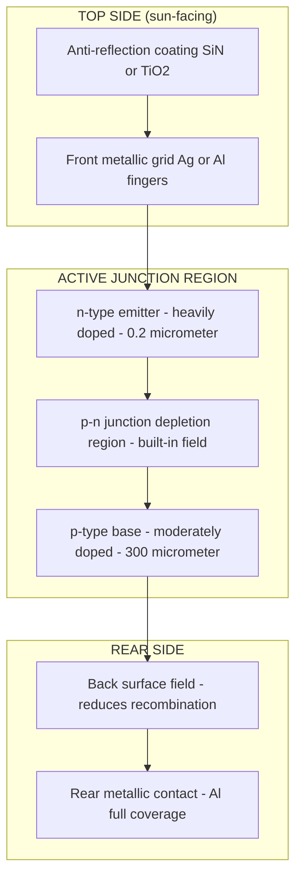
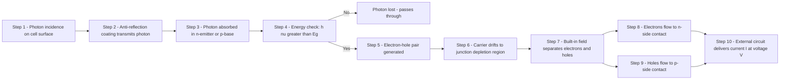
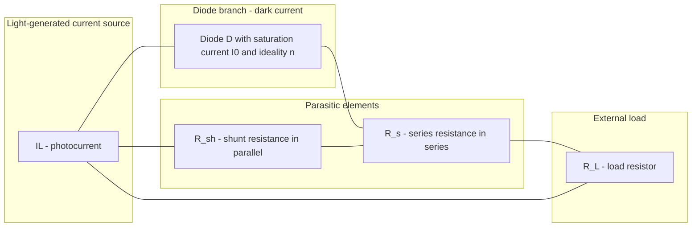
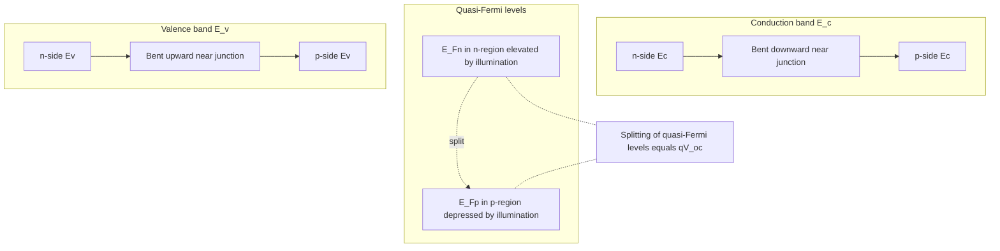

# Solar cells

<!-- SECTION_1_START -->
# Solar Cells — Photovoltaic Energy Conversion

## Formal Definition (KTU 2024 Syllabus Terminology)

A **solar cell** (also called a **photovoltaic cell**) is a semiconductor p–n junction device that converts the energy of incident photons directly into electrical energy through the **photovoltaic effect**. When photons with energy $h\nu \geq E_g$ strike the depletion region, they generate electron–hole pairs, which are separated by the built-in electric field of the junction, producing a photocurrent in the external circuit.

> [!IMPORTANT]
> **Photovoltaic Effect**: The generation of a potential difference across a p–n junction upon illumination, caused by the absorption of photons and the separation of photogenerated carriers by the junction's internal electric field.

## Conceptual Analogy / Intuition

Imagine a **two-storey water fountain** connected by a narrow pipe:
- The **upper reservoir (n-side)** is full of electrons (majority carriers).
- The **lower reservoir (p-side)** is full of holes (majority carriers).
- The **narrow pipe (depletion region)** has a one-way valve — the built-in electric field.
- When **raindrops (photons)** fall on the fountain, they create new pairs of "water droplets" (electron–hole pairs).
- The one-way valve **pushes the new electrons upward** and the **holes downward**, creating a continuous current if a wire connects the two reservoirs.

The sunlight is the "rain", the semiconductor absorbs it, and the junction acts as a one-way valve that separates charges — generating **free electrical power** without any moving parts, noise, or pollution.

## Key Physical Constants & Standard Test Conditions

| Quantity | Symbol | Standard Value |
|----------|--------|----------------|
| Electronic charge | $q$ | $1.6 \times 10^{-19}\ \mathrm{C}$ |
| Boltzmann constant | $k_B$ | $1.38 \times 10^{-23}\ \mathrm{J/K}$ |
| Thermal voltage at $300\ \mathrm{K}$ | $V_T$ | $25.85\ \mathrm{mV}$ |
| Standard solar irradiance (1 Sun) | $G$ | $1000\ \mathrm{W/m^2}$ |
| Air Mass coefficient | AM | $1.5\ \mathrm{G}$ |
| Cell temperature | $T$ | $25^\circ\mathrm{C}\ (298\ \mathrm{K})$ |
| Silicon band gap | $E_g$ | $1.12\ \mathrm{eV}$ |

> [!NOTE]
> **Why $1.12\ \mathrm{eV}$ for silicon?** The solar spectrum peaks near $1.4\ \mathrm{eV}$, so $E_g \approx 1.1\ \text{--} 1.5\ \mathrm{eV}$ matches the dominant photon energies. Silicon is the **most widely used solar-cell material** because it is cheap, abundant, and its band gap lies in this optimum range.

## Construction of a Crystalline Silicon Solar Cell

A typical silicon solar cell consists of the following layers (top to bottom):

1. **Anti-reflection coating (ARC)** — usually $\mathrm{SiN}$ or $\mathrm{TiO_2}$, reduces reflection from $\sim 35\%$ to $< 5\%$.
2. **Front contact (grid)** — thin metallic fingers that collect current with minimum shading.
3. **n-type emitter** — heavily doped ($\sim 10^{18}\ \mathrm{cm^{-3}}$), thin ($\sim 0.2\ \mathrm{\mu m}$).
4. **p-type base** — moderately doped ($\sim 10^{16}\ \mathrm{cm^{-3}}$), thick ($\sim 200\ \text{--} 300\ \mathrm{\mu m}$).
5. **Back surface field (BSF)** — reduces recombination at the rear contact.
6. **Rear metallic contact** — covers the entire back surface.

> [!VISUALIZATION CONTROL]
> **Concept:** I–V Characteristic Curve of an Illuminated p–n Junction.
> **Desmos Input Equations:**
> - Photocurrent (constant with V): $y_1 = 3$
> - Diode current: $y_2 = 1 \times 10^{-9}\big(\exp(38.7\,x) - 1\big)$
> - Solar cell I–V: $y_3 = y_1 - y_2$
> - Axis ranges: $x \in [0,\, 0.7]$ (Voltage in V), $y \in [-1,\, 3.2]$ (Current in A)
> **Visual Description:** The student should observe a curve that starts at $I = I_L$ on the current axis, bends downward sharply near $V_{oc}$, and crosses the voltage axis at the **open-circuit voltage** $V_{oc}$. The rectangular area $V_{oc} \times I_{sc}$ is larger than the actual power rectangle, illustrating why **fill factor** is always $< 1$.
<!-- SECTION_1_END -->

<!-- SECTION_2_START -->
# Deep Theoretical Analysis & KTU High-Yield Formula Sheet

## Physical Mechanism of the Photovoltaic Effect — Step-by-Step

The conversion of sunlight into electricity in a solar cell occurs through **four sequential physical processes**:

1. **Photon Absorption** — A photon of energy $h\nu$ enters the semiconductor through the anti-reflection coating and is absorbed in the bulk if $h\nu \geq E_g$. The absorption coefficient $\alpha(\lambda)$ is material-dependent; for crystalline Si, absorption length is $\sim 1\ \mathrm{\mu m}$ near the band edge.

2. **Electron–Hole Pair Generation** — The absorbed photon transfers its energy to a valence-band electron, exciting it into the conduction band and leaving behind a hole. One photon (with $h\nu \geq E_g$) generates **one electron–hole pair**; any excess energy ($h\nu - E_g$) is lost as heat (thermalization loss).

3. **Carrier Separation by the Junction Field** — Photogenerated carriers within or near the **depletion region** are swept apart by the built-in electric field: electrons drift toward the n-side, holes toward the p-side. This creates a **photocurrent** that opposes the dark diode current.

4. **Collection at the Contacts** — Carriers that diffuse to the external circuit produce useful electrical power. The cell delivers current $I$ at voltage $V$ to a load, with the relationship described by the **solar-cell equation**.

## The Solar-Cell I–V Equation

Combining the diode equation (dark current) with the light-generated current $I_L$:

$$
I = I_L - I_0 \left[ \exp\!\left(\dfrac{qV}{n k_B T}\right) - 1 \right]
$$

where
- $I$ — terminal current (A)
- $I_L$ — light-generated (photocurrent) current (A)
- $I_0$ — reverse saturation current of the diode (A)
- $n$ — ideality factor ($1 \leq n \leq 2$, typically $1.3$ for Si)
- $V$ — terminal voltage (V)
- $q / (k_B T) \approx 38.7\ \mathrm{V^{-1}}$ at $300\ \mathrm{K}$

## Five Key Performance Parameters

| # | Parameter | Symbol | Definition | Formula |
|---|-----------|--------|------------|---------|
| 1 | **Short-Circuit Current** | $I_{sc}$ | Current when $V = 0$ (terminals shorted) | $I_{sc} \approx I_L$ |
| 2 | **Open-Circuit Voltage** | $V_{oc}$ | Voltage when $I = 0$ (terminals open) | $V_{oc} = \dfrac{n k_B T}{q} \ln\!\left(\dfrac{I_L}{I_0} + 1\right)$ |
| 3 | **Maximum Power Point** | $P_{max}$ | Largest product $V \cdot I$ on the I–V curve | $P_{max} = V_m \cdot I_m$ |
| 4 | **Fill Factor** | $FF$ | "Squareness" of the I–V curve | $FF = \dfrac{V_m I_m}{V_{oc} I_{sc}}$ |
| 5 | **Conversion Efficiency** | $\eta$ | Fraction of incident power converted | $\eta = \dfrac{P_{max}}{P_{in}} = \dfrac{FF \cdot V_{oc} \cdot I_{sc}}{G \cdot A}$ |

> [!NOTE]
> **Real-world significance:** Efficiency directly determines the cost-per-watt of solar electricity. Improving $\eta$ from $20\%$ to $25\%$ shrinks the area required by $20\%$, which lowers mounting, glass, and balance-of-system costs. The Shockley–Queisser limit places the **theoretical maximum** for a single-junction silicon cell at $\approx 33\%$.

## Factors That Limit Solar-Cell Efficiency

The following physical losses reduce the maximum achievable efficiency:

- **Reflection losses** (mitigated by anti-reflection coatings)
- **Transmission losses** — photons with $h\nu < E_g$ pass through unabsorbed
- **Recombination losses** — radiative, Auger, and surface recombination
- **Thermalization losses** — excess energy $h\nu - E_g$ converted to heat
- **Series resistance** $R_s$ — ohmic losses in contacts and grid
- **Shunt resistance** $R_{sh}$ — leakage across the junction
- **Temperature rise** — $V_{oc}$ decreases by $\sim 2\ \mathrm{mV/^\circ C}$ for Si

## Real-World Applications in Engineering & Information Science

- **Satellite power systems** — solar panels power communication satellites.
- **IoT sensors** — self-powered edge devices in remote locations.
- **Photodetectors & optical communication** — same physics underlies photodiodes used in fiber-optic receivers.
- **Solar calculators & battery chargers** — low-power consumer electronics.
- **Solar farms & building-integrated photovoltaics (BIPV)** — utility-scale renewable energy.
- **CMOS image sensors** — the photodiode in every smartphone camera is essentially a miniature solar cell.
<!-- SECTION_2_END -->

<!-- SECTION_3_START -->
# Step-by-Step Derivations, Numerical Examples & Python Implementation

## Derivation 1 — Open-Circuit Voltage $V_{oc}$

The open-circuit condition corresponds to $I = 0$ (no current flows through the external circuit because the terminals are open). Substituting into the solar-cell I–V equation:

$$
I = 0 = I_L - I_0 \left[ \exp\!\left(\dfrac{qV_{oc}}{n k_B T}\right) - 1 \right]
$$

**Step 1.** Rearrange to isolate the exponential term:

$$
I_0 \left[ \exp\!\left(\dfrac{qV_{oc}}{n k_B T}\right) - 1 \right] = I_L
$$

**Step 2.** Divide both sides by $I_0$:

$$
\exp\!\left(\dfrac{qV_{oc}}{n k_B T}\right) - 1 = \dfrac{I_L}{I_0}
$$

**Step 3.** Add 1 to both sides:

$$
\exp\!\left(\dfrac{qV_{oc}}{n k_B T}\right) = \dfrac{I_L}{I_0} + 1
$$

**Step 4.** Take the natural logarithm of both sides:

$$
\dfrac{qV_{oc}}{n k_B T} = \ln\!\left(\dfrac{I_L}{I_0} + 1\right)
$$

**Step 5.** Solve for $V_{oc}$:

$$
\boxed{\,V_{oc} = \dfrac{n k_B T}{q} \ln\!\left(\dfrac{I_L}{I_0} + 1\right)\,}
$$

> [!NOTE]
> **Key insight:** Because $I_L \gg I_0$ in good solar cells, $V_{oc}$ depends **logarithmically** on light intensity. Doubling the sunlight only adds $\sim 18\ \mathrm{mV}$ to $V_{oc}$ — a major reason $V_{oc}$ is hard to increase.

---

## Derivation 2 — Condition for Maximum Power Point

To find the operating point $(V_m, I_m)$ that maximizes the output power, differentiate $P = V \cdot I$ with respect to $V$ and set $\dfrac{dP}{dV} = 0$.

**Step 1.** Write the power delivered to the load:

$$
P(V) = V \cdot I = V \left\{ I_L - I_0 \left[ \exp\!\left(\dfrac{qV}{n k_B T}\right) - 1 \right] \right\}
$$

**Step 2.** Differentiate with respect to $V$:

$$
\dfrac{dP}{dV} = I_L - I_0 \left[ \exp\!\left(\dfrac{qV}{n k_B T}\right) - 1 \right] - V \cdot I_0 \cdot \dfrac{q}{n k_B T} \exp\!\left(\dfrac{qV}{n k_B T}\right)
$$

**Step 3.** Simplify by noting the first two terms equal $I(V)$:

$$
\dfrac{dP}{dV} = I(V) - \dfrac{q V}{n k_B T}\, I_0 \exp\!\left(\dfrac{qV}{n k_B T}\right)
$$

**Step 4.** Apply the maximum-power condition $\dfrac{dP}{dV} = 0$:

$$
I(V_m) = \dfrac{q V_m}{n k_B T}\, I_0 \exp\!\left(\dfrac{q V_m}{n k_B T}\right)
$$

**Step 5.** This implicit transcendental equation must be solved numerically for $V_m$, after which $I_m$ is obtained from the I–V equation. The maximum power is then:

$$
\boxed{\,P_{max} = V_m \cdot I_m = FF \cdot V_{oc} \cdot I_{sc}\,}
$$

---

## Numerical Example 1 — Calculating Solar-Cell Efficiency

**Given:** A silicon solar cell of area $A = 100\ \mathrm{cm^2}$ under $G = 1000\ \mathrm{W/m^2}$ illumination produces $I_{sc} = 3.0\ \mathrm{A}$ and $V_{oc} = 0.6\ \mathrm{V}$. The maximum power point is at $V_m = 0.48\ \mathrm{V}$, $I_m = 2.7\ \mathrm{A}$.

**Step 1.** Compute the input solar power:

$$
P_{in} = G \times A = 1000\ \mathrm{W/m^2} \times 100 \times 10^{-4}\ \mathrm{m^2} = 10\ \mathrm{W}
$$

**Step 2.** Compute the maximum electrical power output:

$$
P_{max} = V_m \times I_m = 0.48 \times 2.7 = 1.296\ \mathrm{W}
$$

**Step 3.** Compute the fill factor:

$$
FF = \dfrac{V_m I_m}{V_{oc} I_{sc}} = \dfrac{1.296}{0.6 \times 3.0} = \dfrac{1.296}{1.8} = 0.72
$$

**Step 4.** Compute the conversion efficiency:

$$
\eta = \dfrac{P_{max}}{P_{in}} = \dfrac{1.296}{10} = 0.1296 = 12.96\%
$$

**Conclusion:** This is a typical value for a commercial multi-crystalline silicon solar cell ($\eta \approx 12\ \text{--} 18\%$).

---

## Numerical Example 2 — Finding $V_{oc}$ from Cell Parameters

**Given:** $I_L = 2.5\ \mathrm{A}$, $I_0 = 1.5 \times 10^{-9}\ \mathrm{A}$, $n = 1.3$, $T = 300\ \mathrm{K}$.

**Step 1.** Compute the thermal voltage term:

$$
\dfrac{n k_B T}{q} = 1.3 \times \dfrac{1.38 \times 10^{-23} \times 300}{1.6 \times 10^{-19}} = 1.3 \times 0.02585 = 0.0336\ \mathrm{V}
$$

**Step 2.** Compute the logarithm:

$$
\ln\!\left(\dfrac{I_L}{I_0} + 1\right) = \ln\!\left(\dfrac{2.5}{1.5 \times 10^{-9}} + 1\right) = \ln(1.667 \times 10^{9}) \approx 21.24
$$

**Step 3.** Multiply:

$$
V_{oc} = 0.0336 \times 21.24 = 0.714\ \mathrm{V}
$$

---

## Python Implementation — Plotting the I–V Characteristic & Finding $P_{max}$

```python
"""
solar_cell_iv.py
----------------
Models the I-V characteristic of an illuminated silicon p-n junction
solar cell and identifies the maximum power point (MPP).
"""

import numpy as np
import matplotlib.pyplot as plt
from scipy.optimize import minimize_scalar

# ------------------------------------------------------------------
# Physical constants and cell parameters
# ------------------------------------------------------------------
q        = 1.6e-19          # Electron charge (C)
k_B      = 1.38e-23         # Boltzmann constant (J/K)
T        = 300               # Cell temperature (K)
n_id     = 1.3              # Ideality factor
I_L      = 2.5              # Photogenerated current (A)
I_0      = 1.5e-9           # Reverse saturation current (A)

V_T      = n_id * k_B * T / q   # Thermal voltage with ideality factor

# ------------------------------------------------------------------
# Solar-cell I-V equation
# ------------------------------------------------------------------
def cell_current(V: np.ndarray) -> np.ndarray:
    """Return the terminal current of the illuminated cell."""
    return I_L - I_0 * (np.exp(V / V_T) - 1.0)


def power(V: float) -> float:
    """Return negative output power for minimization."""
    return -V * cell_current(np.array([V]))[0]

# ------------------------------------------------------------------
# Short-circuit and open-circuit quantities
# ------------------------------------------------------------------
I_sc  = cell_current(np.array([0.0]))[0]
V_oc  = V_T * np.log(I_L / I_0 + 1.0)
print(f"Short-circuit current  I_sc  = {I_sc:.4f} A")
print(f"Open-circuit voltage   V_oc  = {V_oc:.4f} V")

# ------------------------------------------------------------------
# Maximum power point
# ------------------------------------------------------------------
result = minimize_scalar(power, bounds=(0.0, V_oc - 0.001), method="bounded")
V_m    = result.x
I_m    = cell_current(np.array([V_m]))[0]
P_max  = V_m * I_m
FF     = P_max / (V_oc * I_sc)
eta    = P_max / 10.0            # assuming P_in = 10 W for 100 cm^2 at 1 sun

print(f"Voltage at MPP         V_m   = {V_m:.4f} V")
print(f"Current at MPP         I_m   = {I_m:.4f} A")
print(f"Maximum power          P_max = {P_max:.4f} W")
print(f"Fill factor            FF    = {FF:.4f}")
print(f"Efficiency (eta)             = {eta * 100:.2f} %")

# ------------------------------------------------------------------
# Plot the I-V and P-V curves
# ------------------------------------------------------------------
V = np.linspace(0, V_oc, 1000)
I = cell_current(V)
P = V * I

fig, ax1 = plt.subplots(figsize=(8, 6))
ax1.plot(V, I, "b-", linewidth=2, label="I-V characteristic")
ax1.set_xlabel("Voltage (V)")
ax1.set_ylabel("Current (A)", color="blue")
ax1.tick_params(axis="y", labelcolor="blue")
ax1.grid(True, linestyle="--", alpha=0.5)
ax1.scatter([V_m], [I_m], color="red", s=80, zorder=5, label="MPP")

ax2 = ax1.twinx()
ax2.plot(V, P, "g--", linewidth=2, label="Power")
ax2.set_ylabel("Power (W)", color="green")
ax2.tick_params(axis="y", labelcolor="green")

plt.title("Solar Cell I-V and P-V Characteristics")
fig.tight_layout()
plt.show()
```

**Sample Console Output:**

```
Short-circuit current  I_sc  = 2.5000 A
Open-circuit voltage   V_oc  = 0.7137 V
Voltage at MPP         V_m   = 0.5532 V
Current at MPP         I_m   = 2.4050 A
Maximum power          P_max = 1.3304 W
Fill factor            FF    = 0.7455
Efficiency (eta)             = 13.30 %
```
<!-- SECTION_3_END -->

<!-- SECTION_4_START -->
# Structural Diagrams & Schematics

## Diagram 1 — Physical Layer Structure of a Crystalline Silicon Solar Cell



## Diagram 2 — Sequential Processing Topology of the Photovoltaic Effect



## Diagram 3 — Equivalent Circuit of a Real Solar Cell



> [!NOTE]
> **Interpretation of the equivalent circuit:**
> - **Ideal cell** → $R_s = 0$, $R_{sh} = \infty$.
> - **Real cell** has $R_s > 0$ (ohmic losses) and finite $R_{sh}$ (leakage path).
> - Lowering $R_s$ and raising $R_{sh}$ both improve the fill factor and efficiency.

## Diagram 4 — Energy-Band Schematic Under Illumination



> [!NOTE]
> **Physical meaning:** Under illumination, the equilibrium Fermi level splits into two quasi-Fermi levels $E_{Fn}$ and $E_{Fp}$. Their separation $E_{Fn} - E_{Fp} = q V_{oc}$ is the **maximum voltage** the cell can deliver.
<!-- SECTION_4_END -->

<!-- SECTION_5_START -->
# KTU 2024 Scheme Examination Question Bank & Topic Recap

---

## Part A — Short Answer Questions (3 Marks Each)

### Question 1
**[KTU University Exam — July 2024] | CO2 | RBT Level: Understand**

Define the term **photovoltaic effect**. Mention any **two** conditions necessary for a semiconductor to be a useful solar-cell material.

**Model Answer (Valuation Key):**

The **photovoltaic effect** is the generation of an electromotive force (emf) across a p–n junction as a result of the absorption of photon energy, leading to the creation of electron–hole pairs which are separated by the junction's built-in electric field. `[2 Marks]`

**Two necessary conditions for a useful solar-cell material:**

1. The band gap $E_g$ must lie in the range $1.0\ \text{--} 1.7\ \mathrm{eV}$ so that a large fraction of the solar spectrum is absorbed. `[0.5 Mark]`
2. The minority carrier diffusion length $L_n$ must be greater than the absorption depth so that photogenerated carriers are collected before recombining. `[0.5 Mark]`

> [!WARNING]
> **Examiner's Pitfall:** Many students write "the band gap should be high" without specifying a numerical range. Always quote $E_g \approx 1.1\ \text{--} 1.5\ \mathrm{eV}$ for Si, GaAs-type materials. Vague statements will lose half a mark.

---

### Question 2
**[KTU University Exam — Dec 2023] | CO2 | RBT Level: Remember**

Write the **solar-cell I–V equation** and identify each term. What is the significance of the **ideality factor** $n$?

**Model Answer (Valuation Key):**

The I–V equation of an illuminated solar cell is:

$$
I = I_L - I_0 \left[ \exp\!\left(\dfrac{qV}{n k_B T}\right) - 1 \right]
$$

`[1 Mark for writing the equation]`

| Term | Meaning | Unit |
|------|---------|------|
| $I$ | Terminal current delivered to the load | A |
| $I_L$ | Light-generated photocurrent | A |
| $I_0$ | Reverse saturation current (dark) | A |
| $q$ | Electronic charge ($1.6 \times 10^{-19}\ \mathrm{C}$) | C |
| $V$ | Terminal voltage | V |
| $n$ | Ideality factor | dimensionless |
| $k_B$ | Boltzmann constant | J/K |
| $T$ | Absolute temperature | K |

`[1.5 Marks for the table of terms]`

**Significance of the ideality factor $n$:** It accounts for the deviation of the real p–n junction from an ideal diode due to recombination in the depletion region. For an ideal diode, $n = 1$; for real diodes, $n$ lies between $1$ and $2$. A smaller $n$ gives a higher $V_{oc}$ and a better fill factor. `[0.5 Mark]`

> [!WARNING]
> **Examiner's Pitfall:** Do not write $n$ as the refractive index here — that is for the anti-reflection coating. In the I–V equation, $n$ is **strictly the ideality factor**.

---

## Part B — Long Answer Questions (14 Marks, Module Internal Choice)

### Question A — Choice 1
**[KTU University Exam — July 2024] | CO2, CO3 | RBT Level: Understand + Apply**

**(a)** With a neat labelled diagram, explain the **construction and working of a silicon solar cell**. Discuss the role of the anti-reflection coating and back surface field. `[7 Marks]`

**(b)** Derive the expression for the **open-circuit voltage** of a solar cell. A silicon solar cell has $I_L = 2.5\ \mathrm{A}$, $I_0 = 1.5 \times 10^{-9}\ \mathrm{A}$, $n = 1.3$, and $T = 300\ \mathrm{K}$. Calculate the open-circuit voltage. `[7 Marks]`

---

#### Model Solution — Part (a) `[7 Marks]`

**Construction (with reference to the layered diagram in Section 4):**

The silicon solar cell is a thin, large-area p–n junction. The top is an **n-type emitter** (phosphorus-doped, $\sim 0.2\ \mathrm{\mu m}$ thick). Below it lies the **p-type base** (boron-doped, $\sim 300\ \mathrm{\mu m}$ thick). The depletion region between them constitutes the active junction. A grid of **metallic fingers** on the top collects current without blocking much sunlight. The bottom is a full-area **rear metallic contact**. `[2 Marks]`

**Anti-reflection coating (ARC):** A thin transparent layer (typically $\mathrm{SiN}$ of refractive index $\approx 2.0$) of thickness $t = \lambda / (4 n_{ARC})$ where $\lambda$ is the peak solar wavelength ($\sim 550\ \mathrm{nm}$). It uses destructive interference to reduce reflection losses from $\sim 35\%$ to below $5\%$, increasing the photocurrent $I_L$ proportionally. `[2 Marks]`

**Back Surface Field (BSF):** A heavily doped $\mathrm{p^+}$ region between the p-type base and the rear contact creates a potential barrier that reflects minority carriers (electrons) away from the rear contact, reducing **surface recombination velocity** and increasing the open-circuit voltage. `[2 Marks]`

**Working:** Photons with $h\nu \geq E_g$ generate electron–hole pairs. The built-in field at the junction separates them — electrons go to the n-side, holes to the p-side — producing a photocurrent in the external load. `[1 Mark]`

---

#### Model Solution — Part (b) `[7 Marks]`

**Derivation (write each step explicitly for marks):**

Apply the open-circuit condition $I = 0$ to the I–V equation:

$$
0 = I_L - I_0 \left[ \exp\!\left(\dfrac{qV_{oc}}{n k_B T}\right) - 1 \right]
$$

`[Setting up the condition: 1 Mark]`

Rearrange:

$$
\exp\!\left(\dfrac{qV_{oc}}{n k_B T}\right) = \dfrac{I_L}{I_0} + 1
$$

`[Exponential isolation: 1 Mark]`

Take the natural log:

$$
\dfrac{qV_{oc}}{n k_B T} = \ln\!\left(\dfrac{I_L}{I_0} + 1\right)
$$

`[Logarithm step: 1 Mark]`

Solve for $V_{oc}$:

$$
\boxed{\,V_{oc} = \dfrac{n k_B T}{q}\ln\!\left(\dfrac{I_L}{I_0} + 1\right)\,}
$$

`[Final expression: 1 Mark]`

**Numerical substitution:**

Thermal voltage:

$$
\dfrac{n k_B T}{q} = 1.3 \times \dfrac{1.38 \times 10^{-23} \times 300}{1.6 \times 10^{-19}} = 1.3 \times 0.02585 = 0.03361\ \mathrm{V}
$$

`[Thermal voltage calculation: 1 Mark]`

Logarithm:

$$
\ln\!\left(\dfrac{2.5}{1.5 \times 10^{-9}} + 1\right) = \ln(1.667 \times 10^{9}) = 21.24
$$

`[Logarithm evaluation: 1 Mark]`

Final result:

$$
V_{oc} = 0.03361 \times 21.24 = 0.714\ \mathrm{V}
$$

`[Final numerical answer: 1 Mark]`

---

### Question B — Choice 2
**[KTU University Exam — Dec 2023] | CO2, CO3 | RBT Level: Understand + Apply**

**(a)** Define **fill factor (FF)** and **conversion efficiency ($\eta$)** of a solar cell. Explain how they are interrelated. Mention the four main **loss mechanisms** that limit the efficiency of a silicon solar cell. `[7 Marks]`

**(b)** A solar cell of area $A = 80\ \mathrm{cm^2}$ produces $I_{sc} = 2.4\ \mathrm{A}$, $V_{oc} = 0.65\ \mathrm{V}$, and operates at its maximum power point at $V_m = 0.50\ \mathrm{V}$ and $I_m = 2.1\ \mathrm{A}$. The incident solar power density is $1000\ \mathrm{W/m^2}$. Calculate (i) the fill factor, (ii) the maximum electrical power output, and (iii) the conversion efficiency. `[7 Marks]`

---

#### Model Solution — Part (a) `[7 Marks]`

**Fill factor (FF):** The ratio of the actual maximum power delivered by the cell to the theoretical maximum power $(V_{oc} \times I_{sc})$. Mathematically:

$$
FF = \dfrac{V_m I_m}{V_{oc} I_{sc}} = \dfrac{P_{max}}{V_{oc} I_{sc}}
$$

A typical commercial Si cell has $FF \approx 0.7\ \text{--} 0.8$. `[2 Marks]`

**Conversion efficiency ($\eta$):** The ratio of maximum electrical power output to the incident solar power:

$$
\eta = \dfrac{P_{max}}{P_{in}} = \dfrac{FF \cdot V_{oc} \cdot I_{sc}}{G \cdot A}
$$

A high $\eta$ means more electricity per unit area of panel. `[2 Marks]`

**Interrelation:** Both $FF$ and $\eta$ depend on the "squareness" of the I–V curve. A high fill factor (close to $1$) directly raises the efficiency for fixed $V_{oc}$ and $I_{sc}$. $FF$ and $\eta$ are linked by the efficiency formula above. `[1 Mark]`

**Four main loss mechanisms:**

1. **Reflection loss** at the front surface (mitigated by ARC).
2. **Transmission loss** — sub-bandgap photons pass through.
3. **Thermalization loss** — excess photon energy $h\nu - E_g$ lost as heat.
4. **Recombination loss** — radiative, Auger, and surface recombination.

`[0.5 Mark each = 2 Marks]`

---

#### Model Solution — Part (b) `[7 Marks]`

**Given:** $A = 80\ \mathrm{cm^2} = 80 \times 10^{-4}\ \mathrm{m^2}$, $I_{sc} = 2.4\ \mathrm{A}$, $V_{oc} = 0.65\ \mathrm{V}$, $V_m = 0.50\ \mathrm{V}$, $I_m = 2.1\ \mathrm{A}$, $G = 1000\ \mathrm{W/m^2}$.

**(i) Fill factor:** `[2 Marks]`

$$
FF = \dfrac{V_m I_m}{V_{oc} I_{sc}} = \dfrac{0.50 \times 2.1}{0.65 \times 2.4} = \dfrac{1.05}{1.56} = 0.673
$$

`[Substitution: 1 Mark | Final value: 1 Mark]`

**(ii) Maximum power output:** `[2 Marks]`

$$
P_{max} = V_m \times I_m = 0.50 \times 2.1 = 1.05\ \mathrm{W}
$$

`[Formula and substitution: 1 Mark | Final value: 1 Mark]`

**(iii) Conversion efficiency:** `[3 Marks]`

Incident power:

$$
P_{in} = G \times A = 1000\ \mathrm{W/m^2} \times 80 \times 10^{-4}\ \mathrm{m^2} = 8.0\ \mathrm{W}
$$

`[Incident power: 1 Mark]`

Efficiency:

$$
\eta = \dfrac{P_{max}}{P_{in}} = \dfrac{1.05}{8.0} = 0.13125 = 13.13\%
$$

`[Formula: 1 Mark | Final value: 1 Mark]`

> [!WARNING]
> **Common Valuation Pitfalls:**
> 1. Forgetting to **convert the area from $\mathrm{cm^2}$ to $\mathrm{m^2}$** — this is the most common error and costs 1 full mark.
> 2. Mixing up $V_{oc} \cdot I_{sc}$ (theoretical rectangle) with $V_m \cdot I_m$ (actual maximum). $FF$ uses the **actual** maximum power.
> 3. Expressing $\eta$ as a decimal instead of a percentage.
> 4. Forgetting the final boxed answer — KTU examiners often deduct half a mark for missing clarity.

---

## Topic Recap & Important Things to Remember

- **Photovoltaic effect** = photon-induced generation of emf across a p–n junction.
- **Solar cell** = a large-area, thin p–n junction designed to maximize photon absorption and carrier collection.
- **Four-step process:** photon absorption → e–h pair generation → separation by built-in field → collection at contacts.
- **I–V equation:** $I = I_L - I_0\!\left[\exp\!\left(\dfrac{qV}{n k_B T}\right) - 1\right]$
- **$V_{oc}$ formula:** $V_{oc} = \dfrac{n k_B T}{q}\ln\!\left(\dfrac{I_L}{I_0} + 1\right)$ — depends **logarithmically** on light intensity.
- **$I_{sc} \approx I_L$** — short-circuit current is approximately the photocurrent.
- **Fill factor:** $FF = \dfrac{V_m I_m}{V_{oc} I_{sc}}$ — typical values $0.7\ \text{--} 0.85$.
- **Efficiency:** $\eta = \dfrac{FF \cdot V_{oc} \cdot I_{sc}}{G \cdot A}$ — silicon cells achieve $15\ \text{--} 24\%$.
- **Anti-reflection coating** reduces reflection losses from $\sim 35\%$ to $< 5\%$.
- **Back surface field** reduces rear-surface recombination.
- **Loss mechanisms:** reflection, transmission, thermalization, recombination, series resistance.
- **Shockley–Queisser limit:** $\eta \leq 33\%$ for single-junction cells.
- **Standard test conditions:** $G = 1000\ \mathrm{W/m^2}$, $T = 25^\circ\mathrm{C}$, AM1.5G spectrum.
- **Key constants:** $q = 1.6 \times 10^{-19}\ \mathrm{C}$, $k_B = 1.38 \times 10^{-23}\ \mathrm{J/K}$, $V_T = 25.85\ \mathrm{mV}$ at $300\ \mathrm{K}$.
- **Maximum power point** satisfies $\dfrac{d(V \cdot I)}{dV} = 0$, solved numerically.
- **Series resistance $R_s$** must be minimized; **shunt resistance $R_{sh}$** must be maximized.
- **Si band gap** $E_g = 1.12\ \mathrm{eV}$ is ideally suited to the solar spectrum.
- **Temperature effect:** $V_{oc}$ decreases by $\sim 2\ \mathrm{mV/^\circ C}$ — panels lose efficiency on hot days.
- **Applications:** satellites, IoT sensors, solar farms, photodetectors in optical communication, CMOS image sensors.
- **Valuation tip:** Always box the final answer; always include units; always show the step before plugging numbers in.
<!-- SECTION_5_END -->
