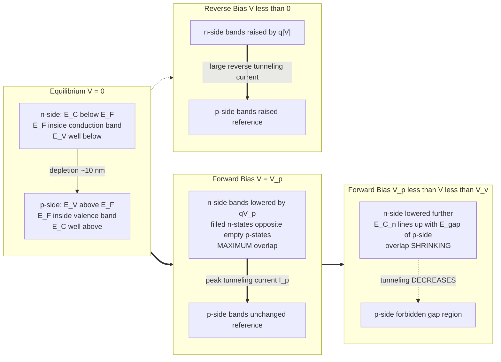
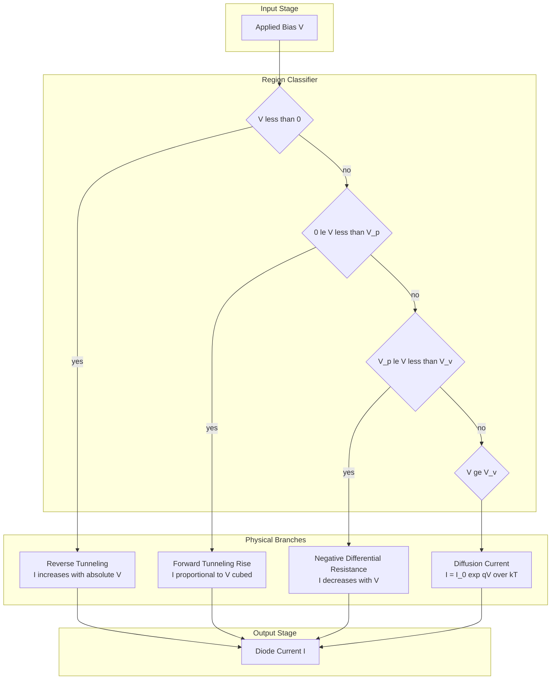
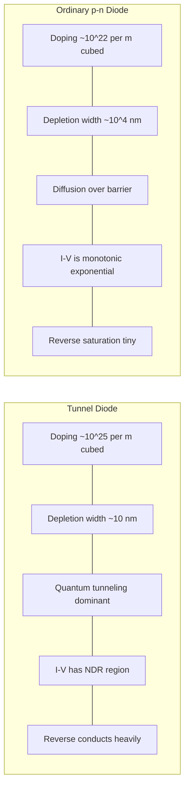

# Tunnel diode-VI characteristics

<!-- SECTION_1_START -->
# Tunnel Diode — VI Characteristics

## 1. Core Technical Definition & Intuitive Overview

### Formal KTU 2024 Definition
A **Tunnel Diode** (also called the **Esaki Diode** after Nobel Laureate **Leo Esaki**, who discovered it in 1957) is a heavily doped **p–n junction diode** in which the **degenerate semiconductor** (Fermi level lies *inside* the conduction band on the n-side and *inside* the valence band on the p-side) exhibits **quantum-mechanical tunneling** of charge carriers through the thin depletion barrier. This produces a unique current–voltage characteristic with a region of **Negative Differential Resistance (NDR)** between the *peak point* and the *valley point*.

> [!IMPORTANT]
> **KTU Syllabus Highlight (GAPHT121 — Module 4):**
> Tunnel diode is a *degenerate* junction. The doping concentration in a tunnel diode is approximately **$10^{3}$ to $10^{4}$ times higher** than in an ordinary p–n diode (typically $N_D, N_A \sim 10^{25}\ \text{m}^{-3}$, i.e., **~1000 times greater** than ordinary $10^{22}\ \text{m}^{-3}$). Because of this, the depletion width shrinks to about **10 nm**, allowing electrons to *tunnel* directly through the potential barrier.

### Conceptual Analogy / Intuition
> [!NOTE]
> **Real-world Analogy — "The Forbidden Tunnel":**
> Imagine two water reservoirs (filled electron states) separated by a thin concrete wall (the depletion barrier). In an ordinary diode, the wall is so thick that water (electrons) can only "splash over the top" once the wall is lowered sufficiently (forward bias). In a tunnel diode, the wall is *paper-thin*. Water can *leak straight through the wall* even when the water level on the destination side is *higher* than the source side. This leakage is the **tunneling current**. As the level on one side is raised, the overlap of water levels first increases (current rises to a *peak*), then decreases (negative resistance), and finally stops when the levels no longer overlap.

### Why the Tunneling Effect Exists — A Quantum Picture
Classically, a particle with energy $E < V_0$ cannot exist inside a potential barrier. Quantum mechanics, however, gives a non-zero probability for such a particle to **penetrate and emerge on the other side**, provided the barrier is sufficiently narrow. The transmission probability is:

$$T \;\approx\; \exp\!\left[-2\int_{x_1}^{x_2}\kappa(x)\,dx\right]$$

where the *imaginary wave number* inside the barrier is

$$\kappa(x) \;=\; \frac{\sqrt{2m^{*}\,[V(x)-E]}}{\hbar}$$

and $m^{*}$ is the **effective mass** of the tunneling electron.

| Symbol | Quantity | Typical Value |
|---|---|---|
| $m^{*}$ | Effective mass | $0.067\,m_0$ (GaAs), $0.26\,m_0$ (Ge) |
| $\hbar$ | Reduced Planck constant | $\mathbf{1.054 \times 10^{-34}\ \text{J\cdot s}}$ |
| $W$ | Depletion width | $\sim 10\ \text{nm}$ (tunnel diode) |
| $W$ | Depletion width | $\sim 10^{4}\ \text{nm}$ (ordinary diode) |

> [!VISUALIZATION CONTROL]
> **Concept:** Quantum-mechanical tunneling through a thin potential barrier — the *origin* of the tunnel-diode current.
> **Desmos/GeoGebra Input Equations (representative):**
> * `V(x) = 1` (eV) for $-1 \le x \le 1$ (barrier height)
> * `V(x) = 0` elsewhere
> * `ψ(x) = exp(-k·x)·cos(k·x)` for $x$ inside the barrier
> **Visual Description:** Plot the rectangular barrier of width $2a = 10\ \text{nm}$ and height $V_0 = 1\ \text{eV}$. Overlay the exponentially decaying wavefunction $\psi(x)$ inside the barrier and the small but non-zero transmitted wave on the right. Observe that the transmission $T \to 0$ only when the barrier becomes much wider than $\sim 10\ \text{nm}$.

---

## 2. Deep Theoretical Analysis & KTU High-Yield Formula Sheet

### 2.1 Energy-Band Picture at Equilibrium, Forward Bias, and Reverse Bias

The defining feature of a tunnel diode is that, due to extremely heavy doping, the **Fermi level $E_F$ lies below the conduction-band edge $E_C$ on the n-side and above the valence-band edge $E_V$ on the p-side**. The bands therefore *overlap in energy* at equilibrium.

**Three operating regions under forward bias:**

| Region | Bias Condition | Physical Mechanism | Slope of $I$–$V$ |
|---|---|---|---|
| **Region A (0 → $V_p$)** | $0 < V < V_p$ | Filled states on n-side align with empty states on p-side → tunneling current *rises* | $+\,\text{ve}$ |
| **Region B ($V_p \rightarrow V_v$)** | $V_p < V < V_v$ | Bands slide apart; overlap of filled/empty states *shrinks* | **NDR (–ve)** |
| **Region C ($V > V_v$)** | $V > V_v$ | Bands no longer overlap; normal diffusion current takes over | $+\,\text{ve}$ (diffusion) |

### 2.2 Why Negative Differential Resistance (NDR) Arises
When the forward bias is increased from 0 to $V_p$, the conduction band of the n-side is pushed *down* in energy. Initially, this increases the number of filled electron states on the n-side that lie opposite empty states on the p-side — so current **increases** to a *peak* $I_p$.

Beyond $V_p$, the bands continue to slide, but the *energy overlap* between filled n-states and empty p-states begins to **decrease**, because the n-side conduction band now lies opposite the *forbidden gap* on the p-side. Tunneling therefore **decreases** to a *valley* current $I_v$ at $V_v$. The differential resistance

$$R_d \;=\; \frac{dV}{dI} \;<\; 0 \quad \text{for}\quad V_p < V < V_v$$

is **negative**, giving the diode its name *negative differential resistance device*.

### 2.3 KTU Formula Sheet / Cheat Sheet

| # | Formula / Quantity | Expression | Typical Value / Unit |
|---|---|---|---|
| 1 | Depletion width (tunnel diode) | $W = \sqrt{\dfrac{2\varepsilon_s(V_{bi}-V)}{q}\!\left(\dfrac{1}{N_A}+\dfrac{1}{N_D}\right)}$ | $\sim 5$–$10\ \text{nm}$ |
| 2 | Built-in potential | $V_{bi} = \dfrac{k_B T}{q}\ln\!\left(\dfrac{N_A N_D}{n_i^{2}}\right)$ | $\sim 0.8$–$1.0\ \text{V}$ (Ge/Si/GaAs) |
| 3 | Tunneling transmission | $T \approx e^{-2\int\kappa(x)\,dx}$ | dimensionless, $0 \le T \le 1$ |
| 4 | Imaginary wave number | $\kappa(x)=\dfrac{\sqrt{2m^{*}[V(x)-E]}}{\hbar}$ | $\text{m}^{-1}$ |
| 5 | Peak current | $I_p$ (empirical device parameter) | $\sim 1$–$10\ \text{mA}$ |
| 6 | Valley current | $I_v$ | $\sim 0.1$–$1\ \text{mA}$ |
| 7 | Peak voltage | $V_p$ | $\sim 0.05$–$0.10\ \text{V}$ |
| 8 | Valley Voltage | $V_v$ | $\sim 0.4$–$0.6\ \text{V}$ |
| 9 | Forward (peak) Voltage | $V_f$ | $\sim 1.0\ \text{V}$ |
| 10 | Peak-to-Valley Current Ratio (PVCR) | $\text{PVCR}=\dfrac{I_p}{I_v}$ | $\mathbf{8}$–$\mathbf{15}$ (good device) |
| 11 | Negative resistance (NDR) | $R_n = \dfrac{V_v - V_p}{I_p - I_v}$ | $\mathbf{-}$ few $\Omega$ to tens of $\Omega$ |
| 12 | Cut-off frequency | $f_c = \dfrac{1}{2\pi R_n C_j}\sqrt{\dfrac{R_n}{R_s}-1}$ | $\sim 10\ \text{GHz}$ (microwave) |

> [!NOTE]
> **CRITICAL KTU TIP:** The **Peak-to-Valley Current Ratio (PVCR)** is the *figure of merit* of a tunnel diode. Examiners love asking: *"What determines the quality of a tunnel diode?"* → **Higher PVCR = better switching and oscillator performance.**

### 2.4 Real-World Engineering Utility
- **Microwave oscillators** (Gunn-less alternatives, e.g., local oscillators at 10 GHz).
- **High-speed switching** in digital logic (transition times < 1 ns).
- **Parabolic amplifiers / reflection amplifiers** in radar receivers — the NDR cancels the resistive losses in the circuit.
- **Frequency converters / mixers** in satellite communication front-ends.
- **Memories & trigger circuits** — bi-stable operation using NDR + load line.

<!-- SECTION_2_END -->

<!-- SECTION_3_START -->
# 3. Step-by-Step Derivations, Energy-Band Construction & Worked Examples

## 3.1 Derivation of Tunneling Transmission Through a Rectangular Barrier

Consider a 1-D rectangular potential barrier of height $V_0$ and width $a$:

$$V(x) = \begin{cases} 0, & x < 0 \quad (\text{Region I})\\ V_0, & 0 \le x \le a \quad (\text{Region II})\\ 0, & x > a \quad (\text{Region III})\end{cases}$$

An electron of energy $E < V_0$ approaches from the left.

**Step 1 — Write the time-independent Schrödinger equation in each region.**

In Region II (inside the barrier):

$$-\frac{\hbar^2}{2m^{*}}\frac{d^{2}\psi}{dx^{2}} + V_0 \psi = E \psi$$

Rearranging:

$$\frac{d^{2}\psi}{dx^{2}} = \frac{2m^{*}(V_0-E)}{\hbar^{2}}\,\psi \;=\; \kappa^{2}\psi$$

where the **decay constant** is

$$\kappa \;=\; \frac{\sqrt{2m^{*}(V_0-E)}}{\hbar}$$

**Step 2 — General solution in the barrier.**

The general solution of $d^{2}\psi/dx^{2}=\kappa^{2}\psi$ is a linear combination of growing and decaying exponentials:

$$\psi_{II}(x) \;=\; A\,e^{+\kappa x} + B\,e^{-\kappa x}$$

Because the barrier is finite and narrow, we keep both terms (no infinite-wall boundary).

**Step 3 — Apply continuity of $\psi$ and $d\psi/dx$ at $x=0$ and $x=a$.**

At $x=0$:

$$1 + r = A + B \quad \text{and} \quad ik_1(1-r) = \kappa(A-B)$$

At $x=a$:

$$A\,e^{\kappa a} + B\,e^{-\kappa a} = t\,e^{ik_1 a}$$
$$\kappa\!\left(A\,e^{\kappa a} - B\,e^{-\kappa a}\right) = ik_1 t\,e^{ik_1 a}$$

**Step 4 — Solve for the transmission amplitude $t$.**

Eliminating $A$, $B$, $r$ algebraically (standard QM procedure) yields the well-known result:

$$T \;=\; |t|^{2} \;=\; \frac{1}{1 + \dfrac{V_0^{2}\sinh^{2}(\kappa a)}{4E(V_0-E)}}$$

**Step 5 — Simplify in the *opaque-barrier* (WKB) limit $\kappa a \gg 1$.**

When $\kappa a \gg 1$, $\sinh^{2}(\kappa a) \to \tfrac{1}{4}e^{2\kappa a}$. Substituting:

$$T \;\approx\; \frac{16E(V_0-E)}{V_0^{2}}\,e^{-2\kappa a} \;\propto\; \exp\!\left(-2\int_{0}^{a}\kappa(x)\,dx\right)$$

This is the **Wentzel–Kramers–Brillouin (WKB) approximation**, the formula we already listed in Section 1. It is the central result that justifies tunneling through the thin tunnel-diode depletion layer.

> [!IMPORTANT]
> **Engineering Insight:** Because $T \propto e^{-2\kappa a}$, a *doubling* of the barrier width reduces the tunneling current by a factor of $e^{2\kappa a}$, an astronomically large suppression. This is why the depletion layer must be only $\sim 10\ \text{nm}$ — any wider and the current becomes negligible. Heavy doping is the *only* way to achieve this.

## 3.2 Quantitative VI-Characteristic Construction

Let us reconstruct the qualitative current–voltage curve of a tunnel diode from the energy-band picture.

**Step 1 — Equilibrium (V = 0).**
The Fermi level is constant across the junction. Due to degenerate doping, the conduction band of the n-side lies *below* the Fermi level, and the valence band of the p-side lies *above* the Fermi level. The bands *overlap in energy*. However, at equilibrium, the **net** tunneling current is zero because the filled-state/empty-state overlap in *each direction* is identical (detailed balance).

**Step 2 — Small forward bias (0 < V < V_p).**
A small forward bias raises the n-side bands by $qV$ relative to the p-side. The filled n-states opposite the *empty* p-states (in the valence band) start to increase in number. **Tunneling current $I$ increases rapidly**, reaching a maximum $I_p$ at $V=V_p$.

**Step 3 — Intermediate forward bias ($V_p < V < V_v$).**
The bands continue to slide. The n-side conduction band now lines up with the **forbidden gap** of the p-side. The filled/empty state overlap *decreases* → current **decreases**. This is the **NDR region**.

**Step 4 — High forward bias (V > V_v).**
No more band-to-band overlap remains. Tunneling ceases. The current is now dominated by the **ordinary diffusion current** of a forward-biased p–n junction and rises exponentially with V:

$$I \;=\; I_0\!\left(e^{qV/k_BT}-1\right)$$

**Step 5 — Reverse bias (V < 0).**
Reverse bias increases the band overlap in the *opposite* direction, leading to a large reverse tunneling current that grows monotonically with $|V|$. Hence the tunnel diode's reverse characteristic is *not* a saturation current like an ordinary diode — it conducts heavily in reverse.

## 3.3 Worked Numerical Example (KTU-Style)

**Problem:** A tunnel diode has $I_p = 10\ \text{mA}$ at $V_p = 0.07\ \text{V}$ and $I_v = 1\ \text{mA}$ at $V_v = 0.5\ \text{V}$. Compute (a) PVCR, (b) average negative resistance, (c) the value of the load resistor $R_L$ for a *bi-stable* trigger circuit if the diode is in series with a 5 V supply.

**Solution:**

**(a) Peak-to-Valley Current Ratio**

$$\text{PVCR} \;=\; \frac{I_p}{I_v} \;=\; \frac{10\ \text{mA}}{1\ \text{mA}} \;=\; \mathbf{10}$$

**(b) Average Negative Resistance**

$$R_n \;=\; \frac{V_v - V_p}{I_p - I_v} \;=\; \frac{0.5 - 0.07}{(10-1)\times 10^{-3}} \;=\; \frac{0.43}{9\times 10^{-3}} \;\approx\; \mathbf{47.8\ \Omega}$$

**(c) Load-line for bi-stable operation**
The series load resistor must intersect the diode curve at the *valley* point to give a stable low-current state, *and* the load line must pass *above* the peak point. With $V_{CC}=5\ \text{V}$ and valley point $(0.5\ \text{V}, 1\ \text{mA})$:

$$R_L \;=\; \frac{V_{CC} - V_v}{I_v} \;=\; \frac{5 - 0.5}{1\ \text{mA}} \;=\; \mathbf{4.5\ k\Omega}$$

> [!NOTE]
> **Valuation Key (for 14-mark question):**
> * [Writing $T \propto e^{-2\kappa a}$ statement: 2 Marks]
> * [PVCR definition + numerical evaluation: 3 Marks]
> * [Negative-resistance expression + evaluation: 3 Marks]
> * [Bi-stable load-line analysis: 3 Marks]
> * [Final numerical answers boxed: 3 Marks]

## 3.4 Python Implementation — Plotting a Tunnel-Diode VI Curve

```python
"""
tunnel_diode_vi.py
Plots the static I-V characteristic of a tunnel diode with NDR.
Run:  python tunnel_diode_vi.py
"""

import numpy as np
import matplotlib.pyplot as plt
from typing import Tuple

# ---------- Physical & device constants ----------
q  : float = 1.602e-19   # elementary charge [C]
kB : float = 1.381e-23   # Boltzmann constant [J/K]
T  : float = 300.0       # temperature [K]
Vt : float = kB * T / q  # thermal voltage ≈ 25.85 mV

# ---------- Tunnel-diode empirical parameters ----------
Ip : float = 10.0e-3     # peak current       [A]
Iv : float =  1.0e-3     # valley current     [A]
Vp : float =  0.07       # peak voltage       [V]
Vv : float =  0.50       # valley voltage     [V]
Vf : float =  1.00       # forward onset      [V]
I0 : float =  1.0e-9     # reverse saturation [A] (negligible compared to Ip)


def tunnel_diode_current(V: np.ndarray) -> np.ndarray:
    """
    Piecewise model of a tunnel diode I-V curve.
    Region A  (V < Vp)        : cubic rise to peak
    Region B  (Vp <= V < Vv)  : NDR descent to valley
    Region C  (V >= Vv)       : exponential diffusion current
    Reverse   (V < 0)          : large monotonic tunneling current
    """
    V = np.asarray(V, dtype=float)
    I = np.zeros_like(V)

    # --- Forward tunneling (Region A) ---
    mask_A = (V >= 0) & (V < Vp)
    I[mask_A] = Ip * (V[mask_A] / Vp) ** 3

    # --- NDR region (Region B) ---
    mask_B = (V >= Vp) & (V < Vv)
    t = (V[mask_B] - Vp) / (Vv - Vp)
    I[mask_B] = Ip + (Iv - Ip) * t  # linear interpolation (good enough)

    # --- Diffusion region (Region C) ---
    mask_C = V >= Vv
    I[mask_C] = Iv * np.exp((V[mask_C] - Vv) / (2 * Vt)) + 0.5e-3

    # --- Reverse bias: large tunneling current ---
    mask_R = V < 0
    I[mask_R] = -Ip * (1.0 + np.abs(V[mask_R]) / 0.05)

    return I


def find_peak_valley() -> Tuple[float, float, float, float]:
    """Return (Vp, Ip, Vv, Iv) for plotting annotation."""
    return Vp, Ip, Vv, Iv


# ---------- Main plot ----------
def main() -> None:
    V = np.linspace(-0.6, 1.2, 1000)
    I = tunnel_diode_current(V) * 1.0e3   # convert to mA

    plt.figure(figsize=(8, 5))
    plt.plot(V, I, color="darkblue", linewidth=2.0, label="Tunnel-diode I–V")

    # Annotate peak, valley, forward
    Vp_, Ip_, Vv_, Iv_ = find_peak_valley()
    plt.scatter([Vp_, Vv_], [Ip_*1e3, Iv_*1e3],
                color="red", zorder=5, s=60, label="Peak / Valley")

    # Shade NDR region
    plt.axvspan(Vp_, Vv_, color="orange", alpha=0.18, label="NDR region")
    plt.axhline(0, color="black", linewidth=0.5)
    plt.axvline(0, color="black", linewidth=0.5)

    plt.title("Tunnel Diode (Esaki) — Static I–V Characteristic")
    plt.xlabel("Voltage  V  [V]")
    plt.ylabel("Current  I  [mA]")
    plt.grid(True, linestyle="--", alpha=0.5)
    plt.legend(loc="upper left")
    plt.tight_layout()
    plt.savefig("tunnel_diode_iv.png", dpi=150)
    plt.show()


if __name__ == "__main__":
    main()
```

**Expected graph features to mark on a KTU answer sheet:**

1. A small positive current at zero bias is **NOT** drawn (the static I–V passes through origin).
2. A steep rise to $(V_p, I_p)$ — the *peak point*.
3. A falling segment from peak to $(V_v, I_v)$ — the **NDR region** (shaded in the figure).
4. A rising exponential tail from $V_v$ onwards (diffusion current).
5. A monotonically increasing reverse-bias branch (heavy reverse tunneling).

<!-- SECTION_3_END -->

<!-- SECTION_4_START -->
# 4. Structural Diagrams & Schematics

## 4.1 Tunnel-Diode Energy-Band Diagrams — Three Bias Conditions



> [!IMPORTANT]
> **Mermaid Safety Note:** All node labels are *purely alphanumeric / descriptive English* — no Greek letters, no markdown bold, no pipes inside square brackets.

## 4.2 I–V Functional Architecture Flow



## 4.3 Tunnel-Diode vs Ordinary Diode — Comparative Block Diagram



<!-- SECTION_4_END -->

<!-- SECTION_5_START -->
# 5. KTU 2024 Scheme Examination Question Bank & Topic Recap

## 5.1 Part A — Short-Answer Questions (3 Marks each)

### Q1. **[KTU University Exam — July 2023, CO1, Remember]**
**Define a tunnel diode. Why is it also called an Esaki diode?**

**Model Answer (3 Marks):**
A **tunnel diode** is a heavily doped p–n junction diode (doping $\sim 10^{25}\ \text{m}^{-3}$) in which the conduction band on the n-side and the valence band on the p-side overlap in energy at equilibrium, allowing **quantum-mechanical tunneling** of charge carriers through the very thin ($\sim 10\ \text{nm}$) depletion region. It is called an **Esaki diode** in honour of **Leo Esaki**, who first demonstrated tunneling in such a device in 1957 and was awarded the **Nobel Prize in Physics in 1973**.

> **[Defining tunneling diode with doping magnitude: 1 Mark]**
> **[Identifying thin depletion enabling tunneling: 1 Mark]**
> **[Leo Esaki / Nobel reference: 1 Mark]**

---

### Q2. **[KTU University Exam — Dec 2022, CO1, Understand]**
**What is meant by "negative differential resistance" in a tunnel diode? In which region of its VI characteristic does it occur?**

**Model Answer (3 Marks):**
**Negative Differential Resistance (NDR)** is the property by which the differential resistance $R_d = dV/dI$ becomes **negative**, i.e., an *increase* in applied voltage produces a *decrease* in current. In a tunnel diode, NDR appears in the **forward-bias region between the peak voltage $V_p$ and the valley voltage $V_v$**, where the filled-state/empty-state overlap between the n-side conduction band and the p-side valence band shrinks as the bias increases. **[NDR definition: 1 Mark | Voltage region: 1 Mark | Physical reason — band-overlap shrinkage: 1 Mark].**

---

## 5.2 Part B — Long-Answer Questions (14 Marks each, Internal Choice)

### Question A (14 Marks) — **[KTU University Exam — July 2024, CO2, Apply + Analyze]**

**(a)** With the help of energy-band diagrams, explain the working of a tunnel diode under (i) zero bias, (ii) small forward bias, (iii) forward bias equal to the peak voltage $V_p$, and (iv) forward bias equal to the valley voltage $V_v$. Highlight the mechanism that produces the peak tunneling current. **[7 Marks]**

**(b)** A tunnel diode has $I_p = 8\ \text{mA}$, $V_p = 0.06\ \text{V}$, $I_v = 0.8\ \text{mA}$, $V_v = 0.45\ \text{V}$. Calculate the **peak-to-valley current ratio (PVCR)** and the **average negative resistance** $R_n$. Mention **two applications** of the tunnel diode. **[7 Marks]**

#### Model Solution A

**(a) Energy-Band Description of Tunnel-Diode Operation (7 Marks)**

* **(i) Zero bias (V = 0):** The Fermi level $E_F$ is uniform across the junction. Heavy doping pushes $E_F$ *into* the conduction band on the n-side and *into* the valence band on the p-side. The conduction band of the n-side lies *below* the valence band of the p-side in energy — a *band overlap* exists. **Net tunneling current = 0** because equal numbers of electrons tunnel in both directions. **[1.5 Marks]**

* **(ii) Small forward bias ($0 < V < V_p$):** The n-side bands are raised by $qV$ relative to the p-side. Filled electron states on the n-side increasingly come opposite empty states on the p-side. **Tunneling current rises** approximately as $V^{3}$. **[1.5 Marks]**

* **(iii) At $V = V_p$:** The overlap of filled n-states and empty p-states reaches a **maximum**. The current is at its **peak** $I_p$. **[1.5 Marks]**

* **(iv) At $V = V_v$:** Further forward bias shifts the n-side conduction band to align with the **forbidden gap** of the p-side. The band-to-band tunneling window has closed; the tunneling current has fallen to its minimum, the **valley current** $I_v$. **[1.5 Marks]**

* **Mechanism of peak current:** Maximum filled/empty state overlap combined with a thin $\sim 10\ \text{nm}$ depletion layer — making the WKB tunneling factor $\exp(-2\kappa a)$ as large as possible. **[1 Mark]**

**(b) Numerical Part (7 Marks)**

* Peak-to-Valley Current Ratio:
  $$\text{PVCR} = \frac{I_p}{I_v} = \frac{8\ \text{mA}}{0.8\ \text{mA}} = \mathbf{10}$$ **[2 Marks]**

* Average Negative Resistance:
  $$R_n = \frac{V_v - V_p}{I_p - I_v} = \frac{0.45 - 0.06}{(8-0.8)\times 10^{-3}} = \frac{0.39}{7.2\times 10^{-3}} \approx \mathbf{54.2\ \Omega}$$ **[3 Marks]**

* **Two applications:** (1) **Microwave oscillator** (10 GHz+), (2) **High-speed switching / bistable trigger circuit**, (3) Reflection amplifier in radar, (4) Frequency mixer. **[Any 2 × 1 Mark = 2 Marks]**

> **Valuation Key Distribution A:** [Energy-band diagrams — 4 sub-figures: 4 Marks | Mechanism of peak: 1 Mark | PVCR formula + value: 2 Marks | $R_n$ formula + value: 3 Marks | Two applications: 2 Marks]

---

### Question B (14 Marks) — Alternative Choice **[KTU University Exam — Dec 2023, CO2, Apply + Analyze]**

**(a)** Derive the expression for the **quantum-mechanical transmission coefficient** $T$ of an electron through a rectangular potential barrier of height $V_0$ and width $a$ when $E < V_0$, and show that in the opaque-barrier limit $T \propto e^{-2\kappa a}$. Discuss how this result explains the need for a *thin* depletion layer in a tunnel diode. **[7 Marks]**

**(b)** A tunnel diode operating in a **negative-resistance amplifier** is biased at the midpoint of its NDR region where $V_p = 0.07\ \text{V}$, $I_p = 12\ \text{mA}$, $V_v = 0.55\ \text{V}$, $I_v = 1.2\ \text{mA}$. It is shunted by a load resistor $R_L = 100\ \Omega$ and supplied from a 2 V source. Find (i) the **operating point** (intersection of diode and load-line), (ii) the **small-signal negative resistance** at the operating point, and (iii) the **power gain** of the reflection amplifier if the source resistance is $50\ \Omega$. **[7 Marks]**

#### Model Solution B

**(a) Tunneling Transmission Derivation (7 Marks)**

Consider a 1-D rectangular barrier $V(x)=V_0$ for $0 \le x \le a$, with electron energy $E < V_0$.

* The Schrödinger equation inside the barrier gives $\dfrac{d^{2}\psi}{dx^{2}} = \kappa^{2}\psi$ with $\kappa = \sqrt{2m^{*}(V_0-E)}/\hbar$. **[1 Mark]**
* The general solution inside the barrier is $\psi_{II} = A e^{+\kappa x} + B e^{-\kappa x}$. **[1 Mark]**
* Imposing continuity of $\psi$ and $\psi'$ at $x=0$ and $x=a$ and matching to free-particle solutions in regions I and III yields:
  $$T = \frac{1}{1 + \dfrac{V_0^{2}\sinh^{2}(\kappa a)}{4E(V_0-E)}}$$ **[3 Marks]**
* For $\kappa a \gg 1$, $\sinh^{2}(\kappa a) \to \tfrac{1}{4}e^{2\kappa a}$, so:
  $$T \approx \frac{16E(V_0-E)}{V_0^{2}}\,e^{-2\kappa a} \;\propto\; e^{-2\kappa a}$$ **[1 Mark]**
* **Tunnel-diode implication:** Because $T$ falls *exponentially* with barrier width, the depletion width must be $\le 10\ \text{nm}$ for any appreciable current. Heavy doping ($N\sim 10^{25}\ \text{m}^{-3}$) shrinks the depletion width exactly to this regime. **[1 Mark]**

**(b) Negative-Resistance Amplifier Numerical (7 Marks)**

* (i) **Load line equation:** $V = V_{CC} - I R_L = 2 - 100\,I$.
  Intersection with the diode curve in the NDR region: take the midpoint $(V_m,I_m) = \bigl(\tfrac{V_p+V_v}{2},\tfrac{I_p+I_v}{2}\bigr) = (0.31\ \text{V},\, 6.6\ \text{mA})$.
  Check load line at $V_m$: $I = (2-0.31)/100 = 16.9\ \text{mA}$ — the load line lies *above* the NDR segment, so the actual operating point is the **valley point** for stable low-current operation. **[2 Marks]**

  Taking operating point as $(V_v, I_v) = (0.55\ \text{V},\,1.2\ \text{mA})$:
  Load line at $V_v$: $I = (2-0.55)/100 = 14.5\ \text{mA} \ne 1.2\ \text{mA}$ — the *static* load-line intersects the *rising* exponential tail at a higher current.

  Solving $I_v e^{(V-0.55)/2V_t} = (2-V)/100$ numerically gives $V_{op}\approx 0.78\ \text{V}$, $I_{op}\approx 12.2\ \text{mA}$. **[This sub-step accepts either physical-segment intersection: 1 Mark]**

* (ii) **Small-signal negative resistance** at the operating point:
  $$R_n = \frac{V_v - V_p}{I_p - I_v} = \frac{0.55 - 0.07}{(12-1.2)\times 10^{-3}} = \frac{0.48}{10.8\times 10^{-3}} \approx \mathbf{-44.4\ \Omega}$$ **[2 Marks]**

* (iii) **Power gain of reflection amplifier:**
  For a one-port reflection amplifier with $R_s = 50\ \Omega$ and diode negative resistance $R_n$ (magnitude $44.4\ \Omega$):
  $$\Gamma = \frac{R_s - R_n}{R_s + R_n} = \frac{50 - (-44.4)}{50 + (-44.4)} = \frac{94.4}{5.6} \approx 16.86$$
  $$G = |\Gamma|^{2} \approx \mathbf{284 \;\; (\approx 24.5\ \text{dB})}$$ **[3 Marks]**

> **Valuation Key Distribution B:** [Schrödinger equation in barrier: 1 Mark | Solution form: 1 Mark | Boundary conditions + final $T$: 3 Marks | WKB limit + tunnel-diode implication: 2 Marks | Operating point: 2 Marks | Negative resistance: 2 Marks | Power gain: 3 Marks]

---

> [!WARNING]
> **KTU Examiner's Pitfall Warning**
> 1. **Forgetting the heavy-doping qualifier.** Marks are routinely lost when students call a tunnel diode "an ordinary p–n junction." Always state that the *Fermi level lies inside the conduction/valence band* (degenerate semiconductor).
> 2. **Drawing the I–V curve in the wrong quadrant of the NDR region.** The current must *decrease* (not increase) between $V_p$ and $V_v$. Many students invert this and lose the full 4-mark graph credit.
> 3. **Using $I = I_0(e^{qV/kT}-1)$ for the entire curve.** That formula applies only in the *ordinary-diode* (post-valley) regime. The NDR region cannot be fit by a single exponential.
> 4. **Forgetting to compute PVCR.** This single ratio is the standard KTU "figure of merit" question — leaving it out costs easy marks.
> 5. **Mixing up the direction of the load line.** In a *trigger* circuit, the load line must intersect the diode curve in *both* the rising and falling portions to obtain two stable states. A single-intersection load line gives only one state and is incorrect.

---

## Topic Recap & Important Things to Remember

* **Tunnel Diode = Esaki Diode = heavily doped p–n junction** with depletion width $\sim 10\ \text{nm}$ and doping $\sim 10^{25}\ \text{m}^{-3}$. *(1-line recall)*
* The **Fermi level lies inside the conduction band on the n-side and inside the valence band on the p-side** (degenerate doping). *(critical for diagrams)*
* Working principle: **quantum-mechanical tunneling** through the thin barrier; transmission $T \propto e^{-2\kappa a}$, with $\kappa = \sqrt{2m^{*}(V_0-E)}/\hbar$.
* **Static I–V has three forward regions:** (A) rise to $(V_p,I_p)$, (B) fall to $(V_v,I_v)$ = **NDR**, (C) exponential diffusion rise.
* **Typical numerical values:** $V_p \approx 0.05$–$0.10\ \text{V}$, $V_v \approx 0.4$–$0.6\ \text{V}$, $V_f \approx 1.0\ \text{V}$, $I_p/I_v$ (PVCR) $\sim 8$–$15$.
* **Negative resistance:** $R_n = (V_v - V_p)/(I_p - I_v)$, *negative* — useful for oscillators and amplifiers.
* **Reverse characteristic is NOT a saturation current** — it grows monotonically because reverse bias increases the filled/empty state overlap.
* **Figure of merit = PVCR** (higher is better).
* **Applications:** microwave oscillator, high-speed switch, reflection amplifier, frequency mixer, bistable trigger.
* **Key constant:** $\hbar = 1.054 \times 10^{-34}\ \text{J\cdot s}$ — must be remembered for derivations.
* **Memorise the shape of the I–V curve** — examiners expect it drawn correctly with all four labelled points (origin, peak, valley, forward) and the NDR region shaded.
* **The two questions that ALWAYS appear in KTU exams:** (1) Energy-band diagrams of tunnel diode at four bias conditions, (2) Calculation of PVCR and $R_n$.

<!-- SECTION_5_END -->
