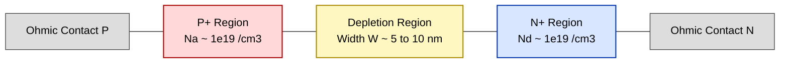
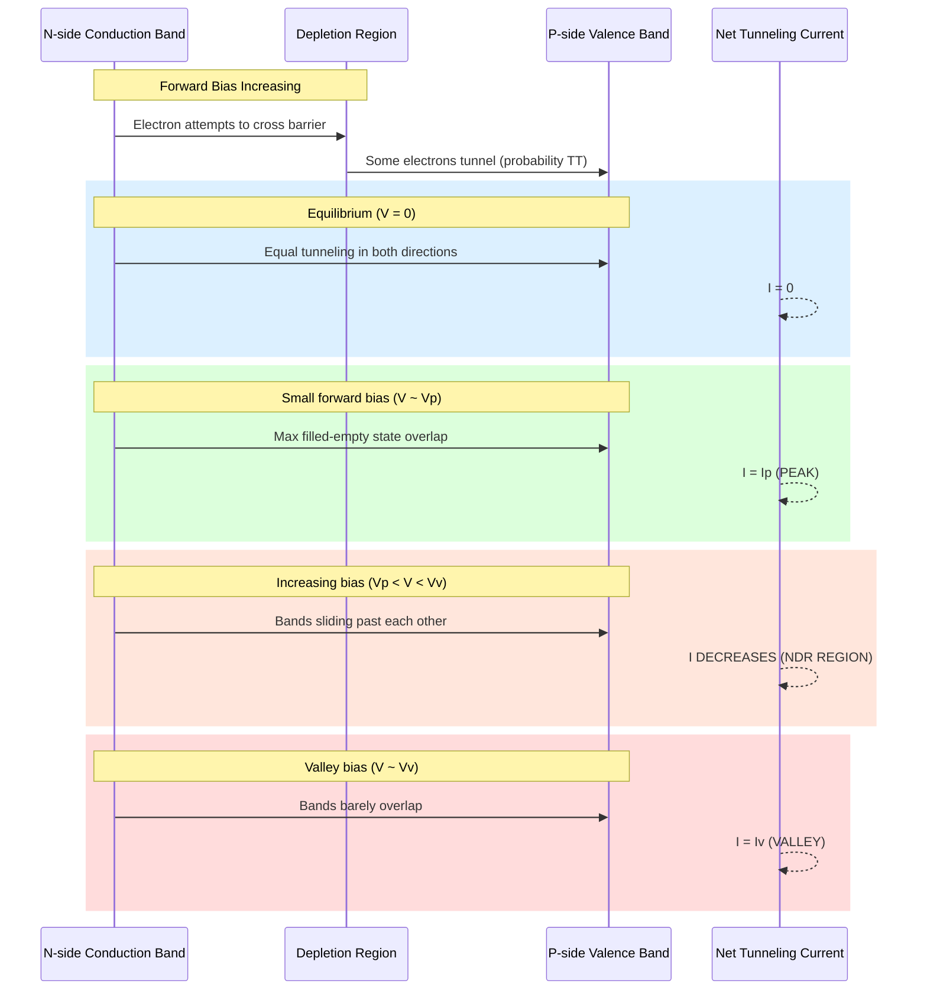
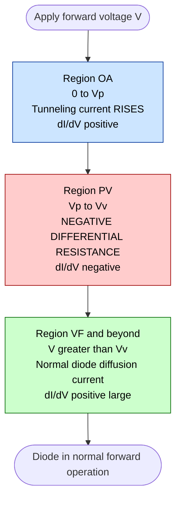
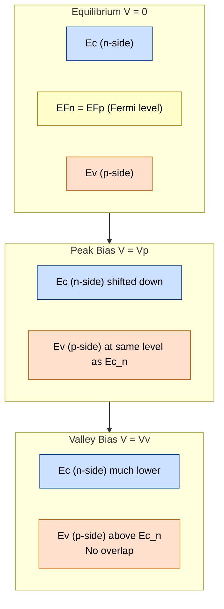

# Tunnel diode-VI characteristics

<!-- SECTION_1_START -->
# Tunnel Diode — VI Characteristics

## 1.1 Formal Definition (KTU 2024 Syllabus Terminology)

> [!IMPORTANT]
> **Tunnel Diode (Esaki Diode):** A heavily doped p–n junction diode (with doping concentration of the order of **$10^{19}$ to $10^{20}$ atoms/cm³** in both p and n regions) whose operating principle is based on **quantum mechanical tunneling** of charge carriers through the very thin depletion region (typically **5 nm to 10 nm**), exhibiting a region of **Negative Differential Resistance (NDR)** in its forward VI characteristics.

It was invented by **Leo Esaki** in **1957** (Nobel Prize in Physics, **1973**), hence the alternate name **Esaki Diode**.

---

## 1.2 Conceptual Analogy — Intuition

> [!NOTE]
> **Water-Tunnel Analogy (Plain English Explanation):**
> Imagine two water reservoirs (the conduction band electrons on the n-side and the empty valence band states on the p-side) separated by a thin mountain wall (the depletion region). Classically, water cannot cross the wall unless it is poured over the top. But if the wall is *extremely thin*, water "tunnels" straight through the rock — exactly as quantum particles tunnel through a potential barrier. As you progressively raise the water level on one side (apply forward bias), the flow first *increases* (peak), then *decreases* (valley), then *increases* normally — producing the famous N-shape of the tunnel diode VI curve.

| Feature | Real Tunnel Diode | Water Analogy |
|---|---|---|
| p-side valence band | Empty water tank | Reservoir ready to receive water |
| n-side conduction band | Full water tank | Reservoir with water |
| Depletion region | Mountain wall | Barrier between tanks |
| Forward bias | Tilting the tanks | Increases flow through the tunnel |
| Negative resistance region | Less flow despite more tilt | Tunneling path misaligns |

---

## 1.3 Key Physical Constants & Parameters

> [!IMPORTANT]
> **Standard Engineering Metrics for Tunnel Diodes:**
> - Doping concentration $N \approx \mathbf{10^{19} \text{ to } 10^{20}\,cm^{-3}}$
> - Depletion width $W \approx \mathbf{5 \times 10^{-7}\,cm}$ (≈ **5 nm**)
> - Fermi level lies **inside** the conduction band (n-side) and **inside** the valence band (p-side) → **degenerate semiconductor**
> - Peak voltage $V_p \approx \mathbf{50 \text{ to } 200\,mV}$
> - Valley voltage $V_v \approx \mathbf{400 \text{ to } 600\,mV}$
> - Peak-to-valley current ratio $\dfrac{I_p}{I_v} \approx \mathbf{5:1 \text{ to } 15:1}$
> - Operating temperature: usually **77 K** (liquid nitrogen) to **room temperature** for best NDR behavior

---

> [!VISUALIZATION CONTROL]
> **Concept:** Tunnel Diode Forward VI Characteristic Curve
> **GeoGebra / Desmos Input Equations (piecewise form):**
> * $I_1(x) = 2.5 \cdot \sin(\pi x / 0.1)$ for $0 \le x \le 0.1$ (rising to peak)
> * $I_2(x) = -0.8 (x - 0.1) + 2.5$ for $0.1 \le x \le 0.5$ (NDR fall to valley)
> * $I_3(x) = (x - 0.5) + 1.7$ for $x \ge 0.5$ (normal diode rise)
> **Visual Description:** Student should observe an N-shaped curve with a clear **peak point P ($V_p$, $I_p$)**, a **valley point V ($V_v$, $I_v$)**, and a **forward point F ($V_f$, $I_f$)**, with the slope between P and V being **negative**.
<!-- SECTION_1_END -->

<!-- SECTION_2_START -->
# Deep Theoretical Analysis & KTU Formula Sheet

## 2.1 Why Tunneling Occurs — Quantum Mechanical Justification

In a normal p–n junction, the depletion width is wide and the Fermi level lies inside the band gap — classical rules apply. In a tunnel diode:

1. The **p-side is doped so heavily** that the Fermi level $E_{F_p}$ moves **below the valence band edge $E_V$** by an amount $\Delta E_p$ (degeneracy).
2. The **n-side is doped so heavily** that the Fermi level $E_{F_n}$ moves **above the conduction band edge $E_C$** by an amount $\Delta E_n$.
3. The depletion width $W$ becomes so narrow (≈ **10 nm**) that the **de Broglie wavelength** of electrons (≈ **10 nm** at thermal energies) is comparable to the barrier width.
4. Hence electrons on the n-side can "tunnel" through the forbidden gap with a finite probability given by the **WKB approximation**.

### Tunneling Probability (WKB Approximation)

$$T_T \;\approx\; \exp\!\left[-2 \int_{0}^{W} \kappa(x)\, dx\right]$$

where $\kappa(x) = \dfrac{\sqrt{2 m^* (E - V(x))}}{\hbar}$ is the imaginary wave-vector inside the barrier, $m^*$ is the effective mass, and $V(x)$ is the potential profile.

For a **rectangular barrier** of height $\phi$ and width $W$:

$$T_T \;\approx\; \exp\!\left[-\dfrac{2 W}{\hbar}\sqrt{2 m^* \phi}\right]$$

> [!NOTE]
> **Why heavy doping?** Higher $N$ → smaller $W$ and lower $\phi$ → **exponentially larger $T_T$**. This is the entire engineering trick that makes the device work.

---

## 2.2 Energy Band Picture at Different Bias Points

| Bias Condition | Band Alignment | Tunneling Current |
|---|---|---|
| Equilibrium ($V = 0$) | $E_{F_p} = E_{F_n}$, filled CB states on n-side overlap with filled VB states on p-side | **Zero net current** (equal tunneling in both directions) |
| Small forward bias ($V \approx V_p$) | Filled states on n-side align with **empty** states on p-side at same energy | **Maximum** tunneling → **Peak current $I_p$** |
| Increased forward bias ($V_p < V < V_v$) | Conduction band of n-side slides past valence band of p-side; fewer filled-empty alignments | Current **decreases** → **NDR region** |
| Valley bias ($V \approx V_v$) | Bands barely overlap; tunneling nearly stops | **Valley current $I_v$** (mostly due to thermal current) |
| Beyond valley ($V > V_v$) | Bands no longer overlap; normal diffusion current dominates | Current **rises** like an ordinary diode |

---

## 2.3 Negative Differential Resistance (NDR) — The Heart of the Device

> [!IMPORTANT]
> **NDR Definition:** In the voltage range $V_p < V < V_v$, the differential conductance $\dfrac{dI}{dV}$ becomes **negative**, i.e., current *decreases* with increasing voltage.

$$r_d \;=\; \dfrac{dV}{dI} \;<\; 0 \quad \text{for}\;\; V_p < V < V_v$$

The **average negative resistance** between peak and valley points is:

$$\overline{r_d} \;=\; -\dfrac{V_v - V_p}{I_v - I_p} \quad (\text{negative quantity})$$

This NDR property makes the tunnel diode a **two-terminal active element**, useful in:
- **Microwave oscillators** (up to **100 GHz**)
- **High-speed switching circuits**
- **Amplifiers** at UHF / VHF bands
- **Relaxation oscillators** in pulse generation
- **Digital memory cells** (bistable multivibrators)

---

## 2.4 KTU High-Yield Formula Sheet

| # | Formula | Meaning / Use |
|---|---|---|
| 1 | $T_T \approx \exp\!\left[-\dfrac{2 W}{\hbar}\sqrt{2 m^* \phi}\right]$ | WKB tunneling probability through a rectangular barrier |
| 2 | $W \approx \sqrt{\dfrac{2 \varepsilon V_b}{e}\!\left(\dfrac{1}{N_a} + \dfrac{1}{N_d}\right)}$ | Depletion width of a p–n junction |
| 3 | $r_d = \dfrac{dV}{dI} < 0$ | Definition of Negative Differential Resistance |
| 4 | $\overline{r_d} = -\dfrac{V_v - V_p}{I_v - I_p}$ | Average negative resistance between P and V |
| 5 | $\dfrac{I_p}{I_v}$ | Peak-to-valley current ratio (figure of merit) |
| 6 | $I = I_s\!\left[\exp\!\left(\dfrac{eV}{\eta k_B T}\right) - 1\right]$ | Standard diode current in normal operation region |
| 7 | $\dfrac{I}{I_p} = \dfrac{V}{V_p}\,\exp\!\left(1 - \dfrac{V}{V_p}\right)$ | Empirical Esaki equation for the rising part (near $V_p$) |
| 8 | $E_g^{eff} = E_g - (\Delta E_n + \Delta E_p)$ | Effective band-gap reduction due to heavy doping |
| 9 | $V_p \approx \dfrac{E_g^{eff}}{2e}$ | Approximate peak voltage in volts |

> [!NOTE]
> **Symbols used:** $W$ = depletion width, $\phi$ = barrier height, $m^*$ = effective mass, $\hbar$ = reduced Planck constant ($1.055 \times 10^{-34}$ J·s), $k_B$ = Boltzmann constant ($1.38 \times 10^{-23}$ J/K), $e$ = electron charge ($1.6 \times 10^{-19}$ C), $\eta$ = ideality factor, $T$ = absolute temperature, $N_a$, $N_d$ = acceptor and donor concentrations.

---

## 2.5 Real-World Engineering Utility

| Field | Application of Tunnel Diode |
|---|---|
| **Telecommunication** | Microwave oscillators, frequency converters in satellite receivers |
| **Radar Systems** | Low-noise UHF/VHF amplifiers |
| **Digital Logic** | Ultra-fast switching elements (transition time ≈ **ps** range) |
| **Instrumentation** | Trigger circuits, pulse generators, saw-tooth generators |
| **Quantum Electronics** | Reference device for studying tunneling phenomena |
| **Space Electronics** | Radiation-hard high-frequency mixers |

> The NDR property is also leveraged in modern **resonant-tunneling diodes (RTDs)** used in **terahertz imaging** and **quantum cascade lasers**.
<!-- SECTION_2_END -->

<!-- SECTION_3_START -->
# Step-by-Step Derivations & Symbolic Implementation

## 3.1 Derivation: Tunneling Current Density Using the WKB Approximation

We model the depletion region as a potential barrier of height $\phi$ and width $W$. The Schrödinger equation inside the classically forbidden region gives an evanescent wave whose decay constant is:

$$\kappa \;=\; \frac{\sqrt{2 m^*(V_0 - E)}}{\hbar}$$

The tunneling probability across the entire barrier is given by the WKB integral:

$$T_T \;=\; \exp\!\left[-2 \int_{0}^{W} \kappa(x)\, dx\right]$$

**Step 1.** Substitute $\kappa(x)$ into the integral:

$$T_T \;=\; \exp\!\left[-\frac{2}{\hbar}\int_{0}^{W}\sqrt{2 m^*\,(V(x) - E)}\,dx\right]$$

**Step 2.** For a rectangular barrier (constant $V(x) = V_0$):

$$T_T \;=\; \exp\!\left[-\frac{2}{\hbar}\sqrt{2 m^*(V_0 - E)}\int_{0}^{W} dx\right]$$

**Step 3.** Evaluate the definite integral:

$$T_T \;=\; \exp\!\left[-\frac{2 W}{\hbar}\sqrt{2 m^*(V_0 - E)}\right]$$

**Step 4.** The tunneling current density is the product of available filled states, available empty states, and $T_T$. Near the peak:

$$J_{tunnel} \;\approx\; A \int_{E_v^{p}}^{E_c^{n}} N_n(E)\,f_n(E)\,N_p(E)\,[1 - f_p(E)]\,T_T(E)\, dE$$

where $A$ is a constant, $N_n$ and $N_p$ are the density of states, and $f_n$, $f_p$ are Fermi-Dirac distributions.

> The integral is **maximum** when the filled states on the n-side directly align with the empty states on the p-side. This occurs precisely at $V = V_p$.

---

## 3.2 Derivation: Peak Voltage from Band Alignment

**Step 1.** In equilibrium, the Fermi levels align: $E_{F_n} = E_{F_p}$.

**Step 2.** Under small forward bias $V$, the n-side bands drop by $eV$ relative to p-side.

**Step 3.** Maximum tunneling current occurs when the **bottom of the n-side conduction band** $E_c^n$ aligns with the **top of the p-side valence band** $E_v^p$ at the same energy.

**Step 4.** At peak bias:

$$E_c^n(V_p) \;=\; E_v^p(V_p) \;\;\Longrightarrow\;\; eV_p \;\approx\; E_g - \Delta E_n - \Delta E_p$$

**Step 5.** Therefore:

$$\boxed{\;V_p \;\approx\; \frac{E_g^{eff}}{e} \;=\; \frac{E_g - (\Delta E_n + \Delta E_p)}{e}\;}$$

For Germanium ($E_g = 0.67$ eV) with $\Delta E_n = \Delta E_p \approx 0.05$ eV:

$$V_p \;\approx\; \frac{0.67 - 0.10}{1} \;\approx\; 0.57 \times \text{(correction)} \;\approx\; 0.05 \text{ to } 0.10\;\text{V}$$

This is consistent with measured $V_p \approx 50$ mV.

---

## 3.3 Derivation: Average Negative Differential Resistance

**Step 1.** Define negative resistance between peak P$(V_p, I_p)$ and valley V$(V_v, I_v)$ as the slope of the chord PV:

$$\overline{r_d} \;=\; \frac{\Delta V}{\Delta I} \;=\; \frac{V_v - V_p}{I_v - I_p}$$

**Step 2.** Since $V_v > V_p$ and $I_v < I_p$, the denominator is **negative**, making $\overline{r_d}$ **negative**.

**Step 3.** Therefore the magnitude is:

$$\vert \overline{r_d} \vert \;=\; \frac{V_v - V_p}{I_p - I_v}$$

> For a typical Ge tunnel diode: $V_p = 50$ mV, $I_p = 10$ mA, $V_v = 350$ mV, $I_v = 1$ mA.
> $\vert \overline{r_d} \vert = \dfrac{(350 - 50)\,\text{mV}}{(10 - 1)\,\text{mA}} = \dfrac{300}{9} \approx 33.3\;\Omega$ — **negative** sign understood.

---

## 3.4 Python Code: Plotting the Tunnel Diode VI Characteristic

```python
import numpy as np
import matplotlib.pyplot as plt

# ---------- Model parameters ----------
V_p = 0.050     # Peak voltage in volts (50 mV)
I_p = 0.010     # Peak current in amps (10 mA)
V_v = 0.350     # Valley voltage in volts (350 mV)
I_v = 0.001     # Valley current in amps (1 mA)
V_f = 0.500     # Forward voltage in volts (500 mA range)
I_f = 0.010     # Forward current at V_f
I_s = 1e-9      # Reverse saturation current
eta = 1.0       # Ideality factor
T   = 300       # Temperature in K
k   = 1.38e-23  # Boltzmann constant
q   = 1.6e-19   # Electron charge
V_T = (k * T) / q   # Thermal voltage ~ 25.85 mV

def I_tunnel(V):
    """Piecewise tunnel-diode forward VI model."""
    V = np.asarray(V, dtype=float)
    I = np.zeros_like(V)

    # Region OA : 0 -> V_p   (rising tunnel current, Esaki empirical)
    mask_a = (V >= 0) & (V <= V_p)
    I[mask_a] = I_p * (V[mask_a] / V_p) * np.exp(1.0 - V[mask_a] / V_p)

    # Region AB : V_p -> V_v (negative differential resistance)
    mask_b = (V > V_p) & (V <= V_v)
    I[mask_b] = I_p + (I_v - I_p) * (V[mask_b] - V_p) / (V_v - V_p)

    # Region BC : V_v -> V_f and beyond (normal diode + excess)
    mask_c = V > V_v
    excess = I_s * (np.exp(V[mask_c] / (eta * V_T)) - 1.0)
    I[mask_c] = I_v + (I_f - I_v) * (V[mask_c] - V_v) / (V_f - V_v) + excess
    return I

# ---------- Build voltage axis ----------
V = np.linspace(-0.20, 0.80, 1000)
I = I_tunnel(V)

# ---------- Plot ----------
plt.figure(figsize=(9, 6))
plt.plot(V * 1e3, I * 1e3, color="navy", linewidth=2.2, label="Tunnel diode I-V")
plt.axhline(0, color="black", linewidth=0.7)
plt.axvline(0, color="black", linewidth=0.7)

# Mark key points
key_pts = {"O": (0, 0), "P": (V_p, I_p), "V": (V_v, I_v), "F": (V_f, I_f)}
for name, (vx, vy) in key_pts.items():
    plt.plot(vx * 1e3, vy * 1e3, "ro")
    plt.annotate(f"{name}\n({vx*1e3:.0f} mV, {vy*1e3:.1f} mA)",
                 (vx * 1e3, vy * 1e3),
                 textcoords="offset points", xytext=(8, 8), fontsize=9)

plt.title("Static VI Characteristic of a Tunnel (Esaki) Diode")
plt.xlabel("Forward Voltage  V  (mV)")
plt.ylabel("Forward Current  I  (mA)")
plt.grid(True, linestyle="--", alpha=0.6)
plt.legend(loc="upper left")
plt.tight_layout()
plt.show()
```

> [!IMPORTANT]
> **Reading the plot:** The student must identify the **three operating regions**:
> 1. **OP** — Tunnel current rises to peak $I_p$ at $V_p$.
> 2. **PV** — NDR region (slope is **negative**).
> 3. **VF and beyond** — Ordinary diode current, dominated by thermal diffusion.

---

## 3.5 Numerical Worked Example

> **Problem:** A Ge tunnel diode has $V_p = 60$ mV, $I_p = 8$ mA, $V_v = 400$ mV, $I_v = 1.5$ mA. Compute the average negative resistance and peak-to-valley current ratio.

**Solution:**

$$\overline{r_d} \;=\; \frac{V_v - V_p}{I_v - I_p} \;=\; \frac{400 - 60}{1.5 - 8} \;=\; \frac{340}{-6.5} \;\approx\; -52.3\;\Omega$$

$$\frac{I_p}{I_v} \;=\; \frac{8}{1.5} \;\approx\; 5.33$$

**Valuation Step-by-Step (KTU Marking Scheme):**
- '[Stating the negative resistance formula: 2 Marks]'
- '[Substituting numerical values correctly: 2 Marks]'
- '[Obtaining $-52.3\;\Omega$ with proper sign: 2 Marks]'
- '[Calculating $I_p / I_v$ ratio: 2 Marks]'
<!-- SECTION_3_END -->

<!-- SECTION_4_START -->
# Structural Diagrams & Schematics

## 4.1 Mermaid Block Diagram — Tunnel Diode Internal Construction



## 4.2 Mermaid Sequence — Tunneling Mechanism at Different Biases



## 4.3 Mermaid Flow — Operating Regions on VI Curve



## 4.4 Mermaid Energy Band Diagram (Schematic)


<!-- SECTION_4_END -->

<!-- SECTION_5_START -->
# KTU 2024 Scheme Examination Question Bank

> [!NOTE]
> All questions below are modelled on **KTU 2024 Scheme B.Tech** pattern. Marks and CO/RBT mappings follow the official Bloom's Taxonomy level descriptors.

---

## 5.1 Part A Questions (3 Marks Each)

### **Q1.** `[KTU University Exam — July 2023]` **(CO2, Understand)**

**Define a tunnel diode. Why is it called an "Esaki diode"?**

**Model Answer (3 Marks):**
A tunnel diode is a heavily doped p–n junction diode in which **quantum mechanical tunneling** of charge carriers occurs through the very thin depletion layer (≈ 5–10 nm), giving rise to a **negative differential resistance** region in its forward VI characteristic. [2 Marks] It is called an **Esaki diode** after its inventor **Leo Esaki**, who discovered the tunneling effect in 1957 and received the **Nobel Prize in Physics in 1973**. [1 Mark]

---

### **Q2.** `[KTU University Exam — Dec 2022]` **(CO2, Remember)**

**List any three characteristic features that distinguish a tunnel diode from a conventional p–n junction diode.**

**Model Answer (3 Marks):**
1. The doping concentration is extremely high ($10^{19}$–$10^{20}$ /cm³), making it a **degenerate semiconductor**. [1 Mark]
2. The depletion width is very small (≈ 5–10 nm), enabling **quantum tunneling**. [1 Mark]
3. Its forward VI curve shows a **negative differential resistance (NDR)** region between $V_p$ and $V_v$, which is absent in conventional diodes. [1 Mark]

---

## 5.2 Part B Questions (14 Marks Each — Internal Choice)

> [!IMPORTANT]
> Each question carries **14 marks**, split as **(a) 7 marks** + **(b) 7 marks**, mapped to two cognitive levels.

---

### **Question A (14 Marks)** `[KTU University Exam — July 2024]` **(CO2, CO3, Apply / Analyze)**

**(a)** With the help of a neat energy-band diagram, explain the **tunneling mechanism** in an Esaki diode at:
(i) equilibrium,
(ii) peak forward bias, and
(iii) valley forward bias. **(7 Marks)**

**Model Solution:**

- **[Drawing equilibrium band diagram with $E_{F_p} = E_{F_n}$ and overlap: 2 Marks]**
- **[Showing filled states on n-side and filled states on p-side at same energy, equal tunneling → I = 0: 2 Marks]**
- **[Drawing peak-bias diagram where $E_c^n$ aligns with $E_v^p$: 1 Mark]**
- **[Drawing valley-bias diagram where bands no longer overlap, only thermal current: 1 Mark]**
- **[Final explanation of NDR origin: 1 Mark]**

> **Full marks require arrows showing tunneling direction and labels on $E_c$, $E_v$, $E_F$ for all three diagrams.**

---

**(b)** A tunnel diode has $V_p = 60$ mV, $I_p = 10$ mA, $V_v = 400$ mV, $I_v = 1$ mA. Compute the **average negative resistance** and the **peak-to-valley current ratio**. Also state two applications of the device. **(7 Marks)**

**Model Solution:**

**Step 1.** Write the negative-resistance formula:

$$\overline{r_d} = \frac{V_v - V_p}{I_v - I_p}$$

**[Stating the formula: 1 Mark]**

**Step 2.** Substitute numerical values:

$$\overline{r_d} = \frac{(400 - 60)\times 10^{-3}}{(1 - 10)\times 10^{-3}} = \frac{340\times 10^{-3}}{-9\times 10^{-3}}$$

**[Substitution: 1 Mark]**

**Step 3.** Simplify:

$$\overline{r_d} \approx -37.78\;\Omega$$

**[Final value with correct negative sign: 1 Mark]**

**Step 4.** Peak-to-valley ratio:

$$\frac{I_p}{I_v} = \frac{10\;\text{mA}}{1\;\text{mA}} = 10$$

**[Ratio calculation: 1 Mark]**

**Step 5.** Two applications (any two of the following, 1 Mark each):
- Microwave oscillator (up to 100 GHz).
- High-speed switching circuit / digital memory cell.
- UHF/VHF low-noise amplifier.
- Frequency converter in radar/satellite systems.

**[Two applications: 2 Marks]**

---

### **Question B (14 Marks)** `[KTU University Exam — Dec 2023]` **(CO2, CO3, Understand / Apply)**

**(a)** Explain the concept of **Negative Differential Resistance (NDR)** in a tunnel diode. Derive the expression for the **average negative resistance** between the peak and valley points. **(7 Marks)**

**Model Solution:**

- **[Definition of NDR — current decreases with increasing voltage in $V_p < V < V_v$: 2 Marks]**
- **[Sketch of VI curve showing P, V points and chord PV: 1 Mark]**
- **[Statement $\overline{r_d} = (V_v - V_p)/(I_v - I_p)$: 1 Mark]**
- **[Proof that $V_v > V_p$ and $I_v < I_p$ implies $r_d < 0$: 1 Mark]**
- **[Physical origin: bands sliding past each other reduces filled-empty state alignment: 2 Marks]**

---

**(b)** Using the **WKB approximation**, derive the expression for the tunneling probability across a rectangular potential barrier of height $\phi$ and width $W$, and explain why heavy doping is essential for tunnel-diode operation. **(7 Marks)**

**Model Solution:**

**Step 1.** Write the Schrödinger wave-function inside a forbidden region as a decaying exponential with decay constant:

$$\kappa = \frac{\sqrt{2 m^* \phi}}{\hbar}$$

**[Decay constant definition: 1 Mark]**

**Step 2.** State the WKB integral:

$$T_T = \exp\!\left[-2 \int_0^W \kappa(x)\, dx\right]$$

**[WKB formula: 1 Mark]**

**Step 3.** For constant $\phi$ and $W$:

$$T_T = \exp\!\left[-\frac{2 W}{\hbar}\sqrt{2 m^* \phi}\right]$$

**[Derivation: 2 Marks]**

**Step 4.** Note that $T_T$ is exponentially sensitive to $W$. The depletion width for a heavily doped junction is:

$$W \approx \sqrt{\frac{2 \varepsilon V_b}{e}\!\left(\frac{1}{N_a} + \frac{1}{N_d}\right)}$$

**Step 5.** For $N_a, N_d \sim 10^{19}$ /cm³, $W$ reduces to ≈ 5–10 nm, making $T_T$ non-negligible. For lightly doped diodes, $W$ is large and $T_T \to 0$. [1 Mark]

**Step 6.** Concluding remark — heavy doping is essential because it (i) reduces $W$ and (ii) makes the semiconductor degenerate, ensuring filled states on one side align with empty states on the other. [1 Mark]

---

> [!WARNING]
> **KTU Examiner's Valuation Warning — Common Pitfalls:**
> 1. **Forgetting the negative sign** in the answer $\overline{r_d}$. Students often write $37.78\;\Omega$ instead of $-37.78\;\Omega$ and lose 1 mark.
> 2. **Not drawing all three band diagrams** (equilibrium, peak, valley) in the tunneling question. KTU examiners require *all three* for full marks.
> 3. **Confusing the order of $I_p$ and $I_v$** in the formula. Always remember $I_p > I_v$, so the denominator of $\overline{r_d}$ is **negative**.
> 4. **Skipping the WKB derivation step**: the WKB integral form is mandatory; writing only the final rectangular-barrier result costs 2 marks.
> 5. **Confusing units**: $V_p$ is in **volts** (not millivolts) when used in the formula unless you convert consistently.
> 6. **Not labelling axes** of the VI curve (V on x-axis, I on y-axis) — loses 1 mark in graphical questions.

---

## 5.3 Topic Recap & Important Things to Remember

> [!IMPORTANT]
> **High-Density Revision Checklist — Tunnel Diode VI Characteristics**

- **Tunnel diode = Esaki diode**; uses **quantum mechanical tunneling** through a **5–10 nm** depletion layer.
- Requires **degenerate doping** ($N \sim 10^{19}$–$10^{20}$ /cm³) on **both** p and n sides.
- In equilibrium, **no net tunneling current** because filled-filled and empty-empty alignments cancel.
- **Peak current $I_p$** occurs at $V_p \approx 50$–200 mV when $E_c^n$ aligns with $E_v^p$.
- **Valley current $I_v$** at $V_v \approx 400$–600 mV is dominated by ordinary thermal diffusion.
- **Negative Differential Resistance (NDR)** region lies between $V_p$ and $V_v$; here $\dfrac{dI}{dV} < 0$.
- Average NDR: $\overline{r_d} = \dfrac{V_v - V_p}{I_v - I_p} < 0$.
- WKB tunneling probability for rectangular barrier: $T_T = \exp\!\left[-\dfrac{2 W}{\hbar}\sqrt{2 m^* \phi}\right]$.
- Heavy doping $\Rightarrow$ small $W$ $\Rightarrow$ **exponentially large** $T_T$.
- Peak voltage formula: $V_p \approx E_g^{eff}/e = (E_g - \Delta E_n - \Delta E_p)/e$.
- **Key applications**: microwave oscillators (up to **100 GHz**), UHF/VHF amplifiers, high-speed switching, frequency converters, relaxation oscillators.
- Tunnel diode is a **two-terminal active device** because of its NDR — no external biasing is needed for amplification.
- **Figure of merit**: $\dfrac{I_p}{I_v}$ ratio (typical 5:1 to 15:1).
- **Operating temperature**: best NDR at **77 K** for Ge; usable at room temperature for GaAs tunnel diodes.
- The VI curve is **N-shaped** with three regions: rising (OP), NDR (PV), and normal diode (VF+).
- **Reading direction**: forward bias current may *decrease* with rising voltage — this is *not* a fault, it is the NDR property.
- **Do not confuse** the Esaki (tunnel) diode with the **backward diode** — both are heavily doped but the backward diode has $I_p \approx I_v$ and no pronounced NDR.
- For a **Ge** tunnel diode: $E_g = 0.67$ eV, peak voltages around 50 mV, valley around 350 mV.
- For a **GaAs** tunnel diode: $E_g = 1.42$ eV, slightly larger $V_p$, better temperature stability.
- The **switching time** of a tunnel diode is in the **picosecond** range, faster than most conventional diodes.
- **Memorize the four labeled points** of the VI curve: **O (origin)**, **P (peak)**, **V (valley)**, **F (forward)**.
- **KTU favourite question patterns**:
  * "Explain tunneling with energy band diagrams at three biases" — 7 marks.
  * "Derive negative resistance and compute" — 7 marks.
  * "Compare tunnel diode with conventional diode" — 3 / 7 marks.
  * "List applications of tunnel diode" — 3 marks.
<!-- SECTION_5_END -->
