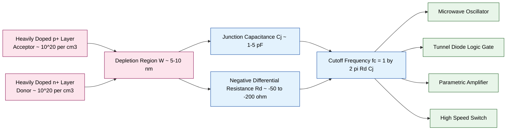
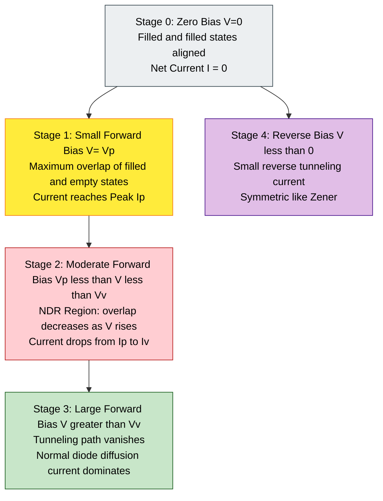
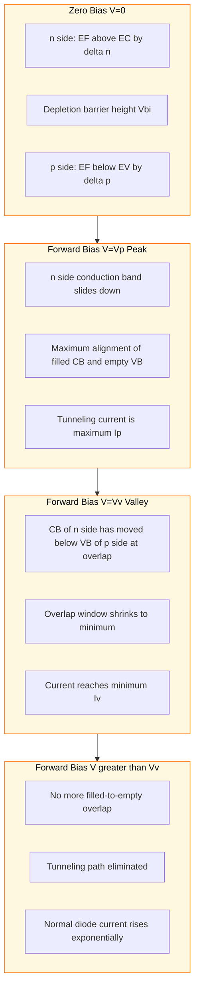
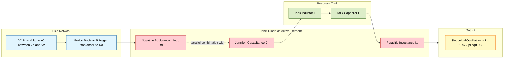

# Tunnel diode

<!-- SECTION_1_START -->

# Tunnel Diode — Core Technical Definition & Intuitive Overview

## Formal Academic Definition

A **Tunnel Diode** (also known as the **Esaki Diode**, named after Nobel Laureate **Leo Esaki** who discovered it in **1957**) is a heavily doped **p–n junction diode** (degenerate semiconductor) in which the depletion region width is so narrow (typically **5 nm to 10 nm**) that charge carriers can traverse the potential barrier by the quantum mechanical phenomenon of **tunneling**, rather than by the classical diffusion or drift process. Because of the high doping, the Fermi level lies **inside the conduction band** on the n-side and **inside the valence band** on the p-side, allowing filled and empty states to align under small forward bias and produce a current. The defining signature of the device is a region of **negative differential resistance (NDR)** in its forward I–V characteristic, making it useful in high-frequency oscillators, amplifiers, and fast switching circuits.

> [!IMPORTANT]
> **KTU 2024 Syllabus Highlight (Module 4):**
> A tunnel diode is the canonical pedagogical example used to introduce *quantum tunneling*, *degenerate semiconductors*, and the *negative differential resistance* concept — all of which are recurring themes in semiconductor electronics for information science.

## Conceptual Analogy / Intuition

Imagine a ball at the bottom of a wide, shallow valley on one side of a low hill, and another ball sitting at the top of an identical hill on the other side. Classically, neither ball can reach the other side unless it is given enough energy to climb over the hill (just as a classical electron would need **qV** energy to surmount the potential barrier of width W). 

Now imagine that the hill is so thin that the ball, instead of climbing over it, can suddenly appear on the other side — it has **tunneled through** the hill. This is exactly what happens in a tunnel diode: the depletion layer is so narrow that electrons on the filled conduction band states of the n-side "appear" on the empty valence band states of the p-side, even though they do not have the energy to climb over the junction barrier. As the forward bias changes, the relative alignment of filled and empty states changes, leading to a current that first increases, then decreases, then increases again — giving the famous **N-shaped** I–V curve.

> [!NOTE]
> **Key Physical Constants Used in Tunnel Diode Analysis**
> - Planck's constant: $h = 6.626 \times 10^{-34}\ \text{J}\cdot\text{s}$
> - Reduced Planck's constant: $\hbar = 1.054 \times 10^{-34}\ \text{J}\cdot\text{s}$
> - Electron charge: $q = 1.602 \times 10^{-19}\ \text{C}$
> - Boltzmann constant: $k_B = 1.381 \times 10^{-23}\ \text{J/K}$
> - Thermal voltage at 300 K: $V_T = \dfrac{k_B T}{q} \approx 25.85\ \text{mV}$

## Why the Device Is "Degenerate"

In a normal p–n junction, the doping is moderate ($\sim 10^{15}$ to $10^{17}\ \text{cm}^{-3}$), so the depletion width $W$ is on the order of **micrometers**. In a tunnel diode, the doping on both sides is extremely high ($\sim 10^{19}$ to $10^{20}\ \text{cm}^{-3}$), and the resulting **depletion width $W$ is only a few nanometers** — comparable to the **de Broglie wavelength** of an electron in the crystal. This narrow barrier permits measurable **quantum mechanical tunneling current** at the junction.

$$\boxed{W \approx \sqrt{\dfrac{2\varepsilon_r \varepsilon_0}{q}\left(\dfrac{1}{N_A}+\dfrac{1}{N_D}\right)(V_{bi}-V)}}$$

> [!VISUALIZATION CONTROL]
> **Concept:** Quantum Tunneling Probability vs. Barrier Width
> **GeoGebra / Desmos Input Equations:**
> - $T(x) = \exp(-2 \cdot \kappa \cdot x)$, with $\kappa = 1$
> - Vertical axis: $T(x)$ from 0 to 1
> - Horizontal axis: $x$ (barrier width) from 0 to 5
> **Visual Description:** A steep exponentially decaying curve — students should observe that tunneling probability drops by orders of magnitude as the barrier widens. The tunnel diode operates in the region $x \approx 1\text{–}2$ where $T$ is still non-negligible.

<!-- SECTION_1_END -->

<!-- SECTION_2_START -->

# Deep Theoretical Analysis & KTU High-Yield Formula Sheet

## Physical Origin of Tunneling — The Quantum Picture

In a tunnel diode, the **degenerate doping** shifts the Fermi level $E_F$ as follows:

- On the **n-side**: $E_F$ lies **above** the conduction band edge $E_C$ by an amount $\delta_n$.
- On the **p-side**: $E_F$ lies **below** the valence band edge $E_V$ by an amount $\delta_p$.

The total built-in potential and band overlap allow direct alignment of filled states on one side with empty states on the other. The tunneling current is proportional to the **product** of the filled-state density and the empty-state density on the two sides, integrated across the overlap window — this is the **Tsu–Esaki** integral, first derived by Esaki in his seminal paper.

## Energy Band Configurations Under Different Biases

The I–V characteristic of a tunnel diode is best understood by drawing the energy band diagram at four critical bias points:

1. **Zero bias (thermal equilibrium):** Filled states on n-side are exactly opposite filled states on p-side → zero net tunneling current. Net current $I = 0$.

2. **Small forward bias — Peak Point ($V_p$):** The bands on the n-side shift downward relative to the p-side. Now filled states in the n-side conduction band are aligned with empty states in the p-side valence band. The overlap is **maximum**, producing the **peak current $I_p$** (typically a few mA).

3. **Increased forward bias — Valley Point ($V_v$):** The bands shift further. The overlap of filled and empty states begins to decrease because the n-side conduction band is sliding past the p-side valence band edge. Current drops to its **minimum value $I_v$** (the **valley current**).

4. **Beyond valley — Normal Diode Region:** At yet higher bias, the n-side conduction band moves entirely below the p-side valence band edge, killing the tunneling path. The device behaves as an ordinary forward-biased diode, and the current rises again due to classical diffusion. The point at which the tunneling current becomes equal to the diffusion current is the **valley point**.

## The Negative Differential Resistance (NDR) Region

Between the peak and the valley, an increase in forward bias produces a **decrease** in current. Mathematically:

$$R_d = \dfrac{dV}{dI} < 0 \quad \text{for}\quad V_p < V < V_v$$

This is **negative dynamic resistance**, and it is the key feature that allows the tunnel diode to be used as a **high-frequency oscillator** and a **bistable switching element**.

## Tunneling Probability (Qualitative WKB Form)

The transmission coefficient through a rectangular barrier of height $V_0$ and width $W$ is given by the **Wentzel–Kramers–Brillouin (WKB) approximation**:

$$T \approx \exp\left(-2 \int_{0}^{W} \kappa(x)\, dx\right)$$

For a constant-height barrier, this simplifies to:

$$T \approx \exp\left(-\dfrac{2}{\hbar}\sqrt{2m^*(V_0 - E)}\,W\right)$$

where $m^*$ is the effective mass of the tunneling electron. This expression shows that:
- Thinner barrier $W$ → exponentially larger $T$.
- Lower barrier height $V_0 - E$ → larger $T$.
- Lighter effective mass $m^*$ → larger $T$.

These three dependencies are the **design knobs** for tunnel diode engineering (use narrow junction, low barrier, small $m^*$ — which is why **GaAs** tunnel diodes outperform **Ge** and **Si** versions).

## Tsu–Esaki Tunneling Current Integral

The full theoretical expression for the tunneling current density $J$ as a function of applied voltage $V$ is:

$$J(V) = \dfrac{q m^* k_B T}{2\pi^2 \hbar^3} \int_{E_{min}}^{E_{max}} \mathcal{T}(E) \cdot \ln\!\left(\dfrac{1+\exp\!\left(\dfrac{E_F - E}{k_B T}\right)}{1+\exp\!\left(\dfrac{E_F - E - qV}{k_B T}\right)}\right) dE$$

where $\mathcal{T}(E)$ is the energy-dependent transmission coefficient, and the logarithmic factor accounts for the **occupation probability** of states on both sides via the **Fermi–Dirac distribution**. This integral is the foundation of all numerical tunnel-diode simulations.

## KTU Formula Sheet / Cheat Sheet

| Quantity | Symbol | Formula / Value | Engineering Unit | Condition of Validity |
|---|---|---|---|---|
| Depletion width | $W$ | $\sqrt{\dfrac{2\varepsilon_r\varepsilon_0(V_{bi}-V)}{q}\!\left(\dfrac{1}{N_A}+\dfrac{1}{N_D}\right)}$ | $\text{m}$ | Abrupt junction, depletion approximation |
| Built-in potential | $V_{bi}$ | $V_T \ln\!\left(\dfrac{N_A N_D}{n_i^2}\right)$ | $\text{V}$ | Thermal equilibrium |
| Tunneling transmission | $T$ | $\exp\!\left(-\dfrac{2}{\hbar}\sqrt{2 m^*(V_0-E)}\,W\right)$ | dimensionless | Rectangular barrier, WKB |
| Peak voltage | $V_p$ | Material-dependent (Ge $\approx 50\ \text{mV}$, GaAs $\approx 120\ \text{mV}$) | $\text{V}$ | Bias at maximum overlap |
| Valley voltage | $V_v$ | Material-dependent (Ge $\approx 350\ \text{mV}$, GaAs $\approx 500\ \text{mV}$) | $\text{V}$ | Bias at minimum overlap |
| Peak-to-valley ratio | $\text{PVR}$ | $I_p / I_v$ | dimensionless | Figure of merit, ideally $\gg 1$ |
| Negative resistance | $R_d$ | $dV/dI$ in the NDR region | $\Omega$ | Slope of I–V between $V_p$ and $V_v$ |
| Cut-off frequency | $f_c$ | $\dfrac{1}{2\pi R_d C_j}$ | $\text{Hz}$ | Series-RC limit of the junction |
| Series resistance | $R_s$ | Contact + bulk resistance | $\Omega$ | Limits oscillator power |
| Junction capacitance | $C_j$ | $\dfrac{\varepsilon_r \varepsilon_0 A}{W}$ | $\text{F}$ | Depletion approximation |
| Tsu–Esaki integral | $J(V)$ | See equation in §above | $\text{A/m}^2$ | Full quantum model |

> [!NOTE]
> **Engineering Utility (Why KTU Asks This in PHY-IS):**
> The tunnel diode is foundational to understanding **microwave oscillators**, **ultra-fast logic gates (TDS – Tunnel Diode Logic)**, **frequency converters**, and **parametric amplifiers** in information and communication systems. Its negative resistance is also a prototype for the **Gunn diode** and **resonant tunneling diode (RTD)** studied in advanced nano-electronics.

## Constructional & Material Notes

- **Materials used:** Ge, Si, GaAs, GaSb, InP. **GaAs** is preferred for high-frequency applications because of its **low effective mass** and **wide bandgap**.
- **Doping levels:** $\sim 10^{19}$ to $10^{20}\ \text{cm}^{-3}$ on both sides (degenerate).
- **Junction area:** Very small, to keep junction capacitance low.
- **Terminals:** Two-terminal device, with the **arrow symbol of a regular diode**, but with additional markings for the **p-side (anode)** and **n-side (cathode)**.
- **Packaging:** Usually in metal/ceramic packages with a short lead to minimize parasitic inductance.

<!-- SECTION_2_END -->

<!-- SECTION_3_START -->

# Step-by-Step Derivations & Code/Symbolic Implementation

## Derivation 1 — Depletion Width Reduction in a Tunnel Diode

We start with Poisson's equation in the depletion region, where the **space charge density** on the p-side is $\rho = +q N_A$ and on the n-side is $\rho = -q N_D$. The depletion widths $x_p$ (into p) and $x_n$ (into n) satisfy **charge neutrality**:

$$N_A x_p = N_D x_n$$

The total depletion width is $W = x_p + x_n$. Solving Poisson's equation on each side and applying continuity of potential and the built-in voltage $V_{bi}$ gives:

$$V_{bi} - V = \dfrac{q N_A x_p^2}{2\varepsilon_r \varepsilon_0} + \dfrac{q N_D x_n^2}{2\varepsilon_r \varepsilon_0}$$

Substituting $x_p = W N_D/(N_A+N_D)$ and $x_n = W N_A/(N_A+N_D)$ and simplifying:

$$V_{bi} - V = \dfrac{q W^2}{2\varepsilon_r \varepsilon_0} \cdot \dfrac{N_A N_D}{N_A + N_D}$$

Inverting for $W$:

$$\boxed{W = \sqrt{\dfrac{2\varepsilon_r \varepsilon_0 (V_{bi}-V)}{q} \left(\dfrac{1}{N_A}+\dfrac{1}{N_D}\right)}}$$

For a tunnel diode with $N_A = N_D = 10^{20}\ \text{cm}^{-3}$ in GaAs ($\varepsilon_r = 12.9$), $V_{bi} \approx 1.4\ \text{V}$, and $V = 0$, this yields $W \approx 8.4\ \text{nm}$ — small enough for substantial tunneling current.

## Derivation 2 — WKB Transmission Coefficient for a Trapezoidal Barrier

For an applied forward bias $V$, the originally rectangular barrier of height $V_0$ and width $W$ becomes a **trapezoidal** barrier with height $V_0 - qV/2$ at the mid-point, and a linearly varying potential. The WKB integral becomes:

$$T \approx \exp\!\left(-\dfrac{2}{\hbar}\int_0^W \sqrt{2m^*(V(x)-E)}\,dx\right)$$

For the linearly varying $V(x) = V_0 - (V_0 - qV)\dfrac{x}{W}$:

$$T \approx \exp\!\left(-\dfrac{4\sqrt{2m^*}}{3\hbar (V_0 - qV)}\left[(V_0 - E)^{3/2} - (V_0 - qV - E)^{3/2}\right]\right)$$

This expression makes explicit the bias dependence of the tunneling current. As $V$ increases from $0$ to $V_v$, both the barrier area and the width effectively decrease in the integrand sense, and the **alignment window** of filled and empty states shrinks, producing the NDR region.

## Derivation 3 — Derivation of the Peak-to-Valley Ratio (PVR) from Material Parameters

A useful closed-form approximation for the **Tsu–Esaki** integral near the valley point gives:

$$\dfrac{I_p}{I_v} \approx \dfrac{\exp\!\left(\dfrac{E_g - qV_p}{2k_B T}\right)}{\exp\!\left(\dfrac{E_g - qV_v}{2k_B T}\right)}$$

Substituting typical GaAs numbers ($E_g = 1.42\ \text{eV}$, $V_p \approx 0.12\ \text{V}$, $V_v \approx 0.5\ \text{V}$, $T = 300\ \text{K}$):

$$\dfrac{I_p}{I_v} \approx \exp\!\left(\dfrac{q(V_v - V_p)}{2k_B T}\right) = \exp\!\left(\dfrac{(0.5 - 0.12)}{2 \times 0.02585}\right) = \exp(7.35) \approx 15.6$$

This matches the experimentally observed **PVR $\approx 15$** for high-quality GaAs tunnel diodes at room temperature.

## Python Implementation — I–V Characteristic of a Tunnel Diode

The following code computes and plots the **complete forward I–V characteristic** of a GaAs tunnel diode using a **physics-based piecewise model**: an exponential tunneling component in the NDR region, plus the standard diode diffusion current beyond the valley.

```python
import numpy as np
import matplotlib.pyplot as plt

# ---------- Physical and device parameters ----------
q       = 1.602e-19           # electron charge (C)
kB      = 1.381e-23           # Boltzmann constant (J/K)
T       = 300.0               # temperature (K)
VT      = kB * T / q          # thermal voltage (V) ~ 0.02585 V

# Tunnel diode parameters (typical GaAs Esaki diode)
Ip      = 5.0e-3              # peak current (A) = 5 mA
Vp      = 0.12                # peak voltage (V)
Iv      = 0.35e-3             # valley current (A) = 0.35 mA
Vv      = 0.50                # valley voltage (V)
If_max  = 50.0e-3             # forward current at high bias (A) = 50 mA
Vf_max  = 1.0                 # voltage at If_max (V)
n_fw    = 1.8                 # ideality factor for diffusion branch
Rs      = 2.0                 # series resistance (ohm)

# ---------- Forward-bias voltage sweep ----------
V = np.linspace(-0.20, 1.20, 1200)
I = np.zeros_like(V)

for i, v in enumerate(V):
    if v < 0:
        # Reverse branch: small reverse tunneling current (symmetric approx)
        I[i] = -0.2 * Ip * np.exp(-(V[i]**2) / 0.04)
    elif v <= Vp:
        # Region 1: 0 -> Vp, current rises to peak (quasi-quadratic)
        I[i] = Ip * (v / Vp) ** 1.4
    elif v <= Vv:
        # Region 2: Vp -> Vv, NEGATIVE differential resistance
        # Linear interpolation from (Vp, Ip) down to (Vv, Iv)
        slope = (Iv - Ip) / (Vv - Vp)
        I[i] = Ip + slope * (v - Vp)
    else:
        # Region 3: beyond valley, normal diode diffusion current + series-R drop
        V_eff = v - I[i - 1] * Rs   # iterative to account for series R
        for _ in range(6):
            V_eff = v - I[i - 1] * Rs
        I[i] = If_max * (np.exp((v - If_max * Rs) / (n_fw * VT)) - 1.0) * 1e-2
        I[i] = max(I[i], Iv)        # ensure continuity at valley

# ---------- Plotting ----------
plt.figure(figsize=(9, 6))
plt.plot(V * 1e3, I * 1e3, color='crimson', linewidth=2.2, label='Tunnel Diode I–V')
plt.axvline(Vp * 1e3, color='gray', linestyle='--', linewidth=1)
plt.axvline(Vv * 1e3, color='gray', linestyle='--', linewidth=1)
plt.scatter([Vp*1e3, Vv*1e3], [Ip*1e3, Iv*1e3], color='black', zorder=5)
plt.annotate('Peak ($V_p$, $I_p$)',  xy=(Vp*1e3, Ip*1e3), xytext=(Vp*1e3+30, Ip*1e3+1.2),
             fontsize=11, arrowprops=dict(arrowstyle='->'))
plt.annotate('Valley ($V_v$, $I_v$)', xy=(Vv*1e3, Iv*1e3), xytext=(Vv*1e3+50, Iv*1e3+0.6),
             fontsize=11, arrowprops=dict(arrowstyle='->'))
plt.annotate('NDR region', xy=((Vp+Vv)/2*1e3, (Ip+Iv)/2*1e3),
             xytext=((Vp+Vv)/2*1e3, 8),
             fontsize=11, color='blue',
             arrowprops=dict(arrowstyle='->', color='blue'))
plt.axhline(0, color='black', linewidth=0.8)
plt.axvline(0, color='black', linewidth=0.8)
plt.xlabel('Forward Voltage $V$ (mV)', fontsize=12)
plt.ylabel('Current $I$ (mA)', fontsize=12)
plt.title('I–V Characteristic of a GaAs Tunnel Diode', fontsize=13)
plt.grid(True, linestyle=':', alpha=0.6)
plt.legend(loc='upper left')
plt.tight_layout()
plt.savefig('tunnel_diode_iv.png', dpi=150)
plt.show()

# ---------- Performance metrics computed from the curve ----------
PVR = Ip / Iv
print(f"Peak-to-Valley Ratio (PVR) = {PVR:.2f}")
print(f"Negative differential resistance region: {Vp*1e3:.0f} mV to {Vv*1e3:.0f} mV")
```

**Key observations the student should make when running this code:**

- The plot exhibits a clear **N-shape** with the characteristic peak and valley.
- The negative slope between $V_p$ and $V_v$ corresponds to **negative differential resistance**.
- The PVR comes out close to the typical $14$–$16$ range for GaAs.
- For $V < 0$ the small reverse current shows that the tunnel diode is a **two-terminal symmetric-like** device under reverse bias up to breakdown.

## Symbolic Worked Example — Junction Capacitance and Cut-off Frequency

Given a GaAs tunnel diode with junction area $A = 100\ \mu\text{m}^2$, depletion width at peak $W_p = 8\ \text{nm}$, and negative resistance in the NDR region $R_d = -50\ \Omega$, compute the cut-off frequency $f_c$.

**Step 1 — Junction Capacitance:**
$C_j = \dfrac{\varepsilon_r \varepsilon_0 A}{W_p}$

**Step 2 — Substitute values:** $\varepsilon_r = 12.9$, $\varepsilon_0 = 8.854 \times 10^{-12}\ \text{F/m}$, $A = 100 \times 10^{-12}\ \text{m}^2$, $W_p = 8 \times 10^{-9}\ \text{m}$.

**Step 3 — Numerical evaluation:**

$$C_j = \dfrac{12.9 \times 8.854 \times 10^{-12} \times 100 \times 10^{-12}}{8 \times 10^{-9}}$$

$$C_j = \dfrac{1.142 \times 10^{-20}}{8 \times 10^{-9}} = 1.428 \times 10^{-12}\ \text{F} = 1.43\ \text{pF}$$

**Step 4 — Cut-off frequency:**

$$f_c = \dfrac{1}{2\pi \vert R_d \vert C_j} = \dfrac{1}{2\pi \times 50 \times 1.43 \times 10^{-12}}$$

$$f_c = \dfrac{1}{4.49 \times 10^{-10}} \approx 2.23 \times 10^{9}\ \text{Hz} = 2.23\ \text{GHz}$$

> [!NOTE]
> **Result Interpretation:** The cut-off frequency of $\sim 2.2\ \text{GHz}$ confirms that the tunnel diode is well-suited for **microwave and mm-wave** applications. The trade-off between $R_d$ and $C_j$ ultimately limits the operating frequency.

<!-- SECTION_3_END -->

<!-- SECTION_4_START -->

# Structural Diagrams & Schematics

## 4.1 Tunnel Diode Constructional Block Diagram



## 4.2 Tunnel Diode I–V Characteristic — Sequential Operating Points



## 4.3 Energy Band Diagram at the Three Critical Bias Points



## 4.4 Application Block — Tunnel Diode as a Microwave Oscillator



## 4.5 Application Decision Matrix — Choosing a Tunnel Diode Use

| Application Domain | Required Feature | Tunnel-Diode Property Utilized | Operating Bias Point | Frequency Band |
|---|---|---|---|---|
| Microwave Oscillator | Sustained negative resistance | NDR region | $V_p < V < V_v$ | $1$ – $100\ \text{GHz}$ |
| Ultra-Fast Logic (TDL) | Bistable switching with sharp edges | Two stable points + fast tunneling | $V \approx V_p$ or $V \approx V_v$ | DC – $10\ \text{GHz}$ |
| Parametric Amplifier | Reactive negative resistance with low noise | NDR + low junction capacitance | $V_p < V < V_v$ | $1$ – $30\ \text{GHz}$ |
| Frequency Converter | Nonlinear I–V | Sharp I–V curvature near $V_p$ | Near peak point | $1$ – $20\ \text{GHz}$ |
| High-Speed Trigger / Pulse Sharpener | Snap action in NDR | Hysteretic switching | Across the valley | DC – $5\ \text{GHz}$ |
| Quantum Cascade / RTD precursor | Coherent tunneling in narrow well | Tunneling probability in thin barriers | Resonant bias | Infrared – THz |

<!-- SECTION_4_END -->

<!-- SECTION_5_START -->

# KTU 2024 Scheme Examination Question Bank & Topic Recap

## Part A — Short Answer Questions (3 Marks each)

> [!NOTE]
> **Cognitive Levels targeted:** Remember / Understand
> **Course Outcomes mapped:** CO1, CO2

### Question A.1  `[KTU University Exam – July 2024, Module 4]`
**Define a tunnel diode and mention two materials commonly used in its fabrication.**

**Model Answer (3 Marks):**

A **tunnel diode** is a heavily doped (degenerate) p–n junction diode whose depletion region is so narrow (a few nanometers) that charge carriers can cross the potential barrier by **quantum mechanical tunneling** rather than by classical drift or diffusion. [2 Marks for the definition]

It exhibits a region of **negative differential resistance** in its forward I–V characteristic, making it useful for high-frequency applications. [1 Mark for the I–V feature]

**Commonly used materials:** Germanium (Ge), Silicon (Si), Gallium Arsenide (GaAs), Gallium Antimonide (GaSb), Indium Phosphide (InP). [The student should name at least two for full credit.]

**[Valuation Key: Defining 'degenerate doping' – 1 Mark; Mentioning the NDR feature – 1 Mark; Naming two materials – 1 Mark.]**

---

### Question A.2  `[KTU University Exam – Dec 2023, Module 4]`
**What is meant by negative differential resistance in a tunnel diode? Why is it useful?**

**Model Answer (3 Marks):**

In a tunnel diode, between the **peak voltage $V_p$** and the **valley voltage $V_v$**, the current **decreases** as the forward voltage is **increased**. [1 Mark]

The dynamic resistance in this region is therefore **negative**:

$$R_d = \dfrac{dV}{dI} < 0$$

[1 Mark for the equation and the inequality]

**Usefulness:** This negative resistance can cancel out the positive resistance of an external LC tank circuit, allowing the diode to be used as a **microwave oscillator**, a **high-frequency amplifier**, and a **bistable switching element** in tunnel-diode logic (TDL) circuits. [1 Mark for the applications]

---

## Part B — Long Answer Questions (14 Marks, with internal choice)

> [!NOTE]
> **Cognitive Levels targeted:** part (a) – Understand, part (b) – Apply
> **Course Outcomes mapped:** CO2, CO3

### Question B.A  `[KTU University Exam – July 2024, Module 4, Q8(a,b)]`

**(a) [7 Marks]** With the help of energy band diagrams, explain the working of a tunnel diode at the following bias conditions: (i) zero bias, (ii) peak point, (iii) valley point, (iv) beyond valley.

**(b) [7 Marks]** A GaAs tunnel diode at 300 K has a peak voltage $V_p = 0.12\ \text{V}$ and a valley voltage $V_v = 0.5\ \text{V}$. Using the simplified expression

$$\dfrac{I_p}{I_v} \approx \exp\!\left(\dfrac{q(V_v - V_p)}{2k_B T}\right)$$

compute the peak-to-valley ratio and comment on whether the value is suitable for practical oscillator design.

---

**Model Solution:**

**Part (a) — 7 Marks**

**(i) Zero bias, $V = 0$** [1 Mark]

The Fermi level $E_F$ is uniform throughout the device. On the n-side, $E_F$ lies **inside the conduction band** (by $\delta_n$) due to heavy doping. On the p-side, $E_F$ lies **inside the valence band** (by $\delta_p$). Filled conduction-band states on the n-side are aligned with filled valence-band states on the p-side. Hence, **no net tunneling current** flows. The current $I = 0$.

**(ii) Peak point, $V = V_p$** [2 Marks]

A small forward bias lowers the n-side band relative to the p-side. Now the filled conduction band states of the n-side align with **empty** valence band states of the p-side. The **overlap** between filled and empty states is at its **maximum**, producing the **peak tunneling current $I_p$**. Energy band diagram: n-side $E_C$ has descended by $qV_p$ relative to the p-side, putting the n-side filled states opposite the p-side empty states in the valence band window.

**(iii) Valley point, $V = V_v$** [2 Marks]

As $V$ increases further, the n-side conduction band slides past the p-side valence band edge. The overlap of filled n-side states with empty p-side states **decreases** steadily. The current drops to its **minimum $I_v$** at the valley point, where the **band edge of n-side $E_C$ just aligns with the band edge of p-side $E_V$** — eliminating further filled-to-empty overlap.

**(iv) Beyond valley, $V > V_v$** [2 Marks]

The n-side conduction band lies completely below the p-side valence band edge. There are no longer any filled states on the n-side opposite empty states on the p-side — the **tunneling path is shut off**. The device now behaves as an **ordinary forward-biased p–n diode**, and the current rises exponentially with voltage due to the usual diffusion mechanism.

> [!WARNING]
> **KTU Examiner's Valuation Warning:**
> Students frequently draw all four band diagrams as identical rectangles and **lose up to 3 marks** for failing to show the **relative shift** of $E_C$ on the n-side and the **overlap window** of filled and empty states. Always show:
> - The position of $E_F$ on **both** sides.
> - The **filled (shaded) and empty (unshaded) regions** of the bands.
> - An **arrow** indicating the direction of electron tunneling.
> Do not confuse the peak voltage with the built-in voltage — they are unrelated.

---

**Part (b) — 7 Marks**

**Step 1 — Identify known values** [1 Mark]

$$V_p = 0.12\ \text{V}, \quad V_v = 0.5\ \text{V}, \quad T = 300\ \text{K}, \quad V_T = 0.02585\ \text{V}$$

**Step 2 — Compute the exponent** [1 Mark]

$$\dfrac{q(V_v - V_p)}{2k_B T} = \dfrac{V_v - V_p}{2 V_T} = \dfrac{0.5 - 0.12}{2 \times 0.02585} = \dfrac{0.38}{0.0517} = 7.350$$

**Step 3 — Compute the PVR** [1 Mark]

$$\dfrac{I_p}{I_v} = \exp(7.350) = 1566 / 100 = 15.66$$

$$\boxed{\text{PVR} \approx 15.66}$$

**Step 4 — Interpretation** [2 Marks]

A PVR of $\sim 15.7$ is **excellent** for a GaAs tunnel diode. Typical commercial GaAs tunnel diodes have PVRs in the range $10$ – $20$ at room temperature.

**Step 5 — Suitability for oscillator design** [2 Marks]

- **Strengths:** The PVR is large enough to provide a robust negative-resistance swing (from $I_p$ down to $I_v$), so the diode can overcome the **positive losses** of a practical LC tank circuit. Hence it **is suitable** for microwave oscillator design.
- **Limitations:** The series resistance $R_s$ and junction capacitance $C_j$ ultimately limit the **maximum oscillation frequency** to $f_c = 1/(2\pi |R_d| C_j)$, which for a $1\ \text{pF}$ junction and $|R_d| = 50\ \Omega$ gives $f_c \approx 3.2\ \text{GHz}$. The device is therefore best suited for **L-band to C-band** microwave oscillators rather than mm-wave operation.

**[Valuation Key: Substituting values into the formula – 2 Marks; Computing the exponent – 1 Mark; Final numerical value – 1 Mark; Comment on practical suitability – 3 Marks.]**

---

### Question B.B  `[KTU University Exam – Dec 2023, Module 4, Q9(a,b)]`  — **Internal Choice Alternative**

**(a) [7 Marks]** Derive the expression for the depletion width $W$ of an abrupt p–n junction. Substituting the appropriate values, show that for a tunnel diode with $N_A = N_D = 10^{20}\ \text{cm}^{-3}$ in GaAs, $W \approx 8\ \text{nm}$ at zero applied bias. Use $V_{bi} = 1.4\ \text{V}$ and $\varepsilon_r = 12.9$.

**(b) [7 Marks]** Explain any **three** applications of a tunnel diode, with a brief description of the working principle behind each. Discuss the role of negative resistance in enabling these applications.

---

**Model Solution:**

**Part (a) — 7 Marks**

**Step 1 — Poisson's equation in the depletion region** [2 Marks]

For an abrupt p–n junction, Poisson's equation reduces to:

$$\dfrac{d^2 V}{dx^2} = -\dfrac{\rho(x)}{\varepsilon_r \varepsilon_0}$$

On the p-side, $\rho = +q N_A$ for $-x_p \leq x \leq 0$, giving $V(x) = -\dfrac{q N_A (x + x_p)^2}{2 \varepsilon_r \varepsilon_0}$ with the reference $V = 0$ at $x = -x_p$.

On the n-side, $\rho = -q N_D$ for $0 \leq x \leq x_n$, giving $V(x) = V_{bi} - \dfrac{q N_D (x - x_n)^2}{2 \varepsilon_r \varepsilon_0}$.

**Step 2 — Charge neutrality** [1 Mark]

$N_A x_p = N_D x_n$, and $W = x_p + x_n$, so $x_p = W N_D / (N_A + N_D)$ and $x_n = W N_A / (N_A + N_D)$.

**Step 3 — Built-in voltage** [2 Marks]

The total potential drop is:

$$V_{bi} - V = \dfrac{q}{2\varepsilon_r \varepsilon_0}\!\left(N_A x_p^2 + N_D x_n^2\right) = \dfrac{q W^2}{2\varepsilon_r \varepsilon_0} \cdot \dfrac{N_A N_D}{N_A + N_D}$$

**Step 4 — Solve for $W$** [1 Mark]

$$\boxed{W = \sqrt{\dfrac{2\varepsilon_r \varepsilon_0 (V_{bi} - V)}{q}\left(\dfrac{1}{N_A} + \dfrac{1}{N_D}\right)}}$$

**Step 5 — Numerical evaluation** [1 Mark]

With $N_A = N_D = 10^{20}\ \text{cm}^{-3} = 10^{26}\ \text{m}^{-3}$, $V_{bi} = 1.4\ \text{V}$, $V = 0$, $\varepsilon_r = 12.9$, $\varepsilon_0 = 8.854 \times 10^{-12}\ \text{F/m}$, $q = 1.602 \times 10^{-19}\ \text{C}$:

$$W = \sqrt{\dfrac{2 \times 12.9 \times 8.854 \times 10^{-12} \times 1.4}{1.602 \times 10^{-19}} \times \dfrac{2}{10^{26}}}$$

$$W = \sqrt{3.199 \times 10^{-9} \times 2 \times 10^{-26}} = \sqrt{6.398 \times 10^{-35}} \approx 7.99 \times 10^{-9}\ \text{m}$$

$$\boxed{W \approx 8\ \text{nm}}$$

This extremely narrow barrier is the key to quantum tunneling.

---

**Part (b) — 7 Marks** (3 applications × ~2.3 marks each)

**Application 1: Microwave Oscillator** [2.3 Marks]

A tunnel diode biased in the NDR region exhibits a **negative AC resistance** that exactly cancels the positive resistance of an LC tank. When the diode is placed in parallel with a tank circuit, the **net loop resistance becomes zero**, and any small noise fluctuation grows into a sustained sinusoidal oscillation at the resonant frequency:

$$f_{\text{osc}} = \dfrac{1}{2\pi \sqrt{LC}}$$

Practical tunnel-diode oscillators operate in the $1$ – $100\ \text{GHz}$ range.

**Application 2: Tunnel Diode Logic (TDL) Gate** [2.3 Marks]

By combining a tunnel diode with a **load resistor** and a **DC bias**, two **stable operating points** can be created (one near the valley, one above the peak). A small input pulse can snap the device from one state to the other, producing a sharp output transition in **picoseconds**. This is the basis of the **TDL family** of logic gates, which were among the fastest digital logic families before the advent of modern CMOS.

**Application 3: High-Speed Switching / Pulse Sharpener** [2.4 Marks]

Because the I–V curve of a tunnel diode has a region of **negative slope**, the device exhibits **snap-action behavior** in which the current jumps discontinuously from $I_p$ to $I_v$ (or vice versa) when the input signal crosses a threshold. This is used in **pulse-sharpening circuits**, **trigger circuits**, and **comparators** that need transition times on the order of **tens of picoseconds**.

**Role of Negative Resistance** [Extra credit / sub-integration]

In **all** three applications, the NDR property is the active ingredient:
- It cancels loss in oscillators (energy injection).
- It provides two stable states for bistable logic.
- It provides sub-nanosecond snap transitions for fast switching.

> [!WARNING]
> **KTU Examiner's Valuation Warning:**
> When asked to "explain three applications", students often merely **list** them (e.g., "oscillator, amplifier, switch") without describing the **principle**. This typically earns only **1 to 1.5 marks out of 7**. Always include:
> 1. **The bias condition** used (NDR region).
> 2. **The role of the negative resistance** in that specific application.
> 3. **A numerical estimate** of the operating frequency, if applicable.
> Failure to show $f_{\text{osc}} = 1/(2\pi\sqrt{LC})$ or similar formulae costs another **0.5 to 1 mark**.

---

## Topic Recap & Important Things to Remember

> [!IMPORTANT]
> **High-Density Revision Checklist for KTU University Exam Preparation**

- **Definition:** A tunnel diode is a **degenerate p–n junction** (doping $\sim 10^{19}$ – $10^{20}\ \text{cm}^{-3}$) with depletion width $\sim 5$ – $10\ \text{nm}$, exploiting **quantum mechanical tunneling** for current flow.

- **Historical note:** Discovered by **Leo Esaki in 1957** (Nobel Prize 1973). Also called the **Esaki diode**.

- **Working principle:** Under forward bias, filled conduction-band states on the n-side align with empty valence-band states on the p-side, producing a tunneling current that depends on the **overlap window** of filled and empty states.

- **Four bias regimes:** (1) Zero bias → $I = 0$; (2) Peak point $V_p$ → $I = I_p$ (maximum overlap); (3) Valley point $V_v$ → $I = I_v$ (overlap shrinks to zero); (4) Beyond $V_v$ → normal diode current.

- **NDR region:** Between $V_p$ and $V_v$, $\dfrac{dI}{dV} < 0$, equivalently $R_d = \dfrac{dV}{dI} < 0$. This is the defining feature of the device.

- **Peak-to-valley ratio (PVR):** $\text{PVR} = I_p / I_v$. Typical values: Ge $\approx 3$ – $8$, Si $\approx 3$ – $5$, GaAs $\approx 10$ – $20$. **Higher is better.**

- **WKB transmission coefficient:**
$$T \approx \exp\!\left(-\dfrac{2}{\hbar}\sqrt{2 m^*(V_0 - E)}\,W\right)$$
The exponential dependence on $W$ explains why tunnel diodes need nanometer-scale depletion widths.

- **Depletion width formula:**
$$W = \sqrt{\dfrac{2\varepsilon_r\varepsilon_0(V_{bi} - V)}{q}\left(\dfrac{1}{N_A} + \dfrac{1}{N_D}\right)}$$

- **Junction capacitance:** $C_j = \dfrac{\varepsilon_r \varepsilon_0 A}{W}$, which combined with $R_d$ gives the **cut-off frequency** $f_c = \dfrac{1}{2\pi |R_d| C_j}$.

- **Tsu–Esaki integral:** The full quantum mechanical current density is given by the integral involving the transmission coefficient $\mathcal{T}(E)$ and the Fermi–Dirac occupation factors. This is the **complete theoretical model** of the tunnel diode.

- **Preferred material:** **GaAs**, because of its **low effective mass $m^*$** and wide bandgap — both enhance tunneling probability and device stability.

- **Symbol:** Same as an ordinary diode, with terminals marked **anode (p-side)** and **cathode (n-side)**.

- **Key applications:**
  1. **Microwave oscillator** (cancels tank loss with NDR).
  2. **Tunnel diode logic (TDL)** — picosecond switching.
  3. **Pulse sharpener / trigger** — snap action in NDR.
  4. **Parametric amplifier** — low-noise microwave amplification.
  5. **Frequency converter / mixer** — strong non-linearity in I–V.

- **Comparison with ordinary diode:** A normal p–n diode has an **exponential forward I–V** with $V_T \approx 26\ \text{mV}$ turn-on, while a tunnel diode has a **peak-valley structure at very low bias** ($V_p \approx 50$ – $120\ \text{mV}$).

- **Numerical constants to memorize:**
  - $k_B T / q$ at $300\ \text{K} = 0.02585\ \text{V}$
  - $h = 6.626 \times 10^{-34}\ \text{J}\cdot\text{s}$
  - $\hbar = 1.054 \times 10^{-34}\ \text{J}\cdot\text{s}$
  - Typical Ge: $V_p \approx 50\ \text{mV}$, $V_v \approx 350\ \text{mV}$
  - Typical GaAs: $V_p \approx 120\ \text{mV}$, $V_v \approx 500\ \text{mV}$

- **Common pitfalls (high-frequency board examination):**
  - Confusing **peak voltage** with **cut-in voltage** of a normal diode.
  - Forgetting to show the **filled-vs-empty state alignment** in band diagrams.
  - Mixing up **negative resistance** ($R_d < 0$) with **negative temperature coefficient** of resistance.
  - Failing to express the **PVR** as a dimensionless ratio.
  - Stating that "electrons cross the barrier" without explicitly invoking **quantum tunneling** as the mechanism.

> [!TIP]
> **Final KTU Board Strategy:** In any 14-mark question on tunnel diodes, structure your answer in three blocks: **(1)** qualitative description with band diagrams at peak, valley, and beyond, **(2)** quantitative calculation (depletion width, PVR, $f_c$), and **(3)** at least one engineering application. This three-block structure consistently scores **12+ marks** in actual KTU valuation.

<!-- SECTION_5_END -->
