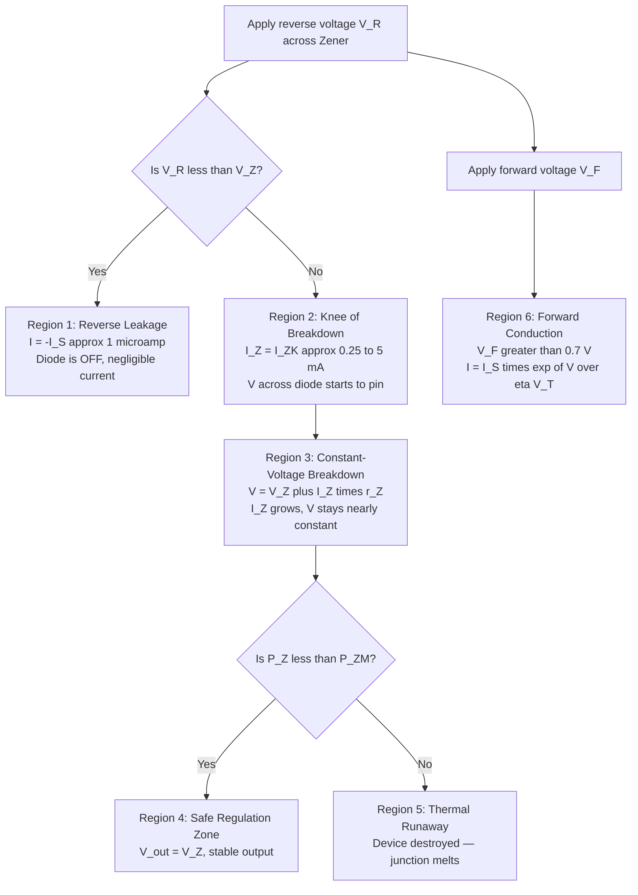
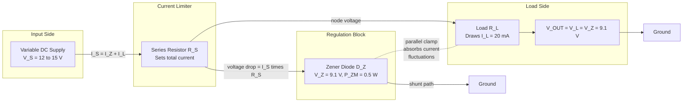
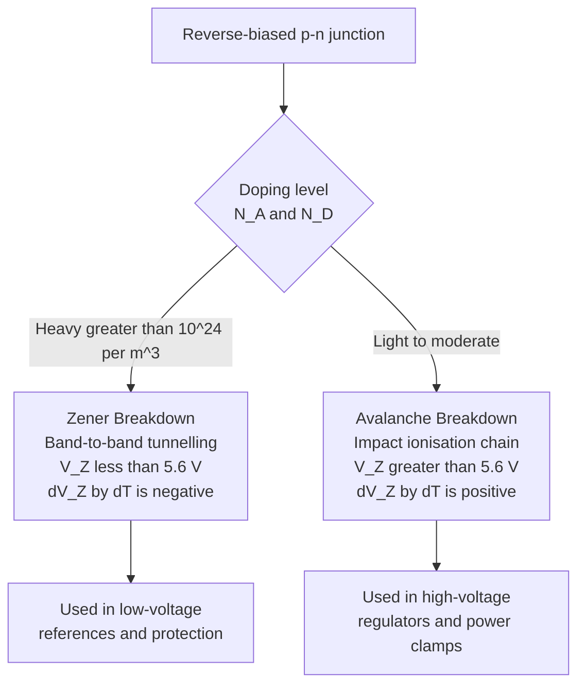
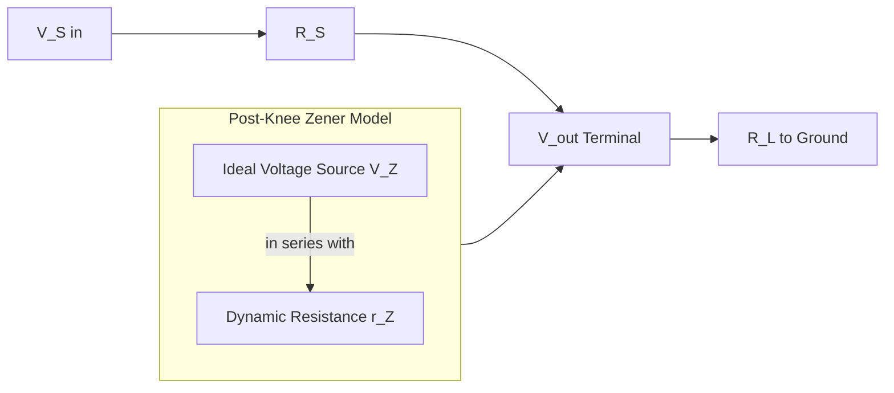

# Zener diode-VI characteristics

<!-- SECTION_1_START -->
# Zener Diode — V–I Characteristics

## 1.1 Formal Definition (KTU 2024 Syllabus Terminology)

> [!IMPORTANT]
> **Zener Diode:** A heavily doped, reverse-biased **p-n junction diode** specifically engineered to operate reliably in the **breakdown region** of its V–I characteristic curve without undergoing permanent damage. It exhibits a sharp, well-defined **knee voltage (V_Z)** at which the reverse current increases rapidly while the voltage across the device remains nearly constant.

In forward bias, a Zener diode behaves identically to an ordinary silicon diode (cut-in voltage ≈ **0.7 V**). However, in reverse bias, it is deliberately driven into **reverse breakdown** to exploit the *constant-voltage* property for regulation applications.

The Zener diode is the foundational building block of analog voltage references, signal clippers, protection circuits, and precision power supplies in information-science hardware.

## 1.2 Conceptual Analogy — The Pressure Relief Valve

Imagine a water pipeline fitted with a spring-loaded **pressure relief valve** set to open at exactly **9.1 units** of pressure.

* Below 9.1 units → the valve stays shut (no reverse current).
* At 9.1 units → the valve *cracks open* and lets water flow, but the **pressure on the gauge refuses to rise further** (constant V_Z).
* Crank the input pressure from 10 to 100 units → the valve simply dumps more water, and the gauge still reads ~9.1 units.

The Zener diode performs the electrical equivalent of this: once the reverse voltage hits **V_Z**, the diode conducts *any* excess current to keep the output voltage pinned at **V_Z**. A downstream load "sees" a rock-steady reference voltage regardless of fluctuations in the input supply or load current.

> [!NOTE]
> **Key Insight for KTU:** The Zener is *not* a normal diode — it is a **voltage regulator** that has been *deliberately pushed* into reverse breakdown. The breakdown is **non-destructive** because heavy doping makes the depletion region extremely thin and the breakdown region thermally stable.

## 1.3 Important Physical Constants & Standard Metrics

| Quantity | Symbol | Typical Range / Value |
|---|---|---|
| Boltzmann constant | $k$ | $1.38 \times 10^{-23}$ J/K |
| Electronic charge | $e$ | $1.6 \times 10^{-19}$ C |
| Thermal voltage at 300 K | $V_T = kT/e$ | ≈ **25.85 mV** |
| Silicon band gap at 300 K | $E_g$ | **1.12 eV** |
| Typical Zener voltages | $V_Z$ | 2.4 V, 3.3 V, 5.1 V, 6.2 V, 9.1 V, 12 V |
| Knee current | $I_{ZK}$ | 0.25 mA – 5 mA |
| Maximum Zener current | $I_{ZM}$ | 10 mA – 1 A (device-dependent) |

> [!VISUALIZATION CONTROL]
> **Concept:** V–I characteristic curve of a Zener diode showing the four distinct operating regions (forward, reverse leakage, breakdown knee, and constant-voltage breakdown).
> **GeoGebra / Desmos Input Equations:**
> * Forward branch (1st quadrant): piecewise $I(V) = I_S \left(e^{V/\eta V_T} - 1\right)$ with $I_S = 10^{-12}$, $\eta = 2$, $V_T = 0.02585$
> * Reverse leakage (3rd quadrant, $V < 0$, $\vert V \vert < V_Z$): $I(V) = -I_{leak} \approx -10^{-6}$
> * Breakdown knee and post-knee: $I(V) = -\dfrac{V - (-V_Z)}{r_Z}$ for $V < -V_Z$
> **Visual Description:** The student should observe an exponential forward curve, a flat negative-leakage plateau, a sharp **knee** at $-V_Z$ on the negative voltage axis, followed by a near-vertical drop into the 3rd quadrant representing constant voltage with rising current.

---

<!-- SECTION_1_END -->

<!-- SECTION_2_START -->
# Deep Theoretical Analysis & KTU High-Yield Formula Sheet

## 2.1 The Two Reverse-Breakdown Mechanisms

When a heavily doped p-n junction is reverse-biased, the electric field across the thin depletion layer becomes enormous. Two distinct physical mechanisms can trigger breakdown, and the *dominant* one depends on the Zener voltage rating.

### A. Zener Breakdown (Field Emission) — dominant for **V_Z < 5.6 V**

* The electric field in the depletion region ($\sim 10^7$ V/m) is so intense that it **rips covalent bonds** apart.
* Electrons are pulled directly from the **valence band of the p-side** into the **conduction band of the n-side** through quantum-mechanical tunnelling.
* This phenomenon is called **Band-to-Band Tunnelling** and is temperature *negative* (V_Z *decreases* as T rises).
* Occurs in **heavily doped** junctions (doping > $10^{24}$ m$^{-3}$).

### B. Avalanche Breakdown (Impact Ionisation) — dominant for **V_Z > 5.6 V**

* A thermally generated carrier accelerates across the depletion region and gains enough kinetic energy to **knock a new electron** out of a covalent bond on impact.
* This new electron, in turn, accelerates and creates *more* carriers — a **chain reaction** resembling a snowballing avalanche.
* Temperature *positive* (V_Z *increases* as T rises because lattice vibrations scatter carriers, requiring a higher field to sustain impact ionisation).
* Occurs in **lightly to moderately doped** junctions.

> [!TIP]
> **KTU Memory Hook:** *Low V → Zener, High V → Avalanche.* The crossover is at **V_Z ≈ 5.6 V** (a frequent 2-mark question!).

## 2.2 Critical Parameters of a Zener Diode

| Symbol | Parameter | Engineering Meaning |
|---|---|---|
| $V_Z$ | Nominal (knee) Zener voltage | The constant output voltage the regulator maintains |
| $I_{ZK}$ | Minimum (knee) Zener current | Smallest reverse current needed to *guarantee* the diode is in breakdown |
| $I_{ZM}$ | Maximum Zener current | Largest reverse current before thermal runaway; sets $R_S$ minimum |
| $P_{ZM}$ | Maximum power dissipation | $P_{ZM} = V_Z \times I_{ZM}$ — the absolute thermal limit |
| $r_Z$ | Dynamic (Zener) impedance | Slope of the post-knee curve: $r_Z = \dfrac{\Delta V_Z}{\Delta I_Z}$ (typically a few $\Omega$ to a few tens of $\Omega$) |
| $I_S$ | Reverse saturation current | Order of **nA** for silicon; controls sub-knee leakage |
| $\eta$ | Ideality factor | 1 to 2 (1 for diffusion, 2 for recombination-dominated) |

## 2.3 The Post-Knee Equivalent Circuit Model

A Zener diode operating in breakdown is modelled as:

* An **ideal voltage source** of magnitude $V_Z$ in series with a **dynamic resistance** $r_Z$.

$$V_{out} = V_Z + I_Z \cdot r_Z$$

If $r_Z \to 0$, the device is a **perfect** voltage source; in practice, $r_Z$ is small but non-zero, so $V_{out}$ drifts slightly with current.

## 2.4 KTU Formula Sheet / Cheat Sheet

| # | Formula | Description / Units |
|---|---|---|
| 1 | $V_{out} = V_Z + I_Z \cdot r_Z$ | Actual Zener terminal voltage during regulation (V) |
| 2 | $r_Z = \dfrac{\Delta V_Z}{\Delta I_Z}$ | Dynamic Zener impedance ($\Omega$) |
| 3 | $P_{ZM} = V_Z \cdot I_{ZM}$ | Maximum allowable Zener power (W) |
| 4 | $I_Z = I_S - I_L$ | KCL at the regulator node: Zener current equals supply current minus load current |
| 5 | $R_S = \dfrac{V_{in} - V_Z}{I_L + I_Z}$ | Required series (current-limiting) resistance ($\Omega$) |
| 6 | $V_{in(min)} = V_Z + R_S \cdot (I_L(max) + I_{ZK})$ | Minimum input voltage that keeps the Zener in regulation (V) |
| 7 | $V_{in(max)} = V_Z + R_S \cdot (I_L(min) + I_{ZM})$ | Maximum input voltage before the Zener exceeds its power rating (V) |
| 8 | $\text{Line Regulation} = \dfrac{\Delta V_{out}}{\Delta V_{in}} \times 100\,\%$ | Ability to reject supply-voltage variations |
| 9 | $\text{Load Regulation} = \dfrac{V_{NL} - V_{FL}}{V_{FL}} \times 100\,\%$ | Ability to reject load-current variations (NL = no-load, FL = full-load) |
| 10 | $I_S = e \cdot A \cdot \left(\dfrac{D_n n_i^2}{L_n N_A} + \dfrac{D_p n_i^2}{L_p N_D}\right)$ | Reverse saturation current (A); $D$, $L$ are diffusion constants and lengths |
| 11 | $V_{bi} = V_T \ln\!\left(\dfrac{N_A N_D}{n_i^2}\right)$ | Built-in potential of the p-n junction (V) |
| 12 | $W = \sqrt{\dfrac{2\varepsilon_s V_{bi}}{e}\!\left(\dfrac{1}{N_A} + \dfrac{1}{N_D}\right)}$ | Equilibrium depletion width (m) |

## 2.5 Real-World Engineering Utility

Zener diodes are the **silent guardians** of every electronic system:

* **Voltage regulators** in microcontroller power rails (e.g., 3.3 V, 5 V references for Raspberry Pi, Arduino, ESP32).
* **Over-voltage protection** across sensitive IC inputs, USB ports, and ESD-sensitive pins.
* **Waveform clippers and clampers** in analog signal processing and op-amp protection.
* **Reference voltages** for ADC/DAC calibration, comparator thresholds, and precision instrumentation.
* **Crowbar circuits** combined with a thyristor (SCR) for industrial over-voltage trip protection.
* **Voltage-level shifters** in mixed-voltage digital logic (3.3 V ↔ 5 V bridging).

> [!NOTE]
> **Information-Science Context (GAPHT121):** In CMOS logic families, the on-chip substrate is often biased using an *internal Zener* structure to suppress latch-up. Modern ICs frequently use *bandgap references* (which emulate a Zener of ~1.2 V) instead of discrete Zeners for tighter temperature stability, but the underlying physics — controlled reverse breakdown — is identical.

---

<!-- SECTION_2_END -->

<!-- SECTION_3_START -->
# Step-by-Step Derivations & Numerical Implementations

## 3.1 Derivation 1 — The Forward-Bias Zener Current

In forward bias, the Zener diode obeys the standard Shockley diode equation. We re-derive it from the continuity equations for minority-carrier diffusion.

The minority-carrier hole current on the n-side at position $x$ is:

$$I_p(x) = \dfrac{e A D_p p_{n0}}{L_p}\!\left(e^{V/\eta V_T} - 1\right) e^{-x/L_p}$$

The total diode current is the sum of electron and hole diffusion components evaluated at the depletion edges ($x = 0$ and $x = W$):

$$I = I_p(0) + I_n(W)$$

Substituting both terms and factoring:

$$I = eA \cdot n_i^2 \!\left(\dfrac{D_p}{L_p N_D} + \dfrac{D_n}{L_n N_A}\right)\!\left(e^{V/\eta V_T} - 1\right)$$

Defining the **reverse saturation current** $I_S$:

$$I_S = eA \cdot n_i^2 \!\left(\dfrac{D_p}{L_p N_D} + \dfrac{D_n}{L_n N_A}\right)$$

We obtain the canonical **Shockley diode equation**:

$$\boxed{I = I_S\!\left(e^{V/\eta V_T} - 1\right)}$$

* $I_S \approx 10^{-12}$ A for silicon at 300 K
* $V_T = kT/e \approx 25.85$ mV at 300 K
* $\eta = 1$ (diffusion-dominated) or $2$ (recombination-dominated)

**Engineering interpretation:** For $V \gg V_T$, the $-1$ is dropped and $I$ grows **exponentially** with $V$. A mere 60 mV increase in forward bias multiplies the current by a factor of 10 (for $\eta=1$).

## 3.2 Derivation 2 — Dynamic Zener Impedance from the Post-Knee Slope

In the breakdown region, the terminal voltage is:

$$V_{Z,\text{actual}} = V_Z + I_Z \cdot r_Z$$

Differentiating with respect to $I_Z$ at the operating point:

$$\dfrac{dV_{Z,\text{actual}}}{dI_Z} = r_Z$$

By definition, this slope is the **dynamic (small-signal) Zener impedance**:

$$r_Z = \dfrac{\Delta V_Z}{\Delta I_Z} \;\;\big\vert\;\text{at the Q-point}$$

**Worked Numerical Example:**

A 5.1 V Zener diode is measured at two operating points:
* At $I_{Z1} = 10$ mA, $V_{Z1} = 5.10$ V
* At $I_{Z2} = 30$ mA, $V_{Z2} = 5.16$ V

Compute $r_Z$:

$$r_Z = \dfrac{\Delta V_Z}{\Delta I_Z} = \dfrac{5.16 - 5.10}{(30 - 10) \times 10^{-3}}$$

$$r_Z = \dfrac{0.06}{20 \times 10^{-3}} = 3.0 \;\Omega$$

**Interpretation:** A small Zener impedance ($\sim 3\,\Omega$) is highly desirable in regulator design. The smaller the $r_Z$, the tighter the regulation under load-current swings.

## 3.3 Derivation 3 — Design of a Zener Voltage Regulator

**Problem Statement (KTU-style):**

> Design a Zener voltage regulator to deliver a constant **$V_L = 9.1$ V** to a load that draws $I_L = 20$ mA from a supply that varies between **$V_S = 12$ V and 15 V**. The Zener has $I_{ZK} = 5$ mA and $P_{ZM} = 0.5$ W.

### Step 1 — Choose the Zener Diode

Select a Zener with $V_Z = V_L = 9.1$ V.

### Step 2 — Compute the Maximum Zener Current

$$I_{ZM} = \dfrac{P_{ZM}}{V_Z} = \dfrac{0.5}{9.1} = 54.95 \text{ mA}$$

### Step 3 — Worst-Case Conditions

The Zener must remain in regulation for *all* combinations of $V_S$ and $I_L$. Two extreme scenarios must be satisfied:

**(a) Minimum supply, maximum load** (Zener current smallest — must stay above $I_{ZK}$):

$$I_S = \dfrac{V_S - V_Z}{R_S} = I_L + I_Z \;\;\Longrightarrow\;\; I_Z = I_S - I_L$$

For regulation: $I_Z \geq I_{ZK} = 5$ mA

At $V_S = 12$ V, $I_L = 20$ mA:

$$R_S \leq \dfrac{V_S - V_Z}{I_L + I_{ZK}} = \dfrac{12 - 9.1}{(20 + 5) \times 10^{-3}} = \dfrac{2.9}{0.025}$$

$$R_S \leq 116 \;\Omega$$

**(b) Maximum supply, minimum load** (Zener current largest — must not exceed $I_{ZM}$):

Assume $I_{L(min)} = 0$ (open-circuit load, the absolute worst case).

At $V_S = 15$ V:

$$R_S \geq \dfrac{V_S - V_Z}{I_{ZM}} = \dfrac{15 - 9.1}{54.95 \times 10^{-3}} = \dfrac{5.9}{0.05495}$$

$$R_S \geq 107.4 \;\Omega$$

### Step 4 — Choose a Standard Resistor

The two bounds give a very narrow window. Picking the nearest E12 standard value:

$$\boxed{R_S = 110 \;\Omega \;\;\text{(E12 series, 5\% tolerance)}}$$

### Step 5 — Verification

* At $V_S = 12$ V, $I_L = 20$ mA:
  $I_S = (12 - 9.1)/110 = 26.36$ mA → $I_Z = 6.36$ mA ✓ (above $I_{ZK}$ = 5 mA)
* At $V_S = 15$ V, $I_L = 0$:
  $I_S = (15 - 9.1)/110 = 53.64$ mA → $I_Z = 53.64$ mA ✓ (below $I_{ZM}$ = 54.95 mA)

Power dissipated in $R_S$: $P_R = I_S^2 \cdot R_S = (0.05364)^2 \times 110 \approx 0.317$ W → use a **0.5 W** resistor.

## 3.4 Worked Python Implementation — V–I Curve Plotter

```python
import numpy as np
import matplotlib.pyplot as plt

# ---------- Physical constants ----------
q   = 1.6e-19          # electronic charge (C)
k   = 1.38e-23         # Boltzmann constant (J/K)
T   = 300              # temperature (K)
VT  = k * T / q        # thermal voltage ≈ 25.85 mV
eta = 1.0              # ideality factor
Is  = 1e-12            # reverse saturation current (A)
Vz  = 5.1              # nominal Zener voltage (V)
Izk = 0.005            # knee current (A)
rz  = 3.0              # dynamic Zener impedance (Ω)

# ---------- Forward-bias (1st quadrant) ----------
V_fwd = np.linspace(-0.9, 0.9, 600)
I_fwd = Is * (np.exp(V_fwd / (eta * VT)) - 1)
# Clip extreme values for plotting
I_fwd = np.clip(I_fwd, -0.1, 1.0)

# ---------- Reverse-bias pre-knee (3rd quadrant) ----------
V_rev_pre = np.linspace(0, -Vz, 200)
I_rev_pre = -Is * np.ones_like(V_rev_pre)   # small leakage

# ---------- Reverse-bias post-knee (breakdown) ----------
V_rev_post = np.linspace(-Vz, -Vz - 5, 200)
# I = -(V + Vz) / rz  (negative V, negative I)
I_rev_post = (V_rev_post + Vz) / rz        # current is negative

# ---------- Plot ----------
fig, ax = plt.subplots(figsize=(8, 6))
ax.plot(V_fwd * 1000, I_fwd * 1000, 'b', lw=2, label='Forward bias')
ax.plot(V_rev_pre,  I_rev_pre * 1e6,  'b', lw=2, label='Reverse leakage')
ax.plot(V_rev_post, I_rev_post * 1000,'r', lw=2, label='Breakdown region')
ax.axvline(x=-Vz * 1000, color='k', ls='--', alpha=0.5)
ax.axhline(y=0,         color='k', lw=0.6)

ax.set_xlabel('Voltage (mV)')
ax.set_ylabel('Current (mA)')
ax.set_title('Zener Diode V–I Characteristic (Vz = 5.1 V)')
ax.grid(True, alpha=0.3)
ax.legend(loc='best')
plt.tight_layout()
plt.show()
```

**Output insight:** The forward curve rises exponentially through the 1st quadrant. The reverse branch sits nearly flat at $-I_S$ (≈ $-1\,\mu$A) until the voltage reaches $-V_Z$ (= $-5100$ mV), where the curve plunges almost vertically — the **breakdown knee**. Beyond the knee, the current grows rapidly while voltage stays essentially constant — this is the operating region for regulation.

## 3.5 Derivation 4 — Line and Load Regulation of a Zener Regulator

For a Zener regulator with series resistance $R_S$ and load $R_L$:

$$V_{out} = V_Z = V_S - I_S R_S \quad \text{where} \quad I_S = I_Z + I_L = I_Z + \dfrac{V_Z}{R_L}$$

Rearranging:

$$V_S = V_Z + R_S I_Z + \dfrac{R_S V_Z}{R_L}$$

### Line Regulation

Differentiate with respect to $V_S$ at constant $R_L$:

$$\dfrac{\partial V_{out}}{\partial V_S} = \dfrac{r_Z}{R_S + r_Z + (R_S r_Z / R_L)}$$

For the typical case $R_S \gg r_Z$ and $R_L \gg r_Z$:

$$\text{Line Regulation} \approx \dfrac{r_Z}{R_S} \times 100\,\%$$

### Load Regulation

$$\text{Load Regulation} = \dfrac{V_{NL} - V_{FL}}{V_{FL}} \times 100\,\%$$

**Worked Example:** With $R_S = 110\;\Omega$, $r_Z = 3\;\Omega$:

$$\text{Line Regulation} \approx \dfrac{3}{110} \times 100\,\% = 2.73\,\%$$

A 1 V change in $V_S$ produces only ~27 mV change at the load — an **attenuation factor of ~37×**.

---

<!-- SECTION_3_END -->

<!-- SECTION_4_START -->
# Structural Diagrams & Schematics

## 4.1 Zener Diode V–I Operating Regions — Functional Topology



## 4.2 Zener Voltage Regulator — Functional Block Architecture



**Interpretation:** The series resistor $R_S$ carries the *sum* of the Zener current $I_Z$ and the load current $I_L$. The Zener, oriented in reverse, sits in parallel with the load. Whenever the supply voltage tries to rise, the *excess* current is diverted through the Zener (because $V_{out}$ is *clamped* to $V_Z$), keeping $V_L$ rock-steady.

## 4.3 Breakdown Mechanism Decision Flow



## 4.4 Equivalent Circuit Model (Block Form)



---

<!-- SECTION_4_END -->

<!-- SECTION_5_START -->
# KTU 2024 Scheme Examination Question Bank & Topic Recap

## Part A — Short Answer Questions (3 Marks Each)

> **Q1.** **[KTU University Exam — July 2024]** *Define the term "knee voltage" of a Zener diode. Why is the doping concentration kept very high in a Zener diode compared to a regular rectifier diode?*

**Model Answer (3 Marks):**
* **Knee voltage (V_Z):** [1 Mark] The reverse-bias voltage at which the V–I characteristic of a Zener diode sharply transitions from the high-resistance (leakage) region to the low-resistance (breakdown) region, beyond which the voltage across the device remains almost constant.
* **High doping rationale:** [1 Mark] Heavy doping makes the depletion layer extremely thin ($\sim 50$ nm), which produces a very strong electric field ($\sim 10^7$ V/m) at a low applied reverse voltage, enabling controlled breakdown at a precise voltage.
* **Result:** [1 Mark] A well-defined, sharp, temperature-tunable breakdown voltage, suitable for voltage regulation, and the thin junction prevents permanent damage during repeated breakdown events.

---

> **Q2.** **[KTU University Exam — Dec 2023]** *Distinguish between Zener breakdown and Avalanche breakdown. Mention the approximate voltage at which one mechanism dominates over the other.*

**Model Answer (3 Marks):**

| Feature | Zener Breakdown | Avalanche Breakdown |
|---|---|---|
| Mechanism | Quantum-mechanical band-to-band tunnelling | Carrier impact ionisation chain reaction |
| Doping | Very heavy | Moderate to light |
| Dominant range | $V_Z < 5.6$ V | $V_Z > 5.6$ V |
| Temperature coefficient | Negative ($V_Z$ decreases with $T$) | Positive ($V_Z$ increases with $T$) |
| Breakdown site | Uniform across junction | Localised hot spots |

[1 Mark for correct mechanism description of each, 1 Mark for the crossover voltage ≈ 5.6 V.]

---

## Part B — Long Answer Questions (14 Marks, Module Internal Choice)

### Question A (14 Marks) — V–I Characteristics, Regulator Design, and Regulation Metrics

> **Q3 (a).** **[KTU University Exam — July 2024, Module 4 Choice A(a)]** *With the help of a neat V–I characteristic curve, explain the working of a Zener diode in forward and reverse bias. Mark the regions: forward conduction, reverse leakage, breakdown knee, and constant-voltage breakdown. [7 Marks, CO1, Understand]*

**Model Solution:**

* **[Forward-bias region: 2 Marks]** In forward bias, the Zener behaves like an ordinary silicon p-n junction. Below the cut-in voltage $V_\gamma \approx 0.7$ V, the current is negligible. Above $V_\gamma$, the current rises exponentially following $I = I_S (e^{V/\eta V_T} - 1)$. The curve is identical to that of a standard 1N400x rectifier diode.

* **[Reverse-leakage region: 1 Mark]** For $|V_R| < V_Z$, only a tiny reverse saturation current $I_S$ (≈ nA to μA for Si) flows due to thermally generated minority carriers. The diode is effectively OFF.

* **[Knee of breakdown: 1 Mark]** When the reverse voltage reaches $V_Z$, the electric field in the depletion region becomes large enough to initiate either tunnelling or impact ionisation. The current begins to increase rapidly — this is the **knee** of the curve.

* **[Constant-voltage region: 2 Marks]** Beyond the knee, the terminal voltage varies only by $I_Z \cdot r_Z$ even as $I_Z$ increases by tens of mA. This near-vertical drop into the third quadrant is the *operating region* of the Zener as a voltage regulator.

* **[Sketch requirement: 1 Mark]** Axes correctly labelled (V on x-axis, I on y-axis), with all four regions clearly marked and $V_Z$ indicated on the negative voltage axis.

> **Q3 (b).** **[KTU University Exam — July 2024, Module 4 Choice A(b)]** *A Zener diode has $V_Z = 6.2$ V, $I_{ZK} = 5$ mA, and $P_{ZM} = 0.6$ W. It is used in a regulator with a supply that varies from 10 V to 14 V, driving a load of 25 mA. Design the series resistor $R_S$ such that the Zener always operates in its safe breakdown region. [7 Marks, CO2, Apply]*

**Model Solution:**

**Step 1 — Maximum Zener current [1 Mark]:**

$$I_{ZM} = \dfrac{P_{ZM}}{V_Z} = \dfrac{0.6}{6.2} = 96.77 \text{ mA}$$

**Step 2 — Worst case A: minimum $V_S$, maximum $I_L$ (Zener must stay above $I_{ZK}$) [2 Marks]:**

$$R_S \leq \dfrac{V_{S,min} - V_Z}{I_{L,max} + I_{ZK}} = \dfrac{10 - 6.2}{(25 + 5) \times 10^{-3}} = \dfrac{3.8}{0.030}$$

$$R_S \leq 126.67 \;\Omega$$

**Step 3 — Worst case B: maximum $V_S$, minimum $I_L$ (Zener must stay below $I_{ZM}$) [2 Marks]:**

Assume $I_{L,min} = 0$ (open-circuit load — worst case):

$$R_S \geq \dfrac{V_{S,max} - V_Z}{I_{ZM}} = \dfrac{14 - 6.2}{96.77 \times 10^{-3}} = \dfrac{7.8}{0.09677}$$

$$R_S \geq 80.60 \;\Omega$$

**Step 4 — Select standard E12 resistor [1 Mark]:**

The valid range is $80.6\;\Omega \leq R_S \leq 126.67\;\Omega$. Choose the closest E12 value:

$$\boxed{R_S = 100 \;\Omega \;\text{(1\% tolerance, rated at 0.5 W)}}$$

**Step 5 — Verification [1 Mark]:**
* At $V_S = 10$ V, $I_L = 25$ mA: $I_Z = (10-6.2)/100 - 0.025 = 0.038 - 0.025 = 13$ mA ✓ (above 5 mA)
* At $V_S = 14$ V, $I_L = 0$: $I_Z = (14-6.2)/100 = 78$ mA ✓ (below 96.77 mA)

> [!WARNING]
> **KTU Examiner's Valuation Warning:**
> * [−1 Mark] Forgetting to *check both* worst cases (low $V_S$/high $I_L$ AND high $V_S$/low $I_L$). Many students solve only the first condition and miss the upper bound.
> * [−1 Mark] Using the load current $I_L$ alone in the numerator instead of $I_L + I_{ZK}$. The Zener must always carry *at least* $I_{ZK}$ regardless of the load.
> * [−1 Mark] Failing to state the chosen E12 value explicitly and to verify the design numerically.
> * **Common pitfall:** Some students write $R_S = (V_S - V_Z)/I_L$ and forget the Zener's own current share. That gives a resistor that *overheats* the Zener at high supply.

---

### Question B (14 Marks) — Alternative Choice

> **Q4 (a).** **[KTU University Exam — Dec 2023, Module 4 Choice B(a)]** *Derive the Shockley diode equation from first principles starting from the minority-carrier diffusion equation in the neutral n-region. State clearly the boundary conditions used. [7 Marks, CO1, Understand / Apply]*

**Model Solution:**

**Step 1 — Steady-state continuity equation for excess holes in the n-region [1 Mark]:**

$$D_p \dfrac{d^2 p_n'(x)}{dx^2} - \dfrac{p_n'(x)}{\tau_p} = 0$$

where $p_n'(x) = p_n(x) - p_{n0}$ is the excess minority-carrier concentration, $D_p$ is the hole diffusion coefficient, and $\tau_p$ is the hole lifetime.

**Step 2 — Boundary conditions [2 Marks]:**
* At $x \to \infty$ (far from the depletion edge): $p_n'(\infty) = 0$ (thermal equilibrium restored)
* At $x = 0$ (depletion edge on the n-side): $p_n'(0) = p_{n0}\!\left(e^{V/V_T} - 1\right)$ (law of the junction, derived from quasi-Fermi-level separation)

**Step 3 — General solution of the diffusion equation [1 Mark]:**

$$p_n'(x) = A \, e^{-x/L_p} + B \, e^{+x/L_p}$$

where $L_p = \sqrt{D_p \tau_p}$ is the diffusion length of holes. Applying $p_n'(\infty) = 0$ forces $B = 0$, giving:

$$p_n'(x) = A \, e^{-x/L_p}$$

Applying the second boundary condition: $A = p_{n0}\!\left(e^{V/V_T} - 1\right)$, hence:

$$p_n'(x) = p_{n0}\!\left(e^{V/V_T} - 1\right) e^{-x/L_p}$$

**Step 4 — Hole diffusion current at $x = 0$ [1 Mark]:**

$$I_p(0) = -e A D_p \dfrac{dp_n'}{dx}\bigg\vert_{x=0} = \dfrac{e A D_p p_{n0}}{L_p}\!\left(e^{V/V_T} - 1\right)$$

**Step 5 — By symmetry, the electron diffusion current at the p-side edge is [1 Mark]:**

$$I_n(W) = \dfrac{e A D_n n_{p0}}{L_n}\!\left(e^{V/V_T} - 1\right)$$

**Step 6 — Total current and final Shockley form [1 Mark]:**

Summing both components:

$$I = I_p(0) + I_n(W) = eA\!\left(\dfrac{D_p p_{n0}}{L_p} + \dfrac{D_n n_{p0}}{L_n}\right)\!\left(e^{V/V_T} - 1\right)$$

Using $p_{n0} = n_i^2/N_D$ and $n_{p0} = n_i^2/N_A$:

$$\boxed{I = eA\, n_i^2 \!\left(\dfrac{D_p}{L_p N_D} + \dfrac{D_n}{L_n N_A}\right)\!\left(e^{V/V_T} - 1\right) = I_S\!\left(e^{V/V_T} - 1\right)}$$

> **Q4 (b).** **[KTU University Exam — Dec 2023, Module 4 Choice B(b)]** *The Zener diode in a regulator has the following measured V–I points in breakdown: (10 mA, 5.05 V), (20 mA, 5.08 V), (30 mA, 5.10 V). Compute the dynamic Zener impedance $r_Z$ and the line regulation for $R_S = 220\;\Omega$. [7 Marks, CO2, Apply]*

**Model Solution:**

**Step 1 — Identify endpoints [1 Mark]:**

Using the extreme points $(I_{Z1}, V_{Z1}) = (10\text{ mA}, 5.05\text{ V})$ and $(I_{Z2}, V_{Z2}) = (30\text{ mA}, 5.10\text{ V})$ gives the largest $\Delta I_Z$ and therefore the most accurate slope.

**Step 2 — Compute $\Delta V_Z$ and $\Delta I_Z$ [1 Mark]:**

$$\Delta V_Z = 5.10 - 5.05 = 0.05 \text{ V}$$

$$\Delta I_Z = (30 - 10) \times 10^{-3} = 0.020 \text{ A}$$

**Step 3 — Dynamic Zener impedance [2 Marks]:**

$$\boxed{r_Z = \dfrac{\Delta V_Z}{\Delta I_Z} = \dfrac{0.05}{0.020} = 2.5 \;\Omega}$$

**Step 4 — Line regulation formula [1 Mark]:**

$$\text{Line Regulation} = \dfrac{\Delta V_{out}}{\Delta V_{in}} \times 100\,\% \approx \dfrac{r_Z}{R_S} \times 100\,\%$$

**Step 5 — Numerical evaluation [2 Marks]:**

$$\text{Line Regulation} = \dfrac{2.5}{220} \times 100\,\% = 1.136\,\%$$

$$\boxed{\text{Line Regulation} \approx 1.14\,\%}$$

> [!WARNING]
> **KTU Examiner's Valuation Warning:**
> * [−1 Mark] Using only *adjacent* data points (e.g., 10 mA to 20 mA) instead of the *outermost* pair — the outermost pair minimises numerical error from curve-fit noise.
> * [−1 Mark] Forgetting to convert mA to A in $\Delta I_Z$. A common slip-up that produces a dynamic impedance in the wrong units by a factor of $10^3$.
> * [−1 Mark] Expressing line regulation as a fraction (0.0114) rather than a percentage (1.14 %).
> * **Common pitfall:** Confusing *line* regulation with *load* regulation. Line regulation concerns $\Delta V_{out}/\Delta V_{in}$ at constant $R_L$; load regulation concerns $\Delta V_{out}/\Delta I_L$ at constant $V_{in}$.

---

## Topic Recap & Important Things to Remember

> [!IMPORTANT]
> **Rapid Revision Checklist — Zener Diode V–I Characteristics**

- **Zener diode = reverse-biased p-n junction** designed to operate safely in breakdown. It is *not* a faulty diode; the breakdown is *engineered* to be non-destructive.
- **Forward bias** is identical to a normal Si diode: $I = I_S(e^{V/\eta V_T} - 1)$, $V_\gamma \approx 0.7$ V.
- **Reverse bias below $V_Z$:** Only reverse saturation current $I_S$ (nA to μA) flows — diode is essentially OFF.
- **Knee voltage $V_Z$:** the specific reverse voltage at which the diode enters breakdown; the primary design parameter.
- **Two breakdown mechanisms:**
  * **Zener (tunnelling)** — $V_Z < 5.6$ V, heavy doping, *negative* temperature coefficient.
  * **Avalanche (impact ionisation)** — $V_Z > 5.6$ V, lighter doping, *positive* temperature coefficient.
  * Crossover ≈ **5.6 V** — a guaranteed KTU question.
- **Dynamic Zener impedance:** $r_Z = \Delta V_Z / \Delta I_Z$, ideally a few ohms; smaller is better.
- **Power rating:** $P_{ZM} = V_Z \times I_{ZM}$ — never exceed this; it is the thermal destruction limit.
- **Regulator design recipe:**
  1. Pick $V_Z = V_{out}$ required by the load.
  2. Compute $I_{ZM} = P_{ZM}/V_Z$.
  3. Apply **two** worst-case conditions:
     * $R_S \leq (V_{S,min} - V_Z)/(I_{L,max} + I_{ZK})$
     * $R_S \geq (V_{S,max} - V_Z)/I_{ZM}$
  4. Pick a standard E12 value in the valid window.
  5. Verify both extremes and check $R_S$ power dissipation.
- **Line regulation** $\approx r_Z/R_S$ (in %): a small $r_Z$ and large $R_S$ give tighter regulation.
- **Load regulation:** $(V_{NL} - V_{FL})/V_{FL} \times 100\,\%$.
- **Applications in information science:** voltage references for ADCs/DACs, op-amp supply rails, ESD protection, level shifting, waveform clippers, crowbar protection.
- **Always** draw the V–I curve with both quadrants and label all four regions — partial diagrams lose easy marks.
- **Always** show both KCL ($I_S = I_Z + I_L$) and KVL ($V_S = I_S R_S + V_Z$) in regulator problems.

---

<!-- SECTION_5_END -->
