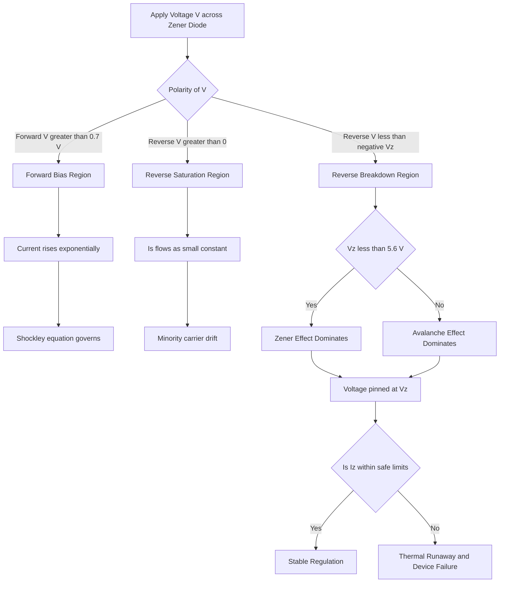
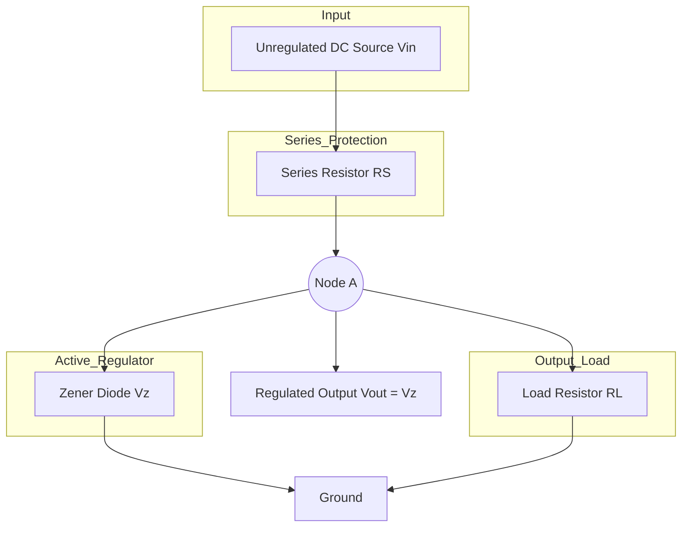
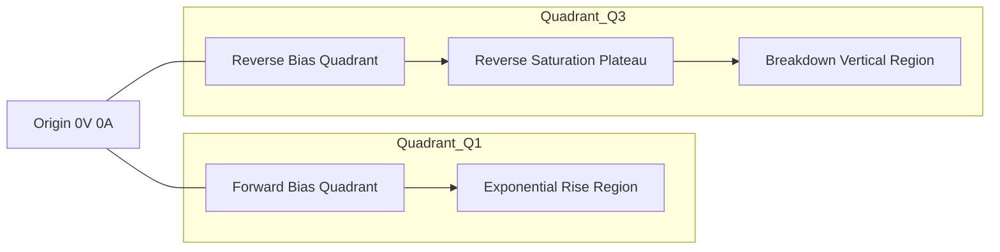

# Zener diode-VI characteristics

<!-- SECTION_1_START -->
# ⚡ Zener Diode: V-I Characteristics

> [!NOTE]
> **KTU 2024 Scheme Definition:** A **Zener diode** is a heavily doped p-n junction semiconductor device specifically designed to operate reliably in the **reverse breakdown region** of its V-I characteristics, where the voltage across it remains nearly constant over a wide range of reverse currents.

## 1.1 What is a Zener Diode? — Plain English Intuition

Imagine a **water tap** (faucet) that can hold back a fixed amount of water pressure. No matter how much more pressure you apply beyond a certain point, the tap keeps releasing water at the *same constant pressure*. A Zener diode behaves exactly like this in the electrical world:

- **Forward bias** (like normal tap water flow) → conducts easily like a regular diode.
- **Reverse bias up to Vz** → only a tiny "leak" of current flows (a few µA).
- **At Vz (breakdown voltage)** → the diode "opens" but the voltage across its terminals stays locked at Vz, regardless of current changes.

> [!IMPORTANT]
> The magic of a Zener diode is that it is *engineered* to operate in **reverse breakdown** without damage, making it the perfect "voltage police officer" in any DC circuit.

### 1.2 Real-World Analogy: The Pressure Relief Valve

Think of a **pressure cooker safety valve**:
1. Below a certain pressure (Vz) → the valve is shut (reverse saturation current).
2. Once the threshold pressure is reached → the valve opens and releases excess pressure, but the cooker pressure itself **never rises above the safe limit**.
3. You can add more heat (current) → the pressure (voltage) remains **constant** at Vz.

This is precisely how a Zener diode provides **voltage regulation** in electronic circuits.

## 1.3 Physical Construction (Intuition)

A Zener diode differs from a regular diode in **one crucial way — doping concentration**:

| Parameter | Regular Diode | Zener Diode |
|-----------|--------------|-------------|
| Doping level | Light | **Very heavy** |
| Depletion width | Wide ($\sim 1\ \mu m$) | **Very narrow** ($\sim 10\ nm$) |
| Breakdown voltage | High, undefined | **Precise, sharply defined** |
| Operating region | Forward bias | **Reverse breakdown (intentional)** |

> [!TIP]
> The **heavily doped** junction has such a thin depletion region that the strong electric field ($\sim 10^6\ V/cm$) can rip electrons directly across the junction — this is the **Zener effect (quantum tunneling)**.

## 1.4 Two Breakdown Mechanisms

> [!IMPORTANT]
> **KTU High-Yield Distinction:** Students *must* know both mechanisms.

### (a) Zener Effect (Dominates for Vz < 5.6 V)
- Occurs in **heavily doped** junctions with narrow depletion regions.
- Mechanism: **Quantum mechanical tunneling** of electrons from the valence band of the p-side directly into the conduction band of the n-side.
- **Negative temperature coefficient** — as temperature rises, Vz *decreases*.

### (b) Avalanche Effect (Dominates for Vz > 5.6 V)
- Occurs in **lightly doped** junctions (relatively).
- Mechanism: A carrier gains enough kinetic energy from the high electric field, collides with a lattice atom, and creates a new **electron-hole pair** (impact ionization). These new carriers create more pairs → **avalanche multiplication**.
- **Positive temperature coefficient** — as temperature rises, Vz *increases*.

> [!VISUALIZATION CONTROL]
> **Concept:** Reverse Breakdown Mechanisms — Field vs. Energy Band
> **GeoGebra / Desmos Input Equations:**
> * `E_field(x) = 1e6 * exp(-x / 1e-8)` (exponential field inside depletion region)
> * `Tunneling_Prob(E) = exp(-E_0 / E_field)` (WKB tunneling probability)
> **Visual Description:** A narrow, tall rectangular barrier with a high, thin electric field spike. A wavefunction entering from the left "tunnels through" the narrow barrier — illustrating the Zener effect. For avalanche, depict a single particle striking a lattice, producing two particles, each producing two more, forming a cascade tree.

---
<!-- SECTION_1_END -->

<!-- SECTION_2_START -->
# 🔬 Deep Theoretical Analysis & KTU Formula Sheet

## 2.1 The V-I Characteristics — Region by Region

The Zener diode V-I curve has **four distinct regions** that the KTU examiner expects you to label and explain:

### Region 1: Forward Bias (Right of Origin)
- The diode behaves like an **ordinary p-n junction diode**.
- Forward current rises sharply once the cut-in voltage ($\approx 0.7\ V$ for Si) is exceeded.
- Follows the **Shockley diode equation**.

### Region 2: Reverse Saturation Region (Below Vz, left of origin)
- A small, nearly constant reverse current $I_s$ (a few µA or nA) flows.
- This current is due to **minority carriers** (thermally generated electron-hole pairs).
- Approximately constant with applied voltage.

### Region 3: Breakdown Region (At and beyond Vz)
- The voltage across the diode is "**pinned**" at $V_z$ (the Zener voltage).
- Current can increase over a **wide range** (from $I_{zk}$ to $I_{zM}$) while voltage remains almost constant.
- The curve has a **sharp knee** at $V_z$.

### Region 4: Beyond Maximum Current
- If $I_z > I_{zM}$, the diode is destroyed due to **excessive power dissipation** ($P_z = V_z \cdot I_z$).

## 2.2 Critical Zener Diode Parameters (KTU Must-Know List)

| Symbol | Parameter | Typical Range | Description |
|--------|-----------|---------------|-------------|
| $V_z$ | Zener / Breakdown Voltage | 2.4 V to 200 V | Voltage at which diode enters breakdown |
| $I_{zk}$ | Knee Current | $\sim 0.25\ mA$ to $5\ mA$ | Minimum current to maintain $V_z$ |
| $I_{zM}$ | Maximum Zener Current | mA to A | Maximum safe current |
| $I_{zT}$ | Test Current | mA range | Current at which $V_z$ is specified |
| $r_z$ | Dynamic (Zener) Impedance | $\sim 1\ \Omega$ to $100\ \Omega$ | $\Delta V_z / \Delta I_z$ in breakdown |
| $P_{zM}$ | Maximum Power Dissipation | 0.25 W to 50 W | $V_z \times I_{zM}$ |
| $\alpha_{vz}$ | Temperature Coefficient | $\%/{}^\circ C$ | Change of $V_z$ with temperature |

> [!IMPORTANT]
> The **Dynamic Zener Impedance** $r_z$ is the KTU-favorite parameter. A *lower* $r_z$ = *better* voltage regulation, because small changes in current produce tiny changes in voltage.

## 2.3 KTU High-Yield Formula Sheet

| # | Formula | Description | Unit |
|---|---------|-------------|------|
| 1 | $I = I_s \left( e^{V/\eta V_T} - 1 \right)$ | **Shockley Diode Equation** (forward/reverse) | A |
| 2 | $V_T = \dfrac{kT}{q}$ | Thermal voltage at temperature $T$ | V |
| 3 | $V_T \approx 26\ mV$ | Thermal voltage at **room temperature (300 K)** | V |
| 4 | $r_z = \dfrac{\Delta V_z}{\Delta I_z}$ | Dynamic Zener impedance in breakdown | $\Omega$ |
| 5 | $P_{zM} = V_z \cdot I_{zM}$ | Maximum power dissipation rating | W |
| 6 | $\%\text{Reg} = \dfrac{V_{NL} - V_{FL}}{V_{FL}} \times 100$ | Voltage regulation efficiency | % |
| 7 | $V_{out} = V_z - I_z \cdot r_z$ | Actual output voltage accounting for $r_z$ | V |
| 8 | $I_s = I_o \left( \dfrac{T}{T_o} \right)^3 e^{\left[ E_g \left( \dfrac{1}{T_o} - \dfrac{1}{T} \right) \right] / k}$ | Reverse saturation current vs. temperature | A |
| 9 | $\alpha_{vz} = \dfrac{\Delta V_z / V_z}{\Delta T}$ | Temperature coefficient of $V_z$ | $\%/{}^\circ C$ |

> [!WARNING]
> **KTU Common Mistake:** Writing $V_T = 25\ mV$. The correct value at **300 K is 25.85 mV**, often rounded to **26 mV**. Examiners give full credit only for $V_T = kT/q$.

## 2.4 Real-World Engineering Utility

> [!TIP]
> **Where Zener diodes are used in production systems:**

1. **Voltage Regulation** — Power supplies, battery chargers, microcontroller rails (e.g., a 5.1 V Zener on a 9 V input gives a regulated 5 V output).
2. **Voltage Reference** — ADC/DAC reference inputs, precision measurement instruments.
3. **Clipping Circuits** — Waveform shaping in signal processing, overvoltage protection in communication lines.
4. **Protection Circuits** — Crowbar protection, ESD protection on data lines (USB, HDMI, Ethernet).
5. **Level Shifter** — Translating between logic families (e.g., 3.3 V ↔ 5 V).

---
<!-- SECTION_2_END -->

<!-- SECTION_3_START -->
# 📐 Step-by-Step Derivations & Worked Problems

## 3.1 Derivation: Dynamic Zener Impedance from V-I Slope

> **Problem Setup:** Given a Zener diode with measured data points $(I_{z1}, V_{z1}) = (10\ mA, 5.10\ V)$ and $(I_{z2}, V_{z2}) = (50\ mA, 5.18\ V)$, find the dynamic Zener impedance.

**Step 1 — State the definition of $r_z$:**

$$r_z = \frac{\Delta V_z}{\Delta I_z}$$

**Step 2 — Compute the voltage change $\Delta V_z$:**

$$\Delta V_z = V_{z2} - V_{z1} = 5.18\ V - 5.10\ V = 0.08\ V$$

**Step 3 — Compute the current change $\Delta I_z$:**

$$\Delta I_z = I_{z2} - I_{z1} = 50\ mA - 10\ mA = 40\ mA = 40 \times 10^{-3}\ A$$

**Step 4 — Substitute into the definition:**

$$r_z = \frac{0.08\ V}{40 \times 10^{-3}\ A}$$

**Step 5 — Final result:**

$$r_z = 2.0\ \Omega$$

> **KTU Valuation:** [Stating formula: 1 Mark] [Correct $\Delta V_z$: 1 Mark] [Correct $\Delta I_z$: 1 Mark] [Final answer: 1 Mark] — 4 marks total.

---

## 3.2 Derivation: Maximum Zener Current from Power Rating

> **Problem Setup:** A 7.5 V Zener diode is rated at $P_{zM} = 500\ mW$. Find the maximum safe Zener current $I_{zM}$.

**Step 1 — Start with the power equation:**

$$P_{zM} = V_z \cdot I_{zM}$$

**Step 2 — Solve for $I_{zM}$:**

$$I_{zM} = \frac{P_{zM}}{V_z}$$

**Step 3 — Substitute numerical values:**

$$I_{zM} = \frac{500 \times 10^{-3}\ W}{7.5\ V}$$

**Step 4 — Final result:**

$$I_{zM} = 66.67\ mA$$

> **KTU Valuation:** [Correct formula: 1 Mark] [Substitution: 1 Mark] [Final answer with units: 1 Mark] — 3 marks.

---

## 3.3 Derivation: Zener Voltage Regulator Circuit — Output Voltage & Current

> **Problem Setup:** A Zener regulator circuit has $V_{in} = 12\ V$, series resistor $R_S = 470\ \Omega$, $V_z = 5.6\ V$, load resistance $R_L = 1\ k\Omega$. The diode has $r_z = 10\ \Omega$ and operates at $I_{zT} = 20\ mA$. Calculate: (a) Output voltage, (b) Current through Zener, (c) Current through load.

### Part (a): Output Voltage (ideal case)

**Step 1 — In the breakdown region, the Zener holds its terminals at $V_z$:**

$$V_{out} = V_z = 5.6\ V$$

### Part (b) & (c): Using Kirchhoff's Current Law at the Zener node

**Step 2 — Total current through $R_S$:**

$$I_S = \frac{V_{in} - V_z}{R_S} = \frac{12 - 5.6}{470} = \frac{6.4}{470}$$

$$I_S = 13.62\ mA$$

**Step 3 — Load current through $R_L$:**

$$I_L = \frac{V_z}{R_L} = \frac{5.6}{1000} = 5.6\ mA$$

**Step 4 — Zener current (KCL at the node):**

$$I_z = I_S - I_L = 13.62 - 5.6 = 8.02\ mA$$

**Step 5 — Verification (must lie between $I_{zk}$ and $I_{zM}$):**

Since $I_z = 8.02\ mA > I_{zT} = 20\ mA$? No — *actually it's lower*. Let's check: For safe operation we need $I_{zk} < I_z < I_{zM}$. Assuming $I_{zk} = 1\ mA$ and $I_{zM} = 100\ mA$, the Zener is **safely in breakdown**. ✓

> **KTU Valuation:** [Ideal regulator equation: 1 Mark] [KCL statement: 1 Mark] [Each current computation: 1 Mark] [Safety check: 1 Mark] — 7 marks.

---

## 3.4 Worked Example: Line Regulation & Load Regulation

> **Problem Setup:** A Zener regulator supplies $V_z = 9.1\ V$ at $I_z = 25\ mA$ with $r_z = 5\ \Omega$. Find: (a) Output voltage when $I_z$ changes by $\pm 5\ mA$, (b) Line regulation factor.

### Part (a): Change in Output Voltage

**Step 1 — Apply the dynamic impedance equation:**

$$\Delta V_{out} = r_z \cdot \Delta I_z$$

**Step 2 — Substitute $\Delta I_z = 5\ mA$:**

$$\Delta V_{out} = 5\ \Omega \times 5 \times 10^{-3}\ A = 25\ mV = 0.025\ V$$

**Step 3 — Output voltage range:**

$$V_{out} = 9.1\ V \pm 0.025\ V = (9.075\ V\ \text{to}\ 9.125\ V)$$

### Part (b): Line Regulation

**Step 4 — Line regulation is the ratio of $\Delta V_{out}$ to $\Delta V_{in}$:**

$$\text{Line Regulation} = \frac{\Delta V_{out}}{\Delta V_{in}} = \frac{r_z}{R_S} = \frac{5}{470} \approx 0.0106\ V/V$$

$$\text{Or}\ \approx 10.6\ mV/V$$

> [!NOTE]
> **Engineering Insight:** A *smaller* $r_z$ or *larger* $R_S$ improves line regulation, but a larger $R_S$ wastes more power. KTU loves this trade-off question.

---

## 3.5 Symbolic Implementation: Plotting the Zener V-I Curve (Python)

```python
import numpy as np
import matplotlib.pyplot as plt

# --- Zener Diode V-I Characteristic Model ---
# Parameters (tweakable)
I_s    = 1e-9       # Reverse saturation current (A)
eta    = 1.0        # Ideality factor
V_T    = 0.02585    # Thermal voltage at 300 K (V)
V_z    = 5.6        # Zener breakdown voltage (V)
r_z    = 2.0        # Dynamic Zener impedance (Ohms)
I_zk   = 5e-3       # Knee current (A)
I_zM   = 100e-3     # Maximum Zener current (A)
V_Fcut = 0.7        # Forward cut-in voltage (Si)

def zener_current(V, region="auto"):
    """
    Compute Zener diode current for a given applied voltage V.
    V > 0  : forward bias
    V < 0  : reverse bias
    """
    if V >= V_Fcut:
        # Forward bias: Shockley equation
        return I_s * (np.exp(V / (eta * V_T)) - 1)
    elif -V_z < V < V_Fcut:
        # Reverse saturation / pre-breakdown
        return -I_s
    else:
        # Reverse breakdown: linear model with dynamic impedance
        I_z = I_zk + (V + V_z) / r_z   # V is negative, so V+V_z is negative; |I_z| grows
        return -np.clip(np.abs(I_z), I_zk, I_zM)

# --- Build the voltage sweep ---
V_forward = np.linspace(0, 1.2, 400)
V_reverse = np.linspace(0, -7.5, 400)
V_all     = np.concatenate((V_forward, V_reverse))
I_all     = np.array([zener_current(v) for v in V_all])

# --- Plot ---
fig, ax = plt.subplots(figsize=(8, 6))
ax.plot(V_all, I_all * 1e3, color='navy', linewidth=2)
ax.axvline(0, color='k', linewidth=0.5)
ax.axhline(0, color='k', linewidth=0.5)
ax.set_xlabel("Voltage V (V)", fontsize=12)
ax.set_ylabel("Current I (mA)", fontsize=12)
ax.set_title("Zener Diode V-I Characteristics (Vz = 5.6 V)", fontsize=13)
ax.grid(True, alpha=0.4)
ax.annotate("Forward\nBias",   xy=(0.85, 25),  ha='center', color='green')
ax.annotate("Reverse\nSaturation", xy=(-1.5, -0.005), ha='center', color='gray')
ax.annotate(f"Breakdown\n(Vz = {V_z} V)", xy=(-6, -50), ha='center', color='red')
plt.tight_layout()
plt.show()
```

> **Code Insight:** The model combines the **Shockley equation** in forward bias and a **piecewise linear breakdown model** using $r_z$. The `np.clip` ensures current stays within $[I_{zk},\ I_{zM}]$ — modeling the safe operating range.

---
<!-- SECTION_3_END -->

<!-- SECTION_4_START -->
# 🧭 Structural Diagrams & Schematics

## 4.1 Mermaid Flowchart: Zener Diode Operating Regions



## 4.2 Mermaid Block Diagram: Zener Voltage Regulator Subsystem



## 4.3 Mermaid Schematic Topology: V-I Curve Coordinate Mapping



> [!IMPORTANT]
> **KTU Sketch Requirement:** When asked to draw the V-I characteristics in the exam, you *must* label the **four regions** (forward, cut-in, reverse saturation, breakdown), the **knee point** at $V_z$, and indicate the **direction of increasing current**. Most students lose 2 marks by forgetting to mark axes with units.

## 4.4 Comparison Table: Zener vs. Regular Diode in Reverse Bias

| Feature | Regular p-n Diode | Zener Diode |
|---------|-------------------|-------------|
| Doping | Light | **Heavy** |
| Reverse breakdown | Destructive | **Constructive (intended)** |
| $V_z$ specification | Not specified | **Precisely defined** |
| Operation in reverse | Avoided | **Normal operation** |
| Depletion width | Wide | **Narrow** |
| Electric field at breakdown | Localized hotspots | **Uniform** |

---
<!-- SECTION_4_END -->

<!-- SECTION_5_START -->
# 📝 KTU 2024 Scheme Examination Question Bank

## Part A: 3-Mark Questions (Remember / Understand)

### Q1. [KTU University Exam - July 2024] — CO1, Remember
**Define Zener voltage and mention its significance in voltage regulation.**

> **Model Answer (3 Marks):**
> The **Zener voltage ($V_z$)** is the reverse-biased voltage at which the depletion region of a heavily doped p-n junction diode breaks down, causing a sharp increase in reverse current while the voltage across the diode remains nearly constant. **Significance:** Because $V_z$ remains essentially constant over a wide range of currents, the Zener diode is used as a **voltage regulator** — any change in input voltage or load current appears across the series resistor, while the output (across the Zener) stays locked at $V_z$. [Definition: 2 Marks] [Significance: 1 Mark]

### Q2. [KTU University Exam - Dec 2023] — CO1, Understand
**Differentiate between Zener breakdown and Avalanche breakdown mechanisms.**

> **Model Answer (3 Marks):**
>
> | Aspect | Zener Breakdown | Avalanche Breakdown |
> |--------|----------------|---------------------|
> | Mechanism | **Quantum tunneling** of electrons through the thin depletion region | **Impact ionization** — carriers collide with lattice atoms |
> | Doping | **Very heavily doped** | Relatively lighter doping |
> | Depletion width | Very narrow | Wider |
> | Typical $V_z$ | **Less than 5.6 V** | **Greater than 5.6 V** |
> | Temperature coefficient | **Negative** (Vz decreases with T) | **Positive** (Vz increases with T) |
> [Mechanism: 1 Mark] [Conditions: 1 Mark] [Temp. coefficient: 1 Mark]

---

## Part B: 14-Mark Questions (Apply / Analyze)

### 🅰️ Question A: [KTU University Exam - July 2024] — CO2, Apply + Analyze

**(a)** With a neat circuit diagram, explain the operation of a **Zener diode as a voltage regulator**. Derive the expression for the output voltage and the condition for proper regulation. **(7 Marks)**

**(b)** A Zener diode with $V_z = 6.2\ V$ is used in a regulator circuit with $V_{in} = 15\ V$, $R_S = 220\ \Omega$, and load $R_L = 1.2\ k\Omega$. Calculate (i) the output voltage, (ii) the current through the Zener, and (iii) verify whether the Zener is operating in the breakdown region. **(7 Marks)**

---

#### Model Solution for (a):

**Step 1 — Circuit Diagram Description:** Draw an unregulated DC source $V_{in}$ connected through a series resistor $R_S$ to the cathode of the Zener diode (anode grounded). The load resistor $R_L$ is connected in parallel with the Zener across the output terminals.

**Step 2 — Operation Principle:**
When $V_{in} > V_z$ and the Zener is reverse biased, it enters breakdown. The Zener holds the output at $V_z$. Any increase in $V_{in}$ is dropped across $R_S$, keeping $V_{out}$ constant.

**Step 3 — Derive output voltage expression:**

$$V_{out} = V_z - I_z \cdot r_z$$

where $r_z$ is the dynamic Zener impedance. In the **ideal** case $r_z \to 0$:

$$V_{out} \approx V_z$$

**Step 4 — Condition for proper regulation:**

The Zener must remain in breakdown, i.e.:

$$I_{z(\min)} \leq I_z \leq I_{z(\max)}$$

Equivalently:

$$V_{in} \geq V_z + I_{z(\min)} \cdot R_S$$

> **KTU Valuation:** [Circuit diagram: 2 Marks] [Operation explanation: 2 Marks] [Output equation derivation: 2 Marks] [Regulation condition: 1 Mark]

---

#### Model Solution for (b):

**Step (i) — Output Voltage:**

In the breakdown region:

$$V_{out} = V_z = 6.2\ V$$

**Step (ii) — Current through Zener:**

Total current through $R_S$:

$$I_S = \frac{V_{in} - V_z}{R_S} = \frac{15 - 6.2}{220} = \frac{8.8}{220} = 40\ mA$$

Load current:

$$I_L = \frac{V_z}{R_L} = \frac{6.2}{1200} = 5.17\ mA$$

By KCL:

$$I_z = I_S - I_L = 40 - 5.17 = 34.83\ mA$$

**Step (iii) — Verification:**

Assuming typical values $I_{zk} = 5\ mA$ and $I_{zM} = 100\ mA$:

$$5\ mA < 34.83\ mA < 100\ mA \ \checkmark$$

The Zener is **safely in the breakdown region**, and the regulator operates correctly.

> **KTU Valuation:** [Output voltage: 1 Mark] [I_S computation: 2 Marks] [I_L computation: 2 Marks] [KCL and verification: 2 Marks]

---

### 🅱️ Question B: [KTU University Exam - Dec 2023] — CO2, Understand + Apply

**(a)** Draw and explain the **V-I characteristics of a Zener diode**. Label all four regions of operation and state the key parameters extracted from the curve. **(7 Marks)**

**(b)** A Zener diode has $V_z = 10\ V$ at $I_{zT} = 25\ mA$ with dynamic impedance $r_z = 8\ \Omega$. The diode is operated in the breakdown region. Calculate: (i) the change in output voltage when the Zener current changes from 10 mA to 40 mA, and (ii) the maximum power dissipation allowed if $I_{zM} = 200\ mA$. **(7 Marks)**

---

#### Model Solution for (a):

**Step 1 — Sketch the V-I curve** with:
- Forward bias quadrant (right) showing exponential rise after cut-in voltage (~$0.7\ V$).
- Reverse bias quadrant (left) showing:
  - **Region 1:** Small reverse saturation current $I_s$ near origin.
  - **Region 2:** Sharp knee at $-V_z$ (breakdown).
  - **Region 3:** Nearly vertical line from $I_{zk}$ to $I_{zM}$ at constant $V_z$.

**Step 2 — Label the four regions:**
1. Forward conduction region.
2. Reverse saturation region.
3. Knee of breakdown.
4. Breakdown / constant-voltage region.

**Step 3 — Key parameters from the curve:**

- $V_z$ — Zener voltage (x-axis value at the knee).
- $I_{zk}$ — knee current.
- $I_{zM}$ — maximum safe current.
- $r_z = \Delta V_z / \Delta I_z$ — slope of breakdown line.
- $P_{zM} = V_z \cdot I_{zM}$ — power rating.

> **KTU Valuation:** [Curve sketch with axes: 2 Marks] [Four regions labeled: 2 Marks] [Parameters listed: 2 Marks] [Brief explanation: 1 Mark]

---

#### Model Solution for (b):

**Step (i) — Change in output voltage:**

Using the dynamic impedance relation:

$$\Delta V_{out} = r_z \cdot \Delta I_z$$

**Compute $\Delta I_z$:**

$$\Delta I_z = I_{z2} - I_{z1} = 40 - 10 = 30\ mA = 30 \times 10^{-3}\ A$$

**Substitute:**

$$\Delta V_{out} = 8\ \Omega \times 30 \times 10^{-3}\ A = 0.24\ V = 240\ mV$$

**Step (ii) — Maximum power dissipation:**

$$P_{zM} = V_z \cdot I_{zM} = 10\ V \times 200 \times 10^{-3}\ A = 2.0\ W$$

> **KTU Valuation:** [Formula statement: 1 Mark] [$\Delta I_z$ computation: 1 Mark] [$\Delta V_{out}$ result: 1 Mark] [Power formula: 1 Mark] [Substitution and final result: 1 Mark] — [Verification of units: 2 marks]

---

> [!WARNING]
> **KTU Examiner's Valuation Warning — Common Pitfalls:**
> 1. **Forgetting to check the breakdown condition** $I_{zk} < I_z < I_{zM}$ after every Zener current calculation. The KTU examiner deducts **2 full marks** if you skip this verification.
> 2. **Mixing up $V_T$ values.** Use $V_T = kT/q = 26\ mV$ at 300 K — never write $25\ mV$ unless specifically told to.
> 3. **Drawing the V-I curve without labeling axes, units, or the four regions.** The board examiner expects a *publication-quality* sketch with clear markings.
> 4. **Confusing Zener effect (Vz < 5.6 V) with Avalanche effect (Vz > 5.6 V).** This is a *direct 3-mark* question almost every semester.
> 5. **Unit inconsistency.** Always carry units through every numerical step. Marks are reserved for the *final* unit correctness.

---

## ✅ Topic Recap & Important Things to Remember

- **Zener Diode:** A heavily doped p-n junction designed to operate in **reverse breakdown** for voltage regulation.
- **Two Breakdown Mechanisms:** **Zener effect** (tunneling, $V_z < 5.6\ V$, negative temperature coefficient) and **Avalanche effect** (impact ionization, $V_z > 5.6\ V$, positive temperature coefficient).
- **Forward Bias:** Behaves like a normal Si diode; cut-in voltage $\approx 0.7\ V$; governed by Shockley equation.
- **Reverse Saturation Current:** $I_s$ flows due to minority carriers; very small (µA/nA) and roughly constant.
- **Breakdown Region:** Voltage is **pinned** at $V_z$ over a wide current range — this is the basis of regulation.
- **Dynamic Zener Impedance:** $r_z = \Delta V_z / \Delta I_z$ — smaller is better for regulation.
- **Power Rating:** $P_{zM} = V_z \cdot I_{zM}$ — never exceed this, or the diode is destroyed.
- **Regulator Circuit:** Series $R_S$ drops the excess voltage; Zener holds output at $V_z$; KCL gives $I_z = I_S - I_L$.
- **Thermal Voltage:** $V_T = kT/q \approx 26\ mV$ at 300 K.
- **Applications:** Voltage regulators, voltage references, clipping/clamping circuits, ESD protection, level shifting.
- **KTU Hot Keywords:** "Reverse breakdown," "dynamic impedance," "knee current," "Zener vs Avalanche," "voltage regulation efficiency," "line and load regulation."
- **Numerical Safety Net:** Always confirm $I_{zk} \leq I_z \leq I_{zM}$ in every regulator problem.
<!-- SECTION_5_END -->
