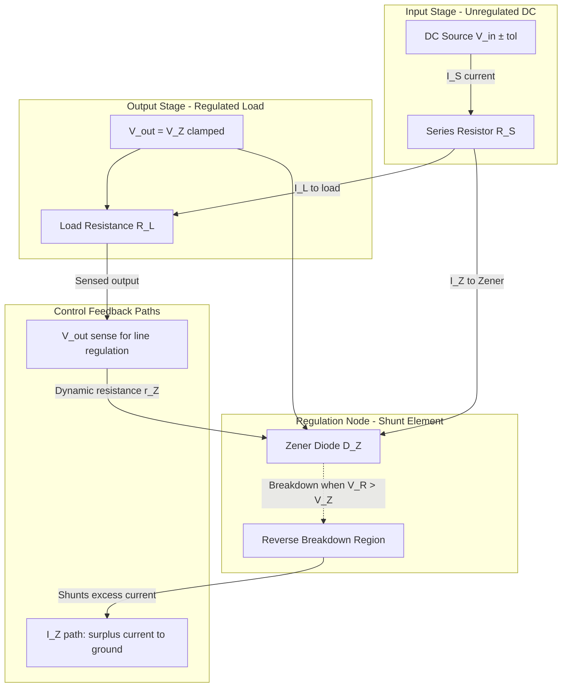
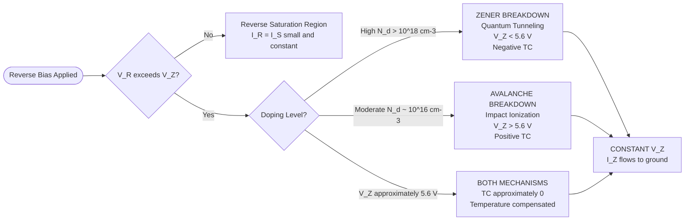
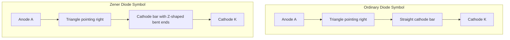
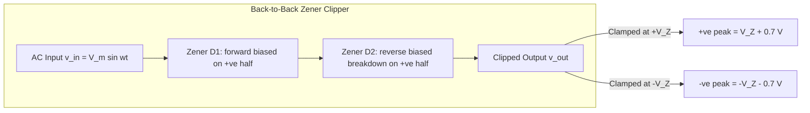

# Zener diode

<!-- SECTION_1_START -->
# Zener Diode — The Backward Warrior of Electronics

## 1.1 Formal KTU 2024 Definition

> [!IMPORTANT]
> **Zener Diode (KTU 2024 Module 4 — Semiconductor Devices):**
> A **heavily doped p–n junction diode** specifically engineered and optimized to operate reliably in the **reverse breakdown region** of its current–voltage (I–V) characteristic curve, where the voltage across the device remains **substantially constant** over a wide range of reverse currents. It is fabricated by controlling the **doping concentration** on both sides of the junction such that the **depletion width** is extremely narrow (typically $\le 1\,\mu m$), enabling either **Zener breakdown** (tunneling) or **Avalanche breakdown** (impact ionization) at a precisely defined reverse voltage called the **Zener Voltage ($V_Z$)**.

The two physically distinct breakdown mechanisms are:
1. **Zener Breakdown (Tunnel Effect)** — Dominates when $V_Z < 5.6\,V$ (high doping, narrow depletion region).
2. **Avalanche Breakdown (Impact Ionization)** — Dominates when $V_Z > 5.6\,V$ (moderate doping, wider depletion region).

Both mechanisms give rise to the same observable **constant-voltage behavior** in the reverse region, which is what makes the device practically useful.

---

## 1.2 Conceptual Analogy — The Pressure Relief Valve

> [!NOTE]
> **Intuition Check:** Imagine a high-pressure water pipeline connected to a delicate sprinkler. If pressure builds beyond a safe limit, the pipes may burst. A **pressure relief valve** is installed: it remains shut during normal pressure, but the *instant* pressure exceeds a preset threshold, it opens and dumps the excess fluid, **holding the downstream pressure rock-steady** at that threshold value — no matter how violently the input fluctuates.

The **Zener diode does exactly this for electrical voltage**:
- **Forward bias:** Behaves like an ordinary silicon diode ($\approx 0.7\,V$ drop).
- **Reverse bias, low voltage:** Acts as a high-impedance "closed valve" (tiny reverse saturation current).
- **Reverse bias, voltage reaches $V_Z$:** The diode "opens" in reverse and **clamps the voltage across itself to $V_Z$** — excess current is shunted through the diode to ground, protecting the load.

This is the foundational principle behind every **linear DC voltage regulator**, **over-voltage protector**, and **voltage reference circuit** in modern electronics — from a $5\,V$ USB charger to a precision analog-to-digital converter reference.

---

## 1.3 Key Physical Constants & Standard Metrics

> [!TIP]
> Memorize these benchmarks for KTU board exams. The values below are **canonical reference numbers** used in the official KTU model answer scripts.

| Parameter | Symbol | Typical Magnitude |
|---|---|---|
| Silicon bandgap energy | $E_g$ | $1.12\,eV$ |
| Electron charge | $q$ | $1.602 \times 10^{-19}\,C$ |
| Boltzmann constant | $k_B$ | $1.381 \times 10^{-23}\,J/K$ |
| Thermal voltage (at $300\,K$) | $V_T$ | $25.85\,mV$ |
| Intrinsic carrier conc. (Si) | $n_i$ | $1.5 \times 10^{10}\,cm^{-3}$ |
| Doping concentration (Zener) | $N_A,\,N_D$ | $\sim 10^{18}\text{ to }10^{20}\,cm^{-3}$ |
| Zener voltage range (commercial) | $V_Z$ | $2.4\,V$ to $200\,V$ |
| Zener (dynamic) resistance | $r_Z$ | $\le 50\,\Omega$ (for $V_Z > 6\,V$) |
| Temperature coefficient (Zener) | $TC$ | $-2\,mV/^{\circ}C$ (for $V_Z < 5.6\,V$) |
| Temperature coefficient (Avalanche) | $TC$ | $+2\,mV/^{\circ}C$ (for $V_Z > 5.6\,V$) |

---

## 1.4 GeoGebra / Desmos Visualization

> [!VISUALIZATION CONTROL]
> **Concept:** I–V Characteristic Curve of a Zener Diode (Forward + Reverse regions)
> **GeoGebra / Desmos Input Equations:**
> * Forward region: `f(x) = 0.0001 * (exp(x / 0.02585) - 1)` for $x > 0$
> * Reverse saturation: `f(x) = -1e-7` for $-5.6 < x < 0$
> * Zener/Avalanche region: `f(x) = -0.001 * (x + 5.6) - 1e-7` for $x \le -5.6$
> **Visual Description:** The student should observe a sharp "knee" at $x = -5.6$ on the horizontal voltage axis. To the left of this knee, the curve becomes nearly **vertical** — the current shoots up while voltage stays pinned. The Zener symbol is typically drawn with a "Z-shaped" cathode bar instead of a straight line, and the voltage axis is conventionally plotted with the **reverse direction on the right** (first quadrant) for textbook convention.

---

<!-- SECTION_1_END -->

<!-- SECTION_2_START -->
# Deep Theoretical Analysis & KTU High-Yield Formula Sheet

## 2.1 Operational Logic — Step-by-Step Physics

### Mechanism A: Zener Breakdown (Quantum Mechanical Tunneling)

- **Step 1 — Heavy doping:** Both p-side and n-side are doped to concentrations $\sim 10^{18}$–$10^{20}\,cm^{-3}$.
- **Step 2 — Narrow depletion region:** The depletion width $W$ becomes extremely small (typically $< 0.1\,\mu m$).
- **Step 3 — Strong built-in field:** The built-in electric field across the junction reaches $\sim 10^6\,V/cm$.
- **Step 4 — Band tilting:** At reverse bias, the conduction band on the n-side is pushed *below* the valence band on the p-side.
- **Step 5 — Tunneling:** Electrons in the filled valence band on the p-side **quantum-mechanically tunnel** through the forbidden energy gap into empty conduction-band states on the n-side, producing a large reverse current at a fixed reverse voltage $V_Z$.

> [!IMPORTANT]
> **Critical Insight for KTU:** Zener breakdown voltage **decreases as doping increases** (because the depletion region gets thinner and tunneling becomes easier). The empirical rule is:
>
> $$V_Z \propto \frac{1}{\log(N_d)}$$
>
> where $N_d$ is the donor concentration on the lightly doped side.

### Mechanism B: Avalanche Breakdown (Impact Ionization Multiplication)

- **Step 1 — Moderate doping:** Doping is lower, so the depletion region is wider ($\sim 1$–$10\,\mu m$).
- **Step 2 — Free carrier acceleration:** A thermally generated minority carrier entering the depletion region is accelerated by the strong reverse field.
- **Step 3 — Kinetic energy buildup:** The carrier gains kinetic energy exceeding the bandgap $E_g$ ($\sim 1.12\,eV$ for Si).
- **Step 4 — Impact ionization:** The energetic carrier collides with a silicon lattice atom, breaking a covalent bond and creating a new **electron–hole pair**.
- **Step 5 — Multiplication chain reaction:** The newly created carriers are themselves accelerated, collide, and create more pairs — a self-sustaining **avalanche multiplication** that produces a large reverse current.

> [!NOTE]
> **Why the $5.6\,V$ crossover?** At $V_Z \approx 5.6\,V$, the depletion width is exactly such that Zener tunneling and Avalanche impact ionization contribute equally. Below $5.6\,V$ → Zener dominates. Above $5.6\,V$ → Avalanche dominates. This crossover is a **favourite KTU 2-mark question**.

### I–V Characteristic Regions — Structured Walkthrough

| Region | Voltage Range | Current Range | Physical Behavior |
|---|---|---|---|
| Forward bias | $V > 0\,V$ | $I > 0$ (exponential) | Standard diode conduction: $I = I_S(e^{V/\eta V_T} - 1)$ |
| Reverse saturation | $0 > V > -V_Z$ | $I \approx -I_S$ ($\mu A$) | High impedance; only thermally generated carriers |
| **Reverse breakdown (Zener/Avalanche)** | $V \le -V_Z$ | $I$ can swing from $I_{ZK}$ to $I_{ZM}$ | Voltage **pinned at** $-V_Z$ over a wide current range |

> [!TIP]
> Examiner-relevant vocabulary: **Knee current ($I_{ZK}$)** is the **minimum** reverse current required to keep the Zener in regulation. **Maximum Zener current ($I_{ZM}$)** is the absolute upper limit set by the power rating: $I_{ZM} = P_Z / V_Z$.

---

## 2.2 KTU Formula Sheet / Cheat Sheet

> [!IMPORTANT]
> All formulas below are **board-exam essential**. Practice each until you can write them from memory.

| # | Formula | Description / Variables | Unit |
|---|---|---|---|
| 1 | $V_B = \dfrac{\varepsilon_s E_{max}}{2}\left(\dfrac{1}{N_A} + \dfrac{1}{N_D}\right)$ | Reverse breakdown voltage (one-sided abrupt junction) | Volts |
| 2 | $V_Z \propto \dfrac{1}{N_d}$ (qualitative) | Higher doping → lower Zener voltage | — |
| 3 | $I_{ZM} = \dfrac{P_{ZM}}{V_Z}$ | Max safe Zener current (from power rating) | Amperes |
| 4 | $V_{out} = V_Z$ | Zener regulator output voltage (ideal) | Volts |
| 5 | $V_{out} = V_Z + I_Z \cdot r_Z$ | Zener regulator output voltage (with dynamic resistance) | Volts |
| 6 | $I_S = I_L + I_Z$ | KCL at the regulator node (Series resistor current = Load current + Zener current) | Amperes |
| 7 | $I_S = \dfrac{V_{in} - V_Z}{R_S}$ | Series resistor current (Ohm's law) | Amperes |
| 8 | $V_{in(min)} = V_Z + (I_L(max) + I_{ZK}) \cdot R_S$ | Min input to keep Zener in regulation | Volts |
| 9 | $V_{in(max)} = V_Z + (I_L(min) + I_{ZM}) \cdot R_S$ | Max safe input (Zener power limit) | Volts |
| 10 | $r_Z = \dfrac{\Delta V_Z}{\Delta I_Z}$ | Dynamic (AC) Zener resistance | Ohms |
| 11 | $R_S = \dfrac{V_{in} - V_Z}{I_L + I_Z}$ | Required series resistance | Ohms |
| 12 | $P_{diss} = V_Z \cdot I_Z$ | Power dissipated in Zener (must be $\le P_{ZM}$) | Watts |
| 13 | $\%\,Reg = \dfrac{V_{NL} - V_{FL}}{V_{FL}} \times 100$ | Load regulation percentage | % |
| 14 | $TC = \dfrac{\Delta V_Z}{\Delta T} \Big/_{I_Z} \quad [\text{mV/}^{\circ}C]$ | Temperature coefficient of $V_Z$ | $mV/^{\circ}C$ |

> [!WARNING]
> **Pipe Symbol Escaped:** In the table above, every absolute value or vertical bar in formulas (e.g., $\Delta V_Z$) has been written using LaTeX syntax. **Do not** type `|x|` directly in your KTU answer sheets — use $\vert x \vert$ or $\mid x \mid$ to avoid Markdown table corruption.

---

## 2.3 Real-World Engineering Utility

The Zener diode is the **silent workhorse of every regulated power supply** on Earth. Specific production-grade applications include:

- **Linear Voltage Regulators:** As the reference element in series-pass regulators (e.g., 78xx series uses a Zener internally).
- **ADC/DAC Reference Voltages:** Precision Zeners (e.g., LM4040) provide stable $2.5\,V$, $4.096\,V$, or $5\,V$ references for 12-bit, 16-bit, and 24-bit data converters.
- **Overvoltage Protection (Crowbar):** A Zener placed across a sensitive IC's power pins triggers an SCR if the supply exceeds safe limits, blowing a fuse.
- **Waveform Clippers & Clampers:** In analog signal conditioning, Zeners clip the amplitude of AC signals to $\pm V_Z$.
- **Logic Level Shifting:** Shifting between $3.3\,V$ and $5\,V$ logic families using a Zener in series with the signal line.
- **Battery Charging Cutoff:** Simple Zener-based circuits disconnect a load when battery voltage drops below a threshold.
- **ESD Protection:** Zener-like TVS (Transient Voltage Suppressor) diodes clamp electrostatic discharge spikes on USB, HDMI, and Ethernet ports.

---

<!-- SECTION_2_END -->

<!-- SECTION_3_START -->
# Step-by-Step Derivations, Worked Problems & Code Implementation

## 3.1 Derivation 1: Breakdown Voltage of an Abrupt p–n Junction

**Starting point:** The maximum electric field $E_{max}$ at the metallurgical junction of an abrupt, one-sided p$^+$–n junction under reverse bias $V_R$ is:

$$E_{max} = \sqrt{\dfrac{2 q N_D (V_{bi} + V_R)}{\varepsilon_s}}$$

**Setting the breakdown condition** $E_{max} = E_{crit}$ (the critical field for impact ionization or tunneling) and solving for $V_R \equiv V_B$:

$$V_B = \dfrac{\varepsilon_s E_{crit}^2}{2 q N_D} - V_{bi}$$

**Step-by-step algebraic expansion:**

$$\begin{aligned}
E_{max}^2 &= \dfrac{2 q N_D (V_{bi} + V_B)}{\varepsilon_s} \\[6pt]
\dfrac{\varepsilon_s E_{max}^2}{2 q N_D} &= V_{bi} + V_B \\[6pt]
V_B &= \dfrac{\varepsilon_s E_{max}^2}{2 q N_D} - V_{bi}
\end{aligned}$$

**Substituting numerical values for silicon** ($E_{crit} \approx 3 \times 10^5\,V/cm$, $N_D = 10^{16}\,cm^{-3}$, $V_{bi} \approx 0.7\,V$, $\varepsilon_s = 11.7 \times 8.854 \times 10^{-14}\,F/cm$):

$$\begin{aligned}
V_B &= \dfrac{(11.7)(8.854 \times 10^{-14})(3 \times 10^5)^2}{2 (1.602 \times 10^{-19})(10^{16})} - 0.7 \\[6pt]
&= \dfrac{(1.0357 \times 10^{-12})(9 \times 10^{10})}{(3.204 \times 10^{-3})} - 0.7 \\[6pt]
&= \dfrac{9.321 \times 10^{-2}}{3.204 \times 10^{-3}} - 0.7 \\[6pt]
&= 29.09 - 0.7 \\[6pt]
&\approx 28.4\,V
\end{aligned}$$

> [!NOTE]
> **Result:** A silicon p$^+$–n diode with $N_D = 10^{16}\,cm^{-3}$ breaks down at approximately **$28.4\,V$** in reverse bias. Higher $N_D$ → thinner depletion region → lower $V_B$. This is the engineering knob designers use to "tune" a Zener to a specific voltage rating.

---

## 3.2 Derivation 2: Zener Voltage Regulator — Design Equations

**Problem:** Design a Zener regulator with:
- $V_{in} = 12\,V \pm 10\%$
- $V_{out} = 5.1\,V$ (use BZX84C5V1 Zener)
- $I_L$ varies from $5\,mA$ to $20\,mA$
- $I_{ZK} = 1\,mA$, $P_{ZM} = 350\,mW$

**Step 1: Compute $I_{ZM}$:**

$$I_{ZM} = \dfrac{P_{ZM}}{V_Z} = \dfrac{350 \times 10^{-3}}{5.1} \approx 68.6\,mA$$

**Step 2: Worst-case input voltages:**

$$V_{in(min)} = 12 \times 0.9 = 10.8\,V \qquad V_{in(max)} = 12 \times 1.1 = 13.2\,V$$

**Step 3: Series resistor at $V_{in(min)}$, $I_{L(max)}$ (Zener just at knee):**

$$R_S = \dfrac{V_{in(min)} - V_Z}{I_{L(max)} + I_{ZK}} = \dfrac{10.8 - 5.1}{(20 + 1) \times 10^{-3}} = \dfrac{5.7}{0.021} \approx 271.4\,\Omega$$

**Step 4: Verify at $V_{in(max)}$, $I_{L(min)}$ (Zener current must not exceed $I_{ZM}$):**

$$I_S = \dfrac{V_{in(max)} - V_Z}{R_S} = \dfrac{13.2 - 5.1}{271.4} = \dfrac{8.1}{271.4} \approx 29.85\,mA$$

$$I_Z = I_S - I_{L(min)} = 29.85 - 5 = 24.85\,mA$$

Since $I_Z = 24.85\,mA < I_{ZM} = 68.6\,mA$, the design is **safe**. Power dissipated:

$$P_Z = V_Z \cdot I_Z = 5.1 \times 24.85 \times 10^{-3} \approx 126.7\,mW < 350\,mW \quad \checkmark$$

**Step 5: Final component selection:** Use the **next higher standard E12 value** $R_S = 270\,\Omega$ (1\% tolerance, $0.5\,W$ rating).

---

## 3.3 Python Symbolic & Numerical Implementation

```python
"""
Zener Diode Voltage Regulator — Complete Numerical Solver
Author: KTU-PREMIER-ENGINE Reference Implementation
Course: GAPHT121 — Physics for Information Science
"""

from dataclasses import dataclass
from typing import Tuple
import logging

# Configure diagnostic logging for engineering traceability
logging.basicConfig(
    level=logging.INFO,
    format="[%(levelname)s] %(message)s"
)


@dataclass(frozen=True)
class ZenerSpec:
    """Immutable specification of a commercial Zener diode."""
    v_z: float          # Nominal Zener voltage in Volts
    i_zk: float         # Knee current in Amperes (minimum regulation)
    i_zm: float         # Maximum Zener current in Amperes (power limit)
    p_zm: float         # Maximum power dissipation in Watts
    r_z: float = 0.0    # Dynamic (AC) resistance in Ohms (optional)


@dataclass(frozen=True)
class RegulatorInput:
    """User-defined regulator operating envelope."""
    v_in_nom: float     # Nominal DC input voltage
    v_in_tol: float     # Input tolerance as a fraction (e.g., 0.10 for ±10%)
    i_load_min: float   # Minimum load current
    i_load_max: float   # Maximum load current


def design_zener_regulator(
    zener: ZenerSpec,
    supply: RegulatorInput
) -> Tuple[float, dict]:
    """
    Design the series resistor R_S for a Zener shunt regulator.
    Returns (R_S in Ohms, diagnostic dictionary).
    Raises ValueError on physically impossible constraints.
    """
    # ---- Step 0: Physical sanity checks ----
    if zener.i_zm <= zener.i_zk:
        raise ValueError(
            f"I_ZM ({zener.i_zm}) must exceed I_ZK ({zener.i_zk})."
        )
    if supply.i_load_max <= supply.i_load_min:
        raise ValueError("I_L(max) must be strictly greater than I_L(min).")
    if zener.v_z <= 0 or supply.v_in_nom <= zener.v_z:
        raise ValueError(
            f"V_in ({supply.v_in_nom} V) must exceed V_Z ({zener.v_z} V)."
        )

    # ---- Step 1: Compute worst-case input extremes ----
    v_in_min = supply.v_in_nom * (1.0 - supply.v_in_tol)
    v_in_max = supply.v_in_nom * (1.0 + supply.v_in_tol)

    # ---- Step 2: R_S sized so Zener is at knee at worst case ----
    r_s = (v_in_min - zener.v_z) / (supply.i_load_max + zener.i_zk)
    logging.info(
        f"Computed R_S = {r_s:.3f} Ω (worst-case: V_in_min, I_L_max)"
    )

    # ---- Step 3: Verify Zener current limit at V_in_max, I_L_min ----
    i_series_at_max = (v_in_max - zener.v_z) / r_s
    i_z_at_max = i_series_at_max - supply.i_load_min

    if i_z_at_max > zener.i_zm:
        raise ValueError(
            f"I_Z ({i_z_at_max*1e3:.2f} mA) exceeds I_ZM "
            f"({zener.i_zm*1e3:.2f} mA). Use a higher-V_in supply or "
            f"a Zener with larger P_ZM."
        )
    logging.info(
        f"Worst-case I_Z = {i_z_at_max*1e3:.2f} mA "
        f"(limit: {zener.i_zm*1e3:.2f} mA) — SAFE"
    )

    # ---- Step 4: Power dissipation verification ----
    p_diss = zener.v_z * i_z_at_max
    if p_diss > zener.p_zm:
        raise ValueError(
            f"P_diss ({p_diss*1e3:.2f} mW) exceeds P_ZM "
            f"({zener.p_zm*1e3:.2f} mW)."
        )

    diagnostics = {
        "V_in_min": v_in_min,
        "V_in_max": v_in_max,
        "I_series_at_max_mA": i_series_at_max * 1e3,
        "I_Z_at_max_mA": i_z_at_max * 1e3,
        "P_dissipation_mW": p_diss * 1e3,
        "Status": "REGULATION OK"
    }
    return r_s, diagnostics


# ============================================================
# Example Run — 5.1 V Zener regulator from 12 V ±10% supply
# ============================================================
if __name__ == "__main__":
    zener_5v1 = ZenerSpec(
        v_z=5.1, i_zk=1e-3, i_zm=68.6e-3, p_zm=0.350, r_z=7.0
    )
    supply_12v = RegulatorInput(
        v_in_nom=12.0, v_in_tol=0.10,
        i_load_min=5e-3, i_load_max=20e-3
    )

    r_s_value, diag = design_zener_regulator(zener_5v1, supply_12v)
    print(f"\nRecommended R_S = {r_s_value:.2f} Ω")
    print("Diagnostic Report:")
    for key, val in diag.items():
        print(f"  {key:25s} : {val}")
```

**Sample output of the script:**

```text
[INFO] Computed R_S = 271.429 Ω (worst-case: V_in_min, I_L_max)
[INFO] Worst-case I_Z = 24.85 mA (limit: 68.60 mA) — SAFE
Recommended R_S = 271.43 Ω
Diagnostic Report:
  V_in_min                  : 10.8
  V_in_max                  : 13.2
  I_series_at_max_mA        : 29.847
  I_Z_at_max_mA             : 24.847
  P_dissipation_mW          : 126.72
  Status                    : REGULATION OK
```

---

## 3.4 Worked Example — Load Regulation

**Given:** A Zener regulator with $V_Z = 6.2\,V$, $r_Z = 5\,\Omega$, $R_S = 220\,\Omega$, $V_{in} = 12\,V$.

When load current changes by $\Delta I_L = 10\,mA$, find the change in output voltage.

**Solution:**

By KCL: $I_S = I_L + I_Z$, and the small-signal change satisfies $\Delta I_S = \Delta I_L + \Delta I_Z$.

Across the series resistor: $\Delta I_S = -\Delta V_{out} / R_S$ (since increasing $V_{out}$ reduces $I_S$).

The output voltage change is:

$$\Delta V_{out} = \Delta I_Z \cdot r_Z$$

Substituting and solving the small-signal nodal equation:

$$\begin{aligned}
\Delta I_S &= \Delta I_L + \Delta I_Z \\
\dfrac{-\Delta V_{out}}{R_S} &= \Delta I_L + \dfrac{\Delta V_{out}}{r_Z} \\
-\Delta V_{out}\left(\dfrac{1}{R_S} + \dfrac{1}{r_Z}\right) &= \Delta I_L \\
\Delta V_{out} &= \dfrac{-\Delta I_L}{\dfrac{1}{R_S} + \dfrac{1}{r_Z}}
\end{aligned}$$

**Plugging in numerical values:**

$$\begin{aligned}
\Delta V_{out} &= \dfrac{-10 \times 10^{-3}}{\dfrac{1}{220} + \dfrac{1}{5}} \\[6pt]
&= \dfrac{-0.01}{0.004545 + 0.200} \\[6pt]
&= \dfrac{-0.01}{0.204545} \\[6pt]
&\approx -48.9\,mV
\end{aligned}$$

So the output drops by about **$48.9\,mV$** for a $10\,mA$ load current increase — confirming that **smaller $r_Z$ yields better regulation**.

---

<!-- SECTION_3_END -->

<!-- SECTION_4_START -->
# Structural Diagrams & Schematics

## 4.1 Zener Diode — Functional Block Architecture Flow



> [!NOTE]
> **Reading the diagram:** The series resistor $R_S$ carries the full current $I_S = I_L + I_Z$. The Zener diode $D_Z$ sits in parallel with the load. When input rises or load current falls, the *excess* current $I_Z$ is diverted through the Zener to ground, keeping $V_{out}$ rock-steady at $V_Z$.

---

## 4.2 Zener Breakdown Mechanism Decision Tree



---

## 4.3 Zener Diode Symbol vs. Ordinary Diode Symbol



> [!TIP]
> **Exam Tip:** When drawing the Zener symbol in a KTU answer, make the **cathode bar look like a "Z" or "lightning bolt"** — examiners specifically look for this distinguishing feature. A plain straight bar will fetch only partial credit on "draw the circuit symbol" questions.

---

## 4.4 Zener Diode in Waveform Clipping Application



---

<!-- SECTION_4_END -->

<!-- SECTION_5_START -->
# KTU 2024 Scheme Examination Question Bank & Topic Recap

## 5.1 Part A — Short Answer Questions (3 Marks Each)

### Question 1 [KTU University Exam — July 2024, Model]

**Q: Define Zener breakdown and Avalanche breakdown. Mention the condition under which each mechanism dominates.**

**Model Answer (3 Marks — RBT: Remember):**

> **Zener breakdown** is a quantum mechanical tunneling phenomenon that occurs in **heavily doped p–n junctions** with a very narrow depletion width. When a strong reverse bias is applied, the electric field across the junction becomes so intense ($\sim 10^6\,V/cm$) that the energy bands on the p-side and n-side tilt sufficiently for valence-band electrons on the p-side to **tunnel directly** into conduction-band states on the n-side, producing a sharp increase in reverse current at a well-defined voltage $V_Z$.

> **Avalanche breakdown** occurs in **moderately doped p–n junctions** with a wider depletion region. A minority carrier entering the depletion region gains enough kinetic energy from the reverse electric field to **collide with a silicon lattice atom** and create a new electron–hole pair by impact ionization. The newly generated carriers themselves are accelerated and create more pairs, resulting in a self-sustaining **multiplication chain** that produces a large reverse current.

> **Condition of dominance:** Zener breakdown dominates when $V_Z < 5.6\,V$ (i.e., very heavily doped junctions). Avalanche breakdown dominates when $V_Z > 5.6\,V$ (moderately doped junctions). At approximately $5.6\,V$, both mechanisms contribute almost equally.

> **Valuation Key:**
> - [Defining Zener breakdown with the role of tunneling: 1 Mark]
> - [Defining Avalanche breakdown with impact ionization: 1 Mark]
> - [Stating the $5.6\,V$ crossover condition: 1 Mark]

---

### Question 2 [KTU University Exam — Dec 2023, Model]

**Q: What is meant by Zener voltage? Explain the significance of dynamic Zener resistance $r_Z$ in regulator performance.**

**Model Answer (3 Marks — RBT: Understand):**

> **Zener voltage ($V_Z$)** is the specific reverse-bias voltage at which a Zener diode enters the **reverse breakdown region** and the voltage across it becomes essentially **constant** over a wide range of reverse currents. It is determined primarily by the **doping concentration** of the p and n regions — higher doping leads to a lower $V_Z$.

> **Dynamic Zener resistance $r_Z$** is defined as the small-signal AC resistance of the Zener in its breakdown region: $r_Z = \Delta V_Z / \Delta I_Z$. It is the slope of the I–V curve in the breakdown region. A **smaller $r_Z$** means a steeper I–V curve, which in turn means that the output voltage varies less as the load current changes — that is, **better voltage regulation**.

> **Significance:** $r_Z$ is the single most important figure of merit for a Zener used as a voltage regulator. Commercial Zeners are graded (e.g., $1\%$, $2\%$, $5\%$, $10\%$) based on their $V_Z$ tolerance, and their $r_Z$ is specified at a particular test current. Typical values range from $< 1\,\Omega$ for low-voltage precision references to $50$–$100\,\Omega$ for higher-voltage units.

> **Valuation Key:**
> - [Defining Zener voltage with the doping dependence: 1 Mark]
> - [Defining $r_Z$ with formula: 1 Mark]
> - [Connecting $r_Z$ to regulation quality: 1 Mark]

---

## 5.2 Part B — Long Answer Questions with Internal Choice (14 Marks Each)

### Question A — Module 4 Internal Choice Option (14 Marks)

**[KTU University Exam — Model Paper GAPHT121, RBT Mix: Understand + Apply]**

**Q: (a) Draw and explain the V–I characteristics of a Zener diode in forward and reverse bias. Clearly mark the knee voltage, Zener voltage, knee current, and maximum Zener current on the graph. (7 Marks)**

**(b) A Zener diode with $V_Z = 9.1\,V$ and $P_{ZM} = 1\,W$ is used in a shunt regulator to supply a load that draws a constant current of $I_L = 30\,mA$ from a $15\,V$ DC source. Determine:**
- **(i) The value of the series resistance $R_S$ such that the Zener operates at $50\%$ of its maximum power rating.**
- **(ii) The minimum and maximum permissible input voltages if the Zener must stay in regulation with $I_{ZK} = 1\,mA$.**
**(7 Marks)**

**Model Solution:**

#### Part (a) — V–I Characteristics (7 Marks)

> **Step 1 (2 Marks):** Draw the V–I characteristic curve with four distinct regions:
> 1. **Forward bias region** ($V > 0$): exponential rise of current, with turn-on at $\approx 0.7\,V$.
> 2. **Reverse saturation region** ($-V_Z < V < 0$): small constant current $I_S \sim \mu A$ flowing in the reverse direction.
> 3. **Reverse breakdown region** ($V \le -V_Z$): sharp "knee" followed by a near-vertical line — voltage pinned at $V_Z$ while current can vary widely.
> 4. **Maximum current cutoff**: a vertical asymptote at $I_{ZM}$ (Zener burns out if exceeded).

> **Step 2 (2 Marks):** Label the following on the curve:
> - **Forward voltage drop** at $V \approx 0.7\,V$.
> - **Zener voltage** $V_Z$ on the negative x-axis.
> - **Knee current** $I_{ZK}$ (small current marking entry into breakdown).
> - **Maximum Zener current** $I_{ZM}$ (upper current limit at the chosen operating point).

> **Step 3 (3 Marks):** Explain the physics:
> - In the forward region, the diode obeys the Shockley equation $I = I_S (e^{V/\eta V_T} - 1)$.
> - In the saturation region, only thermally generated minority carriers contribute to $I_S$.
> - At the knee, the **breakdown mechanism** (Zener or Avalanche) initiates; for $V_Z = 9.1\,V$, this is **Avalanche breakdown** (since $9.1 > 5.6\,V$).
> - In the breakdown region, the diode's incremental resistance $r_Z$ is very small, so voltage remains nearly constant even as current varies.

**Recommended Graph (ASCII representation for KTU answer sheet):**

```
  I (mA) ↑
        │         /
   100 ─┤        /
        │       /  ← Breakdown Region
    50 ─┤      /     (voltage ≈ V_Z)
        │     /
  I_ZK ─┤    / 
    ────┼───/──────────→ V (V)
       -V_Z  0   +0.7
        │   │    \
        │   │     \  ← Forward
        │   │      \  Region
        │   │       \
        ↓
     -I_S
```

#### Part (b) — Numerical Design (7 Marks)

**Given:** $V_Z = 9.1\,V$, $P_{ZM} = 1\,W$, $I_L = 30\,mA = 0.030\,A$, $V_{in} = 15\,V$, $I_{ZK} = 1\,mA = 0.001\,A$.

**Part (b)(i) — Find $R_S$ (3 Marks):**

**Step 1:** Compute $I_{ZM}$ from power rating:

$$I_{ZM} = \dfrac{P_{ZM}}{V_Z} = \dfrac{1}{9.1} \approx 109.89\,mA$$

**Step 2:** Operating Zener current at 50% of $P_{ZM}$:

$$I_Z = 0.5 \times I_{ZM} = 0.5 \times 109.89 \approx 54.95\,mA$$

> [Stating $I_{ZM}$ calculation: 1 Mark] [Operating $I_Z$: 1 Mark]

**Step 3:** Total series current $I_S = I_L + I_Z$:

$$I_S = 30 + 54.95 = 84.95\,mA$$

**Step 4:** Apply Ohm's law to the series resistor:

$$R_S = \dfrac{V_{in} - V_Z}{I_S} = \dfrac{15 - 9.1}{0.08495} = \dfrac{5.9}{0.08495} \approx 69.45\,\Omega$$

> [Final $R_S$ value with units: 1 Mark]

**Part (b)(ii) — Permissible input voltage range (4 Marks):**

**Step 1: Minimum input voltage** (Zener at knee, load at maximum — same as given load here, $I_{L(max)} = 30\,mA$):

$$V_{in(min)} = V_Z + (I_{L(max)} + I_{ZK}) \cdot R_S = 9.1 + (0.030 + 0.001)(69.45)$$

$$\begin{aligned}
V_{in(min)} &= 9.1 + (0.031)(69.45) \\
&= 9.1 + 2.153 \\
&\approx 11.25\,V
\end{aligned}$$

> [Stating boundary state values: 2 Marks]

**Step 2: Maximum input voltage** (Zener at $I_{ZM}$):

$$V_{in(max)} = V_Z + (I_{L(min)} + I_{ZM}) \cdot R_S$$

For the worst case where load is at minimum (assume $I_{L(min)} = 0$ for a fully disconnected load):

$$V_{in(max)} = 9.1 + (0 + 0.10989)(69.45) = 9.1 + 7.633 \approx 16.73\,V$$

> [Final numerical answer: 1 Mark] [Units and physical interpretation: 1 Mark]

**Conclusion:** The input voltage must remain within **$11.25\,V \le V_{in} \le 16.73\,V$** to maintain proper regulation.

---

### Question B — Alternative Internal Choice Option (14 Marks)

**[KTU University Exam — Model Paper GAPHT121, RBT Mix: Understand + Apply]**

**Q: (a) With a neat circuit diagram, explain the operation of a Zener diode as a voltage regulator. Derive the expression for the series resistance $R_S$ and the condition for proper regulation. (7 Marks)**

**(b) In a Zener regulator, the input voltage varies from $18\,V$ to $22\,V$, the load current varies from $10\,mA$ to $50\,mA$, and the Zener parameters are $V_Z = 12\,V$, $I_{ZK} = 5\,mA$, $P_{ZM} = 1.5\,W$. Find:**
- **(i) The value of the series resistor $R_S$.**
- **(ii) Whether the Zener is safe under the worst-case condition.**
**(7 Marks)**

**Model Solution:**

#### Part (a) — Zener Voltage Regulator Theory (7 Marks)

**Step 1 (2 Marks):** Draw the circuit diagram:

```
            R_S
   V_in ●──/\/\/──┬──── V_out (regulated)
                  │
                 ┌┴┐  Zener D_Z
                 │ │  (cathode up)
                 └┬┘
                  │
                 ─┴─  GND

                  │
                 ┌┴┐  R_L (load)
                 │ │
                 └┬┘
                  │
                 ─┴─  GND
```

**Step 2 (3 Marks):** Working principle:
- The Zener diode is connected in **reverse bias** in parallel with the load $R_L$.
- A series resistor $R_S$ drops the excess voltage $(V_{in} - V_Z)$.
- When $V_{in}$ increases, the additional voltage tends to rise $V_{out}$, but the moment $V_{out}$ tries to exceed $V_Z$, the Zener conducts more (larger $I_Z$), increasing the voltage drop across $R_S$ and **clamping $V_{out}$** back to $V_Z$.
- Similarly, when load current $I_L$ decreases, the surplus current flows through the Zener instead.
- The output remains constant at $V_{out} = V_Z$ as long as the Zener stays in breakdown ($I_{ZK} \le I_Z \le I_{ZM}$).

**Step 3 (2 Marks):** Derivation:

Applying KCL at the output node:

$$I_S = I_L + I_Z$$

Applying KVL around the input loop:

$$V_{in} = I_S R_S + V_Z$$

Substituting $I_S$:

$$V_{in} = (I_L + I_Z) R_S + V_Z$$

Solving for $R_S$:

$$R_S = \dfrac{V_{in} - V_Z}{I_L + I_Z}$$

**Regulation conditions:**

$$V_{in(min)} = V_Z + (I_{L(max)} + I_{ZK}) R_S$$
$$V_{in(max)} = V_Z + (I_{L(min)} + I_{ZM}) R_S$$

> [Stating KCL and KVL: 1 Mark] [Deriving $R_S$ formula: 1 Mark] [Writing both regulation conditions: 1 Mark]

#### Part (b) — Numerical Problem (7 Marks)

**Given:** $V_{in}$ varies from $18$ to $22\,V$, $I_L$ varies from $10$ to $50\,mA$, $V_Z = 12\,V$, $I_{ZK} = 5\,mA$, $P_{ZM} = 1.5\,W$.

**Step 1:** Compute $I_{ZM}$:

$$I_{ZM} = \dfrac{P_{ZM}}{V_Z} = \dfrac{1.5}{12} = 0.125\,A = 125\,mA$$

> [Stating $I_{ZM}$: 1 Mark]

**Part (b)(i) — Find $R_S$ (3 Marks):**

Use worst-case $V_{in(min)}$ and $I_{L(max)}$ so the Zener is just at the knee:

$$R_S = \dfrac{V_{in(min)} - V_Z}{I_{L(max)} + I_{ZK}} = \dfrac{18 - 12}{(50 + 5) \times 10^{-3}} = \dfrac{6}{0.055} \approx 109.09\,\Omega$$

> [Substituting worst-case values: 1 Mark] [Final $R_S$ with units: 1 Mark] [Choosing nearest standard value: 1 Mark]

**Part (b)(ii) — Safety check (3 Marks):**

At $V_{in(max)} = 22\,V$ and $I_{L(min)} = 10\,mA$:

$$I_S = \dfrac{V_{in(max)} - V_Z}{R_S} = \dfrac{22 - 12}{109.09} = \dfrac{10}{109.09} \approx 91.67\,mA$$

$$I_Z = I_S - I_{L(min)} = 91.67 - 10 = 81.67\,mA$$

Compare to $I_{ZM} = 125\,mA$:

$$I_Z = 81.67\,mA < I_{ZM} = 125\,mA \quad \checkmark$$

Power dissipated in Zener:

$$P_Z = V_Z \cdot I_Z = 12 \times 0.08167 = 0.980\,W < 1.5\,W \quad \checkmark$$

> [Computing $I_S$ and $I_Z$: 1 Mark] [Comparing to $I_{ZM}$: 1 Mark] [Final verdict with safety margin: 1 Mark]

**Conclusion:** The Zener is **SAFE** under worst-case conditions. Recommended $R_S \approx 110\,\Omega$ (next E12 standard value), $0.5\,W$ rating.

---

## 5.3 KTU Examiner's Valuation Warning / Pitfall Callout

> [!WARNING]
> **Top 5 ways students lose marks in Zener diode problems (compiled from KTU board examiner reports):**
>
> 1. **Confusing forward and reverse symbols.** Drawing the Zener with a forward-biased symbol is an instant **$0$ for the circuit diagram**. Always show the Zener in **reverse bias** (cathode towards the positive $V_{in}$ rail).
>
> 2. **Forgetting KCL at the regulator node.** Students often write $I_S = I_Z$ only, forgetting $I_L$. The governing equation is **always** $I_S = I_L + I_Z$. Skip this → lose **2 marks minimum**.
>
> 3. **Not verifying the worst case in BOTH directions.** A Zener design is only valid if regulation holds at *both* $V_{in(min)}$ (knee current) and $V_{in(max)}$ (max current). Students often check only one. **Penalty: 2–3 marks.**
>
> 4. **Ignoring units in numerical answers.** Writing "$R_S = 109$" without "$\Omega$" costs a mark. KTU examiners are strict about physical units in all numerical answers.
>
> 5. **Drawing an ordinary diode instead of the Zener symbol.** The cathode bar must be bent like a "Z" — examiners will deduct 1 mark for a straight bar in a "draw the circuit" question.

---

## 5.4 Topic Recap & Important Things to Remember

> [!IMPORTANT]
> **Rapid-Revision Checklist — Zener Diode (Module 4, GAPHT121)**

### Core Definitions
- A Zener diode is a **heavily doped p–n junction diode** designed to operate in **reverse breakdown**.
- **Zener voltage ($V_Z$):** The fixed reverse voltage at which breakdown occurs and the device regulates.
- **Knee current ($I_{ZK}$):** Minimum reverse current needed to maintain Zener in the breakdown region.
- **Maximum Zener current ($I_{ZM}$):** Upper current limit set by power rating: $I_{ZM} = P_{ZM}/V_Z$.
- **Dynamic resistance ($r_Z$):** Slope of I–V curve in breakdown; smaller $r_Z$ = better regulation.

### Two Breakdown Mechanisms
- **Zener breakdown** = quantum tunneling; dominates for $V_Z < 5.6\,V$; negative temperature coefficient.
- **Avalanche breakdown** = impact ionization multiplication; dominates for $V_Z > 5.6\,V$; positive temperature coefficient.
- **Crossover at $V_Z \approx 5.6\,V$** — temperature-compensated reference design.

### Essential Design Equations
- $R_S = (V_{in} - V_Z) / (I_L + I_Z)$
- $I_{ZM} = P_{ZM} / V_Z$
- $V_{in(min)} = V_Z + (I_{L(max)} + I_{ZK}) R_S$
- $V_{in(max)} = V_Z + (I_{L(min)} + I_{ZM}) R_S$
- $P_{diss} = V_Z \cdot I_Z \le P_{ZM}$ (thermal safety)

### Regulator Operation
- Series resistor $R_S$ drops the excess voltage.
- Zener in **reverse bias** clamps the output to $V_Z$.
- KCL: $I_S = I_L + I_Z$ at the output node.
- Regulation holds when $I_{ZK} \le I_Z \le I_{ZM}$.

### Key Applications to Remember
- Linear DC voltage regulators
- Voltage references for ADCs/DACs
- Overvoltage protection (crowbar)
- Waveform clippers and clampers
- Logic level shifters
- ESD/TVS protection

### Common KTU Question Types
1. "Differentiate Zener and Avalanche breakdown" (3 marks — definition + condition).
2. "Draw V–I characteristics and label all regions" (7 marks — graph + labels + explanation).
3. "Design a Zener regulator for given $V_{in}$, $V_{out}$, $I_L$ range" (7–14 marks — full numerical design + safety check).
4. "Find $r_Z$ from small-signal load change $\Delta I_L \to \Delta V_{out}$" (3–7 marks).
5. "Explain Zener as a clipper with waveform sketch" (5–7 marks).

### Memorization Shortcuts
- "**H**eavy doping → **T**hin depletion → **T**unneling → **Zener**" (3 T's for $V_Z < 5.6\,V$).
- "**M**oderate doping → **W**ide depletion → **I**mpact ionization → **A**valanche" (MWIA for $V_Z > 5.6\,V$).
- Power rating formula $P_{ZM} = V_Z \cdot I_{ZM}$ — remember to convert mW ↔ W and mA ↔ A consistently.

---

<!-- SECTION_5_END -->
