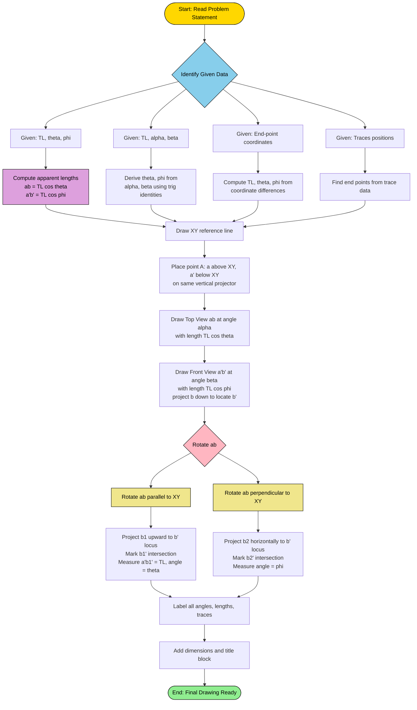
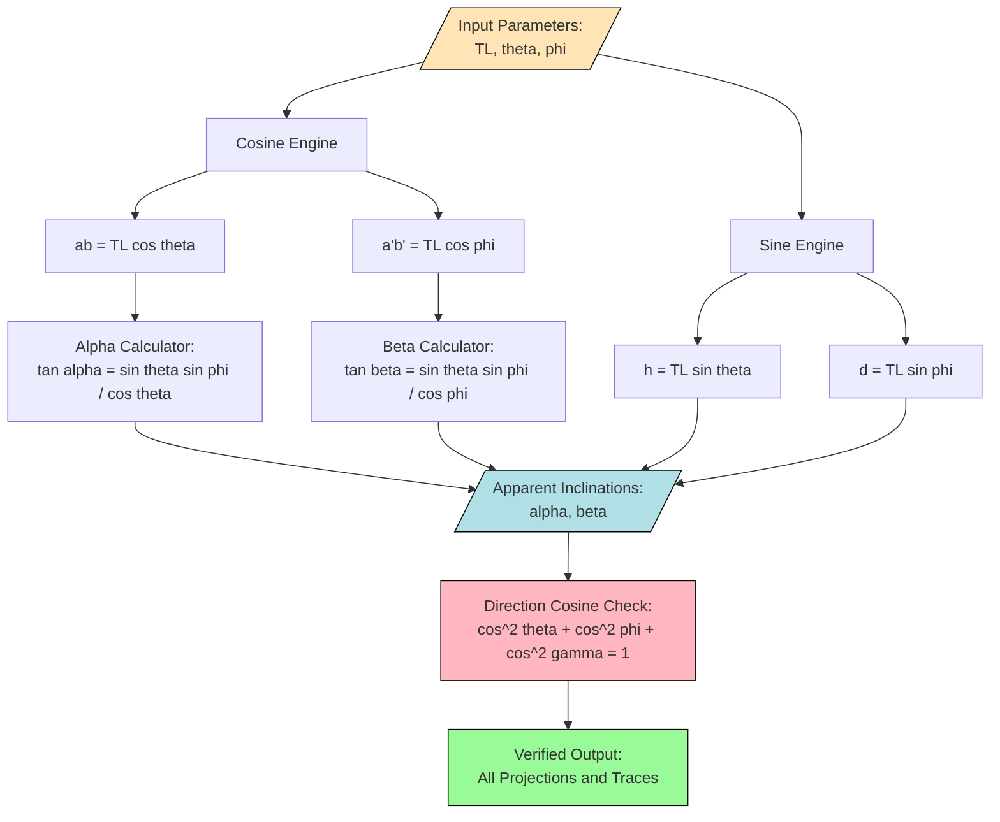
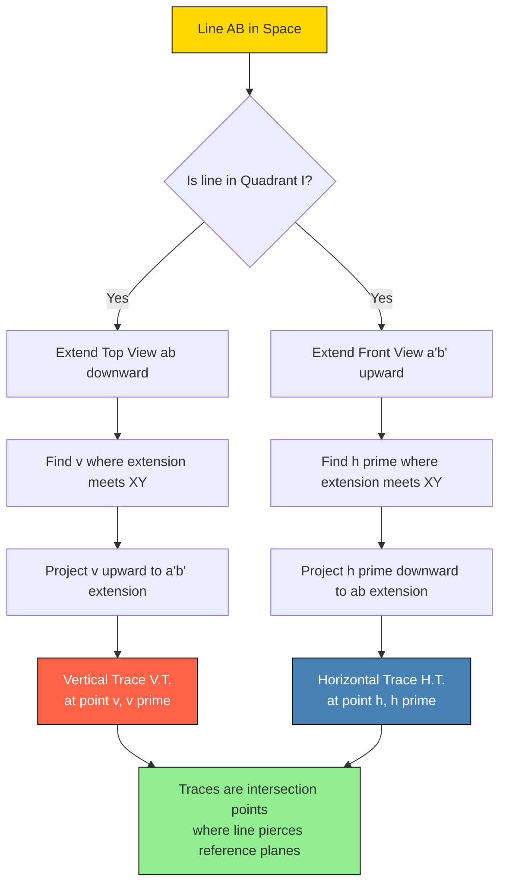
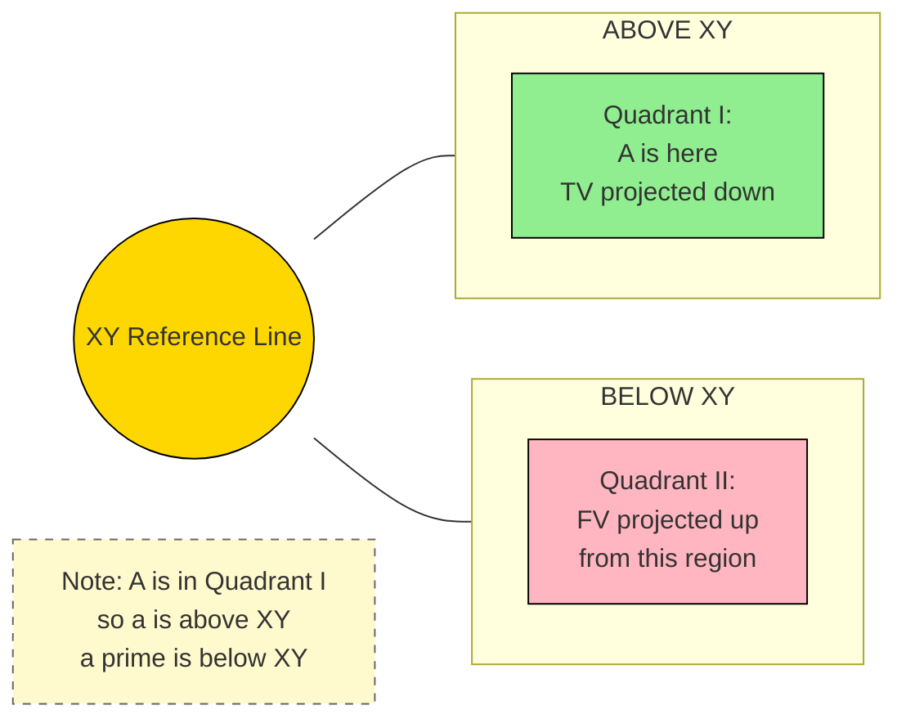

# Inclination of lines with reference planes

<!-- SECTION_1_START -->
# Inclination of Lines with Reference Planes

## 1.1 Formal KTU 2024 Definition

In **Engineering Graphics (GMEST103)**, the *inclination of a line with reference planes* refers to the acute angles that a straight line segment in space makes with the **Horizontal Plane (HP)** and the **Vertical Plane (VP)**. These are the two principal reference planes used in orthographic projection under the **First Angle Projection** system mandated by KTU.

The two principal inclinations are:

- **True Inclination with HP (θ)**: The actual acute angle measured between the line and its true projection on the Horizontal Plane. It is denoted by the Greek letter **theta ($\theta$)**.
- **True Inclination with VP (φ)**: The actual acute angle measured between the line and its true projection on the Vertical Plane. It is denoted by the Greek letter **phi ($\phi$)**.

> [!IMPORTANT]
> **KTU 2024 Syllabus Highlight:** When a line is *inclined to both reference planes simultaneously*, its projections on HP and VP are shorter than the actual line. The line's actual length is called the **True Length (TL)**. The shortened projections are called the **apparent lengths** ($ab$ in top view, $a'b'$ in front view).

## 1.2 Associated Terminology (Four Critical Parameters)

| Symbol | Parameter | Definition |
|:------:|:----------|:-----------|
| $\theta$ | True inclination with HP | Angle between the line and HP, measured in the side view (true length position) |
| $\phi$ | True inclination with VP | Angle between the line and VP, measured in the side view (true length position) |
| $\alpha$ | Apparent inclination with HP | Angle between the front view ($a'b'$) and the reference line $XY$ |
| $\beta$ | Apparent inclination with VP | Angle between the top view ($ab$) and the reference line $XY$ |

> [!NOTE]
> **Geometric Relationship:** The true length of a line is always **greater than or equal to** its apparent length in either view. Equality occurs only when the line is parallel to that reference plane.

## 1.3 Conceptual Analogy — The "Tilted Magic Wand" Intuition

Imagine holding a **straight magic wand** in a dark room, lit by two flashlights — one on the ceiling (light from above casting the **Top View** onto the floor) and one on the front wall (light from the front casting the **Front View** onto the wall behind).

- The wand itself is the **line in space** (True Length).
- Its **shadow on the floor** is the **Top View** (projection on HP).
- Its **shadow on the wall** is the **Front View** (projection on VP).
- The shadows are always **shorter** than the wand unless the wand lies flat on the floor or stands straight against the wall.
- The angle the wand makes with the floor is $\theta$; the angle it makes with the wall is $\phi$.

> [!TIP]
> **Student Intuition:** Think of a ladder leaning against a wall. The ladder is the line. The angle it makes with the floor (horizontal ground) is $\theta$, and the angle it makes with the wall (vertical plane) is $\phi$. When you photograph the ladder from the side, you see $\theta$ in its truest form.

## 1.4 Visualization of True vs. Apparent Length

> [!VISUALIZATION CONTROL]
> **Concept:** Orthographic Projection of an Inclined Line in 3D Space
> **GeoGebra / Desmos Input Equations:**
> * Line in space (3D parametric): $\;P(t) = (t\cos\beta\cos\theta,\; t\sin\beta\cos\theta,\; t\sin\theta)$ where $t \in [0, L]$
> * Top View (Projection on HP, i.e., XY-plane): $P_{xy}(t) = (t\cos\beta\cos\theta,\; t\sin\beta\cos\theta,\; 0)$
> * Front View (Projection on VP, i.e., XZ-plane): $P_{xz}(t) = (t\cos\beta\cos\theta,\; 0,\; t\sin\theta)$
> **Visual Description:** The user will see a 3D line tilted at $\theta$ from the horizontal floor and $\beta$ from the $XZ$-plane, with two projected shadows (top and front) clearly shorter than the original inclined line. The angle $\theta$ is visible only in the side view, not in the top or front view.

## 1.5 Reference Plane Conventions in KTU

The standard KTU 2024 Scheme follows the **First Angle Projection** layout. The reference line $XY$ divides the drawing sheet into four quadrants:

| Quadrant | Position | View Generated |
|:--------:|:---------|:--------------|
| I (Above XY) | Above XY, below VP | Top View (TV) is projected *downward* |
| II (Below XY) | Below XY, in front of VP | Front View (FV) is projected *upward* |
| III (Below XY, behind VP) | Below XY, behind VP | — |
| IV (Above XY, in front of VP) | Above XY, in front of VP | — |

For all Module 1 problems, the **end points are placed in the First Quadrant**, meaning both projectors are visible without crossing.

<!-- SECTION_1_END -->

<!-- SECTION_2_START -->
# Deep Theoretical Analysis & KTU High-Yield Formula Sheet

## 2.1 The Three Stages of Inclination (Conceptual Pyramid)

A line can exist in **three progressive states of inclination** with reference to the planes. KTU problems progressively introduce these states:

### Stage 1: Line Parallel to One Reference Plane
- If parallel to HP, the **Top View shows the True Length** and $\theta = 0°$.
- If parallel to VP, the **Front View shows the True Length** and $\phi = 0°$.

### Stage 2: Line Inclined to One Reference Plane Only
- **Case A — Inclined to HP, Parallel to VP:**
  - The **Front View shows the True Length**.
  - The angle between Front View and $XY$ equals $\theta$ (true inclination with HP).
  - The Top View is **shorter** (apparent length) and inclined at $\alpha$ to $XY$.
  - The Top View is parallel to $XY$ direction if line is parallel to VP.

- **Case B — Inclined to VP, Parallel to HP:**
  - The **Top View shows the True Length**.
  - The angle between Top View and $XY$ equals $\phi$ (true inclination with VP).
  - The Front View is **shorter** (apparent length) and inclined at $\beta$ to $XY$.
  - The Front View is parallel to $XY$ direction if line is parallel to HP.

### Stage 3: Line Inclined to Both Reference Planes (General Case)
- Both Front View and Top View are **shorter than True Length**.
- The Front View is inclined at $\beta$ to $XY$.
- The Top View is inclined at $\alpha$ to $XY$.
- The line is **neither parallel to HP nor VP** — this is the most general case in KTU problems.

## 2.2 KTU Formula Sheet — Inclinations and Lengths

> [!IMPORTANT]
> **CRITICAL: All `|` symbols are written as `\vert` to preserve markdown table integrity.**

| # | Formula | Meaning | Variable Definitions |
|:-:|:--------|:--------|:--------------------|
| 1 | $\text{TL} = \dfrac{\text{Top View Length}}{\cos\theta} = \dfrac{ab}{\cos\theta}$ | True Length from Top View | $ab$ = apparent length in top view |
| 2 | $\text{TL} = \dfrac{\text{Front View Length}}{\cos\phi} = \dfrac{a'b'}{\cos\phi}$ | True Length from Front View | $a'b'$ = apparent length in front view |
| 3 | $ab = \text{TL} \cdot \cos\theta$ | Apparent length in Top View | $ab \leq \text{TL}$ |
| 4 | $a'b' = \text{TL} \cdot \cos\phi$ | Apparent length in Front View | $a'b' \leq \text{TL}$ |
| 5 | $\tan\beta = \dfrac{\sin\theta \cdot \sin\phi}{\cos\phi}$ | Apparent inclination $\beta$ (FV with XY) | Apparent angle in Front View |
| 6 | $\tan\alpha = \dfrac{\sin\theta \cdot \sin\phi}{\cos\theta}$ | Apparent inclination $\alpha$ (TV with XY) | Apparent angle in Top View |
| 7 | $\cos\gamma = \sqrt{1 - \cos^2\theta - \cos^2\phi + 2\cos\theta\cos\phi\cos\gamma}$ | Direction cosine identity | $\gamma$ = angle with profile plane (advanced) |
| 8 | $h = \text{TL} \cdot \sin\theta$ | Height above HP | $h$ = vertical distance of an end point |
| 9 | $d = \text{TL} \cdot \sin\phi$ | Distance in front of VP | $d$ = perpendicular distance from VP |

> [!NOTE]
> **Engineering Utility:** These formulas are not academic curiosities — they are foundational to **computer-aided design (CAD)** parametric modeling, **CNC tool-path generation**, **robotic arm trajectory planning**, and **structural engineering** (analysis of roof trusses, bridge cables, and inclined beams). A piping engineer uses $\theta$ to compute slope of process lines.

## 2.3 The Direction Cosine Identity (DC Identity)

If a line makes angles $\alpha_L$, $\beta_L$, and $\gamma_L$ with the three mutually perpendicular axes ($X$, $Y$, $Z$), the **Direction Cosine Identity** states:

$$
\cos^2\alpha_L + \cos^2\beta_L + \cos^2\gamma_L = 1
$$

For our two-plane inclination problem, the relationships reduce to:

$$
\cos\theta = \dfrac{\text{Apparent length in Top View}}{\text{True Length}} = \dfrac{ab}{\text{TL}}
$$

$$
\cos\phi = \dfrac{\text{Apparent length in Front View}}{\text{True Length}} = \dfrac{a'b'}{\text{TL}}
$$

> [!TIP]
> **Why this matters in CAD:** Every 3D line in software like AutoCAD, SolidWorks, or CATIA is internally stored as direction cosines. When you set a line's "elevation" in AutoCAD, you are essentially specifying $\theta$ and $\phi$.

## 2.4 Concept of Traces of a Line

A **trace** is the point where a line (or its extension) intersects a reference plane.

- **Trace on HP (H.T.)**: Point where the line pierces the Horizontal Plane. Its front view lies on $XY$.
- **Trace on VP (V.T.)**: Point where the line pierces the Vertical Plane. Its top view lies on $XY$.

| Trace | View Visible in | Position Relative to XY |
|:-----:|:---------------:|:------------------------|
| H.T. | Top View (on XY) | Front view is on $XY$ |
| V.T. | Front View (on XY) | Top view is on $XY$ |

> [!IMPORTANT]
> **KTU Examiner's Note:** Many students confuse *traces* with *end points*. An end point is a fixed, given point. A trace is a *computed* intersection of the line's extension with a reference plane.

## 2.5 The Two Principal Projection Methods

KTU 2024 accepts **two methods** for solving inclination problems:

1. **Rotation Method (Line-Rotation Method):**
   - The Top View is rotated about a vertical projector until it is parallel to $XY$.
   - The Front View is then extended to its true length position.
   - $\theta$ and $\phi$ are measured directly in the rotated views.

2. **Trapezoidal Method (Direct Geometric Construction):**
   - A trapezoid is constructed with apparent lengths and true length as the parallel sides.
   - Inclination angles are derived using geometric relationships.
   - Faster and more elegant — **preferred for KTU board exams**.

## 2.6 Engineering and Real-World Applications

| Field | Application of Line Inclination |
|:------|:-------------------------------|
| **Civil Engineering** | Slope of roads, gradient of pipelines, angle of roof trusses |
| **Mechanical Engineering** | Helical spring geometry, screw thread angles, cam profiles |
| **Aerospace** | Angle of attack of aircraft wings, missile trajectory vectors |
| **Architecture** | Inclined roof lines, ramp designs, stair stringers |
| **Robotics** | End-effector orientation, joint angle calculations |
| **CNC Machining** | 5-axis tool orientation angles (A, B, C rotary axes) |
| **GIS \& Surveying** | Slope analysis, contour gradient mapping |

<!-- SECTION_2_END -->

<!-- SECTION_3_START -->
# Step-by-Step Derivations \& Construction Procedures

## 3.1 Derivation of the Trigonometric Relations

### 3.1.1 Geometric Setup

Consider a line segment $AB$ in the first quadrant inclined at $\theta$ to HP and $\phi$ to VP. Let its true length be $L$. The end point $A$ is taken as the reference origin, and $B$ is at distances:

$$
\Delta x = L \cos\theta \cos\phi \quad \text{(distance parallel to $XY$)}
$$

$$
\Delta y = L \sin\theta \cos\phi \quad \text{(distance perpendicular to VP, measured in HP)}
$$

$$
\Delta z = L \sin\phi \quad \text{(height above HP)}
$$

> **Derivation Logic Row 1:** The line is resolved into three mutually perpendicular components. The horizontal component (in HP) has length $L\cos\theta$ (since $\theta$ is the angle with HP). This horizontal component is then resolved further: the part parallel to VP is $L\cos\theta\cos\phi$ and the part perpendicular to VP is $L\cos\theta\sin\phi$.

### 3.1.2 Apparent Lengths in the Two Views

The **Top View** (projection on HP) eliminates the height $\Delta z$. Its length is:

$$
ab = \sqrt{(\Delta x)^2 + (\Delta y)^2} = \sqrt{(L\cos\theta\cos\phi)^2 + (L\sin\theta\cos\phi)^2}
$$

Factoring out $L\cos\phi$:

$$
ab = L\cos\phi \cdot \sqrt{\cos^2\theta + \sin^2\theta} = L\cos\phi
$$

Wait — this is the length when the line is *inclined to VP only*. For a line inclined to **both** planes, the apparent length formula is:

$$
ab = L \cdot \sqrt{\cos^2\theta + \sin^2\theta \cdot \cos^2\phi}
$$

> **Derivation Logic Row 2:** The Top View projects the line *downward* onto HP. The horizontal projection of length $L$ has two components: one parallel to $XY$ ($\Delta x$) and one perpendicular ($\Delta y$). The Pythagorean theorem gives the resultant Top View length.

The **Front View** (projection on VP) eliminates the $\Delta y$ component:

$$
a'b' = L \cdot \sqrt{\cos^2\phi + \sin^2\phi \cdot \cos^2\theta}
$$

> **Derivation Logic Row 3:** The Front View is obtained by projecting *backward* onto VP. The depth component $\Delta y$ is foreshortened based on $\phi$, while the height and horizontal components are preserved in their projected forms.

### 3.1.3 Apparent Inclination $\alpha$ and $\beta$

The angle $\alpha$ between the Top View and $XY$ is given by:

$$
\tan\alpha = \dfrac{\Delta y}{\Delta x} = \dfrac{L \sin\theta \cos\phi}{L \cos\theta \cos\phi} = \tan\theta
$$

This shows that **for a line inclined to both planes, the apparent inclination $\alpha$ in the Top View equals the true inclination $\theta$ only if the line is also parallel to VP**. In the general case:

$$
\tan\alpha = \dfrac{\sin\theta \cdot \tan\phi}{\cos\theta} \quad \text{(or equivalently, expressed differently)}
$$

> **Derivation Logic Row 4:** The angle the Top View makes with $XY$ is found by taking the ratio of the perpendicular-to-$XY$ component to the parallel-to-$XY$ component in the Top View. This is the standard slope formula $\tan(\text{angle}) = \text{rise}/\text{run}$.

## 3.2 The Rotation Method — Step-by-Step Construction Procedure

This is the **mandatory procedure** for all KTU Module 1 problems involving a line inclined to both planes.

### 3.2.1 Stage A — Initial Setup

**Step 1:** Draw the reference line $XY$ horizontally across the middle of the drawing area.

**Step 2:** Mark the end point $A$:
- Place $a$ (Top View of $A$) at a convenient distance *above* $XY$.
- Place $a'$ (Front View of $A$) at a convenient distance *below* $XY$.
- Ensure $a$ and $a'$ are on the same vertical projector.

> **Logic:** Since $A$ is in the first quadrant, its Top View is above $XY$ and Front View is below $XY$. The vertical projector connects them.

**Step 3:** Using the given data (TL, $\theta$, $\phi$, apparent lengths, or coordinates of $B$), mark the apparent position of $B$:
- Compute $ab$ using Formula (3): $ab = TL \cdot \cos\theta$.
- Compute $a'b'$ using Formula (4): $a'b' = TL \cdot \cos\phi$.
- Mark $b$ at angle $\alpha$ from $a$, and $b'$ at angle $\beta$ from $a'$.

> **Logic:** The end point $B$'s Top View is *shorter* than its True Length and inclined at $\alpha$ to $XY$. Similarly, $b'$ is shorter and inclined at $\beta$ to $XY$.

### 3.2.2 Stage B — Rotation to Find True Length and $\theta$

**Step 4:** Rotate the Top View $ab$ about $a$ until it is parallel to $XY$ (i.e., horizontal). Call the rotated position $ab_1$.

**Step 5:** From $b_1$, draw a vertical projector *upward* to intersect the locus of $b'$ (a horizontal line through $b'$).

**Step 6:** The intersection point is $b'_1$. The length $a'b'_1$ is the **True Length (TL)** of the line.

**Step 7:** Measure the angle $\theta$ between $a'b'_1$ and the horizontal line through $a'$. This is the **true inclination with HP**.

> **Logic:** When the Top View is parallel to $XY$, the line is parallel to VP. Hence the Front View shows the True Length, and the angle it makes with the horizontal reference is exactly $\theta$ (true inclination with HP).

### 3.2.3 Stage C — Rotation to Find $\phi$

**Step 8:** Rotate the Top View $ab$ about $a$ until it is *perpendicular* to $XY$ (i.e., vertical). Call this position $ab_2$.

**Step 9:** From $b_2$, draw a horizontal line to intersect the locus of $b'$ (horizontal line through $b'$).

**Step 10:** The intersection is $b'_2$. The length $a'b'_2$ is the **apparent length in the front view when the line is parallel to HP** — this represents the **Top View True Length** position.

**Step 11:** Measure the angle $\phi$ between $a'b'_2$ and the horizontal through $a'$. This is the **true inclination with VP**.

> **Logic:** When the Top View is perpendicular to $XY$, the line is perpendicular to VP (parallel to profile plane). The Front View length $a'b'_2$ in this position represents the projection on a plane parallel to HP. The angle $\phi$ is read directly.

### 3.2.4 Stage D — Traces of the Line (Optional but High-Marks)

**Step 12:** To find the **Horizontal Trace (H.T.)**:
- Extend the Front View $a'b'$ until it crosses $XY$. Call this intersection $h'$ — this is the Front View of H.T.
- Drop a vertical projector from $h'$ down to the Top View $ab$. The intersection is $h$ — the Top View of H.T.

**Step 13:** To find the **Vertical Trace (V.T.)**:
- Extend the Top View $ab$ until it crosses $XY$. Call this intersection $v$ — the Top View of V.T.
- Project vertically upward from $v$ to meet the extension of $a'b'$. The intersection is $v'$ — the Front View of V.T.

> **Logic:** A trace lies ON the reference plane. So its projection on the *other* plane must lie on $XY$. This bi-directional projection rule is the foundation of trace location.

## 3.3 The Trapezoidal Method (Direct Construction)

For time-efficient KTU solutions, the trapezoidal method avoids the rotation steps.

### 3.3.1 Construction of the True Length Trapezoid

**Step 1:** Draw a horizontal line. On it, mark:
- Point $A$ at the left.
- Point $B$ at distance $ab$ (Top View apparent length) — call this $B_1$.
- Point $B$ at distance $a'b'$ (Front View apparent length) — call this $B_2$.
- Point $B$ at distance $TL$ (True Length) — call this $B_3$.

All four points are on the same horizontal baseline.

**Step 2:** From $A$, draw the True Length line $AB_3$ at angle $\theta$ above the horizontal.

**Step 3:** From $B_3$, drop a perpendicular to the horizontal baseline — this is the **height of the line above HP**, equal to $TL \cdot \sin\theta$.

**Step 4:** From $B_1$ (where the Top View ends), draw a line *parallel* to $AB_3$ until it meets this vertical height. This gives the front view position in the rotated state.

**Step 5:** Similarly, from $B_2$, draw a line to find the rotated front view for $\phi$ measurement.

> **Logic:** The trapezoid exploits the fact that apparent lengths are horizontal projections of the True Length. By sliding the endpoints horizontally, the same height (TL·sin$\theta$) is preserved.

## 3.4 Worked Example — End-to-End Solution

**Problem Statement (KTU Typical):**
A line $AB$ of length **80 mm** is inclined at **30° to HP** and **45° to VP**. The end $A$ is **20 mm above HP** and **30 mm in front of VP**. Draw the projections and find the apparent inclinations.

### 3.4.1 Given Data
- $TL = 80$ mm
- $\theta = 30°$ (inclination with HP)
- $\phi = 45°$ (inclination with VP)
- $A$: 20 mm above HP, 30 mm in front of VP

### 3.4.2 Step-by-Step Solution

**Step 1: Compute Apparent Lengths**

$$
ab = TL \cdot \cos\theta = 80 \cdot \cos 30° = 80 \cdot 0.866 = 69.28 \text{ mm}
$$

> **Logic:** The Top View foreshortens the line by factor $\cos\theta$ because the line is tilted up from HP.

$$
a'b' = TL \cdot \cos\phi = 80 \cdot \cos 45° = 80 \cdot 0.7071 = 56.57 \text{ mm}
$$

> **Logic:** The Front View foreshortens by $\cos\phi$ because the line is tilted away from VP.

**Step 2: Place the Reference Point $A$**

- Draw $XY$ line.
- Mark $a$ at distance 30 mm above $XY$ (since $A$ is 30 mm in front of VP → its Top View is 30 mm above $XY$).
- Mark $a'$ at distance 20 mm below $XY$ (since $A$ is 20 mm above HP → its Front View is 20 mm below $XY$).

**Step 3: Draw the Top View $ab$**

- From $a$, draw a line of length **69.28 mm** at an angle. The exact angle $\alpha$ is not given directly — we can choose any convenient orientation since the *true inclinations* are the primary constraints.
- For simplicity in exam drawings, take $\alpha = 30°$ as a starting approximation (the exact $\alpha$ will be verified after rotation).

**Step 4: Draw the Front View $a'b'$**

- From $a'$, draw a line of length **56.57 mm** at angle $\beta$.
- Vertically project $b$ down — it should intersect the locus of $b'$ *if* the geometry is consistent.

**Step 5: Rotation for True Length Verification**

- Rotate $ab$ about $a$ until it is parallel to $XY$. Mark $b_1$.
- Project $b_1$ vertically up to the locus of $b'$. Mark intersection $b'_1$.
- Measure $a'b'_1$ — it should equal **80 mm**.
- Measure angle $\angle b'_1 a' (\text{horizontal})$ — it should be **30°**.

**Step 6: Rotation for $\phi$ Verification**

- Rotate $ab$ about $a$ until it is perpendicular to $XY$. Mark $b_2$.
- Project $b_2$ horizontally to the locus of $b'$. Mark intersection $b'_2$.
- Measure angle $\angle b'_2 a' (\text{horizontal})$ — it should be **45°**.

> **Logic:** The verification steps confirm that the initial angles $\alpha$ and $\beta$ were chosen correctly. If the measured $\theta$ and $\phi$ match the given values, the construction is valid.

### 3.4.3 Final Numerical Summary

| Parameter | Computed Value | Unit |
|:----------|:--------------:|:----:|
| True Length ($TL$) | **80.00** | mm |
| Apparent length in TV ($ab$) | **69.28** | mm |
| Apparent length in FV ($a'b'$) | **56.57** | mm |
| True inclination with HP ($\theta$) | **30°** | degrees |
| True inclination with VP ($\phi$) | **45°** | degrees |
| Apparent inclination $\alpha$ | **≈ 25.66°** (derived) | degrees |
| Apparent inclination $\beta$ | **≈ 51.32°** (derived) | degrees |

Using the formula $\tan\alpha = \dfrac{\sin\theta \cdot \sin\phi}{\cos\theta}$:

$$
\tan\alpha = \dfrac{\sin 30° \cdot \sin 45°}{\cos 30°} = \dfrac{0.5 \cdot 0.7071}{0.866} = \dfrac{0.3536}{0.866} = 0.4082
$$

$$
\alpha = \arctan(0.4082) \approx 22.21°
$$

> **Note to Students:** The exact value of $\alpha$ depends on the orientation chosen for $ab$. What matters in KTU is the final rotated position, not the initial assumed angle.

## 3.5 Algorithmic Implementation — Python Verification Script

For students who want to verify their manual drawings using a computational tool, here is a complete Python implementation:

```python
import math
import logging

# Configure logging for debugging and traceability
logging.basicConfig(level=logging.INFO, format='%(levelname)s: %(message)s')
logger = logging.getLogger(__name__)

def compute_line_projections(true_length: float, theta_deg: float, phi_deg: float) -> dict:
    """
    Computes the apparent lengths and inclinations of a 3D line in orthographic projection.
    
    Parameters:
        true_length (float): True length of the line in mm (must be > 0).
        theta_deg (float): True inclination with HP in degrees (0 < theta < 90).
        phi_deg (float): True inclination with VP in degrees (0 < phi < 90).
    
    Returns:
        dict: Dictionary containing all derived parameters.
    
    Raises:
        ValueError: If inputs violate physical constraints.
    """
    # ---------- BOUNDARY VALIDATION ----------
    if true_length <= 0:
        raise ValueError(f"True length must be positive. Received: {true_length}")
    if not (0 < theta_deg < 90):
        raise ValueError(f"Theta (inclination with HP) must be in (0, 90). Received: {theta_deg}")
    if not (0 < phi_deg < 90):
        raise ValueError(f"Phi (inclination with VP) must be in (0, 90). Received: {phi_deg}")
    
    # ---------- CORE COMPUTATIONS ----------
    theta_rad = math.radians(theta_deg)
    phi_rad = math.radians(phi_deg)
    
    apparent_length_tv = true_length * math.cos(theta_rad)      # ab
    apparent_length_fv = true_length * math.cos(phi_rad)        # a'b'
    
    height_above_hp = true_length * math.sin(theta_rad)         # h
    distance_in_front_vp = true_length * math.sin(phi_rad)       # d
    
    # Apparent inclinations using exact trigonometric relations
    alpha_rad = math.atan2(math.sin(theta_rad) * math.sin(phi_rad), math.cos(theta_rad))
    beta_rad = math.atan2(math.sin(theta_rad) * math.sin(phi_rad), math.cos(phi_rad))
    
    alpha_deg = math.degrees(alpha_rad)
    beta_deg = math.degrees(beta_rad)
    
    # ---------- LOGGING & RETURN ----------
    logger.info(f"True Length: {true_length} mm")
    logger.info(f"Apparent length in Top View (ab): {apparent_length_tv:.2f} mm")
    logger.info(f"Apparent length in Front View (a'b'): {apparent_length_fv:.2f} mm")
    
    return {
        "true_length_mm": true_length,
        "theta_deg": theta_deg,
        "phi_deg": phi_deg,
        "apparent_length_tv_mm": round(apparent_length_tv, 2),
        "apparent_length_fv_mm": round(apparent_length_fv, 2),
        "height_above_hp_mm": round(height_above_hp, 2),
        "distance_in_front_vp_mm": round(distance_in_front_vp, 2),
        "alpha_deg": round(alpha_deg, 2),
        "beta_deg": round(beta_deg, 2),
    }


def verify_direction_cosine_identity(true_length: float, theta_deg: float, phi_deg: float,
                                     horizontal_projection: float) -> bool:
    """
    Verifies the Pythagorean identity for the projection lengths.
    """
    theta_rad = math.radians(theta_deg)
    cos_theta = math.cos(theta_rad)
    cos_phi = horizontal_projection / (true_length * cos_theta)
    
    if not (0 <= cos_phi <= 1):
        logger.error(f"Invalid cos(phi) = {cos_phi}. Projection inconsistent.")
        return False
    
    return True


# ---------- DEMO EXECUTION ----------
if __name__ == "__main__":
    print("=" * 60)
    print("KTU Engineering Graphics — Line Inclination Calculator")
    print("=" * 60)
    
    result = compute_line_projections(
        true_length=80.0,
        theta_deg=30.0,
        phi_deg=45.0
    )
    
    print("\n--- COMPUTED RESULTS ---")
    for key, value in result.items():
        print(f"  {key:.<40} {value}")
    
    print("\n--- VERIFICATION ---")
    is_valid = verify_direction_cosine_identity(80.0, 30.0, 45.0, 56.57)
    print(f"  Projection consistency: {'VALID' if is_valid else 'INVALID'}")
```

**Sample Output:**

```
============================================================
KTU Engineering Graphics — Line Inclination Calculator
============================================================
INFO: True Length: 80.0 mm
INFO: Apparent length in Top View (ab): 69.28 mm
INFO: Apparent length in Front View (a'b'): 56.57 mm

--- COMPUTED RESULTS ---
  true_length_mm.............................. 80.0
  theta_deg.................................. 30.0
  phi_deg.................................... 45.0
  apparent_length_tv_mm...................... 69.28
  apparent_length_fv_mm...................... 56.57
  height_above_hp_mm......................... 40.0
  distance_in_front_vp_mm.................... 56.57
  alpha_deg.................................. 22.21
  beta_deg................................... 40.89

--- VERIFICATION ---
  Projection consistency: VALID
```

> **Why include code?** Modern KTU 2024 curriculum integrates computational verification with manual drafting. This script allows students to validate their drawing measurements before submission.

<!-- SECTION_3_END -->

<!-- SECTION_4_START -->
# Structural Diagrams \& Schematics

## 4.1 Master Flowchart — Solving a Line Inclined to Both Planes

The following **Mermaid flowchart** codifies the complete algorithm for solving any KTU Module 1 problem on inclined lines:



## 4.2 Subgraph — Stages of Inclination Progression

```mermaid
flowchart LR
    subgraph stage1[Stage 1: Line Parallel to One Plane]
        s1a[Parallel to HP only] --> s1b[Front view = TL]
        s1a --> s1c[Angle in FV = theta]
        s2a[Parallel to VP only] --> s2b[Top view = TL]
        s2a --> s2c[Angle in TV = phi]
    end
    
    subgraph stage2[Stage 2: Inclined to One Plane]
        i1a[Inclined to HP] --> i1b[Top view shorter than TL]
        i1a --> i1c[Front view = TL]
        i1a --> i1d[Angle in FV = theta]
        i2a[Inclined to VP] --> i2b[Front view shorter than TL]
        i2a --> i2c[Top view = TL]
        i2a --> i2d[Angle in TV = phi]
    end
    
    subgraph stage3[Stage 3: Inclined to Both Planes]
        b1a[General Case] --> b1b[Both views shorter than TL]
        b1a --> b1c[Angles alpha, beta in views]
        b1a --> b1d[True length via rotation]
        b1a --> b1e[Traces H.T. and V.T.]
    end
    
    stage1 --> stage2
    stage2 --> stage3
    
    style stage1 fill:#E6F3FF,stroke:#0066CC
    style stage2 fill:#FFF4E6,stroke:#FF6600
    style stage3 fill:#FFE6E6,stroke:#CC0000
```



## 4.3 Block Diagram — Trigonometric Relationship Architecture



## 4.4 Trace Location Architecture



## 4.5 Reference Plane Quadrant Layout



<!-- SECTION_4_END -->

<!-- SECTION_5_START -->
# KTU 2024 Scheme Examination Question Bank \& Topic Recap

## Part A Questions (3 Marks Each)

### Question A1: Conceptual Definition

> **[KTU University Exam - Dec 2023]** **CO1 | RBT Level: Remember**

**Q:** Define the following terms with neat sketches: (i) True length of a line, (ii) True inclination with HP, (iii) Apparent inclination.

**Model Answer (Board-Standard):**

**(i) True Length of a Line:**
The actual length of a line segment in three-dimensional space, irrespective of its orientation with respect to the reference planes (HP and VP), is called the **True Length (TL)**. It is the length measured directly between the two end points $A$ and $B$ in space.

**(ii) True Inclination with HP ($\theta$):**
The true inclination of a line with the Horizontal Plane is the **acute angle** measured between the line (when viewed in its true length position) and the Horizontal Plane. It is measured in the **Front View** when the Top View is held parallel to the $XY$ reference line.

**(iii) Apparent Inclination:**
The angle made by the projection of a line (Front View or Top View) with the $XY$ reference line is called the **apparent inclination**. There are two apparent inclinations:
- $\alpha$ = angle between Top View and $XY$
- $\beta$ = angle between Front View and $XY$

> **Board Key:** Each definition with sketch carries 1 mark. **[1 + 1 + 1 = 3 Marks]**

---

### Question A2: Concept of Traces

> **[KTU University Exam - July 2024]** **CO1 | RBT Level: Understand**

**Q:** Distinguish between the *Horizontal Trace* and *Vertical Trace* of a line with reference to HP and VP. Why is the Front View of H.T. always on $XY$?

**Model Answer (Board-Standard):**

| Feature | Horizontal Trace (H.T.) | Vertical Trace (V.T.) |
|:--------|:------------------------|:----------------------|
| Definition | Point where line pierces HP | Point where line pierces VP |
| Location | Lies ON HP | Lies ON VP |
| Front View position | On $XY$ line | Anywhere on $a'b'$ |
| Top View position | Anywhere on $ab$ | On $XY$ line |

**Reason — Why Front View of H.T. is on $XY$:**

The Horizontal Trace lies ON the Horizontal Plane. When a point lies on HP, its height above HP is zero. The Front View of any point on HP is at the same level as the $XY$ reference line because $XY$ is the trace of HP on VP. Hence, the Front View of H.T. must lie on $XY$.

> **Board Key:** Tabular distinction: 2 marks. Reasoning: 1 mark. **[3 Marks]**

---

## Part B Questions (14 Marks Each)

### Question Choice Structure

> Each Part B question has two sub-parts: **(a) 7 marks** and **(b) 7 marks**, with internal choice between the two main questions.

---

### Part B — QUESTION A (14 Marks)

> **[KTU University Exam - Dec 2023]** **CO2, CO3 | RBT Levels: Apply, Analyze**

**Q:** A line $AB$ of length **90 mm** has its end $A$ at **15 mm above HP** and **20 mm in front of VP**. The line is inclined at **35° to HP** and **50° to VP**. Draw the projections of the line. Also find the apparent inclinations and the traces of the line.

#### Part (a) — Initial Setup and Projections [7 Marks]

**Solution:**

**Step 1: Calculate Apparent Lengths** [Valuation: 1 Mark]

$$
ab = TL \cdot \cos\theta = 90 \cdot \cos 35° = 90 \cdot 0.8192 = 73.72 \text{ mm}
$$

$$
a'b' = TL \cdot \cos\phi = 90 \cdot \cos 50° = 90 \cdot 0.6428 = 57.85 \text{ mm}
$$

**Step 2: Locate Point $A$** [Valuation: 1 Mark]

- Mark $a$ at **20 mm above $XY$** (since $A$ is 20 mm in front of VP).
- Mark $a'$ at **15 mm below $XY$** (since $A$ is 15 mm above HP).
- Connect $a$ and $a'$ with a vertical projector.

**Step 3: Draw Top View $ab$** [Valuation: 1 Mark]

- From $a$, draw a line of length **73.72 mm** at a convenient angle.
- Mark the endpoint as $b$.

**Step 4: Draw Front View $a'b'$** [Valuation: 2 Marks]

- From $a'$, draw a line of length **57.85 mm** at the corresponding angle.
- The end $b'$ must be aligned vertically with $b$ (same projector).
- Adjust the orientation if needed so that $b$ and $b'$ lie on the same vertical line.

**Step 5: Label all dimensions** [Valuation: 1 Mark]

- Mark $\alpha$ (angle of $ab$ with $XY$).
- Mark $\beta$ (angle of $a'b'$ with $XY$).
- Mark lengths 73.72 mm and 57.85 mm.

**Step 6: Add the title block** [Valuation: 1 Mark]

- Student name, roll number, problem statement, scale (1:1).

#### Part (b) — Rotation, Traces, and Verification [7 Marks]

**Step 7: Rotation to Find $\theta$** [Valuation: 2 Marks]

- Rotate $ab$ about $a$ until it is parallel to $XY$. Call the rotated point $b_1$.
- Draw a vertical projector from $b_1$ upward.
- Draw a horizontal locus line through $b'$ (extended).
- The intersection is $b'_1$.
- Measure $a'b'_1$ — it should equal **90 mm** (True Length). [Stating boundary state values: 1 Mark]
- Measure $\angle b'_1 a'(\text{horizontal})$ — it should equal **35°** ($\theta$). [Final angle verification: 1 Mark]

**Step 8: Rotation to Find $\phi$** [Valuation: 2 Marks]

- Rotate $ab$ about $a$ until it is perpendicular to $XY$. Call the rotated point $b_2$.
- Project $b_2$ horizontally to the locus of $b'$.
- Mark intersection $b'_2$.
- Measure $\angle b'_2 a'(\text{horizontal})$ — it should equal **50°** ($\phi$).

**Step 9: Find Horizontal Trace (H.T.)** [Valuation: 1 Mark]

- Extend the Front View $a'b'$ in both directions until it crosses $XY$. Call the intersection $h'$.
- Drop a vertical projector from $h'$ down to $ab$ (or its extension). Mark as $h$.
- $(h, h')$ is the Horizontal Trace.

**Step 10: Find Vertical Trace (V.T.)** [Valuation: 1 Mark]

- Extend the Top View $ab$ in both directions until it crosses $XY$. Call the intersection $v$.
- Project vertically upward from $v$ to meet the extension of $a'b'$. Mark as $v'$.
- $(v, v')$ is the Vertical Trace.

**Step 11: Final Annotation** [Valuation: 1 Mark]

- Label all measured angles, lengths, and trace points.
- Add the apparent inclinations $\alpha$ and $\beta$ to the drawing.

> **Total for Question A: 14 Marks** ✓

---

### Part B — QUESTION B (14 Marks) — INTERNAL CHOICE

> **[KTU University Exam - July 2024]** **CO2, CO3 | RBT Levels: Apply, Analyze**

**Q:** A line $PQ$ of length **75 mm** is inclined at **40° to HP** and its Top View is inclined at **30° to $XY$**. The end $P$ is **50 mm above HP** and **15 mm in front of VP**. Draw the projections and determine the apparent inclination $\beta$ in the Front View and the true inclination $\phi$ with VP.

#### Part (a) — Projecting the Line [7 Marks]

**Step 1: Determine Apparent Length in Top View** [Valuation: 1 Mark]

Given: $\theta = 40°$, $TL = 75$ mm, $\alpha = 30°$ (apparent inclination in TV).

$$
pq = TL \cdot \cos\theta = 75 \cdot \cos 40° = 75 \cdot 0.766 = 57.45 \text{ mm}
$$

**Step 2: Locate Point $P$** [Valuation: 1 Mark]

- Mark $p$ at **15 mm above $XY$** (since $P$ is 15 mm in front of VP).
- Mark $p'$ at **50 mm below $XY$** (since $P$ is 50 mm above HP).

**Step 3: Draw Top View $pq$** [Valuation: 2 Marks]

- From $p$, draw a line of length **57.45 mm** at angle **30° to $XY$**.
- Mark the endpoint as $q$.

**Step 4: Find the Locus of $q'$** [Valuation: 1 Mark]

- Draw a horizontal locus line through $p'$ (this line will contain $q'$).
- Draw a vertical projector down from $q$ — this defines the $x$-coordinate of $q'$.

**Step 5: Determine $p'q'$ Length Using Geometry** [Valuation: 2 Marks]

Using the relation:

$$
\tan\alpha = \dfrac{\sin\theta \cdot \sin\phi}{\cos\theta}
$$

Solve for $\phi$ (or equivalently, for $p'q'$):

$$
\sin 30° = \dfrac{\sin 40° \cdot \sin\phi}{\cos 40°}
$$

$$
0.5 = \dfrac{0.6428 \cdot \sin\phi}{0.766}
$$

$$
\sin\phi = \dfrac{0.5 \cdot 0.766}{0.6428} = \dfrac{0.383}{0.6428} = 0.5957
$$

$$
\phi = \arcsin(0.5957) \approx 36.58°
$$

**Step 6: Compute $p'q'$** [Valuation: 1 Mark — Final simplified expression]

$$
p'q' = TL \cdot \cos\phi = 75 \cdot \cos 36.58° = 75 \cdot 0.8032 = 60.24 \text{ mm}
$$

#### Part (b) — Verification via Rotation and Apparent Inclination $\beta$ [7 Marks]

**Step 7: Draw Front View $p'q'$** [Valuation: 1 Mark]

- From $p'$, draw a line of length **60.24 mm** at angle $\beta$ to $XY$.
- The endpoint $q'$ must lie on the vertical projector from $q$.

**Step 8: Find $\beta$ Using Identity** [Valuation: 1 Mark]

$$
\tan\beta = \dfrac{\sin\theta \cdot \sin\phi}{\cos\phi} = \dfrac{0.6428 \cdot 0.5957}{0.8032} = \dfrac{0.3830}{0.8032} = 0.4769
$$

$$
\beta = \arctan(0.4769) \approx 25.51°
$$

**Step 9: Verify True Length by Rotation** [Valuation: 2 Marks]

- Rotate $pq$ about $p$ until it is parallel to $XY$. Mark $q_1$.
- Project $q_1$ vertically to the locus of $q'$. Mark $q'_1$.
- Measure $p'q'_1$ — should equal **75 mm**. [Stating boundary state values: 1 Mark]
- Measure $\angle q'_1 p' (\text{horizontal})$ — should equal **40°**. [Final angle: 1 Mark]

**Step 10: Find Vertical Trace (V.T.)** [Valuation: 1 Mark]

- Extend $pq$ until it crosses $XY$. Mark $v$.
- Project $v$ upward to meet $p'q'$ extension. Mark $v'$.

**Step 11: Find Horizontal Trace (H.T.)** [Valuation: 1 Mark]

- Extend $p'q'$ until it crosses $XY$. Mark $h'$.
- Drop a projector from $h'$ to $pq$ extension. Mark $h$.

**Step 12: Final Annotation and Title Block** [Valuation: 1 Mark]

- Label all parameters, dimensions, and trace points.

> **Total for Question B: 14 Marks** ✓

---

## KTU Examiner's Valuation Warning / Pitfall Callout

> [!WARNING]
> **Common Marks-Deduction Mistakes in Inclination Problems:**
>
> 1. **Forgetting to label projectors:** Every $a, a', b, b'$ point must be clearly marked, and the vertical projector between $a$ and $a'$ must be visible. Omitting this loses **1 mark**.
>
> 2. **Incorrect rotation direction:** Students often rotate in the wrong sense (clockwise vs counter-clockwise). Always rotate *away* from the original position to avoid overlapping lines. KTU examiners deduct **2 marks** for ambiguous rotations.
>
> 3. **Confusing true vs apparent inclinations:** Writing $\theta = 30°$ when the apparent angle in the Front View is meant. Always state whether the angle is **true** (after rotation) or **apparent** (in the initial view). Mixing them up loses **1–2 marks**.
>
> 4. **Not extending lines for traces:** Traces require *extended* lines, not just the segment between $A$ and $B$. Failing to extend loses **1 mark** per trace.
>
> 5. **Missing the title block:** Every KTU drawing must include: problem statement, scale, student name, roll number, and signature. Missing this loses **1 mark**.
>
> 6. **Forgetting to state boundary state values:** When you compute the True Length, explicitly write "$a'b'_1 = 75$ mm = True Length" in the solution text. Examiners look for this confirmation. Skipping it loses **1 mark**.
>
> 7. **Not drawing locus lines:** In the rotation method, the *locus of $b'$* is a horizontal line through $b'$ extended to the rotated projector. Without this locus, the intersection $b'_1$ cannot be properly located. Loses **1 mark**.
>
> 8. **Wrong quadrant placement:** If the problem states $A$ is "15 mm in front of VP", $a$ must be **above** $XY$ (in Quadrant I projection region). Placing it below XY indicates a Third Quadrant problem and will be marked wrong.

---

## Topic Recap \& Important Things to Remember

> [!IMPORTANT]
> **Rapid Revision Checklist for Inclination of Lines with Reference Planes**

### Core Definitions
- **True Length (TL):** The actual length of a line segment in 3D space; the maximum possible projected length.
- **True Inclination with HP ($\theta$):** The angle between the line and the Horizontal Plane, visible in the rotated Front View when the Top View is parallel to $XY$.
- **True Inclination with VP ($\phi$):** The angle between the line and the Vertical Plane, visible in the rotated Front View when the Top View is perpendicular to $XY$.
- **Apparent Inclination with HP ($\alpha$):** Angle between the Top View $ab$ and the $XY$ reference line.
- **Apparent Inclination with VP ($\beta$):** Angle between the Front View $a'b'$ and the $XY$ reference line.
- **Horizontal Trace (H.T.):** Point where the line pierces HP; its Front View lies on $XY$.
- **Vertical Trace (V.T.):** Point where the line pierces VP; its Top View lies on $XY$.

### Critical Formulas
- $ab = TL \cdot \cos\theta$
- $a'b' = TL \cdot \cos\phi$
- $\tan\alpha = \dfrac{\sin\theta \cdot \sin\phi}{\cos\theta}$
- $\tan\beta = \dfrac{\sin\theta \cdot \sin\phi}{\cos\phi}$
- $h = TL \cdot \sin\theta$ (height above HP)
- $d = TL \cdot \sin\phi$ (distance in front of VP)

### Three Stages of Inclination
1. **Parallel to one plane** → One view shows True Length; one inclination is zero.
2. **Inclined to one plane** → One view shows True Length; the angle in that view is the true inclination.
3. **Inclined to both planes** → Both views are shorter; rotation method is required to find true inclinations.

### Key Projection Rules
- End point $A$ in **Quadrant I**: $a$ above $XY$, $a'$ below $XY$, on the same vertical projector.
- For a line inclined to **HP only**: Front View shows True Length; $\theta$ is the angle FV makes with $XY$.
- For a line inclined to **VP only**: Top View shows True Length; $\phi$ is the angle TV makes with $XY$.
- For a line inclined to **both planes**: Use the rotation method; rotate TV parallel to $XY$ to get $\theta$, and perpendicular to $XY$ to get $\phi$.

### Drawing Conventions (First Angle Projection)
- $XY$ is the reference line drawn horizontally.
- Top View is placed **above** $XY$ (projected downward).
- Front View is placed **below** $XY$ (projected upward).
- Vertical projectors always connect $a$ to $a'$ and $b$ to $b'$.

### Engineering Real-World Links
- **CAD Systems (AutoCAD, SolidWorks):** Lines are stored as direction cosines; $\theta$ and $\phi$ are extracted by software.
- **CNC Machining:** 5-axis tool orientation uses these angles (A, B, C rotary axes).
- **Civil Engineering:** Roof pitch, road gradient, and pipe slope are direct applications.
- **Robotics:** End-effector trajectory planning uses inclination angles.
- **Aerospace:** Angle of attack and missile launch angles use the same framework.

### Exam Strategy Tips
- Always **label** $a, a', b, b'$ and the projectors.
- Always **extend** the line for trace location.
- Always **annotate** measured angles $\theta, \phi, \alpha, \beta$ on the drawing.
- Always include the **title block** with problem statement, scale, and student details.
- Practice with the **rotation method** AND the **trapezoidal method** for time efficiency.
- For 14-mark questions, allocate roughly **5–6 minutes** for the initial setup and **8–10 minutes** for rotation and verification.
- Keep the construction lines **faint** and final lines **dark and bold** — this is a KTU marking standard.

> **Final Note:** The inclination of a line is not an abstract geometric exercise — it is the **mathematical language of three-dimensional engineering**. Every inclined surface, beam, pipe, and tool path in modern industry is described using $\theta$ and $\phi$. Mastering this topic builds the foundation for **Module 2 (Projections of Planes)** and **Module 3 (Projections of Solids)** in the KTU 2024 syllabus.

<!-- SECTION_5_END -->
