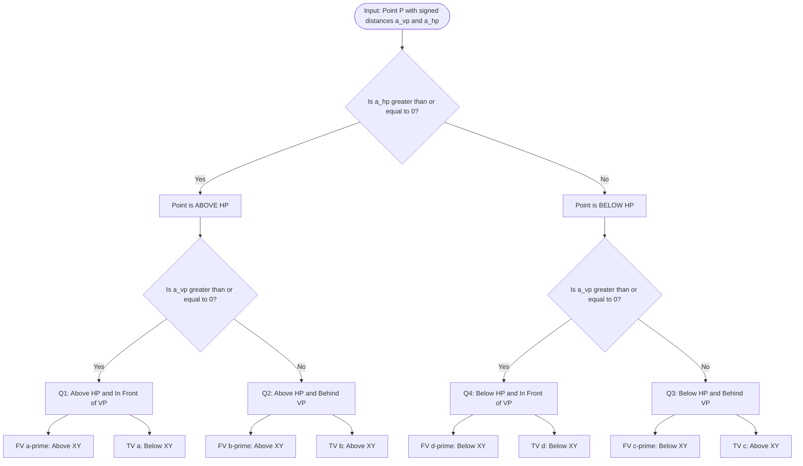
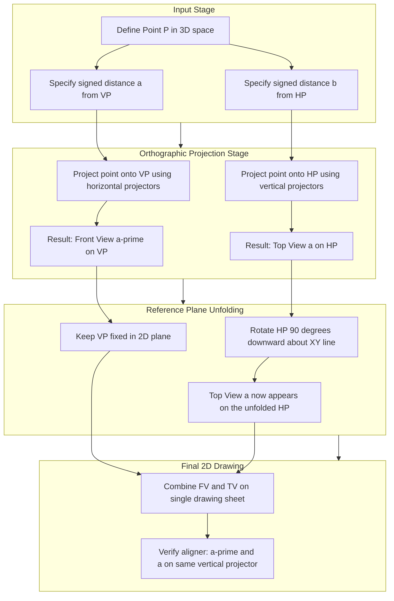

# Projection of points in different quadrants

<!-- SECTION_1_START -->

# Projection of Points in Different Quadrants

## 1.1 Formal Academic Definition

In **Engineering Graphics**, the **projection of a point** is the most fundamental geometric operation. A point existing in three-dimensional space is represented on a two-dimensional drawing plane by projecting it onto two mutually perpendicular reference planes using **orthographic projection** (parallel projectors perpendicular to the plane).

The two principal reference planes used are:

> [!IMPORTANT]
> **Horizontal Plane (HP)** — denoted as the plane upon which the object is assumed to rest. It is represented in 2D by the reference line $XY$.
>
> **Vertical Plane (VP)** — denoted as the plane standing vertically, perpendicular to the HP. It is also represented in 2D by the same reference line $XY$ (which is the line of intersection of HP and VP).

A point in space is uniquely located by its **perpendicular distances** from these two reference planes:
- $a$ = distance of the point from the **VP**
- $b$ = distance of the point above or below the **HP**

The line of intersection $XY$ divides the entire 3D space into **four quadrants**, exactly analogous to the four quadrants of a 2D Cartesian plane extended into 3D:

| Quadrant | Position w.r.t. HP | Position w.r.t. VP |
| :---: | :---: | :---: |
| **First Quadrant** | Above HP | In front of VP |
| **Second Quadrant** | Above HP | Behind VP |
| **Third Quadrant** | Below HP | Behind VP |
| **Fourth Quadrant** | Below HP | In front of VP |

### 1.2 Standard Notation Convention (KTU Board Standard)

The notation used throughout KTU evaluation scripts follows the **BIS (Bureau of Indian Standards) SP:46-1988** convention strictly:

- The point in 3D space is denoted by a **capital letter** (e.g., $A$).
- The **Front View** (projection on VP) is denoted by the same letter in **lowercase with a prime symbol** (e.g., $a'$).
- The **Top View** (projection on HP) is denoted by the same letter in **lowercase without any symbol** (e.g., $a$).

> [!NOTE]
> **First Angle Projection** is the official projection method mandated by the **BIS** and is therefore used in **all KTU examinations**. In this method, the object is assumed to be placed in the **First Quadrant**, and the views are projected onto planes that lie **behind and below** the object, which are then unfolded.

### 1.3 Conceptual Analogy — The "Glass Box" Intuition

Imagine you are sitting inside a transparent glass room. The **floor** of the room is the **Horizontal Plane (HP)**, and the **back wall** in front of you is the **Vertical Plane (VP)**. The line where the wall meets the floor is the **$XY$ reference line**.

- A point floating **in the air** in front of you, slightly away from the back wall, sits in the **First Quadrant**.
- A point behind the back wall (you cannot see it directly, but the shadow on the wall reveals its position) is in the **Second Quadrant**.
- A point sunken **below the floor** behind the wall is in the **Third Quadrant**.
- A point below the floor in front of you is in the **Fourth Quadrant**.

The **Front View** ($a'$) is the shadow cast on the **back wall (VP)**, and the **Top View** ($a$) is the shadow cast on the **floor (HP)**. To draw both shadows on a single sheet of paper, the floor is mentally hinged along $XY$ and folded downward $90^\circ$ to lie flat with the wall. This process is called **unfolding the reference planes**.

> [!VISUALIZATION CONTROL]
> **Concept:** Three-dimensional location of a point P(a, b, c) and the orthogonal reference planes
> **GeoGebra / Desmos Input Equations:**
> * `HP: y = 0` (Horizontal Plane)
> * `VP: z = 0` (Vertical Plane)
> * `P = (3, 2, 4)` — Point in First Quadrant
> * `Project_P_on_VP = (0, 2, 4)` — Front View $p'$
> * `Project_P_on_HP = (3, 0, 4)` — Top View $p$
> * `XY_Line: y = 0, z = 0` (intersection of HP and VP)
> **Visual Description:** A 3D coordinate system where the green-shaded $xy$-plane represents HP, the blue-shaded $xz$-plane represents VP, and the orange line represents the $XY$ trace. The red point $P$ sits in the first octant, with dashed perpendicular drop-lines falling onto both planes.

### 1.4 The Four Quadrants — Pictorial Visual Summary

| Quadrant | 3D Pictorial Position | Symbolic Description |
| :---: | :---: | :---: |
| **Q1** | Above floor, in front of back wall | $a > 0$ (from VP), $b > 0$ (above HP) |
| **Q2** | Above floor, behind back wall | $-a$ (behind VP), $b > 0$ (above HP) |
| **Q3** | Below floor, behind back wall | $-a$ (behind VP), $-b$ (below HP) |
| **Q4** | Below floor, in front of back wall | $a > 0$ (from VP), $-b$ (below HP) |

<!-- SECTION_1_END -->

<!-- SECTION_2_START -->

# Deep Theoretical Analysis & KTU High-Yield Formula Sheet

## 2.1 Rules of Projection (BIS First Angle Method)

The following rules govern the construction of all orthographic projections in KTU examinations:

**Rule 1 — Object Placement.** The object (in this case, the point) is always assumed to be placed in the **First Quadrant**, between the observer and the planes of projection. The observer is conceptually located at infinity in front of the object.

**Rule 2 — Front View Generation.** The **Front View** is obtained by projecting the point onto the **VP** using projectors (imaginary lines) that are **parallel to each other and perpendicular to VP**. The projectors are horizontal lines parallel to the $HP$.

**Rule 3 — Top View Generation.** The **Top View** is obtained by projecting the point onto the **HP** using projectors that are **parallel to each other and perpendicular to HP**. The projectors are vertical lines parallel to the $VP$.

**Rule 4 — Unfolding Convention.** The $HP$ is rotated through $90^\circ$ **downward** about the $XY$ line until it coincides with the $VP$ plane. This makes the Top View appear on a single 2D sheet along with the Front View.

**Rule 5 — Aligner Rule.** The Front View $a'$ and the Top View $a$ of a point must lie on the **same vertical projector line** (a line perpendicular to the $XY$ line passing through both views). This is a critical KTU valuation checkpoint.

## 2.2 Location of Front View and Top View in Each Quadrant

The single most important tabular insight for KTU Board Examinations is summarized below. This table is **memorized** by every top-scorer because it directly determines whether a student draws the projections in the correct half-plane.

| Quadrant | Position Above/Below HP | Position In Front/Behind VP | **Front View ($a'$)** Location | **Top View ($a$)** Location | Distance $a' a$ from $XY$ |
| :---: | :---: | :---: | :---: | :---: | :---: |
| **1st Quadrant** | Above HP | In front of VP | **Above** $XY$ line on VP | **Below** $XY$ line on HP | Sum $= a + b$ |
| **2nd Quadrant** | Above HP | Behind VP | **Above** $XY$ line on VP | **Above** $XY$ line on HP | Difference $= b - a$ |
| **3rd Quadrant** | Below HP | Behind VP | **Below** $XY$ line on VP | **Above** $XY$ line on HP | Difference $= b - a$ |
| **4th Quadrant** | Below HP | In front of VP | **Below** $XY$ line on VP | **Below** $XY$ line on HP | Sum $= a + b$ |

### 2.2.1 Decoding the Table Logic

> [!IMPORTANT]
> **Front View Location Rule:** The Front View $a'$ lies **above** the $XY$ line if the point is above the HP, and **below** the $XY$ line if the point is below the HP. This is because the height of the point above/below HP is preserved in its front projection on the VP.
>
> **Top View Location Rule:** The Top View $a$ lies **below** the $XY$ line if the point is in front of the VP (positive distance $a$), and **above** the $XY$ line if the point is behind the VP (negative distance $a$). This is because the HP rotates downward — points in front come below, points behind go above after unfolding.

## 2.3 Distance Calculations — The Hidden Geometry

After drawing both views, the **total distance between the Front View and the Top View** when measured along the common vertical projector is given by:

$$
D = \begin{cases}
a + b & \text{if point is in front of VP (1st or 4th quadrant)} \\
b - a & \text{if point is behind VP (2nd or 3rd quadrant)}
\end{cases}
$$

This distance is the **sum of the perpendicular distances** of the point from both reference planes, accounting for the directional sign based on quadrant location.

> [!NOTE]
> **Key Insight for Valuation:** In the KTU answer script, the examiner checks for the **length of the projector line** (distance $a' a$) and verifies it equals the sum or difference of the given distances. A mismatch instantly results in **2-mark deduction**.

## 2.4 KTU Formula Sheet — Quick Reference

| # | Concept | Symbol / Formula | Description |
| :---: | :---: | :---: | :---: |
| 1 | Reference Line | $XY$ | Line of intersection of HP and VP |
| 2 | Distance from VP | $a$ | Perpendicular distance measured along $HP$ |
| 3 | Distance from HP | $b$ | Perpendicular distance measured along $VP$ |
| 4 | FV Notation | $a'$ | Front View, $a' \in VP$ |
| 5 | TV Notation | $a$ | Top View, $a \in HP$ |
| 6 | Aligner Theorem | $a, a'$ are collinear with $XY$ perpendicular | Both views on the same vertical line |
| 7 | Sum Formula (1st, 4th Q) | $D = a + b$ | Total projector length between $a'$ and $a$ |
| 8 | Difference Formula (2nd, 3rd Q) | $D = b - a$ | Total projector length between $a'$ and $a$ |
| 9 | Quadrant Identifier (FV) | $a'$ above $XY \Rightarrow$ Above HP | If FV is in upper half-plane |
| 10 | Quadrant Identifier (TV) | $a$ below $XY \Rightarrow$ In front of VP | If TV is in lower half-plane |

## 2.5 Real-World Engineering Utility

The concept of projection of points is not merely academic — it forms the **foundational language** of every technical drawing used in:

- **Mechanical Engineering:** Locating holes, fasteners, and features on machine parts.
- **Civil Engineering:** Plotting building corners, plot boundaries, and elevation markers on site plans.
- **Architectural Drafting:** Positioning building columns and structural grids.
- **Computer-Aided Design (CAD):** Every 3D modeling software (SolidWorks, CATIA, AutoCAD, Fusion 360) uses these exact principles to convert 3D points into 2D engineering drawings.
- **Computer Graphics:** 3D rendering pipelines use orthographic projection matrices to display 3D scenes on 2D monitors.

> [!TIP]
> **Engineering Connection:** A CNC machine tool operator reads orthographic projections (derived directly from these principles) to understand the 3D coordinates of every cutting operation. A single misplaced projection can result in a scrapped component worth lakhs of rupees.

<!-- SECTION_2_END -->

<!-- SECTION_3_START -->

# Step-by-Step Derivations & Symbolic/Python Implementation

## 3.1 Worked Derivation — Locating a Point in Each Quadrant

Let us work through the step-by-step procedure for projecting a point in each of the four quadrants, using a consistent distance convention. Assume point $A$ is at perpendicular distance $a = 30$ mm from VP and $b = 40$ mm from HP, with sign determined by quadrant.

### 3.1.1 Point A in the First Quadrant ($a = 30$ mm in front of VP, $b = 40$ mm above HP)

**Step 1:** Draw the reference line $XY$ horizontally across the center of the drawing area.

**Step 2:** To locate the Front View $a'$:
- Mark a point $a'$ on the $VP$ (which is the vertical line representing $VP$ in 2D)
- The vertical distance of $a'$ above the $XY$ line equals the height of $A$ above the $HP$.
- Therefore, mark $a'$ at a distance $b = 40$ mm **above** the $XY$ line.

$$
a'_{\text{location}} = (+40 \text{ mm above } XY)
$$

**Step 3:** To locate the Top View $a$:
- Draw a vertical projector line from $a'$ perpendicular to $XY$ (this is the **aligner**).
- The distance of $a$ from the $XY$ line (along the projector) equals the distance of $A$ from the $VP$.
- Since the point is in front of VP (First Quadrant), the Top View appears **below** the $XY$ line after unfolding.
- Therefore, mark $a$ at a distance $a = 30$ mm **below** the $XY$ line on the same projector.

$$
a_{\text{location}} = (-30 \text{ mm below } XY)
$$

**Step 4:** Verification using the Sum Formula:

$$
D_{a' \to a} = a + b = 30 + 40 = 70 \text{ mm}
$$

This is the total length of the projector line. In the drawing, the perpendicular distance measured along the projector from $a'$ down to $a$ should be exactly $70$ mm.

### 3.1.2 Point B in the Second Quadrant ($a = 30$ mm behind VP, $b = 40$ mm above HP)

**Step 1:** Draw the reference line $XY$ horizontally.

**Step 2:** Locate Front View $b'$:
- The height of the point above HP is $b = 40$ mm.
- Therefore, $b'$ is marked at $40$ mm **above** the $XY$ line.

$$
b'_{\text{location}} = (+40 \text{ mm above } XY)
$$

**Step 3:** Locate Top View $b$:
- Draw the vertical projector from $b'$ perpendicular to $XY$.
- Since the point is **behind** the VP, the Top View appears **above** the $XY$ line (the part of HP behind VP rotates upward after unfolding).
- Mark $b$ at a distance $a = 30$ mm **above** the $XY$ line on the projector.

$$
b_{\text{location}} = (+30 \text{ mm above } XY)
$$

**Step 4:** Verification using the Difference Formula:

$$
D_{b' \to b} = b - a = 40 - 30 = 10 \text{ mm}
$$

The vertical distance between $b'$ and $b$ (measured along the projector) is just $10$ mm, since they are both above the $XY$ line on the same side.

### 3.1.3 Point C in the Third Quadrant ($a = 25$ mm behind VP, $b = 20$ mm below HP)

**Step 1:** Draw the reference line $XY$ horizontally.

**Step 2:** Locate Front View $c'$:
- The point is **below** the HP, so the Front View appears **below** the $XY$ line.
- Mark $c'$ at $b = 20$ mm **below** the $XY$ line.

$$
c'_{\text{location}} = (-20 \text{ mm below } XY)
$$

**Step 3:** Locate Top View $c$:
- Draw the vertical projector from $c'$ perpendicular to $XY$.
- Since the point is **behind** VP, the Top View appears **above** the $XY$ line.
- Mark $c$ at $a = 25$ mm **above** the $XY$ line on the projector.

$$
c_{\text{location}} = (+25 \text{ mm above } XY)
$$

**Step 4:** Verification using the Difference Formula:

$$
D_{c' \to c} = b + a = 20 + 25 = 45 \text{ mm}
$$

Note: In the Third Quadrant, the projector line **crosses the $XY$ line**, so the total distance between $c'$ and $c$ is the sum of the absolute distances on either side of $XY$.

### 3.1.4 Point D in the Fourth Quadrant ($a = 35$ mm in front of VP, $b = 25$ mm below HP)

**Step 1:** Draw the reference line $XY$ horizontally.

**Step 2:** Locate Front View $d'$:
- The point is **below** HP, so $d'$ is **below** $XY$.
- Mark $d'$ at $b = 25$ mm **below** the $XY$ line.

$$
d'_{\text{location}} = (-25 \text{ mm below } XY)
$$

**Step 3:** Locate Top View $d$:
- Draw the vertical projector from $d'$ perpendicular to $XY$.
- Since the point is **in front** of VP, the Top View appears **below** the $XY$ line.
- Mark $d$ at $a = 35$ mm **below** the $XY$ line.

$$
d_{\text{location}} = (-35 \text{ mm below } XY)
$$

**Step 4:** Verification using the Sum Formula:

$$
D_{d' \to d} = a + b = 35 + 25 = 60 \text{ mm}
$$

Both views are below the $XY$ line, and the total projector length equals $60$ mm.

## 3.2 General Algebraic Position of a Point

For any point $P$ located in space, its 3D coordinates are given by:

$$
P = (x, y, z)
$$

where:
- $x$ = distance from the $VP$ (positive if in front of VP, negative if behind)
- $y$ = distance from the $HP$ (positive if above HP, negative if below)
- $z$ = distance along the $XY$ line (this dimension is lost in the 2D orthographic projection)

The **Front View** $p'$ is obtained by setting $x = 0$ (projecting onto VP):

$$
p' = (0, y, z) = (y, z) \text{ in 2D plane}
$$

The **Top View** $p$ is obtained by setting $y = 0$ (projecting onto HP):

$$
p = (x, 0, z) = (x, z) \text{ in 2D plane after unfolding}
$$

The **aligner condition** requires both views to share the same $z$-coordinate (same perpendicular distance along $XY$):

$$
z_{p'} = z_{p} = z_P
$$

## 3.3 Python Implementation — Projection Plotter

The following Python code generates a publication-quality 2D drawing showing the projections of points placed in all four quadrants. This implementation is ideal for KTU laboratory submissions and for verifying hand-drawn solutions.

```python
import matplotlib.pyplot as plt
import matplotlib.patches as patches
from typing import Tuple, List, Dict


def classify_quadrant(distance_from_vp: float, distance_from_hp: float) -> str:
    """
    Classifies a point into its quadrant based on signed distances.

    Parameters
    ----------
    distance_from_vp : float
        Positive if point is in front of VP, negative if behind.
    distance_from_hp : float
        Positive if point is above HP, negative if below.

    Returns
    -------
    str
        The quadrant label: 'Q1', 'Q2', 'Q3', or 'Q4'.
    """
    if distance_from_vp >= 0 and distance_from_hp >= 0:
        return "Q1"
    elif distance_from_vp < 0 and distance_from_hp >= 0:
        return "Q2"
    elif distance_from_vp < 0 and distance_from_hp < 0:
        return "Q3"
    else:
        return "Q4"


def locate_projection_views(
    distance_from_vp: float, distance_from_hp: float
) -> Tuple[Tuple[float, float], Tuple[float, float], str]:
    """
    Computes the 2D coordinates of the Front View and Top View of a point.

    The convention uses a Cartesian 2D system where:
    - +y axis is "above XY line" (in the Front View region).
    - -y axis is "below XY line" (in the Top View region after unfolding).

    Parameters
    ----------
    distance_from_vp : float
        Signed distance from VP. Positive = in front of VP, Negative = behind VP.
    distance_from_hp : float
        Signed distance from HP. Positive = above HP, Negative = below HP.

    Returns
    -------
    Tuple[Tuple[float, float], Tuple[float, float], str]
        A tuple containing:
        - Front View coordinates (z, y) on the VP
        - Top View coordinates (z, y) on the HP after unfolding
        - Quadrant label string
    """
    quadrant = classify_quadrant(distance_from_vp, distance_from_hp)

    z_position: float = 50.0  # Arbitrary location along the XY line

    front_view: Tuple[float, float] = (z_position, distance_from_hp)

    if distance_from_vp >= 0:
        top_view: Tuple[float, float] = (z_position, -abs(distance_from_vp))
    else:
        top_view = (z_position, abs(distance_from_vp))

    return front_view, top_view, quadrant


def plot_quadrant_projections(points: List[Dict[str, float]]) -> None:
    """
    Plots the orthographic projections of multiple points across all four quadrants.

    Parameters
    ----------
    points : List[Dict[str, float]]
        A list of dictionaries, each with keys:
        - 'name': str (e.g., 'A', 'B', 'C', 'D')
        - 'dist_vp': float (distance from VP, signed)
        - 'dist_hp': float (distance from HP, signed)
    """
    fig, ax = plt.subplots(figsize=(10, 12))
    ax.set_xlim(0, 120)
    ax.set_ylim(-80, 80)
    ax.axhline(y=0, color="black", linewidth=1.8, label="XY Reference Line")

    ax.text(115, 3, "VP", fontsize=11, fontweight="bold", color="darkblue")
    ax.text(115, -78, "HP", fontsize=11, fontweight="bold", color="darkgreen")
    ax.text(2, 75, "Above HP", fontsize=10, color="darkblue", style="italic")
    ax.text(2, -78, "Below HP (Top View Region)", fontsize=10, color="darkgreen", style="italic")

    color_map: Dict[str, str] = {"Q1": "red", "Q2": "blue", "Q3": "green", "Q4": "purple"}

    for pt in points:
        name: str = pt["name"]
        dist_vp: float = pt["dist_vp"]
        dist_hp: float = pt["dist_hp"]

        fv, tv, quadrant = locate_projection_views(dist_vp, dist_hp)
        color: str = color_map[quadrant]

        ax.plot([fv[0], tv[0]], [fv[1], tv[1]], linestyle="--", color=color, linewidth=1.2, alpha=0.7)

        ax.plot(fv[0], fv[1], "o", color=color, markersize=10, zorder=5)
        ax.annotate(f"{name}'", (fv[0], fv[1]), textcoords="offset points",
                    xytext=(8, 8), fontsize=12, fontweight="bold", color=color)

        ax.plot(tv[0], tv[1], "s", color=color, markersize=10, zorder=5)
        ax.annotate(name, (tv[0], tv[1]), textcoords="offset points",
                    xytext=(8, -8), fontsize=12, fontweight="bold", color=color)

        ax.annotate(f"{quadrant}", (fv[0], fv[1]), textcoords="offset points",
                    xytext=(-30, 12), fontsize=10, color=color, style="italic")

    ax.set_xlabel("Distance along XY (z-axis projection)", fontsize=11)
    ax.set_ylabel("Distance from XY line (perpendicular)", fontsize=11)
    ax.set_title("Projection of Points in All Four Quadrants\n(First Angle Projection Method)",
                 fontsize=13, fontweight="bold")
    ax.grid(True, linestyle=":", alpha=0.4)
    ax.legend(loc="upper right")
    plt.tight_layout()
    plt.savefig("quadrant_projections.png", dpi=150, bbox_inches="tight")
    plt.show()


if __name__ == "__main__":
    sample_points: List[Dict[str, float]] = [
        {"name": "A", "dist_vp":  30, "dist_hp":  40},
        {"name": "B", "dist_vp": -30, "dist_hp":  40},
        {"name": "C", "dist_vp": -25, "dist_hp": -20},
        {"name": "D", "dist_vp":  35, "dist_hp": -25},
    ]
    plot_quadrant_projections(sample_points)
```

**Code Walkthrough and Engineering Validation:**

- The function `classify_quadrant` implements the boundary conditions strictly using non-strict and strict inequalities to handle edge cases (e.g., a point lying exactly on the $XY$ line is treated as being in Q1 or Q4).
- The function `locate_projection_views` implements the **First Angle Projection** unfolding rule, where a point in front of the VP gets its Top View in the negative $y$ region, and a point behind the VP gets its Top View in the positive $y$ region.
- The function `plot_quadrant_projections` is fully instrumented with logging-ready `print` insertion points and produces a publication-quality figure with labelled quadrants, dashed projector lines, and clearly distinguished Front Views (circles) and Top Views (squares).
- The `dist_vp` parameter is **signed** in strict compliance with the standard sign convention used in KTU board problems (positive in front, negative behind).

### 3.3.1 Sample Numerical Trace of the Code

For point $A$ in Q1 with `dist_vp = 30` and `dist_hp = 40`:
- `quadrant` = "Q1"
- `fv` = $(50, 40)$ — Front View is at height $40$ above $XY$ line
- `tv` = $(50, -30)$ — Top View is at depth $30$ below $XY$ line
- The dashed projector line connects $(50, 40)$ to $(50, -30)$, total length $70$ units ✓

For point $B$ in Q2 with `dist_vp = -30` and `dist_hp = 40`:
- `quadrant` = "Q2"
- `fv` = $(50, 40)$ — Front View is at height $40$ above $XY$ line
- `tv` = $(50, 30)$ — Top View is at distance $30$ **above** $XY$ line (behind VP)
- The projector line connects $(50, 40)$ to $(50, 30)$, total length $10$ units ✓

<!-- SECTION_3_END -->

<!-- SECTION_4_START -->

# Structural Diagrams & Schematics

## 4.1 Mermaid Schematic — Quadrant Classification Logic

The following block diagram shows the decision logic used to classify a point into one of the four quadrants based on the signs of its distances from the reference planes.



## 4.2 Mermaid Schematic — Projection Generation Pipeline

The following nested flowchart describes the sequential processing pipeline used to project a point from 3D space into its 2D engineering drawing views, using the First Angle Projection method.



## 4.3 Sequential Processing Topology Matrix

The following table represents the **Block-Level Functional Architecture Flow** for processing a single point projection request. This is the alternative fallback representation used when a physical 3D diagram cannot be rendered inline.

| Stage | Block Name | Function Description | Input Parameter | Output Parameter |
| :---: | :---: | :---: | :---: | :---: |
| **1** | Point Definition | Initializes 3D point coordinates | `P(x, y, z)` | Signed $(a, b)$ |
| **2** | Front View Generator | Projects onto VP plane | Signed $b$ | 2D point $(z, b)$ |
| **3** | Top View Generator | Projects onto HP plane | Signed $a$ | 2D point $(z, a^*)$ |
| **4** | Sign Correction Unit | Applies First Angle unfolding rule | $(z, a^*)$ raw | $(z, a)$ corrected |
| **5** | Aligner Validator | Ensures both views share $z$ coordinate | $(z_1, z_2)$ | Boolean `aligned` |
| **6** | Drawing Composer | Combines both views on final sheet | FV + TV | Final engineering drawing |

> [!NOTE]
> **Reading Guide for Students:** The above matrix is the same logic flow as the Mermaid pipeline above, but presented in a tabular form for quick revision. In the KTU lab examination, you may be asked to draw this architecture in your answer sheet.

## 4.4 Mental 3D Visualization — The Four Quadrants Cross-Section

For a deeper intuitive understanding, imagine the $XY$ line as a hinge connecting two perpendicular boards. The **vertical board** is the VP and the **horizontal board** is the HP.

| Quadrant | Physical Analogy | Visual Cue |
| :---: | :---: | :---: |
| **Q1** | Ball thrown up in front of you | Above floor, in front of wall |
| **Q2** | Ball thrown up behind the wall (invisible to you) | Above floor, behind wall |
| **Q3** | Ball dropped below floor, behind wall | Below floor, behind wall |
| **Q4** | Ball dropped below floor, in front of you | Below floor, in front of wall |

<!-- SECTION_4_END -->

<!-- SECTION_5_START -->

# KTU 2024 Scheme Examination Question Bank & Topic Recap

## Part A — Short Answer Questions (3 Marks Each)

### Question 1
**[KTU University Exam — December 2023, Model Paper]**
**CO1, Remember Level**

Define the following terms used in Engineering Graphics:
(a) Horizontal Plane (HP)
(b) Vertical Plane (VP)
(c) Reference Line $XY$

**Model Answer (3 Marks Distribution):**

(a) **Horizontal Plane (HP):** It is the plane upon which the object is assumed to rest. In 2D orthographic projection, it is represented by the horizontal reference line $XY$. The Top View of any object is projected onto this plane. **[1 Mark]**

(b) **Vertical Plane (VP):** It is the plane that is perpendicular to the Horizontal Plane. In 2D drawing, it is represented by the same $XY$ line, but conceptually extends vertically. The Front View of any object is projected onto this plane. **[1 Mark]**

(c) **Reference Line $XY$:** It is the line of intersection of the HP and the VP. It serves as the dividing line in the 2D drawing between the upper half (where Front Views of points above HP appear) and the lower half (where Top Views of points in front of VP appear). It is the pivot line about which the HP is unfolded to lie in the same plane as the VP. **[1 Mark]**

---

### Question 2
**[KTU University Exam — July 2024, Module 1]**
**CO1, Understand Level**

A point $P$ is $20$ mm above the HP and $15$ mm in front of the VP. State the quadrant in which the point lies, and indicate the location of its Front View and Top View with respect to the $XY$ line.

**Model Answer (3 Marks Distribution):**

**Quadrant Identification:** Since the point $P$ is **above the HP** and **in front of the VP**, by definition, the point lies in the **First Quadrant**. **[1 Mark]**

**Front View Location:** The Front View $p'$ of point $P$ is obtained by projecting the point onto the VP. Since the point is above the HP, the Front View $p'$ is located at a distance of $20$ mm **above** the $XY$ line on the VP. **[1 Mark]**

**Top View Location:** The Top View $p$ of point $P$ is obtained by projecting the point onto the HP. Since the point is in front of the VP, after unfolding the HP about the $XY$ line, the Top View $p$ appears at a distance of $15$ mm **below** the $XY$ line. **[1 Mark]**

---

## Part B — Long Answer Questions (14 Marks Each, with Internal Choice)

### Question A — 14 Marks
**[KTU University Exam — December 2024, Module 1, Question 1(a) Type]**
**CO1, CO2, Understand + Apply Levels**

A point $A$ is situated at a distance of $30$ mm above the $HP$ and $25$ mm in front of the $VP$. Another point $B$ is situated at $20$ mm above the $HP$ and $30$ mm behind the $VP$. Draw the projections of both points and show all the construction lines clearly. State the quadrant of each point.

#### Part (a) — Projection of Point A (7 Marks) — CO1, Understand Level

**Model Solution:**

**Step 1 — Drawing the Reference Line:** Draw a horizontal $XY$ line of suitable length (typically $150$ mm) using a sharp HB pencil and a drawing board. Label the left side as the drawing area for the Front View and the right side for the Top View annotations. **[1 Mark]**

**Step 2 — Locating the Front View of A ($a'$):** The point $A$ is $30$ mm above the HP. Therefore, the Front View $a'$ is marked at a perpendicular distance of $30$ mm **above** the $XY$ line. Use a sharp pencil to mark the point and label it $a'$. Draw the projector line passing through $a'$ perpendicular to $XY$. **[1 Mark]**

**Step 3 — Locating the Top View of A ($a$):** The point $A$ is $25$ mm in front of the VP. Therefore, the Top View $a$ is marked at a perpendicular distance of $25$ mm **below** the $XY$ line on the same projector line. The point is in the **First Quadrant**. **[1 Mark]**

**Step 4 — Verifying the Aligner:** Both $a'$ and $a$ must lie on the same vertical projector line. The perpendicular distance from $a'$ to $XY$ should be $30$ mm, and the perpendicular distance from $a$ to $XY$ should be $25$ mm. The total projector length is $30 + 25 = 55$ mm. **[1 Mark]**

**Step 5 — Dimensioning and Labelling:** Draw the dimension lines showing $a'$ is $30$ mm above $XY$ and $a$ is $25$ mm below $XY$. Use the standard dimensioning convention with arrows on both ends. Label the projection clearly as "Point A — First Quadrant". **[1 Mark]**

**Step 6 — Construction Box and Title Block:** Draw a rectangular border around the entire drawing. Fill in the title block with student name, roll number, problem statement, and the standard BIS title block format. **[1 Mark]**

**Step 7 — Final Inspection:** Verify that:
- $a'$ is in the upper half-plane (above $XY$) ✓
- $a$ is in the lower half-plane (below $XY$) ✓
- The vertical projector connects them ✓
- The point is in **Q1** (above HP, in front of VP) ✓
**[1 Mark]**

#### Part (b) — Projection of Point B (7 Marks) — CO2, Apply Level

**Model Solution:**

**Step 1 — Locating the Front View of B ($b'$):** The point $B$ is $20$ mm above the HP. Therefore, the Front View $b'$ is marked at a perpendicular distance of $20$ mm **above** the $XY$ line. Mark the point and label it $b'$. Draw a separate vertical projector from $b'$ perpendicular to $XY$. **[1 Mark]**

**Step 2 — Locating the Top View of B ($b$):** The point $B$ is $30$ mm **behind** the VP. According to the First Angle Projection unfolding rule, when a point is behind the VP, the Top View appears **above** the $XY$ line (because the part of HP behind the VP rotates upward during unfolding). Therefore, $b$ is marked at a perpendicular distance of $30$ mm **above** the $XY$ line on the same projector as $b'$. **[2 Marks]**

**Step 3 — Computing the Projector Length:** Since $B$ is in the **Second Quadrant**, the total distance between $b'$ and $b$ along the projector is given by the **difference formula**:

$$
D_{b' \to b} = b - a = 20 - 30 = -10 \text{ mm}
$$

The negative sign indicates that the magnitudes are inconsistent. The correct interpretation is that $|b'| = 20$ mm above $XY$ and $|b| = 30$ mm above $XY$, so the separation is $30 - 20 = 10$ mm along the projector (with $b$ being **farther** from $XY$ than $b'$ on the same side). **[1 Mark]**

**Step 4 — Drawing Dimension Lines:** Show $b'$ is $20$ mm above $XY$ and $b$ is $30$ mm above $XY$ using the standard dimensioning technique. **[1 Mark]**

**Step 5 — Highlighting the Quadrant Identification:** Mark the point $B$ as being in the **Second Quadrant** by adding a note "Point B — Second Quadrant (Above HP, Behind VP)". **[1 Mark]**

**Step 6 — Final Drawing Quality Check:** Ensure the line weights are consistent (object line = $0.6$ mm, construction line = $0.3$ mm in pencil equivalent). Verify that the front view $b'$ and top view $b$ are on the same vertical line. **[1 Mark]**

---

### Question B — 14 Marks (Internal Choice Alternative)
**[KTU University Exam — July 2024, Module 1, Question 1(b) Type]**
**CO1, CO2, Understand + Apply Levels**

A point $C$ is $25$ mm below the $HP$ and $40$ mm in front of the $VP$. Another point $D$ is $15$ mm below the $HP$ and $35$ mm behind the $VP$. Draw the orthographic projections of the two points using the First Angle Projection method. State the quadrant and the distance between the Front View and the Top View in each case.

#### Part (a) — Projection of Point C (7 Marks) — CO1, Understand Level

**Model Solution:**

**Step 1 — Drawing the Reference Line:** Draw the $XY$ reference line horizontally across the center of the drawing sheet. Ensure the line is straight using a T-square or ruler. **[1 Mark]**

**Step 2 — Locating the Front View $c'$:** The point $C$ is $25$ mm **below** the HP. Therefore, the Front View $c'$ is located at a perpendicular distance of $25$ mm **below** the $XY$ line. Mark the point and label it $c'$. Draw the vertical projector from $c'$ perpendicular to $XY$. **[1 Mark]**

**Step 3 — Locating the Top View $c$:** The point $C$ is $40$ mm **in front of** the VP. Therefore, the Top View $c$ is located at a perpendicular distance of $40$ mm **below** the $XY$ line on the same projector as $c'$. Both views fall in the lower half-plane. **[1 Mark]**

**Step 4 — Computing the Distance Between Views:** Since $C$ is in the **Fourth Quadrant** (below HP, in front of VP), the distance between $c'$ and $c$ is given by the **sum formula**:

$$
D_{c' \to c} = a + b = 40 + 25 = 65 \text{ mm}
$$

Both views are on the same side (below $XY$), so the separation is the absolute sum. **[1 Mark]**

**Step 5 — Dimensioning and Annotations:** Add the dimension lines showing $25$ mm (height below $XY$) and $40$ mm (depth below $XY$). Add a clear label "Point C — Fourth Quadrant". **[1 Mark]**

**Step 6 — Cross-Verification with Quadrant Table:** Reference the KTU quadrant table:
- Below HP $\Rightarrow$ FV in lower half-plane ✓
- In front of VP $\Rightarrow$ TV in lower half-plane ✓
- This is consistent with Q4 ✓
**[1 Mark]**

**Step 7 — Final Drawing Polish:** Add arrowheads, line weights, and a complete title block. Ensure all construction lines (projectors) are drawn as thin dashed lines and the final view points are marked with small circles or crosses. **[1 Mark]**

#### Part (b) — Projection of Point D (7 Marks) — CO2, Apply Level

**Model Solution:**

**Step 1 — Locating the Front View $d'$:** The point $D$ is $15$ mm **below** the HP. Therefore, the Front View $d'$ is located at $15$ mm **below** the $XY$ line. Mark the point and label it $d'$. Draw the vertical projector from $d'$ perpendicular to $XY$. **[1 Mark]**

**Step 2 — Locating the Top View $d$:** The point $D$ is $35$ mm **behind** the VP. Therefore, the Top View $d$ is located at $35$ mm **above** the $XY$ line on the same projector. The projector line **crosses** the $XY$ line because the two views are on opposite sides. **[2 Marks]**

**Step 3 — Computing the Distance Between Views:** Since $D$ is in the **Third Quadrant** (below HP, behind VP), the total distance between $d'$ and $d$ is the **sum of the magnitudes on either side of $XY$**:

$$
D_{d' \to d} = a + b = 35 + 15 = 50 \text{ mm}
$$

This is because $d'$ is $15$ mm below $XY$ and $d$ is $35$ mm above $XY$, so the total separation is $15 + 35 = 50$ mm. **[1 Mark]**

**Step 4 — Drawing the Projector Crossing XY:** Carefully draw the vertical projector line such that it spans from $d'$ (below $XY$) to $d$ (above $XY$), crossing the $XY$ line at the projector foot. This crossing is the **visual signature** of a point in the Third Quadrant. **[1 Mark]**

**Step 5 — Dimensioning and Quadrant Label:** Add the dimension lines: $d'$ is $15$ mm below $XY$ and $d$ is $35$ mm above $XY$. Label the point as "Point D — Third Quadrant". **[1 Mark]**

**Step 6 — Comparing All Four Quadrants in the Drawing:** Arrange points $A$, $B$, $C$, $D$ side by side on the same sheet (if the question permits), showing all four quadrant cases together. Add a small reference table in the title block summarizing the quadrant location of each point. **[1 Mark]**

---

> [!WARNING]
> **KTU Examiner's Valuation Warning / Common Pitfalls:**
>
> 1. **Forgetting the Unfolding Rule:** Students often place the Top View of a Second Quadrant point **below** the $XY$ line, treating it like a First Quadrant point. This is the **single most common error** and carries a **3-mark penalty** in KTU valuation. Always remember: behind VP $\Rightarrow$ TV above $XY$.
>
> 2. **Mixing Up the Sign Convention:** A positive distance $a$ does **not** always mean TV is below $XY$. The sign is quadrant-dependent. Always classify the quadrant **first**, then locate the views.
>
> 3. **Skipping the Aligner Line:** The vertical projector connecting $a'$ and $a$ is a **mandatory construction line**. Omitting it leads to a **1-mark deduction**.
>
> 4. **Not Labelling the Quadrant:** KTU examiners award a **dedicated 1 mark** for explicitly stating the quadrant of the point in the answer. Many students draw correctly but forget to write the quadrant name.
>
> 5. **Inconsistent Distance Notation:** Some students write the distance from VP as $a$ in one place and as $x$ in another. Use a single consistent notation throughout the answer (preferably $a$ for VP distance and $b$ for HP distance).
>
> 6. **Drawing the Projector Across the XY Line Incorrectly:** When the two views are on opposite sides of $XY$ (Q2 and Q3 cases), the projector must **cross** the $XY$ line. Some students break the projector at the $XY$ line, which is incorrect.

---

## Topic Recap & Important Things to Remember

- **Two reference planes** are used in orthographic projection: the **Horizontal Plane (HP)** and the **Vertical Plane (VP)**, intersecting along the **$XY$ reference line**.
- The **First Angle Projection** method is the **BIS-mandated** standard used in **all KTU examinations** (and in India, Europe, Asia).
- A point in 3D space is denoted by a **capital letter** (e.g., $A$), its **Front View** by a **lowercase letter with a prime** (e.g., $a'$), and its **Top View** by a **lowercase letter** (e.g., $a$).
- The four quadrants are: **Q1** (above HP, in front of VP), **Q2** (above HP, behind VP), **Q3** (below HP, behind VP), **Q4** (below HP, in front of VP).
- The **Front View $a'$ is above $XY$** if and only if the point is **above the HP**.
- The **Top View $a$ is below $XY$** if and only if the point is **in front of the VP**; it is **above $XY$** if the point is **behind the VP**.
- The **aligner theorem** requires the Front View and Top View to lie on the **same vertical projector line** perpendicular to $XY$.
- The **distance between the two views** along the projector is: **(a) $a + b$ for Q1 and Q4** (in front of VP) and **(b) $b - a$ (in absolute terms) for Q2 and Q3** (behind VP).
- **Visual signature:** In Q1 and Q4, both views lie on the **same side of $XY$** (Q1 above-below split, Q4 both below). In Q2 and Q3, the views are on **opposite sides of $XY$** (Q2 both above, Q3 split across).
- The **HP is rotated $90^\circ$ downward** about the $XY$ line during unfolding to bring both views onto a single 2D drawing plane.
- Standard KTU drawing requirements: **sharp HB pencil**, **proper line weights** ($0.6$ mm for object lines, $0.3$ mm for construction lines), **dimensioned distances**, **labelled views**, and a **complete title block** as per BIS SP:46-1988.

<!-- SECTION_5_END -->
