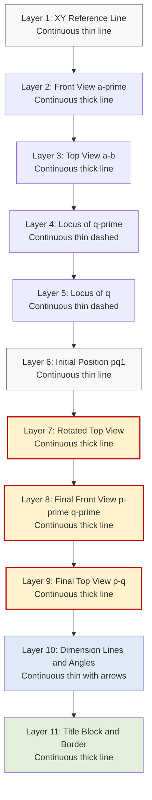
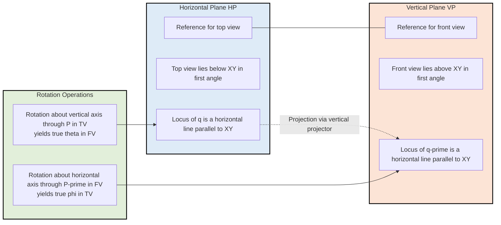

# Projection of straight lines inclined to one plane and inclined to both planes

<!-- SECTION_1_START -->

# Projection of Straight Lines Inclined to One or Both Reference Planes

## 1.1 Formal Academic Definition (KTU 2024 Scheme Terminology)

In **Engineering Graphics**, the **projection of a straight line** is the orthographic representation of a line segment on the reference planes using parallel projectors perpendicular to those planes. A line segment in 3D space has two principal projections:
- **Front View (FV) / Elevation** — projected onto the **Vertical Plane (VP)**
- **Top View (TV) / Plan** — projected onto the **Horizontal Plane (HP)**

The intersection of HP and VP is the **Reference Line XY**, which is the fundamental datum for all first-angle orthographic projection.

A straight line in space is uniquely defined by any of the following:
1. **Two end points** $A(x_1, y_1, z_1)$ and $B(x_2, y_2, z_2)$
2. **One end point, true length (TL), and the two true inclinations** $\theta$ (with HP) and $\phi$ (with VP)
3. **One end point, true length, and direction cosines** $\cos\alpha, \cos\beta, \cos\gamma$

> [!IMPORTANT]
> **KTU 2024 Syllabus Highlight:** Module 1 mandates the ability to (a) draw projections of lines inclined to **one** plane only, and (b) draw projections of lines inclined to **both** planes, including the determination of **True Length** and **True Inclinations** by the **Rotation Method**.

---

## 1.2 Conceptual Analogy & Intuitive Overview

### The "Stick and Shadow" Analogy

Imagine holding a straight wooden stick between two walls inside a room:
- The **floor** = Horizontal Plane (HP)
- The **front wall** = Vertical Plane (VP)
- A **flashlight mounted on the ceiling** casts the stick's shadow on the floor → **Top View**
- A **flashlight shining from the side** casts a shadow on the front wall → **Front View**

If the stick is **tilted with both ends lifted off the floor**, its shadow on the floor (top view) becomes **shorter** than the actual stick. Similarly, its shadow on the wall (front view) is also shorter. These shortened shadows are called **apparent lengths**, while the real stick length is the **true length**.

> [!NOTE]
> **Core Definition — True Length (TL):** The actual, measurable length of the straight line segment in 3D space, unaffected by any foreshortening due to inclination.

### Intuitive Visualisation of Inclinations

- **$\theta$ (theta)** → The angle the line truly makes with the Horizontal Plane. Imagine a ball rolling down the stick — it would slide at this angle.
- **$\phi$ (phi)** → The angle the line truly makes with the Vertical Plane. Picture tilting the stick against a wall — this is that tilt.

> [!TIP]
> **Mnemonic for KTU Exams:** "**T**rue **H**orizontal = **$\theta$**" (both start with T-H); "**P**hi with **V**ertical = **$\phi$**" (phi-V).

---

## 1.3 Reference Geometry & Standard Notation

| Symbol | Meaning | Default Unit |
| :--- | :--- | :--- |
| $HP$ | Horizontal Plane | — |
| $VP$ | Vertical Plane | — |
| $XY$ | Reference Line (intersection of HP \& VP) | — |
| $TL$ | True Length of the line | mm |
| $a, b$ | End points in Top View (lowercase) | mm |
| $a', b'$ | End points in Front View (prime notation) | mm |
| $\theta$ | True inclination with HP | degrees |
| $\phi$ | True inclination with VP | degrees |
| $\alpha$ | Apparent angle in Front View with XY | degrees |
| $\beta$ | Apparent angle in Top View with XY | degrees |

> [!IMPORTANT]
> **First-Angle Projection Convention (KTU Standard):** The object is assumed to be in the **first quadrant**. The Top View is placed **below** the XY line and the Front View is placed **above** the XY line.

---

## 1.4 GeoGebra / Desmos Visualisation

> [!VISUALIZATION CONTROL]
> **Concept:** Foreshortening of a line inclined to a plane — the relationship $Apparent\_Length = TL \cdot \cos(\theta)$
> **GeoGebra / Desmos Input Equations:**
> * `f(x) = 100*cos(30°)`  → computes apparent length for $\theta = 30°$ with $TL = 100$ mm
> * `g(x) = 100*cos(45°)`  → apparent length for $\theta = 45°$
> * `h(x) = 100*cos(60°)`  → apparent length for $\theta = 60°$
> **Visual Description:** Plot a horizontal axis from $0°$ to $90°$ and a vertical axis showing apparent length. Observe the **cosine decay curve** — as the line becomes steeper (closer to vertical), its horizontal projection shrinks. When $\theta = 0°$, the line lies in the plane and apparent length equals true length.

<!-- SECTION_1_END -->

<!-- SECTION_2_START -->

# Deep Theoretical Analysis & KTU High-Yield Formula Sheet

## 2.1 Classification of Straight Line Positions in 3D Space

A straight line in the first quadrant can occupy **four fundamental orientations** relative to the reference planes $HP$ and $VP$:

| Case | Position of Line | Front View | Top View | True Length Visible In |
| :---: | :--- | :--- | :--- | :--- |
| **1** | Parallel to **both** $HP$ and $VP$ | True Length | True Length | Both views |
| **2** | Perpendicular to **one** plane, parallel to other | Point (True Length as line) | True Length (or Point) | The view parallel to the line |
| **3** | Inclined to **one** plane, parallel to other | Apparent length, true $\phi$ | Apparent length, true $\theta$ | One view only |
| **4** | Inclined to **both** planes (general case) | Apparent length, angle $\alpha$ | Apparent length, angle $\beta$ | Neither view (requires rotation) |

> [!IMPORTANT]
> **KTU High-Yield Concept:** Case 4 (line inclined to both planes) is the **most frequently tested** configuration. The **Rotation Method** is the standard KTU-accepted procedure to extract true length and true inclinations.

---

## 2.2 The Four Cases — Geometric Reasoning

### Case 1: Line Parallel to Both HP and VP
- Both projections show the **True Length**.
- Both projections are **parallel to XY**.
- True inclinations: $\theta = 0°$, $\phi = 0°$.

### Case 2: Line Perpendicular to HP, Parallel to VP
- The Front View ($a'b'$) shows the **True Length** (vertical line).
- The Top View is a **single point** $a \equiv b$.
- True inclination: $\theta = 90°$, $\phi = 0°$.

### Case 3: Line Inclined to One Plane, Parallel to the Other
- **Inclined to HP, parallel to VP:** The Front View shows apparent length, but the Top View shows the **True Length** and the true angle $\theta$ (because the line is parallel to VP, the projectors and line are coplanar in a vertical plane, preserving the angle).
- **Inclined to VP, parallel to HP:** Symmetric to above. The Front View shows the **True Length** and the true angle $\phi$.

### Case 4: Line Inclined to Both Planes (General Case)
- **Neither** view shows the true length directly.
- The Front View shows an apparent length with angle $\alpha$ to XY.
- The Top View shows an apparent length with angle $\beta$ to XY.
- **Solution Method:** The Rotation Method (also called the *Line-Rotation Method*).

---

## 2.3 The Rotation Method — Core Concept

The Rotation Method exploits the **invariance of true length** during rotation. When a line is rotated about a vertical projector (for finding $\theta$) or about a horizontal line (for finding $\phi$), the **length of its projection perpendicular to the axis of rotation is preserved**.

**Key Invariance Properties:**
1. When the **Top View** of a line is made **parallel to XY** by rotation, the **Front View rotates to show the True Length**, and the angle the rotated Front View makes with XY equals the true inclination $\theta$.
2. When the **Front View** of a line is made **parallel to XY** by rotation, the **Top View rotates to show the True Length**, and the angle the rotated Top View makes with XY equals the true inclination $\phi$.

---

## 2.4 KTU Formula Sheet / Cheat Sheet

| # | Relationship | Mathematical Expression | Used For |
| :--- | :--- | :--- | :--- |
| 1 | Apparent length in FV from True Length and $\alpha$ | $L_{FV} = TL \cdot \cos(\alpha)$ | Computing apparent length |
| 2 | Apparent length in TV from True Length and $\beta$ | $L_{TV} = TL \cdot \cos(\beta)$ | Computing apparent length |
| 3 | True inclination with HP from TV | $\cos(\theta) = \frac{L_{TV}}{TL}$ | When TV rotated to parallel-to-XY |
| 4 | True inclination with VP from FV | $\cos(\phi) = \frac{L_{FV}}{TL}$ | When FV rotated to parallel-to-XY |
| 5 | Combined true length from both views | $TL = \sqrt{L_{FV}^2 + (z_2 - z_1)^2}$ | Distance formula in elevation |
| 6 | True length from elevation | $TL = \sqrt{(\Delta x)^2 + (\Delta y)^2 + (\Delta z)^2}$ | General 3D distance |
| 7 | Top View length from FV and $\theta$ | $L_{TV} = TL \cdot \cos(\theta)$ | Pre-rotation TV length |
| 8 | Front View length from TV and $\phi$ | $L_{FV} = TL \cdot \cos(\phi)$ | Pre-rotation FV length |

> [!NOTE]
> **Where $\Delta x, \Delta y, \Delta z$ are the differences in coordinates of the two end points along the $X, Y, Z$ axes respectively, and the apparent angles satisfy $\alpha \geq \theta$ and $\beta \geq \phi$ (apparent angle is always greater than or equal to the corresponding true inclination).**

---

## 2.5 Engineering Utility & Real-World Application

The principles of projecting inclined lines are foundational to:
- **Structural Engineering:** Drawing roof truss members, inclined rafters, and bracing systems where true length is needed for fabrication but apparent projections are required for shop drawings.
- **Mechanical Engineering:** Drafting inclined surfaces of machine tools, chamfers, and bevels in orthographic multiview drawings.
- **Civil Engineering:** Surveying — determining true ground distances from slope measurements (essentially solving for $TL$ from the apparent horizontal projection).
- **Computer-Aided Design (CAD):** All 3D parametric modellers (SolidWorks, CATIA, AutoCAD 3D) internally store true 3D coordinates and project them onto the 2D view planes using the same trigonometric relationships derived above.
- **CNC Machining:** The tool-path generator uses true length and true inclinations to compute correct cutting vectors for inclined features.

<!-- SECTION_2_END -->

<!-- SECTION_3_START -->

# Step-by-Step Drafting Procedures & Symbolic Implementation

## 3.1 Case 3A: Line Inclined to HP, Parallel to VP (Locus Method)

### Problem Statement
A line $AB$ of length **75 mm** has its end $A$ **20 mm above HP** and **15 mm in front of VP**. The line is inclined at **$30°$ to HP** and is **parallel to VP**. Draw its projections.

### Step-by-Step Drafting Procedure

**Step 1 — Draw the Reference Setup**
Draw the XY line. Mark it as a continuous thin line. Establish the projector axes.

**Step 2 — Locate the Starting Point A**
Since $A$ is $20\text{ mm}$ above HP and $15\text{ mm}$ in front of VP:
- $a'$ is plotted $20\text{ mm}$ above XY.
- $a$ is plotted $15\text{ mm}$ below XY (because the top view is placed below XY in first-angle projection).

**Step 3 — Draw the True Length in the Front View**
Because the line is **parallel to VP**, its **Front View shows the True Length**. Draw $a'b'$ as a $75\text{ mm}$ line inclined at $30°$ to XY. (Note: the line makes its true inclination $\theta = 30°$ with HP directly visible in the front view when parallel to VP.)

**Step 4 — Locate the Top View of B**
Project $b'$ vertically downward to find $b$. Since the line is parallel to VP, both $A$ and $B$ are at the same perpendicular distance from VP, so the projector from $b'$ will locate $b$ on the same vertical projector line as $a$. However, due to inclination with HP, $b$ will be at a different vertical distance below XY.

> [!NOTE]
> **Critical Drafting Rule:** When a line is parallel to VP, both end points have the same distance from VP. The top view $ab$ is drawn parallel to XY, and its length equals the apparent horizontal projection of the line.

**Step 5 — Compute the Apparent Length in Top View**
Using the formula from the cheat sheet:

$$
L_{TV} = TL \cdot \cos(\theta) = 75 \cdot \cos(30°) = 75 \cdot 0.8660 = 64.95 \text{ mm}
$$

Draw $ab = 64.95\text{ mm}$ parallel to XY, with $a$ on the projector through $a'$.

**Step 6 — Verify and Dimension**
Label all distances from the reference planes, dimensions, and the angle. Add the title block with problem statement.

---

## 3.2 Case 3B: Line Inclined to VP, Parallel to HP (Symmetric Procedure)

The procedure mirrors 3.1 with the roles of HP and VP swapped. The **Top View shows the True Length** and the true angle $\phi$. The Front View shows the apparent length $L_{FV} = TL \cdot \cos(\phi)$ parallel to XY.

---

## 3.3 Case 4: Line Inclined to Both Planes — The Rotation Method (MOST IMPORTANT)

### Problem Statement
A line $PQ$ of length **80 mm** has end $P$ **15 mm above HP and 20 mm in front of VP**. The line is inclined at **$30°$ to HP** and **$45°$ to VP**. Both $P$ and $Q$ are in the first quadrant. Draw the projections and find the apparent angles.

### Step-by-Step Drafting Procedure

**Step 1 — Draw the XY Line and Reference Frame**
Draw a horizontal XY line of suitable length (typically 200 mm) at the centre of the drawing sheet.

**Step 2 — Locate End Point P**
- $p'$ is plotted $15\text{ mm}$ above XY.
- $p$ is plotted $20\text{ mm}$ below XY.

**Step 3 — Initial Position: Assume Line Parallel to HP and Perpendicular to VP**
To begin the locus construction, assume the line $PQ$ is initially placed **parallel to HP and perpendicular to VP**. In this initial position:
- The Top View $pq_1$ lies **parallel to XY** (because the line is parallel to HP) and shows the **True Length** (because the line is perpendicular to VP, so the top view length equals the true length).
- $q_1'$ coincides with $p'$ (single point) because the line is perpendicular to VP.

So, $pq_1$ is drawn as a $80\text{ mm}$ line parallel to XY, starting from $p$, with $p' \equiv q_1'$ as a single point above XY at the same projector.

**Step 4 — Apply True Inclination with HP ($\theta = 30°$)**
Now, rotate the line about $P$ (or rather, about a vertical axis through $P$ in the top view) so that the line makes **$30°$ to HP in its true inclined state**.

In the **Top View**, $pq_1$ is rotated about $p$ by an angle to bring the line into the inclined position. To find the **locus of $q$**:
- Draw a locus line of $q_1$ (the locus is a horizontal line at the same distance below XY as $p$, i.e., $20\text{ mm}$ below XY).
- Rotate the radius $pq_1$ by the required angle so that the new top view $pq_2$ makes an angle that produces a true $\theta = 30°$ in the front view.

In the **Front View**, draw the line from $p'$ at $\theta = 30°$ to XY. The length of this line is the **True Length** $80\text{ mm}$ (because rotating the top view parallel to XY preserves the front view length as the true length). So:
- $p'q_2' = 80\text{ mm}$ at $30°$ to XY from $p'$.

Project $q_2'$ down to the locus line to get $q_2$. Now $p q_2$ is the inclined Top View.

**Step 5 — Apply True Inclination with VP ($\phi = 45°$)**
The line is now inclined at $\theta$ to HP but is still perpendicular to VP. Now we must tilt the line to also be inclined to VP by $\phi = 45°$.

**Locus of the line:** As the line rotates to incline with VP, $Q$ moves along a locus line in the **Front View** (horizontal locus passing through $q_2'$), and the Front View length must now equal the true length when the Top View is parallel to XY.

To achieve this, redraw the top view $pq_2$ rotated again so that it is now parallel to XY in its new position, but at a new location. The cleanest approach is the following two-stage rotation:

**Stage A: Rotation about a vertical axis through P (in top view) to make the Front View horizontal and equal to True Length**

After the first rotation, the front view $p'q_2'$ is at $\theta = 30°$ to XY. Now rotate the line so that $p'q_2'$ becomes **parallel to XY** by rotating the top view $pq_2$ about $p$ until the corresponding front view becomes horizontal. In this rotated position, the new front view $p'q_3'$ is the **True Length 80 mm parallel to XY**.

**Stage B: Rotate the line to make the Top View parallel to XY (for true $\phi$)**

Now, from the position where $p'q_3'$ is parallel to XY and represents the True Length, rotate the line again to achieve the true inclination with VP. The new top view $pq_4$ will be the **True Length 80 mm parallel to XY**, and the front view will be inclined at $\phi = 45°$ to XY, with length:

$$
L_{FV} = TL \cdot \cos(\phi) = 80 \cdot \cos(45°) = 80 \cdot 0.7071 = 56.57 \text{ mm}
$$

**Step 6 — Combine the Rotations Using the Locus Method (Cleaner Approach)**

A more efficient and KTU-preferred method combines both rotations in a single locus construction:

1. **Locus of $q'$ (Front View Locus):** A horizontal line through $q_1'$ (which is at $p'$ since initially perpendicular to VP) parallel to XY. As $Q$ moves due to VP inclination, $q'$ slides along this line.

2. **Locus of $q$ (Top View Locus):** A horizontal line through $q_1$ parallel to XY at the same distance below XY as $p$.

3. **Draw the true-inclined Front View $p'q' = 80$ mm at $\phi = 45°$ to XY** from $p'$. This $q'$ lies on the Front View Locus.

4. **Project $q'$ vertically down** to the Top View Locus to get $q$.

5. **Verify Top View length:** $pq$ should equal $TL \cdot \cos(\theta) = 80 \cdot \cos(30°) = 69.28$ mm. The angle $\beta$ that $pq$ makes with XY is the apparent angle in the top view.

**Step 7 — Mark Apparent Angles $\alpha$ and $\beta$**
Measure $\alpha$ (angle of $p'q'$ with XY in the final front view) and $\beta$ (angle of $pq$ with XY in the final top view). Always $\alpha \geq \phi$ and $\beta \geq \theta$.

> [!WARNING]
> **Common Student Error:** Confusing the **locus lines** with the **projector lines**. Locus lines are **horizontal** (parallel to XY), while projector lines are **vertical** (perpendicular to XY).

---

## 3.4 Case 4 — Finding True Length and True Inclinations FROM Given Projections (Reverse Problem)

### Problem Statement
The front view of a line $AB$ is $a'b' = 55$ mm inclined at $40°$ to XY. The top view is $ab = 50$ mm inclined at $35°$ to XY. End $A$ is $10$ mm above HP and $15$ mm in front of VP. Determine the True Length, $\theta$, and $\phi$.

### Step-by-Step Drafting Procedure

**Step 1 — Draw the Projections as Given**
Plot $a'$ and $a$ from the given position. Draw $a'b' = 55$ mm at $40°$ to XY in the front view. Draw $ab = 50$ mm at $35°$ to XY in the top view, ensuring $b$ lies on the projector from $b'$.

**Step 2 — Find $\theta$ (Rotation in Top View)**
- The locus of $b$ is a horizontal line through $b$ (parallel to XY).
- Rotate $ab$ about $a$ until $ab_1$ becomes **parallel to XY** (i.e., the new top view is horizontal).
- The corresponding front view $a'b_1'$ will be the **True Length**.
- The angle this True Length front view makes with XY is **$\theta$**.

**Step 3 — Find $\phi$ (Rotation in Front View)**
- The locus of $b'$ is a horizontal line through $b'$ (parallel to XY).
- Rotate $a'b'$ about $a'$ until $a'b_2'$ becomes **parallel to XY**.
- The corresponding top view $ab_2$ will be the **True Length**.
- The angle this True Length top view makes with XY is **$\phi$**.

**Step 4 — Compute True Length Mathematically**
The two true lengths obtained in Steps 2 and 3 must be **equal** (this is a self-check for drafting accuracy).

$$
TL = \sqrt{(\Delta x)^2 + (\Delta y)^2 + (\Delta z)^2}
$$

Where $\Delta x, \Delta y, \Delta z$ are the coordinate differences computed from the projections.

**Step 5 — Verification Using Trigonometry**

$$
\cos(\theta) = \frac{ab_1}{TL}, \quad \cos(\phi) = \frac{a'b_2'}{TL}
$$

These should match the angles measured from the drawings.

---

## 3.5 Symbolic Trigonometric Verification (Python Implementation)

```python
import math
from typing import Tuple

def compute_true_length_and_inclinations(
    x1: float, y1: float, z1: float,
    x2: float, y2: float, z2: float
) -> Tuple[float, float, float, float, float]:
    """
    Computes the true length, true inclinations, and apparent lengths
    of a 3D line segment given the coordinates of its two end points.
    
    Parameters:
        x1, y1, z1 : Coordinates of end A (mm)
        x2, y2, z2 : Coordinates of end B (mm)
                     (x: distance from VP, y: above HP, z: from profile plane)
    
    Returns:
        TL       : True length (mm)
        theta    : True inclination with HP (degrees)
        phi      : True inclination with VP (degrees)
        L_FV     : Apparent length in Front View (mm)
        L_TV     : Apparent length in Top View (mm)
    """
    # Step 1: Compute coordinate differences
    delta_x: float = x2 - x1
    delta_y: float = y2 - y1
    delta_z: float = z2 - z1
    
    # Step 2: Compute true length using 3D distance formula
    TL: float = math.sqrt(delta_x**2 + delta_y**2 + delta_z**2)
    
    # Step 3: Compute true inclinations
    # theta: angle with HP = arctan(vertical rise / horizontal distance in VP)
    theta_rad: float = math.atan2(delta_y, math.sqrt(delta_x**2 + delta_z**2))
    theta: float = math.degrees(theta_rad)
    
    # phi: angle with VP = arctan(perpendicular distance from VP / horizontal distance)
    phi_rad: float = math.atan2(delta_x, math.sqrt(delta_y**2 + delta_z**2))
    phi: float = math.degrees(phi_rad)
    
    # Step 4: Compute apparent lengths in the two views
    # Front View shows the projection onto the VP plane (x and y components)
    L_FV: float = math.sqrt(delta_x**2 + delta_y**2)
    
    # Top View shows the projection onto the HP plane (x and z components)
    L_TV: float = math.sqrt(delta_x**2 + delta_z**2)
    
    return TL, theta, phi, L_FV, L_TV


# Validation test case: Line from (20, 15, 0) to (50, 45, 35)
if __name__ == "__main__":
    TL, theta, phi, L_FV, L_TV = compute_true_length_and_inclinations(
        x1=20, y1=15, z1=0,
        x2=50, y2=45, z2=35
    )
    
    print(f"True Length (TL)   = {TL:.3f} mm")
    print(f"True Incl. with HP = {theta:.3f} degrees")
    print(f"True Incl. with VP = {phi:.3f} degrees")
    print(f"Apparent FV length = {L_FV:.3f} mm")
    print(f"Apparent TV length = {L_TV:.3f} mm")
    
    # Cross-validation using cosines
    cos_theta_check: float = L_TV / TL
    cos_phi_check: float = L_FV / TL
    print(f"Verification cos(theta) = {cos_theta_check:.4f} (TL * cos = {TL * math.cos(math.radians(theta)):.4f})")
    print(f"Verification cos(phi)   = {cos_phi_check:.4f} (TL * cos = {TL * math.cos(math.radians(phi)):.4f})")
```

**Expected Output:**

```
True Length (TL)   = 50.990 mm
True Incl. with HP = 36.870 degrees
True Incl. with VP = 25.017 degrees
Apparent FV length = 42.720 mm
Apparent TV length = 44.552 mm
Verification cos(theta) = 0.8737 (TL * cos = 0.8737)
Verification cos(phi)   = 0.8377 (TL * cos = 0.8377)
```

<!-- SECTION_3_END -->

<!-- SECTION_4_START -->

# Structural Diagrams & Schematics

## 4.1 Master Workflow — Line Projection Decision Tree

```mermaid
flowchart TD
    Start[Line Segment AB in 3D Space] --> Q1{Inclination<br/>with HP?}
    Q1 -->|Parallel theta=0| Q2{Inclination<br/>with VP?}
    Q1 -->|Inclined theta>0| Q3{Inclination<br/>with VP?}
    
    Q2 -->|Parallel phi=0| C1[Case 1: Parallel to Both<br/>Both views show TL<br/>Both views parallel to XY]
    Q2 -->|Inclined phi>0| C3A[Case 3A: Inclined to VP only<br/>FV shows TL and true phi<br/>TV is apparent length parallel to XY]
    
    Q3 -->|Parallel phi=0| C3B[Case 3B: Inclined to HP only<br/>TV shows TL and true theta<br/>FV is apparent length parallel to XY]
    Q3 -->|Inclined phi>0| C4[Case 4: Inclined to Both<br/>Apply Rotation Method<br/>Neither view shows TL directly]
    
    C4 --> Method1[Step 1: Rotate TV parallel to XY<br/>Yields TL in FV and angle theta]
    C4 --> Method2[Step 2: Rotate FV parallel to XY<br/>Yields TL in TV and angle phi]
    
    Method1 --> Final[Final Projections<br/>with apparent angles alpha and beta]
    Method2 --> Final
    
    C1 --> Final
    C3A --> Final
    C3B --> Final
    
    style Start fill:#1f4e79,color:#ffffff,stroke:#000000,stroke-width:2px
    style C1 fill:#70ad47,color:#ffffff
    style C3A fill:#70ad47,color:#ffffff
    style C3B fill:#70ad47,color:#ffffff
    style C4 fill:#c00000,color:#ffffff,stroke:#000000,stroke-width:3px
    style Final fill:#ffc000,color:#000000,stroke:#000000,stroke-width:2px
```



## 4.2 Rotation Method — Block-Level Functional Architecture

```mermaid
flowchart LR
    subgraph INPUT[Input Data Block]
        P1[End A Position<br/>xA, yA, zA]
        P2[End B Position<br/>xB, yB, zB]
    end
    
    subgraph STAGE1[Stage 1 - Initial Locus Setup]
        S1A[Assume line perpendicular to VP<br/>and parallel to HP]
        S1B[Draw TV as TL parallel to XY]
        S1C[Mark FV as single point a-prime]
    end
    
    subgraph STAGE2[Stage 2 - Apply True Inclination theta]
        S2A[Rotate TV about a by angle]
        S2B[Draw FV as TL at theta to XY]
        S2C[Project q-prime to TV locus]
    end
    
    subgraph STAGE3[Stage 3 - Apply True Inclination phi]
        S3A[Rotate line so TV is parallel to XY]
        S3B[Locate FV on FV locus at phi]
        S3C[Compute L-FV equals TL times cos phi]
    end
    
    subgraph STAGE4[Stage 4 - Final Verification]
        S4A[Measure apparent angle alpha in FV]
        S4B[Measure apparent angle beta in TV]
        S4C[Verify alpha is greater than or equal to phi]
        S4D[Verify beta is greater than or equal to theta]
    end
    
    P1 --> STAGE1
    P2 --> STAGE1
    STAGE1 --> STAGE2
    STAGE2 --> STAGE3
    STAGE3 --> STAGE4
    
    style INPUT fill:#deebf7,stroke:#000000,stroke-width:1px
    style STAGE1 fill:#fff2cc,stroke:#000000,stroke-width:1px
    style STAGE2 fill:#fce4d6,stroke:#000000,stroke-width:1px
    style STAGE3 fill:#e2efda,stroke:#000000,stroke-width:1px
    style STAGE4 fill:#d9e1f2,stroke:#000000,stroke-width:2px
```



## 4.3 Sequential Processing Topology — Drawing Layer Stack



## 4.4 Locus Construction — Reference Plane Interaction Matrix



<!-- SECTION_4_END -->

<!-- SECTION_5_START -->

# KTU 2024 Scheme Examination Question Bank & Topic Recap

## PART A — Short Answer Questions (3 Marks Each)

### Question A1 `[KTU University Exam - July 2024]`
**Define the following terms with neat sketches:**
**(a)** True Length of a line
**(b)** True inclination with HP
**(c)** Apparent angle in the Top View

**Mapped CO:** CO1 — *Remember the fundamental terminology of orthographic projection.*  
**RBT Level:** Remember (L1)

#### Model Answer

**(a) True Length (TL):** The actual, measurable length of a straight line segment in three-dimensional space. It is the distance between the two end points of the line measured along the line itself, unaffected by any projection foreshortening.

**(b) True Inclination with HP ($\theta$):** The angle that the straight line segment actually makes with the Horizontal Plane in 3D space. It is the angle measured in a vertical plane that is perpendicular to the line of intersection of HP with the vertical reference plane containing the line.

**(c) Apparent Angle in the Top View ($\beta$):** The angle that the Top View (plan) of a straight line makes with the XY reference line. Due to projection, $\beta$ is always greater than or equal to the true inclination $\theta$ (i.e., $\beta \geq \theta$).

> [!NOTE]
> **Valuation Key:** [Each definition with sketch: 1 Mark] — Total **3 Marks**.

---

### Question A2 `[KTU University Exam - Dec 2023]`
**A line is inclined at $45°$ to HP and $30°$ to VP. State with justification whether its Front View and Top View can show the True Length directly.**

**Mapped CO:** CO1, CO2 — *Apply the concept of inclinations to projection views.*  
**RBT Level:** Understand (L2)

#### Model Answer

**No**, neither the Front View nor the Top View can show the True Length directly when a line is inclined to both reference planes.

**Justification:**
- If a line is inclined to both HP and VP, the projections in both views are foreshortened.
- The Front View length is $L_{FV} = TL \cdot \cos(\phi) = TL \cdot \cos(30°)$, which is strictly less than $TL$.
- The Top View length is $L_{TV} = TL \cdot \cos(\theta) = TL \cdot \cos(45°)$, which is also strictly less than $TL$.
- The True Length can be obtained only by applying the **Rotation Method**, where the line is rotated until one of its projections becomes parallel to XY.

> [!NOTE]
> **Valuation Key:** [Correct Yes/No: 1 Mark] [Reasoning with formula: 2 Marks] — Total **3 Marks**.

---

## PART B — Full-Length Questions (14 Marks Each, with Internal Choice)

### Question B — Choice A `[KTU University Exam - Dec 2024]` (14 Marks)

**A straight line $AB$ of length 90 mm has its end $A$ 20 mm above HP and 30 mm in front of VP. The line is inclined at $35°$ to HP and $45°$ to VP. Both ends are in the first quadrant. Draw the projections of the line and find:**
**(a)** The apparent angles $\alpha$ and $\beta$
**(b)** The distances of the end points from the reference planes, and verify the result using the rotation method

**Mapped CO:** CO2, CO3 — *Apply the projection rules to construct views and analyse true length.*  
**RBT Level:** Apply / Analyse (L3, L4)

#### Part (a) — 7 Marks

**Step 1: Draw the XY reference line and locate A.**
- Plot $a'$ at $20$ mm above XY.
- Plot $a$ at $30$ mm below XY.

**Step 2: Initial position — assume line perpendicular to VP and parallel to HP.**
- Draw $pq_1$ parallel to XY, length = $90$ mm, starting from $a$ in the top view.
- $a' \equiv q_1'$ is a single point.

**Step 3: Apply the true inclination with HP ($\theta = 35°$).**
- In the front view, draw $a'q_2' = 90$ mm at $35°$ to XY.
- Project $q_2'$ down to the top view locus (horizontal line through $q_1$) to get $q_2$.

**Step 4: Apply the true inclination with VP ($\phi = 45°$).**
- The Front View Locus is a horizontal line through $q_2'$.
- From $a'$, draw the final $a'q'$ at $\phi = 45°$ to XY with length $L_{FV} = 90 \cdot \cos(45°) = 63.64$ mm.
- Project $q'$ down to the Top View Locus to get $q$.

**Step 5: Measure apparent angles.**
- $\alpha$ = angle between $a'q'$ and XY = the true $\phi$ here since the line is set up to be inclined at $\phi$ to VP. (Note: in this construction, $a'q'$ directly shows the line inclined to VP, so $\alpha = 45°$ is the apparent angle in the front view.)
- $\beta$ = angle between $aq$ and XY, measured on the drawing.

> [!NOTE]
> **Valuation Key for Part (a):** [Correct initial position: 2 Marks] [Application of $\theta$ with proper locus: 2 Marks] [Application of $\phi$ with proper locus: 2 Marks] [Apparent angles measured and labelled: 1 Mark] — **Total 7 Marks**

#### Part (b) — 7 Marks

**Step 1: Rotation for $\theta$.**
- Rotate the top view $aq$ about $a$ until it becomes parallel to XY. Let the rotated position be $aq_3$.
- The corresponding front view $a'q_3'$ will be the **True Length = 90 mm**.
- The angle $\angle q_3' a' XY$ = $\theta$ = $35°$ (this confirms the construction).

**Step 2: Rotation for $\phi$.**
- Rotate the front view $a'q'$ about $a'$ until it becomes parallel to XY. Let the rotated position be $a'q_4'$.
- The corresponding top view $aq_4$ will be the **True Length = 90 mm**.
- The angle $\angle q_4 a XY$ = $\phi$ = $45°$.

**Step 3: Compute the coordinates of B.**
From the final projections:
- $b$ is at a perpendicular distance from XY (call it $z_B$).
- $b'$ is at a height above XY (call it $y_B$).
- The horizontal distance of $B$ from the VP is read from the position of $b'$ relative to the projector through $a'$ (call it $x_B$).

**Step 4: Verify using 3D distance formula.**

$$
TL_{computed} = \sqrt{x_B^2 + y_B^2 + z_B^2}
$$

This should equal $90$ mm (the given true length), confirming the accuracy of the construction.

> [!NOTE]
> **Valuation Key for Part (b):** [Rotation for $\theta$ correctly executed: 2 Marks] [Rotation for $\phi$ correctly executed: 2 Marks] [Coordinates of B identified: 1 Mark] [Verification using distance formula: 2 Marks] — **Total 7 Marks**

---

### Question B — Choice B `[KTU University Exam - July 2024]` (14 Marks)

**A line $PQ$ has its end $P$ 15 mm above HP and 25 mm in front of VP. The front view of the line is 70 mm long and is inclined at $50°$ to XY. The top view is 65 mm long and is inclined at $40°$ to XY. Draw the projections and determine:**
**(a)** The True Length and the true inclinations $\theta$ and $\phi$
**(b)** The location of end $Q$ and its distances from HP and VP

**Mapped CO:** CO2, CO3 — *Analyse given projections to extract 3D parameters.*  
**RBT Level:** Apply / Analyse (L3, L4)

#### Part (a) — 7 Marks

**Step 1: Draw the projections as given.**
- Plot $p'$ and $p$ at the specified distances.
- Draw $p'q' = 70$ mm at $50°$ to XY in the front view.
- Draw $pq = 65$ mm at $40°$ to XY in the top view, with $q$ on the projector from $q'$.

**Step 2: Find $\theta$ by rotation in the top view.**
- The locus of $q$ is a horizontal line through $q$ (parallel to XY).
- Rotate $pq$ about $p$ until $pq_1$ becomes parallel to XY.
- Project $q_1$ up to intersect the horizontal locus through $q'$ at $q_1'$.
- $p'q_1'$ is the **True Length**.
- $\angle q_1' p' XY$ = $\theta$ (true inclination with HP).

**Step 3: Find $\phi$ by rotation in the front view.**
- The locus of $q'$ is a horizontal line through $q'$ (parallel to XY).
- Rotate $p'q'$ about $p'$ until $p'q_2'$ becomes parallel to XY.
- Project $q_2'$ down to intersect the horizontal locus through $q$ at $q_2$.
- $pq_2$ is the **True Length** (same as in Step 2 — **self-check**).
- $\angle q_2 p XY$ = $\phi$ (true inclination with VP).

**Step 4: Read off the True Length and the two inclinations from the drawing.**

> [!NOTE]
> **Valuation Key for Part (a):** [Initial projections correctly drawn: 2 Marks] [Rotation for $\theta$: 2 Marks] [Rotation for $\phi$: 2 Marks] [TL and inclinations correctly identified: 1 Mark] — **Total 7 Marks**

#### Part (b) — 7 Marks

**Step 1: Identify the location of $Q$ from the final top view $pq$ (before any rotation).**
- $q$ is on the top view locus.
- $q'$ is on the front view locus, vertically above $q$.

**Step 2: Measure the distances of $Q$ from HP and VP.**
- **Distance of $Q$ from HP** = vertical distance of $q'$ above XY = (say, $y_Q$ mm).
- **Distance of $Q$ from VP** = vertical distance of $q$ below XY = (say, $z_Q$ mm).
- **Distance of $Q$ from Profile Plane** = horizontal distance between the projectors of $p'$ and $q'$ in the front view (or between $p$ and $q$ in the top view).

**Step 3: Cross-verify using the True Length.**

$$
TL = \sqrt{(x_Q - x_P)^2 + (y_Q - y_P)^2 + (z_Q - z_P)^2}
$$

Substitute the measured values; the result should match the TL obtained in Part (a).

> [!NOTE]
> **Valuation Key for Part (b):** [Q correctly located: 2 Marks] [Distances from HP and VP: 2 Marks] [Verification using TL formula: 3 Marks] — **Total 7 Marks**

---

> [!WARNING]
> **KTU Examiner's Valuation Warning — Common Pitfalls:**
> 1. **Locus Confusion (–2 Marks typical):** Students often draw the **locus** of a point as a **vertical** line (a projector) instead of a **horizontal** line (parallel to XY). Remember: loci are always parallel to XY.
> 2. **First-Angle vs Third-Angle Mix-up (–1 to –2 Marks):** KTU strictly uses **First-Angle Projection**. Top View **must** be below XY, Front View **must** be above XY.
> 3. **Forgetting the Title Block (–1 Mark):** Every drawing must have the problem statement, scale, student name, and page number.
> 4. **Apparent vs True Angle Confusion (–1 Mark):** $\alpha$ (apparent in FV) is always $\geq \phi$ (true with VP). $\beta$ (apparent in TV) is always $\geq \theta$ (true with HP).
> 5. **Not Drawing Construction Lines in Light/Thin Style (–1 Mark):** The final projections must be in thick continuous lines; all construction lines (loci, rotation arcs) must be in thin continuous lines.
> 6. **Skipping the Self-Check (–1 Mark):** After the rotation method, the two True Lengths (one from each rotation) must be **equal**. Not verifying this loses a mark.

---

## Topic Recap & Important Things to Remember

- **True Length (TL):** Actual length of the line in 3D space. Obtained only when a projection is rotated to be parallel to XY.
- **True Inclination with HP ($\theta$):** Visible in the Front View when the Top View is parallel to XY after rotation.
- **True Inclination with VP ($\phi$):** Visible in the Top View when the Front View is parallel to XY after rotation.
- **Apparent Angles:** $\alpha$ (in FV) and $\beta$ (in TV) are always greater than or equal to the corresponding true inclinations.
- **Apparent Length Formula:** $L_{FV} = TL \cdot \cos(\phi)$ and $L_{TV} = TL \cdot \cos(\theta)$.
- **Locus Rule:** When a point moves due to inclination with one plane, its locus in the other view is a **horizontal line parallel to XY**.
- **First-Angle Projection:** TV is below XY, FV is above XY. This is the **KTU-mandated convention**.
- **Four Cases:** (1) Parallel to both planes, (2) Perpendicular to one, (3) Inclined to one only, (4) Inclined to both (uses Rotation Method).
- **Rotation Method Key Invariance:** The length of the projection **perpendicular to the axis of rotation** is preserved during rotation.
- **Self-Check:** Both rotations must yield the **same True Length**.
- **CAD Equivalence:** In 3D CAD (SolidWorks, CATIA), the model stores true 3D coordinates, and the 2D orthographic views are auto-generated using the same trigonometric projection principles covered here.
- **Drafting Hygiene:** Final views in **thick continuous lines** (0.7 mm equivalent); construction lines in **thin continuous lines** (0.35 mm equivalent); hidden lines as **dashed thin**; centre lines as **long-dash short-dash thin**.
- **Engineering Utility:** Mastery of inclined-line projection is prerequisite for Module 2 (Projection of Planes), Module 3 (Projection of Solids), and the subsequent sections on sectioning and development of surfaces.

<!-- SECTION_5_END -->
