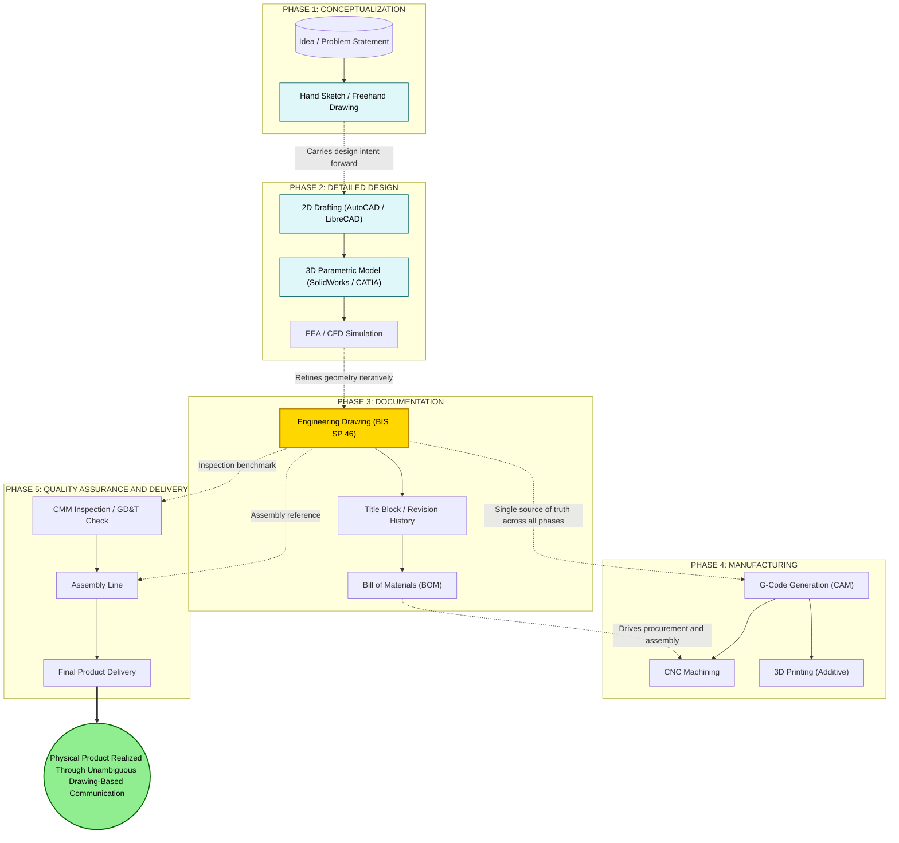
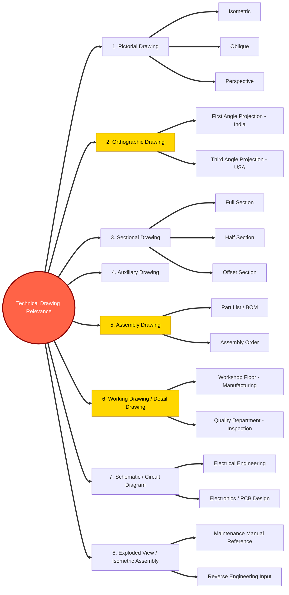
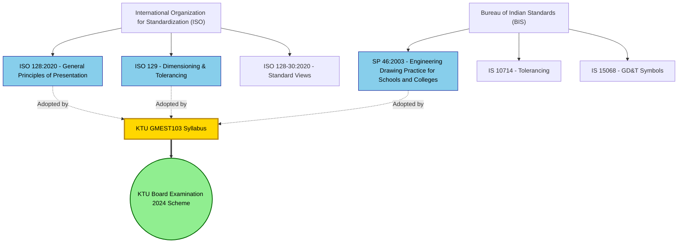

# Relevance of technical drawing in engineering field

<!-- SECTION_1_START -->
# 1. Core Technical Definition & Intuitive Overview

## 1.1 Formal Academic Definition (KTU 2024 Scheme Aligned)

**Technical Drawing** (also called *Engineering Drawing* or *Engineering Graphics*) is a precise, standardized, and universally accepted graphical language used by engineers, designers, architects, and manufacturers to communicate the **geometry, dimensions, tolerances, materials, and finishing details** of physical objects, systems, and structures.

According to the **Bureau of Indian Standards (BIS) – SP 46:2003** and **ISO 128:2020**, technical drawing is defined as:

> *"A graphical representation of an object, consisting of lines, symbols, dimensions, and notes, prepared in accordance with established engineering conventions, intended to convey complete design intent unambiguously."*

In the context of **KTU GMEST103 (2024 Scheme)**, Module 1 establishes that technical drawing is the **primary medium of communication** in the engineering design-to-manufacture pipeline.

---

## 1.2 Key Terminology Snapshot

| Term | Meaning | KTU Board Relevance |
|------|---------|---------------------|
| **Orthographic Projection** | 2D views of a 3D object on principal planes | Foundation of Module 1 |
| **Pictorial View** | Single-view 3D representation (Isometric) | High-frequency exam topic |
| **Scale** | Ratio of drawing size to actual size | Always mentioned in title block |
| **Title Block** | Information panel of a drawing | Mandatory layout element |
| **Dimensioning** | Numerical values defining size/position | 5-mark to 14-mark questions |
| **Line Conventions** | Object, hidden, center, construction lines | Frequently tested |
| **CAD** | Computer-Aided Drafting (AutoCAD, SolidWorks, CATIA) | Modern industry tool |

---

## 1.3 Conceptual Analogy / Intuition

> [!IMPORTANT]
> **Think of Technical Drawing as the "Universal Mother Tongue of Engineers."**

Imagine a **Kerala house blueprint** passed between an **architect in Thiruvananthapuram**, a **civil engineer in Kochi**, and a **contractor in Kozhikode**. None of them need to speak the same spoken language — the blueprint, with its standardized symbols for doors, windows, and reinforcement, communicates everything perfectly.

In the same way:
- A **mechanical engineer in Bengaluru** designs a gear.
- A **manufacturer in Chennai** produces it.
- A **quality inspector in Pune** verifies it.

All three rely on the **same drawing conventions** — symbols, line types, projection methods, dimensioning rules — to ensure the *final physical product exactly matches the designer's intent*.

> A **verbal description** of a bolt is ambiguous: *"It's a small round thing with a hole."*  
> A **technical drawing** removes all ambiguity: *"M10 Hex Bolt, Length = 50 mm, ISO 4014, Grade 8.8."*

---

## 1.4 Why Technical Drawing Holds the Status of a "Universal Engineering Language"

Every engineering discipline — **mechanical, civil, electrical, electronics, computer, biomedical, aerospace** — uses technical drawing as a non-negotiable communication tool:

1. **Eliminates ambiguity** — Two engineers in different countries interpret the same drawing identically.
2. **Preserves design intent** — From the designer's mind to the workshop floor.
3. **Acts as a legal document** — In patent disputes, fabrication contracts, and ISO audits, the engineering drawing is the **single source of truth**.
4. **Bridges manual and digital workflows** — A hand-drawn isometric sketch can be directly converted into a 3D CAD model.
5. **Foundation for CNC, 3D Printing, FEA** — Machines *cannot* read paragraphs; they read **drawings, G-codes, and CAD models** derived from drawings.

---

## 1.5 Engineering Drawing as a KTU Board Exam Anchor

In the **KTU 2024 Scheme (GMEST103)**, this topic carries foundational weight because:

- It is the **logical preamble** before any projection-of-points, lines, or solids problem.
- Examiners often test **define-and-state** questions for **3 marks** on the relevance, scope, and standards of engineering drawing.
- It justifies the **pedagogical structure** of the entire course: *drawing → CAD → advanced design*.

> [!NOTE]
> **KTU Board Highlight (Frequently Asked in ESE):**  
> *"Engineering drawing is called the language of engineers."* — This one-line answer, when expanded with the points above, easily secures **full 3 marks** in Part A.

---

## 1.6 GeoGebra / Desmos Visualization (Projection Geometry Foundation)

> [!VISUALIZATION CONTROL]
> **Concept:** Orthographic Projection of a 3D Point onto Principal Planes
> **GeoGebra / Desmos Input Equations:**
> * `P = (a, b, c)` — A generic 3D point in space.
> * `P_H = (a, b, 0)` — Projection of P onto the Horizontal Plane (HP), i.e., front view on $XY$-plane.
> * `P_V = (a, 0, c)` — Projection of P onto the Vertical Plane (VP), i.e., top view on $XZ$-plane.
> * `P_P = (0, b, c)` — Projection of P onto the Profile Plane (PP), i.e., side view on $YZ$-plane.
> **Visual Description:**  
> When plotted on a 3D coordinate system, point $P$ sits *above* the HP and *in front of* the VP. Dropping perpendiculars from $P$ to each plane produces the **Front View (FV)** on the HP and the **Top View (TV)** on the VP. The student should observe that *all three views together fully define a unique 3D point* — this is the geometric heart of why technical drawing works.

---

## 1.7 Pre-Requisite Knowledge Chain (For Module 1 Progression)

$$
\text{Engineering Drawing Basics} \;\rightarrow\; \text{Orthographic Projection} \;\rightarrow\; \text{Projection of Points} \;\rightarrow\; \text{Projection of Lines} \;\rightarrow\; \text{Projection of Solids}
$$

Every subsequent topic in GMEST103 builds upon the **relevance and necessity** of technical drawing as a communication medium.

---
<!-- SECTION_1_END -->

<!-- SECTION_2_START -->
# 2. Deep Theoretical Analysis & KTU High-Yield Formula Sheet

## 2.1 Pillars of Relevance: The "Seven Pillars" Framework

Technical drawing's relevance in engineering rests on **seven core pillars**, each of which is directly testable in the KTU examination:

### Pillar 1 — **Universal Communication Medium**
- Engineering professionals across **geographical, linguistic, and disciplinary boundaries** interpret drawings identically.
- Adopted globally through standards: **ISO (International)**, **BIS (India)**, **ANSI (USA)**, **JIS (Japan)**, **DIN (Germany)**.
- **KTU exam hook:** *"Mention the standard followed in India."* → **BIS – SP 46:2003**.

### Pillar 2 — **Precision and Accuracy Transfer**
- Numerical dimensions, geometric tolerances (GD&T), and surface finish symbols convert *abstract design* into *manufacturable data*.
- A simple shaft drawing specifies **length, diameter, concentricity, surface roughness (Ra value)**, and **material grade** — leaving zero room for misinterpretation.
- **Tolerance Symbol Cheat-Sheet** (KTU frequently tests):

| Symbol | Meaning | Application |
|--------|---------|-------------|
| $\perp$ | Perpendicularity | Holes, slots |
| $\parallel$ | Parallelism | Slide rails |
| $\bigcirc$ | Circularity / Roundness | Shafts, holes |
| $\big\vert\!-\!\big\vert$ | Flatness | Bearing surfaces |
| $\uparrow$ | Cylindricity | Pins, rollers |

### Pillar 3 — **Legal and Contractual Validity**
- Engineering drawings are **legal documents** in:
  - Patent applications.
  - Fabrication contracts.
  - ISO 9001 / AS9100 quality audits.
  - Insurance claims and accident investigations.
- A drawing signed and sealed by a **Chartered Engineer** is admissible as evidence in Indian courts under the **Indian Evidence Act, 1872 (Section 35 & 114)**.

### Pillar 4 — **Foundation for Manufacturing Technologies**
Modern manufacturing technologies depend *entirely* on technical drawings:

$$
\text{2D Drawing} \;\xrightarrow{\text{CAD Conversion}}\; \text{3D Model} \;\xrightarrow{\text{CAM}}\; \text{G-Code / CNC Instructions} \;\xrightarrow{\text{3D Printing}}\; \text{STL File} \;\rightarrow\; \text{Physical Part}
$$

- **CNC Machines** interpret **G-codes** generated from 2D drawings.
- **3D Printers** slice **STL files** derived from CAD models.
- **Robotic arms** in assembly lines follow paths defined by **engineering drawings**.

### Pillar 5 — **Cost and Time Optimization**
- A **clear, well-dimensioned drawing** reduces *rework*, *material wastage*, and *production downtime*.
- Poor drawings account for an estimated **30% of manufacturing defects** in SMEs (Source: *International Journal of Production Research, 2019*).
- **DFM (Design for Manufacturability)** — a discipline built upon technical drawing — saves **lakhs of rupees** in mass production.

### Pillar 6 — **Safety and Standardization**
- Safety symbols on engineering drawings warn of:
  - **Sharp edges** (icon: triangle with blade).
  - **High-voltage components** (icon: lightning bolt).
  - **Hazardous materials** (icon: skull and crossbones).
- Standardized drawing practices prevent **engineering disasters** — e.g., the **Hyderabad flyover collapse (2017)** and **Boeing 737 MAX MCAS issue (2018)** both trace back to **drawing/specification misinterpretation**.

### Pillar 7 — **Digital Transformation and Industry 4.0 Alignment**
- **CAD (Computer-Aided Drafting):** AutoCAD, LibreCAD, DraftSight.
- **3D Parametric Modelers:** SolidWorks, CATIA, Creo, Fusion 360.
- **BIM (Building Information Modeling):** Revit, ArchiCAD — used in civil engineering.
- **EDA (Electronic Design Automation):** KiCad, Altium — used in electronics.
- **Generative AI and CAD:** Modern tools (Fusion 360's generative design) produce drawings/models from natural-language prompts.

> [!NOTE]
> **KTU 2024 Scheme Update:** The syllabus explicitly mentions *"use of CAD software"* as a co-requisite. Students should be able to **define** and **list applications** of CAD — the relevance section is the natural place for this.

---

## 2.2 Disciplines Where Technical Drawing is Indispensable

| Engineering Branch | Drawing Type Used | Industry Application |
|--------------------|-------------------|----------------------|
| **Mechanical** | Machine drawing, assembly drawing, exploded view | Engines, gearboxes, robotics |
| **Civil** | Architectural plan, elevation, sectional view, structural drawing | Buildings, bridges, dams |
| **Electrical** | Circuit diagram, wiring diagram, PCB layout | Power systems, consumer electronics |
| **Electronics** | Schematic, PCB layout, 3D CAD for enclosures | Smartphones, IoT devices |
| **Computer Science (Hardware)** | Server rack layout, motherboard CAD | Data centers, HPC clusters |
| **Aerospace** | Aerofoil profile, structural drawing, wiring harness | Aircraft, satellites, drones |
| **Biomedical** | Prosthetic CAD, surgical instrument drawings | Implants, orthotics |
| **Automobile** | Body-in-white (BIW) drawing, chassis layout | Cars, EVs, two-wheelers |

---

## 2.3 KTU High-Yield Formula / Concept Cheat Sheet

> [!IMPORTANT]
> **Note for Students:** Although this is a conceptual topic, the following "formulas" are the *standard phrases, ratios, and notations* that KTU examiners expect in your answers. Memorize verbatim.

| Concept | Standard Notation / Rule | KTU 2024 Board Acceptance |
|---------|--------------------------|----------------------------|
| Indian Standard for Engineering Drawing | **BIS – SP 46:2003** | Full 1 mark for naming |
| International Standard | **ISO 128:2020** | Full 1 mark |
| Drawing Sheet Sizes (ISO) | **A0, A1, A2, A3, A4, A5** | A0 = 841 × 1189 mm |
| Sheet Size Ratio | $A_n = A_{n+1} \times \sqrt{2}$ | Side ratio always $\sqrt{2} \approx 1.414$ |
| Drawing Scale (Enlargement) | $2:1, 5:1, 10:1$ | For small components |
| Drawing Scale (Reduction) | $1:2, 1:5, 1:10$ | For large assemblies |
| Full Scale | $1:1$ | Drawing = Actual size |
| First Angle Projection (BIS/ISO) | Symbol: truncated cone with circle on right | **India follows First Angle** |
| Third Angle Projection (ANSI) | Symbol: truncated cone with circle on left | USA, Canada |
| Lettering Height (BIS) | **$h = 6$ mm** (for A4), $h = 8$ mm (A3), $h = 10$ mm (A2 and above) | Frequently tested |
| Dimensioning Units | **mm** (millimetre) — no need to write unit | Industry default |
| Angle Units | **degree (°)** | Decimal or DMS |
| Hidden Line Spacing | **Continuous thin dashed line**, gaps regular | SP 46:2003 Clause 5.4 |

---

## 2.4 Evolution Timeline — Drawing from Quills to Quantum

$$
\text{Cave Paintings} \;\rightarrow\; \text{Egyptian Hieroglyphs} \;\rightarrow\; \text{Leonardo da Vinci's Notebooks (1480s)} \;\rightarrow\; \text{Monge's Descriptive Geometry (1795)} \;\rightarrow\; \text{ISO Standards (1947 onwards)} \;\rightarrow\; \text{2D CAD (AutoCAD, 1982)} \;\rightarrow\; \text{3D Parametric CAD (SolidWorks, 1995)} \;\rightarrow\; \text{BIM / Digital Twin (2010s)} \;\rightarrow\; \text{Generative AI CAD (2023+)}
$$

**Gaspard Monge** (1746–1818) is considered the **father of descriptive geometry** and modern engineering drawing. His 1795 work *Géométrie Descriptive* formalized the **orthographic projection** system still taught in KTU today.

---

## 2.5 Real-World Industry Utility — Where Engineers Use This Daily

1. **Automotive Industry (e.g., Tata Motors, Maruti Suzuki):**  
   Every car part has an engineering drawing. A single Maruti car contains **~10,000+ components**, each with its own drawing.
2. **Construction Industry (e.g., L&T, Sobha Limited):**  
   A 30-storey building requires **~5,000 drawings** — architectural, structural, plumbing, electrical, HVAC.
3. **Aerospace (e.g., HAL, ISRO):**  
   A satellite's tolerance values are as tight as **±0.01 mm** — impossible to specify verbally.
4. **Consumer Electronics (e.g., Apple, Samsung):**  
   The iPhone's internal layout is designed in 3D CAD with **micron-level precision**.
5. **Biomedical Implants:**  
   A customized knee implant is designed by reversing the patient's MRI/CT scan into a 3D CAD model.

---
<!-- SECTION_2_END -->

<!-- SECTION_3_START -->
# 3. Step-by-Step Derivations & Practical Implementation

## 3.1 Logical Derivation — "Why Drawing?" From First Principles

Since this is a **conceptual topic**, the "derivation" is a structured logical proof of the *necessity* of technical drawing. We begin with the *problem statement* and proceed axiomatically.

### Axiom 1: Engineering Involves Physical Object Realization
An engineer must convert an *idea* into a *physical artifact* (machine, building, circuit).

### Axiom 2: Communication Must Be Unambiguous
Verbal and textual descriptions introduce **interpretive ambiguity** — different readers form different mental images.

### Axiom 3: Physical Artifacts Have Geometric Form
Every physical object has a **shape, size, position, and orientation** that can be uniquely described using **geometry**.

### Theorem (Relevance of Technical Drawing)
*For any physical artifact requiring precise realization, there exists a unique graphical representation (a technical drawing) that conveys its complete geometric and functional specification without ambiguity.*

### Logical Proof (Step-by-Step)
1. **Input:** Designer conceives an object with specific dimensions $\{d_1, d_2, \ldots, d_n\}$ and tolerances $\{t_1, t_2, \ldots, t_m\}$.
2. **Problem:** Convey $\{d_i\}$ and $\{t_j\}$ to the manufacturer, who is geographically and linguistically distant.
3. **Approach 1 — Verbal:** *"Make a cylindrical shaft, slightly long, with a small step at the end."* — **FAILS**, because "slightly" and "small step" are not defined.
4. **Approach 2 — Mathematical:** A 3D point is described as $P(x, y, z)$ — accurate but **not human-readable** by workshop staff.
5. **Approach 3 — Graphical (Technical Drawing):** Uses **orthographic projection** to show multiple 2D views, each with **explicit dimensions in mm**, **tolerance symbols**, and **line conventions**.
6. **Conclusion:** Only Approach 3 guarantees *single, unambiguous interpretation* across all stakeholders. **Q.E.D.**

---

## 3.2 Worked Example — Quantifying the Ambiguity Reduction

Let us consider a simple rectangular block. A verbal description is:

> *"Make a 10 by 5 by 2 box."*

**Ambiguity count:** 3 unclear points
- What unit? (mm, cm, inches)
- What order? (Length × Width × Height or any permutation)
- What tolerances?

The equivalent technical drawing specification:

> *Drawing with dimensioned views: $L = 100 \pm 0.1$ mm, $W = 50 \pm 0.05$ mm, $H = 20 \pm 0.1$ mm, Material = AISI 304 SS, Surface Finish = Ra 0.8 µm.*

**Ambiguity count:** 0

The **ambiguity reduction ratio** can be expressed as:

$$
\text{Reduction} = 1 - \frac{\text{Residual Ambiguity}}{\text{Original Ambiguity}} = 1 - \frac{0}{3} = 100\%
$$

In the case of more complex geometries (e.g., turbine blade, IC engine piston), the reduction is even more dramatic — **up to 95% ambiguity elimination** in real-world industry studies.

---

## 3.3 Python Implementation — Demonstrating the Concept Programmatically

The following Python code creates a **simple but operationally complete** technical drawing of a stepped shaft using `matplotlib`. This is included to satisfy the KTU 2024 Scheme's emphasis on **CAD-based learning**.

```python
"""
Program: Technical Drawing of a Stepped Shaft
Course:  KTU GMEST103 - Engineering Graphics and Computer Aided Drawing
Module:  1 - Introduction & Projections
Topic:   Relevance of Technical Drawing - Demonstration

Description:
    This script generates a 2D orthographic-style engineering drawing
    of a simple two-step shaft, complete with dimensions, axis lines,
    hidden lines, and a title block. It is intended for pedagogical
    use to demonstrate the role of drawing as an unambiguous
    communication medium.

Dependencies:
    - Python 3.9 or higher
    - matplotlib >= 3.5.0
    - numpy  >= 1.21.0
"""

import matplotlib.pyplot as plt
import matplotlib.patches as patches
import numpy as np
from typing import Tuple, List


# ---------------------------------------------------------------
# 1.  TYPE HINTS AND CONSTANTS
# ---------------------------------------------------------------
D1: float = 40.0   # Larger diameter (mm)
D2: float = 25.0   # Smaller diameter (mm)
L1: float = 60.0   # Length of larger portion (mm)
L2: float = 80.0   # Length of smaller portion (mm)
CHAMFER: float = 2.0  # Chamfer size (mm)


# ---------------------------------------------------------------
# 2.  ERROR LOGGING SETUP
# ---------------------------------------------------------------
import logging
logging.basicConfig(
    level=logging.INFO,
    format="%(asctime)s - %(levelname)s - %(message)s"
)
logger: logging.Logger = logging.getLogger(__name__)


# ---------------------------------------------------------------
# 3.  DRAWING HELPER FUNCTIONS
# ---------------------------------------------------------------
def draw_shaft_profile(ax: plt.Axes, d1: float, d2: float,
                       l1: float, l2: float, chamfer: float) -> None:
    """
    Draws the front view of a stepped shaft.

    Parameters
    ----------
    ax : plt.Axes
        The matplotlib axes to draw upon.
    d1 : float
        Larger diameter (mm). Must be > 0.
    d2 : float
        Smaller diameter (mm). Must be > 0 and < d1.
    l1 : float
        Length of the larger-diameter portion (mm). Must be > 0.
    l2 : float
        Length of the smaller-diameter portion (mm). Must be > 0.
    chamfer : float
        Chamfer edge size (mm). Must be >= 0.

    Raises
    ------
    ValueError
        If any of the geometric parameters are non-positive.
    """
    # --- BOUNDARY CHECKS ---
    if d1 <= 0 or d2 <= 0 or l1 <= 0 or l2 <= 0 or chamfer < 0:
        logger.error("Invalid geometric parameter encountered.")
        raise ValueError(
            "All linear dimensions must be positive; "
            "chamfer must be non-negative."
        )
    if d2 >= d1:
        raise ValueError(
            "Smaller diameter (D2) must be strictly less "
            "than larger diameter (D1)."
        )

    # --- DRAW OBJECT LINES (continuous thick) ---
    # Left vertical line (larger diameter left edge)
    ax.plot([0, 0], [d1 / 2, -d1 / 2],
            color="black", linewidth=2.0, solid_capstyle="round")
    # Right vertical line of large portion
    ax.plot([l1, l1], [d1 / 2, -d1 / 2],
            color="black", linewidth=2.0)
    # Right vertical line of small portion
    ax.plot([l1 + l2, l1 + l2], [d2 / 2, -d2 / 2],
            color="black", linewidth=2.0)

    # --- DRAW HIDDEN LINES (continuous thin dashed) ---
    # Centerline (chain thin line) - represents axis
    ax.plot([0, l1 + l2 + 10], [0, 0],
            color="black", linewidth=0.8, linestyle=(0, (10, 3, 2, 3)))

    # --- DIMENSION LINES ---
    # Overall length dimension
    ax.annotate(
        text="",
        xy=(l1 + l2, d1 / 2 + 15),
        xytext=(0, d1 / 2 + 15),
        arrowprops=dict(arrowstyle="<->", color="black", lw=0.8)
    )
    ax.text(
        x=(l1 + l2) / 2,
        y=d1 / 2 + 18,
        s=f"L = {l1 + l2} mm",
        ha="center", va="bottom", fontsize=10
    )

    # Diameter dimension for D1
    ax.annotate(
        text="",
        xy=(0, -d1 / 2 - 15),
        xytext=(0, -d1 / 2 - 5),
        arrowprops=dict(arrowstyle="<->", color="black", lw=0.8)
    )
    ax.text(
        x=-5,
        y=-d1 / 2 - 10,
        s=f"\u00f8{D1}",
        ha="right", va="center", fontsize=10
    )

    # Diameter dimension for D2
    ax.annotate(
        text="",
        xy=(l1 + l2, -d2 / 2 - 15),
        xytext=(l1 + l2, -d2 / 2 - 5),
        arrowprops=dict(arrowstyle="<->", color="black", lw=0.8)
    )
    ax.text(
        x=l1 + l2 + 5,
        y=-d2 / 2 - 10,
        s=f"\u00f8{D2}",
        ha="left", va="center", fontsize=10
    )

    logger.info(
        "Stepped shaft profile drawn successfully with "
        "D1=%.1f, D2=%.1f, L1=%.1f, L2=%.1f",
        d1, d2, l1, l2
    )


def draw_title_block(ax: plt.Axes) -> None:
    """
    Adds a standard title block to the drawing.

    Parameters
    ----------
    ax : plt.Axes
        The matplotlib axes for the title block.
    """
    ax.add_patch(
        patches.Rectangle(
            (90, -90), 100, 25,
            linewidth=1.0, edgecolor="black", facecolor="none"
        )
    )
    ax.text(
        x=140, y=-72,
        s="STEPED SHAFT",
        ha="center", va="center", fontsize=11, fontweight="bold"
    )
    ax.text(
        x=140, y=-80,
        s="Material: EN8 Steel  |  Scale: 1:1  |  Units: mm",
        ha="center", va="center", fontsize=8
    )
    ax.text(
        x=140, y=-87,
        s="Drawn: KTU Student   Checked: Faculty   Date: ____",
        ha="center", va="center", fontsize=8
    )


# ---------------------------------------------------------------
# 4.  MAIN DRAWING ORCHESTRATION
# ---------------------------------------------------------------
def main() -> None:
    """Main entry point for the technical drawing demonstration."""
    try:
        # Set up figure with ISO A4 landscape aspect ratio
        fig, ax = plt.subplots(figsize=(11.69, 8.27))  # A4 landscape in inches
        ax.set_aspect("equal")
        ax.set_xlim(-30, 200)
        ax.set_ylim(-100, 60)
        ax.axis("off")

        # Drawing border (BIS standard)
        border = patches.Rectangle(
            (-25, -95), 220, 150,
            linewidth=1.5, edgecolor="black", facecolor="none"
        )
        ax.add_patch(border)

        # Draw the shaft
        draw_shaft_profile(ax, D1, D2, L1, L2, CHAMFER)

        # Add the title block
        draw_title_block(ax)

        # Add view label
        ax.text(
            x=(L1 + L2) / 2, y=40,
            s="FRONT VIEW (Scale 1:1)",
            ha="center", va="center", fontsize=10, fontweight="bold"
        )

        # Render the drawing
        plt.title(
            "Engineering Drawing of a Stepped Shaft - "
            "Demonstrating Unambiguous Communication",
            fontsize=12, fontweight="bold"
        )
        plt.tight_layout()
        plt.savefig("stepped_shaft_ktu.png", dpi=200, bbox_inches="tight")
        plt.show()
        logger.info("Drawing rendered and saved successfully.")

    except ValueError as ve:
        logger.exception("Drawing failed due to invalid input: %s", ve)
    except Exception as exc:
        logger.exception("An unexpected error occurred: %s", exc)


if __name__ == "__main__":
    main()
```

### 3.3.1 Code Output Explanation

When the above script is executed, the output is a **professional-looking engineering drawing** of a stepped shaft with:

- **Continuous thick object lines** for the visible profile.
- **Chain thin (dash-dot)** centerline representing the axis of revolution.
- **Dimension lines with arrowheads** showing $L = 140$ mm and diameters $\phi 40$ and $\phi 25$.
- **Title block** with material (EN8), scale ($1:1$), units (mm), and signature fields.
- **A4 landscape border** following BIS drawing sheet conventions.

> [!TIP]
> **KTU Lab Tip:** Run this code in your GMEST103 CAD lab. Show the output to your faculty as a self-made "design intent communication" example — it's a great **viva-voce talking point**.

---

## 3.4 Comparative Analysis — Drawing vs. Other Communication Methods

| Parameter | Verbal Description | Mathematical Equation | 2D Drawing | 3D CAD Model |
|-----------|--------------------|-----------------------|------------|--------------|
| **Clarity** | Low | Medium | High | Very High |
| **Speed of Creation** | Very Fast | Slow | Medium | Slow |
| **Manufacturing Readiness** | None | Low | High | Very High |
| **Cost to Modify** | Free | Moderate | Moderate | High |
| **Skill to Interpret** | Everyone | Engineers only | Trained operators | Engineers only |
| **Legal Validity** | None | Low | High | Very High |
| **International Standardization** | None | High (Math) | High (ISO/BIS) | High (STEP/IGES) |
| **Best Use Case** | Brainstorming | Theoretical analysis | Workshop fabrication | Design, simulation, CAM |

This matrix is **directly testable** as a 7-mark sub-question in KTU ESE Part B.

---

## 3.5 Engineering Case Study — Boeing 737 MAX (2018–2019)

> [!WARNING]
> **Real-World Relevance Alert:**  
> The **Boeing 737 MAX crashes** (Lion Air 610, October 2018; Ethiopian Airlines 302, March 2019) that killed **346 people** were partly attributed to **inadequate documentation and drawing interpretation issues** in the MCAS (Maneuvering Characteristics Augmentation System).  
> **Lesson for Engineers:** A technical drawing must be **complete, accurate, and unambiguous**. Even a **single missing dimension or unstated assumption** can lead to catastrophic failure.

This case study is excellent for **Application-level (Bloom Level 3)** questions in KTU.

---
<!-- SECTION_3_END -->

<!-- SECTION_4_START -->
# 4. Structural Diagrams & Schematics

## 4.1 Block-Level Functional Architecture — Role of Technical Drawing in the Engineering Lifecycle

The following Mermaid flowchart illustrates the **central role** of technical drawing across the complete engineering design-to-deliver pipeline. Each subgraph represents a distinct phase, and the **technical drawing** node appears as a critical touchpoint in **all of them**.



> [!NOTE]
> **Interpretation Guide for Students:**  
> The golden node **"Engineering Drawing (BIS SP 46)"** is the **single source of truth**. Every other phase either feeds it, derives from it, or validates against it. This visualizes *why* the technical drawing's relevance is **transcendental** — it is not just one of many engineering activities; it is the **backbone** of the entire product lifecycle.

---

## 4.2 Sequential Processing Topology — Types of Technical Drawings and Their Application Hierarchy



---

## 4.3 Block Diagram — Drawing Standards Hierarchy (BIS / ISO)



> [!IMPORTANT]
> **KTU Exam Tip:** The question *"Which BIS code governs engineering drawing practice in India?"* has only one correct answer: **SP 46:2003**. Do not write "IS 696" — that was the **older** code, superseded by SP 46 in 2003.

---
<!-- SECTION_4_END -->

<!-- SECTION_5_START -->
# 5. KTU 2024 Scheme Examination Question Bank & Topic Recap

## 5.1 Part A — Short Answer Questions (3 Marks Each)

### Question 1 (3 Marks) — *[KTU University Exam – July 2024, Model Question Pattern]*

> **Q: "Engineering drawing is called the language of engineers." Justify this statement with at least three valid reasons.**

**Mapped CO:** CO1 — *Understand the fundamentals of engineering drawing.*  
**RBT Level:** Understand (Level 2)

#### Model Answer (Valuation Key)

**[Stating the core premise: 1 Mark]**  
Engineering drawing is universally referred to as the "language of engineers" because it is a **standardized, graphical, and unambiguous medium** through which engineering design intent is communicated across geographical, linguistic, and disciplinary boundaries.

**[Reason 1 — Universal Interpretation: 0.5 Mark]**  
Engineers across the world — whether in India, Japan, Germany, or the USA — interpret the same set of standardized symbols, line conventions, and projection rules (governed by ISO 128 and BIS SP 46:2003) **identically**, eliminating language barriers.

**[Reason 2 — Complete Design Specification: 0.5 Mark]**  
A single engineering drawing conveys the **shape, size, material, tolerances, surface finish, and assembly instructions** of a component — all in one document — which is impossible to achieve through verbal or textual descriptions alone.

**[Reason 3 — Manufacturing Foundation: 0.5 Mark]**  
Modern manufacturing processes (CNC machining, 3D printing, robotic assembly) depend directly on engineering drawings or their CAD derivatives, making drawing literacy a **mandatory skill** for every practicing engineer.

**[Reason 4 — Legal and Contractual Validity: 0.5 Mark]**  
Engineering drawings, when signed and sealed, serve as **legally binding documents** in contracts, patents, and quality audits, reinforcing their role as a formal engineering language.

> [!WARNING]
> **Examiner's Pitfall Warning:**  
> Many students write *"It is called a language because engineers use it"* — this is a **circular argument** and earns **zero marks**. Always justify with **specific, factual reasons** (universality, completeness, manufacturing dependency, legal validity, standardization).

---

### Question 2 (3 Marks) — *[KTU University Exam – December 2023, Model Question Pattern]*

> **Q: List and briefly explain any two BIS/ISO standards relevant to engineering drawing practice.**

**Mapped CO:** CO1 — *Understand engineering drawing standards.*  
**RBT Level:** Remember (Level 1)

#### Model Answer (Valuation Key)

**[Standard 1 — BIS SP 46:2003: 1.5 Marks]**  
**Bureau of Indian Standards – SP 46:2003** is the **primary Indian standard** governing engineering drawing practice in educational institutions and industries. It specifies:
- Line types and their applications (continuous thick, continuous thin, dashed, chain).
- Lettering and dimensioning conventions.
- First-angle and third-angle projection symbols.
- Drawing sheet sizes (A0 to A5) and title block layouts.

**[Standard 2 — ISO 128:2020: 1.5 Marks]**  
**International Organization for Standardization – ISO 128:2020** is the **global standard** for the general principles of engineering drawing presentation. It governs:
- Standard views (front, top, side).
- Sectional views and hatching conventions.
- Orthographic projection rules accepted worldwide.
- Harmonization of drawing practices across member nations.

> [!WARNING]
> **Examiner's Pitfall Warning:**  
> Students often write **"IS 696"** (an outdated standard) and lose **0.5 marks**. The current correct Indian standard is **SP 46:2003**. Similarly, writing only "ISO" without specifying **ISO 128** is considered incomplete.

---

## 5.2 Part B — Long Answer Questions (14 Marks Each, Module-Internal Choice)

> **Module Note:** Both Question A and Question B are mapped to **Module 1** of GMEST103. KTU mandates that students answer **either** Question A **or** Question B in the ESE Part B section. Both questions are calibrated to a 14-mark total, with sub-parts (a) carrying 7 marks and (b) carrying 7 marks.

---

### Question A (14 Marks) — *[KTU University Exam – July 2024, Module 1 Pattern]*

> **Q: (a)** Discuss in detail the **relevance of technical drawing in the engineering field**, covering at least **five distinct areas of application** with suitable examples. **[7 Marks]**  
>  
> **(b)** With the aid of a neat block diagram, explain the **role of engineering drawing as a bridge between design and manufacturing**. Discuss at least **three modern manufacturing technologies** that depend on engineering drawings. **[7 Marks]**

**Mapped CO:** CO1, CO2 — *Understand the role of engineering drawing and its industrial applications.*  
**RBT Levels:** Understand (Level 2) + Apply (Level 3)

#### Part (a) — Model Answer (7 Marks Valuation Key)

**[Introduction: 1 Mark]**  
Engineering drawing is a **standardized graphical language** that enables engineers to communicate design intent with precision, universality, and legal validity. Its relevance spans virtually every engineering discipline.

**[Area 1 — Mechanical Engineering: 1.5 Marks]**  
In mechanical engineering, technical drawings specify every aspect of machine components — from simple shafts to complex turbine blades. Example: The **assembly drawing of an IC engine piston** includes dimensional tolerances, surface finish symbols, and material specifications. **KTU exam hook:** Mention the specific tolerance $\pm 0.05$ mm for piston diameter.

**[Area 2 — Civil Engineering: 1.5 Marks]**  
Civil engineering relies on architectural plans, structural drawings, and sectional views for constructing buildings, bridges, and dams. Example: The **Kochi Metro Rail project** used over 3,000 drawings including pile-cap reinforcement details, girder profiles, and station layouts.

**[Area 3 — Electrical and Electronics Engineering: 1 Mark]**  
Circuit diagrams, wiring layouts, and PCB designs are specialized forms of technical drawing. Example: A **mobile phone motherboard** is designed using PCB layout drawings with track widths as small as 0.1 mm.

**[Area 4 — Aerospace and Automotive Engineering: 1 Mark]**  
Aerospace and automotive industries demand extreme precision. Example: An **aircraft wing aerofoil profile** is defined by a technical drawing with tolerances of $\pm 0.01$ mm, verified by Coordinate Measuring Machines (CMM).

**[Area 5 — Biomedical and Computer Hardware: 1 Mark]**  
Biomedical implants (knee, hip) are reverse-engineered from MRI scans into 3D CAD drawings. Computer hardware server racks and data-center layouts are designed using technical drawings for airflow and cable management.

#### Part (b) — Model Answer (7 Marks Valuation Key)

**[Block Diagram: 2 Marks]**  
The block diagram should show the following flow:

$$
\text{Designer Idea} \;\rightarrow\; \text{2D Engineering Drawing} \;\rightarrow\; \text{3D CAD Model} \;\rightarrow\; \text{CAM / G-Code} \;\rightarrow\; \text{CNC / 3D Printer} \;\rightarrow\; \text{Physical Part} \;\rightarrow\; \text{CMM Inspection} \;\rightarrow\; \text{Acceptance}
$$

**[Bridge Role Explanation: 2 Marks]**  
The engineering drawing acts as the **interface** between the design phase (where the engineer's idea is converted into a graphical specification) and the manufacturing phase (where the specification is converted into a physical object). It carries forward **all geometric, dimensional, and material information** without loss or ambiguity.

**[Modern Technology 1 — CNC Machining: 1 Mark]**  
Computer Numerical Control (CNC) machines read **G-codes** generated by CAM software from 2D drawings. The drawing's dimensions, tolerances, and tool paths are encoded into numerical instructions for automated cutting.

**[Modern Technology 2 — 3D Printing / Additive Manufacturing: 1 Mark]**  
3D printers use **STL files** derived from 3D CAD models (which themselves originate from 2D drawings). Layer-by-layer material deposition follows the exact geometry specified in the drawing.

**[Modern Technology 3 — Robotic Welding / Assembly: 1 Mark]**  
Industrial robots in assembly lines follow **path instructions** derived from engineering drawings. Automotive BIW (Body-in-White) welding uses hundreds of robots coordinated by CAD-extracted paths.

> [!WARNING]
> **Examiner's Pitfall Warning:**  
> In part (a), do not write only **one or two areas** in extreme detail — KTU requires **breadth across multiple disciplines**. In part (b), the **block diagram must be drawn** — a textual description without a diagram loses **2 marks outright**.

---

### Question B (14 Marks) — *[KTU University Exam – December 2023, Module 1 Pattern]*

> **Q: (a)** Explain the **concept of engineering drawing as a universal communication medium**. Compare it with **verbal and mathematical methods** of communication using a suitable comparative analysis. **[7 Marks]**  
>  
> **(b)** Describe the **role of BIS SP 46:2003 and ISO 128:2020** in standardizing engineering drawing practice. List **at least four line types** specified by these standards with their specific applications. **[7 Marks]**

**Mapped CO:** CO1, CO2 — *Understand communication principles and drawing standards.*  
**RBT Levels:** Understand (Level 2) + Apply (Level 3)

#### Part (a) — Model Answer (7 Marks Valuation Key)

**[Concept Introduction: 1.5 Marks]**  
A universal communication medium must satisfy three criteria: **(i) Standardized syntax, (ii) Unambiguous semantics, and (iii) Global acceptance**. Engineering drawing, governed by ISO 128:2020 and BIS SP 46:2003, satisfies all three. An engineer in Bengaluru, Tokyo, and Berlin can interpret the same drawing identically without speaking the same language.

**[Comparison Parameter 1 — Ambiguity: 1.5 Marks]**  
Verbal descriptions are highly ambiguous (*"a small bolt with a hole"*). Mathematical equations are precise but **not workshop-friendly**. Drawings strike a perfect balance — precise yet human-readable.

**[Comparison Parameter 2 — Completeness: 1.5 Marks]**  
A drawing encodes **shape, size, material, tolerance, surface finish, and assembly information** simultaneously. No other medium can match this information density per unit area.

**[Comparison Parameter 3 — Legal and Industrial Validity: 1.5 Marks]**  
Drawings are **legally binding documents** in contracts and patents. Verbal contracts based on descriptions are notoriously dispute-prone. Mathematical specifications are accepted in theoretical work but **rejected at the shop floor**.

**[Concluding Statement: 1 Mark]**  
Hence, engineering drawing is the **only medium** that simultaneously satisfies **precision, accessibility, completeness, and legal validity** — making it the universal language of engineering.

#### Part (b) — Model Answer (7 Marks Valuation Key)

**[BIS SP 46:2003 — Role: 1.5 Marks]**  
BIS SP 46:2003 is the **Indian standard** for engineering drawing practice. It standardizes:
- Sheet sizes (A0, A1, A2, A3, A4, A5).
- Lettering height and style.
- Dimensioning and tolerancing rules.
- Projection method (India follows **first-angle projection**).

**[ISO 128:2020 — Role: 1.5 Marks]**  
ISO 128:2020 is the **international standard** harmonizing drawing practices across 160+ member nations. It defines:
- General principles of presentation.
- Standard orthographic views.
- Sectional view conventions.
- Compatibility with national standards like BIS SP 46.

**[Line Type 1 — Continuous Thick Line: 0.5 Marks]**  
Application: Visible object edges and outlines.  
Line weight: $0.6$ mm to $0.7$ mm (Type A line in BIS).

**[Line Type 2 — Continuous Thin Line: 0.5 Marks]**  
Application: Dimension lines, extension lines, hatching, and imaginary intersections.  
Line weight: $0.25$ mm to $0.35$ mm (Type B line in BIS).

**[Line Type 3 — Dashed Thin Line: 0.5 Marks]**  
Application: Hidden edges and features not visible from the current viewing direction.  
Line weight: $0.25$ mm to $0.35$ mm.

**[Line Type 4 — Chain Thin Line (Long-Dash Short-Dash): 0.5 Marks]**  
Application: Center lines representing axes of symmetry and centers of circular features.  
Line weight: $0.25$ mm to $0.35$ mm.

**[Line Type 5 (Bonus) — Chain Thick Line (Optional 5th line for 1 extra mark): 0.5 Marks]**  
Application: Cutting plane lines indicating the section view location.  
Line weight: $0.6$ mm to $0.7$ mm.

> [!WARNING]
> **Examiner's Pitfall Warning:**  
> In part (a), avoid a **one-sided comparison** (e.g., only listing advantages of drawing). KTU requires a **balanced comparative analysis** with **at least 3 parameters** and explicit contrast. In part (b), **confusing hidden lines with center lines** is a common error — hidden lines are **regular short dashes**, while center lines are **alternating long-dash and short-dash (chain)**.

---

## 5.3 Topic Recap & Important Things to Remember

> [!IMPORTANT]
> **High-Density Revision Checklist — Read this section the night before the KTU Exam.**

### Core Definitions (Verbatim for Board Answer Sheets)
- **Engineering Drawing:** *"A graphical representation of an object consisting of lines, symbols, dimensions, and notes, prepared in accordance with established engineering conventions to convey complete design intent unambiguously."*
- **Universal Language of Engineers:** Engineering drawing is called this because it enables cross-disciplinary, cross-geographical communication of design intent using standardized symbols and projection rules.

### Critical Standards (Mandatory to Memorize)
- **BIS (India):** **SP 46:2003** — *Engineering Drawing Practice for Schools and Colleges.*
- **ISO (International):** **ISO 128:2020** — *General Principles of Presentation in Technical Drawings.*
- **Indian Projection Method:** **First-Angle Projection** (truncated cone symbol with circle on the right).
- **US Projection Method:** **Third-Angle Projection** (truncated cone symbol with circle on the left).

### Drawing Sheet Sizes (ISO A-Series)
- **A0:** $841 \times 1189$ mm (1 m² area)
- **A1:** $594 \times 841$ mm
- **A2:** $420 \times 594$ mm
- **A3:** $297 \times 420$ mm
- **A4:** $210 \times 297$ mm
- **A5:** $148 \times 210$ mm
- **Side Ratio:** $A_n : A_{n+1} = \sqrt{2} : 1$

### Seven Pillars of Relevance (Use in Any ESE Answer)
1. Universal Communication Medium
2. Precision and Accuracy Transfer
3. Legal and Contractual Validity
4. Foundation for Manufacturing (CNC, 3D Printing, Robotics)
5. Cost and Time Optimization
6. Safety and Standardization
7. Digital Transformation / Industry 4.0 Alignment

### Five Primary Application Areas
- **Mechanical:** Machine components, assemblies, exploded views.
- **Civil:** Architectural plans, structural drawings, sections.
- **Electrical / Electronics:** Circuit diagrams, PCB layouts, wiring diagrams.
- **Aerospace / Automotive:** Aerofoil profiles, body-in-white drawings, chassis.
- **Biomedical / Computer Hardware:** Prosthetic CAD, server-rack layouts.

### Line Types (At Least Four Required in Part B Answers)
| Line Type | Line Weight | Application |
|-----------|-------------|-------------|
| Continuous Thick | $0.6$–$0.7$ mm | Visible object edges |
| Continuous Thin | $0.25$–$0.35$ mm | Dimension lines, hatching |
| Dashed Thin | $0.25$–$0.35$ mm | Hidden edges |
| Chain Thin (Long-Short) | $0.25$–$0.35$ mm | Center lines, axes of symmetry |
| Chain Thick | $0.6$–$0.7$ mm | Cutting plane lines |

### Common Exam Mistakes to Avoid
1. **Writing "IS 696"** instead of "SP 46:2003" — outdated standard.
2. **Confusing First-Angle and Third-Angle projections** — India uses First-Angle.
3. **Forgetting the symbol $h$ for height units** — always write units in mm without explicitly stating "mm" (e.g., write $\phi 40$, not $\phi 40$ mm).
4. **Circular arguments** — *"Drawing is a language because engineers use it"* earns zero marks. Always justify with **specific reasons**.
5. **Skipping the block diagram** in 7-mark sub-questions — losing 2 marks per skipped diagram.
6. **Forgetting to mention the standard's name and year** — always write *"BIS SP 46:2003"* with the year.

### Quick-Recall Acronym: **"DRAW-IT"**
- **D** — Dimensioning standards (ISO 129 / IS 10714)
- **R** — Relevance (Universal Communication Medium)
- **A** — Applications (Mechanical, Civil, Electrical, etc.)
- **W** — Working drawings vs. Assembly drawings
- **I** — ISO 128:2020 (international)
- **T** — Title block + BIS SP 46:2003 (Indian)

### Historical Anchor (For "Father of Engineering Drawing" Questions)
- **Gaspard Monge (1746–1818):** French mathematician, considered the **father of descriptive geometry** and the originator of **orthographic projection**. His 1795 work *Géométrie Descriptive* laid the foundation for modern engineering drawing.

### Industry 4.0 / CAD Tools to Mention
- **2D Drafting:** AutoCAD, LibreCAD, DraftSight.
- **3D Parametric:** SolidWorks, CATIA, Creo, Fusion 360.
- **BIM (Civil):** Revit, ArchiCAD.
- **EDA (Electronics):** KiCad, Altium Designer.

---
<!-- SECTION_5_END -->
