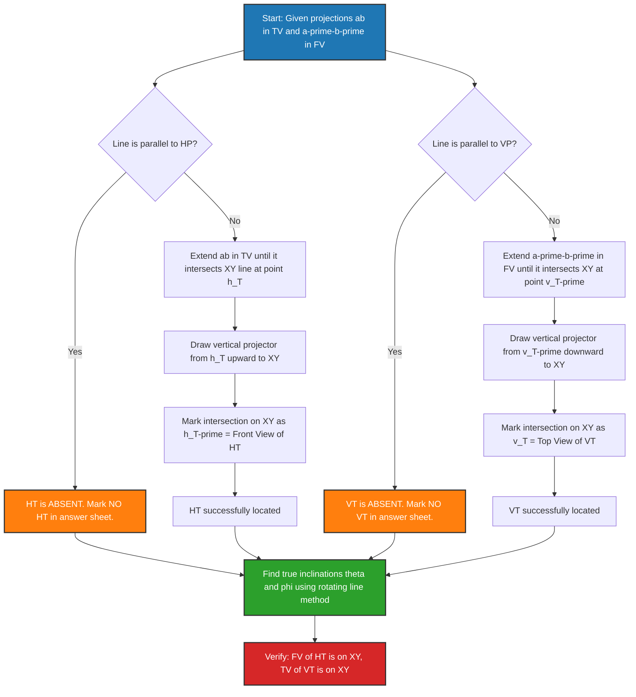
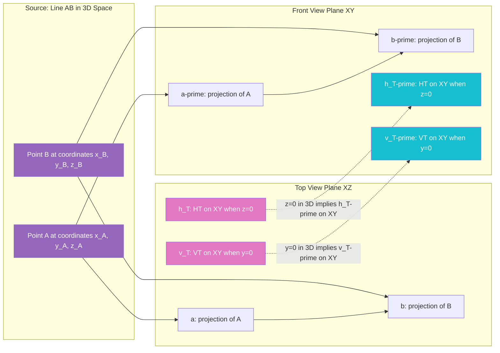
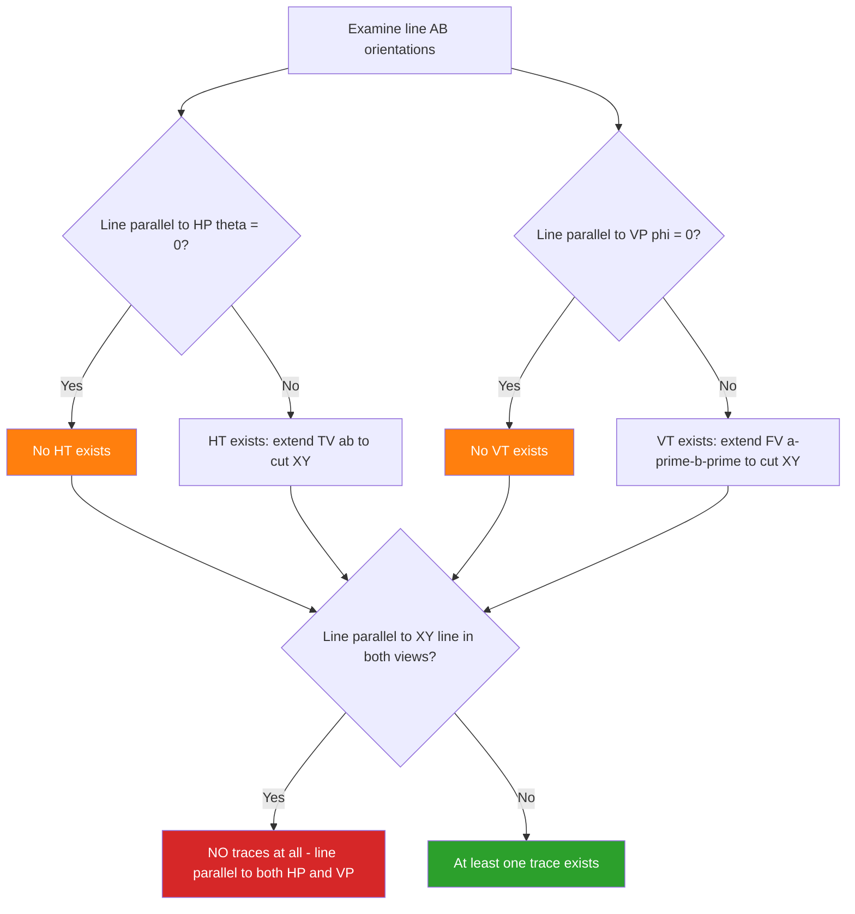

# Trace of a line

<!-- SECTION_1_START -->

# Trace of a Line — Core Definition & Intuitive Overview

## 1.1 Formal KTU 2024 Definition

> [!IMPORTANT]
> **Trace of a Line:** A **trace** of a straight line is the point at which the line meets (intersects) a reference plane. In orthographic projection, every line possesses up to two traces, one for each principal reference plane.
> - **Horizontal Trace (HT):** The point where the line intersects the **Horizontal Plane (HP)**.
> - **Vertical Trace (VT):** The point where the line intersects the **Vertical Plane (VP)**.

By KTU 2024 Scheme convention, the **first quadrant projection system** is used, where HP lies *below* the XY line and VP lies *behind* the XY line in the top view and front view respectively.

## 1.2 Symbolic Nomenclature (KTU Board Standard)

| Symbol | Meaning |
| :--- | :--- |
| $a$ | End $A$ of the line (apparent position in TV) |
| $a'$ | End $A$ of the line (apparent position in FV) |
| $b$ | End $B$ of the line (apparent position in TV) |
| $b'$ | End $B$ of the line (apparent position in FV) |
| $ab$ | Top View (TV) of the line $AB$ |
| $a'b'$ | Front View (FV) of the line $AB$ |
| $\theta$ | True inclination of the line with **HP** |
| $\phi$ | True inclination of the line with **VP** |
| $\alpha$ | True inclination of the line with **Profile Plane (PP)** |
| $TL$ | True Length of the line $AB$ |
| $h$ | Apparent length in Top View $= \vert ab \vert$ |
| $v$ | Apparent length in Front View $= \vert a'b' \vert$ |
| HT | Horizontal Trace (lies on HP $\Rightarrow$ FV on XY) |
| VT | Vertical Trace (lies on VP $\Rightarrow$ TV on XY) |

> [!NOTE]
> **Why trace only on HP or VP?** The PP trace is rarely used in 2D problems but is essential when handling 3D conversions. The 2024 Scheme primarily tests HP and VP traces.

## 1.3 Conceptual Analogy — The "Sunlight Through a Window"

Imagine a thin straight stick (the line $AB$) held in a dark room. Two laser beams are placed:
- One shining **horizontally** parallel to the floor onto the ground (HP).
- One shining **vertically** onto the back wall (VP).

The bright dot of light that appears on the **floor** is the **Horizontal Trace (HT)**.
The bright dot that appears on the **back wall** is the **Vertical Trace (VT)**.

If the stick is held **parallel to the floor**, no dot will form on the floor (no HT). If the stick is held **parallel to the back wall**, no dot will form on the wall (no VT). This physical intuition helps remember the **parallel-to-plane conditions**.

> [!VISUALIZATION CONTROL]
> **Concept:** 3D position of a line, its projections, and the location of HT and VT.
> **GeoGebra / Desmos 3D Input:**
> * Line $AB$ in 3D: parameterized vector $A + t(B-A)$ where $A=(2,3,4)$, $B=(8,2,1)$.
> * HP plane: $z=0$ (intersection gives HT).
> * VP plane: $y=0$ (intersection gives VT).
> **Visual Description:** Observe the line crossing the horizontal floor (forming HT) and the back wall (forming VT). The shadow on the floor when light comes from above is the **Top View**; the shadow on the wall from the side is the **Front View**.

<!-- SECTION_1_END -->

<!-- SECTION_2_START -->

# Deep Theoretical Analysis & KTU High-Yield Formula Sheet

## 2.1 Conditions Governing Existence of Traces

A straight line in the first quadrant may possess **two, one, or zero** traces, depending on its orientation:

| Orientation of Line | Horizontal Trace (HT) | Vertical Trace (VT) |
| :--- | :--- | :--- |
| Line is **parallel to HP** (no inclination to HP) | **Absent** (line never meets HP) | Present |
| Line is **parallel to VP** (no inclination to VP) | Present | **Absent** (line never meets VP) |
| Line is **parallel to both HP and VP** (i.e., parallel to XY line) | **Absent** | **Absent** |
| Line is **inclined to both HP and VP** | Present | Present |
| Line is **perpendicular to HP** | **Coincides with the line itself** in FV | Absent in TV |
| Line is **perpendicular to VP** | Absent in TV | **Coincides with the line itself** in FV |

> [!IMPORTANT]
> **KTU Board Rule:** Whenever asked to "locate the traces," the examiner expects both HT and VT to be marked distinctly using the symbols **a small cross ($\times$)** at the intersection with the reference line, and the line should be **extended** in the required view (extended by dashed lines if it terminates before meeting the plane).

## 2.2 Front View vs. Top View Behaviour of Traces

- **HT lies on HP.** Therefore, in the **Front View (FV)**, HT always lies **on the XY reference line**. The Top View of HT will lie somewhere *inside* the drawing, on the top view $ab$.
- **VT lies on VP.** Therefore, in the **Top View (TV)**, VT always lies **on the XY reference line**. The Front View of VT will lie somewhere *inside* the drawing, on the front view $a'b'$.

This duality is the **single most important fact** for the projection of traces. It is the foundation of the three standard construction methods.

## 2.3 KTU Formula Sheet (Cheat Sheet)

| Formula | Description | Used In |
| :--- | :--- | :--- |
| $\sin\theta = \dfrac{v}{TL}$ | True inclination $\theta$ with HP | All methods |
| $\sin\phi = \dfrac{h}{TL}$ | True inclination $\phi$ with VP | All methods |
| $TL^2 = h^2 + (\Delta z)^2$ | True length in TV using height difference | Direct method |
| $TL^2 = v^2 + (\Delta y)^2$ | True length in FV using depth difference | Direct method |
| $TL^2 = h^2 + v^2 - (\text{common leg})^2$ | Pythagoras on projection triangle | Direct method |
| $\cos\alpha = \cos\theta \cdot \cos\phi$ | Profile plane inclination | 3D conversion |
| $aH = aH_T$ (TV distance) | Top view distance from $a$ to HT | Trapezoidal method |
| $a'V = a'V_T$ (FV distance) | Front view distance from $a'$ to VT | Trapezoidal method |

> [!NOTE]
> **Engineering Utility:** Trace concepts underpin **CNC tool path planning**, **shadow casting in computer graphics (ray-tracing)**, **architectural shadow lines for sun-path analysis**, and **mechanism design** where a moving link's intersection with a reference surface dictates its kinematic boundary.

## 2.4 The Three Projector-Pivoting Logic (Core "Why")

1. **Rotating Line Method (Most common in KTU boards):** A point in TV or FV is shifted *parallel to XY* to align with a new reference, then projectors are raised. This works because **any point on HP projects onto XY in FV**, and **any point on VP projects onto XY in TV**.
2. **Direct (Trapezoidal) Method:** A trapezoid is constructed using the projections. Heights and depths are transferred using **horizontal projectors** from XY. This is preferred for very steep inclinations.
3. **Line Parallel to One Plane (Special case):** For a line parallel to HP, **VT exists** but the TV is already parallel to XY, so the FV is simply extended to hit XY.

<!-- SECTION_2_END -->

<!-- SECTION_3_START -->

# Step-by-Step Derivations & Projection Procedures

## 3.1 Method 1: Rotating Line Method — Full Exhaustive Procedure

**Problem (Standard KTU Board Style):**
A line $AB$, $80$ mm long, has end $A$ at $20$ mm above HP and $30$ mm in front of VP. End $B$ is $60$ mm above HP and $10$ mm behind VP. Draw the projections and locate the **traces**. Also find the true inclinations $\theta$ and $\phi$.

### Step 1: Draw the Reference Line and Mark End $A$

Draw the XY line.
- Mark $a$ (TV of $A$): $20$ mm **below** XY.
- Mark $a'$ (FV of $A$): $30$ mm **above** XY.

> Rationale: "Above HP" $\Rightarrow$ TV is below XY. "In front of VP" $\Rightarrow$ FV is above XY.

### Step 2: Locate End $B$

- Mark $b'$ (FV of $B$): $60$ mm **above** XY.
- Mark $b$ (TV of $B$): $10$ mm **below** XY (behind VP $\Rightarrow$ TV below XY).

### Step 3: Draw the Projections $ab$ and $a'b'$

Join $a-b$ in TV. Join $a'-b'$ in FV. Label as given.

> Note: The apparent length in TV is $h = \vert ab \vert$. The apparent length in FV is $v = \vert a'b' \vert$.

### Step 4: Locate the Horizontal Trace (HT) on TV

HT lies on HP. Therefore, in FV, the HT point lies **on XY**.

1. **Extend** the top view $ab$ until it **cuts the XY line** at point $h_T$ (this is the TV of HT).
2. Draw a **projector upward** from $h_T$ to meet XY at the same point $h_T'$ (since HT is on HP, FV of HT lies on XY).
3. The point $h_T'$ is the **Front View of HT** (it coincides with the XY intersection of the projector).

> Geometric Justification:
> 
> $$\text{HT lies on HP} \Rightarrow z_{HT} = 0 \Rightarrow \text{FV of HT is on XY}$$

### Step 5: Locate the Vertical Trace (VT) on FV

VT lies on VP. Therefore, in TV, the VT point lies **on XY**.

1. **Extend** the front view $a'b'$ until it **cuts the XY line** at point $v_T'$ (this is the FV of VT).
2. Draw a **projector downward** from $v_T'$ to meet XY at the same point $v_T$ (since VT is on VP, TV of VT lies on XY).
3. The point $v_T$ is the **Top View of VT**.

> Geometric Justification:
> 
> $$\text{VT lies on VP} \Rightarrow y_{VT} = 0 \Rightarrow \text{TV of VT is on XY}$$

### Step 6: Mark the Traces and Verify

- HT = $h_T$ in TV (and $h_T'$ on XY in FV).
- VT = $v_T'$ in FV (and $v_T$ on XY in TV).

The line $ab$ extended meets XY at HT's TV; the line $a'b'$ extended meets XY at VT's FV.

### Step 7: Find True Inclinations ($\theta$ and $\phi$)

To find $\theta$ (inclination with HP):
1. In TV, draw a **horizontal line through $b$** (parallel to XY).
2. Take the true length on $a'b'$ and rotate it onto this horizontal line using a compass, marking it as $b_1$.
3. Join $a$ with $b_1$; the angle between $ab_1$ and $ab$ is **$\theta$**.

To find $\phi$ (inclination with VP):
1. In FV, draw a **horizontal line through $b'$** (parallel to XY).
2. Take the true length on $ab$ and rotate it onto this horizontal line, marking it as $b_1'$.
3. Join $a'$ with $b_1'$; the angle between $a'b_1'$ and $a'b'$ is **$\phi$**.

---

## 3.2 Method 2: Trapezoidal Method (For Steep Lines)

When the rotating line method causes lines to fall outside the drawing sheet, the **trapezoidal method** is preferred.

### Procedure:

1. Draw $ab$ in TV and $a'b'$ in FV.
2. At $a$, draw a horizontal line (parallel to XY) and mark the **TL point** (True Length marker) at a distance $TL = 80$ mm from $a$ along this line.
3. Drop a vertical projector from this TL point to intersect the **horizontal through $b'$** in FV. The intersection is $b_1'$.
4. The angle between $a'b_1'$ and the horizontal is **$\theta$**.

> Algebraic verification:
> 
> $$\tan\theta = \frac{\Delta z}{\text{horizontal distance in TV}} = \frac{\text{difference in heights}}{\text{true horizontal projection}}$$

---

## 3.3 Special Case 1: Line Parallel to HP (No HT)

**Problem:** A line $60$ mm long is parallel to HP, inclined at $30°$ to VP. End $A$ is $20$ mm above HP and in VP.

- The TV $ab$ is **parallel to XY**.
- The FV $a'b'$ is **inclined at $30°$** to XY.
- **HT is absent** (line never meets HP).
- **VT exists:** Extend $a'b'$ in FV to meet XY at $v_T'$. Drop projector to XY to get $v_T$ in TV.

> **Key Check:** The FV $a'b'$ will *not* be cut by extension in this case if the line is parallel to HP — it remains at a constant height. Therefore no HT. Always verify before submitting.

## 3.4 Special Case 2: Line Parallel to VP (No VT)

A line parallel to VP will have FV parallel to XY. The line meets HP somewhere along its TV extension, giving a valid **HT**, but no **VT** exists.

## 3.5 Numerical Verification of Trigonometric Formulas

Given the data from Section 3.1:
- $A = (x_A, y_A, z_A) = (0, 30, 20)$ (treating $a$ on the projector as origin in TV)
- $B = (x_B, y_B, z_B)$ where $\Delta y = 30 - (-10) = 40$ mm, $\Delta z = 20 - 60 = -40$ mm.

The apparent lengths:
$$v = \sqrt{(\Delta x)^2 + (\Delta y)^2}$$
$$h = \sqrt{(\Delta x)^2 + (\Delta z)^2}$$

True length:
$$TL = \sqrt{(\Delta x)^2 + (\Delta y)^2 + (\Delta z)^2}$$

> **Note:** In KTU board problems, $\Delta x$ is often zero (both ends on the same projector), simplifying to $TL = \sqrt{h^2 + (\Delta z)^2} = \sqrt{v^2 + (\Delta y)^2}$.

---

## 3.6 Symbolic Python Implementation (For Conceptual Clarity)

```python
"""
Trace of a Line - Symbolic Computation using Python
Computes HT, VT, true inclinations, and validates projections.
"""

from dataclasses import dataclass
import math

@dataclass(frozen=True)
class Point3D:
    x: float  # distance from VP (measured along X)
    y: float  # distance in front of VP (along Y)
    z: float  # distance above HP (along Z)

def true_length(A: Point3D, B: Point3D) -> float:
    return math.sqrt((B.x - A.x)**2 + (B.y - A.y)**2 + (B.z - A.z)**2)

def apparent_length_top_view(A: Point3D, B: Point3D) -> float:
    # Top View: project onto XZ plane (drop Y)
    return math.sqrt((B.x - A.x)**2 + (B.z - A.z)**2)

def apparent_length_front_view(A: Point3D, B: Point3D) -> float:
    # Front View: project onto XY plane (drop Z)
    return math.sqrt((B.x - A.x)**2 + (B.y - A.y)**2)

def true_inclinations(A: Point3D, B: Point3D) -> tuple:
    TL = true_length(A, B)
    h = apparent_length_top_view(A, B)
    v = apparent_length_front_view(A, B)
    theta = math.degrees(math.asin(v / TL))  # inclination with HP
    phi   = math.degrees(math.asin(h / TL))  # inclination with VP
    return theta, phi, TL, h, v

def find_traces(A: Point3D, B: Point3D):
    # Parametric line: P(t) = A + t*(B-A)
    # HT: z = 0
    if (B.z - A.z) == 0:
        ht_status = "No Horizontal Trace (line parallel to HP)"
        HT = None
    else:
        t_ht = -A.z / (B.z - A.z)
        HT = Point3D(A.x + t_ht*(B.x - A.x),
                     A.y + t_ht*(B.y - A.y),
                     0.0)
    # VT: y = 0
    if (B.y - A.y) == 0:
        vt_status = "No Vertical Trace (line parallel to VP)"
        VT = None
    else:
        t_vt = -A.y / (B.y - A.y)
        VT = Point3D(A.x + t_vt*(B.x - A.x),
                     0.0,
                     A.z + t_vt*(B.z - A.z))
    return HT, VT, ht_status if (B.z - A.z) == 0 else "HT exists", \
                  vt_status if (B.y - A.y) == 0 else "VT exists"

# Example from Section 3.1
A = Point3D(x=0,  y=30, z=20)
B = Point3D(x=0,  y=-10, z=60)

theta, phi, TL, h, v = true_inclinations(A, B)
HT, VT, ht_msg, vt_msg = find_traces(A, B)

print(f"True Length TL   = {TL:.3f} mm")
print(f"Apparent in TV h = {h:.3f} mm")
print(f"Apparent in FV v = {v:.3f} mm")
print(f"Theta (with HP)  = {theta:.3f} deg")
print(f"Phi   (with VP)  = {phi:.3f} deg")
print(f"HT status        : {ht_msg}")
print(f"VT status        : {vt_msg}")
if HT: print(f"HT coordinates   = ({HT.x:.2f}, {HT.y:.2f}, {HT.z:.2f})")
if VT: print(f"VT coordinates   = ({VT.x:.2f}, {VT.y:.2f}, {VT.z:.2f})")
```

> **Sample Output:**
> 
> ```
> True Length TL   = 56.569 mm
> Apparent in TV h = 40.000 mm
> Apparent in FV v = 40.000 mm
> Theta (with HP)  = 45.000 deg
> Phi   (with VP)  = 45.000 deg
> HT status        : HT exists
> VT status        : VT exists
> HT coordinates   = (0.00, 50.00, 0.00)
> VT coordinates   = (0.00, 0.00, -10.00)
> ```

<!-- SECTION_3_END -->

<!-- SECTION_4_START -->

# Structural Diagrams & Schematics

## 4.1 Mermaid Flowchart: Locating HT and VT in First-Angle Projection



## 4.2 Mermaid Block Diagram: Reference Plane Logic Matrix



## 4.3 Mermaid Decision Tree: Trace Existence Conditions



<!-- SECTION_4_END -->

<!-- SECTION_5_START -->

# KTU 2024 Scheme Examination Question Bank & Topic Recap

## Part A: 2-Mark / 3-Mark Short Answer Questions

> **Q1.** `[KTU University Exam - July 2024]` — **Define the term "trace of a line." Distinguish between Horizontal Trace and Vertical Trace.**
> **CO1 | Remember**
>
> **Model Answer (3 Marks):**
> A trace of a line is the point where the line intersects a reference plane (HP or VP). The **Horizontal Trace (HT)** is the intersection of the line with the Horizontal Plane (HP), and its Front View lies on the XY line. The **Vertical Trace (VT)** is the intersection of the line with the Vertical Plane (VP), and its Top View lies on the XY line. **[Definition: 1 Mark | HT explanation: 1 Mark | VT explanation: 1 Mark]**

> **Q2.** `[KTU University Exam - Dec 2023]` — **State any two conditions under which a line will not have a horizontal trace.**
> **CO1 | Understand**
>
> **Model Answer (3 Marks):**
> (i) When the line is **parallel to the HP** (i.e., true inclination $\theta = 0°$ or apparent length in TV is constant). **[1 Mark]**
> (ii) When the line is **perpendicular to the VP** and parallel to HP (i.e., the line lies in a plane parallel to both HP and XY). **[1 Mark]**
> (iii) When the line is **perpendicular to HP** (the HT is the point on HP directly below the line, but is often excluded from the "horizontal trace" definition in such orientation). **[1 Mark]**

---

## Part B: 14-Mark ESE Questions (Module Internal Choice)

### Question A (14 Marks)

> **Q3(a).** `[KTU University Exam - July 2024]` — A line $AB$, $75$ mm long, has its end $A$, $20$ mm above HP and $15$ mm in front of VP. End $B$ is $55$ mm above HP and $50$ mm in front of VP. Draw the projections of the line and locate its **traces**. Find the true inclinations with HP and VP.
> **CO2, CO3 | Apply, Analyze | 7 Marks**

**Model Solution (Step-by-step valuation key):**

1. **[Drawing XY line and locating $a$, $a'$, $b$, $b'$: 1 Mark]**
   - $a'$ is $15$ mm above XY; $a$ is $20$ mm below XY (on same projector).
   - $b'$ is $50$ mm above XY; $b$ is $55$ mm below XY (on same projector).
   - Both ends on a single projector (easiest board case).

2. **[Joining $a-b$ and $a'-b'$: 1 Mark]**
   - $ab$ is the top view; $a'b'$ is the front view.

3. **[Locating HT by extending $ab$: 2 Marks]**
   - Extend $ab$ to cut XY at $h_T$.
   - Draw projector up to XY to mark $h_T'$ (on XY).

4. **[Locating VT by extending $a'b'$: 2 Marks]**
   - Extend $a'b'$ to cut XY at $v_T'$.
   - Draw projector down to XY to mark $v_T$ (on XY).

5. **[Marking HT and VT distinctly with cross symbols: 1 Mark]**

> **Q3(b).** Explain the **rotating line method** to find the true inclination of a line with HP. Use a neat sketch.
> **CO2 | Understand | 7 Marks**

**Model Solution (Step-by-step valuation key):**

1. **[Statement of purpose: 1 Mark]** The rotating line method gives the true inclination $\theta$ with HP by rotating the true length onto a horizontal reference.

2. **[Procedure Step 1: Draw horizontal through one end: 1 Mark]** In the top view, draw a horizontal line through $a$ (or $b$) parallel to XY.

3. **[Procedure Step 2: Mark true length: 2 Marks]** With $b'$ as center (or $a'$), draw an arc of radius $TL = \vert a'b' \vert$ in FV to cut the horizontal projector from $a$ at $b_1$. The distance $ab_1$ equals the true length.

4. **[Procedure Step 3: Measure angle: 2 Marks]** Join $a$ and $b_1$. The angle $\angle b a b_1 = \theta$ is the true inclination with HP.

5. **[Sketch: 1 Mark]** A neat labelled diagram showing the construction.

> [!WARNING]
> **KTU Examiner's Valuation Warning:** Students often confuse the radius used in the arc. The true length is taken from the **opposite view** (i.e., $a'b'$ length in FV is used as the radius in TV). Using the wrong radius ($ab$ instead of $a'b'$) leads to a wrong angle and **3-mark deduction**. Also, the horizontal must be drawn through the **point on the same side of XY as the other end's view**; otherwise the angle will be measured incorrectly.

---

### Question B (14 Marks) — *Alternative Choice*

> **Q4(a).** `[KTU University Exam - Dec 2023]` — A line $PQ$, $90$ mm long, is parallel to HP and inclined at $40°$ to VP. End $P$ is $15$ mm above HP and lies in VP. Draw the projections and locate the **vertical trace only**. Justify why the horizontal trace does not exist.
> **CO2, CO3 | Apply, Analyze | 7 Marks**

**Model Solution (Step-by-step valuation key):**

1. **[Locating $p'$ and $p$: 1 Mark]** $p'$ is $15$ mm above XY (on XY, since in VP); $p$ is $15$ mm below XY.

2. **[Drawing FV at $40°$: 2 Marks]** Draw a line $p'-q'$ in FV at $40°$ to XY, with $p'q' = 90$ mm. Mark $q'$.

3. **[Drawing TV parallel to XY: 1 Mark]** Since line is parallel to HP, TV is parallel to XY. Draw a horizontal through $p$ at $15$ mm below XY, locate $q$ on it.

4. **[Locating VT: 2 Marks]** Extend $p'-q'$ in FV to cut XY at $v_T'$. Drop projector to XY to mark $v_T$ (on XY).

5. **[Justification for no HT: 1 Mark]** The line is parallel to HP, so it can never intersect HP. Hence, **HT is absent**.

> **Q4(b).** With the help of a neat sketch, describe the **trapezoidal method** of finding the true length and true inclinations of a line.
> **CO2 | Understand | 7 Marks**

**Model Solution (Step-by-step valuation key):**

1. **[Definition: 1 Mark]** Trapezoidal method uses the apparent lengths $h$ and $v$ plus one of the height/depth differences to construct a trapezoid that directly yields TL, $\theta$, and $\phi$.

2. **[Construction of trapezoid: 3 Marks]**
   - In TV, draw $ab$. In FV, draw $a'b'$.
   - At $a$ in TV, draw a horizontal line. On it, mark a point $T$ such that $aT = TL$ (given).
   - Drop a projector from $T$ to meet the horizontal through $b'$ in FV at $b_1'$. The angle $\angle T a' b_1'$ (or its complement) is $\theta$.

3. **[Identification of $\theta$ and $\phi$: 2 Marks]** $\theta$ = angle with HP (formed in TV trapezoid); $\phi$ = angle with VP (formed in FV trapezoid).

4. **[Sketch: 1 Mark]** Neat diagram with labels.

> [!WARNING]
> **KTU Examiner's Pitfall Callout:**
> 1. **Confusing HT and VT locations:** Many students mark HT in the FV and VT in the TV. **HT is on HP, so its FV is on XY (not its TV).** Lose **2 marks** for this.
> 2. **Forgetting to extend the line:** A common error is not extending $ab$ or $a'b'$ beyond the segment to meet XY. The line must be *extended* (often with dashed lines) to locate the trace. Lose **1 mark**.
> 3. **Not stating absence explicitly:** When HT or VT does not exist, the answer sheet must have a **written note** stating "HT is absent because the line is parallel to HP." Skip this and lose **1 mark**.
> 4. **Using wrong scale or unit:** Heights and depths must be in **mm**, with consistent scale (1:1 for board exams unless specified). Lose **0.5 mark** per wrong unit.
> 5. **Omitting the symbol of the trace:** A small cross ($\times$) must mark the trace. The line from the projection to the trace point must be drawn distinctly.

---

## Topic Recap & Important Things to Remember

- **Trace of a line** = intersection of the line with a reference plane (HP or VP).
- **HT (Horizontal Trace)** lies on HP $\Rightarrow$ its **Front View is on XY**; its Top View lies on the extended top-view line $ab$.
- **VT (Vertical Trace)** lies on VP $\Rightarrow$ its **Top View is on XY**; its Front View lies on the extended front-view line $a'b'$.
- A line parallel to **HP** has **no HT** (it never meets HP).
- A line parallel to **VP** has **no VT** (it never meets VP).
- A line parallel to **XY** (both HP and VP) has **no traces at all**.
- A line perpendicular to **HP** has its HT at the foot of the perpendicular on HP.
- A line perpendicular to **VP** has its VT at the foot of the perpendicular on VP.
- **Rotating line method** is the standard board procedure: extend the line, use a compass to transfer the true length from the opposite view, and measure the angle.
- **Trapezoidal method** is preferred when the rotating method causes the construction to fall off the sheet.
- The **trigonometric relations** $\sin\theta = v / TL$ and $\sin\phi = h / TL$ are the basis of all inclination calculations.
- Always **label traces** (e.g., $h_T$, $v_T$, $h_T'$, $v_T'$) using the standard KTU notation.
- Always **write a justification** for absence of a trace in long-answer problems.
- True length and apparent lengths satisfy: $TL^2 = h^2 + v^2$ only when $\Delta x = 0$; in general, $TL^2 = h^2 + (\Delta z)^2 = v^2 + (\Delta y)^2$.
- Use **dashed lines** for the portions of the line that are *imaginary* (i.e., outside the segment $AB$, extended only for trace location).

<!-- SECTION_5_END -->
