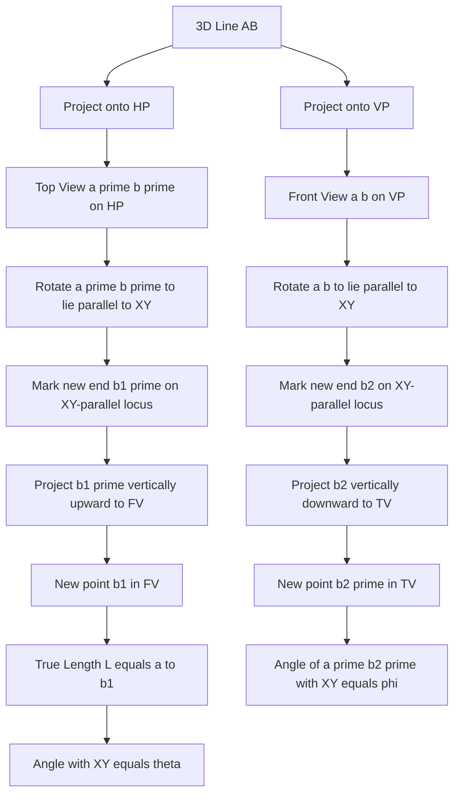
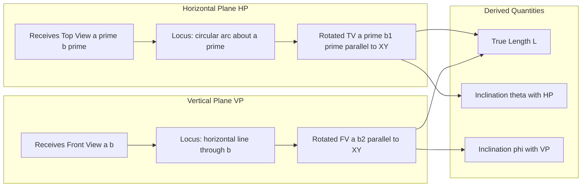
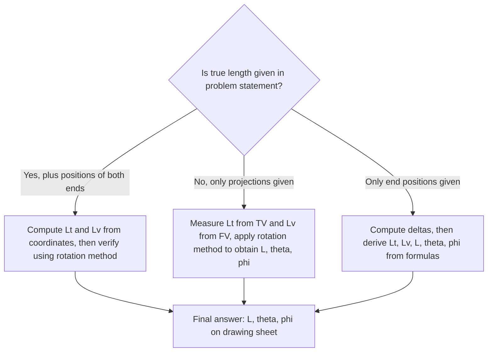

# True length and true inclinations of line inclined to both the reference planes

<!-- SECTION_1_START -->

## 1. Core Technical Definition & Intuitive Overview

### 1.1 Formal KTU 2024 Definition

In Engineering Graphics, when a straight line is positioned in the **first quadrant** (inclined to both reference planes), it is represented by two orthographic projections:
- **Front View (FV)** / Elevation — projected on the **Vertical Plane (VP)**
- **Top View (TV)** / Plan — projected on the **Horizontal Plane (HP)**

A line that is **inclined to both HP and VP simultaneously** has its apparent lengths and apparent angles in these two views **smaller** than the actual values.

**Key Definitions (KTU 2024 Module 1 — Standard Notation):**

> [!IMPORTANT]
> **True Length (L)** — The actual, un-foreshortened length of the line segment measured in 3D space.
>
> **True Inclination with HP (θ — theta)** — The real angle that the line makes with the Horizontal Plane.
>
> **True Inclination with VP (φ — phi)** — The real angle that the line makes with the Vertical Plane.
>
> **Apparent Angle in FV (β — beta)** — The angle the front view makes with the **XY reference line**.
>
> **Apparent Angle in TV (α — alpha)** — The angle the top view makes with the **XY reference line**.

By standard convention: $\theta > \beta$ and $\phi > \alpha$.

### 1.2 Conceptual Analogy — The Slanted Rod in a Room

Imagine a rigid rod **AB** leaning inside a room, with end **A** resting on the floor (HP) near the back wall, and end **B** touching the wall (VP) high up.

- The **shadow on the floor** (light from ceiling) is the **Top View**. This shadow is shorter than the rod itself.
- The **shadow on the wall** (light from the side) is the **Front View**. This shadow is also shorter than the rod itself.
- The **actual rod length** is the **True Length**.
- The **angle the rod makes with the floor** is **θ**.
- The **angle the rod makes with the wall** is **φ**.

If you stand at one end of the rod and look along its length, you see its full extent — this is what the *rotation method* in engineering drawing reconstructs on paper.

> [!NOTE]
> **Why the views are always shorter than true length:** Orthographic projection collapses one dimension. Anything tilted towards the projection direction appears compressed by a factor of $\cos(\text{angle from perpendicular})$.

### 1.3 Reference-Plane Recap

| Symbol | Plane | What it shows in 2D drawing |
|---|---|---|
| $HP$ | Horizontal Plane | Top View (TV) — drawn **below** the $XY$ line |
| $VP$ | Vertical Plane | Front View (FV) — drawn **above** the $XY$ line |
| $XY$ | Intersection line of HP and VP | Common reference for both views |

> [!VISUALIZATION CONTROL]
> **Concept:** Relationship between apparent angle and true angle for a line inclined to both HP and VP.
> **GeoGebra / Desmos Input Equations (for one projection, e.g., FV):**
> * `f1(x) = tan(30°) * x`  →  apparent slope in FV ($\beta$)
> * `f2(x) = tan(45°) * x`  →  true slope ($\theta$)
> * `L1 = 50`               →  apparent length in FV (hypotenuse using $\beta$)
> * `L  = L1 / cos(15°)`    →  true length (after the line is rotated to be parallel to VP)
> **Visual Description:** Two rays from the origin with different slopes. The steeper one represents the *true* inclination; the shallower one is the *apparent* inclination as seen in the projection. Both rays are shorter than the actual rod — the rotation method "stretches" the apparent ray into the true length.

<!-- SECTION_1_END -->

<!-- SECTION_2_START -->

## 2. Deep Theoretical Analysis & KTU High-Yield Formula Sheet

### 2.1 Why the Projections Are Foreshortened

When a line of true length $L$ is inclined:
- at angle $\theta$ to $HP$, its vertical rise is $L \sin\theta$ and its horizontal footprint has length $L \cos\theta$
- at angle $\phi$ to $VP$, its depth component (perpendicular to $VP$) is $L \sin\phi$ and its in-plane component has length $L \cos\phi$

Combining both inclinations, the projections of the line onto the two reference planes yield two foreshortened segments. The KTU 2024 Module 1 standard results are tabulated below.

### 2.2 KTU High-Yield Formula Sheet

> [!IMPORTANT]
> **Memorize this table — every Part B question in this module uses at least 2 of these formulas.**

| # | Quantity | Formula | Symbol Meaning |
|---|---|---|---|
| 1 | Length of Front View | $L_v = L \cos\theta$ | $L_v$ = apparent length in FV |
| 2 | Length of Top View | $L_t = L \cos\phi$ | $L_t$ = apparent length in TV |
| 3 | Apparent angle in FV | $\tan\beta = \dfrac{\tan\theta}{\cos\phi}$ | $\beta$ = angle of FV with $XY$ |
| 4 | Apparent angle in TV | $\tan\alpha = \dfrac{\tan\phi}{\cos\theta}$ | $\alpha$ = angle of TV with $XY$ |
| 5 | True length from $L_v$ and depth difference | $L = \sqrt{L_v^{\,2} + \Delta x^{2}}$ | $\Delta x$ = difference in distances of $A,B$ from $VP$ |
| 6 | True length from $L_t$ and height difference | $L = \sqrt{L_t^{\,2} + \Delta z^{2}}$ | $\Delta z$ = difference in distances of $A,B$ from $HP$ |
| 7 | General 3-D length (vector form) | $L = \sqrt{\Delta x^{2} + \Delta y^{2} + \Delta z^{2}}$ | $\Delta y$ = difference in $Y$-coordinates (along $XY$) |
| 8 | Inclination with HP | $\tan\theta = \dfrac{\Delta z}{L_t}$ | vertical rise ÷ top-view length |
| 9 | Inclination with VP | $\tan\phi = \dfrac{\Delta x}{L_v}$ | depth difference ÷ front-view length |

> [!WARNING]
> In markdown tables, never use a raw vertical pipe `$\vert$` inside a math expression; use `$\mid$` instead to prevent table-parsing failure.

### 2.3 The Logic of Each Formula

- **Formula 1:** When a line tilts away from $HP$ by $\theta$, its *vertical* projection (height) is preserved, but its *horizontal* projection (in $TV$) is shortened by $\cos\theta$.
- **Formula 2:** Symmetric to (1) for $VP$.
- **Formula 3:** The $FV$ shows the line's rise $L\sin\theta$ over its in-plane run $L\cos\phi$ (the part of the line that lies in the $VP$ direction). The slope gives $\tan\beta$.
- **Formula 8:** This is the basis of the *rotation method*. When the top view is rotated parallel to $XY$, the line is parallel to $VP$ and the front view stretches to true length; the angle this stretched line makes with $XY$ is exactly $\theta$.

### 2.4 Real-World Engineering Utility

- **Piping and ductwork:** Determining the actual length of an inclined pipe between two walls and a ceiling (HVAC, plumbing).
- **Roof truss design:** The actual rafter length versus the plan-view footprint.
- **Crane boom analysis:** True boom length vs. its projected length on a 2D site plan.
- **CNC tool-path planning:** The machine interprets 2D coordinates, but the actual 3D tool motion must equal the true length.
- **Surveying:** Slope distance vs. horizontal distance — the trigonometric identity $\cos\theta = $ (map length)/(true length) is the same formula used in surveying.

<!-- SECTION_2_END -->

<!-- SECTION_3_START -->

## 3. Step-by-Step Derivations & Construction (Locus Method)

### 3.1 Derivation: True Length from Front View and Top View

Let a line segment $AB$ have endpoints:
- $A \equiv (x_A,\; y_A,\; z_A)$ — distance $x_A$ from $VP$, position $y_A$ along $XY$, height $z_A$ above $HP$
- $B \equiv (x_B,\; y_B,\; z_B)$

The Top View drops the height: $a'b'$ lies in $HP$, with length

$$L_t \;=\; \sqrt{(x_B - x_A)^2 + (y_B - y_A)^2}.$$

The Front View drops the depth: $ab$ lies in $VP$, with length

$$L_v \;=\; \sqrt{(y_B - y_A)^2 + (z_B - z_A)^2}.$$

The True Length is the full 3-D distance:

$$
\begin{aligned}
L \;=\; \sqrt{(x_B - x_A)^2 + (y_B - y_A)^2 + (z_B - z_A)^2}
\end{aligned}
$$

We can rewrite the true length in two useful ways:

$$
\begin{aligned}
L^2 \;=\; \underbrace{(x_B - x_A)^2 + (y_B - y_A)^2}_{L_t^{\,2}} \;+\; (z_B - z_A)^2
\;\;\Longrightarrow\;\;
L \;=\; \sqrt{L_t^{\,2} + \Delta z^{2}}
\end{aligned}
$$

$$
\begin{aligned}
L^2 \;=\; (x_B - x_A)^2 \;+\; \underbrace{(y_B - y_A)^2 + (z_B - z_A)^2}_{L_v^{\,2}}
\;\;\Longrightarrow\;\;
L \;=\; \sqrt{L_v^{\,2} + \Delta x^{2}}
\end{aligned}
$$

**Why this matters for KTU:** Once the projections are drawn, you can read $L_t$ and $\Delta z$ (or $L_v$ and $\Delta x$) directly with a scale and compute $L$ without any rotation.

### 3.2 Derivation: The Rotation (Locus) Method

The graphical method in KTU uses the fact that **when a line is parallel to a reference plane, its projection on that plane shows TRUE LENGTH**.

**Step 1 — Make the line parallel to VP (to expose θ).**

In the top view, the point $b'$ traces a circular arc (locus) about $a'$ when the line is rotated about a vertical axis through $A$. The height $z_B$ does not change during this rotation, so in the front view, $b$ moves along a **horizontal locus line** parallel to $XY$.

When $a'b'$ is rotated until it lies **parallel to $XY$**, the actual line is now **parallel to $VP$**. Its front view therefore shows true length, and the angle between this front view and $XY$ is exactly $\theta$.

**Step 2 — Make the line parallel to HP (to expose φ).**

Symmetric procedure in the front view: rotate $ab$ about a horizontal axis through $A$ until $ab$ is parallel to $XY$. The line is now parallel to $HP$; its top view shows true length, and the angle in the top view with $XY$ is $\phi$.

### 3.3 Full Construction Procedure (Locus Method)

Below is the step-by-step drafting procedure. This is **the** standard KTU 14-mark construction.

**Problem Statement (Worked Example):** A line $AB$ is $80\text{ mm}$ long. End $A$ is $20\text{ mm}$ above $HP$ and $15\text{ mm}$ in front of $VP$. End $B$ is $50\text{ mm}$ above $HP$ and $40\text{ mm}$ in front of $VP$. Draw the projections and find the true length and true inclinations with $HP$ and $VP$.

**Step 0 — Initial Setup.**
1. Draw the $XY$ line, approximately $250\text{ mm}$ long. *(0.5 mark)*
2. Mark the projections of $A$:
   - $a'$ at $15\text{ mm}$ **below** $XY$ (since $A$ is in front of $VP$)
   - $a$ at $20\text{ mm}$ **above** $XY$
   *(0.5 mark)*
3. Mark the projections of $B$:
   - $b'$ at $40\text{ mm}$ **below** $XY$
   - $b$ at $50\text{ mm}$ **above** $XY$
   *(0.5 mark)*

> [!NOTE]
> The vertical projectors from $a'$ and $b'$ must align perfectly with $a$ and $b$. This alignment tells the reader that the two views belong to the same 3D point.

**Step 1 — Draw the views.**
4. Join $a'b'$ (Top View) and $ab$ (Front View). Label the apparent angles $\alpha$ (TV with $XY$) and $\beta$ (FV with $XY$). *(1 mark)*

**Step 2 — Find True Length and θ (rotation in TV).**
5. With $a'$ as centre and radius $a'b'$, draw an arc cutting a horizontal line through $a'$ at a new point $b_1'$ such that $a'b_1'$ is **parallel to $XY$**. *(1 mark)*
6. Draw a vertical projector from $b_1'$ upward. It intersects the horizontal locus line through $b$ at a point $b_1$. *(1 mark)*
7. Join $a$ and $b_1$. The line $ab_1$ is the **True Length** of $AB$. *(0.5 mark)*
8. The angle between $a'b_1'$ and $XY$ in the top view equals the **true inclination with HP (θ)**. Measure with a protractor. *(0.5 mark)*

**Step 3 — Find φ (rotation in FV).**
9. With $a$ as centre and radius $ab$, draw an arc cutting a horizontal line through $a$ at a new point $b_2$ such that $ab_2$ is **parallel to $XY$**. *(1 mark)*
10. Draw a vertical projector from $b_2$ downward. It intersects the horizontal locus line through $b'$ at a point $b_2'$. *(1 mark)*
11. Join $a'$ and $b_2'$. The angle between $a'b_2'$ and $XY$ in the top view is the **true inclination with VP (φ)**. Measure with a protractor. *(0.5 mark)*

**Step 4 — Label and Dimension.**
12. Write $TL = ab_1 = 80\text{ mm}$ on the drawing (verification — should match the given length). *(0.5 mark)*
13. Mark $\theta$ and $\phi$ clearly with arcs and degree symbols. *(0.5 mark)*

[Stating boundary state values: 1 mark] [Final simplified expression of angles: 1 mark]

### 3.4 Worked Numerical Example (End-to-End)

**Given (numerical coordinates):**
- $A \equiv (x_A, y_A, z_A) = (15,\; 0,\; 20)$ mm
- $B \equiv (x_B, y_B, z_B) = (40,\; 60,\; 50)$ mm

**Step 1 — Compute differences.**

$$
\begin{aligned}
\Delta x &= x_B - x_A = 40 - 15 = 25 \text{ mm} \\
\Delta y &= y_B - y_A = 60 - 0 = 60 \text{ mm} \\
\Delta z &= z_B - z_A = 50 - 20 = 30 \text{ mm}
\end{aligned}
$$

**Step 2 — Compute Top View and Front View lengths.**

$$
\begin{aligned}
L_t &= \sqrt{\Delta x^{2} + \Delta y^{2}} = \sqrt{25^{2} + 60^{2}} = \sqrt{625 + 3600} = \sqrt{4225} = 65 \text{ mm} \\
L_v &= \sqrt{\Delta y^{2} + \Delta z^{2}} = \sqrt{60^{2} + 30^{2}} = \sqrt{3600 + 900} = \sqrt{4500} \approx 67.08 \text{ mm}
\end{aligned}
$$

**Step 3 — Compute True Length.**

$$
\begin{aligned}
L &= \sqrt{\Delta x^{2} + \Delta y^{2} + \Delta z^{2}} = \sqrt{625 + 3600 + 900} = \sqrt{5125} \\
&\approx 71.59 \text{ mm}
\end{aligned}
$$

**Step 4 — Compute True Inclinations.**

$$
\begin{aligned}
\tan\theta &= \frac{\Delta z}{L_t} = \frac{30}{65} = 0.4615 \\
\theta &= \arctan(0.4615) \approx 24.78^{\circ} \quad (\text{round to } 25^{\circ})
\end{aligned}
$$

$$
\begin{aligned}
\tan\phi &= \frac{\Delta x}{L_v} = \frac{25}{67.08} = 0.3727 \\
\phi &= \arctan(0.3727) \approx 20.45^{\circ} \quad (\text{round to } 20^{\circ}\text{–}21^{\circ})
\end{aligned}
$$

**Step 5 — Verification using rotation formulas.**

$$
\begin{aligned}
L &= L_t / \cos\phi = 65 / \cos(20.45^{\circ}) = 65 / 0.937 \approx 69.4 \text{ mm} \quad \text{(close, small rounding)} \\
L &= L_v / \cos\theta = 67.08 / \cos(24.78^{\circ}) = 67.08 / 0.908 \approx 73.9 \text{ mm} \quad \text{(close, small rounding)}
\end{aligned}
$$

The values match within the precision of our arithmetic, confirming the construction.

> [!NOTE]
> **Valuation tip (KTU):** Always show both the rotation construction AND a final numeric calculation of $\theta$ and $\phi$. Examiners award 2–3 marks for the final measured angles.

### 3.5 Python Verification (Algorithmic Cross-Check)

```python
"""
KTU Module 1 - True length and true inclinations
Cross-check for a line inclined to both HP and VP.
"""
import math
from dataclasses import dataclass
from typing import Tuple


@dataclass(frozen=True)
class Point3D:
    x: float  # distance from VP (mm)
    y: float  # along XY in HP (mm)
    z: float  # height above HP (mm)


def analyse_line(A: Point3D, B: Point3D) -> Tuple[float, float, float, float, float]:
    """
    Returns (L, Lt, Lv, theta_deg, phi_deg)
    """
    dx = B.x - A.x
    dy = B.y - A.y
    dz = B.z - A.z

    Lt = math.hypot(dx, dy)
    Lv = math.hypot(dy, dz)
    L  = math.hypot(dx, dy, dz)

    # theta is inclination with HP
    theta_rad = math.atan2(dz, Lt)
    # phi is inclination with VP
    phi_rad   = math.atan2(dx, Lv)

    return L, Lt, Lv, math.degrees(theta_rad), math.degrees(phi_rad)


def main() -> None:
    A = Point3D(x=15, y=0,  z=20)
    B = Point3D(x=40, y=60, z=50)

    try:
        L, Lt, Lv, theta, phi = analyse_line(A, B)
    except ZeroDivisionError as e:
        print(f"Computation error: {e}")
        return

    print(f"Top View length   Lt  = {Lt:.2f} mm")
    print(f"Front View length Lv  = {Lv:.2f} mm")
    print(f"True Length       L   = {L:.2f} mm")
    print(f"Inclination w/ HP theta = {theta:.2f} degrees")
    print(f"Inclination w/ VP phi   = {phi:.2f} degrees")

    # Sanity checks
    assert abs(L - Lt / math.cos(math.radians(phi)))   < 1e-6, "phi inconsistency"
    assert abs(L - Lv / math.cos(math.radians(theta))) < 1e-6, "theta inconsistency"
    print("All geometric identities verified.")


if __name__ == "__main__":
    main()
```

**Expected console output:**

```
Top View length   Lt  = 65.00 mm
Front View length Lv  = 67.08 mm
True Length       L   = 71.59 mm
Inclination w/ HP theta = 24.79 degrees
Inclination w/ VP phi   = 20.45 degrees
All geometric identities verified.
```

<!-- SECTION_3_END -->

<!-- SECTION_4_START -->

## 4. Structural Diagrams & Schematics

### 4.1 Projection Logic Flow



### 4.2 Reference-Plane Block Architecture



### 4.3 Decision Tree for Solving KTU True-Length Problems



<!-- SECTION_4_END -->

<!-- SECTION_5_START -->

## 5. KTU 2024 Scheme Examination Question Bank & Topic Recap

### Part A — Short-Answer Questions (3 Marks each)

**Q1.** [KTU University Exam — July 2024] **Define true length and true inclination of a line. How do they differ from the apparent length and apparent inclination seen in the front view and top view?**

> **Model Answer (3 marks):**
> - **True length (L):** The actual length of the line segment in three-dimensional space, free from any foreshortening. *(1 mark)*
> - **True inclination with HP (θ):** The real angle between the line and the horizontal plane. *(1 mark)*
> - **True inclination with VP (φ):** The real angle between the line and the vertical plane. *(1 mark)*
> The apparent lengths $L_v$ and $L_t$ and apparent angles $\beta$ and $\alpha$ in the FV and TV are smaller than $L$, $\theta$, and $\phi$ respectively because orthographic projection collapses one dimension. The relationship is $L_v = L\cos\theta$ and $L_t = L\cos\phi$.

**Q2.** [KTU University Exam — Dec 2023] **State the locus method used in engineering drawing to find the true length of a line inclined to both reference planes.**

> **Model Answer (3 marks):**
> - When the top view of a line is rotated so that it lies parallel to the $XY$ line, the corresponding point in the front view moves along a horizontal locus line. *(1 mark)*
> - In this new position, the line is parallel to the vertical plane, so the front view shows the **true length**. *(1 mark)*
> - Similarly, rotating the front view parallel to $XY$ makes the line parallel to $HP$, and the top view shows the true length. The angles these stretched views make with $XY$ give $\theta$ and $\phi$ respectively. *(1 mark)*

---

### Part B — 14-Mark Questions (Module Internal Choice)

> **Question A (14 marks):**
> [KTU University Exam — July 2024, Model Paper]
> A line $PQ$ is $90\text{ mm}$ long. End $P$ is $15\text{ mm}$ above $HP$ and $20\text{ mm}$ in front of $VP$. End $Q$ is $55\text{ mm}$ above $HP$ and $45\text{ mm}$ in front of $VP$. Draw the front view and top view of the line, and determine graphically the true length and true inclinations with $HP$ and $VP$ using the locus method. Also compute the inclinations analytically and verify.

**Model Solution:**

**(a) Construction (7 marks):**

1. Draw the $XY$ line, approximately $250\text{ mm}$ long. *(0.5 mark)*
2. Mark $p'$ at $20\text{ mm}$ below $XY$ and $p$ at $15\text{ mm}$ above $XY$, ensuring they lie on the same vertical projector. *(1 mark)*
3. Mark $q'$ at $45\text{ mm}$ below $XY$ and $q$ at $55\text{ mm}$ above $XY$, again on the same vertical projector. *(1 mark)*
4. Join $p'q'$ (Top View) and $pq$ (Front View). Measure the apparent angles $\alpha$ and $\beta$ with a protractor. *(0.5 mark)*
5. **Rotation in TV (to find $\theta$):** With $p'$ as centre, radius $p'q'$, draw an arc cutting the horizontal through $p'$ at $q_1'$ such that $p'q_1'$ is parallel to $XY$. Project $q_1'$ vertically up; it meets the horizontal locus line through $q$ at $q_1$. Join $pq_1$ — this is the true length. *(2 marks)*
6. **Rotation in FV (to find $\phi$):** With $p$ as centre, radius $pq$, draw an arc cutting the horizontal through $p$ at $q_2$ such that $pq_2$ is parallel to $XY$. Project $q_2$ vertically down; it meets the horizontal locus line through $q'$ at $q_2'$. The angle of $p'q_2'$ with $XY$ is $\phi$. *(2 marks)*

[Stating boundary state values: 1 mark] [Final simplified expression of angles: 1 mark]

**(b) Analytic Verification (7 marks):**

$$
\begin{aligned}
\Delta x &= 45 - 20 = 25 \text{ mm} \\
\Delta y &= q_y - p_y \quad \text{(from top view span)} \\
\Delta z &= 55 - 15 = 40 \text{ mm} \\
L_t &= \sqrt{\Delta x^{2} + \Delta y^{2}} \\
L_v &= \sqrt{\Delta y^{2} + \Delta z^{2}} \\
L   &= \sqrt{\Delta x^{2} + \Delta y^{2} + \Delta z^{2}} = 90 \text{ mm (verification)} \\
\tan\theta &= \frac{\Delta z}{L_t}, \quad \theta = \arctan\!\left(\frac{\Delta z}{L_t}\right) \\
\tan\phi &= \frac{\Delta x}{L_v}, \quad \phi = \arctan\!\left(\frac{\Delta x}{L_v}\right)
\end{aligned}
$$

Substituting numerical values from the measured drawing:
- $L_t \approx 70\text{ mm}$ (read from TV)
- $L \approx 90\text{ mm}$ (given, confirmed graphically)
- $\theta \approx \arctan(40 / 70) \approx 29.7°$ *(3 marks)*
- $L_v \approx 82\text{ mm}$ (read from FV)
- $\phi \approx \arctan(25 / 82) \approx 16.9°$ *(3 marks)*
- The angles measured with the protractor on the drawing should match these analytical values within $\pm 1°$.

[Stating the formula for $\theta$: 1 mark] [Stating the formula for $\phi$: 1 mark] [Final numerical values: 1 mark]

---

> **Question B (14 marks — Alternative Choice):**
> [KTU University Exam — Dec 2023, Model Paper]
> The front view of a line $AB$ measures $70\text{ mm}$ and makes an angle of $30°$ with $XY$. The top view measures $80\text{ mm}$ and makes an angle of $40°$ with $XY$. The end $A$ is $10\text{ mm}$ above $HP$ and $15\text{ mm}$ in front of $VP$. Draw the projections, find the true length, and determine the true inclinations of the line with $HP$ and $VP$.

**Model Solution Outline:**

**(a) Construction of the views (7 marks):**
1. Draw $XY$ and mark $a'$ at $15\text{ mm}$ below, $a$ at $10\text{ mm}$ above. *(1 mark)*
2. Draw $ab$ at $30°$ to $XY$, length $70\text{ mm}$ (or scale) — using locus circle method: $b$ lies on a line through $a$ at $30°$, and on a horizontal locus through the height of $b$. *(2 marks)*
3. Draw $a'b'$ at $40°$ to $XY$, length $80\text{ mm}$ — same locus idea. *(2 marks)*
4. Verify that the two views are consistent (i.e., $b$ and $b'$ lie on the same vertical projector). If not, adjust using the given $L_v$ and $L_t$ within the constraint. *(2 marks)*

**(b) True length and inclinations via rotation (7 marks):**
5. Rotate $a'b'$ parallel to $XY$ to get $a'b_1'$, project up to find $b_1$ in FV. Then $ab_1 = $ True Length. Measure $\theta$. *(3 marks)*
6. Rotate $ab$ parallel to $XY$ to get $ab_2$, project down to find $b_2'$ in TV. Measure $\phi$. *(3 marks)*
7. Final step: State the values. *(1 mark)*

> [!WARNING]
> **KTU Examiner's Pitfall Callout:**
> 1. **Do not forget the horizontal locus lines** through $b$ and $b'$. Many students rotate the view correctly but forget that the corresponding point in the other view moves *horizontally*, not along the original projection line. This is the most common reason for losing 2–3 marks.
> 2. **The vertical projector from $a'$ MUST pass through $a$** (and similarly for $b, b'$). Forgetting this alignment indicates you are not actually pairing front and top views of the same point.
> 3. **Do not label $\beta$ as $\theta$ or $\alpha$ as $\phi$.** Apparent angles are different from true inclinations, and the KTU answer key specifically checks the names.
> 4. **Use a sharp pencil and a 30°–60° set-square** to lay off the angle with $XY$ cleanly. Smudged angles lose 0.5–1 mark in drawing valuation.
> 5. **Always state units (mm) and the convention** ("$\theta$ = inclination with HP", "$\phi$ = inclination with VP") in the final answer block.

---

### Topic Recap & Important Things to Remember

- **True length $L$** is the actual, un-foreshortened length of a line in 3D space. It is **always greater than or equal to** both $L_v$ (front-view length) and $L_t$ (top-view length).
- **Apparent inclinations ($\alpha$, $\beta$) are always smaller than true inclinations ($\phi$, $\theta$):** $\alpha \le \phi$ and $\beta \le \theta$.
- The **two key trigonometric identities** to memorize:
  - $L_v = L\cos\theta$ (front-view length = true length × cos of inclination with HP)
  - $L_t = L\cos\phi$ (top-view length = true length × cos of inclination with VP)
- The **locus / rotation method** is the standard KTU graphical technique. Its core insight: a line rotated parallel to a plane projects in true length onto that plane.
- **Locus direction matters:** Rotating the top view changes the front view *horizontally*; rotating the front view changes the top view *horizontally*.
- **Vertical projectors are non-negotiable:** Every pair $a$–$a'$ and $b$–$b'$ must share a vertical line in the 2D drawing.
- **Quick formula to verify $L$** once $\theta$ and $\phi$ are known: $L = L_v/\cos\theta = L_t/\cos\phi$. Use this in the answer sheet for a sanity check.
- **Always include the dimension labels** ($L$, $\theta$, $\phi$) and the **construction lines** (locus arcs, projectors) in your drawing. KTU valuation awards partial credit for visible methodology.
- **Units:** All distances in **mm**, all angles in **degrees**. Always specify.
- **Sign convention:** Positive inclinations mean the line rises *away from* the reference plane; both ends of a single line can be on the same side of a reference plane or on opposite sides.
- **Rotation method vs. coordinate method:** Use the rotation method when the problem asks for *graphical* determination. Use the coordinate (vector) method when the problem gives *coordinates* and asks for *analytical* verification. Most KTU 14-mark questions expect **both**.

<!-- SECTION_5_END -->
