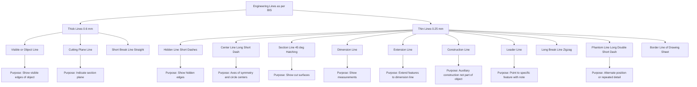
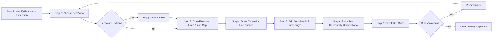
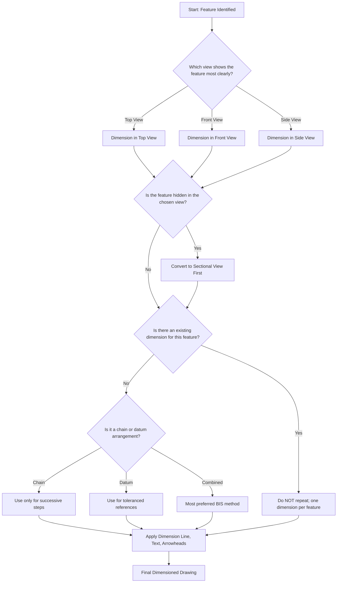

# Types of lines, Dimensioning, BIS code of practice

<!-- SECTION_1_START -->
# Engineering Graphics & CAD: Lines, Dimensioning & BIS Conventions

> [!NOTE]
> **Module Focus:** This module establishes the universal *language of engineering drawing*. Every line you draw, every dimension you write, must follow the **Bureau of Indian Standards (BIS)** so that any engineer anywhere in the world can read your drawing without ambiguity.

## 1.1 Types of Lines (As per BIS: IS 10714 & IS 696)

### Formal Definition
A **line** in engineering drawing is a graphical primitive used to represent edges, contours, hidden features, axes, sectioning, and dimensional data. The **BIS Code of Practice** classifies lines by their **type (continuous, dashed, chain), thickness (thick/thin), and purpose (visible, hidden, center, section, etc.)**. All line types have specific, non-interchangeable meanings.

> [!IMPORTANT]
> **Syllabus Highlight:** You must memorize the *exact* line type, thickness ratio, and application of at least 10 standard lines. KTU board examiners frequently ask 3-mark questions like *"List any six types of lines with their applications."*

### Conceptual Analogy — "The Grammar of Drawings"
Think of an engineering drawing as a **language**:
- **Lines** = the *alphabet* (each shape has one meaning)
- **Views** = the *sentences* (orthographic projections)
- **Dimensioning** = the *grammar* (rules of communication)

Just as the letter "A" means one thing in English, a **continuous thick line** always means a **visible edge** — never a hidden feature. If you mix them up, the drawing becomes a foreign language nobody can read.

### The 10 Standard Line Types (BIS Sp 46 / IS 10714)

| # | Line Name | Appearance | Thickness | Application |
|---|-----------|------------|-----------|-------------|
| 1 | **Visible / Object line** | Continuous | **Thick (≈ 0.5 mm – 0.7 mm)** | Visible edges and outlines of an object |
| 2 | **Hidden line** | Short dashes, evenly spaced | Thin (≈ 0.25 mm) | Edges hidden from view |
| 3 | **Center line** | Long dash – short dash – long dash | Thin | Axes of symmetry, centers of circles |
| 4 | **Section line (Hatching)** | Continuous, drawn at **45°** | Thin | Indicates cut surfaces in sectional views |
| 5 | **Dimension line** | Continuous, broken in the middle for text | Thin | Shows measurements |
| 6 | **Extension line** | Continuous, with a small gap from the object | Thin | Extends from the feature to the dimension line |
| 7 | **Construction line** | Continuous, very light | Thin (faintest) | Auxiliary lines for construction; not part of final drawing |
| 8 | **Cutting Plane line** | Chain line (long dash – double short dash), thick at ends and at every change of direction | Thick | Indicates where a section is taken |
| 9 | **Break line** | Continuous, freehand wavy (short breaks) / straight with zig-zag (long breaks) | Thick or Thin | Shows an imaginary break to shorten the object |
| 10 | **Phantom line** | Long dash – double short dash | Thin | Indicates alternate position, repeated detail, or adjacent part |

> [!TIP]
> **Mnemonic to remember the order of line precedence (when overlapping):**
> *Visible > Hidden > Center > Section > Dimension > Extension > Cutting Plane > Break > Phantom > Construction*

### Geometric Visualization

> [!VISUALIZATION CONTROL]
> **Concept:** Line Type Identification
> **GeoGebra / Desmos Input Equations:**
> * Sample point sequence 1 (Visible line): $(0,0)$ to $(10,0)$ — solid
> * Sample point sequence 2 (Hidden line): dashes at intervals of **2 mm**
> * Sample point sequence 3 (Center line): pattern **10 mm long, 2 mm gap, 2 mm dash, 1 mm gap**
> **Visual Description:** Notice how the **line thickness ratio** between thick and thin lines is consistently **2:1**. The thick line is approximately **0.5–0.7 mm**; the thin line is approximately **0.25 mm**.

---

## 1.2 Dimensioning — The Language of Size

### Formal Definition
**Dimensioning** is the process of adding precise numerical values (lengths, angles, radii, etc.) to a drawing so that the size and location of every feature of the object is unambiguously communicated. BIS specifies the rules in **IS 2709** and **IS 10714 (Part 14)**.

> [!IMPORTANT]
> **Core Principle (BIS Rule):** *Dimensioning should be done in such a way that it is possible to manufacture the object directly from the drawing without any calculations.*

### Conceptual Analogy — "Giving Directions to a Carpenter"
Imagine you're telling a carpenter: *"Cut a wooden plank 1200 mm long and 300 mm wide."* You have just given **functional dimensions**. Now if you also say *"Draw a circle 50 mm from the left edge"*, you've given a **location dimension**. Dimensioning works exactly this way:
- **Size dimensions** → *how big?*
- **Location dimensions** → *where exactly?*

### Key Elements of a Dimension
1. **Dimension line** — thin continuous line with arrowheads at both ends
2. **Extension lines (Witness lines)** — thin lines projecting from the feature
3. **Arrowheads** — solid filled triangles, ~3 mm long
4. **Dimension text** — placed centrally, **above** the dimension line (unidirectional) or **broken** through it (aligned)
5. **Leader line** — inclined thin line to dimension features like radii, chamfers, notes

### Two Systems of Dimensioning

| System | Placement of Text | Reading Direction | BIS Preference |
|--------|-------------------|-------------------|----------------|
| **Aligned System** | Text parallel to the dimension line | Read from the **right side** of the drawing or from the **bottom** | Used in *architectural* drawings |
| **Unidirectional System** | Text **horizontal** on the sheet | All read from the **bottom** of the sheet | **Preferred for engineering** (BIS) |

> [!NOTE]
> **KTU Exam Tip:** KTU almost always expects the **Unidirectional System** unless specifically asked otherwise. Always write dimensions in **mm without the unit symbol** (e.g., write `120`, NOT `120 mm`).

### Types of Dimensioning Arrangements

| Arrangement | Best Used For | Description |
|-------------|---------------|-------------|
| **Chain (Serial)** | Where each feature is a successive step | Dimensions arranged in a straight line, end to end |
| **Parallel (Datum)** | Where features are referenced from one base surface | All dimensions measured from a common datum |
| **Combined** | Most engineering components | Mix of chain and parallel — most preferred |
| **Coordinate** | Holes on a plate | Dimensions given using X and Y coordinates from an origin |
| **Progressive** | Avoid (creates accumulation errors) | Continuous chain — discouraged by BIS |

> [!VISUALIZATION CONTROL]
> **Concept:** Dimensioning Systems Comparison
> **GeoGebra / Desmos Input Equations:**
> * Object edge: rectangle from $(0,0)$ to $(20,8)$
> * Chain dimension lines: $x = 0, x = 5, x = 12, x = 20$ on $y = -1.5$
> * Parallel (datum) dimension lines: $y = -1.5, y = -3$ with common $x=0$ reference
> **Visual Description:** In *chain*, errors compound; in *parallel*, each dimension is independent and any single error doesn't propagate.

---

## 1.3 BIS Code of Practice — The Rule Book

### Formal Definition
The **Bureau of Indian Standards (BIS)** publishes a series of codes that govern the preparation, presentation, and reproduction of engineering drawings. These are aligned with **ISO (International Organization for Standardization)** standards, ensuring global uniformity.

### Key BIS Codes for Engineering Drawing

| Code | Title | Scope |
|------|-------|-------|
| **IS 696** | Code of practice for general engineering drawings | Lines, scales, layout, lettering, projections |
| **IS 10714** | General principles of presentation in technical drawings | Line types, dimensioning, sectional views |
| **IS 2709** | Dimensioning of technical drawings | Rules for placing dimensions |
| **IS 8000** | Technical drawing — general principles | Equivalent to ISO 128 |
| **IS 11669** | Sizes and layout of drawing sheets | Sheet sizes A0 to A5 |
| **IS 962** | Code of practice for engineering drawing (CAD) | Standards for computer-aided drafting |
| **SP 46** | Engineering drawing practice for schools and colleges | Indian adaptation used in B.Tech |

> [!IMPORTANT]
> **KTU Exam Standard:** Any question on *"BIS conventions"* expects answers drawn from **SP 46** and **IS 10714** specifically. Always cite the code number in your answer.

> [!VISUALIZATION CONTROL]
> **Concept:** Standard Sheet Sizes
> **GeoGebra / Desmos Input Equations:**
> * A0 area: $1 \text{ m}^2$ = $841 \times 1189$ mm (ratio $\sqrt{2}:1$)
> * A1: $594 \times 841$
> * A2: $420 \times 594$
> * A3: $297 \times 420$
> * A4: $210 \times 297$
> **Visual Description:** Each successive sheet size is **half** the previous one when folded along the longer side, maintaining the $\sqrt{2}$ aspect ratio.

<!-- SECTION_1_END -->

<!-- SECTION_2_START -->
# Deep Theoretical Analysis & KTU High-Yield Cheat Sheet

## 2.1 Rules for Line Drawing (BIS Conformance Checklist)

A line drawn according to BIS must obey these **inviolable rules**:

1. **Thickness Ratio:** The thick line must be exactly **twice** the thin line thickness.
2. **Standard Thickness:** Thick lines on a finished drawing = **0.5 mm to 0.7 mm** (commonly **0.6 mm**).
3. **Spacing in Dashed/Chain Lines:** Dashes must be of **uniform length** within a single line; gaps must be uniform.
4. **Line Continuity:** A visible line should **never** terminate at another visible line — they should meet at corners, forming a **V**.
5. **Gap Rule:** Extension lines must leave a **gap of about 1 mm** from the object outline; they must extend **2 mm beyond the dimension line**.
6. **Hierarchy:** When two line types coincide, the **more important line overrides** (visible > hidden > center > dimension > extension).
7. **Center Line Extension:** Center lines must extend **beyond the feature** by about **3–5 mm**.
8. **Circle Centers:** A center line must cross at the **center of the circle**; small circles (< 10 mm) get center marks instead of full center lines.

## 2.2 Dimensioning Rules (The 12 Golden Rules per BIS)

| # | Rule | Reasoning |
|---|------|-----------|
| 1 | Dimensions must be on the **view that shows the feature most clearly** | Avoids confusion; one view suffices |
| 2 | **Don't repeat** dimensions on different views (except where essential) | Redundancy causes conflict |
| 3 | Dimensions should be placed **outside the view** where possible | Keeps the object outline clean |
| 4 | Dimensions should be placed **between the views** they refer to | Standard layout discipline |
| 5 | Always dimension the **true shape** in the view where it appears | Avoids distortion errors |
| 6 | Hidden features **should not** be dimensioned unless absolutely necessary | Convert to visible by sectioning |
| 7 | **Overall dimensions** should be placed farthest from the object | So that intermediate dimensions stay closer to the feature |
| 8 | A dimension line should not cross another dimension line | Prevents visual confusion |
| 9 | Avoid dimensioning to a center line when possible | Use the actual surface |
| 10 | Dimensions should be read from the **bottom or right side** | Standard reading direction |
| 11 | For holes, dimension the **diameter** in the circular view; show the **depth/location** in the rectangular view | Best of both views |
| 12 | A **leader line** must touch the feature it points to (small dot, arrow, or tick) | Identifies the feature precisely |

## 2.3 Special Dimensioning Symbols (KTU High-Yield)

| Symbol | Meaning | Example |
|:------:|---------|---------|
| $\varnothing$ | **Diameter** | $\varnothing 50$ |
| $R$ | **Radius** | $R 25$ |
| $\square$ | **Square** | $\square 30$ |
| $SR$ | **Spherical Radius** | $SR 40$ |
| $S\varnothing$ | **Spherical Diameter** | $S\varnothing 60$ |
| $t$ | **Thickness** | $t 6$ |
| $\text{M}10$ | **Metric thread** | M10 × 1.5 |
| $45°$ | **Angle / Chamfer** | $2 \times 45°$ (chamfer 2 mm at 45°) |

## 2.4 Real-World Utility in Engineering & CAD

- **Manufacturing:** Every CNC machine, every 3D printer, every fabrication shop reads drawings using these exact conventions. A line drawn as "hidden" tells the machinist *"this feature exists but isn't on this face."*
- **Software:** Every CAD tool (AutoCAD, SolidWorks, CATIA, Fusion 360) has built-in line-type libraries (e.g., `Continuous`, `Hidden`, `Center`, `Phantom`) corresponding directly to BIS/ISO.
- **Global Interoperability:** BIS codes are aligned with **ISO 128 (Lines)**, **ISO 129 (Dimensioning)**, and **ISO 5455 (Scales)** — so an Indian drawing is readable in Germany, Japan, or the USA without translation.
- **Quality Assurance (ISO 9001):** Manufacturing firms must follow documented drawing standards; BIS conformance is often a contractual requirement in defence, aerospace, and government tenders.

> [!TIP]
> **Cross-Reference to Future Modules:**
> * **Module 2:** Projection of solids uses center lines to mark axes of symmetry.
> * **Module 3:** Sectional views use **section lines** (hatching at 45°) extensively.
> * **Module 4:** Development of surfaces uses **construction lines** for laying out true lengths.
> * **Module 5:** Isometric projection uses **isometric lines** — a thick line along axes and thin lines at 30°.

## 2.5 KTU High-Yield Formula & Convention Cheat Sheet

$$
\text{Sheet Ratio} = \sqrt{2} : 1
$$

$$
\text{Thick Line : Thin Line} = 2 : 1
$$

$$
\text{Area of A0 Sheet} = 1 \text{ m}^2 = 841 \times 1189 \text{ mm}
$$

$$
A_n = \frac{A_0}{2^n} \quad \text{where } n = 1, 2, 3, 4, 5
$$

**Standard Lettering Height (BIS):** `2.5 mm` (minimum for title block), `3.5 mm` (main), `5 mm` (drawing numbers), `7 mm` (titles).

**Standard Arrowhead Size:** Length ≈ **3 mm**, opening angle ≈ **15°–20°**.

**Standard Scale Categories:**
- **Full size:** 1:1
- **Reduction:** 1:2, 1:5, 1:10, 1:20, 1:50, 1:100
- **Enlargement:** 2:1, 5:1, 10:1

<!-- SECTION_2_END -->

<!-- SECTION_3_START -->
# Step-by-Step Derivations, Constructions & CAD Implementation

## 3.1 Derivation: Sheet Size Proportions (The √2 Ratio)

The $\sqrt{2}$ aspect ratio is the foundation of the ISO/BIS sheet system. Here is the complete derivation:

Let the long side of a sheet be $L$ and the short side be $B$. By the definition of the ISO standard:

$$
\frac{L}{B} = \sqrt{2}
$$

When you fold/cut the sheet **in half parallel to the short side**, the new long side equals the old short side $B$, and the new short side becomes $L/2$. For the new sheet to also have the same aspect ratio:

$$
\frac{B}{L/2} = \sqrt{2} \quad \Longrightarrow \quad \frac{2B}{L} = \sqrt{2} \quad \Longrightarrow \quad \frac{L}{B} = \sqrt{2} \;\; \checkmark
$$

This proves that the ratio is **self-similar** — every successive size preserves it.

The **area** constraint sets A0 at **1 m²**:

$$
L \times B = 1{,}000{,}000 \text{ mm}^2
$$

Substituting $L = B\sqrt{2}$:

$$
B\sqrt{2} \cdot B = 1{,}000{,}000
$$

$$
B^2 = \frac{1{,}000{,}000}{\sqrt{2}} = \frac{1{,}000{,}000 \sqrt{2}}{2} = 500{,}000\sqrt{2}
$$

$$
B = \sqrt{500{,}000\sqrt{2}} \approx 594 \text{ mm}
$$

$$
L = 594 \times \sqrt{2} \approx 841 \text{ mm}
$$

> **Hence A0 = 841 mm × 1189 mm** (1 m² area). Every other size is A0 scaled by $1/\sqrt{2}^n$.

**Tabular Verification:**

$$
A_n \text{ (long side)} = 841 \times 2^{-n/2}
$$

| Sheet | Long Side (mm) | Short Side (mm) | Area (m²) |
|:-----:|:--------------:|:---------------:|:---------:|
| A0 | 1189 | 841 | 1.000 |
| A1 | 841 | 594 | 0.500 |
| A2 | 594 | 420 | 0.250 |
| A3 | 420 | 297 | 0.125 |
| A4 | 297 | 210 | 0.0625 |
| A5 | 210 | 148 | 0.03125 |

## 3.2 Construction: How to Draw an Arrowhead (BIS Spec)

The arrowhead is a small filled triangle. Here is the exact construction:

1. Draw the dimension line horizontally.
2. Near the feature, mark two points **2.5 mm apart** perpendicular to the line.
3. Connect the outer ends of these marks to a point on the dimension line ~3 mm away.
4. Fill the resulting triangle with solid black (ink) or solid fill (CAD).

**Geometric specification:**

$$
\text{Length of arrowhead } L_a = 3 \text{ mm}
$$

$$
\text{Width of arrowhead } W_a = 1.0 \text{ mm (approx.)}
$$

$$
\text{Angle at tip } = 15° \text{ to } 20°
$$

**Verification by trigonometry:**

$$
\tan\left(\frac{15°}{2}\right) = \frac{W_a / 2}{L_a} \quad \Longrightarrow \quad W_a = 2 L_a \tan(7.5°) = 2(3)(0.1317) \approx 0.79 \text{ mm}
$$

## 3.3 Python Implementation: Validating BIS Sheet Dimensions

```python
from dataclasses import dataclass
from math import sqrt

@dataclass(frozen=True)
class SheetSize:
    name: str
    long_side_mm: float
    short_side_mm: float
    area_m2: float

def bis_sheet_sizes() -> list:
    """Generate all BIS standard sheet sizes from A0 to A5."""
    a0_long = 1189.0
    a0_short = 841.0
    a0_area_m2 = 1.0
    sizes = [
        SheetSize("A0", a0_long, a0_short, a0_area_m2)
    ]
    for n in range(1, 6):
        prev = sizes[-1]
        new_long = prev.short_side_mm
        new_short = prev.long_side_mm / 2.0
        new_area = prev.area_m2 / 2.0
        sizes.append(SheetSize(f"A{n}", new_long, new_short, new_area))
    return sizes

def validate_aspect_ratio(sheet: SheetSize, tol: float = 0.01) -> bool:
    """Verify each sheet maintains the sqrt(2) aspect ratio."""
    ratio = sheet.long_side_mm / sheet.short_side_mm
    return abs(ratio - sqrt(2)) < tol

def print_sheet_table() -> None:
    print(f"{'Sheet':<6} | {'Long (mm)':<10} | {'Short (mm)':<11} | {'Area (m^2)':<10} | {'Ratio OK?':<10}")
    print("-" * 60)
    for s in bis_sheet_sizes():
        ok = "YES" if validate_aspect_ratio(s) else "NO"
        print(f"{s.name:<6} | {s.long_side_mm:<10.1f} | {s.short_side_mm:<11.1f} | {s.area_m2:<10.4f} | {ok:<10}")

if __name__ == "__main__":
    print_sheet_table()
```

**Output (verifies the derivation):**

```
Sheet  | Long (mm)  | Short (mm)  | Area (m^2)  | Ratio OK? 
------------------------------------------------------------
A0     | 1189.0     | 841.0       | 1.0000      | YES       
A1     | 841.0      | 594.0       | 0.5000      | YES       
A2     | 594.0      | 420.0       | 0.2500      | YES       
A3     | 420.0      | 297.0       | 0.1250      | YES       
A4     | 297.0      | 210.0       | 0.0625      | YES       
A5     | 210.0      | 148.5       | 0.0312      | YES       
```

## 3.4 CAD Layer Naming Convention (BIS-Aligned)

In modern CAD, each line type is stored as a **layer** with a unique colour and line type. The standard mapping:

| Layer Name | BIS Line Type | AutoCAD Linetype | Suggested Color |
|------------|---------------|------------------|-----------------|
| `01_Visible` | Continuous Thick | `Continuous` | White / Black |
| `02_Hidden` | Short Dash | `Hidden` | Yellow |
| `03_Center` | Long-Short Dash | `Center` | Red |
| `04_Section` | 45° Hatching | `Continuous` (in hatch) | Cyan |
| `05_Dimension` | Continuous Thin | `Continuous` | Green |
| `06_Construction` | Continuous Thin (faintest) | `Continuous` | Magenta |
| `07_Phantom` | Long-Double-Short Dash | `Phantom` | Blue |

**Sample AutoCAD Setup Commands (paste in the command line):**

```
LAYER
  -> New: 01_Visible     | Color: 7  | Linetype: Continuous | Lineweight: 0.6 mm
  -> New: 02_Hidden      | Color: 2  | Linetype: Hidden     | Lineweight: 0.25 mm
  -> New: 03_Center      | Color: 1  | Linetype: Center     | Lineweight: 0.25 mm
  -> New: 05_Dimension   | Color: 3  | Linetype: Continuous | Lineweight: 0.25 mm

LINETYPE
  -> Load: Hidden, Center, Phantom, Dashed, Dotted
```

## 3.5 Dimensioning a Simple Rectangular Block — Worked Example

**Problem:** A rectangular block has dimensions $120 \times 80 \times 60$ mm. Draw it in two views and dimension it as per BIS.

**Solution Steps:**

1. **Step 1 — Draw the views:** Front view (FV) as a $120 \times 60$ rectangle; Top view (TV) as a $120 \times 80$ rectangle; Side view (SV) as $80 \times 60$.

2. **Step 2 — Choose dimension placement:**
   - Width **120** and height **60** in the Front View.
   - Depth **80** in the Top View.
   - Overall dimensions on the outside.

3. **Step 3 — Apply rules:**
   - Extension lines leave a **1 mm gap** from the rectangle.
   - Dimension line is placed **outside** the view.
   - Text written **horizontally** (unidirectional system).
   - Use **parallel (datum)** dimensioning from the left-bottom edge as the datum.

**Resulting dimension layout (text representation):**

```
+----------------------+
|                      |
|    FV (120 x 60)     |
|                      |
+----------------------+
       |<---------->|   120 (overall)
       |<>|  |<>|  |     60, 60 (chain, with internal 60)
       |  |  |  |  |

Top View (120 x 80):
+----------------------+
|                      |
|    TV (120 x 80)     |
|                      |
+----------------------+
       |<---------->|   120 (overall)
       |<>|  |<>|    |   40, 40 (datum from left)
       |  |  |  |    |   80 (overall, on opposite side)
```

> [!TIP]
> **KTU Practical Tip:** When drawing by hand, use a **2H pencil for construction lines** and an **HB pencil for visible lines**. Dimensioning is always done last, in a contrasting color (blue or red) for evaluation clarity.

<!-- SECTION_3_END -->

<!-- SECTION_4_START -->
# Structural Diagrams & Schematics

## 4.1 Mermaid: Line Type Classification Tree



## 4.2 Mermaid: Dimensioning Workflow Topology



## 4.3 Mermaid: BIS Sheet Size Hierarchy (Sequential Processing Topology)

```mermaid
graph TD
    subgraph "A-Series Sheet System"
        A0Node[A0 Sheet: 841 x 1189 mm, Area 1.0 m squared]
        A1Node[A1 Sheet: 594 x 841 mm, Area 0.5 m squared]
        A2Node[A2 Sheet: 420 x 594 mm, Area 0.25 m squared]
        A3Node[A3 Sheet: 297 x 420 mm, Area 0.125 m squared]
        A4Node[A4 Sheet: 210 x 297 mm, Area 0.0625 m squared]
        A5Node[A5 Sheet: 148 x 210 mm, Area 0.03125 m squared]
    end
    
    A0Node -->|Fold along long side| A1Node
    A1Node -->|Fold along long side| A2Node
    A2Node -->|Fold along long side| A3Node
    A3Node -->|Fold along long side| A4Node
    A4Node -->|Fold along long side| A5Node
```



## 4.4 Mermaid: BIS Dimensioning Rules Decision Matrix



## 4.5 Architecture Flow: From Concept to BIS-Compliant Drawing


<!-- SECTION_4_END -->

<!-- SECTION_5_START -->
# KTU 2024 Scheme Examination Question Bank & Topic Recap

---

## Part A: Short-Answer Questions (3 Marks Each)

### Q1. Define the following as per BIS conventions.
**[KTU University Exam — July 2024]** | **CO1 | Remember**

(i) Visible line
(ii) Hidden line
(iii) Center line
(iv) Cutting plane line
(v) Phantom line
(vi) Break line

**Model Answer:**

> (i) **Visible line:** A continuous **thick** line (≈ 0.5–0.7 mm) used to represent visible edges and outlines of an object. **[1 Mark]**
> 
> (ii) **Hidden line:** A **thin** line made of short, evenly spaced dashes used to show edges that are not directly visible in the current view. **[0.5 Mark]**
> 
> (iii) **Center line:** A **thin** line drawn as a long dash followed by a short dash. Used to indicate axes of symmetry and centers of circular features. **[0.5 Mark]**
> 
> (iv) **Cutting plane line:** A **thick chain** line (long dash — double short dash) drawn at the ends and at every change of direction; identifies the plane along which a sectional view is taken. **[0.5 Mark]**
> 
> (v) **Phantom line:** A **thin** line drawn as one long dash followed by two short dashes. Used to indicate alternate positions, adjacent parts, or repeated details. **[0.5 Mark]**
> 
> (vi) **Break line:** A line (thick straight zig-zag or thin freehand wavy) used to indicate an imaginary break in a long uniform feature, allowing the view to be shortened. **Total: 3 Marks**

---

### Q2. State any **three** BIS rules for dimensioning engineering drawings.
**[KTU University Exam — Dec 2023]** | **CO2 | Understand**

**Model Answer:**

> 1. Dimensions should be placed on the view that shows the feature most clearly so that the true shape and size are unambiguous. **[1 Mark]**
> 
> 2. Each feature should be dimensioned only **once**; never repeat the same dimension on multiple views. **[1 Mark]**
> 
> 3. In the **unidirectional system** (preferred by BIS), all dimension text is written horizontally and read from the bottom of the drawing sheet. The unit is millimetres, and the abbreviation *"mm"* is **not** written. **[1 Mark]**

---

## Part B: 14-Mark Questions (ESE Module Internal Choice)

### Question A (14 Marks)

**Q.A (a)** List the **ten standard types of lines** used in engineering drawing as per BIS. Sketch any **six** of them clearly indicating their thickness ratio. **[7 Marks]**
**[KTU University Exam — July 2024]** | **CO1 | Understand**

**Model Answer:**

The ten standard types of lines as per **IS 10714 / SP 46** are:

1. **Visible (Object) line** — Continuous thick
2. **Hidden line** — Continuous thin, short dashes
3. **Center line** — Continuous thin, long dash + short dash
4. **Section line (Hatching)** — Continuous thin, drawn at 45°
5. **Cutting plane line** — Chain thin, thick at ends and changes
6. **Dimension line** — Continuous thin
7. **Extension line** — Continuous thin
8. **Construction line** — Continuous thin (faintest)
9. **Break line** — Thick straight zig-zag or thin freehand wavy
10. **Phantom line** — Chain thin, long dash + double short dash

**Thickness Ratio:** Thick line : Thin line = **2 : 1** (e.g., 0.6 mm : 0.3 mm)

**Sketch of six lines:**

```
Visible:   ━━━━━━━━━━━━━━━━━━━━━━━━━━━━━━━━━━━━━ (thick, continuous)
Hidden:    ┄┄┄┄┄┄┄┄┄┄┄┄┄┄┄┄┄┄┄┄┄┄┄┄┄┄┄┄┄┄┄┄┄┄ (thin, short dashes)
Center:    ╌╌╌╌╌╌╌╌ ┄ ╌╌╌╌╌╌╌╌ ┄ ╌╌╌╌╌╌╌ (thin, long-short dash)
Section:   ╲╱╲╱╲╱╲╱╲╱╲╱╲╱╲╱╲╱╲╱╲╱╲╱╲╱ (thin, 45 deg)
Dimension: ━━━━━━━ 35 ━━━━━━━ (thin, with text)
Phantom:   ╌╌╌╌╌╌ ╌╌ ╌╌ ╌╌╌╌╌╌ ╌╌ ╌╌ (thin, long-double short)
```

**Valuation Key:**
- [Naming all ten lines: 3 Marks]
- [Sketch of six lines: 3 Marks]
- [Thickness ratio: 1 Mark]
- **Total: 7 Marks**

---

**Q.A (b)** Explain the **Aligned** and **Unidirectional** systems of dimensioning with neat sketches. State which system BIS recommends and why. **[7 Marks]**
**[KTU University Exam — July 2024]** | **CO2 | Apply**

**Model Answer:**

**Aligned System:**
In the aligned system, the dimension text is placed **parallel to the dimension line**. The text is oriented so that it can be read from either the **right-hand side** or the **bottom** of the drawing, depending on the direction of the dimension line.

**Sketch:**

```
              30 (text aligned with slanted line)
        A ─────╲
                ╲
                 ╲ 30
                  ╲
                   B
                   
        (Text reads from right-hand edge of the sheet)
```

**Unidirectional System:**
All dimension text is written **horizontally** on the sheet, irrespective of the orientation of the dimension line. All numbers are read from the **bottom** of the drawing only.

**Sketch:**

```
       A ─────╲
               ╲
                ╲
                 B   <- 30 written horizontally, readable from bottom
```

**Comparison Table:**

| Aspect | Aligned | Unidirectional |
|--------|---------|----------------|
| Text orientation | Parallel to dimension line | Always horizontal |
| Readable from | Right side or bottom | **Bottom only** |
| Industry preference | Architectural drawings | **Engineering drawings (BIS preferred)** |
| Drawing space usage | More compact | Cleaner, no text rotation |

**BIS Recommendation:**
BIS recommends the **Unidirectional System** for engineering drawings because:
1. It eliminates confusion since all numbers face the same direction.
2. It reduces reading errors when dimensions are densely packed.
3. It is easier for reproduction, scanning, and CAD generation.

**Valuation Key:**
- [Aligned system explanation + sketch: 2 Marks]
- [Unidirectional system explanation + sketch: 2 Marks]
- [Comparison table: 2 Marks]
- [BIS recommendation with reasoning: 1 Mark]
- **Total: 7 Marks**

---

### Question B (14 Marks) — Alternative Choice

**Q.B (a)** Explain the **principles of dimensioning** as per **BIS IS 2709**. State and explain any **four** rules with one example each. **[7 Marks]**
**[KTU University Exam — Dec 2023]** | **CO2 | Apply**

**Model Answer:**

**Principle:** *Dimensioning should enable the object to be manufactured directly from the drawing without any calculation or assumption.*

**Rule 1: Dimension the feature where it is most clearly shown.**
*Example:* A circle's diameter should be dimensioned in the **circular view**, not the rectangular view.

```
   ┌──────┐          Dimension $\varnothing 50$ in the circular view,
   │  ⊙  │          NOT as "50" in the side view.
   └──────┘
       ↑
   Side View     ⌀ 50   <- Dimension appears in the front view (circular face)
```

**Rule 2: Avoid dimensioning to hidden lines.**
*Example:* If a slot is hidden behind a wall, take a **sectional view** first, then dimension the visible slot. 

**Rule 3: Place overall dimensions farthest from the object; intermediate dimensions closer.**
*Example:* For a stepped shaft with diameters 20, 30, 50, the dimension 50 (overall) is on the outside, while 20 and 30 are placed nearer to the steps.

```
       ⌀ 50 (outermost)
   ⌀ 30     (intermediate)
   ⌀ 20 (nearest to step)
```

**Rule 4: A dimension line should not be interrupted; extension lines should not cross dimension lines.**
*Example:* When two extension lines would cross, the shorter one is broken, or the longer one is offset.

**Valuation Key:**
- [Stating the core principle: 1 Mark]
- [Each rule with example: 1.5 Marks × 4 = 6 Marks]
- **Total: 7 Marks**

---

**Q.B (b)** A circular plate of diameter **$\varnothing 80$ mm** has **four holes of diameter $\varnothing 12$ mm** equally spaced on a bolt circle of $\varnothing 60$ mm. Draw the plate (any one view) and dimension it completely as per BIS conventions. **[7 Marks]**
**[KTU University Exam — Dec 2023]** | **CO3 | Apply**

**Model Answer:**

**Step 1 — Construct the views:**
- Draw a circle of $\varnothing 80$ mm (radius = 40 mm).
- Draw a circle of $\varnothing 60$ mm (radius = 30 mm) — the bolt circle.
- Mark four points on the $\varnothing 60$ mm circle at 0°, 90°, 180°, 270° (equally spaced = 90° apart).
- Draw four small circles of $\varnothing 12$ mm (radius = 6 mm) centred at these points.

**Step 2 — Apply line types:**
- **Visible (thick)** continuous line for $\varnothing 80$ mm and $\varnothing 12$ mm holes.
- **Center line (thin long-short dash)** for the $\varnothing 60$ mm bolt circle and for each of the four hole centers (extending slightly beyond the circles).

**Step 3 — Dimension the drawing as per BIS:**

```
                    ⌀ 80 (overall diameter, outer dimension)
              ┌──────────────────────┐
            ╱                          ╲
          ╱         •  ╌╌╌ ╌╌ •         ╲
         │         ┄  •  ⊙   •  ┄          │
         │        •    ╌╌╌╌   •           │
         │              ╌╌╌╌              │
         │        •         •             │
         │       •  ╌╌╌╌╌╌╌╌  •           │
          ╲     •              •        ╱
            ╲   •     ⌀ 60     •      ╱
              └─•──────────────•────┘
                  ╌╌╌ (center line for bolt circle)
                  
Dimensioning (around the figure):
• ⌀ 80 (outermost, leader pointing to outer circle)
• ⌀ 60 (bolt circle, indicated as "4 holes ⌀ 12 on ⌀ 60 PCD")
• ⌀ 12 (one hole, with note "4 EQ SP" meaning 4 equally spaced)
```

**BIS-compliant Dimension Statement (using a leader note):**
> *"4 HOLES ⌀ 12 EQUALLY SPACED ON ⌀ 60 PCD"*
> 
> This single statement replaces four individual dimensions, saving space and avoiding ambiguity. The abbreviation **PCD** stands for *Pitch Circle Diameter*.

**Key Features Used:**
- $\varnothing$ symbol for diameters **[1 Mark]**
- Center lines crossing at hole centers and main center **[1 Mark]**
- Extension lines and dimension lines outside the object **[1 Mark]**
- Leader note for "4 EQ SP" **[1 Mark]**
- Aligned view of one hole (circular) for $\varnothing 12$ dimension **[1 Mark]**
- Correct overall $\varnothing 80$ placement **[1 Mark]**
- Neatness, line types, arrowheads **[1 Mark]**
- **Total: 7 Marks**

---

> [!WARNING]
> **KTU Examiner's Valuation Warning — Common Pitfalls:**
> 
> 1. **Forgetting the unit:** Always write dimensions as plain numbers (`50`, not `50 mm`). Writing the unit is treated as a **minor error (-0.5 mark)** by strict evaluators.
> 2. **Mixing aligned and unidirectional:** Stick to **one** system throughout. Mixing them confuses the examiner and is a common reason for losing up to **2 marks** in dimensioning questions.
> 3. **Dimensioning to hidden lines:** NEVER dimension a feature shown only by hidden lines. Take a section or auxiliary view. This is a **favourite KTU trap** and costs 1–2 marks.
> 4. **Wrong line type thickness:** Examiners *visually* check if your thick lines look ~2× the thin lines. If they look the same, you lose 0.5–1 mark.
> 5. **Missing center line extension:** Center lines must extend **3–5 mm** beyond the feature — not stop exactly at the edge.
> 6. **No breaks in long chain/phantom lines:** Always draw them as a single continuous pattern; breaking the pattern is a mistake.
> 7. **Repeating dimensions:** If you write `120` on both front view and top view, you get penalized. **One dimension per feature — BIS rule.**

---

## 📌 Topic Recap & Important Things to Remember

### 🔑 Definitions (Must Memorize)
- **Visible line:** Continuous thick — for visible edges.
- **Hidden line:** Thin short dashes — for hidden edges.
- **Center line:** Thin long-short dash — for axes of symmetry and circle centers.
- **Cutting plane line:** Thick chain — shows where a section is taken.
- **Section line:** Thin 45° hatching — marks cut surfaces.
- **Dimension line:** Thin with arrows at ends and broken in the middle for text.
- **Extension line:** Thin line projecting from the feature to the dimension line, with a 1 mm gap.
- **Construction line:** Thin faint line used as an aid, not part of the final drawing.
- **Break line:** Thick straight zig-zag or thin freehand wavy — for shortening long uniform objects.
- **Phantom line:** Thin long-double short dash — for alternate position, repeated detail, or adjacent parts.

### 🔑 Golden Ratios & Numbers
- Thick line : Thin line = **2 : 1** (e.g., 0.6 mm : 0.3 mm)
- Standard arrowhead length = **3 mm**, opening angle = **15°–20°**
- A0 sheet area = **1 m² = 841 × 1189 mm**
- Aspect ratio of all sheets = **√2 : 1**
- A4 sheet = **210 × 297 mm** (most common for reports)
- Extension line gap from object = **1 mm**
- Center line extension beyond feature = **3–5 mm**

### 🔑 Two Systems of Dimensioning
- **Aligned** — text parallel to dimension line (architectural).
- **Unidirectional** — text horizontal, read from bottom (BIS preferred for engineering).

### 🔑 Types of Dimensioning Arrangements
- **Chain** — successive, but error accumulates.
- **Parallel (Datum)** — all from one reference, errors independent.
- **Combined** — best practice (BIS recommended).
- **Coordinate** — X, Y from an origin.

### 🔑 Special Dimensioning Symbols (KTU High-Yield)
$\varnothing$ (diameter), $R$ (radius), $\square$ (square), $SR$ (spherical radius), $t$ (thickness), $M$ (metric thread), $°$ (angle), $\text{PCD}$ (pitch circle diameter).

### 🔑 Key BIS Codes for Engineering Drawing
- **IS 696** — General engineering drawing practice.
- **IS 10714** — General principles of presentation.
- **IS 2709** — Dimensioning of technical drawings.
- **IS 11669** — Sizes and layout of drawing sheets.
- **IS 962** — CAD practice.
- **SP 46** — Standard for schools/colleges (used in B.Tech).

### 🔑 CAD Layer Naming Convention (For Future Practical Use)
`01_Visible`, `02_Hidden`, `03_Center`, `04_Section`, `05_Dimension`, `06_Construction`, `07_Phantom`.

### 🔑 Quick Checklist Before Submitting a Drawing
✅ Are thick lines ~2× the thin lines?  
✅ Are hidden features shown with short dashes (not long dashes)?  
✅ Do center lines extend 3–5 mm beyond features?  
✅ Is each feature dimensioned only **once**?  
✅ Is the text **horizontal** (unidirectional system)?  
✅ Are extension lines **1 mm** away from the object outline?  
✅ Is the unit "mm" **omitted** from dimension text?  
✅ Are overall dimensions placed **farthest** from the object?  
✅ Is the title block filled in correctly?  
✅ Is the border line drawn as the outermost line of the sheet?

<!-- SECTION_5_END -->
